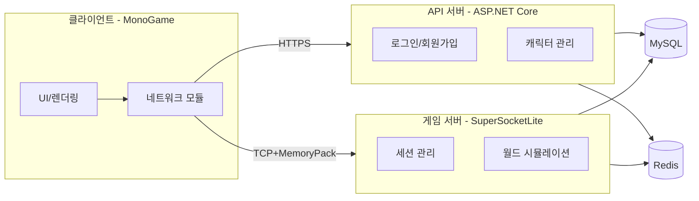
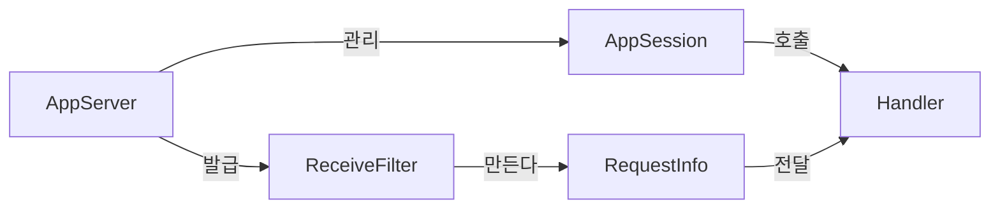

# 1주차 — 개발 환경 구축 & 기본 통신

## 0. 이번 주에 풀고 싶은 문제
게임 서버를 만든다는 말은 듣기에는 거창하지만, 실제로 첫 일주일에 해야 하는 일은 "두 프로그램이 서로 글자 한 줄을 주고받게 만드는 것"이다. 1주차의 목표는 단 두 가지이다.

1. **환경**: Visual Studio, MySQL, Redis가 내 컴퓨터에서 정상적으로 돌아가게 만든다.
2. **첫 통신**: SuperSocketLite로 만든 TCP 서버에 클라이언트가 붙어서 패킷 한 개를 주고받는다.

이 두 가지를 손에 익히고 나면, 2주차부터 그 위에 살을 붙여 가는 작업이 한결 가벼워진다. 반대로 이 두 가지가 흔들리면 뒤의 7주가 통째로 흔들린다. 그래서 1주차는 "최대한 적은 코드로, 최대한 많은 의문을 해소하고 가는" 주차이다.

## 1. 게임 서버라는 시스템

### 1.1 웹 서버와 무엇이 다른가
흔히 만들어 본 웹 서버를 떠올려 보면 된다. 클라이언트가 요청을 한 번 던지면 서버가 한 번 답을 한다. 끝나면 연결이 닫힌다. 이런 모델을 **요청-응답 모델**이라고 부른다.

게임 서버는 다르다. 한 번 연결되면 그 연결을 게임이 끝날 때까지 끊지 않는다. 이 연결 위로 1초에도 수십 개의 패킷이 양방향으로 오간다. 클라이언트가 보내는 "방금 W 키를 눌렀다"라는 메시지, 서버가 보내는 "옆 사람이 너의 5미터 옆에 나타났다"라는 메시지가 한 줄의 TCP 통로를 같이 쓴다.

```
[웹 서버]
Client  ──GET /api/users──▶  Server
Client  ◀───200 OK──────────  Server
       (연결 종료)

[게임 서버]
Client  ──접속 요청──▶  Server
        ◀───접속 승인──
        ──위치 변경──▶
        ◀───주변 상태──
        ──공격 요청──▶
        ◀───데미지 결과──
        ... (수십 분~수 시간 유지)
```

이 차이가 왜 중요한가. 웹은 한 요청 안에서만 상태를 신경 쓰면 되지만, 게임은 한 사용자가 접속해 있는 동안 그 사용자에 대한 상태를 서버가 메모리에 들고 있어야 한다. 그래서 게임 서버 코드는 **"세션이라는 단위에 어떤 데이터를 어떻게 붙여 두느냐"** 가 항상 첫 번째 설계 주제이다.

### 1.2 우리가 만들 시스템의 큰 그림
8주 동안 만들 시스템은 세 개의 프로그램이 협력하는 구조이다.



세 프로그램의 역할은 깔끔하게 나뉜다.

- **API 서버**는 "한 번 했다가 끝나는 일"을 담당한다. 회원가입, 로그인, 캐릭터 생성처럼 RESTful 요청-응답이 어울리는 모든 일이 여기로 간다.
- **게임 서버**는 "오래 붙어 있어야 하는 일"을 담당한다. 캐릭터의 위치, 전투, 몬스터 AI처럼 상태를 들고 있어야 하는 모든 일이 여기로 간다.
- **클라이언트**는 두 서버를 골라 가며 쓴다. 로그인 단계에서는 API 서버를 두드리고, 게임이 시작되면 게임 서버에 TCP 연결을 연다.

이렇게 나누는 이유는 단순하다. 두 서버는 부하의 성격이 다르기 때문에 운영도, 스케일링도 다르게 해야 한다. API 서버는 가로로 늘리기 쉽지만, 게임 서버는 세션 상태 때문에 가로로 늘리는 것이 까다롭다. 처음부터 분리해 두면 나중에 운영이 편해진다.

### 1.3 왜 SuperSocketLite인가
C#으로 TCP 서버를 만든다고 하면 대안이 적지 않다. `Socket` 클래스를 직접 다루거나, `TcpListener`를 쓰거나, ASP.NET Core의 Kestrel을 길들이거나, MagicOnion 같은 RPC 프레임워크를 쓸 수도 있다. 그중에서 [SuperSocketLite](https://github.com/jacking75/SuperSocketLite)를 고른 이유는 다음과 같다.

- **수업용으로 적당히 작다.** 코드를 따라가다 막히면 라이브러리 안쪽까지 직접 들여다볼 수 있다. 거대한 프레임워크는 마법이 너무 많아 학습용으로는 오히려 방해가 된다.
- **세션·필터·핸들러로 책임이 깔끔하게 나뉘어 있다.** "한 번 익혀 두면 다른 프레임워크에 옮겨 가도 같은 개념이 적용된다." 이 점이 학습의 진짜 자산이다.
- **실무 사용 사례가 충분히 있다.** 학습 후에도 그 지식을 회사에서 그대로 쓸 수 있다.

수업 내내 "이 부분은 라이브러리가 알아서 해 주니까 그냥 호출해라" 같은 설명을 최대한 줄일 것이다. 라이브러리가 우리를 위해 무엇을 해 주는지 명확히 알아야 그 위에서 안전한 코드를 짤 수 있다.
  

## 2. 환경 구축

### 2.1 설치 목록 한 번에 보기

| 도구 | 용도 | 권장 버전 |
|------|------|-----------|
| Visual Studio 2022 (Community) | C# IDE | 17.10 이상 |
| .NET SDK | 빌드/런타임 | .NET 8 LTS |
| MySQL Community Server | 영속 DB | 8.0.x |
| HeidiSQL 또는 MySQL Workbench | DB GUI | 최신 |
| Redis | 캐시/세션 | 7.x (Windows는 Memurai 또는 WSL) |
| RedisInsight | Redis GUI | 최신 |
| Git | 형상관리 | 최신 |

### 2.2 Visual Studio 워크로드
Visual Studio Installer에서 두 가지 워크로드를 함께 켠다.

- **ASP.NET 및 웹 개발** (API 서버용)
- **.NET 데스크톱 개발** (게임 서버 콘솔, 클라이언트용)

추가로 **개별 구성 요소**에서 ".NET 8.0 런타임"이 들어 있는지 확인한다.

### 2.3 MySQL 한 번에 잡기
MySQL은 처음 설치할 때 설정값을 잘못 만지면 두고두고 고생한다. 다음 두 가지만 신경 쓴다.

- **인증 방식**: `caching_sha2_password` 대신 `mysql_native_password`를 고른다. 클라이언트 라이브러리(MySqlConnector) 호환성이 더 좋다.
- **문자셋**: `utf8mb4` (이모지 포함 4바이트 UTF-8)로 설정한다. 게임에서 닉네임 이모지를 받으려면 필수이다.

설치 후 `mysql` CLI로 들어가 우리 프로젝트가 쓸 데이터베이스를 미리 만들어 둔다.

```sql
CREATE DATABASE mmorpg2d
  CHARACTER SET utf8mb4
  COLLATE utf8mb4_unicode_ci;

CREATE USER 'mmorpg'@'localhost' IDENTIFIED BY 'mmorpg!2026';
GRANT ALL PRIVILEGES ON mmorpg2d.* TO 'mmorpg'@'localhost';
FLUSH PRIVILEGES;
```

운영 환경에서 권한을 이렇게 통째로 주는 일은 없지만, 학습용이니 단순하게 간다. 비밀번호는 책에 나온 값 그대로 써도 좋고, 자기 만의 값으로 바꿔도 좋다. 단, **연결 문자열을 바꿀 때 반드시 같이 바꿔야 한다.**

### 2.4 Redis 잡기
Windows에서 Redis는 공식 지원이 없는데, 두 가지 방법이 있다.

1. **WSL2 + Ubuntu**에 `apt install redis-server`로 설치 — 가장 정석.
2. **Memurai** 또는 **Redis Stack for Windows**를 설치 — Windows 네이티브.

수업에서는 1번을 권한다. 나중에 운영 환경의 Linux와 가까운 환경에서 디버깅할 수 있다는 부수 효과까지 노리는 것이다.

설치 후 다음 명령으로 살아 있는지 확인한다.

```bash
redis-cli ping
# 응답으로 PONG 이 나오면 성공
```

### 2.5 패키지 매니저로 들어올 라이브러리들

NuGet으로 들여올 라이브러리는 다음과 같다. 1주차에서는 굵게 표시한 것만 쓴다. 나머지는 2주차 이후에 등장한다.

| 패키지 | 용도 | 등장 시점 |
|--------|------|-----------|
| **SuperSocketLite** | TCP 서버 프레임워크 | 1주차 |
| **MemoryPack** | 바이너리 직렬화 | 1주차 |
| **MySqlConnector** | MySQL 드라이버 | 1주차 |
| **SqlKata.Execution** | 쿼리 빌더 | 1주차 |
| **CloudStructures** | Redis 헬퍼 (Cysharp) | 1주차 |
| **ZLogger** 또는 Serilog | 구조화 로깅 | 1주차 |
| Microsoft.AspNetCore.* | API 서버 | 2주차 |
| BCrypt.Net-Next | 비밀번호 해싱 | 2주차 |
| MonoGame.Framework.WindowsDX | 클라이언트 렌더링 | 2주차 |

## 3. 솔루션 구조 잡기

### 3.1 왜 처음부터 4개의 프로젝트인가
1주차에는 사실상 GameServer 하나만 있어도 충분히 돌아간다. 그런데도 처음부터 4개 프로젝트(Shared, GameServer, ApiServer, Client)를 다 만들어 두는 이유는 두 가지이다.

1. **프로젝트 간 참조 관계**가 한 번 어긋나면 나중에 고치기 어렵다. 처음부터 깔끔하게 잡아 두면 그 뒤로 신경 쓸 일이 줄어든다.
2. **`Shared` 프로젝트의 존재**를 1주차부터 익혀 두면, "패킷 정의를 양쪽에 따로 적어 놓고 한쪽만 고쳐서 사고 나는" 흔한 실수를 막을 수 있다.

```
MMORPG2D.sln
├── MMORPG2D.Shared         ← 클래스 라이브러리, 다른 모두에서 참조
├── MMORPG2D.GameServer     ← 콘솔 앱
├── MMORPG2D.ApiServer      ← ASP.NET Core Web API (껍데기만)
└── MMORPG2D.Client         ← Windows 데스크톱 앱 (껍데기만)
```

`Shared`는 `using`으로 참조하는 쪽이고, 나머지 셋은 `Shared`를 참조하는 쪽이다. 양방향으로 참조하면 순환 참조가 되어 빌드가 망가지므로, "Shared는 누구도 참조하지 않는다"라는 규칙을 머릿속에 박아 둔다.

### 3.2 프로젝트 만들기
Visual Studio의 솔루션 생성 GUI를 클릭만으로 진행해도 좋고, dotnet CLI로 만들어도 좋다. CLI를 쓰면 다음과 같다.

```bash
mkdir MMORPG2D && cd MMORPG2D
dotnet new sln -n MMORPG2D

dotnet new classlib -n MMORPG2D.Shared -f net8.0
dotnet new console  -n MMORPG2D.GameServer -f net8.0
dotnet new webapi   -n MMORPG2D.ApiServer  -f net8.0
dotnet new winexe   -n MMORPG2D.Client     -f net8.0

dotnet sln add **/*.csproj

dotnet add MMORPG2D.GameServer reference MMORPG2D.Shared
dotnet add MMORPG2D.ApiServer  reference MMORPG2D.Shared
dotnet add MMORPG2D.Client     reference MMORPG2D.Shared
```

CLI를 쓰지 않아도 되지만, 읽어 보는 것은 가치가 있다. 솔루션이라는 것이 단순히 "프로젝트 4개를 묶은 텍스트 파일"이라는 사실, 프로젝트 참조라는 것이 `.csproj`에 한 줄을 추가하는 일이라는 사실을 알게 되면 IDE가 마법처럼 보이지 않는다.
  

## 4. 패킷이라는 것

### 4.1 패킷의 정의
게임 서버 세계에서 "패킷"이라는 단어는 두 가지 의미로 쓰인다.

- **TCP 패킷** — 운영체제 수준에서 네트워크를 흐르는 바이트 덩어리. 우리가 직접 다룰 일은 거의 없다.
- **응용 계층 패킷** — 우리 게임이 정의하는 메시지의 단위. "이동했다", "공격했다" 같은 한 사건을 나타낸다.

이 책에서 "패킷"이라고 하면 두 번째를 가리킨다. 이 패킷은 다음 세 부분으로 이루어진다.

```
┌────────┬────────┬────────────────────────┐
│ Length │ PktId  │ Body (직렬화된 데이터)  │
│ 2바이트 │ 2바이트 │  N바이트                │
└────────┴────────┴────────────────────────┘
```

- **Length**: 이 패킷의 전체 길이 (헤더 포함). 이 값을 보고 "어디까지가 한 패킷인가"를 판별한다.
- **PktId**: 이 패킷이 어떤 종류의 메시지인가. 정수 enum으로 관리한다.
- **Body**: 실제 데이터. 우리는 MemoryPack으로 직렬화한다.

### 4.2 왜 Length가 필요한가 — TCP의 결정적 함정
TCP는 **스트림 프로토콜**이다. UDP는 메시지 단위로 끊겨서 도착하지만, TCP는 그저 바이트가 순서대로 도착한다는 것만 보장한다. 그래서 클라이언트가 한 번에 `Send(packet1)`을 호출했다고 해서 서버가 한 번의 `Receive`로 그 패킷을 통째로 받는다는 보장이 없다.

```
[클라이언트가 한 번에 보냄]                  
[A][B][C][D][E][F]                         

[서버가 받을 가능성 1]
Receive 1: [A][B][C]
Receive 2: [D][E][F]

[서버가 받을 가능성 2]
Receive 1: [A][B][C][D][E][F]

[서버가 받을 가능성 3 — 두 패킷 합쳐짐]
Receive 1: [A][B][C][D][E][F][G][H][I][J]
                              ↑ 여기서부터 다음 패킷이 묻어 옴
```

이 현상을 흔히 **"패킷이 잘리고 붙는다"** 라고 부른다. 그래서 응용 계층은 "내가 보낸 한 패킷이 어디서 끝나는가"를 스스로 알 방법이 필요하다. 가장 흔한 답이 **앞에 길이 필드를 붙이는 것**이다. 서버는 먼저 길이를 읽고, 길이만큼 더 읽고, 그것을 한 패킷으로 본다.

SuperSocketLite는 이 작업을 `IReceiveFilter`라는 이름으로 추상화해 놓았다. 우리가 할 일은 "이 4바이트짜리 헤더는 이런 모양이다"라고 알려 주는 것뿐이다.
  
### 4.3 왜 MemoryPack인가
직렬화 라이브러리는 시중에 적지 않다. JSON, MessagePack, Protocol Buffers, FlatBuffers, MemoryPack...

- **JSON**: 사람이 읽기 좋고 디버깅하기 편하다. 그러나 게임 서버에는 너무 크고 느리다. 한 번 보낼 때마다 따옴표와 키 이름까지 같이 보내기 때문이다.
- **Protocol Buffers**: 매우 검증된 표준이지만 .proto 파일을 따로 관리해야 한다.
- **MemoryPack**: C# 전용에 가깝다는 단점이 있지만, 우리는 양쪽 다 C#이라 문제가 없다. 코드 생성이 빌드 시점에 완료되고, 런타임 리플렉션이 없어 가장 빠른 부류에 속한다.

이 책에서는 MemoryPack을 쓴다. `[MemoryPackable]` 한 줄과 `partial` 한 단어만 붙이면 알아서 직렬화 코드가 만들어진다. 학습 부담이 가장 가볍다.
  
  
## 5. Shared 프로젝트 — 패킷 정의
`MMORPG2D.Shared` 프로젝트의 역할은 단 하나, "서버와 클라이언트가 똑같이 알아야 하는 모든 것"을 모아 두는 것이다. 1주차에는 패킷 ID enum과 에코용 패킷 두 개만 정의한다.

### 5.1 패킷 ID 정책
패킷 ID는 한 번 발급한 뒤로는 절대 다른 의미로 재사용하지 않는다는 규칙이 중요하다. 운영 중 클라이언트와 서버 버전이 일시적으로 어긋나는 일이 자주 생기는데, 같은 ID가 다른 의미를 갖게 되면 디버깅이 거의 불가능해진다.

```csharp
public enum PacketId : ushort
{
    // 1000번대: 인증/세션
    ReqLogin = 1001,
    ResLogin = 1002,

    // 9000번대: 디버그/에코
    ReqEcho = 9001,
    ResEcho = 9002,
}
```

대역을 비워 두는 이유는 "도메인이 같은 패킷은 같은 100단위에 모아 두기" 위해서이다. 나중에 7주차쯤 가면 패킷 ID가 50개를 넘는데, 대역으로 묶여 있지 않으면 코드 리뷰가 지옥이 된다.

### 5.2 에코 패킷 두 개

```csharp
[MemoryPackable]
public partial class ReqEcho
{
    public string Message { get; set; } = "";
}

[MemoryPackable]
public partial class ResEcho
{
    public string Message { get; set; } = "";
    public long ServerTimeUtcMs { get; set; }
}
```

핵심 포인트만 짚는다.

- **`[MemoryPackable]` + `partial`**: 빌드 시점에 MemoryPack이 직렬화/역직렬화 코드를 자동으로 생성한다. 우리는 새 필드를 추가하기만 하면 된다.
- **`partial`이 빠지면 빌드 에러가 난다.** 이유는 자동 생성된 코드가 같은 클래스에 합쳐져야 하기 때문이다.
- **`ServerTimeUtcMs`**: 서버 시계로 응답한 시각. 클라이언트는 이 값을 자기 시계와 빼서 RTT(왕복 시간)와 시간 보정에 쓸 수 있다. 1주차의 디버깅 도구로도 충분히 유용하다.

### 5.3 패킷 헤더 인코딩 헬퍼
게임 서버는 패킷을 만들 때 항상 같은 작업을 한다.

1. Body를 직렬화한다.
2. Body 길이 + 헤더 길이를 합쳐 Length 필드를 채운다.
3. PktId를 채운다.
4. 만들어진 byte[]를 보낸다.

이 작업을 매번 손으로 적으면 헤더 형식이 군데군데 어긋나면서 디버깅에 시간을 쏟게 된다. 그래서 `PacketEncoder`라는 정적 클래스 하나를 두고, 모든 송신 코드는 이 클래스를 거치도록 한다.

```csharp
public static class PacketEncoder
{
    public const int HeaderSize = 4;

    public static byte[] Encode<T>(PacketId id, T body)
    {
        var bodyBytes = MemoryPackSerializer.Serialize(body);
        var total = HeaderSize + bodyBytes.Length;
        var buf = new byte[total];

        // Length (2바이트, little-endian)
        BinaryPrimitives.WriteUInt16LittleEndian(buf.AsSpan(0, 2), (ushort)total);
        // PacketId (2바이트, little-endian)
        BinaryPrimitives.WriteUInt16LittleEndian(buf.AsSpan(2, 2), (ushort)id);
        // Body
        bodyBytes.CopyTo(buf.AsSpan(HeaderSize));

        return buf;
    }
}
```

이 코드에서 흥미로운 결정 두 가지를 짚어 둔다.

- **little-endian**을 못 박는다. 코드가 도는 환경(x86/x64/ARM64)이 모두 little-endian이긴 하지만, 명시적으로 LittleEndian을 쓰면 새 환경에서도 호환된다는 보장이 생긴다. `BitConverter`처럼 시스템 의존적인 메서드는 피한다.
- **새 byte[] 할당.** 학습용이라 단순화한 것이다. 실무에서는 `ArrayPool<byte>`로 풀에서 빌려와 복사 횟수를 줄이는 패턴을 쓰는데, 8주차 최적화 단계에서 이 코드를 다시 들여다본다.
  

## 6. SuperSocketLite로 서버 만들기

### 6.1 큰 그림
SuperSocketLite의 서버 코드는 다음 4개의 부품으로 이루어진다.



- **AppServer**: 서버 그 자체. 포트를 열고 새 연결을 받는다.
- **AppSession**: 한 클라이언트와의 연결. 클라이언트가 100명 있으면 세션도 100개이다.
- **ReceiveFilter**: 들어온 바이트 스트림을 보고 "여기까지가 한 패킷이다"라고 잘라 주는 부품. 우리가 4.2에서 이야기한 길이 헤더 파싱이 여기 있다.
- **RequestInfo**: 잘라진 한 패킷의 도메인 객체. PktId, Body 바이트 배열 등을 담는다.

세션마다 ReceiveFilter가 하나씩 따라붙고, 한 패킷이 완성될 때마다 우리가 등록한 핸들러가 불린다.
  
### 6.2 ReceiveFilter — 패킷 자르기
`ReceiveFilter`는 `FixedHeaderReceiveFilter<TRequestInfo>`를 상속해 만든다. 이름에서 짐작되듯, 이 필터는 "고정 길이 헤더를 먼저 읽고, 헤더 안의 길이 정보로 본문 길이를 결정한다"라는 패턴을 구현해 준다. 우리가 채워야 할 메서드는 두 개뿐이다.

- `GetBodyLengthFromHeader(...)`: 헤더 4바이트를 받아서 Body 길이를 돌려준다.
- `ResolveRequestInfo(...)`: 헤더 + Body를 받아 RequestInfo 객체로 변환한다.

```csharp
public class GamePacketFilter : FixedHeaderReceiveFilter<GameRequestInfo>
{
    public GamePacketFilter() : base(headerSize: 4) { }

    protected override int GetBodyLengthFromHeader(byte[] header, int offset, int length)
    {
        var total = BinaryPrimitives.ReadUInt16LittleEndian(header.AsSpan(offset, 2));
        return total - 4;  // 본문 길이 = 총 길이 - 헤더 4
    }

    protected override GameRequestInfo ResolveRequestInfo(
        ArraySegment<byte> header, byte[] bodyBuffer, int offset, int length)
    {
        var pktId = BinaryPrimitives.ReadUInt16LittleEndian(
            header.Array!.AsSpan(header.Offset + 2, 2));
        var body = new byte[length];
        Buffer.BlockCopy(bodyBuffer, offset, body, 0, length);
        return new GameRequestInfo((PacketId)pktId, body);
    }
}
```

여기서 짚을 점은 `Buffer.BlockCopy`이다. SuperSocketLite는 내부적으로 큰 버퍼를 재사용한다. `bodyBuffer`라는 배열은 다음 패킷을 위해 다시 쓰일 수 있는 공유 공간이다. 우리가 그 메모리를 그대로 들고 있으면, 다음 수신이 일어났을 때 우리 데이터가 덮어 써진다. 그래서 **항상 복사본을 만들어 들고 있는다.** 이 한 줄을 빠뜨려서 며칠을 디버깅한 사례가 매우 흔하다.

### 6.3 AppSession — 연결 한 개의 컨텍스트
세션은 한 클라이언트의 모든 정보가 모이는 곳이다. 1주차에는 거의 비어 있어도 되지만, 다음 주부터 여기에 캐릭터 ID, 위치, 인증 토큰 등이 차곡차곡 붙는다.

```csharp
public class GameSession : AppSession<GameSession, GameRequestInfo>
{
    public long AccountId { get; set; }       // 2주차에 채움
    public long CharacterId { get; set; }     // 3주차에 채움

    public void Send(PacketId id, IMemoryPackable body)
    {
        var bytes = PacketEncoder.Encode(id, body);
        Send(bytes, 0, bytes.Length);
    }
}
```

- **`Send(PacketId, IMemoryPackable)`** 형태의 헬퍼를 만들어 두면, 핸들러 코드가 매우 깔끔해진다. `session.Send(PacketId.ResEcho, res);` 한 줄로 끝난다.
- **세션 자체에 게임 상태를 두는 것에 대해서는 절제가 필요하다.** 1주차에는 `AccountId`/`CharacterId` 정도만 들어 있어야 한다. 4주차 이후 세션 위에 너무 많은 상태가 쌓이면 동시성 사고가 나기 시작한다. 이때를 대비해 "세션은 식별자만 들고, 진짜 상태는 월드/캐릭터 객체로 분리한다"라는 원칙을 일찍 배워 둔다.

### 6.4 AppServer — 서버 본체

```csharp
public class GameServer : AppServer<GameSession, GameRequestInfo>
{
    public GameServer()
        : base(new DefaultReceiveFilterFactory<GamePacketFilter, GameRequestInfo>())
    {
        NewSessionConnected += s =>
            Logger.Info($"[+] {s.SessionID} from {s.RemoteEndPoint}");
        SessionClosed += (s, reason) =>
            Logger.Info($"[-] {s.SessionID} closed ({reason})");
    }
}
```

`DefaultReceiveFilterFactory`는 새 세션이 만들어질 때마다 `GamePacketFilter`를 새로 하나씩 만들어 그 세션에 묶어 준다. 필터에는 "지금까지 읽다가 만 헤더" 같은 상태가 들어 있기 때문에 절대 세션 사이에 공유하면 안 된다.

### 6.5 핸들러 디스패치
들어온 패킷을 어떻게 핸들러로 보낼 것인가. 가장 단순하게는 `switch` 문을 한 번 쓰는 방법이고, 가장 복잡하게는 attribute 기반 자동 등록이다. 1주차에는 단순한 dictionary 한 개로 시작한다.

```csharp
public class PacketHandler
{
    private readonly Dictionary<PacketId, Action<GameSession, byte[]>> _map = new();

    public void Register(PacketId id, Action<GameSession, byte[]> action)
        => _map[id] = action;

    public void Dispatch(GameSession session, GameRequestInfo req)
    {
        if (_map.TryGetValue(req.PacketId, out var act))
            act(session, req.Body);
        else
            Logger.Warn($"unknown packet {req.PacketId}");
    }
}
```

이 단순함이 가져다주는 이득은 두 가지이다.

1. 패킷 핸들러가 어디서 도는지 한눈에 보인다.
2. 새 패킷을 등록할 때 마법이 없다 — `Register(...)` 한 줄.

물론 패킷이 50개를 넘으면 이 패턴이 길어진다. 8주차에서 attribute로 정리하는 방법을 다룬다.

### 6.6 에코 핸들러 한 개

```csharp
private static void OnReqEcho(GameSession s, byte[] body)
{
    var req = MemoryPackSerializer.Deserialize<ReqEcho>(body)!;
    var res = new ResEcho
    {
        Message = req.Message,
        ServerTimeUtcMs = DateTimeOffset.UtcNow.ToUnixTimeMilliseconds()
    };
    s.Send(PacketId.ResEcho, res);
}
```

이 핸들러는 약 한 줄로 끝나지만 중요한 패턴이 들어 있다.

- **역직렬화 결과는 nullable이다.** `Deserialize<ReqEcho>(body)!`의 `!`는 "절대 null 아니다"라고 단언한 것이다. 학습용 코드에서는 이렇게 단언해도 좋지만, 운영 코드에서는 null 체크와 에러 패킷 응답을 따로 한다.
- **응답에 시각이 들어 있다.** 디버깅 용도로도 좋고, 4주차에 시간 동기화를 다룰 때 다시 쓴다.

### 6.7 Program.cs — 시동 걸기

```csharp
var server = new GameServer();
var setup = server.Setup(new RootConfig(),
    new ServerConfig { Port = 7777, Ip = "Any" });

if (!setup) { Console.WriteLine("setup failed"); return; }

var handler = new PacketHandler();
handler.Register(PacketId.ReqEcho, OnReqEcho);

server.NewRequestReceived += (s, req) => handler.Dispatch(s, req);
server.Start();

Console.WriteLine("server started on 7777. press Ctrl+C to quit.");
await Task.Delay(-1);
```

- **`await Task.Delay(-1)`**: 메인 스레드를 무한정 대기시키는 가장 간단한 방법. SuperSocketLite는 자체 스레드 풀에서 모든 일을 처리하므로 메인 스레드는 아무 일도 안 하고 대기만 하면 된다.
- **Ctrl+C 처리**: 학습 단계에서는 IDE의 정지 버튼으로 충분하지만, 운영 단계에서는 `AssemblyLoadContext.Default.Unloading`이나 `Console.CancelKeyPress`를 받아 graceful shutdown을 구현해야 한다. 8주차에서 다시 다룬다.
  

## 7. 미니 클라이언트 만들기
1주차의 클라이언트는 그래픽이 없다. 콘솔 앱 한 개로 충분하다. 목표는 "내가 만든 서버에 글자 한 줄을 보내고, 같은 글자를 받는다"이다. MonoGame UI는 2주차부터 등장한다.

### 7.1 클라이언트 측 송신 헬퍼
서버와 똑같은 PacketEncoder를 쓰면 된다(`Shared`에 있으니까). 송신은 `NetworkStream.WriteAsync`로 충분하다. 수신이 까다로운데, 서버처럼 ReceiveFilter를 직접 쓰지는 않고 가벼운 버전을 직접 만든다.

```csharp
async Task ReceiveLoop(NetworkStream ns, CancellationToken ct)
{
    var header = new byte[4];
    while (!ct.IsCancellationRequested)
    {
        await ReadExact(ns, header, 4, ct);
        var total = BinaryPrimitives.ReadUInt16LittleEndian(header);
        var pktId = (PacketId)BinaryPrimitives.ReadUInt16LittleEndian(header.AsSpan(2, 2));
        var body  = new byte[total - 4];
        await ReadExact(ns, body, body.Length, ct);

        Dispatch(pktId, body);
    }
}
```

핵심은 `ReadExact`이다. `NetworkStream.ReadAsync`는 요청한 바이트 수보다 적게 읽고 돌아올 수 있다. "정확히 N바이트를 다 읽을 때까지 반복 읽는" 함수를 만들어 두지 않으면, TCP의 부분 읽기에 그대로 노출된다.

```csharp
static async Task ReadExact(NetworkStream ns, byte[] buf, int len, CancellationToken ct)
{
    int total = 0;
    while (total < len)
    {
        var n = await ns.ReadAsync(buf.AsMemory(total, len - total), ct);
        if (n == 0) throw new EndOfStreamException("server closed");
        total += n;
    }
}
```

`n == 0`은 상대편이 정상 종료한 신호이다. 이 점을 잊으면 무한 루프에 빠진다.
  

## 8. DB와 Redis에 한 번씩 닿아 보기

### 8.1 SqlKata로 첫 쿼리
`MMORPG2D.GameServer`에서 시작 직후 한 번만 DB로 SELECT를 던져 본다. 진짜 게임 로직은 아니지만, "연결 문자열이 맞다"는 것을 확인하는 가장 빠른 방법이다.

```csharp
var conn = new MySqlConnector.MySqlConnection(connStr);
var compiler = new SqlKata.Compilers.MySqlCompiler();
using var db = new SqlKata.Execution.QueryFactory(conn, compiler);

var nowUtc = await db.SelectAsync<DateTime>(
    new SqlKata.Query().SelectRaw("UTC_TIMESTAMP()"));
Logger.Info($"DB ok. server utc = {nowUtc.First()}");
```

`SqlKata`는 "쿼리 빌더"이다. ORM과는 다른 부류이다. ORM은 SQL을 거의 안 쓰고 객체 그래프로 다루는 반면, 쿼리 빌더는 우리가 SQL의 모양을 그대로 들고 있되 문자열 연결의 위험을 없애 준다. 게임 서버처럼 쿼리 모양이 중요한 시스템에서는 쿼리 빌더가 자주 더 잘 맞는다.

### 8.2 CloudStructures로 Redis 한 번 두드리기

```csharp
var redis = new RedisConnection(new RedisConfig("local", "127.0.0.1:6379"));
var pingValue = new RedisString<string>(redis, "boot:hello", TimeSpan.FromMinutes(1));
await pingValue.SetAsync("server-on");
var v = await pingValue.GetAsync();
Logger.Info($"Redis ok. boot:hello = {v.Value}");
```

CloudStructures는 Redis의 자료형(String, Hash, List, Set 등) 하나하나를 C# 제네릭 타입으로 감싸 놓은 라이브러리이다. `RedisString<string>`이라는 한 줄에서 두 가지 사실을 알 수 있다.

- 이 키는 String 자료형이다.
- 들어가는 값은 `string` C# 타입이다.

이런 강타입 인터페이스는 Redis 명령어를 잘못 쓰는 사고를 빌드 시점에 막아 준다.
  

## 9. 실행과 확인

### 9.1 한 화면에 띄워 두기
서버와 클라이언트를 동시에 띄울 가장 편한 방법은 Visual Studio의 **다중 시작 프로젝트**이다. 솔루션 우클릭 → 속성 → "여러 시작 프로젝트"에서 GameServer와 Client를 모두 "시작"으로 지정한다. 실행 단축키 한 번에 둘 다 뜬다.

### 9.2 기대하는 출력

서버 콘솔:

```
[INFO] DB ok. server utc = 2026-04-26 02:00:00
[INFO] Redis ok. boot:hello = server-on
[INFO] server started on 7777. press Ctrl+C to quit.
[INFO] [+] 0a1b2c3d from 127.0.0.1:54321
[INFO] dispatch ReqEcho from 0a1b2c3d (msg='hello world')
[INFO] [-] 0a1b2c3d closed (ClientClosing)
```

클라이언트 콘솔:

```
> connecting to 127.0.0.1:7777 ... ok
> sending: hello world
< received ResEcho: 'hello world' (server time = 1745631312345)
> RTT = 3 ms
```

서버에서 한 번 출력된 패킷 ID, 클라이언트에서 한 번 받은 응답, 그리고 RTT가 한 자리 ms로 찍히면 1주차의 큰 산은 넘은 것이다.
  

## 10. 자주 막히는 곳

### 10.1 "패킷이 안 와요"
가장 흔한 두 가지 이유는 다음과 같다.

1. **방화벽**: Windows Defender가 Visual Studio에서 새로 만든 콘솔 앱을 처음 실행할 때 한 번씩 막는다. 다이얼로그가 뜨면 "허용"을 누르되, 안 떴다면 인바운드 규칙에서 7777 포트를 허용한다.
2. **루프백 vs 외부 IP**: `127.0.0.1:7777`로는 잘 되는데 같은 와이파이의 친구 노트북에서는 안 닿는 경우. 서버 `ServerConfig.Ip = "Any"`를 확인하고, 운영체제 방화벽도 본다.

### 10.2 "역직렬화 예외가 나요"
거의 100% 패킷 ID와 클래스가 안 맞는 경우이다. 클라이언트에서 보낸 패킷의 헤더 PktId가 서버에서 디스패치한 PktId와 다르면, 엉뚱한 클래스로 역직렬화하려다 폭발한다. enum 값을 한쪽에서 바꾸고 다른 쪽 빌드를 잊어서 생기기도 한다. **두 프로젝트 모두 `Shared`를 참조한다는 사실**이 이 사고의 80%를 줄인다.

### 10.3 "DB 비밀번호가 이상해요"
연결 문자열을 GitHub에 그대로 푸시하지 않도록 처음부터 `appsettings.Development.json`을 `.gitignore`에 넣어 둔다. 1주차부터 이 습관을 들이지 않으면 학기 끝날 때 이미 늦다.
  

## 11. 1주차 마무리
이 주가 끝나는 시점에 다음 체크리스트가 모두 ✓이면 된다.

- [ ] Visual Studio + .NET 8 SDK가 설치되어 있다.
- [ ] MySQL과 Redis가 설치되어 있고, `mysql -u mmorpg -p`와 `redis-cli ping`이 둘 다 성공한다.
- [ ] 4개 프로젝트로 된 솔루션이 빌드된다.
- [ ] 서버를 실행하면 7777 포트에서 듣는다는 메시지가 콘솔에 뜬다.
- [ ] 클라이언트가 서버에 붙어 에코 패킷을 주고받는다.
- [ ] 서버가 시작될 때 DB와 Redis에 한 번씩 닿아 ok 메시지를 출력한다.
  

## 12. 연습 문제
다음 주에 들어가기 전에 손에 익혀 두면 좋은 과제들이다.

1. **에코 패킷에 `EchoCount` 필드를 추가하라.** 클라이언트가 같은 메시지를 N번 보냈을 때 서버가 그 N을 응답에 같이 실어 주도록 만들면 된다. 패킷 정의를 양쪽 어디서 고치는지를 직접 확인하라.
2. **에코 패킷을 1초에 100번 보내는 클라이언트를 만들어라.** 서버 로그가 어떤 형태로 찍히는지, 또 RTT가 어떤 분포를 갖는지 관찰하라. 1주차의 성능 수준이 어느 정도인지 감을 잡아 두면 8주차의 최적화가 와닿는다.
3. **두 클라이언트가 동시에 붙도록 만들어라.** SessionID가 다르게 발급되는 것을 확인하고, 서버 로그에서 두 세션의 입출력이 뒤섞이는 모습을 본다. 4주차에 다룰 동시성 문제의 첫인상을 미리 만난다.


## 13. 다음 주 예고
2주차에서는 가장 먼저 `MMORPG2D.ApiServer`를 깨운다. ASP.NET Core Web API 위에 회원가입과 로그인을 올리고, 로그인이 성공하면 **임시 토큰**을 발급해 Redis에 저장한다. 이 토큰은 3주차에서 게임 서버가 새 접속을 받아들일지 결정할 때 쓰인다. 그리고 클라이언트에 MonoGame을 처음 등장시켜 로그인/캐릭터 선택 화면 UI까지 올린다.  