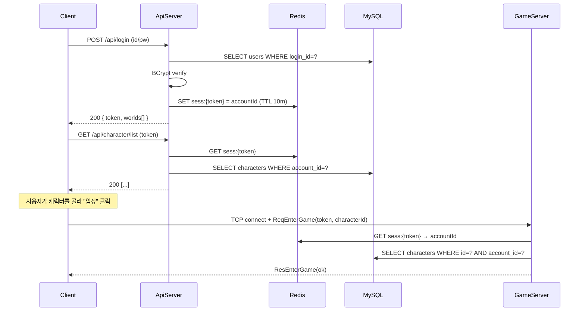
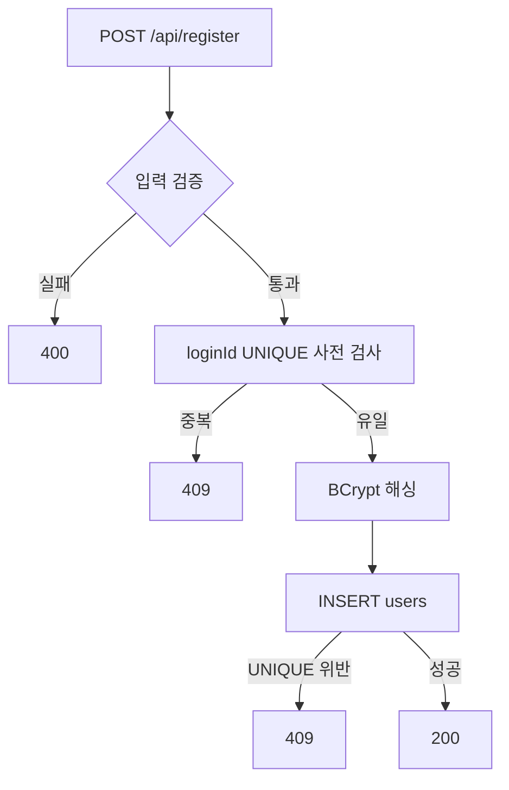

# 2주차 — API 서버 & 계정/캐릭터 시스템

## 0. 이번 주에 풀고 싶은 문제

1주차에서 게임 서버에 패킷을 던져 보았다. 그러나 게임 시스템에는 "한 번 하고 끝나는 일"도 잔뜩 있다. 회원가입, 로그인, 캐릭터 생성이 그렇다. 이런 일을 게임 서버에 같이 얹는 것은 모범적인 방법이 아니다. 게임 서버는 한 번 떠 있으면 수 시간을 끊김 없이 돌려야 하는데, 회원가입 같은 한 번짜리 트래픽이 같은 프로세스 안에서 일어나면 운영이 복잡해진다.

이번 주는 ASP.NET Core Web API 서버를 새로 깨워, "한 번짜리 일"을 모두 그쪽으로 옮긴다. 그리고 클라이언트는 이번 주에 처음으로 MonoGame 위에 올라가서, 로그인 → 월드 선택 → 캐릭터 생성 → 캐릭터 선택의 플로우를 사람이 클릭할 수 있는 화면으로 만든다.

이번 주가 끝나면 사용자는 게임 서버에는 아직 들어갈 수 없지만, **로그인 토큰을 손에 쥔 채 캐릭터를 한 명 만들어 둘 수 있는 상태**가 된다. 다음 주에 이 토큰을 들고 게임 서버 문을 두드린다.

## 1. 두 서버 분리의 이유 다시 짚기

### 1.1 게임 서버에 모든 것을 합치면

쉬운 방법이긴 하다. TCP 연결 한 개로 모든 것을 다 처리하면 된다. 그러나 다음 문제들이 단계적으로 따라온다.

- **장애 격리가 안 된다.** 회원가입 폭주(이벤트, 신규 출시 직후)가 있으면, 게임 서버가 그 부하를 같이 받는다. 이미 게임을 하고 있는 다른 사용자의 핑이 튀거나, 최악에는 OOM이 난다.
- **확장 정책이 다르다.** 회원가입은 stateless에 가까워서 무한히 가로로 늘릴 수 있다. 게임 서버는 한 사용자가 한 인스턴스에 묶이는 sticky 구조라서 가로로 늘리는 것이 까다롭다. 이 둘을 한 프로세스에 두면 양쪽의 단점만 모인다.
- **배포 주기가 다르다.** 회원가입 코드는 잠깐 내려도 사용자가 화내지 않는다(자정에 5초 점검). 그러나 게임 서버는 한 번 내리면 모든 사용자가 튕긴다. 둘이 같은 빌드라면 회원가입 코드 한 줄을 고쳐도 게임 서버를 재시작해야 한다.

이 셋만으로도 분리할 충분한 이유가 된다. 그래서 이 책의 시스템은 처음부터 끝까지 두 서버 구조를 유지한다.

### 1.2 두 서버는 어떻게 만나는가



두 서버 사이의 다리는 **Redis에 저장된 토큰**이다. API 서버가 인증 결과를 Redis에 적어 두면, 게임 서버는 그 Redis만 읽어 보고 "이 사용자는 진짜 로그인 했구나"라고 알 수 있다. 게임 서버가 DB로 직접 비밀번호를 검증하지 않는 이유는 두 가지이다.

1. **검증 책임이 분산되면 보안 사고가 일어난다.** 비밀번호 검증 로직은 한 곳에만 있어야 한다.
2. **DB 부하의 경로를 단순하게 유지하기 위해**이다. 게임 서버는 HOT path(매 프레임 도는 코드)에 있어야 할 시스템이라 DB 호출 빈도를 의식적으로 줄여야 한다.

## 2. DB 스키마

이번 주에 새로 만드는 테이블은 세 개이다. 모두 영속(persistent) 데이터이므로 MySQL에 들어간다.

```sql
CREATE TABLE users (
    id            BIGINT      NOT NULL AUTO_INCREMENT PRIMARY KEY,
    login_id      VARCHAR(32) NOT NULL UNIQUE,
    pw_hash       VARCHAR(72) NOT NULL,             -- BCrypt 해시 (최대 60바이트 + 여유)
    created_at    DATETIME    NOT NULL DEFAULT CURRENT_TIMESTAMP,
    last_login_at DATETIME    NULL
) ENGINE=InnoDB CHARSET=utf8mb4;

CREATE TABLE worlds (
    id           INT         NOT NULL PRIMARY KEY,
    name         VARCHAR(32) NOT NULL,
    is_open      TINYINT(1)  NOT NULL DEFAULT 1,
    capacity     INT         NOT NULL DEFAULT 200
) ENGINE=InnoDB CHARSET=utf8mb4;

CREATE TABLE characters (
    id           BIGINT      NOT NULL AUTO_INCREMENT PRIMARY KEY,
    account_id   BIGINT      NOT NULL,
    world_id     INT         NOT NULL,
    name         VARCHAR(16) NOT NULL UNIQUE,
    level        INT         NOT NULL DEFAULT 1,
    exp          BIGINT      NOT NULL DEFAULT 0,
    pos_x        INT         NOT NULL DEFAULT 400,
    pos_y        INT         NOT NULL DEFAULT 300,
    created_at   DATETIME    NOT NULL DEFAULT CURRENT_TIMESTAMP,
    INDEX idx_chars_account (account_id),
    CONSTRAINT fk_chars_user  FOREIGN KEY (account_id) REFERENCES users(id),
    CONSTRAINT fk_chars_world FOREIGN KEY (world_id)   REFERENCES worlds(id)
) ENGINE=InnoDB CHARSET=utf8mb4;

INSERT INTO worlds (id, name, capacity) VALUES
  (1, '평원',   200),
  (2, '동굴',   100);
```

### 2.1 설계 결정 메모

- **`login_id` UNIQUE**: 회원가입 시 동시 생성 충돌은 DB가 마지막 방어선이 된다. 우리는 application 코드에서도 미리 검사하지만, 두 사용자가 정확히 같은 시각에 `INSERT`하면 검사를 빠져나갈 수 있다. UNIQUE 제약은 그때 둘 중 하나를 안전하게 거절한다.
- **`pw_hash VARCHAR(72)`**: BCrypt 해시는 60자(round + salt + hash)로 정해져 있는데 여유분을 두었다. SHA-256 평문 저장이 아니라 **BCrypt**를 고른 이유는 일부러 느린 알고리즘이 무차별 대입에 더 강하기 때문이다.
- **`worlds`는 미리 INSERT**: 학습용에서는 서비스 운영처럼 어드민 도구가 없으므로, 부팅 시점에 두 개의 월드가 항상 있다고 가정한다. 4주차의 서버 분산 이야기와 연결된다.
- **`characters.name UNIQUE`**: 같은 이름의 캐릭터가 여러 명이면 다른 사용자가 봤을 때 누가 누구인지 모른다.
- **`pos_x/pos_y INT`**: 2D 좌표를 정수로 둔다. 학습용 단순화이다. 실무에서는 보통 float로 두고 서버가 충돌 검증을 한다. 우리 기획에서는 800×600 맵 안에서 격자 단위로 움직이게 만들 것이라 정수로 충분하다.

## 3. ApiServer 프로젝트 깨우기

1주차의 `MMORPG2D.ApiServer`는 placeholder만 있는 상태였다. 이번 주에 의존 라이브러리와 코드 골격을 채운다.

### 3.1 폴더 구조

```
MMORPG2D.ApiServer/
├── MMORPG2D.ApiServer.csproj
├── Program.cs
├── appsettings.json
├── Controllers/
│   ├── AuthController.cs
│   ├── WorldController.cs
│   └── CharacterController.cs
├── Models/
│   ├── DbDtos.cs
│   └── ApiDtos.cs
├── Services/
│   ├── AuthService.cs
│   ├── WorldService.cs
│   ├── CharacterService.cs
│   └── PasswordHasher.cs
└── Infrastructure/
    ├── DbConnectionFactory.cs
    └── RedisProvider.cs
```

폴더 구조에서 두 가지 원칙이 보인다.

1. **컨트롤러는 얇다.** HTTP의 모양만 다루고, 도메인 로직은 Service로 위임한다.
2. **Infrastructure는 따로 빠진다.** DB 커넥션, Redis 같은 외부 의존을 한곳에 모아 두면 단위 테스트와 모킹이 수월해진다.

### 3.2 의존성 주입 (DI)

ASP.NET Core의 강점 중 하나가 DI 컨테이너이다. `Program.cs`에서 한 번에 등록한다.

```csharp
builder.Services.AddSingleton<DbConnectionFactory>(sp => new DbConnectionFactory(connStr));
builder.Services.AddSingleton<RedisProvider>(sp => new RedisProvider(redisConnStr));
builder.Services.AddSingleton<PasswordHasher>();
builder.Services.AddScoped<AuthService>();
builder.Services.AddScoped<WorldService>();
builder.Services.AddScoped<CharacterService>();
```

핵심은 **수명(lifetime)** 의 선택이다.

- `DbConnectionFactory`, `RedisProvider`, `PasswordHasher` — **Singleton**: 무거운 객체를 매 요청마다 새로 만들 이유가 없다.
- `AuthService` 등 — **Scoped**: 한 HTTP 요청 안에서만 살고 사라진다. `HttpContext`나 `IDbConnection`처럼 요청 단위로 생명주기를 가져야 하는 자원과 잘 맞는다.

`Transient`는 거의 쓰지 않는다. 매 호출마다 새로 만든다는 뜻인데, 우리 코드 베이스에서는 그럴 일이 없다.

## 4. 비밀번호 해싱

### 4.1 왜 BCrypt 인가

해싱 알고리즘 선택지가 여럿이다.

- **SHA-256, SHA-512**: 빠르다. 패스워드 해싱에는 그 빠름이 단점이다. GPU로 1초에 수십억 번 계산이 가능해 무차별 대입에 약하다.
- **BCrypt**: round 수를 조정해 일부러 느리게 만든다. 표준 round 12에서 한 번 검증에 약 200ms가 걸리도록 튜닝되어 있다.
- **scrypt, Argon2**: BCrypt보다 더 최신이다. 메모리도 같이 잡아먹어 GPU 공격에 더 강하다. 그러나 라이브러리 선택지가 좁아 학습용으로는 BCrypt가 무난하다.

### 4.2 PasswordHasher 클래스

```csharp
public class PasswordHasher
{
    private const int WorkFactor = 11;   // 2^11 round

    public string Hash(string plain)
        => BCrypt.Net.BCrypt.HashPassword(plain, WorkFactor);

    public bool Verify(string plain, string hash)
        => BCrypt.Net.BCrypt.Verify(plain, hash);
}
```

- **WorkFactor**: 하드웨어가 빨라질수록 키워야 한다. 11이면 한 번 검증에 100ms 정도 걸린다. 200ms를 넘으면 사용자에게 체감 지연이 생기므로 균형점을 잡는다.
- **`Verify`**: 입력 평문을 같은 salt와 round로 해시해서 비교한다. 결과 비교는 timing-safe하게 BCrypt 라이브러리가 알아서 처리해 준다.

## 5. 회원가입과 로그인

### 5.1 회원가입 — 동시 가입 방지

회원가입 컨트롤러는 다음 순서로 동작한다.



사전 검사를 한 번 더 하는 이유는 사용자에게 빠른 피드백을 주기 위해서이다. UNIQUE 제약만으로도 정확성은 보장되지만, 그러면 200ms짜리 BCrypt를 헛수고로 한 번 더 돌리게 된다. 사전 검사를 통과한 뒤에 BCrypt를 돌리면 일반 케이스에서 비용이 절약된다.

```csharp
public async Task<RegisterResult> RegisterAsync(string loginId, string pw)
{
    using var db = _factory.Create();
    var exists = await db.Query("users").Where("login_id", loginId).ExistsAsync();
    if (exists) return RegisterResult.Conflict;

    var hash = _hasher.Hash(pw);
    try
    {
        await db.Query("users").InsertAsync(new { login_id = loginId, pw_hash = hash });
        return RegisterResult.Ok;
    }
    catch (MySqlException ex) when (ex.Number == 1062)  // duplicate key
    {
        return RegisterResult.Conflict;
    }
}
```

`MySqlException.Number == 1062`는 "Duplicate entry"이다. UNIQUE 제약 위반은 예외로 올라오는데, 이 에러 번호로 분기하지 않으면 다른 종류의 DB 에러까지 같이 무음 처리할 위험이 있다. **에러 번호로 좁혀 받기**는 안전한 패턴이다.

### 5.2 로그인 — 토큰 발급

```csharp
public async Task<LoginResult> LoginAsync(string loginId, string pw)
{
    using var db = _factory.Create();
    var user = await db.Query("users")
        .Where("login_id", loginId)
        .FirstOrDefaultAsync<UserRow>();

    if (user == null || !_hasher.Verify(pw, user.PwHash))
        return LoginResult.Fail("invalid id or password");

    var token = Guid.NewGuid().ToString("N");
    var sess = new RedisString<long>(_redis.Conn, $"sess:{token}", TimeSpan.FromMinutes(10));
    await sess.SetAsync(user.Id);

    await db.Query("users").Where("id", user.Id)
        .UpdateAsync(new { last_login_at = DateTime.UtcNow });

    return LoginResult.Ok(token, user.Id);
}
```

핵심 결정들을 짚는다.

- **로그인 실패의 메시지를 한 가지로 통일.** "비밀번호가 틀렸다"와 "그런 아이디는 없다"를 구분해 알리면, 공격자에게 "이 아이디는 존재한다"라는 정보를 흘려준다. 보안 관점에서 같은 메시지로 묶는다.
- **토큰은 GUID(N 포맷, 32자)**. 추측 불가능하고, URL에 안전한 길이이다. JWT를 써도 좋지만 학습 단계에서는 단순 랜덤 문자열로 충분하다.
- **TTL 10분**: 사용자가 캐릭터 선택까지 끝내고 게임에 들어갈 때까지의 시간을 본다. 게임에 들어가면 게임 서버가 토큰을 소비하고 더 긴 세션 객체를 만든다. 10분이 너무 짧으면 화장실 한 번에 로그아웃되니, 실무에서는 30분~1시간 정도가 일반적이다.
- **마지막 로그인 시간 기록**: 어드민 통계의 가장 기본 자료. 처음부터 같이 적어 둔다.

## 6. 캐릭터 시스템

### 6.1 토큰 기반 인증 미들웨어

캐릭터 관련 API는 모두 "이 요청을 보낸 사람이 누구인가"를 알아야 한다. 매 컨트롤러 메서드에서 토큰을 일일이 읽으면 코드가 더러워진다. ASP.NET Core의 미들웨어로 한 번에 처리한다.

```csharp
app.Use(async (ctx, next) =>
{
    if (ctx.Request.Headers.TryGetValue("X-Token", out var t))
    {
        var redis = ctx.RequestServices.GetRequiredService<RedisProvider>();
        var sess = new RedisString<long>(redis.Conn, $"sess:{t}", TimeSpan.FromMinutes(10));
        var v = await sess.GetAsync();
        if (v.HasValue)
            ctx.Items["AccountId"] = v.Value;
    }
    await next();
});
```

- **`X-Token` 헤더**: 요청 본문이나 쿼리스트링이 아닌 **헤더**에 토큰을 둔다. 본문에 두면 GET 요청에서 쓸 수 없고, 쿼리에 두면 서버 액세스 로그에 그대로 남는다.
- **`HttpContext.Items["AccountId"]`**: 요청 한 번 동안만 유효한 키-값 저장소. 컨트롤러는 이 값을 꺼내 쓰면 된다.
- **TTL 갱신**: `SetAsync`를 다시 호출하지 않는 이유는, 갱신을 원하는 시점은 "사용자가 적극적으로 행동했을 때"라는 정책 결정이 따로 있기 때문이다. 단순히 GET을 한 번 했다고 토큰 수명을 자동 연장하면 영원히 만료되지 않을 수 있다.

### 6.2 캐릭터 생성

```csharp
public async Task<CreateResult> CreateAsync(long accountId, int worldId, string name)
{
    if (!IsValidName(name)) return CreateResult.BadName;

    using var db = _factory.Create();

    var count = await db.Query("characters")
        .Where("account_id", accountId).CountAsync<int>();
    if (count >= 4) return CreateResult.TooMany;

    try
    {
        var id = await db.Query("characters").InsertGetIdAsync<long>(new
        {
            account_id = accountId,
            world_id = worldId,
            name,
            level = 1,
            exp = 0L,
            pos_x = 400,
            pos_y = 300,
        });
        return CreateResult.Ok(id);
    }
    catch (MySqlException ex) when (ex.Number == 1062)
    {
        return CreateResult.NameTaken;
    }
}
```

- **이름 검증**: 길이, 한글/영문 허용 범위, 비속어 필터 등이 들어간다. 비속어 필터는 학습용에서는 단순 단어 목록으로 충분하다. 운영에서는 Trie 기반 + 정규식 + 화이트리스트로 가는 길이 흔하다.
- **계정당 캐릭터 수 제한**: 보통 4~8명. 학습용에서는 4명으로 못 박는다. 카운트 체크와 INSERT 사이에 race가 있긴 하지만(같은 사용자가 동시에 INSERT 두 번) 학습 단계에서는 무시한다. 엄밀히 막으려면 DB 레벨에서 트리거나 함수를 쓰거나, application에서 SELECT FOR UPDATE를 쓴다.
- **이름 중복**: UNIQUE 제약 위반(1062)으로 잡는다. 5.1과 같은 패턴이다.

## 7. 클라이언트 — 첫 MonoGame 등장

### 7.1 왜 MonoGame 인가

학습용 2D 클라이언트의 흔한 선택지는 다음과 같다.

- **Unity**: 강력하지만 빌드 시간과 학습 곡선이 만만치 않다.
- **Godot**: GDScript와 C# 둘 다 가능하지만, C# 통합이 1티어는 아니다.
- **MonoGame**: XNA의 정신적 후속작. 코드 100%이고, 라이브러리가 작아 게임 루프가 어떻게 도는지가 한눈에 보인다.
- **Raylib-CsLo, Silk.NET**: 더 저수준이지만 기본 도구가 더 적어 진입이 험난하다.

수업의 목표가 "서버 측 사고를 익히는 것"이지 "예쁜 UI 만들기"가 아니므로, MonoGame이 균형이 잘 맞는다.

### 7.2 화면 구성

이번 주에 만드는 화면은 4개이다.

```
LoginScene  → WorldSelectScene → CharacterListScene → CharacterCreateScene
                      ↑                  │
                      └──────────────────┘
```

각 화면은 `Scene` 추상 클래스를 상속한다.

```csharp
public abstract class Scene
{
    public abstract void Update(GameTime gt, KeyboardState ks, MouseState ms);
    public abstract void Draw(SpriteBatch sb, SpriteFont font);
    public virtual void OnEnter() { }
    public virtual void OnExit() { }
}
```

`SceneManager` 한 개가 현재 씬을 들고 있다가 `Switch(newScene)` 호출이 오면 OnExit/OnEnter를 부른다. 단순한 구조이지만 4개의 화면을 다루기에 충분하다.

### 7.3 HTTP 클라이언트 만들기

API 서버와 통신은 표준 `HttpClient`로 한다. 다만 매번 같은 base URL을 적기 귀찮으니 한 번 감싼다.

```csharp
public class ApiClient
{
    private readonly HttpClient _http;
    public string? Token { get; private set; }
    public long AccountId { get; private set; }

    public ApiClient(string baseUrl)
    {
        _http = new HttpClient { BaseAddress = new Uri(baseUrl) };
    }

    public async Task<LoginResp?> LoginAsync(string id, string pw)
    {
        var resp = await _http.PostAsJsonAsync("/api/login", new { id, pw });
        if (!resp.IsSuccessStatusCode) return null;
        var dto = await resp.Content.ReadFromJsonAsync<LoginResp>();
        if (dto != null) { Token = dto.Token; AccountId = dto.AccountId; }
        return dto;
    }

    public async Task<List<CharacterDto>?> ListCharactersAsync()
    {
        var req = new HttpRequestMessage(HttpMethod.Get, "/api/character/list");
        req.Headers.Add("X-Token", Token);
        var resp = await _http.SendAsync(req);
        if (!resp.IsSuccessStatusCode) return null;
        return await resp.Content.ReadFromJsonAsync<List<CharacterDto>>();
    }
}
```

- **`HttpClient`는 한 번만 만들어 재사용한다.** 매 요청마다 새로 만들면 SocketException(주소 고갈)이 난다.
- **`X-Token` 헤더 자동 부착**: 매 요청마다 헤더 헬퍼를 부르는 것이 빠뜨리기 쉬워서, 이 책의 다음 주차에서는 `DelegatingHandler`로 옮겨 자동화한다. 이번 주에는 일부러 직접 부착해 메커니즘을 보여 준다.

### 7.4 비동기 호출과 게임 루프

MonoGame은 60Hz 게임 루프이다. 매 프레임 1/60초 안에 모든 일이 끝나야 한다. 그런데 HTTP 요청은 100ms~수 초가 걸린다. UI 스레드에서 동기로 부르면 화면이 그대로 멈춰 버린다.

이 문제를 해결하는 가장 단순한 방법은 **상태 머신**이다.

```csharp
enum LoginState { Idle, Sending, Done, Error }

LoginState _state = LoginState.Idle;

public void OnLoginButton()
{
    _state = LoginState.Sending;
    _ = Task.Run(async () =>
    {
        try
        {
            var dto = await Api.LoginAsync(_id, _pw);
            _state = dto == null ? LoginState.Error : LoginState.Done;
        }
        catch { _state = LoginState.Error; }
    });
}

public override void Update(...)
{
    if (_state == LoginState.Done) Manager.Switch(new WorldSelectScene());
    if (_state == LoginState.Error) ShowToast("로그인 실패");
}
```

- **`Task.Run` 안에서 화면을 직접 건드리지 않는다.** 멀티 스레드에서 SpriteBatch를 만지면 즉시 에러가 난다. 결과는 `_state` 같은 단순한 필드에만 적고, 그 필드를 다음 프레임의 `Update`에서 본다.
- **`Sending` 동안 버튼을 비활성화한다.** 사용자가 버튼을 두 번 누르면 동시 요청이 두 개 날아가서 부작용이 두 번 일어난다.

## 8. API 명세

이번 주에 등장하는 5개 엔드포인트를 정리한다.

| Method | Path | 요청 | 응답 |
|--------|------|------|------|
| POST | `/api/register` | `{ id, pw }` | `{ ok }` |
| POST | `/api/login` | `{ id, pw }` | `{ token, accountId, worlds[] }` |
| GET  | `/api/worlds` | (token) | `[{ id, name, isOpen, capacity }]` |
| GET  | `/api/character/list` | (token) | `[{ id, name, level, worldId }]` |
| POST | `/api/character/create` | (token) `{ worldId, name }` | `{ ok, id }` |

응답이 모두 JSON이다. 게임 서버는 MemoryPack을 쓰는데 API 서버가 JSON인 것은 의도된 설계이다.

- **API는 디버깅 빈도가 높다.** Postman, curl, 브라우저 개발자 도구 같은 표준 도구가 그대로 쓰인다.
- **게임 서버 패킷은 사람이 매번 읽지 않는다.** 빈도, 크기, 속도가 우선이라 바이너리로 간다.

이 분리는 "사람을 위한 채널"과 "프로그램을 위한 채널"을 의도적으로 다르게 둔 결과이다.

## 9. 자주 막히는 곳

### 9.1 CORS

브라우저 클라이언트라면 다른 포트의 API 서버를 부를 때 CORS 정책이 막는다. MonoGame 클라이언트는 브라우저가 아니니 해당 없다. 하지만 학습 중에 Postman을 못 쓰고 브라우저 콘솔만 쓴다면 다음 한 줄을 `Program.cs`에 넣는다.

```csharp
app.UseCors(b => b.AllowAnyOrigin().AllowAnyHeader().AllowAnyMethod());
```

운영에서는 절대 `AllowAnyOrigin`을 쓰면 안 된다.

### 9.2 BCrypt가 너무 느려요

`WorkFactor`를 11이 아니라 12, 13으로 올리면 매 로그인이 1초씩 걸린다. 10 정도까지 내려도 학습용으로는 충분하다. 운영에서는 11~12 사이가 흔하다.

### 9.3 토큰이 바로 만료돼요

Redis TTL을 너무 짧게 잡으면, 사용자가 캐릭터 화면에서 잠깐 한눈을 팔다가도 만료된다. 10분이 적당한 균형점이다. 만료된 토큰으로 요청이 들어오면 미들웨어에서 `AccountId`가 안 채워지고, 컨트롤러는 401을 돌려준다. 클라이언트는 이 401을 받으면 로그인 화면으로 돌려보낸다.

### 9.4 캐릭터 이름에 공백이 들어가요

`name.Trim()`은 양 끝의 공백만 자른다. 가운데 공백, 탭, 보이지 않는 유니코드 문자는 따로 막아야 한다. 정규식 `^[가-힣A-Za-z0-9]{2,12}$` 정도가 무난한 시작점이다.

## 10. 2주차 마무리

체크리스트:

- [ ] DB에 users / worlds / characters 테이블이 만들어졌고 worlds에 두 행이 들어갔다.
- [ ] API 서버가 5050 포트에서 응답한다.
- [ ] curl로 `/api/register`, `/api/login`이 성공한다.
- [ ] MonoGame 클라이언트의 로그인 화면에서 정상 로그인이 된다.
- [ ] 클라이언트가 월드 목록과 캐릭터 목록을 받아 화면에 그린다.
- [ ] 캐릭터를 한 명 만들 수 있고 새로고침해도 사라지지 않는다.

## 11. 연습 문제

1. **회원가입 시점에 닉네임도 같이 받게 바꿔라.** 컨트롤러, DTO, DB 스키마, Service까지 한 번 따라가 보면 "끝에서 끝"의 변경 흐름이 손에 익는다.
2. **잘못된 토큰으로 캐릭터 목록을 요청해 보라.** 401이 떨어지는 것을 직접 확인하라. 그리고 미들웨어에서 일부러 토큰을 다른 keyspace(예: `sess2:`)에서 읽도록 바꾼 뒤 무엇이 깨지는지 본다.
3. **`/api/character/delete` 를 추가하라.** 단, 마지막 한 명일 때는 삭제를 막는 비즈니스 규칙을 직접 코드에 넣어 보라.

## 12. 다음 주 예고

3주차에서는 드디어 게임 서버에 사용자가 들어간다. 클라이언트가 `ReqEnterGame(token, characterId)` 패킷을 게임 서버에 보내면, 게임 서버는 Redis에서 토큰을 검증하고 DB에서 캐릭터 좌표를 읽어 메모리에 올린다. WASD 입력이 서버로 가고, 서버가 새 좌표를 돌려준다. 처음으로 "내가 움직였더니 화면이 따라온다"라는 경험이 만들어진다.
