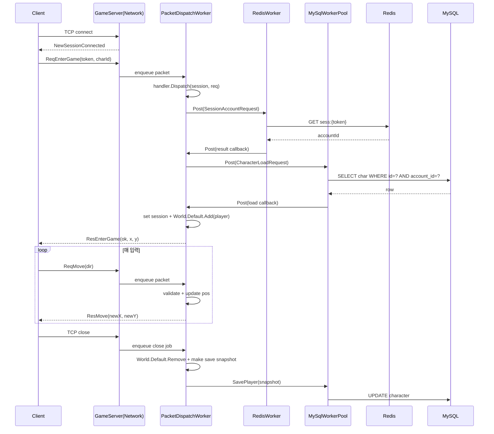

# 3주차 — 게임 월드 입장 & 실시간 이동

## 0. 이번 주에 풀고 싶은 문제

2주차에 사용자는 토큰을 받아 캐릭터를 한 명 만들었지만 아직 게임 안에는 들어갈 수 없다. 3주차에서 그 문을 연다. 클라이언트가 토큰과 캐릭터 ID를 들고 TCP 게임 서버에 접속하면, 서버가 토큰을 검증하고 캐릭터 좌표를 메모리에 올려 둔다. 그 뒤로 클라이언트는 60Hz로 키 입력을 읽고, "북쪽 한 칸 이동" 같은 패킷을 서버에 보낸다. 서버는 그 결과로 새 좌표를 응답한다.

이 주가 끝나면 한 명의 사용자가 800×600 픽셀의 맵 안에서 자기 캐릭터를 자유롭게 움직이는 화면을 본다. 그러나 아직 다른 사용자는 보이지 않는다. 그 일은 4주차의 일이다.

## 1. 서버 권위(Server-Authoritative) 라는 원칙

이번 주의 모든 결정은 한 가지 원칙에서 나온다. **세계의 진실은 서버에만 있다**. 클라이언트는 서버에게 의도를 알리고, 서버는 그 결과만 받는다.

```
┌──────────┐  "북쪽으로 가고 싶다"  ┌─────────┐
│ Client   │ ─────────────────────▶│ Server  │
└──────────┘                        └────┬────┘
     ▲                                   │ 좌표 갱신
     │                                   │ 충돌 검증
     │   "너의 새 좌표는 (400, 295)"    │
     └───────────────────────────────────┘
```

이 원칙을 어기면 다음 두 가지 사고가 한꺼번에 들어온다.

- **치팅**: 클라이언트가 "나는 지금 정중앙에 있다"라고 거짓말을 한다.
- **상태 불일치**: 다른 클라이언트가 보는 내 위치와 내 화면의 위치가 어긋난다.

이 책의 게임 서버 코드 어디에서도 클라이언트가 보낸 좌표를 그대로 믿지 않는다. 클라이언트는 항상 **"무엇을 하고 싶다"** 라고만 말하고, **"무슨 일이 일어났다"** 는 항상 서버가 말한다.

### 1.1 그러나 클라이언트도 좌표를 안다 — Client-Side Prediction

서버 권위만 고집하면 사용자 경험이 죽는다. 서버 응답을 기다린 다음에 화면을 그리면 핑(RTT)만큼 캐릭터가 늦게 움직인다. 이 문제의 표준 해법이 **클라이언트 측 예측**이다.

1. 사용자가 W를 누른 순간, 클라이언트는 **자기 화면에서 즉시 1픽셀 위로** 캐릭터를 옮긴다.
2. 동시에 서버에 ReqMove 패킷을 보낸다.
3. 서버 응답이 오면 자기 위치와 비교한다. 같으면 그대로, 다르면 보정한다.

3주차에서는 이 패턴의 1번까지만 한다. 2단계 보정은 멀티플레이어가 들어오는 4주차 이후의 일이다.

## 2. 시스템 흐름 그림



이 흐름의 핵심은 두 가지이다.

1. **네트워크 스레드는 패킷을 큐에 넣기만 한다.** `NewRequestReceived`에서 곧바로 handler를 실행하지 않고 `PacketDispatchWorker`로 넘긴다.
2. **들어올 때 한 번 DB에서 읽고, 메모리에서 논다.** 매 이동 패킷마다 DB를 두드리면 즉시 망가진다.
3. **나갈 때 DB에 한 번 쓴다.** 사용자가 떠난 시점에만 영속화한다. 1시간을 머무르면 1시간 동안 DB는 한 번도 쓰지 않는다.

이 패턴을 흔히 **"메모리는 hot, DB는 cold"** 라고 부른다. 게임 서버 설계의 가장 기본적인 규칙이다.

### 2.1 세 워커 클래스의 책임과 실제 패킷 처리 흐름

3장 예제의 서버는 작업 성격에 따라 스레드를 나눈다. 핵심 클래스는 `PacketDispatchWorker`, `RedisWorker`, `MySqlWorkerPool` 세 개이다. 이름은 워커이지만 하는 일은 서로 다르다.

`PacketDispatchWorker`는 **게임 로직을 실행하는 단일 흐름**이다. SuperSocketLite가 `NewRequestReceived`를 호출하면 네트워크 스레드는 패킷을 직접 처리하지 않고 `packetWorker.Post(session, request)`만 호출한다. 이후 `packet-dispatch-worker` 스레드가 큐에서 작업을 하나씩 꺼내 `PacketHandler.Dispatch`를 호출한다. 세션 필드 변경, `World.Default.Add`, `World.Default.Remove`, 좌표 변경, 클라이언트 응답 전송 같은 게임 데이터 조작은 이 흐름에서만 수행한다.

`RedisWorker`는 **Redis IO만 담당하는 단일 워커**이다. 생성자에서 Redis 연결을 만들고, 서버가 종료될 때까지 그 연결을 재사용한다. `OnReqEnterGame`은 토큰 검증을 직접 하지 않고 `redisWorker.Post(session, new SessionAccountRequest(req.Token), callback)` 형태로 요청만 넘긴다. Redis 워커는 `sess:{token}` 키를 조회하고, 결과를 다시 `PacketDispatchWorker`에 콜백 작업으로 게시한다. Redis 워커는 계정 ID를 읽을 뿐이며 `s.Player`나 `World`를 건드리지 않는다.

`MySqlWorkerPool`은 **MySQL IO를 담당하는 다중 워커 풀**이다. MySQL은 네트워크 IO와 디스크 IO가 섞인 작업이므로 한 스레드만 두면 대기 시간이 그대로 병목이 된다. 그래서 예제는 기본 4개의 MySQL 워커를 만들고, 각 워커가 생성 시 자기 MySQL 연결을 열어 종료 전까지 재사용한다. 캐릭터 조회는 `mySqlWorkerPool.Post(session, new CharacterLoadRequest(accountId, characterId), callback)`로 요청하고, 캐릭터 저장은 `mySqlWorkerPool.SavePlayer(saveData)`로 요청한다. MySQL 워커도 DB 행을 읽거나 쓰는 일만 하며, 게임 객체를 직접 변경하지 않는다.

실제 `ReqEnterGame` 하나가 처리되는 순서는 다음과 같다.

1. 클라이언트가 TCP로 `ReqEnterGame(token, characterId)`를 보낸다.
2. SuperSocketLite가 패킷을 파싱해 `NewRequestReceived`를 호출한다.
3. `GameServer`는 `PacketDispatchWorker`에 세션과 패킷을 넣고 즉시 돌아온다.
4. `PacketDispatchWorker`가 `EnterGameHandler.OnReqEnterGame`을 호출한다.
5. `OnReqEnterGame`은 패킷 본문을 역직렬화하고 `RedisWorker`에 `SessionAccountRequest`를 게시한다.
6. `RedisWorker`는 Redis에서 `sess:{token}`을 조회한다. 토큰이 없으면 실패 결과를 패킷 워커로 돌려보낸다.
7. 패킷 워커가 Redis 결과 콜백을 실행한다. 성공이면 `MySqlWorkerPool`에 `CharacterLoadRequest(accountId, characterId)`를 게시한다.
8. MySQL 워커 중 하나가 `characters` 테이블에서 `id`와 `account_id`가 모두 맞는 캐릭터를 조회한다.
9. MySQL 워커는 조회 결과 DTO를 패킷 워커로 돌려보낸다.
10. 패킷 워커가 `OnCharacterLoaded`를 실행한다. 여기에서만 `PlayerCharacter`를 만들고, `s.AccountId`, `s.CharacterId`, `s.Player`을 설정하고, `World.Default.Add(player)`를 호출한다.
11. 패킷 워커가 클라이언트에 `ResEnterGame`을 보낸다.

이후 이동 패킷은 DB/Redis를 거치지 않는다. `ReqMove`가 오면 네트워크 스레드는 다시 `PacketDispatchWorker`에 넣고, 패킷 워커가 현재 메모리의 `PlayerCharacter` 좌표를 검증하고 변경한 뒤 `ResMove`를 보낸다. 그래서 이동 처리 지연은 DB 상태와 분리된다.

세션 종료도 같은 원칙을 따른다. `SessionClosed` 이벤트는 직접 DB 저장을 하지 않고 패킷 워커에 종료 작업을 넣는다. 패킷 워커는 `World.Default.Remove`를 실행하고 저장에 필요한 값만 `PlayerSaveData` 스냅샷으로 만든다. 그 다음 `MySqlWorkerPool.SavePlayer(saveData)`를 호출한다. MySQL 워커는 스냅샷 값으로 DB를 갱신한다. 이 구조 덕분에 DB 저장 중에도 게임 객체가 DB 워커에서 직접 바뀌지 않는다.

정리하면 다음과 같다.

- 네트워크 스레드는 패킷을 받는 일만 한다.
- 패킷 워커는 게임 데이터를 조작하는 일만 한다.
- Redis 워커는 Redis IO만 한다.
- MySQL 워커 풀은 MySQL IO만 한다.
- DB/Redis 결과가 게임 상태 변경을 필요로 하면 반드시 패킷 워커로 돌아온다.

## 3. 새 패킷 정의

```csharp
public enum PacketId : ushort
{
    ReqEnterGame  = 1001,
    ResEnterGame  = 1002,
    NtfLeaveGame  = 1003,   // 강제 퇴장 통지

    ReqMove       = 2001,
    ResMove       = 2002,

    ReqEcho = 9001, ResEcho = 9002,
}
```

`Ntf...` 접두사는 "Notify"이다. 클라이언트가 답장을 보내지 않는 단방향 통지에 쓴다. `Req/Res`는 1대1 응답을 가지는 호출형이다. 이 명명 규칙을 1주차부터 못 박아 두면 패킷 ID가 100개를 넘을 때도 코드 리뷰가 흐트러지지 않는다.

```csharp
[MemoryPackable]
public partial class ReqEnterGame
{
    public string Token { get; set; } = "";
    public long CharacterId { get; set; }
}

[MemoryPackable]
public partial class ResEnterGame
{
    public int ResultCode { get; set; }       // 0 = ok
    public long CharacterId { get; set; }
    public string Name { get; set; } = "";
    public int X { get; set; }
    public int Y { get; set; }
}

[MemoryPackable]
public partial class ReqMove
{
    public byte Dir { get; set; }   // 0=N 1=E 2=S 3=W
}

[MemoryPackable]
public partial class ResMove
{
    public long CharacterId { get; set; }
    public int X { get; set; }
    public int Y { get; set; }
}
```

### 3.1 결과 코드를 정수로 두는 이유

`ResEnterGame.ResultCode`를 enum이 아닌 `int`로 둔 이유는 **버전 호환** 때문이다. 1년 뒤 새 결과 코드를 추가했을 때, 옛 클라이언트가 "5 = 점검중"이라는 새 값을 받으면 enum 캐스팅이 깨질 수 있다. int로 받으면 적어도 폭발은 하지 않고, "알 수 없는 코드"로 fallback할 수 있다.

운영을 길게 가져가는 게임에서 이런 호환성 결정이 결국 큰 차이를 만든다.

## 4. 게임 서버 — 인증 검증

### 4.1 패킷 디스패치 워커와 GameServer 초기화

SuperSocketLite의 `NewRequestReceived` 콜백은 네트워크 수신 흐름 위에서 호출된다. 여기서 바로 `handler.Dispatch(s, req)`를 실행하지 않고 `PacketDispatchWorker` 큐에 넣는다. 현재 예제의 `PacketDispatchWorker`는 패킷 요청뿐 아니라 DB/Redis 결과를 다시 패킷 스레드로 되돌리는 일반 `Action` 작업도 받을 수 있다.

```csharp
public sealed class PacketDispatchWorker : IDisposable
{
    private readonly PacketHandler _handler;
    private readonly BlockingCollection<Action> _jobs = new();
    private readonly Thread _thread;

    public bool Post(GameSession session, GameRequestInfo request)
        => Post(() => _handler.Dispatch(session, request));

    public bool Post(Action job)
    {
        try
        {
            _jobs.Add(job);
            return true;
        }
        catch (InvalidOperationException)
        {
            return false;
        }
    }

    private void Run()
    {
        foreach (var job in _jobs.GetConsumingEnumerable())
        {
            try { job(); }
            catch (Exception ex) { Logger.Error("packet dispatch job failed", ex); }
        }
    }
}
```

`Program.cs`에는 이제 서버 실행 진입점만 남아 있다.

```csharp
using MMORPG2D.GameServer;

await GameServer.RunFromAppSettingsAsync();
```

설정 로드, 핸들러 등록, `PacketDispatchWorker`, `RedisWorker`, `MySqlWorkerPool` 생성과 수명주기는 `GameServer.RunAsync`가 맡는다. `NewRequestReceived`는 패킷을 큐에 넣기만 하고, 실제 패킷 핸들러와 게임 상태 변경은 패킷 워커에서 순서대로 처리된다.
### 4.2 EnterGameHandler

패킷 핸들러는 패킷 워커 스레드에서 호출된다. 이 핸들러 안에서 Redis/MySQL을 직접 호출하지 않는다. `OnReqEnterGame`은 요청을 역직렬화한 뒤 Redis 워커에 `SessionAccountRequest`를 게시한다. Redis 결과는 다시 패킷 워커로 돌아와 `OnSessionAccountLoaded`에서 처리되고, 그 다음 MySQL 워커 풀에 `CharacterLoadRequest`를 게시한다. 캐릭터 로드 결과도 다시 패킷 워커로 돌아와 세션과 월드 상태를 변경한다.

```csharp
private static void OnReqEnterGame(GameSession s, byte[] body)
{
    try
    {
        var req = MemoryPackSerializer.Deserialize<ReqEnterGame>(body)!;
        var redisWorker = _redisWorker
            ?? throw new InvalidOperationException("Redis worker is not initialized");

        if (!redisWorker.Post(
                s,
                new SessionAccountRequest(req.Token),
                (session, result) => OnSessionAccountLoaded(session, req, result)))
        {
            s.SendPacket(PacketId.ResEnterGame, new ResEnterGame { ResultCode = 99 });
        }
    }
    catch (Exception ex)
    {
        Logger.Error("EnterGame dispatch failed", ex);
        s.SendPacket(PacketId.ResEnterGame, new ResEnterGame { ResultCode = 99 });
    }
}

private static void OnSessionAccountLoaded(
    GameSession s,
    ReqEnterGame req,
    SessionAccountResult result)
{
    if (result.ResultCode != 0)
    {
        s.SendPacket(PacketId.ResEnterGame, new ResEnterGame { ResultCode = result.ResultCode });
        return;
    }

    var mySqlWorkerPool = _mySqlWorkerPool
        ?? throw new InvalidOperationException("MySQL worker pool is not initialized");

    if (!mySqlWorkerPool.Post(
            s,
            new CharacterLoadRequest(result.AccountId, req.CharacterId),
            (session, loadResult) => OnCharacterLoaded(session, loadResult)))
    {
        s.SendPacket(PacketId.ResEnterGame, new ResEnterGame { ResultCode = 99 });
    }
}
```

중요한 지점은 다음과 같다.

- **handler는 짧게 끝난다**: `OnReqEnterGame`은 Redis 요청을 워커에 게시하고 바로 돌아온다.
- **Redis와 MySQL 책임을 분리한다**: Redis는 단일 `RedisWorker`, MySQL은 다중 `MySqlWorkerPool`이 처리한다.
- **게임 상태 변경은 패킷 워커에서만 한다**: `OnCharacterLoaded`에서 `s.Player`, `World.Default.Add`, 응답 패킷 전송을 수행한다.
- **`async void`를 쓰지 않는다**: 패킷 핸들러는 동기 `void`이며, IO 대기는 DB 워커 내부에서만 일어난다.
## 5. World 라는 자료구조

### 5.1 단일 책임

`World` 한 개는 다음 책임을 가진다.

- 한 월드 안에 있는 PlayerCharacter들의 컬렉션을 관리한다.
- 매 tick마다 시뮬레이션을 한 번 굴린다 (4주차부터).
- 좌표 갱신 같은 도메인 연산을 제공한다.

```csharp
public class World
{
    public static World Default { get; } = new(width: 800, height: 600);

    public int Width { get; }
    public int Height { get; }

    private readonly ConcurrentDictionary<long, PlayerCharacter> _players = new();

    public World(int width, int height) { Width = width; Height = height; }

    public bool Add(PlayerCharacter p) => _players.TryAdd(p.CharacterId, p);
    public bool Remove(long id) => _players.TryRemove(id, out _);
    public PlayerCharacter? Get(long id)
        => _players.TryGetValue(id, out var p) ? p : null;
    public IEnumerable<PlayerCharacter> All() => _players.Values;
}
```

3주차의 World는 여러 명을 같이 다루지 않지만, 자료구조는 처음부터 동시 접근 안전한 `ConcurrentDictionary`로 둔다. 4주차에서 한 줄도 안 바꾸고 멀티플레이어로 확장하기 위해서이다.

### 5.2 단일 월드 vs 다중 월드

학습 단계에서는 `World.Default` 하나로 시작한다. 실무에서는 보통 다음 두 패턴 중 하나를 쓴다.

- **월드 인스턴스가 곧 프로세스 한 개**. 한 머신에 한 월드만 띄운다. 가로 확장은 머신 수를 늘려서 한다.
- **한 프로세스 안에 여러 월드**. World 객체를 인스턴스화해서 dictionary로 관리한다.

이 책에서는 1개로 시작해서, 6주차쯤 가서 한 프로세스 안에 다중 월드 패턴을 쓴다.

## 6. 이동 처리

### 6.1 한 픽셀 이동 vs 한 칸 이동

이동의 기본 단위를 무엇으로 할 것인가에 따라 코드의 모양이 크게 달라진다.

- **격자 이동(grid-based)**: 한 칸이 32픽셀, WASD 한 번에 한 칸이 움직인다. 충돌 검증이 간단하다. 2D RPG의 클래식 형태.
- **자유 이동(free movement)**: 픽셀 단위로 매끄럽게 움직인다. 부드럽지만 충돌 검증이 어렵고, 패킷 빈도도 높아진다.

학습용으로 격자 이동이 압도적으로 쉽다. 그래서 우리 좌표계는 32픽셀 단위 격자를 깐다. 800/32 = 25칸, 600/32 ≈ 18칸.

```
+---+---+---+---+ ... +---+
|   |   |   |   | ... |   |   ← 25칸
+---+---+---+---+ ... +---+
```

서버의 `pos_x`/`pos_y`는 **격자 좌표(0~24, 0~17)** 가 아니라 **픽셀 좌표** 로 둔다. 격자 이동이지만 좌표는 픽셀로 표현한다. 이렇게 두면 4주차에 자유 이동으로 바꿀 때 좌표계를 갈아엎지 않아도 된다.

### 6.2 MoveHandler

```csharp
private static void OnReqMove(GameSession s, byte[] body)
{
    if (s.Player is not { } player) { /* 미입장 */ return; }
    var req = MemoryPackSerializer.Deserialize<ReqMove>(body)!;

    int dx = 0, dy = 0;
    switch (req.Dir)
    {
        case 0: dy = -32; break;  // N
        case 1: dx =  32; break;  // E
        case 2: dy =  32; break;  // S
        case 3: dx = -32; break;  // W
        default: return;
    }

    var nx = Math.Clamp(player.X + dx, 0, World.Default.Width  - 32);
    var ny = Math.Clamp(player.Y + dy, 0, World.Default.Height - 32);

    player.X = nx; player.Y = ny;

    s.SendPacket(PacketId.ResMove, new ResMove
    {
        CharacterId = player.CharacterId, X = nx, Y = ny
    });
}
```

- **검증 1: 입장한 사용자만**: `s.Player is not { } player`로 입장 전인지 확인한다. 이 체크가 없으면 토큰 없이도 ReqMove를 던질 수 있다.
- **검증 2: 방향 값**: 0~3 외의 값은 즉시 무시한다. 5, 100, 255 같은 값을 던지는 클라이언트는 전부 비정상이다.
- **검증 3: 맵 경계**: `Math.Clamp`로 강제로 안에 묶는다.

이 세 가지 검증이 없으면 클라이언트가 좌표를 마음대로 조작할 수 있다. **모든 입력은 의심하라** 가 게임 서버 코드의 가장 중요한 격언이다.

### 6.3 이동 빈도와 패킷 폭주

위 코드는 한 번 누르면 한 번 이동이다. 그러나 사용자가 W 키를 꾹 누르고 있으면 어떻게 될까. 클라이언트의 키 반복 속도가 보통 30Hz 정도여서, 1초에 30번의 ReqMove가 날아간다. 100명이 동시에 키를 누르고 있으면 서버는 1초에 3000개의 패킷을 처리해야 한다.

3주차에서는 이 부하가 문제가 되지 않는다. 4주차에서 동기화를 다루며 "tick rate" 라는 개념을 도입해, **클라이언트의 입력은 받지만 응답은 일정한 주기로만 보낸다** 라는 흐름으로 정리한다.

## 7. 세션 종료와 영속화

### 7.1 SessionClosed 이벤트

세션 종료 이벤트도 바로 게임 상태를 만지지 않고 패킷 워커로 넘긴다. 패킷 워커에서 월드 제거와 저장 스냅샷 생성을 수행한 뒤, 실제 MySQL 저장만 `MySqlWorkerPool`에 게시한다.

```csharp
private void HandleSessionClosed(GameSession session, CloseReason reason)
{
    var posted = _packetWorker?.Post(() => CloseSessionOnPacketThread(session, reason)) ?? false;
    if (!posted)
    {
        Logger.Warn($"session close skipped: packet worker is not available ({session.SessionID})");
    }
}

private void CloseSessionOnPacketThread(GameSession session, CloseReason reason)
{
    if (session.Player is { } player)
    {
        World.Default.Remove(player.CharacterId);

        var saveData = new PlayerSaveData(
            player.CharacterId,
            player.Name,
            player.X,
            player.Y,
            player.Level,
            player.Exp);

        if (_mySqlWorkerPool?.SavePlayer(saveData) != true)
        {
            Logger.Warn($"save skipped for {player.Name}: MySQL worker pool is not available");
        }
    }

    Logger.Info($"[-] {session.SessionID} closed ({reason})");
}
```

- **이벤트 핸들러는 짧게**: `SessionClosed`는 패킷 워커에 작업을 넣고 바로 돌아온다.
- **저장은 MySQL 워커 풀로 보낸다**: `Task.Run`이나 직접 DB 호출을 쓰지 않는다.
- **저장 데이터는 스냅샷으로 만든다**: DB 워커가 `PlayerCharacter` 같은 게임 객체를 직접 조작하지 않도록 필요한 값만 DTO로 넘긴다.
### 7.2 비정상 종료의 위험

서버 프로세스가 갑자기 죽으면 영속화되지 않은 좌표는 사라진다. 사용자는 마지막 저장 지점으로 돌아간다. 이 손실을 줄이려면 다음 두 가지 조치를 추가한다.

1. **주기적 저장**: 5분마다 한 번씩 모든 캐릭터의 좌표를 일괄 UPDATE한다.
2. **shutdown 훅**: SIGTERM을 받으면 모든 세션을 닫고 좌표를 저장한 뒤 종료한다.

학습용 단계인 3주차에서는 이 둘을 다루지 않는다. 8주차의 "안정성" 절에서 같이 정리한다.

## 8. 클라이언트 — MonoGame 게임 화면

### 8.1 게임 루프

MonoGame의 `Game` 클래스는 60Hz 루프이다. 다음 4개 메서드를 채우면 된다.

```csharp
public class GameClient : Game
{
    protected override void Initialize() { /* 한 번 */ }
    protected override void LoadContent() { /* 텍스처/폰트 로드 */ }
    protected override void Update(GameTime gt) { /* 60Hz */ }
    protected override void Draw(GameTime gt)   { /* 60Hz */ }
}
```

- **Update와 Draw는 따로**: 둘이 같은 60Hz로 돌지만, 책임이 다르다. Update는 상태를 바꾸고, Draw는 상태를 본다. 둘이 섞이면 추후 Variable Time Step(가변 프레임) 도입이 어려워진다.
- **`gt.ElapsedGameTime`**: 이번 프레임이 걸린 실제 시간. 60Hz가 보장되지 않을 때(렉, 슬립) 보정용으로 쓴다.

### 8.2 입력 처리

```csharp
KeyboardState _ks, _prev;
protected override void Update(GameTime gt)
{
    _ks = Keyboard.GetState();

    if (Pressed(Keys.W)) Send(0);
    if (Pressed(Keys.D)) Send(1);
    if (Pressed(Keys.S)) Send(2);
    if (Pressed(Keys.A)) Send(3);

    _prev = _ks;
}
bool Pressed(Keys k) => _ks.IsKeyDown(k) && _prev.IsKeyUp(k);
```

`IsKeyDown(k)`만 보면 매 프레임마다 패킷이 날아간다(7.3절의 폭주). `Pressed`는 "이번 프레임에 새로 눌렀는지"만 본다. 학습용으로 적절하다.

### 8.3 네트워크 클라이언트 모듈

게임 서버와의 TCP 통신은 MonoGame의 게임 루프와는 다른 스레드에서 돌아야 한다. 별도의 `GameNetClient` 클래스를 둔다.

```csharp
public class GameNetClient
{
    private readonly TcpClient _tcp = new();
    private NetworkStream? _ns;
    private readonly ConcurrentQueue<(PacketId, byte[])> _inbox = new();

    public async Task ConnectAsync(string host, int port)
    {
        await _tcp.ConnectAsync(host, port);
        _ns = _tcp.GetStream();
        _ = Task.Run(ReceiveLoop);
    }

    public void Send<T>(PacketId id, T body)
    {
        var bytes = PacketEncoder.Encode(id, body);
        _ns!.Write(bytes, 0, bytes.Length);  // 동기 Write — 학습용
    }

    public bool TryRead(out PacketId id, out byte[] body)
    {
        if (_inbox.TryDequeue(out var pair)) { id = pair.Item1; body = pair.Item2; return true; }
        id = default; body = Array.Empty<byte>(); return false;
    }
    // ReceiveLoop 는 1주차 클라이언트와 동일
}
```

- **`ConcurrentQueue`로 inbox**: 수신 스레드가 큐에 적고, 게임 루프 스레드가 큐를 비운다. 메인 스레드에서 직접 소켓을 다루지 않는 것이 핵심.
- **동기 `Write`**: 학습용 단순화이다. 실무에서는 보내는 쪽도 큐 + 백그라운드 송신 스레드 패턴을 쓴다. 8주차에 정리한다.

### 8.4 ResMove 적용

```csharp
while (Net.TryRead(out var id, out var body))
{
    switch (id)
    {
        case PacketId.ResEnterGame: HandleEnter(body); break;
        case PacketId.ResMove:      HandleMove(body);  break;
    }
}

void HandleMove(byte[] body)
{
    var res = MemoryPackSerializer.Deserialize<ResMove>(body)!;
    if (res.CharacterId == _myCharacterId)
    {
        _myX = res.X; _myY = res.Y;
    }
}
```

이 시점에서 "내 캐릭터의 위치는 서버가 시켜야만 바뀐다" 라는 원칙이 클라이언트 코드에도 박혀 있다. W를 눌러도 서버 응답이 오기 전까지 화면은 움직이지 않는다.

## 9. 렌더링

### 9.1 픽셀 한 점에서 캐릭터까지

처음에는 캐릭터가 단순한 32×32 색상 사각형이다. SpriteBatch로 그린다.

```csharp
_sb.Draw(_pixel,
    new Rectangle(_myX, _myY, 32, 32),
    Color.SteelBlue);
```

`_pixel`은 1×1의 흰색 텍스처 한 개이다. 색상을 `Color.SteelBlue`로 곱하면 파란 사각형이 그려진다. 텍스처를 따로 만들지 않고도 어떤 색의 사각형이든 한 텍스처로 그릴 수 있다.

### 9.2 체력바와 정보창

체력바는 두 개의 사각형 — 배경(검정)과 전경(빨강). 전경의 너비를 `width * (hp/maxHp)`로 계산한다. 정보창은 폰트로 캐릭터 이름과 레벨을 그린다. 이 코드는 5주차의 전투 시스템을 만나기 직전까지 변하지 않는다.

## 10. 자주 막히는 곳

### 10.1 "ResEnterGame이 안 와요"

대개 두 가지 원인이다.

- 토큰이 만료(10분). API 서버에서 다시 로그인한다.
- 토큰은 유효한데 characterId가 다른 계정의 것이다 (개발 중에 DB를 한 번 비웠다든지). 다시 캐릭터를 만들거나 ID를 확인한다.

### 10.2 "이동이 가끔 씹혀요"

`Pressed`가 아니라 `IsKeyDown`을 쓰면 매 프레임 패킷이 날아가서 서버가 바로 못 따라간다. 또한 클라이언트 측에서 `_myX`를 즉시 갱신하지 않고 서버 응답만 기다리면 한 칸 이동에 RTT만큼의 지연이 그대로 보인다. 학습용으로는 그 지연이 보이는 것이 오히려 교육적이다.

### 10.3 "DB에 좌표가 안 저장돼요"

`SessionClosed`는 저장 작업을 `MySqlWorkerPool` 큐에 넣는다. 큐에 들어간 작업은 전용 워커가 처리하지만, 서버 프로세스가 그 직후 강제로 종료되면 아직 처리되지 않은 작업이 남을 수 있다. 학습 단계에서는 개발자가 Ctrl+C로 멈추기 전에 의도적으로 잠시 기다리는 것으로 충분하지만, 운영에서는 8주차의 graceful shutdown이 필수가 된다.

## 11. 3주차 마무리 체크리스트

- [ ] DB의 characters 테이블에 한 명 이상의 캐릭터가 있다.
- [ ] 클라이언트가 API 서버에 로그인해 토큰을 받는다.
- [ ] 클라이언트가 게임 서버에 TCP 접속하고 ReqEnterGame이 성공한다.
- [ ] 화면 중앙에 32×32 사각형이 그려진다.
- [ ] WASD를 누르면 한 칸씩 이동한다.
- [ ] 게임을 끄고 다시 켜면 마지막 위치에서 시작한다.

## 12. 연습 문제

1. **이동 속도를 두 배로 만들어라.** 32픽셀 격자를 16픽셀로 줄여 한 칸이 두 번 움직이도록 하면 된다. 어디를 고치고 어디는 그대로여도 되는지를 직접 확인하라.
2. **ReqEnterGame에 클라이언트 버전 필드를 추가하라.** 서버는 자기가 가진 최소 버전과 비교해 낮으면 거절한다. 운영 환경에서 클라이언트 강제 업데이트의 가장 단순한 형태이다.
3. **세션이 끊겼을 때만 좌표를 저장하지 말고, 매 5초마다 한 번씩 저장하도록 바꿔라.** 갑작스러운 서버 다운에 대비한다. `System.Timers.Timer`나 `Task.Delay` 루프로 만들 수 있다.

## 13. 다음 주 예고

4주차에서 드디어 두 번째 사람이 들어온다. 한 명이 움직이면 같은 월드의 다른 모두에게 그 사실이 브로드캐스트된다. 시야 범위 안의 사용자만 보내는 AOI(Area of Interest)도 함께 다룬다. 그러면 캐릭터 100명을 한 월드에 동시에 두고도 패킷이 폭주하지 않는다.

