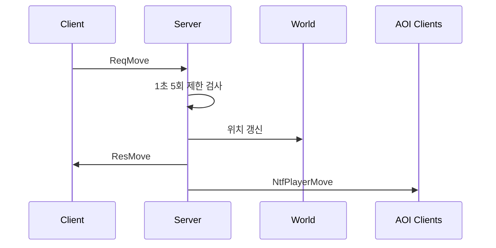
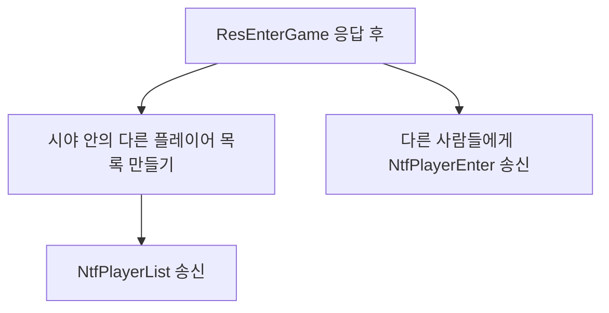
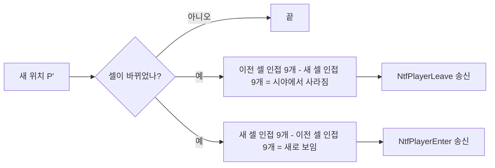
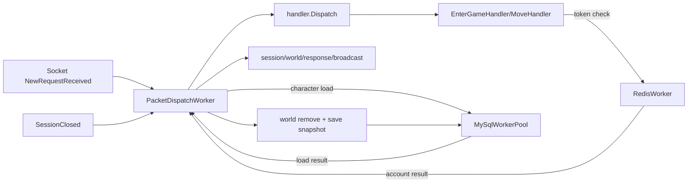

# 4주차 — 멀티플레이어 동기화

## 0. 이번 주에 풀고 싶은 문제

3주차 끝에서는 한 명이 들어가 혼자 움직였다. 4주차에는 같은 월드에 두 명, 세 명, 결국 100명이 동시에 들어가도 서로의 모습이 즉시 화면에 보이는 것을 만든다. 그러려면 한 명의 이동이 다른 모든 사람에게 전달되어야 하는데, 그 "모든 사람"의 정의를 어떻게 좁히느냐가 이번 주의 핵심이다.

이번 주가 끝나면 두 명의 학생이 각자의 노트북에서 같은 서버로 들어가서, 한 사람이 W를 누르면 다른 사람의 화면에서 그 캐릭터가 움직이는 모습이 보인다.

## 1. 브로드캐스트의 두 얼굴

### 1.1 가장 단순한 답 — 모두에게 보낸다

한 명이 이동했을 때, 그 사실을 같은 월드에 있는 모든 사람에게 보내면 된다. 코드도 단순하다.

```csharp
foreach (var p in World.Default.All())
    p.Session.SendPacket(PacketId.NtfMove, ntf);
```

이 방식의 장점은 단순성이다. 그러나 문제도 명확하다. 이동 중인 클라이언트가 1초에 5번 이동 패킷을 보낸다고 해도, 100명이 모두 이동하면 100명 × 99명 × 5 = **1초당 49,500번의 NtfMove 송신**이 필요하다. 1000명이 들어오면 1초당 거의 500만 번이다. 한 패킷이 50바이트라고 해도 초당 수백 MB 트래픽이 흐른다. 게임 서버 한 대로는 절대 못 버틴다.

### 1.2 좀 더 좋은 답 — 시야 범위(AOI)

사용자 한 명이 자기 화면에서 볼 수 있는 영역은 800×600 픽셀이다. 1000×1000 픽셀의 맵 안에서 200픽셀 떨어진 곳의 다른 사용자가 움직였다는 사실은, 내 화면에 보이지 않으니 알려 줄 필요가 없다. 이 영역을 **AOI(Area of Interest)** 라고 부른다.

```
                    ┌──────────────────────┐
                    │                      │
                    │      AOI 반경 R       │
                    │       ┌─────┐        │
                    │       │  나  │        │
                    │       └─────┘        │
                    │                      │
                    └──────────────────────┘
                  ↑ 이 안의 사람만 동기화한다
```

AOI 반경 R을 두면 한 사용자가 들고 다니는 "구독자"의 수가 평균적으로 일정해진다. R=400픽셀이라면, 사용자 분포가 균일하다고 가정했을 때 시야 안에 있는 다른 사용자는 보통 5~20명 정도이다. 1000명이 같이 있어도 한 명이 송신하는 NtfMove는 5~20번이다. 트래픽이 100배 줄어든다.

### 1.3 AOI를 어떻게 구현하나

가장 단순한 구현은 매 이동마다 모든 다른 사용자와의 거리를 계산하는 것이다.

```csharp
foreach (var other in World.Default.All())
    if (other != me && Distance(me, other) <= R)
        other.Session.SendPacket(...);
```

100명이면 한 번 이동에 100번 거리 계산이다. 이 정도는 괜찮다. 그러나 1000명이 되면 전체 이동을 한 번 훑을 때 1000명 × 1000명 / 2 = 50만 번 가까운 비교가 돈다. 그래서 보통은 **공간 분할** 자료구조를 쓴다.

가장 흔한 두 가지가 다음과 같다.

- **격자(grid)**: 맵을 N×M 칸으로 쪼개고, 각 칸에 그 위치의 사용자 목록을 둔다. 사용자가 이동하면 칸을 갱신하고, AOI는 자기 칸과 주변 8칸만 본다.
- **쿼드트리(quadtree)**: 사용자가 모인 곳은 더 잘게, 빈 곳은 큼직하게. 균일하지 않은 분포에 강하다.

학습용으로는 격자가 압도적으로 단순하다. 우리는 이번 주에 **128픽셀 × 128픽셀 격자**를 쓴다. 800×600 맵에서 격자는 7×5 = 35칸이다.

여기서 중요한 전제가 있다. 이번 주 예제는 **거리 계산을 하지 않는다**. `AoiGrid`가 돌려주는 자기 셀과 주변 8셀을 그대로 "보이는 대상"으로 취급한다. 그러므로 이 장의 AOI는 정확한 원형 시야나 화면 사각형 시야가 아니라, 격자로 근사한 coarse AOI이다.

## 2. 이동 패킷 빈도 제한

### 2.1 클라이언트 입력을 그대로 믿으면

가장 쉬운 구현은 키가 눌릴 때마다 클라이언트가 `ReqMove`를 보내고, 서버가 받을 때마다 바로 위치를 바꾸는 것이다. 그런데 이 방식은 클라이언트가 정직하다는 전제를 깔고 있다. 정상 클라이언트는 이동 중 1초에 5번만 보낼 수 있지만, 조작된 클라이언트는 1초에 30번, 100번도 보낼 수 있다.

서버는 그래서 이동 패킷에도 **속도 제한(rate limit)** 을 둔다. 이번 주 예제의 규칙은 단순하다.

- 이동 중인 클라이언트는 `ReqMove`를 1초에 최대 5번만 보낼 수 있다.
- 실제 위치가 바뀐 이동만 카운트한다.
- 1초 윈도우 안에서 6번째 실제 이동 요청이 오면 불법으로 간주하고 연결을 끊는다.
- 방향 값이 잘못된 패킷은 이동으로 처리하지 않고 무시한다.



중요한 점은 제한을 **클라이언트 UI가 아니라 서버에서** 검사한다는 것이다. 클라이언트에서 키 입력 간격을 제한하는 것은 사용자 경험을 부드럽게 만드는 보조 수단일 뿐이다. 보안 규칙은 반드시 서버가 최종 판단해야 한다.

### 2.2 왜 5번인가

이번 주는 타일 한 칸을 32픽셀로 두고, 한 번 이동할 때 한 칸씩 움직인다. 1초에 5번이면 초당 160픽셀이다. 800×600 학습용 맵에서는 사람이 보기에도 충분히 움직임이 보이고, 두 클라이언트로 테스트할 때 로그가 너무 빨리 쌓이지 않는다.

상용 게임에서는 이 값이 장르마다 다르다. 액션 게임은 더 촘촘한 입력이나 서버 tick 기반 이동을 쓰고, 보드게임처럼 느린 게임은 더 낮게 잡을 수 있다. 지금 중요한 것은 숫자 자체가 아니라 **서버가 허용 가능한 입력 빈도를 명확히 정하고 위반을 잡는 구조** 이다.

### 2.3 4주차의 동기화 방식

4주차 예제는 batch 패킷이나 서버 tick을 아직 넣지 않는다. 서버는 `ReqMove`를 받으면 즉시 다음 일을 한다.

1. 이동 방향과 빈도 제한을 검사한다.
2. 서버가 보관한 현재 좌표에서 새 좌표를 계산한다.
3. 좌표가 실제로 바뀌면 `PlayerCharacter` 위치와 AOI 셀을 갱신한다.
4. 이동자 본인에게 `ResMove`를 보낸다.
5. 이동자의 시야 안에 있는 다른 클라이언트에게 `NtfPlayerMove`를 보낸다.

이 구조는 단순하고 디버깅이 쉽다. 나중에 패킷 수가 문제되면 `NtfPlayerMoveBatch` 같은 묶음 패킷이나 고정 서버 tick을 추가할 수 있다. 하지만 그때도 "입력 빈도 제한은 서버가 검사한다"는 원칙은 그대로 유지된다.

## 3. 새 패킷 정의

```csharp
public enum PacketId : ushort
{
    // ... 기존 패킷 ...
    NtfPlayerEnter = 2010,    // 다른 플레이어 입장 통지
    NtfPlayerLeave = 2011,    // 다른 플레이어 퇴장 통지
    NtfPlayerMove  = 2012,    // 다른 플레이어 이동 통지
    NtfPlayerList  = 2013,    // 입장 직후, 시야 안의 사람 목록을 한 번에
}
```

### 3.1 패킷 본문

```csharp
[MemoryPackable]
public partial class PlayerSnapshot
{
    public long Id { get; set; }
    public string Name { get; set; } = "";
    public int X { get; set; }
    public int Y { get; set; }
    public int Level { get; set; }
}

[MemoryPackable]
public partial class NtfPlayerList
{
    public PlayerSnapshot[] Players { get; set; } = Array.Empty<PlayerSnapshot>();
}

[MemoryPackable]
public partial class NtfPlayerEnter
{
    public PlayerSnapshot Player { get; set; } = new();
}

[MemoryPackable]
public partial class NtfPlayerLeave
{
    public long Id { get; set; }
}

[MemoryPackable]
public partial class NtfPlayerMove
{
    public long Id { get; set; }
    public int X { get; set; }
    public int Y { get; set; }
}
```

`PlayerSnapshot`이라는 공통 자료형이 핵심이다. 입장/퇴장/주변 목록 등 사람을 표현하는 모든 패킷이 같은 구조를 쓰면 클라이언트의 처리 코드도 일관된다. `PlayerSnapshot`을 한 번 손보면 4주차 이후 모든 패킷이 자동으로 그 변경을 따라간다.

## 4. 입장 시 — 주변 사람 알리기

### 4.1 들어온 사람에게는 무엇을 보내나



들어온 사람 본인에게 한 번만 보내는 `NtfPlayerList`와, 시야 안 다른 사람들에게 보내는 `NtfPlayerEnter`가 짝으로 동작한다. 양쪽 모두 같은 `PlayerSnapshot` 자료를 쓴다.

### 4.2 좌표 → 격자 셀

격자 인덱스는 단순한 정수 나누기이다.

```csharp
public readonly record struct CellId(int X, int Y);
public static CellId ToCell(int px, int py)
    => new(px / World.AoiCellSize, py / World.AoiCellSize);
```

128픽셀 격자에서 픽셀 (200, 300)은 셀 (1, 2)이다. 이 좌표를 dictionary 키로 쓰면 한 셀의 사용자 목록이 된다.

### 4.3 AoiGrid 클래스

```csharp
public class AoiGrid
{
    private readonly Dictionary<CellId, HashSet<PlayerCharacter>> _cells = new();

    public void Add(PlayerCharacter p)
    {
        var c = ToCell(p.X, p.Y);
        if (!_cells.TryGetValue(c, out var set))
            _cells[c] = set = new();
        set.Add(p);
    }
    public void Remove(PlayerCharacter p) { /* 대칭 */ }

    public IEnumerable<PlayerCharacter> Neighbors(int px, int py)
    {
        var (cx, cy) = ToCell(px, py);
        for (int dy = -1; dy <= 1; dy++)
        for (int dx = -1; dx <= 1; dx++)
            if (_cells.TryGetValue(new(cx + dx, cy + dy), out var set))
                foreach (var p in set) yield return p;
    }
}
```

- **단일 패킷 워커 전제**: `AoiGrid`는 `PacketDispatchWorker`에서만 호출한다. 같은 스레드에서 순서대로 추가/삭제/조회가 일어나므로 `lock`을 두지 않는다.
- **`HashSet`**: 같은 사용자가 한 셀에 두 번 들어가는 것을 막는다. 셀 변경 처리에서 같은 플레이어가 중복 등록되는 실수를 줄인다.
- **9칸 검색**: 자기 셀과 8개의 인접 셀. 셀 크기가 128이라면 주변 9셀 안의 플레이어를 모두 보이는 대상으로 취급한다.

### 4.4 현재 구현의 시야 의미

현재 구현에서 "시야 안"은 다음 뜻이다.

- 내 좌표가 속한 격자 셀에 있는 플레이어는 보인다.
- 내 셀의 상하좌우와 대각선 8개 인접 셀에 있는 플레이어도 보인다.
- 그 밖의 셀에 있는 플레이어는 보이지 않는다.
- 두 플레이어 사이의 실제 픽셀 거리는 계산하지 않는다.

예를 들어 플레이어1이 셀 `(1, 0)`의 오른쪽 끝에 있고, 플레이어2가 바로 옆 셀 `(2, 0)`의 왼쪽 끝에 있으면 서로 보인다. 두 셀이 인접하기 때문이다. 반대로 플레이어1이 셀 `(1, 0)` 안에서 왼쪽으로 멀어져도 아직 셀 `(1, 0)`을 벗어나지 않았다면, 셀 `(2, 0)`에 있는 플레이어2에게는 계속 보인다. 현재 구현은 실제 거리 기준으로 "시야 밖으로 나갔다"를 판단하지 않고, 셀 기준으로만 판단하기 때문이다.

이 방식은 단순하고 빠르지만 시야 경계가 거칠다. 실제 화면에서는 이미 멀어진 캐릭터가 조금 더 오래 보일 수 있고, 대각선 인접 셀처럼 실제 거리가 꽤 먼 대상도 보일 수 있다. 4주차 예제는 AOI 자료구조와 입장/퇴장 통지 흐름을 배우는 것이 목적이라 이 정도 근사로 둔다.

### 4.5 AOI 셀 변경 시점

사용자가 매 이동마다 셀이 바뀌지는 않는다. 32픽셀씩 움직이면 4번에 한 번 정도 셀이 바뀐다. 셀이 바뀐 시점에 다음 일들이 한꺼번에 일어난다.



처음 만나는 학생이 흔히 빠뜨리는 것이 "사라짐"의 처리이다. 자기 시야에서 사라지는 사람의 그림이 화면에 그대로 남는 버그가 자주 보인다. 입장만큼이나 퇴장도 정확하게 보내야 한다.

다만 이 "사라짐"도 현재 구현에서는 셀 기준이다. 같은 셀 안에서 실제 거리만 멀어진 경우에는 `NtfPlayerLeave`가 바로 나가지 않는다. 셀이 바뀌어서 주변 9셀 집합에서 빠지는 순간에만 사라짐을 보낸다.

### 4.6 더 정확하게 개선하려면

더 정확한 시야를 원하면 격자를 "최종 판정"이 아니라 "후보 검색"으로만 써야 한다. 흐름은 다음과 같다.

```csharp
var oldVisible = World.Default.Aoi.Neighbors(oldX, oldY)
    .Where(other => other != player)
    .Where(other => IsInView(oldX, oldY, other.X, other.Y))
    .ToHashSet();

var newVisible = World.Default.Aoi.Neighbors(nx, ny)
    .Where(other => other != player)
    .Where(other => IsInView(nx, ny, other.X, other.Y))
    .ToHashSet();

foreach (var other in oldVisible.Except(newVisible))
    SendLeaveBoth(player, other);

foreach (var other in newVisible.Except(oldVisible))
    SendEnterBoth(player, other);

foreach (var other in newVisible)
    SendMove(other, player);
```

`IsInView`는 게임 성격에 따라 다르게 잡는다.

- 원형 시야: `(dx * dx + dy * dy) <= (radius * radius)`
- 화면 사각형 시야: `Math.Abs(dx) <= viewWidth / 2 && Math.Abs(dy) <= viewHeight / 2`
- 타일 기반 시야: 타일 좌표 차이가 일정 범위 안인지 검사

이렇게 하면 같은 격자 안에서 이동하더라도 실제 시야 밖으로 나가는 순간 `NtfPlayerLeave`를 보낼 수 있다. 대신 매 이동마다 후보들에 대한 추가 거리 계산과 `oldVisible/newVisible` 비교가 필요하다. 4주차는 단순성을 우선하고, 이 정밀 판정은 최적화와 함께 뒤에서 확장하는 편이 좋다.

## 5. 이동 처리 흐름의 변화

### 5.1 ReqMove 핸들러 다시 쓰기

```csharp
public static void OnReqMove(GameSession s, byte[] body)
{
    if (s.Player is not { } player) return;
    var req = MemoryPackSerializer.Deserialize<ReqMove>(body)!;

    int dx = 0, dy = 0;
    GetDelta(req.Dir, out dx, out dy);

    var oldX = player.X;
    var oldY = player.Y;
    var nx = Math.Clamp(player.X + dx, 0, World.Default.Width  - World.CellSize);
    var ny = Math.Clamp(player.Y + dy, 0, World.Default.Height - World.CellSize);
    if (nx == oldX && ny == oldY) return;

    if (!CheckMoveRateLimit(s, player)) return;

    var oldCell = World.Default.Aoi.ToCell(oldX, oldY);
    var newCell = World.Default.Aoi.ToCell(nx, ny);
    player.X = nx; player.Y = ny;

    // 본인에게 응답
    s.SendPacket(PacketId.ResMove, new ResMove
    { CharacterId = player.CharacterId, X = nx, Y = ny });

    // 셀이 바뀌면 AOI 갱신
    if (oldCell != newCell)
    {
        World.Default.Aoi.UpdateCell(player, oldCell, newCell);
        Broadcaster.NotifyCellChange(player, oldCell, newCell);
    }

    // 시야 안 다른 사람들에게 NtfPlayerMove
    Broadcaster.NotifyMove(player);
}

private static bool CheckMoveRateLimit(GameSession s, PlayerCharacter player)
{
    var nowMs = DateTimeOffset.UtcNow.ToUnixTimeMilliseconds();
    if (nowMs - player.MoveRateWindowStartMs >= 1000)
    {
        player.MoveRateWindowStartMs = nowMs;
        player.MoveRateWindowCount = 0;
    }

    player.MoveRateWindowCount++;
    if (player.MoveRateWindowCount <= 5) return true;

    Logger.Warn($"illegal move rate: {player.Name}({player.CharacterId})");
    s.Close();
    return false;
}
```

핵심 결정들이다.

- **본인에게는 ResMove**, **다른 사람에게는 NtfPlayerMove**. 다른 패킷 ID를 쓰는 이유는 클라이언트가 처리 분기를 단순하게 하기 위해서이다. "내 캐릭터 이동" 과 "다른 캐릭터 이동" 은 화면 갱신 로직이 다르다.
- **이동이 없으면 즉시 반환**: 맵 끝에서 안 움직였는데도 NtfPlayerMove가 날아가면 트래픽 낭비이다. 로컬 변수 비교 한 번이면 막을 수 있다.
- **초당 5회 제한**: 실제 이동이 1초에 6번 이상 들어오면 조작 클라이언트로 보고 연결을 끊는다. 정상 클라이언트도 키 반복 속도가 너무 높으면 서버 규칙을 어기는 것이므로 클라이언트 쪽 송신 간격도 같은 값으로 맞춘다.

### 5.2 BroadcastEnterLeave

```csharp
private static void BroadcastEnterLeave(
    PlayerCharacter me, CellId oldCell, CellId newCell)
{
    var oldSet = NeighborSet(oldCell);
    var newSet = NeighborSet(newCell);

    // 시야에서 사라진 사람들에게 → 나를 Leave 로 알림
    foreach (var other in oldSet.Except(newSet))
    {
        other.Session.SendPacket(PacketId.NtfPlayerLeave,
            new NtfPlayerLeave { Id = me.CharacterId });
        me.Session.SendPacket(PacketId.NtfPlayerLeave,
            new NtfPlayerLeave { Id = other.CharacterId });
    }
    // 새로 보이는 사람들에게 → 나를 Enter 로 알림
    foreach (var other in newSet.Except(oldSet))
    {
        other.Session.SendPacket(PacketId.NtfPlayerEnter,
            new NtfPlayerEnter { Player = me.ToSnapshot() });
        me.Session.SendPacket(PacketId.NtfPlayerEnter,
            new NtfPlayerEnter { Player = other.ToSnapshot() });
    }
}
```

`Except`을 두 번 쓰는 두 줄이 핵심이다. 한쪽만 보내면 양쪽 클라이언트의 상태가 어긋난다. **양방향 통보** 가 AOI의 정석이다.

## 6. 클라이언트 — 다른 플레이어 그리기

### 6.1 다른 플레이어 자료구조

```csharp
public class RemotePlayer
{
    public long Id { get; init; }
    public string Name { get; init; } = "";
    public int X { get; set; }
    public int Y { get; set; }
    public int TargetX { get; set; }
    public int TargetY { get; set; }
}

private readonly Dictionary<long, RemotePlayer> _others = new();
```

`X/Y`와 `TargetX/TargetY`를 분리한 이유는 **보간(interpolation)** 때문이다. 서버가 이동 패킷을 받을 때마다 새 위치를 알려 주더라도 정상 클라이언트의 송신 간격은 약 200ms이다. 클라이언트는 그 사이의 위치를 부드럽게 채울 수 있다. 다음 절에서 다룬다.

### 6.2 보간

```csharp
foreach (var p in _others.Values)
{
    p.X = Lerp(p.X, p.TargetX, 0.3f);
    p.Y = Lerp(p.Y, p.TargetY, 0.3f);
}

static int Lerp(int a, int b, float t) => a + (int)((b - a) * t);
```

매 프레임 0.3씩 가까워지면, 약 5프레임(약 80ms) 만에 거의 따라잡는다. 이동 패킷은 정상 클라이언트 기준 1초에 최대 5번, 즉 약 200ms 간격으로 오므로 중간 프레임을 보간하면 화면이 덜 끊긴다.

이 단순한 보간만으로도 화면 품질이 비약적으로 좋아진다. 시간이 남으면 "외삽(extrapolation)"이라는 더 정교한 기법도 시도해 볼 수 있는데, 학습용으로는 보간으로 충분하다.

### 6.3 입장/퇴장 처리

```csharp
case PacketId.NtfPlayerEnter:
    var ent = MemoryPackSerializer.Deserialize<NtfPlayerEnter>(body)!;
    _others[ent.Player.Id] = new RemotePlayer
    {
        Id = ent.Player.Id, Name = ent.Player.Name,
        X = ent.Player.X, Y = ent.Player.Y,
        TargetX = ent.Player.X, TargetY = ent.Player.Y,
    };
    ShowToast($"{ent.Player.Name} 입장");
    break;

case PacketId.NtfPlayerLeave:
    var lv = MemoryPackSerializer.Deserialize<NtfPlayerLeave>(body)!;
    if (_others.Remove(lv.Id, out var who))
        ShowToast($"{who.Name} 퇴장");
    break;
```

Enter 시 `X`와 `TargetX`를 같은 값으로 두는 이유는, 새로 나타난 캐릭터가 어색한 보간 없이 정확한 위치에 즉시 그려지도록 하기 위해서이다. 보간은 "계속 따라가는 흐름"에서 의미가 있고, 첫 등장에는 의미가 없다.

### 6.4 이동 패킷 송신 제한

정상 클라이언트도 서버 규칙에 맞춰 `ReqMove`를 200ms보다 자주 보내지 않는다. 키보드 반복 입력이 빠르게 들어와도 마지막 송신 시각을 보고 너무 이르면 그냥 버린다.

```csharp
const int MaxMovePacketsPerSecond = 5;
const int MoveSendIntervalMs = 1000 / MaxMovePacketsPerSecond;
var lastMoveSentMs = 0L;

if (dir.HasValue)
{
    var nowMs = DateTimeOffset.UtcNow.ToUnixTimeMilliseconds();
    if (nowMs - lastMoveSentMs >= MoveSendIntervalMs)
    {
        net.Send(PacketId.ReqMove, new ReqMove { Dir = dir.Value });
        lastMoveSentMs = nowMs;
    }
}
```

이 코드는 사용자가 실수로 서버 규칙을 넘지 않게 해 주는 UX 장치이다. 조작 클라이언트는 이 코드를 우회할 수 있으므로, 서버의 초당 5회 검사도 반드시 같이 있어야 한다.

## 7. 동시성 — 한 번 정리하고 가기

### 7.1 어디에서 race가 일어나나

지금까지 우리 코드에서 중요한 원칙은 `World`와 `AoiGrid`를 한 스레드에서만 수정한다는 것이다.

- `NewRequestReceived`: 받은 패킷을 바로 처리하지 않고 `PacketDispatchWorker`에 넣는다.
- `SessionClosed`: 월드 제거와 저장 스냅샷 생성을 `PacketDispatchWorker`에 넣는다.
- Redis/MySQL 결과 콜백: DB 워커에서 직접 월드를 만지지 않고 다시 `PacketDispatchWorker`로 돌아온다.
- `World._players`, `AoiGrid._cells`, `PlayerCharacter.X/Y`: 패킷 워커에서 순서대로 접근한다.

학습용에서 가장 무난한 정책은 **"패킷 핸들러에서 일어나는 World 변경은 한 스레드에서 순서대로 처리한다"** 라고 못 박는 것이다. 그래서 `NewRequestReceived`에서 직접 dispatch하지 않고 `PacketDispatchWorker` 큐로 넘긴다. SuperSocketLite 수신 스레드와 패킷 처리 스레드를 분리하면 패킷 처리 순서와 디버깅 지점이 명확해진다.

### 7.2 우리는 어떻게 하나

4주차에서는 다음 타협안을 쓴다.

- 핸들러는 `PacketDispatchWorker`에서 동기적으로 실행된다.
- `AoiGrid`는 패킷 워커 단일 스레드에서만 호출하므로 `Dictionary`와 `HashSet`에 `lock`을 두지 않는다.
- 나중에 타이머, 몬스터 AI, 리스폰 같은 다른 스레드 작업이 월드를 수정해야 하면 직접 수정하지 말고 패킷 워커에 `Post`한다.

8주차에서는 이 구조 위에 성능 측정, 큐 종료 처리, 주기 저장 같은 운영 요소를 더한다.

## 8. 자주 막히는 곳

### 8.1 "내 캐릭터가 두 번 그려져요"

서버가 NtfPlayerEnter에 본인까지 포함해 보내면 그렇다. 본인은 자기 ResEnterGame으로만 알고, 브로드캐스트에서는 빼야 한다. `if (other != me)` 한 줄이면 막힌다.

### 8.2 "다른 사람이 사라졌다가 갑자기 옆으로 순간 이동해요"

AOI 시야 경계에서 한 칸 들어왔다가 한 칸 나갔다가를 반복하는 경우이다. 셀 크기 128이 너무 작거나, 시야 반경이 셀 크기와 같아서 경계에 머무는 사람이 진동한다. 셀 크기를 키우거나 시야 반경을 두 셀 크기 이하로 두면 줄어든다.

### 8.3 "멀리 갔는데도 아직 보여요"

이번 주 구현은 실제 거리 계산을 하지 않고 주변 9셀을 그대로 시야로 취급한다. 그래서 같은 셀 안에서 멀어지거나, 인접 셀 안에 남아 있으면 실제 화면 거리로는 멀어 보여도 아직 사라지지 않는다. 정확한 사라짐이 필요하면 4.6절처럼 격자로 후보를 찾은 뒤 거리나 화면 사각형 검사를 추가한다.

### 8.4 "100명이 들어가니까 서버가 멈춰요"

대개 두 가지 원인이 있다.

- **패킷 워커 병목**: 100명이 동시에 이동하면 모든 이동 처리가 한 패킷 워커 큐에 쌓인다. 8주차에서는 큐 길이, 처리 시간, AOI 브로드캐스트 비용을 측정한다.
- **로그 출력**: 학습용 Logger가 매 송신마다 콘솔에 찍으면 콘솔이 병목이 된다. 이동 처리 지연이 커지는 가장 흔한 원인이다.

## 9. 4주차 마무리 체크리스트

- [ ] 두 클라이언트가 같은 서버에 접속하면 서로의 캐릭터가 화면에 보인다.
- [ ] 한쪽이 이동하면 다른 쪽 화면에서 그 캐릭터가 따라 움직인다.
- [ ] 주변 9셀 밖으로 멀어진 캐릭터는 화면에서 사라진다.
- [ ] 다시 가까워지면 다시 보인다.
- [ ] 한쪽이 종료하면 다른 쪽 화면에서 그 캐릭터가 사라진다.
- [ ] 이동 중 `ReqMove`를 1초에 6번 이상 보내면 서버가 불법 이동으로 판단하고 연결을 끊는다.

## 10. 연습 문제

1. **AOI 반경을 작게 줄여 보라(예: 셀 크기 64).** 그리고 화면을 보며 사라짐/나타남이 어떻게 어색해지는지 관찰하라. 셀 크기와 시야 반경의 관계를 직관으로 이해할 수 있다.
2. **`NtfPlayerMoveBatch` 라는 새 패킷을 만들어라.** 일정 시간 동안 쌓인 시야 안 이동을 한 패킷으로 보내도록 바꾸어, 패킷 수가 어떻게 줄어드는지 측정하라.
3. **닉네임 옆에 RTT를 표시하라.** Server time이 패킷에 들어 있으니 클라이언트 시각과 빼면 RTT가 나온다. 같은 화면에 두 캐릭터의 RTT가 다르게 보이면 멀티 사용자 환경의 첫 디버깅 도구가 된다.

## 11. 다음 주 예고

5주차에는 캐릭터들끼리 싸운다. 스페이스바를 누르면 공격, 일정 범위 안의 다른 캐릭터에게 데미지가 들어간다. HP가 0이 되면 사망하고, 사망시킨 캐릭터에는 경험치가 쌓인다. 일정 경험치마다 레벨이 오른다. "서버가 모든 결과를 결정한다" 라는 원칙이 이번 주보다 한층 더 중요해진다.

## 현재 코드 기준 서버 스레드 구조 보정

4장 예제 서버도 3장과 같은 구조를 사용한다. `Program.cs`는 `await GameServer.RunFromAppSettingsAsync();`만 호출하고, 설정 로드, 핸들러 등록, 워커 생성과 종료 처리는 `GameServer`가 맡는다.

서버에는 다음 세 종류의 작업 흐름이 있다.

- `PacketDispatchWorker`: 네트워크 수신 패킷과 DB/Redis 결과 콜백을 순서대로 실행한다.
- `RedisWorker`: Redis 연결을 생성 시 열고 종료 전까지 재사용하며, 토큰 검증 같은 Redis 요청만 처리한다.
- `MySqlWorkerPool`: 여러 MySQL 워커 스레드를 만들고 각 스레드가 자기 MySQL 연결을 종료 전까지 재사용한다.

```csharp
using MMORPG2D.GameServer;

await GameServer.RunFromAppSettingsAsync();
```

입장 패킷은 패킷 워커에서 `ReqEnterGame`을 역직렬화한 뒤 `redisWorker.Post(new SessionAccountRequest(...))`로 Redis 요청을 넘긴다. Redis 결과가 패킷 워커로 돌아오면 `mySqlWorkerPool.Post(new CharacterLoadRequest(...))`로 MySQL 캐릭터 조회를 넘긴다. 캐릭터 로드 결과가 다시 패킷 워커로 돌아온 뒤에만 세션 필드 설정, `World.Default.Add`, 브로드캐스트, 응답 전송을 수행한다.

`SessionClosed`도 먼저 패킷 워커로 전달한다. 패킷 워커는 월드 제거와 저장 스냅샷 생성을 끝낸 뒤, 실제 DB 저장만 `MySqlWorkerPool.SavePlayer`로 넘긴다.


