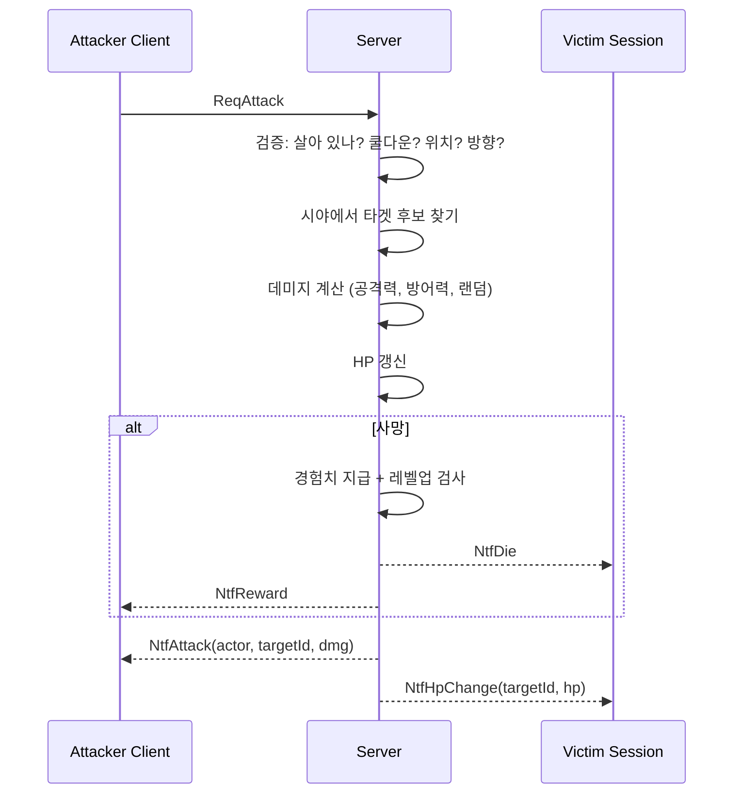
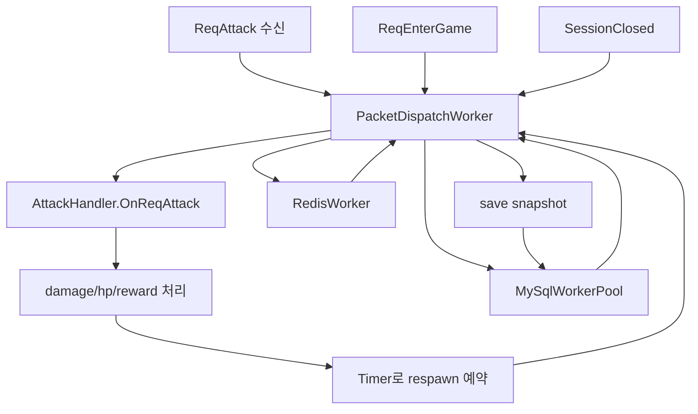

# 5주차 — 전투 시스템

## 0. 이번 주에 풀고 싶은 문제

지금까지 이 게임에는 갈등이 없었다. 캐릭터들이 서로를 보지만 만지지는 않는다. 5주차에는 그 정적을 깨고, 한 캐릭터가 다른 캐릭터를 공격할 수 있게 만든다. HP가 깎이고, 0이 되면 죽고, 죽인 쪽은 경험치를 얻고, 경험치가 쌓이면 레벨이 오른다. 이 모든 결정은 서버가 한다.

이번 주가 끝나면 두 명의 학생이 서로 마주 보고 스페이스바를 누르며 PvP 결투를 흉내 낼 수 있다. 다음 주에 몬스터가 들어오면 같은 시스템 위에서 PvE도 자연스럽게 작동한다.

## 1. 서버 권위가 가장 중요한 곳

이동은 클라이언트가 거짓말을 해도 결국 좌표 한 두 칸의 차이밖에 안 난다. 그러나 전투는 다르다. "내가 데미지 50을 입혔다"라고 클라이언트가 말한다면, 그 한 줄로 게임 밸런스가 무너진다. 그래서 5주차의 모든 코드는 **클라이언트가 "공격을 시도했다"는 사실만 보고하고, 누구에게 얼마의 데미지가 가는지는 서버가 결정한다** 라는 원칙 위에 놓인다.



이 그림에서 클라이언트가 결정한 것이 하나도 없다. 클라이언트는 그저 "공격했다"라고만 알릴 뿐이다.

## 2. 데이터 모델 추가

### 2.1 캐릭터에 HP/MP를 추가

```sql
ALTER TABLE characters
  ADD COLUMN hp     INT NOT NULL DEFAULT 100 AFTER exp,
  ADD COLUMN max_hp INT NOT NULL DEFAULT 100 AFTER hp,
  ADD COLUMN attack INT NOT NULL DEFAULT 10  AFTER max_hp,
  ADD COLUMN defense INT NOT NULL DEFAULT 0  AFTER attack;
```

이번 주 학습용으로는 attack/defense를 캐릭터에 직접 박아 둔다. 운영 게임에서는 보통 직업/장비/버프의 합으로 그때그때 계산한다. 그 구조는 7주차의 아이템 시스템에서 한 단계 확장된다.

### 2.2 PlayerCharacter 클래스 확장

```csharp
public class PlayerCharacter
{
    // ... 기존 ...
    public int Hp { get; set; }
    public int MaxHp { get; set; }
    public int Attack { get; set; }
    public int Defense { get; set; }

    public DateTime LastAttackUtc { get; set; } = DateTime.MinValue;
    public bool IsAlive => Hp > 0;
}
```

`LastAttackUtc`는 쿨다운 검증에 쓰인다. 5주차 학습용 쿨다운은 1초이다. 0.5초 단위로 휘두르는 검을 흉내 내기에는 길지만, 디버깅 가시성이 좋다.

## 3. 새 패킷

```csharp
// 3000번대 — 전투
ReqAttack    = 3001,
NtfAttack    = 3010,    // 누가 누구를 쳤다 (시야 내 모두에게)
NtfHpChange  = 3011,    // 타겟의 HP 가 변했다
NtfDie       = 3012,    // 타겟이 죽었다
NtfReward    = 3013,    // 공격자에게 보상 (exp/level)
NtfRespawn   = 3014,    // 캐릭터 부활
```

### 3.1 ReqAttack 본문

```csharp
[MemoryPackable]
public partial class ReqAttack
{
    /// <summary>0=N 1=E 2=S 3=W — 자기 캐릭터 기준 공격 방향</summary>
    public byte Dir { get; set; }
}
```

특정 타겟 ID를 보내지 않는 것을 주목하라. 클라이언트는 "이쪽으로 휘둘렀다" 라고만 알리고, 누가 맞을지는 서버가 결정한다. 만약 클라이언트가 타겟 ID를 명시하면, 그 ID를 무시하고 서버가 다시 한 번 자기 데이터로 검증해야 한다. 그래서 처음부터 타겟을 받지 않는 디자인이 더 깨끗하다.

## 4. 공격 처리

### 4.1 타겟 후보 찾기

격자 좌표 기준으로 "내 앞 한 칸"이 공격 범위이다. 단순화이지만 학습용으로 잘 작동한다.

```csharp
static (int X, int Y) ForwardTile(PlayerCharacter me, byte dir)
{
    int dx = 0, dy = 0;
    switch (dir)
    {
        case 0: dy = -World.CellSize; break;
        case 1: dx =  World.CellSize; break;
        case 2: dy =  World.CellSize; break;
        case 3: dx = -World.CellSize; break;
    }
    return (me.X + dx, me.Y + dy);
}
```

### 4.2 공격 핸들러

```csharp
public static void OnReqAttack(GameSession s, byte[] body)
{
    if (s.Player is not { } me) return;
    if (!me.IsAlive) return;

    var now = DateTime.UtcNow;
    if ((now - me.LastAttackUtc).TotalMilliseconds < 1000) return; // 쿨다운
    me.LastAttackUtc = now;

    var req = MemoryPackSerializer.Deserialize<ReqAttack>(body)!;
    var (tx, ty) = ForwardTile(me, req.Dir);

    PlayerCharacter? target = World.Default.All()
        .FirstOrDefault(p => p.CharacterId != me.CharacterId
                          && p.IsAlive
                          && p.X == tx && p.Y == ty);

    var ntfAtk = new NtfAttack
    {
        ActorId = me.CharacterId,
        TargetId = target?.CharacterId ?? 0,
        Dir = req.Dir,
    };
    foreach (var n in World.Default.Aoi.Neighbors(me.X, me.Y))
        n.Session.SendPacket(PacketId.NtfAttack, ntfAtk);

    if (target == null) return;

    var dmg = Damage.Calc(me, target);
    target.Hp = Math.Max(0, target.Hp - dmg);

    var ntfHp = new NtfHpChange
    { Id = target.CharacterId, Hp = target.Hp, MaxHp = target.MaxHp };
    foreach (var n in World.Default.Aoi.Neighbors(target.X, target.Y))
        n.Session.SendPacket(PacketId.NtfHpChange, ntfHp);

    if (target.Hp == 0)
        OnKill(me, target);
}
```

이 한 함수에 5주차의 거의 모든 결정이 들어 있다. 짚을 점들이다.

- **`me.IsAlive`**: 죽은 사람은 공격할 수 없다. 클라이언트가 막는 것과 별도로 서버가 막는다.
- **쿨다운 검증**: 1초 주기를 어기면 패킷이 무시된다. 클라이언트는 자기 시계로 막아도, 서버가 한 번 더 막는다.
- **`ntfAtk`를 항상 보낸다**: 타겟이 없어도 "공격 모션"은 모두에게 보인다. 게임 느낌상 자연스럽다.
- **HP 변경은 시야 안 모두에게**: 타겟이 자기뿐 아니라 옆 사람도 보아야 하므로.
- **사망 처리는 별도 함수**로 빼낸다: 5.x절에서 자세히.

## 5. 데미지 공식

### 5.1 단순함이 우선

수십 가지 변수가 들어가는 RPG 데미지 공식은 학습용에는 부담이다. 우리는 다음 한 줄에서 시작한다.

```csharp
public static class Damage
{
    private static readonly Random Rng = new(); // 학습용
    public static int Calc(PlayerCharacter atk, PlayerCharacter def)
    {
        var raw = atk.Attack - def.Defense;
        if (raw < 1) raw = 1;                   // 무기력 방지
        var spread = (int)(raw * 0.2);
        var dmg = raw + Rng.Next(-spread, spread + 1);
        return Math.Max(1, dmg);
    }
}
```

- **±20% 분산**: 매번 같은 데미지가 나오면 단조롭다. 분산은 게임 느낌의 절반.
- **최소 1 보장**: 방어가 공격보다 높을 때도 최소 1은 들어가야 게임이 진행된다.
- **`Random` 인스턴스 한 개**: 학습용으로 단일 인스턴스. 여러 스레드에서 부르면 thread-safety 문제가 있다. 8주차에 thread-static random으로 옮긴다.

### 5.2 더 발전시키려면

학습 후에 직접 시도해 보면 좋은 변형들이 있다. 치명타 확률, 회피 확률, 속성 상성, 후방 공격 보너스 등이다. 이들을 한 번에 합치려고 하지 말고, 한 가지씩 단위 테스트와 함께 추가하는 습관을 들이는 것이 좋다.

## 6. 사망과 보상

### 6.1 OnKill 의 책임

```csharp
private static void OnKill(PlayerCharacter killer, PlayerCharacter victim)
{
    // 시야 안 모두에게 NtfDie
    var ntfDie = new NtfDie { Id = victim.CharacterId };
    foreach (var n in World.Default.Aoi.Neighbors(victim.X, victim.Y))
        n.Session.SendPacket(PacketId.NtfDie, ntfDie);

    // 보상
    var gain = Reward.ExpFor(killer, victim);
    killer.Exp += gain;
    var lvUp = Level.MaybeLevelUp(killer);

    killer.Session.SendPacket(PacketId.NtfReward, new NtfReward
    {
        Exp = gain, NewExpTotal = killer.Exp,
        NewLevel = killer.Level, LeveledUp = lvUp,
    });

    // 부활 예약
    ScheduleRespawn(victim);
}
```

이 함수가 6주차에서 거의 그대로 몬스터에게도 적용된다. **"누구를 죽이느냐"** 가 다를 뿐, "사망 통지 → 보상 → 부활"의 흐름은 동일하다.

### 6.2 부활(Respawn)

학습용에서 부활 정책은 단순하다. 5초 후 시작 좌표로 부활한다.

```csharp
private static void ScheduleRespawn(PlayerCharacter v)
{
    Timer? timer = null;
    timer = new Timer(_ =>
    {
        try
        {
            _packetWorker?.Post(() =>
            {
                v.Hp = v.MaxHp;
                v.X = 400; v.Y = 300;

                var ntf = new NtfRespawn
                { Id = v.CharacterId, X = v.X, Y = v.Y, Hp = v.Hp, MaxHp = v.MaxHp };
                foreach (var n in World.Default.Aoi.Neighbors(v.X, v.Y))
                    n.Session.SendPacket(PacketId.NtfRespawn, ntf);
            });
        }
        finally
        {
            timer?.Dispose();
        }
    }, null, 5000, Timeout.Infinite);
}
```

여기에 두 가지 학습 포인트가 있다.

1. **`Timer` 예약은 학습용으로 단순하다**: 서버가 종료되기 전에 부활이 일어나지 않을 수 있다. 운영에서는 timer wheel이나 scheduled task 큐를 쓴다. 8주차에서 정리.
2. **부활 시점에 시야 안 사람이 다를 수 있다**: 5초 동안 사용자들이 옮겨다녔다. AOI를 다시 계산해 적절히 보낸다.

### 6.3 경험치 곡선

```csharp
public static class Level
{
    public static int RequiredExp(int currentLevel)
        => 100 * currentLevel * currentLevel;   // 1=100, 2=400, 3=900...

    public static bool MaybeLevelUp(PlayerCharacter p)
    {
        bool up = false;
        while (p.Exp >= RequiredExp(p.Level))
        {
            p.Exp -= RequiredExp(p.Level);
            p.Level++;
            p.MaxHp += 10; p.Hp = p.MaxHp;
            p.Attack += 2; p.Defense += 1;
            up = true;
        }
        return up;
    }
}
```

- **`while`**: 한 번에 두 단계 이상 오르는 경우(고레벨 몬스터를 처음 잡았을 때)도 있어서 `if`가 아닌 `while`이다.
- **레벨업 시 HP 풀회복**: 게임 느낌. 운영 게임에서 흔한 결정.
- **레벨당 능력 상승**: 학습용으로 일정한 값. 직업/스킬을 도입하면 여기가 분기 지점이 된다.

## 7. 클라이언트 — 화면 효과

### 7.1 공격 모션

```csharp
case PacketId.NtfAttack:
    var atk = MemoryPackSerializer.Deserialize<NtfAttack>(body)!;
    if (atk.ActorId == _myId) _swingTimerMs = 200;  // 자기 모션
    else if (_others.TryGetValue(atk.ActorId, out var who))
        who.SwingMs = 200;
    break;
```

`SwingMs`는 200ms 동안 캐릭터 색을 잠깐 흰색으로 깜빡이거나, 검 그림자를 그리는 데에 쓰인다. 정확한 픽셀 스프라이트가 없어도, 색 변화만으로도 "지금 공격 중"이라는 사실이 명확하다.

### 7.2 데미지 텍스트

```csharp
case PacketId.NtfHpChange:
    var hp = MemoryPackSerializer.Deserialize<NtfHpChange>(body)!;
    var dmg = (hp.Id == _myId ? _myHp : _others[hp.Id].Hp) - hp.Hp;
    if (dmg > 0) _floatingTexts.Add(new FloatingText { Text = $"-{dmg}", ... });
    if (hp.Id == _myId) _myHp = hp.Hp;
    else _others[hp.Id] = _others[hp.Id] with { Hp = hp.Hp };
    break;
```

`FloatingText`는 800ms 동안 위로 떠오르며 사라지는 단순한 효과이다. 데미지 숫자는 게임 피드백의 핵심이다. 같은 데미지가 들어가도 숫자가 보이는 것과 안 보이는 것의 체감은 천지 차이이다.

### 7.3 HP 바

```csharp
_sb.Draw(_pixel, new Rectangle(p.X, p.Y - 8, 32, 4), Color.Black);
var w = (int)(32 * (p.Hp / (float)p.MaxHp));
_sb.Draw(_pixel, new Rectangle(p.X, p.Y - 8, w, 4), Color.Red);
```

배경 검정 위에 빨강. HP 비율에 따라 너비가 줄어든다. 30% 미만에서 노랑, 10% 미만에서 깜빡임 같은 정책 분기를 둘 수 있다.

## 8. 자주 막히는 곳

### 8.1 "공격을 두 번 누르면 두 번 데미지가 들어가요"

쿨다운이 너무 짧거나 검증을 빼먹은 경우이다. 1초가 너무 길면 200~400ms 사이에서 시작해도 충분하다.

### 8.2 "같은 사람이 두 번 죽어요"

`target.Hp = Math.Max(0, target.Hp - dmg)` 직후 `if (target.Hp == 0)` 검사를 한다. 그런데 두 공격자가 동시에 같은 타겟을 때리면, race condition으로 OnKill이 두 번 불릴 수 있다. 단순한 락 또는 `Interlocked` 흐름을 추가해 풀 수 있다. 학습용에서는 그저 "한 번만 부활한다"라는 후처리로 막아도 된다.

### 8.3 "경험치 적용이 안 돼요"

DB에 저장하는 시점이 SessionClosed인 것을 잊고, 게임 중에 DB를 들여다보면 옛 값이 보인다. 메모리에는 들어 있지만 영속화는 늦다. 8주차에서 주기적 저장으로 보완한다.

## 9. 5주차 마무리 체크리스트

- [ ] 두 클라이언트가 마주 보고 스페이스바를 누르면 서로의 HP가 깎인다.
- [ ] 한쪽 HP가 0이 되면 사망 처리되고, 5초 뒤 부활한다.
- [ ] 죽인 쪽은 경험치를 받고, 일정 임계값 이상이면 레벨업한다.
- [ ] 공격 모션과 데미지 텍스트가 화면에 보인다.
- [ ] 캐릭터를 종료하고 다시 들어와도 레벨/경험치/HP가 유지된다.

## 10. 연습 문제

1. **치명타를 추가하라.** 10% 확률로 데미지가 두 배가 된다. NtfHpChange에 `IsCritical` 필드를 추가하고 클라이언트에서 노란색 데미지 텍스트로 그려라.
2. **공격 범위를 두 칸으로 늘려라.** 격자 한 칸 앞이 아니라 두 칸 앞까지 닿게. 그 사이에 다른 캐릭터가 있어도 닿을 수 있다.
3. **PvP 토글을 추가하라.** "전투 가능" 모드와 "비전투" 모드를 가진다. 비전투 모드의 캐릭터는 공격을 받지 않는다. 캐릭터 안에 boolean 한 개만 추가하면 된다.

## 11. 다음 주 예고

6주차에서는 또 다른 종류의 캐릭터 — 몬스터가 등장한다. 사람과 비슷하게 World 안에 살지만, 입력이 없는 대신 AI tick에서 행동을 결정한다. 우리가 5주차에 만든 데미지/사망/보상 흐름이 그대로 재사용된다. "공통의 추상화" 가 있는 코드가 나중에 얼마나 유리한지 자연스럽게 느낄 것이다.

## 현재 코드 기준 서버 스레드 구조 보정

5장 예제도 `PacketDispatchWorker`, `RedisWorker`, `MySqlWorkerPool` 구조를 따른다. `Program.cs`는 `GameServer.RunFromAppSettingsAsync()`만 호출하고, `GameServer`가 설정 로드, 핸들러 등록, 워커 수명주기, SuperSocketLite `Setup/Start`를 담당한다.

`EnterGameHandler`는 `async void`가 아니다. 패킷 워커에서는 요청을 역직렬화하고 Redis 요청을 `redisWorker.Post`로 넘긴다. Redis 결과가 패킷 워커로 돌아온 뒤 MySQL 요청을 `mySqlWorkerPool.Post`로 넘기며, MySQL 워커 풀은 캐릭터 좌표와 전투 스탯을 조회한다. 세션 필드 설정, `World.Default.Add`, 브로드캐스트, 응답 전송은 다시 패킷 워커에서 처리한다.

5장의 전투 핸들러는 패킷 워커에서 동기적으로 공격 판정, HP 변경, 사망 처리, 보상 지급을 수행한다. 플레이어 부활 예약은 일회성 `Timer`가 담당하지만, 타이머 콜백은 직접 HP/좌표를 바꾸지 않고 `PacketDispatchWorker`에 부활 작업을 다시 넣는다.

세션 종료 시에는 패킷 워커가 월드 제거와 저장 스냅샷을 만든 뒤, 캐릭터 좌표와 전투 스탯 저장만 `MySqlWorkerPool.SavePlayer`로 넘긴다.


