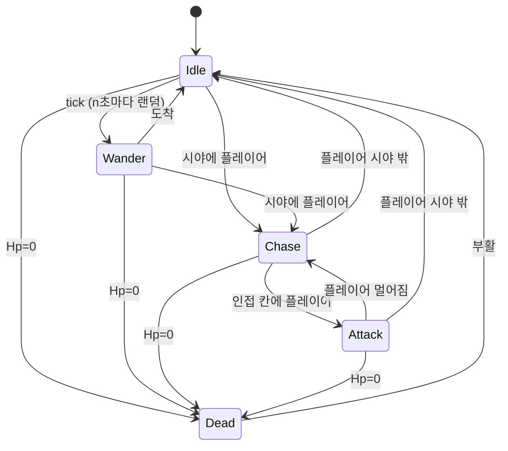
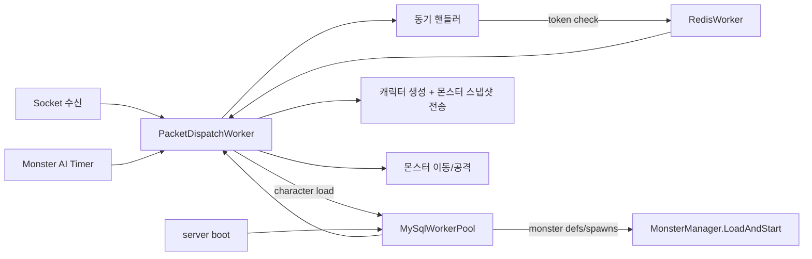

# 6주차 — 몬스터 시스템

## 0. 이번 주에 풀고 싶은 문제

지금까지 월드 안의 살아 있는 캐릭터는 사람이 조종하는 PlayerCharacter뿐이었다. 5주차에 PvP를 만들어 두긴 했지만, 친구가 옆에 없으면 게임이 심심하다. 6주차에서는 사람이 아닌 캐릭터 — 몬스터 — 를 등장시킨다. 몬스터는 입력을 받지 않고 서버의 AI tick 안에서 스스로 행동을 결정한다. 5주차의 데미지/사망/보상 흐름은 거의 그대로 재사용된다.

이번 주가 끝나면 맵 위에 빨간 원형 몬스터 5마리가 떠다니고, 사람이 다가가서 공격하면 몬스터 HP가 깎이고, 죽이면 경험치가 들어오고, 일정 시간 후 같은 자리에 다시 살아난다.

## 1. 추상화의 시간

### 1.1 사람과 몬스터의 공통점

- 둘 다 좌표(X,Y)를 가진다.
- 둘 다 HP와 데미지 능력치를 가진다.
- 둘 다 공격을 받고, 죽을 수 있고, 부활할 수 있다.

차이점은 둘 다 비슷한 한 줄로 표현된다.

- 사람은 패킷 입력으로 움직이고, 몬스터는 AI로 움직인다.
- 사람은 게임 서버에서 영속화되고, 몬스터는 메모리 + 정의 테이블이다.

이 정리에서 자연스러운 추상화가 도출된다.

```csharp
public abstract class Actor
{
    public long Id { get; init; }
    public string Name { get; set; } = "";
    public int X { get; set; }
    public int Y { get; set; }
    public int Hp { get; set; }
    public int MaxHp { get; set; }
    public int Attack { get; set; }
    public int Defense { get; set; }
    public bool IsAlive => Hp > 0;
}

public class PlayerActor : Actor { public GameSession Session { get; init; } = null!; ... }
public class MonsterActor : Actor { public int MonsterDefId { get; init; } public AiState State { get; set; } ... }
```

5주차 코드에서 PlayerCharacter가 들고 있던 멤버들이 거의 다 Actor로 올라갔다. 이런 리팩토링은 처음 하는 학생에게는 부담일 수 있는데, **"공통 추상화는 두 번째 사용 사례가 등장했을 때 만든다"** 라는 격언을 직접 체험할 좋은 기회이다.

### 1.2 ID 충돌 막기

PlayerCharacter의 ID는 DB의 BIGINT auto increment에서 오고, MonsterActor의 ID는 우리가 발급한다. 같은 ID 공간을 쓰면 패킷 한 개의 `Id` 필드만 보고는 사람인지 몬스터인지 알 수 없다. 그래서 다음 정책을 쓴다.

- 플레이어 캐릭터 ID: 1 ~ 999_999_999
- 몬스터 인스턴스 ID: 1_000_000_000 부터 시작 (`Interlocked.Increment`)

ID 한 번 보고 어느 쪽인지를 즉시 안다. 운영에서는 더 정교한 type-tagged ID를 쓰지만 학습용으로는 단순한 대역 분리로 충분하다.

## 2. 몬스터 정의

### 2.1 DB 스키마 — monsters 테이블

```sql
CREATE TABLE monsters (
    id           INT         NOT NULL PRIMARY KEY,
    name         VARCHAR(32) NOT NULL,
    max_hp       INT         NOT NULL,
    attack       INT         NOT NULL,
    defense      INT         NOT NULL,
    exp_reward   INT         NOT NULL,
    move_speed   INT         NOT NULL DEFAULT 1,    -- 칸/tick
    aggro_range  INT         NOT NULL DEFAULT 192,  -- 픽셀
    respawn_sec  INT         NOT NULL DEFAULT 10
) ENGINE=InnoDB CHARSET=utf8mb4;

CREATE TABLE monster_spawns (
    id           INT         NOT NULL AUTO_INCREMENT PRIMARY KEY,
    monster_id   INT         NOT NULL,
    x            INT         NOT NULL,
    y            INT         NOT NULL,
    CONSTRAINT fk_spawn_monster FOREIGN KEY (monster_id) REFERENCES monsters(id)
) ENGINE=InnoDB CHARSET=utf8mb4;

INSERT INTO monsters VALUES (1, '슬라임', 50, 5, 0, 30, 1, 192, 10);
INSERT INTO monster_spawns (monster_id, x, y) VALUES
  (1, 200, 200), (1, 300, 300), (1, 500, 200), (1, 600, 400), (1, 100, 500);
```

이 두 테이블 분리에 두 가지 의도가 있다.

- **`monsters` = 종(species)**: 슬라임, 오크, 드래곤이라는 "타입"을 정의한다.
- **`monster_spawns` = 인스턴스의 시작 위치**: 같은 슬라임 타입이 다섯 군데에서 등장한다.

운영 게임에서는 정의 테이블은 보통 `read-only`로 두고, 변경 시 어드민 도구로 수정한 뒤 서버를 한 번 reload한다. 학습용에서는 서버 시작 시점에 한 번 읽어 메모리에 올린다.

## 3. 새 패킷

```csharp
// 4000번대 — 몬스터
NtfMonsterEnter = 4001,    // 시야 안에 몬스터가 들어옴
NtfMonsterLeave = 4002,
NtfMonsterMove  = 4003,
```

전투 패킷(NtfHpChange/NtfDie/NtfRespawn)은 사람과 같은 패킷을 쓴다. 5주차에서 Id 필드를 long으로 두었기 때문에 그대로 재사용 가능하다. 이 점이 1.1절의 추상화 가치이다.

```csharp
[MemoryPackable]
public partial class MonsterSnapshot
{
    public long Id { get; set; }
    public int DefId { get; set; }
    public string Name { get; set; } = "";
    public int X { get; set; }
    public int Y { get; set; }
    public int Hp { get; set; }
    public int MaxHp { get; set; }
}
```

## 4. AI — 가장 단순한 상태 머신

### 4.1 세 상태



이 정도가 학습용에 적절하다. 더 복잡한 행동(도주, 그룹 공격, 패턴)은 모두 이 다섯 상태의 변형이라 한 번 익히면 확장이 쉽다.

### 4.2 AI tick

```csharp
public class MonsterManager
{
    private readonly List<MonsterActor> _all = new();
    private readonly Timer _timer;

    public MonsterManager() { _timer = new Timer(_ => Tick(), null, 1000, 1000); }

    public void Tick()
    {
        foreach (var m in _all)
        {
            if (!m.IsAlive) continue;
            switch (m.State)
            {
                case AiState.Idle:    TickIdle(m);    break;
                case AiState.Wander:  TickWander(m);  break;
                case AiState.Chase:   TickChase(m);   break;
                case AiState.Attack:  TickAttack(m);  break;
            }
        }
    }
}
```

1초에 한 번 tick. 각 몬스터의 상태에 따라 동작이 분기된다.

### 4.3 Idle → Wander → Chase

```csharp
private void TickIdle(MonsterActor m)
{
    var prey = FindPrey(m);
    if (prey != null) { m.State = AiState.Chase; m.TargetId = prey.CharacterId; return; }

    if (Rng.Next(0, 4) == 0)        // 25% 확률로 wander 시작
    {
        m.State = AiState.Wander;
        m.WanderRemaining = Rng.Next(3, 8);
    }
}

private PlayerCharacter? FindPrey(MonsterActor m)
{
    PlayerCharacter? best = null; long bestDist = long.MaxValue;
    foreach (var p in World.Default.All())
    {
        if (!p.IsAlive) continue;
        var dx = p.X - m.X; var dy = p.Y - m.Y;
        var dist2 = (long)dx * dx + (long)dy * dy;
        if (dist2 <= m.AggroRange * m.AggroRange && dist2 < bestDist)
        {
            best = p; bestDist = dist2;
        }
    }
    return best;
}
```

- **거리 비교는 제곱 거리로**: 매 tick마다 `Math.Sqrt`를 부르지 않는다. 비교만 할 거라면 제곱이면 충분하다.
- **`long`으로 곱**: 픽셀 좌표가 800짜리만 되어도 `int * int`가 오버플로 위험에 들어간다. 아주 큰 맵을 만나면 무음 버그가 된다. 일찍 long으로 올리는 습관이 좋다.

### 4.4 Chase 와 Attack

```csharp
private void TickChase(MonsterActor m)
{
    var target = World.Default.Get(m.TargetId);
    if (target == null || !target.IsAlive) { m.State = AiState.Idle; return; }

    var dx = target.X - m.X; var dy = target.Y - m.Y;
    var distSq = dx * dx + dy * dy;
    if (distSq > m.AggroRange * m.AggroRange * 2)  // 너무 멀어지면 포기
    { m.State = AiState.Idle; m.TargetId = 0; return; }

    if (distSq <= World.CellSize * World.CellSize * 2)
    {
        m.State = AiState.Attack;
        return;
    }

    // 한 칸 이동
    int sx = Math.Sign(dx), sy = Math.Sign(dy);
    var nx = Math.Clamp(m.X + sx * World.CellSize, 0, World.Default.Width - World.CellSize);
    var ny = Math.Clamp(m.Y + sy * World.CellSize, 0, World.Default.Height - World.CellSize);
    m.X = nx; m.Y = ny;
    BroadcastMonsterMove(m);
}

private void TickAttack(MonsterActor m)
{
    var target = World.Default.Get(m.TargetId);
    if (target == null || !target.IsAlive) { m.State = AiState.Idle; return; }

    if ((DateTime.UtcNow - m.LastAttackUtc).TotalMilliseconds < 1500) return;
    m.LastAttackUtc = DateTime.UtcNow;

    var dmg = Damage.Calc(m, target);
    target.Hp = Math.Max(0, target.Hp - dmg);

    var ntfAtk = new NtfAttack { ActorId = m.Id, TargetId = target.CharacterId, Dir = 0 };
    var ntfHp = new NtfHpChange { Id = target.CharacterId, Hp = target.Hp, MaxHp = target.MaxHp };
    foreach (var n in World.Default.Aoi.Neighbors(target.X, target.Y))
    {
        n.Session.SendPacket(PacketId.NtfAttack, ntfAtk);
        n.Session.SendPacket(PacketId.NtfHpChange, ntfHp);
    }

    if (target.Hp == 0) OnPlayerKilled(m, target);
}
```

5주차의 사람 공격 코드와 거의 같다는 사실을 주목하라. 이런 구조적 일치는 **"양쪽이 같은 추상화 위에 서 있다"** 라는 신호이다. 한 발 더 가면 사람과 몬스터의 공격 코드가 한 함수로 합쳐질 수도 있는데, 그 단계는 아직 일러서 학습 흐름상 둘로 둔다.

## 5. 몬스터 사망과 부활

### 5.1 몬스터가 죽으면

```csharp
public static void OnMonsterKilled(MonsterActor m, PlayerCharacter killer)
{
    var ntfDie = new NtfDie { Id = m.Id, KillerId = killer.CharacterId };
    foreach (var n in World.Default.Aoi.Neighbors(m.X, m.Y))
        n.Session.SendPacket(PacketId.NtfDie, ntfDie);

    killer.Exp += m.ExpReward;
    var lv = Level.MaybeLevelUp(killer);
    killer.Session.SendPacket(PacketId.NtfReward, new NtfReward
    {
        Exp = m.ExpReward, NewExpTotal = killer.Exp,
        NewLevel = killer.Level, LeveledUp = lv,
    });

    World.Default.Monsters.MarkForRespawn(m, m.RespawnSec);
}
```

5주차에서 만든 NtfDie/NtfReward 패킷을 다시 쓴다는 점이 중요하다. 클라이언트의 처리 코드가 그대로 작동한다.

### 5.2 RespawnQueue

```csharp
public class RespawnQueue
{
    private record Entry(MonsterActor Monster, DateTime AtUtc);
    private readonly List<Entry> _entries = new();
    private readonly object _lock = new();

    public void Enqueue(MonsterActor m, int seconds)
    {
        lock (_lock)
            _entries.Add(new(m, DateTime.UtcNow.AddSeconds(seconds)));
    }

    public void TickRespawn()
    {
        var now = DateTime.UtcNow;
        List<MonsterActor> ready;
        lock (_lock)
        {
            ready = _entries.Where(e => e.AtUtc <= now).Select(e => e.Monster).ToList();
            _entries.RemoveAll(e => e.AtUtc <= now);
        }
        foreach (var m in ready) RespawnAt(m, m.SpawnX, m.SpawnY);
    }
}
```

- **`Task.Delay`로 한 마리씩 비동기 부활**과 비교했을 때, **단일 큐**의 장점이 무엇인가. 부활할 모든 몬스터가 한 곳에 보이면 디버깅이 수월하고, 서버 종료 시 깔끔하게 정리할 수 있다. 단일 책임을 가진 자료구조 한 개가 분산된 Task보다 운영하기 쉽다.

## 6. 클라이언트 — 몬스터 그리기

### 6.1 자료구조

```csharp
class MonsterView
{
    public long Id; public int DefId; public string Name = "";
    public int X, Y, TargetX, TargetY;
    public int Hp, MaxHp;
}
private Dictionary<long, MonsterView> _monsters = new();
```

위치 보간은 사람과 동일한 패턴이다.

### 6.2 색깔 분기

플레이어와 몬스터의 ID가 1_000_000_000을 기준으로 갈리므로, 그것만 보고 색을 정한다.

```csharp
var color = id < 1_000_000_000 ? Color.SteelBlue : Color.IndianRed;
_sb.Draw(_pixel, new Rectangle(x, y, 32, 32), color);
```

학습용 기본 색이지만, MonsterDefId별로 다른 텍스처를 그리는 단계로 곧바로 확장된다.

### 6.3 NtfHpChange의 분기

5주차의 코드에서 이미 `Id`만 보고 사람/몬스터 dictionary 둘 다 검색하도록 짠 셈이다. 6주차에서는 그 분기가 자연스럽게 작동한다.

```csharp
case PacketId.NtfHpChange:
    var hp = MemoryPackSerializer.Deserialize<NtfHpChange>(body)!;
    if (hp.Id == _myId) { _myHp = hp.Hp; }
    else if (_others.ContainsKey(hp.Id)) UpdateOther(hp);
    else if (_monsters.ContainsKey(hp.Id)) UpdateMonster(hp);
    break;
```

## 7. 자주 막히는 곳

### 7.1 "몬스터가 같은 자리에서 떨고 있어요"

타겟이 자기보다 한 칸 옆에 있을 때 Chase가 0칸 이동을 하다가 Attack이 되는 진동이 일어난다. `distSq <= ...` 비교 식의 경계를 한 셀이 아니라 두 셀로 잡거나, "이전 위치"를 기억해서 같은 자리로 돌아가지 않게 한다.

### 7.2 "한 명을 두 마리가 동시에 패면 데미지가 이상해요"

`target.Hp = Math.Max(0, target.Hp - dmg)` 부분에서 race가 일어나는 경우이다. 한 tick 안에 모두 처리되면 직렬화되어 안전한데, 서로 다른 스레드에서 처리되면 손실이 생길 수 있다. 학습용에서는 `Interlocked.Add`로 누적하고 마지막에 한 번 검사하는 식으로 막을 수 있다.

### 7.3 "부활이 두 번 일어나요"

OnMonsterKilled가 두 번 불려서 RespawnQueue에 두 번 들어간 경우이다. 5주차의 `if (target.Hp == 0)` 검사 직후 `target.Hp = -1` 처럼 sentinel 값으로 한 번만 처리되도록 막거나, 이미 부활 큐에 든 몬스터는 다시 넣지 않도록 검사한다.

## 8. 6주차 마무리 체크리스트

- [ ] 서버 시작 시 몬스터 5마리가 spawn 정보대로 등장한다.
- [ ] 플레이어가 다가가면 몬스터가 따라오고 공격한다.
- [ ] 플레이어가 공격해서 죽이면 경험치가 오른다.
- [ ] 일정 시간 후 몬스터가 같은 위치에 다시 살아난다.
- [ ] 두 명의 플레이어가 한 몬스터를 같이 공격해도 충돌 없이 동작한다.

## 9. 연습 문제

1. **`monster_spawns` 테이블에 새 행을 직접 INSERT 하라.** 서버를 재시작하면 6번째 몬스터가 그 자리에 등장하는 것을 확인. 데이터를 통한 게임 변경의 첫 경험이다.
2. **AggroRange를 멀리(예: 400px) 만들어 보라.** 한 명이 도망치면 여러 마리가 한꺼번에 따라오는 모습을 보고, "MMORPG의 군집 처리"가 왜 어려운지 직감으로 이해한다.
3. **`MonsterDefId`별로 다른 색**을 클라이언트에 적용하라. 추후 텍스처 매핑으로 확장될 시작점이다.

## 10. 다음 주 예고

7주차에서는 몬스터 죽음의 의미가 한층 진해진다. 죽은 몬스터가 아이템을 떨어뜨리고, 플레이어가 그 위로 가면 줍는다. 인벤토리 10칸이 만들어지고, 포션을 쓰면 HP가 회복된다. DB에 items와 inventory 테이블이 추가된다.

## 현재 코드 기준 서버 스레드 구조 보정

6장 예제도 `PacketDispatchWorker`, `RedisWorker`, `MySqlWorkerPool` 구조를 사용한다. `Program.cs`는 `GameServer.RunFromAppSettingsAsync()`만 호출한다. `GameServer`는 워커 생성, 몬스터 초기 로딩, 핸들러 등록, 소켓 서버 시작까지 맡는다.

입장 처리에서 Redis 토큰 검증은 `RedisWorker`가 담당하고, MySQL 캐릭터 조회는 `MySqlWorkerPool`이 담당한다. 두 작업 결과는 모두 `PacketDispatchWorker`로 되돌아온다. 세션 필드 설정, `World.Default.Add`, 주변 몬스터 스냅샷 전송은 패킷 워커에서만 수행한다.

몬스터 정의와 스폰 정보 로드도 현재 코드는 직접 MySQL 연결을 열어 처리하지 않는다. `GameServer`가 `await _mySqlWorkerPool.LoadMonstersAsync()`로 MySQL 워커 풀에 초기 로딩을 요청하고, 그 결과 DTO를 `MonsterManager.Instance.LoadAndStart(...)`에 전달한다. 몬스터 AI와 리스폰 타이머는 직접 게임 데이터를 변경하지 않고 `PacketDispatchWorker`에 tick 작업을 넣는다.



