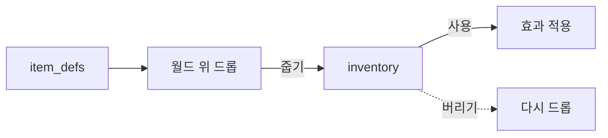
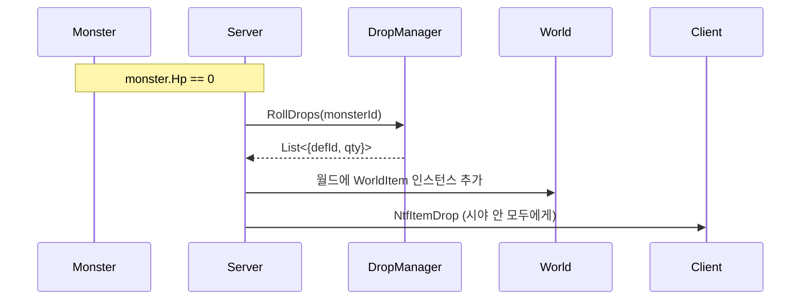
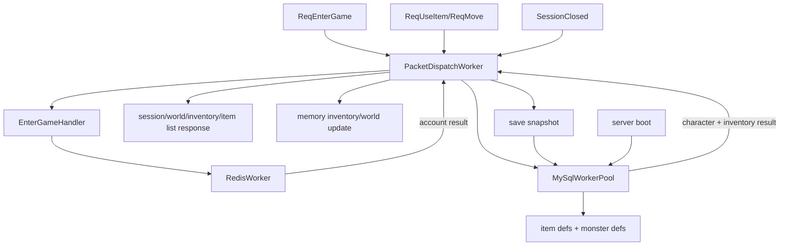

# 7주차 — 아이템 시스템

## 0. 이번 주에 풀고 싶은 문제

지금까지 몬스터를 잡으면 경험치만 들어왔다. RPG의 진짜 보상은 아이템이다. 이번 주에는 몬스터가 죽을 때 일정 확률로 아이템을 떨어뜨리고, 플레이어가 그 위로 가면 줍고, 인벤토리에 쌓이고, 포션을 사용하면 HP가 회복되는 한 사이클을 완성한다.

이번 주가 끝나면 화면 위에 빨간 약병이 떨어지고, 줍고, 단축키로 사용해서 HP가 회복되는 모습이 보인다.

## 1. 아이템 시스템의 세 축



설계가 어그러지는 가장 흔한 이유는 "아이템 정의"와 "아이템 인스턴스"를 헷갈리는 것이다. **HP 포션이라는 종류는 한 개**이지만, 인벤토리에는 그 포션이 다섯 개 있을 수 있다. 데이터를 두 층으로 나누어야 한다.

- **item_defs**: 아이템 종류 정의 (id, name, type, effect_amount, max_stack)
- **inventory**: 한 캐릭터가 어떤 종류의 아이템을 몇 개 가졌나
- **world drops**: 월드 위에 떨어진 아이템 인스턴스 (몬스터 사망 직후 잠시 존재)

## 2. DB 스키마

```sql
CREATE TABLE item_defs (
    id          INT NOT NULL PRIMARY KEY,
    name        VARCHAR(32) NOT NULL,
    type        TINYINT NOT NULL,        -- 1=potion, 2=weapon, 3=armor (이번 주는 1만)
    effect_kind TINYINT NOT NULL,        -- 1=heal_hp
    effect_amt  INT NOT NULL,
    max_stack   INT NOT NULL DEFAULT 1
) ENGINE=InnoDB CHARSET=utf8mb4;

INSERT INTO item_defs VALUES
  (1001, '소형 포션', 1, 1, 30, 99);

CREATE TABLE inventory (
    id           BIGINT NOT NULL AUTO_INCREMENT PRIMARY KEY,
    character_id BIGINT NOT NULL,
    slot_idx     INT    NOT NULL,
    item_def_id  INT    NOT NULL,
    qty          INT    NOT NULL,
    INDEX idx_inv_char (character_id),
    UNIQUE KEY uk_inv_slot (character_id, slot_idx),
    CONSTRAINT fk_inv_char FOREIGN KEY (character_id) REFERENCES characters(id),
    CONSTRAINT fk_inv_def  FOREIGN KEY (item_def_id) REFERENCES item_defs(id)
) ENGINE=InnoDB CHARSET=utf8mb4;

CREATE TABLE monster_drops (
    id          INT NOT NULL AUTO_INCREMENT PRIMARY KEY,
    monster_id  INT NOT NULL,
    item_def_id INT NOT NULL,
    chance      INT NOT NULL,           -- 1~10000 (1/10000 단위)
    qty_min     INT NOT NULL DEFAULT 1,
    qty_max     INT NOT NULL DEFAULT 1
) ENGINE=InnoDB CHARSET=utf8mb4;

INSERT INTO monster_drops (monster_id, item_def_id, chance, qty_min, qty_max)
  VALUES (1, 1001, 5000, 1, 1);   -- 슬라임이 50% 확률로 포션 1개
```

### 2.1 슬롯 설계 결정

`inventory.slot_idx`로 슬롯 번호를 직접 들고 있는다. 이렇게 두면 다음 두 가지가 자연스럽다.

- 클라이언트의 인벤토리 그리드와 1:1 대응이 명확하다.
- 사용자가 슬롯을 비우거나 바꿔 끼우는 UX를 그대로 표현할 수 있다.

대안은 슬롯을 두지 않고 단순 list로 두고 클라이언트가 알아서 정렬하는 것인데, 이 경우 같은 시점에 두 클라이언트(예: 모바일과 PC)가 보는 순서가 다를 수 있다.

### 2.2 chance 단위

`chance INT 1~10000`. 0.01% 단위로 표현 가능. float을 쓰지 않는 이유는 정수 비교가 racy하지 않고 디버깅이 쉽기 때문이다.

## 3. 새 패킷

```csharp
// 5000번대 — 아이템
NtfItemDrop      = 5001,    // 월드에 아이템이 떨어짐
NtfItemPickup    = 5002,    // 누군가 주웠다 (월드에서 사라짐)
NtfInventory     = 5010,    // 입장 시 인벤토리 전체 또는 갱신
ReqUseItem       = 5101,
NtfItemUseResult = 5102,
```

### 3.1 본문

```csharp
[MemoryPackable]
public partial class WorldItem
{
    public long Id { get; set; }
    public int DefId { get; set; }
    public int Qty { get; set; }
    public int X { get; set; }
    public int Y { get; set; }
}

[MemoryPackable]
public partial class InventorySlot
{
    public int SlotIdx { get; set; }
    public int DefId { get; set; }
    public int Qty { get; set; }
}

[MemoryPackable]
public partial class NtfInventory
{
    public InventorySlot[] Slots { get; set; } = Array.Empty<InventorySlot>();
}

[MemoryPackable]
public partial class ReqUseItem { public int SlotIdx { get; set; } }
```

## 4. 아이템 드롭 흐름



### 4.1 DropManager

```csharp
public class DropManager
{
    private readonly Dictionary<int, List<DropEntry>> _byMonster = new();
    private long _nextItemId = 5_000_000_000;

    public List<(int defId, int qty)> Roll(int monsterDefId)
    {
        var result = new List<(int, int)>();
        if (!_byMonster.TryGetValue(monsterDefId, out var entries)) return result;
        foreach (var e in entries)
        {
            var roll = Rng.Next(0, 10000);
            if (roll < e.Chance)
            {
                var qty = Rng.Next(e.QtyMin, e.QtyMax + 1);
                result.Add((e.ItemDefId, qty));
            }
        }
        return result;
    }
}
```

- 각 몬스터에 여러 드롭 테이블 행이 있을 수 있다.
- 한 번 죽을 때 여러 아이템이 동시에 떨어질 수 있다.
- 확률 검사는 행마다 독립이다(누적 합이 100%일 필요 없음).

### 4.2 떨어진 아이템 자료구조

```csharp
public class WorldItemEntity
{
    public long Id { get; init; }
    public int DefId { get; init; }
    public int Qty { get; set; }
    public int X { get; set; }
    public int Y { get; set; }
    public DateTime ExpireUtc { get; set; }
}
```

`ExpireUtc`로 30초 정도 지나면 자동 사라지게 둔다. 무한히 누적되면 메모리/패킷이 부풀어 오른다.

### 4.3 줍기 처리

플레이어가 떨어진 아이템 위로 이동하면 자동 줍는 정책으로 시작한다.

```csharp
private static void OnAfterMove(PlayerCharacter p)
{
    foreach (var wi in WorldItems.AtTile(p.X, p.Y))
    {
        if (Inventory.TryAdd(p.CharacterId, wi.DefId, wi.Qty))
        {
            WorldItems.Remove(wi.Id);
            BroadcastPickup(p, wi);
            SendInventory(p);
        }
    }
}
```

- **인벤토리 가득**: 같은 종류라면 stack에 합치고, 다르면 빈 슬롯에 넣고, 둘 다 안 되면 그대로 둔다.
- **여러 명이 동시에 한 아이템 위에**: 먼저 도달한 사람이 가져간다. `TryRemove` 같은 원자 연산으로 보장.

## 5. 인벤토리

### 5.1 메모리에 캐시

```csharp
public class Inventory
{
    private readonly Dictionary<int, InventorySlot> _bySlot = new();
    public IReadOnlyDictionary<int, InventorySlot> Slots => _bySlot;

    public bool TryAdd(int defId, int qty, int maxStack)
    {
        // 1) 동일 defId 슬롯에 합치기
        var same = _bySlot.Values.FirstOrDefault(s => s.DefId == defId && s.Qty < maxStack);
        if (same != null)
        {
            var add = Math.Min(qty, maxStack - same.Qty);
            same.Qty += add; qty -= add;
            if (qty == 0) return true;
        }
        // 2) 빈 슬롯
        for (int i = 0; i < 10; i++)
            if (!_bySlot.ContainsKey(i))
            { _bySlot[i] = new InventorySlot { SlotIdx = i, DefId = defId, Qty = qty }; return true; }
        return false;
    }
}
```

스택 합치기를 우선하고, 빈 슬롯을 그 다음으로 시도. 이 순서가 깨지면 같은 포션이 두 슬롯에 분리되어 들어가는 못생긴 모습이 나온다.

### 5.2 영속화 정책

- **메모리에 한 부**: 게임 중 빠른 검색.
- **DB에 한 부**: 영속 데이터.

학습용에서는 다음 시점에 DB로 동기화한다.

- 세션 종료 시점

현재 예제에서는 줍기/사용 직후 DB를 갱신하지 않고 메모리 인벤토리를 먼저 바꾼다. 세션 종료 시점에 `MySqlWorkerPool` 작업 큐로 캐릭터와 인벤토리 저장을 전달한다. 운영 게임에서는 write-behind 큐, 주기 저장, 종료 flush 정책을 더 정교하게 다룬다.

## 6. 아이템 사용

### 6.1 ReqUseItem 처리

```csharp
public static void OnReqUseItem(GameSession s, byte[] body)
{
    if (s.Player is not { } me || !me.IsAlive) return;
    var req = MemoryPackSerializer.Deserialize<ReqUseItem>(body)!;

    var inv = me.Inventory;
    if (!inv.Slots.TryGetValue(req.SlotIdx, out var slot)) return;

    var def = ItemDefs.Get(slot.DefId);
    if (def == null) return;

    if (def.Type != ItemType.Potion)        // 학습용에서는 포션만
    {
        s.SendPacket(PacketId.NtfItemUseResult, new NtfItemUseResult { Ok = false, Reason = "not_usable" });
        return;
    }

    // 효과 적용
    switch (def.EffectKind)
    {
        case EffectKind.HealHp:
            me.Hp = Math.Min(me.MaxHp, me.Hp + def.EffectAmt);
            break;
    }

    // 인벤토리 차감
    slot.Qty--;
    if (slot.Qty == 0) inv.Remove(slot.SlotIdx);

    SendInventory(me);
    BroadcastHp(me);
    s.SendPacket(PacketId.NtfItemUseResult, new NtfItemUseResult { Ok = true });
}
```

- **사망 검사**: 죽은 사람은 포션을 못 쓴다.
- **타입 검사**: 무기를 ReqUseItem으로 쓰려고 하면 단호하게 거절한다.
- **효과 적용 → 차감** 순서: 차감을 먼저 하면 효과가 실패했을 때 아이템 손실이 일어난다. 효과 → 차감의 순서를 지킨다.

### 6.2 부분 실패 처리

포션을 쓰려는데 HP가 이미 풀이라면 어떻게 할까. 두 가지 정책이 있다.

- **단호한 거절**: "이미 풀이라 못 씁니다." 사용자가 헷갈릴 수 있다.
- **소비**: HP는 그대로지만 포션은 사라진다. 사용자가 화낼 수 있다.

운영 게임에서 더 흔한 답은 **"아이템을 미리 쿨다운으로 막는다"** 이다. 풀일 때는 포션 슬롯을 비활성화한다. 학습용에서는 단호한 거절(`already_full`)을 쓴다.

## 7. 클라이언트 — 인벤토리 UI

### 7.1 그리드 렌더링

```csharp
for (int i = 0; i < 10; i++)
{
    var rect = new Rectangle(20 + i * 36, 540, 32, 32);
    _sb.Draw(_pixel, rect, Color.DarkSlateGray);
    if (_inv.TryGetValue(i, out var slot))
    {
        _sb.Draw(_iconByDef[slot.DefId], rect, Color.White);
        if (slot.Qty > 1)
            _sb.DrawString(_font, slot.Qty.ToString(), new Vector2(rect.Right - 16, rect.Bottom - 16), Color.White);
    }
}
```

- 5주차의 단순 사각형 그리기 패턴을 반복.
- 수량은 우하단에 작은 글씨로.
- 아이템 종류별로 다른 아이콘. `_iconByDef`는 LoadContent에서 채운다.

### 7.2 단축키 사용

```csharp
if (Pressed(Keys.D1)) UseSlot(0);
if (Pressed(Keys.D2)) UseSlot(1);
...

void UseSlot(int idx) => _net.Send(PacketId.ReqUseItem, new ReqUseItem { SlotIdx = idx });
```

학습용에서는 1~9 키로 슬롯 1~9에 매핑한다. 마우스 우클릭으로 사용하는 UX는 7.4의 연습 문제로 둔다.

### 7.3 드래그 앤 드롭 (선택)

같은 종류면 합치고, 다른 종류면 위치를 교환하는 UX이다. 패킷 한 개(`ReqMoveSlot`)와 서버측 슬롯 교환 로직 한 개로 만들 수 있다. 학습용에서는 시간 사정에 따라 옵션으로 둔다.

## 8. 자주 막히는 곳

### 8.1 "줍기가 두 번 되어 인벤토리가 두 배로 들어가요"

이동 후 줍기 검사가 race로 두 번 불리는 경우이다. `WorldItems.Remove`를 원자적으로 하고, 그 결과가 true일 때만 인벤토리에 추가하라.

### 8.2 "DB에 인벤토리가 비어 있어요"

DB 영속화는 줍기/사용 직후가 아니라 세션 종료 시 `MySqlWorkerPool` 큐에서 일어난다. 따라서 게임 중에는 메모리 인벤토리와 DB가 다를 수 있다. 운영에서 "정확한 영속화"를 원한다면 주기 저장, 종료 flush, 트랜잭션 + write-through 패턴을 검토한다.

### 8.3 "포션을 써도 HP가 안 올라요"

`me.Hp = Math.Min(me.MaxHp, me.Hp + def.EffectAmt)` 다음에 NtfHpChange 브로드캐스트를 빼먹은 경우이다. 본인 화면은 갱신되지 않는다. 같은 패킷 한 개로 본인+시야 안 모두에게 알린다.

## 9. 7주차 마무리 체크리스트

- [ ] 슬라임을 잡으면 일정 확률로 빨간 약병이 바닥에 떨어진다.
- [ ] 그 위로 이동하면 인벤토리에 한 개 들어간다.
- [ ] 1번 키를 누르면 포션이 사라지고 HP가 30 회복된다.
- [ ] 인벤토리는 게임을 끄고 다시 들어와도 유지된다.
- [ ] 30초가 지나면 떨어진 아이템이 자동으로 사라진다.

## 10. 연습 문제

1. **새 아이템 종류 — "큰 포션"** 을 추가하라. item_defs INSERT, monster_drops INSERT, 아이콘 한 장만 추가하면 된다. 정의-기반 게임 디자인의 가치를 직접 본다.
2. **MP 시스템을 도입하라.** characters에 mp/max_mp를 추가하고, "마나 포션" 종류를 만든다. EffectKind enum에 RestoreMp를 추가.
3. **아이템 버리기**를 만들어라. ReqDropItem 패킷을 추가하고, 인벤토리에서 빼서 월드에 다시 등장하게 한다. 다른 사용자가 줍을 수도 있다.

## 11. 다음 주 예고

8주차에서는 마지막 정리이다. 성능을 측정해 보고, 패킷 묶기, 메모리 풀, 비동기 저장 큐, graceful shutdown까지 운영 코드의 기본기를 다듬는다. 7주차까지의 코드가 100명 동시 접속까지 안전하게 버틸 수 있게 만드는 것이 목표이다.

## 현재 코드 기준 서버 스레드 구조 보정

7장 예제도 `PacketDispatchWorker`, `RedisWorker`, `MySqlWorkerPool` 구조를 사용한다. `Program.cs`는 `GameServer.RunFromAppSettingsAsync()`만 호출하고, `GameServer`가 설정 로드, 워커 생성, 아이템/몬스터 초기 로딩, 핸들러 등록, 서버 시작을 담당한다.

입장 시 Redis 토큰 확인은 `RedisWorker`가 처리한다. 캐릭터 조회와 인벤토리 로드는 `MySqlWorkerPool`이 처리하고, 결과 DTO만 패킷 워커로 되돌린다. 세션 필드 설정, `World.Default.Add`, 인벤토리/아이템 목록 전송은 `PacketDispatchWorker`에서 수행한다.

세션 종료 시에는 패킷 워커가 캐릭터와 인벤토리 저장 스냅샷을 만든다. 실제 캐릭터 저장과 인벤토리 delete/insert는 하나의 `MySqlWorkerPool.SavePlayer` 작업으로 처리한다. `Inventory` 클래스는 더 이상 직접 MySQL 연결을 열지 않고, DB에서 읽은 슬롯은 `SetLoadedSlot`으로 주입받는다.

아이템 정의, 드롭 테이블, 몬스터 정의와 스폰 정보도 서버 시작 시 MySQL 워커 풀을 통해 읽는다. 현재 코드는 `await _mySqlWorkerPool.LoadItemDefsAsync()`와 `await _mySqlWorkerPool.LoadMonstersAsync()` 결과를 각각 `ItemDefs.Load(...)`, `MonsterManager.LoadAndStart(...)`에 넘긴다.


