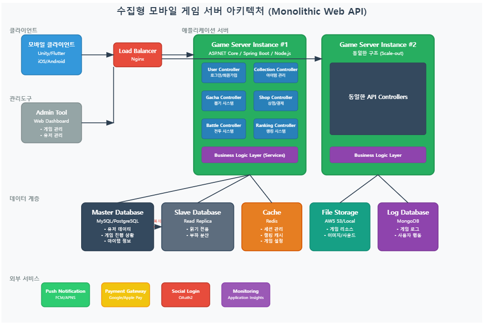

# ASP.NET Core Web API로 게임 서버 개발
  
저자: 최흥배, Claude AI   
-----------------------
  
# Chapter 1. 게임 서버의 역할과 중요성
  
## 게임 서버란 무엇인가?
게임 서버는 게임 실행에 필요한 핵심 로직과 데이터를 관리하는 백엔드 시스템입니다. 클라이언트(모바일 기기, PC 등)에서 실행되는 게임은 사용자 인터페이스와 그래픽을 담당하지만, 대부분의 중요한 데이터 처리와 게임 규칙은 서버에서 관리합니다.  
  
현대적인 게임 서버는 단순한 데이터 저장소에서 벗어나 복잡한 비즈니스 로직, 실시간 처리, 보안 기능을 갖춘 종합 시스템으로 발전했습니다. 특히 모바일 게임 시장의 성장과 함께 서버의 중요성은 더욱 커지고 있습니다.  

## 게임 서버의 주요 역할
게임 서버는 다음과 같은 핵심 역할을 수행합니다:

1. **데이터 영속성 관리**
   - 사용자 계정 정보, 게임 진행 상황, 아이템 소유권 등의 데이터 저장
   - 데이터의 일관성과 무결성 보장
   - 서버 장애 시 데이터 복구 메커니즘 제공

2. **게임 로직 처리**
   - 중요한 게임 규칙과 로직의 실행
   - 확률 기반 시스템(뽑기, 강화 등) 관리
   - 게임 경제 시스템 제어

3. **인증 및 권한 관리**
   - 사용자 인증 및 계정 보안
   - 접근 제어 및 권한 관리
   - 부정 행위 방지 및 탐지

4. **실시간 상호작용 지원**
   - 다중 플레이어 기능 제공
   - 게임 세계의 일관성 유지
   - 비동기 사용자 상호작용 관리

5. **서비스 관리 및 모니터링**
   - 게임 업데이트 및 패치 관리
   - 서버 성능 모니터링
   - 오류 감지 및 복구 지원
  

## 게임 서버의 중요성
게임 서버는 현대 게임 개발의 핵심 요소로, 여러 가지 중요한 이유가 있습니다:
  
1. **공정한 게임 환경 제공**
   - 중요한 게임 로직을 서버에서 처리함으로써 부정 행위 방지
   - 모든 플레이어에게 동일한 규칙 적용

2. **지속적인 서비스 제공**
   - 게임 업데이트와 콘텐츠 추가 용이
   - 사용자 피드백 기반 개선 가능
   - 게임 수명 연장

3. **수익화 모델 지원**
   - 인앱 구매 처리 및 검증
   - 사용자 행동 분석을 통한 수익 최적화
   - 마케팅 캠페인 및 이벤트 관리

4. **사용자 데이터 보호**
   - 개인 정보 및 중요 데이터의 안전한 관리
   - 데이터 백업 및 복구 기능
   - 규제 준수 지원
  
    

## 수집형 RPG 게임 서버의 특징
  
### 수집형 RPG 게임의 이해
수집형 RPG(Role-Playing Game)는 캐릭터, 장비, 아이템 등을 수집하고 강화하는 메커니즘을 핵심으로 하는 게임 장르입니다. 이 장르는 가챠(Gacha) 시스템, 턴제 전투, 캐릭터 성장 등의 요소를 특징으로 합니다. 대표적인 게임으로는 '서머너즈 워', '에픽세븐', '페이트/그랜드 오더' 등이 있습니다.
  
수집형 RPG의 주요 특징:
- 다양한 캐릭터와 아이템 수집
- 레어도 기반의 콘텐츠 구조
- 확률 기반 획득 시스템(가챠)
- 캐릭터/장비의 점진적 강화와 진화
- 다양한 PvE(Player vs Environment) 및 PvP(Player vs Player) 콘텐츠
   
  
### 수집형 RPG 서버의 핵심 기능
수집형 RPG 게임 서버는 일반 게임 서버보다 더 복잡하고 독특한 기능들을 요구합니다:
  
1. **광범위한 데이터 관리**
   - 수많은 캐릭터와 아이템 정보
   - 복잡한 사용자 인벤토리 시스템
   - 다양한 진행 상황 및 업적 추적

2. **확률 시스템 관리**
   - 가챠/뽑기 시스템의 공정한 확률 계산
   - 확률 검증 및 조정 메커니즘
   - 법적 규제 준수(확률 공개 등)

3. **다양한 게임 시스템 통합**
   - 전투 시스템 계산 및 검증
   - 강화/합성/진화 시스템
   - 다양한 던전 및 레이드 관리
   - 길드/친구 시스템

4. **경제 및 밸런싱**
   - 게임 내 통화 관리
   - 리소스 획득 및 소비 밸런싱
   - 인플레이션 방지 메커니즘

5. **이벤트 및 보상 시스템**
   - 기간 한정 이벤트 관리
   - 보상 지급 및 우편함 시스템
   - 랭킹 및 리더보드 관리
   
  
### 수집형 RPG 서버 개발의 도전 과제
수집형 RPG 서버 개발 시 직면하는 주요 도전 과제:  
  
1. **대량의 동시 접속 처리**
   - 이벤트 시작, 새로운 가챠 풀 오픈 등의 상황에서 트래픽 폭증
   - 효율적인 리소스 관리 필요

2. **데이터 일관성 유지**
   - 동시에 발생하는 다양한 트랜잭션(뽑기, 강화, 판매 등)
   - 오류 발생 시 롤백 메커니즘

3. **지연 시간 최소화**
   - 사용자 경험을 위한 빠른 응답 시간 확보
   - 캐싱 전략과 데이터베이스 최적화

4. **부정 행위 방지**
   - 불법 루비/다이아 생성 방지
   - 비정상적인 게임 진행 탐지
   - API 공격 방어

5. **지속적인 업데이트와 확장**
   - 새로운 콘텐츠 추가 용이성
   - 기존 시스템과의 호환성 유지
   - 버전 관리 및 마이그레이션 전략
   

## 서버 아키텍처 개요
  
### 현대적인 게임 서버 아키텍처
현대의 게임 서버는 확장성, 안정성, 유지보수성을 고려하여 설계됩니다. 일반적인 구조는 다음과 같습니다:
  
    
      
    
### ASP.NET Core로 구현하는 게임 서버 아키텍처
우리의 프로젝트에서는 ASP.NET Core Web API를 기반으로 다음과 같은 아키텍처를 구현합니다:
  
1. **계층적 아키텍처**
   - **Presentation Layer**: API 컨트롤러, 미들웨어, 필터
   - **Business Logic Layer**: 서비스, 도메인 모델, 유틸리티
   - **Data Access Layer**: 리포지토리, 데이터 모델, DB 어댑터

2. **핵심 컴포넌트**
   - **API Controllers**: 클라이언트 요청 처리 및 응답 생성
   - **Services**: 게임 로직 구현 및 비즈니스 규칙 적용
   - **Repositories**: 데이터 접근 및 지속성 관리
   - **Models**: 데이터 구조 및 도메인 객체 정의
   - **Middleware**: 공통 기능(인증, 로깅, 예외 처리) 제공

3. **데이터 저장소 전략**
   - **MySQL**: 영구적인 데이터 저장 (사용자 정보, 게임 상태, 아이템 등)
   - **Redis**: 임시 데이터 및 캐싱 (세션, 랭킹, 자주 접근하는 데이터)
  

### 수집형 RPG 서버를 위한 아키텍처 설계
수집형 RPG 게임에 특화된 아키텍처 설계는 다음과 같은 요소를 고려합니다:

1. **API 분리 및 모듈화**
   - 사용자 관리 API (계정, 인증, 프로필)
   - 게임 콘텐츠 API (던전, 전투, 퀘스트)
   - 수집 시스템 API (가챠, 인벤토리, 강화)
   - 소셜 API (길드, 친구, 채팅)
   - 상점 및 결제 API (인앱구매, 상점, 교환)

2. **데이터 모델링 전략**
   - 관계형 데이터: MySQL을 통한 정규화된 모델
   - 캐시 데이터: Redis를 활용한 최적화된 구조
   - 효율적인 조인 및 쿼리 설계

3. **보안 및 성능 최적화**
   - JWT 기반 인증 시스템
   - 계층별 캐싱 전략
   - 비동기 처리를 통한 응답성 향상
   - 트랜잭션 관리 및 일관성 보장
  
  
### ASP.NET Core Web API의 장점
ASP.NET Core Web API를 게임 서버 개발에 선택한 주요 이유:  

1. **뛰어난 성능**
   - 높은 처리량과 낮은 지연 시간
   - 효율적인 리소스 사용
   - 비동기 프로그래밍 모델 지원

2. **확장성 및 모듈화**
   - 마이크로서비스 지향 설계 가능
   - 수평적/수직적 확장 용이
   - 의존성 주입(DI)을 통한 모듈 분리

3. **크로스 플랫폼 지원**
   - Windows, Linux, macOS에서 실행 가능
   - 다양한 배포 환경(도커, 클라우드 등) 지원
   - 개발 및 운영 환경의 유연성

4. **강력한 생태계**
   - 풍부한 라이브러리와 패키지
   - 활발한 커뮤니티 지원
   - 지속적인 개선과 업데이트

5. **.NET 9.0의 새로운 기능**
   - 향상된 성능과 메모리 관리
   - 최신 C# 언어 기능 활용
   - 신규 보안 기능 지원
  
    

## 결론 및 다음 단계
게임 서버, 특히 수집형 RPG 게임 서버는 현대 게임 개발의 핵심 요소입니다. ASP.NET Core Web API를 활용한 서버 개발은 성능, 확장성, 개발 생산성 측면에서 뛰어난 선택이 될 수 있습니다.

이어지는 장에서는 ASP.NET Core Web API의 기초를 살펴보고, 실제 프로젝트 설정과 기본 API 구현을 통해 게임 서버 개발의 첫 단계를 시작하겠습니다. MySQL과 Redis를 연동하고, 사용자 인증부터 게임 데이터 관리까지 단계적으로 구현하면서 수집형 RPG 게임 서버의 핵심 기능을 완성해 나갈 것입니다.

다음 장에서는 ASP.NET Core Web API의 기본 개념과 RESTful 서비스 설계 원칙, 그리고 .NET 9.0의 주요 특징을 살펴보겠습니다.  
