# ASP.NET Core Web API로 게임 서버 개발
  
저자: 최흥배, Claude AI   
-----------------------   
  
# Chapter 2. ASP.NET Core Web API 기초
    
## ASP.NET Core란?
    
### ASP.NET Core의 개요
ASP.NET Core는 Microsoft가 개발한 크로스 플랫폼, 고성능, 오픈 소스 프레임워크로, 현대적인 클라우드 기반 웹 애플리케이션과 서비스를 구축하기 위해 설계되었습니다. 2016년에 처음 출시된 이후, ASP.NET Core는 지속적으로 발전하여 현재 .NET 생태계의 핵심 구성 요소가 되었습니다.
  
ASP.NET Core는 전통적인 ASP.NET 프레임워크를 완전히 재설계한 것으로, Windows Server에만 제한되지 않고 Linux와 macOS에서도 실행할 수 있어 개발 및 배포의 유연성을 크게 향상시켰습니다.
   

### ASP.NET Core의 주요 특징 및 장점

**1. 크로스 플랫폼 지원**
- Windows, Linux, macOS에서 개발 및 실행 가능
- Docker 컨테이너와 클라우드 환경 친화적
- 다양한 배포 방식 지원 (자체 호스팅, IIS, Nginx, Apache)
 
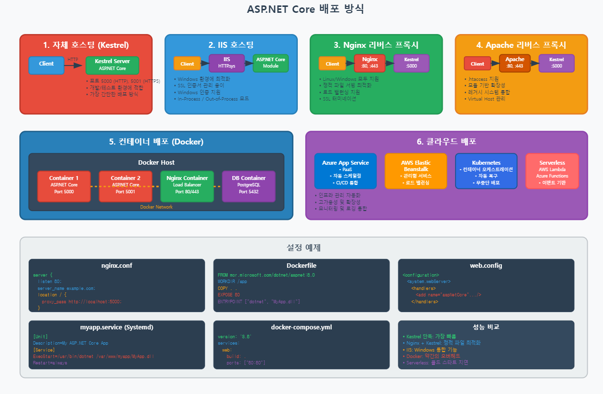    

**2. 모듈식 아키텍처**
- 필요한 기능만 포함하는 경량 구조
- NuGet 패키지를 통한 기능 확장
- 의존성 주입(DI) 기본 내장

**3. 고성능**
- Kestrel 웹 서버 기반의 뛰어난 성능
- 비동기 프로그래밍 모델 지원
- 마이크로서비스 아키텍처에 최적화

**4. 통합 개발 환경**
- Visual Studio, VS Code, JetBrains Rider 등 다양한 IDE 지원
- 강력한 디버깅 및 진단 도구
- CI/CD 파이프라인과의 원활한 통합

**5. 보안 강화**
- 기본 제공되는 보안 기능 (HTTPS, CORS, 인증, 권한 등)
- 정기적인 보안 업데이트
- 취약점 방지를 위한 기본 설정
  

### ASP.NET Core의 아키텍처
ASP.NET Core의 아키텍처는 다음과 같은 주요 구성 요소로 이루어져 있습니다:

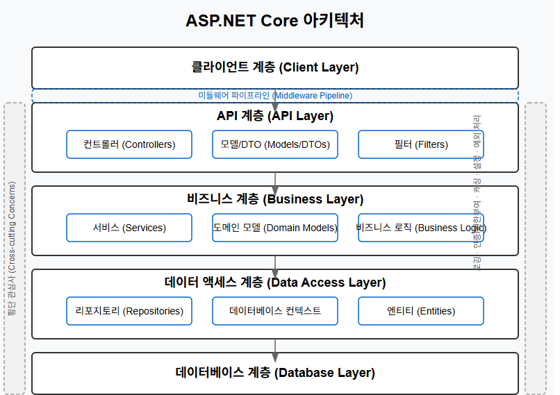  
  
**1. 프로그램 진입점과 시작 구성**
- `Program.cs`: 애플리케이션의 진입점
- `Startup.cs`: 서비스 구성 및 미들웨어 파이프라인 설정

**2. 미들웨어 파이프라인**
- HTTP 요청 처리 파이프라인
- 인증, 권한 부여, 라우팅, 세션 관리 등 처리
- 요청에서 응답까지의 처리 흐름 제어  
  
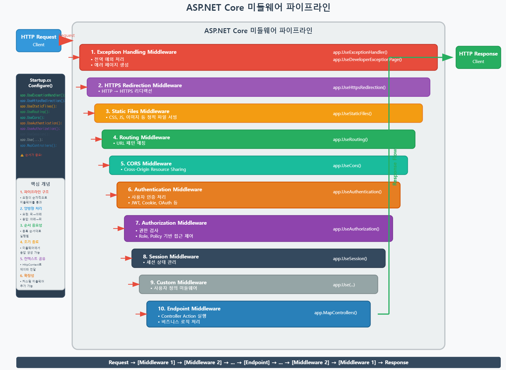     

**3. MVC/Web API 프레임워크**
- Model-View-Controller 패턴 지원
- API 컨트롤러와 액션 메서드
- 모델 바인딩 및 검증   
   
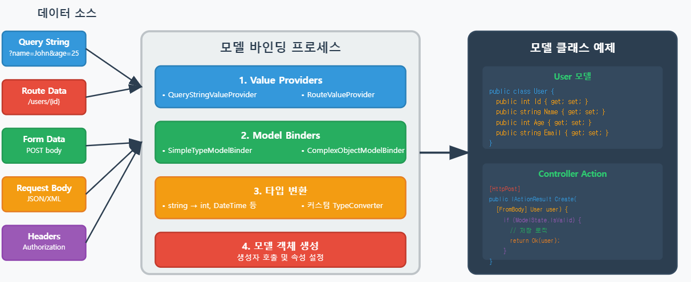   
    
**1. 데이터 소스**
- Query String: URL 매개변수
- Route Data: URL 경로의 세그먼트
- Form Data: POST 요청의 폼 데이터
- Request Body: JSON/XML 데이터
- Headers: HTTP 헤더 정보

**2. 바인딩 프로세스**
- **Value Providers**: 데이터 소스에서 값 추출
- **Model Binders**: 값을 모델 객체로 변환
- **Type Conversion**: 문자열을 적절한 타입으로 변환
- **Model Creation**: 최종 모델 객체 생성
  
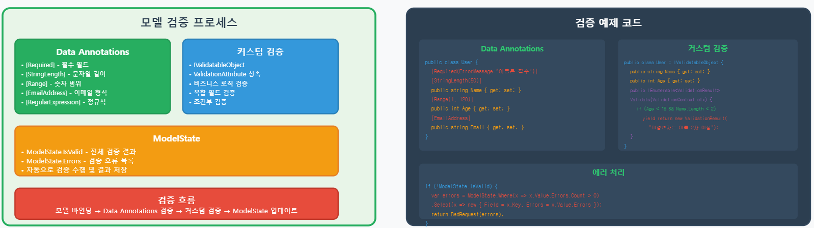   
**1. Data Annotations**
- `[Required]`, `[StringLength]`, `[Range]` 등
- 선언적 검증 방식
- 간단하고 직관적
**2. 커스텀 검증**
- `IValidatableObject` 인터페이스 구현
- `ValidationAttribute` 상속
- 복잡한 비즈니스 로직 검증
**3. ModelState**
- 검증 결과를 저장하는 객체
- `ModelState.IsValid`로 전체 검증 결과 확인
- `ModelState.Errors`로 오류 목록 접근
  
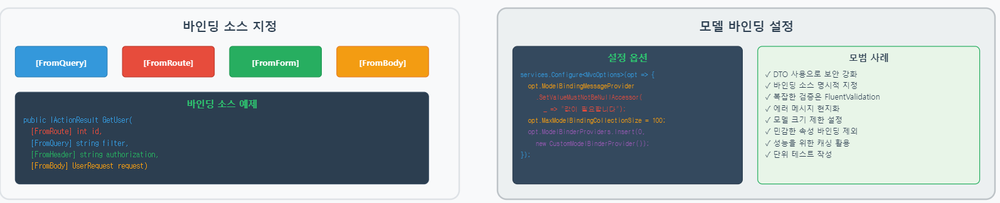    
**바인딩 소스 지정**
- `[FromQuery]`, `[FromRoute]`, `[FromForm]`, `[FromBody]` 등
- 명시적으로 데이터 소스 지정 가능  

**4. 서비스**
- 비즈니스 로직 구현
- 의존성 주입을 통한 결합도 낮춤
- 횡단 관심사(cross-cutting concerns) 처리

**5. 데이터 액세스**
- 다양한 데이터 액세스 기술 지원
- ORM(Object-Relational Mapping) 통합
- 다중 데이터베이스 지원
  

### ASP.NET Core와 전통적인 ASP.NET의 차이점

| 특징 | ASP.NET Core | 전통적인 ASP.NET |
|------|-------------|--------------|
| 플랫폼 | 크로스 플랫폼 (Windows, Linux, macOS) | Windows 기반 |
| 오픈 소스 | 완전한 오픈 소스 | 일부 구성 요소만 오픈 소스 |
| 아키텍처 | 모듈식 설계 | 모놀리식 설계 |
| 성능 | 더 높은 성능과 확장성 | 상대적으로 낮은 성능 |
| 배포 | 유연한 배포 옵션 | IIS에 종속적인 배포 |
| 의존성 주입 | 기본 내장 | 외부 라이브러리 필요 |
| 구성 | 다양한 소스에서 구성 지원 | Web.config 중심 |
| 웹 서버 | Kestrel, IIS, Nginx, Apache | 주로 IIS |
  

## Web API의 개념과 RESTful 서비스

### Web API란?
Web API(Application Programming Interface)는 서버와 클라이언트 간의 데이터 통신을 위한 인터페이스입니다. HTTP 프로토콜을 기반으로 작동하며, 다양한 클라이언트(모바일 앱, 웹 앱, IoT 장치 등)에서 서버의 기능과 데이터에 접근할 수 있게 해줍니다.
  
ASP.NET Core Web API는 .NET 플랫폼에서 웹 API를 개발하기 위한 프레임워크로, RESTful 서비스를 쉽게 구현할 수 있는 도구와 라이브러리를 제공합니다.


### REST 아키텍처 원칙
REST(Representational State Transfer)는 웹 서비스 설계를 위한 아키텍처 스타일입니다. Roy Fielding이 2000년 박사 논문에서 처음 소개했으며, 다음과 같은 핵심 원칙을 따릅니다:
  
**1. 자원 기반 (Resource-Based)**
- 모든 것을 자원(Resource)으로 표현
- URI(Uniform Resource Identifier)를 통해 자원 식별
- 예: `/players`, `/items`, `/guilds`

**2. 균일한 인터페이스 (Uniform Interface)**
- HTTP 메서드를 통한 표준화된 작업
- 자원 표현의 자기 설명성
- HATEOAS(Hypermedia as the Engine of Application State) 지원

**3. 상태 비저장 (Stateless)**
- 각 요청은 독립적이며 상태 정보를 포함
- 세션 상태는 클라이언트에서 관리
- 서버 확장성 향상  
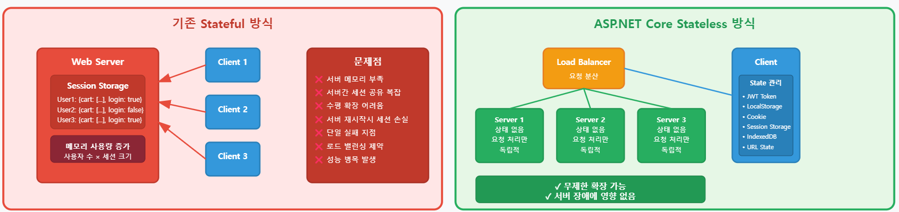   
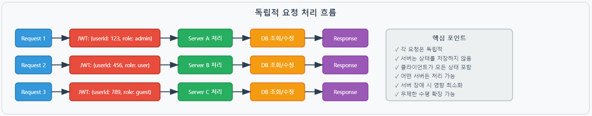   
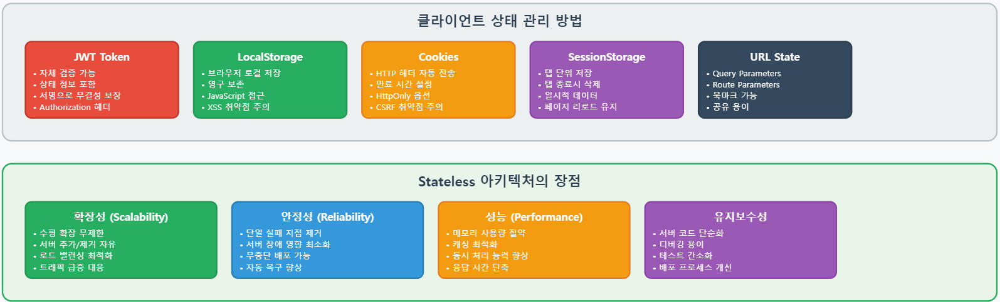   

**4. 계층화 시스템 (Layered System)**
- 클라이언트는 직접 연결된 계층만 알 필요
- 중간 서버, 로드 밸런서, 캐시 등 투명하게 추가 가능

**5. 캐시 가능성 (Cacheability)**
- 응답이 캐시 가능한지 명시
- 성능 향상 및 서버 부하 감소  
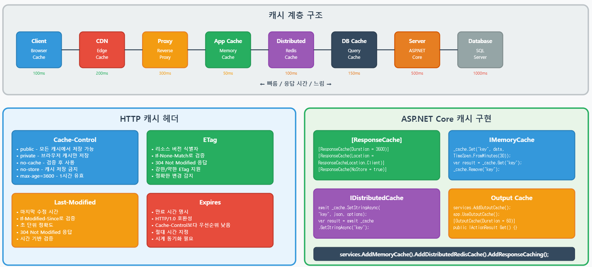   
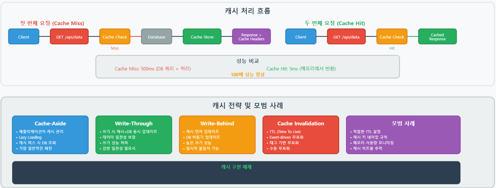   
  

### HTTP 메서드와 상태 코드
RESTful API에서는 HTTP 메서드를 활용하여 자원에 대한 CRUD(Create, Read, Update, Delete) 작업을 표현합니다:

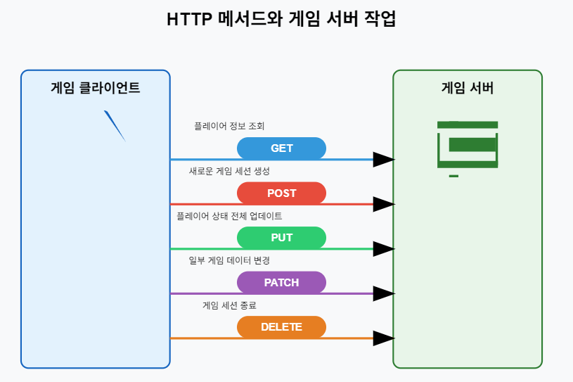   
  
1. **GET** (파란색)
   - 데이터를 읽거나 조회하는 용도
   - 게임 예시: 플레이어 정보, 게임 상태, 순위표 조회 등
   - 서버 상태를 변경하지 않는다

2. **POST** (빨간색)
   - 새로운 리소스를 생성하는 용도
   - 게임 예시: 새 게임 세션 생성, 플레이어 계정 등록, 게임 로그 저장 등
   - 서버에 새로운 데이터를 추가한다

3. **PUT** (녹색)
   - 리소스 전체를 업데이트하거나 새로 만드는 용도
   - 게임 예시: 플레이어 프로필 전체 업데이트, 게임 설정 완전 교체 등
   - 기존 데이터를 완전히 대체한다

4. **PATCH** (보라색)
   - 리소스의 일부만 업데이트하는 용도
   - 게임 예시: 플레이어 점수 업데이트, 캐릭터 위치 변경, 아이템 속성 수정 등
   - 필요한 부분만 선택적으로 수정한다

5. **DELETE** (주황색)
   - 리소스를 삭제하는 용도
   - 게임 예시: 게임 세션 종료, 플레이어 계정 삭제, 임시 데이터 제거 등
   - 서버에서 데이터를 제거한다

원칙적으로 HTTP 메서드의 특성을 활용해 RESTful API를 설계하면 좋지만, 게임 서버에서는 편의성을 위해서 **POST** 방식만 사용해도 괜찮다.  
   
HTTP 상태 코드는 요청 처리 결과를 클라이언트에게 전달합니다:    
- **1xx (정보)**: 요청이 수신되어 처리 중
- **2xx (성공)**: 요청이 성공적으로 처리됨
  - 200 OK: 요청 성공
  - 201 Created: 새 리소스 생성 성공
  - 204 No Content: 성공했지만 반환할 콘텐츠 없음
- **3xx (리다이렉션)**: 요청 완료를 위해 추가 조치 필요
  - 301/302: 리소스 위치 변경
  - 304 Not Modified: 캐시된 버전 사용 가능
- **4xx (클라이언트 오류)**: 클라이언트 측 문제
  - 400 Bad Request: 잘못된 요청 구문
  - 401 Unauthorized: 인증 필요
  - 403 Forbidden: 접근 권한 없음
  - 404 Not Found: 리소스를 찾을 수 없음
  - 429 Too Many Requests: 요청 횟수 제한 초과
- **5xx (서버 오류)**: 서버 측 문제
  - 500 Internal Server Error: 서버 내부 오류
  - 503 Service Unavailable: 서비스 일시적 불가
    
  
### RESTful API 설계 원칙과 모범 사례
수집형 RPG 게임 서버를 위한 RESTful API 설계 시 고려할 모범 사례:  
(게임 서버는 아래의 원칙을 꼭 지키지 않아도 괜찮다)  
  
**1. 명확하고 직관적인 URL 설계**
```
# 좋은 예
GET /players/{playerId}/characters
GET /characters/{characterId}/items
POST /gacha/roll

# 나쁜 예
GET /getPlayerCharacters?playerId=123
GET /api/doGachaRoll
```

**2. 리소스 계층 구조 표현**
```
/players                  # 모든 플레이어
/players/{id}             # 특정 플레이어
/players/{id}/characters  # 특정 플레이어의 캐릭터들
/characters/{id}/skills   # 특정 캐릭터의 스킬
```

**3. HTTP 메서드 올바르게 사용**
- 멱등성(Idempotency)과 안전성(Safety) 고려
- 동일한 요청을 여러 번 보내도 같은 결과(GET, PUT, DELETE)
- 요청이 상태를 변경하지 않음(GET)
   
**게임의 경우 개발 편의성을 위해 GET, POST, PUT, DELETE를 나누어서 사용하지 않고, 주로 POST 방식만 사용하고 데이터는 JSON으로 주고 받는다**   

**4. 적절한 상태 코드 반환**
```csharp
// 성공적인 요청
return Ok(player);  // 200 OK

// 리소스 생성
return Created($"/players/{newPlayer.Id}", newPlayer);  // 201 Created

// 존재하지 않는 리소스
return NotFound();  // 404 Not Found

// 권한 없음
return Forbidden();  // 403 Forbidden
```

**5. 일관된 응답 형식**
```json
// 성공 응답
{
  "errorCode": 0,
  "data": {
    "playerId": 12345,
    "nickname": "게임마스터",
    "level": 42
  }
}

// 오류 응답
{
  "errorCode": 23453,
  "data": {
    "playerId": 0,
    "nickname": "",
    "level": 0
  }
}
```
  
**6. 버전 관리**
```
/api/v1/players
/api/v2/players
```
  
### API 버전 관리 전략
게임 서버 API의 버전 관리는 클라이언트와 서버 간의 호환성을 유지하는 데 중요합니다. 주요 버전 관리 방법:  

**1. URL 경로 버전 관리**
```
https://api.game.com/v1/players
https://api.game.com/v2/players
```

**2. 헤더 기반 버전 관리**
```
Accept: application/json; version=1
Accept: application/json; version=2
```

**3. 미디어 타입 버전 관리**
```
Accept: application/vnd.game.v1+json
Accept: application/vnd.game.v2+json
```

게임 서버 개발에서는 URL 경로 기반 버전 관리가 가장 명시적이고 클라이언트가 이해하기 쉬워 자주 사용됩니다.
  

### .http 파일을 활용한 API 테스트
ASP.NET Core로 개발한 게임 서버 API는 클라이언트 코드 없이 `.http` 파일을 통해 테스트할 수 있습니다. VS Code의 REST Client 확장 프로그램이나 JetBrains IDE의 HTTP Client 기능을 활용합니다.
  
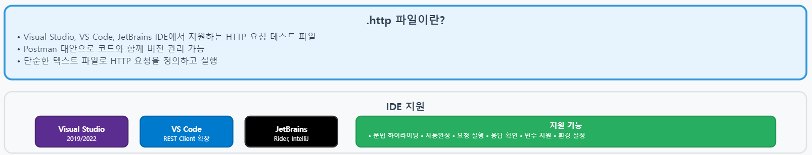   
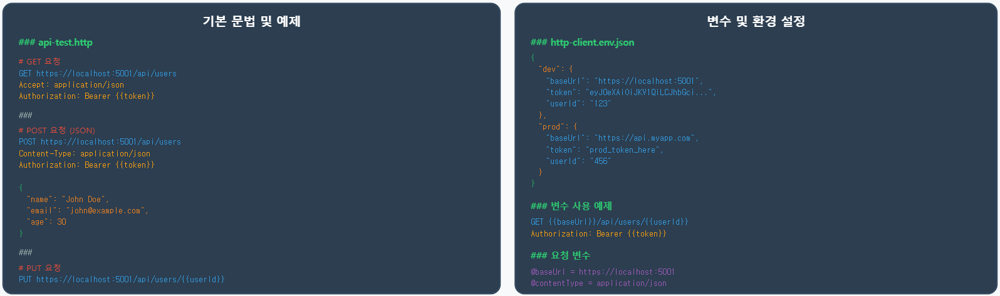   
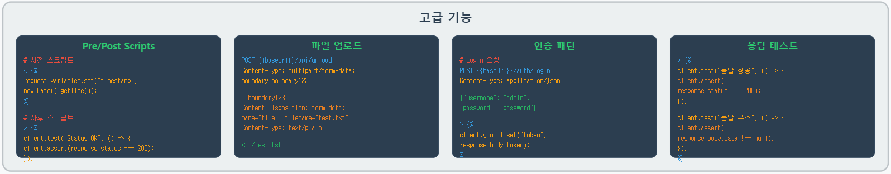   

플레이어 API 테스트 예시:
  
```
### 플레이어 목록 조회
GET https://localhost:5001/api/v1/players
Accept: application/json
Authorization: Bearer {{accessToken}}

### 특정 플레이어 조회
GET https://localhost:5001/api/v1/players/12345
Accept: application/json
Authorization: Bearer {{accessToken}}

### 플레이어 생성
POST https://localhost:5001/api/v1/players
Content-Type: application/json
Authorization: Bearer {{accessToken}}

{
  "nickname": "새플레이어",
  "characterClass": "워리어",
  "gender": "male"
}

### 플레이어 정보 업데이트
PUT https://localhost:5001/api/v1/players/12345
Content-Type: application/json
Authorization: Bearer {{accessToken}}

{
  "nickname": "수정된닉네임",
  "level": 10,
  "exp": 5000
}
```
  
가챠(뽑기) API 테스트 예시:
```http
### 일반 가챠 실행
POST https://localhost:5001/api/v1/gacha/normal/roll
Content-Type: application/json
Authorization: Bearer {{accessToken}}

{
  "playerId": 12345,
  "count": 10
}

### 프리미엄 가챠 실행
POST https://localhost:5001/api/v1/gacha/premium/roll
Content-Type: application/json
Authorization: Bearer {{accessToken}}

{
  "playerId": 12345,
  "count": 1
}
```
  

## .NET 9.0의 새로운 기능들
.NET 9.0은 2024년 후반에 출시되어 게임 서버 개발에 다양한 향상된 기능을 제공합니다.
  
### .NET 9.0의 주요 개선 사항

**1. 성능 향상**
- JIT 컴파일러 최적화
- 가비지 컬렉션 개선
- Native AOT(Ahead-of-Time) 컴파일 지원 확대
- 대형 게임 서버의 처리량 향상

**2. 개발 생산성 증가**
- 간소화된 구성 및 설정
- 향상된 디버깅 경험
- 핫 리로드 기능 개선
- 개발자 진단 도구 강화

**3. 보안 강화**
- 새로운 보안 기능과 프로토콜
- 인증 및 권한 기능 향상
- 취약점 방지 메커니즘 개선

**4. 클라우드 네이티브 지원 확대**
- 컨테이너화 및 오케스트레이션 지원 강화
- 마이크로서비스 아키텍처 개선
- 클라우드 서비스 통합 향상
  

### C# 언어의 새로운 기능들
.NET 9.0과 함께 제공되는 C# 12의 주요 기능:

**1. 컬렉션 표현식**
```csharp
// 간결한 컬렉션 생성
var characters = [ "전사", "마법사", "궁수", "도적" ];
var rarityMap = { "일반": 0.7, "레어": 0.25, "에픽": 0.05 };
```

**2. 기본 람다 매개변수**
```csharp
// 기본값이 있는 람다 표현식
var calculateDamage = (int attack, int defense = 0) => attack - defense;
```

**3. 향상된 패턴 매칭**
```csharp
// 게임 아이템 타입 체크 및 처리
var result = item switch
{
    Weapon { Damage: > 100 } => "강력한 무기",
    Armor { Defense: > 50 } => "튼튼한 방어구",
    Potion { HealAmount: var heal } when heal > 200 => "고급 물약",
    _ => "일반 아이템"
};
```

**4. 개선된 레코드 타입**
```csharp
// 게임 아이템 정의
public record class Item(int Id, string Name, string Type);

// 무기 아이템 (상속)
public record class Weapon(int Id, string Name, int Damage, int Durability) 
    : Item(Id, Name, "Weapon");
```

**5. 필수 멤버**
```csharp
// 필수 속성을 가진 플레이어 클래스
public class Player
{
    public required int Id { get; init; }
    public required string Nickname { get; set; }
    public int Level { get; set; } = 1;
}
```
  

### ASP.NET Core의 새로운 기능

**1. 최소 API 기능 확장**
```csharp
var builder = WebApplication.CreateBuilder(args);
var app = builder.Build();

// 간결한 API 엔드포인트 정의
app.MapGet("/api/players/{id}", async (int id, PlayerService playerService) =>
    await playerService.GetPlayerByIdAsync(id) is Player player
        ? Results.Ok(player)
        : Results.NotFound());
```

**2. OpenAPI와 Swagger 통합 개선**
- 더 풍부한 API 문서화
- API 버전 관리 개선
- 자동화된 클라이언트 코드 생성 지원

**3. 인증 및 권한 부여 강화**
- OAuth 2.0 및 OpenID Connect 지원 향상
- 역할 기반 및 정책 기반 인증 강화
- JSON Web Token(JWT) 처리 개선

**4. SignalR 개선**
- 실시간 통신 성능 향상
- 확장성 개선
- 새로운 기능 추가

**5. 성능 향상을 위한 기능**
- 응답 압축 및 캐싱 개선
- 미들웨어 파이프라인 최적화
- 요청 처리 지연 시간 감소

### 게임 서버 개발을 위한 주요 기능

**1. Rate Limiting 기능 강화**
```csharp
// 게임 API에 속도 제한 적용
builder.Services.AddRateLimiter(options =>
{
    options.GlobalLimiter = PartitionedRateLimiter.Create<HttpContext, string>(context =>
        RateLimitPartition.GetFixedWindowLimiter(
            partitionKey: context.User.Identity?.Name ?? context.Request.Headers.Host.ToString(),
            factory: partition => new FixedWindowRateLimiterOptions
            {
                AutoReplenishment = true,
                PermitLimit = 100,
                Window = TimeSpan.FromMinutes(1)
            }));
    
    // 가챠 API에 더 엄격한 제한 설정
    options.AddPolicy("GachaLimit", context =>
        RateLimitPartition.GetFixedWindowLimiter(
            partitionKey: context.User.Identity?.Name ?? context.Request.Headers.Host.ToString(),
            factory: partition => new FixedWindowRateLimiterOptions
            {
                AutoReplenishment = true,
                PermitLimit = 10,
                Window = TimeSpan.FromMinutes(5)
            }));
});
```
  
**2. 향상된 출력 캐싱**
```csharp
// 게임 마스터 데이터 캐싱
app.MapGet("/api/masterdata/items", [OutputCache(Duration = 3600)] () =>
{
    // 마스터 데이터 반환
});
```

**3. 메트릭스 및 모니터링 통합**
```csharp
// 게임 서버 메트릭 수집
builder.Services.AddOpenTelemetry()
    .WithMetrics(metrics =>
    {
        metrics.AddMeter("Microsoft.AspNetCore.Hosting");
        metrics.AddMeter("Microsoft.AspNetCore.Server.Kestrel");
        metrics.AddMeter("GameServer.Metrics");
        metrics.AddPrometheusExporter();
    });
```

**4. 지역화 및 다국어 지원 강화**
```csharp
// 게임 다국어 지원 설정
builder.Services.AddLocalization(options => options.ResourcesPath = "Resources");
builder.Services.Configure<RequestLocalizationOptions>(options =>
{
    var supportedCultures = new[] { "ko-KR", "en-US", "ja-JP", "zh-CN" };
    options.SetDefaultCulture(supportedCultures[0])
        .AddSupportedCultures(supportedCultures)
        .AddSupportedUICultures(supportedCultures);
});
```
  

## 실제 게임 서버에서의 ASP.NET Core Web API 적용

### 게임 서버 API 설계 예시
수집형 RPG 게임 서버의 API 구조는 다음과 같이 설계할 수 있습니다:  
(게임 개발에서는 RESTful 원칙을 지키기 보다는 개발 편의성을 우선하여 POST만 사용합니다)  
    
```
/api/v1
  /auth
    POST /signup         # 회원가입
    POST /login          # 로그인
    POST /refresh-token  # 토큰 갱신
  
  /players
    POST /list           # 플레이어 목록
    POST /info           # 플레이어 정보
    POST /update         # 플레이어 정보 업데이트
    POST /change-nickname # 닉네임 변경
  
  /characters
    POST /list           # 보유 캐릭터 목록
    POST /info           # 캐릭터 상세 정보
    POST /level-up       # 캐릭터 레벨업
    POST /evolve         # 캐릭터 진화
  
  /items
    POST /list           # 보유 아이템 목록
    POST /info           # 아이템 상세 정보
    POST /use            # 아이템 사용
    POST /enhance        # 아이템 강화
  
  /gacha
    POST /banners        # 현재 뽑기 배너 정보
    POST /roll           # 뽑기 실행
    POST /history        # 뽑기 이력
  
  /battles
    POST /pve/start      # PvE 전투 시작
    POST /pve/result     # PvE 전투 결과
    POST /pvp/start      # PvP 전투 시작
    POST /pvp/ranking    # PvP 랭킹
  
  /guild
    POST /info           # 길드 정보
    POST /create         # 길드 생성
    POST /join           # 길드 가입 신청
    POST /members        # 길드 멤버 목록
```

### 컨트롤러 구현 예시

캐릭터 컨트롤러 예시:

```csharp
[ApiController]
[Route("api/v1/characters")]
[Authorize]
public class CharactersController : ControllerBase
{
    private readonly ICharacterService _characterService;
    private readonly ILogger<CharactersController> _logger;

    public CharactersController(
        ICharacterService characterService,
        ILogger<CharactersController> logger)
    {
        _characterService = characterService;
        _logger = logger;
    }

    /// <summary>
    /// 보유한 캐릭터 목록을 조회합니다.
    /// </summary>
    [HttpPost("list")]
    public async Task<GetCharactersResponse> GetCharacters([FromBody] GetCharactersRequest request)
    {
        var playerId = User.GetPlayerId();
        var characters = await _characterService.GetPlayerCharactersAsync(playerId);

        // 항상 동일한 응답 객체를 반환합니다.
        return new GetCharactersResponse
        {
            Characters = characters.ToList()
            // ErrorCode는 기본값인 Success로 유지됩니다.
        };
    }

    /// <summary>
    /// 특정 캐릭터의 상세 정보를 조회합니다.
    /// </summary>
    [HttpPost("info")]
    public async Task<CharacterInfoResponse> GetCharacter([FromBody] CharacterInfoRequest request)
    {
        var playerId = User.GetPlayerId();
        var character = await _characterService.GetCharacterAsync(request.CharacterId, playerId);
        
        // 실패 시 ErrorCode를 설정하여 반환합니다.
        if (character == null)
        {
            return new CharacterInfoResponse { ErrorCode = ErrorCode.CharacterNotFound };
        }
            
        // 성공 시 데이터를 담아 반환합니다.
        return new CharacterInfoResponse
        {
            Character = character
        };
    }

    /// <summary>
    /// 캐릭터를 레벨업합니다.
    /// </summary>
    [HttpPost("level-up")]
    public async Task<LevelUpResponse> LevelUpCharacter([FromBody] LevelUpRequest request)
    {
        var playerId = User.GetPlayerId();
        var result = await _characterService.LevelUpCharacterAsync(request.CharacterId, playerId, request.UseItems);
        
        // 서비스 결과에 따라 ErrorCode를 설정합니다.
        // ICharacterService의 결과(result)에 따라 더 구체적인 ErrorCode를 맵핑할 수 있습니다.
        if (!result.Success)
        {
            return new LevelUpResponse { ErrorCode = ErrorCode.LevelUpFailed_NotEnoughMaterials };
        }
            
        return new LevelUpResponse
        {
            Character = result.Character
        };
    }

    /// <summary>
    /// 캐릭터를 진화시킵니다.
    /// </summary>
    [HttpPost("evolve")]
    public async Task<EvolveResponse> EvolveCharacter([FromBody] EvolveRequest request)
    {
        var playerId = User.GetPlayerId();
        var result = await _characterService.EvolveCharacterAsync(request.CharacterId, playerId, request.MaterialCharacterIds);
        
        if (!result.Success)
        {
            return new EvolveResponse { ErrorCode = ErrorCode.EvolveFailed_NotEnoughMaterials };
        }
            
        return new EvolveResponse
        {
            Character = result.Character
        };
    }
}


// ErrorCode.cs
public enum ErrorCode
{
    // 성공
    Success = 0,

    // 공통 에러 (1 ~ 1000)
    InvalidRequest = 1,
    Unauthorized = 2,
    ServerError = 3,

    // 캐릭터 관련 에러 (1001 ~ 2000)
    CharacterNotFound = 1001,
    LevelUpFailed_NotEnoughMaterials = 1002,
    EvolveFailed_NotEnoughMaterials = 1003,
    // 필요에 따라 구체적인 에러 코드를 추가할 수 있습니다.
}


// 요청 클래스 정의
// --- DTO ---
// 데이터 전송 객체 (예시)
public class CharacterDto
{
    public int CharacterId { get; set; }
    public string Name { get; set; }
    public int Level { get; set; }
    public int EvolutionTier { get; set; }
}


// --- 1. 캐릭터 목록 조회 ---
public class GetCharactersRequest {}

public class GetCharactersResponse
{
    public ErrorCode ErrorCode { get; set; } = ErrorCode.Success;
    public List<CharacterDto> Characters { get; set; } = new();
}


// --- 2. 캐릭터 상세 정보 조회 ---
public class CharacterInfoRequest
{
    [Required]
    public int CharacterId { get; set; }
}

public class CharacterInfoResponse
{
    public ErrorCode ErrorCode { get; set; } = ErrorCode.Success;
    public CharacterDto? Character { get; set; }
}


// --- 3. 캐릭터 레벨업 ---
public class LevelUpRequest
{
    [Required]
    public int CharacterId { get; set; }
    public List<int> UseItems { get; set; } = new();
}

public class LevelUpResponse
{
    public ErrorCode ErrorCode { get; set; } = ErrorCode.Success;
    public CharacterDto? Character { get; set; } // 레벨업 후 캐릭터 정보
}


// --- 4. 캐릭터 진화 ---
public class EvolveRequest
{
    [Required]
    public int CharacterId { get; set; }

    [Required]
    public List<int> MaterialCharacterIds { get; set; } = new();
}

public class EvolveResponse
{
    public ErrorCode ErrorCode { get; set; } = ErrorCode.Success;
    public CharacterDto? Character { get; set; } // 진화 후 캐릭터 정보
}
```

가챠(뽑기) 컨트롤러 예시:

```csharp
[ApiController]
[Route("api/v1/gacha")]
[Authorize]
public class GachaController : ControllerBase
{
    private readonly IGachaService _gachaService;
    private readonly ILogger<GachaController> _logger;

    public GachaController(
        IGachaService gachaService,
        ILogger<GachaController> logger)
    {
        _gachaService = gachaService;
        _logger = logger;
    }

    /// <summary>
    /// 진행 중인 가챠 배너 목록을 조회합니다.
    /// </summary>
    [HttpPost("banners")]
    [ResponseCache(Duration = 300)] // 5분 캐싱
    public async Task<GetBannersResponse> GetBanners([FromBody] GetBannersRequest request)
    {
        var banners = await _gachaService.GetActiveBannersAsync();
        return new GetBannersResponse
        {
            Banners = banners.ToList()
            // 성공 시 ErrorCode는 기본값인 Success
        };
    }

    /// <summary>
    /// 가챠 뽑기를 실행합니다.
    /// </summary>
    [HttpPost("roll")]
    [EnableRateLimiting("GachaLimit")]
    public async Task<GachaRollResponse> RollGacha([FromBody] GachaRollRequest request)
    {
        // 요청 값 유효성 검사
        if (request.Count != 1 && request.Count != 10)
        {
            return new GachaRollResponse { ErrorCode = ErrorCode.InvalidRollCount };
        }
            
        var playerId = User.GetPlayerId();
        var result = await _gachaService.RollGachaAsync(request.BannerId, playerId, request.Count);

        // 서비스 로직 실패 처리
        if (!result.Success)
        {
            // result.ErrorMessage 등을 바탕으로 더 구체적인 ErrorCode를 맵핑할 수 있습니다.
            // 예: if (result.ErrorReason == "NotEnoughCurrency") return new GachaRollResponse { ErrorCode = ErrorCode.NotEnoughCurrency };
            return new GachaRollResponse { ErrorCode = ErrorCode.NotEnoughCurrency };
        }

        _logger.LogInformation("Player {PlayerId} rolled gacha {BannerId} x{Count}",
            playerId, request.BannerId, request.Count);

        // 성공 처리
        return new GachaRollResponse
        {
            Result = result.Result
        };
    }

    /// <summary>
    /// 자신의 가챠 기록을 조회합니다.
    /// </summary>
    [HttpPost("history")]
    public async Task<GetGachaHistoryResponse> GetGachaHistory([FromBody] GetGachaHistoryRequest request)
    {
        var playerId = User.GetPlayerId();
        var history = await _gachaService.GetGachaHistoryAsync(playerId, request.Page, request.PageSize);

        return new GetGachaHistoryResponse
        {
            History = history
        };
    }
}


public enum ErrorCode
{
    // 성공
    Success = 0,

    // 공통 에러
    InvalidRequest = 1,
    ServerError = 3,

    // 가챠 관련 에러 (2001 ~ 3000)
    InvalidRollCount = 2001,      // 뽑기 횟수 오류 (1회, 10회만 가능)
    BannerNotFound = 2002,         // 존재하지 않는 배너
    NotEnoughCurrency = 2003,      // 재화 부족
    BannerExpired = 2004,          // 기간이 만료된 배너
}


// --- DTOs (Data Transfer Objects) ---
// 이 클래스들은 실제 프로젝트의 데이터 구조에 맞게 정의되어 있다고 가정합니다.
public class GachaBannerDto { /* ... 배너 정보 ... */ }
public class GachaRollResultDto { /* ... 뽑기 결과 ... */ }
public class GachaHistoryDto { /* ... 뽑기 기록 ... */ }
public class PagedResult<T> { /* ... 페이징 결과 래퍼 ... */ }


// --- 1. 활성 배너 목록 조회 ---
public class GetBannersRequest { }

public class GetBannersResponse
{
    public ErrorCode ErrorCode { get; set; } = ErrorCode.Success;
    public List<GachaBannerDto> Banners { get; set; } = new();
}


// --- 2. 가챠 뽑기 실행 ---
public class GachaRollRequest
{
    [Required]
    public string BannerId { get; set; }

    [Required]
    public int Count { get; set; }
}

public class GachaRollResponse
{
    public ErrorCode ErrorCode { get; set; } = ErrorCode.Success;
    public GachaRollResultDto? Result { get; set; }
}


// --- 3. 가챠 기록 조회 ---
// 기존 PaginationRequest를 용도에 맞게 GetGachaHistoryRequest로 명명하여 가독성을 높입니다.
public class GetGachaHistoryRequest
{
    [Range(1, 100)]
    public int Page { get; set; } = 1;

    [Range(1, 50)]
    public int PageSize { get; set; } = 20;
}

public class GetGachaHistoryResponse
{
    public ErrorCode ErrorCode { get; set; } = ErrorCode.Success;
    public PagedResult<GachaHistoryDto>? History { get; set; }
}
```
   
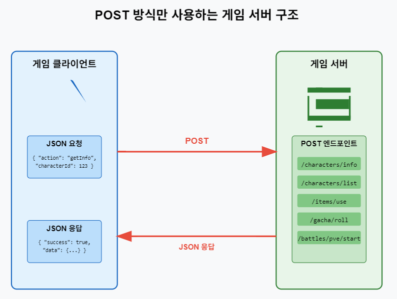      
  
Web API 서버 기본 템플릿 코드는 `codes/GameAPIServer_Template_01` 을 참고한다. DB 기능은 뺀 요청과 응답만이 구현 되어 있다.  
  

## 결론
ASP.NET Core Web API는 게임 서버 개발을 위한 강력한 프레임워크입니다. 특히 .NET 9.0의 새로운 기능들은 성능, 생산성, 보안 측면에서 게임 서버 개발자에게 많은 이점을 제공합니다.

이 장에서 배운 RESTful API 설계 원칙과 모범 사례를 바탕으로, 다음 장에서는 개발 환경 구축과 프로젝트 생성을 통해 실제 수집형 RPG 게임 서버 개발을 시작하겠습니다. MySQL과 Redis를 연동하여 데이터 관리 시스템을 구축하고, .http 파일을 활용해 API 테스트를 진행하며 점진적으로 게임 서버의 기능을 확장해나갈 것입니다.
  


