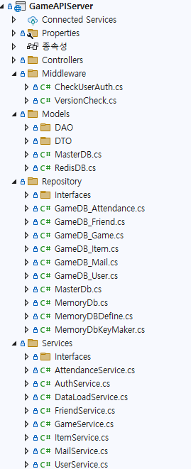

# ASP.NET Core Web API로 게임 서버 개발
  
저자: 최흥배, Claude AI   
-----------------------   
  
# Chapter 3. 개발 환경 구축
3장의 내용은 다양한 경로를 통해서 학습이 가능하므로 여기에서는 별도로 내용을 적지 않는다.  
  
  
## .NET 9.0 SDK 설치 및 설정
  
## Visual Studio/VS Code 환경 구성  
  
## 프로젝트 생성 및 기본 구조  
   

- Controllers: 컨트롤러 클래스를 저장하는 곳
- Dto: 클라이언트와 데이터를 주고받을 때 모델 클래스를 저장하는 곳
- Repositories: DB 접근 처리를 저장하는 곳
- Services : 비즈니스 로직을 저장하는 곳  
  

