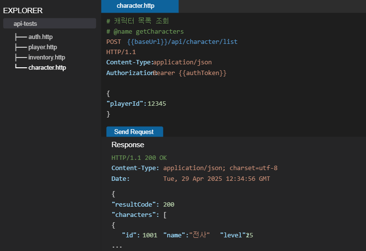

# ASP.NET Core Web API로 게임 서버 개발
  
저자: 최흥배, Claude AI   
-----------------------    
  
# Chapter 4. .http 파일을 이용한 API 테스트
    
## 4.1 .http 파일 소개 및 작성법
HTTP 요청을 테스트할 때 Postman이나 Insomnia 같은 도구를 사용하곤 한다. 그러나 이런 도구들은 별도로 설치해야 하고 요청 정보를 저장하는 방식이 프로젝트 코드와 분리되어 있다. 보다 효율적인 방법으로 .http 파일을 사용할 수 있다.

### .http 파일이란?
.http 파일은 HTTP 요청을 텍스트 형식으로 작성하여 저장한 단순한 파일이다. Visual Studio Code의 REST Client 확장 프로그램과 함께 사용하면 별도의 API 테스트 도구 없이도 HTTP 요청을 실행하고 응답을 확인할 수 있다.

### 기본 문법
.http 파일의 기본 문법은 다음과 같다:

```http
[HTTP 메서드] [URL] HTTP/[버전]
[헤더 필드]: [헤더 값]

[요청 본문]
```

게임 서버 API 테스트를 위한 간단한 예제:

```http
POST https://game-api.example.com/api/player/login HTTP/1.1
Content-Type: application/json

{
  "username": "player1",
  "password": "secret123"
}
```

### 여러 요청 작성하기
하나의 .http 파일에 여러 요청을 작성할 수 있다. 요청 사이에는 `###`를 구분자로 사용한다:

```http
POST https://game-api.example.com/api/player/login HTTP/1.1
Content-Type: application/json

{
  "username": "player1",
  "password": "secret123"
}

###

POST https://game-api.example.com/api/player/inventory HTTP/1.1
Content-Type: application/json
Authorization: Bearer {{authToken}}

{
  "playerId": 12345
}
```

### 변수 사용하기
.http 파일에서 변수를 사용할 수 있다. 이는 이전 응답에서 받은 값(예: 인증 토큰)을 후속 요청에 사용할 때 유용하다:

```http
# @name login
POST https://localhost:5001/api/auth/login HTTP/1.1
Content-Type: application/json

{
  "username": "player1",
  "password": "secret123"
}

###

@authToken = {{login.response.body.token}}
POST https://localhost:5001/api/player/characters HTTP/1.1
Content-Type: application/json
Authorization: Bearer {{authToken}}

{
  "action": "list"
}
```
  
#### 첫 번째 요청: 로그인 (Login) 🔑

```http
# @name login
POST https://localhost:5001/api/auth/login HTTP/1.1
Content-Type: application/json

{
  "username": "player1",
  "password": "secret123"
}
```

  * `# @name login`: 이 요청의 이름을 **login**으로 지정한다. 이렇게 이름을 붙여두면 나중에 다른 요청에서 이 요청의 결과를 참조할 수 있다.
  
이 요청이 성공하면 서버는 응답으로 **인증 토큰(Access Token)**을 보내줄 것이다.


#### 두 번째 요청: 캐릭터 목록 조회 (Get Characters) 📜

```http
@authToken = {{login.response.body.token}}
POST https://localhost:5001/api/player/characters HTTP/1.1
Content-Type: application/json
Authorization: Bearer {{authToken}}

{
  "action": "list"
}
```

  * `@authToken = {{login.response.body.token}}`: **가장 핵심적인 부분**이다.
      * `@authToken`: `authToken`이라는 이름의 **변수를 선언**한다.
      * `{{login.response.body.token}}`: **`login`이라는 이름의 요청**(`@name login`)이 실행된 후, 그 **응답(response)의 본문(body)**에 있는 `token`이라는 이름의 JSON 필드 값을 가져와 `@authToken` 변수에 저장하라는 의미이다.
  * `Authorization: Bearer {{authToken}}`: HTTP **Authorization 헤더**를 추가한다.
      * `{{authToken}}`: 위에서 저장한 **`@authToken` 변수의 값을 이곳에 삽입**하여 "Bearer [실제토큰값]" 형태로 인증 정보를 서버에 전달한다.
  
  

### 환경 설정
다양한 환경(개발, 테스트, 프로덕션)에 대한 설정을 정의할 수 있다:

```http
@hostname = localhost
@port = 5001
@baseUrl = https://{{hostname}}:{{port}}
@contentType = application/json

###

POST {{baseUrl}}/api/game/start HTTP/1.1
Content-Type: {{contentType}}

{
  "gameMode": "story",
  "difficultyLevel": "normal"
}
```

환경별 설정은 `.vscode` 폴더에 `settings.json` 파일을 생성하여 관리할 수 있다:

```json
{
  "rest-client.environmentVariables": {
    "$shared": {
      "contentType": "application/json"
    },
    "development": {
      "hostname": "localhost",
      "port": "5001",
      "baseUrl": "https://localhost:5001"
    },
    "production": {
      "hostname": "api.mygame.com",
      "port": "443",
      "baseUrl": "https://api.mygame.com"
    }
  }
}
```
  

## 4.2 REST Client 확장 프로그램 활용

### 설치 방법
Visual Studio Code에서 REST Client 확장 프로그램을 설치하는 방법:

1. VS Code 실행
2. 확장 프로그램 아이콘 클릭(또는 Ctrl+Shift+X)
3. 검색창에 "REST Client" 입력
4. Huachao Mao가 개발한 REST Client 확장 프로그램 설치
5. VS Code 재시작

### 주요 기능
REST Client 확장 프로그램의 주요 기능은 다음과 같다:

1. **요청 전송**: .http 파일에서 요청 위에 "Send Request" 링크가 표시된다. 이를 클릭하거나 단축키(Ctrl+Alt+R)를 사용해 요청을 보낼 수 있다.

2. **응답 보기**: 요청 실행 후 새 탭에서 응답을 확인할 수 있다. 응답은 상태 코드, 헤더, 본문으로 구분되어 표시된다.

3. **코드 생성**: 요청을 다양한 프로그래밍 언어(C#, JavaScript 등)의 코드로 변환할 수 있다.

4. **요청 기록**: 최근 실행한 요청의 기록을 확인할 수 있다.

5. **환경 전환**: 하단 상태 표시줄에서 환경(개발, 테스트, 프로덕션 등)을 쉽게 전환할 수 있다.
 
### 단축키

| 기능 | 단축키 |
|------|--------|
| 요청 보내기 | Ctrl+Alt+R |
| 현재 요청만 보내기 | Ctrl+Alt+C |
| 요청 취소 | Ctrl+Alt+K |
| 코드 생성 | Ctrl+Alt+G |
| 환경 변경 | Ctrl+Alt+E |

### .http 파일 테스트 예제
다음은 Visual Studio Code에서 .http 파일을 사용해 게임 서버 API를 테스트하는 화면이다:   
   
    

## 4.3 API 요청/응답 테스트 패턴
게임 서버 API 테스트를 위한 일반적인 패턴을 살펴보자. 이러한 패턴을 .http 파일에 적용하여 효율적인 테스트를 수행할 수 있다.

### 기본 테스트 패턴
게임 서버 API 테스트의 기본 패턴은 다음과 같다:

1. **인증**: 사용자 로그인 또는 토큰 발급
2. **자원 접근**: 인증 토큰을 사용한 API 호출
3. **검증**: 응답 확인 및 후속 테스트

이를 .http 파일로 구현한 예제:

```http
# 1. 플레이어 로그인
# @name login
POST https://localhost:5001/api/auth/login HTTP/1.1
Content-Type: application/json

{
  "username": "player1",
  "password": "secret123"
}
  
###

# 2. 토큰 저장 및 캐릭터 목록 조회
@authToken = {{login.response.body.token}}
# @name getCharacters
POST https://localhost:5001/api/character/list HTTP/1.1
Content-Type: application/json
Authorization: Bearer {{authToken}}

{
  "playerId": 12345
}

###

# 3. 특정 캐릭터 상세 정보 조회
@characterId = {{getCharacters.response.body.characters[0].id}}
POST https://localhost:5001/api/character/detail HTTP/1.1
Content-Type: application/json
Authorization: Bearer {{authToken}}

{
  "characterId": {{characterId}}
}
```

### 게임 서버 API 테스트를 위한 파일 구조
효율적인 테스트를 위해 .http 파일을 API 기능별로 분리하는 것이 좋다:

```
/api-tests
  ├── auth.http       # 인증 관련 API
  ├── player.http     # 플레이어 프로필 관련 API
  ├── character.http  # 캐릭터 관련 API
  ├── inventory.http  # 인벤토리 관련 API
  ├── item.http       # 아이템 관련 API
  ├── shop.http       # 상점 관련 API
  ├── gacha.http      # 가챠(뽑기) 관련 API
  └── battle.http     # 전투 관련 API
```

또한 공통 환경 변수는 `http-client.env.json` 파일에 정의하여 사용할 수 있다:

```json
{
  "development": {
    "baseUrl": "https://localhost:5001",
    "contentType": "application/json",
    "testUser": "player1",
    "testPassword": "secret123"
  },
  "staging": {
    "baseUrl": "https://staging-api.mygame.com",
    "contentType": "application/json",
    "testUser": "player1",
    "testPassword": "secret123"
  }
}
```

### 인증 테스트 패턴
게임 서버 API에서 인증은 매우 중요한 부분이다. 다음은 인증 관련 테스트 패턴의 예이다:

```http
# @name login
POST {{baseUrl}}/api/auth/login HTTP/1.1
Content-Type: {{contentType}}

{
  "username": "{{testUser}}",
  "password": "{{testPassword}}"
}

###

# 토큰 추출 및 저장
@authToken = {{login.response.body.token}}

###

# 잘못된 비밀번호로 로그인 시도
POST {{baseUrl}}/api/auth/login HTTP/1.1
Content-Type: {{contentType}}

{
  "username": "{{testUser}}",
  "password": "wrongpassword"
}

###

# 토큰 갱신
POST {{baseUrl}}/api/auth/refresh HTTP/1.1
Content-Type: {{contentType}}

{
  "refreshToken": "{{login.response.body.refreshToken}}"
}

###

# 로그아웃
POST {{baseUrl}}/api/auth/logout HTTP/1.1
Content-Type: {{contentType}}
Authorization: Bearer {{authToken}}

{
  "playerId": 12345
}
```

### 게임 데이터 CRUD 테스트 패턴
게임 내 데이터에 대한 생성, 조회, 수정, 삭제 테스트 패턴의 예:

```http
# 1. 캐릭터 생성
# @name createCharacter
POST {{baseUrl}}/api/character/create HTTP/1.1
Content-Type: {{contentType}}
Authorization: Bearer {{authToken}}

{
  "playerId": 12345,
  "characterType": "Warrior",
  "name": "용사123"
}

###

# 2. 생성된 캐릭터 ID 저장
@newCharacterId = {{createCharacter.response.body.characterId}}

###

# 3. 캐릭터 상세 정보 조회
# @name getCharacter
POST {{baseUrl}}/api/character/detail HTTP/1.1
Content-Type: {{contentType}}
Authorization: Bearer {{authToken}}

{
  "characterId": {{newCharacterId}}
}

###

# 4. 캐릭터 정보 업데이트
POST {{baseUrl}}/api/character/update HTTP/1.1
Content-Type: {{contentType}}
Authorization: Bearer {{authToken}}

{
  "characterId": {{newCharacterId}},
  "name": "강한용사123"
}

###

# 5. 캐릭터 삭제
POST {{baseUrl}}/api/character/delete HTTP/1.1
Content-Type: {{contentType}}
Authorization: Bearer {{authToken}}

{
  "characterId": {{newCharacterId}}
}
```
  
### 에러 처리 테스트 패턴
API의 다양한 에러 상황에 대한 테스트 패턴:

```http
# 1. 존재하지 않는 API 엔드포인트 호출
POST {{baseUrl}}/api/nonexistent HTTP/1.1
Content-Type: {{contentType}}
Authorization: Bearer {{authToken}}

{
  "someData": "value"
}

###

# 2. 필수 파라미터 누락
POST {{baseUrl}}/api/character/detail HTTP/1.1
Content-Type: {{contentType}}
Authorization: Bearer {{authToken}}

{
  // characterId 파라미터 누락
}

###

# 3. 유효하지 않은 토큰
POST {{baseUrl}}/api/character/list HTTP/1.1
Content-Type: {{contentType}}
Authorization: Bearer invalid_token

{
  "playerId": 12345
}

###

# 4. 권한 없는 자원 접근
POST {{baseUrl}}/api/admin/users HTTP/1.1
Content-Type: {{contentType}}
Authorization: Bearer {{authToken}}

{
  "action": "list"
}
```

### 테스트 자동화를 위한 스크립트 활용
여러 테스트 케이스를 자동으로 실행하기 위해 Node.js와 REST Client의 CLI 버전을 사용할 수 있다. 다음은 테스트 스크립트의 예이다:

```js
// test-runner.js
const { exec } = require('child_process');
const fs = require('fs');
const path = require('path');

const testDir = path.join(__dirname, 'api-tests');
const files = fs.readdirSync(testDir).filter(file => file.endsWith('.http'));

async function runTests() {
  console.log('Starting API tests...');
  
  for (const file of files) {
    console.log(`Running tests in ${file}...`);
    const filePath = path.join(testDir, file);
    
    try {
      await new Promise((resolve, reject) => {
        exec(`rest-client ${filePath} --env development`, (error, stdout, stderr) => {
          if (error) {
            console.error(`Error in ${file}:`, stderr);
            reject(error);
            return;
          }
          
          console.log(stdout);
          resolve();
        });
      });
      
      console.log(`Tests in ${file} completed successfully.`);
    } catch (error) {
      console.error(`Tests in ${file} failed.`);
    }
  }
  
  console.log('All tests completed.');
}

runTests();
```
  
 
## 4.4 종합 .http 파일 예제
모바일 수집형 RPG 게임 서버 테스트를 위한 종합적인 .http 파일 예제:   
    
```  
@baseUrl = https://localhost:5001
@contentType = application/json

################################
# 사용자 인증 테스트
################################

# 회원가입
# @name register
POST {{baseUrl}}/api/auth/register HTTP/1.1
Content-Type: {{contentType}}

{
  "username": "newplayer",
  "email": "player@example.com",
  "password": "strongpassword123"
}

###

# 로그인
# @name login
POST {{baseUrl}}/api/auth/login HTTP/1.1
Content-Type: {{contentType}}

{
  "username": "newplayer",
  "password": "strongpassword123"
}

###

# 토큰 추출 및 저장
@authToken = {{login.response.body.token}}
@refreshToken = {{login.response.body.refreshToken}}
@playerId = {{login.response.body.playerId}}

###

# 토큰 갱신
# @name refreshToken
POST {{baseUrl}}/api/auth/refresh HTTP/1.1
Content-Type: {{contentType}}

{
  "refreshToken": "{{refreshToken}}"
}

###

# 새 토큰 저장
@newAuthToken = {{refreshToken.response.body.token}}

################################
# 플레이어 프로필 테스트
################################

# 플레이어 정보 조회
# @name playerInfo
POST {{baseUrl}}/api/player/info HTTP/1.1
Content-Type: {{contentType}}
Authorization: Bearer {{authToken}}

{
  "playerId": {{playerId}}
}

###

# 플레이어 닉네임 변경
POST {{baseUrl}}/api/player/update-nickname HTTP/1.1
Content-Type: {{contentType}}
Authorization: Bearer {{authToken}}

{
  "playerId": {{playerId}},
  "nickname": "드래곤슬레이어"
}

################################
# 캐릭터 관리 테스트
################################

# 캐릭터 목록 조회
# @name characterList
POST {{baseUrl}}/api/character/list HTTP/1.1
Content-Type: {{contentType}}
Authorization: Bearer {{authToken}}

{
  "playerId": {{playerId}}
}

###

# 새 캐릭터 생성
# @name createCharacter
POST {{baseUrl}}/api/character/create HTTP/1.1
Content-Type: {{contentType}}
Authorization: Bearer {{authToken}}

{
  "playerId": {{playerId}},
  "characterType": "Archer",
  "name": "엘프궁수"
}

###

# 생성된 캐릭터 ID 저장
@characterId = {{createCharacter.response.body.characterId}}

###

# 캐릭터 상세 정보 조회
# @name characterDetail
POST {{baseUrl}}/api/character/detail HTTP/1.1
Content-Type: {{contentType}}
Authorization: Bearer {{authToken}}

{
  "characterId": {{characterId}}
}

###

# 캐릭터 레벨업
POST {{baseUrl}}/api/character/levelup HTTP/1.1
Content-Type: {{contentType}}
Authorization: Bearer {{authToken}}

{
  "characterId": {{characterId}}
}

################################
# 인벤토리 테스트
################################

# 인벤토리 조회
# @name inventory
POST {{baseUrl}}/api/inventory/list HTTP/1.1
Content-Type: {{contentType}}
Authorization: Bearer {{authToken}}

{
  "playerId": {{playerId}}
}

###

# 아이템 사용
POST {{baseUrl}}/api/inventory/use-item HTTP/1.1
Content-Type: {{contentType}}
Authorization: Bearer {{authToken}}

{
  "playerId": {{playerId}},
  "itemId": 10001,
  "quantity": 1,
  "targetCharacterId": {{characterId}}
}

################################
# 상점 테스트
################################

# 상점 목록 조회
# @name shopList
POST {{baseUrl}}/api/shop/list HTTP/1.1
Content-Type: {{contentType}}
Authorization: Bearer {{authToken}}

{
  "shopType": "regular"
}

###

# 아이템 구매
POST {{baseUrl}}/api/shop/purchase HTTP/1.1
Content-Type: {{contentType}}
Authorization: Bearer {{authToken}}

{
  "playerId": {{playerId}},
  "itemId": 20001,
  "quantity": 1,
  "currency": "gold"
}

################################
# 가챠(뽑기) 테스트
################################

# 가챠 목록 조회
# @name gachaList
POST {{baseUrl}}/api/gacha/list HTTP/1.1
Content-Type: {{contentType}}
Authorization: Bearer {{authToken}}

{
  "playerId": {{playerId}}
}

###

# 가챠 1회 뽑기
# @name gachaDraw
POST {{baseUrl}}/api/gacha/draw HTTP/1.1
Content-Type: {{contentType}}
Authorization: Bearer {{authToken}}

{
  "playerId": {{playerId}},
  "gachaId": 1,
  "drawType": "single"
}

###

# 가챠 10회 뽑기
POST {{baseUrl}}/api/gacha/draw HTTP/1.1
Content-Type: {{contentType}}
Authorization: Bearer {{authToken}}

{
  "playerId": {{playerId}},
  "gachaId": 1,
  "drawType": "multi"
}

################################
# 전투 테스트
################################

# 스테이지 정보 조회
# @name stageInfo
POST {{baseUrl}}/api/battle/stage-info HTTP/1.1
Content-Type: {{contentType}}
Authorization: Bearer {{authToken}}

{
  "stageId": 1001
}

###

# 전투 시작
# @name battleStart
POST {{baseUrl}}/api/battle/start HTTP/1.1
Content-Type: {{contentType}}
Authorization: Bearer {{authToken}}

{
  "playerId": {{playerId}},
  "stageId": 1001,
  "partyCharacters": [
    {
      "characterId": {{characterId}},
      "position": 1
    }
  ]
}

###

# 전투 결과 제출
POST {{baseUrl}}/api/battle/submit-result HTTP/1.1
Content-Type: {{contentType}}
Authorization: Bearer {{authToken}}

{
  "battleId": "{{battleStart.response.body.battleId}}",
  "playerId": {{playerId}},
  "result": "win",
  "clearTime": 45,
  "remainingHp": {
    "{{characterId}}": 850
  },
  "usedSkills": [
    {
      "characterId": {{characterId}},
      "skillId": 2001,
      "useCount": 3
    }
  ]
}

################################
# 오류 테스트
################################

# 존재하지 않는 API 호출
POST {{baseUrl}}/api/nonexistent HTTP/1.1
Content-Type: {{contentType}}
Authorization: Bearer {{authToken}}

{
  "someData": "value"
}

###

# 필수 파라미터 누락
POST {{baseUrl}}/api/character/detail HTTP/1.1
Content-Type: {{contentType}}
Authorization: Bearer {{authToken}}

{
  
}

###

# 유효하지 않은 토큰
POST {{baseUrl}}/api/player/info HTTP/1.1
Content-Type: {{contentType}}
Authorization: Bearer invalid_token

{
  "playerId": {{playerId}}
}

###

# 로그아웃
POST {{baseUrl}}/api/auth/logout HTTP/1.1
Content-Type: {{contentType}}
Authorization: Bearer {{authToken}}

{
  "playerId": {{playerId}}
} 
```   
    

## 4.5 REST Client를 활용한 테스트 자동화
대규모 게임 서버 개발 프로젝트에서는 API 테스트 자동화가 중요하다. REST Client를 활용한 테스트 자동화 방법을 알아보자.  

### 테스트 스크립트 작성
Node.js와 REST Client CLI를 사용하여 테스트 스크립트를 작성할 수 있다:

```javascript
// test-runner.js
const { exec } = require('child_process');
const fs = require('fs');
const path = require('path');
const util = require('util');

const execPromise = util.promisify(exec);
const testDir = path.join(__dirname, 'api-tests');

async function runTests() {
  try {
    // 1. 환경 설정
    const env = process.argv[2] || 'development';
    console.log(`Running tests in ${env} environment...`);
    
    // 2. 테스트 파일 목록 가져오기
    const files = fs.readdirSync(testDir)
      .filter(file => file.endsWith('.http'))
      .sort((a, b) => {
        // auth.http 파일을 가장 먼저 실행
        if (a === 'auth.http') return -1;
        if (b === 'auth.http') return 1;
        return a.localeCompare(b);
      });
    
    // 3. 각 파일에 대해 테스트 실행
    const results = [];
    for (const file of files) {
      const filePath = path.join(testDir, file);
      console.log(`Running tests in ${file}...`);
      
      try {
        const { stdout, stderr } = await execPromise(`rest-client ${filePath} --env ${env}`);
        
        if (stderr) {
          console.error(`Error in ${file}:`, stderr);
          results.push({ file, success: false, error: stderr });
        } else {
          console.log(`Tests in ${file} completed successfully.`);
          results.push({ file, success: true });
        }
      } catch (error) {
        console.error(`Error executing ${file}:`, error.message);
        results.push({ file, success: false, error: error.message });
      }
    }
    
    // 4. 결과 요약 출력
    console.log('\n===== Test Results =====');
    const successCount = results.filter(r => r.success).length;
    console.log(`Passed: ${successCount}/${results.length}`);
    
    const failedTests = results.filter(r => !r.success);
    if (failedTests.length > 0) {
      console.log('\nFailed Tests:');
      failedTests.forEach(test => {
        console.log(`- ${test.file}: ${test.error}`);
      });
      process.exit(1);
    } else {
      console.log('\nAll tests passed!');
    }
  } catch (error) {
    console.error('Error running tests:', error);
    process.exit(1);
  }
}

runTests();
```

### CI/CD 파이프라인 통합
GitHub Actions 또는 Jenkins와 같은 CI/CD 시스템에 .http 파일 테스트를 통합할 수 있다. 다음은 GitHub Actions 워크플로우 예제다:

```yaml
# .github/workflows/api-tests.yml
name: API Tests

on:
  push:
    branches: [ main ]
  pull_request:
    branches: [ main ]

jobs:
  test:
    runs-on: ubuntu-latest

    services:
      mysql:
        image: mysql:8.0
        env:
          MYSQL_ROOT_PASSWORD: password
          MYSQL_DATABASE: gamedb_test
        ports:
          - 3306:3306
        options: --health-cmd="mysqladmin ping" --health-interval=10s --health-timeout=5s --health-retries=3
      
      redis:
        image: redis:6
        ports:
          - 6379:6379
        options: --health-cmd="redis-cli ping" --health-interval=10s --health-timeout=5s --health-retries=3

    steps:
    - uses: actions/checkout@v2
    
    - name: Setup .NET
      uses: actions/setup-dotnet@v1
      with:
        dotnet-version: 9.0.x
    
    - name: Setup Node.js
      uses: actions/setup-node@v3
      with:
        node-version: '20'
    
    - name: Install REST Client CLI
      run: npm install -g @vscode/restclient
    
    - name: Build and run API
      run: |
        dotnet restore
        dotnet build --no-restore
        dotnet run --project src/GameServer/GameServer.csproj --no-build &
        sleep 10  # 서버 시작 대기
    
    - name: Run API Tests
      run: node test-runner.js test
```
  

## 4.6 성능 테스트를 위한 .http 파일 활용
게임 서버 API의 성능 테스트를 위해 .http 파일을 활용할 수 있다:  

```http
@baseUrl = https://localhost:5001
@contentType = application/json

# 로그인하여 토큰 발급
# @name login
POST {{baseUrl}}/api/auth/login HTTP/1.1
Content-Type: {{contentType}}

{
  "username": "performance_test_user",
  "password": "password123"
}

###

@authToken = {{login.response.body.token}}
@playerId = {{login.response.body.playerId}}

# 성능 테스트를 위한 캐릭터 목록 API 호출
# @name characterList
POST {{baseUrl}}/api/character/list HTTP/1.1
Content-Type: {{contentType}}
Authorization: Bearer {{authToken}}

{
  "playerId": {{playerId}}
}

// 성능 측정 스크립트에서는 이 요청을 여러 번 반복 실행하여 응답 시간을 측정할 수 있다
```

성능 테스트 스크립트:

```javascript
// performance-test.js
const { exec } = require('child_process');
const fs = require('fs');
const path = require('path');
const util = require('util');

const execPromise = util.promisify(exec);
const performanceTestFile = path.join(__dirname, 'performance-test.http');
const iterations = 100;  // 반복 횟수

async function runPerformanceTest() {
  console.log(`Running performance test for ${iterations} iterations...`);
  
  const results = [];
  for (let i = 0; i < iterations; i++) {
    const startTime = Date.now();
    
    try {
      await execPromise(`rest-client ${performanceTestFile} --env development`);
      const endTime = Date.now();
      const duration = endTime - startTime;
      
      results.push(duration);
      console.log(`Iteration ${i + 1}/${iterations}: ${duration}ms`);
    } catch (error) {
      console.error(`Error in iteration ${i + 1}:`, error.message);
    }
  }
  
  // 결과 분석
  const totalTime = results.reduce((sum, time) => sum + time, 0);
  const avgTime = totalTime / results.length;
  const minTime = Math.min(...results);
  const maxTime = Math.max(...results);
  
  console.log('\n===== Performance Test Results =====');
  console.log(`Total Iterations: ${results.length}`);
  console.log(`Average Response Time: ${avgTime.toFixed(2)}ms`);
  console.log(`Minimum Response Time: ${minTime}ms`);
  console.log(`Maximum Response Time: ${maxTime}ms`);
}

runPerformanceTest();
```
  

## 4.7 정리
이 장에서는 .http 파일을 이용한 API 테스트에 대해 알아보았다. 주요 내용은 다음과 같다:  

1. **.http 파일 소개 및 작성법**
   - 기본 문법과 구조
   - 변수 사용 및 환경 설정
   - 다중 요청 작성

2. **REST Client 확장 프로그램 활용**
   - 설치 및 기본 기능
   - 단축키 및 사용 팁
   - 응답 확인 방법

3. **API 요청/응답 테스트 패턴**
   - 인증 테스트 패턴
   - 게임 데이터 CRUD 테스트 패턴
   - 에러 처리 테스트 패턴

4. **테스트 자동화 및 성능 테스트**
   - 테스트 스크립트 작성
   - CI/CD 파이프라인 통합
   - 성능 테스트 방법

.http 파일은 게임 서버 API 개발 시 효율적인 테스트 도구로 사용할 수 있다. 특히 클라이언트 개발 없이도 서버 API의 기능을 검증할 수 있어 개발 효율성을 높여준다.

다음 장에서는 MySQL과 Redis를 활용한 데이터 관리에 대해 알아볼 것이다.   
  

