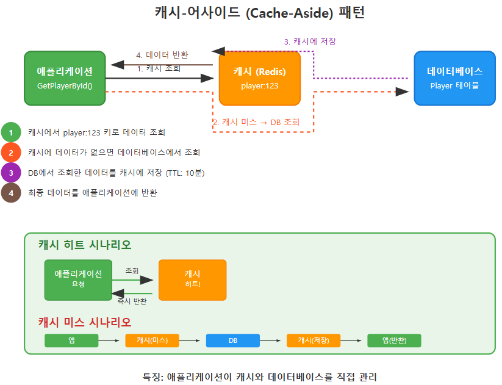
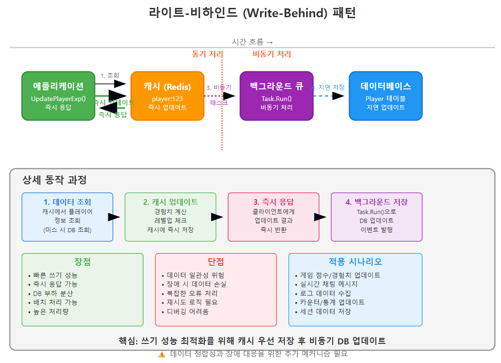
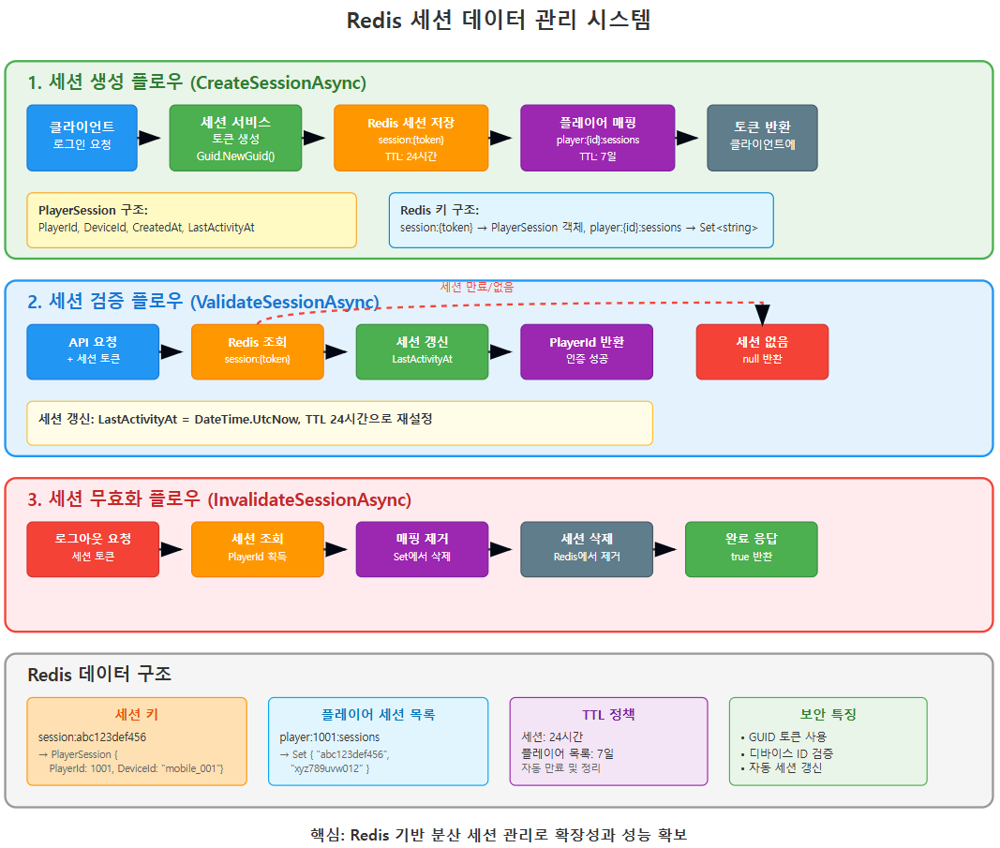
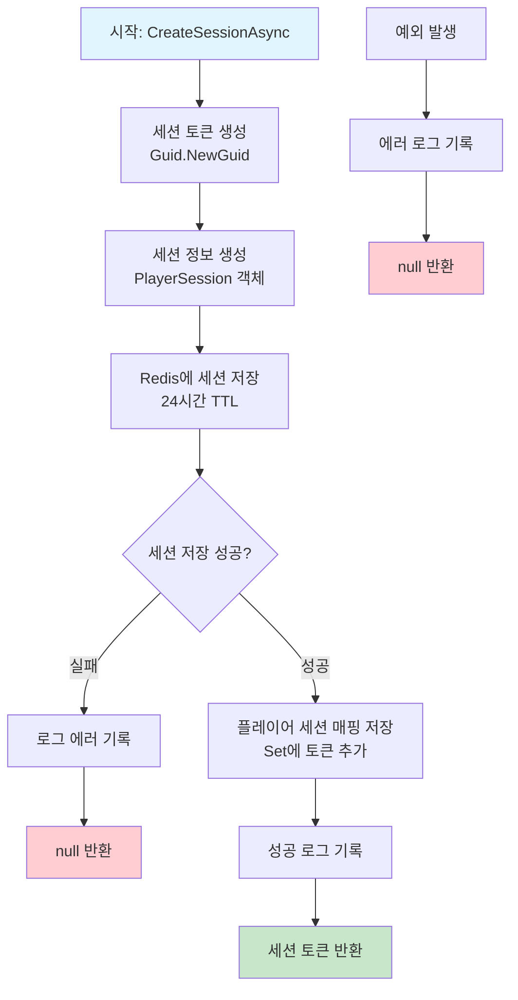
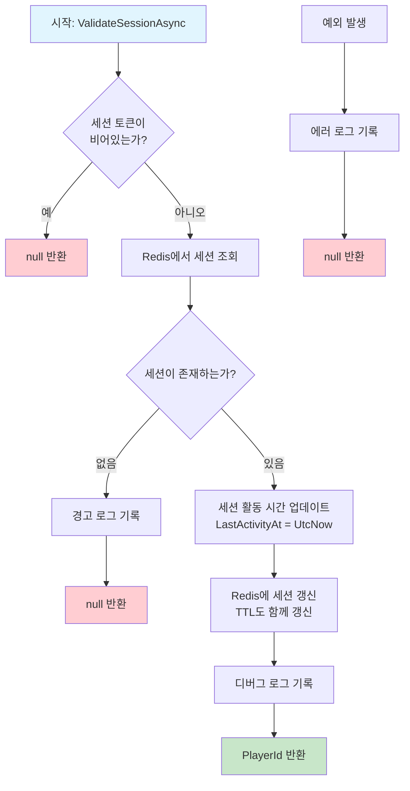
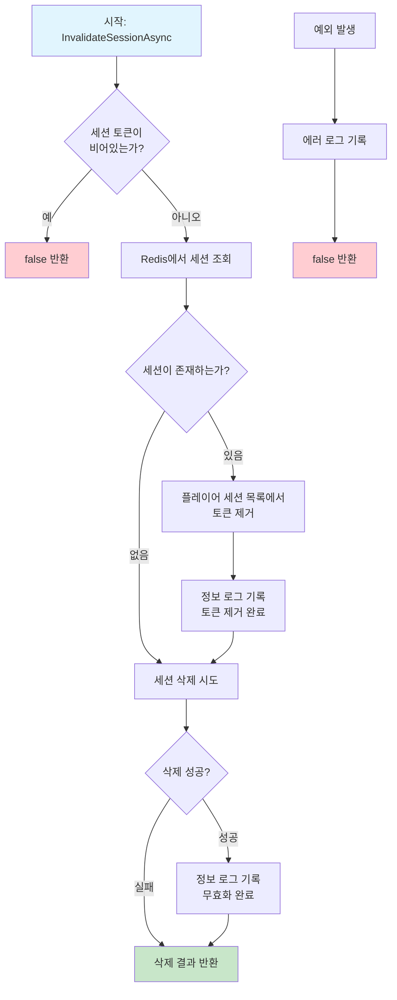
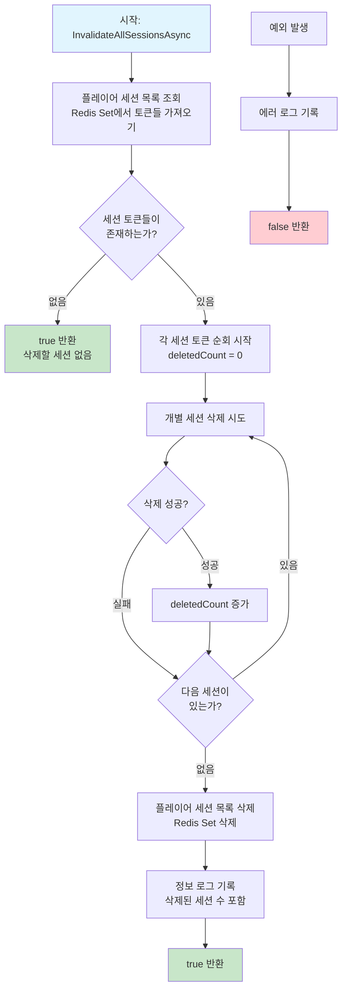
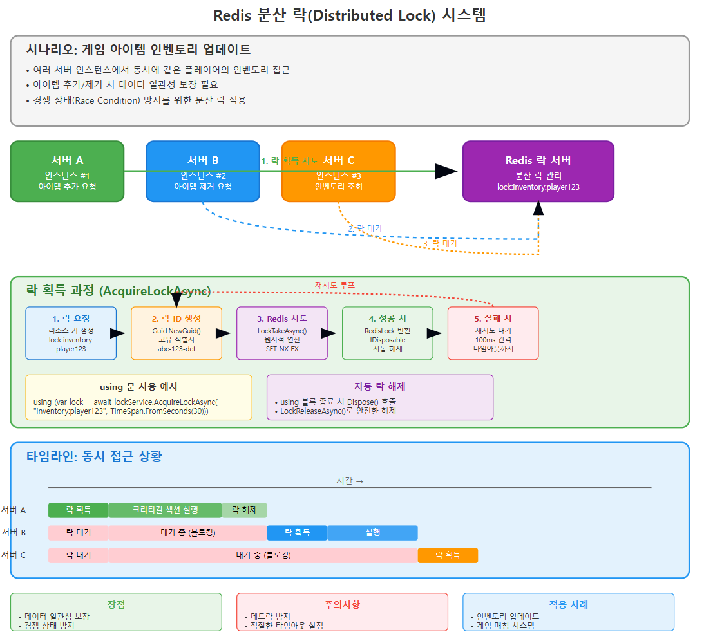
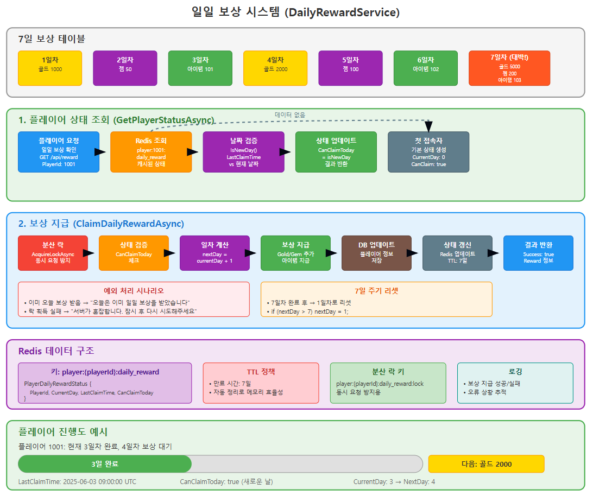

# ASP.NET Core Web API로 게임 서버 개발
  
저자: 최흥배, Claude AI   
-----------------------     
 
# Chapter 6. Redis 캐시 시스템 구현

## 6.1 게임 서버에서 Redis의 필요성
수집형 RPG 게임 서버는 수많은 동시 요청을 처리해야 한다. 사용자가 증가할수록 데이터베이스에 가해지는 부하도 증가한다.   이러한 부하를 줄이고 응답 시간을 개선하기 위해 Redis와 같은 인메모리 캐시 시스템이 필요하다.  

```
┌─────────────────────┐       ┌─────────────────────┐      ┌─────────────────────┐
│                     │       │                     │      │                     │
│   클라이언트 요청     │──────►│   ASP.NET Core      │◄────►│     Redis 캐시       │
│                     │       │   Web API Server    │      │                     │
└─────────────────────┘       │                     │      │  - 빠른 읽기/쓰기     │
                              └──────────┬──────────┘      │  - 세션 데이터        │
                                         │                 │  - 임시 게임 데이터   │
                                         ▼                 └─────────────────────┘
                              ┌─────────────────────┐               │
                              │                     │               │
                              │     MySQL DB        │◄──────────────┘
                              │                     │      (필요시 영구 저장)
                              └─────────────────────┘
```

### 6.1.1 Redis가 게임 서버에서 해결하는 문제
- **데이터베이스 부하 감소**: 자주 접근하는 데이터를 캐싱하여 MySQL 부하 감소
- **빠른 응답 시간**: 인메모리 캐시로 밀리초 단위의 빠른 응답 제공
- **임시 데이터 저장**: 세션 정보, 임시 게임 상태 등을 효율적으로 관리
- **실시간 데이터 처리**: 랭킹, 채팅, 알림 등 실시간 데이터 처리에 적합
- **분산 시스템 지원**: 여러 서버 인스턴스 간 데이터 공유 가능
  

## 6.2 CloudStructures 라이브러리 소개
CloudStructures는 StackExchange.Redis 기반의 고수준 Redis 클라이언트 라이브러리다. 타입 안전성과 비동기 작업을 지원하여 .NET 환경에서 Redis를 쉽게 사용할 수 있게 해준다.

### 6.2.1 CloudStructures의 주요 특징
- **타입 안전성**: 제네릭 타입을 활용한 타입 안전한 데이터 처리
- **비동기 지원**: Task 기반 비동기 작업 지원
- **직렬화 지원**: MessagePack, JSON 등 다양한 직렬화 옵션
- **고수준 추상화**: Redis 데이터 구조를 C# 클래스로 추상화
- **풍부한 데이터 구조**: String, Hash, List, Set, Sorted Set 등 Redis 데이터 구조 지원
  
#### CloudStructures의 직렬화 옵션별 예제 코드
  
**1. MessagePack 직렬화 (기본값)**  
```csharp
// 기본 MessagePack 직렬화 사용
var connection = new RedisConnection(connectionString);
var redis = new RedisString<Person>(connection, "user:1001", TimeSpan.FromMinutes(30));

var person = new Person { Name = "김철수", Age = 30, Email = "kim@example.com" };
await redis.SetAsync(person);

var retrievedPerson = await redis.GetAsync();
```
  
**2. JSON 직렬화**  
```csharp
// JSON 직렬화 사용
var jsonConverter = new JsonValueConverter();
var redis = new RedisString<Person>(connection, "user:1002", TimeSpan.FromMinutes(30), jsonConverter);

var person = new Person { Name = "이영희", Age = 25, Email = "lee@example.com" };
await redis.SetAsync(person);

// Redis CLI에서 확인 시 JSON 형태로 보임
// GET user:1002 -> {"Name":"이영희","Age":25,"Email":"lee@example.com"}
```
  
**3. 압축된 MessagePack**  
```csharp
// Gzip 압축과 함께 MessagePack 사용
var compressedConverter = new GZipMessagePackValueConverter<Person>();
var redis = new RedisString<Person>(connection, "user:1003", TimeSpan.FromMinutes(30), compressedConverter);

await redis.SetAsync(person);
```
  
**4. 사용자 정의 직렬화**  
```csharp
// 커스텀 컨버터 구현
public class CustomValueConverter<T> : IValueConverter<T>
{
    public RedisValue Serialize(T value)
    {
        // 사용자 정의 직렬화 로직
        var json = JsonSerializer.Serialize(value);
        return $"CUSTOM:{json}";
    }

    public T Deserialize(RedisValue value)
    {
        // 사용자 정의 역직렬화 로직
        var jsonString = value.ToString().Substring(7); // "CUSTOM:" 제거
        return JsonSerializer.Deserialize<T>(jsonString);
    }
}

// 사용
var customConverter = new CustomValueConverter<Person>();
var redis = new RedisString<Person>(connection, "user:1004", TimeSpan.FromMinutes(30), customConverter);
```
  
**5. 컬렉션에서 직렬화 옵션 사용**  
```csharp
// List에서 JSON 직렬화 사용
var jsonConverter = new JsonValueConverter();
var redisList = new RedisList<Person>(connection, "users", jsonConverter);

await redisList.RightPushAsync(person);
var people = await redisList.RangeAsync(0, -1);
```

각 직렬화 방식은 성능과 가독성 측면에서 서로 다른 장단점을 가지므로 프로젝트 요구사항에 맞게 선택한다.   
  
  
## 6.3 CloudStructures 설치 및 설정

### 6.3.1 NuGet 패키지 설치

```bash
dotnet add package CloudStructures
```

### 6.3.2 기본 설정

`appsettings.json` 파일에 Redis 연결 설정을 추가한다:

```json
{
  "Redis": {
    "Configuration": "localhost:6379",
    "DefaultDatabase": 0,
    "ConnectionTimeout": 5000,
    "Password": ""
  }
}
```

### 6.3.3 DI 컨테이너에 서비스 등록
`Program.cs` 파일에 CloudStructures 서비스를 등록한다:

```csharp
// Program.cs
using CloudStructures;
using CloudStructures.Structures;
using StackExchange.Redis;

// Redis 설정 로드
var redisOptions = builder.Configuration.GetSection("Redis").Get<RedisOptions>();
var redisConfig = new RedisConfig("Default", redisOptions.Configuration, redisOptions.DefaultDatabase);
builder.Services.AddSingleton(redisConfig);

// 일반적인 Redis 작업을 위한 서비스 등록
builder.Services.AddSingleton<IRedisService, RedisService>();

// 세션 관리를 위한 서비스 등록
builder.Services.AddSingleton<IPlayerSessionService, PlayerSessionService>();
```

### 6.3.4 RedisOptions 및 RedisService 클래스 구현

```csharp
// Models/Redis/RedisOptions.cs
public class RedisOptions
{
    public string Configuration { get; set; }
    public int DefaultDatabase { get; set; }
    public int ConnectionTimeout { get; set; }
    public string Password { get; set; }
}
```

```csharp
// Services/Redis/RedisService.cs
public interface IRedisService
{
    Task<T> GetAsync<T>(string key);
    Task<bool> SetAsync<T>(string key, T value, TimeSpan? expiry = null);
    Task<bool> DeleteAsync(string key);
    Task<bool> ExistsAsync(string key);
    Task<long> IncrementAsync(string key, long value = 1);
    Task<double> IncrementFloatAsync(string key, double value);
    Task<bool> ExpireAsync(string key, TimeSpan expiry);
    Task<TimeSpan?> GetTimeToLiveAsync(string key);
}

public class RedisService : IRedisService
{
    private readonly RedisConfig _redisConfig;

    public RedisService(RedisConfig redisConfig)
    {
        _redisConfig = redisConfig;
    }

    public async Task<T> GetAsync<T>(string key)
    {
        var redis = new RedisString<T>(_redisConfig, key);
        var result = await redis.GetAsync();
        return result.HasValue ? result.Value : default;
    }

    public async Task<bool> SetAsync<T>(string key, T value, TimeSpan? expiry = null)
    {
        var redis = new RedisString<T>(_redisConfig, key);
        return await redis.SetAsync(value, expiry);
    }

    public async Task<bool> DeleteAsync(string key)
    {
        var redis = new RedisString<object>(_redisConfig, key);
        return await redis.DeleteAsync();
    }

    public async Task<bool> ExistsAsync(string key)
    {
        var redis = new RedisString<object>(_redisConfig, key);
        return await redis.ExistsAsync();
    }

    public async Task<long> IncrementAsync(string key, long value = 1)
    {
        var redis = new RedisString<long>(_redisConfig, key);
        return await redis.IncrementAsync(value);
    }

    public async Task<double> IncrementFloatAsync(string key, double value)
    {
        var redis = new RedisString<double>(_redisConfig, key);
        return await redis.IncrementAsync(value);
    }

    public async Task<bool> ExpireAsync(string key, TimeSpan expiry)
    {
        var redis = new RedisString<object>(_redisConfig, key);
        return await redis.ExpireAsync(expiry);
    }

    public async Task<TimeSpan?> GetTimeToLiveAsync(string key)
    {
        var redis = new RedisString<object>(_redisConfig, key);
        return await redis.GetTimeToLiveAsync();
    }
}
```
  
  
## 6.4 게임 데이터 캐싱 전략

### 6.4.1 캐싱 패턴
게임 서버에서 사용할 수 있는 주요 캐싱 패턴은 다음과 같다:

#### 1. 캐시-어사이드 (Cache-Aside) 패턴
가장 일반적인 패턴으로, 데이터 조회 시 먼저 캐시를 확인하고 없으면 데이터베이스에서 조회 후 캐시에 저장한다.

   

```csharp
public async Task<Player> GetPlayerByIdAsync(int playerId)
{
    // 1. 캐시에서 조회
    string cacheKey = $"player:{playerId}";
    var player = await _redisService.GetAsync<Player>(cacheKey);
    
    if (player != null)
    {
        return player; // 캐시 히트
    }
    
    // 2. 캐시에 없으면 데이터베이스에서 조회
    player = await _playerRepository.GetByIdAsync(playerId);
    
    if (player != null)
    {
        // 3. 데이터베이스에서 조회한 결과를 캐시에 저장 (10분 만료)
        await _redisService.SetAsync(cacheKey, player, TimeSpan.FromMinutes(10));
    }
    
    return player;
}
```  
  
캐시 히트인 경우:  
- 애플리케이션 → 캐시 조회 → 데이터 존재 → 즉시 반환
- 빠른 응답 시간, 데이터베이스 부하 없음
  
캐시 미스인 경우:  
- 애플리케이션이 캐시에서 데이터 조회
- 캐시에 데이터 없음 (미스)
- 애플리케이션이 데이터베이스에서 데이터 조회
- 조회한 데이터를 캐시에 저장 (TTL 설정)
- 애플리케이션에 데이터 반환
  
주요 특징:  
- 애플리케이션이 캐시와 데이터베이스를 모두 직접 관리
- 가장 일반적이고 구현하기 쉬운 패턴
- 데이터 정합성을 애플리케이션 레벨에서 제어
캐시 무효화 로직을 별도로 구현해야 함  
  
  
#### 2. 라이트-비하인드 (Write-Behind) 패턴
데이터를 먼저 캐시에 쓰고, 나중에 비동기적으로 데이터베이스에 저장한다. 이 패턴은 쓰기 작업이 많은 시나리오에 적합하다.  
  
       
  
```csharp
public async Task UpdatePlayerExperienceAsync(int playerId, int additionalExp)
{
    string cacheKey = $"player:{playerId}";
    
    // 1. 캐시에서 플레이어 데이터 조회
    var player = await _redisService.GetAsync<Player>(cacheKey);
    
    if (player == null)
    {
        // 캐시에 없으면 데이터베이스에서 조회
        player = await _playerRepository.GetByIdAsync(playerId);
        
        if (player == null)
        {
            throw new NotFoundException("플레이어를 찾을 수 없습니다.");
        }
    }
    
    // 2. 경험치 업데이트
    player.Experience += additionalExp;
    
    // 기존 레벨 저장
    int oldLevel = player.Level;
    
    // 레벨업 체크 및 처리
    while (player.Experience >= GetExpForNextLevel(player.Level))
    {
        player.Level++;
    }
    
    // 3. 업데이트된 데이터를 캐시에 저장
    await _redisService.SetAsync(cacheKey, player, TimeSpan.FromMinutes(10));
    
    // 4. 변경 사항을 백그라운드에서 데이터베이스에 저장
    _ = Task.Run(async () =>
    {
        try
        {
            await _playerRepository.UpdateAsync(player);
            
            // 레벨업 이벤트 발생
            if (player.Level > oldLevel)
            {
                await _eventService.PublishLevelUpEventAsync(playerId, player.Level);
            }
        }
        catch (Exception ex)
        {
            _logger.LogError(ex, "플레이어 경험치 업데이트 중 오류 발생. PlayerId: {PlayerId}", playerId);
            // 재시도 로직 또는 오류 큐에 추가
        }
    });
}
```  
      
**동작 순서:**
1. **데이터 조회**: 캐시에서 먼저 조회, 없으면 DB에서 조회
2. **캐시 업데이트**: 비즈니스 로직 처리 후 캐시에 즉시 저장
3. **즉시 응답**: 클라이언트에게 바로 응답 반환 (빠른 성능)
4. **백그라운드 저장**: `Task.Run()`으로 비동기적으로 DB 업데이트

**주요 장점:**
- 쓰기 작업의 응답 시간이 매우 빠름
- DB 부하를 시간적으로 분산시킴
- 배치 처리로 효율성 향상 가능

**주요 단점:**
- 캐시와 DB 간 일시적 불일치 발생
- 시스템 장애 시 데이터 손실 위험
- 복잡한 오류 처리 및 재시도 로직 필요

**적용 예시:**
- 게임에서 경험치/점수 업데이트
- 실시간 채팅 메시지 저장
- 로그 데이터 수집
- 카운터/통계 업데이트

이 패턴은 쓰기 성능이 중요하고 약간의 데이터 지연이 허용되는 시나리오에서 매우 유용하다.
  
  
#### 3. 쓰기-스루 (Write-Through) 패턴
데이터 변경 시 캐시와 데이터베이스에 동시에 쓰는 패턴으로, 데이터 일관성이 중요한 경우 사용한다.
  
   

```csharp
public async Task<bool> UpdatePlayerGoldAsync(int playerId, int amount)
{
    string cacheKey = $"player:{playerId}";
    
    // 트랜잭션 시작
    using var connection = new MySqlConnection(_connectionString);
    await connection.OpenAsync();
    using var transaction = await connection.BeginTransactionAsync();
    
    try
    {
        // 1. 데이터베이스에서 플레이어 조회
        var player = await _playerRepository.GetByIdWithTransactionAsync(playerId, connection, transaction);
        
        if (player == null)
        {
            await transaction.RollbackAsync();
            return false;
        }
        
        // 2. 골드 업데이트
        player.Gold += amount;
        
        if (player.Gold < 0)
        {
            await transaction.RollbackAsync();
            return false; // 골드가 부족한 경우
        }
        
        // 3. 데이터베이스 업데이트
        await _playerRepository.UpdateWithTransactionAsync(player, connection, transaction);
        
        // 4. 트랜잭션 커밋
        await transaction.CommitAsync();
        
        // 5. 캐시 업데이트
        await _redisService.SetAsync(cacheKey, player, TimeSpan.FromMinutes(10));
        
        return true;
    }
    catch (Exception)
    {
        await transaction.RollbackAsync();
        // 캐시에서 해당 플레이어 키 삭제 (일관성 유지)
        await _redisService.DeleteAsync(cacheKey);
        throw;
    }
}
```
  
**핵심 원리: "DB 우선, 캐시 후"**
- 데이터베이스에 먼저 저장한 후 캐시 업데이트
- 트랜잭션을 통한 원자성 보장
- 오류 발생 시 전체 롤백

**성공 시나리오:**
1. **트랜잭션 시작** → DB 연결 및 데이터 조회
2. **비즈니스 로직** → 골드 계산 및 유효성 검증
3. **DB 업데이트** → 데이터 저장 및 트랜잭션 커밋
4. **캐시 업데이트** → 일관성을 위한 캐시 동기화
5. **성공 응답** → 클라이언트에 결과 반환

**실패 시나리오:**
- 오류 발생 시 트랜잭션 롤백
- 캐시 키 삭제로 일관성 보장
- 예외 발생으로 실패 알림

**주요 장점:**
- 강력한 데이터 일관성 보장
- ACID 트랜잭션 특성 활용
- 장애 시 자동 복구 메커니즘

**주요 단점:**
- 느린 쓰기 성능 (DB 응답 대기)
- 높은 응답 지연 시간
- 복잡한 트랜잭션 관리

**적용 시나리오:**
- 금융 거래 (송금, 결제)
- 게임 골드/아이템 거래
- 계정 잔액 관리
- 재고 관리 시스템

이 패턴은 성능보다 데이터 정확성과 일관성이 더 중요한 시스템에서 사용한다.


### 6.4.2 게임 데이터 캐싱 전략
게임 서버에서 효과적으로 캐싱할 수 있는 데이터 유형과 전략을 살펴보자:

#### 1. 정적 데이터 캐싱
게임의 정적 데이터(아이템, 스킬, 스테이지 정보 등)는 변경이 거의 없으므로 장기 캐싱에 적합하다.

```csharp
public async Task<List<GameItem>> GetAllGameItemsAsync()
{
    string cacheKey = "game:items:all";
    
    // 1. 캐시에서 조회
    var items = await _redisService.GetAsync<List<GameItem>>(cacheKey);
    
    if (items != null)
    {
        return items;
    }
    
    // 2. 데이터베이스에서 조회
    items = await _itemRepository.GetAllItemsAsync();
    
    // 3. 캐시에 저장 (하루 동안 유효)
    await _redisService.SetAsync(cacheKey, items, TimeSpan.FromDays(1));
    
    return items;
}
```

#### 2. 사용자 데이터 캐싱
자주 변경되는 사용자 데이터(레벨, 경험치, 골드 등)는 짧은 TTL로 캐싱한다.

```csharp
public async Task<PlayerStats> GetPlayerStatsAsync(int playerId)
{
    string cacheKey = $"player:{playerId}:stats";
    
    // 1. 캐시에서 조회
    var stats = await _redisService.GetAsync<PlayerStats>(cacheKey);
    
    if (stats != null)
    {
        return stats;
    }
    
    // 2. 데이터베이스에서 조회
    var player = await _playerRepository.GetByIdAsync(playerId);
    
    if (player == null)
    {
        return null;
    }
    
    stats = new PlayerStats
    {
        PlayerId = player.Id,
        Level = player.Level,
        Experience = player.Experience,
        Gold = player.Gold,
        Gems = player.Gems,
        Power = await _playerService.CalculatePlayerPowerAsync(playerId)
    };
    
    // 3. 캐시에 저장 (5분 동안 유효)
    await _redisService.SetAsync(cacheKey, stats, TimeSpan.FromMinutes(5));
    
    return stats;
}
```

#### 3. 세션 데이터 관리
플레이어 세션 및, 인증 정보 등 임시 데이터 관리에 Redis를 활용한다.
  
   

```csharp
// Services/PlayerSessionService.cs
public interface IPlayerSessionService
{
    Task<string> CreateSessionAsync(int playerId, string deviceId);
    Task<int?> ValidateSessionAsync(string sessionToken);
    Task<bool> InvalidateSessionAsync(string sessionToken);
}

public class PlayerSessionService : IPlayerSessionService
{
    private readonly RedisConfig _redisConfig;
    private readonly ILogger<PlayerSessionService> _logger;

    public PlayerSessionService(RedisConfig redisConfig, ILogger<PlayerSessionService> logger)
    {
        _redisConfig = redisConfig;
        _logger = logger;
    }

    public async Task<string> CreateSessionAsync(int playerId, string deviceId)
    {
        // 세션 토큰 생성
        string sessionToken = Guid.NewGuid().ToString("N");
        string sessionKey = $"session:{sessionToken}";
        
        // 세션 정보 생성
        var sessionInfo = new PlayerSession
        {
            PlayerId = playerId,
            DeviceId = deviceId,
            CreatedAt = DateTime.UtcNow,
            LastActivityAt = DateTime.UtcNow
        };
        
        // Redis에 세션 저장 (24시간 유효)
        var redis = new RedisString<PlayerSession>(_redisConfig, sessionKey);
        bool saved = await redis.SetAsync(sessionInfo, TimeSpan.FromHours(24));
        
        if (!saved)
        {
            _logger.LogError("세션 저장 실패. PlayerId: {PlayerId}", playerId);
            return null;
        }
        
        // 플레이어ID -> 세션 토큰 매핑 저장
        var playerSessionsKey = $"player:{playerId}:sessions";
        var playerSessions = new RedisSet<string>(_redisConfig, playerSessionsKey);
        await playerSessions.AddAsync(sessionToken);
        await playerSessions.ExpireAsync(TimeSpan.FromDays(7)); // 플레이어 세션 목록은 7일간 유지
        
        return sessionToken;
    }

    public async Task<int?> ValidateSessionAsync(string sessionToken)
    {
        if (string.IsNullOrEmpty(sessionToken))
        {
            return null;
        }
        
        string sessionKey = $"session:{sessionToken}";
        var redis = new RedisString<PlayerSession>(_redisConfig, sessionKey);
        var result = await redis.GetAsync();
        
        if (!result.HasValue)
        {
            return null; // 세션이 없거나 만료됨
        }
        
        var session = result.Value;
        
        // 세션 활동 시간 업데이트
        session.LastActivityAt = DateTime.UtcNow;
        await redis.SetAsync(session, TimeSpan.FromHours(24)); // 세션 갱신
        
        return session.PlayerId;
    }

    public async Task<bool> InvalidateSessionAsync(string sessionToken)
    {
        if (string.IsNullOrEmpty(sessionToken))
        {
            return false;
        }
        
        string sessionKey = $"session:{sessionToken}";
        
        // 세션 정보 조회
        var redis = new RedisString<PlayerSession>(_redisConfig, sessionKey);
        var result = await redis.GetAsync();
        
        if (result.HasValue)
        {
            var session = result.Value;
            
            // 플레이어 세션 목록에서 세션 토큰 제거
            var playerSessionsKey = $"player:{session.PlayerId}:sessions";
            var playerSessions = new RedisSet<string>(_redisConfig, playerSessionsKey);
            await playerSessions.RemoveAsync(sessionToken);
        }
        
        // 세션 삭제
        return await redis.DeleteAsync();
    }
}

public class PlayerSession
{
    public int PlayerId { get; set; }
    public string DeviceId { get; set; }
    public DateTime CreatedAt { get; set; }
    public DateTime LastActivityAt { get; set; }
}
```
  
**1. 세션 생성 (CreateSessionAsync)**
- GUID로 고유한 세션 토큰 생성
- Redis에 두 가지 키 패턴으로 저장:
  - `session:{token}` → PlayerSession 객체 (TTL: 24시간)
  - `player:{id}:sessions` → 세션 토큰 Set (TTL: 7일)

**2. 세션 검증 (ValidateSessionAsync)**
- 토큰으로 Redis에서 세션 정보 조회
- 세션 존재 시 LastActivityAt 갱신 및 TTL 연장
- PlayerId 반환으로 인증 완료

**3. 세션 무효화 (InvalidateSessionAsync)**
- 세션 정보로 PlayerId 획득
- 플레이어 세션 목록에서 토큰 제거
- Redis에서 세션 완전 삭제

**주요 장점:**
- **확장성**: 분산 환경에서 세션 공유 가능
- **성능**: Redis의 빠른 메모리 기반 접근
- **자동 정리**: TTL을 통한 만료된 세션 자동 삭제
- **보안**: GUID 토큰과 디바이스 ID 검증

**데이터 구조:**
- 세션별 상세 정보와 플레이어별 세션 목록을 분리 저장
- 다중 디바이스 로그인 지원
- 자동 만료 정책으로 메모리 효율성 확보

이 구조는 게임 서버의 다중 인스턴스 환경에서도 일관된 세션 관리를 제공한다.


#### 4. 랭킹 시스템 구현
Redis의 Sorted Set을 활용한 효율적인 랭킹 시스템을 구현할 수 있다.

```csharp
// Services/RankingService.cs
public interface IRankingService
{
    Task UpdatePlayerScoreAsync(int playerId, long score);
    Task<long?> GetPlayerScoreAsync(int playerId);
    Task<int?> GetPlayerRankAsync(int playerId);
    Task<List<RankingEntry>> GetTopRankingsAsync(int count = 100);
    Task<List<RankingEntry>> GetRankingsAroundPlayerAsync(int playerId, int range = 5);
}

public class RankingService : IRankingService
{
    private readonly RedisConfig _redisConfig;
    private readonly IPlayerRepository _playerRepository;
    private const string PowerRankingKey = "ranking:power";

    public RankingService(RedisConfig redisConfig, IPlayerRepository playerRepository)
    {
        _redisConfig = redisConfig;
        _playerRepository = playerRepository;
    }

    public async Task UpdatePlayerScoreAsync(int playerId, long score)
    {
        var redis = new RedisSortedSet<int>(_redisConfig, PowerRankingKey);
        await redis.AddAsync(playerId, score);
    }

    public async Task<long?> GetPlayerScoreAsync(int playerId)
    {
        var redis = new RedisSortedSet<int>(_redisConfig, PowerRankingKey);
        return await redis.GetScoreAsync(playerId);
    }

    public async Task<int?> GetPlayerRankAsync(int playerId)
    {
        var redis = new RedisSortedSet<int>(_redisConfig, PowerRankingKey);
        return (int?)await redis.GetRankAsync(playerId, order: Order.Descending); // 점수가 높은 순
    }

    public async Task<List<RankingEntry>> GetTopRankingsAsync(int count = 100)
    {
        var redis = new RedisSortedSet<int>(_redisConfig, PowerRankingKey);
        var entries = await redis.RangeByRankWithScoresAsync(0, count - 1, order: Order.Descending);
        
        return await EnrichRankingEntriesAsync(entries);
    }

    public async Task<List<RankingEntry>> GetRankingsAroundPlayerAsync(int playerId, int range = 5)
    {
        var redis = new RedisSortedSet<int>(_redisConfig, PowerRankingKey);
        var playerRank = await redis.GetRankAsync(playerId, order: Order.Descending);
        
        if (!playerRank.HasValue)
        {
            return new List<RankingEntry>();
        }
        
        // 플레이어 주변 랭킹 범위 계산
        int startRank = Math.Max(0, (int)playerRank.Value - range);
        int endRank = (int)playerRank.Value + range;
        
        var entries = await redis.RangeByRankWithScoresAsync(startRank, endRank, order: Order.Descending);
        
        return await EnrichRankingEntriesAsync(entries);
    }

    private async Task<List<RankingEntry>> EnrichRankingEntriesAsync(IReadOnlyCollection<SortedSetEntry<int>> entries)
    {
        var result = new List<RankingEntry>();
        
        if (entries.Count == 0)
        {
            return result;
        }
        
        // 플레이어 ID 목록
        var playerIds = entries.Select(e => e.Value).ToList();
        
        // 플레이어 정보 조회
        var playerNameDict = await _playerRepository.GetPlayerNamesAsync(playerIds);
        
        // 랭킹 정보 구성
        int rank = 0;
        foreach (var entry in entries)
        {
            rank++;
            string playerName = playerNameDict.TryGetValue(entry.Value, out var name) ? name : "Unknown";
            
            result.Add(new RankingEntry
            {
                Rank = rank,
                PlayerId = entry.Value,
                PlayerName = playerName,
                Score = (long)entry.Score
            });
        }
        
        return result;
    }
}

public class RankingEntry
{
    public int Rank { get; set; }
    public int PlayerId { get; set; }
    public string PlayerName { get; set; }
    public long Score { get; set; }
}
```
  

## 6.5 실제 게임 시스템 구현 예시
이제 위에서 설명한 개념을 바탕으로 실제 게임 시스템 몇 가지를 구현해보자.  

### 6.5.1 인증 및 세션 관리 시스템

```csharp
// Controllers/AuthController.cs
[ApiController]
[Route("api/[controller]")]
public class AuthController : ControllerBase
{
    private readonly IPlayerRepository _playerRepository;
    private readonly IPlayerSessionService _sessionService;

    public AuthController(IPlayerRepository playerRepository, IPlayerSessionService sessionService)
    {
        _playerRepository = playerRepository;
        _sessionService = sessionService;
    }

    [HttpPost("login")]
    public async Task<LoginResponse> Login([FromBody] LoginRequest request)
    {
        // 플레이어 조회 (실제로는 인증 로직이 필요)
        var player = await _playerRepository.GetByUsernameAsync(request.Username);
        
        if (player == null)
        {
            return new LoginResponse
            {
                Success = false,
                Message = "사용자를 찾을 수 없습니다."
            };
        }
        
        // 세션 생성
        string sessionToken = await _sessionService.CreateSessionAsync(player.Id, request.DeviceId);
        
        if (string.IsNullOrEmpty(sessionToken))
        {
            return new LoginResponse
            {
                Success = false,
                Message = "세션 생성에 실패했습니다."
            };
        }
        
        // 마지막 로그인 시간 업데이트
        player.LastLoginAt = DateTime.UtcNow;
        await _playerRepository.UpdateAsync(player);
        
        return new LoginResponse
        {
            Success = true,
            SessionToken = sessionToken,
            Player = player
        };
    }

    [HttpPost("logout")]
    public async Task<LogoutResponse> Logout([FromBody] LogoutRequest request)
    {
        bool result = await _sessionService.InvalidateSessionAsync(request.SessionToken);
        
        return new LogoutResponse
        {
            Success = result
        };
    }
}

public class LoginRequest
{
    public string Username { get; set; }
    public string DeviceId { get; set; }
}

public class LoginResponse
{
    public bool Success { get; set; }
    public string SessionToken { get; set; }
    public Player Player { get; set; }
    public string Message { get; set; }
}

public class LogoutRequest
{
    public string SessionToken { get; set; }
}

public class LogoutResponse
{
    public bool Success { get; set; }
}
```  
  
PlayerSessionService:      
```
// Services/IPlayerSessionService.cs
public interface IPlayerSessionService
{
    Task<string> CreateSessionAsync(int playerId, string deviceId);
    Task<int?> ValidateSessionAsync(string sessionToken);
    Task<bool> InvalidateSessionAsync(string sessionToken);
    Task<bool> InvalidateAllSessionsAsync(int playerId);
}

// Services/PlayerSessionService.cs
public class PlayerSessionService : IPlayerSessionService
{
    private readonly RedisConnection _redisConnection;
    private readonly ILogger<PlayerSessionService> _logger;

    public PlayerSessionService(RedisConnection redisConnection, ILogger<PlayerSessionService> logger)
    {
        _redisConnection = redisConnection;
        _logger = logger;
    }

    public async Task<string> CreateSessionAsync(int playerId, string deviceId)
    {
        try
        {
            // 세션 토큰 생성
            string sessionToken = Guid.NewGuid().ToString("N");
            string sessionKey = $"session:{sessionToken}";
            
            // 세션 정보 생성
            var sessionInfo = new PlayerSession
            {
                PlayerId = playerId,
                DeviceId = deviceId,
                CreatedAt = DateTime.UtcNow,
                LastActivityAt = DateTime.UtcNow
            };
            
            // Redis에 세션 저장 (24시간 유효)
            var sessionRedis = new RedisString<PlayerSession>(_redisConnection, sessionKey, TimeSpan.FromHours(24));
            bool sessionSaved = await sessionRedis.SetAsync(sessionInfo);
            
            if (!sessionSaved)
            {
                _logger.LogError("세션 저장 실패. PlayerId: {PlayerId}, SessionToken: {SessionToken}", playerId, sessionToken);
                return null;
            }
            
            // 플레이어ID -> 세션 토큰 매핑 저장 (Set 사용)
            var playerSessionsKey = $"player:{playerId}:sessions";
            var playerSessions = new RedisSet<string>(_redisConnection, playerSessionsKey, TimeSpan.FromDays(7));
            await playerSessions.AddAsync(sessionToken);
            
            _logger.LogInformation("세션 생성 완료. PlayerId: {PlayerId}, SessionToken: {SessionToken}, DeviceId: {DeviceId}", 
                playerId, sessionToken, deviceId);
            
            return sessionToken;
        }
        catch (Exception ex)
        {
            _logger.LogError(ex, "세션 생성 중 오류 발생. PlayerId: {PlayerId}", playerId);
            return null;
        }
    }

    public async Task<int?> ValidateSessionAsync(string sessionToken)
    {
        if (string.IsNullOrEmpty(sessionToken))
        {
            return null;
        }
        
        try
        {
            string sessionKey = $"session:{sessionToken}";
            var sessionRedis = new RedisString<PlayerSession>(_redisConnection, sessionKey, TimeSpan.FromHours(24));
            
            var result = await sessionRedis.GetAsync();
            
            if (!result.HasValue)
            {
                _logger.LogWarning("유효하지 않은 세션 토큰: {SessionToken}", sessionToken);
                return null; // 세션이 없거나 만료됨
            }
            
            var session = result.Value;
            
            // 세션 활동 시간 업데이트
            session.LastActivityAt = DateTime.UtcNow;
            await sessionRedis.SetAsync(session); // 세션 갱신 (TTL도 함께 갱신됨)
            
            _logger.LogDebug("세션 검증 성공. PlayerId: {PlayerId}, SessionToken: {SessionToken}", 
                session.PlayerId, sessionToken);
            
            return session.PlayerId;
        }
        catch (Exception ex)
        {
            _logger.LogError(ex, "세션 검증 중 오류 발생. SessionToken: {SessionToken}", sessionToken);
            return null;
        }
    }

    public async Task<bool> InvalidateSessionAsync(string sessionToken)
    {
        if (string.IsNullOrEmpty(sessionToken))
        {
            return false;
        }
        
        try
        {
            string sessionKey = $"session:{sessionToken}";
            var sessionRedis = new RedisString<PlayerSession>(_redisConnection, sessionKey, TimeSpan.FromHours(24));
            
            // 세션 정보 조회
            var result = await sessionRedis.GetAsync();
            
            if (result.HasValue)
            {
                var session = result.Value;
                
                // 플레이어 세션 목록에서 세션 토큰 제거
                var playerSessionsKey = $"player:{session.PlayerId}:sessions";
                var playerSessions = new RedisSet<string>(_redisConnection, playerSessionsKey, TimeSpan.FromDays(7));
                await playerSessions.RemoveAsync(sessionToken);
                
                _logger.LogInformation("플레이어 세션 목록에서 토큰 제거. PlayerId: {PlayerId}, SessionToken: {SessionToken}", 
                    session.PlayerId, sessionToken);
            }
            
            // 세션 삭제
            bool deleted = await sessionRedis.DeleteAsync();
            
            if (deleted)
            {
                _logger.LogInformation("세션 무효화 완료. SessionToken: {SessionToken}", sessionToken);
            }
            
            return deleted;
        }
        catch (Exception ex)
        {
            _logger.LogError(ex, "세션 무효화 중 오류 발생. SessionToken: {SessionToken}", sessionToken);
            return false;
        }
    }

    // 플레이어의 모든 세션 무효화 (다중 로그인 관리용)
    public async Task<bool> InvalidateAllSessionsAsync(int playerId)
    {
        try
        {
            var playerSessionsKey = $"player:{playerId}:sessions";
            var playerSessions = new RedisSet<string>(_redisConnection, playerSessionsKey, TimeSpan.FromDays(7));
            
            // 플레이어의 모든 세션 토큰 조회
            var sessionTokens = await playerSessions.MembersAsync();
            
            if (sessionTokens == null || sessionTokens.Length == 0)
            {
                return true; // 삭제할 세션이 없음
            }
            
            // 각 세션 개별 삭제
            int deletedCount = 0;
            foreach (var sessionToken in sessionTokens)
            {
                string sessionKey = $"session:{sessionToken}";
                var sessionRedis = new RedisString<PlayerSession>(_redisConnection, sessionKey, TimeSpan.FromHours(24));
                
                if (await sessionRedis.DeleteAsync())
                {
                    deletedCount++;
                }
            }
            
            // 플레이어 세션 목록 삭제
            await playerSessions.DeleteAsync();
            
            _logger.LogInformation("플레이어의 모든 세션 무효화 완료. PlayerId: {PlayerId}, 삭제된 세션 수: {DeletedCount}", 
                playerId, deletedCount);
            
            return true;
        }
        catch (Exception ex)
        {
            _logger.LogError(ex, "플레이어 모든 세션 무효화 중 오류 발생. PlayerId: {PlayerId}", playerId);
            return false;
        }
    }
}

// Models/PlayerSession.cs
public class PlayerSession
{
    public int PlayerId { get; set; }
    public string DeviceId { get; set; }
    public DateTime CreatedAt { get; set; }
    public DateTime LastActivityAt { get; set; }
}
```  
  
#### 세션 관리 함수 흐름도

CreateSessionAsync 함수 흐름도  


  
ValidateSessionAsync 함수 흐름도



InvalidateSessionAsync 함수 흐름도



InvalidateAllSessionsAsync 함수 흐름도



## 색상 범례

- 🔵 **파란색 (fill:#e1f5fe)**: 시작점
- 🟢 **초록색 (fill:#c8e6c9)**: 성공 반환
- 🔴 **빨간색 (fill:#ffcdd2)**: 실패 반환
  

### 6.5.2 인증 미들웨어 구현

```csharp
// Middlewares/SessionAuthMiddleware.cs
public class SessionAuthMiddleware
{
    private readonly RequestDelegate _next;

    public SessionAuthMiddleware(RequestDelegate next)
    {
        _next = next;
    }

    public async Task InvokeAsync(HttpContext context, IPlayerSessionService sessionService)
    {
        // 인증이 필요 없는 경로는 건너뛴다
        if (IsExcludedPath(context.Request.Path))
        {
            await _next(context);
            return;
        }
        
        // 세션 토큰 추출
        if (!context.Request.Headers.TryGetValue("X-Session-Token", out var sessionTokenValues))
        {
            await HandleUnauthorized(context, "세션 토큰이 없습니다.");
            return;
        }
        
        string sessionToken = sessionTokenValues.FirstOrDefault();
        
        if (string.IsNullOrEmpty(sessionToken))
        {
            await HandleUnauthorized(context, "유효하지 않은 세션 토큰입니다.");
            return;
        }
        
        // 세션 유효성 검사
        var playerId = await sessionService.ValidateSessionAsync(sessionToken);
        
        if (!playerId.HasValue)
        {
            await HandleUnauthorized(context, "만료되거나 유효하지 않은 세션입니다.");
            return;
        }
        
        // 현재 요청에 플레이어 ID 추가
        context.Items["PlayerId"] = playerId.Value;
        context.Items["SessionToken"] = sessionToken;
        
        await _next(context);
    }

    private bool IsExcludedPath(PathString path)
    {
        // 인증이 필요 없는 경로 목록
        var excludedPaths = new[]
        {
            "/api/auth/login",
            "/api/auth/register",
            "/health",
            "/api/version"
        };
        
        return excludedPaths.Any(p => path.StartsWithSegments(p, StringComparison.OrdinalIgnoreCase));
    }

    private async Task HandleUnauthorized(HttpContext context, string message)
    {
        context.Response.StatusCode = StatusCodes.Status401Unauthorized;
        context.Response.ContentType = "application/json";
        
        var response = new
        {
            Success = false,
            Message = message
        };
        
        await context.Response.WriteAsJsonAsync(response);
    }
}

// Program.cs에 미들웨어 등록
app.UseMiddleware<SessionAuthMiddleware>();
```
  

### 6.5.3 플레이어 인벤토리 관리 시스템

```csharp
// Services/InventoryService.cs
public interface IInventoryService
{
    Task<List<PlayerItem>> GetPlayerInventoryAsync(int playerId);
    Task<bool> AddItemToInventoryAsync(int playerId, int itemId, int quantity = 1);
    Task<bool> RemoveItemFromInventoryAsync(int playerId, int playerItemId, int quantity = 1);
    Task<bool> UseItemAsync(int playerId, int playerItemId);
}

public class InventoryService : IInventoryService
{
    private readonly RedisConfig _redisConfig;
    private readonly IPlayerItemRepository _playerItemRepository;
    private readonly IItemRepository _itemRepository;

    public InventoryService(
        RedisConfig redisConfig,
        IPlayerItemRepository playerItemRepository,
        IItemRepository itemRepository)
    {
        _redisConfig = redisConfig;
        _playerItemRepository = playerItemRepository;
        _itemRepository = itemRepository;
    }

    public async Task<List<PlayerItem>> GetPlayerInventoryAsync(int playerId)
    {
        // 캐시 키 생성
        string cacheKey = $"player:{playerId}:inventory";
        
        // 캐시에서 인벤토리 조회
        var redis = new RedisString<List<PlayerItem>>(_redisConfig, cacheKey);
        var result = await redis.GetAsync();
        
        if (result.HasValue)
        {
            return result.Value;
        }
        
        // 캐시에 없으면 데이터베이스에서 조회
        var inventory = await _playerItemRepository.GetPlayerItemsAsync(playerId);
        
        // 아이템 정보를 함께 로드
        foreach (var item in inventory)
        {
            item.ItemDetails = await _itemRepository.GetByIdAsync(item.ItemId);
        }
        
        // 캐시에 저장 (5분 유효)
        await redis.SetAsync(inventory, TimeSpan.FromMinutes(5));
        
        return inventory;
    }

    public async Task<bool> AddItemToInventoryAsync(int playerId, int itemId, int quantity = 1)
    {
        // 트랜잭션 처리는 생략 (실제 구현에서는 포함해야 함)
        
        // 아이템이 존재하는지 확인
        var item = await _itemRepository.GetByIdAsync(itemId);
        
        if (item == null)
        {
            return false;
        }
        
        // 아이템 추가
        bool success = await _playerItemRepository.AddItemAsync(playerId, itemId, quantity);
        
        if (success)
        {
            // 캐시 무효화
            await InvalidateInventoryCacheAsync(playerId);
        }
        
        return success;
    }

    public async Task<bool> RemoveItemFromInventoryAsync(int playerId, int playerItemId, int quantity = 1)
    {
        // 아이템 제거
        bool success = await _playerItemRepository.RemoveItemAsync(playerId, playerItemId, quantity);
        
        if (success)
        {
            // 캐시 무효화
            await InvalidateInventoryCacheAsync(playerId);
        }
        
        return success;
    }

    public async Task<bool> UseItemAsync(int playerId, int playerItemId)
    {
        // 아이템 존재 확인
        var playerItem = await _playerItemRepository.GetByIdAsync(playerItemId);
        
        if (playerItem == null || playerItem.PlayerId != playerId)
        {
            return false;
        }
        
        // 아이템 정보 조회
        var item = await _itemRepository.GetByIdAsync(playerItem.ItemId);
        
        if (item == null)
        {
            return false;
        }
        
        // 아이템 타입에 따른 효과 적용
        switch (item.Type)
        {
            case "potion":
                // 포션 효과 적용 로직
                break;
            case "equipment":
                // 장비 장착 로직
                break;
            case "material":
                // 재료 아이템은 사용 불가
                return false;
            default:
                // 정의되지 않은 아이템 타입
                return false;
        }
        
        // 소모성 아이템이면 수량 감소
        if (item.IsConsumable)
        {
            await RemoveItemFromInventoryAsync(playerId, playerItemId, 1);
        }
        
        return true;
    }

    private async Task InvalidateInventoryCacheAsync(int playerId)
    {
        string cacheKey = $"player:{playerId}:inventory";
        var redis = new RedisString<List<PlayerItem>>(_redisConfig, cacheKey);
        await redis.DeleteAsync();
    }
}
```
  
#### 1. 코드의 전체 구조 (인터페이스와 서비스 클래스)
이 코드는 두 부분으로 구성되어 있다.

* **`IInventoryService` (인터페이스 📜):**
    * 인벤토리 시스템이 **'무엇을 할 수 있는지'**에 대한 **설계도 또는 계약서**이다.
    * `GetPlayerInventoryAsync` (인벤토리 조회), `AddItemToInventoryAsync` (아이템 추가) 등 인벤토리가 가져야 할 기능의 목록을 정의한다.
    * 이렇게 기능을 미리 정의해두면, 나중에 다른 코드에서 인벤토리 기능을 사용할 때 실제 구현 내용에 얽매이지 않고 유연하게 코드를 작성할 수 있다. (의존성 주입, 테스트 용이성 등)

* **`InventoryService` (서비스 클래스 🛠️):**
    * `IInventoryService`라는 설계도를 실제로 **'어떻게 구현할지'**에 대한 구체적인 코드를 담고 있다.
    * 데이터베이스(`Repository`)와 Redis 캐시를 사용하여 각 기능의 실제 동작을 구현한다.
    * **의존성 주입(Dependency Injection)**을 통해 `RedisConfig`, `IPlayerItemRepository`, `IItemRepository` 등 필요한 부품들을 외부에서 받아온다.

  
#### 2. 핵심 패턴: 레디스(Redis)를 이용한 캐싱 전략 ⚡️
이 코드의 가장 중요한 특징은 **캐시 어사이드(Cache-Aside) 패턴**을 사용한다는 점이다. 인벤토리 정보는 게임 플레이 중에 매우 자주 조회되므로, 매번 데이터베이스(DB)에 접근하면 부하가 커지고 속도가 느려진다. 이를 해결하기 위해 빠른 메모리 저장소인 Redis를 캐시로 사용한다.

##### **`GetPlayerInventoryAsync` (인벤토리 조회) 동작 방식:**

1.  **캐시 우선 조회:** 먼저 Redis에 해당 플레이어의 인벤토리 데이터가 있는지 확인한다. (`redis.GetAsync()`)
2.  **캐시 히트 (Cache Hit):** 만약 Redis에 데이터가 있다면, DB까지 갈 필요 없이 **즉시 Redis에서 데이터를 가져와 반환**한다. (매우 빠름)
3.  **캐시 미스 (Cache Miss):** Redis에 데이터가 없다면, **DB에서 인벤토리 정보를 조회**한다. (`_playerItemRepository.GetPlayerItemsAsync()`)
4.  **캐시 저장:** DB에서 가져온 최신 데이터를 **다음에 또 사용하기 위해 Redis에 저장**한다. (`redis.SetAsync()`) 여기서는 5분의 유효시간을 설정했다.
5.  **데이터 반환:** DB에서 가져온 데이터를 클라이언트에게 반환한다.

#### 3. 데이터 변경과 캐시 무효화 🗑️
캐시를 사용할 때 가장 중요한 것은 **DB의 원본 데이터와 캐시의 데이터 간의 일관성을 유지**하는 것이다. 만약 DB 데이터가 바뀌었는데 캐시 데이터는 그대로라면, 유저는 오래된 정보를 보게 된다.  
  
##### **`AddItemToInventoryAsync` / `RemoveItemFromInventoryAsync` 동작 방식:**

1.  **DB 데이터 변경:** 먼저 데이터베이스에 아이템을 추가하거나 제거하는 작업을 수행한다.
2.  **캐시 무효화 (Cache Invalidation):** DB 작업이 성공하면, `InvalidateInventoryCacheAsync` 메서드를 호출한다.
3.  **캐시 삭제:** 이 메서드는 Redis에 저장되어 있던 **기존의 인벤토리 캐시 데이터를 삭제**한다.
4.  **데이터 최신화:** 이제 캐시가 비워졌으므로, 다음에 이 플레이어가 인벤토리를 조회하면 '캐시 미스'가 발생하여 **DB에서 최신 데이터를 읽어와 새로운 캐시를 만들게 된다.**

이 과정을 통해 인벤토리에 변동이 생길 때마다 캐시를 똑똑하게 비워 데이터 불일치 문제를 방지한다.

#### 4. `UseItemAsync` (아이템 사용 로직)
이 메서드는 실제 게임의 비즈니스 로직을 담고 있다.

* 플레이어가 해당 아이템을 정말 가지고 있는지 확인한다.
* 아이템의 종류(`Type`)에 따라 각기 다른 효과를 적용한다. (`switch` 문)
    * `potion`: 체력을 회복시키는 등의 로직 수행
    * `equipment`: 캐릭터에게 장비를 장착하는 로직 수행
    * `material`: 재료 아이템처럼 사용할 수 없는 경우 `false` 반환
* 포션처럼 **사라지는 아이템(`IsConsumable`)**이라면, `RemoveItemFromInventoryAsync`를 호출하여 아이템을 1개 줄이고 **캐시도 함께 무효화**한다.  
  

### 6.5.4 실시간 랭킹 컨트롤러

```csharp
// Controllers/RankingController.cs
[ApiController]
[Route("api/[controller]")]
public class RankingController : ControllerBase
{
    private readonly IRankingService _rankingService;

    public RankingController(IRankingService rankingService)
    {
        _rankingService = rankingService;
    }

    [HttpPost("top")]
    public async Task<RankingResponse> GetTopRankings([FromBody] GetTopRankingsRequest request)
    {
        var count = Math.Min(request.Count, 100); // 최대 100명까지만 조회
        var rankings = await _rankingService.GetTopRankingsAsync(count);
        
        return new RankingResponse
        {
            Success = true,
            Rankings = rankings
        };
    }

    [HttpPost("player")]
    public async Task<PlayerRankingResponse> GetPlayerRanking([FromBody] GetPlayerRankingRequest request)
    {
        var playerRank = await _rankingService.GetPlayerRankAsync(request.PlayerId);
        var playerScore = await _rankingService.GetPlayerScoreAsync(request.PlayerId);
        
        if (!playerRank.HasValue || !playerScore.HasValue)
        {
            return new PlayerRankingResponse
            {
                Success = false,
                Message = "플레이어 랭킹 정보를 찾을 수 없습니다."
            };
        }
        
        var rankingsAround = await _rankingService.GetRankingsAroundPlayerAsync(request.PlayerId, request.Range);
        
        return new PlayerRankingResponse
        {
            Success = true,
            PlayerRank = playerRank.Value,
            PlayerScore = playerScore.Value,
            RankingsAround = rankingsAround
        };
    }
}

public class GetTopRankingsRequest
{
    public int Count { get; set; } = 20;
}

public class RankingResponse
{
    public bool Success { get; set; }
    public List<RankingEntry> Rankings { get; set; }
    public string Message { get; set; }
}

public class GetPlayerRankingRequest
{
    public int PlayerId { get; set; }
    public int Range { get; set; } = 5;
}

public class PlayerRankingResponse
{
    public bool Success { get; set; }
    public int PlayerRank { get; set; }
    public long PlayerScore { get; set; }
    public List<RankingEntry> RankingsAround { get; set; }
    public string Message { get; set; }
}
```
 
  
### 6.5.5. HTTP 요청 테스트 파일

```
### 로그인
POST https://localhost:5001/api/auth/login
Content-Type: application/json

{
  "username": "dragon_slayer",
  "deviceId": "device_123456"
}

### 인벤토리 조회
POST https://localhost:5001/api/inventory/items
Content-Type: application/json
X-Session-Token: {{sessionToken}}

{
  "playerId": 1
}

### 아이템 사용
POST https://localhost:5001/api/inventory/use
Content-Type: application/json
X-Session-Token: {{sessionToken}}

{
  "playerId": 1,
  "playerItemId": 42
}

### 톱 랭킹 조회
POST https://localhost:5001/api/ranking/top
Content-Type: application/json
X-Session-Token: {{sessionToken}}

{
  "count": 20
}

### 플레이어 랭킹 조회
POST https://localhost:5001/api/ranking/player
Content-Type: application/json
X-Session-Token: {{sessionToken}}

{
  "playerId": 1,
  "range": 5
}

### 로그아웃
POST https://localhost:5001/api/auth/logout
Content-Type: application/json
X-Session-Token: {{sessionToken}}

{
  "sessionToken": "{{sessionToken}}"
}
```
  

## 6.6 고급 Redis 캐싱 전략

### 6.6.1 캐시 만료 전략
적절한 TTL(Time-To-Live) 설정은 캐시 효율성에 큰 영향을 미친다.

1. **정적 데이터**: 게임 아이템, 스킬 정의 등은 업데이트가 드물므로 긴 TTL(1일~1주일)
2. **준정적 데이터**: 랭킹, 리더보드 등은 중간 TTL(10분~1시간)
3. **동적 데이터**: 플레이어 상태, 인벤토리 등은 짧은 TTL(1분~5분)
4. **세션 데이터**: 인증 토큰, 세션 등은 보안과 관련된 TTL(1시간~24시간)
  

### 6.6.2 캐시 무효화 전략
데이터가 변경될 때 캐시를 적절히 무효화하는 것이 중요하다.

```csharp
public class CacheInvalidationService : ICacheInvalidationService
{
    private readonly RedisConfig _redisConfig;
    private readonly ILogger<CacheInvalidationService> _logger;

    public CacheInvalidationService(RedisConfig redisConfig, ILogger<CacheInvalidationService> logger)
    {
        _redisConfig = redisConfig;
        _logger = logger;
    }

    public async Task InvalidatePlayerCacheAsync(int playerId)
    {
        try
        {
            // 플레이어 기본 정보
            await DeleteKeyAsync($"player:{playerId}");
            
            // 플레이어 통계
            await DeleteKeyAsync($"player:{playerId}:stats");
            
            // 플레이어 인벤토리
            await DeleteKeyAsync($"player:{playerId}:inventory");
            
            // 플레이어 캐릭터 목록
            await DeleteKeyAsync($"player:{playerId}:characters");
            
            _logger.LogInformation("플레이어 캐시 무효화 완료. PlayerId: {PlayerId}", playerId);
        }
        catch (Exception ex)
        {
            _logger.LogError(ex, "플레이어 캐시 무효화 중 오류 발생. PlayerId: {PlayerId}", playerId);
        }
    }

    public async Task InvalidateItemCacheAsync(int itemId)
    {
        try
        {
            // 아이템 정보
            await DeleteKeyAsync($"item:{itemId}");
            
            // 전체 아이템 목록
            await DeleteKeyAsync("game:items:all");
            
            _logger.LogInformation("아이템 캐시 무효화 완료. ItemId: {ItemId}", itemId);
        }
        catch (Exception ex)
        {
            _logger.LogError(ex, "아이템 캐시 무효화 중 오류 발생. ItemId: {ItemId}", itemId);
        }
    }

    private async Task DeleteKeyAsync(string key)
    {
        var redis = new RedisString<object>(_redisConfig, key);
        await redis.DeleteAsync();
    }
}
```

### 6.6.3 캐시 프리워밍(Prewarming)
서버 시작 시나 정기적으로 자주 사용되는 데이터를 미리 캐시에 로드하여 콜드 스타트 문제를 방지한다.

```csharp
// Services/CachePrewarmingService.cs
public class CachePrewarmingService : IHostedService
{
    private readonly IServiceProvider _serviceProvider;
    private readonly ILogger<CachePrewarmingService> _logger;

    public CachePrewarmingService(IServiceProvider serviceProvider, ILogger<CachePrewarmingService> logger)
    {
        _serviceProvider = serviceProvider;
        _logger = logger;
    }

    public async Task StartAsync(CancellationToken cancellationToken)
    {
        _logger.LogInformation("캐시 프리워밍 시작...");
        
        using var scope = _serviceProvider.CreateScope();
        
        // 1. 게임 아이템 캐싱
        await PrewarmItemsAsync(scope.ServiceProvider, cancellationToken);
        
        // 2. 게임 스테이지 캐싱
        await PrewarmStagesAsync(scope.ServiceProvider, cancellationToken);
        
        // 3. 탑 플레이어 랭킹 캐싱
        await PrewarmRankingsAsync(scope.ServiceProvider, cancellationToken);
        
        _logger.LogInformation("캐시 프리워밍 완료");
    }

    public Task StopAsync(CancellationToken cancellationToken)
    {
        return Task.CompletedTask;
    }

    private async Task PrewarmItemsAsync(IServiceProvider provider, CancellationToken cancellationToken)
    {
        try
        {
            var itemRepository = provider.GetRequiredService<IItemRepository>();
            var redisService = provider.GetRequiredService<IRedisService>();
            
            _logger.LogInformation("아이템 데이터 프리워밍...");
            
            var items = await itemRepository.GetAllItemsAsync();
            await redisService.SetAsync("game:items:all", items, TimeSpan.FromDays(1));
            
            _logger.LogInformation("아이템 데이터 프리워밍 완료. {Count}개 항목", items.Count);
        }
        catch (Exception ex)
        {
            _logger.LogError(ex, "아이템 데이터 프리워밍 중 오류 발생");
        }
    }

    private async Task PrewarmStagesAsync(IServiceProvider provider, CancellationToken cancellationToken)
    {
        // 게임 스테이지 데이터 캐싱 구현
    }

    private async Task PrewarmRankingsAsync(IServiceProvider provider, CancellationToken cancellationToken)
    {
        try
        {
            var rankingService = provider.GetRequiredService<IRankingService>();
            
            _logger.LogInformation("랭킹 데이터 프리워밍...");
            
            // 탑 랭킹 가져오기 - 이 작업이 Redis Sorted Set을 준비하게 됨
            var topRankings = await rankingService.GetTopRankingsAsync(100);
            
            _logger.LogInformation("랭킹 데이터 프리워밍 완료. {Count}개 항목", topRankings.Count);
        }
        catch (Exception ex)
        {
            _logger.LogError(ex, "랭킹 데이터 프리워밍 중 오류 발생");
        }
    }
}

// Program.cs에 호스티드 서비스 등록
builder.Services.AddHostedService<CachePrewarmingService>();
```

### 6.6.4 분산 락(Distributed Lock) 구현
여러 서버 인스턴스에서 동시에 같은 리소스에 접근할 때 경쟁 상태를 방지하기 위한 분산 락을 구현한다.
  
   

```csharp
// Services/RedisLockService.cs
public interface IRedisLockService
{
    Task<IDisposable> AcquireLockAsync(string resource, TimeSpan expiryTime, TimeSpan waitTime = default, TimeSpan retryTime = default);
}

public class RedisLockService : IRedisLockService
{
    private readonly RedisConfig _redisConfig;
    private readonly ILogger<RedisLockService> _logger;

    public RedisLockService(RedisConfig redisConfig, ILogger<RedisLockService> logger)
    {
        _redisConfig = redisConfig;
        _logger = logger;
    }

    public async Task<IDisposable> AcquireLockAsync(
        string resource,
        TimeSpan expiryTime,
        TimeSpan waitTime = default,
        TimeSpan retryTime = default)
    {
        if (retryTime == default)
        {
            retryTime = TimeSpan.FromMilliseconds(100);
        }
        
        var connection = await ConnectionMultiplexer.ConnectAsync(_redisConfig.Configuration);
        var db = connection.GetDatabase(_redisConfig.DefaultDatabase);
        
        var lockId = Guid.NewGuid().ToString();
        var lockKey = $"lock:{resource}";
        
        var startTime = DateTime.UtcNow;
        var expiry = waitTime == default ? TimeSpan.FromMilliseconds(-1) : waitTime;
        
        while (expiry == TimeSpan.FromMilliseconds(-1) || DateTime.UtcNow - startTime < expiry)
        {
            if (await db.LockTakeAsync(lockKey, lockId, expiryTime))
            {
                _logger.LogDebug("리소스 {Resource}에 대한 락 획득. 락 ID: {LockId}", resource, lockId);
                
                return new RedisLock(db, lockKey, lockId, _logger);
            }
            
            await Task.Delay(retryTime);
        }
        
        _logger.LogWarning("리소스 {Resource}에 대한 락 획득 실패. 제한 시간 초과", resource);
        throw new TimeoutException($"리소스 '{resource}'에 대한 락을 획득하지 못했습니다.");
    }

    private class RedisLock : IDisposable
    {
        private readonly IDatabase _db;
        private readonly string _lockKey;
        private readonly string _lockId;
        private readonly ILogger _logger;
        private bool _disposed;

        public RedisLock(IDatabase db, string lockKey, string lockId, ILogger logger)
        {
            _db = db;
            _lockKey = lockKey;
            _lockId = lockId;
            _logger = logger;
            _disposed = false;
        }

        public void Dispose()
        {
            if (!_disposed)
            {
                _db.LockReleaseAsync(_lockKey, _lockId).ConfigureAwait(false).GetAwaiter().GetResult();
                _logger.LogDebug("리소스 {Resource}에 대한 락 해제. 락 ID: {LockId}", _lockKey, _lockId);
                _disposed = true;
            }
        }
    }
}
```

### 6.6.5 분산 락을 사용한 아이템 구매 로직

```csharp
public async Task<(bool Success, string Message)> PurchaseItemWithLockAsync(int playerId, int itemId, int quantity)
{
    string lockResource = $"player:{playerId}:purchase";
    
    try
    {
        // 분산 락 획득 시도 (5초 타임아웃, 10초 만료)
        using (await _lockService.AcquireLockAsync(lockResource, TimeSpan.FromSeconds(10), TimeSpan.FromSeconds(5)))
        {
            // 이제 해당 플레이어의 구매 작업에 대한 독점적 접근 권한이 있음
            
            // 1. 플레이어 정보 조회
            var player = await _redisService.GetAsync<Player>($"player:{playerId}");
            
            if (player == null)
            {
                // Redis에 없으면 DB에서 조회
                player = await _playerRepository.GetByIdAsync(playerId);
                
                if (player == null)
                {
                    return (false, "플레이어를 찾을 수 없습니다.");
                }
                
                // Redis에 저장
                await _redisService.SetAsync($"player:{playerId}", player, TimeSpan.FromMinutes(10));
            }
            
            // 2. 아이템 정보 조회
            var item = await _redisService.GetAsync<Item>($"item:{itemId}");
            
            if (item == null)
            {
                item = await _itemRepository.GetByIdAsync(itemId);
                
                if (item == null)
                {
                    return (false, "아이템을 찾을 수 없습니다.");
                }
                
                await _redisService.SetAsync($"item:{itemId}", item, TimeSpan.FromHours(1));
            }
            
            // 3. 아이템 가격 계산
            int totalPrice = item.Price * quantity;
            
            // 4. 골드 차감
            if (player.Gold < totalPrice)
            {
                return (false, "골드가 부족합니다.");
            }
            
            player.Gold -= totalPrice;
            
            // 5. 아이템 추가
            await _playerItemRepository.AddItemAsync(playerId, itemId, quantity);
            
            // 6. 플레이어 정보 업데이트
            await _playerRepository.UpdateAsync(player);
            
            // 7. Redis 캐시 업데이트
            await _redisService.SetAsync($"player:{playerId}", player, TimeSpan.FromMinutes(10));
            
            // 8. 인벤토리 캐시 무효화
            await _redisService.DeleteAsync($"player:{playerId}:inventory");
            
            return (true, "아이템 구매가 완료되었습니다.");
        }
    }
    catch (TimeoutException)
    {
        return (false, "서버가 혼잡합니다. 잠시 후 다시 시도해주세요.");
    }
    catch (Exception ex)
    {
        _logger.LogError(ex, "아이템 구매 중 오류 발생. PlayerId: {PlayerId}, ItemId: {ItemId}", playerId, itemId);
        return (false, "아이템 구매 중 오류가 발생했습니다.");
    }
}
```
  

## 6.7 Redis 성능 모니터링 및 최적화

### 6.7.1 Redis 성능 메트릭 수집

```csharp
// Services/RedisMonitoringService.cs
public class RedisMonitoringService : IHostedService, IDisposable
{
    private readonly RedisConfig _redisConfig;
    private readonly ILogger<RedisMonitoringService> _logger;
    private Timer _timer;
    private ConnectionMultiplexer _connection;

    public RedisMonitoringService(RedisConfig redisConfig, ILogger<RedisMonitoringService> logger)
    {
        _redisConfig = redisConfig;
        _logger = logger;
    }

    public async Task StartAsync(CancellationToken cancellationToken)
    {
        _logger.LogInformation("Redis 모니터링 서비스 시작...");
        
        _connection = await ConnectionMultiplexer.ConnectAsync(_redisConfig.Configuration);
        
        // 15분마다 실행
        _timer = new Timer(CollectMetrics, null, TimeSpan.Zero, TimeSpan.FromMinutes(15));
    }

    private void CollectMetrics(object state)
    {
        try
        {
            var server = _connection.GetServer(_redisConfig.GetServerEndPoint());
            var info = server.Info();
            
            // 메모리 사용량
            var memory = info.FirstOrDefault(x => x.Key == "memory");
            var usedMemory = memory.Value.FirstOrDefault(x => x.Key == "used_memory_human").Value;
            
            // 연결 수
            var clients = info.FirstOrDefault(x => x.Key == "clients");
            var connectedClients = clients.Value.FirstOrDefault(x => x.Key == "connected_clients").Value;
            
            // 키 개수
            var database = _connection.GetDatabase(_redisConfig.DefaultDatabase);
            var keyCount = server.DatabaseSizeAsync(_redisConfig.DefaultDatabase).Result;
            
            // 명령어 처리량
            var stats = info.FirstOrDefault(x => x.Key == "stats");
            var totalCommands = stats.Value.FirstOrDefault(x => x.Key == "total_commands_processed").Value;
            
            _logger.LogInformation("Redis 성능 메트릭 - 메모리: {Memory}, 연결: {Connections}, 키: {Keys}, 명령어: {Commands}",
                usedMemory, connectedClients, keyCount, totalCommands);
            
            // 실제 프로덕션 환경에서는 이 메트릭을 모니터링 시스템(Prometheus, Grafana 등)에 보내는 코드를 추가
        }
        catch (Exception ex)
        {
            _logger.LogError(ex, "Redis 성능 메트릭 수집 중 오류 발생");
        }
    }

    public Task StopAsync(CancellationToken cancellationToken)
    {
        _logger.LogInformation("Redis 모니터링 서비스 중지...");
        
        _timer?.Change(Timeout.Infinite, 0);
        
        return Task.CompletedTask;
    }

    public void Dispose()
    {
        _timer?.Dispose();
        _connection?.Dispose();
    }
}

// Program.cs에 모니터링 서비스 등록
builder.Services.AddHostedService<RedisMonitoringService>();
```

### 6.7.2 캐시 히트 레이트 측정

```csharp
// Services/CacheMetricsService.cs
public class CacheMetricsService
{
    private readonly ILogger<CacheMetricsService> _logger;
    private long _cacheHits;
    private long _cacheMisses;

    public CacheMetricsService(ILogger<CacheMetricsService> logger)
    {
        _logger = logger;
    }

    public void RecordHit()
    {
        Interlocked.Increment(ref _cacheHits);
    }

    public void RecordMiss()
    {
        Interlocked.Increment(ref _cacheMisses);
    }

    public double GetHitRate()
    {
        long hits = Interlocked.Read(ref _cacheHits);
        long misses = Interlocked.Read(ref _cacheMisses);
        
        long total = hits + misses;
        
        return total > 0 ? (double)hits / total : 0;
    }

    public void LogMetrics()
    {
        long hits = Interlocked.Read(ref _cacheHits);
        long misses = Interlocked.Read(ref _cacheMisses);
        long total = hits + misses;
        
        double hitRate = total > 0 ? (double)hits / total * 100 : 0;
        
        _logger.LogInformation("캐시 성능 메트릭 - 히트: {Hits}, 미스: {Misses}, 히트율: {HitRate:F2}%",
            hits, misses, hitRate);
    }

    public void Reset()
    {
        Interlocked.Exchange(ref _cacheHits, 0);
        Interlocked.Exchange(ref _cacheMisses, 0);
    }
}
```

캐시 메트릭을 사용하는 서비스 예제:

```csharp
// Services/EnhancedRedisService.cs
public class EnhancedRedisService : IRedisService
{
    private readonly RedisConfig _redisConfig;
    private readonly CacheMetricsService _metricsService;
    
    // 기존 구현 중 GetAsync 메서드에 메트릭 기록 추가
    public async Task<T> GetAsync<T>(string key)
    {
        var redis = new RedisString<T>(_redisConfig, key);
        var result = await redis.GetAsync();
        
        if (result.HasValue)
        {
            _metricsService.RecordHit();
            return result.Value;
        }
        
        _metricsService.RecordMiss();
        return default;
    }
    
    // 나머지 메서드 구현...
}
```
  

## 6.8 종합 예제: 일일 보상 시스템
마지막으로, Redis를 활용한 일일 보상 시스템을 구현해보자. 이 시스템은 플레이어가 하루에 한 번 로그인 보상을 받을 수 있도록 한다.

### 6.8.1 일일 보상 모델

```csharp
// Models/DailyReward.cs
public class DailyReward
{
    public int Day { get; set; }
    
    public List<RewardItem> Rewards { get; set; }
}

public class RewardItem
{
    public string Type { get; set; } // "gold", "gem", "item" 등
    public int Id { get; set; } // 아이템인 경우 아이템 ID
    public int Amount { get; set; } // 수량
}

public class PlayerDailyRewardStatus
{
    public int PlayerId { get; set; }
    public int CurrentDay { get; set; } // 현재 일차
    public DateTime LastClaimTime { get; set; } // 마지막 보상 수령 시간
    public bool CanClaimToday { get; set; } // 오늘 보상 수령 가능 여부
}

public class ClaimDailyRewardRequest
{
    public int PlayerId { get; set; }
}

public class ClaimDailyRewardResponse
{
    public bool Success { get; set; }
    public DailyReward Reward { get; set; }
    public PlayerDailyRewardStatus Status { get; set; }
    public string Message { get; set; }
}
```

### 6.8.2 일일 보상 서비스
  
   

```csharp
// Services/DailyRewardService.cs
public interface IDailyRewardService
{
    Task<PlayerDailyRewardStatus> GetPlayerStatusAsync(int playerId);
    Task<(bool Success, DailyReward Reward, PlayerDailyRewardStatus Status, string Message)> ClaimDailyRewardAsync(int playerId);
}

public class DailyRewardService : IDailyRewardService
{
    private readonly RedisConfig _redisConfig;
    private readonly IPlayerRepository _playerRepository;
    private readonly IInventoryService _inventoryService;
    private readonly IRedisLockService _lockService;
    private readonly ILogger<DailyRewardService> _logger;
    
    // 일일 보상 정의 (실제로는 DB나 설정 파일에서 로드)
    private readonly List<DailyReward> _dailyRewards = new List<DailyReward>
    {
        new DailyReward { Day = 1, Rewards = new List<RewardItem> { new RewardItem { Type = "gold", Amount = 1000 } } },
        new DailyReward { Day = 2, Rewards = new List<RewardItem> { new RewardItem { Type = "gem", Amount = 50 } } },
        new DailyReward { Day = 3, Rewards = new List<RewardItem> { new RewardItem { Type = "item", Id = 101, Amount = 1 } } },
        new DailyReward { Day = 4, Rewards = new List<RewardItem> { new RewardItem { Type = "gold", Amount = 2000 } } },
        new DailyReward { Day = 5, Rewards = new List<RewardItem> { new RewardItem { Type = "gem", Amount = 100 } } },
        new DailyReward { Day = 6, Rewards = new List<RewardItem> { new RewardItem { Type = "item", Id = 102, Amount = 1 } } },
        new DailyReward { Day = 7, Rewards = new List<RewardItem> { 
            new RewardItem { Type = "gold", Amount = 5000 },
            new RewardItem { Type = "gem", Amount = 200 },
            new RewardItem { Type = "item", Id = 103, Amount = 1 }
        }}
    };

    public DailyRewardService(
        RedisConfig redisConfig,
        IPlayerRepository playerRepository,
        IInventoryService inventoryService,
        IRedisLockService lockService,
        ILogger<DailyRewardService> logger)
    {
        _redisConfig = redisConfig;
        _playerRepository = playerRepository;
        _inventoryService = inventoryService;
        _lockService = lockService;
        _logger = logger;
    }

    public async Task<PlayerDailyRewardStatus> GetPlayerStatusAsync(int playerId)
    {
        string key = $"player:{playerId}:daily_reward";
        
        // Redis에서 일일 보상 상태 조회
        var redis = new RedisString<PlayerDailyRewardStatus>(_redisConfig, key);
        var result = await redis.GetAsync();
        
        if (result.HasValue)
        {
            var status = result.Value;
            
            // 날짜가 바뀌었는지 확인
            bool isNewDay = IsNewDay(status.LastClaimTime);
            status.CanClaimToday = isNewDay;
            
            return status;
        }
        
        // 처음 접속하는 플레이어인 경우 기본 상태 생성
        var newStatus = new PlayerDailyRewardStatus
        {
            PlayerId = playerId,
            CurrentDay = 0, // 아직 보상을 받지 않았으므로 0일차
            LastClaimTime = DateTime.MinValue,
            CanClaimToday = true // 처음이므로 받을 수 있음
        };
        
        // Redis에 저장 (7일 유지)
        await redis.SetAsync(newStatus, TimeSpan.FromDays(7));
        
        return newStatus;
    }

    public async Task<(bool Success, DailyReward Reward, PlayerDailyRewardStatus Status, string Message)> ClaimDailyRewardAsync(int playerId)
    {
        string lockKey = $"player:{playerId}:daily_reward:lock";
        
        try
        {
            // 분산 락 획득 (동시 요청 방지)
            using (await _lockService.AcquireLockAsync(lockKey, TimeSpan.FromSeconds(10), TimeSpan.FromSeconds(5)))
            {
                // 현재 상태 조회
                var status = await GetPlayerStatusAsync(playerId);
                
                // 이미 오늘 보상을 받았는지 확인
                if (!status.CanClaimToday)
                {
                    return (false, null, status, "오늘은 이미 일일 보상을 받았습니다.");
                }
                
                // 다음 일차 계산
                int nextDay = status.CurrentDay + 1;
                
                // 7일 주기로 리셋
                if (nextDay > 7)
                {
                    nextDay = 1;
                }
                
                // 해당 일차 보상 가져오기
                var reward = _dailyRewards.FirstOrDefault(r => r.Day == nextDay);
                
                if (reward == null)
                {
                    return (false, null, status, "보상 정보를 찾을 수 없습니다.");
                }
                
                // 플레이어 조회
                var player = await _playerRepository.GetByIdAsync(playerId);
                
                if (player == null)
                {
                    return (false, null, status, "플레이어 정보를 찾을 수 없습니다.");
                }
                
                // 보상 지급
                foreach (var item in reward.Rewards)
                {
                    switch (item.Type)
                    {
                        case "gold":
                            player.Gold += item.Amount;
                            break;
                            
                        case "gem":
                            player.Gems += item.Amount;
                            break;
                            
                        case "item":
                            await _inventoryService.AddItemToInventoryAsync(playerId, item.Id, item.Amount);
                            break;
                    }
                }
                
                // 플레이어 정보 업데이트
                await _playerRepository.UpdateAsync(player);
                
                // 일일 보상 상태 업데이트
                status.CurrentDay = nextDay;
                status.LastClaimTime = DateTime.UtcNow;
                status.CanClaimToday = false;
                
                // Redis에 업데이트된 상태 저장
                string key = $"player:{playerId}:daily_reward";
                var redis = new RedisString<PlayerDailyRewardStatus>(_redisConfig, key);
                await redis.SetAsync(status, TimeSpan.FromDays(7));
                
                return (true, reward, status, "일일 보상이 지급되었습니다.");
            }
        }
        catch (TimeoutException)
        {
            return (false, null, null, "서버가 혼잡합니다. 잠시 후 다시 시도해주세요.");
        }
        catch (Exception ex)
        {
            _logger.LogError(ex, "일일 보상 지급 중 오류 발생. PlayerId: {PlayerId}", playerId);
            return (false, null, null, "보상 지급 중 오류가 발생했습니다.");
        }
    }

    private bool IsNewDay(DateTime lastClaimTime)
    {
        // UTC 기준 현재 시간
        var now = DateTime.UtcNow;
        
        // 마지막 보상 시간이 오늘이 아닌 경우
        return lastClaimTime.Date < now.Date;
    }
}
```    
    
  
**시스템 구조:**
- **7일 주기 보상**: 1~7일차 보상 후 1일차로 리셋
- **Redis 캐싱**: 플레이어 상태를 빠르게 조회/업데이트
- **분산 락**: 동시 요청 방지로 중복 지급 차단

**주요 기능:**
1. **상태 조회 (GetPlayerStatusAsync)**
   - Redis에서 플레이어 보상 상태 조회
   - 날짜 변경 검증으로 `CanClaimToday` 업데이트
   - 첫 접속자는 기본 상태 생성

2. **보상 지급 (ClaimDailyRewardAsync)**
   - 분산 락으로 동시 요청 방지
   - 지급 가능 여부 검증
   - 다음 일차 계산 (7일 초과 시 1일로 리셋)
   - 골드/젬/아이템 지급
   - DB 및 Redis 상태 업데이트

**보상 타입:**
- **골드**: 플레이어 골드 직접 증가
- **젬**: 플레이어 젬 직접 증가  
- **아이템**: 인벤토리 서비스를 통한 아이템 지급

**안전 장치:**
- **분산 락**: 중복 지급 방지
- **날짜 검증**: 하루 한 번만 지급
- **예외 처리**: 타임아웃, 오류 상황 대응
- **TTL 관리**: 7일 자동 만료로 메모리 효율성

**데이터 구조:**
- `player:{playerId}:daily_reward` → 플레이어 보상 상태
- `player:{playerId}:daily_reward:lock` → 분산 락 키
- TTL 7일로 자동 정리

이 시스템은 게임의 사용자 유지율 향상을 위한 핵심 기능으로, 안정적이고 확장 가능한 구조를 제공한다.


### 6.8.3 일일 보상 컨트롤러

```csharp
// Controllers/DailyRewardController.cs
[ApiController]
[Route("api/[controller]")]
public class DailyRewardController : ControllerBase
{
    private readonly IDailyRewardService _dailyRewardService;

    public DailyRewardController(IDailyRewardService dailyRewardService)
    {
        _dailyRewardService = dailyRewardService;
    }

    [HttpPost("status")]
    public async Task<DailyRewardStatusResponse> GetStatus([FromBody] DailyRewardStatusRequest request)
    {
        var status = await _dailyRewardService.GetPlayerStatusAsync(request.PlayerId);
        
        return new DailyRewardStatusResponse
        {
            Success = true,
            Status = status
        };
    }

    [HttpPost("claim")]
    public async Task<ClaimDailyRewardResponse> ClaimReward([FromBody] ClaimDailyRewardRequest request)
    {
        var (success, reward, status, message) = await _dailyRewardService.ClaimDailyRewardAsync(request.PlayerId);
        
        return new ClaimDailyRewardResponse
        {
            Success = success,
            Reward = reward,
            Status = status,
            Message = message
        };
    }
}

public class DailyRewardStatusRequest
{
    public int PlayerId { get; set; }
}

public class DailyRewardStatusResponse
{
    public bool Success { get; set; }
    public PlayerDailyRewardStatus Status { get; set; }
    public string Message { get; set; }
}
```

### 6.8.4 일일 보상 HTTP 요청 테스트

```
### 일일 보상 상태 확인
POST https://localhost:5001/api/dailyreward/status
Content-Type: application/json
X-Session-Token: {{sessionToken}}

{
  "playerId": 1
}

### 일일 보상 수령
POST https://localhost:5001/api/dailyreward/claim
Content-Type: application/json
X-Session-Token: {{sessionToken}}

{
  "playerId": 1
}
```
  

## 6.9 정리
이 챕터에서는 게임 서버 개발에 필수적인 Redis 캐시 시스템을 CloudStructures 라이브러리를 사용하여 구현하는 방법을 살펴봤다. 주요 내용은 다음과 같다:

1. **Redis의 필요성**: 게임 서버에서 Redis가 데이터베이스 부하 감소, 빠른 응답 시간, 임시 데이터 저장 등에 어떻게 도움이 되는지 설명했다.

2. **CloudStructures 소개**: 타입 안전성과 비동기 지원을 제공하는 고수준 Redis 클라이언트 라이브러리인 CloudStructures의 특징을 알아봤다.

3. **캐싱 전략**: 캐시-어사이드, 라이트-비하인드, 쓰기-스루 등 다양한 캐싱 패턴과 게임 데이터에 적합한 캐싱 전략을 설명했다.

4. **실제 시스템 구현**: 인증 및 세션 관리, 인벤토리 관리, 랭킹 시스템 등 게임 서버의 주요 기능을 Redis를 활용하여 구현하는 방법을 코드와 함께 자세히 설명했다.

5. **고급 Redis 활용**: 캐시 무효화, 분산 락, 성능 모니터링 등 고급 Redis 활용 기법을 다뤘다.

6. **종합 예제**: 일일 보상 시스템을 통해 Redis를 활용한 실제 게임 기능 구현 방법을 종합적으로 알아봤다.

Redis를 효과적으로 활용하면 게임 서버의 성능과 확장성을 크게 향상시킬 수 있다. 다양한 데이터 구조를 제공하는 Redis를 CloudStructures 라이브러리와 함께 사용하면 복잡한 게임 기능도 효율적으로 구현할 수 있다.
