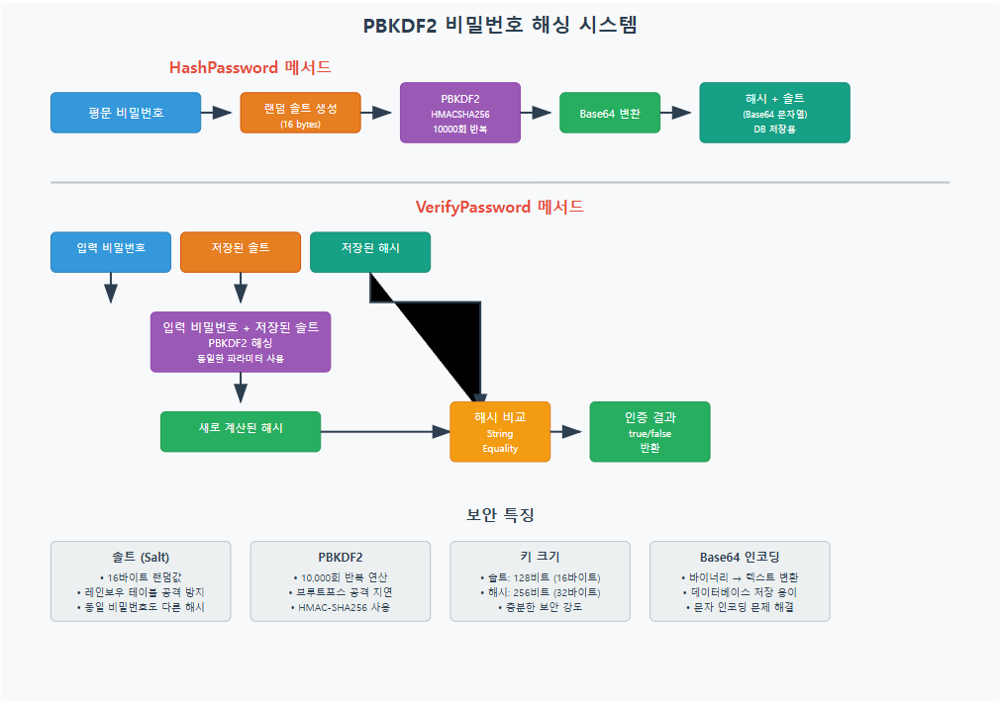
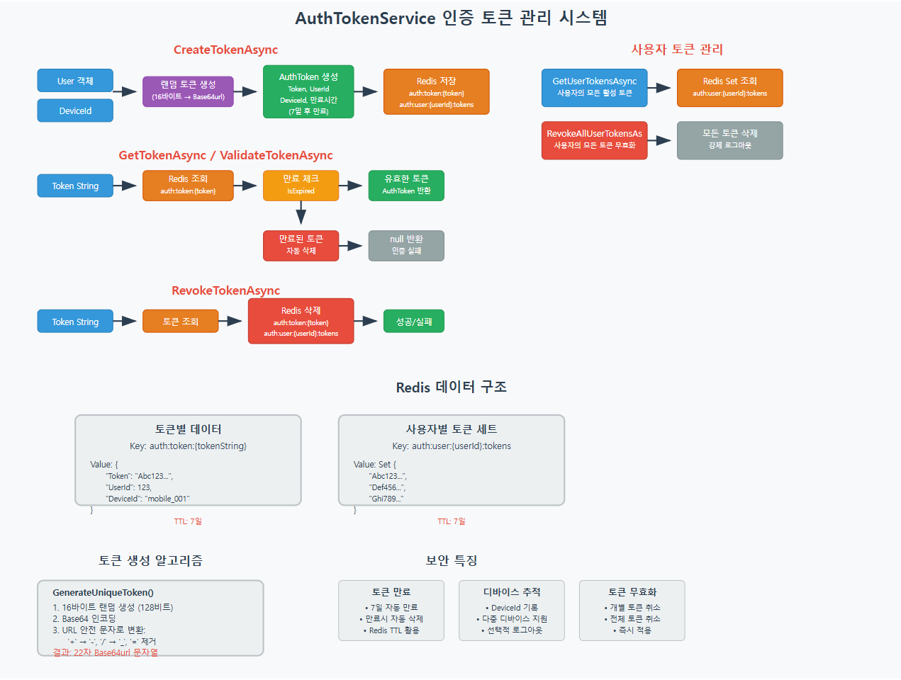
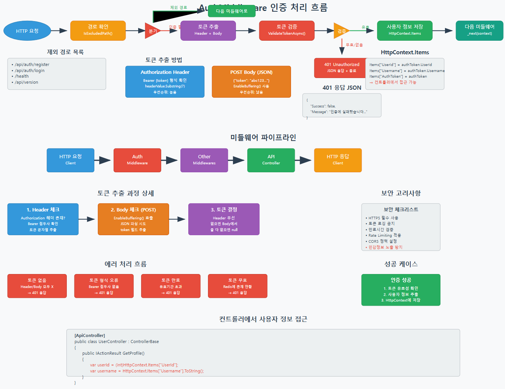

# ASP.NET Core Web API로 게임 서버 개발
  
저자: 최흥배, Claude AI   
-----------------------   
  
# Chapter 7. **사용자 인증 및 계정 관리 시스템**
  
## 7.1 개요
게임 서버에서 사용자 인증과 계정 관리는 가장 기본적이면서도 중요한 기능이다. 이 시스템은 사용자 식별, 권한 관리, 보안 등의 역할을 담당한다. 이 챕터에서는 MySQL에 사용자 정보를 저장하고, Redis를 활용하여 세션을 관리하는 방법을 구현할 것이다.  

```
┌─────────────────────┐       ┌─────────────────────┐      ┌─────────────────────┐
│                     │       │                     │      │                     │
│    클라이언트         │──────►│   ASP.NET Core      │◄────►│     Redis 캐시      │
│    모바일 앱         │       │   Web API Server    │      │                     │
└─────────────────────┘       │                     │      │  - 인증 토큰         │
                              └──────────┬──────────┘      │  - 세션 정보         │
                                         │                 └─────────────────────┘
                                         │
                                         ▼
                              ┌─────────────────────┐
                              │                     │
                              │     MySQL DB        │
                              │                     │
                              │  - 사용자 계정 정보   │
                              └─────────────────────┘
```

## 7.2 사용자 계정 모델 설계

### 7.2.1 사용자 테이블 설계
MySQL에 사용자 정보를 저장하기 위한 테이블을 설계한다.

```sql
CREATE TABLE users (
    id INT AUTO_INCREMENT PRIMARY KEY,
    username VARCHAR(50) NOT NULL UNIQUE,
    email VARCHAR(100) NOT NULL UNIQUE,
    password_hash VARCHAR(255) NOT NULL,
    salt VARCHAR(50) NOT NULL,
    created_at DATETIME NOT NULL,
    last_login_at DATETIME NULL,
    status ENUM('active', 'suspended', 'banned') NOT NULL DEFAULT 'active',
    INDEX idx_username (username),
    INDEX idx_email (email)
);
```

### 7.2.2 사용자 모델 클래스

```csharp
// Models/User.cs
public class User
{
    public int Id { get; set; }
    public string Username { get; set; }
    public string Email { get; set; }
    public string PasswordHash { get; set; }
    public string Salt { get; set; }
    public DateTime CreatedAt { get; set; }
    public DateTime? LastLoginAt { get; set; }
    public string Status { get; set; }
}

// 클라이언트에 전송할 안전한 사용자 모델 (패스워드 정보 제외)
public class UserSafeModel
{
    public int Id { get; set; }
    public string Username { get; set; }
    public string Email { get; set; }
    public DateTime CreatedAt { get; set; }
    public DateTime? LastLoginAt { get; set; }
    public string Status { get; set; }
    
    public static UserSafeModel FromUser(User user)
    {
        return new UserSafeModel
        {
            Id = user.Id,
            Username = user.Username,
            Email = user.Email,
            CreatedAt = user.CreatedAt,
            LastLoginAt = user.LastLoginAt,
            Status = user.Status
        };
    }
}
```

## 7.3 패스워드 해싱 구현
사용자 비밀번호는 평문으로 저장하면 안 되며, 항상 안전한 해시 함수를 사용하여 저장해야 한다. 여기서는 PBKDF2 알고리즘을 사용하여 비밀번호를 해싱한다.   
  
     

```csharp
// Services/PasswordHasher.cs
public interface IPasswordHasher
{
    (string passwordHash, string salt) HashPassword(string password);
    bool VerifyPassword(string password, string passwordHash, string salt);
}

public class PasswordHasher : IPasswordHasher
{
    private const int Iterations = 10000;
    private const int SaltSize = 16; // 128 bits
    private const int KeySize = 32; // 256 bits
    
    public (string passwordHash, string salt) HashPassword(string password)
    {
        // 랜덤 솔트 생성
        byte[] saltBytes = new byte[SaltSize];
        using (var rng = RandomNumberGenerator.Create())
        {
            rng.GetBytes(saltBytes);
        }
        
        // PBKDF2를 사용한 비밀번호 해싱
        byte[] hashBytes = KeyDerivation.Pbkdf2(
            password,
            saltBytes,
            KeyDerivationPrf.HMACSHA256,
            Iterations,
            KeySize);
        
        // 바이트 배열을 Base64 문자열로 변환
        string passwordHash = Convert.ToBase64String(hashBytes);
        string salt = Convert.ToBase64String(saltBytes);
        
        return (passwordHash, salt);
    }
    
    public bool VerifyPassword(string password, string passwordHash, string salt)
    {
        byte[] saltBytes = Convert.FromBase64String(salt);
        
        // 입력받은 비밀번호 해싱
        byte[] hashBytes = KeyDerivation.Pbkdf2(
            password,
            saltBytes,
            KeyDerivationPrf.HMACSHA256,
            Iterations,
            KeySize);
        
        string computedHash = Convert.ToBase64String(hashBytes);
        
        // 저장된 해시와 계산된 해시 비교
        return passwordHash == computedHash;
    }
}
```
   
이 코드는 PBKDF2를 사용한 비밀번호 해싱 시스템이다.   

**HashPassword 프로세스:**
1. 평문 비밀번호 입력
2. 16바이트 랜덤 솔트 생성
3. PBKDF2로 10,000회 반복 해싱 (HMAC-SHA256)
4. 결과를 Base64로 인코딩
5. 해시값과 솔트를 튜플로 반환

**VerifyPassword 프로세스:**
1. 입력 비밀번호, 저장된 솔트, 저장된 해시 입력
2. 입력 비밀번호와 저장된 솔트로 동일한 PBKDF2 과정 수행
3. 새로 계산된 해시와 저장된 해시를 문자열 비교
4. 일치 여부를 boolean으로 반환

**보안 특징:**
- **솔트**: 동일한 비밀번호라도 다른 해시값 생성, 레인보우 테이블 공격 방지
- **PBKDF2**: 반복 연산으로 브루트포스 공격 속도 대폭 감소
- **적절한 키 크기**: 128비트 솔트, 256비트 해시로 충분한 보안 강도
- **Base64 인코딩**: 바이너리 데이터를 안전하게 텍스트로 저장  
    
  
## 7.4 사용자 리포지토리 구현
사용자 데이터를 MySQL 데이터베이스에 저장하고 조회하는 리포지토리를 구현한다.

```csharp
// Repositories/UserRepository.cs
public interface IUserRepository
{
    Task<User> GetByIdAsync(int userId);
    Task<User> GetByUsernameAsync(string username);
    Task<User> GetByEmailAsync(string email);
    Task<int> CreateAsync(User user);
    Task<bool> UpdateAsync(User user);
    Task<bool> UpdateLastLoginAsync(int userId, DateTime loginTime);
}

public class UserRepository : IUserRepository
{
    private readonly QueryFactory _db;
    
    public UserRepository(QueryFactory db)
    {
        _db = db;
    }
    
    public async Task<User> GetByIdAsync(int userId)
    {
        return await _db.Query("users")
            .Where("id", userId)
            .FirstOrDefaultAsync<User>();
    }
    
    public async Task<User> GetByUsernameAsync(string username)
    {
        return await _db.Query("users")
            .Where("username", username)
            .FirstOrDefaultAsync<User>();
    }
    
    public async Task<User> GetByEmailAsync(string email)
    {
        return await _db.Query("users")
            .Where("email", email)
            .FirstOrDefaultAsync<User>();
    }
    
    public async Task<int> CreateAsync(User user)
    {
        return await _db.Query("users").InsertGetIdAsync<int>(new
        {
            username = user.Username,
            email = user.Email,
            password_hash = user.PasswordHash,
            salt = user.Salt,
            created_at = user.CreatedAt,
            last_login_at = user.LastLoginAt,
            status = user.Status
        });
    }
    
    public async Task<bool> UpdateAsync(User user)
    {
        var affected = await _db.Query("users")
            .Where("id", user.Id)
            .UpdateAsync(new
            {
                email = user.Email,
                password_hash = user.PasswordHash,
                salt = user.Salt,
                last_login_at = user.LastLoginAt,
                status = user.Status
            });
        
        return affected > 0;
    }
    
    public async Task<bool> UpdateLastLoginAsync(int userId, DateTime loginTime)
    {
        var affected = await _db.Query("users")
            .Where("id", userId)
            .UpdateAsync(new { last_login_at = loginTime });
        
        return affected > 0;
    }
}
```
  

## 7.5 인증 토큰 설계 및 Redis 저장
로그인 성공 후 생성할 인증 토큰 모델과 Redis에 저장하는 방법을 구현한다.

### 7.5.1 인증 토큰 모델

```csharp
// Models/Auth/AuthToken.cs
public class AuthToken
{
    public string Token { get; set; }
    public int UserId { get; set; }
    public string Username { get; set; }
    public string DeviceId { get; set; }
    public DateTime CreatedAt { get; set; }
    public DateTime ExpiresAt { get; set; }
    public bool IsExpired => DateTime.UtcNow > ExpiresAt;
}
```

### 7.5.2 인증 토큰 서비스
  
   
  
```csharp
// Services/AuthTokenService.cs
public interface IAuthTokenService
{
    Task<AuthToken> CreateTokenAsync(User user, string deviceId);
    Task<AuthToken> GetTokenAsync(string token);
    Task<bool> ValidateTokenAsync(string token);
    Task<bool> RevokeTokenAsync(string token);
    Task<IEnumerable<AuthToken>> GetUserTokensAsync(int userId);
    Task<bool> RevokeAllUserTokensAsync(int userId);
}

public class AuthTokenService : IAuthTokenService
{
    private readonly RedisConfig _redisConfig;
    private readonly ILogger<AuthTokenService> _logger;
    private readonly TimeSpan _tokenExpiry = TimeSpan.FromDays(7); // 토큰 기본 유효 기간: 7일
    
    public AuthTokenService(RedisConfig redisConfig, ILogger<AuthTokenService> logger)
    {
        _redisConfig = redisConfig;
        _logger = logger;
    }
    
    public async Task<AuthToken> CreateTokenAsync(User user, string deviceId)
    {
        // 고유한 토큰 생성
        string tokenString = GenerateUniqueToken();
        
        // 토큰 객체 생성
        var token = new AuthToken
        {
            Token = tokenString,
            UserId = user.Id,
            Username = user.Username,
            DeviceId = deviceId,
            CreatedAt = DateTime.UtcNow,
            ExpiresAt = DateTime.UtcNow.Add(_tokenExpiry)
        };
        
        // Redis에 토큰 저장
        var redis = new RedisString<AuthToken>(_redisConfig, $"auth:token:{tokenString}");
        bool saved = await redis.SetAsync(token, _tokenExpiry);
        
        if (!saved)
        {
            _logger.LogError("토큰 저장 실패. UserId: {UserId}", user.Id);
            return null;
        }
        
        // 사용자 ID와 토큰의 매핑 저장 (사용자별 토큰 관리용)
        var userTokens = new RedisSet<string>(_redisConfig, $"auth:user:{user.Id}:tokens");
        await userTokens.AddAsync(tokenString);
        await userTokens.ExpireAsync(_tokenExpiry);
        
        return token;
    }
    
    public async Task<AuthToken> GetTokenAsync(string token)
    {
        if (string.IsNullOrEmpty(token))
        {
            return null;
        }
        
        var redis = new RedisString<AuthToken>(_redisConfig, $"auth:token:{token}");
        var result = await redis.GetAsync();
        
        if (!result.HasValue)
        {
            return null;
        }
        
        var authToken = result.Value;
        
        // 만료된 토큰 체크
        if (authToken.IsExpired)
        {
            await RevokeTokenAsync(token);
            return null;
        }
        
        return authToken;
    }
    
    public async Task<bool> ValidateTokenAsync(string token)
    {
        var authToken = await GetTokenAsync(token);
        return authToken != null && !authToken.IsExpired;
    }
    
    public async Task<bool> RevokeTokenAsync(string token)
    {
        var authToken = await GetTokenAsync(token);
        
        if (authToken == null)
        {
            return false;
        }
        
        // 토큰 삭제
        var redis = new RedisString<AuthToken>(_redisConfig, $"auth:token:{token}");
        bool deleted = await redis.DeleteAsync();
        
        // 사용자-토큰 매핑에서도 제거
        var userTokens = new RedisSet<string>(_redisConfig, $"auth:user:{authToken.UserId}:tokens");
        await userTokens.RemoveAsync(token);
        
        return deleted;
    }
    
    public async Task<IEnumerable<AuthToken>> GetUserTokensAsync(int userId)
    {
        var userTokens = new RedisSet<string>(_redisConfig, $"auth:user:{userId}:tokens");
        var tokens = await userTokens.MembersAsync();
        
        if (tokens == null || !tokens.Any())
        {
            return Enumerable.Empty<AuthToken>();
        }
        
        var authTokens = new List<AuthToken>();
        
        foreach (var token in tokens)
        {
            var authToken = await GetTokenAsync(token);
            if (authToken != null && !authToken.IsExpired)
            {
                authTokens.Add(authToken);
            }
        }
        
        return authTokens;
    }
    
    public async Task<bool> RevokeAllUserTokensAsync(int userId)
    {
        var userTokens = new RedisSet<string>(_redisConfig, $"auth:user:{userId}:tokens");
        var tokens = await userTokens.MembersAsync();
        
        if (tokens == null || !tokens.Any())
        {
            return true;
        }
        
        bool allRevoked = true;
        
        foreach (var token in tokens)
        {
            bool revoked = await RevokeTokenAsync(token);
            allRevoked = allRevoked && revoked;
        }
        
        // 사용자-토큰 세트 자체도 삭제
        var redisKey = new RedisString<string>(_redisConfig, $"auth:user:{userId}:tokens");
        await redisKey.DeleteAsync();
        
        return allRevoked;
    }
    
    private string GenerateUniqueToken()
    {
        // 128비트(16바이트) 랜덤 값 생성
        byte[] randomBytes = new byte[16];
        using (var rng = RandomNumberGenerator.Create())
        {
            rng.GetBytes(randomBytes);
        }
        
        // Base64url 형식(URL 안전한 Base64)으로 인코딩
        string base64 = Convert.ToBase64String(randomBytes);
        string base64url = base64.Replace('+', '-').Replace('/', '_').Replace("=", "");
        
        return base64url;
    }
}
```

**주요 메서드 동작 흐름:**

1. **CreateTokenAsync**: 
   - 16바이트 랜덤값으로 Base64url 토큰 생성
   - AuthToken 객체 생성 (7일 만료)
   - Redis에 토큰과 사용자-토큰 매핑 저장

2. **GetTokenAsync/ValidateTokenAsync**:
   - Redis에서 토큰 조회
   - 만료 여부 체크
   - 만료된 토큰은 자동 삭제

3. **RevokeTokenAsync**:
   - 개별 토큰 무효화
   - Redis에서 토큰과 매핑 모두 삭제

4. **사용자 토큰 관리**:
   - GetUserTokensAsync: 사용자의 모든 활성 토큰 조회
   - RevokeAllUserTokensAsync: 모든 토큰 일괄 무효화

**Redis 데이터 구조:**
- `auth:token:{token}`: 개별 토큰 정보 저장
- `auth:user:{userId}:tokens`: 사용자별 토큰 목록 (Set)

**보안 특징:**
- **토큰 만료**: 7일 자동 만료, Redis TTL 활용
- **디바이스 추적**: DeviceId로 다중 디바이스 관리
- **토큰 무효화**: 개별/전체 토큰 즉시 취소 가능
- **암호학적 안전성**: 128비트 랜덤값, Base64url 인코딩

  
  
## 7.6 인증 서비스 구현
사용자 등록, 로그인, 로그아웃 등의 인증 관련 비즈니스 로직을 포함하는 서비스를 구현한다.

```csharp
// Services/AuthService.cs
public interface IAuthService
{
    Task<(bool Success, string Message, int? UserId)> RegisterAsync(string username, string email, string password);
    Task<(bool Success, string Message, AuthToken Token)> LoginAsync(string username, string password, string deviceId);
    Task<bool> LogoutAsync(string token);
    Task<bool> LogoutAllDevicesAsync(int userId);
    Task<bool> ChangePasswordAsync(int userId, string currentPassword, string newPassword);
}

public class AuthService : IAuthService
{
    private readonly IUserRepository _userRepository;
    private readonly IPasswordHasher _passwordHasher;
    private readonly IAuthTokenService _tokenService;
    private readonly ILogger<AuthService> _logger;
    
    public AuthService(
        IUserRepository userRepository,
        IPasswordHasher passwordHasher,
        IAuthTokenService tokenService,
        ILogger<AuthService> logger)
    {
        _userRepository = userRepository;
        _passwordHasher = passwordHasher;
        _tokenService = tokenService;
        _logger = logger;
    }
    
    public async Task<(bool Success, string Message, int? UserId)> RegisterAsync(string username, string email, string password)
    {
        // 사용자 이름 중복 확인
        var existingUserByUsername = await _userRepository.GetByUsernameAsync(username);
        if (existingUserByUsername != null)
        {
            return (false, "이미 사용 중인 사용자 이름입니다.", null);
        }
        
        // 이메일 중복 확인
        var existingUserByEmail = await _userRepository.GetByEmailAsync(email);
        if (existingUserByEmail != null)
        {
            return (false, "이미 사용 중인 이메일 주소입니다.", null);
        }
        
        // 비밀번호 유효성 검사
        if (string.IsNullOrEmpty(password) || password.Length < 8)
        {
            return (false, "비밀번호는 최소 8자 이상이어야 합니다.", null);
        }
        
        try
        {
            // 비밀번호 해싱
            var (passwordHash, salt) = _passwordHasher.HashPassword(password);
            
            // 새 사용자 생성
            var newUser = new User
            {
                Username = username,
                Email = email,
                PasswordHash = passwordHash,
                Salt = salt,
                CreatedAt = DateTime.UtcNow,
                Status = "active"
            };
            
            // 데이터베이스에 저장
            int userId = await _userRepository.CreateAsync(newUser);
            
            return (true, "회원가입이 완료되었습니다.", userId);
        }
        catch (Exception ex)
        {
            _logger.LogError(ex, "사용자 등록 중 오류 발생. Username: {Username}", username);
            return (false, "회원가입 처리 중 오류가 발생했습니다.", null);
        }
    }
    
    public async Task<(bool Success, string Message, AuthToken Token)> LoginAsync(string username, string password, string deviceId)
    {
        try
        {
            // 사용자 조회
            var user = await _userRepository.GetByUsernameAsync(username);
            
            if (user == null)
            {
                return (false, "사용자 이름 또는 비밀번호가 올바르지 않습니다.", null);
            }
            
            // 계정 상태 확인
            if (user.Status != "active")
            {
                return (false, $"계정이 {user.Status} 상태입니다. 관리자에게 문의하세요.", null);
            }
            
            // 비밀번호 검증
            bool isPasswordValid = _passwordHasher.VerifyPassword(password, user.PasswordHash, user.Salt);
            
            if (!isPasswordValid)
            {
                return (false, "사용자 이름 또는 비밀번호가 올바르지 않습니다.", null);
            }
            
            // 마지막 로그인 시간 업데이트
            await _userRepository.UpdateLastLoginAsync(user.Id, DateTime.UtcNow);
            
            // 인증 토큰 생성
            var token = await _tokenService.CreateTokenAsync(user, deviceId);
            
            if (token == null)
            {
                return (false, "인증 토큰 생성에 실패했습니다.", null);
            }
            
            return (true, "로그인에 성공했습니다.", token);
        }
        catch (Exception ex)
        {
            _logger.LogError(ex, "로그인 중 오류 발생. Username: {Username}", username);
            return (false, "로그인 처리 중 오류가 발생했습니다.", null);
        }
    }
    
    public async Task<bool> LogoutAsync(string token)
    {
        if (string.IsNullOrEmpty(token))
        {
            return false;
        }
        
        try
        {
            return await _tokenService.RevokeTokenAsync(token);
        }
        catch (Exception ex)
        {
            _logger.LogError(ex, "로그아웃 중 오류 발생. Token: {Token}", token);
            return false;
        }
    }
    
    public async Task<bool> LogoutAllDevicesAsync(int userId)
    {
        try
        {
            return await _tokenService.RevokeAllUserTokensAsync(userId);
        }
        catch (Exception ex)
        {
            _logger.LogError(ex, "모든 기기 로그아웃 중 오류 발생. UserId: {UserId}", userId);
            return false;
        }
    }
    
    public async Task<bool> ChangePasswordAsync(int userId, string currentPassword, string newPassword)
    {
        try
        {
            // 사용자 조회
            var user = await _userRepository.GetByIdAsync(userId);
            
            if (user == null)
            {
                return false;
            }
            
            // 현재 비밀번호 확인
            bool isCurrentPasswordValid = _passwordHasher.VerifyPassword(
                currentPassword, user.PasswordHash, user.Salt);
            
            if (!isCurrentPasswordValid)
            {
                return false;
            }
            
            // 새 비밀번호 해싱
            var (passwordHash, salt) = _passwordHasher.HashPassword(newPassword);
            
            // 사용자 정보 업데이트
            user.PasswordHash = passwordHash;
            user.Salt = salt;
            
            bool updated = await _userRepository.UpdateAsync(user);
            
            if (updated)
            {
                // 모든 기기에서 로그아웃 처리
                await _tokenService.RevokeAllUserTokensAsync(userId);
            }
            
            return updated;
        }
        catch (Exception ex)
        {
            _logger.LogError(ex, "비밀번호 변경 중 오류 발생. UserId: {UserId}", userId);
            return false;
        }
    }
}
```
  

## 7.7 인증 컨트롤러 구현
회원가입, 로그인, 로그아웃 등의 API를 제공하는 컨트롤러를 구현한다.

```csharp
// Controllers/AuthController.cs
[ApiController]
[Route("api/[controller]")]
public class AuthController : ControllerBase
{
    private readonly IAuthService _authService;
    
    public AuthController(IAuthService authService)
    {
        _authService = authService;
    }
    
    [HttpPost("register")]
    public async Task<RegisterResponse> Register([FromBody] RegisterRequest request)
    {
        if (string.IsNullOrEmpty(request.Username) || 
            string.IsNullOrEmpty(request.Email) || 
            string.IsNullOrEmpty(request.Password))
        {
            return new RegisterResponse
            {
                Success = false,
                Message = "사용자 이름, 이메일, 비밀번호는 필수 입력 항목입니다."
            };
        }
        
        var (success, message, userId) = await _authService.RegisterAsync(
            request.Username, request.Email, request.Password);
        
        return new RegisterResponse
        {
            Success = success,
            Message = message,
            UserId = userId
        };
    }
    
    [HttpPost("login")]
    public async Task<LoginResponse> Login([FromBody] LoginRequest request)
    {
        if (string.IsNullOrEmpty(request.Username) || 
            string.IsNullOrEmpty(request.Password) ||
            string.IsNullOrEmpty(request.DeviceId))
        {
            return new LoginResponse
            {
                Success = false,
                Message = "사용자 이름, 비밀번호, 기기 ID는 필수 입력 항목입니다."
            };
        }
        
        var (success, message, token) = await _authService.LoginAsync(
            request.Username, request.Password, request.DeviceId);
        
        return new LoginResponse
        {
            Success = success,
            Message = message,
            Token = token?.Token,
            UserId = token?.UserId,
            Username = token?.Username,
            ExpiresAt = token?.ExpiresAt
        };
    }
    
    [HttpPost("logout")]
    public async Task<LogoutResponse> Logout([FromBody] LogoutRequest request)
    {
        if (string.IsNullOrEmpty(request.Token))
        {
            return new LogoutResponse
            {
                Success = false,
                Message = "토큰이 필요합니다."
            };
        }
        
        bool success = await _authService.LogoutAsync(request.Token);
        
        return new LogoutResponse
        {
            Success = success,
            Message = success ? "로그아웃 되었습니다." : "로그아웃 처리 중 오류가 발생했습니다."
        };
    }
    
    [HttpPost("logout-all")]
    public async Task<LogoutResponse> LogoutAll([FromBody] LogoutAllRequest request)
    {
        bool success = await _authService.LogoutAllDevicesAsync(request.UserId);
        
        return new LogoutResponse
        {
            Success = success,
            Message = success ? "모든 기기에서 로그아웃 되었습니다." : "로그아웃 처리 중 오류가 발생했습니다."
        };
    }
    
    [HttpPost("change-password")]
    public async Task<ChangePasswordResponse> ChangePassword([FromBody] ChangePasswordRequest request)
    {
        if (string.IsNullOrEmpty(request.CurrentPassword) || 
            string.IsNullOrEmpty(request.NewPassword))
        {
            return new ChangePasswordResponse
            {
                Success = false,
                Message = "현재 비밀번호와 새 비밀번호는 필수 입력 항목입니다."
            };
        }
        
        bool success = await _authService.ChangePasswordAsync(
            request.UserId, request.CurrentPassword, request.NewPassword);
        
        return new ChangePasswordResponse
        {
            Success = success,
            Message = success ? "비밀번호가 변경되었습니다." : "비밀번호 변경에 실패했습니다."
        };
    }
}
```
  

## 7.8 요청/응답 모델 구현
API에서 사용할 요청 및 응답 모델을 정의한다.  

```csharp
// Models/Auth/AuthRequests.cs
public class RegisterRequest
{
    public string Username { get; set; }
    public string Email { get; set; }
    public string Password { get; set; }
}

public class LoginRequest
{
    public string Username { get; set; }
    public string Password { get; set; }
    public string DeviceId { get; set; }
}

public class LogoutRequest
{
    public string Token { get; set; }
}

public class LogoutAllRequest
{
    public int UserId { get; set; }
}

public class ChangePasswordRequest
{
    public int UserId { get; set; }
    public string CurrentPassword { get; set; }
    public string NewPassword { get; set; }
}

// Models/Auth/AuthResponses.cs
public class RegisterResponse
{
    public bool Success { get; set; }
    public string Message { get; set; }
    public int? UserId { get; set; }
}

public class LoginResponse
{
    public bool Success { get; set; }
    public string Message { get; set; }
    public string Token { get; set; }
    public int? UserId { get; set; }
    public string Username { get; set; }
    public DateTime? ExpiresAt { get; set; }
}

public class LogoutResponse
{
    public bool Success { get; set; }
    public string Message { get; set; }
}

public class ChangePasswordResponse
{
    public bool Success { get; set; }
    public string Message { get; set; }
}
```
  

## 7.9 인증 미들웨어 구현
API 요청마다 인증 토큰을 검증하여 인증된 사용자만 접근할 수 있도록 미들웨어를 구현한다.   
  
     

```csharp
// Middlewares/AuthMiddleware.cs
public class AuthMiddleware
{
    private readonly RequestDelegate _next;
    
    public AuthMiddleware(RequestDelegate next)
    {
        _next = next;
    }
    
    public async Task InvokeAsync(HttpContext context, IAuthTokenService tokenService)
    {
        // 인증이 필요하지 않은 경로 확인
        if (IsExcludedPath(context.Request.Path))
        {
            await _next(context);
            return;
        }
        
        // 요청 헤더에서 토큰 추출
        string token = null;
        
        if (context.Request.Headers.TryGetValue("Authorization", out var authHeader))
        {
            var headerValue = authHeader.FirstOrDefault();
            if (!string.IsNullOrEmpty(headerValue) && headerValue.StartsWith("Bearer ", StringComparison.OrdinalIgnoreCase))
            {
                token = headerValue.Substring(7).Trim();
            }
        }
        
        // 요청 바디에서 토큰 추출 (항상 POST 방식이므로)
        if (string.IsNullOrEmpty(token) && context.Request.Method == "POST")
        {
            // 요청 바디를 읽기 위해 위치를 저장하고 나중에 복원
            context.Request.EnableBuffering();
            
            using (var reader = new StreamReader(
                context.Request.Body,
                encoding: Encoding.UTF8,
                detectEncodingFromByteOrderMarks: false,
                leaveOpen: true))
            {
                var requestBody = await reader.ReadToEndAsync();
                
                // JSON에서 토큰 필드 추출 시도
                try
                {
                    var jsonDoc = JsonDocument.Parse(requestBody);
                    if (jsonDoc.RootElement.TryGetProperty("token", out var tokenElement) && 
                        tokenElement.ValueKind == JsonValueKind.String)
                    {
                        token = tokenElement.GetString();
                    }
                }
                catch (JsonException)
                {
                    // JSON 파싱 오류 무시
                }
                
                // 요청 바디 위치 복원
                context.Request.Body.Position = 0;
            }
        }
        
        // 토큰이 없거나 유효하지 않은 경우
        if (string.IsNullOrEmpty(token) || !await tokenService.ValidateTokenAsync(token))
        {
            context.Response.StatusCode = StatusCodes.Status401Unauthorized;
            context.Response.ContentType = "application/json";
            
            var response = new
            {
                Success = false,
                Message = "인증에 실패했습니다. 유효한 인증 토큰이 필요합니다."
            };
            
            await context.Response.WriteAsJsonAsync(response);
            return;
        }
        
        // 토큰에서 사용자 정보 추출하여 HttpContext에 저장
        var authToken = await tokenService.GetTokenAsync(token);
        context.Items["UserId"] = authToken.UserId;
        context.Items["Username"] = authToken.Username;
        context.Items["AuthToken"] = authToken;
        
        await _next(context);
    }
    
    private bool IsExcludedPath(PathString path)
    {
        // 인증이 필요하지 않은 경로 목록
        var excludedPaths = new[]
        {
            "/api/auth/register",
            "/api/auth/login",
            "/health",
            "/api/version"
        };
        
        return excludedPaths.Any(p => path.StartsWithSegments(p, StringComparison.OrdinalIgnoreCase));
    }
}

// Program.cs에 미들웨어 등록
app.UseMiddleware<AuthMiddleware>();
```
  

## 7.10 서비스 등록
위에서 구현한 서비스들을 DI 컨테이너에 등록한다.

```csharp
// Program.cs
// 사용자 인증 관련 서비스 등록
builder.Services.AddSingleton<IPasswordHasher, PasswordHasher>();
builder.Services.AddSingleton<IAuthTokenService, AuthTokenService>();
builder.Services.AddScoped<IUserRepository, UserRepository>();
builder.Services.AddScoped<IAuthService, AuthService>();
```

## 7.11 HTTP 테스트 파일 작성
구현한 인증 API를 테스트하기 위한 HTTP 파일을 작성한다.

```
### 회원가입
POST https://localhost:5001/api/auth/register
Content-Type: application/json

{
  "username": "testuser",
  "email": "test@example.com",
  "password": "password123"
}

### 로그인
POST https://localhost:5001/api/auth/login
Content-Type: application/json

{
  "username": "testuser",
  "password": "password123",
  "deviceId": "device_12345"
}

### 로그아웃
POST https://localhost:5001/api/auth/logout
Content-Type: application/json
Authorization: Bearer {{auth_token}}

{
  "token": "{{auth_token}}"
}

### 모든 기기에서 로그아웃
POST https://localhost:5001/api/auth/logout-all
Content-Type: application/json
Authorization: Bearer {{auth_token}}

{
  "userId": 1
}

### 비밀번호 변경
POST https://localhost:5001/api/auth/change-password
Content-Type: application/json
Authorization: Bearer {{auth_token}}

{
  "userId": 1,
  "currentPassword": "password123",
  "newPassword": "newpassword456"
}

### 인증이 필요한 API 요청 예시
POST https://localhost:5001/api/player/profile
Content-Type: application/json
Authorization: Bearer {{auth_token}}

{
  "playerId": 1
}
```
  

## 7.12 인증 확장 기능 구현
게임 서비스에서 유용한 추가 인증 기능을 구현한다.

### 7.12.1 게스트 계정 전환
게스트로 시작한 사용자가 정식 계정으로 전환할 수 있는 기능을 구현한다.

```csharp
// Services/AuthService.cs에 메서드 추가
public async Task<(bool Success, string Message, AuthToken Token)> ConvertGuestToRegularAccountAsync(
    int guestUserId, string username, string email, string password, string deviceId)
{
    // 게스트 사용자 조회
    var guestUser = await _userRepository.GetByIdAsync(guestUserId);
    
    if (guestUser == null)
    {
        return (false, "게스트 계정을 찾을 수 없습니다.", null);
    }
    
    // 게스트 계정인지 확인
    if (!guestUser.Username.StartsWith("guest_"))
    {
        return (false, "이미 정식 계정입니다.", null);
    }
    
    // 사용자 이름 중복 확인
    var existingUserByUsername = await _userRepository.GetByUsernameAsync(username);
    if (existingUserByUsername != null)
    {
        return (false, "이미 사용 중인 사용자 이름입니다.", null);
    }
    
    // 이메일 중복 확인
    var existingUserByEmail = await _userRepository.GetByEmailAsync(email);
    if (existingUserByEmail != null)
    {
        return (false, "이미 사용 중인 이메일 주소입니다.", null);
    }
    
    try
    {
        // 비밀번호 해싱
        var (passwordHash, salt) = _passwordHasher.HashPassword(password);
        
        // 게스트 계정 정보 업데이트
        guestUser.Username = username;
        guestUser.Email = email;
        guestUser.PasswordHash = passwordHash;
        guestUser.Salt = salt;
        
        bool updated = await _userRepository.UpdateAsync(guestUser);
        
        if (!updated)
        {
            return (false, "계정 전환 중 오류가 발생했습니다.", null);
        }
        
        // 기존 토큰 모두 삭제
        await _tokenService.RevokeAllUserTokensAsync(guestUserId);
        
        // 새 토큰 생성
        var token = await _tokenService.CreateTokenAsync(guestUser, deviceId);
        
        if (token == null)
        {
            return (false, "인증 토큰 생성에 실패했습니다.", null);
        }
        
        return (true, "정식 계정으로 전환되었습니다.", token);
    }
    catch (Exception ex)
    {
        _logger.LogError(ex, "게스트 계정 전환 중 오류 발생. GuestUserId: {GuestUserId}", guestUserId);
        return (false, "계정 전환 처리 중 오류가 발생했습니다.", null);
    }
}

// Controllers/AuthController.cs에 API 추가
[HttpPost("convert-guest")]
public async Task<ConvertGuestResponse> ConvertGuestToRegularAccount([FromBody] ConvertGuestRequest request)
{
    if (string.IsNullOrEmpty(request.Username) || 
        string.IsNullOrEmpty(request.Email) || 
        string.IsNullOrEmpty(request.Password) ||
        string.IsNullOrEmpty(request.DeviceId))
    {
        return new ConvertGuestResponse
        {
            Success = false,
            Message = "사용자 이름, 이메일, 비밀번호, 기기 ID는 필수 입력 항목입니다."
        };
    }
    
    var (success, message, token) = await _authService.ConvertGuestToRegularAccountAsync(
        request.GuestUserId, request.Username, request.Email, request.Password, request.DeviceId);
    
    return new ConvertGuestResponse
    {
        Success = success,
        Message = message,
        Token = token?.Token,
        UserId = token?.UserId,
        Username = token?.Username,
        ExpiresAt = token?.ExpiresAt
    };
}

// Models/Auth/AuthRequests.cs에 요청 모델 추가
public class ConvertGuestRequest
{
    public int GuestUserId { get; set; }
    public string Username { get; set; }
    public string Email { get; set; }
    public string Password { get; set; }
    public string DeviceId { get; set; }
}

// Models/Auth/AuthResponses.cs에 응답 모델 추가
public class ConvertGuestResponse
{
    public bool Success { get; set; }
    public string Message { get; set; }
    public string Token { get; set; }
    public int? UserId { get; set; }
    public string Username { get; set; }
    public DateTime? ExpiresAt { get; set; }
}
```

### 7.12.2 소셜 로그인 연동
소셜 로그인(구글, 페이스북, 애플 등)을 연동하는 인터페이스를 구현한다.  

```csharp
// Models/Auth/SocialLogin.cs
public class SocialLoginRequest
{
    public string Provider { get; set; } // "google", "facebook", "apple" 등
    public string Token { get; set; } // 소셜 로그인에서 받은 토큰
    public string DeviceId { get; set; }
}

public class SocialLoginResponse
{
    public bool Success { get; set; }
    public string Message { get; set; }
    public string Token { get; set; }
    public int? UserId { get; set; }
    public string Username { get; set; }
    public DateTime? ExpiresAt { get; set; }
    public bool IsNewUser { get; set; }
}

// Services/Social/ISocialLoginProvider.cs
public interface ISocialLoginProvider
{
    string ProviderName { get; }
    Task<(bool Success, string UserId, string Email, string Username)> ValidateTokenAsync(string token);
}

// 실제 소셜 로그인 검증 로직은 각 서비스별로 구현하게 됨
// Services/Social/GoogleLoginProvider.cs (예시)
public class GoogleLoginProvider : ISocialLoginProvider
{
    private readonly HttpClient _httpClient;
    private readonly ILogger<GoogleLoginProvider> _logger;
    
    public string ProviderName => "google";
    
    public GoogleLoginProvider(HttpClient httpClient, ILogger<GoogleLoginProvider> logger)
    {
        _httpClient = httpClient;
        _logger = logger;
    }
    
    public async Task<(bool Success, string UserId, string Email, string Username)> ValidateTokenAsync(string token)
    {
        try
        {
            // Google 토큰 검증 엔드포인트
            var response = await _httpClient.GetAsync($"https://oauth2.googleapis.com/tokeninfo?id_token={token}");
            
            if (!response.IsSuccessStatusCode)
            {
                return (false, null, null, null);
            }
            
            var content = await response.Content.ReadAsStringAsync();
            var tokenInfo = JsonDocument.Parse(content);
            
            // 필요한 정보 추출
            var userId = tokenInfo.RootElement.GetProperty("sub").GetString();
            var email = tokenInfo.RootElement.GetProperty("email").GetString();
            var name = tokenInfo.RootElement.GetProperty("name").GetString();
            
            return (true, userId, email, name);
        }
        catch (Exception ex)
        {
            _logger.LogError(ex, "Google 토큰 검증 중 오류 발생");
            return (false, null, null, null);
        }
    }
}

// Services/SocialLoginService.cs
public interface ISocialLoginService
{
    Task<(bool Success, string Message, AuthToken Token, bool IsNewUser)> LoginWithSocialProviderAsync(
        string provider, string token, string deviceId);
}

public class SocialLoginService : ISocialLoginService
{
    private readonly IEnumerable<ISocialLoginProvider> _socialProviders;
    private readonly IUserRepository _userRepository;
    private readonly IAuthTokenService _tokenService;
    private readonly ILogger<SocialLoginService> _logger;
    
    public SocialLoginService(
        IEnumerable<ISocialLoginProvider> socialProviders,
        IUserRepository userRepository,
        IAuthTokenService tokenService,
        ILogger<SocialLoginService> logger)
    {
        _socialProviders = socialProviders;
        _userRepository = userRepository;
        _tokenService = tokenService;
        _logger = logger;
    }
    
    public async Task<(bool Success, string Message, AuthToken Token, bool IsNewUser)> LoginWithSocialProviderAsync(
        string provider, string token, string deviceId)
    {
        try
        {
            // 요청된 소셜 로그인 제공자 찾기
            var socialProvider = _socialProviders.FirstOrDefault(p => 
                p.ProviderName.Equals(provider, StringComparison.OrdinalIgnoreCase));
            
            if (socialProvider == null)
            {
                return (false, $"지원하지 않는 소셜 로그인 제공자: {provider}", null, false);
            }
            
            // 토큰 검증
            var (success, socialUserId, email, username) = await socialProvider.ValidateTokenAsync(token);
            
            if (!success || string.IsNullOrEmpty(socialUserId))
            {
                return (false, "소셜 로그인 토큰이 유효하지 않습니다.", null, false);
            }
            
            // 소셜 ID로 사용자 검색
            string socialUserKey = $"{provider}_{socialUserId}";
            var user = await _userRepository.GetByUsernameAsync(socialUserKey);
            
            bool isNewUser = false;
            
            // 새 사용자인 경우 등록
            if (user == null)
            {
                isNewUser = true;
                
                // 무작위 비밀번호 생성
                string randomPassword = Guid.NewGuid().ToString();
                var passwordHasher = new PasswordHasher();
                var (passwordHash, salt) = passwordHasher.HashPassword(randomPassword);
                
                // 새 사용자 생성
                user = new User
                {
                    Username = socialUserKey,
                    Email = email ?? $"{socialUserKey}@example.com",
                    PasswordHash = passwordHash,
                    Salt = salt,
                    CreatedAt = DateTime.UtcNow,
                    Status = "active"
                };
                
                int userId = await _userRepository.CreateAsync(user);
                user.Id = userId;
            }
            
            // 마지막 로그인 시간 업데이트
            await _userRepository.UpdateLastLoginAsync(user.Id, DateTime.UtcNow);
            
            // 인증 토큰 생성
            var authToken = await _tokenService.CreateTokenAsync(user, deviceId);
            
            if (authToken == null)
            {
                return (false, "인증 토큰 생성에 실패했습니다.", null, isNewUser);
            }
            
            return (true, "소셜 로그인에 성공했습니다.", authToken, isNewUser);
        }
        catch (Exception ex)
        {
            _logger.LogError(ex, "소셜 로그인 중 오류 발생. Provider: {Provider}", provider);
            return (false, "소셜 로그인 처리 중 오류가 발생했습니다.", null, false);
        }
    }
}

// Controllers/AuthController.cs에 API 추가
[HttpPost("social-login")]
public async Task<SocialLoginResponse> SocialLogin([FromBody] SocialLoginRequest request)
{
    if (string.IsNullOrEmpty(request.Provider) || 
        string.IsNullOrEmpty(request.Token) ||
        string.IsNullOrEmpty(request.DeviceId))
    {
        return new SocialLoginResponse
        {
            Success = false,
            Message = "제공자, 토큰, 기기 ID는 필수 입력 항목입니다."
        };
    }
    
    var (success, message, token, isNewUser) = await _socialLoginService.LoginWithSocialProviderAsync(
        request.Provider, request.Token, request.DeviceId);
    
    return new SocialLoginResponse
    {
        Success = success,
        Message = message,
        Token = token?.Token,
        UserId = token?.UserId,
        Username = token?.Username,
        ExpiresAt = token?.ExpiresAt,
        IsNewUser = isNewUser
    };
}
```
  

## 7.13 HTTP 요청 테스트 (확장 기능)
추가로 구현한 인증 확장 기능을 테스트하기 위한 HTTP 파일을 작성한다.  

```
### 게스트 계정을 정식 계정으로 전환
POST https://localhost:5001/api/auth/convert-guest
Content-Type: application/json
Authorization: Bearer {{auth_token}}

{
  "guestUserId": 1,
  "username": "regular_user",
  "email": "regular@example.com",
  "password": "regular_password",
  "deviceId": "device_12345"
}

### 소셜 로그인 (구글)
POST https://localhost:5001/api/auth/social-login
Content-Type: application/json

{
  "provider": "google",
  "token": "google_oauth_token_here",
  "deviceId": "device_12345"
}

### 소셜 로그인 (페이스북)
POST https://localhost:5001/api/auth/social-login
Content-Type: application/json

{
  "provider": "facebook",
  "token": "facebook_oauth_token_here",
  "deviceId": "device_12345"
}
```
  

## 7.14 정리
이 챕터에서는 ASP.NET Core Web API를 사용하여 게임 서버의 사용자 인증 및 계정 관리 시스템을 구현했다. MySQL을 사용하여 사용자 정보를 저장하고, Redis를 활용하여 인증 토큰을 관리하는 방법을 배웠다.

구현한 주요 기능은 다음과 같다:

1. 사용자 등록 및 로그인 API
2. 안전한 비밀번호 해싱
3. Redis를 활용한 토큰 기반 인증
4. 세션 관리 (로그아웃, 모든 기기에서 로그아웃)
5. API 요청 인증을 위한 미들웨어
6. 게스트 계정 전환 및 소셜 로그인과 같은 확장 기능

이 시스템은 안전하고 확장 가능한 방식으로 사용자 인증과 계정 관리를 처리할 수 있으며, 게임 서버에서 필요한 다양한 인증 요구사항을 충족할 수 있다.

다음 챕터에서는 게임 데이터 모델 및, 캐릭터, 아이템, 인벤토리 등의 게임 핵심 시스템을 구현하는 방법에 대해 알아볼 것이다.  
  

