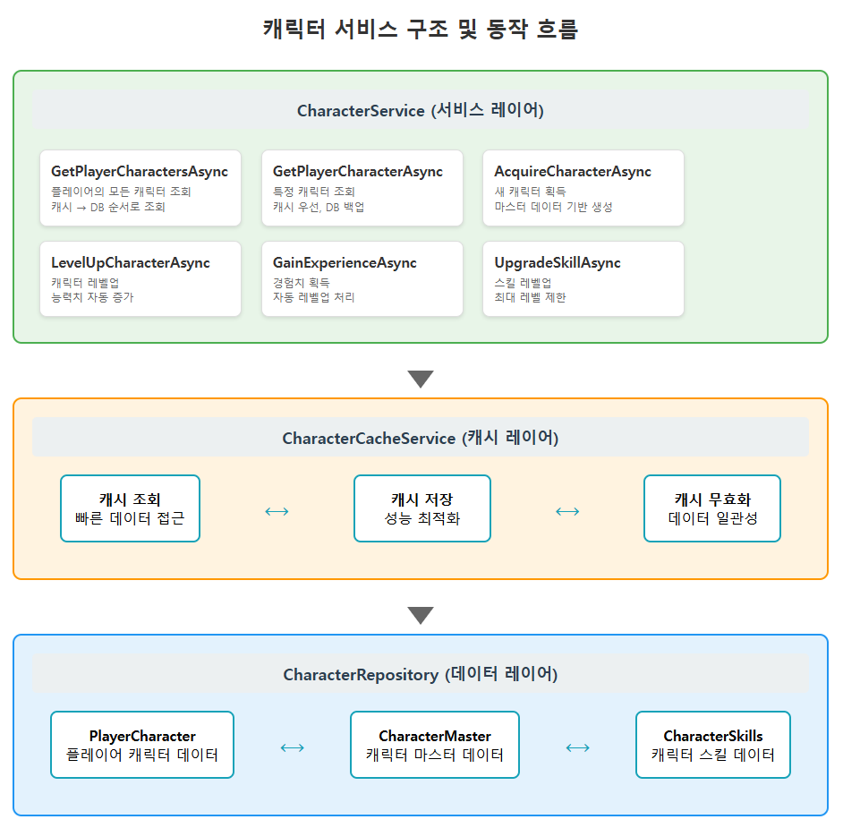
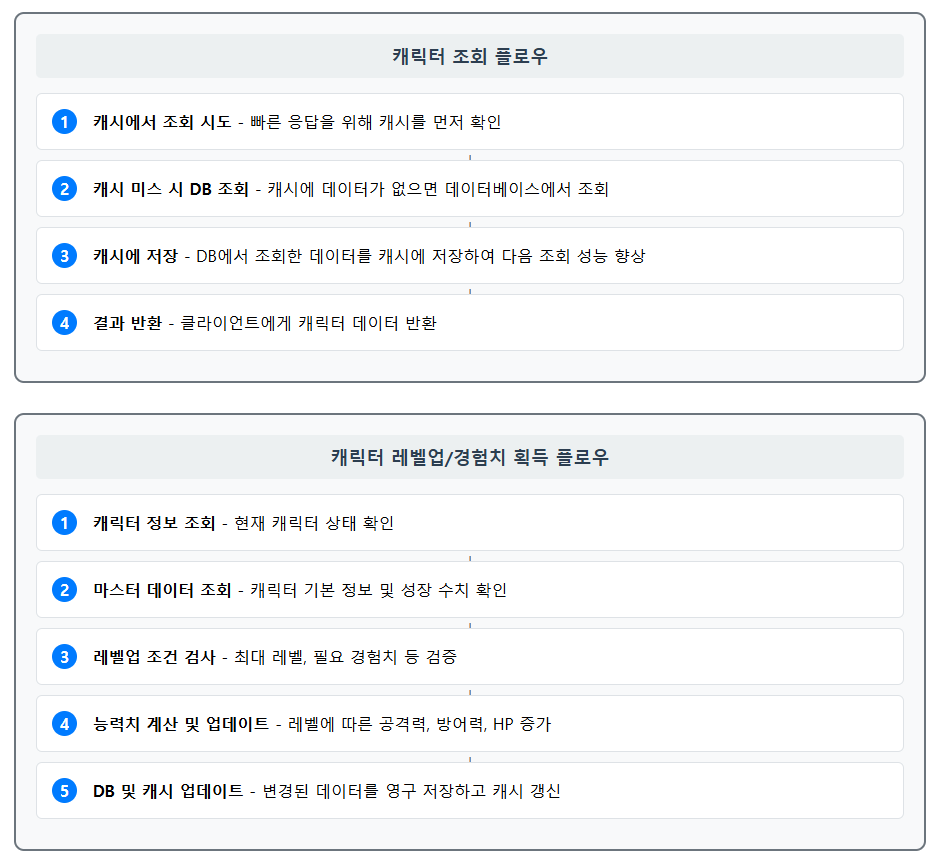

# ASP.NET Core Web API로 게임 서버 개발
  
저자: 최흥배, Claude AI   
-----------------------    
   
# 3부: 핵심 게임 시스템 구현
    
# Chapter 9. 캐릭터 시스템 구현
 
## 9.1 캐릭터 시스템 개요
수집형 RPG 게임에서 캐릭터 시스템은 핵심 기능이다. 플레이어는 다양한 캐릭터를 수집하고 성장시키며 게임을 진행한다. 이번 장에서는 ASP.NET Core Web API를 사용하여 캐릭터 시스템을 구현하는 방법을 다룬다.

수집형 RPG의 캐릭터 시스템은 다음 요소들로 구성된다:  
- **캐릭터 기본 정보**: 식별자, 이름, 레벨, 경험치 등
- **캐릭터 속성**: 공격력, 방어력, 체력, 마력 등
- **캐릭터 등급/희귀도**: 일반, 고급, 희귀, 전설 등
- **캐릭터 스킬**: 캐릭터가 보유한 기술 정보
- **성장 시스템**: 레벨업, 진화, 장비 장착 등
  

## 9.2 캐릭터 데이터베이스 설계
  
### MySQL 테이블 설계

```sql
-- 캐릭터 마스터 데이터 테이블
CREATE TABLE character_masters (
    id INT AUTO_INCREMENT PRIMARY KEY,
    code VARCHAR(50) NOT NULL UNIQUE,
    name VARCHAR(100) NOT NULL,
    rarity TINYINT NOT NULL COMMENT '희귀도: 1-일반, 2-고급, 3-희귀, 4-전설',
    element TINYINT NOT NULL COMMENT '속성: 1-불, 2-물, 3-바람, 4-땅, 5-빛, 6-어둠',
    base_attack INT NOT NULL,
    base_defense INT NOT NULL,
    base_hp INT NOT NULL,
    growth_attack FLOAT NOT NULL,
    growth_defense FLOAT NOT NULL,
    growth_hp FLOAT NOT NULL,
    max_level INT NOT NULL DEFAULT 30,
    created_at TIMESTAMP DEFAULT CURRENT_TIMESTAMP,
    updated_at TIMESTAMP DEFAULT CURRENT_TIMESTAMP ON UPDATE CURRENT_TIMESTAMP
);

-- 플레이어가 소유한 캐릭터 테이블
CREATE TABLE player_characters (
    id BIGINT AUTO_INCREMENT PRIMARY KEY,
    player_id BIGINT NOT NULL,
    character_id INT NOT NULL,
    level INT NOT NULL DEFAULT 1,
    experience INT NOT NULL DEFAULT 0,
    attack INT NOT NULL,
    defense INT NOT NULL,
    hp INT NOT NULL,
    skill_levels JSON NOT NULL COMMENT '스킬 레벨 정보 JSON 형태로 저장',
    equipment_slots JSON NULL COMMENT '장착 장비 정보',
    created_at TIMESTAMP DEFAULT CURRENT_TIMESTAMP,
    updated_at TIMESTAMP DEFAULT CURRENT_TIMESTAMP ON UPDATE CURRENT_TIMESTAMP,
    INDEX idx_player_id (player_id),
);

-- 캐릭터 스킬 마스터 테이블
CREATE TABLE character_skill_masters (
    id INT AUTO_INCREMENT PRIMARY KEY,
    character_id INT NOT NULL,
    skill_code VARCHAR(50) NOT NULL,
    skill_name VARCHAR(100) NOT NULL,
    skill_type TINYINT NOT NULL COMMENT '1-기본, 2-특수, 3-궁극기',
    cooldown INT NOT NULL,
    damage_multiplier FLOAT NOT NULL,
    description TEXT NOT NULL,
    created_at TIMESTAMP DEFAULT CURRENT_TIMESTAMP,
);
```

### 엔티티 클래스 설계
C# 프로젝트에서 MySQL 테이블에 매핑되는 엔티티 클래스를 만들자:  

```csharp
// Models/Characters/CharacterMaster.cs
public class CharacterMaster
{
    public int Id { get; set; }
    public string Code { get; set; }
    public string Name { get; set; }
    public byte Rarity { get; set; }
    public byte Element { get; set; }
    public int BaseAttack { get; set; }
    public int BaseDefense { get; set; }
    public int BaseHp { get; set; }
    public float GrowthAttack { get; set; }
    public float GrowthDefense { get; set; }
    public float GrowthHp { get; set; }
    public int MaxLevel { get; set; }
    public DateTime CreatedAt { get; set; }
    public DateTime UpdatedAt { get; set; }
}

// Models/Characters/PlayerCharacter.cs
public class PlayerCharacter
{
    public long Id { get; set; }
    public long PlayerId { get; set; }
    public int CharacterId { get; set; }
    public int Level { get; set; }
    public int Experience { get; set; }
    public int Attack { get; set; }
    public int Defense { get; set; }
    public int Hp { get; set; }
    public string SkillLevels { get; set; } // JSON 형태로 저장
    public string EquipmentSlots { get; set; } // JSON 형태로 저장
    public DateTime CreatedAt { get; set; }
    public DateTime UpdatedAt { get; set; }
    
    // 편의를 위한 확장 속성
    public Dictionary<string, int> SkillLevelsDict 
    {
        get => string.IsNullOrEmpty(SkillLevels) 
            ? new Dictionary<string, int>() 
            : System.Text.Json.JsonSerializer.Deserialize<Dictionary<string, int>>(SkillLevels);
        set => SkillLevels = System.Text.Json.JsonSerializer.Serialize(value);
    }
    
    public Dictionary<string, long> EquipmentSlotsDict
    {
        get => string.IsNullOrEmpty(EquipmentSlots) 
            ? new Dictionary<string, long>() 
            : System.Text.Json.JsonSerializer.Deserialize<Dictionary<string, long>>(EquipmentSlots);
        set => EquipmentSlots = System.Text.Json.JsonSerializer.Serialize(value);
    }
}

// Models/Characters/CharacterSkillMaster.cs
public class CharacterSkillMaster
{
    public int Id { get; set; }
    public int CharacterId { get; set; }
    public string SkillCode { get; set; }
    public string SkillName { get; set; }
    public byte SkillType { get; set; }
    public int Cooldown { get; set; }
    public float DamageMultiplier { get; set; }
    public string Description { get; set; }
    public DateTime CreatedAt { get; set; }
}
```
  

## 9.3 캐릭터 생성 및 관리 API

### 9.3.1 캐릭터 데이터 액세스 레이어
먼저 MySqlConnector와 SqlKata를 사용하여 데이터 액세스 레이어를 구현한다:

```csharp
// Services/Characters/CharacterRepository.cs
using MySqlConnector;
using SqlKata.Execution;
using SqlKata.Compilers;
using System.Threading.Tasks;
using System.Collections.Generic;

public class CharacterRepository
{
    private readonly QueryFactory _queryFactory;
    
    public CharacterRepository(string connectionString)
    {
        var connection = new MySqlConnection(connectionString);
        var compiler = new MySqlCompiler();
        _queryFactory = new QueryFactory(connection, compiler);
    }
    
    // 캐릭터 마스터 데이터 조회
    public async Task<CharacterMaster> GetCharacterMasterByIdAsync(int id)
    {
        return await _queryFactory.Query("character_masters")
            .Where("id", id)
            .FirstOrDefaultAsync<CharacterMaster>();
    }
    
    // 플레이어의 모든 캐릭터 조회
    public async Task<List<PlayerCharacter>> GetPlayerCharactersAsync(long playerId)
    {
        return await _queryFactory.Query("player_characters")
            .Where("player_id", playerId)
            .GetAsync<PlayerCharacter>()
            .ToListAsync();
    }
    
    // 특정 플레이어 캐릭터 조회
    public async Task<PlayerCharacter> GetPlayerCharacterAsync(long playerId, long characterId)
    {
        return await _queryFactory.Query("player_characters")
            .Where("player_id", playerId)
            .Where("id", characterId)
            .FirstOrDefaultAsync<PlayerCharacter>();
    }
    
    // 새 캐릭터 생성
    public async Task<long> CreatePlayerCharacterAsync(PlayerCharacter character)
    {
        return await _queryFactory.Query("player_characters").InsertGetIdAsync<long>(new {
            player_id = character.PlayerId,
            character_id = character.CharacterId,
            level = character.Level,
            experience = character.Experience,
            attack = character.Attack,
            defense = character.Defense,
            hp = character.Hp,
            skill_levels = character.SkillLevels,
            equipment_slots = character.EquipmentSlots,
            created_at = DateTime.UtcNow,
            updated_at = DateTime.UtcNow
        });
    }
    
    // 캐릭터 정보 업데이트
    public async Task<bool> UpdatePlayerCharacterAsync(PlayerCharacter character)
    {
        int affectedRows = await _queryFactory.Query("player_characters")
            .Where("id", character.Id)
            .Where("player_id", character.PlayerId)
            .UpdateAsync(new {
                level = character.Level,
                experience = character.Experience,
                attack = character.Attack,
                defense = character.Defense,
                hp = character.Hp,
                skill_levels = character.SkillLevels,
                equipment_slots = character.EquipmentSlots,
                updated_at = DateTime.UtcNow
            });
            
        return affectedRows > 0;
    }
    
    // 캐릭터 삭제
    public async Task<bool> DeletePlayerCharacterAsync(long playerId, long characterId)
    {
        int affectedRows = await _queryFactory.Query("player_characters")
            .Where("id", characterId)
            .Where("player_id", playerId)
            .DeleteAsync();
            
        return affectedRows > 0;
    }
    
    // 캐릭터 스킬 정보 조회
    public async Task<List<CharacterSkillMaster>> GetCharacterSkillsAsync(int characterMasterId)
    {
        return await _queryFactory.Query("character_skill_masters")
            .Where("character_id", characterMasterId)
            .GetAsync<CharacterSkillMaster>()
            .ToListAsync();
    }
}
```

### 9.3.2 캐릭터 서비스 구현
비즈니스 로직을 처리할 서비스 레이어를 구현한다:    
   
    
  
**주요 구성 요소:**
1. **서비스 레이어 (CharacterService)**: 비즈니스 로직을 처리하는 6개의 주요 메서드
   - 캐릭터 조회, 획득, 레벨업, 경험치 획득, 스킬 업그레이드 기능

2. **캐시 레이어 (CharacterCacheService)**: 성능 최적화를 위한 캐시 처리
   - 조회, 저장, 무효화 기능으로 빠른 데이터 접근 제공

3. **데이터 레이어 (CharacterRepository)**: 실제 데이터베이스와의 상호작용
   - PlayerCharacter, CharacterMaster, CharacterSkills 데이터 관리

**데이터 흐름:**
- **조회 플로우**: 캐시 우선 → DB 백업 → 캐시 저장 → 결과 반환
- **레벨업 플로우**: 정보 조회 → 마스터 데이터 확인 → 조건 검사 → 능력치 계산 → 저장

이 구조는 캐시를 활용한 성능 최적화와 계층 분리를 통한 유지보수성을 모두 고려한 설계다.
   

```csharp
// Services/Characters/CharacterService.cs
using System;
using System.Collections.Generic;
using System.Threading.Tasks;

public class CharacterService
{
    private readonly CharacterRepository _characterRepository;
    private readonly CharacterCacheService _cacheService;
    
    public CharacterService(CharacterRepository characterRepository, CharacterCacheService cacheService)
    {
        _characterRepository = characterRepository;
        _cacheService = cacheService;
    }
    
    // 플레이어의 모든 캐릭터 조회
    public async Task<List<PlayerCharacter>> GetPlayerCharactersAsync(long playerId)
    {
        // 캐시에서 먼저 조회 시도
        var cachedCharacters = await _cacheService.GetPlayerCharactersAsync(playerId);
        if (cachedCharacters != null)
        {
            return cachedCharacters;
        }
        
        // DB에서 조회
        var characters = await _characterRepository.GetPlayerCharactersAsync(playerId);
        
        // 캐시에 저장
        if (characters != null && characters.Count > 0)
        {
            await _cacheService.SetPlayerCharactersAsync(playerId, characters);
        }
        
        return characters;
    }
    
    // 특정 플레이어 캐릭터 조회
    public async Task<PlayerCharacter> GetPlayerCharacterAsync(long playerId, long characterId)
    {
        // 캐시에서 먼저 조회 시도
        var cachedCharacter = await _cacheService.GetPlayerCharacterAsync(playerId, characterId);
        if (cachedCharacter != null)
        {
            return cachedCharacter;
        }
        
        // DB에서 조회
        var character = await _characterRepository.GetPlayerCharacterAsync(playerId, characterId);
        
        // 캐시에 저장
        if (character != null)
        {
            await _cacheService.SetPlayerCharacterAsync(character);
        }
        
        return character;
    }
    
    // 새 캐릭터 획득
    public async Task<PlayerCharacter> AcquireCharacterAsync(long playerId, int characterMasterId)
    {
        // 캐릭터 마스터 데이터 조회
        var characterMaster = await _characterRepository.GetCharacterMasterByIdAsync(characterMasterId);
        if (characterMaster == null)
        {
            throw new Exception($"Character master not found: {characterMasterId}");
        }
        
        // 새 캐릭터 객체 생성
        var newCharacter = new PlayerCharacter
        {
            PlayerId = playerId,
            CharacterId = characterMasterId,
            Level = 1,
            Experience = 0,
            Attack = characterMaster.BaseAttack,
            Defense = characterMaster.BaseDefense,
            Hp = characterMaster.BaseHp,
            SkillLevelsDict = new Dictionary<string, int>(), // 초기 스킬 레벨 설정
            EquipmentSlotsDict = new Dictionary<string, long>() // 초기 장비 슬롯 설정
        };
        
        // 캐릭터 스킬 정보 조회 및 초기 스킬 레벨 설정
        var skills = await _characterRepository.GetCharacterSkillsAsync(characterMasterId);
        foreach (var skill in skills)
        {
            newCharacter.SkillLevelsDict[skill.SkillCode] = 1; // 모든 스킬 레벨 1로 시작
        }
        
        // DB에 저장
        newCharacter.Id = await _characterRepository.CreatePlayerCharacterAsync(newCharacter);
        
        // 캐시 업데이트
        await _cacheService.InvalidatePlayerCharactersCache(playerId);
        await _cacheService.SetPlayerCharacterAsync(newCharacter);
        
        return newCharacter;
    }
    
    // 캐릭터 레벨업
    public async Task<PlayerCharacter> LevelUpCharacterAsync(long playerId, long characterId)
    {
        // 캐릭터 정보 조회
        var character = await GetPlayerCharacterAsync(playerId, characterId);
        if (character == null)
        {
            throw new Exception($"Character not found: {characterId}");
        }
        
        // 캐릭터 마스터 데이터 조회
        var characterMaster = await _characterRepository.GetCharacterMasterByIdAsync(character.CharacterId);
        if (characterMaster == null)
        {
            throw new Exception($"Character master not found: {character.CharacterId}");
        }
        
        // 최대 레벨 검사
        if (character.Level >= characterMaster.MaxLevel)
        {
            throw new Exception($"Character already at max level: {character.Level}");
        }
        
        // 레벨업 처리
        character.Level++;
        character.Experience = 0; // 경험치 초기화
        
        // 능력치 증가
        character.Attack = (int)(characterMaster.BaseAttack + (characterMaster.GrowthAttack * character.Level));
        character.Defense = (int)(characterMaster.BaseDefense + (characterMaster.GrowthDefense * character.Level));
        character.Hp = (int)(characterMaster.BaseHp + (characterMaster.GrowthHp * character.Level));
        
        // DB 업데이트
        await _characterRepository.UpdatePlayerCharacterAsync(character);
        
        // 캐시 업데이트
        await _cacheService.SetPlayerCharacterAsync(character);
        
        return character;
    }
    
    // 캐릭터 경험치 획득
    public async Task<PlayerCharacter> GainExperienceAsync(long playerId, long characterId, int expAmount)
    {
        // 캐릭터 정보 조회
        var character = await GetPlayerCharacterAsync(playerId, characterId);
        if (character == null)
        {
            throw new Exception($"Character not found: {characterId}");
        }
        
        // 캐릭터 마스터 데이터 조회
        var characterMaster = await _characterRepository.GetCharacterMasterByIdAsync(character.CharacterId);
        if (characterMaster == null)
        {
            throw new Exception($"Character master not found: {character.CharacterId}");
        }
        
        // 최대 레벨 검사
        if (character.Level >= characterMaster.MaxLevel)
        {
            return character; // 이미 최대 레벨이면 경험치 획득 없음
        }
        
        // 경험치 획득
        character.Experience += expAmount;
        
        // 필요 경험치 계산 (레벨 * 100으로 간단히 설정)
        int requiredExp = character.Level * 100;
        
        // 레벨업 확인
        bool leveledUp = false;
        while (character.Experience >= requiredExp && character.Level < characterMaster.MaxLevel)
        {
            // 레벨업 처리
            character.Level++;
            character.Experience -= requiredExp;
            
            // 능력치 증가
            character.Attack = (int)(characterMaster.BaseAttack + (characterMaster.GrowthAttack * character.Level));
            character.Defense = (int)(characterMaster.BaseDefense + (characterMaster.GrowthDefense * character.Level));
            character.Hp = (int)(characterMaster.BaseHp + (characterMaster.GrowthHp * character.Level));
            
            // 다음 레벨 필요 경험치 갱신
            requiredExp = character.Level * 100;
            leveledUp = true;
        }
        
        // DB 업데이트
        await _characterRepository.UpdatePlayerCharacterAsync(character);
        
        // 캐시 업데이트
        await _cacheService.SetPlayerCharacterAsync(character);
        
        return character;
    }
    
    // 캐릭터 스킬 레벨업
    public async Task<PlayerCharacter> UpgradeSkillAsync(long playerId, long characterId, string skillCode)
    {
        // 캐릭터 정보 조회
        var character = await GetPlayerCharacterAsync(playerId, characterId);
        if (character == null)
        {
            throw new Exception($"Character not found: {characterId}");
        }
        
        // 스킬 존재 여부 확인
        if (!character.SkillLevelsDict.ContainsKey(skillCode))
        {
            throw new Exception($"Skill not found: {skillCode}");
        }
        
        // 최대 스킬 레벨 설정 (10으로 가정)
        int maxSkillLevel = 10;
        
        // 스킬 레벨 확인
        if (character.SkillLevelsDict[skillCode] >= maxSkillLevel)
        {
            throw new Exception($"Skill already at max level: {skillCode}");
        }
        
        // 스킬 레벨업
        character.SkillLevelsDict[skillCode]++;
        
        // DB 업데이트
        await _characterRepository.UpdatePlayerCharacterAsync(character);
        
        // 캐시 업데이트
        await _cacheService.SetPlayerCharacterAsync(character);
        
        return character;
    }
}
```

### 9.3.3 Web API 컨트롤러
ASP.NET Core Web API 컨트롤러를 구현한다:  

```csharp
// Controllers/CharacterController.cs
using Microsoft.AspNetCore.Mvc;
using System.Threading.Tasks;
using System.Collections.Generic;

[ApiController]
[Route("api/characters")]
public class CharacterController : ControllerBase
{
    private readonly CharacterService _characterService;
    
    public CharacterController(CharacterService characterService)
    {
        _characterService = characterService;
    }
    
    // 캐릭터 목록 조회 API
    [HttpPost("list")]
    public async Task<CharacterListResponse> GetCharacterList([FromBody] CharacterListRequest request)
    {
        var characters = await _characterService.GetPlayerCharactersAsync(request.PlayerId);
        
        return new CharacterListResponse
        {
            Success = true,
            Characters = characters
        };
    }
    
    // 캐릭터 상세 정보 조회 API
    [HttpPost("detail")]
    public async Task<CharacterDetailResponse> GetCharacterDetail([FromBody] CharacterDetailRequest request)
    {
        var character = await _characterService.GetPlayerCharacterAsync(request.PlayerId, request.CharacterId);
        
        if (character == null)
        {
            return new CharacterDetailResponse
            {
                Success = false,
                ErrorCode = 404,
                ErrorMessage = "Character not found"
            };
        }
        
        return new CharacterDetailResponse
        {
            Success = true,
            Character = character
        };
    }
    
    // 캐릭터 획득 API
    [HttpPost("acquire")]
    public async Task<AcquireCharacterResponse> AcquireCharacter([FromBody] AcquireCharacterRequest request)
    {
        try
        {
            var character = await _characterService.AcquireCharacterAsync(request.PlayerId, request.CharacterMasterId);
            
            return new AcquireCharacterResponse
            {
                Success = true,
                Character = character
            };
        }
        catch (Exception ex)
        {
            return new AcquireCharacterResponse
            {
                Success = false,
                ErrorCode = 500,
                ErrorMessage = ex.Message
            };
        }
    }
    
    // 캐릭터 레벨업 API
    [HttpPost("levelup")]
    public async Task<LevelUpCharacterResponse> LevelUpCharacter([FromBody] LevelUpCharacterRequest request)
    {
        try
        {
            var character = await _characterService.LevelUpCharacterAsync(request.PlayerId, request.CharacterId);
            
            return new LevelUpCharacterResponse
            {
                Success = true,
                Character = character
            };
        }
        catch (Exception ex)
        {
            return new LevelUpCharacterResponse
            {
                Success = false,
                ErrorCode = 500,
                ErrorMessage = ex.Message
            };
        }
    }
    
    // 캐릭터 경험치 획득 API
    [HttpPost("gainexp")]
    public async Task<GainExpResponse> GainExperience([FromBody] GainExpRequest request)
    {
        try
        {
            var character = await _characterService.GainExperienceAsync(
                request.PlayerId, 
                request.CharacterId, 
                request.ExpAmount);
            
            return new GainExpResponse
            {
                Success = true,
                Character = character
            };
        }
        catch (Exception ex)
        {
            return new GainExpResponse
            {
                Success = false,
                ErrorCode = 500,
                ErrorMessage = ex.Message
            };
        }
    }
    
    // 캐릭터 스킬 업그레이드 API
    [HttpPost("upgradeskill")]
    public async Task<UpgradeSkillResponse> UpgradeSkill([FromBody] UpgradeSkillRequest request)
    {
        try
        {
            var character = await _characterService.UpgradeSkillAsync(
                request.PlayerId, 
                request.CharacterId, 
                request.SkillCode);
            
            return new UpgradeSkillResponse
            {
                Success = true,
                Character = character
            };
        }
        catch (Exception ex)
        {
            return new UpgradeSkillResponse
            {
                Success = false,
                ErrorCode = 500,
                ErrorMessage = ex.Message
            };
        }
    }
}
```

### 9.3.4 API 요청/응답 모델
API에서 사용할 요청 및 응답 모델을 정의한다:

```csharp
// Models/Characters/Requests.cs
public class CharacterListRequest
{
    public long PlayerId { get; set; }
}

public class CharacterDetailRequest
{
    public long PlayerId { get; set; }
    public long CharacterId { get; set; }
}

public class AcquireCharacterRequest
{
    public long PlayerId { get; set; }
    public int CharacterMasterId { get; set; }
}

public class LevelUpCharacterRequest
{
    public long PlayerId { get; set; }
    public long CharacterId { get; set; }
}

public class GainExpRequest
{
    public long PlayerId { get; set; }
    public long CharacterId { get; set; }
    public int ExpAmount { get; set; }
}

public class UpgradeSkillRequest
{
    public long PlayerId { get; set; }
    public long CharacterId { get; set; }
    public string SkillCode { get; set; }
}

// Models/Characters/Responses.cs
public class BaseResponse
{
    public bool Success { get; set; }
    public int ErrorCode { get; set; }
    public string ErrorMessage { get; set; }
}

public class CharacterListResponse : BaseResponse
{
    public List<PlayerCharacter> Characters { get; set; }
}

public class CharacterDetailResponse : BaseResponse
{
    public PlayerCharacter Character { get; set; }
}

public class AcquireCharacterResponse : BaseResponse
{
    public PlayerCharacter Character { get; set; }
}

public class LevelUpCharacterResponse : BaseResponse
{
    public PlayerCharacter Character { get; set; }
}

public class GainExpResponse : BaseResponse
{
    public PlayerCharacter Character { get; set; }
}

public class UpgradeSkillResponse : BaseResponse
{
    public PlayerCharacter Character { get; set; }
}
```
  

## 9.4 캐릭터 속성 및 성장 시스템
수집형 RPG 게임에서 중요한 부분인 캐릭터 속성과 성장 시스템을 설계해보자.

### 9.4.1 캐릭터 속성 설계
캐릭터의 기본 속성은 다음과 같이 설계할 수 있다:

1. **기본 속성**
   - 공격력 (Attack): 적에게 가하는 데미지를 결정
   - 방어력 (Defense): 받는 데미지를 줄여주는 수치
   - 체력 (HP): 최대 생명력
   
2. **추가 속성** (필요에 따라 확장)
   - 속도 (Speed): 턴 순서 결정
   - 치명타 확률 (Critical Rate): 치명타 발생 확률
   - 치명타 데미지 (Critical Damage): 치명타 시 추가 데미지 배율

3. **속성별 계산식 예시**
   - 실제 대미지 = (공격력 * 스킬배율) * (1000 / (1000 + 방어력))
   - 레벨업 시 속성 증가 = 기본값 + (성장계수 * 레벨)

### 9.4.2 성장 시스템 구현

```csharp
// Services/Characters/CharacterGrowthSystem.cs
public class CharacterGrowthSystem
{
    // 필요 경험치 계산
    public static int CalculateRequiredExp(int level)
    {
        // 간단한 계산식: 레벨 * 100
        return level * 100;
    }
    
    // 레벨업 시 능력치 계산
    public static void CalculateStatsForLevel(
        PlayerCharacter character, 
        CharacterMaster master, 
        int level)
    {
        character.Attack = (int)(master.BaseAttack + (master.GrowthAttack * level));
        character.Defense = (int)(master.BaseDefense + (master.GrowthDefense * level));
        character.Hp = (int)(master.BaseHp + (master.GrowthHp * level));
    }
    
    // 캐릭터 전투력 계산
    public static int CalculateCombatPower(PlayerCharacter character)
    {
        // 전투력 계산 공식 (간단한 예시)
        return character.Attack * 2 + character.Defense * 1.5 + character.Hp / 10;
    }
    
    // 스킬 레벨업에 필요한 재화 계산
    public static int CalculateSkillUpgradeCost(int currentSkillLevel)
    {
        // 스킬 레벨업 비용 공식
        return currentSkillLevel * 200;
    }
}
```
  

## 9.5 Redis를 활용한 캐릭터 데이터 캐싱
게임 서버에서 데이터베이스 접근을 최소화하고 성능을 향상시키기 위해 Redis 캐싱을 구현한다.

### 9.5.1 CloudStructures를 사용한 캐시 서비스 구현

```csharp
// Services/Cache/CharacterCacheService.cs
using CloudStructures;
using CloudStructures.Structures;
using System;
using System.Collections.Generic;
using System.Threading.Tasks;

public class CharacterCacheService
{
    private readonly RedisConnection _redisConnection;
    private readonly TimeSpan _defaultExpiry = TimeSpan.FromHours(1);
    
    public CharacterCacheService(RedisConnection redisConnection)
    {
        _redisConnection = redisConnection;
    }
    
    // 캐릭터 단일 캐싱 키 생성
    private string GetCharacterKey(long playerId, long characterId)
    {
        return $"player:{playerId}:character:{characterId}";
    }
    
    // 플레이어의 캐릭터 목록 캐싱 키 생성
    private string GetPlayerCharactersKey(long playerId)
    {
        return $"player:{playerId}:characters";
    }
    
    // 단일 캐릭터 캐싱
    public async Task SetPlayerCharacterAsync(PlayerCharacter character)
    {
        var redis = new RedisString<PlayerCharacter>(_redisConnection, 
            GetCharacterKey(character.PlayerId, character.Id), _defaultExpiry);
        
        await redis.SetAsync(character);
    }
    
    // 단일 캐릭터 조회
    public async Task<PlayerCharacter> GetPlayerCharacterAsync(long playerId, long characterId)
    {
        var redis = new RedisString<PlayerCharacter>(_redisConnection, 
            GetCharacterKey(playerId, characterId), _defaultExpiry);
        
        var result = await redis.GetAsync();
        return result.HasValue ? result.Value : null;
    }
    
    // 캐릭터 목록 캐싱
    public async Task SetPlayerCharactersAsync(long playerId, List<PlayerCharacter> characters)
    {
        var redis = new RedisString<List<PlayerCharacter>>(_redisConnection, 
            GetPlayerCharactersKey(playerId), _defaultExpiry);
        
        await redis.SetAsync(characters);
    }
    
    // 캐릭터 목록 조회
    public async Task<List<PlayerCharacter>> GetPlayerCharactersAsync(long playerId)
    {
        var redis = new RedisString<List<PlayerCharacter>>(_redisConnection, 
            GetPlayerCharactersKey(playerId), _defaultExpiry);
        
        var result = await redis.GetAsync();
        return result.HasValue ? result.Value : null;
    }
    
    // 플레이어의 캐릭터 캐시 무효화
    public async Task InvalidatePlayerCharactersCache(long playerId)
    {
        var redis = new RedisKey(_redisConnection, GetPlayerCharactersKey(playerId));
        await redis.DeleteAsync();
    }
    
    // 단일 캐릭터 캐시 무효화
    public async Task InvalidatePlayerCharacterCache(long playerId, long characterId)
    {
        var redis = new RedisKey(_redisConnection, GetCharacterKey(playerId, characterId));
        await redis.DeleteAsync();
    }
}
```
  

### 9.5.2 Redis 연결 설정

```csharp
// Startup.cs 내부 ConfigureServices 메서드에 추가
services.AddSingleton(provider => {
    var config = provider.GetRequiredService<IConfiguration>();
    var redisConfig = new RedisConfig("Default", config.GetConnectionString("Redis"));
    return new RedisConnection(redisConfig);
});

services.AddSingleton<CharacterCacheService>();
```
  

## 9.6 HTTP 테스트 파일 작성
클라이언트 코드 대신 .http 파일을 사용해 API를 테스트한다.

```http
// characters.http
@baseUrl = http://localhost:5000/api/characters
@playerId = 1001

### 캐릭터 목록 조회
POST {{baseUrl}}/list
Content-Type: application/json

{
    "PlayerId": {{playerId}}
}

### 캐릭터 상세 정보 조회
POST {{baseUrl}}/detail
Content-Type: application/json

{
    "PlayerId": {{playerId}},
    "CharacterId": 1
}

### 새 캐릭터 획득
POST {{baseUrl}}/acquire
Content-Type: application/json

{
    "PlayerId": {{playerId}},
    "CharacterMasterId": 101
}

### 캐릭터 레벨업
POST {{baseUrl}}/levelup
Content-Type: application/json

{
    "PlayerId": {{playerId}},
    "CharacterId": 1
}

### 캐릭터 경험치 획득
POST {{baseUrl}}/gainexp
Content-Type: application/json

{
    "PlayerId": {{playerId}},
    "CharacterId": 1,
    "ExpAmount": 150
}

### 캐릭터 스킬 업그레이드
POST {{baseUrl}}/upgradeskill
Content-Type: application/json

{
    "PlayerId": {{playerId}},
    "CharacterId": 1,
    "SkillCode": "skill_101"
}
```

## 요약
이 장에서는 ASP.NET Core Web API를 사용하여 수집형 RPG 게임의 캐릭터 시스템을 구현했다. 주요 내용은 다음과 같다:

1. 캐릭터 시스템의 데이터베이스 설계
2. 캐릭터 관련 API 구현 (생성, 조회, 레벨업, 스킬 업그레이드 등)
3. 캐릭터의 속성 및 성장 시스템 구현
4. Redis를 활용한 효율적인 캐릭터 데이터 캐싱
5. .http 파일을 사용한 API 테스트

이러한 기능들은 게임 서버의 핵심 요소로, 수집형 RPG 게임의 중요한 부분인 캐릭터 시스템을 안정적이고 확장 가능하게 구현할 수 있도록 도와준다. MySQL과 Redis를 활용하여 데이터를 효율적으로 관리하고, ASP.NET Core Web API로 클라이언트와의 통신을 처리하는 방법을 배웠다.
  


