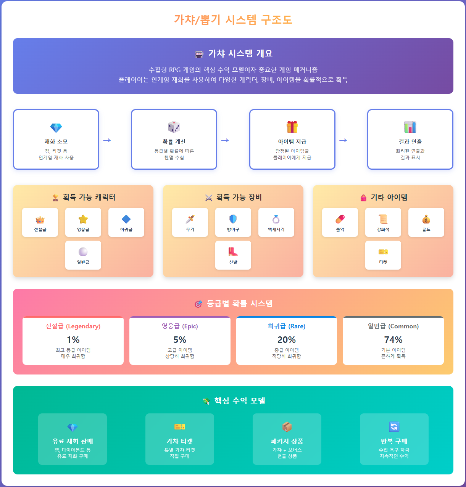

# ASP.NET Core Web API로 게임 서버 개발
  
저자: 최흥배, Claude AI   
-----------------------     
   
# Chapter 11. 가챠/뽑기 시스템 구현
  
## 11.1 가챠/뽑기 시스템 개요
수집형 RPG 게임에서 가챠(뽑기) 시스템은 핵심 수익 모델이자 중요한 게임 메커니즘이다. 플레이어는 인게임 재화를 사용하여 다양한 캐릭터, 장비, 아이템을 확률적으로 획득한다.
  
   

### 11.1.1 가챠 시스템의 기본 구성 요소
1. **가챠 풀(Pool)**: 획득 가능한 아이템 집합
2. **희귀도 등급**: 일반(N), 고급(R), 희귀(SR), 전설(SSR) 등 아이템 등급 구분
3. **확률 구조**: 각 등급별 출현 확률, 아이템별 출현 확률
4. **뽑기 유형**: 단일 뽑기, 10연속 뽑기, 한정 뽑기 등
5. **천장(Pity) 시스템**: 일정 횟수 뽑기 후 고등급 아이템 보장 시스템
6. **중복 보상 처리**: 이미 보유한 아이템을 다시 획득했을 때의 보상 처리

### 11.1.2 게임 비즈니스 관점에서 고려할 점
- **확률 투명성**: 일부 국가에서는 뽑기 확률 공개가 법적으로 의무화됨
- **밸런싱**: 확률과 보상의 균형 조정
- **이벤트 설계**: 한정 가챠, 확률 업 이벤트 등 다양한 이벤트 설계

이번 장에서는 이러한 요소들을 ASP.NET Core Web API로 구현하는 방법을 살펴본다.
  

## 11.2 데이터베이스 설계

### 11.2.1 MySQL 테이블 설계

```sql
-- 가챠 마스터 테이블
CREATE TABLE gacha_masters (
    id INT AUTO_INCREMENT PRIMARY KEY,
    code VARCHAR(50) NOT NULL UNIQUE,
    name VARCHAR(100) NOT NULL,
    description TEXT,
    banner_image_path VARCHAR(200),
    cost_type TINYINT NOT NULL COMMENT '1-다이아몬드, 2-무료티켓, 3-유료티켓',
    cost_amount INT NOT NULL,
    daily_free_count INT NOT NULL DEFAULT 0,
    single_price INT NOT NULL,
    multi_price INT NOT NULL,
    multi_count INT NOT NULL DEFAULT 10,
    multi_bonus TINYINT NOT NULL DEFAULT 0 COMMENT '다중뽑기 보너스 여부',
    is_limited BOOLEAN NOT NULL DEFAULT FALSE,
    start_time TIMESTAMP NULL,
    end_time TIMESTAMP NULL,
    priority INT NOT NULL DEFAULT 100,
    created_at TIMESTAMP DEFAULT CURRENT_TIMESTAMP,
    updated_at TIMESTAMP DEFAULT CURRENT_TIMESTAMP ON UPDATE CURRENT_TIMESTAMP
);

-- 가챠 풀 테이블 (가챠별 획득 가능 아이템)
CREATE TABLE gacha_pools (
    id INT AUTO_INCREMENT PRIMARY KEY,
    gacha_id INT NOT NULL,
    item_type TINYINT NOT NULL COMMENT '1-캐릭터, 2-장비, 3-아이템',
    item_id INT NOT NULL,
    rarity TINYINT NOT NULL COMMENT '1-일반, 2-고급, 3-희귀, 4-전설, 5-신화',
    is_featured BOOLEAN NOT NULL DEFAULT FALSE COMMENT 'UP 아이템 여부',
    weight DOUBLE NOT NULL COMMENT '가중치',
    display_order INT NOT NULL DEFAULT 0,
    created_at TIMESTAMP DEFAULT CURRENT_TIMESTAMP,
    updated_at TIMESTAMP DEFAULT CURRENT_TIMESTAMP ON UPDATE CURRENT_TIMESTAMP,
    INDEX idx_gacha_id (gacha_id)
);

-- 가챠 등급별 확률 테이블
CREATE TABLE gacha_rarity_rates (
    id INT AUTO_INCREMENT PRIMARY KEY,
    gacha_id INT NOT NULL,
    rarity TINYINT NOT NULL,
    rate DOUBLE NOT NULL COMMENT '백분율 확률',
    created_at TIMESTAMP DEFAULT CURRENT_TIMESTAMP,
    updated_at TIMESTAMP DEFAULT CURRENT_TIMESTAMP ON UPDATE CURRENT_TIMESTAMP,
    UNIQUE KEY uq_gacha_rarity (gacha_id, rarity)
);

-- 천장(Pity) 시스템 테이블
CREATE TABLE gacha_pity_rules (
    id INT AUTO_INCREMENT PRIMARY KEY,
    gacha_id INT NOT NULL,
    pity_type TINYINT NOT NULL COMMENT '1-소프트피티, 2-하드피티',
    threshold INT NOT NULL COMMENT '기준 횟수',
    target_rarity TINYINT NOT NULL COMMENT '대상 등급',
    rate_increase DOUBLE NULL COMMENT '확률 증가량 (소프트피티)',
    is_guaranteed BOOLEAN NOT NULL DEFAULT FALSE COMMENT '확정 여부 (하드피티)',
    reset_on_acquire BOOLEAN NOT NULL DEFAULT TRUE,
    created_at TIMESTAMP DEFAULT CURRENT_TIMESTAMP
);

-- 플레이어 가챠 카운터 테이블 (천장 시스템용)
CREATE TABLE player_gacha_counters (
    id BIGINT AUTO_INCREMENT PRIMARY KEY,
    player_id BIGINT NOT NULL,
    gacha_id INT NOT NULL,
    pull_count INT NOT NULL DEFAULT 0,
    last_ssr_pull_count INT NOT NULL DEFAULT 0,
    last_sr_pull_count INT NOT NULL DEFAULT 0,
    total_pull_count INT NOT NULL DEFAULT 0,
    updated_at TIMESTAMP DEFAULT CURRENT_TIMESTAMP ON UPDATE CURRENT_TIMESTAMP,
    UNIQUE KEY uq_player_gacha (player_id, gacha_id)
);

-- 가챠 이력 테이블
CREATE TABLE gacha_records (
    id BIGINT AUTO_INCREMENT PRIMARY KEY,
    player_id BIGINT NOT NULL,
    gacha_id INT NOT NULL,
    pull_type TINYINT NOT NULL COMMENT '1-단일, 2-다중',
    cost_type TINYINT NOT NULL,
    cost_amount INT NOT NULL,
    item_type TINYINT NOT NULL,
    item_id INT NOT NULL,
    rarity TINYINT NOT NULL,
    is_new BOOLEAN NOT NULL DEFAULT FALSE,
    pull_count INT NOT NULL COMMENT '당시 카운터 값',
    created_at TIMESTAMP DEFAULT CURRENT_TIMESTAMP,
    INDEX idx_player_id (player_id),
    INDEX idx_gacha_id (gacha_id),
    INDEX idx_created_at (created_at)
);

-- 중복 보상 규칙 테이블
CREATE TABLE gacha_duplicate_rules (
    id INT AUTO_INCREMENT PRIMARY KEY,
    item_type TINYINT NOT NULL COMMENT '1-캐릭터, 2-장비',
    rarity TINYINT NOT NULL,
    compensation_type TINYINT NOT NULL COMMENT '1-아이템, 2-재화',
    compensation_id INT NULL COMMENT '보상 아이템 ID',
    compensation_amount INT NOT NULL,
    created_at TIMESTAMP DEFAULT CURRENT_TIMESTAMP
);
```

### 11.2.2 엔티티 클래스 설계

```csharp
// Models/Gacha/GachaMaster.cs
public class GachaMaster
{
    public int Id { get; set; }
    public string Code { get; set; }
    public string Name { get; set; }
    public string Description { get; set; }
    public string BannerImagePath { get; set; }
    public byte CostType { get; set; }
    public int CostAmount { get; set; }
    public int DailyFreeCount { get; set; }
    public int SinglePrice { get; set; }
    public int MultiPrice { get; set; }
    public int MultiCount { get; set; }
    public bool MultiBonus { get; set; }
    public bool IsLimited { get; set; }
    public DateTime? StartTime { get; set; }
    public DateTime? EndTime { get; set; }
    public int Priority { get; set; }
    public DateTime CreatedAt { get; set; }
    public DateTime UpdatedAt { get; set; }
    
    // 비용 타입 상수
    public const byte COST_DIAMOND = 1;
    public const byte COST_FREE_TICKET = 2;
    public const byte COST_PAID_TICKET = 3;
}

// Models/Gacha/GachaPool.cs
public class GachaPool
{
    public int Id { get; set; }
    public int GachaId { get; set; }
    public byte ItemType { get; set; }
    public int ItemId { get; set; }
    public byte Rarity { get; set; }
    public bool IsFeatured { get; set; }
    public double Weight { get; set; }
    public int DisplayOrder { get; set; }
    public DateTime CreatedAt { get; set; }
    public DateTime UpdatedAt { get; set; }
    
    // 아이템 타입 상수
    public const byte ITEM_CHARACTER = 1;
    public const byte ITEM_EQUIPMENT = 2;
    public const byte ITEM_CONSUMABLE = 3;
    
    // 희귀도 상수
    public const byte RARITY_NORMAL = 1;
    public const byte RARITY_RARE = 2;
    public const byte RARITY_SUPER_RARE = 3;
    public const byte RARITY_ULTRA_RARE = 4;
    public const byte RARITY_LEGENDARY = 5;
}

// Models/Gacha/GachaRarityRate.cs
public class GachaRarityRate
{
    public int Id { get; set; }
    public int GachaId { get; set; }
    public byte Rarity { get; set; }
    public double Rate { get; set; }
    public DateTime CreatedAt { get; set; }
    public DateTime UpdatedAt { get; set; }
}

// Models/Gacha/GachaPityRule.cs
public class GachaPityRule
{
    public int Id { get; set; }
    public int GachaId { get; set; }
    public byte PityType { get; set; }
    public int Threshold { get; set; }
    public byte TargetRarity { get; set; }
    public double? RateIncrease { get; set; }
    public bool IsGuaranteed { get; set; }
    public bool ResetOnAcquire { get; set; }
    public DateTime CreatedAt { get; set; }
    
    // 피티 타입 상수
    public const byte PITY_SOFT = 1;
    public const byte PITY_HARD = 2;
}

// Models/Gacha/PlayerGachaCounter.cs
public class PlayerGachaCounter
{
    public long Id { get; set; }
    public long PlayerId { get; set; }
    public int GachaId { get; set; }
    public int PullCount { get; set; }
    public int LastSSRPullCount { get; set; }
    public int LastSRPullCount { get; set; }
    public int TotalPullCount { get; set; }
    public DateTime UpdatedAt { get; set; }
}

// Models/Gacha/GachaRecord.cs
public class GachaRecord
{
    public long Id { get; set; }
    public long PlayerId { get; set; }
    public int GachaId { get; set; }
    public byte PullType { get; set; }
    public byte CostType { get; set; }
    public int CostAmount { get; set; }
    public byte ItemType { get; set; }
    public int ItemId { get; set; }
    public byte Rarity { get; set; }
    public bool IsNew { get; set; }
    public int PullCount { get; set; }
    public DateTime CreatedAt { get; set; }
    
    // 뽑기 타입 상수
    public const byte PULL_SINGLE = 1;
    public const byte PULL_MULTI = 2;
}

// Models/Gacha/GachaDuplicateRule.cs
public class GachaDuplicateRule
{
    public int Id { get; set; }
    public byte ItemType { get; set; }
    public byte Rarity { get; set; }
    public byte CompensationType { get; set; }
    public int? CompensationId { get; set; }
    public int CompensationAmount { get; set; }
    public DateTime CreatedAt { get; set; }
    
    // 보상 타입 상수
    public const byte COMPENSATION_ITEM = 1;
    public const byte COMPENSATION_CURRENCY = 2;
}
```
  

## 11.3 확률 계산 알고리즘
가챠 시스템의 핵심은 확률 계산과 아이템 선택 알고리즘이다. 이 섹션에서는 다양한 확률 계산 방법을 구현한다.

### 11.3.1 기본 확률 계산 알고리즘
  
   
   
  
**주요 알고리즘:**
1. **가중치 기반 선택**: 모든 아이템에 가중치를 부여하고 누적 가중치로 랜덤 선택하는 단순한 방식

2. **등급 기반 2단계 선택**: 
   - 1단계: 등급별 확률로 등급 선택
   - 2단계: 선택된 등급 내에서 아이템 선택

**천장 시스템:**
- **소프트 피티**: 특정 횟수 후 확률 점진적 증가
- **하드 피티**: 특정 횟수에서 확정 지급

**확률 보정 메커니즘:**
- 뽑기 횟수에 따른 동적 확률 조정
- UP 아이템 우선 선택 로직
- 다른 등급 확률의 비례적 감소

이 알고리즘은 공정성과 투명성을 보장하면서도 플레이어의 만족도를 높이는 정교한 확률 제어 시스템을 구현한다. 특히 천장 시스템을 통해 과도한 불운을 방지하고 예측 가능한 범위 내에서 보상을 제공한다.  

```csharp
// Services/Gacha/GachaProbabilityService.cs
using System;
using System.Collections.Generic;
using System.Linq;
using System.Threading.Tasks;

public class GachaProbabilityService
{
    private readonly GachaRepository _gachaRepository;
    private readonly Random _random;
    
    public GachaProbabilityService(GachaRepository gachaRepository)
    {
        _gachaRepository = gachaRepository;
        _random = new Random();
    }
    
    // 가중치 기반 아이템 선택 (기본 알고리즘)
    public async Task<GachaPool> SelectItemByWeightAsync(int gachaId)
    {
        // 가챠 풀 가져오기
        var poolItems = await _gachaRepository.GetGachaPoolItemsAsync(gachaId);
        if (poolItems == null || !poolItems.Any())
        {
            throw new Exception($"Empty gacha pool: {gachaId}");
        }
        
        // 총 가중치 계산
        double totalWeight = poolItems.Sum(item => item.Weight);
        
        // 랜덤 값 생성 (0 ~ totalWeight)
        double randomValue = _random.NextDouble() * totalWeight;
        
        // 가중치에 따른 아이템 선택
        double accumulatedWeight = 0;
        foreach (var item in poolItems)
        {
            accumulatedWeight += item.Weight;
            if (randomValue <= accumulatedWeight)
            {
                return item;
            }
        }
        
        // 오류 방지용 (마지막 아이템 반환)
        return poolItems.Last();
    }
    
    // 등급 기반 아이템 선택 (2단계 선택 알고리즘)
    public async Task<GachaPool> SelectItemByRarityTierAsync(int gachaId, PlayerGachaCounter counter = null)
    {
        // 1단계: 등급 선택
        var rarityRates = await _gachaRepository.GetGachaRarityRatesAsync(gachaId);
        if (rarityRates == null || !rarityRates.Any())
        {
            throw new Exception($"Empty rarity rates: {gachaId}");
        }
        
        // 천장 시스템 적용 (확률 보정)
        rarityRates = await ApplyPitySystemAsync(gachaId, rarityRates, counter);
        
        // 등급 선택
        byte selectedRarity = SelectRarityByRate(rarityRates);
        
        // 2단계: 선택된 등급 내에서 아이템 선택
        var poolItems = await _gachaRepository.GetGachaPoolItemsByRarityAsync(gachaId, selectedRarity);
        if (poolItems == null || !poolItems.Any())
        {
            throw new Exception($"Empty pool for rarity {selectedRarity} in gacha {gachaId}");
        }
        
        // UP 아이템 확률 처리
        var featuredItems = poolItems.Where(p => p.IsFeatured).ToList();
        if (featuredItems.Any())
        {
            // UP 아이템 당첨 확률 (예: 50%)
            double featuredRate = 0.5;
            
            if (_random.NextDouble() < featuredRate)
            {
                // UP 아이템 중에서 선택
                return SelectItemFromList(featuredItems);
            }
        }
        
        // 일반 아이템 중에서 선택
        return SelectItemFromList(poolItems);
    }
    
    // 등급 선택 (확률 기반)
    private byte SelectRarityByRate(List<GachaRarityRate> rarityRates)
    {
        // 총 확률 합계 (일반적으로 100이지만, 검증을 위해 계산)
        double totalRate = rarityRates.Sum(r => r.Rate);
        
        // 랜덤 값 생성 (0 ~ totalRate)
        double randomValue = _random.NextDouble() * totalRate;
        
        // 확률에 따른 등급 선택
        double accumulatedRate = 0;
        foreach (var rarity in rarityRates.OrderByDescending(r => r.Rarity))
        {
            accumulatedRate += rarity.Rate;
            if (randomValue <= accumulatedRate)
            {
                return rarity.Rarity;
            }
        }
        
        // 오류 방지용 (가장 낮은 등급 반환)
        return rarityRates.OrderBy(r => r.Rarity).First().Rarity;
    }
    
    // 리스트에서 가중치 기반 아이템 선택
    private GachaPool SelectItemFromList(List<GachaPool> items)
    {
        // 총 가중치 계산
        double totalWeight = items.Sum(item => item.Weight);
        
        // 랜덤 값 생성
        double randomValue = _random.NextDouble() * totalWeight;
        
        // 가중치에 따른 아이템 선택
        double accumulatedWeight = 0;
        foreach (var item in items)
        {
            accumulatedWeight += item.Weight;
            if (randomValue <= accumulatedWeight)
            {
                return item;
            }
        }
        
        // 오류 방지용 (마지막 아이템 반환)
        return items.Last();
    }
    
    // 천장 시스템 적용 (확률 보정)
    private async Task<List<GachaRarityRate>> ApplyPitySystemAsync(
        int gachaId, 
        List<GachaRarityRate> originalRates, 
        PlayerGachaCounter counter)
    {
        if (counter == null)
        {
            return originalRates;
        }
        
        // 피티 규칙 조회
        var pityRules = await _gachaRepository.GetGachaPityRulesAsync(gachaId);
        if (pityRules == null || !pityRules.Any())
        {
            return originalRates;
        }
        
        // 결과 복사본 생성
        var adjustedRates = originalRates.Select(r => new GachaRarityRate 
        { 
            GachaId = r.GachaId,
            Rarity = r.Rarity,
            Rate = r.Rate
        }).ToList();
        
        // 하드 피티 확인 (확정 등급)
        foreach (var rule in pityRules.Where(p => p.PityType == GachaPityRule.PITY_HARD))
        {
            if (counter.PullCount >= rule.Threshold)
            {
                // 확정 등급 설정 (100% 확률)
                foreach (var rate in adjustedRates)
                {
                    rate.Rate = rate.Rarity == rule.TargetRarity ? 100 : 0;
                }
                return adjustedRates;
            }
        }
        
        // 소프트 피티 적용 (확률 증가)
        foreach (var rule in pityRules.Where(p => p.PityType == GachaPityRule.PITY_SOFT))
        {
            if (counter.PullCount >= rule.Threshold && rule.RateIncrease.HasValue)
            {
                // 기준 초과 횟수 계산
                int overThreshold = counter.PullCount - rule.Threshold + 1;
                
                // 증가된 확률 계산
                double increaseAmount = overThreshold * rule.RateIncrease.Value;
                
                // 상한선 설정 (예: 원래 확률의 3배까지만 증가)
                double originalRate = adjustedRates.First(r => r.Rarity == rule.TargetRarity).Rate;
                double maxIncrease = originalRate * 2; // 원래 확률의 3배까지
                increaseAmount = Math.Min(increaseAmount, maxIncrease);
                
                // 타겟 등급 확률 증가
                var targetRate = adjustedRates.First(r => r.Rarity == rule.TargetRarity);
                targetRate.Rate += increaseAmount;
                
                // 다른 등급 확률 비례 감소
                double totalOtherRates = adjustedRates.Where(r => r.Rarity != rule.TargetRarity).Sum(r => r.Rate);
                double decreaseFactor = (totalOtherRates - increaseAmount) / totalOtherRates;
                
                foreach (var rate in adjustedRates.Where(r => r.Rarity != rule.TargetRarity))
                {
                    rate.Rate *= decreaseFactor;
                }
            }
        }
        
        return adjustedRates;
    }
}
```

### 11.3.2 특수 확률 계산 알고리즘
일부 게임에서는 보다 복잡한 확률 계산 규칙을 사용한다. 여러 레이어의 확률 계산, 박스 가챠, 더블 UP 시스템 등이 있다.
  
   
   
   
**주요 특수 알고리즘:**
1. **박스 가챠**: 
   - 제한된 풀에서 중복 없이 아이템 제공
   - 획득한 아이템은 풀에서 제외
   - 박스가 비면 자동 리셋

2. **점진적 확률 증가**:
   - 10연속 뽑기에서 회차별 확률 상승 (5%씩 증가)
   - 마지막 회차에서 희귀급 이상 보장
   - 확률 총합 재조정으로 균형 유지

3. **다중 레이어 처리**:
   - 기본 확률 → 점진적 보정 → 보장 시스템 → 최종 선택
   - 복합적인 확률 계산과 보정

**핵심 메커니즘:**
- **동적 확률 조정**: 상황에 따른 실시간 확률 변경
- **보장 시스템**: 과도한 불운 방지를 위한 안전장치
- **상태 관리**: 플레이어별 획득 이력과 진행 상황 추적

이러한 고급 알고리즘은 더 정교한 사용자 경험을 제공하며, 예측 가능한 범위 내에서 만족도를 극대화하는 시스템을 구현한다.
  
  
```csharp
// Services/Gacha/AdvancedGachaProbabilityService.cs
public class AdvancedGachaProbabilityService : GachaProbabilityService
{
    private readonly GachaRepository _gachaRepository;
    
    public AdvancedGachaProbabilityService(GachaRepository gachaRepository) 
        : base(gachaRepository)
    {
        _gachaRepository = gachaRepository;
    }
    
    // 박스 가챠 구현 
    // (특정 아이템 풀에서 중복 없이 모든 아이템을 뽑는 방식)
    public async Task<GachaPool> SelectItemFromBoxGachaAsync(
        int gachaId, 
        long playerId, 
        HashSet<int> obtainedItems)
    {
        // 가챠 풀 가져오기
        var poolItems = await _gachaRepository.GetGachaPoolItemsAsync(gachaId);
        
        // 이미 획득한 아이템 제외
        var remainingItems = poolItems.Where(p => !obtainedItems.Contains(p.Id)).ToList();
        
        // 남은 아이템이 없으면 박스 리셋
        if (!remainingItems.Any())
        {
            return null; // 박스 리셋 필요 신호
        }
        
        // 남은 아이템 중에서 가중치 기반 선택
        return SelectItemFromList(remainingItems);
    }
    
    // 점진적 확률 증가 시스템 
    // (10연속 뽑기에서 뽑기 횟수에 따라 확률 변경)
    public async Task<List<GachaPool>> SelectItemsWithProgressiveRatesAsync(
        int gachaId, 
        int count, 
        PlayerGachaCounter counter)
    {
        var results = new List<GachaPool>();
        
        // 기본 등급별 확률
        var baseRarityRates = await _gachaRepository.GetGachaRarityRatesAsync(gachaId);
        
        // 10연속 뽑기에서 보장되는 등급 (예: 고급 이상 1개 보장)
        byte guaranteedRarity = GachaPool.RARITY_RARE;
        
        for (int i = 0; i < count; i++)
        {
            List<GachaRarityRate> currentRates;
            
            // 마지막 뽑기에서 아직 guaranteedRarity 이상이 없으면 보장
            if (i == count - 1 && !results.Any(r => r.Rarity >= guaranteedRarity))
            {
                // 고급 이상 보장 처리
                currentRates = baseRarityRates
                    .Select(r => new GachaRarityRate { 
                        Rarity = r.Rarity, 
                        Rate = r.Rarity >= guaranteedRarity ? r.Rate : 0 
                    })
                    .ToList();
            }
            else
            {
                // 뽑기 회차에 따라 점진적으로 확률 변경
                // (예: 뒷번호일수록 레어 확률 약간 증가)
                double progressFactor = 1.0 + (i * 0.05); // 5%씩 증가
                
                currentRates = baseRarityRates
                    .Select(r => new GachaRarityRate { 
                        Rarity = r.Rarity, 
                        Rate = r.Rarity >= GachaPool.RARITY_SUPER_RARE 
                            ? r.Rate * progressFactor 
                            : r.Rate 
                    })
                    .ToList();
                
                // 확률 총합 재조정
                double totalRate = currentRates.Sum(r => r.Rate);
                double adjustFactor = 100.0 / totalRate;
                
                foreach (var rate in currentRates)
                {
                    rate.Rate *= adjustFactor;
                }
                
                // 천장 시스템 적용
                var pullCounter = new PlayerGachaCounter
                {
                    PlayerId = counter.PlayerId,
                    GachaId = counter.GachaId,
                    PullCount = counter.PullCount + i
                };
                
                currentRates = await ApplyPitySystemAsync(gachaId, currentRates, pullCounter);
            }
            
            // 등급 선택
            byte selectedRarity = SelectRarityByRate(currentRates);
            
            // 선택된 등급 내에서 아이템 선택
            var poolItems = await _gachaRepository.GetGachaPoolItemsByRarityAsync(gachaId, selectedRarity);
            var selectedItem = SelectItemFromList(poolItems);
            
            results.Add(selectedItem);
        }
        
        return results;
    }
    
    // 등급 선택 (private 메서드를 protected로 변경하여 상속 가능하게 설정)
    protected new byte SelectRarityByRate(List<GachaRarityRate> rarityRates)
    {
        return base.SelectRarityByRate(rarityRates);
    }
    
    // 리스트에서 아이템 선택 (private 메서드를 protected로 변경하여 상속 가능하게 설정)
    protected new GachaPool SelectItemFromList(List<GachaPool> items)
    {
        return base.SelectItemFromList(items);
    }
    
    // 천장 시스템 적용 (private 메서드를 protected로 변경하여 상속 가능하게 설정)
    protected new Task<List<GachaRarityRate>> ApplyPitySystemAsync(
        int gachaId, 
        List<GachaRarityRate> originalRates, 
        PlayerGachaCounter counter)
    {
        return base.ApplyPitySystemAsync(gachaId, originalRates, counter);
    }
}
```
  
  
## 11.4 뽑기 API 설계 및 구현

### 11.4.1 데이터 액세스 레이어

```csharp
// Services/Gacha/GachaRepository.cs
using MySqlConnector;
using SqlKata.Execution;
using SqlKata.Compilers;
using System;
using System.Collections.Generic;
using System.Threading.Tasks;

public class GachaRepository
{
    private readonly QueryFactory _queryFactory;
    
    public GachaRepository(string connectionString)
    {
        var connection = new MySqlConnection(connectionString);
        var compiler = new MySqlCompiler();
        _queryFactory = new QueryFactory(connection, compiler);
    }
    
    // 가챠 마스터 데이터 조회
    public async Task<GachaMaster> GetGachaMasterByIdAsync(int id)
    {
        return await _queryFactory.Query("gacha_masters")
            .Where("id", id)
            .FirstOrDefaultAsync<GachaMaster>();
    }
    
    public async Task<GachaMaster> GetGachaMasterByCodeAsync(string code)
    {
        return await _queryFactory.Query("gacha_masters")
            .Where("code", code)
            .FirstOrDefaultAsync<GachaMaster>();
    }
    
    // 현재 활성화된 가챠 목록 조회
    public async Task<List<GachaMaster>> GetActiveGachasAsync()
    {
        var now = DateTime.UtcNow;
        
        return await _queryFactory.Query("gacha_masters")
            .Where(q => q.Where("start_time", "<=", now).OrWhereNull("start_time"))
            .Where(q => q.Where("end_time", ">=", now).OrWhereNull("end_time"))
            .OrderBy("priority")
            .GetAsync<GachaMaster>();
    }
    
    // 가챠 풀 아이템 조회
    public async Task<List<GachaPool>> GetGachaPoolItemsAsync(int gachaId)
    {
        return await _queryFactory.Query("gacha_pools")
            .Where("gacha_id", gachaId)
            .OrderBy("display_order")
            .GetAsync<GachaPool>();
    }
    
    // 특정 등급의 가챠 풀 아이템 조회
    public async Task<List<GachaPool>> GetGachaPoolItemsByRarityAsync(int gachaId, byte rarity)
    {
        return await _queryFactory.Query("gacha_pools")
            .Where("gacha_id", gachaId)
            .Where("rarity", rarity)
            .OrderBy("display_order")
            .GetAsync<GachaPool>();
    }
    
    // 가챠 등급별 확률 조회
    public async Task<List<GachaRarityRate>> GetGachaRarityRatesAsync(int gachaId)
    {
        return await _queryFactory.Query("gacha_rarity_rates")
            .Where("gacha_id", gachaId)
            .OrderByDesc("rarity")
            .GetAsync<GachaRarityRate>();
    }
    
    // 가챠 천장 규칙 조회
    public async Task<List<GachaPityRule>> GetGachaPityRulesAsync(int gachaId)
    {
        return await _queryFactory.Query("gacha_pity_rules")
            .Where("gacha_id", gachaId)
            .OrderBy("threshold")
            .GetAsync<GachaPityRule>();
    }
    
    // 플레이어 가챠 카운터 조회
    public async Task<PlayerGachaCounter> GetPlayerGachaCounterAsync(long playerId, int gachaId)
    {
        return await _queryFactory.Query("player_gacha_counters")
            .Where("player_id", playerId)
            .Where("gacha_id", gachaId)
            .FirstOrDefaultAsync<PlayerGachaCounter>();
    }
    
    // 플레이어 가챠 카운터 생성/업데이트
    public async Task UpdatePlayerGachaCounterAsync(PlayerGachaCounter counter)
    {
        // 이미 존재하는지 확인
        var existing = await GetPlayerGachaCounterAsync(counter.PlayerId, counter.GachaId);
        
        if (existing == null)
        {
            // 새로 생성
            await _queryFactory.Query("player_gacha_counters").InsertAsync(new {
                player_id = counter.PlayerId,
                gacha_id = counter.GachaId,
                pull_count = counter.PullCount,
                last_ssr_pull_count = counter.LastSSRPullCount,
                last_sr_pull_count = counter.LastSRPullCount,
                total_pull_count = counter.TotalPullCount,
                updated_at = DateTime.UtcNow
            });
        }
        else
        {
            // 업데이트
            await _queryFactory.Query("player_gacha_counters")
                .Where("player_id", counter.PlayerId)
                .Where("gacha_id", counter.GachaId)
                .UpdateAsync(new {
                    pull_count = counter.PullCount,
                    last_ssr_pull_count = counter.LastSSRPullCount,
                    last_sr_pull_count = counter.LastSRPullCount,
                    total_pull_count = counter.TotalPullCount,
                    updated_at = DateTime.UtcNow
                });
        }
    }
    
    // 가챠 이력 추가
    public async Task AddGachaRecordAsync(GachaRecord record)
    {
        await _queryFactory.Query("gacha_records").InsertAsync(new {
            player_id = record.PlayerId,
            gacha_id = record.GachaId,
            pull_type = record.PullType,
            cost_type = record.CostType,
            cost_amount = record.CostAmount,
            item_type = record.ItemType,
            item_id = record.ItemId,
            rarity = record.Rarity,
            is_new = record.IsNew,
            pull_count = record.PullCount,
            created_at = DateTime.UtcNow
        });
    }
    
    // 플레이어의 가챠 이력 조회
    public async Task<List<GachaRecord>> GetPlayerGachaRecordsAsync(long playerId, int limit = 50)
    {
        return await _queryFactory.Query("gacha_records")
            .Where("player_id", playerId)
            .OrderByDesc("created_at")
            .LimitAsync(limit);
    }
    
    // 중복 보상 규칙 조회
    public async Task<GachaDuplicateRule> GetDuplicateRuleAsync(byte itemType, byte rarity)
    {
        return await _queryFactory.Query("gacha_duplicate_rules")
            .Where("item_type", itemType)
            .Where("rarity", rarity)
            .FirstOrDefaultAsync<GachaDuplicateRule>();
    }
}
```

### 11.4.2 가챠 서비스 구현

```csharp
// Services/Gacha/GachaService.cs
using System;
using System.Collections.Generic;
using System.Linq;
using System.Threading.Tasks;

public class GachaService
{
    private readonly GachaRepository _gachaRepository;
    private readonly GachaProbabilityService _probabilityService;
    private readonly InventoryService _inventoryService; // 인벤토리 서비스 (전 장에서 구현)
    private readonly CharacterService _characterService; // 캐릭터 서비스
    private readonly CurrencyService _currencyService;   // 재화 서비스
    private readonly GachaCacheService _cacheService;    // 가챠 캐시 서비스
    
    public GachaService(
        GachaRepository gachaRepository,
        GachaProbabilityService probabilityService,
        InventoryService inventoryService,
        CharacterService characterService,
        CurrencyService currencyService,
        GachaCacheService cacheService)
    {
        _gachaRepository = gachaRepository;
        _probabilityService = probabilityService;
        _inventoryService = inventoryService;
        _characterService = characterService;
        _currencyService = currencyService;
        _cacheService = cacheService;
    }
    
    // 가챠 목록 조회
    public async Task<List<GachaMaster>> GetActiveGachasAsync()
    {
        // 캐시에서 먼저 조회 시도
        var cachedGachas = await _cacheService.GetActiveGachasAsync();
        if (cachedGachas != null)
        {
            return cachedGachas;
        }
        
        // DB에서 조회
        var gachas = await _gachaRepository.GetActiveGachasAsync();
        
        // 캐시에 저장
        if (gachas != null && gachas.Count > 0)
        {
            await _cacheService.SetActiveGachasAsync(gachas);
        }
        
        return gachas;
    }
    
    // 가챠 상세 정보 조회
    public async Task<GachaDetailInfo> GetGachaDetailAsync(string gachaCode)
    {
        // 캐시에서 먼저 조회 시도
        var cachedDetail = await _cacheService.GetGachaDetailAsync(gachaCode);
        if (cachedDetail != null)
        {
            return cachedDetail;
        }
        
        // 가챠 마스터 정보 조회
        var gacha = await _gachaRepository.GetGachaMasterByCodeAsync(gachaCode);
        if (gacha == null)
        {
            throw new Exception($"Gacha not found: {gachaCode}");
        }
        
        // 풀 아이템 조회
        var poolItems = await _gachaRepository.GetGachaPoolItemsAsync(gacha.Id);
        
        // 등급별 확률 조회
        var rarityRates = await _gachaRepository.GetGachaRarityRatesAsync(gacha.Id);
        
        // 천장 규칙 조회
        var pityRules = await _gachaRepository.GetGachaPityRulesAsync(gacha.Id);
        
        // 결과 구성
        var detail = new GachaDetailInfo
        {
            GachaMaster = gacha,
            PoolItems = poolItems,
            RarityRates = rarityRates,
            PityRules = pityRules
        };
        
        // 캐시에 저장
        await _cacheService.SetGachaDetailAsync(gachaCode, detail);
        
        return detail;
    }
    
    // 단일 뽑기 실행
    public async Task<GachaPullResult> PullSingleAsync(long playerId, string gachaCode)
    {
        var detail = await GetGachaDetailAsync(gachaCode);
        var gacha = detail.GachaMaster;
        
        // 비용 검증 및 차감
        await ValidateAndConsumeCostAsync(playerId, gacha, false);
        
        // 플레이어 카운터 조회/생성
        var counter = await GetOrCreateCounterAsync(playerId, gacha.Id);
        
        // 뽑기 실행
        var selectedItem = await _probabilityService.SelectItemByRarityTierAsync(gacha.Id, counter);
        
        // 보상 지급
        var rewardResult = await GrantGachaRewardAsync(playerId, selectedItem);
        
        // 카운터 업데이트
        await UpdateCounterAfterPullAsync(counter, selectedItem.Rarity);
        
        // 이력 기록
        await RecordGachaPullAsync(
            playerId, 
            gacha.Id, 
            GachaRecord.PULL_SINGLE, 
            gacha.CostType, 
            gacha.SinglePrice, 
            selectedItem, 
            rewardResult.IsNew, 
            counter.PullCount);
        
        // 결과 반환
        return new GachaPullResult
        {
            Success = true,
            ResultType = rewardResult.ResultType,
            ResultId = rewardResult.ResultId,
            ItemType = selectedItem.ItemType,
            ItemId = selectedItem.ItemId,
            Rarity = selectedItem.Rarity,
            IsNew = rewardResult.IsNew,
            CompensationItems = rewardResult.CompensationItems
        };
    }
    
    // 다중 뽑기 실행
    public async Task<List<GachaPullResult>> PullMultiAsync(long playerId, string gachaCode)
    {
        var detail = await GetGachaDetailAsync(gachaCode);
        var gacha = detail.GachaMaster;
        
        // 비용 검증 및 차감
        await ValidateAndConsumeCostAsync(playerId, gacha, true);
        
        // 플레이어 카운터 조회/생성
        var counter = await GetOrCreateCounterAsync(playerId, gacha.Id);
        
        // 결과 목록
        var results = new List<GachaPullResult>();
        
        // 다중 뽑기 횟수 (기본 10회)
        int pullCount = gacha.MultiCount;
        
        for (int i = 0; i < pullCount; i++)
        {
            // 뽑기 실행
            var selectedItem = await _probabilityService.SelectItemByRarityTierAsync(gacha.Id, counter);
            
            // 보상 지급
            var rewardResult = await GrantGachaRewardAsync(playerId, selectedItem);
            
            // 카운터 업데이트
            await UpdateCounterAfterPullAsync(counter, selectedItem.Rarity);
            
            // 이력 기록
            await RecordGachaPullAsync(
                playerId, 
                gacha.Id, 
                GachaRecord.PULL_MULTI, 
                gacha.CostType, 
                gacha.MultiPrice / pullCount, // 개당 비용
                selectedItem, 
                rewardResult.IsNew, 
                counter.PullCount);
            
            // 결과 추가
            results.Add(new GachaPullResult
            {
                Success = true,
                ResultType = rewardResult.ResultType,
                ResultId = rewardResult.ResultId,
                ItemType = selectedItem.ItemType,
                ItemId = selectedItem.ItemId,
                Rarity = selectedItem.Rarity,
                IsNew = rewardResult.IsNew,
                CompensationItems = rewardResult.CompensationItems
            });
        }
        
        return results;
    }
    
    // 비용 검증 및 차감
    private async Task ValidateAndConsumeCostAsync(long playerId, GachaMaster gacha, bool isMulti)
    {
        int costAmount = isMulti ? gacha.MultiPrice : gacha.SinglePrice;
        
        // 비용 타입에 따른 처리
        switch (gacha.CostType)
        {
            case GachaMaster.COST_DIAMOND:
                // 다이아몬드 소모
                bool hasEnough = await _currencyService.HasEnoughCurrencyAsync(playerId, "diamond", costAmount);
                if (!hasEnough)
                {
                    throw new Exception("Not enough diamonds");
                }
                
                await _currencyService.ConsumeCurrencyAsync(playerId, "diamond", costAmount);
                break;
                
            case GachaMaster.COST_FREE_TICKET:
                // 무료 티켓 소모
                hasEnough = await _currencyService.HasEnoughCurrencyAsync(playerId, "free_gacha_ticket", costAmount);
                if (!hasEnough)
                {
                    throw new Exception("Not enough free tickets");
                }
                
                await _currencyService.ConsumeCurrencyAsync(playerId, "free_gacha_ticket", costAmount);
                break;
                
            case GachaMaster.COST_PAID_TICKET:
                // 유료 티켓 소모
                hasEnough = await _currencyService.HasEnoughCurrencyAsync(playerId, "paid_gacha_ticket", costAmount);
                if (!hasEnough)
                {
                    throw new Exception("Not enough paid tickets");
                }
                
                await _currencyService.ConsumeCurrencyAsync(playerId, "paid_gacha_ticket", costAmount);
                break;
                
            default:
                throw new Exception($"Invalid cost type: {gacha.CostType}");
        }
    }
    
    // 플레이어 카운터 조회/생성
    private async Task<PlayerGachaCounter> GetOrCreateCounterAsync(long playerId, int gachaId)
    {
        var counter = await _gachaRepository.GetPlayerGachaCounterAsync(playerId, gachaId);
        if (counter == null)
        {
            counter = new PlayerGachaCounter
            {
                PlayerId = playerId,
                GachaId = gachaId,
                PullCount = 0,
                LastSSRPullCount = 0,
                LastSRPullCount = 0,
                TotalPullCount = 0
            };
        }
        
        return counter;
    }
    
    // 천장 카운터 업데이트
    private async Task UpdateCounterAfterPullAsync(PlayerGachaCounter counter, byte rarity)
    {
        // 총 뽑기 횟수 증가
        counter.TotalPullCount++;
        
        // 현재 피티 카운터 증가
        counter.PullCount++;
        
        // 고등급 아이템 획득 시 카운터 리셋 여부 확인
        if (rarity == GachaPool.RARITY_ULTRA_RARE || rarity == GachaPool.RARITY_LEGENDARY)
        {
            // SSR/UR 획득 시 마지막 획득 기록 저장
            counter.LastSSRPullCount = counter.PullCount;
            
            // 피티 카운터 리셋 (피티 규칙에 따라 달라질 수 있음)
            counter.PullCount = 0;
        }
        else if (rarity == GachaPool.RARITY_SUPER_RARE)
        {
            // SR 획득 시 마지막 획득 기록 저장
            counter.LastSRPullCount = counter.PullCount;
        }
        
        // DB에 저장
        await _gachaRepository.UpdatePlayerGachaCounterAsync(counter);
    }
    
    // 가챠 이력 기록
    private async Task RecordGachaPullAsync(
        long playerId, 
        int gachaId, 
        byte pullType, 
        byte costType, 
        int costAmount, 
        GachaPool item, 
        bool isNew, 
        int pullCount)
    {
        var record = new GachaRecord
        {
            PlayerId = playerId,
            GachaId = gachaId,
            PullType = pullType,
            CostType = costType,
            CostAmount = costAmount,
            ItemType = item.ItemType,
            ItemId = item.ItemId,
            Rarity = item.Rarity,
            IsNew = isNew,
            PullCount = pullCount
        };
        
        await _gachaRepository.AddGachaRecordAsync(record);
    }
    
    // 보상 지급 처리
    private async Task<GachaRewardResult> GrantGachaRewardAsync(long playerId, GachaPool poolItem)
    {
        var result = new GachaRewardResult();
        
        switch (poolItem.ItemType)
        {
            case GachaPool.ITEM_CHARACTER:
                // 캐릭터 획득 처리
                var characterResult = await ProcessCharacterRewardAsync(playerId, poolItem);
                result.ResultType = GachaRewardType.Character;
                result.ResultId = characterResult.CharacterId;
                result.IsNew = characterResult.IsNew;
                result.CompensationItems = characterResult.CompensationItems;
                break;
                
            case GachaPool.ITEM_EQUIPMENT:
                // 장비 획득 처리
                var equipmentResult = await ProcessEquipmentRewardAsync(playerId, poolItem);
                result.ResultType = GachaRewardType.Equipment;
                result.ResultId = equipmentResult.InventoryId;
                result.IsNew = true; // 장비는 항상 신규로 취급
                break;
                
            case GachaPool.ITEM_CONSUMABLE:
                // 소비 아이템 획득 처리
                var itemResult = await ProcessItemRewardAsync(playerId, poolItem);
                result.ResultType = GachaRewardType.Item;
                result.ResultId = itemResult.InventoryId;
                result.IsNew = false; // 소비 아이템은 중복 가능
                break;
                
            default:
                throw new Exception($"Invalid item type: {poolItem.ItemType}");
        }
        
        return result;
    }
    
    // 캐릭터 보상 처리
    private async Task<CharacterRewardResult> ProcessCharacterRewardAsync(long playerId, GachaPool poolItem)
    {
        // 이미 보유 중인지 확인
        bool hasCharacter = await _characterService.HasCharacterAsync(playerId, poolItem.ItemId);
        
        if (hasCharacter)
        {
            // 중복 캐릭터 보상 처리
            var duplicateRule = await _gachaRepository.GetDuplicateRuleAsync(
                GachaPool.ITEM_CHARACTER, 
                poolItem.Rarity);
                
            if (duplicateRule == null)
            {
                // 기본 규칙: 캐릭터 조각으로 변환
                int fragmentAmount = poolItem.Rarity * 5; // 등급에 따라 지급량 조정
                
                // 캐릭터 조각 지급
                await _inventoryService.AddItemToInventoryAsync(
                    playerId, 
                    $"character_fragment_{poolItem.ItemId}", 
                    fragmentAmount);
                
                return new CharacterRewardResult
                {
                    CharacterId = poolItem.ItemId,
                    IsNew = false,
                    CompensationItems = new List<CompensationItem>
                    {
                        new CompensationItem
                        {
                            ItemCode = $"character_fragment_{poolItem.ItemId}",
                            Quantity = fragmentAmount
                        }
                    }
                };
            }
            else
            {
                // 규칙에 따른 보상 지급
                if (duplicateRule.CompensationType == GachaDuplicateRule.COMPENSATION_ITEM && duplicateRule.CompensationId.HasValue)
                {
                    // 아이템 지급
                    string itemCode = $"item_{duplicateRule.CompensationId.Value}";
                    await _inventoryService.AddItemToInventoryAsync(
                        playerId, 
                        itemCode, 
                        duplicateRule.CompensationAmount);
                        
                    return new CharacterRewardResult
                    {
                        CharacterId = poolItem.ItemId,
                        IsNew = false,
                        CompensationItems = new List<CompensationItem>
                        {
                            new CompensationItem
                            {
                                ItemCode = itemCode,
                                Quantity = duplicateRule.CompensationAmount
                            }
                        }
                    };
                }
                else if (duplicateRule.CompensationType == GachaDuplicateRule.COMPENSATION_CURRENCY)
                {
                    // 재화 지급
                    string currencyCode = "character_shard"; // 기본 캐릭터 파편 재화
                    await _currencyService.AddCurrencyAsync(
                        playerId, 
                        currencyCode, 
                        duplicateRule.CompensationAmount);
                        
                    return new CharacterRewardResult
                    {
                        CharacterId = poolItem.ItemId,
                        IsNew = false,
                        CompensationItems = new List<CompensationItem>
                        {
                            new CompensationItem
                            {
                                ItemCode = currencyCode,
                                Quantity = duplicateRule.CompensationAmount
                            }
                        }
                    };
                }
            }
        }
        else
        {
            // 신규 캐릭터 획득
            await _characterService.AcquireCharacterAsync(playerId, poolItem.ItemId);
        }
        
        return new CharacterRewardResult
        {
            CharacterId = poolItem.ItemId,
            IsNew = !hasCharacter,
            CompensationItems = new List<CompensationItem>()
        };
    }
    
    // 장비 보상 처리
    private async Task<EquipmentRewardResult> ProcessEquipmentRewardAsync(long playerId, GachaPool poolItem)
    {
        // 장비 아이템 코드 생성
        string itemCode = $"equipment_{poolItem.ItemId}";
        
        // 인벤토리에 장비 추가
        var inventoryItem = await _inventoryService.AddItemToInventoryAsync(
            playerId, 
            itemCode, 
            1,
            new Dictionary<string, object>
            {
                { "enhance_level", 0 },
                { "from_gacha", true }
            });
            
        return new EquipmentRewardResult
        {
            InventoryId = inventoryItem.Id
        };
    }
    
    // 소비 아이템 보상 처리
    private async Task<ItemRewardResult> ProcessItemRewardAsync(long playerId, GachaPool poolItem)
    {
        // 아이템 코드 생성
        string itemCode = $"item_{poolItem.ItemId}";
        
        // 수량 결정 (희귀도에 따라 조정)
        int quantity = Math.Max(1, 6 - poolItem.Rarity); // 희귀도가 낮을수록 더 많이 지급
        
        // 인벤토리에 아이템 추가
        var inventoryItem = await _inventoryService.AddItemToInventoryAsync(
            playerId, 
            itemCode, 
            quantity);
            
        return new ItemRewardResult
        {
            InventoryId = inventoryItem.Id
        };
    }
    
    // 플레이어의 가챠 이력 조회
    public async Task<List<GachaRecord>> GetPlayerGachaHistoryAsync(long playerId, int limit = 50)
    {
        return await _gachaRepository.GetPlayerGachaRecordsAsync(playerId, limit);
    }
}

// 가챠 상세 정보 클래스
public class GachaDetailInfo
{
    public GachaMaster GachaMaster { get; set; }
    public List<GachaPool> PoolItems { get; set; }
    public List<GachaRarityRate> RarityRates { get; set; }
    public List<GachaPityRule> PityRules { get; set; }
}

// 가챠 결과 클래스
public class GachaPullResult
{
    public bool Success { get; set; }
    public GachaRewardType ResultType { get; set; }
    public long ResultId { get; set; }
    public byte ItemType { get; set; }
    public int ItemId { get; set; }
    public byte Rarity { get; set; }
    public bool IsNew { get; set; }
    public List<CompensationItem> CompensationItems { get; set; } = new List<CompensationItem>();
}

// 보상 지급 결과 클래스
public class GachaRewardResult
{
    public GachaRewardType ResultType { get; set; }
    public long ResultId { get; set; }
    public bool IsNew { get; set; }
    public List<CompensationItem> CompensationItems { get; set; } = new List<CompensationItem>();
}

// 캐릭터 보상 결과 클래스
public class CharacterRewardResult
{
    public int CharacterId { get; set; }
    public bool IsNew { get; set; }
    public List<CompensationItem> CompensationItems { get; set; } = new List<CompensationItem>();
}

// 장비 보상 결과 클래스
public class EquipmentRewardResult
{
    public long InventoryId { get; set; }
}

// 아이템 보상 결과 클래스
public class ItemRewardResult
{
    public long InventoryId { get; set; }
}

// 보상 아이템 클래스
public class CompensationItem
{
    public string ItemCode { get; set; }
    public int Quantity { get; set; }
}

// 보상 유형 열거형
public enum GachaRewardType
{
    Character = 1,
    Equipment = 2,
    Item = 3
}
```

### 11.4.3 Web API 컨트롤러

```csharp
// Controllers/GachaController.cs
using Microsoft.AspNetCore.Mvc;
using System;
using System.Collections.Generic;
using System.Threading.Tasks;

[ApiController]
[Route("api/gacha")]
public class GachaController : ControllerBase
{
    private readonly GachaService _gachaService;
    
    public GachaController(GachaService gachaService)
    {
        _gachaService = gachaService;
    }
    
    // 가챠 목록 조회
    [HttpPost("list")]
    public async Task<GachaListResponse> GetGachaList()
    {
        try
        {
            var gachas = await _gachaService.GetActiveGachasAsync();
            
            return new GachaListResponse
            {
                Success = true,
                Gachas = gachas
            };
        }
        catch (Exception ex)
        {
            return new GachaListResponse
            {
                Success = false,
                ErrorCode = 500,
                ErrorMessage = ex.Message
            };
        }
    }
    
    // 가챠 상세 정보 조회
    [HttpPost("detail")]
    public async Task<GachaDetailResponse> GetGachaDetail([FromBody] GachaDetailRequest request)
    {
        try
        {
            var detail = await _gachaService.GetGachaDetailAsync(request.GachaCode);
            
            return new GachaDetailResponse
            {
                Success = true,
                Gacha = detail.GachaMaster,
                PoolItems = detail.PoolItems,
                RarityRates = detail.RarityRates,
                PityRules = detail.PityRules
            };
        }
        catch (Exception ex)
        {
            return new GachaDetailResponse
            {
                Success = false,
                ErrorCode = 500,
                ErrorMessage = ex.Message
            };
        }
    }
    
    // 단일 뽑기
    [HttpPost("pull/single")]
    public async Task<GachaPullSingleResponse> PullSingle([FromBody] GachaPullSingleRequest request)
    {
        try
        {
            var result = await _gachaService.PullSingleAsync(request.PlayerId, request.GachaCode);
            
            return new GachaPullSingleResponse
            {
                Success = true,
                Result = result
            };
        }
        catch (Exception ex)
        {
            return new GachaPullSingleResponse
            {
                Success = false,
                ErrorCode = 500,
                ErrorMessage = ex.Message
            };
        }
    }
    
    // 다중 뽑기
    [HttpPost("pull/multi")]
    public async Task<GachaPullMultiResponse> PullMulti([FromBody] GachaPullMultiRequest request)
    {
        try
        {
            var results = await _gachaService.PullMultiAsync(request.PlayerId, request.GachaCode);
            
            return new GachaPullMultiResponse
            {
                Success = true,
                Results = results
            };
        }
        catch (Exception ex)
        {
            return new GachaPullMultiResponse
            {
                Success = false,
                ErrorCode = 500,
                ErrorMessage = ex.Message
            };
        }
    }
    
    // 뽑기 이력 조회
    [HttpPost("history")]
    public async Task<GachaHistoryResponse> GetGachaHistory([FromBody] GachaHistoryRequest request)
    {
        try
        {
            var history = await _gachaService.GetPlayerGachaHistoryAsync(request.PlayerId, request.Limit);
            
            return new GachaHistoryResponse
            {
                Success = true,
                Records = history
            };
        }
        catch (Exception ex)
        {
            return new GachaHistoryResponse
            {
                Success = false,
                ErrorCode = 500,
                ErrorMessage = ex.Message
            };
        }
    }
}
```

### 11.4.4 API 요청/응답 모델

```csharp
// Models/Gacha/Requests.cs
public class GachaDetailRequest
{
    public string GachaCode { get; set; }
}

public class GachaPullSingleRequest
{
    public long PlayerId { get; set; }
    public string GachaCode { get; set; }
}

public class GachaPullMultiRequest
{
    public long PlayerId { get; set; }
    public string GachaCode { get; set; }
}

public class GachaHistoryRequest
{
    public long PlayerId { get; set; }
    public int Limit { get; set; } = 50;
}

// Models/Gacha/Responses.cs
public class BaseResponse
{
    public bool Success { get; set; }
    public int ErrorCode { get; set; }
    public string ErrorMessage { get; set; }
}

public class GachaListResponse : BaseResponse
{
    public List<GachaMaster> Gachas { get; set; }
}

public class GachaDetailResponse : BaseResponse
{
    public GachaMaster Gacha { get; set; }
    public List<GachaPool> PoolItems { get; set; }
    public List<GachaRarityRate> RarityRates { get; set; }
    public List<GachaPityRule> PityRules { get; set; }
}

public class GachaPullSingleResponse : BaseResponse
{
    public GachaPullResult Result { get; set; }
}

public class GachaPullMultiResponse : BaseResponse
{
    public List<GachaPullResult> Results { get; set; }
}

public class GachaHistoryResponse : BaseResponse
{
    public List<GachaRecord> Records { get; set; }
}
```

## 11.5 보상 지급 시스템

### 11.5.1 가챠 보상 지급 시스템 개요
가챠 보상 지급 시스템은 앞서 구현한 `GachaService` 내 `GrantGachaRewardAsync` 메서드와 관련 메서드에서 처리하고 있다. 이 시스템의 핵심 기능은 다음과 같다:

1. **아이템 유형별 처리**: 캐릭터, 장비, 소비 아이템 등 다양한 유형의 보상 처리
2. **중복 아이템 처리**: 이미 보유한 캐릭터를 다시 획득했을 때의 대체 보상 지급
3. **인벤토리 연계**: 획득한 아이템을 플레이어 인벤토리에 추가

### 11.5.2 중복 보상 처리 로직
중복 보상 처리는 게임의 재미와 사용자 경험에 큰 영향을 미친다. 일반적으로 다음과 같은 방식으로 처리한다:

1. **캐릭터 중복**: 캐릭터 조각/파편으로 변환하여 해당 캐릭터 강화에 사용
2. **장비 중복**: 새 장비로 획득 (장비는 여러 개 보유 가능)
3. **희귀도별 차등 보상**: 희귀도가 높을수록 더 많은 보상 지급

```csharp
// Services/Gacha/GachaDuplicateService.cs
public class GachaDuplicateService
{
    private readonly GachaRepository _gachaRepository;
    private readonly InventoryService _inventoryService;
    private readonly CurrencyService _currencyService;
    
    public GachaDuplicateService(
        GachaRepository gachaRepository,
        InventoryService inventoryService,
        CurrencyService currencyService)
    {
        _gachaRepository = gachaRepository;
        _inventoryService = inventoryService;
        _currencyService = currencyService;
    }
    
    // 캐릭터 중복 보상 처리
    public async Task<List<CompensationItem>> ProcessDuplicateCharacterAsync(long playerId, int characterId, byte rarity)
    {
        // 규칙 조회
        var rule = await _gachaRepository.GetDuplicateRuleAsync(GachaPool.ITEM_CHARACTER, rarity);
        
        // 기본 보상: 캐릭터 조각
        if (rule == null)
        {
            // 등급에 따른 조각 수량
            int fragmentAmount = CalculateDefaultFragments(rarity);
            
            // 조각 지급
            await _inventoryService.AddItemToInventoryAsync(
                playerId, 
                $"character_fragment_{characterId}", 
                fragmentAmount);
                
            return new List<CompensationItem>
            {
                new CompensationItem
                {
                    ItemCode = $"character_fragment_{characterId}",
                    Quantity = fragmentAmount
                }
            };
        }
        
        // 규칙 기반 보상
        var compensations = new List<CompensationItem>();
        
        if (rule.CompensationType == GachaDuplicateRule.COMPENSATION_ITEM && rule.CompensationId.HasValue)
        {
            // 아이템 보상
            string itemCode = $"item_{rule.CompensationId.Value}";
            await _inventoryService.AddItemToInventoryAsync(
                playerId, 
                itemCode, 
                rule.CompensationAmount);
                
            compensations.Add(new CompensationItem
            {
                ItemCode = itemCode,
                Quantity = rule.CompensationAmount
            });
        }
        else if (rule.CompensationType == GachaDuplicateRule.COMPENSATION_CURRENCY)
        {
            // 재화 보상
            string currencyCode = GetCurrencyCodeForRarity(rarity);
            await _currencyService.AddCurrencyAsync(
                playerId, 
                currencyCode, 
                rule.CompensationAmount);
                
            compensations.Add(new CompensationItem
            {
                ItemCode = currencyCode,
                Quantity = rule.CompensationAmount
            });
        }
        
        return compensations;
    }
    
    // 등급에 따른 기본 조각 수량 계산
    private int CalculateDefaultFragments(byte rarity)
    {
        switch (rarity)
        {
            case GachaPool.RARITY_NORMAL:
                return 1;
            case GachaPool.RARITY_RARE:
                return 2;
            case GachaPool.RARITY_SUPER_RARE:
                return 5;
            case GachaPool.RARITY_ULTRA_RARE:
                return 10;
            case GachaPool.RARITY_LEGENDARY:
                return 20;
            default:
                return 1;
        }
    }
    
    // 등급에 따른 재화 코드 결정
    private string GetCurrencyCodeForRarity(byte rarity)
    {
        if (rarity >= GachaPool.RARITY_ULTRA_RARE)
        {
            return "legendary_essence";
        }
        else if (rarity >= GachaPool.RARITY_SUPER_RARE)
        {
            return "rare_essence";
        }
        else
        {
            return "common_essence";
        }
    }
}
```

## 11.6 Redis를 활용한 가챠 데이터 캐싱
게임 서버에서 데이터베이스 접근을 최소화하고 성능을 향상시키기 위해 Redis 캐싱을 구현한다.

```csharp
// Services/Cache/GachaCacheService.cs
using CloudStructures;
using CloudStructures.Structures;
using System;
using System.Collections.Generic;
using System.Threading.Tasks;

public class GachaCacheService
{
    private readonly RedisConnection _redisConnection;
    private readonly TimeSpan _defaultExpiry = TimeSpan.FromHours(1);
    private readonly TimeSpan _longExpiry = TimeSpan.FromHours(12);
    
    public GachaCacheService(RedisConnection redisConnection)
    {
        _redisConnection = redisConnection;
    }
    
    // 활성 가챠 목록 키
    private string GetActiveGachasKey()
    {
        return "gacha:active_list";
    }
    
    // 가챠 상세 정보 키
    private string GetGachaDetailKey(string gachaCode)
    {
        return $"gacha:detail:{gachaCode}";
    }
    
    // 가챠 확률 테이블 키
    private string GetGachaProbabilityKey(int gachaId)
    {
        return $"gacha:probability:{gachaId}";
    }
    
    // 활성 가챠 목록 캐싱
    public async Task SetActiveGachasAsync(List<GachaMaster> gachas)
    {
        var redis = new RedisString<List<GachaMaster>>(_redisConnection, 
            GetActiveGachasKey(), _defaultExpiry);
        
        await redis.SetAsync(gachas);
    }
    
    // 활성 가챠 목록 조회
    public async Task<List<GachaMaster>> GetActiveGachasAsync()
    {
        var redis = new RedisString<List<GachaMaster>>(_redisConnection, 
            GetActiveGachasKey(), _defaultExpiry);
        
        var result = await redis.GetAsync();
        return result.HasValue ? result.Value : null;
    }
    
    // 가챠 상세 정보 캐싱
    public async Task SetGachaDetailAsync(string gachaCode, GachaDetailInfo detail)
    {
        var redis = new RedisString<GachaDetailInfo>(_redisConnection, 
            GetGachaDetailKey(gachaCode), _longExpiry);
        
        await redis.SetAsync(detail);
    }
    
    // 가챠 상세 정보 조회
    public async Task<GachaDetailInfo> GetGachaDetailAsync(string gachaCode)
    {
        var redis = new RedisString<GachaDetailInfo>(_redisConnection, 
            GetGachaDetailKey(gachaCode), _longExpiry);
        
        var result = await redis.GetAsync();
        return result.HasValue ? result.Value : null;
    }
    
    // 가챠 확률 테이블 캐싱
    public async Task SetGachaProbabilityAsync(int gachaId, List<GachaRarityRate> rates)
    {
        var redis = new RedisString<List<GachaRarityRate>>(_redisConnection, 
            GetGachaProbabilityKey(gachaId), _longExpiry);
        
        await redis.SetAsync(rates);
    }
    
    // 가챠 확률 테이블 조회
    public async Task<List<GachaRarityRate>> GetGachaProbabilityAsync(int gachaId)
    {
        var redis = new RedisString<List<GachaRarityRate>>(_redisConnection, 
            GetGachaProbabilityKey(gachaId), _longExpiry);
        
        var result = await redis.GetAsync();
        return result.HasValue ? result.Value : null;
    }
    
    // 가챠 상세 정보 캐시 무효화
    public async Task InvalidateGachaDetailCache(string gachaCode)
    {
        var redis = new RedisKey(_redisConnection, GetGachaDetailKey(gachaCode));
        await redis.DeleteAsync();
    }
    
    // 활성 가챠 목록 캐시 무효화
    public async Task InvalidateActiveGachasCache()
    {
        var redis = new RedisKey(_redisConnection, GetActiveGachasKey());
        await redis.DeleteAsync();
    }
}
```

## 11.7 HTTP 테스트 파일 작성
클라이언트 코드 대신 .http 파일을 사용해 API를 테스트한다.

```http
// gacha.http
@baseUrl = http://localhost:5000/api/gacha
@playerId = 1001

### 가챠 목록 조회
POST {{baseUrl}}/list
Content-Type: application/json

{}

### 가챠 상세 정보 조회
POST {{baseUrl}}/detail
Content-Type: application/json

{
    "GachaCode": "premium_character"
}

### 단일 뽑기
POST {{baseUrl}}/pull/single
Content-Type: application/json

{
    "PlayerId": {{playerId}},
    "GachaCode": "premium_character"
}

### 10연속 뽑기
POST {{baseUrl}}/pull/multi
Content-Type: application/json

{
    "PlayerId": {{playerId}},
    "GachaCode": "premium_character"
}

### 가챠 이력 조회
POST {{baseUrl}}/history
Content-Type: application/json

{
    "PlayerId": {{playerId}},
    "Limit": 20
}
```

## 요약
이 장에서는 ASP.NET Core Web API를 사용하여 수집형 RPG 게임의 가챠/뽑기 시스템을 구현했다. 주요 내용은 다음과 같다:

1. 가챠 시스템의 데이터베이스 설계 및 엔티티 클래스 구현
2. 다양한 확률 계산 알고리즘 구현 (기본 가중치, 등급 티어, 천장 시스템)
3. 뽑기 API 설계 및 구현 (단일 뽑기, 다중 뽑기)
4. 보상 지급 시스템 구현 (캐릭터, 장비, 아이템)
5. 중복 보상 처리 로직 (캐릭터 중복 시 조각 변환 등)
6. Redis를 활용한 가챠 데이터 캐싱
7. .http 파일을 사용한 API 테스트

이러한 기능들은 수집형 RPG 게임의 핵심 수익 모델이자 게임성을 결정하는 중요한 시스템이다. MySQL과 Redis를 활용하여 데이터를 효율적으로 관리하고, ASP.NET Core Web API로 안정적인 확률 계산과 보상 지급을 처리하는 방법을 배웠다.

다음 장에서는 이러한 기능들을 확장하여 더 복잡한 게임 시스템을 구축하는 방법에 대해 알아볼 것이다.  
  