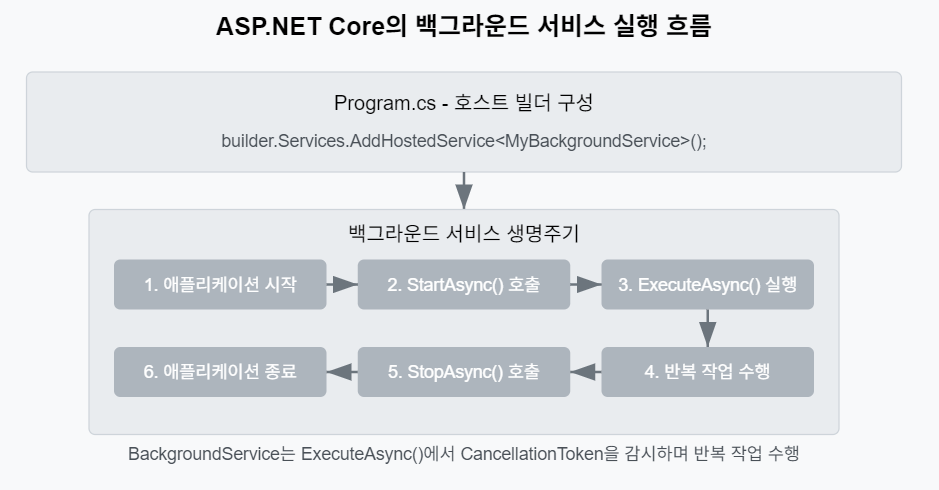

# ASP.NET Core Web API로 게임 서버 개발
  
저자: 최흥배, Claude AI   
-----------------------    
   
# 4부: 고급 기능 및 최적화
  
# Chapter 13. 비동기 작업 처리
    
## 게임 서버에서의 비동기 작업 필요성
수집형 RPG 게임에서는 즉시 처리할 필요가 없는 많은 작업이 존재한다. 예를 들어:

- 일일 리셋 처리
- 주간 랭킹 계산
- 이벤트 보상 지급
- 길드 전투 결과 정산
- 대량 푸시 알림 전송

이러한 작업을 API 요청 처리 흐름에서 동기적으로 수행하면 사용자 경험이 저하되고 서버 리소스가 비효율적으로 사용된다. 비동기 작업 처리는 이런 문제를 해결하기 위한 필수적인 기술이다.

```
🔍 게임 서버에서 비동기 처리가 필요한 경우
- 시간이 오래 걸리는 작업 (데이터 집계, 리포트 생성)
- 정해진 시간에 실행해야 하는 작업 (일일 리셋, 이벤트 시작/종료)
- 실패해도 재시도가 필요한 작업 (푸시 알림, 이메일 발송)
- 대량 데이터 처리 작업 (전체 유저 데이터 마이그레이션)
```
  

## 백그라운드 작업 구현

### IHostedService와 BackgroundService
ASP.NET Core에서는 `IHostedService` 인터페이스와 `BackgroundService` 추상 클래스를 사용하여 백그라운드 작업을 구현할 수 있다.  
  
  
  
아래는 간단한 백그라운드 서비스 구현 예시다:  
  
```csharp
public class DailyResetService : BackgroundService
{
    private readonly ILogger<DailyResetService> _logger;
    private readonly IServiceProvider _serviceProvider;
    
    public DailyResetService(
        ILogger<DailyResetService> logger,
        IServiceProvider serviceProvider)
    {
        _logger = logger;
        _serviceProvider = serviceProvider;
    }
    
    protected override async Task ExecuteAsync(CancellationToken stoppingToken)
    {
        while (!stoppingToken.IsCancellationRequested)
        {
            try
            {
                // 다음 리셋 시간까지 대기
                var now = DateTime.UtcNow;
                var resetTime = new DateTime(now.Year, now.Month, now.Day, 0, 0, 0, DateTimeKind.Utc)
                    .AddDays(now.Hour >= 0 ? 1 : 0);
                var delay = resetTime - now;
                
                _logger.LogInformation("다음 일일 리셋까지 {Delay} 대기", delay);
                await Task.Delay(delay, stoppingToken);
                
                // 스코프 생성하여 서비스 가져오기
                using var scope = _serviceProvider.CreateScope();
                var resetService = scope.ServiceProvider.GetRequiredService<IGameResetService>();
                
                // 일일 리셋 작업 수행
                await resetService.PerformDailyResetAsync(stoppingToken);
                _logger.LogInformation("일일 리셋 작업 완료: {Time}", DateTime.UtcNow);
            }
            catch (OperationCanceledException)
            {
                // 정상적인 취소 처리
                break;
            }
            catch (Exception ex)
            {
                _logger.LogError(ex, "일일 리셋 작업 중 오류 발생");
                // 오류 발생 시 1분 후 재시도
                await Task.Delay(TimeSpan.FromMinutes(1), stoppingToken);
            }
        }
    }
    
    public override Task StopAsync(CancellationToken cancellationToken)
    {
        _logger.LogInformation("일일 리셋 서비스 종료 중...");
        return base.StopAsync(cancellationToken);
    }
}
```

서비스 등록은 `Program.cs`에서 다음과 같이 한다:

```csharp
var builder = WebApplication.CreateBuilder(args);

// 백그라운드 서비스 등록
builder.Services.AddHostedService<DailyResetService>();

// 필요한 서비스 등록
builder.Services.AddScoped<IGameResetService, GameResetService>();

// 나머지 서비스 구성...
```

### 작업 큐 구현
백그라운드에서 순차적으로 처리해야 하는 작업들을 위한 간단한 작업 큐를 구현할 수 있다:

```csharp
public interface IBackgroundTaskQueue
{
    ValueTask QueueTaskAsync(Func<CancellationToken, ValueTask> workItem);
    ValueTask<Func<CancellationToken, ValueTask>> DequeueAsync(CancellationToken cancellationToken);
}

public class BackgroundTaskQueue : IBackgroundTaskQueue
{
    private readonly Channel<Func<CancellationToken, ValueTask>> _queue;
    
    public BackgroundTaskQueue(int capacity)
    {
        // 제한된 용량의 채널 생성
        var options = new BoundedChannelOptions(capacity)
        {
            FullMode = BoundedChannelFullMode.Wait
        };
        _queue = Channel.CreateBounded<Func<CancellationToken, ValueTask>>(options);
    }
    
    public async ValueTask QueueTaskAsync(Func<CancellationToken, ValueTask> workItem)
    {
        if (workItem is null)
        {
            throw new ArgumentNullException(nameof(workItem));
        }
        
        await _queue.Writer.WriteAsync(workItem);
    }
    
    public async ValueTask<Func<CancellationToken, ValueTask>> DequeueAsync(
        CancellationToken cancellationToken)
    {
        return await _queue.Reader.ReadAsync(cancellationToken);
    }
}
```

작업 큐 서비스:

```csharp
public class QueuedHostedService : BackgroundService
{
    private readonly ILogger<QueuedHostedService> _logger;
    private readonly IBackgroundTaskQueue _taskQueue;
    
    public QueuedHostedService(
        ILogger<QueuedHostedService> logger,
        IBackgroundTaskQueue taskQueue)
    {
        _logger = logger;
        _taskQueue = taskQueue;
    }
    
    protected override async Task ExecuteAsync(CancellationToken stoppingToken)
    {
        _logger.LogInformation("큐 처리 서비스 시작");
        
        await BackgroundProcessing(stoppingToken);
    }
    
    private async Task BackgroundProcessing(CancellationToken stoppingToken)
    {
        while (!stoppingToken.IsCancellationRequested)
        {
            try
            {
                var workItem = await _taskQueue.DequeueAsync(stoppingToken);
                
                await workItem(stoppingToken);
            }
            catch (OperationCanceledException)
            {
                // 정상적인 취소 처리
                break;
            }
            catch (Exception ex)
            {
                _logger.LogError(ex, "작업 처리 중 오류 발생");
            }
        }
    }
    
    public override async Task StopAsync(CancellationToken cancellationToken)
    {
        _logger.LogInformation("큐 처리 서비스 종료 중...");
        
        await base.StopAsync(cancellationToken);
    }
}
```

등록 및 사용:

```csharp
// Program.cs
builder.Services.AddSingleton<IBackgroundTaskQueue>(sp => 
    new BackgroundTaskQueue(100));
builder.Services.AddHostedService<QueuedHostedService>();

// 컨트롤러에서 사용
[ApiController]
[Route("api/[controller]")]
public class RewardController : ControllerBase
{
    private readonly IBackgroundTaskQueue _taskQueue;
    private readonly ILogger<RewardController> _logger;
    
    public RewardController(
        IBackgroundTaskQueue taskQueue,
        ILogger<RewardController> logger)
    {
        _taskQueue = taskQueue;
        _logger = logger;
    }
    
    [HttpPost("SendRewards")]
    public async Task<SendRewardsResponse> SendRewards([FromBody] SendRewardsRequest request)
    {
        // 작업을 큐에 추가
        await _taskQueue.QueueTaskAsync(async token =>
        {
            // CPU 집약적인 작업이나 시간이 오래 걸리는 작업
            await ProcessBulkRewards(request.UserIds, request.RewardId, token);
        });
        
        return new SendRewardsResponse
        {
            Result = true,
            Message = "보상 지급 작업이 큐에 추가되었습니다."
        };
    }
    
    private async Task ProcessBulkRewards(List<long> userIds, int rewardId, CancellationToken token)
    {
        _logger.LogInformation("대량 보상 처리 시작: {Count}명의 사용자, 보상 ID {RewardId}", 
            userIds.Count, rewardId);
            
        // 실제 보상 처리 로직...
        await Task.Delay(5000, token); // 예시 지연
        
        _logger.LogInformation("대량 보상 처리 완료");
    }
}

public class SendRewardsRequest
{
    public List<long> UserIds { get; set; } = new();
    public int RewardId { get; set; }
}

public class SendRewardsResponse
{
    public bool Result { get; set; }
    public string Message { get; set; } = string.Empty;
}
```
  

## Hangfire를 활용한 스케줄링
Hangfire는 ASP.NET Core 애플리케이션에서 백그라운드 작업을 쉽게 스케줄링하고 실행할 수 있는 강력한 라이브러리다.

### Hangfire 설치 및 설정

```csharp
// NuGet 패키지 설치
// dotnet add package Hangfire.Core
// dotnet add package Hangfire.AspNetCore
// dotnet add package Hangfire.MySqlStorage

// Program.cs에 Hangfire 서비스 등록
builder.Services.AddHangfire(configuration => configuration
    .SetDataCompatibilityLevel(CompatibilityLevel.Version_180)
    .UseSimpleAssemblyNameTypeSerializer()
    .UseRecommendedSerializerSettings()
    .UseStorage(new MySqlStorage(
        builder.Configuration.GetConnectionString("DefaultConnection"),
        new MySqlStorageOptions
        {
            TablesPrefix = "Hangfire_"
        }))
);

// Hangfire 서버 등록
builder.Services.AddHangfireServer(options =>
{
    options.WorkerCount = 10; // 작업자 스레드 수
    options.Queues = new[] { "default", "critical", "notifications" }; // 큐 우선순위
});

var app = builder.Build();

// 미들웨어 등록
app.UseHangfireDashboard("/hangfire", new DashboardOptions
{
    Authorization = new[] { new HangfireAuthorizationFilter() }
});

// 인증 필터 구현
public class HangfireAuthorizationFilter : IDashboardAuthorizationFilter
{
    public bool Authorize(DashboardContext context)
    {
        // 개발 환경에서는 모든 접근 허용
        var httpContext = context.GetHttpContext();
        return httpContext.Request.Host.Host.Equals("localhost", StringComparison.OrdinalIgnoreCase);
    }
}
```

### 작업 예약 및 관리
다양한 유형의 작업 스케줄링 방법:

```csharp
// 즉시 실행
BackgroundJob.Enqueue<IMailService>(x => x.SendMail("user@example.com", "제목", "내용"));

// 지연 실행 (30초 후)
BackgroundJob.Schedule<INotificationService>(
    x => x.SendPushNotification(1001, "게임 에너지가 다 찼습니다!"), 
    TimeSpan.FromSeconds(30));

// 반복 작업 (Cron 표현식)
RecurringJob.AddOrUpdate<IRankingService>(
    "weekly-ranking-calculation",
    x => x.CalculateWeeklyRanking(),
    Cron.Weekly(DayOfWeek.Monday, 0)); // 매주 월요일 자정
    
// 연속 작업 (이전 작업 완료 후 실행)
var jobId = BackgroundJob.Enqueue<IBattleService>(x => x.CalculateBattleResults(100));
BackgroundJob.ContinueJobWith<IRewardService>(
    jobId, 
    x => x.DistributeRewards(100));
```

실제 게임 서버에서 활용 예시:

```csharp
public class GameScheduleService : IGameScheduleService
{
    private readonly ILogger<GameScheduleService> _logger;
    
    public GameScheduleService(ILogger<GameScheduleService> logger)
    {
        _logger = logger;
    }
    
    public void SetupRecurringJobs()
    {
        // 일일 리셋 (매일 자정)
        RecurringJob.AddOrUpdate<IGameResetService>(
            "daily-reset",
            x => x.PerformDailyReset(),
            Cron.Daily);
            
        // 주간 랭킹 계산 (매주 일요일 23:50)
        RecurringJob.AddOrUpdate<IRankingService>(
            "weekly-ranking",
            x => x.ProcessWeeklyRanking(),
            Cron.Weekly(DayOfWeek.Sunday, 23, 50));
            
        // 길드 전투 시작 (매주 금요일 20:00)
        RecurringJob.AddOrUpdate<IGuildBattleService>(
            "guild-battle-start",
            x => x.StartGuildBattle(),
            Cron.Weekly(DayOfWeek.Friday, 20));
            
        // 길드 전투 종료 (매주 일요일 20:00)
        RecurringJob.AddOrUpdate<IGuildBattleService>(
            "guild-battle-end",
            x => x.EndGuildBattle(),
            Cron.Weekly(DayOfWeek.Sunday, 20));
            
        // 데이터 백업 (매일 04:00)
        RecurringJob.AddOrUpdate<IDataBackupService>(
            "daily-backup",
            x => x.PerformDailyBackup(),
            "0 4 * * *");
            
        _logger.LogInformation("모든 정기 작업 등록 완료");
    }
    
    public void ScheduleEventStart(int eventId, DateTime startTime)
    {
        var jobId = $"event-start-{eventId}";
        var delay = startTime - DateTime.UtcNow;
        
        if (delay < TimeSpan.Zero)
        {
            _logger.LogWarning("이벤트 {EventId}의 시작 시간이 이미 지났습니다", eventId);
            return;
        }
        
        BackgroundJob.Schedule<IEventService>(
            x => x.StartEvent(eventId),
            delay);
            
        _logger.LogInformation("이벤트 {EventId} 시작 예약: {StartTime}", eventId, startTime);
    }
    
    public void ScheduleEventEnd(int eventId, DateTime endTime)
    {
        var jobId = $"event-end-{eventId}";
        var delay = endTime - DateTime.UtcNow;
        
        if (delay < TimeSpan.Zero)
        {
            _logger.LogWarning("이벤트 {EventId}의 종료 시간이 이미 지났습니다", eventId);
            return;
        }
        
        BackgroundJob.Schedule<IEventService>(
            x => x.EndEvent(eventId),
            delay);
            
        _logger.LogInformation("이벤트 {EventId} 종료 예약: {EndTime}", eventId, endTime);
    }
}
```

Hangfire 대시보드 접근용 컨트롤러:

```csharp
[ApiController]
[Route("api/[controller]")]
public class AdminController : ControllerBase
{
    private readonly IGameScheduleService _scheduleService;
    
    public AdminController(IGameScheduleService scheduleService)
    {
        _scheduleService = scheduleService;
    }
    
    [HttpPost("ScheduleEvent")]
    public ScheduleEventResponse ScheduleEvent([FromBody] ScheduleEventRequest request)
    {
        _scheduleService.ScheduleEventStart(request.EventId, request.StartTime);
        _scheduleService.ScheduleEventEnd(request.EventId, request.EndTime);
        
        return new ScheduleEventResponse
        {
            Result = true,
            Message = "이벤트 스케줄링이 완료되었습니다."
        };
    }
}

public class ScheduleEventRequest
{
    public int EventId { get; set; }
    public DateTime StartTime { get; set; }
    public DateTime EndTime { get; set; }
}

public class ScheduleEventResponse
{
    public bool Result { get; set; }
    public string Message { get; set; } = string.Empty;
}
```
  

## 비동기 이벤트 처리 패턴
게임 서버에서는 다양한 이벤트가 발생하며, 이를 비동기적으로 처리하는 것이 중요하다. 여기서는 게임 서버에 적합한 이벤트 처리 패턴을 살펴본다.  
  
### 메모리 내 이벤트 버스 구현

```csharp
public interface IGameEvent
{
    Guid Id { get; }
    DateTime Timestamp { get; }
}

public class GameEventBase : IGameEvent
{
    public Guid Id { get; } = Guid.NewGuid();
    public DateTime Timestamp { get; } = DateTime.UtcNow;
}

public interface IGameEventHandler<TEvent> where TEvent : IGameEvent
{
    Task HandleAsync(TEvent @event, CancellationToken cancellationToken);
}

public interface IGameEventBus
{
    Task PublishAsync<TEvent>(TEvent @event, CancellationToken cancellationToken = default) 
        where TEvent : IGameEvent;
    void Subscribe<TEvent>(IGameEventHandler<TEvent> handler) 
        where TEvent : IGameEvent;
    void Unsubscribe<TEvent>(IGameEventHandler<TEvent> handler) 
        where TEvent : IGameEvent;
}

public class InMemoryGameEventBus : IGameEventBus
{
    private readonly Dictionary<Type, List<object>> _handlers = new();
    private readonly ILogger<InMemoryGameEventBus> _logger;
    private readonly IServiceProvider _serviceProvider;
    
    public InMemoryGameEventBus(
        ILogger<InMemoryGameEventBus> logger,
        IServiceProvider serviceProvider)
    {
        _logger = logger;
        _serviceProvider = serviceProvider;
    }
    
    public async Task PublishAsync<TEvent>(TEvent @event, CancellationToken cancellationToken = default)
        where TEvent : IGameEvent
    {
        var eventType = typeof(TEvent);
        
        _logger.LogDebug("이벤트 발행: {EventType}, ID: {@EventId}", eventType.Name, @event.Id);
        
        if (!_handlers.TryGetValue(eventType, out var handlers))
        {
            _logger.LogWarning("이벤트 {EventType}에 대한 핸들러가 없습니다", eventType.Name);
            return;
        }
        
        using var scope = _serviceProvider.CreateScope();
        
        var tasks = new List<Task>();
        foreach (var handler in handlers)
        {
            var handlerInstance = handler as IGameEventHandler<TEvent>;
            if (handlerInstance != null)
            {
                try
                {
                    tasks.Add(handlerInstance.HandleAsync(@event, cancellationToken));
                }
                catch (Exception ex)
                {
                    _logger.LogError(ex, "이벤트 {EventType} 처리 중 오류 발생", eventType.Name);
                }
            }
        }
        
        await Task.WhenAll(tasks);
    }
    
    public void Subscribe<TEvent>(IGameEventHandler<TEvent> handler) where TEvent : IGameEvent
    {
        var eventType = typeof(TEvent);
        
        if (!_handlers.ContainsKey(eventType))
        {
            _handlers[eventType] = new List<object>();
        }
        
        _handlers[eventType].Add(handler);
        _logger.LogDebug("핸들러 등록: {HandlerType} -> {EventType}", 
            handler.GetType().Name, eventType.Name);
    }
    
    public void Unsubscribe<TEvent>(IGameEventHandler<TEvent> handler) where TEvent : IGameEvent
    {
        var eventType = typeof(TEvent);
        
        if (!_handlers.ContainsKey(eventType))
        {
            return;
        }
        
        _handlers[eventType].Remove(handler);
        _logger.LogDebug("핸들러 제거: {HandlerType} -> {EventType}", 
            handler.GetType().Name, eventType.Name);
    }
}
```

이벤트 및 핸들러 예시:

```csharp
// 이벤트 정의
public class ItemPurchasedEvent : GameEventBase
{
    public long UserId { get; set; }
    public int ItemId { get; set; }
    public int Quantity { get; set; }
    public int Cost { get; set; }
    public string Currency { get; set; } = "Gold";
}

// 이벤트 핸들러
public class UserInventoryHandler : IGameEventHandler<ItemPurchasedEvent>
{
    private readonly IUserInventoryRepository _repository;
    private readonly ILogger<UserInventoryHandler> _logger;
    
    public UserInventoryHandler(
        IUserInventoryRepository repository,
        ILogger<UserInventoryHandler> logger)
    {
        _repository = repository;
        _logger = logger;
    }
    
    public async Task HandleAsync(ItemPurchasedEvent @event, CancellationToken cancellationToken)
    {
        _logger.LogInformation(
            "아이템 구매 이벤트 처리: 유저 {UserId}, 아이템 {ItemId}, 수량 {Quantity}",
            @event.UserId, @event.ItemId, @event.Quantity);
            
        try
        {
            await _repository.AddItemToUserInventoryAsync(
                @event.UserId, @event.ItemId, @event.Quantity, cancellationToken);
        }
        catch (Exception ex)
        {
            _logger.LogError(ex, "인벤토리 업데이트 중 오류 발생");
            // 여기서 보상 처리나 재시도 로직 추가
        }
    }
}

public class AchievementHandler : IGameEventHandler<ItemPurchasedEvent>
{
    private readonly IAchievementService _achievementService;
    private readonly ILogger<AchievementHandler> _logger;
    
    public AchievementHandler(
        IAchievementService achievementService,
        ILogger<AchievementHandler> logger)
    {
        _achievementService = achievementService;
        _logger = logger;
    }
    
    public async Task HandleAsync(ItemPurchasedEvent @event, CancellationToken cancellationToken)
    {
        _logger.LogInformation(
            "아이템 구매에 따른 업적 확인: 유저 {UserId}, 아이템 {ItemId}",
            @event.UserId, @event.ItemId);
            
        await _achievementService.CheckItemCollectionAchievementsAsync(
            @event.UserId, @event.ItemId, cancellationToken);
    }
}
```

서비스 등록 및 사용:

```csharp
// Program.cs
builder.Services.AddSingleton<IGameEventBus, InMemoryGameEventBus>();
builder.Services.AddScoped<IGameEventHandler<ItemPurchasedEvent>, UserInventoryHandler>();
builder.Services.AddScoped<IGameEventHandler<ItemPurchasedEvent>, AchievementHandler>();

// 컨트롤러에서 이벤트 발행
[ApiController]
[Route("api/[controller]")]
public class ShopController : ControllerBase
{
    private readonly IGameEventBus _eventBus;
    
    public ShopController(IGameEventBus eventBus)
    {
        _eventBus = eventBus;
    }
    
    [HttpPost("PurchaseItem")]
    public async Task<PurchaseItemResponse> PurchaseItem([FromBody] PurchaseItemRequest request)
    {
        // 구매 로직 처리...
        
        // 이벤트 발행
        await _eventBus.PublishAsync(new ItemPurchasedEvent
        {
            UserId = request.UserId,
            ItemId = request.ItemId,
            Quantity = request.Quantity,
            Cost = request.Cost,
            Currency = request.Currency
        });
        
        return new PurchaseItemResponse
        {
            Result = true,
            Message = "아이템 구매가 완료되었습니다."
        };
    }
}

public class PurchaseItemRequest
{
    public long UserId { get; set; }
    public int ItemId { get; set; }
    public int Quantity { get; set; } = 1;
    public int Cost { get; set; }
    public string Currency { get; set; } = "Gold";
}

public class PurchaseItemResponse
{
    public bool Result { get; set; }
    public string Message { get; set; } = string.Empty;
}
```

### Redis를 활용한 분산 이벤트 처리
여러 서버 인스턴스에서 이벤트를 공유해야 할 경우 Redis의 Pub/Sub 기능을 활용할 수 있다:

```csharp
public class RedisGameEventBus : IGameEventBus, IDisposable
{
    private readonly ILogger<RedisGameEventBus> _logger;
    private readonly IServiceProvider _serviceProvider;
    private readonly CloudStructures.Redis.RedisConnection _connection;
    private readonly ConnectionMultiplexer _multiplexer;
    private readonly ISubscriber _subscriber;
    private readonly Dictionary<Type, List<object>> _handlers = new();
    private readonly string _channelPrefix;
    private bool _disposed;
    
    public RedisGameEventBus(
        ILogger<RedisGameEventBus> logger,
        IServiceProvider serviceProvider,
        CloudStructures.Redis.RedisConnection connection,
        string channelPrefix = "game:events:")
    {
        _logger = logger;
        _serviceProvider = serviceProvider;
        _connection = connection;
        _channelPrefix = channelPrefix;
        
        // Redis 연결 및 구독 설정
        _multiplexer = _connection.ConnectionMultiplexer;
        _subscriber = _multiplexer.GetSubscriber();
    }
    
    public async Task PublishAsync<TEvent>(TEvent @event, CancellationToken cancellationToken = default)
        where TEvent : IGameEvent
    {
        var eventType = typeof(TEvent);
        var channelName = $"{_channelPrefix}{eventType.Name}";
        var eventJson = JsonSerializer.Serialize(@event);
        
        _logger.LogDebug("Redis 이벤트 발행: {Channel}, ID: {@EventId}", channelName, @event.Id);
        
        // Redis에 이벤트 발행
        await _subscriber.PublishAsync(channelName, eventJson);
        
        // 로컬 핸들러도 처리
        await ProcessLocalHandlersAsync(@event, cancellationToken);
    }
    
    private async Task ProcessLocalHandlersAsync<TEvent>(TEvent @event, CancellationToken cancellationToken)
        where TEvent : IGameEvent
    {
        var eventType = typeof(TEvent);
        
        if (!_handlers.TryGetValue(eventType, out var handlers))
        {
            return;
        }
        
        using var scope = _serviceProvider.CreateScope();
        
        var tasks = new List<Task>();
        foreach (var handler in handlers)
        {
            var handlerInstance = handler as IGameEventHandler<TEvent>;
            if (handlerInstance != null)
            {
                try
                {
                    tasks.Add(handlerInstance.HandleAsync(@event, cancellationToken));
                }
                catch (Exception ex)
                {
                    _logger.LogError(ex, "이벤트 {EventType} 처리 중 오류 발생", eventType.Name);
                }
            }
        }
        
        await Task.WhenAll(tasks);
    }
    
    public void Subscribe<TEvent>(IGameEventHandler<TEvent> handler) where TEvent : IGameEvent
    {
        var eventType = typeof(TEvent);
        var channelName = $"{_channelPrefix}{eventType.Name}";
        
        if (!_handlers.ContainsKey(eventType))
        {
            _handlers[eventType] = new List<object>();
            
            // Redis 채널 구독
            _subscriber.Subscribe(channelName, (channel, message) =>
            {
                try
                {
                    var @event = JsonSerializer.Deserialize<TEvent>(message);
                    if (@event != null)
                    {
                        // 비동기 처리 시작
                        _ = ProcessLocalHandlersAsync(@event, CancellationToken.None);
                    }
                }
                catch (Exception ex)
                {
                    _logger.LogError(ex, "Redis 메시지 처리 중 오류 발생: {Channel}", channel);
                }
            });
        }
        
        _handlers[eventType].Add(handler);
        _logger.LogDebug("Redis 이벤트 핸들러 등록: {HandlerType} -> {Channel}", 
            handler.GetType().Name, channelName);
    }
    
    public void Unsubscribe<TEvent>(IGameEventHandler<TEvent> handler) where TEvent : IGameEvent
    {
        var eventType = typeof(TEvent);
        
        if (!_handlers.ContainsKey(eventType))
        {
            return;
        }
        
        _handlers[eventType].Remove(handler);
        
        // 핸들러가 없으면 구독 취소
        if (_handlers[eventType].Count == 0)
        {
            var channelName = $"{_channelPrefix}{eventType.Name}";
            _subscriber.Unsubscribe(channelName);
            _handlers.Remove(eventType);
            
            _logger.LogDebug("Redis 채널 구독 취소: {Channel}", channelName);
        }
    }
    
    public void Dispose()
    {
        if (_disposed)
        {
            return;
        }
        
        _disposed = true;
        
        // 모든 구독 취소
        foreach (var eventType in _handlers.Keys)
        {
            var channelName = $"{_channelPrefix}{eventType.Name}";
            _subscriber.Unsubscribe(channelName);
        }
        
        _handlers.Clear();
    }
}
```

CloudStructures를 사용한 Redis 연결 설정:

```csharp
// Program.cs
// Redis 연결 설정
var redisConfig = new CloudStructures.RedisConfig("GameEvents", 
    builder.Configuration.GetConnectionString("RedisConnection"));
builder.Services.AddSingleton(new CloudStructures.Redis.RedisConnection(redisConfig));

// 이벤트 버스 등록
builder.Services.AddSingleton<IGameEventBus, RedisGameEventBus>();
```
  

## 실전 응용 예제
아래 예제는 비동기 작업, 스케줄링, 이벤트 처리를 종합적으로 활용하는 게임 서버 기능 구현이다.

### 길드 전투 자동화 시스템

```csharp
// 길드 전투 서비스
public interface IGuildBattleService
{
    Task StartGuildBattle();
    Task EndGuildBattle();
    Task ProcessRoundResults(int roundId);
}

public class GuildBattleService : IGuildBattleService
{
    private readonly ILogger<GuildBattleService> _logger;
    private readonly IGameEventBus _eventBus;
    private readonly IBackgroundTaskQueue _taskQueue;
    
    public GuildBattleService(
        ILogger<GuildBattleService> logger,
        IGameEventBus eventBus,
        IBackgroundTaskQueue taskQueue)
    {
        _logger = logger;
        _eventBus = eventBus;
        _taskQueue = taskQueue;
    }
    
    public async Task StartGuildBattle()
    {
        _logger.LogInformation("길드 전투 시작 처리");
        
        // 이벤트 발행
        await _eventBus.PublishAsync(new GuildBattleStartedEvent
        {
            BattleId = 123, // 실제로는 DB에서 가져온 값
            StartTime = DateTime.UtcNow,
            EndTime = DateTime.UtcNow.AddDays(2)
        });
        
        // 라운드별 스케줄링 (4시간마다 라운드 결과 처리)
        for (int i = 1; i <= 12; i++)
        {
            var roundId = i;
            var delay = TimeSpan.FromHours(4 * i);
            
            BackgroundJob.Schedule<IGuildBattleService>(
                x => x.ProcessRoundResults(roundId),
                delay);
        }
    }
    
    public async Task EndGuildBattle()
    {
        _logger.LogInformation("길드 전투 종료 처리");
        
        // 큐에 작업 추가 (CPU 집약적 작업)
        await _taskQueue.QueueTaskAsync(async token =>
        {
            _logger.LogInformation("길드 전투 최종 결과 계산 시작");
            
            // 길드 전투 결과 집계 (가정) - 시간이 오래 걸리는 작업
            await Task.Delay(10000, token);
            
            _logger.LogInformation("길드 전투 최종 결과 계산 완료");
            
            // 이벤트 발행
            await _eventBus.PublishAsync(new GuildBattleEndedEvent
            {
                BattleId = 123,
                WinnerGuildId = 456
            });
        });
        
        // 보상 지급 작업 예약 (길드 전투 종료 10분 후)
        BackgroundJob.Schedule<IRewardService>(
            x => x.DistributeGuildBattleRewards(123),
            TimeSpan.FromMinutes(10));
    }
    
    public async Task ProcessRoundResults(int roundId)
    {
        _logger.LogInformation("길드 전투 라운드 {RoundId} 결과 처리", roundId);
        
        // 라운드 결과 처리 로직...
        
        // 이벤트 발행
        await _eventBus.PublishAsync(new GuildBattleRoundEndedEvent
        {
            BattleId = 123,
            RoundId = roundId,
            NextRoundStartTime = roundId < 12 ? DateTime.UtcNow.AddHours(4) : null
        });
    }
}

// 이벤트 정의
public class GuildBattleStartedEvent : GameEventBase
{
    public int BattleId { get; set; }
    public DateTime StartTime { get; set; }
    public DateTime EndTime { get; set; }
}

public class GuildBattleRoundEndedEvent : GameEventBase
{
    public int BattleId { get; set; }
    public int RoundId { get; set; }
    public DateTime? NextRoundStartTime { get; set; }
}

public class GuildBattleEndedEvent : GameEventBase
{
    public int BattleId { get; set; }
    public int WinnerGuildId { get; set; }
}

// 이벤트 핸들러
public class NotificationHandler : IGameEventHandler<GuildBattleStartedEvent>,
                                  IGameEventHandler<GuildBattleRoundEndedEvent>,
                                  IGameEventHandler<GuildBattleEndedEvent>
{
    private readonly INotificationService _notificationService;
    private readonly ILogger<NotificationHandler> _logger;
    
    public NotificationHandler(
        INotificationService notificationService,
        ILogger<NotificationHandler> logger)
    {
        _notificationService = notificationService;
        _logger = logger;
    }
    
    public async Task HandleAsync(GuildBattleStartedEvent @event, CancellationToken cancellationToken)
    {
        _logger.LogInformation("길드 전투 시작 알림 전송");
        
        // 참가 길드원들에게 푸시 알림 전송
        await _notificationService.SendGuildBattleNotificationAsync(
            @event.BattleId,
            "길드 전투가 시작되었습니다!",
            "길드원들과 함께 전투에 참여하세요.",
            cancellationToken);
    }
    
    public async Task HandleAsync(GuildBattleRoundEndedEvent @event, CancellationToken cancellationToken)
    {
        _logger.LogInformation("길드 전투 라운드 {RoundId} 종료 알림 전송", @event.RoundId);
        
        var message = @event.NextRoundStartTime.HasValue
            ? $"다음 라운드는 {(@event.NextRoundStartTime.Value.ToLocalTime().ToString("HH:mm"))}에 시작됩니다."
            : "이번 라운드가 마지막 라운드입니다.";
            
        await _notificationService.SendGuildBattleNotificationAsync(
            @event.BattleId,
            $"길드 전투 라운드 {@event.RoundId} 종료",
            message,
            cancellationToken);
    }
    
    public async Task HandleAsync(GuildBattleEndedEvent @event, CancellationToken cancellationToken)
    {
        _logger.LogInformation("길드 전투 종료 알림 전송");
        
        await _notificationService.SendGuildBattleEndNotificationAsync(
            @event.BattleId,
            @event.WinnerGuildId,
            cancellationToken);
    }
}

// .http 파일 예시
// @host = https://localhost:5001
// @content-type = application/json

### 길드 전투 시작 예약
POST {{host}}/api/GuildBattle/ScheduleStart
Content-Type: {{content-type}}

{
  "battleId": 123,
  "startTime": "2025-05-02T20:00:00Z",
  "endTime": "2025-05-04T20:00:00Z"
}

### 길드 전투 수동 시작
POST {{host}}/api/GuildBattle/Start
Content-Type: {{content-type}}

{
  "battleId": 123
}

### 길드 전투 수동 종료
POST {{host}}/api/GuildBattle/End
Content-Type: {{content-type}}

{
  "battleId": 123
}

### 길드 전투 상태 확인
POST {{host}}/api/GuildBattle/Status
Content-Type: {{content-type}}

{
  "battleId": 123
}
```

### 컨트롤러 구현

```csharp
[ApiController]
[Route("api/[controller]")]
public class GuildBattleController : ControllerBase
{
    private readonly IGuildBattleService _guildBattleService;
    private readonly IGameScheduleService _scheduleService;
    
    public GuildBattleController(
        IGuildBattleService guildBattleService,
        IGameScheduleService scheduleService)
    {
        _guildBattleService = guildBattleService;
        _scheduleService = scheduleService;
    }
    
    [HttpPost("ScheduleStart")]
    public GuildBattleResponse ScheduleStart([FromBody] ScheduleGuildBattleRequest request)
    {
        // Hangfire를 사용하여 길드 전투 시작 일정 예약
        BackgroundJob.Schedule<IGuildBattleService>(
            x => x.StartGuildBattle(),
            request.StartTime - DateTime.UtcNow);
            
        // 길드 전투 종료 일정 예약
        BackgroundJob.Schedule<IGuildBattleService>(
            x => x.EndGuildBattle(),
            request.EndTime - DateTime.UtcNow);
            
        return new GuildBattleResponse
        {
            Result = true,
            Message = "길드 전투 일정이 예약되었습니다."
        };
    }
    
    [HttpPost("Start")]
    public async Task<GuildBattleResponse> Start([FromBody] GuildBattleRequest request)
    {
        await _guildBattleService.StartGuildBattle();
        
        return new GuildBattleResponse
        {
            Result = true,
            Message = "길드 전투가 시작되었습니다."
        };
    }
    
    [HttpPost("End")]
    public async Task<GuildBattleResponse> End([FromBody] GuildBattleRequest request)
    {
        await _guildBattleService.EndGuildBattle();
        
        return new GuildBattleResponse
        {
            Result = true,
            Message = "길드 전투가 종료되었습니다."
        };
    }
    
    [HttpPost("Status")]
    public GuildBattleStatusResponse Status([FromBody] GuildBattleRequest request)
    {
        // 실제로는 DB에서 상태 조회
        
        return new GuildBattleStatusResponse
        {
            BattleId = request.BattleId,
            Status = "Active",
            CurrentRound = 3,
            NextRoundTime = DateTime.UtcNow.AddHours(1),
            ParticipatingGuilds = 24,
            TopGuild = new GuildInfo { Id = 456, Name = "드래곤 슬레이어" }
        };
    }
}

public class ScheduleGuildBattleRequest
{
    public int BattleId { get; set; }
    public DateTime StartTime { get; set; }
    public DateTime EndTime { get; set; }
}

public class GuildBattleRequest
{
    public int BattleId { get; set; }
}

public class GuildBattleResponse
{
    public bool Result { get; set; }
    public string Message { get; set; } = string.Empty;
}

public class GuildBattleStatusResponse
{
    public int BattleId { get; set; }
    public string Status { get; set; } = string.Empty;
    public int CurrentRound { get; set; }
    public DateTime? NextRoundTime { get; set; }
    public int ParticipatingGuilds { get; set; }
    public GuildInfo? TopGuild { get; set; }
}

public class GuildInfo
{
    public int Id { get; set; }
    public string Name { get; set; } = string.Empty;
}
```

비동기 작업 처리, Hangfire 스케줄링, 이벤트 처리 패턴은 게임 서버의 효율성과 확장성을 크게 향상시킨다. 이러한 패턴들을 적절히 조합하여 사용하면 사용자 경험을 저해하지 않으면서도 복잡한 게임 로직을 처리할 수 있다.

게임 서버 개발에서 비동기 작업 처리는 필수적인 부분이며, ASP.NET Core는 이를 위한 다양한 도구와 라이브러리를 제공한다. 이 장에서 설명한 패턴과 기법들을 활용하여 효율적이고 확장 가능한 게임 서버를 구축할 수 있다.   
  
  


   