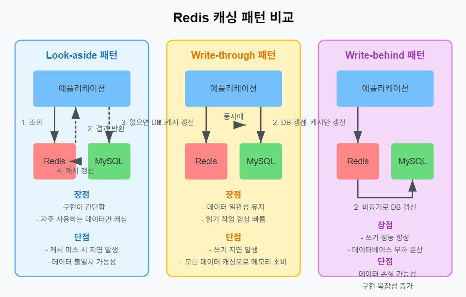

# ASP.NET Core Web API로 게임 서버 개발
  
저자: 최흥배, Claude AI   
-----------------------    
   
# Chapter 14. 성능 최적화 기법
  
## 게임 서버 성능 최적화의 중요성
수집형 RPG 게임은 동시에 많은 사용자가 접속하여 다양한 요청을 보내는 특성을 가진다. 특히 다음과 같은 상황에서 서버 부하가 급증하는 경향이 있다:

- 이벤트 시작 시점
- 출석 보상 갱신 시간
- 길드 전투 시작/종료 시점
- 랭킹 집계 시점
- 신규 콘텐츠 업데이트 직후

이러한 상황에서 서버가 응답 지연이나 오류를 일으키면 사용자 경험이 크게 저하되고, 이탈까지 이어질 수 있다. 따라서 게임 서버의 성능 최적화는 서비스 성공의 핵심 요소이다.  
   
    
## N+1 쿼리 문제 해결

### N+1 쿼리 문제란?
N+1 쿼리 문제는 데이터베이스에서 관련 데이터를 조회할 때 발생하는 성능 저하 패턴이다. 기본적으로 다음과 같은 과정으로 발생한다:

1. 먼저 N개의 부모 엔티티를 조회한다 (1개의 쿼리).
2. 각 부모 엔티티마다 자식 엔티티를 별도로 조회한다 (N개의 쿼리).
3. 결과적으로 총 N+1개의 쿼리가 실행된다.

게임 서버에서 흔히 볼 수 있는 N+1 쿼리 시나리오는 다음과 같다:

- 길드 멤버 목록 조회: 먼저 길드 목록을 가져온 후 각 길드별로 멤버 정보를 조회
- 인벤토리 아이템 로딩: 사용자 인벤토리 목록을 가져온 후 각 인벤토리 항목별로 아이템 상세 정보 조회
- 친구 목록 조회: 친구 관계 목록을 가져온 후 각 친구마다 사용자 정보 조회
- 퀘스트 진행 상황: 사용자의 퀘스트 목록을 가져온 후 각 퀘스트별 상세 정보 조회


### SqlKata에서 N+1 문제 예시
다음은 길드 멤버 정보를 조회할 때 발생하는 N+1 문제 예시다:

```csharp
// N+1 문제가 발생하는 코드
public async Task<List<GuildWithMembersResponse>> GetAllGuildsWithMembersAsync()
{
    // 1개 쿼리: 모든 길드 조회
    var guilds = await _queryFactory
        .Query("guilds")
        .Select("guild_id", "guild_name", "level", "created_at")
        .GetAsync<GuildInfo>();
    
    // 각 길드마다 별도 쿼리 실행 (N개 쿼리)
    var result = new List<GuildWithMembersResponse>();
    foreach (var guild in guilds)
    {
        var members = await _queryFactory
            .Query("guild_members")
            .Where("guild_id", guild.GuildId)
            .Join("users", "users.user_id", "guild_members.user_id")
            .Select("users.user_id", "users.nickname", "guild_members.role", "users.level")
            .GetAsync<GuildMemberInfo>();
        
        result.Add(new GuildWithMembersResponse
        {
            GuildId = guild.GuildId,
            GuildName = guild.GuildName,
            Level = guild.Level,
            CreatedAt = guild.CreatedAt,
            Members = members.ToList()
        });
    }
    
    return result;
}
```

### N+1 문제 해결 방법

#### 1. Join 쿼리 사용
가장 기본적인 해결책은 단일 Join 쿼리를 사용하는 것이다:

```csharp
// Join을 사용한 해결책
public async Task<List<GuildWithMembersResponse>> GetAllGuildsWithMembersAsync()
{
    // 단일 쿼리로 모든 데이터를 가져온다
    var results = await _queryFactory
        .Query("guilds")
        .Select(
            "guilds.guild_id",
            "guilds.guild_name",
            "guilds.level as guild_level",
            "guilds.created_at",
            "users.user_id",
            "users.nickname",
            "users.level as user_level",
            "guild_members.role"
        )
        .LeftJoin("guild_members", "guild_members.guild_id", "guilds.guild_id")
        .LeftJoin("users", "users.user_id", "guild_members.user_id")
        .GetAsync<dynamic>();
    
    // 결과를 메모리에서 그룹화하여 구조화
    var groupedResults = results
        .GroupBy(r => (int)r.guild_id)
        .Select(g => new GuildWithMembersResponse
        {
            GuildId = g.Key,
            GuildName = g.First().guild_name,
            Level = g.First().guild_level,
            CreatedAt = g.First().created_at,
            Members = g.Where(r => r.user_id != null)
                       .Select(r => new GuildMemberInfo
                       {
                           UserId = r.user_id,
                           Nickname = r.nickname,
                           Level = r.user_level,
                           Role = r.role
                       }).ToList()
        })
        .ToList();
    
    return groupedResults;
}
```

#### 2. 일괄 로딩(Batch Loading) 패턴
모든 자식 엔티티를 한 번에 로드한 후 메모리에서 관계를 설정하는 방법이다:

```csharp
// 일괄 로딩 패턴
public async Task<List<GuildWithMembersResponse>> GetAllGuildsWithMembersAsync()
{
    // 1. 모든 길드 조회 (1개 쿼리)
    var guilds = await _queryFactory
        .Query("guilds")
        .Select("guild_id", "guild_name", "level", "created_at")
        .GetAsync<GuildInfo>();
    
    // 길드 ID 목록 추출
    var guildIds = guilds.Select(g => g.GuildId).ToList();
    
    // 2. 모든 길드 멤버 한 번에 조회 (1개 쿼리)
    var allMembers = await _queryFactory
        .Query("guild_members")
        .WhereIn("guild_id", guildIds)
        .Join("users", "users.user_id", "guild_members.user_id")
        .Select("guild_members.guild_id", "users.user_id", "users.nickname", 
                "guild_members.role", "users.level")
        .GetAsync<GuildMemberInfo>();
    
    // 길드 ID별로 멤버 그룹화
    var membersByGuildId = allMembers.GroupBy(m => m.GuildId)
                                    .ToDictionary(g => g.Key, g => g.ToList());
    
    // 3. 결과 조합
    var result = guilds.Select(guild => new GuildWithMembersResponse
    {
        GuildId = guild.GuildId,
        GuildName = guild.GuildName,
        Level = guild.Level,
        CreatedAt = guild.CreatedAt,
        Members = membersByGuildId.ContainsKey(guild.GuildId) 
                  ? membersByGuildId[guild.GuildId] 
                  : new List<GuildMemberInfo>()
    }).ToList();
    
    return result;
}
```

#### 3. 저장 프로시저 사용
복잡한 데이터 조회에는 저장 프로시저를 활용할 수도 있다:

```csharp
// 저장 프로시저 정의
/*
CREATE PROCEDURE GetGuildsWithMembers()
BEGIN
    -- 길드 정보 임시 테이블 생성
    CREATE TEMPORARY TABLE temp_guilds AS
    SELECT guild_id, guild_name, level, created_at
    FROM guilds;
    
    -- 멤버 정보 임시 테이블 생성
    CREATE TEMPORARY TABLE temp_members AS
    SELECT gm.guild_id, u.user_id, u.nickname, u.level, gm.role
    FROM guild_members gm
    JOIN users u ON u.user_id = gm.user_id;
    
    -- 길드 정보 반환
    SELECT * FROM temp_guilds;
    
    -- 멤버 정보 반환
    SELECT * FROM temp_members;
    
    -- 임시 테이블 삭제
    DROP TEMPORARY TABLE temp_guilds;
    DROP TEMPORARY TABLE temp_members;
END
*/

// 저장 프로시저 호출 코드
public async Task<List<GuildWithMembersResponse>> GetAllGuildsWithMembersAsync()
{
    using (var connection = new MySqlConnection(_connectionString))
    {
        await connection.OpenAsync();
        
        using (var command = new MySqlCommand("GetGuildsWithMembers", connection))
        {
            command.CommandType = CommandType.StoredProcedure;
            
            using (var reader = await command.ExecuteReaderAsync())
            {
                // 길드 정보 읽기
                var guilds = new List<GuildInfo>();
                while (await reader.ReadAsync())
                {
                    guilds.Add(new GuildInfo
                    {
                        GuildId = reader.GetInt32("guild_id"),
                        GuildName = reader.GetString("guild_name"),
                        Level = reader.GetInt32("level"),
                        CreatedAt = reader.GetDateTime("created_at")
                    });
                }
                
                // 다음 결과셋으로 이동 (멤버 정보)
                await reader.NextResultAsync();
                
                // 멤버 정보 읽기
                var allMembers = new List<GuildMemberInfo>();
                while (await reader.ReadAsync())
                {
                    allMembers.Add(new GuildMemberInfo
                    {
                        GuildId = reader.GetInt32("guild_id"),
                        UserId = reader.GetInt64("user_id"),
                        Nickname = reader.GetString("nickname"),
                        Level = reader.GetInt32("level"),
                        Role = reader.GetString("role")
                    });
                }
                
                // 결과 조합
                var membersByGuildId = allMembers.GroupBy(m => m.GuildId)
                                              .ToDictionary(g => g.Key, g => g.ToList());
                
                var result = guilds.Select(guild => new GuildWithMembersResponse
                {
                    GuildId = guild.GuildId,
                    GuildName = guild.GuildName,
                    Level = guild.Level,
                    CreatedAt = guild.CreatedAt,
                    Members = membersByGuildId.ContainsKey(guild.GuildId) 
                              ? membersByGuildId[guild.GuildId] 
                              : new List<GuildMemberInfo>()
                }).ToList();
                
                return result;
            }
        }
    }
}
```
  

## 효율적인 Redis 캐싱 전략

### Redis 캐싱의 중요성
게임 서버에서 Redis 캐싱이 중요한 이유는 다음과 같다:

1. **데이터베이스 부하 감소**: 자주 요청되는 데이터를 캐싱하여 DB 쿼리 횟수 감소
2. **응답 시간 단축**: 메모리 기반 캐싱으로 응답 시간 대폭 단축 (1-2ms)
3. **확장성 향상**: 사용자가 증가해도 안정적인 성능 유지
4. **실시간 데이터 처리**: 랭킹, 알림 등 실시간 기능 구현에 적합
  
 
  

### CloudStructures 설정 및 기본 사용법
CloudStructures는 StackExchange.Redis를 기반으로 하는 타입 안전한 Redis 클라이언트다. 게임 서버에 CloudStructures를 설정하는 방법은 다음과 같다:

```csharp
// Program.cs
using CloudStructures;
using CloudStructures.Redis;

var builder = WebApplication.CreateBuilder(args);

// Redis 설정
var redisConfig = new RedisConfig(
    "GameServer", // 연결 이름
    builder.Configuration.GetConnectionString("RedisConnection"), // 연결 문자열
    new RedisOptions
    {
        ConnectTimeout = 5000, // 연결 타임아웃
        SyncTimeout = 5000, // 동기 작업 타임아웃
        AsyncTimeout = 5000, // 비동기 작업 타임아웃
        AllowAdmin = true, // 관리자 명령 허용
        AbortOnConnectFail = false, // 연결 실패 시 작업 중단 여부
        ConnectRetry = 3, // 연결 재시도 횟수
        PoolSize = 50 // 연결 풀 크기
    });

builder.Services.AddSingleton(new RedisConnection(redisConfig));
builder.Services.AddSingleton<ICacheService, RedisCacheService>();
```

기본적인 RedisCache 서비스 구현:

```csharp
public interface ICacheService
{
    Task<T?> GetAsync<T>(string key, CancellationToken cancellationToken = default);
    Task<bool> SetAsync<T>(string key, T value, TimeSpan? expiry = null, CancellationToken cancellationToken = default);
    Task<bool> RemoveAsync(string key, CancellationToken cancellationToken = default);
    Task<bool> ExistsAsync(string key, CancellationToken cancellationToken = default);
    Task<long> IncrementAsync(string key, long value = 1, TimeSpan? expiry = null, CancellationToken cancellationToken = default);
}

public class RedisCacheService : ICacheService
{
    private readonly RedisConnection _connection;
    private readonly ILogger<RedisCacheService> _logger;
    
    public RedisCacheService(
        RedisConnection connection,
        ILogger<RedisCacheService> logger)
    {
        _connection = connection;
        _logger = logger;
    }
    
    public async Task<T?> GetAsync<T>(string key, CancellationToken cancellationToken = default)
    {
        try
        {
            var redis = new RedisString<T>(_connection, key, null);
            var result = await redis.GetAsync(cancellationToken);
            return result.HasValue ? result.Value : default;
        }
        catch (Exception ex)
        {
            _logger.LogError(ex, "Redis GetAsync 오류: {Key}", key);
            return default;
        }
    }
    
    public async Task<bool> SetAsync<T>(string key, T value, TimeSpan? expiry = null, CancellationToken cancellationToken = default)
    {
        try
        {
            var redis = new RedisString<T>(_connection, key, expiry);
            return await redis.SetAsync(value, expiry, When.Always, cancellationToken);
        }
        catch (Exception ex)
        {
            _logger.LogError(ex, "Redis SetAsync 오류: {Key}", key);
            return false;
        }
    }
    
    public async Task<bool> RemoveAsync(string key, CancellationToken cancellationToken = default)
    {
        try
        {
            var redis = new RedisString<string>(_connection, key, null);
            return await redis.DeleteAsync(cancellationToken);
        }
        catch (Exception ex)
        {
            _logger.LogError(ex, "Redis RemoveAsync 오류: {Key}", key);
            return false;
        }
    }
    
    public async Task<bool> ExistsAsync(string key, CancellationToken cancellationToken = default)
    {
        try
        {
            return await _connection.GetDatabase().KeyExistsAsync(key);
        }
        catch (Exception ex)
        {
            _logger.LogError(ex, "Redis ExistsAsync 오류: {Key}", key);
            return false;
        }
    }
    
    public async Task<long> IncrementAsync(string key, long value = 1, TimeSpan? expiry = null, CancellationToken cancellationToken = default)
    {
        try
        {
            var result = await _connection.GetDatabase().StringIncrementAsync(key, value);
            
            if (expiry.HasValue)
            {
                await _connection.GetDatabase().KeyExpireAsync(key, expiry);
            }
            
            return result;
        }
        catch (Exception ex)
        {
            _logger.LogError(ex, "Redis IncrementAsync 오류: {Key}", key);
            return 0;
        }
    }
}
```

### 게임 데이터별 캐싱 전략

#### 1. 유저 프로필 캐싱
유저 프로필은 자주 접근되지만 변경이 적은 데이터로, Look-aside 패턴이 적합하다:

```csharp
public class UserProfileRepository : IUserProfileRepository
{
    private readonly QueryFactory _queryFactory;
    private readonly ICacheService _cacheService;
    private readonly ILogger<UserProfileRepository> _logger;
    private static readonly TimeSpan CacheExpiry = TimeSpan.FromHours(1);
    
    public UserProfileRepository(
        QueryFactory queryFactory,
        ICacheService cacheService,
        ILogger<UserProfileRepository> logger)
    {
        _queryFactory = queryFactory;
        _cacheService = cacheService;
        _logger = logger;
    }
    
    public async Task<UserProfile?> GetUserProfileAsync(long userId)
    {
        // 캐시 키 생성
        string cacheKey = $"user:profile:{userId}";
        
        // 1. 캐시에서 조회
        var cachedProfile = await _cacheService.GetAsync<UserProfile>(cacheKey);
        if (cachedProfile != null)
        {
            _logger.LogDebug("캐시에서 유저 프로필 조회: {UserId}", userId);
            return cachedProfile;
        }
        
        // 2. DB에서 조회
        _logger.LogDebug("DB에서 유저 프로필 조회: {UserId}", userId);
        var profile = await _queryFactory
            .Query("users")
            .Where("user_id", userId)
            .Select("user_id", "nickname", "level", "exp", "avatar_id", "created_at", "last_login_at")
            .FirstOrDefaultAsync<UserProfile>();
        
        // 3. 캐시에 저장
        if (profile != null)
        {
            await _cacheService.SetAsync(cacheKey, profile, CacheExpiry);
        }
        
        return profile;
    }
    
    public async Task UpdateUserProfileAsync(UserProfile profile)
    {
        // 1. DB 업데이트
        await _queryFactory
            .Query("users")
            .Where("user_id", profile.UserId)
            .UpdateAsync(new
            {
                nickname = profile.Nickname,
                level = profile.Level,
                exp = profile.Exp,
                avatar_id = profile.AvatarId,
                last_login_at = profile.LastLoginAt
            });
        
        // 2. 캐시 업데이트
        string cacheKey = $"user:profile:{profile.UserId}";
        await _cacheService.SetAsync(cacheKey, profile, CacheExpiry);
    }
    
    public async Task InvalidateUserProfileCacheAsync(long userId)
    {
        string cacheKey = $"user:profile:{userId}";
        await _cacheService.RemoveAsync(cacheKey);
    }
}
```

#### 2. 게임 아이템 정보 캐싱
아이템 마스터 데이터는 변경이 거의 없지만 자주 접근되므로, 애플리케이션 시작 시 미리 로드하여 영구 캐싱하는 전략이 효과적이다:

```csharp
public class GameItemRepository : IGameItemRepository
{
    private readonly QueryFactory _queryFactory;
    private readonly ICacheService _cacheService;
    private readonly ILogger<GameItemRepository> _logger;
    // 아이템 데이터는 변경이 거의 없으므로 긴 만료 시간 설정
    private static readonly TimeSpan CacheExpiry = TimeSpan.FromDays(1);
    
    public GameItemRepository(
        QueryFactory queryFactory,
        ICacheService cacheService,
        ILogger<GameItemRepository> logger)
    {
        _queryFactory = queryFactory;
        _cacheService = cacheService;
        _logger = logger;
    }
    
    public async Task<GameItem?> GetItemAsync(int itemId)
    {
        string cacheKey = $"item:{itemId}";
        
        var cachedItem = await _cacheService.GetAsync<GameItem>(cacheKey);
        if (cachedItem != null)
        {
            return cachedItem;
        }
        
        var item = await _queryFactory
            .Query("items")
            .Where("item_id", itemId)
            .FirstOrDefaultAsync<GameItem>();
        
        if (item != null)
        {
            await _cacheService.SetAsync(cacheKey, item, CacheExpiry);
        }
        
        return item;
    }
    
    public async Task PreloadAllItemsAsync()
    {
        _logger.LogInformation("모든 아이템 데이터 프리로딩 시작");
        
        var allItems = await _queryFactory
            .Query("items")
            .GetAsync<GameItem>();
        
        foreach (var item in allItems)
        {
            string cacheKey = $"item:{item.ItemId}";
            await _cacheService.SetAsync(cacheKey, item, CacheExpiry);
        }
        
        // 아이템 목록도 캐싱
        await _cacheService.SetAsync("items:all", allItems, CacheExpiry);
        
        _logger.LogInformation("모든 아이템 데이터 프리로딩 완료: {Count}개", allItems.Count());
    }
    
    public async Task<IEnumerable<GameItem>> GetAllItemsAsync()
    {
        var cachedItems = await _cacheService.GetAsync<IEnumerable<GameItem>>("items:all");
        if (cachedItems != null)
        {
            return cachedItems;
        }
        
        return await _queryFactory.Query("items").GetAsync<GameItem>();
    }
    
    public async Task InvalidateItemCacheAsync(int itemId)
    {
        await _cacheService.RemoveAsync($"item:{itemId}");
        await _cacheService.RemoveAsync("items:all");
    }
}
```

서비스 초기화 시 프리로딩:

```csharp
// Program.cs
var app = builder.Build();

// 애플리케이션 시작 시 아이템 데이터 프리로딩
using (var scope = app.Services.CreateScope())
{
    var itemRepository = scope.ServiceProvider.GetRequiredService<IGameItemRepository>();
    await itemRepository.PreloadAllItemsAsync();
}
```

#### 3. 유저 인벤토리 캐싱
자주 변경되는 인벤토리에는 Write-through 패턴이 적합하다:

```csharp
public class UserInventoryRepository : IUserInventoryRepository
{
    private readonly QueryFactory _queryFactory;
    private readonly ICacheService _cacheService;
    private readonly ILogger<UserInventoryRepository> _logger;
    private static readonly TimeSpan CacheExpiry = TimeSpan.FromMinutes(30);
    
    public UserInventoryRepository(
        QueryFactory queryFactory,
        ICacheService cacheService,
        ILogger<UserInventoryRepository> logger)
    {
        _queryFactory = queryFactory;
        _cacheService = cacheService;
        _logger = logger;
    }
    
    public async Task<List<UserInventoryItem>> GetUserInventoryAsync(long userId)
    {
        string cacheKey = $"user:{userId}:inventory";
        
        var cachedInventory = await _cacheService.GetAsync<List<UserInventoryItem>>(cacheKey);
        if (cachedInventory != null)
        {
            return cachedInventory;
        }
        
        var inventory = await _queryFactory
            .Query("user_inventory")
            .Where("user_id", userId)
            .GetAsync<UserInventoryItem>();
        
        var result = inventory.ToList();
        await _cacheService.SetAsync(cacheKey, result, CacheExpiry);
        
        return result;
    }
    
    public async Task AddItemToUserInventoryAsync(long userId, int itemId, int quantity)
    {
        // 기존 인벤토리 조회
        var inventory = await GetUserInventoryAsync(userId);
        var existingItem = inventory.FirstOrDefault(i => i.ItemId == itemId);
        
        if (existingItem != null)
        {
            // 1. 기존 아이템 수량 업데이트 (DB)
            await _queryFactory
                .Query("user_inventory")
                .Where("inventory_id", existingItem.InventoryId)
                .UpdateAsync(new { quantity = existingItem.Quantity + quantity });
            
            // 2. 캐시 업데이트
            existingItem.Quantity += quantity;
        }
        else
        {
            // 1. 새 아이템 추가 (DB)
            var newInventoryId = await _queryFactory
                .Query("user_inventory")
                .InsertGetIdAsync<long>(new
                {
                    user_id = userId,
                    item_id = itemId,
                    quantity = quantity,
                    created_at = DateTime.UtcNow
                });
            
            // 2. 캐시 업데이트
            inventory.Add(new UserInventoryItem
            {
                InventoryId = newInventoryId,
                UserId = userId,
                ItemId = itemId,
                Quantity = quantity,
                CreatedAt = DateTime.UtcNow
            });
        }
        
        // 3. 캐시 갱신
        string cacheKey = $"user:{userId}:inventory";
        await _cacheService.SetAsync(cacheKey, inventory, CacheExpiry);
    }
    
    public async Task RemoveItemFromUserInventoryAsync(long userId, int itemId, int quantity)
    {
        // 기존 인벤토리 조회
        var inventory = await GetUserInventoryAsync(userId);
        var existingItem = inventory.FirstOrDefault(i => i.ItemId == itemId);
        
        if (existingItem == null || existingItem.Quantity < quantity)
        {
            throw new InvalidOperationException("인벤토리에 충분한 아이템이 없습니다.");
        }
        
        if (existingItem.Quantity > quantity)
        {
            // 1. 아이템 수량 감소 (DB)
            await _queryFactory
                .Query("user_inventory")
                .Where("inventory_id", existingItem.InventoryId)
                .UpdateAsync(new { quantity = existingItem.Quantity - quantity });
            
            // 2. 캐시 업데이트
            existingItem.Quantity -= quantity;
        }
        else
        {
            // 1. 아이템 삭제 (DB)
            await _queryFactory
                .Query("user_inventory")
                .Where("inventory_id", existingItem.InventoryId)
                .DeleteAsync();
            
            // 2. 캐시 업데이트
            inventory.Remove(existingItem);
        }
        
        // 3. 캐시 갱신
        string cacheKey = $"user:{userId}:inventory";
        await _cacheService.SetAsync(cacheKey, inventory, CacheExpiry);
    }
}
```

#### 4. 랭킹 데이터 캐싱
랭킹 시스템에는 Redis의 Sorted Set 기능을 활용한다:  

```csharp
public class RankingService : IRankingService
{
    private readonly RedisConnection _redisConnection;
    private readonly QueryFactory _queryFactory;
    private readonly ILogger<RankingService> _logger;
    
    // 랭킹 갱신 주기
    private static readonly TimeSpan RankingExpiry = TimeSpan.FromHours(1);
    
    public RankingService(
        RedisConnection redisConnection,
        QueryFactory queryFactory,
        ILogger<RankingService> logger)
    {
        _redisConnection = redisConnection;
        _queryFactory = queryFactory;
        _logger = logger;
    }
    
    public async Task UpdateUserScoreAsync(long userId, long score, RankingType rankingType)
    {
        string key = GetRankingKey(rankingType);
        var db = _redisConnection.GetDatabase();
        
        // Redis Sorted Set에 점수 업데이트
        await db.SortedSetAddAsync(key, userId.ToString(), score);
        
        // 만료 시간 설정 (선택적)
        await db.KeyExpireAsync(key, RankingExpiry);
    }
    
    public async Task<List<RankingEntry>> GetTopRankingsAsync(RankingType rankingType, int count = 100)
    {
        string key = GetRankingKey(rankingType);
        var db = _redisConnection.GetDatabase();
        
        // Redis Sorted Set에서 상위 랭킹 조회 (내림차순)
        var entries = await db.SortedSetRangeByRankWithScoresAsync(key, 0, count - 1, Order.Descending);
        
        if (entries.Length == 0)
        {
            // 랭킹 데이터가 없으면 DB에서 로드
            await RefreshRankingFromDatabaseAsync(rankingType);
            entries = await db.SortedSetRangeByRankWithScoresAsync(key, 0, count - 1, Order.Descending);
        }
        
        // 사용자 ID 목록 추출
        var userIds = entries.Select(e => long.Parse(e.Element)).ToList();
        
        // 사용자 정보 일괄 조회
        var userProfiles = await _queryFactory
            .Query("users")
            .WhereIn("user_id", userIds)
            .Select("user_id", "nickname", "level", "avatar_id")
            .GetAsync<UserBasicInfo>();
        
        var userProfileMap = userProfiles.ToDictionary(u => u.UserId);
        
        // 랭킹 목록 구성
        var result = new List<RankingEntry>();
        int rank = 1;
        
        foreach (var entry in entries)
        {
            var userId = long.Parse(entry.Element);
            
            if (userProfileMap.TryGetValue(userId, out var userProfile))
            {
                result.Add(new RankingEntry
                {
                    Rank = rank++,
                    UserId = userId,
                    Score = (long)entry.Score,
                    Nickname = userProfile.Nickname,
                    Level = userProfile.Level,
                    AvatarId = userProfile.AvatarId
                });
            }
        }
        
        return result;
    }
    
    public async Task<RankingEntry?> GetUserRankingAsync(long userId, RankingType rankingType)
    {
        string key = GetRankingKey(rankingType);
        var db = _redisConnection.GetDatabase();
        
        // 사용자 점수 조회
        var score = await db.SortedSetScoreAsync(key, userId.ToString());
        if (!score.HasValue)
        {
            return null;
        }
        
        // 사용자 랭킹 조회 (0-based index 반환)
        var rank = await db.SortedSetRankAsync(key, userId.ToString(), Order.Descending);
        if (!rank.HasValue)
        {
            return null;
        }
        
        // 사용자 정보 조회
        var userProfile = await _queryFactory
            .Query("users")
            .Where("user_id", userId)
            .Select("user_id", "nickname", "level", "avatar_id")
            .FirstOrDefaultAsync<UserBasicInfo>();
        
        if (userProfile == null)
        {
            return null;
        }
        
        return new RankingEntry
        {
            Rank = (int)rank.Value + 1, // 0-based에서 1-based로 변환
            UserId = userId,
            Score = (long)score.Value,
            Nickname = userProfile.Nickname,
            Level = userProfile.Level,
            AvatarId = userProfile.AvatarId
        };
    }
    
    public async Task RefreshRankingFromDatabaseAsync(RankingType rankingType)
    {
        _logger.LogInformation("{RankingType} 랭킹 데이터 갱신 시작", rankingType);
        
        string key = GetRankingKey(rankingType);
        var db = _redisConnection.GetDatabase();
        
        // 기존 랭킹 삭제
        await db.KeyDeleteAsync(key);
        
        // DB에서 랭킹 데이터 조회
        var rankingData = rankingType switch
        {
            RankingType.PowerScore => await _queryFactory
                .Query("user_power_scores")
                .OrderByDesc("power_score")
                .Select("user_id", "power_score as score")
                .Limit(1000)
                .GetAsync<RankingData>(),
                
            RankingType.PvpPoint => await _queryFactory
                .Query("user_pvp_stats")
                .OrderByDesc("points")
                .Select("user_id", "points as score")
                .Limit(1000)
                .GetAsync<RankingData>(),
                
            _ => throw new ArgumentException($"지원하지 않는 랭킹 유형: {rankingType}")
        };
        
        // Redis에 데이터 추가
        if (rankingData.Any())
        {
            var entries = rankingData
                .Select(rd => new SortedSetEntry(rd.UserId.ToString(), rd.Score))
                .ToArray();
                
            await db.SortedSetAddAsync(key, entries);
            await db.KeyExpireAsync(key, RankingExpiry);
        }
        
        _logger.LogInformation("{RankingType} 랭킹 데이터 갱신 완료: {Count}개 항목", rankingType, rankingData.Count());
    }
    
    private string GetRankingKey(RankingType rankingType) => $"ranking:{rankingType.ToString().ToLower()}";
}

public enum RankingType
{
    PowerScore,
    PvpPoint,
    GuildBattle
}

public class RankingData
{
    public long UserId { get; set; }
    public long Score { get; set; }
}

public class RankingEntry
{
    public int Rank { get; set; }
    public long UserId { get; set; }
    public string Nickname { get; set; } = string.Empty;
    public int Level { get; set; }
    public int AvatarId { get; set; }
    public long Score { get; set; }
}

public class UserBasicInfo
{
    public long UserId { get; set; }
    public string Nickname { get; set; } = string.Empty;
    public int Level { get; set; }
    public int AvatarId { get; set; }
}
```

#### 5. 인증 토큰 및 세션 관리
토큰 기반 인증 시스템에서 Redis는 효율적인 세션 관리에 활용된다:  

```csharp
public class AuthTokenService : IAuthTokenService
{
    private readonly RedisConnection _redisConnection;
    private readonly ILogger<AuthTokenService> _logger;
    private readonly string _jwtSecretKey;
    private readonly TimeSpan _tokenExpiry = TimeSpan.FromDays(7);
    
    public AuthTokenService(
        RedisConnection redisConnection,
        IConfiguration configuration,
        ILogger<AuthTokenService> logger)
    {
        _redisConnection = redisConnection;
        _logger = logger;
        _jwtSecretKey = configuration["Auth:JwtSecretKey"] 
            ?? throw new InvalidOperationException("JWT 시크릿 키가 구성되지 않았습니다.");
    }
    
    public async Task<string> CreateTokenAsync(long userId)
    {
        // JWT 토큰 생성
        var tokenId = Guid.NewGuid().ToString("N");
        var expiry = DateTime.UtcNow.Add(_tokenExpiry);
        
        var claims = new[]
        {
            new Claim(JwtRegisteredClaimNames.Sub, userId.ToString()),
            new Claim(JwtRegisteredClaimNames.Jti, tokenId),
            new Claim(JwtRegisteredClaimNames.Exp, new DateTimeOffset(expiry).ToUnixTimeSeconds().ToString()),
        };
        
        var key = new SymmetricSecurityKey(Encoding.UTF8.GetBytes(_jwtSecretKey));
        var creds = new SigningCredentials(key, SecurityAlgorithms.HmacSha256);
        
        var token = new JwtSecurityToken(
            claims: claims,
            expires: expiry,
            signingCredentials: creds);
        
        var tokenString = new JwtSecurityTokenHandler().WriteToken(token);
        
        // Redis에 토큰 저장
        var redisKey = $"auth:token:{tokenId}";
        var tokenInfo = new TokenInfo
        {
            UserId = userId,
            TokenId = tokenId,
            ExpiresAt = expiry,
            LastUsedAt = DateTime.UtcNow
        };
        
        var redis = new RedisString<TokenInfo>(_redisConnection, redisKey, _tokenExpiry);
        await redis.SetAsync(tokenInfo, _tokenExpiry);
        
        // 사용자별 토큰 목록에 추가
        var userTokensKey = $"auth:user:{userId}:tokens";
        var db = _redisConnection.GetDatabase();
        await db.SetAddAsync(userTokensKey, tokenId);
        await db.KeyExpireAsync(userTokensKey, _tokenExpiry);
        
        return tokenString;
    }
    
    public async Task<TokenValidationResult> ValidateTokenAsync(string tokenString)
    {
        try
        {
            var tokenHandler = new JwtSecurityTokenHandler();
            var key = new SymmetricSecurityKey(Encoding.UTF8.GetBytes(_jwtSecretKey));
            
            // JWT 토큰 검증
            tokenHandler.ValidateToken(tokenString, new TokenValidationParameters
            {
                ValidateIssuerSigningKey = true,
                IssuerSigningKey = key,
                ValidateIssuer = false,
                ValidateAudience = false,
                ValidateLifetime = true,
                ClockSkew = TimeSpan.Zero
            }, out var validatedToken);
            
            var jwtToken = (JwtSecurityToken)validatedToken;
            var userId = long.Parse(jwtToken.Claims.First(c => c.Type == JwtRegisteredClaimNames.Sub).Value);
            var tokenId = jwtToken.Claims.First(c => c.Type == JwtRegisteredClaimNames.Jti).Value;
            
            // Redis에서 토큰 정보 확인
            var redisKey = $"auth:token:{tokenId}";
            var redis = new RedisString<TokenInfo>(_redisConnection, redisKey, null);
            var tokenInfo = await redis.GetAsync();
            
            if (!tokenInfo.HasValue)
            {
                return new TokenValidationResult { IsValid = false, Reason = "토큰이 Redis에 존재하지 않습니다." };
            }
            
            // 토큰 사용 시간 업데이트
            tokenInfo.Value.LastUsedAt = DateTime.UtcNow;
            await redis.SetAsync(tokenInfo.Value, _tokenExpiry);
            
            return new TokenValidationResult
            {
                IsValid = true,
                UserId = userId,
                TokenId = tokenId
            };
        }
        catch (SecurityTokenExpiredException)
        {
            return new TokenValidationResult { IsValid = false, Reason = "토큰이 만료되었습니다." };
        }
        catch (Exception ex)
        {
            _logger.LogError(ex, "토큰 검증 중 오류 발생");
            return new TokenValidationResult { IsValid = false, Reason = "토큰 검증 중 오류가 발생했습니다." };
        }
    }
    
    public async Task RevokeTokenAsync(string tokenId)
    {
        var redisKey = $"auth:token:{tokenId}";
        var redis = new RedisString<TokenInfo>(_redisConnection, redisKey, null);
        var tokenInfo = await redis.GetAsync();
        
        if (tokenInfo.HasValue)
        {
            // 토큰 삭제
            await redis.DeleteAsync();
            
            // 사용자 토큰 목록에서 제거
            var userTokensKey = $"auth:user:{tokenInfo.Value.UserId}:tokens";
            var db = _redisConnection.GetDatabase();
            await db.SetRemoveAsync(userTokensKey, tokenId);
        }
    }
    
    public async Task RevokeAllUserTokensAsync(long userId)
    {
        var userTokensKey = $"auth:user:{userId}:tokens";
        var db = _redisConnection.GetDatabase();
        
        // 사용자의 모든 토큰 ID 가져오기
        var tokenIds = await db.SetMembersAsync(userTokensKey);
        
        // 각 토큰 삭제
        foreach (var tokenId in tokenIds)
        {
            var redisKey = $"auth:token:{tokenId}";
            await db.KeyDeleteAsync(redisKey);
        }
        
        // 사용자 토큰 목록 삭제
        await db.KeyDeleteAsync(userTokensKey);
    }
}

public class TokenInfo
{
    public long UserId { get; set; }
    public string TokenId { get; set; } = string.Empty;
    public DateTime ExpiresAt { get; set; }
    public DateTime LastUsedAt { get; set; }
}

public class TokenValidationResult
{
    public bool IsValid { get; set; }
    public long UserId { get; set; }
    public string TokenId { get; set; } = string.Empty;
    public string Reason { get; set; } = string.Empty;
}
```
  

### Redis 캐싱 키 설계 전략
효율적인 Redis 키 설계는 성능과 관리 용이성에 큰 영향을 미친다:  

1. **계층적 구조 사용**: `도메인:객체타입:ID:속성` 형식 (예: `user:profile:1001`)
2. **작명 일관성 유지**: 애플리케이션 전반에 걸쳐 일관된 작명 규칙 적용
3. **짧은 키 지향**: 메모리 최적화를 위해 키를 간결하게 유지
4. **복합 객체의 직렬화**: 관련 데이터를 하나의 객체로 직렬화하여 저장

```csharp
// 키 설계 예시
public static class RedisCacheKeys
{
    // 유저 관련
    public static string UserProfile(long userId) => $"user:profile:{userId}";
    public static string UserInventory(long userId) => $"user:inventory:{userId}";
    public static string UserQuests(long userId) => $"user:quests:{userId}";
    public static string UserLastLogin(long userId) => $"user:lastlogin:{userId}";
    
    // 아이템 관련
    public static string Item(int itemId) => $"item:{itemId}";
    public static string AllItems => "items:all";
    
    // 길드 관련
    public static string Guild(int guildId) => $"guild:{guildId}";
    public static string GuildMembers(int guildId) => $"guild:members:{guildId}";
    
    // 랭킹 관련
    public static string Ranking(RankingType type) => $"ranking:{type.ToString().ToLower()}";
    
    // 인증 관련
    public static string AuthToken(string tokenId) => $"auth:token:{tokenId}";
    public static string UserTokens(long userId) => $"auth:user:{userId}:tokens";
    
    // 레이트 리미팅
    public static string RateLimit(string ipAddress) => $"ratelimit:{ipAddress}";
}
```

### Redis 캐싱 성능 향상 기법
1. **파이프라이닝(Pipelining)**: 여러 명령을 일괄 전송하여 네트워크 지연 최소화

```csharp
public async Task<Dictionary<long, UserProfile>> GetMultipleUserProfilesAsync(IEnumerable<long> userIds)
{
    var batch = _redisConnection.GetDatabase().CreateBatch();
    var tasks = new Dictionary<long, Task<RedisValue>>();
    
    // 모든 요청을 일괄 전송
    foreach (var userId in userIds)
    {
        string cacheKey = RedisCacheKeys.UserProfile(userId);
        tasks[userId] = batch.StringGetAsync(cacheKey);
    }
    
    // 배치 실행
    batch.Execute();
    
    // 결과 수집
    var result = new Dictionary<long, UserProfile>();
    foreach (var pair in tasks)
    {
        var value = await pair.Value;
        if (!value.IsNull)
        {
            try
            {
                var profile = JsonSerializer.Deserialize<UserProfile>(value);
                if (profile != null)
                {
                    result[pair.Key] = profile;
                }
            }
            catch (Exception ex)
            {
                _logger.LogError(ex, "사용자 프로필 역직렬화 오류: {UserId}", pair.Key);
            }
        }
    }
    
    return result;
}
```

2. **Lua 스크립트**: 복잡한 작업을 서버 측에서 실행하여 네트워크 트래픽 감소

```csharp
public async Task<bool> TryAcquireItemAsync(long userId, int itemId, int quantity)
{
    string inventoryKey = RedisCacheKeys.UserInventory(userId);
    
    // Lua 스크립트 정의
    string script = @"
        local inventoryJson = redis.call('GET', KEYS[1])
        if not inventoryJson then return 0 end
        
        local inventory = cjson.decode(inventoryJson)
        local hasEnoughItems = false
        
        for i, item in ipairs(inventory) do
            if item.ItemId == tonumber(ARGV[1]) and item.Quantity >= tonumber(ARGV[2]) then
                hasEnoughItems = true
                inventory[i].Quantity = inventory[i].Quantity - tonumber(ARGV[2])
                break
            end
        end
        
        if hasEnoughItems then
            redis.call('SET', KEYS[1], cjson.encode(inventory))
            return 1
        end
        
        return 0
    ";
    
    // 스크립트 실행
    var result = await _redisConnection.GetDatabase().ScriptEvaluateAsync(
        script,
        new RedisKey[] { inventoryKey },
        new RedisValue[] { itemId.ToString(), quantity.ToString() });
    
    return (long)result == 1;
}
```

3. **부분 갱신**: HyperLogLog, Bitmap 등 Redis 자료구조 활용

```csharp
// 활성 사용자 추적을 위한 HyperLogLog 활용
public async Task TrackActiveUserAsync(long userId)
{
    var today = DateTime.UtcNow.ToString("yyyyMMdd");
    string key = $"stats:active_users:{today}";
    
    await _redisConnection.GetDatabase().HyperLogLogAddAsync(key, userId.ToString());
    await _redisConnection.GetDatabase().KeyExpireAsync(key, TimeSpan.FromDays(30));
}

public async Task<long> GetActiveUserCountAsync()
{
    var today = DateTime.UtcNow.ToString("yyyyMMdd");
    string key = $"stats:active_users:{today}";
    
    return await _redisConnection.GetDatabase().HyperLogLogLengthAsync(key);
}
```
  

## 데이터베이스 인덱싱 및 쿼리 최적화

### MySQL 인덱스 기본 이해
인덱스는 데이터베이스 테이블의 특정 열에 대한 검색 속도를 향상시키는 자료구조다. 게임 서버에서 인덱스 활용은 다음과 같은 이점이 있다:

1. **빠른 데이터 조회**: 조건부 쿼리(WHERE 절) 성능 향상
2. **정렬 연산 최적화**: ORDER BY 성능 향상
3. **조인 연산 가속화**: 관계형 데이터 조회 최적화
  
 
  

### 게임 데이터베이스 인덱스 설계
수집형 RPG 게임 서버의 주요 테이블과 인덱스 설계:

```sql
-- 사용자 테이블
CREATE TABLE users (
    user_id BIGINT PRIMARY KEY AUTO_INCREMENT,
    account_id VARCHAR(50) NOT NULL,
    nickname VARCHAR(30) NOT NULL,
    level INT NOT NULL DEFAULT 1,
    exp BIGINT NOT NULL DEFAULT 0,
    created_at DATETIME NOT NULL DEFAULT CURRENT_TIMESTAMP,
    last_login_at DATETIME,
    is_banned TINYINT(1) NOT NULL DEFAULT 0,
    -- 인덱스
    UNIQUE INDEX idx_account_id (account_id),
    UNIQUE INDEX idx_nickname (nickname),
    INDEX idx_level (level),
    INDEX idx_last_login (last_login_at),
    INDEX idx_created_banned (created_at, is_banned)
);

-- 인벤토리 테이블
CREATE TABLE user_inventory (
    inventory_id BIGINT PRIMARY KEY AUTO_INCREMENT,
    user_id BIGINT NOT NULL,
    item_id INT NOT NULL,
    quantity INT NOT NULL DEFAULT 1,
    created_at DATETIME NOT NULL DEFAULT CURRENT_TIMESTAMP,
    -- 인덱스
    INDEX idx_user_id (user_id),
    INDEX idx_user_item (user_id, item_id) -- 복합 인덱스
);

-- 게임 아이템 마스터 테이블
CREATE TABLE items (
    item_id INT PRIMARY KEY AUTO_INCREMENT,
    item_name VARCHAR(50) NOT NULL,
    item_type ENUM('weapon', 'armor', 'accessory', 'material', 'consumable') NOT NULL,
    rarity ENUM('common', 'uncommon', 'rare', 'epic', 'legendary') NOT NULL,
    level_required INT NOT NULL DEFAULT 1,
    is_tradable TINYINT(1) NOT NULL DEFAULT 1,
    -- 인덱스
    INDEX idx_item_type (item_type),
    INDEX idx_rarity_level (rarity, level_required)
);

-- 길드 테이블
CREATE TABLE guilds (
    guild_id INT PRIMARY KEY AUTO_INCREMENT,
    guild_name VARCHAR(50) NOT NULL,
    master_id BIGINT NOT NULL,
    level INT NOT NULL DEFAULT 1,
    description TEXT,
    created_at DATETIME NOT NULL DEFAULT CURRENT_TIMESTAMP,
    -- 인덱스
    UNIQUE INDEX idx_guild_name (guild_name),
    INDEX idx_master (master_id),
    INDEX idx_level (level)
);

-- 길드 멤버 테이블
CREATE TABLE guild_members (
    guild_id INT NOT NULL,
    user_id BIGINT NOT NULL,
    role ENUM('master', 'officer', 'member') NOT NULL DEFAULT 'member',
    joined_at DATETIME NOT NULL DEFAULT CURRENT_TIMESTAMP,
    contribution INT NOT NULL DEFAULT 0,
    -- 인덱스
    PRIMARY KEY (guild_id, user_id), -- 복합 기본 키
    INDEX idx_user_id (user_id),     -- 유저별 길드 조회
    INDEX idx_contribution (guild_id, contribution) -- 공헌도 정렬
);

-- 배틀 로그 테이블
CREATE TABLE battle_logs (
    log_id BIGINT PRIMARY KEY AUTO_INCREMENT,
    battle_type ENUM('pve', 'pvp', 'guild') NOT NULL,
    initiator_id BIGINT NOT NULL,
    target_id BIGINT,
    result ENUM('win', 'lose', 'draw') NOT NULL,
    score INT NOT NULL DEFAULT 0,
    battle_time DATETIME NOT NULL DEFAULT CURRENT_TIMESTAMP,
    battle_data JSON,
    -- 인덱스
    INDEX idx_initiator (initiator_id, battle_time), -- 유저별 전투 기록
    INDEX idx_target (target_id, battle_time),      -- 상대방별 전투 기록
    INDEX idx_battle_type_time (battle_type, battle_time) -- 타입별 조회
);

-- 퀘스트 진행 테이블
CREATE TABLE user_quests (
    user_id BIGINT NOT NULL,
    quest_id INT NOT NULL,
    progress INT NOT NULL DEFAULT 0,
    completed TINYINT(1) NOT NULL DEFAULT 0,
    updated_at DATETIME NOT NULL DEFAULT CURRENT_TIMESTAMP,
    completed_at DATETIME,
    -- 인덱스
    PRIMARY KEY (user_id, quest_id),
    INDEX idx_completed (user_id, completed), -- 완료/미완료 퀘스트 조회
    INDEX idx_completed_at (user_id, completed_at) -- 완료 시간별 조회
);
```

### 인덱스 효율성 분석 및 쿼리 최적화
SqlKata를 사용한 최적화된 쿼리 예시:

```csharp
// 인덱스를 활용한 효율적인 쿼리
public async Task<List<UserItemResponse>> GetUserItemsAsync(long userId, string itemType, int page = 1, int pageSize = 10)
{
    // 복합 인덱스 활용 (user_id, item_type)
    var results = await _queryFactory
        .Query("user_inventory as ui")
        .Join("items as i", "i.item_id", "ui.item_id")
        .Where("ui.user_id", userId)
        .Where("i.item_type", itemType)
        .OrderByDesc("i.level_required") // 인덱스 활용
        .Select(
            "ui.inventory_id",
            "ui.user_id",
            "ui.item_id",
            "ui.quantity",
            "i.item_name",
            "i.item_type",
            "i.rarity",
            "i.level_required"
        )
        .ForPage(page, pageSize) // OFFSET, LIMIT 사용
        .GetAsync<UserItemResponse>();
        
    return results.ToList();
}
```

### EXPLAIN 명령으로 쿼리 분석
MySqlConnector를 사용한 쿼리 실행 계획 분석:

```csharp
public class QueryAnalyzer
{
    private readonly string _connectionString;
    private readonly ILogger<QueryAnalyzer> _logger;
    
    public QueryAnalyzer(
        IConfiguration configuration,
        ILogger<QueryAnalyzer> logger)
    {
        _connectionString = configuration.GetConnectionString("DefaultConnection") 
            ?? throw new InvalidOperationException("데이터베이스 연결 문자열이 구성되지 않았습니다.");
        _logger = logger;
    }
    
    public async Task<List<QueryExplainResult>> ExplainQueryAsync(string sql)
    {
        using var connection = new MySqlConnection(_connectionString);
        await connection.OpenAsync();
        
        string explainSql = $"EXPLAIN {sql}";
        using var command = new MySqlCommand(explainSql, connection);
        
        using var reader = await command.ExecuteReaderAsync();
        var results = new List<QueryExplainResult>();
        
        while (await reader.ReadAsync())
        {
            results.Add(new QueryExplainResult
            {
                Id = reader.GetInt32("id"),
                SelectType = reader.GetString("select_type"),
                Table = reader.GetString("table"),
                Type = reader.GetString("type"),
                PossibleKeys = reader.IsDBNull(reader.GetOrdinal("possible_keys")) 
                    ? null : reader.GetString("possible_keys"),
                Key = reader.IsDBNull(reader.GetOrdinal("key")) 
                    ? null : reader.GetString("key"),
                KeyLen = reader.IsDBNull(reader.GetOrdinal("key_len")) 
                    ? null : reader.GetString("key_len"),
                Rows = reader.GetInt64("rows"),
                Extra = reader.IsDBNull(reader.GetOrdinal("Extra")) 
                    ? null : reader.GetString("Extra")
            });
        }
        
        return results;
    }
    
    public string AnalyzeQueryPerformance(List<QueryExplainResult> results)
    {
        var analysis = new StringBuilder();
        
        foreach (var result in results)
        {
            analysis.AppendLine($"테이블: {result.Table}");
            
            // 접근 유형 분석
            if (result.Type == "ALL")
            {
                analysis.AppendLine("⚠️ 전체 테이블 스캔 수행 중 - 성능 저하 가능성 높음");
                analysis.AppendLine($"예상 스캔 행 수: {result.Rows}");
            }
            else if (result.Type == "index")
            {
                analysis.AppendLine("ℹ️ 인덱스 스캔 수행 중 - 적절한 인덱스 사용 확인 필요");
                analysis.AppendLine($"사용 인덱스: {result.Key}");
            }
            else if (result.Type == "ref" || result.Type == "eq_ref" || result.Type == "const")
            {
                analysis.AppendLine("✅ 효율적인 인덱스 접근 수행 중");
                analysis.AppendLine($"사용 인덱스: {result.Key}");
            }
            
            // 사용 가능한 인덱스 확인
            if (string.IsNullOrEmpty(result.Key) && !string.IsNullOrEmpty(result.PossibleKeys))
            {
                analysis.AppendLine("⚠️ 사용 가능한 인덱스가 있으나 사용되지 않음");
                analysis.AppendLine($"사용 가능 인덱스: {result.PossibleKeys}");
            }
            
            // 추가 정보 확인
            if (result.Extra?.Contains("Using temporary") == true)
            {
                analysis.AppendLine("⚠️ 임시 테이블 사용 중 - 성능 저하 가능성 있음");
            }
            if (result.Extra?.Contains("Using filesort") == true)
            {
                analysis.AppendLine("⚠️ 파일 정렬 사용 중 - 정렬 성능 최적화 필요");
            }
            
            analysis.AppendLine();
        }
        
        return analysis.ToString();
    }
}

public class QueryExplainResult
{
    public int Id { get; set; }
    public string SelectType { get; set; } = string.Empty;
    public string Table { get; set; } = string.Empty;
    public string Type { get; set; } = string.Empty;
    public string? PossibleKeys { get; set; }
    public string? Key { get; set; }
    public string? KeyLen { get; set; }
    public long Rows { get; set; }
    public string? Extra { get; set; }
}
```

### 데이터베이스 트랜잭션 최적화
트랜잭션 처리는 게임 서버에서 중요한 성능 요소다:

```csharp
public interface ITransactionService
{
    Task<T> ExecuteInTransactionAsync<T>(Func<QueryFactory, Task<T>> operation);
    Task ExecuteInTransactionAsync(Func<QueryFactory, Task> operation);
}

public class TransactionService : ITransactionService
{
    private readonly IDbConnection _connection;
    private readonly ILogger<TransactionService> _logger;
    
    public TransactionService(
        IDbConnection connection,
        ILogger<TransactionService> logger)
    {
        _connection = connection;
        _logger = logger;
    }
    
    public async Task<T> ExecuteInTransactionAsync<T>(Func<QueryFactory, Task<T>> operation)
    {
        if (_connection.State != ConnectionState.Open)
        {
            await ((DbConnection)_connection).OpenAsync();
        }
        
        using var transaction = _connection.BeginTransaction(IsolationLevel.ReadCommitted);
        
        try
        {
            var compiler = new MySqlCompiler();
            var queryFactory = new QueryFactory(_connection, compiler) { Transaction = transaction };
            
            var result = await operation(queryFactory);
            
            transaction.Commit();
            return result;
        }
        catch (Exception ex)
        {
            _logger.LogError(ex, "트랜잭션 실행 중 오류 발생");
            transaction.Rollback();
            throw;
        }
    }
    
    public async Task ExecuteInTransactionAsync(Func<QueryFactory, Task> operation)
    {
        await ExecuteInTransactionAsync<bool>(async factory => 
        {
            await operation(factory);
            return true;
        });
    }
}
```

아이템 교환 기능 구현 예시:  
코드 흐름   


각 단계별 데이터베이스 쿼리를 포함한 상세한 다이어그램   

  
```csharp
public class ItemTradeService : IItemTradeService
{
    private readonly ITransactionService _transactionService;
    private readonly ICacheService _cacheService;
    private readonly ILogger<ItemTradeService> _logger;
    
    public ItemTradeService(
        ITransactionService transactionService,
        ICacheService cacheService,
        ILogger<ItemTradeService> logger)
    {
        _transactionService = transactionService;
        _cacheService = cacheService;
        _logger = logger;
    }
    
    public async Task<TradeResult> TradeItemsAsync(TradeRequest request)
    {
        return await _transactionService.ExecuteInTransactionAsync(async queryFactory =>
        {
            // 1. 두 사용자의 아이템 확인
            var sender = await queryFactory
                .Query("user_inventory")
                .Where("user_id", request.SenderUserId)
                .Where("item_id", request.SenderItemId)
                .Select("inventory_id", "quantity")
                .FirstOrDefaultAsync<InventoryItem>();
                
            if (sender == null || sender.Quantity < request.SenderQuantity)
            {
                throw new InvalidOperationException("보내는 사용자의 아이템이 부족합니다.");
            }
            
            var receiver = await queryFactory
                .Query("user_inventory")
                .Where("user_id", request.ReceiverUserId)
                .Where("item_id", request.ReceiverItemId)
                .Select("inventory_id", "quantity")
                .FirstOrDefaultAsync<InventoryItem>();
                
            if (receiver == null || receiver.Quantity < request.ReceiverQuantity)
            {
                throw new InvalidOperationException("받는 사용자의 아이템이 부족합니다.");
            }
            
            // 2. 보내는 사용자 아이템 처리
            if (sender.Quantity == request.SenderQuantity)
            {
                // 전체 수량 교환 시 아이템 삭제
                await queryFactory
                    .Query("user_inventory")
                    .Where("inventory_id", sender.InventoryId)
                    .DeleteAsync();
            }
            else
            {
                // 일부 수량만 교환 시 수량 감소
                await queryFactory
                    .Query("user_inventory")
                    .Where("inventory_id", sender.InventoryId)
                    .UpdateAsync(new { quantity = sender.Quantity - request.SenderQuantity });
            }
            
            // 받는 사용자에게 아이템 추가 또는 수량 증가
            var existingItem = await queryFactory
                .Query("user_inventory")
                .Where("user_id", request.SenderUserId)
                .Where("item_id", request.ReceiverItemId)
                .FirstOrDefaultAsync<InventoryItem>();
                
            if (existingItem != null)
            {
                // 이미 가지고 있는 아이템이면 수량 증가
                await queryFactory
                    .Query("user_inventory")
                    .Where("inventory_id", existingItem.InventoryId)
                    .UpdateAsync(new { quantity = existingItem.Quantity + request.ReceiverQuantity });
            }
            else
            {
                // 새 아이템이면 인벤토리에 추가
                await queryFactory
                    .Query("user_inventory")
                    .InsertAsync(new
                    {
                        user_id = request.SenderUserId,
                        item_id = request.ReceiverItemId,
                        quantity = request.ReceiverQuantity,
                        created_at = DateTime.UtcNow
                    });
            }
            
            // 3. 받는 사용자 아이템 처리 (위와 유사한 로직)
            // ...
            
            // 4. 캐시 무효화
            await _cacheService.RemoveAsync($"user:{request.SenderUserId}:inventory");
            await _cacheService.RemoveAsync($"user:{request.ReceiverUserId}:inventory");
            
            // 5. 결과 반환
            return new TradeResult
            {
                IsSuccess = true,
                Message = "아이템 교환이 완료되었습니다."
            };
        });
    }
}

public class TradeRequest
{
    public long SenderUserId { get; set; }
    public int SenderItemId { get; set; }
    public int SenderQuantity { get; set; }
    public long ReceiverUserId { get; set; }
    public int ReceiverItemId { get; set; }
    public int ReceiverQuantity { get; set; }
}

public class TradeResult
{
    public bool IsSuccess { get; set; }
    public string Message { get; set; } = string.Empty;
}

public class InventoryItem
{
    public long InventoryId { get; set; }
    public int Quantity { get; set; }
}
```
  

## 성능 테스트 및 모니터링
성능 최적화 효과를 측정하기 위한 간단한 벤치마크 컨트롤러:

```csharp
[ApiController]
[Route("api/[controller]")]
public class BenchmarkController : ControllerBase
{
    private readonly ILogger<BenchmarkController> _logger;
    private readonly IUserProfileRepository _userProfileRepository;
    private readonly IGameItemRepository _gameItemRepository;
    private readonly IRankingService _rankingService;
    
    public BenchmarkController(
        ILogger<BenchmarkController> logger,
        IUserProfileRepository userProfileRepository,
        IGameItemRepository gameItemRepository,
        IRankingService rankingService)
    {
        _logger = logger;
        _userProfileRepository = userProfileRepository;
        _gameItemRepository = gameItemRepository;
        _rankingService = rankingService;
    }
    
    [HttpPost("UserProfile")]
    public async Task<BenchmarkResponse> BenchmarkUserProfile([FromBody] BenchmarkRequest request)
    {
        var stopwatch = Stopwatch.StartNew();
        
        for (int i = 0; i < request.Iterations; i++)
        {
            await _userProfileRepository.GetUserProfileAsync(request.UserId);
        }
        
        stopwatch.Stop();
        
        return new BenchmarkResponse
        {
            OperationName = "사용자 프로필 조회",
            TotalTime = stopwatch.ElapsedMilliseconds,
            Iterations = request.Iterations,
            AverageTimeMs = stopwatch.ElapsedMilliseconds / (double)request.Iterations
        };
    }
    
    [HttpPost("ItemLookup")]
    public async Task<BenchmarkResponse> BenchmarkItemLookup([FromBody] BenchmarkRequest request)
    {
        var stopwatch = Stopwatch.StartNew();
        
        for (int i = 0; i < request.Iterations; i++)
        {
            await _gameItemRepository.GetItemAsync(request.ItemId ?? 1);
        }
        
        stopwatch.Stop();
        
        return new BenchmarkResponse
        {
            OperationName = "아이템 정보 조회",
            TotalTime = stopwatch.ElapsedMilliseconds,
            Iterations = request.Iterations,
            AverageTimeMs = stopwatch.ElapsedMilliseconds / (double)request.Iterations
        };
    }
    
    [HttpPost("Ranking")]
    public async Task<BenchmarkResponse> BenchmarkRanking([FromBody] BenchmarkRequest request)
    {
        var stopwatch = Stopwatch.StartNew();
        
        for (int i = 0; i < request.Iterations; i++)
        {
            await _rankingService.GetTopRankingsAsync(RankingType.PowerScore, 100);
        }
        
        stopwatch.Stop();
        
        return new BenchmarkResponse
        {
            OperationName = "랭킹 조회",
            TotalTime = stopwatch.ElapsedMilliseconds,
            Iterations = request.Iterations,
            AverageTimeMs = stopwatch.ElapsedMilliseconds / (double)request.Iterations
        };
    }
}

public class BenchmarkRequest
{
    public int Iterations { get; set; } = 100;
    public long UserId { get; set; } = 1001;
    public int? ItemId { get; set; }
}

public class BenchmarkResponse
{
    public string OperationName { get; set; } = string.Empty;
    public long TotalTime { get; set; }
    public int Iterations { get; set; }
    public double AverageTimeMs { get; set; }
}
```

Benchmark.http 테스트 파일:

```
### 사용자 프로필 조회 벤치마크
POST https://localhost:5001/api/Benchmark/UserProfile
Content-Type: application/json

{
  "iterations": 1000,
  "userId": 1001
}

### 아이템 정보 조회 벤치마크
POST https://localhost:5001/api/Benchmark/ItemLookup
Content-Type: application/json

{
  "iterations": 1000,
  "itemId": 101
}

### 랭킹 조회 벤치마크
POST https://localhost:5001/api/Benchmark/Ranking
Content-Type: application/json

{
  "iterations": 100
}
```

성능 최적화는 게임 서버의 성능과 사용자 경험을 크게 향상시키는 핵심 요소다. N+1 쿼리 문제 해결, 효율적인 Redis 캐싱 전략, 데이터베이스 인덱싱 및 쿼리 최적화는 대규모 사용자를 지원하는 안정적인 게임 서버를 구축하는 데 필수적인 기술이다. 이러한 최적화 기법을 체계적으로 적용하면 서버 리소스 사용을 효율화하고, 응답 시간을 단축하며, 사용자 만족도를 높일 수 있다.  


   