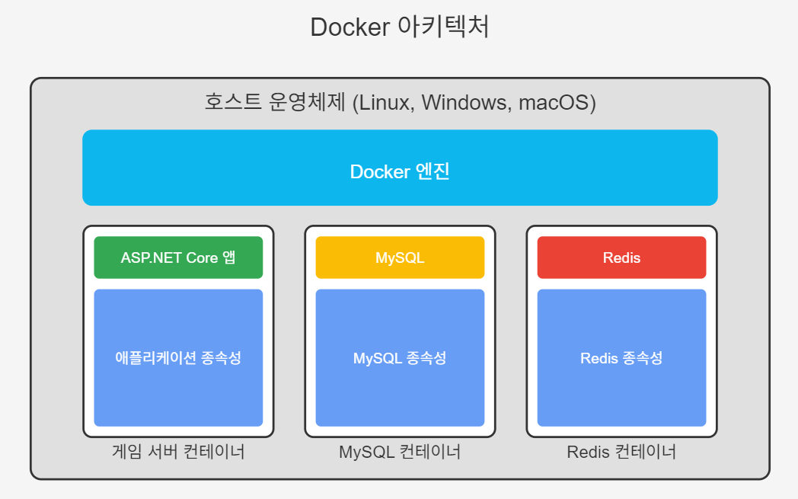
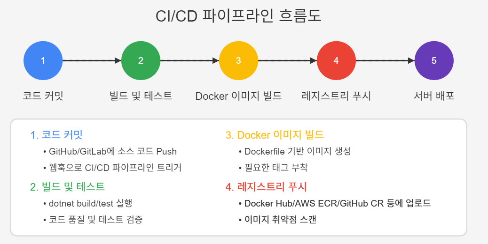

# ASP.NET Core Web API로 게임 서버 개발
  
저자: 최흥배, Claude AI   
-----------------------    
   
# Chapter 17. 서버 배포 및 운영
  
## 17.1 Docker 개요
Docker는 애플리케이션을 개발, 배포, 실행하기 위한 오픈소스 컨테이너 플랫폼이다. 컨테이너는 애플리케이션과 그 실행에 필요한 모든 종속성을 하나의 패키지로 묶어 어디서나 일관되게 실행할 수 있게 해준다.

### Docker의 핵심 개념
1. **컨테이너(Container)**: 애플리케이션과 모든 종속성을 포함하는 독립적인 실행 환경
2. **이미지(Image)**: 컨테이너를 생성하기 위한 읽기 전용 템플릿
3. **Dockerfile**: 이미지를 빌드하기 위한 명령어 집합
4. **레지스트리(Registry)**: 이미지를 저장하고 공유하는 저장소
5. **Docker Compose**: 다중 컨테이너 애플리케이션을 정의하고 실행하기 위한 도구
  
 
  

### 게임 서버에서 Docker를 사용하는 이유

1. **일관된 환경**: 개발, 테스트, 운영 환경 간의 차이로 인한 문제를 최소화한다.
2. **확장성**: 부하에 따라 서버 인스턴스를 쉽게 추가할 수 있다.
3. **격리성**: 컨테이너 간 격리로 한 서비스의 문제가 다른 서비스에 영향을 주지 않는다.
4. **효율성**: 가상 머신보다 더 적은 리소스를 사용한다.
5. **배포 자동화**: CI/CD 파이프라인과 쉽게 통합할 수 있다.
6. **버전 관리**: 컨테이너 이미지를 통해 애플리케이션 버전을 명확하게 관리할 수 있다.
  

## 17.2 개발 환경 설정

### Docker 설치
각 운영체제별 설치 방법은 다음과 같다:

#### Windows
```
# Docker Desktop for Windows 설치
# https://docs.docker.com/desktop/install/windows-install/
```

#### macOS
```
# Docker Desktop for Mac 설치
# https://docs.docker.com/desktop/install/mac-install/
```

#### Linux (Ubuntu)
```bash
# 필요한 패키지 설치
sudo apt-get update
sudo apt-get install ca-certificates curl gnupg

# Docker 공식 GPG 키 추가
sudo install -m 0755 -d /etc/apt/keyrings
curl -fsSL https://download.docker.com/linux/ubuntu/gpg | sudo gpg --dearmor -o /etc/apt/keyrings/docker.gpg
sudo chmod a+r /etc/apt/keyrings/docker.gpg

# Docker 리포지토리 설정
echo "deb [arch=$(dpkg --print-architecture) signed-by=/etc/apt/keyrings/docker.gpg] https://download.docker.com/linux/ubuntu $(. /etc/os-release && echo "$VERSION_CODENAME") stable" | sudo tee /etc/apt/sources.list.d/docker.list > /dev/null

# Docker 엔진 설치
sudo apt-get update
sudo apt-get install docker-ce docker-ce-cli containerd.io docker-buildx-plugin docker-compose-plugin
```

### Docker 설치 확인
Docker가 올바르게 설치되었는지 확인하려면 다음 명령어를 실행한다:

```bash
docker --version
docker-compose --version
docker run hello-world
```
  

## 17.3 ASP.NET Core 애플리케이션 컨테이너화

### Dockerfile 작성
프로젝트 루트 디렉토리에 Dockerfile을 생성한다:

```dockerfile
# .NET SDK를 사용하여 빌드 단계
FROM mcr.microsoft.com/dotnet/sdk:9.0 AS build
WORKDIR /src

# 프로젝트 파일 복사 및 종속성 복원
COPY ["GameServer.csproj", "./"]
RUN dotnet restore "GameServer.csproj"

# 소스 코드 복사 및 빌드
COPY . .
RUN dotnet build "GameServer.csproj" -c Release -o /app/build

# 게시
FROM build AS publish
RUN dotnet publish "GameServer.csproj" -c Release -o /app/publish

# 최종 이미지
FROM mcr.microsoft.com/dotnet/aspnet:9.0 AS final
WORKDIR /app
COPY --from=publish /app/publish .

# 환경 변수 설정
ENV ASPNETCORE_URLS=http://+:80
ENV ASPNETCORE_ENVIRONMENT=Production

# 포트 노출
EXPOSE 80

# 애플리케이션 실행
ENTRYPOINT ["dotnet", "GameServer.dll"]
```

### 이미지 빌드 및 실행

```bash
# Docker 이미지 빌드
docker build -t game-server:1.0 .

# Docker 컨테이너 실행
docker run -d -p 8080:80 --name game-server-instance game-server:1.0
```
  

## 17.4 데이터베이스 컨테이너화

### MySQL 컨테이너 설정

```bash
# MySQL 컨테이너 실행
docker run -d \
  --name mysql-server \
  -e MYSQL_ROOT_PASSWORD=your_root_password \
  -e MYSQL_DATABASE=gamedb \
  -e MYSQL_USER=gameuser \
  -e MYSQL_PASSWORD=gamepassword \
  -p 3306:3306 \
  -v mysql-data:/var/lib/mysql \
  mysql:8.0
```

### Redis 컨테이너 설정

```bash
# Redis 컨테이너 실행
docker run -d \
  --name redis-server \
  -p 6379:6379 \
  -v redis-data:/data \
  redis:7.0
```
  

## 17.5 Docker Compose를 이용한 다중 컨테이너 관리

`docker-compose.yml` 파일을 작성하여 여러 컨테이너를 함께 관리할 수 있다:

```yaml
version: '3.8'

services:
  game-server:
    build:
      context: .
      dockerfile: Dockerfile
    ports:
      - "8080:80"
    depends_on:
      - mysql
      - redis
    environment:
      - ConnectionStrings__MySQLConnection=Server=mysql;Port=3306;Database=gamedb;User=gameuser;Password=gamepassword;
      - ConnectionStrings__RedisConnection=redis:6379
    networks:
      - game-network
    restart: always

  mysql:
    image: mysql:8.0
    ports:
      - "3306:3306"
    environment:
      - MYSQL_ROOT_PASSWORD=your_root_password
      - MYSQL_DATABASE=gamedb
      - MYSQL_USER=gameuser
      - MYSQL_PASSWORD=gamepassword
    volumes:
      - mysql-data:/var/lib/mysql
      - ./mysql/init:/docker-entrypoint-initdb.d
    networks:
      - game-network
    restart: always

  redis:
    image: redis:7.0
    ports:
      - "6379:6379"
    volumes:
      - redis-data:/data
    networks:
      - game-network
    restart: always

networks:
  game-network:
    driver: bridge

volumes:
  mysql-data:
  redis-data:
```

### Docker Compose 명령어

```bash
# 모든 서비스 시작
docker-compose up -d

# 서비스 상태 확인
docker-compose ps

# 로그 확인
docker-compose logs -f

# 모든 서비스 중지
docker-compose down

# 볼륨을 포함한 모든 리소스 제거
docker-compose down -v
```
  

## 17.6 프로덕션 환경 배포

### 개발 환경 vs 프로덕션 환경

| 항목 | 개발 환경 | 프로덕션 환경 |
|------|----------|--------------|
| 최적화 | 디버깅 용이성 중심 | 성능 및 보안 중심 |
| 설정 | 로컬 설정 파일 | 환경 변수 또는 시크릿 관리 도구 |
| 로깅 | 상세한 로그 | 중요 정보만 로깅 |
| 규모 | 단일 인스턴스 | 다중 인스턴스 및 로드 밸런싱 |
| 모니터링 | 최소한의 모니터링 | 종합적인 모니터링 및 알림 시스템 |

### 프로덕션용 Docker Compose 설정
프로덕션 환경에서는 다음과 같은 추가 설정을 고려한다:

```yaml
version: '3.8'

services:
  game-server:
    image: your-registry.com/game-server:${VERSION:-latest}
    deploy:
      replicas: 3
      update_config:
        parallelism: 1
        delay: 10s
        order: start-first
      restart_policy:
        condition: on-failure
        max_attempts: 3
        window: 120s
    ports:
      - "80:80"
    environment:
      - ASPNETCORE_ENVIRONMENT=Production
      - ConnectionStrings__MySQLConnection=Server=mysql;Port=3306;Database=gamedb;User=${MYSQL_USER};Password=${MYSQL_PASSWORD};
      - ConnectionStrings__RedisConnection=redis:6379,password=${REDIS_PASSWORD}
    logging:
      driver: "json-file"
      options:
        max-size: "10m"
        max-file: "3"
    networks:
      - game-network

  mysql:
    image: mysql:8.0
    environment:
      - MYSQL_ROOT_PASSWORD=${MYSQL_ROOT_PASSWORD}
      - MYSQL_DATABASE=gamedb
      - MYSQL_USER=${MYSQL_USER}
      - MYSQL_PASSWORD=${MYSQL_PASSWORD}
    volumes:
      - mysql-data:/var/lib/mysql
    deploy:
      placement:
        constraints: [node.role == worker]
    networks:
      - game-network

  redis:
    image: redis:7.0
    command: redis-server --requirepass ${REDIS_PASSWORD}
    volumes:
      - redis-data:/data
    deploy:
      placement:
        constraints: [node.role == worker]
    networks:
      - game-network

  nginx:
    image: nginx:latest
    ports:
      - "80:80"
      - "443:443"
    volumes:
      - ./nginx/conf:/etc/nginx/conf.d
      - ./nginx/ssl:/etc/nginx/ssl
    depends_on:
      - game-server
    networks:
      - game-network

networks:
  game-network:
    driver: overlay

volumes:
  mysql-data:
    driver: local
  redis-data:
    driver: local
```

### 컨테이너 오케스트레이션 소개
대규모 프로덕션 환경에서는 Docker Swarm이나 Kubernetes와 같은 오케스트레이션 도구를 사용하는 것이 좋다.

#### Docker Swarm

```bash
# Swarm 초기화
docker swarm init

# 서비스 배포
docker stack deploy -c docker-compose.prod.yml game-stack

# 서비스 확인
docker service ls

# 서비스 규모 조정
docker service scale game-stack_game-server=5
```

#### Kubernetes 기본 사용법 (간략 소개)

```bash
# 애플리케이션 배포
kubectl apply -f k8s-deployment.yaml

# 배포 상태 확인
kubectl get deployments

# 서비스 노출
kubectl apply -f k8s-service.yaml

# 포드 확인
kubectl get pods
```
   
  
## 17.7 컨테이너 모니터링 및 로깅

### 모니터링 도구
1. **Prometheus & Grafana**: 메트릭 수집 및 시각화
2. **cAdvisor**: 컨테이너 리소스 사용량 모니터링
3. **Elasticsearch, Logstash, Kibana (ELK)**: 로그 분석 및 시각화

### 로그 설정 예제
ASP.NET Core의 `Program.cs`에 Serilog 로깅 설정:

```csharp
var builder = WebApplication.CreateBuilder(args);

// Serilog 설정
Log.Logger = new LoggerConfiguration()
    .ReadFrom.Configuration(builder.Configuration)
    .Enrich.FromLogContext()
    .WriteTo.Console()
    .WriteTo.File("logs/game-server-.txt", rollingInterval: RollingInterval.Day)
    .CreateLogger();

builder.Host.UseSerilog();
```

`appsettings.json`의 Serilog 설정:

```json
{
  "Serilog": {
    "MinimumLevel": {
      "Default": "Information",
      "Override": {
        "Microsoft": "Warning",
        "System": "Warning"
      }
    }
  }
}
```
  

## 17.8 성능 최적화

### 컨테이너 리소스 제한

```yaml
services:
  game-server:
    deploy:
      resources:
        limits:
          cpus: '1.0'
          memory: 1G
        reservations:
          cpus: '0.5'
          memory: 512M
```

### 이미지 최적화
1. **다단계 빌드(Multi-stage builds)**: 최종 이미지 크기 감소
2. **적절한 기본 이미지 선택**: `mcr.microsoft.com/dotnet/runtime-deps` 같은 경량 이미지 사용
3. **레이어 최소화**: RUN 명령어 결합으로 레이어 수 감소
4. **불필요한 파일 제외**: `.dockerignore` 파일 활용

### .dockerignore 파일 예시

```
# .NET 빌드 결과물
**/bin/
**/obj/

# 개발 도구 및 설정 파일
**/.vs/
**/.vscode/
**/.idea/
**/.git/

# 로그 및 임시 파일
**/logs/
**/temp/
**/*.log

# 테스트 파일
**/TestResults/
**/*.Tests.csproj
**/*Tests/

# 문서 및 기타 불필요한 파일
README.md
LICENSE
*.md
```
  

## 17.9 보안 고려사항

### 컨테이너 보안 모범 사례
1. **최소 권한 원칙**: 컨테이너는 필요한 최소한의 권한만 가져야 한다.
2. **비 루트 사용자 사용**: 컨테이너 내에서 루트가 아닌 사용자로 실행한다.
3. **이미지 취약점 검사**: 정기적으로 보안 스캔을 실행한다.
4. **시크릿 관리**: 민감한 정보는 환경 변수나 Docker/Kubernetes 시크릿으로 관리한다.
5. **네트워크 격리**: 필요한 포트만 노출하고 컨테이너 간 통신을 제한한다.

### Dockerfile에 비 루트 사용자 설정

```dockerfile
FROM mcr.microsoft.com/dotnet/aspnet:9.0 AS final
WORKDIR /app
COPY --from=publish /app/publish .

# 비 루트 사용자 생성 및 설정
RUN adduser --disabled-password --gecos "" appuser && \
    chown -R appuser:appuser /app
USER appuser

EXPOSE 80
ENTRYPOINT ["dotnet", "GameServer.dll"]
```
  

## 17.10 CI/CD 파이프라인 연동

### GitHub Actions를 이용한 CI/CD 예제

`.github/workflows/docker-build-deploy.yml` 파일:

```yaml
name: Docker Build and Deploy

on:
  push:
    branches: [ main ]
  pull_request:
    branches: [ main ]

jobs:
  build:
    runs-on: ubuntu-latest
    steps:
    - uses: actions/checkout@v3
    
    - name: Set up .NET
      uses: actions/setup-dotnet@v3
      with:
        dotnet-version: '9.0.x'
    
    - name: Build and test
      run: |
        dotnet restore
        dotnet build --no-restore
        dotnet test --no-build
    
    - name: Login to Docker Hub
      if: github.event_name != 'pull_request'
      uses: docker/login-action@v2
      with:
        username: ${{ secrets.DOCKER_HUB_USERNAME }}
        password: ${{ secrets.DOCKER_HUB_TOKEN }}
    
    - name: Build and push Docker image
      uses: docker/build-push-action@v4
      with:
        context: .
        push: ${{ github.event_name != 'pull_request' }}
        tags: ${{ secrets.DOCKER_HUB_USERNAME }}/game-server:latest

  deploy:
    needs: build
    if: github.event_name != 'pull_request'
    runs-on: ubuntu-latest
    steps:
    - name: Deploy to production server
      uses: appleboy/ssh-action@master
      with:
        host: ${{ secrets.SERVER_HOST }}
        username: ${{ secrets.SERVER_USERNAME }}
        key: ${{ secrets.SERVER_KEY }}
        script: |
          cd /opt/game-server
          docker-compose pull
          docker-compose down
          docker-compose up -d
```
  
 
  
  

## 17.11 게임 서버 확장성 고려사항

### 수평적 확장
게임 서버의 인스턴스를 여러 대로 늘려 부하를 분산시킨다. 이때 고려해야 할 사항:

1. **상태 관리**: 플레이어 세션 정보를 Redis와 같은 외부 저장소에 저장
2. **로드 밸런싱**: 라운드 로빈, 세션 고정 등 적절한 부하 분산 방식 선택
3. **무상태(Stateless) 설계**: 서버 인스턴스 간 데이터 의존성 최소화

### ASP.NET Core 상태 관리 예시 코드

```csharp
// Startup.cs에서 Redis 세션 설정
public void ConfigureServices(IServiceCollection services)
{
    // Redis 연결 설정
    services.AddStackExchangeRedisCache(options =>
    {
        options.Configuration = Configuration.GetConnectionString("RedisConnection");
        options.InstanceName = "GameServer_";
    });

    // 세션 서비스 추가
    services.AddSession(options =>
    {
        options.IdleTimeout = TimeSpan.FromMinutes(30);
        options.Cookie.HttpOnly = true;
        options.Cookie.IsEssential = true;
    });
    
    // 나머지 서비스 설정...
}

// Configure 메서드에서 세션 미들웨어 사용
public void Configure(IApplicationBuilder app, IWebHostEnvironment env)
{
    // 다른 미들웨어 설정...
    
    app.UseSession();
    
    // 이후 미들웨어...
}
```

### 자동 스케일링 설정 (Kubernetes)
Kubernetes에서 HorizontalPodAutoscaler를 사용한 자동 스케일링:

```yaml
apiVersion: autoscaling/v2
kind: HorizontalPodAutoscaler
metadata:
  name: game-server-hpa
spec:
  scaleTargetRef:
    apiVersion: apps/v1
    kind: Deployment
    name: game-server
  minReplicas: 3
  maxReplicas: 10
  metrics:
  - type: Resource
    resource:
      name: cpu
      target:
        type: Utilization
        averageUtilization: 70
  - type: Resource
    resource:
      name: memory
      target:
        type: Utilization
        averageUtilization: 80
```
  

## 17.12 테스트용 .http 파일 예시
배포된 게임 서버를 테스트하기 위한 .http 파일의 예시:

```http
@baseUrl = https://game-server.example.com
@authToken = your-auth-token

### 서버 상태 확인
POST {{baseUrl}}/api/system/status
Content-Type: application/json

{}

### 유저 로그인
POST {{baseUrl}}/api/auth/login
Content-Type: application/json

{
  "username": "testUser",
  "password": "testPassword"
}

### 캐릭터 정보 조회
POST {{baseUrl}}/api/character/info
Content-Type: application/json
Authorization: Bearer {{authToken}}

{
  "characterId": 12345
}

### 아이템 획득
POST {{baseUrl}}/api/item/acquire
Content-Type: application/json
Authorization: Bearer {{authToken}}

{
  "characterId": 12345,
  "itemId": 67890,
  "quantity": 1
}

### 레이드 입장
POST {{baseUrl}}/api/raid/enter
Content-Type: application/json
Authorization: Bearer {{authToken}}

{
  "characterId": 12345,
  "raidId": 5001
}
```
  

## 17.13 운영 체크리스트

### 배포 전 체크리스트
- [ ] 코드 리뷰 및 테스트 완료
- [ ] Docker 이미지 취약점 검사
- [ ] 환경 변수 및 시크릿 설정 확인
- [ ] 데이터베이스 마이그레이션 스크립트 준비
- [ ] 롤백 계획 준비
- [ ] 모니터링 및 알림 설정

### 운영 체크리스트
- [ ] 리소스 사용량 정기 모니터링
- [ ] 로그 분석 및 이슈 추적
- [ ] 백업 및 복구 절차 테스트
- [ ] 보안 업데이트 적용
- [ ] 성능 검토 및 최적화
- [ ] 확장성 계획 수립
  
  
## 17.14 결론
Docker 컨테이너화는 게임 서버 개발 및 운영에 있어 필수적인 요소가 되었다. 일관된 환경, 확장성, 효율적인 리소스 사용, 그리고 배포 자동화를 통해 개발팀은 더 안정적이고 관리하기 쉬운 게임 서버를 제공할 수 있다.

이 장에서 다룬 내용은 ASP.NET Core Web API 게임 서버를 Docker 컨테이너로 패키징하고, Docker Compose로 다중 컨테이너 애플리케이션을 관리하며, 프로덕션 환경으로 배포하는 전체 과정을 포함한다. 컨테이너 보안, 모니터링, 로깅, 그리고 CI/CD 파이프라인 통합까지 다루어 현대적인 게임 서버 인프라 관리의 기초를 제공한다.

이러한 지식을 기반으로 안정적이고 확장 가능한 게임 서버를 구축하고 운영할 수 있으며, 게임 서비스의 성장에 따라 필요한 인프라 조정을 효율적으로 수행할 수 있다.


   