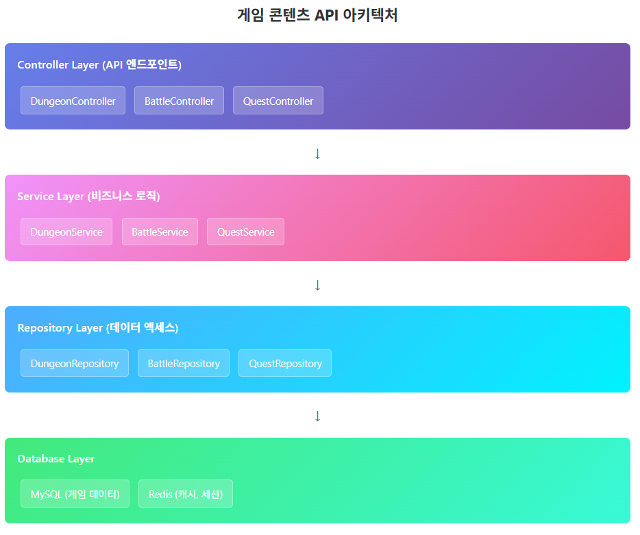

# ASP.NET Core Web API로 게임 서버 개발
  
저자: 최흥배, Claude AI   
-----------------------    
   
# API 분리 및 모듈화 - 게임 콘텐츠 API

## 1. API 분리의 필요성
수집형 RPG 게임 서버에서 API를 분리하는 것은 코드의 유지보수성, 확장성, 그리고 팀 개발 효율성을 높이는 핵심 요소입니다. 게임 콘텐츠 API를 던전, 전투, 퀘스트로 분리함으로써 각 기능별로 독립적인 개발과 배포가 가능해집니다.

### 분리의 장점
- **단일 책임 원칙**: 각 API가 하나의 명확한 역할을 담당
- **독립적 개발**: 팀원들이 서로 다른 모듈을 동시에 개발 가능
- **테스트 용이성**: 각 모듈별로 독립적인 테스트 수행
- **확장성**: 특정 기능만 별도 서버로 분리 가능
  

## 2. 게임 콘텐츠 API 아키텍처
   
  
  
## 3. 프로젝트 구조 설정
  
### 폴더 구조
```
GameServer/
├── Controllers/
│   ├── DungeonController.cs
│   ├── BattleController.cs
│   └── QuestController.cs
├── Services/
│   ├── IDungeonService.cs
│   ├── DungeonService.cs
│   ├── IBattleService.cs
│   ├── BattleService.cs
│   ├── IQuestService.cs
│   └── QuestService.cs
├── Repositories/
│   ├── IDungeonRepository.cs
│   ├── DungeonRepository.cs
│   ├── IBattleRepository.cs
│   ├── BattleRepository.cs
│   ├── IQuestRepository.cs
│   └── QuestRepository.cs
├── Models/
│   ├── Dungeon.cs
│   ├── Battle.cs
│   └── Quest.cs
└── DTOs/
    ├── DungeonDTOs.cs
    ├── BattleDTOs.cs
    └── QuestDTOs.cs
```
  

## 4. 모델 정의

### 던전 모델
  
```csharp
// Models/Dungeon.cs
namespace GameServer.Models
{
    public class Dungeon
    {
        public int Id { get; set; }
        public string Name { get; set; } = string.Empty;
        public int RequiredLevel { get; set; }
        public int StaminaCost { get; set; }
        public List<DungeonStage> Stages { get; set; } = new();
        public List<DungeonReward> Rewards { get; set; } = new();
    }

    public class DungeonStage
    {
        public int StageNumber { get; set; }
        public List<int> MonsterIds { get; set; } = new();
        public int BossId { get; set; }
    }

    public class DungeonReward
    {
        public int ItemId { get; set; }
        public int Quantity { get; set; }
        public float DropRate { get; set; }
    }
}
```

### 전투 모델
  
```csharp
// Models/Battle.cs
namespace GameServer.Models
{
    public class Battle
    {
        public string BattleId { get; set; } = string.Empty;
        public int PlayerId { get; set; }
        public int DungeonId { get; set; }
        public int CurrentStage { get; set; }
        public BattleStatus Status { get; set; }
        public DateTime StartTime { get; set; }
        public DateTime? EndTime { get; set; }
        public List<BattleAction> Actions { get; set; } = new();
    }

    public class BattleAction
    {
        public int Turn { get; set; }
        public int ActorId { get; set; }
        public BattleActionType ActionType { get; set; }
        public int TargetId { get; set; }
        public int Damage { get; set; }
    }

    public enum BattleStatus
    {
        InProgress,
        Victory,
        Defeat,
        Abandoned
    }

    public enum BattleActionType
    {
        Attack,
        Skill,
        Item
    }
}
```

### 퀘스트 모델
  
```csharp
// Models/Quest.cs
namespace GameServer.Models
{
    public class Quest
    {
        public int QuestId { get; set; }
        public string Title { get; set; } = string.Empty;
        public string Description { get; set; } = string.Empty;
        public QuestType Type { get; set; }
        public List<QuestObjective> Objectives { get; set; } = new();
        public List<QuestReward> Rewards { get; set; } = new();
        public int RequiredLevel { get; set; }
    }

    public class QuestObjective
    {
        public int ObjectiveId { get; set; }
        public string Description { get; set; } = string.Empty;
        public QuestObjectiveType Type { get; set; }
        public int TargetId { get; set; }
        public int RequiredCount { get; set; }
    }

    public class QuestReward
    {
        public int ItemId { get; set; }
        public int Quantity { get; set; }
        public int Experience { get; set; }
        public int Gold { get; set; }
    }

    public enum QuestType
    {
        Main,
        Daily,
        Weekly,
        Achievement
    }

    public enum QuestObjectiveType
    {
        KillMonster,
        ClearDungeon,
        CollectItem,
        ReachLevel
    }
}
```
  

## 5. DTO 정의

```csharp
// DTOs/DungeonDTOs.cs
namespace GameServer.DTOs
{
    public class DungeonListResponse
    {
        public List<DungeonInfo> Dungeons { get; set; } = new();
    }

    public class DungeonInfo
    {
        public int Id { get; set; }
        public string Name { get; set; } = string.Empty;
        public int RequiredLevel { get; set; }
        public int StaminaCost { get; set; }
        public bool IsUnlocked { get; set; }
    }

    public class DungeonStartRequest
    {
        public int PlayerId { get; set; }
        public int DungeonId { get; set; }
    }

    public class DungeonStartResponse
    {
        public string BattleId { get; set; } = string.Empty;
        public bool Success { get; set; }
        public string Message { get; set; } = string.Empty;
    }
}
```
  

## 6. Repository 구현

### 던전 Repository
```csharp
// Repositories/IDungeonRepository.cs
namespace GameServer.Repositories
{
    public interface IDungeonRepository
    {
        Task<List<Dungeon>> GetAllDungeonsAsync();
        Task<Dungeon?> GetDungeonByIdAsync(int dungeonId);
        Task<bool> IsPlayerEligibleAsync(int playerId, int dungeonId);
        Task<bool> ConsumeStaminaAsync(int playerId, int staminaCost);
    }
}

// Repositories/DungeonRepository.cs
using CloudStructures;
using MySqlConnector;
using SqlKata;
using SqlKata.Execution;

namespace GameServer.Repositories
{
    public class DungeonRepository : IDungeonRepository
    {
        private readonly QueryFactory _db;
        private readonly RedisConnection _redis;

        public DungeonRepository(QueryFactory db, RedisConnection redis)
        {
            _db = db;
            _redis = redis;
        }

        public async Task<List<Dungeon>> GetAllDungeonsAsync()
        {
            var cacheKey = "dungeons:all";
            var cachedDungeons = await _redis.GetDatabase()
                .HashGetAllAsync<Dungeon>(cacheKey);

            if (cachedDungeons.HasValue)
            {
                return cachedDungeons.Value.Values.ToList();
            }

            var dungeons = await _db.Query("dungeons")
                .Select("id", "name", "required_level", "stamina_cost")
                .GetAsync<Dungeon>();

            // Redis에 캐시 저장 (1시간)
            var dungeonDict = dungeons.ToDictionary(d => d.Id.ToString(), d => d);
            await _redis.GetDatabase()
                .HashSetAsync(cacheKey, dungeonDict, TimeSpan.FromHours(1));

            return dungeons.ToList();
        }

        public async Task<Dungeon?> GetDungeonByIdAsync(int dungeonId)
        {
            var dungeon = await _db.Query("dungeons")
                .Where("id", dungeonId)
                .FirstOrDefaultAsync<Dungeon>();

            if (dungeon != null)
            {
                // 던전 스테이지 정보 로드
                dungeon.Stages = await GetDungeonStagesAsync(dungeonId);
                dungeon.Rewards = await GetDungeonRewardsAsync(dungeonId);
            }

            return dungeon;
        }

        public async Task<bool> IsPlayerEligibleAsync(int playerId, int dungeonId)
        {
            var player = await _db.Query("players")
                .Where("id", playerId)
                .Select("level", "stamina")
                .FirstOrDefaultAsync();

            var dungeon = await _db.Query("dungeons")
                .Where("id", dungeonId)
                .Select("required_level", "stamina_cost")
                .FirstOrDefaultAsync();

            if (player == null || dungeon == null)
                return false;

            return player.level >= dungeon.required_level && 
                   player.stamina >= dungeon.stamina_cost;
        }

        public async Task<bool> ConsumeStaminaAsync(int playerId, int staminaCost)
        {
            var affected = await _db.Query("players")
                .Where("id", playerId)
                .Where("stamina", ">=", staminaCost)
                .UpdateAsync(new { stamina = new Query().Raw($"stamina - {staminaCost}") });

            return affected > 0;
        }

        private async Task<List<DungeonStage>> GetDungeonStagesAsync(int dungeonId)
        {
            return await _db.Query("dungeon_stages")
                .Where("dungeon_id", dungeonId)
                .OrderBy("stage_number")
                .GetAsync<DungeonStage>();
        }

        private async Task<List<DungeonReward>> GetDungeonRewardsAsync(int dungeonId)
        {
            return await _db.Query("dungeon_rewards")
                .Where("dungeon_id", dungeonId)
                .GetAsync<DungeonReward>();
        }
    }
}
```
  

## 7. Service 구현

### 던전 Service
```csharp
// Services/IDungeonService.cs
namespace GameServer.Services
{
    public interface IDungeonService
    {
        Task<DungeonListResponse> GetAvailableDungeonsAsync(int playerId);
        Task<DungeonStartResponse> StartDungeonAsync(DungeonStartRequest request);
    }
}

// Services/DungeonService.cs
namespace GameServer.Services
{
    public class DungeonService : IDungeonService
    {
        private readonly IDungeonRepository _dungeonRepository;
        private readonly IBattleService _battleService;
        private readonly ILogger<DungeonService> _logger;

        public DungeonService(
            IDungeonRepository dungeonRepository,
            IBattleService battleService,
            ILogger<DungeonService> logger)
        {
            _dungeonRepository = dungeonRepository;
            _battleService = battleService;
            _logger = logger;
        }

        public async Task<DungeonListResponse> GetAvailableDungeonsAsync(int playerId)
        {
            try
            {
                var allDungeons = await _dungeonRepository.GetAllDungeonsAsync();
                var response = new DungeonListResponse();

                foreach (var dungeon in allDungeons)
                {
                    var isUnlocked = await _dungeonRepository
                        .IsPlayerEligibleAsync(playerId, dungeon.Id);

                    response.Dungeons.Add(new DungeonInfo
                    {
                        Id = dungeon.Id,
                        Name = dungeon.Name,
                        RequiredLevel = dungeon.RequiredLevel,
                        StaminaCost = dungeon.StaminaCost,
                        IsUnlocked = isUnlocked
                    });
                }

                return response;
            }
            catch (Exception ex)
            {
                _logger.LogError(ex, "던전 목록 조회 중 오류 발생");
                throw;
            }
        }

        public async Task<DungeonStartResponse> StartDungeonAsync(DungeonStartRequest request)
        {
            try
            {
                // 플레이어 자격 검증
                if (!await _dungeonRepository.IsPlayerEligibleAsync(request.PlayerId, request.DungeonId))
                {
                    return new DungeonStartResponse
                    {
                        Success = false,
                        Message = "던전 입장 조건을 만족하지 않습니다."
                    };
                }

                // 던전 정보 조회
                var dungeon = await _dungeonRepository.GetDungeonByIdAsync(request.DungeonId);
                if (dungeon == null)
                {
                    return new DungeonStartResponse
                    {
                        Success = false,
                        Message = "존재하지 않는 던전입니다."
                    };
                }

                // 스태미나 소모
                if (!await _dungeonRepository.ConsumeStaminaAsync(request.PlayerId, dungeon.StaminaCost))
                {
                    return new DungeonStartResponse
                    {
                        Success = false,
                        Message = "스태미나가 부족합니다."
                    };
                }

                // 전투 시작
                var battleId = await _battleService.StartBattleAsync(request.PlayerId, request.DungeonId);

                return new DungeonStartResponse
                {
                    BattleId = battleId,
                    Success = true,
                    Message = "던전 입장에 성공했습니다."
                };
            }
            catch (Exception ex)
            {
                _logger.LogError(ex, "던전 시작 중 오류 발생");
                throw;
            }
        }
    }
}
```
  

## 8. Controller 구현

### 던전 Controller
```csharp
// Controllers/DungeonController.cs
using Microsoft.AspNetCore.Mvc;

namespace GameServer.Controllers
{
    [ApiController]
    [Route("api/[controller]")]
    public class DungeonController : ControllerBase
    {
        private readonly IDungeonService _dungeonService;
        private readonly ILogger<DungeonController> _logger;

        public DungeonController(IDungeonService dungeonService, ILogger<DungeonController> logger)
        {
            _dungeonService = dungeonService;
            _logger = logger;
        }

        /// <summary>
        /// 플레이어가 입장 가능한 던전 목록을 조회합니다.
        /// </summary>
        [HttpGet("list/{playerId}")]
        public async Task<ActionResult<DungeonListResponse>> GetDungeonList(int playerId)
        {
            try
            {
                var response = await _dungeonService.GetAvailableDungeonsAsync(playerId);
                return Ok(response);
            }
            catch (Exception ex)
            {
                _logger.LogError(ex, "던전 목록 조회 실패");
                return StatusCode(500, "서버 오류가 발생했습니다.");
            }
        }

        /// <summary>
        /// 던전을 시작합니다.
        /// </summary>
        [HttpPost("start")]
        public async Task<ActionResult<DungeonStartResponse>> StartDungeon([FromBody] DungeonStartRequest request)
        {
            try
            {
                var response = await _dungeonService.StartDungeonAsync(request);
                
                if (!response.Success)
                {
                    return BadRequest(response);
                }

                return Ok(response);
            }
            catch (Exception ex)
            {
                _logger.LogError(ex, "던전 시작 실패");
                return StatusCode(500, "서버 오류가 발생했습니다.");
            }
        }
    }
}
```
  

## 9. 의존성 주입 설정

```csharp
// Program.cs
using CloudStructures;
using MySqlConnector;
using SqlKata.Compilers;
using SqlKata.Execution;

var builder = WebApplication.CreateBuilder(args);

// 서비스 등록
builder.Services.AddControllers();
builder.Services.AddEndpointsApiExplorer();
builder.Services.AddSwaggerGen();

// 데이터베이스 연결 설정
var connectionString = builder.Configuration.GetConnectionString("DefaultConnection");
builder.Services.AddScoped(_ => new MySqlConnection(connectionString));
builder.Services.AddScoped<QueryFactory>(provider =>
{
    var connection = provider.GetRequiredService<MySqlConnection>();
    var compiler = new MySqlCompiler();
    return new QueryFactory(connection, compiler);
});

// Redis 연결 설정
var redisConnectionString = builder.Configuration.GetConnectionString("Redis");
builder.Services.AddSingleton<RedisConnection>(_ => 
    new RedisConnection(StackExchange.Redis.ConfigurationOptions.Parse(redisConnectionString)));

// Repository 등록
builder.Services.AddScoped<IDungeonRepository, DungeonRepository>();
builder.Services.AddScoped<IBattleRepository, BattleRepository>();
builder.Services.AddScoped<IQuestRepository, QuestRepository>();

// Service 등록
builder.Services.AddScoped<IDungeonService, DungeonService>();
builder.Services.AddScoped<IBattleService, BattleService>();
builder.Services.AddScoped<IQuestService, QuestService>();

var app = builder.Build();

// 파이프라인 설정
if (app.Environment.IsDevelopment())
{
    app.UseSwagger();
    app.UseSwaggerUI();
}

app.UseHttpsRedirection();
app.UseAuthorization();
app.MapControllers();

app.Run();
```
  
  
## 10. .http 파일을 통한 테스트

### 던전 API 테스트
```http
### 던전 목록 조회
GET http://localhost:5000/api/dungeon/list/1
Accept: application/json

### 던전 시작
POST http://localhost:5000/api/dungeon/start
Content-Type: application/json

{
  "playerId": 1,
  "dungeonId": 1
}

### 전투 상태 조회
GET http://localhost:5000/api/battle/{{battleId}}/status
Accept: application/json

### 전투 액션 수행
POST http://localhost:5000/api/battle/{{battleId}}/action
Content-Type: application/json

{
  "actionType": "Attack",
  "targetId": 1
}

### 퀘스트 목록 조회
GET http://localhost:5000/api/quest/list/1
Accept: application/json

### 퀘스트 완료
POST http://localhost:5000/api/quest/complete
Content-Type: application/json

{
  "playerId": 1,
  "questId": 1
}
```

  
