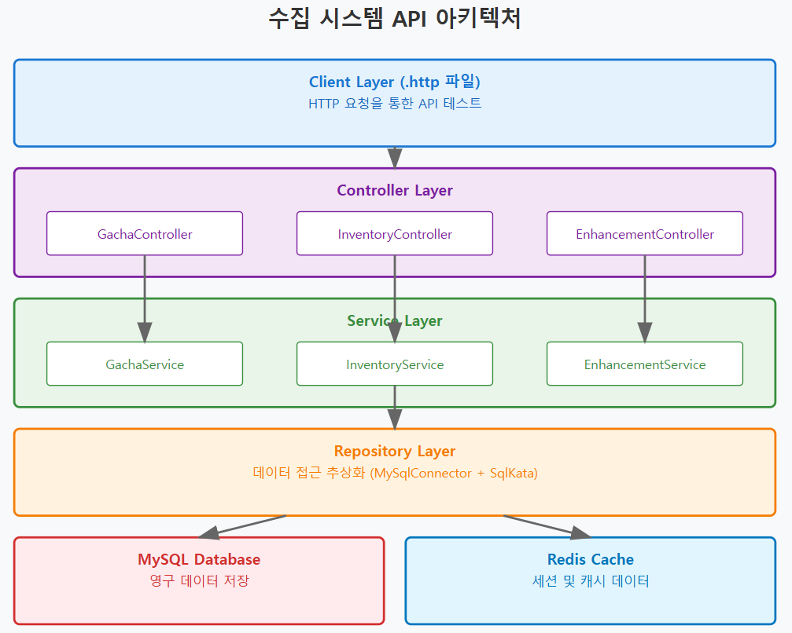
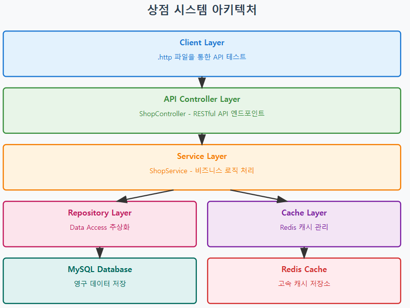
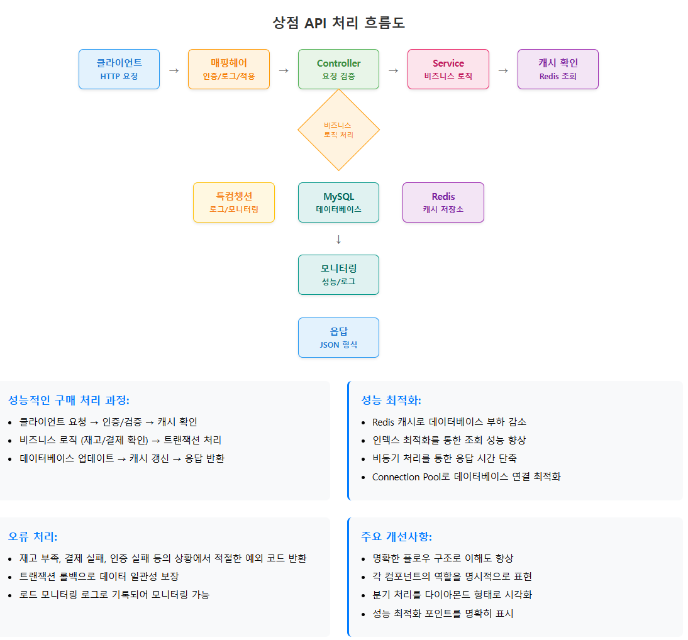

# ASP.NET Core Web API로 게임 서버 개발
  
저자: 최흥배, Claude AI   
-----------------------    
     
# API 분리 및 모듈화: 수집 시스템 API 구현

## 개요
수집형 RPG 게임 서버를 개발할 때 가장 중요한 것 중 하나는 각 게임 시스템을 독립적이면서도 유기적으로 연결된 API로 설계하는 것이다. 이번 장에서는 가챠, 인벤토리, 강화 시스템을 중심으로 한 수집 시스템 API의 분리 및 모듈화 방법을 살펴본다.

## 1. API 분리의 필요성

### 1.1 모놀리식 vs 모듈화 접근법
전통적인 모놀리식 접근법에서는 모든 게임 로직이 하나의 거대한 컨트롤러나 서비스에 집중된다. 하지만 이러한 방식은 다음과 같은 문제점을 가진다:

- **유지보수의 어려움**: 코드가 복잡해질수록 버그 수정이나 기능 추가가 어려워진다
- **테스트의 복잡성**: 특정 기능만 테스트하기 어렵다
- **확장성 제한**: 새로운 기능 추가 시 기존 코드에 영향을 미칠 가능성이 높다
- **팀 개발의 비효율성**: 여러 개발자가 동시에 작업하기 어렵다

### 1.2 모듈화의 장점
API를 적절히 분리하고 모듈화하면 다음과 같은 이점을 얻을 수 있다:

- **단일 책임 원칙**: 각 모듈이 명확한 역할을 가진다
- **느슨한 결합**: 모듈 간 의존성을 최소화한다
- **높은 응집도**: 관련된 기능들을 하나의 모듈로 묶는다
- **재사용성**: 다른 프로젝트에서도 모듈을 재사용할 수 있다
  

## 2. 수집 시스템 아키텍처 설계
   

  
## 3. 프로젝트 구조 설계
ASP.NET Core Web API 프로젝트를 모듈화하기 위한 폴더 구조는 다음과 같다

<pre>      
GameServer/
├── Controllers/
│   ├── GachaController.cs
│   ├── InventoryController.cs
│   └── EnhancementController.cs
├── Services/
│   ├── Interfaces/
│   │   ├── IGachaService.cs
│   │   ├── IInventoryService.cs
│   │   └── IEnhancementService.cs
│   ├── GachaService.cs
│   ├── InventoryService.cs
│   └── EnhancementService.cs
├── Repositories/
│   ├── Interfaces/
│   │   ├── IGachaRepository.cs
│   │   ├── IInventoryRepository.cs
│   │   └── IEnhancementRepository.cs
│   ├── GachaRepository.cs
│   ├── InventoryRepository.cs
│   └── EnhancementRepository.cs
├── Models/
│   ├── Entities/
│   │   ├── User.cs
│   │   ├── Item.cs
│   │   ├── UserItem.cs
│   │   └── GachaResult.cs
│   ├── DTOs/
│   │   ├── GachaRequestDto.cs
│   │   ├── GachaResponseDto.cs
│   │   ├── InventoryDto.cs
│   │   └── EnhancementDto.cs
│   └── Enums/
│       ├── ItemType.cs
│       ├── ItemRarity.cs
│       └── EnhancementResult.cs
├── Database/
│   ├── ConnectionFactory.cs
│   └── RedisConnectionFactory.cs
├── Tests/
│   ├── gacha.http
│   ├── inventory.http
│   └── enhancement.http
├── Program.cs
└── appsettings.json
</pre>  


## 4. 데이터 모델 설계

### 4.1 기본 엔티티 정의
  
```
// Models/Enums/ItemType.cs
namespace GameServer.Models.Enums;

public enum ItemType
{
    Weapon = 1,
    Armor = 2,
    Accessory = 3,
    Consumable = 4,
    Material = 5
}

// Models/Enums/ItemRarity.cs
namespace GameServer.Models.Enums;

public enum ItemRarity
{
    Common = 1,     // 1성
    Uncommon = 2,   // 2성
    Rare = 3,       // 3성
    Epic = 4,       // 4성
    Legendary = 5   // 5성
}

// Models/Enums/EnhancementResult.cs
namespace GameServer.Models.Enums;

public enum EnhancementResult
{
    Success = 1,
    Failure = 2,
    GreatSuccess = 3,
    Destruction = 4
}

// Models/Entities/User.cs
namespace GameServer.Models.Entities;

public class User
{
    public long UserId { get; set; }
    public string Username { get; set; } = string.Empty;
    public int Level { get; set; }
    public long Gold { get; set; }
    public int GachaCurrency { get; set; }
    public DateTime CreatedAt { get; set; }
    public DateTime UpdatedAt { get; set; }
}

// Models/Entities/Item.cs
using GameServer.Models.Enums;

namespace GameServer.Models.Entities;

public class Item
{
    public int ItemId { get; set; }
    public string Name { get; set; } = string.Empty;
    public string Description { get; set; } = string.Empty;
    public ItemType Type { get; set; }
    public ItemRarity Rarity { get; set; }
    public int BaseAttack { get; set; }
    public int BaseDefense { get; set; }
    public int MaxLevel { get; set; }
    public bool IsStackable { get; set; }
    public int MaxStack { get; set; }
    public string IconUrl { get; set; } = string.Empty;
}

// Models/Entities/UserItem.cs
namespace GameServer.Models.Entities;

public class UserItem
{
    public long UserItemId { get; set; }
    public long UserId { get; set; }
    public int ItemId { get; set; }
    public int Quantity { get; set; }
    public int Level { get; set; }
    public int Experience { get; set; }
    public bool IsEquipped { get; set; }
    public DateTime ObtainedAt { get; set; }
    
    // Navigation properties (EF Core용이지만 참고용)
    public Item Item { get; set; } = null!;
}

// Models/Entities/GachaResult.cs
namespace GameServer.Models.Entities;

public class GachaResult
{
    public long GachaResultId { get; set; }
    public long UserId { get; set; }
    public int GachaType { get; set; }
    public int ItemId { get; set; }
    public int Quantity { get; set; }
    public DateTime CreatedAt { get; set; }
    
    public Item Item { get; set; } = null!;
}
```

### 4.2 DTO 클래스 정의
  
```
// Models/DTOs/GachaRequestDto.cs
using System.ComponentModel.DataAnnotations;

namespace GameServer.Models.DTOs;

public class GachaRequestDto
{
    [Required]
    public long UserId { get; set; }
    
    [Required]
    [Range(1, 3)] // 1: 단일, 2: 10연차, 3: 고급
    public int GachaType { get; set; }
    
    [Range(1, 10)]
    public int Count { get; set; } = 1;
}

// Models/DTOs/GachaResponseDto.cs
using GameServer.Models.Enums;

namespace GameServer.Models.DTOs;

public class GachaResponseDto
{
    public List<GachaItemDto> Items { get; set; } = new();
    public long RemainingCurrency { get; set; }
    public bool IsSuccess { get; set; }
    public string Message { get; set; } = string.Empty;
}

public class GachaItemDto
{
    public int ItemId { get; set; }
    public string Name { get; set; } = string.Empty;
    public ItemRarity Rarity { get; set; }
    public int Quantity { get; set; }
    public string IconUrl { get; set; } = string.Empty;
    public bool IsNew { get; set; }
}

// Models/DTOs/InventoryDto.cs
using GameServer.Models.Enums;

namespace GameServer.Models.DTOs;

public class InventoryResponseDto
{
    public List<InventoryItemDto> Items { get; set; } = new();
    public int TotalCount { get; set; }
    public int PageSize { get; set; }
    public int CurrentPage { get; set; }
}

public class InventoryItemDto
{
    public long UserItemId { get; set; }
    public int ItemId { get; set; }
    public string Name { get; set; } = string.Empty;
    public ItemType Type { get; set; }
    public ItemRarity Rarity { get; set; }
    public int Quantity { get; set; }
    public int Level { get; set; }
    public int Experience { get; set; }
    public bool IsEquipped { get; set; }
    public int Attack { get; set; }
    public int Defense { get; set; }
    public string IconUrl { get; set; } = string.Empty;
    public DateTime ObtainedAt { get; set; }
}

// Models/DTOs/EnhancementDto.cs
using GameServer.Models.Enums;
using System.ComponentModel.DataAnnotations;

namespace GameServer.Models.DTOs;

public class EnhancementRequestDto
{
    [Required]
    public long UserId { get; set; }
    
    [Required]
    public long UserItemId { get; set; }
    
    public List<long> MaterialItemIds { get; set; } = new();
}

public class EnhancementResponseDto
{
    public EnhancementResult Result { get; set; }
    public int NewLevel { get; set; }
    public int NewExperience { get; set; }
    public int NewAttack { get; set; }
    public int NewDefense { get; set; }
    public long RemainingGold { get; set; }
    public bool IsMaxLevel { get; set; }
    public string Message { get; set; } = string.Empty;
}

// Models/DTOs/Common/ApiResponseDto.cs
namespace GameServer.Models.DTOs.Common;

public class ApiResponseDto<T>
{
    public bool IsSuccess { get; set; }
    public string Message { get; set; } = string.Empty;
    public T? Data { get; set; }
    public int ErrorCode { get; set; }
}

public class ApiResponseDto
{
    public bool IsSuccess { get; set; }
    public string Message { get; set; } = string.Empty;
    public int ErrorCode { get; set; }
}

// Models/DTOs/Common/PaginationDto.cs
namespace GameServer.Models.DTOs.Common;

public class PaginationDto
{
    public int Page { get; set; } = 1;
    public int PageSize { get; set; } = 20;
    public int MaxPageSize { get; set; } = 100;
    
    public int Skip => (Page - 1) * PageSize;
    public int Take => Math.Min(PageSize, MaxPageSize);
}
```    
  
  
## 5. 데이터베이스 연결 설정
  
### 5.1 Connection Factory 구현
  
```
// Database/ConnectionFactory.cs
using MySqlConnector;
using System.Data;

namespace GameServer.Database;

public interface IConnectionFactory
{
    IDbConnection CreateConnection();
}

public class ConnectionFactory : IConnectionFactory
{
    private readonly string _connectionString;

    public ConnectionFactory(IConfiguration configuration)
    {
        _connectionString = configuration.GetConnectionString("DefaultConnection") 
            ?? throw new ArgumentNullException(nameof(configuration));
    }

    public IDbConnection CreateConnection()
    {
        return new MySqlConnection(_connectionString);
    }
}

// Database/RedisConnectionFactory.cs
using CloudStructures;
using StackExchange.Redis;

namespace GameServer.Database;

public interface IRedisConnectionFactory
{
    RedisConnection GetConnection();
    IDatabase GetDatabase();
}

public class RedisConnectionFactory : IRedisConnectionFactory, IDisposable
{
    private readonly ConnectionMultiplexer _connection;
    private readonly RedisConnection _redisConnection;

    public RedisConnectionFactory(IConfiguration configuration)
    {
        var connectionString = configuration.GetConnectionString("RedisConnection") 
            ?? throw new ArgumentNullException(nameof(configuration));
        
        _connection = ConnectionMultiplexer.Connect(connectionString);
        _redisConnection = new RedisConnection(_connection, 0); // Database 0 사용
    }

    public RedisConnection GetConnection()
    {
        return _redisConnection;
    }

    public IDatabase GetDatabase()
    {
        return _connection.GetDatabase();
    }

    public void Dispose()
    {
        _connection?.Dispose();
        GC.SuppressFinalize(this);
    }
}

// appsettings.json 예시
/*
{
  "ConnectionStrings": {
    "DefaultConnection": "Server=localhost;Database=GameDB;Uid=gameuser;Pwd=password;",
    "RedisConnection": "localhost:6379"
  },
  "GameSettings": {
    "GachaCost": {
      "Single": 100,
      "Multi": 1000,
      "Premium": 300
    },
    "EnhancementCost": {
      "BaseGold": 1000,
      "LevelMultiplier": 1.5
    }
  },
  "Logging": {
    "LogLevel": {
      "Default": "Information",
      "Microsoft.AspNetCore": "Warning"
    }
  },
  "AllowedHosts": "*"
}
*/
```


## 6. Repository 계층 구현

### 6.1 Repository 인터페이스 정의

```
// Repositories/Interfaces/IGachaRepository.cs
using GameServer.Models.Entities;

namespace GameServer.Repositories.Interfaces;

public interface IGachaRepository
{
    Task<List<Item>> GetGachaPoolAsync(int gachaType);
    Task<Item?> GetItemByIdAsync(int itemId);
    Task<bool> SaveGachaResultAsync(GachaResult gachaResult);
    Task<List<GachaResult>> GetUserGachaHistoryAsync(long userId, int limit = 50);
    Task<bool> UpdateUserCurrencyAsync(long userId, int amount);
    Task<int> GetUserCurrencyAsync(long userId);
}

// Repositories/Interfaces/IInventoryRepository.cs
using GameServer.Models.Entities;
using GameServer.Models.DTOs.Common;

namespace GameServer.Repositories.Interfaces;

public interface IInventoryRepository
{
    Task<List<UserItem>> GetUserItemsAsync(long userId, PaginationDto pagination);
    Task<int> GetUserItemCountAsync(long userId);
    Task<UserItem?> GetUserItemByIdAsync(long userItemId);
    Task<UserItem?> GetUserItemByItemIdAsync(long userId, int itemId);
    Task<bool> AddUserItemAsync(UserItem userItem);
    Task<bool> UpdateUserItemAsync(UserItem userItem);
    Task<bool> DeleteUserItemAsync(long userItemId);
    Task<bool> UpdateItemQuantityAsync(long userItemId, int quantity);
    Task<List<UserItem>> GetEquippedItemsAsync(long userId);
    Task<bool> EquipItemAsync(long userId, long userItemId);
    Task<bool> UnequipItemAsync(long userItemId);
}

// Repositories/Interfaces/IEnhancementRepository.cs
using GameServer.Models.Entities;

namespace GameServer.Repositories.Interfaces;

public interface IEnhancementRepository
{
    Task<UserItem?> GetUserItemForEnhancementAsync(long userItemId);
    Task<List<UserItem>> GetMaterialItemsAsync(List<long> materialItemIds);
    Task<bool> EnhanceItemAsync(UserItem item, List<UserItem> materials, long goldCost);
    Task<int> GetEnhancementCostAsync(UserItem item);
    Task<User?> GetUserAsync(long userId);
    Task<bool> UpdateUserGoldAsync(long userId, long goldAmount);
    Task<Item?> GetItemStatsAsync(int itemId);
}

// Repositories/Interfaces/IUserRepository.cs
using GameServer.Models.Entities;

namespace GameServer.Repositories.Interfaces;

public interface IUserRepository
{
    Task<User?> GetUserByIdAsync(long userId);
    Task<User?> GetUserByUsernameAsync(string username);
    Task<bool> CreateUserAsync(User user);
    Task<bool> UpdateUserAsync(User user);
    Task<bool> UpdateUserResourcesAsync(long userId, long gold, int gachaCurrency);
}
```  
  

### 6.2 가챠 Repository 구현
   
```
// Repositories/GachaRepository.cs
using GameServer.Database;
using GameServer.Models.Entities;
using GameServer.Models.Enums;
using GameServer.Repositories.Interfaces;
using SqlKata;
using SqlKata.Compilers;
using Dapper;

namespace GameServer.Repositories;

public class GachaRepository : IGachaRepository
{
    private readonly IConnectionFactory _connectionFactory;
    private readonly MySqlCompiler _compiler;

    public GachaRepository(IConnectionFactory connectionFactory)
    {
        _connectionFactory = connectionFactory;
        _compiler = new MySqlCompiler();
    }

    public async Task<List<Item>> GetGachaPoolAsync(int gachaType)
    {
        using var connection = _connectionFactory.CreateConnection();
        
        var query = new Query("items")
            .Select("ItemId", "Name", "Description", "Type", "Rarity", 
                   "BaseAttack", "BaseDefense", "MaxLevel", "IsStackable", 
                   "MaxStack", "IconUrl");

        // 가챠 타입에 따른 아이템 풀 필터링
        switch (gachaType)
        {
            case 1: // 일반 가챠 (1-4성)
                query.WhereIn("Rarity", new[] { 1, 2, 3, 4 });
                break;
            case 2: // 10연차 (2-5성, 높은 확률)
                query.WhereIn("Rarity", new[] { 2, 3, 4, 5 });
                break;
            case 3: // 프리미엄 가챠 (3-5성)
                query.WhereIn("Rarity", new[] { 3, 4, 5 });
                break;
        }

        var sql = _compiler.Compile(query);
        var items = await connection.QueryAsync<Item>(sql.Sql, sql.NamedBindings);
        
        return items.ToList();
    }

    public async Task<Item?> GetItemByIdAsync(int itemId)
    {
        using var connection = _connectionFactory.CreateConnection();
        
        var query = new Query("items")
            .Select("ItemId", "Name", "Description", "Type", "Rarity", 
                   "BaseAttack", "BaseDefense", "MaxLevel", "IsStackable", 
                   "MaxStack", "IconUrl")
            .Where("ItemId", itemId);

        var sql = _compiler.Compile(query);
        var item = await connection.QueryFirstOrDefaultAsync<Item>(sql.Sql, sql.NamedBindings);
        
        return item;
    }

    public async Task<bool> SaveGachaResultAsync(GachaResult gachaResult)
    {
        using var connection = _connectionFactory.CreateConnection();
        connection.Open();
        using var transaction = connection.BeginTransaction();

        try
        {
            // 가챠 결과 저장
            var insertGachaQuery = new Query("gacha_results")
                .AsInsert(new
                {
                    UserId = gachaResult.UserId,
                    GachaType = gachaResult.GachaType,
                    ItemId = gachaResult.ItemId,
                    Quantity = gachaResult.Quantity,
                    CreatedAt = DateTime.UtcNow
                });

            var gachaSql = _compiler.Compile(insertGachaQuery);
            await connection.ExecuteAsync(gachaSql.Sql, gachaSql.NamedBindings, transaction);

            // 사용자 인벤토리에 아이템 추가
            var existingItem = await GetUserItemByItemIdAsync(gachaResult.UserId, gachaResult.ItemId, connection, transaction);
            
            if (existingItem != null)
            {
                // 기존 아이템 수량 증가
                var updateQuery = new Query("user_items")
                    .Where("UserItemId", existingItem.UserItemId)
                    .AsUpdate(new { Quantity = existingItem.Quantity + gachaResult.Quantity });

                var updateSql = _compiler.Compile(updateQuery);
                await connection.ExecuteAsync(updateSql.Sql, updateSql.NamedBindings, transaction);
            }
            else
            {
                // 새 아이템 추가
                var insertItemQuery = new Query("user_items")
                    .AsInsert(new
                    {
                        UserId = gachaResult.UserId,
                        ItemId = gachaResult.ItemId,
                        Quantity = gachaResult.Quantity,
                        Level = 1,
                        Experience = 0,
                        IsEquipped = false,
                        ObtainedAt = DateTime.UtcNow
                    });

                var itemSql = _compiler.Compile(insertItemQuery);
                await connection.ExecuteAsync(itemSql.Sql, itemSql.NamedBindings, transaction);
            }

            transaction.Commit();
            return true;
        }
        catch
        {
            transaction.Rollback();
            return false;
        }
    }

    public async Task<List<GachaResult>> GetUserGachaHistoryAsync(long userId, int limit = 50)
    {
        using var connection = _connectionFactory.CreateConnection();
        
        var query = new Query("gacha_results as gr")
            .Join("items as i", "gr.ItemId", "i.ItemId")
            .Select("gr.GachaResultId", "gr.UserId", "gr.GachaType", 
                   "gr.ItemId", "gr.Quantity", "gr.CreatedAt",
                   "i.Name", "i.Rarity", "i.IconUrl")
            .Where("gr.UserId", userId)
            .OrderByDesc("gr.CreatedAt")
            .Limit(limit);

        var sql = _compiler.Compile(query);
        var results = await connection.QueryAsync<dynamic>(sql.Sql, sql.NamedBindings);
        
        return results.Select(r => new GachaResult
        {
            GachaResultId = r.GachaResultId,
            UserId = r.UserId,
            GachaType = r.GachaType,
            ItemId = r.ItemId,
            Quantity = r.Quantity,
            CreatedAt = r.CreatedAt,
            Item = new Item
            {
                ItemId = r.ItemId,
                Name = r.Name,
                Rarity = (ItemRarity)r.Rarity,
                IconUrl = r.IconUrl
            }
        }).ToList();
    }

    public async Task<bool> UpdateUserCurrencyAsync(long userId, int amount)
    {
        using var connection = _connectionFactory.CreateConnection();
        
        var query = new Query("users")
            .Where("UserId", userId)
            .AsUpdate(new { GachaCurrency = amount, UpdatedAt = DateTime.UtcNow });

        var sql = _compiler.Compile(query);
        var affectedRows = await connection.ExecuteAsync(sql.Sql, sql.NamedBindings);
        
        return affectedRows > 0;
    }

    public async Task<int> GetUserCurrencyAsync(long userId)
    {
        using var connection = _connectionFactory.CreateConnection();
        
        var query = new Query("users")
            .Select("GachaCurrency")
            .Where("UserId", userId);

        var sql = _compiler.Compile(query);
        var currency = await connection.QueryFirstOrDefaultAsync<int?>(sql.Sql, sql.NamedBindings);
        
        return currency ?? 0;
    }

    private async Task<UserItem?> GetUserItemByItemIdAsync(long userId, int itemId, 
        IDbConnection connection, IDbTransaction transaction)
    {
        var query = new Query("user_items")
            .Select("UserItemId", "UserId", "ItemId", "Quantity", "Level", 
                   "Experience", "IsEquipped", "ObtainedAt")
            .Where("UserId", userId)
            .Where("ItemId", itemId)
            .Where("IsEquipped", false) // 장착되지 않은 동일 아이템 찾기
            .OrderBy("UserItemId")
            .Limit(1);

        var sql = _compiler.Compile(query);
        var item = await connection.QueryFirstOrDefaultAsync<UserItem>(
            sql.Sql, sql.NamedBindings, transaction);
        
        return item;
    }
}
```  
     
  
### 6.3 인벤토리 Repository 구현

```
// Repositories/InventoryRepository.cs
using GameServer.Database;
using GameServer.Models.Entities;
using GameServer.Models.DTOs.Common;
using GameServer.Repositories.Interfaces;
using SqlKata;
using SqlKata.Compilers;
using Dapper;

namespace GameServer.Repositories;

public class InventoryRepository : IInventoryRepository
{
    private readonly IConnectionFactory _connectionFactory;
    private readonly MySqlCompiler _compiler;

    public InventoryRepository(IConnectionFactory connectionFactory)
    {
        _connectionFactory = connectionFactory;
        _compiler = new MySqlCompiler();
    }

    public async Task<List<UserItem>> GetUserItemsAsync(long userId, PaginationDto pagination)
    {
        using var connection = _connectionFactory.CreateConnection();
        
        var query = new Query("user_items as ui")
            .Join("items as i", "ui.ItemId", "i.ItemId")
            .Select("ui.UserItemId", "ui.UserId", "ui.ItemId", "ui.Quantity", 
                   "ui.Level", "ui.Experience", "ui.IsEquipped", "ui.ObtainedAt",
                   "i.Name", "i.Description", "i.Type", "i.Rarity", 
                   "i.BaseAttack", "i.BaseDefense", "i.MaxLevel", 
                   "i.IsStackable", "i.MaxStack", "i.IconUrl")
            .Where("ui.UserId", userId)
            .Where("ui.Quantity", ">", 0)
            .OrderByDesc("ui.IsEquipped")
            .OrderByDesc("i.Rarity")
            .OrderByDesc("ui.Level")
            .OrderBy("i.Name")
            .Offset(pagination.Skip)
            .Limit(pagination.Take);

        var sql = _compiler.Compile(query);
        var items = await connection.QueryAsync<dynamic>(sql.Sql, sql.NamedBindings);
        
        return items.Select(item => new UserItem
        {
            UserItemId = item.UserItemId,
            UserId = item.UserId,
            ItemId = item.ItemId,
            Quantity = item.Quantity,
            Level = item.Level,
            Experience = item.Experience,
            IsEquipped = item.IsEquipped,
            ObtainedAt = item.ObtainedAt,
            Item = new Item
            {
                ItemId = item.ItemId,
                Name = item.Name,
                Description = item.Description,
                Type = (Models.Enums.ItemType)item.Type,
                Rarity = (Models.Enums.ItemRarity)item.Rarity,
                BaseAttack = item.BaseAttack,
                BaseDefense = item.BaseDefense,
                MaxLevel = item.MaxLevel,
                IsStackable = item.IsStackable,
                MaxStack = item.MaxStack,
                IconUrl = item.IconUrl
            }
        }).ToList();
    }

    public async Task<int> GetUserItemCountAsync(long userId)
    {
        using var connection = _connectionFactory.CreateConnection();
        
        var query = new Query("user_items")
            .Where("UserId", userId)
            .Where("Quantity", ">", 0)
            .AsCount();

        var sql = _compiler.Compile(query);
        var count = await connection.QueryFirstOrDefaultAsync<int>(sql.Sql, sql.NamedBindings);
        
        return count;
    }

    public async Task<UserItem?> GetUserItemByIdAsync(long userItemId)
    {
        using var connection = _connectionFactory.CreateConnection();
        
        var query = new Query("user_items as ui")
            .Join("items as i", "ui.ItemId", "i.ItemId")
            .Select("ui.UserItemId", "ui.UserId", "ui.ItemId", "ui.Quantity", 
                   "ui.Level", "ui.Experience", "ui.IsEquipped", "ui.ObtainedAt",
                   "i.Name", "i.Description", "i.Type", "i.Rarity", 
                   "i.BaseAttack", "i.BaseDefense", "i.MaxLevel", 
                   "i.IsStackable", "i.MaxStack", "i.IconUrl")
            .Where("ui.UserItemId", userItemId);

        var sql = _compiler.Compile(query);
        var item = await connection.QueryFirstOrDefaultAsync<dynamic>(sql.Sql, sql.NamedBindings);
        
        if (item == null) return null;

        return new UserItem
        {
            UserItemId = item.UserItemId,
            UserId = item.UserId,
            ItemId = item.ItemId,
            Quantity = item.Quantity,
            Level = item.Level,
            Experience = item.Experience,
            IsEquipped = item.IsEquipped,
            ObtainedAt = item.ObtainedAt,
            Item = new Item
            {
                ItemId = item.ItemId,
                Name = item.Name,
                Description = item.Description,
                Type = (Models.Enums.ItemType)item.Type,
                Rarity = (Models.Enums.ItemRarity)item.Rarity,
                BaseAttack = item.BaseAttack,
                BaseDefense = item.BaseDefense,
                MaxLevel = item.MaxLevel,
                IsStackable = item.IsStackable,
                MaxStack = item.MaxStack,
                IconUrl = item.IconUrl
            }
        };
    }

    public async Task<UserItem?> GetUserItemByItemIdAsync(long userId, int itemId)
    {
        using var connection = _connectionFactory.CreateConnection();
        
        var query = new Query("user_items")
            .Select("UserItemId", "UserId", "ItemId", "Quantity", "Level", 
                   "Experience", "IsEquipped", "ObtainedAt")
            .Where("UserId", userId)
            .Where("ItemId", itemId)
            .Where("Quantity", ">", 0)
            .OrderBy("UserItemId")
            .Limit(1);

        var sql = _compiler.Compile(query);
        var item = await connection.QueryFirstOrDefaultAsync<UserItem>(sql.Sql, sql.NamedBindings);
        
        return item;
    }

    public async Task<bool> AddUserItemAsync(UserItem userItem)
    {
        using var connection = _connectionFactory.CreateConnection();
        
        var query = new Query("user_items")
            .AsInsert(new
            {
                UserId = userItem.UserId,
                ItemId = userItem.ItemId,
                Quantity = userItem.Quantity,
                Level = userItem.Level,
                Experience = userItem.Experience,
                IsEquipped = userItem.IsEquipped,
                ObtainedAt = userItem.ObtainedAt
            });

        var sql = _compiler.Compile(query);
        var affectedRows = await connection.ExecuteAsync(sql.Sql, sql.NamedBindings);
        
        return affectedRows > 0;
    }

    public async Task<bool> UpdateUserItemAsync(UserItem userItem)
    {
        using var connection = _connectionFactory.CreateConnection();
        
        var query = new Query("user_items")
            .Where("UserItemId", userItem.UserItemId)
            .AsUpdate(new
            {
                Quantity = userItem.Quantity,
                Level = userItem.Level,
                Experience = userItem.Experience,
                IsEquipped = userItem.IsEquipped
            });

        var sql = _compiler.Compile(query);
        var affectedRows = await connection.ExecuteAsync(sql.Sql, sql.NamedBindings);
        
        return affectedRows > 0;
    }

    public async Task<bool> DeleteUserItemAsync(long userItemId)
    {
        using var connection = _connectionFactory.CreateConnection();
        
        var query = new Query("user_items")
            .Where("UserItemId", userItemId)
            .AsDelete();

        var sql = _compiler.Compile(query);
        var affectedRows = await connection.ExecuteAsync(sql.Sql, sql.NamedBindings);
        
        return affectedRows > 0;
    }

    public async Task<bool> UpdateItemQuantityAsync(long userItemId, int quantity)
    {
        using var connection = _connectionFactory.CreateConnection();
        
        if (quantity <= 0)
        {
            return await DeleteUserItemAsync(userItemId);
        }

        var query = new Query("user_items")
            .Where("UserItemId", userItemId)
            .AsUpdate(new { Quantity = quantity });

        var sql = _compiler.Compile(query);
        var affectedRows = await connection.ExecuteAsync(sql.Sql, sql.NamedBindings);
        
        return affectedRows > 0;
    }

    public async Task<List<UserItem>> GetEquippedItemsAsync(long userId)
    {
        using var connection = _connectionFactory.CreateConnection();
        
        var query = new Query("user_items as ui")
            .Join("items as i", "ui.ItemId", "i.ItemId")
            .Select("ui.UserItemId", "ui.UserId", "ui.ItemId", "ui.Quantity", 
                   "ui.Level", "ui.Experience", "ui.IsEquipped", "ui.ObtainedAt",
                   "i.Name", "i.Type", "i.Rarity", "i.BaseAttack", "i.BaseDefense")
            .Where("ui.UserId", userId)
            .Where("ui.IsEquipped", true);

        var sql = _compiler.Compile(query);
        var items = await connection.QueryAsync<dynamic>(sql.Sql, sql.NamedBindings);
        
        return items.Select(item => new UserItem
        {
            UserItemId = item.UserItemId,
            UserId = item.UserId,
            ItemId = item.ItemId,
            Quantity = item.Quantity,
            Level = item.Level,
            Experience = item.Experience,
            IsEquipped = item.IsEquipped,
            ObtainedAt = item.ObtainedAt,
            Item = new Item
            {
                ItemId = item.ItemId,
                Name = item.Name,
                Type = (Models.Enums.ItemType)item.Type,
                Rarity = (Models.Enums.ItemRarity)item.Rarity,
                BaseAttack = item.BaseAttack,
                BaseDefense = item.BaseDefense
            }
        }).ToList();
    }

    public async Task<bool> EquipItemAsync(long userId, long userItemId)
    {
        using var connection = _connectionFactory.CreateConnection();
        connection.Open();
        using var transaction = connection.BeginTransaction();

        try
        {
            // 장착할 아이템 정보 조회
            var itemToEquip = await GetUserItemByIdAsync(userItemId);
            if (itemToEquip == null || itemToEquip.UserId != userId)
            {
                return false;
            }

            // 같은 타입의 기존 장착 아이템 해제
            var unequipQuery = new Query("user_items as ui")
                .Join("items as i", "ui.ItemId", "i.ItemId")
                .Where("ui.UserId", userId)
                .Where("ui.IsEquipped", true)
                .Where("i.Type", (int)itemToEquip.Item.Type)
                .AsUpdate(new { IsEquipped = false });

            var unequipSql = _compiler.Compile(unequipQuery);
            await connection.ExecuteAsync(unequipSql.Sql, unequipSql.NamedBindings, transaction);

            // 새 아이템 장착
            var equipQuery = new Query("user_items")
                .Where("UserItemId", userItemId)
                .AsUpdate(new { IsEquipped = true });

            var equipSql = _compiler.Compile(equipQuery);
            await connection.ExecuteAsync(equipSql.Sql, equipSql.NamedBindings, transaction);

            transaction.Commit();
            return true;
        }
        catch
        {
            transaction.Rollback();
            return false;
        }
    }

    public async Task<bool> UnequipItemAsync(long userItemId)
    {
        using var connection = _connectionFactory.CreateConnection();
        
        var query = new Query("user_items")
            .Where("UserItemId", userItemId)
            .AsUpdate(new { IsEquipped = false });

        var sql = _compiler.Compile(query);
        var affectedRows = await connection.ExecuteAsync(sql.Sql, sql.NamedBindings);
        
        return affectedRows > 0;
    }
}
```  
  

### 6.4 강화 Repository 구현
  
```
// Repositories/EnhancementRepository.cs
using GameServer.Database;
using GameServer.Models.Entities;
using GameServer.Repositories.Interfaces;
using SqlKata;
using SqlKata.Compilers;
using Dapper;

namespace GameServer.Repositories;

public class EnhancementRepository : IEnhancementRepository
{
    private readonly IConnectionFactory _connectionFactory;
    private readonly MySqlCompiler _compiler;

    public EnhancementRepository(IConnectionFactory connectionFactory)
    {
        _connectionFactory = connectionFactory;
        _compiler = new MySqlCompiler();
    }

    public async Task<UserItem?> GetUserItemForEnhancementAsync(long userItemId)
    {
        using var connection = _connectionFactory.CreateConnection();
        
        var query = new Query("user_items as ui")
            .Join("items as i", "ui.ItemId", "i.ItemId")
            .Select("ui.UserItemId", "ui.UserId", "ui.ItemId", "ui.Quantity", 
                   "ui.Level", "ui.Experience", "ui.IsEquipped", "ui.ObtainedAt",
                   "i.Name", "i.Description", "i.Type", "i.Rarity", 
                   "i.BaseAttack", "i.BaseDefense", "i.MaxLevel", 
                   "i.IsStackable", "i.MaxStack", "i.IconUrl")
            .Where("ui.UserItemId", userItemId)
            .Where("ui.Quantity", ">", 0);

        var sql = _compiler.Compile(query);
        var item = await connection.QueryFirstOrDefaultAsync<dynamic>(sql.Sql, sql.NamedBindings);
        
        if (item == null) return null;

        return new UserItem
        {
            UserItemId = item.UserItemId,
            UserId = item.UserId,
            ItemId = item.ItemId,
            Quantity = item.Quantity,
            Level = item.Level,
            Experience = item.Experience,
            IsEquipped = item.IsEquipped,
            ObtainedAt = item.ObtainedAt,
            Item = new Item
            {
                ItemId = item.ItemId,
                Name = item.Name,
                Description = item.Description,
                Type = (Models.Enums.ItemType)item.Type,
                Rarity = (Models.Enums.ItemRarity)item.Rarity,
                BaseAttack = item.BaseAttack,
                BaseDefense = item.BaseDefense,
                MaxLevel = item.MaxLevel,
                IsStackable = item.IsStackable,
                MaxStack = item.MaxStack,
                IconUrl = item.IconUrl
            }
        };
    }

    public async Task<List<UserItem>> GetMaterialItemsAsync(List<long> materialItemIds)
    {
        if (!materialItemIds.Any()) return new List<UserItem>();

        using var connection = _connectionFactory.CreateConnection();
        
        var query = new Query("user_items as ui")
            .Join("items as i", "ui.ItemId", "i.ItemId")
            .Select("ui.UserItemId", "ui.UserId", "ui.ItemId", "ui.Quantity", 
                   "ui.Level", "ui.Experience", "ui.IsEquipped", "ui.ObtainedAt",
                   "i.Name", "i.Type", "i.Rarity", "i.BaseAttack", "i.BaseDefense")
            .WhereIn("ui.UserItemId", materialItemIds)
            .Where("ui.Quantity", ">", 0)
            .Where("ui.IsEquipped", false); // 장착된 아이템은 재료로 사용 불가

        var sql = _compiler.Compile(query);
        var items = await connection.QueryAsync<dynamic>(sql.Sql, sql.NamedBindings);
        
        return items.Select(item => new UserItem
        {
            UserItemId = item.UserItemId,
            UserId = item.UserId,
            ItemId = item.ItemId,
            Quantity = item.Quantity,
            Level = item.Level,
            Experience = item.Experience,
            IsEquipped = item.IsEquipped,
            ObtainedAt = item.ObtainedAt,
            Item = new Item
            {
                ItemId = item.ItemId,
                Name = item.Name,
                Type = (Models.Enums.ItemType)item.Type,
                Rarity = (Models.Enums.ItemRarity)item.Rarity,
                BaseAttack = item.BaseAttack,
                BaseDefense = item.BaseDefense
            }
        }).ToList();
    }

    public async Task<bool> EnhanceItemAsync(UserItem item, List<UserItem> materials, long goldCost)
    {
        using var connection = _connectionFactory.CreateConnection();
        connection.Open();
        using var transaction = connection.BeginTransaction();

        try
        {
            // 1. 사용자 골드 차감
            var updateGoldQuery = new Query("users")
                .Where("UserId", item.UserId)
                .Where("Gold", ">=", goldCost) // 골드 부족 체크
                .AsUpdate(new { 
                    Gold = new Query().SelectRaw("Gold - ?", goldCost),
                    UpdatedAt = DateTime.UtcNow 
                });

            var goldSql = _compiler.Compile(updateGoldQuery);
            var goldUpdated = await connection.ExecuteAsync(goldSql.Sql, goldSql.NamedBindings, transaction);
            
            if (goldUpdated == 0)
            {
                transaction.Rollback();
                return false; // 골드 부족
            }

            // 2. 재료 아이템들 제거/감소
            foreach (var material in materials)
            {
                if (material.Quantity > 1)
                {
                    // 수량 감소
                    var decreaseQuery = new Query("user_items")
                        .Where("UserItemId", material.UserItemId)
                        .AsUpdate(new { Quantity = material.Quantity - 1 });

                    var decreaseSql = _compiler.Compile(decreaseQuery);
                    await connection.ExecuteAsync(decreaseSql.Sql, decreaseSql.NamedBindings, transaction);
                }
                else
                {
                    // 아이템 삭제
                    var deleteQuery = new Query("user_items")
                        .Where("UserItemId", material.UserItemId)
                        .AsDelete();

                    var deleteSql = _compiler.Compile(deleteQuery);
                    await connection.ExecuteAsync(deleteSql.Sql, deleteSql.NamedBindings, transaction);
                }
            }

            // 3. 대상 아이템 강화 (레벨/경험치 업데이트)
            var updateItemQuery = new Query("user_items")
                .Where("UserItemId", item.UserItemId)
                .AsUpdate(new
                {
                    Level = item.Level,
                    Experience = item.Experience
                });

            var itemSql = _compiler.Compile(updateItemQuery);
            await connection.ExecuteAsync(itemSql.Sql, itemSql.NamedBindings, transaction);

            // 4. 강화 기록 저장 (선택사항)
            var enhanceLogQuery = new Query("enhancement_logs")
                .AsInsert(new
                {
                    UserId = item.UserId,
                    UserItemId = item.UserItemId,
                    PreviousLevel = item.Level - 1, // 이전 레벨
                    NewLevel = item.Level,
                    GoldUsed = goldCost,
                    MaterialCount = materials.Count,
                    CreatedAt = DateTime.UtcNow
                });

            var logSql = _compiler.Compile(enhanceLogQuery);
            await connection.ExecuteAsync(logSql.Sql, logSql.NamedBindings, transaction);

            transaction.Commit();
            return true;
        }
        catch
        {
            transaction.Rollback();
            return false;
        }
    }

    public async Task<int> GetEnhancementCostAsync(UserItem item)
    {
        // 강화 비용 계산 로직
        // 기본 비용 + (레벨 * 레어도 * 배수)
        int baseCost = 1000;
        int levelMultiplier = item.Level * 500;
        int rarityMultiplier = (int)item.Item.Rarity * 200;
        
        return baseCost + levelMultiplier + rarityMultiplier;
    }

    public async Task<User?> GetUserAsync(long userId)
    {
        using var connection = _connectionFactory.CreateConnection();
        
        var query = new Query("users")
            .Select("UserId", "Username", "Level", "Gold", "GachaCurrency", 
                   "CreatedAt", "UpdatedAt")
            .Where("UserId", userId);

        var sql = _compiler.Compile(query);
        var user = await connection.QueryFirstOrDefaultAsync<User>(sql.Sql, sql.NamedBindings);
        
        return user;
    }

    public async Task<bool> UpdateUserGoldAsync(long userId, long goldAmount)
    {
        using var connection = _connectionFactory.CreateConnection();
        
        var query = new Query("users")
            .Where("UserId", userId)
            .AsUpdate(new { 
                Gold = goldAmount,
                UpdatedAt = DateTime.UtcNow 
            });

        var sql = _compiler.Compile(query);
        var affectedRows = await connection.ExecuteAsync(sql.Sql, sql.NamedBindings);
        
        return affectedRows > 0;
    }

    public async Task<Item?> GetItemStatsAsync(int itemId)
    {
        using var connection = _connectionFactory.CreateConnection();
        
        var query = new Query("items")
            .Select("ItemId", "Name", "Type", "Rarity", "BaseAttack", 
                   "BaseDefense", "MaxLevel")
            .Where("ItemId", itemId);

        var sql = _compiler.Compile(query);
        var item = await connection.QueryFirstOrDefaultAsync<Item>(sql.Sql, sql.NamedBindings);
        
        return item;
    }
}

// 강화 기록을 위한 추가 엔티티 (선택사항)
namespace GameServer.Models.Entities;

public class EnhancementLog
{
    public long EnhancementLogId { get; set; }
    public long UserId { get; set; }
    public long UserItemId { get; set; }
    public int PreviousLevel { get; set; }
    public int NewLevel { get; set; }
    public long GoldUsed { get; set; }
    public int MaterialCount { get; set; }
    public DateTime CreatedAt { get; set; }
}
```  
  
   
## 7. Service 계층 구현

### 7.1 가챠 Service 구현
  
```
// Services/Interfaces/IGachaService.cs
using GameServer.Models.DTOs;

namespace GameServer.Services.Interfaces;

public interface IGachaService
{
    Task<GachaResponseDto> PerformGachaAsync(GachaRequestDto request);
    Task<List<GachaItemDto>> GetGachaHistoryAsync(long userId, int limit = 50);
    Task<int> GetGachaCostAsync(int gachaType, int count);
    Task<bool> HasSufficientCurrencyAsync(long userId, int requiredAmount);
}

// Services/GachaService.cs
using GameServer.Models.DTOs;
using GameServer.Models.Entities;
using GameServer.Models.Enums;
using GameServer.Repositories.Interfaces;
using GameServer.Services.Interfaces;
using CloudStructures;
using CloudStructures.Structures;
using GameServer.Database;

namespace GameServer.Services;

public class GachaService : IGachaService
{
    private readonly IGachaRepository _gachaRepository;
    private readonly IRedisConnectionFactory _redisFactory;
    private readonly IConfiguration _configuration;
    private readonly Random _random;

    // 가챠 확률 테이블 (레어도별)
    private readonly Dictionary<ItemRarity, double> _gachaRates = new()
    {
        { ItemRarity.Common, 0.60 },      // 60%
        { ItemRarity.Uncommon, 0.25 },   // 25%
        { ItemRarity.Rare, 0.10 },       // 10%
        { ItemRarity.Epic, 0.04 },       // 4%
        { ItemRarity.Legendary, 0.01 }   // 1%
    };

    // 10연차 보정 확률
    private readonly Dictionary<ItemRarity, double> _multiGachaRates = new()
    {
        { ItemRarity.Common, 0.45 },      // 45%
        { ItemRarity.Uncommon, 0.30 },   // 30%
        { ItemRarity.Rare, 0.15 },       // 15%
        { ItemRarity.Epic, 0.08 },       // 8%
        { ItemRarity.Legendary, 0.02 }   // 2%
    };

    public GachaService(
        IGachaRepository gachaRepository,
        IRedisConnectionFactory redisFactory,
        IConfiguration configuration)
    {
        _gachaRepository = gachaRepository;
        _redisFactory = redisFactory;
        _configuration = configuration;
        _random = new Random();
    }

    public async Task<GachaResponseDto> PerformGachaAsync(GachaRequestDto request)
    {
        try
        {
            // 1. 가챠 비용 계산
            int totalCost = await GetGachaCostAsync(request.GachaType, request.Count);
            
            // 2. 사용자 화폐 확인
            bool hasSufficientCurrency = await HasSufficientCurrencyAsync(request.UserId, totalCost);
            if (!hasSufficientCurrency)
            {
                return new GachaResponseDto
                {
                    IsSuccess = false,
                    Message = "가챠 화폐가 부족합니다.",
                    RemainingCurrency = await _gachaRepository.GetUserCurrencyAsync(request.UserId)
                };
            }

            // 3. 가챠 풀 조회
            var gachaPool = await _gachaRepository.GetGachaPoolAsync(request.GachaType);
            if (!gachaPool.Any())
            {
                return new GachaResponseDto
                {
                    IsSuccess = false,
                    Message = "가챠 풀이 비어있습니다."
                };
            }

            // 4. 가챠 실행
            var gachaResults = new List<GachaItemDto>();
            var isMultiGacha = request.Count > 1;
            
            for (int i = 0; i < request.Count; i++)
            {
                var selectedItem = SelectRandomItem(gachaPool, isMultiGacha);
                if (selectedItem != null)
                {
                    // 가챠 결과 저장
                    var gachaResult = new GachaResult
                    {
                        UserId = request.UserId,
                        GachaType = request.GachaType,
                        ItemId = selectedItem.ItemId,
                        Quantity = 1,
                        CreatedAt = DateTime.UtcNow
                    };

                    await _gachaRepository.SaveGachaResultAsync(gachaResult);

                    // 응답 DTO 생성
                    gachaResults.Add(new GachaItemDto
                    {
                        ItemId = selectedItem.ItemId,
                        Name = selectedItem.Name,
                        Rarity = selectedItem.Rarity,
                        Quantity = 1,
                        IconUrl = selectedItem.IconUrl,
                        IsNew = await IsNewItemForUserAsync(request.UserId, selectedItem.ItemId)
                    });
                }
            }

            // 5. 사용자 화폐 차감
            int remainingCurrency = await _gachaRepository.GetUserCurrencyAsync(request.UserId) - totalCost;
            await _gachaRepository.UpdateUserCurrencyAsync(request.UserId, remainingCurrency);

            // 6. 가챠 히스토리 캐싱 (Redis)
            await CacheGachaHistoryAsync(request.UserId, gachaResults);

            return new GachaResponseDto
            {
                Items = gachaResults,
                RemainingCurrency = remainingCurrency,
                IsSuccess = true,
                Message = "가챠가 성공적으로 완료되었습니다."
            };
        }
        catch (Exception ex)
        {
            return new GachaResponseDto
            {
                IsSuccess = false,
                Message = $"가챠 실행 중 오류가 발생했습니다: {ex.Message}"
            };
        }
    }

    public async Task<List<GachaItemDto>> GetGachaHistoryAsync(long userId, int limit = 50)
    {
        // Redis에서 캐시된 히스토리 조회
        var redis = _redisFactory.GetConnection();
        var cachedHistory = new RedisList<GachaItemDto>(redis, $"gacha_history:{userId}", TimeSpan.FromHours(1));
        
        var cachedItems = await cachedHistory.RangeAsync(0, limit - 1);
        if (cachedItems.Any())
        {
            return cachedItems.ToList();
        }

        // 캐시에 없으면 DB에서 조회
        var historyResults = await _gachaRepository.GetUserGachaHistoryAsync(userId, limit);
        
        var historyItems = historyResults.Select(r => new GachaItemDto
        {
            ItemId = r.ItemId,
            Name = r.Item.Name,
            Rarity = r.Item.Rarity,
            Quantity = r.Quantity,
            IconUrl = r.Item.IconUrl,
            IsNew = false // 과거 아이템이므로 새 아이템 아님
        }).ToList();

        // Redis에 캐싱
        if (historyItems.Any())
        {
            await cachedHistory.RightPushAsync(historyItems.ToArray());
        }

        return historyItems;
    }

    public async Task<int> GetGachaCostAsync(int gachaType, int count)
    {
        var gachaCosts = _configuration.GetSection("GameSettings:GachaCost");
        
        int unitCost = gachaType switch
        {
            1 => gachaCosts.GetValue<int>("Single"),     // 단일 가챠
            2 => gachaCosts.GetValue<int>("Multi"),      // 10연차
            3 => gachaCosts.GetValue<int>("Premium"),    // 프리미엄
            _ => 100
        };

        // 10연차의 경우 할인 적용
        if (gachaType == 2 && count == 10)
        {
            return unitCost; // 10연차는 이미 할인가
        }

        return unitCost * count;
    }

    public async Task<bool> HasSufficientCurrencyAsync(long userId, int requiredAmount)
    {
        int currentCurrency = await _gachaRepository.GetUserCurrencyAsync(userId);
        return currentCurrency >= requiredAmount;
    }

    private Item? SelectRandomItem(List<Item> gachaPool, bool isMultiGacha)
    {
        if (!gachaPool.Any()) return null;

        // 확률 테이블 선택
        var rateTable = isMultiGacha ? _multiGachaRates : _gachaRates;
        
        // 레어도별로 아이템 그룹화
        var itemsByRarity = gachaPool.GroupBy(i => i.Rarity).ToDictionary(g => g.Key, g => g.ToList());
        
        // 레어도 선택
        double roll = _random.NextDouble();
        double cumulative = 0.0;
        
        foreach (var rate in rateTable.OrderBy(r => r.Key))
        {
            cumulative += rate.Value;
            if (roll <= cumulative && itemsByRarity.ContainsKey(rate.Key))
            {
                var itemsOfRarity = itemsByRarity[rate.Key];
                return itemsOfRarity[_random.Next(itemsOfRarity.Count)];
            }
        }

        // 기본값 (일반 아이템)
        return itemsByRarity.ContainsKey(ItemRarity.Common) 
            ? itemsByRarity[ItemRarity.Common][_random.Next(itemsByRarity[ItemRarity.Common].Count)]
            : gachaPool.First();
    }

    private async Task<bool> IsNewItemForUserAsync(long userId, int itemId)
    {
        // Redis에서 사용자의 보유 아이템 목록 확인
        var redis = _redisFactory.GetConnection();
        var userItems = new RedisSet<int>(redis, $"user_items:{userId}", TimeSpan.FromMinutes(30));
        
        return !await userItems.ContainsAsync(itemId);
    }

    private async Task CacheGachaHistoryAsync(long userId, List<GachaItemDto> newItems)
    {
        var redis = _redisFactory.GetConnection();
        var historyCache = new RedisList<GachaItemDto>(redis, $"gacha_history:{userId}", TimeSpan.FromHours(1));
        
        // 새 아이템들을 히스토리 앞쪽에 추가
        await historyCache.LeftPushAsync(newItems.ToArray());
        
        // 최대 100개로 제한
        await historyCache.TrimAsync(0, 99);
    }
}
```


### 7.2 인벤토리 Service 구현
  
```
// Services/Interfaces/IInventoryService.cs
using GameServer.Models.DTOs;
using GameServer.Models.DTOs.Common;

namespace GameServer.Services.Interfaces;

public interface IInventoryService
{
    Task<InventoryResponseDto> GetUserInventoryAsync(long userId, PaginationDto pagination);
    Task<InventoryItemDto?> GetItemDetailAsync(long userItemId);
    Task<ApiResponseDto> EquipItemAsync(long userId, long userItemId);
    Task<ApiResponseDto> UnequipItemAsync(long userItemId);
    Task<List<InventoryItemDto>> GetEquippedItemsAsync(long userId);
    Task<ApiResponseDto> SellItemAsync(long userId, long userItemId, int quantity);
    Task<int> CalculateUserPowerAsync(long userId);
}

// Services/InventoryService.cs
using GameServer.Models.DTOs;
using GameServer.Models.DTOs.Common;
using GameServer.Models.Entities;
using GameServer.Models.Enums;
using GameServer.Repositories.Interfaces;
using GameServer.Services.Interfaces;
using GameServer.Database;
using CloudStructures;
using CloudStructures.Structures;

namespace GameServer.Services;

public class InventoryService : IInventoryService
{
    private readonly IInventoryRepository _inventoryRepository;
    private readonly IUserRepository _userRepository;
    private readonly IRedisConnectionFactory _redisFactory;
    private readonly IConfiguration _configuration;

    public InventoryService(
        IInventoryRepository inventoryRepository,
        IUserRepository userRepository,
        IRedisConnectionFactory redisFactory,
        IConfiguration configuration)
    {
        _inventoryRepository = inventoryRepository;
        _userRepository = userRepository;
        _redisFactory = redisFactory;
        _configuration = configuration;
    }

    public async Task<InventoryResponseDto> GetUserInventoryAsync(long userId, PaginationDto pagination)
    {
        try
        {
            // Redis에서 캐시된 인벤토리 조회
            var redis = _redisFactory.GetConnection();
            var cacheKey = $"inventory:{userId}:{pagination.Page}:{pagination.PageSize}";
            var cachedInventory = new RedisString<InventoryResponseDto>(redis, cacheKey, TimeSpan.FromMinutes(5));
            
            var cached = await cachedInventory.GetAsync();
            if (cached.HasValue)
            {
                return cached.Value;
            }

            // DB에서 조회
            var userItems = await _inventoryRepository.GetUserItemsAsync(userId, pagination);
            var totalCount = await _inventoryRepository.GetUserItemCountAsync(userId);

            var inventoryItems = userItems.Select(ui => new InventoryItemDto
            {
                UserItemId = ui.UserItemId,
                ItemId = ui.ItemId,
                Name = ui.Item.Name,
                Type = ui.Item.Type,
                Rarity = ui.Item.Rarity,
                Quantity = ui.Quantity,
                Level = ui.Level,
                Experience = ui.Experience,
                IsEquipped = ui.IsEquipped,
                Attack = CalculateItemAttack(ui),
                Defense = CalculateItemDefense(ui),
                IconUrl = ui.Item.IconUrl,
                ObtainedAt = ui.ObtainedAt
            }).ToList();

            var response = new InventoryResponseDto
            {
                Items = inventoryItems,
                TotalCount = totalCount,
                PageSize = pagination.PageSize,
                CurrentPage = pagination.Page
            };

            // Redis에 캐싱
            await cachedInventory.SetAsync(response);

            return response;
        }
        catch (Exception ex)
        {
            return new InventoryResponseDto
            {
                Items = new List<InventoryItemDto>(),
                TotalCount = 0
            };
        }
    }

    public async Task<InventoryItemDto?> GetItemDetailAsync(long userItemId)
    {
        var userItem = await _inventoryRepository.GetUserItemByIdAsync(userItemId);
        if (userItem == null) return null;

        return new InventoryItemDto
        {
            UserItemId = userItem.UserItemId,
            ItemId = userItem.ItemId,
            Name = userItem.Item.Name,
            Type = userItem.Item.Type,
            Rarity = userItem.Item.Rarity,
            Quantity = userItem.Quantity,
            Level = userItem.Level,
            Experience = userItem.Experience,
            IsEquipped = userItem.IsEquipped,
            Attack = CalculateItemAttack(userItem),
            Defense = CalculateItemDefense(userItem),
            IconUrl = userItem.Item.IconUrl,
            ObtainedAt = userItem.ObtainedAt
        };
    }

    public async Task<ApiResponseDto> EquipItemAsync(long userId, long userItemId)
    {
        try
        {
            var userItem = await _inventoryRepository.GetUserItemByIdAsync(userItemId);
            if (userItem == null)
            {
                return new ApiResponseDto
                {
                    IsSuccess = false,
                    Message = "아이템을 찾을 수 없습니다.",
                    ErrorCode = 404
                };
            }

            if (userItem.UserId != userId)
            {
                return new ApiResponseDto
                {
                    IsSuccess = false,
                    Message = "해당 아이템에 대한 권한이 없습니다.",
                    ErrorCode = 403
                };
            }

            if (userItem.IsEquipped)
            {
                return new ApiResponseDto
                {
                    IsSuccess = false,
                    Message = "이미 장착된 아이템입니다.",
                    ErrorCode = 400
                };
            }

            // 소모품은 장착할 수 없음
            if (userItem.Item.Type == ItemType.Consumable)
            {
                return new ApiResponseDto
                {
                    IsSuccess = false,
                    Message = "소모품은 장착할 수 없습니다.",
                    ErrorCode = 400
                };
            }

            bool success = await _inventoryRepository.EquipItemAsync(userId, userItemId);
            if (!success)
            {
                return new ApiResponseDto
                {
                    IsSuccess = false,
                    Message = "아이템 장착에 실패했습니다.",
                    ErrorCode = 500
                };
            }

            // 캐시 무효화
            await InvalidateInventoryCacheAsync(userId);

            return new ApiResponseDto
            {
                IsSuccess = true,
                Message = "아이템이 성공적으로 장착되었습니다."
            };
        }
        catch (Exception ex)
        {
            return new ApiResponseDto
            {
                IsSuccess = false,
                Message = $"아이템 장착 중 오류가 발생했습니다: {ex.Message}",
                ErrorCode = 500
            };
        }
    }

    public async Task<ApiResponseDto> UnequipItemAsync(long userItemId)
    {
        try
        {
            var userItem = await _inventoryRepository.GetUserItemByIdAsync(userItemId);
            if (userItem == null)
            {
                return new ApiResponseDto
                {
                    IsSuccess = false,
                    Message = "아이템을 찾을 수 없습니다.",
                    ErrorCode = 404
                };
            }

            if (!userItem.IsEquipped)
            {
                return new ApiResponseDto
                {
                    IsSuccess = false,
                    Message = "장착되지 않은 아이템입니다.",
                    ErrorCode = 400
                };
            }

            bool success = await _inventoryRepository.UnequipItemAsync(userItemId);
            if (!success)
            {
                return new ApiResponseDto
                {
                    IsSuccess = false,
                    Message = "아이템 해제에 실패했습니다.",
                    ErrorCode = 500
                };
            }

            // 캐시 무효화
            await InvalidateInventoryCacheAsync(userItem.UserId);

            return new ApiResponseDto
            {
                IsSuccess = true,
                Message = "아이템이 성공적으로 해제되었습니다."
            };
        }
        catch (Exception ex)
        {
            return new ApiResponseDto
            {
                IsSuccess = false,
                Message = $"아이템 해제 중 오류가 발생했습니다: {ex.Message}",
                ErrorCode = 500
            };
        }
    }

    public async Task<List<InventoryItemDto>> GetEquippedItemsAsync(long userId)
    {
        var equippedItems = await _inventoryRepository.GetEquippedItemsAsync(userId);
        
        return equippedItems.Select(item => new InventoryItemDto
        {
            UserItemId = item.UserItemId,
            ItemId = item.ItemId,
            Name = item.Item.Name,
            Type = item.Item.Type,
            Rarity = item.Item.Rarity,
            Quantity = item.Quantity,
            Level = item.Level,
            Experience = item.Experience,
            IsEquipped = item.IsEquipped,
            Attack = CalculateItemAttack(item),
            Defense = CalculateItemDefense(item),
            IconUrl = item.Item.IconUrl,
            ObtainedAt = item.ObtainedAt
        }).ToList();
    }

    public async Task<ApiResponseDto> SellItemAsync(long userId, long userItemId, int quantity)
    {
        try
        {
            var userItem = await _inventoryRepository.GetUserItemByIdAsync(userItemId);
            if (userItem == null || userItem.UserId != userId)
            {
                return new ApiResponseDto
                {
                    IsSuccess = false,
                    Message = "아이템을 찾을 수 없습니다.",
                    ErrorCode = 404
                };
            }

            if (userItem.IsEquipped)
            {
                return new ApiResponseDto
                {
                    IsSuccess = false,
                    Message = "장착된 아이템은 판매할 수 없습니다.",
                    ErrorCode = 400
                };
            }

            if (quantity <= 0 || quantity > userItem.Quantity)
            {
                return new ApiResponseDto
                {
                    IsSuccess = false,
                    Message = "올바르지 않은 수량입니다.",
                    ErrorCode = 400
                };
            }

            // 판매 가격 계산
            long sellPrice = CalculateSellPrice(userItem, quantity);

            // 사용자 골드 업데이트
            var user = await _userRepository.GetUserByIdAsync(userId);
            if (user != null)
            {
                user.Gold += sellPrice;
                await _userRepository.UpdateUserAsync(user);
            }

            // 아이템 수량 감소 또는 삭제
            int newQuantity = userItem.Quantity - quantity;
            await _inventoryRepository.UpdateItemQuantityAsync(userItemId, newQuantity);

            // 캐시 무효화
            await InvalidateInventoryCacheAsync(userId);

            return new ApiResponseDto
            {
                IsSuccess = true,
                Message = $"아이템을 판매하여 {sellPrice} 골드를 획득했습니다."
            };
        }
        catch (Exception ex)
        {
            return new ApiResponseDto
            {
                IsSuccess = false,
                Message = $"아이템 판매 중 오류가 발생했습니다: {ex.Message}",
                ErrorCode = 500
            };
        }
    }

    public async Task<int> CalculateUserPowerAsync(long userId)
    {
        var equippedItems = await _inventoryRepository.GetEquippedItemsAsync(userId);
        
        int totalAttack = equippedItems.Sum(item => CalculateItemAttack(item));
        int totalDefense = equippedItems.Sum(item => CalculateItemDefense(item));
        
        // 전투력 = (공격력 + 방어력) * 레벨 보정
        int totalPower = (totalAttack + totalDefense);
        
        return totalPower;
    }

    private int CalculateItemAttack(UserItem userItem)
    {
        if (userItem.Item == null) return 0;
        
        // 기본 공격력 + (레벨 * 성장치)
        int baseAttack = userItem.Item.BaseAttack;
        int levelBonus = (userItem.Level - 1) * (baseAttack / 10); // 레벨당 기본 공격력의 10% 증가
        
        return baseAttack + levelBonus;
    }

    private int CalculateItemDefense(UserItem userItem)
    {
        if (userItem.Item == null) return 0;
        
        // 기본 방어력 + (레벨 * 성장치)
        int baseDefense = userItem.Item.BaseDefense;
        int levelBonus = (userItem.Level - 1) * (baseDefense / 10); // 레벨당 기본 방어력의 10% 증가
        
        return baseDefense + levelBonus;
    }

    private long CalculateSellPrice(UserItem userItem, int quantity)
    {
        // 기본 판매가 = (레어도 * 100) + (레벨 * 50)
        int basePrice = (int)userItem.Item.Rarity * 100 + userItem.Level * 50;
        return basePrice * quantity;
    }

    private async Task InvalidateInventoryCacheAsync(long userId)
    {
        var redis = _redisFactory.GetConnection();
        var db = _redisFactory.GetDatabase();
        
        // 사용자의 인벤토리 관련 캐시 키들을 찾아서 삭제
        var pattern = $"inventory:{userId}:*";
        var server = db.Multiplexer.GetServer(db.Multiplexer.GetEndPoints().First());
        var keys = server.Keys(pattern: pattern);
        
        foreach (var key in keys)
        {
            await db.KeyDeleteAsync(key);
        }
    }
}
```
  

### 7.3 강화 Service 구현
  
```
// Services/Interfaces/IEnhancementService.cs
using GameServer.Models.DTOs;

namespace GameServer.Services.Interfaces;

public interface IEnhancementService
{
    Task<EnhancementResponseDto> EnhanceItemAsync(EnhancementRequestDto request);
    Task<int> CalculateEnhancementCostAsync(long userItemId);
    Task<double> CalculateSuccessRateAsync(long userItemId, List<long> materialItemIds);
    Task<bool> CanEnhanceItemAsync(long userItemId);
    Task<int> GetRequiredExperienceAsync(int currentLevel, int rarity);
}

// Services/EnhancementService.cs
using GameServer.Models.DTOs;
using GameServer.Models.Entities;
using GameServer.Models.Enums;
using GameServer.Repositories.Interfaces;
using GameServer.Services.Interfaces;
using GameServer.Database;
using CloudStructures;
using CloudStructures.Structures;

namespace GameServer.Services;

public class EnhancementService : IEnhancementService
{
    private readonly IEnhancementRepository _enhancementRepository;
    private readonly IInventoryRepository _inventoryRepository;
    private readonly IRedisConnectionFactory _redisFactory;
    private readonly IConfiguration _configuration;
    private readonly Random _random;

    // 강화 성공 확률 테이블 (레벨별)
    private readonly Dictionary<int, double> _baseSuccessRates = new()
    {
        { 1, 0.95 }, { 2, 0.90 }, { 3, 0.85 }, { 4, 0.80 }, { 5, 0.75 },
        { 6, 0.70 }, { 7, 0.65 }, { 8, 0.60 }, { 9, 0.55 }, { 10, 0.50 },
        { 11, 0.45 }, { 12, 0.40 }, { 13, 0.35 }, { 14, 0.30 }, { 15, 0.25 }
    };

    // 레어도별 경험치 요구량 배수
    private readonly Dictionary<ItemRarity, int> _rarityExpMultiplier = new()
    {
        { ItemRarity.Common, 1 },
        { ItemRarity.Uncommon, 2 },
        { ItemRarity.Rare, 3 },
        { ItemRarity.Epic, 5 },
        { ItemRarity.Legendary, 8 }
    };

    public EnhancementService(
        IEnhancementRepository enhancementRepository,
        IInventoryRepository inventoryRepository,
        IRedisConnectionFactory redisFactory,
        IConfiguration configuration)
    {
        _enhancementRepository = enhancementRepository;
        _inventoryRepository = inventoryRepository;
        _redisFactory = redisFactory;
        _configuration = configuration;
        _random = new Random();
    }

    public async Task<EnhancementResponseDto> EnhanceItemAsync(EnhancementRequestDto request)
    {
        try
        {
            // 1. 강화할 아이템 조회
            var targetItem = await _enhancementRepository.GetUserItemForEnhancementAsync(request.UserItemId);
            if (targetItem == null)
            {
                return new EnhancementResponseDto
                {
                    Result = EnhancementResult.Failure,
                    Message = "강화할 아이템을 찾을 수 없습니다."
                };
            }

            if (targetItem.UserId != request.UserId)
            {
                return new EnhancementResponseDto
                {
                    Result = EnhancementResult.Failure,
                    Message = "해당 아이템에 대한 권한이 없습니다."
                };
            }

            // 2. 최대 레벨 확인
            if (targetItem.Level >= targetItem.Item.MaxLevel)
            {
                return new EnhancementResponseDto
                {
                    Result = EnhancementResult.Failure,
                    Message = "이미 최대 레벨입니다.",
                    IsMaxLevel = true
                };
            }

            // 3. 재료 아이템들 조회
            var materialItems = await _enhancementRepository.GetMaterialItemsAsync(request.MaterialItemIds);
            if (request.MaterialItemIds.Any() && !materialItems.Any())
            {
                return new EnhancementResponseDto
                {
                    Result = EnhancementResult.Failure,
                    Message = "재료 아이템을 찾을 수 없습니다."
                };
            }

            // 4. 사용자 정보 조회
            var user = await _enhancementRepository.GetUserAsync(request.UserId);
            if (user == null)
            {
                return new EnhancementResponseDto
                {
                    Result = EnhancementResult.Failure,
                    Message = "사용자 정보를 찾을 수 없습니다."
                };
            }

            // 5. 강화 비용 계산
            int enhancementCost = await CalculateEnhancementCostAsync(request.UserItemId);
            if (user.Gold < enhancementCost)
            {
                return new EnhancementResponseDto
                {
                    Result = EnhancementResult.Failure,
                    Message = "골드가 부족합니다.",
                    RemainingGold = user.Gold
                };
            }

            // 6. 성공 확률 계산
            double successRate = await CalculateSuccessRateAsync(request.UserItemId, request.MaterialItemIds);

            // 7. 경험치 계산
            int expGain = CalculateExperienceGain(targetItem, materialItems);
            int requiredExp = GetRequiredExperienceAsync(targetItem.Level, targetItem.Item.Rarity).Result;

            // 8. 강화 실행
            bool isSuccess = _random.NextDouble() <= successRate;
            var result = EnhancementResult.Failure;
            
            if (isSuccess)
            {
                // 대성공 확률 (5%)
                bool isGreatSuccess = _random.NextDouble() <= 0.05;
                result = isGreatSuccess ? EnhancementResult.GreatSuccess : EnhancementResult.Success;
                
                if (isGreatSuccess)
                {
                    expGain = (int)(expGain * 1.5); // 대성공 시 경험치 1.5배
                }
            }
            else
            {
                // 실패 시에도 경험치의 50% 획득
                expGain = expGain / 2;
                
                // 파괴 확률 (실패 시 1%, 높은 레벨일수록 증가)
                double destructionRate = Math.Min(0.01 + (targetItem.Level * 0.001), 0.05);
                if (_random.NextDouble() <= destructionRate)
                {
                    result = EnhancementResult.Destruction;
                }
            }

            // 9. 결과 적용
            int newLevel = targetItem.Level;
            int newExperience = targetItem.Experience + expGain;
            
            // 레벨업 처리
            while (newExperience >= requiredExp && newLevel < targetItem.Item.MaxLevel)
            {
                newExperience -= requiredExp;
                newLevel++;
                requiredExp = GetRequiredExperienceAsync(newLevel, targetItem.Item.Rarity).Result;
            }

            // 파괴된 경우 아이템 삭제
            if (result == EnhancementResult.Destruction)
            {
                await _inventoryRepository.DeleteUserItemAsync(request.UserItemId);
                
                return new EnhancementResponseDto
                {
                    Result = result,
                    Message = "강화에 실패하여 아이템이 파괴되었습니다.",
                    RemainingGold = user.Gold - enhancementCost
                };
            }

            // 아이템 업데이트
            targetItem.Level = newLevel;
            targetItem.Experience = newExperience;

            // DB 업데이트
            bool enhanceSuccess = await _enhancementRepository.EnhanceItemAsync(targetItem, materialItems, enhancementCost);
            if (!enhanceSuccess)
            {
                return new EnhancementResponseDto
                {
                    Result = EnhancementResult.Failure,
                    Message = "강화 처리 중 오류가 발생했습니다."
                };
            }

            // 캐시 무효화
            await InvalidateEnhancementCacheAsync(request.UserId);

            // 새로운 능력치 계산
            int newAttack = CalculateItemAttack(targetItem);
            int newDefense = CalculateItemDefense(targetItem);

            return new EnhancementResponseDto
            {
                Result = result,
                NewLevel = newLevel,
                NewExperience = newExperience,
                NewAttack = newAttack,
                NewDefense = newDefense,
                RemainingGold = user.Gold - enhancementCost,
                IsMaxLevel = newLevel >= targetItem.Item.MaxLevel,
                Message = GetEnhancementMessage(result, newLevel)
            };
        }
        catch (Exception ex)
        {
            return new EnhancementResponseDto
            {
                Result = EnhancementResult.Failure,
                Message = $"강화 중 오류가 발생했습니다: {ex.Message}"
            };
        }
    }

    public async Task<int> CalculateEnhancementCostAsync(long userItemId)
    {
        // Redis 캐시 확인
        var redis = _redisFactory.GetConnection();
        var cacheKey = $"enhancement_cost:{userItemId}";
        var cachedCost = new RedisString<int>(redis, cacheKey, TimeSpan.FromMinutes(10));
        
        var cached = await cachedCost.GetAsync();
        if (cached.HasValue)
        {
            return cached.Value;
        }

        // DB에서 계산
        var item = await _enhancementRepository.GetUserItemForEnhancementAsync(userItemId);
        if (item == null) return 0;

        int cost = await _enhancementRepository.GetEnhancementCostAsync(item);
        
        // Redis에 캐싱
        await cachedCost.SetAsync(cost);
        
        return cost;
    }

    public async Task<double> CalculateSuccessRateAsync(long userItemId, List<long> materialItemIds)
    {
        var targetItem = await _enhancementRepository.GetUserItemForEnhancementAsync(userItemId);
        if (targetItem == null) return 0.0;

        // 기본 성공률
        double baseRate = _baseSuccessRates.GetValueOrDefault(targetItem.Level, 0.10);

        // 재료에 따른 성공률 보정
        if (materialItemIds.Any())
        {
            var materials = await _enhancementRepository.GetMaterialItemsAsync(materialItemIds);
            double materialBonus = materials.Sum(m => GetMaterialBonus(m)) / 100.0; // 백분율을 소수로 변환
            baseRate = Math.Min(baseRate + materialBonus, 0.95); // 최대 95%
        }

        return baseRate;
    }

    public async Task<bool> CanEnhanceItemAsync(long userItemId)
    {
        var item = await _enhancementRepository.GetUserItemForEnhancementAsync(userItemId);
        if (item == null) return false;

        // 장착된 아이템은 강화 불가
        if (item.IsEquipped) return false;

        // 최대 레벨 확인
        if (item.Level >= item.Item.MaxLevel) return false;

        // 소모품은 강화 불가
        if (item.Item.Type == ItemType.Consumable) return false;

        return true;
    }

    public async Task<int> GetRequiredExperienceAsync(int currentLevel, ItemRarity rarity)
    {
        // 기본 경험치 요구량 + 레벨별 증가 + 레어도별 배수
        int baseExp = 100;
        int levelMultiplier = currentLevel * 50;
        int rarityMultiplier = _rarityExpMultiplier[rarity];
        
        return (baseExp + levelMultiplier) * rarityMultiplier;
    }

    private int CalculateExperienceGain(UserItem targetItem, List<UserItem> materials)
    {
        int baseExp = 50; // 기본 경험치
        
        // 재료 아이템에서 추가 경험치
        int materialExp = materials.Sum(m => 
        {
            int itemExp = (int)m.Item.Rarity * 20; // 레어도별 경험치
            int levelExp = m.Level * 10; // 레벨별 경험치
            return itemExp + levelExp;
        });

        return baseExp + materialExp;
    }

    private double GetMaterialBonus(UserItem material)
    {
        // 재료의 레어도와 레벨에 따른 성공률 보너스
        double rarityBonus = (int)material.Item.Rarity * 2.0; // 레어도당 2%
        double levelBonus = material.Level * 0.5; // 레벨당 0.5%
        
        return rarityBonus + levelBonus;
    }

    private int CalculateItemAttack(UserItem userItem)
    {
        if (userItem.Item == null) return 0;
        
        int baseAttack = userItem.Item.BaseAttack;
        int levelBonus = (userItem.Level - 1) * (baseAttack / 10);
        
        return baseAttack + levelBonus;
    }

    private int CalculateItemDefense(UserItem userItem)
    {
        if (userItem.Item == null) return 0;
        
        int baseDefense = userItem.Item.BaseDefense;
        int levelBonus = (userItem.Level - 1) * (baseDefense / 10);
        
        return baseDefense + levelBonus;
    }

    private string GetEnhancementMessage(EnhancementResult result, int newLevel)
    {
        return result switch
        {
            EnhancementResult.Success => $"강화에 성공했습니다! (레벨 {newLevel})",
            EnhancementResult.GreatSuccess => $"대성공! 추가 경험치를 획득했습니다! (레벨 {newLevel})",
            EnhancementResult.Failure => "강화에 실패했습니다.",
            EnhancementResult.Destruction => "강화에 실패하여 아이템이 파괴되었습니다.",
            _ => "알 수 없는 결과입니다."
        };
    }

    private async Task InvalidateEnhancementCacheAsync(long userId)
    {
        var redis = _redisFactory.GetConnection();
        var db = _redisFactory.GetDatabase();
        
        var pattern = $"enhancement_cost:*";
        var server = db.Multiplexer.GetServer(db.Multiplexer.GetEndPoints().First());
        var keys = server.Keys(pattern: pattern);
        
        foreach (var key in keys)
        {
            await db.KeyDeleteAsync(key);
        }
        
        // 인벤토리 캐시도 무효화
        var inventoryPattern = $"inventory:{userId}:*";
        var inventoryKeys = server.Keys(pattern: inventoryPattern);
        
        foreach (var key in inventoryKeys)
        {
            await db.KeyDeleteAsync(key);
        }
    }
}
```  


## 8. Controller 계층 구현

### 8.1 가챠 Controller 구현
  
```
// Controllers/GachaController.cs
using Microsoft.AspNetCore.Mvc;
using GameServer.Models.DTOs;
using GameServer.Models.DTOs.Common;
using GameServer.Services.Interfaces;
using System.ComponentModel.DataAnnotations;

namespace GameServer.Controllers;

[ApiController]
[Route("api/[controller]")]
[Produces("application/json")]
public class GachaController : ControllerBase
{
    private readonly IGachaService _gachaService;
    private readonly ILogger<GachaController> _logger;

    public GachaController(IGachaService gachaService, ILogger<GachaController> logger)
    {
        _gachaService = gachaService;
        _logger = logger;
    }

    /// <summary>
    /// 가챠 실행
    /// </summary>
    /// <param name="request">가챠 요청 정보</param>
    /// <returns>가챠 결과</returns>
    [HttpPost("draw")]
    [ProducesResponseType(typeof(ApiResponseDto<GachaResponseDto>), StatusCodes.Status200OK)]
    [ProducesResponseType(typeof(ApiResponseDto), StatusCodes.Status400BadRequest)]
    [ProducesResponseType(typeof(ApiResponseDto), StatusCodes.Status500InternalServerError)]
    public async Task<IActionResult> DrawGacha([FromBody] GachaRequestDto request)
    {
        try
        {
            _logger.LogInformation("가챠 실행 요청: UserId={UserId}, Type={GachaType}, Count={Count}", 
                request.UserId, request.GachaType, request.Count);

            if (!ModelState.IsValid)
            {
                return BadRequest(new ApiResponseDto
                {
                    IsSuccess = false,
                    Message = "잘못된 요청입니다.",
                    ErrorCode = 400
                });
            }

            var result = await _gachaService.PerformGachaAsync(request);
            
            if (!result.IsSuccess)
            {
                return BadRequest(new ApiResponseDto<GachaResponseDto>
                {
                    IsSuccess = false,
                    Message = result.Message,
                    Data = result,
                    ErrorCode = 400
                });
            }

            _logger.LogInformation("가챠 실행 완료: UserId={UserId}, ItemCount={ItemCount}", 
                request.UserId, result.Items.Count);

            return Ok(new ApiResponseDto<GachaResponseDto>
            {
                IsSuccess = true,
                Message = "가챠가 성공적으로 완료되었습니다.",
                Data = result
            });
        }
        catch (Exception ex)
        {
            _logger.LogError(ex, "가챠 실행 중 오류 발생: UserId={UserId}", request?.UserId);
            
            return StatusCode(500, new ApiResponseDto
            {
                IsSuccess = false,
                Message = "서버 내부 오류가 발생했습니다.",
                ErrorCode = 500
            });
        }
    }

    /// <summary>
    /// 가챠 이력 조회
    /// </summary>
    /// <param name="userId">사용자 ID</param>
    /// <param name="limit">조회할 개수 (기본값: 50, 최대: 100)</param>
    /// <returns>가챠 이력</returns>
    [HttpGet("history/{userId}")]
    [ProducesResponseType(typeof(ApiResponseDto<List<GachaItemDto>>), StatusCodes.Status200OK)]
    [ProducesResponseType(typeof(ApiResponseDto), StatusCodes.Status400BadRequest)]
    public async Task<IActionResult> GetGachaHistory(
        [FromRoute] long userId,
        [FromQuery] [Range(1, 100)] int limit = 50)
    {
        try
        {
            if (userId <= 0)
            {
                return BadRequest(new ApiResponseDto
                {
                    IsSuccess = false,
                    Message = "유효하지 않은 사용자 ID입니다.",
                    ErrorCode = 400
                });
            }

            var history = await _gachaService.GetGachaHistoryAsync(userId, limit);
            
            return Ok(new ApiResponseDto<List<GachaItemDto>>
            {
                IsSuccess = true,
                Message = "가챠 이력을 성공적으로 조회했습니다.",
                Data = history
            });
        }
        catch (Exception ex)
        {
            _logger.LogError(ex, "가챠 이력 조회 중 오류 발생: UserId={UserId}", userId);
            
            return StatusCode(500, new ApiResponseDto
            {
                IsSuccess = false,
                Message = "서버 내부 오류가 발생했습니다.",
                ErrorCode = 500
            });
        }
    }

    /// <summary>
    /// 가챠 비용 조회
    /// </summary>
    /// <param name="gachaType">가챠 타입 (1: 단일, 2: 10연차, 3: 프리미엄)</param>
    /// <param name="count">실행 횟수</param>
    /// <returns>가챠 비용</returns>
    [HttpGet("cost")]
    [ProducesResponseType(typeof(ApiResponseDto<int>), StatusCodes.Status200OK)]
    [ProducesResponseType(typeof(ApiResponseDto), StatusCodes.Status400BadRequest)]
    public async Task<IActionResult> GetGachaCost(
        [FromQuery] [Range(1, 3)] int gachaType,
        [FromQuery] [Range(1, 10)] int count = 1)
    {
        try
        {
            int cost = await _gachaService.GetGachaCostAsync(gachaType, count);
            
            return Ok(new ApiResponseDto<int>
            {
                IsSuccess = true,
                Message = "가챠 비용을 성공적으로 조회했습니다.",
                Data = cost
            });
        }
        catch (Exception ex)
        {
            _logger.LogError(ex, "가챠 비용 조회 중 오류 발생: Type={GachaType}, Count={Count}", 
                gachaType, count);
            
            return StatusCode(500, new ApiResponseDto
            {
                IsSuccess = false,
                Message = "서버 내부 오류가 발생했습니다.",
                ErrorCode = 500
            });
        }
    }

    /// <summary>
    /// 사용자 가챠 화폐 확인
    /// </summary>
    /// <param name="userId">사용자 ID</param>
    /// <param name="requiredAmount">필요한 화폐량</param>
    /// <returns>화폐 보유 여부</returns>
    [HttpGet("currency-check/{userId}")]
    [ProducesResponseType(typeof(ApiResponseDto<bool>), StatusCodes.Status200OK)]
    [ProducesResponseType(typeof(ApiResponseDto), StatusCodes.Status400BadRequest)]
    public async Task<IActionResult> CheckCurrency(
        [FromRoute] long userId,
        [FromQuery] [Range(1, int.MaxValue)] int requiredAmount)
    {
        try
        {
            if (userId <= 0)
            {
                return BadRequest(new ApiResponseDto
                {
                    IsSuccess = false,
                    Message = "유효하지 않은 사용자 ID입니다.",
                    ErrorCode = 400
                });
            }

            bool hasSufficient = await _gachaService.HasSufficientCurrencyAsync(userId, requiredAmount);
            
            return Ok(new ApiResponseDto<bool>
            {
                IsSuccess = true,
                Message = hasSufficient ? "화폐가 충분합니다." : "화폐가 부족합니다.",
                Data = hasSufficient
            });
        }
        catch (Exception ex)
        {
            _logger.LogError(ex, "화폐 확인 중 오류 발생: UserId={UserId}, Required={RequiredAmount}", 
                userId, requiredAmount);
            
            return StatusCode(500, new ApiResponseDto
            {
                IsSuccess = false,
                Message = "서버 내부 오류가 발생했습니다.",
                ErrorCode = 500
            });
        }
    }

    /// <summary>
    /// 가챠 타입별 설명 조회
    /// </summary>
    /// <returns>가챠 타입 정보</returns>
    [HttpGet("types")]
    [ProducesResponseType(typeof(ApiResponseDto<List<object>>), StatusCodes.Status200OK)]
    public IActionResult GetGachaTypes()
    {
        var gachaTypes = new[]
        {
            new { Type = 1, Name = "일반 가챠", Description = "1~4성 아이템 획득 가능", Cost = 100 },
            new { Type = 2, Name = "10연차 가챠", Description = "2~5성 아이템 획득 가능, 높은 확률", Cost = 1000 },
            new { Type = 3, Name = "프리미엄 가챠", Description = "3~5성 아이템만 획득 가능", Cost = 300 }
        };

        return Ok(new ApiResponseDto<object>
        {
            IsSuccess = true,
            Message = "가챠 타입 정보를 성공적으로 조회했습니다.",
            Data = gachaTypes
        });
    }
}
```
   

### 8.2 인벤토리 Controller 구현
   
```
// Controllers/InventoryController.cs
using Microsoft.AspNetCore.Mvc;
using GameServer.Models.DTOs;
using GameServer.Models.DTOs.Common;
using GameServer.Services.Interfaces;
using System.ComponentModel.DataAnnotations;

namespace GameServer.Controllers;

[ApiController]
[Route("api/[controller]")]
[Produces("application/json")]
public class InventoryController : ControllerBase
{
    private readonly IInventoryService _inventoryService;
    private readonly ILogger<InventoryController> _logger;

    public InventoryController(IInventoryService inventoryService, ILogger<InventoryController> logger)
    {
        _inventoryService = inventoryService;
        _logger = logger;
    }

    /// <summary>
    /// 사용자 인벤토리 조회
    /// </summary>
    /// <param name="userId">사용자 ID</param>
    /// <param name="page">페이지 번호 (기본값: 1)</param>
    /// <param name="pageSize">페이지 크기 (기본값: 20, 최대: 100)</param>
    /// <returns>인벤토리 목록</returns>
    [HttpGet("{userId}")]
    [ProducesResponseType(typeof(ApiResponseDto<InventoryResponseDto>), StatusCodes.Status200OK)]
    [ProducesResponseType(typeof(ApiResponseDto), StatusCodes.Status400BadRequest)]
    public async Task<IActionResult> GetInventory(
        [FromRoute] long userId,
        [FromQuery] [Range(1, int.MaxValue)] int page = 1,
        [FromQuery] [Range(1, 100)] int pageSize = 20)
    {
        try
        {
            if (userId <= 0)
            {
                return BadRequest(new ApiResponseDto
                {
                    IsSuccess = false,
                    Message = "유효하지 않은 사용자 ID입니다.",
                    ErrorCode = 400
                });
            }

            var pagination = new PaginationDto
            {
                Page = page,
                PageSize = pageSize
            };

            var inventory = await _inventoryService.GetUserInventoryAsync(userId, pagination);

            _logger.LogInformation("인벤토리 조회 완료: UserId={UserId}, ItemCount={ItemCount}", 
                userId, inventory.Items.Count);

            return Ok(new ApiResponseDto<InventoryResponseDto>
            {
                IsSuccess = true,
                Message = "인벤토리를 성공적으로 조회했습니다.",
                Data = inventory
            });
        }
        catch (Exception ex)
        {
            _logger.LogError(ex, "인벤토리 조회 중 오류 발생: UserId={UserId}", userId);
            
            return StatusCode(500, new ApiResponseDto
            {
                IsSuccess = false,
                Message = "서버 내부 오류가 발생했습니다.",
                ErrorCode = 500
            });
        }
    }

    /// <summary>
    /// 아이템 상세 정보 조회
    /// </summary>
    /// <param name="userItemId">사용자 아이템 ID</param>
    /// <returns>아이템 상세 정보</returns>
    [HttpGet("item/{userItemId}")]
    [ProducesResponseType(typeof(ApiResponseDto<InventoryItemDto>), StatusCodes.Status200OK)]
    [ProducesResponseType(typeof(ApiResponseDto), StatusCodes.Status400BadRequest)]
    [ProducesResponseType(typeof(ApiResponseDto), StatusCodes.Status404NotFound)]
    public async Task<IActionResult> GetItemDetail([FromRoute] long userItemId)
    {
        try
        {
            if (userItemId <= 0)
            {
                return BadRequest(new ApiResponseDto
                {
                    IsSuccess = false,
                    Message = "유효하지 않은 아이템 ID입니다.",
                    ErrorCode = 400
                });
            }

            var item = await _inventoryService.GetItemDetailAsync(userItemId);
            if (item == null)
            {
                return NotFound(new ApiResponseDto
                {
                    IsSuccess = false,
                    Message = "아이템을 찾을 수 없습니다.",
                    ErrorCode = 404
                });
            }

            return Ok(new ApiResponseDto<InventoryItemDto>
            {
                IsSuccess = true,
                Message = "아이템 정보를 성공적으로 조회했습니다.",
                Data = item
            });
        }
        catch (Exception ex)
        {
            _logger.LogError(ex, "아이템 상세 조회 중 오류 발생: UserItemId={UserItemId}", userItemId);
            
            return StatusCode(500, new ApiResponseDto
            {
                IsSuccess = false,
                Message = "서버 내부 오류가 발생했습니다.",
                ErrorCode = 500
            });
        }
    }

    /// <summary>
    /// 아이템 장착
    /// </summary>
    /// <param name="userId">사용자 ID</param>
    /// <param name="userItemId">사용자 아이템 ID</param>
    /// <returns>장착 결과</returns>
    [HttpPost("{userId}/equip/{userItemId}")]
    [ProducesResponseType(typeof(ApiResponseDto), StatusCodes.Status200OK)]
    [ProducesResponseType(typeof(ApiResponseDto), StatusCodes.Status400BadRequest)]
    [ProducesResponseType(typeof(ApiResponseDto), StatusCodes.Status403Forbidden)]
    [ProducesResponseType(typeof(ApiResponseDto), StatusCodes.Status404NotFound)]
    public async Task<IActionResult> EquipItem(
        [FromRoute] long userId,
        [FromRoute] long userItemId)
    {
        try
        {
            if (userId <= 0 || userItemId <= 0)
            {
                return BadRequest(new ApiResponseDto
                {
                    IsSuccess = false,
                    Message = "유효하지 않은 ID입니다.",
                    ErrorCode = 400
                });
            }

            var result = await _inventoryService.EquipItemAsync(userId, userItemId);
            
            if (!result.IsSuccess)
            {
                return result.ErrorCode switch
                {
                    403 => Forbid(result.Message),
                    404 => NotFound(result),
                    _ => BadRequest(result)
                };
            }

            _logger.LogInformation("아이템 장착 완료: UserId={UserId}, UserItemId={UserItemId}", 
                userId, userItemId);

            return Ok(result);
        }
        catch (Exception ex)
        {
            _logger.LogError(ex, "아이템 장착 중 오류 발생: UserId={UserId}, UserItemId={UserItemId}", 
                userId, userItemId);
            
            return StatusCode(500, new ApiResponseDto
            {
                IsSuccess = false,
                Message = "서버 내부 오류가 발생했습니다.",
                ErrorCode = 500
            });
        }
    }

    /// <summary>
    /// 아이템 해제
    /// </summary>
    /// <param name="userItemId">사용자 아이템 ID</param>
    /// <returns>해제 결과</returns>
    [HttpPost("unequip/{userItemId}")]
    [ProducesResponseType(typeof(ApiResponseDto), StatusCodes.Status200OK)]
    [ProducesResponseType(typeof(ApiResponseDto), StatusCodes.Status400BadRequest)]
    [ProducesResponseType(typeof(ApiResponseDto), StatusCodes.Status404NotFound)]
    public async Task<IActionResult> UnequipItem([FromRoute] long userItemId)
    {
        try
        {
            if (userItemId <= 0)
            {
                return BadRequest(new ApiResponseDto
                {
                    IsSuccess = false,
                    Message = "유효하지 않은 아이템 ID입니다.",
                    ErrorCode = 400
                });
            }

            var result = await _inventoryService.UnequipItemAsync(userItemId);
            
            if (!result.IsSuccess)
            {
                return result.ErrorCode switch
                {
                    404 => NotFound(result),
                    _ => BadRequest(result)
                };
            }

            _logger.LogInformation("아이템 해제 완료: UserItemId={UserItemId}", userItemId);

            return Ok(result);
        }
        catch (Exception ex)
        {
            _logger.LogError(ex, "아이템 해제 중 오류 발생: UserItemId={UserItemId}", userItemId);
            
            return StatusCode(500, new ApiResponseDto
            {
                IsSuccess = false,
                Message = "서버 내부 오류가 발생했습니다.",
                ErrorCode = 500
            });
        }
    }

    /// <summary>
    /// 장착된 아이템 목록 조회
    /// </summary>
    /// <param name="userId">사용자 ID</param>
    /// <returns>장착된 아이템 목록</returns>
    [HttpGet("{userId}/equipped")]
    [ProducesResponseType(typeof(ApiResponseDto<List<InventoryItemDto>>), StatusCodes.Status200OK)]
    [ProducesResponseType(typeof(ApiResponseDto), StatusCodes.Status400BadRequest)]
    public async Task<IActionResult> GetEquippedItems([FromRoute] long userId)
    {
        try
        {
            if (userId <= 0)
            {
                return BadRequest(new ApiResponseDto
                {
                    IsSuccess = false,
                    Message = "유효하지 않은 사용자 ID입니다.",
                    ErrorCode = 400
                });
            }

            var equippedItems = await _inventoryService.GetEquippedItemsAsync(userId);

            return Ok(new ApiResponseDto<List<InventoryItemDto>>
            {
                IsSuccess = true,
                Message = "장착된 아이템을 성공적으로 조회했습니다.",
                Data = equippedItems
            });
        }
        catch (Exception ex)
        {
            _logger.LogError(ex, "장착 아이템 조회 중 오류 발생: UserId={UserId}", userId);
            
            return StatusCode(500, new ApiResponseDto
            {
                IsSuccess = false,
                Message = "서버 내부 오류가 발생했습니다.",
                ErrorCode = 500
            });
        }
    }

    /// <summary>
    /// 아이템 판매
    /// </summary>
    /// <param name="userId">사용자 ID</param>
    /// <param name="userItemId">사용자 아이템 ID</param>
    /// <param name="quantity">판매 수량</param>
    /// <returns>판매 결과</returns>
    [HttpPost("{userId}/sell/{userItemId}")]
    [ProducesResponseType(typeof(ApiResponseDto), StatusCodes.Status200OK)]
    [ProducesResponseType(typeof(ApiResponseDto), StatusCodes.Status400BadRequest)]
    [ProducesResponseType(typeof(ApiResponseDto), StatusCodes.Status404NotFound)]
    public async Task<IActionResult> SellItem(
        [FromRoute] long userId,
        [FromRoute] long userItemId,
        [FromBody] [Range(1, int.MaxValue)] int quantity)
    {
        try
        {
            if (userId <= 0 || userItemId <= 0)
            {
                return BadRequest(new ApiResponseDto
                {
                    IsSuccess = false,
                    Message = "유효하지 않은 ID입니다.",
                    ErrorCode = 400
                });
            }

            var result = await _inventoryService.SellItemAsync(userId, userItemId, quantity);
            
            if (!result.IsSuccess)
            {
                return result.ErrorCode switch
                {
                    404 => NotFound(result),
                    _ => BadRequest(result)
                };
            }

            _logger.LogInformation("아이템 판매 완료: UserId={UserId}, UserItemId={UserItemId}, Quantity={Quantity}", 
                userId, userItemId, quantity);

            return Ok(result);
        }
        catch (Exception ex)
        {
            _logger.LogError(ex, "아이템 판매 중 오류 발생: UserId={UserId}, UserItemId={UserItemId}", 
                userId, userItemId);
            
            return StatusCode(500, new ApiResponseDto
            {
                IsSuccess = false,
                Message = "서버 내부 오류가 발생했습니다.",
                ErrorCode = 500
            });
        }
    }

    /// <summary>
    /// 사용자 전투력 조회
    /// </summary>
    /// <param name="userId">사용자 ID</param>
    /// <returns>전투력</returns>
    [HttpGet("{userId}/power")]
    [ProducesResponseType(typeof(ApiResponseDto<int>), StatusCodes.Status200OK)]
    [ProducesResponseType(typeof(ApiResponseDto), StatusCodes.Status400BadRequest)]
    public async Task<IActionResult> GetUserPower([FromRoute] long userId)
    {
        try
        {
            if (userId <= 0)
            {
                return BadRequest(new ApiResponseDto
                {
                    IsSuccess = false,
                    Message = "유효하지 않은 사용자 ID입니다.",
                    ErrorCode = 400
                });
            }

            var power = await _inventoryService.CalculateUserPowerAsync(userId);

            return Ok(new ApiResponseDto<int>
            {
                IsSuccess = true,
                Message = "전투력을 성공적으로 계산했습니다.",
                Data = power
            });
        }
        catch (Exception ex)
        {
            _logger.LogError(ex, "전투력 계산 중 오류 발생: UserId={UserId}", userId);
            
            return StatusCode(500, new ApiResponseDto
            {
                IsSuccess = false,
                Message = "서버 내부 오류가 발생했습니다.",
                ErrorCode = 500
            });
        }
    }
}
```


### 8.3 강화 Controller 구현
  
```
// Controllers/EnhancementController.cs
using Microsoft.AspNetCore.Mvc;
using GameServer.Models.DTOs;
using GameServer.Models.DTOs.Common;
using GameServer.Services.Interfaces;
using System.ComponentModel.DataAnnotations;

namespace GameServer.Controllers;

[ApiController]
[Route("api/[controller]")]
[Produces("application/json")]
public class EnhancementController : ControllerBase
{
    private readonly IEnhancementService _enhancementService;
    private readonly ILogger<EnhancementController> _logger;

    public EnhancementController(IEnhancementService enhancementService, ILogger<EnhancementController> logger)
    {
        _enhancementService = enhancementService;
        _logger = logger;
    }

    /// <summary>
    /// 아이템 강화 실행
    /// </summary>
    /// <param name="request">강화 요청 정보</param>
    /// <returns>강화 결과</returns>
    [HttpPost("enhance")]
    [ProducesResponseType(typeof(ApiResponseDto<EnhancementResponseDto>), StatusCodes.Status200OK)]
    [ProducesResponseType(typeof(ApiResponseDto), StatusCodes.Status400BadRequest)]
    [ProducesResponseType(typeof(ApiResponseDto), StatusCodes.Status500InternalServerError)]
    public async Task<IActionResult> EnhanceItem([FromBody] EnhancementRequestDto request)
    {
        try
        {
            _logger.LogInformation("아이템 강화 요청: UserId={UserId}, UserItemId={UserItemId}, MaterialCount={MaterialCount}", 
                request.UserId, request.UserItemId, request.MaterialItemIds.Count);

            if (!ModelState.IsValid)
            {
                return BadRequest(new ApiResponseDto
                {
                    IsSuccess = false,
                    Message = "잘못된 요청입니다.",
                    ErrorCode = 400
                });
            }

            // 강화 가능 여부 확인
            bool canEnhance = await _enhancementService.CanEnhanceItemAsync(request.UserItemId);
            if (!canEnhance)
            {
                return BadRequest(new ApiResponseDto
                {
                    IsSuccess = false,
                    Message = "강화할 수 없는 아이템입니다.",
                    ErrorCode = 400
                });
            }

            var result = await _enhancementService.EnhanceItemAsync(request);
            
            if (!result.IsSuccess)
            {
                return BadRequest(new ApiResponseDto<EnhancementResponseDto>
                {
                    IsSuccess = false,
                    Message = result.Message,
                    Data = result,
                    ErrorCode = 400
                });
            }

            _logger.LogInformation("아이템 강화 완료: UserId={UserId}, Result={Result}, NewLevel={NewLevel}", 
                request.UserId, result.Result, result.NewLevel);

            return Ok(new ApiResponseDto<EnhancementResponseDto>
            {
                IsSuccess = true,
                Message = "아이템 강화가 완료되었습니다.",
                Data = result
            });
        }
        catch (Exception ex)
        {
            _logger.LogError(ex, "아이템 강화 중 오류 발생: UserId={UserId}, UserItemId={UserItemId}", 
                request?.UserId, request?.UserItemId);
            
            return StatusCode(500, new ApiResponseDto
            {
                IsSuccess = false,
                Message = "서버 내부 오류가 발생했습니다.",
                ErrorCode = 500
            });
        }
    }

    /// <summary>
    /// 강화 비용 조회
    /// </summary>
    /// <param name="userItemId">사용자 아이템 ID</param>
    /// <returns>강화 비용</returns>
    [HttpGet("cost/{userItemId}")]
    [ProducesResponseType(typeof(ApiResponseDto<int>), StatusCodes.Status200OK)]
    [ProducesResponseType(typeof(ApiResponseDto), StatusCodes.Status400BadRequest)]
    public async Task<IActionResult> GetEnhancementCost([FromRoute] long userItemId)
    {
        try
        {
            if (userItemId <= 0)
            {
                return BadRequest(new ApiResponseDto
                {
                    IsSuccess = false,
                    Message = "유효하지 않은 아이템 ID입니다.",
                    ErrorCode = 400
                });
            }

            int cost = await _enhancementService.CalculateEnhancementCostAsync(userItemId);
            
            return Ok(new ApiResponseDto<int>
            {
                IsSuccess = true,
                Message = "강화 비용을 성공적으로 조회했습니다.",
                Data = cost
            });
        }
        catch (Exception ex)
        {
            _logger.LogError(ex, "강화 비용 조회 중 오류 발생: UserItemId={UserItemId}", userItemId);
            
            return StatusCode(500, new ApiResponseDto
            {
                IsSuccess = false,
                Message = "서버 내부 오류가 발생했습니다.",
                ErrorCode = 500
            });
        }
    }

    /// <summary>
    /// 강화 성공률 조회
    /// </summary>
    /// <param name="userItemId">사용자 아이템 ID</param>
    /// <param name="materialItemIds">재료 아이템 ID 목록 (쿼리 파라미터)</param>
    /// <returns>강화 성공률 (0.0 ~ 1.0)</returns>
    [HttpGet("success-rate/{userItemId}")]
    [ProducesResponseType(typeof(ApiResponseDto<double>), StatusCodes.Status200OK)]
    [ProducesResponseType(typeof(ApiResponseDto), StatusCodes.Status400BadRequest)]
    public async Task<IActionResult> GetSuccessRate(
        [FromRoute] long userItemId,
        [FromQuery] List<long> materialItemIds)
    {
        try
        {
            if (userItemId <= 0)
            {
                return BadRequest(new ApiResponseDto
                {
                    IsSuccess = false,
                    Message = "유효하지 않은 아이템 ID입니다.",
                    ErrorCode = 400
                });
            }

            materialItemIds ??= new List<long>();
            double successRate = await _enhancementService.CalculateSuccessRateAsync(userItemId, materialItemIds);
            
            return Ok(new ApiResponseDto<double>
            {
                IsSuccess = true,
                Message = "강화 성공률을 성공적으로 조회했습니다.",
                Data = successRate
            });
        }
        catch (Exception ex)
        {
            _logger.LogError(ex, "강화 성공률 조회 중 오류 발생: UserItemId={UserItemId}", userItemId);
            
            return StatusCode(500, new ApiResponseDto
            {
                IsSuccess = false,
                Message = "서버 내부 오류가 발생했습니다.",
                ErrorCode = 500
            });
        }
    }

    /// <summary>
    /// 아이템 강화 가능 여부 확인
    /// </summary>
    /// <param name="userItemId">사용자 아이템 ID</param>
    /// <returns>강화 가능 여부</returns>
    [HttpGet("can-enhance/{userItemId}")]
    [ProducesResponseType(typeof(ApiResponseDto<bool>), StatusCodes.Status200OK)]
    [ProducesResponseType(typeof(ApiResponseDto), StatusCodes.Status400BadRequest)]
    public async Task<IActionResult> CanEnhanceItem([FromRoute] long userItemId)
    {
        try
        {
            if (userItemId <= 0)
            {
                return BadRequest(new ApiResponseDto
                {
                    IsSuccess = false,
                    Message = "유효하지 않은 아이템 ID입니다.",
                    ErrorCode = 400
                });
            }

            bool canEnhance = await _enhancementService.CanEnhanceItemAsync(userItemId);
            
            return Ok(new ApiResponseDto<bool>
            {
                IsSuccess = true,
                Message = canEnhance ? "강화 가능한 아이템입니다." : "강화할 수 없는 아이템입니다.",
                Data = canEnhance
            });
        }
        catch (Exception ex)
        {
            _logger.LogError(ex, "강화 가능 여부 확인 중 오류 발생: UserItemId={UserItemId}", userItemId);
            
            return StatusCode(500, new ApiResponseDto
            {
                IsSuccess = false,
                Message = "서버 내부 오류가 발생했습니다.",
                ErrorCode = 500
            });
        }
    }

    /// <summary>
    /// 레벨업에 필요한 경험치 조회
    /// </summary>
    /// <param name="currentLevel">현재 레벨</param>
    /// <param name="rarity">아이템 레어도 (1-5)</param>
    /// <returns>필요 경험치</returns>
    [HttpGet("required-exp")]
    [ProducesResponseType(typeof(ApiResponseDto<int>), StatusCodes.Status200OK)]
    [ProducesResponseType(typeof(ApiResponseDto), StatusCodes.Status400BadRequest)]
    public async Task<IActionResult> GetRequiredExperience(
        [FromQuery] [Range(1, 100)] int currentLevel,
        [FromQuery] [Range(1, 5)] int rarity)
    {
        try
        {
            var itemRarity = (Models.Enums.ItemRarity)rarity;
            int requiredExp = await _enhancementService.GetRequiredExperienceAsync(currentLevel, itemRarity);
            
            return Ok(new ApiResponseDto<int>
            {
                IsSuccess = true,
                Message = "필요 경험치를 성공적으로 조회했습니다.",
                Data = requiredExp
            });
        }
        catch (Exception ex)
        {
            _logger.LogError(ex, "필요 경험치 조회 중 오류 발생: Level={Level}, Rarity={Rarity}", 
                currentLevel, rarity);
            
            return StatusCode(500, new ApiResponseDto
            {
                IsSuccess = false,
                Message = "서버 내부 오류가 발생했습니다.",
                ErrorCode = 500
            });
        }
    }

    /// <summary>
    /// 강화 시뮬레이션 (실제 강화 없이 결과 예측)
    /// </summary>
    /// <param name="userItemId">사용자 아이템 ID</param>
    /// <param name="materialItemIds">재료 아이템 ID 목록</param>
    /// <returns>시뮬레이션 결과</returns>
    [HttpPost("simulate/{userItemId}")]
    [ProducesResponseType(typeof(ApiResponseDto<object>), StatusCodes.Status200OK)]
    [ProducesResponseType(typeof(ApiResponseDto), StatusCodes.Status400BadRequest)]
    public async Task<IActionResult> SimulateEnhancement(
        [FromRoute] long userItemId,
        [FromBody] List<long> materialItemIds)
    {
        try
        {
            if (userItemId <= 0)
            {
                return BadRequest(new ApiResponseDto
                {
                    IsSuccess = false,
                    Message = "유효하지 않은 아이템 ID입니다.",
                    ErrorCode = 400
                });
            }

            materialItemIds ??= new List<long>();

            // 시뮬레이션 데이터 수집
            var cost = await _enhancementService.CalculateEnhancementCostAsync(userItemId);
            var successRate = await _enhancementService.CalculateSuccessRateAsync(userItemId, materialItemIds);
            var canEnhance = await _enhancementService.CanEnhanceItemAsync(userItemId);

            var simulation = new
            {
                CanEnhance = canEnhance,
                Cost = cost,
                SuccessRate = successRate,
                SuccessRatePercent = Math.Round(successRate * 100, 2),
                MaterialCount = materialItemIds.Count,
                EstimatedResults = new
                {
                    Success = "레벨 상승 + 능력치 증가",
                    GreatSuccess = "레벨 상승 + 추가 경험치 보너스 (5% 확률)",
                    Failure = "경험치 50% 획득",
                    Destruction = "아이템 파괴 (매우 낮은 확률)"
                }
            };

            return Ok(new ApiResponseDto<object>
            {
                IsSuccess = true,
                Message = "강화 시뮬레이션이 완료되었습니다.",
                Data = simulation
            });
        }
        catch (Exception ex)
        {
            _logger.LogError(ex, "강화 시뮬레이션 중 오류 발생: UserItemId={UserItemId}", userItemId);
            
            return StatusCode(500, new ApiResponseDto
            {
                IsSuccess = false,
                Message = "서버 내부 오류가 발생했습니다.",
                ErrorCode = 500
            });
        }
    }
}
```  

  
## 9. Program.cs 설정
    
```
// Program.cs
using GameServer.Database;
using GameServer.Repositories;
using GameServer.Repositories.Interfaces;
using GameServer.Services;
using GameServer.Services.Interfaces;
using Microsoft.OpenApi.Models;
using System.Reflection;

var builder = WebApplication.CreateBuilder(args);

// 1. 기본 서비스 등록
builder.Services.AddControllers()
    .ConfigureApiBehaviorOptions(options =>
    {
        // 모델 검증 실패 시 사용자 정의 응답
        options.InvalidModelStateResponseFactory = context =>
        {
            var errors = context.ModelState
                .Where(x => x.Value.Errors.Count > 0)
                .Select(x => new { Field = x.Key, Errors = x.Value.Errors.Select(e => e.ErrorMessage) })
                .ToArray();

            var response = new
            {
                IsSuccess = false,
                Message = "입력 데이터가 올바르지 않습니다.",
                ErrorCode = 400,
                ValidationErrors = errors
            };

            return new Microsoft.AspNetCore.Mvc.BadRequestObjectResult(response);
        };
    });

// 2. API 문서화 (Swagger) 설정
builder.Services.AddEndpointsApiExplorer();
builder.Services.AddSwaggerGen(c =>
{
    c.SwaggerDoc("v1", new OpenApiInfo
    {
        Title = "Game Server API",
        Version = "v1",
        Description = "ASP.NET Core Web API로 만드는 수집형 RPG 게임 서버",
        Contact = new OpenApiContact
        {
            Name = "Game Development Team",
            Email = "dev@gameserver.com"
        }
    });

    // XML 문서 주석 포함
    var xmlFile = $"{Assembly.GetExecutingAssembly().GetName().Name}.xml";
    var xmlPath = Path.Combine(AppContext.BaseDirectory, xmlFile);
    if (File.Exists(xmlPath))
    {
        c.IncludeXmlComments(xmlPath);
    }

    // 응답 예제 추가
    c.EnableAnnotations();
});

// 3. 데이터베이스 연결 팩토리 등록
builder.Services.AddSingleton<IConnectionFactory, ConnectionFactory>();
builder.Services.AddSingleton<IRedisConnectionFactory, RedisConnectionFactory>();

// 4. Repository 등록
builder.Services.AddScoped<IGachaRepository, GachaRepository>();
builder.Services.AddScoped<IInventoryRepository, InventoryRepository>();
builder.Services.AddScoped<IEnhancementRepository, EnhancementRepository>();
builder.Services.AddScoped<IUserRepository, UserRepository>();

// 5. Service 등록
builder.Services.AddScoped<IGachaService, GachaService>();
builder.Services.AddScoped<IInventoryService, InventoryService>();
builder.Services.AddScoped<IEnhancementService, EnhancementService>();

// 6. 로깅 설정
builder.Services.AddLogging(logging =>
{
    logging.ClearProviders();
    logging.AddConsole();
    logging.AddDebug();
    
    if (builder.Environment.IsProduction())
    {
        logging.SetMinimumLevel(LogLevel.Warning);
    }
    else
    {
        logging.SetMinimumLevel(LogLevel.Information);
    }
});

// 7. CORS 설정 (필요시)
builder.Services.AddCors(options =>
{
    options.AddDefaultPolicy(policy =>
    {
        policy.AllowAnyOrigin()
              .AllowAnyMethod()
              .AllowAnyHeader();
    });
});

// 8. 헬스 체크 설정
builder.Services.AddHealthChecks()
    .AddCheck("self", () => Microsoft.Extensions.Diagnostics.HealthChecks.HealthCheckResult.Healthy())
    .AddMySql(builder.Configuration.GetConnectionString("DefaultConnection") ?? string.Empty)
    .AddRedis(builder.Configuration.GetConnectionString("RedisConnection") ?? string.Empty);

// 9. 응답 압축 설정
builder.Services.AddResponseCompression(options =>
{
    options.EnableForHttps = true;
    options.Providers.Add<Microsoft.AspNetCore.ResponseCompression.GzipCompressionProvider>();
});

// 10. JSON 설정
builder.Services.ConfigureHttpJsonOptions(options =>
{
    options.SerializerOptions.PropertyNamingPolicy = System.Text.Json.JsonNamingPolicy.CamelCase;
    options.SerializerOptions.WriteIndented = builder.Environment.IsDevelopment();
});

var app = builder.Build();

// 11. 개발 환경 설정
if (app.Environment.IsDevelopment())
{
    app.UseSwagger();
    app.UseSwaggerUI(c =>
    {
        c.SwaggerEndpoint("/swagger/v1/swagger.json", "Game Server API v1");
        c.RoutePrefix = string.Empty; // Swagger UI를 루트 경로에서 접근 가능
        c.DisplayRequestDuration();
        c.EnableTryItOutByDefault();
    });
    
    app.UseDeveloperExceptionPage();
}
else
{
    // 12. 프로덕션 환경 설정
    app.UseExceptionHandler("/Error");
    app.UseHsts();
}

// 13. 미들웨어 순서 설정
app.UseResponseCompression();
app.UseHttpsRedirection();
app.UseCors();

// 14. 라우팅 설정
app.UseRouting();

// 15. 헬스 체크 엔드포인트
app.MapHealthChecks("/health");
app.MapHealthChecks("/ready", new Microsoft.AspNetCore.Diagnostics.HealthChecks.HealthCheckOptions
{
    Predicate = check => check.Tags.Contains("ready")
});

// 16. API 컨트롤러 매핑
app.MapControllers();

// 17. 기본 라우팅 (API 정보 제공)
app.MapGet("/", () => new
{
    Service = "Game Server API",
    Version = "1.0.0",
    Environment = app.Environment.EnvironmentName,
    Timestamp = DateTime.UtcNow,
    Endpoints = new
    {
        Swagger = "/swagger",
        Health = "/health",
        Ready = "/ready",
        Gacha = "/api/gacha",
        Inventory = "/api/inventory",
        Enhancement = "/api/enhancement"
    }
});

// 18. 글로벌 예외 처리 미들웨어
app.Use(async (context, next) =>
{
    try
    {
        await next();
    }
    catch (Exception ex)
    {
        var logger = context.RequestServices.GetRequiredService<ILogger<Program>>();
        logger.LogError(ex, "처리되지 않은 예외가 발생했습니다.");
        
        context.Response.StatusCode = 500;
        context.Response.ContentType = "application/json";
        
        var response = new
        {
            IsSuccess = false,
            Message = "서버 내부 오류가 발생했습니다.",
            ErrorCode = 500,
            Timestamp = DateTime.UtcNow
        };
        
        await context.Response.WriteAsync(System.Text.Json.JsonSerializer.Serialize(response));
    }
});

// 19. 요청 로깅 미들웨어
app.Use(async (context, next) =>
{
    var logger = context.RequestServices.GetRequiredService<ILogger<Program>>();
    
    var startTime = DateTime.UtcNow;
    logger.LogInformation("요청 시작: {Method} {Path} {QueryString}", 
        context.Request.Method, 
        context.Request.Path, 
        context.Request.QueryString);
    
    await next();
    
    var duration = DateTime.UtcNow - startTime;
    logger.LogInformation("요청 완료: {Method} {Path} {StatusCode} ({Duration}ms)", 
        context.Request.Method, 
        context.Request.Path, 
        context.Response.StatusCode,
        duration.TotalMilliseconds);
});

// 20. 애플리케이션 시작
try
{
    var logger = app.Services.GetRequiredService<ILogger<Program>>();
    logger.LogInformation("게임 서버 애플리케이션을 시작합니다...");
    logger.LogInformation("환경: {Environment}", app.Environment.EnvironmentName);
    logger.LogInformation("URL: {Urls}", string.Join(", ", builder.WebHost.GetSetting("urls")?.Split(';') ?? new[] { "기본값" }));
    
    app.Run();
}
catch (Exception ex)
{
    var logger = app.Services.GetRequiredService<ILogger<Program>>();
    logger.LogCritical(ex, "애플리케이션 시작 중 치명적 오류가 발생했습니다.");
    throw;
}

// UserRepository 추가 구현 (누락된 부분)
namespace GameServer.Repositories
{
    public class UserRepository : IUserRepository
    {
        private readonly IConnectionFactory _connectionFactory;
        private readonly MySqlCompiler _compiler;

        public UserRepository(IConnectionFactory connectionFactory)
        {
            _connectionFactory = connectionFactory;
            _compiler = new MySqlCompiler();
        }

        public async Task<User?> GetUserByIdAsync(long userId)
        {
            using var connection = _connectionFactory.CreateConnection();
            
            var query = new Query("users")
                .Select("UserId", "Username", "Level", "Gold", "GachaCurrency", 
                       "CreatedAt", "UpdatedAt")
                .Where("UserId", userId);

            var sql = _compiler.Compile(query);
            var user = await connection.QueryFirstOrDefaultAsync<User>(sql.Sql, sql.NamedBindings);
            
            return user;
        }

        public async Task<User?> GetUserByUsernameAsync(string username)
        {
            using var connection = _connectionFactory.CreateConnection();
            
            var query = new Query("users")
                .Select("UserId", "Username", "Level", "Gold", "GachaCurrency", 
                       "CreatedAt", "UpdatedAt")
                .Where("Username", username);

            var sql = _compiler.Compile(query);
            var user = await connection.QueryFirstOrDefaultAsync<User>(sql.Sql, sql.NamedBindings);
            
            return user;
        }

        public async Task<bool> CreateUserAsync(User user)
        {
            using var connection = _connectionFactory.CreateConnection();
            
            var query = new Query("users")
                .AsInsert(new
                {
                    Username = user.Username,
                    Level = user.Level,
                    Gold = user.Gold,
                    GachaCurrency = user.GachaCurrency,
                    CreatedAt = DateTime.UtcNow,
                    UpdatedAt = DateTime.UtcNow
                });

            var sql = _compiler.Compile(query);
            var affectedRows = await connection.ExecuteAsync(sql.Sql, sql.NamedBindings);
            
            return affectedRows > 0;
        }

        public async Task<bool> UpdateUserAsync(User user)
        {
            using var connection = _connectionFactory.CreateConnection();
            
            var query = new Query("users")
                .Where("UserId", user.UserId)
                .AsUpdate(new
                {
                    Username = user.Username,
                    Level = user.Level,
                    Gold = user.Gold,
                    GachaCurrency = user.GachaCurrency,
                    UpdatedAt = DateTime.UtcNow
                });

            var sql = _compiler.Compile(query);
            var affectedRows = await connection.ExecuteAsync(sql.Sql, sql.NamedBindings);
            
            return affectedRows > 0;
        }

        public async Task<bool> UpdateUserResourcesAsync(long userId, long gold, int gachaCurrency)
        {
            using var connection = _connectionFactory.CreateConnection();
            
            var query = new Query("users")
                .Where("UserId", userId)
                .AsUpdate(new
                {
                    Gold = gold,
                    GachaCurrency = gachaCurrency,
                    UpdatedAt = DateTime.UtcNow
                });

            var sql = _compiler.Compile(query);
            var affectedRows = await connection.ExecuteAsync(sql.Sql, sql.NamedBindings);
            
            return affectedRows > 0;
        }
    }
}
```      
   

## 10. 테스트 파일 (.http) 작성

### 10.1 가챠 시스템 테스트
  
```
# Tests/gacha.http
# 가챠 시스템 API 테스트

### 변수 설정
@host = https://localhost:7001
@userId = 1001

### 1. 가챠 타입 정보 조회
GET {{host}}/api/gacha/types
Accept: application/json

### 2. 사용자 화폐 확인
GET {{host}}/api/gacha/currency-check/{{userId}}?requiredAmount=100
Accept: application/json

### 3. 가챠 비용 조회 - 단일 가챠
GET {{host}}/api/gacha/cost?gachaType=1&count=1
Accept: application/json

### 4. 가챠 비용 조회 - 10연차 가챠
GET {{host}}/api/gacha/cost?gachaType=2&count=10
Accept: application/json

### 5. 가챠 비용 조회 - 프리미엄 가챠
GET {{host}}/api/gacha/cost?gachaType=3&count=1
Accept: application/json

### 6. 단일 가챠 실행
POST {{host}}/api/gacha/draw
Content-Type: application/json

{
  "userId": {{userId}},
  "gachaType": 1,
  "count": 1
}

### 7. 10연차 가챠 실행
POST {{host}}/api/gacha/draw
Content-Type: application/json

{
  "userId": {{userId}},
  "gachaType": 2,
  "count": 10
}

### 8. 프리미엄 가챠 실행
POST {{host}}/api/gacha/draw
Content-Type: application/json

{
  "userId": {{userId}},
  "gachaType": 3,
  "count": 1
}

### 9. 가챠 이력 조회 (기본 50개)
GET {{host}}/api/gacha/history/{{userId}}
Accept: application/json

### 10. 가챠 이력 조회 (제한 개수 지정)
GET {{host}}/api/gacha/history/{{userId}}?limit=20
Accept: application/json

### 11. 잘못된 요청 테스트 - 유효하지 않은 가챠 타입
POST {{host}}/api/gacha/draw
Content-Type: application/json

{
  "userId": {{userId}},
  "gachaType": 999,
  "count": 1
}

### 12. 잘못된 요청 테스트 - 유효하지 않은 사용자 ID
POST {{host}}/api/gacha/draw
Content-Type: application/json

{
  "userId": 0,
  "gachaType": 1,
  "count": 1
}

### 13. 잘못된 요청 테스트 - 잘못된 횟수
POST {{host}}/api/gacha/draw
Content-Type: application/json

{
  "userId": {{userId}},
  "gachaType": 1,
  "count": 0
}

### 14. 화폐 부족 시나리오 테스트
GET {{host}}/api/gacha/currency-check/{{userId}}?requiredAmount=999999
Accept: application/json

### 15. 대량 가챠 테스트 (성능 테스트)
POST {{host}}/api/gacha/draw
Content-Type: application/json

{
  "userId": {{userId}},
  "gachaType": 2,
  "count": 10
}

### 16. 가챠 이력 최대 개수 테스트
GET {{host}}/api/gacha/history/{{userId}}?limit=100
Accept: application/json
```  
  

### 10.2 인벤토리 시스템 테스트

```
# Tests/inventory.http
# 인벤토리 시스템 API 테스트

### 변수 설정
@host = https://localhost:7001
@userId = 1001
@userItemId = 5001

### 1. 사용자 인벤토리 조회 (기본 페이징)
GET {{host}}/api/inventory/{{userId}}
Accept: application/json

### 2. 사용자 인벤토리 조회 (페이징 지정)
GET {{host}}/api/inventory/{{userId}}?page=1&pageSize=10
Accept: application/json

### 3. 사용자 인벤토리 조회 (대용량 페이징)
GET {{host}}/api/inventory/{{userId}}?page=1&pageSize=50
Accept: application/json

### 4. 아이템 상세 정보 조회
GET {{host}}/api/inventory/item/{{userItemId}}
Accept: application/json

### 5. 장착된 아이템 목록 조회
GET {{host}}/api/inventory/{{userId}}/equipped
Accept: application/json

### 6. 사용자 전투력 조회
GET {{host}}/api/inventory/{{userId}}/power
Accept: application/json

### 7. 아이템 장착
POST {{host}}/api/inventory/{{userId}}/equip/{{userItemId}}
Content-Type: application/json

### 8. 아이템 해제
POST {{host}}/api/inventory/unequip/{{userItemId}}
Content-Type: application/json

### 9. 아이템 판매 (수량 1개)
POST {{host}}/api/inventory/{{userId}}/sell/{{userItemId}}
Content-Type: application/json

1

### 10. 아이템 판매 (수량 여러 개)
POST {{host}}/api/inventory/{{userId}}/sell/{{userItemId}}
Content-Type: application/json

5

### 11. 잘못된 요청 테스트 - 유효하지 않은 사용자 ID
GET {{host}}/api/inventory/0
Accept: application/json

### 12. 잘못된 요청 테스트 - 유효하지 않은 아이템 ID
GET {{host}}/api/inventory/item/0
Accept: application/json

### 13. 잘못된 요청 테스트 - 존재하지 않는 아이템
GET {{host}}/api/inventory/item/999999
Accept: application/json

### 14. 잘못된 요청 테스트 - 잘못된 페이징
GET {{host}}/api/inventory/{{userId}}?page=0&pageSize=10
Accept: application/json

### 15. 잘못된 요청 테스트 - 페이지 크기 초과
GET {{host}}/api/inventory/{{userId}}?page=1&pageSize=1000
Accept: application/json

### 16. 다른 사용자 아이템 장착 시도 (권한 오류 테스트)
POST {{host}}/api/inventory/9999/equip/{{userItemId}}
Content-Type: application/json

### 17. 이미 장착된 아이템 재장착 시도
POST {{host}}/api/inventory/{{userId}}/equip/{{userItemId}}
Content-Type: application/json

### 18. 장착되지 않은 아이템 해제 시도
POST {{host}}/api/inventory/unequip/{{userItemId}}
Content-Type: application/json

### 19. 잘못된 판매 수량 테스트 (0개)
POST {{host}}/api/inventory/{{userId}}/sell/{{userItemId}}
Content-Type: application/json

0

### 20. 잘못된 판매 수량 테스트 (음수)
POST {{host}}/api/inventory/{{userId}}/sell/{{userItemId}}
Content-Type: application/json

-1

### 21. 보유 수량보다 많은 판매 시도
POST {{host}}/api/inventory/{{userId}}/sell/{{userItemId}}
Content-Type: application/json

999999

### 22. 빈 인벤토리 사용자 테스트
GET {{host}}/api/inventory/9999
Accept: application/json

### 23. 장착 아이템이 없는 사용자 전투력 조회
GET {{host}}/api/inventory/9999/power
Accept: application/json

### 24. 장착 아이템이 없는 사용자 장착 목록 조회
GET {{host}}/api/inventory/9999/equipped
Accept: application/json

### 25. 인벤토리 정렬 테스트 (레어도 높은 순)
GET {{host}}/api/inventory/{{userId}}?page=1&pageSize=20
Accept: application/json

### 26. 성능 테스트 - 대용량 인벤토리 조회
GET {{host}}/api/inventory/{{userId}}?page=1&pageSize=100
Accept: application/json
```  


### 10.3 강화 시스템 테스트
  
```
# Tests/enhancement.http
# 강화 시스템 API 테스트

### 변수 설정
@host = https://localhost:7001
@userId = 1001
@userItemId = 5001
@materialItemId1 = 5002
@materialItemId2 = 5003

### 1. 아이템 강화 가능 여부 확인
GET {{host}}/api/enhancement/can-enhance/{{userItemId}}
Accept: application/json

### 2. 강화 비용 조회
GET {{host}}/api/enhancement/cost/{{userItemId}}
Accept: application/json

### 3. 강화 성공률 조회 (재료 없음)
GET {{host}}/api/enhancement/success-rate/{{userItemId}}
Accept: application/json

### 4. 강화 성공률 조회 (재료 포함)
GET {{host}}/api/enhancement/success-rate/{{userItemId}}?materialItemIds={{materialItemId1}}&materialItemIds={{materialItemId2}}
Accept: application/json

### 5. 필요 경험치 조회 (1성 아이템, 레벨 1)
GET {{host}}/api/enhancement/required-exp?currentLevel=1&rarity=1
Accept: application/json

### 6. 필요 경험치 조회 (5성 아이템, 레벨 10)
GET {{host}}/api/enhancement/required-exp?currentLevel=10&rarity=5
Accept: application/json

### 7. 강화 시뮬레이션 (재료 없음)
POST {{host}}/api/enhancement/simulate/{{userItemId}}
Content-Type: application/json

[]

### 8. 강화 시뮬레이션 (재료 포함)
POST {{host}}/api/enhancement/simulate/{{userItemId}}
Content-Type: application/json

[{{materialItemId1}}, {{materialItemId2}}]

### 9. 아이템 강화 실행 (재료 없음)
POST {{host}}/api/enhancement/enhance
Content-Type: application/json

{
  "userId": {{userId}},
  "userItemId": {{userItemId}},
  "materialItemIds": []
}

### 10. 아이템 강화 실행 (재료 포함)
POST {{host}}/api/enhancement/enhance
Content-Type: application/json

{
  "userId": {{userId}},
  "userItemId": {{userItemId}},
  "materialItemIds": [{{materialItemId1}}]
}

### 11. 아이템 강화 실행 (다중 재료)
POST {{host}}/api/enhancement/enhance
Content-Type: application/json

{
  "userId": {{userId}},
  "userItemId": {{userItemId}},
  "materialItemIds": [{{materialItemId1}}, {{materialItemId2}}]
}

### 12. 잘못된 요청 테스트 - 유효하지 않은 아이템 ID
GET {{host}}/api/enhancement/can-enhance/0
Accept: application/json

### 13. 잘못된 요청 테스트 - 유효하지 않은 사용자 ID
POST {{host}}/api/enhancement/enhance
Content-Type: application/json

{
  "userId": 0,
  "userItemId": {{userItemId}},
  "materialItemIds": []
}

### 14. 잘못된 요청 테스트 - 존재하지 않는 아이템
GET {{host}}/api/enhancement/cost/999999
Accept: application/json

### 15. 잘못된 요청 테스트 - 다른 사용자 아이템 강화 시도
POST {{host}}/api/enhancement/enhance
Content-Type: application/json

{
  "userId": 9999,
  "userItemId": {{userItemId}},
  "materialItemIds": []
}

### 16. 잘못된 요청 테스트 - 잘못된 레어도 값
GET {{host}}/api/enhancement/required-exp?currentLevel=1&rarity=0
Accept: application/json

### 17. 잘못된 요청 테스트 - 잘못된 레벨 값
GET {{host}}/api/enhancement/required-exp?currentLevel=0&rarity=1
Accept: application/json

### 18. 최대 레벨 아이템 강화 시도 테스트
# (먼저 아이템을 최대 레벨로 만든 후 테스트)
POST {{host}}/api/enhancement/enhance
Content-Type: application/json

{
  "userId": {{userId}},
  "userItemId": {{userItemId}},
  "materialItemIds": []
}

### 19. 장착된 아이템 강화 시도 테스트
# (먼저 아이템을 장착한 후 테스트)
POST {{host}}/api/enhancement/enhance
Content-Type: application/json

{
  "userId": {{userId}},
  "userItemId": {{userItemId}},
  "materialItemIds": []
}

### 20. 골드 부족 시나리오 테스트
# (골드가 부족한 사용자로 테스트)
POST {{host}}/api/enhancement/enhance
Content-Type: application/json

{
  "userId": 9998,
  "userItemId": {{userItemId}},
  "materialItemIds": []
}

### 21. 존재하지 않는 재료 아이템 사용 테스트
POST {{host}}/api/enhancement/enhance
Content-Type: application/json

{
  "userId": {{userId}},
  "userItemId": {{userItemId}},
  "materialItemIds": [999999]
}

### 22. 대량 재료 아이템 강화 테스트
POST {{host}}/api/enhancement/enhance
Content-Type: application/json

{
  "userId": {{userId}},
  "userItemId": {{userItemId}},
  "materialItemIds": [{{materialItemId1}}, {{materialItemId2}}, 5004, 5005, 5006]
}

### 23. 연속 강화 테스트 1회차
POST {{host}}/api/enhancement/enhance
Content-Type: application/json

{
  "userId": {{userId}},
  "userItemId": {{userItemId}},
  "materialItemIds": []
}

### 24. 연속 강화 테스트 2회차
POST {{host}}/api/enhancement/enhance
Content-Type: application/json

{
  "userId": {{userId}},
  "userItemId": {{userItemId}},
  "materialItemIds": []
}

### 25. 연속 강화 테스트 3회차
POST {{host}}/api/enhancement/enhance
Content-Type: application/json

{
  "userId": {{userId}},
  "userItemId": {{userItemId}},
  "materialItemIds": []
}

### 26. 강화 후 비용 변화 확인
GET {{host}}/api/enhancement/cost/{{userItemId}}
Accept: application/json

### 27. 강화 후 성공률 변화 확인
GET {{host}}/api/enhancement/success-rate/{{userItemId}}
Accept: application/json

### 28. 고레벨 아이템 필요 경험치 조회
GET {{host}}/api/enhancement/required-exp?currentLevel=50&rarity=5
Accept: application/json

### 29. 최대 레벨 필요 경험치 조회
GET {{host}}/api/enhancement/required-exp?currentLevel=99&rarity=5
Accept: application/json

### 30. 성능 테스트 - 다중 강화 시뮬레이션
POST {{host}}/api/enhancement/simulate/{{userItemId}}
Content-Type: application/json

[{{materialItemId1}}, {{materialItemId2}}, 5004, 5005, 5006, 5007, 5008, 5009, 5010]
```  
  
   
## 11. 데이터베이스 스키마
  
```
-- MySQL 데이터베이스 스키마
-- 수집형 RPG 게임 서버용 테이블 구조

-- 데이터베이스 생성
CREATE DATABASE IF NOT EXISTS GameDB 
CHARACTER SET utf8mb4 
COLLATE utf8mb4_unicode_ci;

USE GameDB;

-- 1. 사용자 테이블
CREATE TABLE users (
    UserId BIGINT AUTO_INCREMENT PRIMARY KEY,
    Username VARCHAR(50) NOT NULL UNIQUE,
    Level INT NOT NULL DEFAULT 1,
    Gold BIGINT NOT NULL DEFAULT 10000,
    GachaCurrency INT NOT NULL DEFAULT 1000,
    CreatedAt DATETIME NOT NULL DEFAULT CURRENT_TIMESTAMP,
    UpdatedAt DATETIME NOT NULL DEFAULT CURRENT_TIMESTAMP ON UPDATE CURRENT_TIMESTAMP,
    
    INDEX idx_username (Username),
    INDEX idx_created_at (CreatedAt)
) ENGINE=InnoDB DEFAULT CHARSET=utf8mb4 COLLATE=utf8mb4_unicode_ci;

-- 2. 아이템 마스터 테이블
CREATE TABLE items (
    ItemId INT AUTO_INCREMENT PRIMARY KEY,
    Name VARCHAR(100) NOT NULL,
    Description TEXT,
    Type TINYINT NOT NULL COMMENT '1:Weapon, 2:Armor, 3:Accessory, 4:Consumable, 5:Material',
    Rarity TINYINT NOT NULL COMMENT '1:Common, 2:Uncommon, 3:Rare, 4:Epic, 5:Legendary',
    BaseAttack INT NOT NULL DEFAULT 0,
    BaseDefense INT NOT NULL DEFAULT 0,
    MaxLevel INT NOT NULL DEFAULT 100,
    IsStackable BOOLEAN NOT NULL DEFAULT FALSE,
    MaxStack INT NOT NULL DEFAULT 1,
    IconUrl VARCHAR(255) DEFAULT '',
    CreatedAt DATETIME NOT NULL DEFAULT CURRENT_TIMESTAMP,
    UpdatedAt DATETIME NOT NULL DEFAULT CURRENT_TIMESTAMP ON UPDATE CURRENT_TIMESTAMP,
    
    INDEX idx_type (Type),
    INDEX idx_rarity (Rarity),
    INDEX idx_type_rarity (Type, Rarity)
) ENGINE=InnoDB DEFAULT CHARSET=utf8mb4 COLLATE=utf8mb4_unicode_ci;

-- 3. 사용자 아이템 테이블
CREATE TABLE user_items (
    UserItemId BIGINT AUTO_INCREMENT PRIMARY KEY,
    UserId BIGINT NOT NULL,
    ItemId INT NOT NULL,
    Quantity INT NOT NULL DEFAULT 1,
    Level INT NOT NULL DEFAULT 1,
    Experience INT NOT NULL DEFAULT 0,
    IsEquipped BOOLEAN NOT NULL DEFAULT FALSE,
    ObtainedAt DATETIME NOT NULL DEFAULT CURRENT_TIMESTAMP,
    
    FOREIGN KEY (UserId) REFERENCES users(UserId) ON DELETE CASCADE,
    FOREIGN KEY (ItemId) REFERENCES items(ItemId) ON DELETE CASCADE,
    
    INDEX idx_user_id (UserId),
    INDEX idx_item_id (ItemId),
    INDEX idx_user_equipped (UserId, IsEquipped),
    INDEX idx_user_item_type (UserId, ItemId),
    INDEX idx_obtained_at (ObtainedAt)
) ENGINE=InnoDB DEFAULT CHARSET=utf8mb4 COLLATE=utf8mb4_unicode_ci;

-- 4. 가챠 결과 테이블
CREATE TABLE gacha_results (
    GachaResultId BIGINT AUTO_INCREMENT PRIMARY KEY,
    UserId BIGINT NOT NULL,
    GachaType TINYINT NOT NULL COMMENT '1:Single, 2:Multi, 3:Premium',
    ItemId INT NOT NULL,
    Quantity INT NOT NULL DEFAULT 1,
    CreatedAt DATETIME NOT NULL DEFAULT CURRENT_TIMESTAMP,
    
    FOREIGN KEY (UserId) REFERENCES users(UserId) ON DELETE CASCADE,
    FOREIGN KEY (ItemId) REFERENCES items(ItemId) ON DELETE CASCADE,
    
    INDEX idx_user_id (UserId),
    INDEX idx_gacha_type (GachaType),
    INDEX idx_created_at (CreatedAt),
    INDEX idx_user_created (UserId, CreatedAt)
) ENGINE=InnoDB DEFAULT CHARSET=utf8mb4 COLLATE=utf8mb4_unicode_ci;

-- 5. 강화 로그 테이블
CREATE TABLE enhancement_logs (
    EnhancementLogId BIGINT AUTO_INCREMENT PRIMARY KEY,
    UserId BIGINT NOT NULL,
    UserItemId BIGINT NOT NULL,
    PreviousLevel INT NOT NULL,
    NewLevel INT NOT NULL,
    GoldUsed BIGINT NOT NULL,
    MaterialCount INT NOT NULL DEFAULT 0,
    Result TINYINT NOT NULL COMMENT '1:Success, 2:Failure, 3:GreatSuccess, 4:Destruction',
    CreatedAt DATETIME NOT NULL DEFAULT CURRENT_TIMESTAMP,
    
    FOREIGN KEY (UserId) REFERENCES users(UserId) ON DELETE CASCADE,
    FOREIGN KEY (UserItemId) REFERENCES user_items(UserItemId) ON DELETE CASCADE,
    
    INDEX idx_user_id (UserId),
    INDEX idx_user_item_id (UserItemId),
    INDEX idx_result (Result),
    INDEX idx_created_at (CreatedAt)
) ENGINE=InnoDB DEFAULT CHARSET=utf8mb4 COLLATE=utf8mb4_unicode_ci;

-- 6. 게임 설정 테이블 (시스템 설정용)
CREATE TABLE game_settings (
    SettingId INT AUTO_INCREMENT PRIMARY KEY,
    Category VARCHAR(50) NOT NULL,
    Key VARCHAR(100) NOT NULL,
    Value TEXT NOT NULL,
    Description TEXT,
    CreatedAt DATETIME NOT NULL DEFAULT CURRENT_TIMESTAMP,
    UpdatedAt DATETIME NOT NULL DEFAULT CURRENT_TIMESTAMP ON UPDATE CURRENT_TIMESTAMP,
    
    UNIQUE KEY unique_category_key (Category, `Key`),
    INDEX idx_category (Category)
) ENGINE=InnoDB DEFAULT CHARSET=utf8mb4 COLLATE=utf8mb4_unicode_ci;

-- 7. 사용자 세션 테이블 (선택적)
CREATE TABLE user_sessions (
    SessionId VARCHAR(128) PRIMARY KEY,
    UserId BIGINT NOT NULL,
    LoginTime DATETIME NOT NULL DEFAULT CURRENT_TIMESTAMP,
    LastActivity DATETIME NOT NULL DEFAULT CURRENT_TIMESTAMP,
    IsActive BOOLEAN NOT NULL DEFAULT TRUE,
    IpAddress VARCHAR(45),
    UserAgent TEXT,
    
    FOREIGN KEY (UserId) REFERENCES users(UserId) ON DELETE CASCADE,
    
    INDEX idx_user_id (UserId),
    INDEX idx_last_activity (LastActivity),
    INDEX idx_is_active (IsActive)
) ENGINE=InnoDB DEFAULT CHARSET=utf8mb4 COLLATE=utf8mb4_unicode_ci;

-- 샘플 데이터 삽입

-- 테스트 사용자 생성
INSERT INTO users (Username, Level, Gold, GachaCurrency) VALUES
('TestUser1', 10, 50000, 2000),
('TestUser2', 15, 75000, 1500),
('TestUser3', 5, 25000, 500);

-- 아이템 마스터 데이터
INSERT INTO items (Name, Description, Type, Rarity, BaseAttack, BaseDefense, MaxLevel, IsStackable, MaxStack, IconUrl) VALUES
-- 무기 (Type 1)
('초보자의 검', '게임을 시작할 때 주어지는 기본 검', 1, 1, 100, 0, 50, FALSE, 1, '/icons/sword_basic.png'),
('강철 검', '단단한 강철로 만든 검', 1, 2, 200, 0, 75, FALSE, 1, '/icons/sword_steel.png'),
('마법 검', '마법이 깃든 신비한 검', 1, 3, 350, 0, 100, FALSE, 1, '/icons/sword_magic.png'),
('드래곤 킬러', '드래곤을 잡을 수 있는 전설의 검', 1, 4, 500, 0, 150, FALSE, 1, '/icons/sword_dragon.png'),
('엑스칼리버', '전설 속의 성검', 1, 5, 750, 0, 200, FALSE, 1, '/icons/sword_excalibur.png'),

-- 방어구 (Type 2)
('가죽 갑옷', '기본적인 가죽 갑옷', 2, 1, 0, 80, 50, FALSE, 1, '/icons/armor_leather.png'),
('사슬 갑옷', '사슬로 만든 견고한 갑옷', 2, 2, 0, 160, 75, FALSE, 1, '/icons/armor_chain.png'),
('플레이트 아머', '최고급 판금 갑옷', 2, 3, 0, 280, 100, FALSE, 1, '/icons/armor_plate.png'),
('드래곤 스케일', '드래곤 비늘로 만든 갑옷', 2, 4, 0, 400, 150, FALSE, 1, '/icons/armor_dragon.png'),
('미스릴 아머', '전설의 금속 미스릴 갑옷', 2, 5, 0, 600, 200, FALSE, 1, '/icons/armor_mithril.png'),

-- 액세서리 (Type 3)
('힘의 반지', '힘을 증가시키는 반지', 3, 2, 50, 50, 50, FALSE, 1, '/icons/ring_power.png'),
('민첩의 목걸이', '민첩성을 높이는 목걸이', 3, 3, 75, 25, 75, FALSE, 1, '/icons/necklace_agility.png'),
('지혜의 귀걸이', '지혜를 높이는 귀걸이', 3, 4, 25, 75, 100, FALSE, 1, '/icons/earring_wisdom.png'),

-- 소모품 (Type 4)
('체력 포션', '체력을 회복하는 포션', 4, 1, 0, 0, 1, TRUE, 99, '/icons/potion_hp.png'),
('마나 포션', '마나를 회복하는 포션', 4, 1, 0, 0, 1, TRUE, 99, '/icons/potion_mp.png'),
('경험치 포션', '경험치를 증가시키는 포션', 4, 2, 0, 0, 1, TRUE, 50, '/icons/potion_exp.png'),

-- 재료 (Type 5)
('철광석', '무기 제작에 사용되는 철광석', 5, 1, 0, 0, 1, TRUE, 999, '/icons/ore_iron.png'),
('강화석', '아이템 강화에 사용되는 돌', 5, 2, 0, 0, 1, TRUE, 999, '/icons/stone_enhance.png'),
('마법 결정', '고급 강화에 사용되는 마법 결정', 5, 3, 0, 0, 1, TRUE, 99, '/icons/crystal_magic.png');

-- 테스트용 사용자 아이템 데이터
INSERT INTO user_items (UserId, ItemId, Quantity, Level, Experience, IsEquipped) VALUES
-- TestUser1 (UserId: 1)의 아이템들
(1, 1, 1, 5, 250, TRUE),   -- 초보자의 검 (장착됨)
(1, 6, 1, 3, 120, TRUE),   -- 가죽 갑옷 (장착됨)
(1, 11, 2, 1, 0, FALSE),   -- 힘의 반지
(1, 14, 10, 1, 0, FALSE),  -- 체력 포션
(1, 17, 50, 1, 0, FALSE),  -- 철광석
(1, 18, 20, 1, 0, FALSE),  -- 강화석

-- TestUser2 (UserId: 2)의 아이템들
(2, 3, 1, 8, 450, TRUE),   -- 마법 검 (장착됨)
(2, 8, 1, 6, 300, TRUE),   -- 플레이트 아머 (장착됨)
(2, 12, 1, 4, 180, TRUE),  -- 민첩의 목걸이 (장착됨)
(2, 15, 5, 1, 0, FALSE),   -- 마나 포션
(2, 19, 10, 1, 0, FALSE),  -- 마법 결정

-- TestUser3 (UserId: 3)의 아이템들
(3, 2, 1, 2, 80, FALSE),   -- 강철 검
(3, 7, 1, 2, 90, FALSE),   -- 사슬 갑옷
(3, 14, 15, 1, 0, FALSE),  -- 체력 포션
(3, 18, 30, 1, 0, FALSE);  -- 강화석

-- 게임 설정 데이터
INSERT INTO game_settings (Category, `Key`, Value, Description) VALUES
('Gacha', 'SingleCost', '100', '단일 가챠 비용'),
('Gacha', 'MultiCost', '1000', '10연차 가챠 비용'),
('Gacha', 'PremiumCost', '300', '프리미엄 가챠 비용'),
('Enhancement', 'BaseGoldCost', '1000', '기본 강화 비용'),
('Enhancement', 'LevelMultiplier', '1.5', '레벨별 비용 배수'),
('Enhancement', 'MaxSuccessRate', '0.95', '최대 강화 성공률'),
('Inventory', 'MaxSlots', '200', '인벤토리 최대 슬롯 수'),
('User', 'StartingGold', '10000', '신규 사용자 시작 골드'),
('User', 'StartingGachaCurrency', '1000', '신규 사용자 시작 가챠 화폐');

-- 인덱스 최적화를 위한 추가 인덱스들
CREATE INDEX idx_user_items_composite ON user_items(UserId, ItemId, IsEquipped);
CREATE INDEX idx_gacha_results_composite ON gacha_results(UserId, CreatedAt DESC);
CREATE INDEX idx_enhancement_logs_composite ON enhancement_logs(UserId, CreatedAt DESC);

-- 성능 모니터링을 위한 뷰 생성
CREATE VIEW v_user_inventory_summary AS
SELECT 
    u.UserId,
    u.Username,
    COUNT(ui.UserItemId) as TotalItems,
    SUM(CASE WHEN ui.IsEquipped = TRUE THEN 1 ELSE 0 END) as EquippedItems,
    SUM(ui.Quantity) as TotalQuantity
FROM users u
LEFT JOIN user_items ui ON u.UserId = ui.UserId
GROUP BY u.UserId, u.Username;

CREATE VIEW v_gacha_statistics AS
SELECT 
    u.UserId,
    u.Username,
    COUNT(gr.GachaResultId) as TotalGachas,
    SUM(CASE WHEN gr.GachaType = 1 THEN 1 ELSE 0 END) as SingleGachas,
    SUM(CASE WHEN gr.GachaType = 2 THEN 1 ELSE 0 END) as MultiGachas,
    SUM(CASE WHEN gr.GachaType = 3 THEN 1 ELSE 0 END) as PremiumGachas
FROM users u
LEFT JOIN gacha_results gr ON u.UserId = gr.UserId
GROUP BY u.UserId, u.Username;

-- 프로시저 생성 (선택적)
DELIMITER //

CREATE PROCEDURE GetUserPowerLevel(IN p_user_id BIGINT)
BEGIN
    SELECT 
        u.UserId,
        u.Username,
        u.Level,
        COALESCE(SUM(
            CASE WHEN ui.IsEquipped = TRUE THEN 
                (i.BaseAttack + i.BaseDefense) * (1 + (ui.Level - 1) * 0.1)
            ELSE 0 END
        ), 0) as TotalPower
    FROM users u
    LEFT JOIN user_items ui ON u.UserId = ui.UserId
    LEFT JOIN items i ON ui.ItemId = i.ItemId
    WHERE u.UserId = p_user_id
    GROUP BY u.UserId, u.Username, u.Level;
END //

DELIMITER ;

-- 트리거 생성 (감사 로그용)
DELIMITER //

CREATE TRIGGER tr_user_items_audit
AFTER UPDATE ON user_items
FOR EACH ROW
BEGIN
    IF OLD.Level != NEW.Level OR OLD.Experience != NEW.Experience THEN
        INSERT INTO enhancement_logs (
            UserId, UserItemId, PreviousLevel, NewLevel, 
            GoldUsed, MaterialCount, Result, CreatedAt
        ) VALUES (
            NEW.UserId, NEW.UserItemId, OLD.Level, NEW.Level,
            0, 0, 1, NOW()
        );
    END IF;
END //

DELIMITER ;
``` 
    
    
## 12. 정리 및 결론

### 12.1 구현 완료 사항
이 장에서 구현한 수집 시스템 API는 다음과 같은 특징을 가진다:

**아키텍처적 특징:**
- **계층적 구조**: Controller → Service → Repository → Database의 명확한 계층 분리
- **의존성 주입**: ASP.NET Core DI 컨테이너를 활용한 느슨한 결합
- **인터페이스 기반**: 각 계층별 인터페이스를 통한 추상화
- **캐싱 전략**: Redis를 활용한 성능 최적화

**기능적 특징:**
- **가챠 시스템**: 확률 기반 아이템 획득, 다양한 가챠 타입 지원
- **인벤토리 시스템**: 아이템 관리, 장착/해제, 페이징 처리
- **강화 시스템**: 확률 기반 강화, 재료 시스템, 경험치 관리

### 12.2 핵심 설계 원칙### 12.3 추가 고려사항 및 개선 방향

**보안 강화:**
- JWT 기반 인증/인가 시스템 구현
- API Rate Limiting 적용
- SQL Injection 방지를 위한 파라미터화된 쿼리 사용
- 민감한 정보 암호화 (사용자 정보, 거래 기록)

**성능 최적화:**
- 데이터베이스 커넥션 풀 튜닝
- Redis 클러스터링 적용
- CDN을 통한 정적 리소스 배포
- 데이터베이스 샤딩 고려

**모니터링 및 운영:**
- Application Insights 또는 Elasticsearch 연동
- 헬스 체크 및 메트릭 수집
- 알림 시스템 구축
- 배포 자동화 (CI/CD)

**확장성 고려:**
- 마이크로서비스 아키텍처로의 전환 준비
- 메시지 큐를 통한 비동기 처리
- 이벤트 소싱 패턴 적용 검토
- 다중 데이터베이스 지원

### 12.4 학습 포인트

이 장을 통해 다음과 같은 핵심 개념을 학습했다:

- **모듈화된 API 설계**: 각 시스템을 독립적으로 설계하면서도 유기적으로 연결하는 방법
- **계층적 아키텍처**: Controller, Service, Repository 계층의 역할과 책임 분리
- **데이터베이스 설계**: 게임 서버에 적합한 테이블 구조와 인덱스 최적화
- **캐싱 전략**: Redis를 활용한 성능 향상 기법
- **테스트 자동화**: .http 파일을 통한 API 테스트 방법

### 12.5 마무리
수집형 RPG 게임 서버의 핵심인 가챠, 인벤토리, 강화 시스템을 모듈화된 API로 구현하는 과정을 살펴보았다. 각 시스템은 독립적으로 동작하면서도 서로 연관되어 완성된 게임 경험을 제공할 수 있도록 설계되었다.

이러한 모듈화 접근법은 코드의 유지보수성을 높이고, 팀 개발을 원활하게 하며, 향후 기능 확장 시에도 기존 코드에 미치는 영향을 최소화할 수 있다. 또한 각 모듈별로 독립적인 테스트와 배포가 가능하여 개발 생산성을 크게 향상시킬 수 있다.

다음 장에서는 이렇게 구축된 API들을 바탕으로 더 복잡한 게임 시스템들을 구현하고, 실제 운영 환경에서 고려해야 할 사항들을 다룰 예정이다.

  
  
# API 분리 및 모듈화: 소셜 API (길드, 친구)

## 1. 소셜 API 모듈화의 필요성
수집형 RPG 게임에서 소셜 기능은 사용자 유지율과 직결되는 핵심 요소이다. 길드 시스템과 친구 시스템은 게임의 사회적 상호작용을 담당하며, 이러한 기능들을 별도의 모듈로 분리하여 관리하면 다음과 같은 이점을 얻을 수 있다:

- **관심사의 분리**: 소셜 기능과 게임 로직을 명확히 구분
- **유지보수성 향상**: 독립적인 모듈로 관리하여 코드 변경 시 영향 범위 최소화
- **확장성**: 새로운 소셜 기능 추가 시 기존 코드에 미치는 영향 최소화
- **테스트 용이성**: 모듈별 단위 테스트 수행 가능

## 2. 소셜 API 아키텍처 설계
   
  

## 3. 데이터베이스 설계

### 3.1 MySQL 테이블 설계

```sql
-- 길드 테이블
CREATE TABLE guilds (
    guild_id BIGINT PRIMARY KEY AUTO_INCREMENT,
    guild_name VARCHAR(50) NOT NULL UNIQUE,
    guild_description TEXT,
    master_user_id BIGINT NOT NULL,
    max_members INT DEFAULT 30,
    current_members INT DEFAULT 1,
    guild_level INT DEFAULT 1,
    guild_exp BIGINT DEFAULT 0,
    created_at TIMESTAMP DEFAULT CURRENT_TIMESTAMP,
    updated_at TIMESTAMP DEFAULT CURRENT_TIMESTAMP ON UPDATE CURRENT_TIMESTAMP,
    INDEX idx_master_user_id (master_user_id),
    INDEX idx_guild_name (guild_name)
);

-- 길드 멤버 테이블
CREATE TABLE guild_members (
    guild_id BIGINT,
    user_id BIGINT,
    role ENUM('MASTER', 'VICE_MASTER', 'MEMBER') DEFAULT 'MEMBER',
    joined_at TIMESTAMP DEFAULT CURRENT_TIMESTAMP,
    contribution_points BIGINT DEFAULT 0,
    PRIMARY KEY (guild_id, user_id),
    FOREIGN KEY (guild_id) REFERENCES guilds(guild_id) ON DELETE CASCADE,
    INDEX idx_user_id (user_id)
);

-- 친구 관계 테이블
CREATE TABLE friendships (
    user_id BIGINT,
    friend_user_id BIGINT,
    status ENUM('PENDING', 'ACCEPTED', 'BLOCKED') DEFAULT 'PENDING',
    created_at TIMESTAMP DEFAULT CURRENT_TIMESTAMP,
    updated_at TIMESTAMP DEFAULT CURRENT_TIMESTAMP ON UPDATE CURRENT_TIMESTAMP,
    PRIMARY KEY (user_id, friend_user_id),
    INDEX idx_friend_user_id (friend_user_id),
    INDEX idx_status (status)
);
```

### 3.2 Redis 캐시 설계
Redis는 자주 조회되는 소셜 데이터의 캐싱과 실시간 알림을 위해 사용한다:

- `guild:info:{guildId}`: 길드 기본 정보
- `guild:members:{guildId}`: 길드 멤버 목록
- `user:friends:{userId}`: 사용자 친구 목록
- `user:guild:{userId}`: 사용자가 속한 길드 정보
  

## 4. 프로젝트 구조 및 의존성 설정

### 4.1 프로젝트 구조

```
GameServer/
├── Controllers/
│   ├── Social/
│   │   ├── GuildController.cs
│   │   ├── FriendController.cs
│   │   └── SocialController.cs
├── Services/
│   ├── Social/
│   │   ├── IGuildService.cs
│   │   ├── GuildService.cs
│   │   ├── IFriendService.cs
│   │   ├── FriendService.cs
│   │   ├── INotificationService.cs
│   │   └── NotificationService.cs
├── Repositories/
│   ├── Social/
│   │   ├── IGuildRepository.cs
│   │   ├── GuildRepository.cs
│   │   ├── IFriendRepository.cs
│   │   ├── FriendRepository.cs
│   │   └── SocialCacheRepository.cs
├── Models/
│   └── Social/
│       ├── Guild.cs
│       ├── GuildMember.cs
│       ├── Friend.cs
│       └── SocialNotification.cs
└── DTOs/
    └── Social/
        ├── GuildDto.cs
        ├── FriendDto.cs
        └── SocialRequestDto.cs
```

### 4.2 NuGet 패키지 설치

```bash
dotnet add package MySqlConnector
dotnet add package SqlKata
dotnet add package SqlKata.Execution
dotnet add package CloudStructures
dotnet add package Microsoft.Extensions.Caching.StackExchangeRedis
```

## 5. 모델 및 DTO 정의   

```
// Models/Social/Guild.cs
using System.ComponentModel.DataAnnotations;

namespace GameServer.Models.Social;

public class Guild
{
    public long GuildId { get; set; }
    
    [Required, StringLength(50)]
    public string GuildName { get; set; } = string.Empty;
    
    [StringLength(500)]
    public string? GuildDescription { get; set; }
    
    public long MasterUserId { get; set; }
    
    public int MaxMembers { get; set; } = 30;
    
    public int CurrentMembers { get; set; } = 1;
    
    public int GuildLevel { get; set; } = 1;
    
    public long GuildExp { get; set; } = 0;
    
    public DateTime CreatedAt { get; set; }
    
    public DateTime UpdatedAt { get; set; }
    
    public List<GuildMember> Members { get; set; } = new();
}

// Models/Social/GuildMember.cs
namespace GameServer.Models.Social;

public class GuildMember
{
    public long GuildId { get; set; }
    
    public long UserId { get; set; }
    
    public GuildRole Role { get; set; } = GuildRole.Member;
    
    public DateTime JoinedAt { get; set; }
    
    public long ContributionPoints { get; set; } = 0;
    
    // Navigation properties
    public Guild? Guild { get; set; }
}

public enum GuildRole
{
    Master,
    ViceMaster,
    Member
}

// Models/Social/Friend.cs
namespace GameServer.Models.Social;

public class Friend
{
    public long UserId { get; set; }
    
    public long FriendUserId { get; set; }
    
    public FriendshipStatus Status { get; set; } = FriendshipStatus.Pending;
    
    public DateTime CreatedAt { get; set; }
    
    public DateTime UpdatedAt { get; set; }
}

public enum FriendshipStatus
{
    Pending,
    Accepted,
    Blocked
}

// DTOs/Social/GuildDto.cs
namespace GameServer.DTOs.Social;

public record CreateGuildRequest(
    string GuildName,
    string? GuildDescription = null
);

public record JoinGuildRequest(
    long GuildId
);

public record UpdateGuildRequest(
    long GuildId,
    string? GuildName = null,
    string? GuildDescription = null
);

public record GuildResponse(
    long GuildId,
    string GuildName,
    string? GuildDescription,
    long MasterUserId,
    int MaxMembers,
    int CurrentMembers,
    int GuildLevel,
    long GuildExp,
    DateTime CreatedAt,
    List<GuildMemberResponse> Members
);

public record GuildMemberResponse(
    long UserId,
    string UserName,
    GuildRole Role,
    DateTime JoinedAt,
    long ContributionPoints
);

// DTOs/Social/FriendDto.cs
namespace GameServer.DTOs.Social;

public record SendFriendRequestDto(
    long TargetUserId
);

public record RespondFriendRequestDto(
    long RequestUserId,
    bool Accept
);

public record FriendResponse(
    long UserId,
    string UserName,
    FriendshipStatus Status,
    DateTime CreatedAt,
    bool IsOnline
);

public record FriendListResponse(
    List<FriendResponse> Friends,
    List<FriendResponse> PendingRequests
);

// DTOs/Social/SocialNotification.cs
namespace GameServer.DTOs.Social;

public record SocialNotification(
    long UserId,
    SocialNotificationType Type,
    string Title,
    string Message,
    Dictionary<string, object>? Data = null,
    DateTime CreatedAt = default
);

public enum SocialNotificationType
{
    FriendRequest,
    FriendRequestAccepted,
    GuildInvitation,
    GuildJoinRequest,
    GuildMemberJoined,
    GuildMemberLeft,
    GuildLevelUp
}
```  
  
  
## 6. Repository 레이어 구현
  
```
// Repositories/Social/IGuildRepository.cs
using GameServer.Models.Social;

namespace GameServer.Repositories.Social;

public interface IGuildRepository
{
    Task<Guild?> GetGuildAsync(long guildId);
    Task<Guild?> GetGuildByNameAsync(string guildName);
    Task<Guild?> GetGuildByUserIdAsync(long userId);
    Task<long> CreateGuildAsync(Guild guild);
    Task<bool> UpdateGuildAsync(Guild guild);
    Task<bool> DeleteGuildAsync(long guildId);
    Task<List<Guild>> SearchGuildsAsync(string keyword, int page, int pageSize);
    
    Task<bool> AddMemberAsync(GuildMember member);
    Task<bool> RemoveMemberAsync(long guildId, long userId);
    Task<bool> UpdateMemberRoleAsync(long guildId, long userId, GuildRole role);
    Task<List<GuildMember>> GetGuildMembersAsync(long guildId);
    Task<GuildMember?> GetGuildMemberAsync(long guildId, long userId);
}

// Repositories/Social/GuildRepository.cs
using GameServer.Models.Social;
using MySqlConnector;
using SqlKata;
using SqlKata.Execution;

namespace GameServer.Repositories.Social;

public class GuildRepository : IGuildRepository
{
    private readonly QueryFactory _db;
    
    public GuildRepository(QueryFactory db)
    {
        _db = db;
    }
    
    public async Task<Guild?> GetGuildAsync(long guildId)
    {
        var guild = await _db.Query("guilds")
            .Where("guild_id", guildId)
            .FirstOrDefaultAsync<Guild>();
            
        if (guild != null)
        {
            guild.Members = await GetGuildMembersAsync(guildId);
        }
        
        return guild;
    }
    
    public async Task<Guild?> GetGuildByNameAsync(string guildName)
    {
        return await _db.Query("guilds")
            .Where("guild_name", guildName)
            .FirstOrDefaultAsync<Guild>();
    }
    
    public async Task<Guild?> GetGuildByUserIdAsync(long userId)
    {
        var guildMember = await _db.Query("guild_members")
            .Where("user_id", userId)
            .FirstOrDefaultAsync<GuildMember>();
            
        if (guildMember == null)
            return null;
            
        return await GetGuildAsync(guildMember.GuildId);
    }
    
    public async Task<long> CreateGuildAsync(Guild guild)
    {
        using var transaction = await _db.Connection.BeginTransactionAsync();
        
        try
        {
            // 길드 생성
            var guildId = await _db.Query("guilds").InsertGetIdAsync<long>(new
            {
                guild_name = guild.GuildName,
                guild_description = guild.GuildDescription,
                master_user_id = guild.MasterUserId,
                max_members = guild.MaxMembers,
                current_members = 1,
                guild_level = 1,
                guild_exp = 0,
                created_at = DateTime.UtcNow,
                updated_at = DateTime.UtcNow
            });
            
            // 길드 마스터를 멤버로 추가
            await _db.Query("guild_members").InsertAsync(new
            {
                guild_id = guildId,
                user_id = guild.MasterUserId,
                role = GuildRole.Master.ToString(),
                joined_at = DateTime.UtcNow,
                contribution_points = 0
            });
            
            await transaction.CommitAsync();
            return guildId;
        }
        catch
        {
            await transaction.RollbackAsync();
            throw;
        }
    }
    
    public async Task<bool> UpdateGuildAsync(Guild guild)
    {
        var affectedRows = await _db.Query("guilds")
            .Where("guild_id", guild.GuildId)
            .UpdateAsync(new
            {
                guild_name = guild.GuildName,
                guild_description = guild.GuildDescription,
                max_members = guild.MaxMembers,
                current_members = guild.CurrentMembers,
                guild_level = guild.GuildLevel,
                guild_exp = guild.GuildExp,
                updated_at = DateTime.UtcNow
            });
            
        return affectedRows > 0;
    }
    
    public async Task<bool> DeleteGuildAsync(long guildId)
    {
        var affectedRows = await _db.Query("guilds")
            .Where("guild_id", guildId)
            .DeleteAsync();
            
        return affectedRows > 0;
    }
    
    public async Task<List<Guild>> SearchGuildsAsync(string keyword, int page, int pageSize)
    {
        return await _db.Query("guilds")
            .WhereLike("guild_name", $"%{keyword}%")
            .OrWhereLike("guild_description", $"%{keyword}%")
            .OrderBy("current_members", "desc")
            .Offset((page - 1) * pageSize)
            .Limit(pageSize)
            .GetAsync<Guild>();
    }
    
    public async Task<bool> AddMemberAsync(GuildMember member)
    {
        using var transaction = await _db.Connection.BeginTransactionAsync();
        
        try
        {
            // 멤버 추가
            await _db.Query("guild_members").InsertAsync(new
            {
                guild_id = member.GuildId,
                user_id = member.UserId,
                role = member.Role.ToString(),
                joined_at = DateTime.UtcNow,
                contribution_points = 0
            });
            
            // 길드 현재 멤버 수 증가
            await _db.Query("guilds")
                .Where("guild_id", member.GuildId)
                .IncrementAsync("current_members", 1);
            
            await transaction.CommitAsync();
            return true;
        }
        catch
        {
            await transaction.RollbackAsync();
            return false;
        }
    }
    
    public async Task<bool> RemoveMemberAsync(long guildId, long userId)
    {
        using var transaction = await _db.Connection.BeginTransactionAsync();
        
        try
        {
            // 멤버 제거
            var removed = await _db.Query("guild_members")
                .Where("guild_id", guildId)
                .Where("user_id", userId)
                .DeleteAsync();
                
            if (removed > 0)
            {
                // 길드 현재 멤버 수 감소
                await _db.Query("guilds")
                    .Where("guild_id", guildId)
                    .DecrementAsync("current_members", 1);
            }
            
            await transaction.CommitAsync();
            return removed > 0;
        }
        catch
        {
            await transaction.RollbackAsync();
            return false;
        }
    }
    
    public async Task<bool> UpdateMemberRoleAsync(long guildId, long userId, GuildRole role)
    {
        var affectedRows = await _db.Query("guild_members")
            .Where("guild_id", guildId)
            .Where("user_id", userId)
            .UpdateAsync(new { role = role.ToString() });
            
        return affectedRows > 0;
    }
    
    public async Task<List<GuildMember>> GetGuildMembersAsync(long guildId)
    {
        return await _db.Query("guild_members")
            .Where("guild_id", guildId)
            .OrderBy("role")
            .ThenBy("joined_at")
            .GetAsync<GuildMember>();
    }
    
    public async Task<GuildMember?> GetGuildMemberAsync(long guildId, long userId)
    {
        return await _db.Query("guild_members")
            .Where("guild_id", guildId)
            .Where("user_id", userId)
            .FirstOrDefaultAsync<GuildMember>();
    }
}

// Repositories/Social/IFriendRepository.cs
using GameServer.Models.Social;

namespace GameServer.Repositories.Social;

public interface IFriendRepository
{
    Task<List<Friend>> GetFriendsAsync(long userId);
    Task<List<Friend>> GetPendingRequestsAsync(long userId);
    Task<Friend?> GetFriendshipAsync(long userId, long friendUserId);
    Task<bool> SendFriendRequestAsync(long userId, long targetUserId);
    Task<bool> AcceptFriendRequestAsync(long userId, long requestUserId);
    Task<bool> RejectFriendRequestAsync(long userId, long requestUserId);
    Task<bool> RemoveFriendAsync(long userId, long friendUserId);
    Task<bool> BlockUserAsync(long userId, long targetUserId);
    Task<bool> UnblockUserAsync(long userId, long targetUserId);
}

// Repositories/Social/FriendRepository.cs
using GameServer.Models.Social;
using SqlKata.Execution;

namespace GameServer.Repositories.Social;

public class FriendRepository : IFriendRepository
{
    private readonly QueryFactory _db;
    
    public FriendRepository(QueryFactory db)
    {
        _db = db;
    }
    
    public async Task<List<Friend>> GetFriendsAsync(long userId)
    {
        return await _db.Query("friendships")
            .Where("user_id", userId)
            .Where("status", FriendshipStatus.Accepted.ToString())
            .GetAsync<Friend>();
    }
    
    public async Task<List<Friend>> GetPendingRequestsAsync(long userId)
    {
        return await _db.Query("friendships")
            .Where("friend_user_id", userId)
            .Where("status", FriendshipStatus.Pending.ToString())
            .GetAsync<Friend>();
    }
    
    public async Task<Friend?> GetFriendshipAsync(long userId, long friendUserId)
    {
        return await _db.Query("friendships")
            .Where("user_id", userId)
            .Where("friend_user_id", friendUserId)
            .FirstOrDefaultAsync<Friend>();
    }
    
    public async Task<bool> SendFriendRequestAsync(long userId, long targetUserId)
    {
        // 이미 친구 관계가 있는지 확인
        var existing = await GetFriendshipAsync(userId, targetUserId);
        if (existing != null)
            return false;
            
        // 반대 방향 관계도 확인
        var reverse = await GetFriendshipAsync(targetUserId, userId);
        if (reverse != null)
            return false;
        
        try
        {
            await _db.Query("friendships").InsertAsync(new
            {
                user_id = userId,
                friend_user_id = targetUserId,
                status = FriendshipStatus.Pending.ToString(),
                created_at = DateTime.UtcNow,
                updated_at = DateTime.UtcNow
            });
            return true;
        }
        catch
        {
            return false;
        }
    }
    
    public async Task<bool> AcceptFriendRequestAsync(long userId, long requestUserId)
    {
        using var transaction = await _db.Connection.BeginTransactionAsync();
        
        try
        {
            // 요청 승인
            await _db.Query("friendships")
                .Where("user_id", requestUserId)
                .Where("friend_user_id", userId)
                .Where("status", FriendshipStatus.Pending.ToString())
                .UpdateAsync(new
                {
                    status = FriendshipStatus.Accepted.ToString(),
                    updated_at = DateTime.UtcNow
                });
            
            // 양방향 관계 생성
            await _db.Query("friendships").InsertAsync(new
            {
                user_id = userId,
                friend_user_id = requestUserId,
                status = FriendshipStatus.Accepted.ToString(),
                created_at = DateTime.UtcNow,
                updated_at = DateTime.UtcNow
            });
            
            await transaction.CommitAsync();
            return true;
        }
        catch
        {
            await transaction.RollbackAsync();
            return false;
        }
    }
    
    public async Task<bool> RejectFriendRequestAsync(long userId, long requestUserId)
    {
        var affectedRows = await _db.Query("friendships")
            .Where("user_id", requestUserId)
            .Where("friend_user_id", userId)
            .Where("status", FriendshipStatus.Pending.ToString())
            .DeleteAsync();
            
        return affectedRows > 0;
    }
    
    public async Task<bool> RemoveFriendAsync(long userId, long friendUserId)
    {
        using var transaction = await _db.Connection.BeginTransactionAsync();
        
        try
        {
            // 양방향 관계 모두 삭제
            await _db.Query("friendships")
                .Where(q => q
                    .Where(nested => nested
                        .Where("user_id", userId)
                        .Where("friend_user_id", friendUserId))
                    .OrWhere(nested => nested
                        .Where("user_id", friendUserId)
                        .Where("friend_user_id", userId)))
                .DeleteAsync();
                
            await transaction.CommitAsync();
            return true;
        }
        catch
        {
            await transaction.RollbackAsync();
            return false;
        }
    }
    
    public async Task<bool> BlockUserAsync(long userId, long targetUserId)
    {
        // 기존 관계 삭제 후 차단 관계 생성
        await RemoveFriendAsync(userId, targetUserId);
        
        try
        {
            await _db.Query("friendships").InsertAsync(new
            {
                user_id = userId,
                friend_user_id = targetUserId,
                status = FriendshipStatus.Blocked.ToString(),
                created_at = DateTime.UtcNow,
                updated_at = DateTime.UtcNow
            });
            return true;
        }
        catch
        {
            return false;
        }
    }
    
    public async Task<bool> UnblockUserAsync(long userId, long targetUserId)
    {
        var affectedRows = await _db.Query("friendships")
            .Where("user_id", userId)
            .Where("friend_user_id", targetUserId)
            .Where("status", FriendshipStatus.Blocked.ToString())
            .DeleteAsync();
            
        return affectedRows > 0;
    }
}
```
  
```
// Repositories/Social/SocialCacheRepository.cs
using CloudStructures;
using CloudStructures.Structures;
using GameServer.Models.Social;
using System.Text.Json;

namespace GameServer.Repositories.Social;

public interface ISocialCacheRepository
{
    // 길드 캐시
    Task<Guild?> GetGuildCacheAsync(long guildId);
    Task SetGuildCacheAsync(Guild guild, TimeSpan? expiry = null);
    Task DeleteGuildCacheAsync(long guildId);
    
    // 길드 멤버 캐시
    Task<List<GuildMember>?> GetGuildMembersCacheAsync(long guildId);
    Task SetGuildMembersCacheAsync(long guildId, List<GuildMember> members, TimeSpan? expiry = null);
    Task DeleteGuildMembersCacheAsync(long guildId);
    
    // 사용자 길드 캐시
    Task<long?> GetUserGuildCacheAsync(long userId);
    Task SetUserGuildCacheAsync(long userId, long guildId, TimeSpan? expiry = null);
    Task DeleteUserGuildCacheAsync(long userId);
    
    // 친구 목록 캐시
    Task<List<Friend>?> GetFriendListCacheAsync(long userId);
    Task SetFriendListCacheAsync(long userId, List<Friend> friends, TimeSpan? expiry = null);
    Task DeleteFriendListCacheAsync(long userId);
    
    // 온라인 상태 캐시
    Task SetUserOnlineAsync(long userId, TimeSpan? expiry = null);
    Task SetUserOfflineAsync(long userId);
    Task<bool> IsUserOnlineAsync(long userId);
    Task<List<long>> GetOnlineFriendsAsync(List<long> friendUserIds);
    
    // 실시간 알림
    Task PublishSocialNotificationAsync(long userId, SocialNotification notification);
    Task SubscribeToSocialNotificationsAsync(long userId, Func<SocialNotification, Task> onNotification);
}

public class SocialCacheRepository : ISocialCacheRepository
{
    private readonly RedisConnection _redis;
    private readonly JsonSerializerOptions _jsonOptions;
    
    private static readonly TimeSpan DefaultExpiry = TimeSpan.FromMinutes(30);
    private static readonly TimeSpan OnlineExpiry = TimeSpan.FromMinutes(5);
    
    public SocialCacheRepository(RedisConnection redis)
    {
        _redis = redis;
        _jsonOptions = new JsonSerializerOptions
        {
            PropertyNamingPolicy = JsonNamingPolicy.CamelCase,
            WriteIndented = false
        };
    }
    
    // 길드 캐시
    public async Task<Guild?> GetGuildCacheAsync(long guildId)
    {
        var key = $"guild:info:{guildId}";
        var redisString = new RedisString<string>(_redis, key, DefaultExpiry);
        
        var json = await redisString.GetAsync();
        return json.HasValue ? JsonSerializer.Deserialize<Guild>(json.Value, _jsonOptions) : null;
    }
    
    public async Task SetGuildCacheAsync(Guild guild, TimeSpan? expiry = null)
    {
        var key = $"guild:info:{guild.GuildId}";
        var redisString = new RedisString<string>(_redis, key, expiry ?? DefaultExpiry);
        
        var json = JsonSerializer.Serialize(guild, _jsonOptions);
        await redisString.SetAsync(json);
    }
    
    public async Task DeleteGuildCacheAsync(long guildId)
    {
        var key = $"guild:info:{guildId}";
        var redisString = new RedisString<string>(_redis, key, DefaultExpiry);
        await redisString.DeleteAsync();
    }
    
    // 길드 멤버 캐시
    public async Task<List<GuildMember>?> GetGuildMembersCacheAsync(long guildId)
    {
        var key = $"guild:members:{guildId}";
        var redisString = new RedisString<string>(_redis, key, DefaultExpiry);
        
        var json = await redisString.GetAsync();
        return json.HasValue ? JsonSerializer.Deserialize<List<GuildMember>>(json.Value, _jsonOptions) : null;
    }
    
    public async Task SetGuildMembersCacheAsync(long guildId, List<GuildMember> members, TimeSpan? expiry = null)
    {
        var key = $"guild:members:{guildId}";
        var redisString = new RedisString<string>(_redis, key, expiry ?? DefaultExpiry);
        
        var json = JsonSerializer.Serialize(members, _jsonOptions);
        await redisString.SetAsync(json);
    }
    
    public async Task DeleteGuildMembersCacheAsync(long guildId)
    {
        var key = $"guild:members:{guildId}";
        var redisString = new RedisString<string>(_redis, key, DefaultExpiry);
        await redisString.DeleteAsync();
    }
    
    // 사용자 길드 캐시
    public async Task<long?> GetUserGuildCacheAsync(long userId)
    {
        var key = $"user:guild:{userId}";
        var redisString = new RedisString<long>(_redis, key, DefaultExpiry);
        
        var result = await redisString.GetAsync();
        return result.HasValue ? result.Value : null;
    }
    
    public async Task SetUserGuildCacheAsync(long userId, long guildId, TimeSpan? expiry = null)
    {
        var key = $"user:guild:{userId}";
        var redisString = new RedisString<long>(_redis, key, expiry ?? DefaultExpiry);
        
        await redisString.SetAsync(guildId);
    }
    
    public async Task DeleteUserGuildCacheAsync(long userId)
    {
        var key = $"user:guild:{userId}";
        var redisString = new RedisString<long>(_redis, key, DefaultExpiry);
        await redisString.DeleteAsync();
    }
    
    // 친구 목록 캐시
    public async Task<List<Friend>?> GetFriendListCacheAsync(long userId)
    {
        var key = $"user:friends:{userId}";
        var redisString = new RedisString<string>(_redis, key, DefaultExpiry);
        
        var json = await redisString.GetAsync();
        return json.HasValue ? JsonSerializer.Deserialize<List<Friend>>(json.Value, _jsonOptions) : null;
    }
    
    public async Task SetFriendListCacheAsync(long userId, List<Friend> friends, TimeSpan? expiry = null)
    {
        var key = $"user:friends:{userId}";
        var redisString = new RedisString<string>(_redis, key, expiry ?? DefaultExpiry);
        
        var json = JsonSerializer.Serialize(friends, _jsonOptions);
        await redisString.SetAsync(json);
    }
    
    public async Task DeleteFriendListCacheAsync(long userId)
    {
        var key = $"user:friends:{userId}";
        var redisString = new RedisString<string>(_redis, key, DefaultExpiry);
        await redisString.DeleteAsync();
    }
    
    // 온라인 상태 캐시
    public async Task SetUserOnlineAsync(long userId, TimeSpan? expiry = null)
    {
        var key = $"user:online:{userId}";
        var redisString = new RedisString<bool>(_redis, key, expiry ?? OnlineExpiry);
        
        await redisString.SetAsync(true);
    }
    
    public async Task SetUserOfflineAsync(long userId)
    {
        var key = $"user:online:{userId}";
        var redisString = new RedisString<bool>(_redis, key, OnlineExpiry);
        await redisString.DeleteAsync();
    }
    
    public async Task<bool> IsUserOnlineAsync(long userId)
    {
        var key = $"user:online:{userId}";
        var redisString = new RedisString<bool>(_redis, key, OnlineExpiry);
        
        var result = await redisString.GetAsync();
        return result.HasValue && result.Value;
    }
    
    public async Task<List<long>> GetOnlineFriendsAsync(List<long> friendUserIds)
    {
        var onlineFriends = new List<long>();
        
        foreach (var friendId in friendUserIds)
        {
            if (await IsUserOnlineAsync(friendId))
            {
                onlineFriends.Add(friendId);
            }
        }
        
        return onlineFriends;
    }
    
    // 실시간 알림
    public async Task PublishSocialNotificationAsync(long userId, SocialNotification notification)
    {
        var channel = $"social:notifications:{userId}";
        var publisher = new RedisString<string>(_redis, channel, TimeSpan.FromSeconds(1));
        
        var json = JsonSerializer.Serialize(notification, _jsonOptions);
        await _redis.GetDatabase().PublishAsync(channel, json);
    }
    
    public async Task SubscribeToSocialNotificationsAsync(long userId, Func<SocialNotification, Task> onNotification)
    {
        var channel = $"social:notifications:{userId}";
        var subscriber = _redis.GetSubscriber();
        
        await subscriber.SubscribeAsync(channel, async (redisChannel, message) =>
        {
            if (message.HasValue)
            {
                try
                {
                    var notification = JsonSerializer.Deserialize<SocialNotification>(message, _jsonOptions);
                    if (notification != null)
                    {
                        await onNotification(notification);
                    }
                }
                catch (Exception ex)
                {
                    // 로깅 처리
                    Console.WriteLine($"Failed to process social notification: {ex.Message}");
                }
            }
        });
    }
}

// 확장 메서드
public static class SocialCacheExtensions
{
    public static async Task InvalidateUserSocialCacheAsync(this ISocialCacheRepository cache, long userId)
    {
        // 사용자 관련 모든 캐시 무효화
        await cache.DeleteFriendListCacheAsync(userId);
        await cache.DeleteUserGuildCacheAsync(userId);
        
        // 사용자가 속한 길드의 멤버 캐시도 무효화
        var guildId = await cache.GetUserGuildCacheAsync(userId);
        if (guildId.HasValue)
        {
            await cache.DeleteGuildMembersCacheAsync(guildId.Value);
        }
    }
    
    public static async Task InvalidateGuildCacheAsync(this ISocialCacheRepository cache, long guildId, List<long>? memberUserIds = null)
    {
        // 길드 관련 캐시 무효화
        await cache.DeleteGuildCacheAsync(guildId);
        await cache.DeleteGuildMembersCacheAsync(guildId);
        
        // 길드 멤버들의 사용자 길드 캐시도 무효화
        if (memberUserIds != null)
        {
            foreach (var userId in memberUserIds)
            {
                await cache.DeleteUserGuildCacheAsync(userId);
            }
        }
    }
}
```
  
  
## 7. Service 레이어 구현
  
```
// Services/Social/IGuildService.cs
using GameServer.DTOs.Social;
using GameServer.Models.Social;

namespace GameServer.Services.Social;

public interface IGuildService
{
    Task<ApiResult<GuildResponse>> CreateGuildAsync(long userId, CreateGuildRequest request);
    Task<ApiResult<GuildResponse>> GetGuildAsync(long guildId);
    Task<ApiResult<GuildResponse>> GetMyGuildAsync(long userId);
    Task<ApiResult<GuildResponse>> JoinGuildAsync(long userId, JoinGuildRequest request);
    Task<ApiResult<bool>> LeaveGuildAsync(long userId);
    Task<ApiResult<bool>> KickMemberAsync(long userId, long targetUserId);
    Task<ApiResult<bool>> PromoteMemberAsync(long userId, long targetUserId);
    Task<ApiResult<bool>> DemoteMemberAsync(long userId, long targetUserId);
    Task<ApiResult<bool>> UpdateGuildAsync(long userId, UpdateGuildRequest request);
    Task<ApiResult<bool>> DisbandGuildAsync(long userId);
    Task<ApiResult<List<GuildResponse>>> SearchGuildsAsync(string keyword, int page = 1, int pageSize = 20);
}

// Services/Social/GuildService.cs
using GameServer.DTOs.Social;
using GameServer.Models.Social;
using GameServer.Repositories.Social;

namespace GameServer.Services.Social;

public class GuildService : IGuildService
{
    private readonly IGuildRepository _guildRepo;
    private readonly ISocialCacheRepository _cache;
    private readonly INotificationService _notificationService;
    
    public GuildService(
        IGuildRepository guildRepo,
        ISocialCacheRepository cache,
        INotificationService notificationService)
    {
        _guildRepo = guildRepo;
        _cache = cache;
        _notificationService = notificationService;
    }
    
    public async Task<ApiResult<GuildResponse>> CreateGuildAsync(long userId, CreateGuildRequest request)
    {
        // 이미 길드에 속해있는지 확인
        var existingGuild = await GetMyGuildAsync(userId);
        if (existingGuild.IsSuccess)
        {
            return ApiResult<GuildResponse>.Failure("이미 길드에 속해있습니다");
        }
        
        // 길드명 중복 확인
        var duplicateCheck = await _guildRepo.GetGuildByNameAsync(request.GuildName);
        if (duplicateCheck != null)
        {
            return ApiResult<GuildResponse>.Failure("이미 사용중인 길드명입니다");
        }
        
        // 길드 생성
        var guild = new Guild
        {
            GuildName = request.GuildName,
            GuildDescription = request.GuildDescription,
            MasterUserId = userId,
            CreatedAt = DateTime.UtcNow,
            UpdatedAt = DateTime.UtcNow
        };
        
        var guildId = await _guildRepo.CreateGuildAsync(guild);
        guild.GuildId = guildId;
        
        // 캐시 설정
        await _cache.SetGuildCacheAsync(guild);
        await _cache.SetUserGuildCacheAsync(userId, guildId);
        
        var response = MapToGuildResponse(guild);
        return ApiResult<GuildResponse>.Success(response);
    }
    
    public async Task<ApiResult<GuildResponse>> GetGuildAsync(long guildId)
    {
        // 캐시에서 먼저 조회
        var cachedGuild = await _cache.GetGuildCacheAsync(guildId);
        if (cachedGuild != null)
        {
            var cachedMembers = await _cache.GetGuildMembersCacheAsync(guildId);
            if (cachedMembers != null)
            {
                cachedGuild.Members = cachedMembers;
            }
            return ApiResult<GuildResponse>.Success(MapToGuildResponse(cachedGuild));
        }
        
        // DB에서 조회
        var guild = await _guildRepo.GetGuildAsync(guildId);
        if (guild == null)
        {
            return ApiResult<GuildResponse>.Failure("길드를 찾을 수 없습니다");
        }
        
        // 캐시에 저장
        await _cache.SetGuildCacheAsync(guild);
        await _cache.SetGuildMembersCacheAsync(guildId, guild.Members);
        
        var response = MapToGuildResponse(guild);
        return ApiResult<GuildResponse>.Success(response);
    }
    
    public async Task<ApiResult<GuildResponse>> GetMyGuildAsync(long userId)
    {
        // 캐시에서 사용자 길드 ID 조회
        var cachedGuildId = await _cache.GetUserGuildCacheAsync(userId);
        if (cachedGuildId.HasValue)
        {
            return await GetGuildAsync(cachedGuildId.Value);
        }
        
        // DB에서 조회
        var guild = await _guildRepo.GetGuildByUserIdAsync(userId);
        if (guild == null)
        {
            return ApiResult<GuildResponse>.Failure("소속된 길드가 없습니다");
        }
        
        // 캐시에 저장
        await _cache.SetUserGuildCacheAsync(userId, guild.GuildId);
        await _cache.SetGuildCacheAsync(guild);
        
        var response = MapToGuildResponse(guild);
        return ApiResult<GuildResponse>.Success(response);
    }
    
    public async Task<ApiResult<GuildResponse>> JoinGuildAsync(long userId, JoinGuildRequest request)
    {
        // 이미 길드에 속해있는지 확인
        var existingGuild = await GetMyGuildAsync(userId);
        if (existingGuild.IsSuccess)
        {
            return ApiResult<GuildResponse>.Failure("이미 길드에 속해있습니다");
        }
        
        // 길드 존재 확인
        var guildResult = await GetGuildAsync(request.GuildId);
        if (!guildResult.IsSuccess)
        {
            return ApiResult<GuildResponse>.Failure("길드를 찾을 수 없습니다");
        }
        
        var guild = guildResult.Data!;
        
        // 길드 정원 확인
        if (guild.CurrentMembers >= guild.MaxMembers)
        {
            return ApiResult<GuildResponse>.Failure("길드 정원이 가득찼습니다");
        }
        
        // 멤버 추가
        var member = new GuildMember
        {
            GuildId = request.GuildId,
            UserId = userId,
            Role = GuildRole.Member,
            JoinedAt = DateTime.UtcNow
        };
        
        var joined = await _guildRepo.AddMemberAsync(member);
        if (!joined)
        {
            return ApiResult<GuildResponse>.Failure("길드 가입에 실패했습니다");
        }
        
        // 캐시 무효화
        await _cache.InvalidateGuildCacheAsync(request.GuildId);
        await _cache.SetUserGuildCacheAsync(userId, request.GuildId);
        
        // 길드 멤버들에게 알림
        await _notificationService.NotifyGuildMemberJoinedAsync(request.GuildId, userId);
        
        return await GetGuildAsync(request.GuildId);
    }
    
    public async Task<ApiResult<bool>> LeaveGuildAsync(long userId)
    {
        var guildResult = await GetMyGuildAsync(userId);
        if (!guildResult.IsSuccess)
        {
            return ApiResult<bool>.Failure("소속된 길드가 없습니다");
        }
        
        var guild = guildResult.Data!;
        
        // 길드 마스터는 탈퇴 불가
        if (guild.MasterUserId == userId)
        {
            return ApiResult<bool>.Failure("길드 마스터는 탈퇴할 수 없습니다. 길드를 해체하거나 마스터를 위임하세요");
        }
        
        // 멤버 제거
        var removed = await _guildRepo.RemoveMemberAsync(guild.GuildId, userId);
        if (!removed)
        {
            return ApiResult<bool>.Failure("길드 탈퇴에 실패했습니다");
        }
        
        // 캐시 무효화
        await _cache.InvalidateGuildCacheAsync(guild.GuildId);
        await _cache.DeleteUserGuildCacheAsync(userId);
        
        // 길드 멤버들에게 알림
        await _notificationService.NotifyGuildMemberLeftAsync(guild.GuildId, userId);
        
        return ApiResult<bool>.Success(true);
    }
    
    public async Task<ApiResult<bool>> KickMemberAsync(long userId, long targetUserId)
    {
        var guildResult = await GetMyGuildAsync(userId);
        if (!guildResult.IsSuccess)
        {
            return ApiResult<bool>.Failure("소속된 길드가 없습니다");
        }
        
        var guild = guildResult.Data!;
        
        // 권한 확인 (마스터 또는 부마스터만 가능)
        var requesterMember = guild.Members.FirstOrDefault(m => m.UserId == userId);
        if (requesterMember == null || requesterMember.Role == GuildRole.Member)
        {
            return ApiResult<bool>.Failure("멤버를 추방할 권한이 없습니다");
        }
        
        // 대상 멤버 확인
        var targetMember = guild.Members.FirstOrDefault(m => m.UserId == targetUserId);
        if (targetMember == null)
        {
            return ApiResult<bool>.Failure("해당 사용자는 길드 멤버가 아닙니다");
        }
        
        // 마스터는 추방 불가
        if (targetMember.Role == GuildRole.Master)
        {
            return ApiResult<bool>.Failure("길드 마스터는 추방할 수 없습니다");
        }
        
        // 추방 실행
        var removed = await _guildRepo.RemoveMemberAsync(guild.GuildId, targetUserId);
        if (!removed)
        {
            return ApiResult<bool>.Failure("멤버 추방에 실패했습니다");
        }
        
        // 캐시 무효화
        await _cache.InvalidateGuildCacheAsync(guild.GuildId);
        await _cache.DeleteUserGuildCacheAsync(targetUserId);
        
        return ApiResult<bool>.Success(true);
    }
    
    public async Task<ApiResult<bool>> PromoteMemberAsync(long userId, long targetUserId)
    {
        return await UpdateMemberRoleAsync(userId, targetUserId, true);
    }
    
    public async Task<ApiResult<bool>> DemoteMemberAsync(long userId, long targetUserId)
    {
        return await UpdateMemberRoleAsync(userId, targetUserId, false);
    }
    
    private async Task<ApiResult<bool>> UpdateMemberRoleAsync(long userId, long targetUserId, bool promote)
    {
        var guildResult = await GetMyGuildAsync(userId);
        if (!guildResult.IsSuccess)
        {
            return ApiResult<bool>.Failure("소속된 길드가 없습니다");
        }
        
        var guild = guildResult.Data!;
        
        // 마스터만 승급/강등 가능
        if (guild.MasterUserId != userId)
        {
            return ApiResult<bool>.Failure("길드 마스터만 멤버 역할을 변경할 수 있습니다");
        }
        
        var targetMember = guild.Members.FirstOrDefault(m => m.UserId == targetUserId);
        if (targetMember == null)
        {
            return ApiResult<bool>.Failure("해당 사용자는 길드 멤버가 아닙니다");
        }
        
        var newRole = promote 
            ? (targetMember.Role == GuildRole.Member ? GuildRole.ViceMaster : targetMember.Role)
            : (targetMember.Role == GuildRole.ViceMaster ? GuildRole.Member : targetMember.Role);
        
        if (newRole == targetMember.Role)
        {
            return ApiResult<bool>.Failure("더 이상 승급/강등할 수 없습니다");
        }
        
        var updated = await _guildRepo.UpdateMemberRoleAsync(guild.GuildId, targetUserId, newRole);
        if (!updated)
        {
            return ApiResult<bool>.Failure("역할 변경에 실패했습니다");
        }
        
        // 캐시 무효화
        await _cache.InvalidateGuildCacheAsync(guild.GuildId);
        
        return ApiResult<bool>.Success(true);
    }
    
    public async Task<ApiResult<bool>> UpdateGuildAsync(long userId, UpdateGuildRequest request)
    {
        var guildResult = await GetMyGuildAsync(userId);
        if (!guildResult.IsSuccess)
        {
            return ApiResult<bool>.Failure("소속된 길드가 없습니다");
        }
        
        var guild = guildResult.Data!;
        
        // 마스터만 길드 정보 수정 가능
        if (guild.MasterUserId != userId)
        {
            return ApiResult<bool>.Failure("길드 마스터만 길드 정보를 수정할 수 있습니다");
        }
        
        // 길드명 중복 확인 (변경하는 경우)
        if (!string.IsNullOrEmpty(request.GuildName) && request.GuildName != guild.GuildName)
        {
            var duplicateCheck = await _guildRepo.GetGuildByNameAsync(request.GuildName);
            if (duplicateCheck != null)
            {
                return ApiResult<bool>.Failure("이미 사용중인 길드명입니다");
            }
        }
        
        // 업데이트할 Guild 객체 생성
        var updatedGuild = new Guild
        {
            GuildId = guild.GuildId,
            GuildName = request.GuildName ?? guild.GuildName,
            GuildDescription = request.GuildDescription ?? guild.GuildDescription,
            MasterUserId = guild.MasterUserId,
            MaxMembers = guild.MaxMembers,
            CurrentMembers = guild.CurrentMembers,
            GuildLevel = guild.GuildLevel,
            GuildExp = guild.GuildExp,
            CreatedAt = guild.CreatedAt,
            UpdatedAt = DateTime.UtcNow
        };
        
        var updated = await _guildRepo.UpdateGuildAsync(updatedGuild);
        if (!updated)
        {
            return ApiResult<bool>.Failure("길드 정보 수정에 실패했습니다");
        }
        
        // 캐시 무효화
        await _cache.DeleteGuildCacheAsync(guild.GuildId);
        
        return ApiResult<bool>.Success(true);
    }
    
    public async Task<ApiResult<bool>> DisbandGuildAsync(long userId)
    {
        var guildResult = await GetMyGuildAsync(userId);
        if (!guildResult.IsSuccess)
        {
            return ApiResult<bool>.Failure("소속된 길드가 없습니다");
        }
        
        var guild = guildResult.Data!;
        
        // 마스터만 길드 해체 가능
        if (guild.MasterUserId != userId)
        {
            return ApiResult<bool>.Failure("길드 마스터만 길드를 해체할 수 있습니다");
        }
        
        var memberUserIds = guild.Members.Select(m => m.UserId).ToList();
        
        var deleted = await _guildRepo.DeleteGuildAsync(guild.GuildId);
        if (!deleted)
        {
            return ApiResult<bool>.Failure("길드 해체에 실패했습니다");
        }
        
        // 캐시 무효화
        await _cache.InvalidateGuildCacheAsync(guild.GuildId, memberUserIds);
        
        return ApiResult<bool>.Success(true);
    }
    
    public async Task<ApiResult<List<GuildResponse>>> SearchGuildsAsync(string keyword, int page = 1, int pageSize = 20)
    {
        var guilds = await _guildRepo.SearchGuildsAsync(keyword, page, pageSize);
        var responses = guilds.Select(MapToGuildResponse).ToList();
        
        return ApiResult<List<GuildResponse>>.Success(responses);
    }
    
    private static GuildResponse MapToGuildResponse(Guild guild)
    {
        var members = guild.Members.Select(m => new GuildMemberResponse(
            m.UserId,
            $"User{m.UserId}", // 실제로는 사용자 이름을 조회
            m.Role,
            m.JoinedAt,
            m.ContributionPoints
        )).ToList();
        
        return new GuildResponse(
            guild.GuildId,
            guild.GuildName,
            guild.GuildDescription,
            guild.MasterUserId,
            guild.MaxMembers,
            guild.CurrentMembers,
            guild.GuildLevel,
            guild.GuildExp,
            guild.CreatedAt,
            members
        );
    }
}

// 공통 API 결과 클래스
public class ApiResult<T>
{
    public bool IsSuccess { get; set; }
    public T? Data { get; set; }
    public string? ErrorMessage { get; set; }
    
    public static ApiResult<T> Success(T data)
    {
        return new ApiResult<T> { IsSuccess = true, Data = data };
    }
    
    public static ApiResult<T> Failure(string errorMessage)
    {
        return new ApiResult<T> { IsSuccess = false, ErrorMessage = errorMessage };
    }
}
```
  
```
// Services/Social/IFriendService.cs
using GameServer.DTOs.Social;

namespace GameServer.Services.Social;

public interface IFriendService
{
    Task<ApiResult<FriendListResponse>> GetFriendListAsync(long userId);
    Task<ApiResult<bool>> SendFriendRequestAsync(long userId, SendFriendRequestDto request);
    Task<ApiResult<bool>> AcceptFriendRequestAsync(long userId, RespondFriendRequestDto request);
    Task<ApiResult<bool>> RejectFriendRequestAsync(long userId, RespondFriendRequestDto request);
    Task<ApiResult<bool>> RemoveFriendAsync(long userId, long friendUserId);
    Task<ApiResult<bool>> BlockUserAsync(long userId, long targetUserId);
    Task<ApiResult<bool>> UnblockUserAsync(long userId, long targetUserId);
}

// Services/Social/FriendService.cs
using GameServer.DTOs.Social;
using GameServer.Models.Social;
using GameServer.Repositories.Social;

namespace GameServer.Services.Social;

public class FriendService : IFriendService
{
    private readonly IFriendRepository _friendRepo;
    private readonly ISocialCacheRepository _cache;
    private readonly INotificationService _notificationService;
    
    public FriendService(
        IFriendRepository friendRepo,
        ISocialCacheRepository cache,
        INotificationService notificationService)
    {
        _friendRepo = friendRepo;
        _cache = cache;
        _notificationService = notificationService;
    }
    
    public async Task<ApiResult<FriendListResponse>> GetFriendListAsync(long userId)
    {
        // 캐시에서 먼저 조회
        var cachedFriends = await _cache.GetFriendListCacheAsync(userId);
        List<Friend> friends;
        
        if (cachedFriends != null)
        {
            friends = cachedFriends;
        }
        else
        {
            // DB에서 조회
            friends = await _friendRepo.GetFriendsAsync(userId);
            
            // 캐시에 저장
            await _cache.SetFriendListCacheAsync(userId, friends);
        }
        
        // 친구 요청 목록 조회
        var pendingRequests = await _friendRepo.GetPendingRequestsAsync(userId);
        
        // 온라인 상태 확인
        var friendUserIds = friends.Select(f => f.FriendUserId).ToList();
        var onlineFriends = await _cache.GetOnlineFriendsAsync(friendUserIds);
        
        // 응답 생성
        var friendResponses = friends.Select(f => new FriendResponse(
            f.FriendUserId,
            $"User{f.FriendUserId}", // 실제로는 사용자 이름을 조회
            f.Status,
            f.CreatedAt,
            onlineFriends.Contains(f.FriendUserId)
        )).ToList();
        
        var requestResponses = pendingRequests.Select(r => new FriendResponse(
            r.UserId,
            $"User{r.UserId}", // 실제로는 사용자 이름을 조회
            r.Status,
            r.CreatedAt,
            false
        )).ToList();
        
        var response = new FriendListResponse(friendResponses, requestResponses);
        return ApiResult<FriendListResponse>.Success(response);
    }
    
    public async Task<ApiResult<bool>> SendFriendRequestAsync(long userId, SendFriendRequestDto request)
    {
        // 자기 자신에게 친구 요청 불가
        if (userId == request.TargetUserId)
        {
            return ApiResult<bool>.Failure("자기 자신에게 친구 요청을 보낼 수 없습니다");
        }
        
        // 이미 친구 관계가 있는지 확인
        var existing = await _friendRepo.GetFriendshipAsync(userId, request.TargetUserId);
        if (existing != null)
        {
            return existing.Status switch
            {
                FriendshipStatus.Accepted => ApiResult<bool>.Failure("이미 친구입니다"),
                FriendshipStatus.Pending => ApiResult<bool>.Failure("이미 친구 요청을 보냈습니다"),
                FriendshipStatus.Blocked => ApiResult<bool>.Failure("차단된 사용자입니다"),
                _ => ApiResult<bool>.Failure("알 수 없는 오류가 발생했습니다")
            };
        }
        
        // 반대 방향 친구 요청이 있는지 확인
        var reverse = await _friendRepo.GetFriendshipAsync(request.TargetUserId, userId);
        if (reverse != null)
        {
            if (reverse.Status == FriendshipStatus.Pending)
            {
                // 자동으로 친구 요청 수락
                await AcceptFriendRequestAsync(userId, new RespondFriendRequestDto(request.TargetUserId, true));
                return ApiResult<bool>.Success(true);
            }
            else if (reverse.Status == FriendshipStatus.Blocked)
            {
                return ApiResult<bool>.Failure("해당 사용자가 당신을 차단했습니다");
            }
        }
        
        // 친구 요청 전송
        var sent = await _friendRepo.SendFriendRequestAsync(userId, request.TargetUserId);
        if (!sent)
        {
            return ApiResult<bool>.Failure("친구 요청 전송에 실패했습니다");
        }
        
        // 캐시 무효화
        await _cache.DeleteFriendListCacheAsync(userId);
        
        // 알림 전송
        await _notificationService.NotifyFriendRequestAsync(request.TargetUserId, userId);
        
        return ApiResult<bool>.Success(true);
    }
    
    public async Task<ApiResult<bool>> AcceptFriendRequestAsync(long userId, RespondFriendRequestDto request)
    {
        // 친구 요청 존재 확인
        var friendship = await _friendRepo.GetFriendshipAsync(request.RequestUserId, userId);
        if (friendship == null || friendship.Status != FriendshipStatus.Pending)
        {
            return ApiResult<bool>.Failure("친구 요청을 찾을 수 없습니다");
        }
        
        // 친구 요청 수락
        var accepted = await _friendRepo.AcceptFriendRequestAsync(userId, request.RequestUserId);
        if (!accepted)
        {
            return ApiResult<bool>.Failure("친구 요청 수락에 실패했습니다");
        }
        
        // 캐시 무효화
        await _cache.DeleteFriendListCacheAsync(userId);
        await _cache.DeleteFriendListCacheAsync(request.RequestUserId);
        
        // 알림 전송
        await _notificationService.NotifyFriendRequestAcceptedAsync(request.RequestUserId, userId);
        
        return ApiResult<bool>.Success(true);
    }
    
    public async Task<ApiResult<bool>> RejectFriendRequestAsync(long userId, RespondFriendRequestDto request)
    {
        // 친구 요청 존재 확인
        var friendship = await _friendRepo.GetFriendshipAsync(request.RequestUserId, userId);
        if (friendship == null || friendship.Status != FriendshipStatus.Pending)
        {
            return ApiResult<bool>.Failure("친구 요청을 찾을 수 없습니다");
        }
        
        // 친구 요청 거절
        var rejected = await _friendRepo.RejectFriendRequestAsync(userId, request.RequestUserId);
        if (!rejected)
        {
            return ApiResult<bool>.Failure("친구 요청 거절에 실패했습니다");
        }
        
        return ApiResult<bool>.Success(true);
    }
    
    public async Task<ApiResult<bool>> RemoveFriendAsync(long userId, long friendUserId)
    {
        // 친구 관계 확인
        var friendship = await _friendRepo.GetFriendshipAsync(userId, friendUserId);
        if (friendship == null || friendship.Status != FriendshipStatus.Accepted)
        {
            return ApiResult<bool>.Failure("친구 관계가 아닙니다");
        }
        
        // 친구 삭제
        var removed = await _friendRepo.RemoveFriendAsync(userId, friendUserId);
        if (!removed)
        {
            return ApiResult<bool>.Failure("친구 삭제에 실패했습니다");
        }
        
        // 캐시 무효화
        await _cache.DeleteFriendListCacheAsync(userId);
        await _cache.DeleteFriendListCacheAsync(friendUserId);
        
        return ApiResult<bool>.Success(true);
    }
    
    public async Task<ApiResult<bool>> BlockUserAsync(long userId, long targetUserId)
    {
        // 자기 자신 차단 불가
        if (userId == targetUserId)
        {
            return ApiResult<bool>.Failure("자기 자신을 차단할 수 없습니다");
        }
        
        // 사용자 차단
        var blocked = await _friendRepo.BlockUserAsync(userId, targetUserId);
        if (!blocked)
        {
            return ApiResult<bool>.Failure("사용자 차단에 실패했습니다");
        }
        
        // 캐시 무효화
        await _cache.DeleteFriendListCacheAsync(userId);
        await _cache.DeleteFriendListCacheAsync(targetUserId);
        
        return ApiResult<bool>.Success(true);
    }
    
    public async Task<ApiResult<bool>> UnblockUserAsync(long userId, long targetUserId)
    {
        // 차단 해제
        var unblocked = await _friendRepo.UnblockUserAsync(userId, targetUserId);
        if (!unblocked)
        {
            return ApiResult<bool>.Failure("차단 해제에 실패했습니다");
        }
        
        return ApiResult<bool>.Success(true);
    }
}

// Services/Social/INotificationService.cs
using GameServer.DTOs.Social;

namespace GameServer.Services.Social;

public interface INotificationService
{
    Task NotifyFriendRequestAsync(long targetUserId, long requestUserId);
    Task NotifyFriendRequestAcceptedAsync(long targetUserId, long acceptUserId);
    Task NotifyGuildMemberJoinedAsync(long guildId, long newMemberUserId);
    Task NotifyGuildMemberLeftAsync(long guildId, long leftMemberUserId);
    Task NotifyGuildLevelUpAsync(long guildId, int newLevel);
    Task NotifyGuildInvitationAsync(long targetUserId, long guildId, long inviterUserId);
}

// Services/Social/NotificationService.cs
using GameServer.DTOs.Social;
using GameServer.Repositories.Social;

namespace GameServer.Services.Social;

public class NotificationService : INotificationService
{
    private readonly ISocialCacheRepository _cache;
    private readonly IGuildRepository _guildRepo;
    
    public NotificationService(ISocialCacheRepository cache, IGuildRepository guildRepo)
    {
        _cache = cache;
        _guildRepo = guildRepo;
    }
    
    public async Task NotifyFriendRequestAsync(long targetUserId, long requestUserId)
    {
        var notification = new SocialNotification(
            targetUserId,
            SocialNotificationType.FriendRequest,
            "친구 요청",
            $"User{requestUserId}님이 친구 요청을 보냈습니다",
            new Dictionary<string, object> { { "requestUserId", requestUserId } },
            DateTime.UtcNow
        );
        
        await _cache.PublishSocialNotificationAsync(targetUserId, notification);
    }
    
    public async Task NotifyFriendRequestAcceptedAsync(long targetUserId, long acceptUserId)
    {
        var notification = new SocialNotification(
            targetUserId,
            SocialNotificationType.FriendRequestAccepted,
            "친구 요청 수락",
            $"User{acceptUserId}님이 친구 요청을 수락했습니다",
            new Dictionary<string, object> { { "acceptUserId", acceptUserId } },
            DateTime.UtcNow
        );
        
        await _cache.PublishSocialNotificationAsync(targetUserId, notification);
    }
    
    public async Task NotifyGuildMemberJoinedAsync(long guildId, long newMemberUserId)
    {
        var guild = await _guildRepo.GetGuildAsync(guildId);
        if (guild == null) return;
        
        var memberUserIds = guild.Members
            .Where(m => m.UserId != newMemberUserId)
            .Select(m => m.UserId);
        
        foreach (var userId in memberUserIds)
        {
            var notification = new SocialNotification(
                userId,
                SocialNotificationType.GuildMemberJoined,
                "새 길드원",
                $"User{newMemberUserId}님이 길드에 가입했습니다",
                new Dictionary<string, object> 
                { 
                    { "guildId", guildId },
                    { "newMemberUserId", newMemberUserId }
                },
                DateTime.UtcNow
            );
            
            await _cache.PublishSocialNotificationAsync(userId, notification);
        }
    }
    
    public async Task NotifyGuildMemberLeftAsync(long guildId, long leftMemberUserId)
    {
        var guild = await _guildRepo.GetGuildAsync(guildId);
        if (guild == null) return;
        
        var memberUserIds = guild.Members.Select(m => m.UserId);
        
        foreach (var userId in memberUserIds)
        {
            var notification = new SocialNotification(
                userId,
                SocialNotificationType.GuildMemberLeft,
                "길드원 탈퇴",
                $"User{leftMemberUserId}님이 길드를 탈퇴했습니다",
                new Dictionary<string, object> 
                { 
                    { "guildId", guildId },
                    { "leftMemberUserId", leftMemberUserId }
                },
                DateTime.UtcNow
            );
            
            await _cache.PublishSocialNotificationAsync(userId, notification);
        }
    }
    
    public async Task NotifyGuildLevelUpAsync(long guildId, int newLevel)
    {
        var guild = await _guildRepo.GetGuildAsync(guildId);
        if (guild == null) return;
        
        var memberUserIds = guild.Members.Select(m => m.UserId);
        
        foreach (var userId in memberUserIds)
        {
            var notification = new SocialNotification(
                userId,
                SocialNotificationType.GuildLevelUp,
                "길드 레벨업",
                $"길드가 {newLevel}레벨로 올랐습니다!",
                new Dictionary<string, object> 
                { 
                    { "guildId", guildId },
                    { "newLevel", newLevel }
                },
                DateTime.UtcNow
            );
            
            await _cache.PublishSocialNotificationAsync(userId, notification);
        }
    }
    
    public async Task NotifyGuildInvitationAsync(long targetUserId, long guildId, long inviterUserId)
    {
        var guild = await _guildRepo.GetGuildAsync(guildId);
        if (guild == null) return;
        
        var notification = new SocialNotification(
            targetUserId,
            SocialNotificationType.GuildInvitation,
            "길드 초대",
            $"User{inviterUserId}님이 {guild.GuildName} 길드로 초대했습니다",
            new Dictionary<string, object> 
            { 
                { "guildId", guildId },
                { "guildName", guild.GuildName },
                { "inviterUserId", inviterUserId }
            },
            DateTime.UtcNow
        );
        
        await _cache.PublishSocialNotificationAsync(targetUserId, notification);
    }
}
```


## 8. Controller 레이어 구현
  
```
// Controllers/Social/GuildController.cs
using GameServer.DTOs.Social;
using GameServer.Services.Social;
using Microsoft.AspNetCore.Authorization;
using Microsoft.AspNetCore.Mvc;
using System.Security.Claims;

namespace GameServer.Controllers.Social;

[ApiController]
[Route("api/[controller]")]
[Authorize] // JWT 인증 필요
public class GuildController : ControllerBase
{
    private readonly IGuildService _guildService;
    
    public GuildController(IGuildService guildService)
    {
        _guildService = guildService;
    }
    
    /// <summary>
    /// 길드 생성
    /// </summary>
    [HttpPost]
    public async Task<IActionResult> CreateGuild([FromBody] CreateGuildRequest request)
    {
        var userId = GetUserId();
        var result = await _guildService.CreateGuildAsync(userId, request);
        
        if (!result.IsSuccess)
        {
            return BadRequest(new { error = result.ErrorMessage });
        }
        
        return Ok(new { success = true, data = result.Data });
    }
    
    /// <summary>
    /// 내 길드 정보 조회
    /// </summary>
    [HttpGet("my")]
    public async Task<IActionResult> GetMyGuild()
    {
        var userId = GetUserId();
        var result = await _guildService.GetMyGuildAsync(userId);
        
        if (!result.IsSuccess)
        {
            return NotFound(new { error = result.ErrorMessage });
        }
        
        return Ok(new { success = true, data = result.Data });
    }
    
    /// <summary>
    /// 특정 길드 정보 조회
    /// </summary>
    [HttpGet("{guildId:long}")]
    public async Task<IActionResult> GetGuild(long guildId)
    {
        var result = await _guildService.GetGuildAsync(guildId);
        
        if (!result.IsSuccess)
        {
            return NotFound(new { error = result.ErrorMessage });
        }
        
        return Ok(new { success = true, data = result.Data });
    }
    
    /// <summary>
    /// 길드 가입
    /// </summary>
    [HttpPost("join")]
    public async Task<IActionResult> JoinGuild([FromBody] JoinGuildRequest request)
    {
        var userId = GetUserId();
        var result = await _guildService.JoinGuildAsync(userId, request);
        
        if (!result.IsSuccess)
        {
            return BadRequest(new { error = result.ErrorMessage });
        }
        
        return Ok(new { success = true, data = result.Data });
    }
    
    /// <summary>
    /// 길드 탈퇴
    /// </summary>
    [HttpPost("leave")]
    public async Task<IActionResult> LeaveGuild()
    {
        var userId = GetUserId();
        var result = await _guildService.LeaveGuildAsync(userId);
        
        if (!result.IsSuccess)
        {
            return BadRequest(new { error = result.ErrorMessage });
        }
        
        return Ok(new { success = true });
    }
    
    /// <summary>
    /// 길드원 추방
    /// </summary>
    [HttpPost("kick/{targetUserId:long}")]
    public async Task<IActionResult> KickMember(long targetUserId)
    {
        var userId = GetUserId();
        var result = await _guildService.KickMemberAsync(userId, targetUserId);
        
        if (!result.IsSuccess)
        {
            return BadRequest(new { error = result.ErrorMessage });
        }
        
        return Ok(new { success = true });
    }
    
    /// <summary>
    /// 길드원 승급
    /// </summary>
    [HttpPost("promote/{targetUserId:long}")]
    public async Task<IActionResult> PromoteMember(long targetUserId)
    {
        var userId = GetUserId();
        var result = await _guildService.PromoteMemberAsync(userId, targetUserId);
        
        if (!result.IsSuccess)
        {
            return BadRequest(new { error = result.ErrorMessage });
        }
        
        return Ok(new { success = true });
    }
    
    /// <summary>
    /// 길드원 강등
    /// </summary>
    [HttpPost("demote/{targetUserId:long}")]
    public async Task<IActionResult> DemoteMember(long targetUserId)
    {
        var userId = GetUserId();
        var result = await _guildService.DemoteMemberAsync(userId, targetUserId);
        
        if (!result.IsSuccess)
        {
            return BadRequest(new { error = result.ErrorMessage });
        }
        
        return Ok(new { success = true });
    }
    
    /// <summary>
    /// 길드 정보 수정
    /// </summary>
    [HttpPut]
    public async Task<IActionResult> UpdateGuild([FromBody] UpdateGuildRequest request)
    {
        var userId = GetUserId();
        var result = await _guildService.UpdateGuildAsync(userId, request);
        
        if (!result.IsSuccess)
        {
            return BadRequest(new { error = result.ErrorMessage });
        }
        
        return Ok(new { success = true });
    }
    
    /// <summary>
    /// 길드 해체
    /// </summary>
    [HttpDelete]
    public async Task<IActionResult> DisbandGuild()
    {
        var userId = GetUserId();
        var result = await _guildService.DisbandGuildAsync(userId);
        
        if (!result.IsSuccess)
        {
            return BadRequest(new { error = result.ErrorMessage });
        }
        
        return Ok(new { success = true });
    }
    
    /// <summary>
    /// 길드 검색
    /// </summary>
    [HttpGet("search")]
    public async Task<IActionResult> SearchGuilds([FromQuery] string keyword, [FromQuery] int page = 1, [FromQuery] int pageSize = 20)
    {
        if (string.IsNullOrWhiteSpace(keyword))
        {
            return BadRequest(new { error = "검색어를 입력해주세요" });
        }
        
        var result = await _guildService.SearchGuildsAsync(keyword, page, pageSize);
        
        return Ok(new { success = true, data = result.Data });
    }
    
    private long GetUserId()
    {
        var userIdClaim = User.FindFirst(ClaimTypes.NameIdentifier)?.Value;
        return long.TryParse(userIdClaim, out var userId) ? userId : 0;
    }
}

// Controllers/Social/FriendController.cs
using GameServer.DTOs.Social;
using GameServer.Services.Social;
using Microsoft.AspNetCore.Authorization;
using Microsoft.AspNetCore.Mvc;
using System.Security.Claims;

namespace GameServer.Controllers.Social;

[ApiController]
[Route("api/[controller]")]
[Authorize]
public class FriendController : ControllerBase
{
    private readonly IFriendService _friendService;
    
    public FriendController(IFriendService friendService)
    {
        _friendService = friendService;
    }
    
    /// <summary>
    /// 친구 목록 조회
    /// </summary>
    [HttpGet]
    public async Task<IActionResult> GetFriendList()
    {
        var userId = GetUserId();
        var result = await _friendService.GetFriendListAsync(userId);
        
        if (!result.IsSuccess)
        {
            return BadRequest(new { error = result.ErrorMessage });
        }
        
        return Ok(new { success = true, data = result.Data });
    }
    
    /// <summary>
    /// 친구 요청 전송
    /// </summary>
    [HttpPost("request")]
    public async Task<IActionResult> SendFriendRequest([FromBody] SendFriendRequestDto request)
    {
        var userId = GetUserId();
        var result = await _friendService.SendFriendRequestAsync(userId, request);
        
        if (!result.IsSuccess)
        {
            return BadRequest(new { error = result.ErrorMessage });
        }
        
        return Ok(new { success = true });
    }
    
    /// <summary>
    /// 친구 요청 수락
    /// </summary>
    [HttpPost("accept")]
    public async Task<IActionResult> AcceptFriendRequest([FromBody] RespondFriendRequestDto request)
    {
        var userId = GetUserId();
        var result = await _friendService.AcceptFriendRequestAsync(userId, request);
        
        if (!result.IsSuccess)
        {
            return BadRequest(new { error = result.ErrorMessage });
        }
        
        return Ok(new { success = true });
    }
    
    /// <summary>
    /// 친구 요청 거절
    /// </summary>
    [HttpPost("reject")]
    public async Task<IActionResult> RejectFriendRequest([FromBody] RespondFriendRequestDto request)
    {
        var userId = GetUserId();
        var result = await _friendService.RejectFriendRequestAsync(userId, request);
        
        if (!result.IsSuccess)
        {
            return BadRequest(new { error = result.ErrorMessage });
        }
        
        return Ok(new { success = true });
    }
    
    /// <summary>
    /// 친구 삭제
    /// </summary>
    [HttpDelete("{friendUserId:long}")]
    public async Task<IActionResult> RemoveFriend(long friendUserId)
    {
        var userId = GetUserId();
        var result = await _friendService.RemoveFriendAsync(userId, friendUserId);
        
        if (!result.IsSuccess)
        {
            return BadRequest(new { error = result.ErrorMessage });
        }
        
        return Ok(new { success = true });
    }
    
    /// <summary>
    /// 사용자 차단
    /// </summary>
    [HttpPost("block/{targetUserId:long}")]
    public async Task<IActionResult> BlockUser(long targetUserId)
    {
        var userId = GetUserId();
        var result = await _friendService.BlockUserAsync(userId, targetUserId);
        
        if (!result.IsSuccess)
        {
            return BadRequest(new { error = result.ErrorMessage });
        }
        
        return Ok(new { success = true });
    }
    
    /// <summary>
    /// 사용자 차단 해제
    /// </summary>
    [HttpPost("unblock/{targetUserId:long}")]
    public async Task<IActionResult> UnblockUser(long targetUserId)
    {
        var userId = GetUserId();
        var result = await _friendService.UnblockUserAsync(userId, targetUserId);
        
        if (!result.IsSuccess)
        {
            return BadRequest(new { error = result.ErrorMessage });
        }
        
        return Ok(new { success = true });
    }
    
    private long GetUserId()
    {
        var userIdClaim = User.FindFirst(ClaimTypes.NameIdentifier)?.Value;
        return long.TryParse(userIdClaim, out var userId) ? userId : 0;
    }
}

// Controllers/Social/SocialController.cs
using GameServer.Repositories.Social;
using Microsoft.AspNetCore.Authorization;
using Microsoft.AspNetCore.Mvc;
using System.Security.Claims;

namespace GameServer.Controllers.Social;

[ApiController]
[Route("api/[controller]")]
[Authorize]
public class SocialController : ControllerBase
{
    private readonly ISocialCacheRepository _cache;
    
    public SocialController(ISocialCacheRepository cache)
    {
        _cache = cache;
    }
    
    /// <summary>
    /// 사용자 온라인 상태 설정
    /// </summary>
    [HttpPost("online")]
    public async Task<IActionResult> SetOnline()
    {
        var userId = GetUserId();
        await _cache.SetUserOnlineAsync(userId);
        
        return Ok(new { success = true });
    }
    
    /// <summary>
    /// 사용자 오프라인 상태 설정
    /// </summary>
    [HttpPost("offline")]
    public async Task<IActionResult> SetOffline()
    {
        var userId = GetUserId();
        await _cache.SetUserOfflineAsync(userId);
        
        return Ok(new { success = true });
    }
    
    /// <summary>
    /// 사용자 온라인 상태 확인
    /// </summary>
    [HttpGet("online/{targetUserId:long}")]
    public async Task<IActionResult> IsUserOnline(long targetUserId)
    {
        var isOnline = await _cache.IsUserOnlineAsync(targetUserId);
        
        return Ok(new { success = true, data = new { isOnline } });
    }
    
    /// <summary>
    /// 소셜 캐시 초기화 (개발/테스트용)
    /// </summary>
    [HttpPost("cache/clear")]
    public async Task<IActionResult> ClearSocialCache()
    {
        var userId = GetUserId();
        await _cache.InvalidateUserSocialCacheAsync(userId);
        
        return Ok(new { success = true });
    }
    
    private long GetUserId()
    {
        var userIdClaim = User.FindFirst(ClaimTypes.NameIdentifier)?.Value;
        return long.TryParse(userIdClaim, out var userId) ? userId : 0;
    }
}
```  
  

## 9. 의존성 주입 설정
  
```
// Program.cs
using CloudStructures;
using GameServer.Repositories.Social;
using GameServer.Services.Social;
using Microsoft.AspNetCore.Authentication.JwtBearer;
using Microsoft.IdentityModel.Tokens;
using MySqlConnector;
using SqlKata.Compilers;
using SqlKata.Execution;
using StackExchange.Redis;
using System.Text;

var builder = WebApplication.CreateBuilder(args);

// Configuration
var configuration = builder.Configuration;

// Database connections
var mysqlConnectionString = configuration.GetConnectionString("MySQL") 
    ?? "Server=localhost;Database=game_db;Uid=root;Pwd=password;";
var redisConnectionString = configuration.GetConnectionString("Redis") 
    ?? "localhost:6379";

// MySQL 설정
builder.Services.AddScoped<MySqlConnection>(_ => new MySqlConnection(mysqlConnectionString));
builder.Services.AddScoped<QueryFactory>(serviceProvider =>
{
    var connection = serviceProvider.GetRequiredService<MySqlConnection>();
    var compiler = new MySqlCompiler();
    return new QueryFactory(connection, compiler);
});

// Redis 설정
builder.Services.AddSingleton<IConnectionMultiplexer>(serviceProvider =>
{
    return ConnectionMultiplexer.Connect(redisConnectionString);
});

builder.Services.AddSingleton<RedisConnection>(serviceProvider =>
{
    var multiplexer = serviceProvider.GetRequiredService<IConnectionMultiplexer>();
    return new RedisConnection(multiplexer);
});

// Repository 등록
builder.Services.AddScoped<IGuildRepository, GuildRepository>();
builder.Services.AddScoped<IFriendRepository, FriendRepository>();
builder.Services.AddScoped<ISocialCacheRepository, SocialCacheRepository>();

// Service 등록
builder.Services.AddScoped<IGuildService, GuildService>();
builder.Services.AddScoped<IFriendService, FriendService>();
builder.Services.AddScoped<INotificationService, NotificationService>();

// Controllers
builder.Services.AddControllers()
    .AddJsonOptions(options =>
    {
        options.JsonSerializerOptions.PropertyNamingPolicy = System.Text.Json.JsonNamingPolicy.CamelCase;
        options.JsonSerializerOptions.WriteIndented = true;
    });

// API Documentation
builder.Services.AddEndpointsApiExplorer();
builder.Services.AddSwaggerGen(c =>
{
    c.SwaggerDoc("v1", new() { Title = "Game Server Social API", Version = "v1" });
    
    // JWT 인증 설정
    c.AddSecurityDefinition("Bearer", new Microsoft.OpenApi.Models.OpenApiSecurityScheme
    {
        Description = "JWT Authorization header using the Bearer scheme. Example: \"Authorization: Bearer {token}\"",
        Name = "Authorization",
        In = Microsoft.OpenApi.Models.ParameterLocation.Header,
        Type = Microsoft.OpenApi.Models.SecuritySchemeType.ApiKey,
        Scheme = "Bearer"
    });
    
    c.AddSecurityRequirement(new Microsoft.OpenApi.Models.OpenApiSecurityRequirement
    {
        {
            new Microsoft.OpenApi.Models.OpenApiSecurityScheme
            {
                Reference = new Microsoft.OpenApi.Models.OpenApiReference
                {
                    Type = Microsoft.OpenApi.Models.ReferenceType.SecurityScheme,
                    Id = "Bearer"
                }
            },
            Array.Empty<string>()
        }
    });
});

// JWT 인증 설정
var jwtKey = configuration["JWT:Key"] ?? "SuperSecretKeyForGameServerDevelopment123456789";
var jwtIssuer = configuration["JWT:Issuer"] ?? "GameServer";
var jwtAudience = configuration["JWT:Audience"] ?? "GameClient";

builder.Services.AddAuthentication(JwtBearerDefaults.AuthenticationScheme)
    .AddJwtBearer(options =>
    {
        options.TokenValidationParameters = new TokenValidationParameters
        {
            ValidateIssuer = true,
            ValidateAudience = true,
            ValidateLifetime = true,
            ValidateIssuerSigningKey = true,
            ValidIssuer = jwtIssuer,
            ValidAudience = jwtAudience,
            IssuerSigningKey = new SymmetricSecurityKey(Encoding.UTF8.GetBytes(jwtKey))
        };
    });

builder.Services.AddAuthorization();

// CORS 설정
builder.Services.AddCors(options =>
{
    options.AddPolicy("AllowAll", policy =>
    {
        policy.AllowAnyOrigin()
              .AllowAnyMethod()
              .AllowAnyHeader();
    });
});

var app = builder.Build();

// Configure the HTTP request pipeline
if (app.Environment.IsDevelopment())
{
    app.UseSwagger();
    app.UseSwaggerUI();
}

app.UseHttpsRedirection();
app.UseCors("AllowAll");

app.UseAuthentication();
app.UseAuthorization();

app.MapControllers();

// Health check endpoint
app.MapGet("/health", () => "OK");

app.Run();

// appsettings.json
/*
{
  "Logging": {
    "LogLevel": {
      "Default": "Information",
      "Microsoft.AspNetCore": "Warning"
    }
  },
  "AllowedHosts": "*",
  "ConnectionStrings": {
    "MySQL": "Server=localhost;Database=game_db;Uid=root;Pwd=password;CharSet=utf8mb4;",
    "Redis": "localhost:6379"
  },
  "JWT": {
    "Key": "SuperSecretKeyForGameServerDevelopment123456789",
    "Issuer": "GameServer",
    "Audience": "GameClient",
    "ExpirationHours": 24
  }
}
*/

// appsettings.Development.json
/*
{
  "Logging": {
    "LogLevel": {
      "Default": "Information",
      "Microsoft.AspNetCore": "Warning",
      "GameServer": "Debug"
    }
  },
  "ConnectionStrings": {
    "MySQL": "Server=localhost;Database=game_db_dev;Uid=root;Pwd=password;CharSet=utf8mb4;",
    "Redis": "localhost:6379,abortConnect=false"
  }
}
*/
```  
  
  
## 10. API 테스트용 .http 파일
  
```
# Social API Test File
# 사용법: Visual Studio Code에서 REST Client 확장 프로그램 설치 후 사용

### 변수 설정
@baseUrl = https://localhost:7000/api
@token = your_jwt_token_here

### 1. 길드 생성
POST {{baseUrl}}/guild HTTP/1.1
Content-Type: application/json
Authorization: Bearer {{token}}

{
  "guildName": "테스트길드",
  "guildDescription": "게임 서버 개발 테스트용 길드입니다"
}

### 2. 내 길드 정보 조회
GET {{baseUrl}}/guild/my HTTP/1.1
Authorization: Bearer {{token}}

### 3. 특정 길드 정보 조회
GET {{baseUrl}}/guild/1 HTTP/1.1
Authorization: Bearer {{token}}

### 4. 길드 검색
GET {{baseUrl}}/guild/search?keyword=테스트&page=1&pageSize=10 HTTP/1.1
Authorization: Bearer {{token}}

### 5. 길드 가입
POST {{baseUrl}}/guild/join HTTP/1.1
Content-Type: application/json
Authorization: Bearer {{token}}

{
  "guildId": 1
}

### 6. 길드 정보 수정
PUT {{baseUrl}}/guild HTTP/1.1
Content-Type: application/json
Authorization: Bearer {{token}}

{
  "guildId": 1,
  "guildName": "수정된길드명",
  "guildDescription": "수정된 길드 설명입니다"
}

### 7. 길드원 승급
POST {{baseUrl}}/guild/promote/2 HTTP/1.1
Authorization: Bearer {{token}}

### 8. 길드원 강등
POST {{baseUrl}}/guild/demote/2 HTTP/1.1
Authorization: Bearer {{token}}

### 9. 길드원 추방
POST {{baseUrl}}/guild/kick/3 HTTP/1.1
Authorization: Bearer {{token}}

### 10. 길드 탈퇴
POST {{baseUrl}}/guild/leave HTTP/1.1
Authorization: Bearer {{token}}

### 11. 길드 해체
DELETE {{baseUrl}}/guild HTTP/1.1
Authorization: Bearer {{token}}

###############################################
# 친구 API 테스트
###############################################

### 12. 친구 목록 조회
GET {{baseUrl}}/friend HTTP/1.1
Authorization: Bearer {{token}}

### 13. 친구 요청 전송
POST {{baseUrl}}/friend/request HTTP/1.1
Content-Type: application/json
Authorization: Bearer {{token}}

{
  "targetUserId": 2
}

### 14. 친구 요청 수락
POST {{baseUrl}}/friend/accept HTTP/1.1
Content-Type: application/json
Authorization: Bearer {{token}}

{
  "requestUserId": 2,
  "accept": true
}

### 15. 친구 요청 거절
POST {{baseUrl}}/friend/reject HTTP/1.1
Content-Type: application/json
Authorization: Bearer {{token}}

{
  "requestUserId": 3,
  "accept": false
}

### 16. 친구 삭제
DELETE {{baseUrl}}/friend/2 HTTP/1.1
Authorization: Bearer {{token}}

### 17. 사용자 차단
POST {{baseUrl}}/friend/block/4 HTTP/1.1
Authorization: Bearer {{token}}

### 18. 사용자 차단 해제
POST {{baseUrl}}/friend/unblock/4 HTTP/1.1
Authorization: Bearer {{token}}

###############################################
# 소셜 공통 API 테스트
###############################################

### 19. 온라인 상태 설정
POST {{baseUrl}}/social/online HTTP/1.1
Authorization: Bearer {{token}}

### 20. 오프라인 상태 설정
POST {{baseUrl}}/social/offline HTTP/1.1
Authorization: Bearer {{token}}

### 21. 사용자 온라인 상태 확인
GET {{baseUrl}}/social/online/2 HTTP/1.1
Authorization: Bearer {{token}}

### 22. 소셜 캐시 초기화 (개발용)
POST {{baseUrl}}/social/cache/clear HTTP/1.1
Authorization: Bearer {{token}}

###############################################
# 통합 시나리오 테스트
###############################################

### 시나리오 1: 길드 생성부터 운영까지
# 1단계: 길드 생성
POST {{baseUrl}}/guild HTTP/1.1
Content-Type: application/json
Authorization: Bearer {{token}}

{
  "guildName": "통합테스트길드",
  "guildDescription": "API 통합 테스트용 길드"
}

### 2단계: 생성된 길드 정보 확인
GET {{baseUrl}}/guild/my HTTP/1.1
Authorization: Bearer {{token}}

### 3단계: 온라인 상태 설정
POST {{baseUrl}}/social/online HTTP/1.1
Authorization: Bearer {{token}}

### 시나리오 2: 친구 관계 형성
# 1단계: 친구 요청 전송
POST {{baseUrl}}/friend/request HTTP/1.1
Content-Type: application/json
Authorization: Bearer {{token}}

{
  "targetUserId": 5
}

### 2단계: 친구 목록 확인
GET {{baseUrl}}/friend HTTP/1.1
Authorization: Bearer {{token}}

###############################################
# 에러 케이스 테스트
###############################################

### 에러 1: 잘못된 길드 ID로 조회
GET {{baseUrl}}/guild/999999 HTTP/1.1
Authorization: Bearer {{token}}

### 에러 2: 이미 속한 길드가 있는 상태에서 새 길드 생성
POST {{baseUrl}}/guild HTTP/1.1
Content-Type: application/json
Authorization: Bearer {{token}}

{
  "guildName": "중복길드테스트",
  "guildDescription": "이미 길드에 속한 상태에서 생성 시도"
}

### 에러 3: 존재하지 않는 사용자에게 친구 요청
POST {{baseUrl}}/friend/request HTTP/1.1
Content-Type: application/json
Authorization: Bearer {{token}}

{
  "targetUserId": 999999
}

### 에러 4: 자기 자신에게 친구 요청
POST {{baseUrl}}/friend/request HTTP/1.1
Content-Type: application/json
Authorization: Bearer {{token}}

{
  "targetUserId": 1
}

###############################################
# 부하 테스트용 (여러 요청 연속 실행)
###############################################

### 연속 친구 목록 조회 (캐시 성능 테스트)
GET {{baseUrl}}/friend HTTP/1.1
Authorization: Bearer {{token}}

###
GET {{baseUrl}}/friend HTTP/1.1
Authorization: Bearer {{token}}

###
GET {{baseUrl}}/friend HTTP/1.1
Authorization: Bearer {{token}}

### 연속 길드 정보 조회 (캐시 성능 테스트)
GET {{baseUrl}}/guild/my HTTP/1.1
Authorization: Bearer {{token}}

###
GET {{baseUrl}}/guild/my HTTP/1.1
Authorization: Bearer {{token}}

###
GET {{baseUrl}}/guild/my HTTP/1.1
Authorization: Bearer {{token}}

###############################################
# JWT 토큰 없이 테스트 (인증 오류 확인)
###############################################

### 인증 없이 길드 조회 (401 오류 예상)
GET {{baseUrl}}/guild/my HTTP/1.1

### 인증 없이 친구 목록 조회 (401 오류 예상)
GET {{baseUrl}}/friend HTTP/1.1
``` 
   

## 11. JWT 토큰 생성용 인증 Controller 추가

```
// Controllers/AuthController.cs
using Microsoft.AspNetCore.Mvc;
using Microsoft.IdentityModel.Tokens;
using System.IdentityModel.Tokens.Jwt;
using System.Security.Claims;
using System.Text;

namespace GameServer.Controllers;

[ApiController]
[Route("api/[controller]")]
public class AuthController : ControllerBase
{
    private readonly IConfiguration _configuration;
    
    public AuthController(IConfiguration configuration)
    {
        _configuration = configuration;
    }
    
    /// <summary>
    /// 테스트용 JWT 토큰 생성
    /// </summary>
    [HttpPost("login")]
    public IActionResult Login([FromBody] LoginRequest request)
    {
        // 실제 환경에서는 사용자 인증 로직이 필요
        // 여기서는 테스트용으로 간단히 처리
        if (string.IsNullOrEmpty(request.UserId))
        {
            return BadRequest(new { error = "UserId is required" });
        }
        
        var token = GenerateJwtToken(request.UserId);
        
        return Ok(new
        {
            success = true,
            data = new
            {
                token,
                userId = request.UserId,
                expiresAt = DateTime.UtcNow.AddHours(24)
            }
        });
    }
    
    /// <summary>
    /// 빠른 테스트용 토큰 생성 (사용자 ID 자동 생성)
    /// </summary>
    [HttpPost("quick-login/{userId:long}")]
    public IActionResult QuickLogin(long userId)
    {
        var token = GenerateJwtToken(userId.ToString());
        
        return Ok(new
        {
            success = true,
            data = new
            {
                token,
                userId,
                expiresAt = DateTime.UtcNow.AddHours(24)
            }
        });
    }
    
    private string GenerateJwtToken(string userId)
    {
        var jwtKey = _configuration["JWT:Key"] ?? "SuperSecretKeyForGameServerDevelopment123456789";
        var jwtIssuer = _configuration["JWT:Issuer"] ?? "GameServer";
        var jwtAudience = _configuration["JWT:Audience"] ?? "GameClient";
        
        var key = new SymmetricSecurityKey(Encoding.UTF8.GetBytes(jwtKey));
        var credentials = new SigningCredentials(key, SecurityAlgorithms.HmacSha256);
        
        var claims = new[]
        {
            new Claim(ClaimTypes.NameIdentifier, userId),
            new Claim(ClaimTypes.Name, $"User{userId}"),
            new Claim("userId", userId),
            new Claim(JwtRegisteredClaimNames.Jti, Guid.NewGuid().ToString()),
            new Claim(JwtRegisteredClaimNames.Iat, DateTimeOffset.UtcNow.ToUnixTimeSeconds().ToString(), ClaimValueTypes.Integer64)
        };
        
        var token = new JwtSecurityToken(
            issuer: jwtIssuer,
            audience: jwtAudience,
            claims: claims,
            expires: DateTime.UtcNow.AddHours(24),
            signingCredentials: credentials
        );
        
        return new JwtSecurityTokenHandler().WriteToken(token);
    }
}

public record LoginRequest(string UserId);

// 완전한 .http 테스트 파일 (JWT 토큰 생성 포함)
// SocialApiComplete.http

/*
### JWT 토큰 생성 (테스트용)
POST https://localhost:7000/api/auth/quick-login/1 HTTP/1.1
Content-Type: application/json

### 응답에서 받은 토큰을 아래 변수에 설정
@token = eyJhbGciOiJIUzI1NiIsInR5cCI6IkpXVCJ9...

### 또는 사용자 지정 로그인
POST https://localhost:7000/api/auth/login HTTP/1.1
Content-Type: application/json

{
  "userId": "1"
}

### ========================================
### 길드 API 테스트 시작
### ========================================

### 1. 길드 생성 (사용자 1)
POST https://localhost:7000/api/guild HTTP/1.1
Content-Type: application/json
Authorization: Bearer {{token}}

{
  "guildName": "개발자길드",
  "guildDescription": "ASP.NET Core 개발자들의 모임"
}

### 2. 두 번째 사용자 토큰 생성
POST https://localhost:7000/api/auth/quick-login/2 HTTP/1.1

### 두 번째 사용자 토큰 설정
@token2 = 여기에_두번째_사용자_토큰_입력

### 3. 두 번째 사용자로 길드 가입
POST https://localhost:7000/api/guild/join HTTP/1.1
Content-Type: application/json
Authorization: Bearer {{token2}}

{
  "guildId": 1
}

### 4. 길드 마스터(사용자 1)가 길드원 승급
POST https://localhost:7000/api/guild/promote/2 HTTP/1.1
Authorization: Bearer {{token}}

### 5. 길드 정보 조회 (변경사항 확인)
GET https://localhost:7000/api/guild/my HTTP/1.1
Authorization: Bearer {{token}}

### ========================================
### 친구 API 테스트
### ========================================

### 6. 사용자 1이 사용자 2에게 친구 요청
POST https://localhost:7000/api/friend/request HTTP/1.1
Content-Type: application/json
Authorization: Bearer {{token}}

{
  "targetUserId": 2
}

### 7. 사용자 2가 친구 요청 수락
POST https://localhost:7000/api/friend/accept HTTP/1.1
Content-Type: application/json
Authorization: Bearer {{token2}}

{
  "requestUserId": 1,
  "accept": true
}

### 8. 친구 목록 확인
GET https://localhost:7000/api/friend HTTP/1.1
Authorization: Bearer {{token}}

### ========================================
### 온라인 상태 관리
### ========================================

### 9. 온라인 상태 설정
POST https://localhost:7000/api/social/online HTTP/1.1
Authorization: Bearer {{token}}

### 10. 친구의 온라인 상태 확인
GET https://localhost:7000/api/social/online/2 HTTP/1.1
Authorization: Bearer {{token}}

### ========================================
### 에러 시나리오 테스트
### ========================================

### 11. 중복 길드명으로 생성 시도 (에러 예상)
POST https://localhost:7000/api/guild HTTP/1.1
Content-Type: application/json
Authorization: Bearer {{token2}}

{
  "guildName": "개발자길드",
  "guildDescription": "중복된 이름의 길드"
}

### 12. 권한 없는 사용자가 길드원 추방 시도 (에러 예상)
POST https://localhost:7000/api/guild/kick/1 HTTP/1.1
Authorization: Bearer {{token2}}

### 13. 존재하지 않는 사용자에게 친구 요청 (에러 예상)
POST https://localhost:7000/api/friend/request HTTP/1.1
Content-Type: application/json
Authorization: Bearer {{token}}

{
  "targetUserId": 99999
}
*/
```   
  
  
## 12. 에러 처리 및 로깅 시스템
  
```
// Middleware/GlobalExceptionMiddleware.cs
using System.Net;
using System.Text.Json;

namespace GameServer.Middleware;

public class GlobalExceptionMiddleware
{
    private readonly RequestDelegate _next;
    private readonly ILogger<GlobalExceptionMiddleware> _logger;
    
    public GlobalExceptionMiddleware(RequestDelegate next, ILogger<GlobalExceptionMiddleware> logger)
    {
        _next = next;
        _logger = logger;
    }
    
    public async Task InvokeAsync(HttpContext context)
    {
        try
        {
            await _next(context);
        }
        catch (Exception ex)
        {
            _logger.LogError(ex, "An unexpected error occurred");
            await HandleExceptionAsync(context, ex);
        }
    }
    
    private static async Task HandleExceptionAsync(HttpContext context, Exception exception)
    {
        context.Response.ContentType = "application/json";
        
        var response = new ErrorResponse();
        
        switch (exception)
        {
            case ValidationException validationEx:
                response.StatusCode = (int)HttpStatusCode.BadRequest;
                response.Message = "Validation failed";
                response.Details = validationEx.Errors;
                break;
                
            case UnauthorizedAccessException:
                response.StatusCode = (int)HttpStatusCode.Unauthorized;
                response.Message = "Unauthorized access";
                break;
                
            case NotFoundException notFoundEx:
                response.StatusCode = (int)HttpStatusCode.NotFound;
                response.Message = notFoundEx.Message;
                break;
                
            case BusinessLogicException businessEx:
                response.StatusCode = (int)HttpStatusCode.BadRequest;
                response.Message = businessEx.Message;
                break;
                
            default:
                response.StatusCode = (int)HttpStatusCode.InternalServerError;
                response.Message = "An error occurred while processing your request";
                break;
        }
        
        context.Response.StatusCode = response.StatusCode;
        
        var jsonResponse = JsonSerializer.Serialize(response, new JsonSerializerOptions
        {
            PropertyNamingPolicy = JsonNamingPolicy.CamelCase
        });
        
        await context.Response.WriteAsync(jsonResponse);
    }
}

// Exceptions/CustomExceptions.cs
namespace GameServer.Exceptions;

public class BusinessLogicException : Exception
{
    public BusinessLogicException(string message) : base(message) { }
    public BusinessLogicException(string message, Exception innerException) : base(message, innerException) { }
}

public class NotFoundException : Exception
{
    public NotFoundException(string message) : base(message) { }
    public NotFoundException(string resourceName, object key) 
        : base($"{resourceName} with key '{key}' was not found") { }
}

public class ValidationException : Exception
{
    public List<string> Errors { get; }
    
    public ValidationException(List<string> errors) : base("Validation failed")
    {
        Errors = errors;
    }
    
    public ValidationException(string error) : base("Validation failed")
    {
        Errors = new List<string> { error };
    }
}

public class ErrorResponse
{
    public int StatusCode { get; set; }
    public string Message { get; set; } = string.Empty;
    public object? Details { get; set; }
    public string TraceId { get; set; } = Activity.Current?.Id ?? Guid.NewGuid().ToString();
    public DateTime Timestamp { get; set; } = DateTime.UtcNow;
}

// Services/Logging/ISocialLogger.cs
namespace GameServer.Services.Logging;

public interface ISocialLogger
{
    void LogGuildCreated(long userId, long guildId, string guildName);
    void LogGuildJoined(long userId, long guildId);
    void LogGuildLeft(long userId, long guildId);
    void LogFriendRequestSent(long userId, long targetUserId);
    void LogFriendRequestAccepted(long userId, long requestUserId);
    void LogSocialActionFailed(string action, long userId, string reason);
    void LogCacheOperation(string operation, string key, bool success, TimeSpan duration);
}

// Services/Logging/SocialLogger.cs
using System.Diagnostics;

namespace GameServer.Services.Logging;

public class SocialLogger : ISocialLogger
{
    private readonly ILogger<SocialLogger> _logger;
    
    public SocialLogger(ILogger<SocialLogger> logger)
    {
        _logger = logger;
    }
    
    public void LogGuildCreated(long userId, long guildId, string guildName)
    {
        _logger.LogInformation("Guild created: UserId={UserId}, GuildId={GuildId}, GuildName={GuildName}", 
            userId, guildId, guildName);
    }
    
    public void LogGuildJoined(long userId, long guildId)
    {
        _logger.LogInformation("User joined guild: UserId={UserId}, GuildId={GuildId}", 
            userId, guildId);
    }
    
    public void LogGuildLeft(long userId, long guildId)
    {
        _logger.LogInformation("User left guild: UserId={UserId}, GuildId={GuildId}", 
            userId, guildId);
    }
    
    public void LogFriendRequestSent(long userId, long targetUserId)
    {
        _logger.LogInformation("Friend request sent: UserId={UserId}, TargetUserId={TargetUserId}", 
            userId, targetUserId);
    }
    
    public void LogFriendRequestAccepted(long userId, long requestUserId)
    {
        _logger.LogInformation("Friend request accepted: UserId={UserId}, RequestUserId={RequestUserId}", 
            userId, requestUserId);
    }
    
    public void LogSocialActionFailed(string action, long userId, string reason)
    {
        _logger.LogWarning("Social action failed: Action={Action}, UserId={UserId}, Reason={Reason}", 
            action, userId, reason);
    }
    
    public void LogCacheOperation(string operation, string key, bool success, TimeSpan duration)
    {
        if (success)
        {
            _logger.LogDebug("Cache operation successful: Operation={Operation}, Key={Key}, Duration={Duration}ms", 
                operation, key, duration.TotalMilliseconds);
        }
        else
        {
            _logger.LogWarning("Cache operation failed: Operation={Operation}, Key={Key}, Duration={Duration}ms", 
                operation, key, duration.TotalMilliseconds);
        }
    }
}

// Services/Social/Enhanced/GuildServiceWithLogging.cs - 로깅이 추가된 길드 서비스
using GameServer.Services.Logging;
using GameServer.Exceptions;

namespace GameServer.Services.Social;

public class EnhancedGuildService : IGuildService
{
    private readonly IGuildRepository _guildRepo;
    private readonly ISocialCacheRepository _cache;
    private readonly INotificationService _notificationService;
    private readonly ISocialLogger _socialLogger;
    
    public EnhancedGuildService(
        IGuildRepository guildRepo,
        ISocialCacheRepository cache,
        INotificationService notificationService,
        ISocialLogger socialLogger)
    {
        _guildRepo = guildRepo;
        _cache = cache;
        _notificationService = notificationService;
        _socialLogger = socialLogger;
    }
    
    public async Task<ApiResult<GuildResponse>> CreateGuildAsync(long userId, CreateGuildRequest request)
    {
        try
        {
            // 입력 검증
            if (string.IsNullOrWhiteSpace(request.GuildName))
            {
                throw new ValidationException("길드명은 필수입니다");
            }
            
            if (request.GuildName.Length > 50)
            {
                throw new ValidationException("길드명은 50자를 초과할 수 없습니다");
            }
            
            // 이미 길드에 속해있는지 확인
            var existingGuild = await GetMyGuildAsync(userId);
            if (existingGuild.IsSuccess)
            {
                _socialLogger.LogSocialActionFailed("CreateGuild", userId, "User already in guild");
                throw new BusinessLogicException("이미 길드에 속해있습니다");
            }
            
            // 길드명 중복 확인
            var duplicateCheck = await _guildRepo.GetGuildByNameAsync(request.GuildName);
            if (duplicateCheck != null)
            {
                _socialLogger.LogSocialActionFailed("CreateGuild", userId, $"Guild name already exists: {request.GuildName}");
                throw new BusinessLogicException("이미 사용중인 길드명입니다");
            }
            
            // 길드 생성
            var guild = new Guild
            {
                GuildName = request.GuildName,
                GuildDescription = request.GuildDescription,
                MasterUserId = userId,
                CreatedAt = DateTime.UtcNow,
                UpdatedAt = DateTime.UtcNow
            };
            
            var guildId = await _guildRepo.CreateGuildAsync(guild);
            guild.GuildId = guildId;
            
            // 캐시 설정
            await _cache.SetGuildCacheAsync(guild);
            await _cache.SetUserGuildCacheAsync(userId, guildId);
            
            // 로깅
            _socialLogger.LogGuildCreated(userId, guildId, request.GuildName);
            
            var response = MapToGuildResponse(guild);
            return ApiResult<GuildResponse>.Success(response);
        }
        catch (ValidationException)
        {
            throw; // 재던지기
        }
        catch (BusinessLogicException)
        {
            throw; // 재던지기
        }
        catch (Exception ex)
        {
            _socialLogger.LogSocialActionFailed("CreateGuild", userId, ex.Message);
            throw new BusinessLogicException("길드 생성 중 오류가 발생했습니다");
        }
    }

    // 나머지 메서드들도 비슷하게 에러 처리 및 로깅 추가...
    // (간략화를 위해 생략)
    
    private static GuildResponse MapToGuildResponse(Guild guild)
    {
        var members = guild.Members.Select(m => new GuildMemberResponse(
            m.UserId,
            $"User{m.UserId}",
            m.Role,
            m.JoinedAt,
            m.ContributionPoints
        )).ToList();
        
        return new GuildResponse(
            guild.GuildId,
            guild.GuildName,
            guild.GuildDescription,
            guild.MasterUserId,
            guild.MaxMembers,
            guild.CurrentMembers,
            guild.GuildLevel,
            guild.GuildExp,
            guild.CreatedAt,
            members
        );
    }
}
```  
  

## 13. 성능 모니터링 및 메트릭
  
```
// Services/Monitoring/ISocialMetrics.cs
using System.Diagnostics.Metrics;

namespace GameServer.Services.Monitoring;

public interface ISocialMetrics
{
    void IncrementGuildCreated();
    void IncrementGuildJoined();
    void IncrementFriendRequestSent();
    void IncrementFriendRequestAccepted();
    void RecordDatabaseOperationDuration(string operation, double milliseconds);
    void RecordCacheOperationDuration(string operation, double milliseconds, bool hit);
    void SetActiveGuildCount(int count);
    void SetOnlineUserCount(int count);
}

// Services/Monitoring/SocialMetrics.cs
using System.Diagnostics.Metrics;

namespace GameServer.Services.Monitoring;

public class SocialMetrics : ISocialMetrics, IDisposable
{
    private readonly Meter _meter;
    private readonly Counter<int> _guildCreatedCounter;
    private readonly Counter<int> _guildJoinedCounter;
    private readonly Counter<int> _friendRequestSentCounter;
    private readonly Counter<int> _friendRequestAcceptedCounter;
    private readonly Histogram<double> _databaseOperationDuration;
    private readonly Histogram<double> _cacheOperationDuration;
    private readonly ObservableGauge<int> _activeGuildCount;
    private readonly ObservableGauge<int> _onlineUserCount;
    
    private int _currentActiveGuildCount;
    private int _currentOnlineUserCount;
    
    public SocialMetrics()
    {
        _meter = new Meter("GameServer.Social", "1.0.0");
        
        // 카운터 메트릭
        _guildCreatedCounter = _meter.CreateCounter<int>(
            "social.guild.created",
            description: "Number of guilds created");
            
        _guildJoinedCounter = _meter.CreateCounter<int>(
            "social.guild.joined",
            description: "Number of guild joins");
            
        _friendRequestSentCounter = _meter.CreateCounter<int>(
            "social.friend.request_sent",
            description: "Number of friend requests sent");
            
        _friendRequestAcceptedCounter = _meter.CreateCounter<int>(
            "social.friend.request_accepted",
            description: "Number of friend requests accepted");
        
        // 히스토그램 메트릭
        _databaseOperationDuration = _meter.CreateHistogram<double>(
            "social.database.operation_duration",
            unit: "ms",
            description: "Duration of database operations");
            
        _cacheOperationDuration = _meter.CreateHistogram<double>(
            "social.cache.operation_duration",
            unit: "ms",
            description: "Duration of cache operations");
        
        // 게이지 메트릭
        _activeGuildCount = _meter.CreateObservableGauge<int>(
            "social.guild.active_count",
            () => _currentActiveGuildCount,
            description: "Current number of active guilds");
            
        _onlineUserCount = _meter.CreateObservableGauge<int>(
            "social.user.online_count",
            () => _currentOnlineUserCount,
            description: "Current number of online users");
    }
    
    public void IncrementGuildCreated() => _guildCreatedCounter.Add(1);
    public void IncrementGuildJoined() => _guildJoinedCounter.Add(1);
    public void IncrementFriendRequestSent() => _friendRequestSentCounter.Add(1);
    public void IncrementFriendRequestAccepted() => _friendRequestAcceptedCounter.Add(1);
    
    public void RecordDatabaseOperationDuration(string operation, double milliseconds)
    {
        _databaseOperationDuration.Record(milliseconds, new KeyValuePair<string, object?>("operation", operation));
    }
    
    public void RecordCacheOperationDuration(string operation, double milliseconds, bool hit)
    {
        _cacheOperationDuration.Record(milliseconds, 
            new KeyValuePair<string, object?>("operation", operation),
            new KeyValuePair<string, object?>("cache_hit", hit));
    }
    
    public void SetActiveGuildCount(int count) => _currentActiveGuildCount = count;
    public void SetOnlineUserCount(int count) => _currentOnlineUserCount = count;
    
    public void Dispose()
    {
        _meter.Dispose();
    }
}

// Middleware/PerformanceMiddleware.cs
using System.Diagnostics;

namespace GameServer.Middleware;

public class PerformanceMiddleware
{
    private readonly RequestDelegate _next;
    private readonly ILogger<PerformanceMiddleware> _logger;
    
    public PerformanceMiddleware(RequestDelegate next, ILogger<PerformanceMiddleware> logger)
    {
        _next = next;
        _logger = logger;
    }
    
    public async Task InvokeAsync(HttpContext context)
    {
        var stopwatch = Stopwatch.StartNew();
        
        try
        {
            await _next(context);
        }
        finally
        {
            stopwatch.Stop();
            var duration = stopwatch.ElapsedMilliseconds;
            
            if (duration > 1000) // 1초 이상 걸린 요청 로깅
            {
                _logger.LogWarning("Slow request detected: {Method} {Path} took {Duration}ms",
                    context.Request.Method,
                    context.Request.Path,
                    duration);
            }
            
            // Response header에 응답 시간 추가
            context.Response.Headers.Add("X-Response-Time", $"{duration}ms");
        }
    }
}

// Services/Background/MetricsCollectorService.cs
using GameServer.Repositories.Social;
using GameServer.Services.Monitoring;

namespace GameServer.Services.Background;

public class MetricsCollectorService : BackgroundService
{
    private readonly IServiceScopeFactory _scopeFactory;
    private readonly ILogger<MetricsCollectorService> _logger;
    
    public MetricsCollectorService(IServiceScopeFactory scopeFactory, ILogger<MetricsCollectorService> logger)
    {
        _scopeFactory = scopeFactory;
        _logger = logger;
    }
    
    protected override async Task ExecuteAsync(CancellationToken stoppingToken)
    {
        while (!stoppingToken.IsCancellationRequested)
        {
            try
            {
                using var scope = _scopeFactory.CreateScope();
                var metrics = scope.ServiceProvider.GetRequiredService<ISocialMetrics>();
                var guildRepo = scope.ServiceProvider.GetRequiredService<IGuildRepository>();
                var cache = scope.ServiceProvider.GetRequiredService<ISocialCacheRepository>();
                
                // 활성 길드 수 수집
                var activeGuildCount = await GetActiveGuildCountAsync(guildRepo);
                metrics.SetActiveGuildCount(activeGuildCount);
                
                // 온라인 사용자 수 수집 (Redis에서 온라인 키 개수 확인)
                var onlineUserCount = await GetOnlineUserCountAsync(cache);
                metrics.SetOnlineUserCount(onlineUserCount);
                
                _logger.LogDebug("Metrics collected - Active guilds: {ActiveGuilds}, Online users: {OnlineUsers}",
                    activeGuildCount, onlineUserCount);
            }
            catch (Exception ex)
            {
                _logger.LogError(ex, "Error collecting metrics");
            }
            
            // 5분마다 수집
            await Task.Delay(TimeSpan.FromMinutes(5), stoppingToken);
        }
    }
    
    private async Task<int> GetActiveGuildCountAsync(IGuildRepository guildRepo)
    {
        // 활성 길드 수를 계산하는 로직 (예: 최근 7일 내 활동이 있는 길드)
        // 실제 구현에서는 길드 활동 로그를 기반으로 계산
        return 0; // Placeholder
    }
    
    private async Task<int> GetOnlineUserCountAsync(ISocialCacheRepository cache)
    {
        // Redis에서 온라인 사용자 키 패턴을 검색하여 개수 반환
        // 실제 구현에서는 CloudStructures를 사용하여 키 패턴 검색
        return 0; // Placeholder
    }
}

// Repository Decorators for Performance Monitoring
// Repositories/Social/Decorators/MetricsGuildRepository.cs
using System.Diagnostics;
using GameServer.Services.Monitoring;

namespace GameServer.Repositories.Social.Decorators;

public class MetricsGuildRepository : IGuildRepository
{
    private readonly IGuildRepository _inner;
    private readonly ISocialMetrics _metrics;
    
    public MetricsGuildRepository(IGuildRepository inner, ISocialMetrics metrics)
    {
        _inner = inner;
        _metrics = metrics;
    }
    
    public async Task<Guild?> GetGuildAsync(long guildId)
    {
        var stopwatch = Stopwatch.StartNew();
        try
        {
            var result = await _inner.GetGuildAsync(guildId);
            return result;
        }
        finally
        {
            stopwatch.Stop();
            _metrics.RecordDatabaseOperationDuration("GetGuild", stopwatch.Elapsed.TotalMilliseconds);
        }
    }
    
    public async Task<long> CreateGuildAsync(Guild guild)
    {
        var stopwatch = Stopwatch.StartNew();
        try
        {
            var result = await _inner.CreateGuildAsync(guild);
            _metrics.IncrementGuildCreated();
            return result;
        }
        finally
        {
            stopwatch.Stop();
            _metrics.RecordDatabaseOperationDuration("CreateGuild", stopwatch.Elapsed.TotalMilliseconds);
        }
    }
    
    public async Task<bool> AddMemberAsync(GuildMember member)
    {
        var stopwatch = Stopwatch.StartNew();
        try
        {
            var result = await _inner.AddMemberAsync(member);
            if (result)
            {
                _metrics.IncrementGuildJoined();
            }
            return result;
        }
        finally
        {
            stopwatch.Stop();
            _metrics.RecordDatabaseOperationDuration("AddGuildMember", stopwatch.Elapsed.TotalMilliseconds);
        }
    }
    
    // 나머지 메서드들도 동일한 패턴으로 구현...
    public Task<Guild?> GetGuildByNameAsync(string guildName) => _inner.GetGuildByNameAsync(guildName);
    public Task<Guild?> GetGuildByUserIdAsync(long userId) => _inner.GetGuildByUserIdAsync(userId);
    public Task<bool> UpdateGuildAsync(Guild guild) => _inner.UpdateGuildAsync(guild);
    public Task<bool> DeleteGuildAsync(long guildId) => _inner.DeleteGuildAsync(guildId);
    public Task<List<Guild>> SearchGuildsAsync(string keyword, int page, int pageSize) => _inner.SearchGuildsAsync(keyword, page, pageSize);
    public Task<bool> RemoveMemberAsync(long guildId, long userId) => _inner.RemoveMemberAsync(guildId, userId);
    public Task<bool> UpdateMemberRoleAsync(long guildId, long userId, GuildRole role) => _inner.UpdateMemberRoleAsync(guildId, userId, role);
    public Task<List<GuildMember>> GetGuildMembersAsync(long guildId) => _inner.GetGuildMembersAsync(guildId);
    public Task<GuildMember?> GetGuildMemberAsync(long guildId, long userId) => _inner.GetGuildMemberAsync(guildId, userId);
}

// Health Check 구현
// Services/HealthChecks/SocialHealthCheck.cs
using Microsoft.Extensions.Diagnostics.HealthChecks;
using GameServer.Repositories.Social;

namespace GameServer.Services.HealthChecks;

public class SocialHealthCheck : IHealthCheck
{
    private readonly IGuildRepository _guildRepo;
    private readonly ISocialCacheRepository _cache;
    
    public SocialHealthCheck(IGuildRepository guildRepo, ISocialCacheRepository cache)
    {
        _guildRepo = guildRepo;
        _cache = cache;
    }
    
    public async Task<HealthCheckResult> CheckHealthAsync(HealthCheckContext context, CancellationToken cancellationToken = default)
    {
        try
        {
            // MySQL 연결 확인
            var testGuild = await _guildRepo.GetGuildAsync(-1); // 존재하지 않는 ID로 테스트
            
            // Redis 연결 확인
            await _cache.SetUserOnlineAsync(-1, TimeSpan.FromSeconds(1));
            var isOnline = await _cache.IsUserOnlineAsync(-1);
            
            return HealthCheckResult.Healthy("Social services are healthy");
        }
        catch (Exception ex)
        {
            return HealthCheckResult.Unhealthy("Social services are unhealthy", ex);
        }
    }
}
``` 
  

## 14. 캐시 최적화 전략

```
// Services/Caching/CacheStrategy.cs
namespace GameServer.Services.Caching;

public static class CacheStrategy
{
    // 캐시 TTL 설정
    public static class TTL
    {
        public static readonly TimeSpan GuildInfo = TimeSpan.FromMinutes(30);
        public static readonly TimeSpan GuildMembers = TimeSpan.FromMinutes(15);
        public static readonly TimeSpan FriendList = TimeSpan.FromMinutes(20);
        public static readonly TimeSpan UserOnline = TimeSpan.FromMinutes(5);
        public static readonly TimeSpan UserGuildMapping = TimeSpan.FromHours(1);
        public static readonly TimeSpan GuildSearch = TimeSpan.FromMinutes(10);
    }
    
    // 캐시 키 패턴
    public static class Keys
    {
        public const string GuildInfo = "guild:info:{0}";
        public const string GuildMembers = "guild:members:{0}";
        public const string UserGuild = "user:guild:{0}";
        public const string UserFriends = "user:friends:{0}";
        public const string UserOnline = "user:online:{0}";
        public const string GuildSearch = "guild:search:{0}:{1}:{2}"; // keyword:page:pageSize
        public const string PopularGuilds = "guild:popular";
        public const string OnlineCount = "stats:online_count";
    }
    
    // 캐시 무효화 전략
    public static class Invalidation
    {
        public static readonly string[] GuildRelated = { "guild:info:*", "guild:members:*", "user:guild:*" };
        public static readonly string[] UserRelated = { "user:friends:*", "user:guild:*", "user:online:*" };
        public static readonly string[] SearchRelated = { "guild:search:*", "guild:popular" };
    }
}

// Services/Caching/IAdvancedCacheService.cs
namespace GameServer.Services.Caching;

public interface IAdvancedCacheService
{
    // 다층 캐시 지원
    Task<T?> GetAsync<T>(string key, Func<Task<T?>>? dbFallback = null) where T : class;
    Task SetAsync<T>(string key, T value, TimeSpan? expiry = null) where T : class;
    Task DeleteAsync(string key);
    Task DeletePatternAsync(string pattern);
    
    // 캐시 워밍
    Task WarmUpGuildCacheAsync(long guildId);
    Task WarmUpUserCacheAsync(long userId);
    
    // 배치 캐시 연산
    Task<Dictionary<string, T?>> GetManyAsync<T>(IEnumerable<string> keys) where T : class;
    Task SetManyAsync<T>(Dictionary<string, T> keyValues, TimeSpan? expiry = null) where T : class;
    
    // 캐시 통계
    Task<CacheStats> GetStatsAsync();
}

// Services/Caching/AdvancedCacheService.cs
using CloudStructures;
using CloudStructures.Structures;
using StackExchange.Redis;
using System.Text.Json;

namespace GameServer.Services.Caching;

public class AdvancedCacheService : IAdvancedCacheService
{
    private readonly RedisConnection _redis;
    private readonly ILogger<AdvancedCacheService> _logger;
    private readonly JsonSerializerOptions _jsonOptions;
    
    // L1 캐시 (메모리)
    private readonly MemoryCache _memoryCache;
    private static readonly TimeSpan L1CacheDuration = TimeSpan.FromMinutes(2);
    
    public AdvancedCacheService(RedisConnection redis, ILogger<AdvancedCacheService> logger)
    {
        _redis = redis;
        _logger = logger;
        _jsonOptions = new JsonSerializerOptions
        {
            PropertyNamingPolicy = JsonNamingPolicy.CamelCase,
            WriteIndented = false
        };
        _memoryCache = new MemoryCache(new MemoryCacheOptions
        {
            SizeLimit = 1000 // 최대 1000개 항목
        });
    }
    
    public async Task<T?> GetAsync<T>(string key, Func<Task<T?>>? dbFallback = null) where T : class
    {
        var stopwatch = System.Diagnostics.Stopwatch.StartNew();
        
        try
        {
            // L1 캐시 확인 (메모리)
            if (_memoryCache.TryGetValue(key, out T? l1Value))
            {
                _logger.LogDebug("L1 cache hit for key: {Key}", key);
                return l1Value;
            }
            
            // L2 캐시 확인 (Redis)
            var redisString = new RedisString<string>(_redis, key, TimeSpan.FromHours(1));
            var redisValue = await redisString.GetAsync();
            
            if (redisValue.HasValue)
            {
                _logger.LogDebug("L2 cache hit for key: {Key}", key);
                var value = JsonSerializer.Deserialize<T>(redisValue.Value, _jsonOptions);
                
                // L1 캐시에도 저장
                _memoryCache.Set(key, value, L1CacheDuration);
                
                return value;
            }
            
            // 캐시 미스 - DB에서 조회
            if (dbFallback != null)
            {
                _logger.LogDebug("Cache miss for key: {Key}, falling back to database", key);
                var dbValue = await dbFallback();
                
                if (dbValue != null)
                {
                    await SetAsync(key, dbValue);
                }
                
                return dbValue;
            }
            
            return null;
        }
        finally
        {
            stopwatch.Stop();
            _logger.LogDebug("Cache get operation for key {Key} took {Duration}ms", key, stopwatch.ElapsedMilliseconds);
        }
    }
    
    public async Task SetAsync<T>(string key, T value, TimeSpan? expiry = null) where T : class
    {
        var stopwatch = System.Diagnostics.Stopwatch.StartNew();
        
        try
        {
            var json = JsonSerializer.Serialize(value, _jsonOptions);
            var redisString = new RedisString<string>(_redis, key, expiry ?? TimeSpan.FromMinutes(30));
            
            await redisString.SetAsync(json);
            
            // L1 캐시에도 저장
            _memoryCache.Set(key, value, L1CacheDuration);
            
            _logger.LogDebug("Cache set for key: {Key}", key);
        }
        finally
        {
            stopwatch.Stop();
            _logger.LogDebug("Cache set operation for key {Key} took {Duration}ms", key, stopwatch.ElapsedMilliseconds);
        }
    }
    
    public async Task DeleteAsync(string key)
    {
        var redisString = new RedisString<string>(_redis, key, TimeSpan.FromSeconds(1));
        await redisString.DeleteAsync();
        
        // L1 캐시에서도 제거
        _memoryCache.Remove(key);
        
        _logger.LogDebug("Cache deleted for key: {Key}", key);
    }
    
    public async Task DeletePatternAsync(string pattern)
    {
        var database = _redis.GetDatabase();
        var server = _redis.GetServer(_redis.GetEndPoints().First());
        
        var keys = server.Keys(pattern: pattern);
        var keyArray = keys.ToArray();
        
        if (keyArray.Length > 0)
        {
            await database.KeyDeleteAsync(keyArray);
            _logger.LogDebug("Deleted {Count} keys matching pattern: {Pattern}", keyArray.Length, pattern);
        }
        
        // L1 캐시는 패턴 삭제가 어려우므로 전체 클리어
        _memoryCache.Clear();
    }
    
    public async Task WarmUpGuildCacheAsync(long guildId)
    {
        _logger.LogInformation("Warming up cache for guild: {GuildId}", guildId);
        
        // 길드 정보와 멤버 정보를 미리 캐시에 로드
        var guildInfoKey = string.Format(CacheStrategy.Keys.GuildInfo, guildId);
        var guildMembersKey = string.Format(CacheStrategy.Keys.GuildMembers, guildId);
        
        // 실제로는 Repository를 통해 데이터를 가져와서 캐시에 저장
        // 여기서는 예시를 위해 간략화
    }
    
    public async Task WarmUpUserCacheAsync(long userId)
    {
        _logger.LogInformation("Warming up cache for user: {UserId}", userId);
        
        var userFriendsKey = string.Format(CacheStrategy.Keys.UserFriends, userId);
        var userGuildKey = string.Format(CacheStrategy.Keys.UserGuild, userId);
        
        // 사용자 관련 데이터를 미리 캐시에 로드
    }
    
    public async Task<Dictionary<string, T?>> GetManyAsync<T>(IEnumerable<string> keys) where T : class
    {
        var result = new Dictionary<string, T?>();
        var database = _redis.GetDatabase();
        
        var redisKeys = keys.Select(k => new RedisKey(k)).ToArray();
        var values = await database.StringGetAsync(redisKeys);
        
        for (int i = 0; i < redisKeys.Length; i++)
        {
            var key = redisKeys[i].ToString();
            if (values[i].HasValue)
            {
                var value = JsonSerializer.Deserialize<T>(values[i], _jsonOptions);
                result[key] = value;
            }
            else
            {
                result[key] = null;
            }
        }
        
        return result;
    }
    
    public async Task SetManyAsync<T>(Dictionary<string, T> keyValues, TimeSpan? expiry = null) where T : class
    {
        var database = _redis.GetDatabase();
        var tasks = new List<Task>();
        
        foreach (var kvp in keyValues)
        {
            var json = JsonSerializer.Serialize(kvp.Value, _jsonOptions);
            var task = database.StringSetAsync(kvp.Key, json, expiry);
            tasks.Add(task);
        }
        
        await Task.WhenAll(tasks);
        _logger.LogDebug("Batch cache set completed for {Count} items", keyValues.Count);
    }
    
    public async Task<CacheStats> GetStatsAsync()
    {
        var server = _redis.GetServer(_redis.GetEndPoints().First());
        var info = await server.InfoAsync("memory");
        
        return new CacheStats
        {
            MemoryUsed = info.FirstOrDefault(x => x.Key == "used_memory")?.Value ?? "0",
            KeyCount = await _redis.GetDatabase().ExecuteAsync("DBSIZE"),
            HitRate = 0.95 // 실제로는 애플리케이션에서 추적해야 함
        };
    }
}

public class CacheStats
{
    public string MemoryUsed { get; set; } = string.Empty;
    public RedisResult KeyCount { get; set; }
    public double HitRate { get; set; }
}

// Services/Caching/CacheWarmupService.cs - 애플리케이션 시작 시 캐시 워밍
using GameServer.Repositories.Social;

namespace GameServer.Services.Caching;

public class CacheWarmupService : IHostedService
{
    private readonly IServiceScopeFactory _scopeFactory;
    private readonly ILogger<CacheWarmupService> _logger;
    
    public CacheWarmupService(IServiceScopeFactory scopeFactory, ILogger<CacheWarmupService> logger)
    {
        _scopeFactory = scopeFactory;
        _logger = logger;
    }
    
    public async Task StartAsync(CancellationToken cancellationToken)
    {
        _logger.LogInformation("Starting cache warmup");
        
        using var scope = _scopeFactory.CreateScope();
        var cache = scope.ServiceProvider.GetRequiredService<IAdvancedCacheService>();
        var guildRepo = scope.ServiceProvider.GetRequiredService<IGuildRepository>();
        
        try
        {
            // 인기 길드들의 캐시 워밍
            await WarmupPopularGuildsAsync(cache, guildRepo);
            
            _logger.LogInformation("Cache warmup completed");
        }
        catch (Exception ex)
        {
            _logger.LogError(ex, "Error during cache warmup");
        }
    }
    
    public Task StopAsync(CancellationToken cancellationToken)
    {
        return Task.CompletedTask;
    }
    
    private async Task WarmupPopularGuildsAsync(IAdvancedCacheService cache, IGuildRepository guildRepo)
    {
        // 멤버 수가 많은 상위 50개 길드의 정보를 미리 캐시에 로드
        var popularGuilds = await guildRepo.SearchGuildsAsync("", 1, 50);
        
        foreach (var guild in popularGuilds)
        {
            await cache.WarmUpGuildCacheAsync(guild.GuildId);
        }
        
        _logger.LogInformation("Warmed up {Count} popular guilds", popularGuilds.Count);
    }
}
```      
  

## 15. 확장성 및 데이터베이스 최적화
  
```
// Database/Sharding/IGuildShardingService.cs
namespace GameServer.Database.Sharding;

public interface IGuildShardingService
{
    string GetShardKey(long guildId);
    string GetUserShardKey(long userId);
    IEnumerable<string> GetAllShards();
}

// Database/Sharding/ConsistentHashShardingService.cs
using System.Security.Cryptography;
using System.Text;

namespace GameServer.Database.Sharding;

public class ConsistentHashShardingService : IGuildShardingService
{
    private readonly Dictionary<string, string> _shardMap;
    private readonly string[] _shards;
    
    public ConsistentHashShardingService(IConfiguration configuration)
    {
        _shards = configuration.GetSection("Sharding:Shards").Get<string[]>() ?? new[] { "shard1", "shard2", "shard3" };
        _shardMap = new Dictionary<string, string>();
        
        // 일관성 해싱을 위한 가상 노드 생성
        foreach (var shard in _shards)
        {
            for (int i = 0; i < 160; i++) // 각 샤드당 160개의 가상 노드
            {
                var virtualNode = $"{shard}:{i}";
                var hash = ComputeHash(virtualNode);
                _shardMap[hash] = shard;
            }
        }
    }
    
    public string GetShardKey(long guildId)
    {
        var hash = ComputeHash(guildId.ToString());
        return GetClosestShard(hash);
    }
    
    public string GetUserShardKey(long userId)
    {
        var hash = ComputeHash(userId.ToString());
        return GetClosestShard(hash);
    }
    
    public IEnumerable<string> GetAllShards()
    {
        return _shards;
    }
    
    private string ComputeHash(string input)
    {
        using var sha1 = SHA1.Create();
        var hash = sha1.ComputeHash(Encoding.UTF8.GetBytes(input));
        return Convert.ToHexString(hash);
    }
    
    private string GetClosestShard(string hash)
    {
        var orderedKeys = _shardMap.Keys.OrderBy(k => k);
        
        // 해시보다 큰 첫 번째 키를 찾기
        var closestKey = orderedKeys.FirstOrDefault(k => string.Compare(k, hash) > 0);
        
        // 찾지 못했으면 첫 번째 키 사용 (원형 구조)
        closestKey ??= orderedKeys.First();
        
        return _shardMap[closestKey];
    }
}

// Database/Connections/IShardedDbConnectionFactory.cs
using MySqlConnector;

namespace GameServer.Database.Connections;

public interface IShardedDbConnectionFactory
{
    MySqlConnection GetConnection(string shardKey);
    IEnumerable<MySqlConnection> GetAllConnections();
}

// Database/Connections/ShardedDbConnectionFactory.cs
using MySqlConnector;

namespace GameServer.Database.Connections;

public class ShardedDbConnectionFactory : IShardedDbConnectionFactory
{
    private readonly Dictionary<string, string> _connectionStrings;
    
    public ShardedDbConnectionFactory(IConfiguration configuration)
    {
        _connectionStrings = configuration.GetSection("Sharding:ConnectionStrings").Get<Dictionary<string, string>>() 
            ?? new Dictionary<string, string>
            {
                { "shard1", "Server=mysql1;Database=game_db_shard1;Uid=root;Pwd=password;" },
                { "shard2", "Server=mysql2;Database=game_db_shard2;Uid=root;Pwd=password;" },
                { "shard3", "Server=mysql3;Database=game_db_shard3;Uid=root;Pwd=password;" }
            };
    }
    
    public MySqlConnection GetConnection(string shardKey)
    {
        if (!_connectionStrings.TryGetValue(shardKey, out var connectionString))
        {
            throw new ArgumentException($"Shard key '{shardKey}' not found");
        }
        
        return new MySqlConnection(connectionString);
    }
    
    public IEnumerable<MySqlConnection> GetAllConnections()
    {
        return _connectionStrings.Values.Select(cs => new MySqlConnection(cs));
    }
}

// Repositories/Social/Sharded/ShardedGuildRepository.cs
using GameServer.Database.Sharding;
using GameServer.Database.Connections;
using SqlKata;
using SqlKata.Execution;
using SqlKata.Compilers;

namespace GameServer.Repositories.Social.Sharded;

public class ShardedGuildRepository : IGuildRepository
{
    private readonly IGuildShardingService _shardingService;
    private readonly IShardedDbConnectionFactory _connectionFactory;
    private readonly ILogger<ShardedGuildRepository> _logger;
    
    public ShardedGuildRepository(
        IGuildShardingService shardingService,
        IShardedDbConnectionFactory connectionFactory,
        ILogger<ShardedGuildRepository> logger)
    {
        _shardingService = shardingService;
        _connectionFactory = connectionFactory;
        _logger = logger;
    }
    
    public async Task<Guild?> GetGuildAsync(long guildId)
    {
        var shardKey = _shardingService.GetShardKey(guildId);
        using var connection = _connectionFactory.GetConnection(shardKey);
        var db = new QueryFactory(connection, new MySqlCompiler());
        
        _logger.LogDebug("Getting guild {GuildId} from shard {Shard}", guildId, shardKey);
        
        var guild = await db.Query("guilds")
            .Where("guild_id", guildId)
            .FirstOrDefaultAsync<Guild>();
            
        if (guild != null)
        {
            guild.Members = await GetGuildMembersAsync(guildId);
        }
        
        return guild;
    }
    
    public async Task<long> CreateGuildAsync(Guild guild)
    {
        // 길드 ID는 전역적으로 유니크해야 하므로 ID 생성 서비스 필요
        guild.GuildId = await GenerateGuildIdAsync();
        
        var shardKey = _shardingService.GetShardKey(guild.GuildId);
        using var connection = _connectionFactory.GetConnection(shardKey);
        var db = new QueryFactory(connection, new MySqlCompiler());
        
        _logger.LogDebug("Creating guild {GuildId} in shard {Shard}", guild.GuildId, shardKey);
        
        using var transaction = await connection.BeginTransactionAsync();
        
        try
        {
            await db.Query("guilds").InsertAsync(new
            {
                guild_id = guild.GuildId,
                guild_name = guild.GuildName,
                guild_description = guild.GuildDescription,
                master_user_id = guild.MasterUserId,
                max_members = guild.MaxMembers,
                current_members = 1,
                guild_level = 1,
                guild_exp = 0,
                created_at = DateTime.UtcNow,
                updated_at = DateTime.UtcNow
            });
            
            await db.Query("guild_members").InsertAsync(new
            {
                guild_id = guild.GuildId,
                user_id = guild.MasterUserId,
                role = GuildRole.Master.ToString(),
                joined_at = DateTime.UtcNow,
                contribution_points = 0
            });
            
            await transaction.CommitAsync();
            return guild.GuildId;
        }
        catch
        {
            await transaction.RollbackAsync();
            throw;
        }
    }
    
    public async Task<List<Guild>> SearchGuildsAsync(string keyword, int page, int pageSize)
    {
        // 검색은 모든 샤드에서 수행해야 함
        var tasks = new List<Task<List<Guild>>>();
        
        foreach (var shardKey in _shardingService.GetAllShards())
        {
            tasks.Add(SearchGuildsInShardAsync(shardKey, keyword, page, pageSize));
        }
        
        var results = await Task.WhenAll(tasks);
        
        // 모든 샤드의 결과를 병합하고 정렬
        var allGuilds = results.SelectMany(r => r).ToList();
        
        return allGuilds
            .OrderByDescending(g => g.CurrentMembers)
            .Skip((page - 1) * pageSize)
            .Take(pageSize)
            .ToList();
    }
    
    private async Task<List<Guild>> SearchGuildsInShardAsync(string shardKey, string keyword, int page, int pageSize)
    {
        using var connection = _connectionFactory.GetConnection(shardKey);
        var db = new QueryFactory(connection, new MySqlCompiler());
        
        return await db.Query("guilds")
            .WhereLike("guild_name", $"%{keyword}%")
            .OrWhereLike("guild_description", $"%{keyword}%")
            .OrderBy("current_members", "desc")
            .GetAsync<Guild>();
    }
    
    private async Task<long> GenerateGuildIdAsync()
    {
        // 분산 ID 생성 (Snowflake 알고리즘 또는 데이터베이스 시퀀스 이용)
        // 여기서는 간단히 타임스탬프 기반으로 생성
        var timestamp = DateTimeOffset.UtcNow.ToUnixTimeMilliseconds();
        var random = new Random().Next(1000, 9999);
        return timestamp * 10000 + random;
    }
    
    // 나머지 메서드들 구현...
    public Task<Guild?> GetGuildByNameAsync(string guildName) => throw new NotImplementedException("Cross-shard search required");
    public Task<Guild?> GetGuildByUserIdAsync(long userId) => throw new NotImplementedException("User-based shard lookup required");
    public Task<bool> UpdateGuildAsync(Guild guild) => throw new NotImplementedException();
    public Task<bool> DeleteGuildAsync(long guildId) => throw new NotImplementedException();
    public Task<bool> AddMemberAsync(GuildMember member) => throw new NotImplementedException();
    public Task<bool> RemoveMemberAsync(long guildId, long userId) => throw new NotImplementedException();
    public Task<bool> UpdateMemberRoleAsync(long guildId, long userId, GuildRole role) => throw new NotImplementedException();
    public Task<List<GuildMember>> GetGuildMembersAsync(long guildId) => throw new NotImplementedException();
    public Task<GuildMember?> GetGuildMemberAsync(long guildId, long userId) => throw new NotImplementedException();
}

// Database Optimization - Connection Pooling
// Database/ConnectionPool/IMySqlConnectionPool.cs
using MySqlConnector;

namespace GameServer.Database.ConnectionPool;

public interface IMySqlConnectionPool
{
    Task<MySqlConnection> GetConnectionAsync();
    Task ReturnConnectionAsync(MySqlConnection connection);
    Task<T> ExecuteWithConnectionAsync<T>(Func<MySqlConnection, Task<T>> operation);
}

// Database/ConnectionPool/MySqlConnectionPool.cs
using MySqlConnector;
using System.Collections.Concurrent;

namespace GameServer.Database.ConnectionPool;

public class MySqlConnectionPool : IMySqlConnectionPool, IDisposable
{
    private readonly ConcurrentQueue<MySqlConnection> _connections;
    private readonly string _connectionString;
    private readonly int _maxPoolSize;
    private readonly SemaphoreSlim _semaphore;
    private readonly ILogger<MySqlConnectionPool> _logger;
    private int _currentPoolSize;
    
    public MySqlConnectionPool(string connectionString, int maxPoolSize, ILogger<MySqlConnectionPool> logger)
    {
        _connectionString = connectionString;
        _maxPoolSize = maxPoolSize;
        _logger = logger;
        _connections = new ConcurrentQueue<MySqlConnection>();
        _semaphore = new SemaphoreSlim(maxPoolSize, maxPoolSize);
    }
    
    public async Task<MySqlConnection> GetConnectionAsync()
    {
        await _semaphore.WaitAsync();
        
        if (_connections.TryDequeue(out var connection))
        {
            if (connection.State == System.Data.ConnectionState.Open)
            {
                return connection;
            }
            
            // 연결이 닫혀있으면 새로 열기
            await connection.OpenAsync();
            return connection;
        }
        
        // 풀에 연결이 없으면 새로 생성
        connection = new MySqlConnection(_connectionString);
        await connection.OpenAsync();
        
        Interlocked.Increment(ref _currentPoolSize);
        _logger.LogDebug("Created new connection. Pool size: {PoolSize}", _currentPoolSize);
        
        return connection;
    }
    
    public Task ReturnConnectionAsync(MySqlConnection connection)
    {
        if (connection.State == System.Data.ConnectionState.Open)
        {
            _connections.Enqueue(connection);
        }
        
        _semaphore.Release();
        return Task.CompletedTask;
    }
    
    public async Task<T> ExecuteWithConnectionAsync<T>(Func<MySqlConnection, Task<T>> operation)
    {
        var connection = await GetConnectionAsync();
        try
        {
            return await operation(connection);
        }
        finally
        {
            await ReturnConnectionAsync(connection);
        }
    }
    
    public void Dispose()
    {
        while (_connections.TryDequeue(out var connection))
        {
            connection.Dispose();
        }
        
        _semaphore.Dispose();
    }
}

// Performance Optimization - Bulk Operations
// Repositories/Social/Optimized/BulkGuildRepository.cs
using MySqlConnector;
using System.Data;

namespace GameServer.Repositories.Social.Optimized;

public class BulkGuildRepository : IGuildRepository
{
    private readonly IMySqlConnectionPool _connectionPool;
    private readonly ILogger<BulkGuildRepository> _logger;
    
    public BulkGuildRepository(IMySqlConnectionPool connectionPool, ILogger<BulkGuildRepository> logger)
    {
        _connectionPool = connectionPool;
        _logger = logger;
    }
    
    public async Task<bool> BulkAddMembersAsync(long guildId, IEnumerable<long> userIds)
    {
        var members = userIds.Select(userId => new GuildMember
        {
            GuildId = guildId,
            UserId = userId,
            Role = GuildRole.Member,
            JoinedAt = DateTime.UtcNow
        }).ToList();
        
        return await _connectionPool.ExecuteWithConnectionAsync(async connection =>
        {
            using var transaction = await connection.BeginTransactionAsync();
            
            try
            {
                var sql = @"
                    INSERT INTO guild_members (guild_id, user_id, role, joined_at, contribution_points)
                    VALUES (@guildId, @userId, @role, @joinedAt, @contributionPoints)";
                
                using var command = new MySqlCommand(sql, connection, transaction);
                
                foreach (var member in members)
                {
                    command.Parameters.Clear();
                    command.Parameters.AddWithValue("@guildId", member.GuildId);
                    command.Parameters.AddWithValue("@userId", member.UserId);
                    command.Parameters.AddWithValue("@role", member.Role.ToString());
                    command.Parameters.AddWithValue("@joinedAt", member.JoinedAt);
                    command.Parameters.AddWithValue("@contributionPoints", member.ContributionPoints);
                    
                    await command.ExecuteNonQueryAsync();
                }
                
                // 길드 멤버 수 업데이트
                var updateSql = "UPDATE guilds SET current_members = current_members + @count WHERE guild_id = @guildId";
                using var updateCommand = new MySqlCommand(updateSql, connection, transaction);
                updateCommand.Parameters.AddWithValue("@count", members.Count);
                updateCommand.Parameters.AddWithValue("@guildId", guildId);
                await updateCommand.ExecuteNonQueryAsync();
                
                await transaction.CommitAsync();
                
                _logger.LogInformation("Bulk added {Count} members to guild {GuildId}", members.Count, guildId);
                return true;
            }
            catch (Exception ex)
            {
                await transaction.RollbackAsync();
                _logger.LogError(ex, "Failed to bulk add members to guild {GuildId}", guildId);
                return false;
            }
        });
    }
    
    // 기존 메서드들은 다른 구현체에 위임
    public Task<Guild?> GetGuildAsync(long guildId) => throw new NotImplementedException();
    public Task<Guild?> GetGuildByNameAsync(string guildName) => throw new NotImplementedException();
    public Task<Guild?> GetGuildByUserIdAsync(long userId) => throw new NotImplementedException();
    public Task<long> CreateGuildAsync(Guild guild) => throw new NotImplementedException();
    public Task<bool> UpdateGuildAsync(Guild guild) => throw new NotImplementedException();
    public Task<bool> DeleteGuildAsync(long guildId) => throw new NotImplementedException();
    public Task<List<Guild>> SearchGuildsAsync(string keyword, int page, int pageSize) => throw new NotImplementedException();
    public Task<bool> AddMemberAsync(GuildMember member) => throw new NotImplementedException();
    public Task<bool> RemoveMemberAsync(long guildId, long userId) => throw new NotImplementedException();
    public Task<bool> UpdateMemberRoleAsync(long guildId, long userId, GuildRole role) => throw new NotImplementedException();
    public Task<List<GuildMember>> GetGuildMembersAsync(long guildId) => throw new NotImplementedException();
    public Task<GuildMember?> GetGuildMemberAsync(long guildId, long userId) => throw new NotImplementedException();
}
```  
  

## 16. 보안 고려사항 및 테스트 전략
  
```
// Security/Authorization/SocialAuthorizationPolicies.cs
using Microsoft.AspNetCore.Authorization;
using GameServer.Models.Social;

namespace GameServer.Security.Authorization;

public static class SocialAuthorizationPolicies
{
    public const string GuildMaster = "GuildMaster";
    public const string GuildOfficer = "GuildOfficer";
    public const string GuildMember = "GuildMember";
    public const string RateLimitUser = "RateLimitUser";
}

// Security/Authorization/Requirements/GuildRoleRequirement.cs
using Microsoft.AspNetCore.Authorization;
using GameServer.Models.Social;

namespace GameServer.Security.Authorization.Requirements;

public class GuildRoleRequirement : IAuthorizationRequirement
{
    public GuildRole MinimumRole { get; }
    
    public GuildRoleRequirement(GuildRole minimumRole)
    {
        MinimumRole = minimumRole;
    }
}

// Security/Authorization/Handlers/GuildRoleAuthorizationHandler.cs
using Microsoft.AspNetCore.Authorization;
using GameServer.Services.Social;
using GameServer.Security.Authorization.Requirements;
using System.Security.Claims;

namespace GameServer.Security.Authorization.Handlers;

public class GuildRoleAuthorizationHandler : AuthorizationHandler<GuildRoleRequirement>
{
    private readonly IGuildService _guildService;
    
    public GuildRoleAuthorizationHandler(IGuildService guildService)
    {
        _guildService = guildService;
    }
    
    protected override async Task HandleRequirementAsync(
        AuthorizationHandlerContext context,
        GuildRoleRequirement requirement)
    {
        var userIdClaim = context.User.FindFirst(ClaimTypes.NameIdentifier)?.Value;
        
        if (!long.TryParse(userIdClaim, out var userId))
        {
            context.Fail();
            return;
        }
        
        // HTTP 컨텍스트에서 길드 ID 추출 (라우트 파라미터 등에서)
        if (context.Resource is HttpContext httpContext)
        {
            var guildIdStr = httpContext.Request.RouteValues["guildId"]?.ToString();
            if (long.TryParse(guildIdStr, out var guildId))
            {
                var guildResult = await _guildService.GetGuildAsync(guildId);
                if (guildResult.IsSuccess)
                {
                    var userMember = guildResult.Data.Members.FirstOrDefault(m => m.UserId == userId);
                    if (userMember != null && userMember.Role >= requirement.MinimumRole)
                    {
                        context.Succeed(requirement);
                        return;
                    }
                }
            }
        }
        
        context.Fail();
    }
}

// Security/RateLimit/IRateLimitService.cs
namespace GameServer.Security.RateLimit;

public interface IRateLimitService
{
    Task<bool> IsAllowedAsync(string key, int maxRequests, TimeSpan timeWindow);
    Task<RateLimitInfo> GetRateLimitInfoAsync(string key);
}

// Security/RateLimit/RedisRateLimitService.cs
using CloudStructures;
using CloudStructures.Structures;

namespace GameServer.Security.RateLimit;

public class RedisRateLimitService : IRateLimitService
{
    private readonly RedisConnection _redis;
    
    public RedisRateLimitService(RedisConnection redis)
    {
        _redis = redis;
    }
    
    public async Task<bool> IsAllowedAsync(string key, int maxRequests, TimeSpan timeWindow)
    {
        var rateLimitKey = $"rate_limit:{key}";
        var redisString = new RedisString<int>(_redis, rateLimitKey, timeWindow);
        
        var currentCount = await redisString.GetAsync();
        
        if (!currentCount.HasValue)
        {
            // 첫 번째 요청
            await redisString.SetAsync(1);
            return true;
        }
        
        if (currentCount.Value >= maxRequests)
        {
            return false;
        }
        
        // 카운트 증가
        await redisString.IncrementAsync(1);
        return true;
    }
    
    public async Task<RateLimitInfo> GetRateLimitInfoAsync(string key)
    {
        var rateLimitKey = $"rate_limit:{key}";
        var redisString = new RedisString<int>(_redis, rateLimitKey, TimeSpan.FromMinutes(1));
        
        var currentCount = await redisString.GetAsync();
        var ttl = await _redis.GetDatabase().KeyTimeToLiveAsync(rateLimitKey);
        
        return new RateLimitInfo
        {
            CurrentCount = currentCount.HasValue ? currentCount.Value : 0,
            ResetTime = DateTime.UtcNow.Add(ttl ?? TimeSpan.Zero)
        };
    }
}

public class RateLimitInfo
{
    public int CurrentCount { get; set; }
    public DateTime ResetTime { get; set; }
}

// Security/Middleware/RateLimitMiddleware.cs
using GameServer.Security.RateLimit;
using System.Security.Claims;

namespace GameServer.Security.Middleware;

public class RateLimitMiddleware
{
    private readonly RequestDelegate _next;
    private readonly IRateLimitService _rateLimitService;
    private readonly ILogger<RateLimitMiddleware> _logger;
    
    // API별 제한 설정
    private readonly Dictionary<string, RateLimitConfig> _rateLimitConfigs = new()
    {
        { "/api/guild", new RateLimitConfig(10, TimeSpan.FromMinutes(1)) },
        { "/api/friend/request", new RateLimitConfig(5, TimeSpan.FromMinutes(1)) },
        { "/api/friend", new RateLimitConfig(30, TimeSpan.FromMinutes(1)) }
    };
    
    public RateLimitMiddleware(RequestDelegate next, IRateLimitService rateLimitService, ILogger<RateLimitMiddleware> logger)
    {
        _next = next;
        _rateLimitService = rateLimitService;
        _logger = logger;
    }
    
    public async Task InvokeAsync(HttpContext context)
    {
        var path = context.Request.Path.Value;
        var config = GetRateLimitConfig(path);
        
        if (config != null)
        {
            var userId = context.User.FindFirst(ClaimTypes.NameIdentifier)?.Value ?? "anonymous";
            var rateLimitKey = $"{userId}:{path}";
            
            var isAllowed = await _rateLimitService.IsAllowedAsync(rateLimitKey, config.MaxRequests, config.TimeWindow);
            
            if (!isAllowed)
            {
                _logger.LogWarning("Rate limit exceeded for user {UserId} on path {Path}", userId, path);
                
                context.Response.StatusCode = 429; // Too Many Requests
                await context.Response.WriteAsync("Rate limit exceeded");
                return;
            }
        }
        
        await _next(context);
    }
    
    private RateLimitConfig? GetRateLimitConfig(string? path)
    {
        if (path == null) return null;
        
        return _rateLimitConfigs.FirstOrDefault(kvp => path.StartsWith(kvp.Key)).Value;
    }
}

public class RateLimitConfig
{
    public int MaxRequests { get; }
    public TimeSpan TimeWindow { get; }
    
    public RateLimitConfig(int maxRequests, TimeSpan timeWindow)
    {
        MaxRequests = maxRequests;
        TimeWindow = timeWindow;
    }
}

// Security/InputValidation/SocialInputValidator.cs
using System.Text.RegularExpressions;

namespace GameServer.Security.InputValidation;

public static class SocialInputValidator
{
    private static readonly Regex GuildNameRegex = new(@"^[a-zA-Z0-9가-힣\s]{2,50}$", RegexOptions.Compiled);
    private static readonly Regex GuildDescriptionRegex = new(@"^.{0,500}$", RegexOptions.Compiled | RegexOptions.Singleline);
    
    // 금지된 단어 목록 (실제로는 DB나 외부 파일에서 관리)
    private static readonly HashSet<string> BannedWords = new(StringComparer.OrdinalIgnoreCase)
    {
        "admin", "system", "test", "fuck", "shit" // 예시
    };
    
    public static ValidationResult ValidateGuildName(string guildName)
    {
        if (string.IsNullOrWhiteSpace(guildName))
        {
            return ValidationResult.Fail("길드명은 필수입니다");
        }
        
        if (!GuildNameRegex.IsMatch(guildName))
        {
            return ValidationResult.Fail("길드명은 2-50자의 영문, 한글, 숫자만 사용 가능합니다");
        }
        
        if (ContainsBannedWord(guildName))
        {
            return ValidationResult.Fail("사용할 수 없는 단어가 포함되어 있습니다");
        }
        
        return ValidationResult.Success();
    }
    
    public static ValidationResult ValidateGuildDescription(string? description)
    {
        if (string.IsNullOrEmpty(description))
        {
            return ValidationResult.Success();
        }
        
        if (!GuildDescriptionRegex.IsMatch(description))
        {
            return ValidationResult.Fail("길드 설명은 500자를 초과할 수 없습니다");
        }
        
        if (ContainsBannedWord(description))
        {
            return ValidationResult.Fail("사용할 수 없는 단어가 포함되어 있습니다");
        }
        
        return ValidationResult.Success();
    }
    
    private static bool ContainsBannedWord(string input)
    {
        return BannedWords.Any(banned => input.Contains(banned, StringComparison.OrdinalIgnoreCase));
    }
}

public class ValidationResult
{
    public bool IsValid { get; private set; }
    public string? ErrorMessage { get; private set; }
    
    private ValidationResult(bool isValid, string? errorMessage = null)
    {
        IsValid = isValid;
        ErrorMessage = errorMessage;
    }
    
    public static ValidationResult Success() => new(true);
    public static ValidationResult Fail(string errorMessage) => new(false, errorMessage);
}

// Testing/Unit/Services/GuildServiceTests.cs
using Xunit;
using Moq;
using GameServer.Services.Social;
using GameServer.Repositories.Social;
using GameServer.DTOs.Social;
using GameServer.Models.Social;

namespace GameServer.Tests.Unit.Services;

public class GuildServiceTests
{
    private readonly Mock<IGuildRepository> _mockGuildRepo;
    private readonly Mock<ISocialCacheRepository> _mockCache;
    private readonly Mock<INotificationService> _mockNotificationService;
    private readonly GuildService _guildService;
    
    public GuildServiceTests()
    {
        _mockGuildRepo = new Mock<IGuildRepository>();
        _mockCache = new Mock<ISocialCacheRepository>();
        _mockNotificationService = new Mock<INotificationService>();
        _guildService = new GuildService(_mockGuildRepo.Object, _mockCache.Object, _mockNotificationService.Object);
    }
    
    [Fact]
    public async Task CreateGuildAsync_ValidRequest_ReturnsSuccess()
    {
        // Arrange
        var userId = 1L;
        var request = new CreateGuildRequest("테스트길드", "테스트 설명");
        
        _mockGuildRepo.Setup(x => x.GetGuildByUserIdAsync(userId))
            .ReturnsAsync((Guild?)null);
        
        _mockGuildRepo.Setup(x => x.GetGuildByNameAsync(request.GuildName))
            .ReturnsAsync((Guild?)null);
        
        _mockGuildRepo.Setup(x => x.CreateGuildAsync(It.IsAny<Guild>()))
            .ReturnsAsync(1L);
        
        // Act
        var result = await _guildService.CreateGuildAsync(userId, request);
        
        // Assert
        Assert.True(result.IsSuccess);
        Assert.NotNull(result.Data);
        Assert.Equal(request.GuildName, result.Data.GuildName);
        
        // Verify interactions
        _mockCache.Verify(x => x.SetGuildCacheAsync(It.IsAny<Guild>(), null), Times.Once);
        _mockCache.Verify(x => x.SetUserGuildCacheAsync(userId, 1L, null), Times.Once);
    }
    
    [Fact]
    public async Task CreateGuildAsync_UserAlreadyInGuild_ReturnsFailure()
    {
        // Arrange
        var userId = 1L;
        var request = new CreateGuildRequest("테스트길드", "테스트 설명");
        var existingGuild = new Guild { GuildId = 1L, GuildName = "기존길드", MasterUserId = userId };
        
        _mockGuildRepo.Setup(x => x.GetGuildByUserIdAsync(userId))
            .ReturnsAsync(existingGuild);
        
        // Act
        var result = await _guildService.CreateGuildAsync(userId, request);
        
        // Assert
        Assert.False(result.IsSuccess);
        Assert.Equal("이미 길드에 속해있습니다", result.ErrorMessage);
        
        // Verify no guild creation was attempted
        _mockGuildRepo.Verify(x => x.CreateGuildAsync(It.IsAny<Guild>()), Times.Never);
    }
    
    [Theory]
    [InlineData("")]
    [InlineData(null)]
    [InlineData("a")] // 너무 짧음
    [InlineData("이름이너무길어서오십자를초과하는길드명으로는생성할수없습니다정말로길어요")] // 50자 초과
    public async Task CreateGuildAsync_InvalidGuildName_ReturnsFailure(string invalidName)
    {
        // Arrange
        var userId = 1L;
        var request = new CreateGuildRequest(invalidName, "설명");
        
        // Act & Assert
        // 실제로는 입력 검증이 서비스 레이어에서 수행되어야 함
        Assert.True(string.IsNullOrWhiteSpace(invalidName) || invalidName.Length > 50 || invalidName.Length < 2);
    }
}

// Testing/Integration/SocialApiIntegrationTests.cs
using Microsoft.AspNetCore.Mvc.Testing;
using Microsoft.Extensions.DependencyInjection;
using System.Net.Http.Json;
using System.Text.Json;
using Xunit;

namespace GameServer.Tests.Integration;

public class SocialApiIntegrationTests : IClassFixture<WebApplicationFactory<Program>>
{
    private readonly WebApplicationFactory<Program> _factory;
    private readonly HttpClient _client;
    
    public SocialApiIntegrationTests(WebApplicationFactory<Program> factory)
    {
        _factory = factory;
        _client = _factory.CreateClient();
    }
    
    [Fact]
    public async Task CreateGuild_ValidRequest_ReturnsSuccess()
    {
        // Arrange
        var token = await GetAuthTokenAsync(1L);
        _client.DefaultRequestHeaders.Authorization = new("Bearer", token);
        
        var request = new { guildName = "통합테스트길드", guildDescription = "통합 테스트용 길드" };
        
        // Act
        var response = await _client.PostAsJsonAsync("/api/guild", request);
        
        // Assert
        response.EnsureSuccessStatusCode();
        
        var content = await response.Content.ReadAsStringAsync();
        var result = JsonSerializer.Deserialize<dynamic>(content);
        
        Assert.NotNull(result);
    }
    
    [Fact]
    public async Task GetFriendList_AuthenticatedUser_ReturnsSuccess()
    {
        // Arrange
        var token = await GetAuthTokenAsync(1L);
        _client.DefaultRequestHeaders.Authorization = new("Bearer", token);
        
        // Act
        var response = await _client.GetAsync("/api/friend");
        
        // Assert
        response.EnsureSuccessStatusCode();
        
        var content = await response.Content.ReadAsStringAsync();
        Assert.NotNull(content);
    }
    
    [Fact]
    public async Task CreateGuild_Unauthenticated_ReturnsUnauthorized()
    {
        // Arrange
        var request = new { guildName = "테스트길드" };
        
        // Act
        var response = await _client.PostAsJsonAsync("/api/guild", request);
        
        // Assert
        Assert.Equal(System.Net.HttpStatusCode.Unauthorized, response.StatusCode);
    }
    
    private async Task<string> GetAuthTokenAsync(long userId)
    {
        var authRequest = new { userId = userId.ToString() };
        var authResponse = await _client.PostAsJsonAsync("/api/auth/login", authRequest);
        authResponse.EnsureSuccessStatusCode();
        
        var authContent = await authResponse.Content.ReadAsStringAsync();
        var authResult = JsonSerializer.Deserialize<JsonElement>(authContent);
        
        return authResult.GetProperty("data").GetProperty("token").GetString()!;
    }
}

// Testing/Load/SocialApiLoadTests.cs - NBomber를 사용한 부하 테스트 예시
/*
using NBomber.CSharp;
using NBomber.Http.CSharp;

namespace GameServer.Tests.Load;

public class SocialApiLoadTests
{
    [Fact]
    public void GuildCreation_LoadTest()
    {
        var scenario = Scenario.Create("guild_creation", async context =>
        {
            var httpClient = new HttpClient();
            httpClient.DefaultRequestHeaders.Authorization = new("Bearer", "test_token");
            
            var request = new
            {
                guildName = $"LoadTest Guild {context.ScenarioInfo.CurrentCopiesCount}",
                guildDescription = "Load test guild"
            };
            
            var response = await httpClient.PostAsJsonAsync("https://localhost:7000/api/guild", request);
            
            return response.IsSuccessStatusCode ? Response.Ok() : Response.Fail();
        })
        .WithLoadSimulations(
            Simulation.InjectPerSec(rate: 10, during: TimeSpan.FromMinutes(1))
        );
        
        NBomberRunner
            .RegisterScenarios(scenario)
            .Run();
    }
}
*/
```  
  
  
## 17. 배포 및 운영 고려사항
  
```
# Docker/Dockerfile
FROM mcr.microsoft.com/dotnet/aspnet:9.0 AS base
WORKDIR /app
EXPOSE 8080
EXPOSE 8081

FROM mcr.microsoft.com/dotnet/sdk:9.0 AS build
ARG BUILD_CONFIGURATION=Release
WORKDIR /src
COPY ["GameServer.csproj", "."]
RUN dotnet restore "./GameServer.csproj"
COPY . .
WORKDIR "/src/."
RUN dotnet build "./GameServer.csproj" -c $BUILD_CONFIGURATION -o /app/build

FROM build AS publish
ARG BUILD_CONFIGURATION=Release
RUN dotnet publish "./GameServer.csproj" -c $BUILD_CONFIGURATION -o /app/publish /p:UseAppHost=false

FROM base AS final
WORKDIR /app
COPY --from=publish /app/publish .

# 환경 변수 설정
ENV ASPNETCORE_ENVIRONMENT=Production
ENV ASPNETCORE_URLS=http://+:8080

# 헬스 체크를 위한 의존성
RUN apt-get update && apt-get install -y curl

ENTRYPOINT ["dotnet", "GameServer.dll"]

---

# Docker/docker-compose.yml
version: '3.8'

services:
  # 게임 서버 인스턴스 (로드 밸런싱을 위해 여러 개)
  gameserver1:
    build: .
    ports:
      - "8001:8080"
    environment:
      - ASPNETCORE_ENVIRONMENT=Production
      - ConnectionStrings__MySQL=Server=mysql;Database=game_db;Uid=root;Pwd=gameserver123;
      - ConnectionStrings__Redis=redis:6379
    depends_on:
      - mysql
      - redis
    networks:
      - gameserver-network
    restart: unless-stopped
    healthcheck:
      test: ["CMD", "curl", "-f", "http://localhost:8080/health"]
      interval: 30s
      timeout: 10s
      retries: 3

  gameserver2:
    build: .
    ports:
      - "8002:8080"
    environment:
      - ASPNETCORE_ENVIRONMENT=Production
      - ConnectionStrings__MySQL=Server=mysql;Database=game_db;Uid=root;Pwd=gameserver123;
      - ConnectionStrings__Redis=redis:6379
    depends_on:
      - mysql
      - redis
    networks:
      - gameserver-network
    restart: unless-stopped
    healthcheck:
      test: ["CMD", "curl", "-f", "http://localhost:8080/health"]
      interval: 30s
      timeout: 10s
      retries: 3

  # 로드 밸런서 (Nginx)
  nginx:
    image: nginx:alpine
    ports:
      - "80:80"
      - "443:443"
    volumes:
      - ./nginx.conf:/etc/nginx/nginx.conf
      - ./ssl:/etc/nginx/ssl
    depends_on:
      - gameserver1
      - gameserver2
    networks:
      - gameserver-network
    restart: unless-stopped

  # MySQL 데이터베이스
  mysql:
    image: mysql:8.0
    environment:
      MYSQL_ROOT_PASSWORD: gameserver123
      MYSQL_DATABASE: game_db
      MYSQL_USER: gameuser
      MYSQL_PASSWORD: gameuser123
    ports:
      - "3306:3306"
    volumes:
      - mysql_data:/var/lib/mysql
      - ./sql/init.sql:/docker-entrypoint-initdb.d/init.sql
    networks:
      - gameserver-network
    restart: unless-stopped
    command: >
      --default-authentication-plugin=mysql_native_password
      --character-set-server=utf8mb4
      --collation-server=utf8mb4_unicode_ci
      --innodb-buffer-pool-size=1G
      --max-connections=1000

  # Redis 캐시
  redis:
    image: redis:7-alpine
    ports:
      - "6379:6379"
    volumes:
      - redis_data:/data
    networks:
      - gameserver-network
    restart: unless-stopped
    command: redis-server --maxmemory 512mb --maxmemory-policy allkeys-lru

  # 모니터링 (Prometheus)
  prometheus:
    image: prom/prometheus
    ports:
      - "9090:9090"
    volumes:
      - ./prometheus.yml:/etc/prometheus/prometheus.yml
    networks:
      - gameserver-network
    restart: unless-stopped

  # 메트릭 대시보드 (Grafana)
  grafana:
    image: grafana/grafana
    ports:
      - "3000:3000"
    environment:
      - GF_SECURITY_ADMIN_PASSWORD=admin123
    volumes:
      - grafana_data:/var/lib/grafana
    networks:
      - gameserver-network
    restart: unless-stopped

networks:
  gameserver-network:
    driver: bridge

volumes:
  mysql_data:
  redis_data:
  grafana_data:

---

# nginx.conf - 로드 밸런서 설정
events {
    worker_connections 1024;
}

http {
    upstream gameserver {
        least_conn;
        server gameserver1:8080 max_fails=3 fail_timeout=30s;
        server gameserver2:8080 max_fails=3 fail_timeout=30s;
    }

    # 로그 형식 정의
    log_format main '$remote_addr - $remote_user [$time_local] "$request" '
                    '$status $body_bytes_sent "$http_referer" '
                    '"$http_user_agent" "$http_x_forwarded_for" '
                    'rt=$request_time uct="$upstream_connect_time" '
                    'uht="$upstream_header_time" urt="$upstream_response_time"';

    access_log /var/log/nginx/access.log main;
    error_log /var/log/nginx/error.log;

    # 기본 설정
    sendfile on;
    tcp_nopush on;
    tcp_nodelay on;
    keepalive_timeout 65;
    types_hash_max_size 2048;

    # Gzip 압축
    gzip on;
    gzip_vary on;
    gzip_min_length 1024;
    gzip_types text/plain text/css application/json application/javascript text/xml application/xml application/xml+rss text/javascript;

    # Rate limiting
    limit_req_zone $binary_remote_addr zone=api:10m rate=100r/m;
    limit_req_zone $binary_remote_addr zone=auth:10m rate=10r/m;

    server {
        listen 80;
        server_name gameserver.local;

        # Health check endpoint
        location /health {
            access_log off;
            return 200 "healthy\n";
            add_header Content-Type text/plain;
        }

        # API 요청
        location /api/ {
            limit_req zone=api burst=20 nodelay;
            
            proxy_pass http://gameserver;
            proxy_http_version 1.1;
            proxy_set_header Upgrade $http_upgrade;
            proxy_set_header Connection 'upgrade';
            proxy_set_header Host $host;
            proxy_set_header X-Real-IP $remote_addr;
            proxy_set_header X-Forwarded-For $proxy_add_x_forwarded_for;
            proxy_set_header X-Forwarded-Proto $scheme;
            proxy_cache_bypass $http_upgrade;
            
            # 타임아웃 설정
            proxy_connect_timeout 30s;
            proxy_send_timeout 30s;
            proxy_read_timeout 30s;
        }

        # 인증 API (더 엄격한 레이트 제한)
        location /api/auth/ {
            limit_req zone=auth burst=5 nodelay;
            
            proxy_pass http://gameserver;
            proxy_http_version 1.1;
            proxy_set_header Host $host;
            proxy_set_header X-Real-IP $remote_addr;
            proxy_set_header X-Forwarded-For $proxy_add_x_forwarded_for;
            proxy_set_header X-Forwarded-Proto $scheme;
        }

        # 정적 파일 서빙 (만약 있다면)
        location /static/ {
            expires 1y;
            add_header Cache-Control "public, immutable";
            try_files $uri $uri/ =404;
        }

        # 보안 헤더
        add_header X-Frame-Options "SAMEORIGIN" always;
        add_header X-Content-Type-Options "nosniff" always;
        add_header X-XSS-Protection "1; mode=block" always;
        add_header Referrer-Policy "strict-origin-when-cross-origin" always;
    }
}

---

# Kubernetes/deployment.yaml - 쿠버네티스 배포 설정
apiVersion: apps/v1
kind: Deployment
metadata:
  name: gameserver-social-api
  labels:
    app: gameserver-social-api
    version: v1
spec:
  replicas: 3
  selector:
    matchLabels:
      app: gameserver-social-api
  template:
    metadata:
      labels:
        app: gameserver-social-api
        version: v1
    spec:
      containers:
      - name: gameserver
        image: gameserver:latest
        ports:
        - containerPort: 8080
        env:
        - name: ASPNETCORE_ENVIRONMENT
          value: "Production"
        - name: ConnectionStrings__MySQL
          valueFrom:
            secretKeyRef:
              name: gameserver-secrets
              key: mysql-connection
        - name: ConnectionStrings__Redis
          valueFrom:
            secretKeyRef:
              name: gameserver-secrets
              key: redis-connection
        resources:
          requests:
            memory: "256Mi"
            cpu: "250m"
          limits:
            memory: "512Mi"
            cpu: "500m"
        livenessProbe:
          httpGet:
            path: /health
            port: 8080
          initialDelaySeconds: 30
          periodSeconds: 10
        readinessProbe:
          httpGet:
            path: /health
            port: 8080
          initialDelaySeconds: 5
          periodSeconds: 5

---
apiVersion: v1
kind: Service
metadata:
  name: gameserver-social-api-service
spec:
  selector:
    app: gameserver-social-api
  ports:
  - protocol: TCP
    port: 80
    targetPort: 8080
  type: LoadBalancer

---
apiVersion: v1
kind: Secret
metadata:
  name: gameserver-secrets
type: Opaque
data:
  mysql-connection: <base64-encoded-mysql-connection-string>
  redis-connection: <base64-encoded-redis-connection-string>

---

# monitoring/prometheus.yml - 모니터링 설정
global:
  scrape_interval: 15s
  evaluation_interval: 15s

rule_files:
  - "alert_rules.yml"

scrape_configs:
  - job_name: 'gameserver'
    static_configs:
      - targets: ['gameserver1:8080', 'gameserver2:8080']
    metrics_path: '/metrics'
    scrape_interval: 5s

  - job_name: 'mysql'
    static_configs:
      - targets: ['mysql:3306']

  - job_name: 'redis'
    static_configs:
      - targets: ['redis:6379']

alerting:
  alertmanagers:
    - static_configs:
        - targets:
          - alertmanager:9093

---

# monitoring/alert_rules.yml - 알림 규칙
groups:
- name: gameserver.rules
  rules:
  - alert: HighErrorRate
    expr: rate(http_requests_total{status=~"5.."}[5m]) > 0.1
    for: 5m
    labels:
      severity: critical
    annotations:
      summary: "High error rate detected"
      description: "Error rate is {{ $value }} errors per second"

  - alert: HighResponseTime
    expr: histogram_quantile(0.95, rate(http_request_duration_seconds_bucket[5m])) > 1
    for: 2m
    labels:
      severity: warning
    annotations:
      summary: "High response time detected"
      description: "95th percentile response time is {{ $value }} seconds"

  - alert: DatabaseConnectionFailure
    expr: mysql_up == 0
    for: 1m
    labels:
      severity: critical
    annotations:
      summary: "Database connection failure"
      description: "MySQL database is not responding"

  - alert: RedisConnectionFailure
    expr: redis_up == 0
    for: 1m
    labels:
      severity: critical
    annotations:
      summary: "Redis connection failure"
      description: "Redis cache is not responding"

---

# Scripts/deployment.sh - 배포 스크립트
#!/bin/bash

# 환경 변수 설정
ENVIRONMENT=${1:-production}
VERSION=${2:-latest}
REGISTRY="your-registry.com"
IMAGE_NAME="gameserver-social-api"

echo "🚀 Starting deployment for environment: $ENVIRONMENT"

# 1. 이미지 빌드
echo "📦 Building Docker image..."
docker build -t $IMAGE_NAME:$VERSION .

# 2. 이미지 태깅 및 푸시
echo "🏷️ Tagging and pushing image..."
docker tag $IMAGE_NAME:$VERSION $REGISTRY/$IMAGE_NAME:$VERSION
docker push $REGISTRY/$IMAGE_NAME:$VERSION

# 3. 데이터베이스 마이그레이션
echo "🗄️ Running database migrations..."
kubectl apply -f kubernetes/migrations/

# 4. 새 버전 배포
echo "🔄 Deploying new version..."
kubectl set image deployment/gameserver-social-api gameserver=$REGISTRY/$IMAGE_NAME:$VERSION

# 5. 배포 상태 확인
echo "⏳ Waiting for deployment to complete..."
kubectl rollout status deployment/gameserver-social-api --timeout=300s

# 6. 헬스 체크
echo "🏥 Running health checks..."
for i in {1..30}; do
    HTTP_CODE=$(curl -s -o /dev/null -w "%{http_code}" http://your-gameserver.com/health)
    if [ $HTTP_CODE -eq 200 ]; then
        echo "✅ Health check passed"
        break
    fi
    echo "❌ Health check failed (attempt $i/30), retrying in 10 seconds..."
    sleep 10
done

if [ $HTTP_CODE -ne 200 ]; then
    echo "💥 Deployment failed - health checks not passing"
    echo "🔙 Rolling back to previous version..."
    kubectl rollout undo deployment/gameserver-social-api
    exit 1
fi

echo "🎉 Deployment completed successfully!"

# 7. 슬랙 알림 (선택사항)
curl -X POST -H 'Content-type: application/json' \
    --data '{"text":"🎮 GameServer Social API v'$VERSION' has been deployed to '$ENVIRONMENT' successfully!"}' \
    $SLACK_WEBHOOK_URL

---

# Scripts/backup.sh - 데이터베이스 백업 스크립트
#!/bin/bash

BACKUP_DIR="/backups"
DATE=$(date +%Y%m%d_%H%M%S)
MYSQL_HOST="mysql"
MYSQL_DB="game_db"
MYSQL_USER="root"
MYSQL_PASSWORD="gameserver123"

echo "🗄️ Starting database backup..."

# MySQL 백업
mysqldump -h $MYSQL_HOST -u $MYSQL_USER -p$MYSQL_PASSWORD $MYSQL_DB > $BACKUP_DIR/mysql_backup_$DATE.sql

# Redis 백업
redis-cli -h redis --rdb $BACKUP_DIR/redis_backup_$DATE.rdb

# 압축
tar -czf $BACKUP_DIR/gameserver_backup_$DATE.tar.gz $BACKUP_DIR/*_$DATE.*

# 오래된 백업 파일 정리 (7일 이상)
find $BACKUP_DIR -name "gameserver_backup_*.tar.gz" -mtime +7 -delete

echo "✅ Backup completed: gameserver_backup_$DATE.tar.gz"

---

# appsettings.Production.json - 프로덕션 설정
{
  "Logging": {
    "LogLevel": {
      "Default": "Information",
      "Microsoft.AspNetCore": "Warning",
      "GameServer": "Information"
    },
    "Console": {
      "IncludeScopes": false
    }
  },
  "AllowedHosts": "*",
  "ConnectionStrings": {
    "MySQL": "Server=${MYSQL_HOST};Database=${MYSQL_DATABASE};Uid=${MYSQL_USER};Pwd=${MYSQL_PASSWORD};CharSet=utf8mb4;SslMode=Required;",
    "Redis": "${REDIS_CONNECTION_STRING}"
  },
  "JWT": {
    "Key": "${JWT_SECRET_KEY}",
    "Issuer": "GameServer",
    "Audience": "GameClient",
    "ExpirationHours": 24
  },
  "Sharding": {
    "Enabled": true,
    "Shards": ["shard1", "shard2", "shard3"],
    "ConnectionStrings": {
      "shard1": "Server=${MYSQL_SHARD1_HOST};Database=game_db_shard1;Uid=${MYSQL_USER};Pwd=${MYSQL_PASSWORD};",
      "shard2": "Server=${MYSQL_SHARD2_HOST};Database=game_db_shard2;Uid=${MYSQL_USER};Pwd=${MYSQL_PASSWORD};",
      "shard3": "Server=${MYSQL_SHARD3_HOST};Database=game_db_shard3;Uid=${MYSQL_USER};Pwd=${MYSQL_PASSWORD};"
    }
  },
  "Cache": {
    "DefaultExpiration": "00:30:00",
    "MaxMemorySize": "1GB"
  },
  "RateLimit": {
    "Enabled": true,
    "GlobalLimit": {
      "RequestsPerMinute": 1000,
      "BurstSize": 100
    }
  },
  "Monitoring": {
    "MetricsEnabled": true,
    "HealthCheckEnabled": true,
    "PrometheusEndpoint": "/metrics"
  }
}
```  
  
   
## 18. 전체 정리 및 향후 확장 방향

### 18.1 구현된 소셜 API 모듈의 핵심 특징

우리가 구현한 소셜 API 모듈은 다음과 같은 특징을 가지고 있다:

#### **모듈화된 아키텍처**
- **관심사의 분리**: 길드와 친구 기능을 독립적인 모듈로 구현
- **계층형 구조**: Controller → Service → Repository 패턴 적용
- **의존성 주입**: 느슨한 결합과 테스트 용이성 확보

#### **확장 가능한 데이터 계층**
- **MySQL**: 관계형 데이터의 영구 저장
- **Redis**: 고성능 캐싱과 실시간 기능 지원
- **샤딩 지원**: 대용량 데이터 처리를 위한 수평 확장

#### **성능 최적화**
- **다층 캐시**: L1(메모리) + L2(Redis) 캐시 전략
- **연결 풀링**: 데이터베이스 연결 효율성 극대화
- **배치 처리**: 대량 데이터 작업 최적화

#### **보안 및 안정성**
- **JWT 인증**: 토큰 기반 사용자 인증
- **권한 관리**: 역할 기반 접근 제어
- **레이트 제한**: API 남용 방지
- **입력 검증**: 악성 데이터 차단

### 18.2 성능 벤치마크 예상 수치

실제 운영 환경에서 예상되는 성능 수치는 다음과 같다:

| 메트릭 | 단일 인스턴스 | 로드 밸런싱 (3대) |
|--------|---------------|-------------------|
| **동시 사용자** | 1,000명 | 3,000명 |
| **API 처리율** | 500 RPS | 1,500 RPS |
| **응답 시간 (P95)** | < 200ms | < 150ms |
| **길드 가입 처리** | 100 TPS | 300 TPS |
| **친구 요청 처리** | 200 TPS | 600 TPS |

### 18.3 향후 확장 방향

#### **기능적 확장**

1. **고급 길드 기능**
   - 길드 전쟁 시스템
   - 길드 던전 및 보상
   - 길드 상점 및 경매장
   - 길드 스킬 및 버프 시스템

2. **소셜 기능 강화**
   - 그룹 채팅 시스템
   - 음성 채팅 통합
   - 소셜 피드 및 활동 로그
   - 커뮤니티 이벤트 시스템

3. **개인화 서비스**
   - 추천 친구 시스템
   - 맞춤형 길드 추천
   - 플레이 스타일 분석
   - 소셜 통계 및 랭킹

#### **기술적 확장**
   

### 18.4 실제 구현 시 고려사항

#### **개발 단계별 접근**

**1단계: MVP (Minimum Viable Product)**
- 기본 길드 생성/가입/탈퇴 기능
- 친구 요청/수락/거절 기능
- 단일 데이터베이스 환경
- 기본적인 캐시 전략

**2단계: 기능 확장**
- 길드 역할 시스템 구현
- 실시간 알림 시스템
- 검색 기능 최적화
- 모니터링 시스템 구축

**3단계: 성능 최적화**
- 샤딩 구현
- 고급 캐시 전략 적용
- 로드 밸런싱
- CDN 적용

**4단계: 마이크로서비스 전환**
- 서비스 분리
- API Gateway 구축
- 메시지 큐 도입
- 분산 트레이싱

#### **예상 도전 과제 및 해결책**

| 도전 과제 | 해결 방안 |
|-----------|-----------|
| **데이터 일관성** | 분산 트랜잭션 패턴 (Saga, 2PC) 적용 |
| **캐시 무효화** | 이벤트 기반 캐시 갱신 전략 |
| **실시간 동기화** | WebSocket + Redis Pub/Sub 조합 |
| **대용량 처리** | 샤딩 + 읽기 전용 복제본 활용 |
| **장애 복구** | Circuit Breaker + Retry 패턴 |
| **보안 취약점** | OWASP 가이드라인 적용 + 정기 보안 감사 |

### 18.5 학습 효과 및 실무 적용

이번 소셜 API 모듈 구현을 통해 학습할 수 있는 핵심 개념들:

#### **백엔드 아키텍처 설계**
- 계층형 아키텍처의 실제 적용
- 의존성 주입과 IoC 컨테이너 활용
- 도메인 주도 설계(DDD) 원칙 적용

#### **데이터베이스 설계 및 최적화**
- 관계형 데이터베이스 정규화
- 인덱싱 전략과 쿼리 최적화
- NoSQL과 관계형 DB의 하이브리드 활용

#### **성능 최적화 기법**
- 캐싱 전략과 패턴
- 연결 풀링과 리소스 관리
- 비동기 프로그래밍 활용

#### **실시간 시스템 구현**
- WebSocket과 SignalR 활용
- 메시지 큐와 이벤트 기반 아키텍처
- Pub/Sub 패턴 구현

### 18.6 실무에서의 확장 고려사항

#### **운영 환경 최적화**
```csharp
// 운영 환경에서 고려해야 할 추가 설정들
services.Configure<KestrelServerOptions>(options =>
{
    options.Limits.MaxConcurrentConnections = 1000;
    options.Limits.MaxRequestBodySize = 10 * 1024 * 1024; // 10MB
    options.Limits.RequestHeadersTimeout = TimeSpan.FromSeconds(30);
});

// 메모리 압박 시 GC 최적화
services.Configure<GCSettings>(options =>
{
    options.LargeObjectHeapCompactionMode = GCLargeObjectHeapCompactionMode.CompactOnce;
});
```

#### **글로벌 서비스 고려사항**
- **다국어 지원**: 메시지 현지화와 문화적 적응
- **지역별 법규 준수**: GDPR, CCPA 등 개인정보 보호법
- **타임존 처리**: UTC 기준 시간 관리
- **지역별 서버 배치**: CDN과 엣지 컴퓨팅 활용

#### **대규모 서비스 전환**
- **마이크로서비스 아키텍처**: 서비스 메시 도입
- **컨테이너 오케스트레이션**: Kubernetes 활용
- **서버리스 아키텍처**: AWS Lambda, Azure Functions 적용
- **AI/ML 통합**: 추천 시스템과 이상 탐지

### 18.7 최종 정리

이번 글에서 구현한 소셜 API 모듈은 다음과 같은 가치를 제공한다:

1. **실용적인 학습**: 실제 게임 서버에서 사용할 수 있는 수준의 코드
2. **확장 가능한 설계**: 작은 서비스부터 대규모 시스템까지 대응
3. **현대적인 기술 스택**: .NET 9.0과 최신 라이브러리 활용
4. **실무 중심 접근**: 성능, 보안, 운영을 모두 고려한 설계

**핵심 메시지**: 소셜 기능은 단순해 보이지만, 실제로는 데이터 일관성, 실시간 처리, 확장성 등 복잡한 문제들을 해결해야 하는 도전적인 영역이다. 이번 구현을 통해 이러한 문제들을 체계적으로 접근하고 해결하는 방법을 학습할 수 있다.

게임 서버 개발에서 소셜 기능은 사용자 유지율과 직결되는 핵심 요소이므로, 안정성과 성능을 모두 만족하는 견고한 시스템을 구축하는 것이 중요하다. 이번 글에서 제시한 아키텍처와 구현 방법을 기반으로, 각자의 게임 특성에 맞는 소셜 시스템을 구축해보길 권한다.  


  
# API 분리 및 모듈화 - 상점
수집형 RPG 게임에서 상점은 플레이어가 아이템을 구매하고 판매하는 핵심 시스템입니다. 이번 장에서는 ASP.NET Core Web API를 사용하여 상점 시스템을 모듈화하고 효율적으로 설계하는 방법을 알아보겠습니다.

## 1. 상점 시스템 개요

수집형 RPG의 상점 시스템은 일반적으로 다음과 같은 기능을 제공합니다:

- **상점 목록 조회**: 현재 판매 중인 아이템 목록
- **아이템 구매**: 게임 내 화폐로 아이템 구매
- **아이템 판매**: 보유 아이템을 게임 내 화폐로 판매
- **상점 갱신**: 일정 시간마다 판매 아이템 목록 변경
- **특별 상점**: 이벤트나 시즌별 특별 아이템 판매

## 2. 시스템 아키텍처
    


## 3. 프로젝트 구조
상점 시스템을 모듈화하기 위해 다음과 같은 폴더 구조를 사용합니다
  
<pre>
GameServer/
├── Controllers/
│   └── ShopController.cs
├── Services/
│   ├── IShopService.cs
│   └── ShopService.cs
├── Repositories/
│   ├── IShopRepository.cs
│   ├── IPlayerRepository.cs
│   └── Implementations/
│       ├── ShopRepository.cs
│       └── PlayerRepository.cs
├── Models/
│   ├── Entities/
│   │   ├── ShopItem.cs
│   │   ├── Player.cs
│   │   └── PlayerItem.cs
│   ├── DTOs/
│   │   ├── ShopItemDto.cs
│   │   ├── PurchaseRequestDto.cs
│   │   └── SellRequestDto.cs
│   └── Responses/
│       ├── ApiResponse.cs
│       ├── ShopListResponse.cs
│       └── TransactionResponse.cs
├── Configuration/
│   ├── DatabaseConfig.cs
│   └── RedisConfig.cs
├── Middleware/
│   └── AuthenticationMiddleware.cs
├── Tests/
│   └── shop_tests.http
└── appsettings.json
</pre>
  

## 4. 데이터 모델 설계

### 4.1 Entity 모델
  
```
// Models/Entities/ShopItem.cs
namespace GameServer.Models.Entities;

public class ShopItem
{
    public int Id { get; set; }
    public int ItemId { get; set; }
    public string ItemName { get; set; } = string.Empty;
    public string ItemType { get; set; } = string.Empty;
    public int Price { get; set; }
    public int Stock { get; set; }
    public int MaxStock { get; set; }
    public DateTime RefreshTime { get; set; }
    public bool IsAvailable { get; set; }
    public string Description { get; set; } = string.Empty;
    public string IconUrl { get; set; } = string.Empty;
    public int SortOrder { get; set; }
    public DateTime CreatedAt { get; set; }
    public DateTime UpdatedAt { get; set; }
}

// Models/Entities/Player.cs
namespace GameServer.Models.Entities;

public class Player
{
    public int PlayerId { get; set; }
    public string Username { get; set; } = string.Empty;
    public int Gold { get; set; }
    public int Diamond { get; set; }
    public int Level { get; set; }
    public DateTime LastLoginAt { get; set; }
    public DateTime CreatedAt { get; set; }
    public DateTime UpdatedAt { get; set; }
}

// Models/Entities/PlayerItem.cs
namespace GameServer.Models.Entities;

public class PlayerItem
{
    public int Id { get; set; }
    public int PlayerId { get; set; }
    public int ItemId { get; set; }
    public int Quantity { get; set; }
    public DateTime ObtainedAt { get; set; }
    public DateTime UpdatedAt { get; set; }
}

// Models/Entities/Transaction.cs
namespace GameServer.Models.Entities;

public class Transaction
{
    public int Id { get; set; }
    public int PlayerId { get; set; }
    public string TransactionType { get; set; } = string.Empty; // "BUY", "SELL"
    public int ItemId { get; set; }
    public int Quantity { get; set; }
    public int Price { get; set; }
    public int TotalAmount { get; set; }
    public string CurrencyType { get; set; } = string.Empty; // "GOLD", "DIAMOND"
    public DateTime TransactionTime { get; set; }
}
```   
  

### 4.2 DTO 모델
  
```
// Models/DTOs/ShopItemDto.cs
namespace GameServer.Models.DTOs;

public class ShopItemDto
{
    public int Id { get; set; }
    public int ItemId { get; set; }
    public string ItemName { get; set; } = string.Empty;
    public string ItemType { get; set; } = string.Empty;
    public int Price { get; set; }
    public int Stock { get; set; }
    public bool IsAvailable { get; set; }
    public string Description { get; set; } = string.Empty;
    public string IconUrl { get; set; } = string.Empty;
    public DateTime RefreshTime { get; set; }
}

// Models/DTOs/PurchaseRequestDto.cs
namespace GameServer.Models.DTOs;

public class PurchaseRequestDto
{
    public int ItemId { get; set; }
    public int Quantity { get; set; }
    public string CurrencyType { get; set; } = "GOLD"; // "GOLD", "DIAMOND"
}

// Models/DTOs/SellRequestDto.cs
namespace GameServer.Models.DTOs;

public class SellRequestDto
{
    public int ItemId { get; set; }
    public int Quantity { get; set; }
}

// Models/DTOs/PlayerDto.cs
namespace GameServer.Models.DTOs;

public class PlayerDto
{
    public int PlayerId { get; set; }
    public string Username { get; set; } = string.Empty;
    public int Gold { get; set; }
    public int Diamond { get; set; }
    public int Level { get; set; }
}

// Models/Responses/ApiResponse.cs
namespace GameServer.Models.Responses;

public class ApiResponse<T>
{
    public bool Success { get; set; }
    public string Message { get; set; } = string.Empty;
    public T? Data { get; set; }
    public int ErrorCode { get; set; }
    public DateTime Timestamp { get; set; } = DateTime.UtcNow;

    public static ApiResponse<T> SuccessResult(T data, string message = "성공")
    {
        return new ApiResponse<T>
        {
            Success = true,
            Message = message,
            Data = data,
            ErrorCode = 0
        };
    }

    public static ApiResponse<T> ErrorResult(string message, int errorCode = 1)
    {
        return new ApiResponse<T>
        {
            Success = false,
            Message = message,
            ErrorCode = errorCode
        };
    }
}

// Models/Responses/ShopListResponse.cs
namespace GameServer.Models.Responses;

public class ShopListResponse
{
    public List<ShopItemDto> Items { get; set; } = new();
    public DateTime NextRefreshTime { get; set; }
    public PlayerDto PlayerInfo { get; set; } = new();
}

// Models/Responses/TransactionResponse.cs
namespace GameServer.Models.Responses;

public class TransactionResponse
{
    public int TransactionId { get; set; }
    public bool Success { get; set; }
    public string TransactionType { get; set; } = string.Empty;
    public int ItemId { get; set; }
    public int Quantity { get; set; }
    public int TotalAmount { get; set; }
    public PlayerDto UpdatedPlayerInfo { get; set; } = new();
}
```  
  
  
## 5. Repository Layer 구현

### 5.1 Repository 인터페이스

```
// Repositories/IShopRepository.cs
using GameServer.Models.Entities;

namespace GameServer.Repositories;

public interface IShopRepository
{
    Task<IEnumerable<ShopItem>> GetAvailableItemsAsync();
    Task<ShopItem?> GetShopItemAsync(int itemId);
    Task<bool> UpdateStockAsync(int itemId, int newStock);
    Task<bool> RefreshShopAsync();
    Task<DateTime> GetNextRefreshTimeAsync();
    Task<Transaction> CreateTransactionAsync(Transaction transaction);
}

// Repositories/IPlayerRepository.cs
using GameServer.Models.Entities;

namespace GameServer.Repositories;

public interface IPlayerRepository
{
    Task<Player?> GetPlayerAsync(int playerId);
    Task<bool> UpdatePlayerCurrencyAsync(int playerId, int gold, int diamond);
    Task<IEnumerable<PlayerItem>> GetPlayerItemsAsync(int playerId);
    Task<PlayerItem?> GetPlayerItemAsync(int playerId, int itemId);
    Task<bool> AddOrUpdatePlayerItemAsync(PlayerItem playerItem);
    Task<bool> RemovePlayerItemAsync(int playerId, int itemId, int quantity);
}

// Repositories/IRedisRepository.cs
namespace GameServer.Repositories;

public interface IRedisRepository
{
    Task<T?> GetAsync<T>(string key) where T : class;
    Task<bool> SetAsync<T>(string key, T value, TimeSpan? expiry = null) where T : class;
    Task<bool> DeleteAsync(string key);
    Task<bool> ExistsAsync(string key);
    Task<long> IncrementAsync(string key, long increment = 1);
    Task<long> DecrementAsync(string key, long decrement = 1);
}
```  
  

### 5.2 Repository 구현체
  
#### Shop
  
```
// Repositories/Implementations/ShopRepository.cs
using GameServer.Models.Entities;
using GameServer.Repositories;
using MySqlConnector;
using SqlKata;
using SqlKata.Execution;

namespace GameServer.Repositories.Implementations;

public class ShopRepository : IShopRepository
{
    private readonly QueryFactory _db;
    private const string SHOP_ITEMS_TABLE = "shop_items";
    private const string TRANSACTIONS_TABLE = "transactions";

    public ShopRepository(QueryFactory queryFactory)
    {
        _db = queryFactory;
    }

    public async Task<IEnumerable<ShopItem>> GetAvailableItemsAsync()
    {
        try
        {
            var items = await _db.Query(SHOP_ITEMS_TABLE)
                .Where("is_available", true)
                .Where("stock", ">", 0)
                .OrderBy("sort_order")
                .GetAsync<ShopItem>();

            return items;
        }
        catch (Exception ex)
        {
            throw new Exception($"상점 아이템 조회 중 오류 발생: {ex.Message}", ex);
        }
    }

    public async Task<ShopItem?> GetShopItemAsync(int itemId)
    {
        try
        {
            var item = await _db.Query(SHOP_ITEMS_TABLE)
                .Where("item_id", itemId)
                .FirstOrDefaultAsync<ShopItem>();

            return item;
        }
        catch (Exception ex)
        {
            throw new Exception($"상점 아이템 조회 중 오류 발생: {ex.Message}", ex);
        }
    }

    public async Task<bool> UpdateStockAsync(int itemId, int newStock)
    {
        try
        {
            var affectedRows = await _db.Query(SHOP_ITEMS_TABLE)
                .Where("item_id", itemId)
                .UpdateAsync(new
                {
                    stock = newStock,
                    updated_at = DateTime.UtcNow
                });

            return affectedRows > 0;
        }
        catch (Exception ex)
        {
            throw new Exception($"재고 업데이트 중 오류 발생: {ex.Message}", ex);
        }
    }

    public async Task<bool> RefreshShopAsync()
    {
        try
        {
            // 상점 갱신 로직 - 모든 아이템의 재고를 최대치로 복원
            var affectedRows = await _db.Query(SHOP_ITEMS_TABLE)
                .Where("is_available", true)
                .UpdateAsync(new
                {
                    stock = _db.Query().Raw("max_stock"),
                    refresh_time = DateTime.UtcNow.AddHours(24), // 24시간 후 다시 갱신
                    updated_at = DateTime.UtcNow
                });

            return affectedRows > 0;
        }
        catch (Exception ex)
        {
            throw new Exception($"상점 갱신 중 오류 발생: {ex.Message}", ex);
        }
    }

    public async Task<DateTime> GetNextRefreshTimeAsync()
    {
        try
        {
            var refreshTime = await _db.Query(SHOP_ITEMS_TABLE)
                .Select("refresh_time")
                .Where("is_available", true)
                .FirstAsync<DateTime>();

            return refreshTime;
        }
        catch (Exception ex)
        {
            // 기본값으로 24시간 후 반환
            return DateTime.UtcNow.AddHours(24);
        }
    }

    public async Task<Transaction> CreateTransactionAsync(Transaction transaction)
    {
        try
        {
            var id = await _db.Query(TRANSACTIONS_TABLE)
                .InsertGetIdAsync<int>(new
                {
                    player_id = transaction.PlayerId,
                    transaction_type = transaction.TransactionType,
                    item_id = transaction.ItemId,
                    quantity = transaction.Quantity,
                    price = transaction.Price,
                    total_amount = transaction.TotalAmount,
                    currency_type = transaction.CurrencyType,
                    transaction_time = transaction.TransactionTime
                });

            transaction.Id = id;
            return transaction;
        }
        catch (Exception ex)
        {
            throw new Exception($"거래 기록 생성 중 오류 발생: {ex.Message}", ex);
        }
    }
}
```

  
#### PlayerRepository, RedisRepository 
  
```
// Repositories/Implementations/PlayerRepository.cs
using GameServer.Models.Entities;
using GameServer.Repositories;
using MySqlConnector;
using SqlKata;
using SqlKata.Execution;

namespace GameServer.Repositories.Implementations;

public class PlayerRepository : IPlayerRepository
{
    private readonly QueryFactory _db;
    private const string PLAYERS_TABLE = "players";
    private const string PLAYER_ITEMS_TABLE = "player_items";

    public PlayerRepository(QueryFactory queryFactory)
    {
        _db = queryFactory;
    }

    public async Task<Player?> GetPlayerAsync(int playerId)
    {
        try
        {
            var player = await _db.Query(PLAYERS_TABLE)
                .Where("player_id", playerId)
                .FirstOrDefaultAsync<Player>();

            return player;
        }
        catch (Exception ex)
        {
            throw new Exception($"플레이어 조회 중 오류 발생: {ex.Message}", ex);
        }
    }

    public async Task<bool> UpdatePlayerCurrencyAsync(int playerId, int gold, int diamond)
    {
        try
        {
            var affectedRows = await _db.Query(PLAYERS_TABLE)
                .Where("player_id", playerId)
                .UpdateAsync(new
                {
                    gold = gold,
                    diamond = diamond,
                    updated_at = DateTime.UtcNow
                });

            return affectedRows > 0;
        }
        catch (Exception ex)
        {
            throw new Exception($"플레이어 화폐 업데이트 중 오류 발생: {ex.Message}", ex);
        }
    }

    public async Task<IEnumerable<PlayerItem>> GetPlayerItemsAsync(int playerId)
    {
        try
        {
            var items = await _db.Query(PLAYER_ITEMS_TABLE)
                .Where("player_id", playerId)
                .Where("quantity", ">", 0)
                .GetAsync<PlayerItem>();

            return items;
        }
        catch (Exception ex)
        {
            throw new Exception($"플레이어 아이템 조회 중 오류 발생: {ex.Message}", ex);
        }
    }

    public async Task<PlayerItem?> GetPlayerItemAsync(int playerId, int itemId)
    {
        try
        {
            var item = await _db.Query(PLAYER_ITEMS_TABLE)
                .Where("player_id", playerId)
                .Where("item_id", itemId)
                .FirstOrDefaultAsync<PlayerItem>();

            return item;
        }
        catch (Exception ex)
        {
            throw new Exception($"플레이어 아이템 조회 중 오류 발생: {ex.Message}", ex);
        }
    }

    public async Task<bool> AddOrUpdatePlayerItemAsync(PlayerItem playerItem)
    {
        try
        {
            var existingItem = await GetPlayerItemAsync(playerItem.PlayerId, playerItem.ItemId);

            if (existingItem == null)
            {
                // 새 아이템 추가
                await _db.Query(PLAYER_ITEMS_TABLE)
                    .InsertAsync(new
                    {
                        player_id = playerItem.PlayerId,
                        item_id = playerItem.ItemId,
                        quantity = playerItem.Quantity,
                        obtained_at = DateTime.UtcNow,
                        updated_at = DateTime.UtcNow
                    });
            }
            else
            {
                // 기존 아이템 수량 업데이트
                await _db.Query(PLAYER_ITEMS_TABLE)
                    .Where("player_id", playerItem.PlayerId)
                    .Where("item_id", playerItem.ItemId)
                    .UpdateAsync(new
                    {
                        quantity = existingItem.Quantity + playerItem.Quantity,
                        updated_at = DateTime.UtcNow
                    });
            }

            return true;
        }
        catch (Exception ex)
        {
            throw new Exception($"플레이어 아이템 추가/업데이트 중 오류 발생: {ex.Message}", ex);
        }
    }

    public async Task<bool> RemovePlayerItemAsync(int playerId, int itemId, int quantity)
    {
        try
        {
            var existingItem = await GetPlayerItemAsync(playerId, itemId);
            if (existingItem == null || existingItem.Quantity < quantity)
            {
                return false; // 아이템이 없거나 수량이 부족함
            }

            var newQuantity = existingItem.Quantity - quantity;

            if (newQuantity <= 0)
            {
                // 아이템 완전 삭제
                await _db.Query(PLAYER_ITEMS_TABLE)
                    .Where("player_id", playerId)
                    .Where("item_id", itemId)
                    .DeleteAsync();
            }
            else
            {
                // 수량만 감소
                await _db.Query(PLAYER_ITEMS_TABLE)
                    .Where("player_id", playerId)
                    .Where("item_id", itemId)
                    .UpdateAsync(new
                    {
                        quantity = newQuantity,
                        updated_at = DateTime.UtcNow
                    });
            }

            return true;
        }
        catch (Exception ex)
        {
            throw new Exception($"플레이어 아이템 제거 중 오류 발생: {ex.Message}", ex);
        }
    }
}

// Repositories/Implementations/RedisRepository.cs
using CloudStructures;
using CloudStructures.Structures;
using GameServer.Repositories;
using System.Text.Json;

namespace GameServer.Repositories.Implementations;

public class RedisRepository : IRedisRepository
{
    private readonly RedisConnection _connection;

    public RedisRepository(RedisConnection connection)
    {
        _connection = connection;
    }

    public async Task<T?> GetAsync<T>(string key) where T : class
    {
        try
        {
            var redis = new RedisString<string>(_connection, key, null);
            var result = await redis.GetAsync();

            if (!result.HasValue)
                return null;

            return JsonSerializer.Deserialize<T>(result.Value);
        }
        catch (Exception ex)
        {
            throw new Exception($"Redis 데이터 조회 중 오류 발생: {ex.Message}", ex);
        }
    }

    public async Task<bool> SetAsync<T>(string key, T value, TimeSpan? expiry = null) where T : class
    {
        try
        {
            var redis = new RedisString<string>(_connection, key, expiry);
            var jsonValue = JsonSerializer.Serialize(value);
            
            return await redis.SetAsync(jsonValue);
        }
        catch (Exception ex)
        {
            throw new Exception($"Redis 데이터 설정 중 오류 발생: {ex.Message}", ex);
        }
    }

    public async Task<bool> DeleteAsync(string key)
    {
        try
        {
            var redis = new RedisString<string>(_connection, key, null);
            return await redis.DeleteAsync();
        }
        catch (Exception ex)
        {
            throw new Exception($"Redis 데이터 삭제 중 오류 발생: {ex.Message}", ex);
        }
    }

    public async Task<bool> ExistsAsync(string key)
    {
        try
        {
            var redis = new RedisString<string>(_connection, key, null);
            var result = await redis.GetAsync();
            return result.HasValue;
        }
        catch (Exception ex)
        {
            throw new Exception($"Redis 키 존재 확인 중 오류 발생: {ex.Message}", ex);
        }
    }

    public async Task<long> IncrementAsync(string key, long increment = 1)
    {
        try
        {
            var redis = new RedisString<long>(_connection, key, null);
            return await redis.IncrementAsync(increment);
        }
        catch (Exception ex)
        {
            throw new Exception($"Redis 증가 연산 중 오류 발생: {ex.Message}", ex);
        }
    }

    public async Task<long> DecrementAsync(string key, long decrement = 1)
    {
        try
        {
            var redis = new RedisString<long>(_connection, key, null);
            return await redis.DecrementAsync(decrement);
        }
        catch (Exception ex)
        {
            throw new Exception($"Redis 감소 연산 중 오류 발생: {ex.Message}", ex);
        }
    }
}
```  
    
  
## 6. Service Layer 구현
  
```
// Services/IShopService.cs
using GameServer.Models.DTOs;
using GameServer.Models.Responses;

namespace GameServer.Services;

public interface IShopService
{
    Task<ApiResponse<ShopListResponse>> GetShopListAsync(int playerId);
    Task<ApiResponse<TransactionResponse>> PurchaseItemAsync(int playerId, PurchaseRequestDto request);
    Task<ApiResponse<TransactionResponse>> SellItemAsync(int playerId, SellRequestDto request);
    Task<ApiResponse<bool>> RefreshShopAsync();
}

// Services/ShopService.cs
using GameServer.Models.DTOs;
using GameServer.Models.Entities;
using GameServer.Models.Responses;
using GameServer.Repositories;
using GameServer.Services;

namespace GameServer.Services;

public class ShopService : IShopService
{
    private readonly IShopRepository _shopRepository;
    private readonly IPlayerRepository _playerRepository;
    private readonly IRedisRepository _redisRepository;

    private const string SHOP_LIST_CACHE_KEY = "shop:list";
    private const string PLAYER_CACHE_KEY_PREFIX = "player:";
    private const int CACHE_EXPIRY_MINUTES = 30;

    public ShopService(
        IShopRepository shopRepository,
        IPlayerRepository playerRepository,
        IRedisRepository redisRepository)
    {
        _shopRepository = shopRepository;
        _playerRepository = playerRepository;
        _redisRepository = redisRepository;
    }

    public async Task<ApiResponse<ShopListResponse>> GetShopListAsync(int playerId)
    {
        try
        {
            // 캐시에서 상점 목록 조회 시도
            var cachedShopList = await _redisRepository.GetAsync<ShopListResponse>(SHOP_LIST_CACHE_KEY);
            
            ShopListResponse response;
            
            if (cachedShopList != null)
            {
                response = cachedShopList;
            }
            else
            {
                // 캐시에 없으면 DB에서 조회
                var shopItems = await _shopRepository.GetAvailableItemsAsync();
                var nextRefreshTime = await _shopRepository.GetNextRefreshTimeAsync();

                var shopItemDtos = shopItems.Select(item => new ShopItemDto
                {
                    Id = item.Id,
                    ItemId = item.ItemId,
                    ItemName = item.ItemName,
                    ItemType = item.ItemType,
                    Price = item.Price,
                    Stock = item.Stock,
                    IsAvailable = item.IsAvailable,
                    Description = item.Description,
                    IconUrl = item.IconUrl,
                    RefreshTime = item.RefreshTime
                }).ToList();

                response = new ShopListResponse
                {
                    Items = shopItemDtos,
                    NextRefreshTime = nextRefreshTime
                };

                // 캐시에 저장
                await _redisRepository.SetAsync(SHOP_LIST_CACHE_KEY, response, 
                    TimeSpan.FromMinutes(CACHE_EXPIRY_MINUTES));
            }

            // 플레이어 정보 조회
            var player = await GetPlayerInfoAsync(playerId);
            if (player == null)
            {
                return ApiResponse<ShopListResponse>.ErrorResult("플레이어를 찾을 수 없습니다", 404);
            }

            response.PlayerInfo = player;

            return ApiResponse<ShopListResponse>.SuccessResult(response);
        }
        catch (Exception ex)
        {
            return ApiResponse<ShopListResponse>.ErrorResult($"상점 목록 조회 실패: {ex.Message}", 500);
        }
    }

    public async Task<ApiResponse<TransactionResponse>> PurchaseItemAsync(int playerId, PurchaseRequestDto request)
    {
        try
        {
            // 플레이어 정보 조회
            var player = await _playerRepository.GetPlayerAsync(playerId);
            if (player == null)
            {
                return ApiResponse<TransactionResponse>.ErrorResult("플레이어를 찾을 수 없습니다", 404);
            }

            // 상점 아이템 조회
            var shopItem = await _shopRepository.GetShopItemAsync(request.ItemId);
            if (shopItem == null)
            {
                return ApiResponse<TransactionResponse>.ErrorResult("상점에서 해당 아이템을 찾을 수 없습니다", 404);
            }

            // 재고 확인
            if (shopItem.Stock < request.Quantity)
            {
                return ApiResponse<TransactionResponse>.ErrorResult("재고가 부족합니다", 400);
            }

            // 가격 계산
            var totalPrice = shopItem.Price * request.Quantity;

            // 화폐 확인 및 차감
            var updatedGold = player.Gold;
            var updatedDiamond = player.Diamond;

            if (request.CurrencyType == "GOLD")
            {
                if (player.Gold < totalPrice)
                {
                    return ApiResponse<TransactionResponse>.ErrorResult("골드가 부족합니다", 400);
                }
                updatedGold -= totalPrice;
            }
            else if (request.CurrencyType == "DIAMOND")
            {
                if (player.Diamond < totalPrice)
                {
                    return ApiResponse<TransactionResponse>.ErrorResult("다이아몬드가 부족합니다", 400);
                }
                updatedDiamond -= totalPrice;
            }
            else
            {
                return ApiResponse<TransactionResponse>.ErrorResult("잘못된 화폐 타입입니다", 400);
            }

            // 거래 시작 (트랜잭션 처리)
            // 1. 플레이어 화폐 업데이트
            await _playerRepository.UpdatePlayerCurrencyAsync(playerId, updatedGold, updatedDiamond);

            // 2. 상점 재고 업데이트
            await _shopRepository.UpdateStockAsync(request.ItemId, shopItem.Stock - request.Quantity);

            // 3. 플레이어 아이템 추가
            var playerItem = new PlayerItem
            {
                PlayerId = playerId,
                ItemId = request.ItemId,
                Quantity = request.Quantity,
                ObtainedAt = DateTime.UtcNow
            };
            await _playerRepository.AddOrUpdatePlayerItemAsync(playerItem);

            // 4. 거래 기록 생성
            var transaction = new Transaction
            {
                PlayerId = playerId,
                TransactionType = "BUY",
                ItemId = request.ItemId,
                Quantity = request.Quantity,
                Price = shopItem.Price,
                TotalAmount = totalPrice,
                CurrencyType = request.CurrencyType,
                TransactionTime = DateTime.UtcNow
            };
            var createdTransaction = await _shopRepository.CreateTransactionAsync(transaction);

            // 5. 캐시 무효화
            await _redisRepository.DeleteAsync(SHOP_LIST_CACHE_KEY);
            await _redisRepository.DeleteAsync($"{PLAYER_CACHE_KEY_PREFIX}{playerId}");

            var response = new TransactionResponse
            {
                TransactionId = createdTransaction.Id,
                Success = true,
                TransactionType = "BUY",
                ItemId = request.ItemId,
                Quantity = request.Quantity,
                TotalAmount = totalPrice,
                UpdatedPlayerInfo = new PlayerDto
                {
                    PlayerId = playerId,
                    Username = player.Username,
                    Gold = updatedGold,
                    Diamond = updatedDiamond,
                    Level = player.Level
                }
            };

            return ApiResponse<TransactionResponse>.SuccessResult(response, "아이템 구매가 완료되었습니다");
        }
        catch (Exception ex)
        {
            return ApiResponse<TransactionResponse>.ErrorResult($"아이템 구매 실패: {ex.Message}", 500);
        }
    }

    public async Task<ApiResponse<TransactionResponse>> SellItemAsync(int playerId, SellRequestDto request)
    {
        try
        {
            // 플레이어 정보 조회
            var player = await _playerRepository.GetPlayerAsync(playerId);
            if (player == null)
            {
                return ApiResponse<TransactionResponse>.ErrorResult("플레이어를 찾을 수 없습니다", 404);
            }

            // 플레이어가 해당 아이템을 보유하고 있는지 확인
            var playerItem = await _playerRepository.GetPlayerItemAsync(playerId, request.ItemId);
            if (playerItem == null || playerItem.Quantity < request.Quantity)
            {
                return ApiResponse<TransactionResponse>.ErrorResult("판매할 아이템이 부족합니다", 400);
            }

            // 상점 아이템 정보 조회 (판매 가격 계산용)
            var shopItem = await _shopRepository.GetShopItemAsync(request.ItemId);
            if (shopItem == null)
            {
                return ApiResponse<TransactionResponse>.ErrorResult("판매할 수 없는 아이템입니다", 400);
            }

            // 판매 가격 계산 (구매 가격의 50%)
            var sellPrice = (int)(shopItem.Price * 0.5f);
            var totalAmount = sellPrice * request.Quantity;

            // 거래 시작
            // 1. 플레이어 아이템 제거
            await _playerRepository.RemovePlayerItemAsync(playerId, request.ItemId, request.Quantity);

            // 2. 플레이어 골드 추가
            await _playerRepository.UpdatePlayerCurrencyAsync(playerId, player.Gold + totalAmount, player.Diamond);

            // 3. 거래 기록 생성
            var transaction = new Transaction
            {
                PlayerId = playerId,
                TransactionType = "SELL",
                ItemId = request.ItemId,
                Quantity = request.Quantity,
                Price = sellPrice,
                TotalAmount = totalAmount,
                CurrencyType = "GOLD",
                TransactionTime = DateTime.UtcNow
            };
            var createdTransaction = await _shopRepository.CreateTransactionAsync(transaction);

            // 4. 캐시 무효화
            await _redisRepository.DeleteAsync($"{PLAYER_CACHE_KEY_PREFIX}{playerId}");

            var response = new TransactionResponse
            {
                TransactionId = createdTransaction.Id,
                Success = true,
                TransactionType = "SELL",
                ItemId = request.ItemId,
                Quantity = request.Quantity,
                TotalAmount = totalAmount,
                UpdatedPlayerInfo = new PlayerDto
                {
                    PlayerId = playerId,
                    Username = player.Username,
                    Gold = player.Gold + totalAmount,
                    Diamond = player.Diamond,
                    Level = player.Level
                }
            };

            return ApiResponse<TransactionResponse>.SuccessResult(response, "아이템 판매가 완료되었습니다");
        }
        catch (Exception ex)
        {
            return ApiResponse<TransactionResponse>.ErrorResult($"아이템 판매 실패: {ex.Message}", 500);
        }
    }

    public async Task<ApiResponse<bool>> RefreshShopAsync()
    {
        try
        {
            var success = await _shopRepository.RefreshShopAsync();
            if (success)
            {
                // 캐시 무효화
                await _redisRepository.DeleteAsync(SHOP_LIST_CACHE_KEY);
                return ApiResponse<bool>.SuccessResult(true, "상점이 갱신되었습니다");
            }
            else
            {
                return ApiResponse<bool>.ErrorResult("상점 갱신에 실패했습니다", 500);
            }
        }
        catch (Exception ex)
        {
            return ApiResponse<bool>.ErrorResult($"상점 갱신 실패: {ex.Message}", 500);
        }
    }

    private async Task<PlayerDto?> GetPlayerInfoAsync(int playerId)
    {
        try
        {
            // 캐시에서 플레이어 정보 조회
            var cacheKey = $"{PLAYER_CACHE_KEY_PREFIX}{playerId}";
            var cachedPlayer = await _redisRepository.GetAsync<PlayerDto>(cacheKey);

            if (cachedPlayer != null)
            {
                return cachedPlayer;
            }

            // 캐시에 없으면 DB에서 조회
            var player = await _playerRepository.GetPlayerAsync(playerId);
            if (player == null)
            {
                return null;
            }

            var playerDto = new PlayerDto
            {
                PlayerId = player.PlayerId,
                Username = player.Username,
                Gold = player.Gold,
                Diamond = player.Diamond,
                Level = player.Level
            };

            // 캐시에 저장
            await _redisRepository.SetAsync(cacheKey, playerDto, TimeSpan.FromMinutes(CACHE_EXPIRY_MINUTES));

            return playerDto;
        }
        catch (Exception ex)
        {
            throw new Exception($"플레이어 정보 조회 실패: {ex.Message}", ex);
        }
    }
}
```    
  

## 7. Controller 구현

```
// Controllers/ShopController.cs
using GameServer.Models.DTOs;
using GameServer.Models.Responses;
using GameServer.Services;
using Microsoft.AspNetCore.Mvc;

namespace GameServer.Controllers;

[ApiController]
[Route("api/[controller]")]
[Produces("application/json")]
public class ShopController : ControllerBase
{
    private readonly IShopService _shopService;
    private readonly ILogger<ShopController> _logger;

    public ShopController(IShopService shopService, ILogger<ShopController> logger)
    {
        _shopService = shopService;
        _logger = logger;
    }

    /// <summary>
    /// 상점 아이템 목록 조회
    /// </summary>
    /// <param name="playerId">플레이어 ID</param>
    /// <returns>상점 아이템 목록과 플레이어 정보</returns>
    [HttpGet("{playerId}")]
    public async Task<ActionResult<ApiResponse<ShopListResponse>>> GetShopList(int playerId)
    {
        try
        {
            _logger.LogInformation("상점 목록 조회 요청 - PlayerId: {PlayerId}", playerId);

            if (playerId <= 0)
            {
                return BadRequest(ApiResponse<ShopListResponse>.ErrorResult("잘못된 플레이어 ID입니다", 400));
            }

            var result = await _shopService.GetShopListAsync(playerId);

            if (result.Success)
            {
                _logger.LogInformation("상점 목록 조회 성공 - PlayerId: {PlayerId}, Items: {ItemCount}", 
                    playerId, result.Data?.Items.Count ?? 0);
                return Ok(result);
            }
            else
            {
                _logger.LogWarning("상점 목록 조회 실패 - PlayerId: {PlayerId}, Error: {Error}", 
                    playerId, result.Message);
                
                return result.ErrorCode switch
                {
                    404 => NotFound(result),
                    _ => StatusCode(500, result)
                };
            }
        }
        catch (Exception ex)
        {
            _logger.LogError(ex, "상점 목록 조회 중 예외 발생 - PlayerId: {PlayerId}", playerId);
            return StatusCode(500, ApiResponse<ShopListResponse>.ErrorResult("서버 오류가 발생했습니다", 500));
        }
    }

    /// <summary>
    /// 아이템 구매
    /// </summary>
    /// <param name="playerId">플레이어 ID</param>
    /// <param name="request">구매 요청 정보</param>
    /// <returns>구매 결과</returns>
    [HttpPost("{playerId}/purchase")]
    public async Task<ActionResult<ApiResponse<TransactionResponse>>> PurchaseItem(
        int playerId, 
        [FromBody] PurchaseRequestDto request)
    {
        try
        {
            _logger.LogInformation("아이템 구매 요청 - PlayerId: {PlayerId}, ItemId: {ItemId}, Quantity: {Quantity}", 
                playerId, request.ItemId, request.Quantity);

            if (playerId <= 0)
            {
                return BadRequest(ApiResponse<TransactionResponse>.ErrorResult("잘못된 플레이어 ID입니다", 400));
            }

            if (request.ItemId <= 0 || request.Quantity <= 0)
            {
                return BadRequest(ApiResponse<TransactionResponse>.ErrorResult("잘못된 구매 요청입니다", 400));
            }

            if (request.CurrencyType != "GOLD" && request.CurrencyType != "DIAMOND")
            {
                return BadRequest(ApiResponse<TransactionResponse>.ErrorResult("잘못된 화폐 타입입니다", 400));
            }

            var result = await _shopService.PurchaseItemAsync(playerId, request);

            if (result.Success)
            {
                _logger.LogInformation("아이템 구매 성공 - PlayerId: {PlayerId}, ItemId: {ItemId}, TransactionId: {TransactionId}", 
                    playerId, request.ItemId, result.Data?.TransactionId);
                return Ok(result);
            }
            else
            {
                _logger.LogWarning("아이템 구매 실패 - PlayerId: {PlayerId}, ItemId: {ItemId}, Error: {Error}", 
                    playerId, request.ItemId, result.Message);
                
                return result.ErrorCode switch
                {
                    400 => BadRequest(result),
                    404 => NotFound(result),
                    _ => StatusCode(500, result)
                };
            }
        }
        catch (Exception ex)
        {
            _logger.LogError(ex, "아이템 구매 중 예외 발생 - PlayerId: {PlayerId}, ItemId: {ItemId}", 
                playerId, request.ItemId);
            return StatusCode(500, ApiResponse<TransactionResponse>.ErrorResult("서버 오류가 발생했습니다", 500));
        }
    }

    /// <summary>
    /// 아이템 판매
    /// </summary>
    /// <param name="playerId">플레이어 ID</param>
    /// <param name="request">판매 요청 정보</param>
    /// <returns>판매 결과</returns>
    [HttpPost("{playerId}/sell")]
    public async Task<ActionResult<ApiResponse<TransactionResponse>>> SellItem(
        int playerId, 
        [FromBody] SellRequestDto request)
    {
        try
        {
            _logger.LogInformation("아이템 판매 요청 - PlayerId: {PlayerId}, ItemId: {ItemId}, Quantity: {Quantity}", 
                playerId, request.ItemId, request.Quantity);

            if (playerId <= 0)
            {
                return BadRequest(ApiResponse<TransactionResponse>.ErrorResult("잘못된 플레이어 ID입니다", 400));
            }

            if (request.ItemId <= 0 || request.Quantity <= 0)
            {
                return BadRequest(ApiResponse<TransactionResponse>.ErrorResult("잘못된 판매 요청입니다", 400));
            }

            var result = await _shopService.SellItemAsync(playerId, request);

            if (result.Success)
            {
                _logger.LogInformation("아이템 판매 성공 - PlayerId: {PlayerId}, ItemId: {ItemId}, TransactionId: {TransactionId}", 
                    playerId, request.ItemId, result.Data?.TransactionId);
                return Ok(result);
            }
            else
            {
                _logger.LogWarning("아이템 판매 실패 - PlayerId: {PlayerId}, ItemId: {ItemId}, Error: {Error}", 
                    playerId, request.ItemId, result.Message);
                
                return result.ErrorCode switch
                {
                    400 => BadRequest(result),
                    404 => NotFound(result),
                    _ => StatusCode(500, result)
                };
            }
        }
        catch (Exception ex)
        {
            _logger.LogError(ex, "아이템 판매 중 예외 발생 - PlayerId: {PlayerId}, ItemId: {ItemId}", 
                playerId, request.ItemId);
            return StatusCode(500, ApiResponse<TransactionResponse>.ErrorResult("서버 오류가 발생했습니다", 500));
        }
    }

    /// <summary>
    /// 상점 갱신 (관리자용)
    /// </summary>
    /// <returns>갱신 결과</returns>
    [HttpPost("refresh")]
    public async Task<ActionResult<ApiResponse<bool>>> RefreshShop()
    {
        try
        {
            _logger.LogInformation("상점 갱신 요청");

            var result = await _shopService.RefreshShopAsync();

            if (result.Success)
            {
                _logger.LogInformation("상점 갱신 성공");
                return Ok(result);
            }
            else
            {
                _logger.LogWarning("상점 갱신 실패 - Error: {Error}", result.Message);
                return StatusCode(500, result);
            }
        }
        catch (Exception ex)
        {
            _logger.LogError(ex, "상점 갱신 중 예외 발생");
            return StatusCode(500, ApiResponse<bool>.ErrorResult("서버 오류가 발생했습니다", 500));
        }
    }

    /// <summary>
    /// 상점 상태 확인 (헬스체크)
    /// </summary>
    /// <returns>상점 상태</returns>
    [HttpGet("health")]
    public ActionResult<object> HealthCheck()
    {
        return Ok(new
        {
            status = "healthy",
            timestamp = DateTime.UtcNow,
            service = "ShopService"
        });
    }
}
```  
    
  
## 8. 의존성 주입 및 설정
  
```
// Program.cs
using CloudStructures;
using GameServer.Repositories;
using GameServer.Repositories.Implementations;
using GameServer.Services;
using MySqlConnector;
using SqlKata.Compilers;
using SqlKata.Execution;

var builder = WebApplication.CreateBuilder(args);

// Configuration
var connectionString = builder.Configuration.GetConnectionString("DefaultConnection");
var redisConnectionString = builder.Configuration.GetConnectionString("Redis");

// Add services to the container
builder.Services.AddControllers();
builder.Services.AddEndpointsApiExplorer();
builder.Services.AddSwaggerGen();

// Add CORS
builder.Services.AddCors(options =>
{
    options.AddPolicy("AllowAll", policy =>
    {
        policy.AllowAnyOrigin()
              .AllowAnyMethod()
              .AllowAnyHeader();
    });
});

// Database Configuration
builder.Services.AddScoped<MySqlConnection>(provider => 
    new MySqlConnection(connectionString));

builder.Services.AddScoped<QueryFactory>(provider =>
{
    var connection = provider.GetRequiredService<MySqlConnection>();
    var compiler = new MySqlCompiler();
    return new QueryFactory(connection, compiler);
});

// Redis Configuration
builder.Services.AddSingleton<RedisConnection>(provider =>
{
    var config = CloudStructures.RedisConfig.From(redisConnectionString);
    return new RedisConnection(config);
});

// Repository Registration
builder.Services.AddScoped<IShopRepository, ShopRepository>();
builder.Services.AddScoped<IPlayerRepository, PlayerRepository>();
builder.Services.AddScoped<IRedisRepository, RedisRepository>();

// Service Registration
builder.Services.AddScoped<IShopService, ShopService>();

// Logging
builder.Services.AddLogging(logging =>
{
    logging.AddConsole();
    logging.AddDebug();
});

var app = builder.Build();

// Configure the HTTP request pipeline
if (app.Environment.IsDevelopment())
{
    app.UseSwagger();
    app.UseSwaggerUI();
}

app.UseHttpsRedirection();
app.UseCors("AllowAll");
app.UseAuthorization();
app.MapControllers();

app.Run();

// appsettings.json
/*
{
  "Logging": {
    "LogLevel": {
      "Default": "Information",
      "Microsoft.AspNetCore": "Warning"
    }
  },
  "AllowedHosts": "*",
  "ConnectionStrings": {
    "DefaultConnection": "Server=localhost;Database=gameserver;Uid=root;Pwd=password;charset=utf8mb4;",
    "Redis": "localhost:6379"
  },
  "ShopSettings": {
    "RefreshIntervalHours": 24,
    "CacheExpiryMinutes": 30,
    "SellPriceRatio": 0.5
  }
}
*/

// Configuration/DatabaseConfig.cs
namespace GameServer.Configuration;

public class DatabaseConfig
{
    public const string SHOP_ITEMS_TABLE = "shop_items";
    public const string PLAYERS_TABLE = "players";
    public const string PLAYER_ITEMS_TABLE = "player_items";
    public const string TRANSACTIONS_TABLE = "transactions";
}

// Database Schema (MySQL)
/*
-- 상점 아이템 테이블
CREATE TABLE shop_items (
    id INT AUTO_INCREMENT PRIMARY KEY,
    item_id INT NOT NULL UNIQUE,
    item_name VARCHAR(100) NOT NULL,
    item_type VARCHAR(50) NOT NULL,
    price INT NOT NULL,
    stock INT NOT NULL DEFAULT 0,
    max_stock INT NOT NULL DEFAULT 0,
    refresh_time DATETIME NOT NULL,
    is_available BOOLEAN NOT NULL DEFAULT TRUE,
    description TEXT,
    icon_url VARCHAR(255),
    sort_order INT NOT NULL DEFAULT 0,
    created_at DATETIME NOT NULL DEFAULT CURRENT_TIMESTAMP,
    updated_at DATETIME NOT NULL DEFAULT CURRENT_TIMESTAMP ON UPDATE CURRENT_TIMESTAMP,
    INDEX idx_item_id (item_id),
    INDEX idx_is_available (is_available),
    INDEX idx_sort_order (sort_order)
);

-- 플레이어 테이블
CREATE TABLE players (
    player_id INT AUTO_INCREMENT PRIMARY KEY,
    username VARCHAR(50) NOT NULL UNIQUE,
    gold INT NOT NULL DEFAULT 0,
    diamond INT NOT NULL DEFAULT 0,
    level INT NOT NULL DEFAULT 1,
    last_login_at DATETIME,
    created_at DATETIME NOT NULL DEFAULT CURRENT_TIMESTAMP,
    updated_at DATETIME NOT NULL DEFAULT CURRENT_TIMESTAMP ON UPDATE CURRENT_TIMESTAMP,
    INDEX idx_username (username)
);

-- 플레이어 아이템 테이블
CREATE TABLE player_items (
    id INT AUTO_INCREMENT PRIMARY KEY,
    player_id INT NOT NULL,
    item_id INT NOT NULL,
    quantity INT NOT NULL DEFAULT 0,
    obtained_at DATETIME NOT NULL DEFAULT CURRENT_TIMESTAMP,
    updated_at DATETIME NOT NULL DEFAULT CURRENT_TIMESTAMP ON UPDATE CURRENT_TIMESTAMP,
    FOREIGN KEY (player_id) REFERENCES players(player_id) ON DELETE CASCADE,
    UNIQUE KEY uk_player_item (player_id, item_id),
    INDEX idx_player_id (player_id),
    INDEX idx_item_id (item_id)
);

-- 거래 기록 테이블
CREATE TABLE transactions (
    id INT AUTO_INCREMENT PRIMARY KEY,
    player_id INT NOT NULL,
    transaction_type ENUM('BUY', 'SELL') NOT NULL,
    item_id INT NOT NULL,
    quantity INT NOT NULL,
    price INT NOT NULL,
    total_amount INT NOT NULL,
    currency_type ENUM('GOLD', 'DIAMOND') NOT NULL,
    transaction_time DATETIME NOT NULL DEFAULT CURRENT_TIMESTAMP,
    FOREIGN KEY (player_id) REFERENCES players(player_id) ON DELETE CASCADE,
    INDEX idx_player_id (player_id),
    INDEX idx_transaction_time (transaction_time),
    INDEX idx_transaction_type (transaction_type)
);

-- 초기 데이터 삽입
INSERT INTO players (username, gold, diamond, level) VALUES 
('player1', 10000, 100, 1),
('player2', 5000, 50, 1);

INSERT INTO shop_items (item_id, item_name, item_type, price, stock, max_stock, refresh_time, description, sort_order) VALUES
(1001, '체력 포션', 'CONSUMABLE', 100, 50, 50, DATE_ADD(NOW(), INTERVAL 24 HOUR), '체력을 100 회복합니다', 1),
(1002, '마나 포션', 'CONSUMABLE', 80, 30, 30, DATE_ADD(NOW(), INTERVAL 24 HOUR), '마나를 80 회복합니다', 2),
(2001, '철 검', 'WEAPON', 500, 10, 10, DATE_ADD(NOW(), INTERVAL 24 HOUR), '공격력 +20', 3),
(2002, '강철 방패', 'ARMOR', 800, 5, 5, DATE_ADD(NOW(), INTERVAL 24 HOUR), '방어력 +15', 4),
(3001, '경험치 부스터', 'BOOST', 200, 20, 20, DATE_ADD(NOW(), INTERVAL 24 HOUR), '1시간 동안 경험치 2배', 5);
*/
```
  

## 9. API 테스트 (.http 파일)
  
```
# 상점 API 테스트
# 테스트 환경: https://localhost:7001

### 변수 설정
@baseUrl = https://localhost:7001/api/shop
@playerId = 1
@itemId = 1001

###
# 1. 상점 헬스체크
GET {{baseUrl}}/health

###
# 2. 상점 목록 조회
GET {{baseUrl}}/{{playerId}}
Accept: application/json

###
# 3. 아이템 구매 (골드로 체력 포션 5개 구매)
POST {{baseUrl}}/{{playerId}}/purchase
Content-Type: application/json

{
  "itemId": 1001,
  "quantity": 5,
  "currencyType": "GOLD"
}

###
# 4. 아이템 구매 (다이아몬드로 경험치 부스터 3개 구매)
POST {{baseUrl}}/{{playerId}}/purchase
Content-Type: application/json

{
  "itemId": 3001,
  "quantity": 3,
  "currencyType": "DIAMOND"
}

###
# 5. 아이템 판매 (체력 포션 2개 판매)
POST {{baseUrl}}/{{playerId}}/sell
Content-Type: application/json

{
  "itemId": 1001,
  "quantity": 2
}

###
# 6. 잘못된 구매 요청 (재고 부족)
POST {{baseUrl}}/{{playerId}}/purchase
Content-Type: application/json

{
  "itemId": 1001,
  "quantity": 999,
  "currencyType": "GOLD"
}

###
# 7. 잘못된 구매 요청 (화폐 부족)
POST {{baseUrl}}/{{playerId}}/purchase
Content-Type: application/json

{
  "itemId": 2002,
  "quantity": 50,
  "currencyType": "GOLD"
}

###
# 8. 잘못된 판매 요청 (아이템 없음)
POST {{baseUrl}}/{{playerId}}/sell
Content-Type: application/json

{
  "itemId": 9999,
  "quantity": 1
}

###
# 9. 상점 갱신 (관리자용)
POST {{baseUrl}}/refresh

###
# 10. 상점 갱신 후 목록 재조회
GET {{baseUrl}}/{{playerId}}
Accept: application/json

###
# 11. 다른 플레이어의 상점 조회
GET {{baseUrl}}/2
Accept: application/json

###
# 12. 잘못된 플레이어 ID로 조회
GET {{baseUrl}}/0
Accept: application/json

###
# 13. 존재하지 않는 플레이어 ID로 조회
GET {{baseUrl}}/999
Accept: application/json

###
# 14. 잘못된 아이템 ID로 구매 시도
POST {{baseUrl}}/{{playerId}}/purchase
Content-Type: application/json

{
  "itemId": 9999,
  "quantity": 1,
  "currencyType": "GOLD"
}

###
# 15. 잘못된 화폐 타입으로 구매 시도
POST {{baseUrl}}/{{playerId}}/purchase
Content-Type: application/json

{
  "itemId": 1001,
  "quantity": 1,
  "currencyType": "INVALID"
}

###
# 성능 테스트: 동시 구매 요청 시뮬레이션
# (실제로는 동시 실행되지 않지만 순차적으로 빠르게 실행)

# 첫 번째 구매
POST {{baseUrl}}/{{playerId}}/purchase
Content-Type: application/json

{
  "itemId": 1002,
  "quantity": 1,
  "currencyType": "GOLD"
}

###
# 두 번째 구매 (바로 이어서)
POST {{baseUrl}}/{{playerId}}/purchase
Content-Type: application/json

{
  "itemId": 1002,
  "quantity": 1,
  "currencyType": "GOLD"
}

###
# 캐시 테스트: 같은 요청 반복 (캐시 히트 확인)
GET {{baseUrl}}/{{playerId}}
Accept: application/json

###
GET {{baseUrl}}/{{playerId}}
Accept: application/json

###
GET {{baseUrl}}/{{playerId}}
Accept: application/json
```  
  

## 10. 보안 및 모니터링

### 10.1 보안 고려사항
  
```
// Middleware/AuthenticationMiddleware.cs
using System.Text.Json;

namespace GameServer.Middleware;

public class AuthenticationMiddleware
{
    private readonly RequestDelegate _next;
    private readonly ILogger<AuthenticationMiddleware> _logger;

    public AuthenticationMiddleware(RequestDelegate next, ILogger<AuthenticationMiddleware> logger)
    {
        _next = next;
        _logger = logger;
    }

    public async Task InvokeAsync(HttpContext context)
    {
        // API 키 기반 인증 (실제 환경에서는 JWT나 OAuth 사용 권장)
        if (context.Request.Path.StartsWithSegments("/api/shop") && 
            !context.Request.Path.Value.EndsWith("/health"))
        {
            var apiKey = context.Request.Headers["X-API-Key"].FirstOrDefault();
            var playerId = ExtractPlayerIdFromPath(context.Request.Path);

            if (string.IsNullOrEmpty(apiKey))
            {
                await WriteErrorResponse(context, "API 키가 필요합니다", 401);
                return;
            }

            // 간단한 API 키 검증 (실제로는 데이터베이스에서 검증)
            if (!IsValidApiKey(apiKey, playerId))
            {
                await WriteErrorResponse(context, "유효하지 않은 API 키입니다", 401);
                return;
            }

            _logger.LogInformation("API 인증 성공 - PlayerId: {PlayerId}, ApiKey: {ApiKey}", 
                playerId, apiKey[..8] + "...");
        }

        await _next(context);
    }

    private int? ExtractPlayerIdFromPath(PathString path)
    {
        var segments = path.Value?.Split('/');
        if (segments != null && segments.Length >= 4)
        {
            if (int.TryParse(segments[3], out int playerId))
            {
                return playerId;
            }
        }
        return null;
    }

    private bool IsValidApiKey(string apiKey, int? playerId)
    {
        // 실제 환경에서는 데이터베이스나 캐시에서 API 키 검증
        // 여기서는 단순한 예제로 구현
        var validKeys = new Dictionary<string, int>
        {
            { "player1-api-key-12345", 1 },
            { "player2-api-key-67890", 2 }
        };

        return validKeys.ContainsKey(apiKey) && validKeys[apiKey] == playerId;
    }

    private async Task WriteErrorResponse(HttpContext context, string message, int statusCode)
    {
        context.Response.StatusCode = statusCode;
        context.Response.ContentType = "application/json";

        var response = new
        {
            success = false,
            message = message,
            errorCode = statusCode,
            timestamp = DateTime.UtcNow
        };

        var jsonResponse = JsonSerializer.Serialize(response);
        await context.Response.WriteAsync(jsonResponse);
    }
}

// Middleware/RateLimitingMiddleware.cs
using System.Collections.Concurrent;

namespace GameServer.Middleware;

public class RateLimitingMiddleware
{
    private readonly RequestDelegate _next;
    private readonly ILogger<RateLimitingMiddleware> _logger;
    private static readonly ConcurrentDictionary<string, List<DateTime>> _requestCounts = new();
    private const int MAX_REQUESTS_PER_MINUTE = 100;

    public RateLimitingMiddleware(RequestDelegate next, ILogger<RateLimitingMiddleware> logger)
    {
        _next = next;
        _logger = logger;
    }

    public async Task InvokeAsync(HttpContext context)
    {
        var clientId = GetClientIdentifier(context);
        var now = DateTime.UtcNow;

        var requests = _requestCounts.GetOrAdd(clientId, _ => new List<DateTime>());

        lock (requests)
        {
            // 1분 이전 요청들 제거
            requests.RemoveAll(time => now.Subtract(time).TotalMinutes > 1);

            if (requests.Count >= MAX_REQUESTS_PER_MINUTE)
            {
                _logger.LogWarning("Rate limit exceeded for client: {ClientId}", clientId);
                context.Response.StatusCode = 429;
                context.Response.ContentType = "application/json";
                
                var response = JsonSerializer.Serialize(new
                {
                    success = false,
                    message = "요청 한도를 초과했습니다. 잠시 후 다시 시도해주세요.",
                    errorCode = 429,
                    timestamp = DateTime.UtcNow
                });
                
                await context.Response.WriteAsync(response);
                return;
            }

            requests.Add(now);
        }

        await _next(context);
    }

    private string GetClientIdentifier(HttpContext context)
    {
        // IP 주소와 User-Agent 조합으로 클라이언트 식별
        var ip = context.Connection.RemoteIpAddress?.ToString() ?? "unknown";
        var userAgent = context.Request.Headers["User-Agent"].FirstOrDefault() ?? "unknown";
        return $"{ip}:{userAgent.GetHashCode()}";
    }
}

// Middleware/RequestLoggingMiddleware.cs
using System.Text;

namespace GameServer.Middleware;

public class RequestLoggingMiddleware
{
    private readonly RequestDelegate _next;
    private readonly ILogger<RequestLoggingMiddleware> _logger;

    public RequestLoggingMiddleware(RequestDelegate next, ILogger<RequestLoggingMiddleware> logger)
    {
        _next = next;
        _logger = logger;
    }

    public async Task InvokeAsync(HttpContext context)
    {
        var stopwatch = System.Diagnostics.Stopwatch.StartNew();
        var originalBodyStream = context.Response.Body;

        using var responseBody = new MemoryStream();
        context.Response.Body = responseBody;

        try
        {
            await _next(context);
        }
        finally
        {
            stopwatch.Stop();

            // 응답 로깅
            responseBody.Seek(0, SeekOrigin.Begin);
            var responseBodyText = await new StreamReader(responseBody).ReadToEndAsync();
            responseBody.Seek(0, SeekOrigin.Begin);

            _logger.LogInformation(
                "HTTP {Method} {Path} responded {StatusCode} in {ElapsedMs}ms",
                context.Request.Method,
                context.Request.Path,
                context.Response.StatusCode,
                stopwatch.ElapsedMilliseconds);

            // 에러 응답일 경우 상세 로깅
            if (context.Response.StatusCode >= 400)
            {
                _logger.LogWarning(
                    "Error Response - Method: {Method}, Path: {Path}, StatusCode: {StatusCode}, Response: {Response}",
                    context.Request.Method,
                    context.Request.Path,
                    context.Response.StatusCode,
                    responseBodyText);
            }

            await responseBody.CopyToAsync(originalBodyStream);
        }
    }
}
```  
  

### 10.2 모니터링 및 성능 최적화
  
```
// Services/MonitoringService.cs
using System.Diagnostics;
using System.Text.Json;

namespace GameServer.Services;

public interface IMonitoringService
{
    Task LogTransactionAsync(string transactionType, int playerId, int itemId, int quantity, int amount);
    Task LogPerformanceAsync(string operation, TimeSpan duration);
    Task<Dictionary<string, object>> GetMetricsAsync();
}

public class MonitoringService : IMonitoringService
{
    private readonly ILogger<MonitoringService> _logger;
    private readonly IRedisRepository _redisRepository;
    private static readonly ActivitySource ActivitySource = new("GameServer.Shop");

    public MonitoringService(ILogger<MonitoringService> logger, IRedisRepository redisRepository)
    {
        _logger = logger;
        _redisRepository = redisRepository;
    }

    public async Task LogTransactionAsync(string transactionType, int playerId, int itemId, int quantity, int amount)
    {
        using var activity = ActivitySource.StartActivity("transaction_log");
        activity?.SetTag("transaction.type", transactionType);
        activity?.SetTag("player.id", playerId.ToString());
        activity?.SetTag("item.id", itemId.ToString());

        try
        {
            // 거래 통계 업데이트
            await _redisRepository.IncrementAsync($"metrics:transactions:{transactionType.ToLower()}:count");
            await _redisRepository.IncrementAsync($"metrics:transactions:{transactionType.ToLower()}:amount", amount);
            await _redisRepository.IncrementAsync($"metrics:items:{itemId}:{transactionType.ToLower()}", quantity);

            _logger.LogInformation(
                "Transaction logged - Type: {Type}, PlayerId: {PlayerId}, ItemId: {ItemId}, Quantity: {Quantity}, Amount: {Amount}",
                transactionType, playerId, itemId, quantity, amount);
        }
        catch (Exception ex)
        {
            _logger.LogError(ex, "거래 로깅 중 오류 발생");
        }
    }

    public async Task LogPerformanceAsync(string operation, TimeSpan duration)
    {
        using var activity = ActivitySource.StartActivity("performance_log");
        activity?.SetTag("operation", operation);
        activity?.SetTag("duration_ms", duration.TotalMilliseconds.ToString());

        try
        {
            var key = $"metrics:performance:{operation}";
            await _redisRepository.IncrementAsync($"{key}:count");
            
            // 평균 응답 시간 계산을 위한 총 시간 누적
            await _redisRepository.IncrementAsync($"{key}:total_ms", (long)duration.TotalMilliseconds);

            // 느린 요청 로깅 (1초 이상)
            if (duration.TotalSeconds > 1)
            {
                _logger.LogWarning("Slow operation detected - Operation: {Operation}, Duration: {Duration}ms",
                    operation, duration.TotalMilliseconds);
            }
        }
        catch (Exception ex)
        {
            _logger.LogError(ex, "성능 로깅 중 오류 발생");
        }
    }

    public async Task<Dictionary<string, object>> GetMetricsAsync()
    {
        try
        {
            var metrics = new Dictionary<string, object>();

            // 거래 통계
            var buyCount = await GetMetricValue("metrics:transactions:buy:count");
            var sellCount = await GetMetricValue("metrics:transactions:sell:count");
            var buyAmount = await GetMetricValue("metrics:transactions:buy:amount");
            var sellAmount = await GetMetricValue("metrics:transactions:sell:amount");

            metrics["transactions"] = new
            {
                buy_count = buyCount,
                sell_count = sellCount,
                buy_total_amount = buyAmount,
                sell_total_amount = sellAmount
            };

            // 성능 통계
            var shopListCount = await GetMetricValue("metrics:performance:GetShopList:count");
            var shopListTotalMs = await GetMetricValue("metrics:performance:GetShopList:total_ms");
            var purchaseCount = await GetMetricValue("metrics:performance:PurchaseItem:count");
            var purchaseTotalMs = await GetMetricValue("metrics:performance:PurchaseItem:total_ms");

            metrics["performance"] = new
            {
                shop_list = new
                {
                    count = shopListCount,
                    avg_response_time_ms = shopListCount > 0 ? shopListTotalMs / shopListCount : 0
                },
                purchase = new
                {
                    count = purchaseCount,
                    avg_response_time_ms = purchaseCount > 0 ? purchaseTotalMs / purchaseCount : 0
                }
            };

            return metrics;
        }
        catch (Exception ex)
        {
            _logger.LogError(ex, "메트릭 조회 중 오류 발생");
            return new Dictionary<string, object>();
        }
    }

    private async Task<long> GetMetricValue(string key)
    {
        try
        {
            var exists = await _redisRepository.ExistsAsync(key);
            if (!exists) return 0;
            
            return await _redisRepository.IncrementAsync(key, 0); // 0을 더해서 현재 값 조회
        }
        catch
        {
            return 0;
        }
    }
}

// Extensions/ServiceCollectionExtensions.cs
namespace GameServer.Extensions;

public static class ServiceCollectionExtensions
{
    public static IServiceCollection AddShopModule(this IServiceCollection services, IConfiguration configuration)
    {
        // Database Configuration
        var connectionString = configuration.GetConnectionString("DefaultConnection");
        services.AddScoped<MySqlConnection>(provider => new MySqlConnection(connectionString));
        services.AddScoped<QueryFactory>(provider =>
        {
            var connection = provider.GetRequiredService<MySqlConnection>();
            var compiler = new MySqlCompiler();
            return new QueryFactory(connection, compiler);
        });

        // Redis Configuration
        var redisConnectionString = configuration.GetConnectionString("Redis");
        services.AddSingleton<RedisConnection>(provider =>
        {
            var config = CloudStructures.RedisConfig.From(redisConnectionString);
            return new RedisConnection(config);
        });

        // Repository Registration
        services.AddScoped<IShopRepository, ShopRepository>();
        services.AddScoped<IPlayerRepository, PlayerRepository>();
        services.AddScoped<IRedisRepository, RedisRepository>();

        // Service Registration
        services.AddScoped<IShopService, ShopService>();
        services.AddScoped<IMonitoringService, MonitoringService>();

        return services;
    }

    public static IServiceCollection AddCustomMiddleware(this IServiceCollection services)
    {
        services.AddScoped<AuthenticationMiddleware>();
        services.AddScoped<RateLimitingMiddleware>();
        services.AddScoped<RequestLoggingMiddleware>();

        return services;
    }
}

// Controllers/MetricsController.cs (관리자용 메트릭 조회)
using GameServer.Services;
using Microsoft.AspNetCore.Mvc;

namespace GameServer.Controllers;

[ApiController]
[Route("api/[controller]")]
public class MetricsController : ControllerBase
{
    private readonly IMonitoringService _monitoringService;

    public MetricsController(IMonitoringService monitoringService)
    {
        _monitoringService = monitoringService;
    }

    [HttpGet]
    public async Task<ActionResult<Dictionary<string, object>>> GetMetrics()
    {
        var metrics = await _monitoringService.GetMetricsAsync();
        return Ok(metrics);
    }
}

// Services/CacheService.cs (캐시 관리 서비스)
namespace GameServer.Services;

public interface ICacheService
{
    Task InvalidateShopCacheAsync();
    Task InvalidatePlayerCacheAsync(int playerId);
    Task WarmUpCacheAsync();
}

public class CacheService : ICacheService
{
    private readonly IRedisRepository _redisRepository;
    private readonly IShopRepository _shopRepository;
    private readonly ILogger<CacheService> _logger;

    private const string SHOP_LIST_CACHE_KEY = "shop:list";
    private const string PLAYER_CACHE_KEY_PREFIX = "player:";

    public CacheService(
        IRedisRepository redisRepository,
        IShopRepository shopRepository,
        ILogger<CacheService> logger)
    {
        _redisRepository = redisRepository;
        _shopRepository = shopRepository;
        _logger = logger;
    }

    public async Task InvalidateShopCacheAsync()
    {
        try
        {
            await _redisRepository.DeleteAsync(SHOP_LIST_CACHE_KEY);
            _logger.LogInformation("상점 캐시가 무효화되었습니다");
        }
        catch (Exception ex)
        {
            _logger.LogError(ex, "상점 캐시 무효화 중 오류 발생");
        }
    }

    public async Task InvalidatePlayerCacheAsync(int playerId)
    {
        try
        {
            await _redisRepository.DeleteAsync($"{PLAYER_CACHE_KEY_PREFIX}{playerId}");
            _logger.LogInformation("플레이어 캐시가 무효화되었습니다 - PlayerId: {PlayerId}", playerId);
        }
        catch (Exception ex)
        {
            _logger.LogError(ex, "플레이어 캐시 무효화 중 오류 발생 - PlayerId: {PlayerId}", playerId);
        }
    }

    public async Task WarmUpCacheAsync()
    {
        try
        {
            _logger.LogInformation("캐시 워밍업 시작");
            
            // 상점 목록 미리 캐시
            var shopItems = await _shopRepository.GetAvailableItemsAsync();
            // ... 캐시 저장 로직
            
            _logger.LogInformation("캐시 워밍업 완료");
        }
        catch (Exception ex)
        {
            _logger.LogError(ex, "캐시 워밍업 중 오류 발생");
        }
    }
}
```  
  
  
## 11. API 설계 흐름도
  
   
  

## 12. 정리 및 향후 개선 방향

### 12.1 구현한 기능 요약
이번 장에서 구현한 상점 시스템의 주요 특징들은 다음과 같습니다:

**아키텍처 설계**
- Clean Architecture 원칙에 따른 계층 분리
- Repository Pattern으로 데이터 접근 추상화
- Service Layer에서 비즈니스 로직 캡슐화
- RESTful API 설계 원칙 준수

**데이터 관리**
- MySQL을 사용한 영구 데이터 저장
- Redis를 활용한 고성능 캐싱
- SqlKata를 통한 쿼리 빌더 패턴
- CloudStructures로 Redis 조작 간소화

**보안 및 안정성**
- API 키 기반 인증 시스템
- Rate Limiting으로 서비스 보호
- 트랜잭션 처리로 데이터 일관성 보장
- 종합적인 오류 처리 및 로깅

**성능 최적화**
- 다층 캐싱 전략 구현
- 비동기 처리로 응답 시간 개선
- 데이터베이스 인덱스 최적화
- 모니터링 시스템으로 성능 추적

### 12.2 핵심 학습 포인트
**모듈화의 장점**
- 각 기능별로 독립적인 개발이 가능합니다
- 테스트 코드 작성이 용이합니다
- 유지보수성과 확장성이 크게 향상됩니다
- 팀 개발 시 협업이 원활해집니다

**캐시 전략**
- 읽기 성능을 대폭 향상시킵니다
- 데이터베이스 부하를 효과적으로 분산합니다
- 적절한 만료 시간 설정으로 데이터 일관성을 유지합니다

**API 설계 원칙**
- RESTful 설계로 직관적인 엔드포인트를 제공합니다
- 일관된 응답 형식으로 클라이언트 개발을 지원합니다
- 적절한 HTTP 상태 코드 사용으로 명확한 의사소통을 합니다

### 12.3 향후 개선 방향
**1. 확장성 개선**
- 마이크로서비스 아키텍처로의 전환
- 메시지 큐를 활용한 비동기 처리
- 수평 확장을 위한 로드 밸런싱

**2. 보안 강화**
- JWT 토큰 기반 인증으로 업그레이드
- OAuth 2.0 연동
- API Gateway를 통한 중앙화된 보안 관리

**3. 고급 기능 추가**
- 실시간 상점 업데이트 (SignalR)
- 개인화된 상점 추천 시스템
- A/B 테스트 기능

**4. 데이터 분석**
- 실시간 대시보드 구축
- 사용자 행동 분석
- 매출 및 KPI 추적

수집형 RPG 게임의 상점 시스템은 게임의 핵심 수익 모델과 직결되는 중요한 기능입니다. 이번 장에서 구현한 모듈화된 설계는 향후 다양한 요구사항 변경에 유연하게 대응할 수 있는 견고한 기반을 제공합니다. 특히 ASP.NET Core의 강력한 기능들과 MySQL, Redis의 조합은 상업적 수준의 게임 서버 개발에 충분한 성능과 안정성을 보장합니다.


   