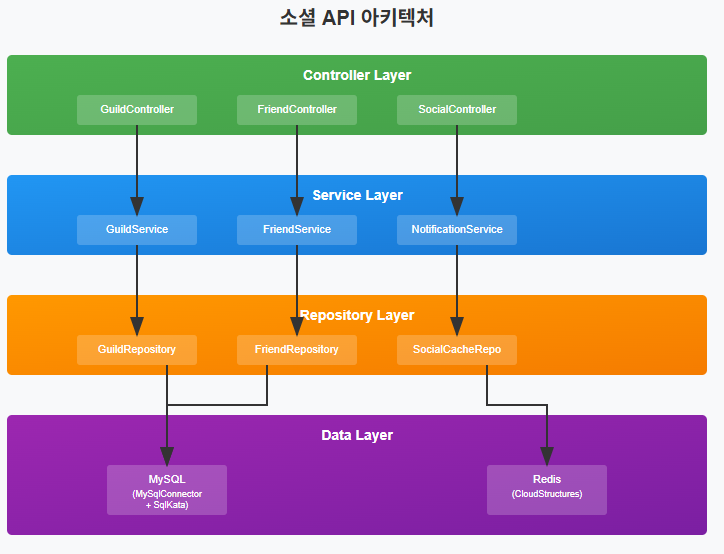
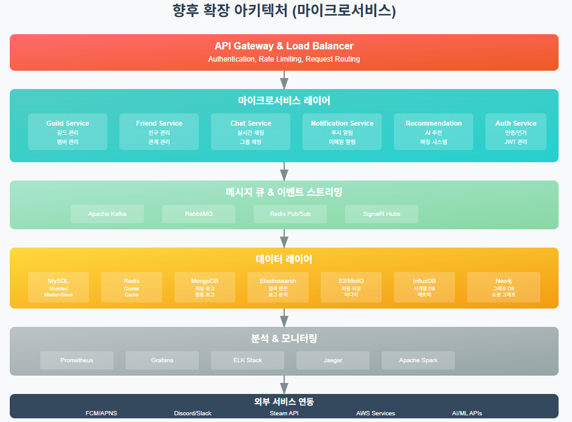

# ASP.NET Core Web API로 게임 서버 개발
  
저자: 최흥배, Claude AI   
-----------------------    
     
# API 분리 및 모듈화: 소셜 API (길드, 친구)

## 1. 소셜 API 모듈화의 필요성
수집형 RPG 게임에서 소셜 기능은 사용자 유지율과 직결되는 핵심 요소이다. 길드 시스템과 친구 시스템은 게임의 사회적 상호작용을 담당하며, 이러한 기능들을 별도의 모듈로 분리하여 관리하면 다음과 같은 이점을 얻을 수 있다:

- **관심사의 분리**: 소셜 기능과 게임 로직을 명확히 구분
- **유지보수성 향상**: 독립적인 모듈로 관리하여 코드 변경 시 영향 범위 최소화
- **확장성**: 새로운 소셜 기능 추가 시 기존 코드에 미치는 영향 최소화
- **테스트 용이성**: 모듈별 단위 테스트 수행 가능

## 2. 소셜 API 아키텍처 설계
   
  
  
## 3. 데이터베이스 설계

### 3.1 MySQL 테이블 설계

```sql
-- 길드 테이블
CREATE TABLE guilds (
    guild_id BIGINT PRIMARY KEY AUTO_INCREMENT,
    guild_name VARCHAR(50) NOT NULL UNIQUE,
    guild_description TEXT,
    master_user_id BIGINT NOT NULL,
    max_members INT DEFAULT 30,
    current_members INT DEFAULT 1,
    guild_level INT DEFAULT 1,
    guild_exp BIGINT DEFAULT 0,
    created_at TIMESTAMP DEFAULT CURRENT_TIMESTAMP,
    updated_at TIMESTAMP DEFAULT CURRENT_TIMESTAMP ON UPDATE CURRENT_TIMESTAMP,
    INDEX idx_master_user_id (master_user_id),
    INDEX idx_guild_name (guild_name)
);

-- 길드 멤버 테이블
CREATE TABLE guild_members (
    guild_id BIGINT,
    user_id BIGINT,
    role ENUM('MASTER', 'VICE_MASTER', 'MEMBER') DEFAULT 'MEMBER',
    joined_at TIMESTAMP DEFAULT CURRENT_TIMESTAMP,
    contribution_points BIGINT DEFAULT 0,
    PRIMARY KEY (guild_id, user_id),
    FOREIGN KEY (guild_id) REFERENCES guilds(guild_id) ON DELETE CASCADE,
    INDEX idx_user_id (user_id)
);

-- 친구 관계 테이블
CREATE TABLE friendships (
    user_id BIGINT,
    friend_user_id BIGINT,
    status ENUM('PENDING', 'ACCEPTED', 'BLOCKED') DEFAULT 'PENDING',
    created_at TIMESTAMP DEFAULT CURRENT_TIMESTAMP,
    updated_at TIMESTAMP DEFAULT CURRENT_TIMESTAMP ON UPDATE CURRENT_TIMESTAMP,
    PRIMARY KEY (user_id, friend_user_id),
    INDEX idx_friend_user_id (friend_user_id),
    INDEX idx_status (status)
);
```

### 3.2 Redis 캐시 설계
Redis는 자주 조회되는 소셜 데이터의 캐싱과 실시간 알림을 위해 사용한다:

- `guild:info:{guildId}`: 길드 기본 정보
- `guild:members:{guildId}`: 길드 멤버 목록
- `user:friends:{userId}`: 사용자 친구 목록
- `user:guild:{userId}`: 사용자가 속한 길드 정보
  

## 4. 프로젝트 구조 및 의존성 설정

### 4.1 프로젝트 구조

```
GameServer/
├── Controllers/
│   ├── Social/
│   │   ├── GuildController.cs
│   │   ├── FriendController.cs
│   │   └── SocialController.cs
├── Services/
│   ├── Social/
│   │   ├── IGuildService.cs
│   │   ├── GuildService.cs
│   │   ├── IFriendService.cs
│   │   ├── FriendService.cs
│   │   ├── INotificationService.cs
│   │   └── NotificationService.cs
├── Repositories/
│   ├── Social/
│   │   ├── IGuildRepository.cs
│   │   ├── GuildRepository.cs
│   │   ├── IFriendRepository.cs
│   │   ├── FriendRepository.cs
│   │   └── SocialCacheRepository.cs
├── Models/
│   └── Social/
│       ├── Guild.cs
│       ├── GuildMember.cs
│       ├── Friend.cs
│       └── SocialNotification.cs
└── DTOs/
    └── Social/
        ├── GuildDto.cs
        ├── FriendDto.cs
        └── SocialRequestDto.cs
```

### 4.2 NuGet 패키지 설치

```bash
dotnet add package MySqlConnector
dotnet add package SqlKata
dotnet add package SqlKata.Execution
dotnet add package CloudStructures
dotnet add package Microsoft.Extensions.Caching.StackExchangeRedis
```

## 5. 모델 및 DTO 정의   

```
// Models/Social/Guild.cs
using System.ComponentModel.DataAnnotations;

namespace GameServer.Models.Social;

public class Guild
{
    public long GuildId { get; set; }
    
    [Required, StringLength(50)]
    public string GuildName { get; set; } = string.Empty;
    
    [StringLength(500)]
    public string? GuildDescription { get; set; }
    
    public long MasterUserId { get; set; }
    
    public int MaxMembers { get; set; } = 30;
    
    public int CurrentMembers { get; set; } = 1;
    
    public int GuildLevel { get; set; } = 1;
    
    public long GuildExp { get; set; } = 0;
    
    public DateTime CreatedAt { get; set; }
    
    public DateTime UpdatedAt { get; set; }
    
    public List<GuildMember> Members { get; set; } = new();
}

// Models/Social/GuildMember.cs
namespace GameServer.Models.Social;

public class GuildMember
{
    public long GuildId { get; set; }
    
    public long UserId { get; set; }
    
    public GuildRole Role { get; set; } = GuildRole.Member;
    
    public DateTime JoinedAt { get; set; }
    
    public long ContributionPoints { get; set; } = 0;
    
    // Navigation properties
    public Guild? Guild { get; set; }
}

public enum GuildRole
{
    Master,
    ViceMaster,
    Member
}

// Models/Social/Friend.cs
namespace GameServer.Models.Social;

public class Friend
{
    public long UserId { get; set; }
    
    public long FriendUserId { get; set; }
    
    public FriendshipStatus Status { get; set; } = FriendshipStatus.Pending;
    
    public DateTime CreatedAt { get; set; }
    
    public DateTime UpdatedAt { get; set; }
}

public enum FriendshipStatus
{
    Pending,
    Accepted,
    Blocked
}

// DTOs/Social/GuildDto.cs
namespace GameServer.DTOs.Social;

public record CreateGuildRequest(
    string GuildName,
    string? GuildDescription = null
);

public record JoinGuildRequest(
    long GuildId
);

public record UpdateGuildRequest(
    long GuildId,
    string? GuildName = null,
    string? GuildDescription = null
);

public record GuildResponse(
    long GuildId,
    string GuildName,
    string? GuildDescription,
    long MasterUserId,
    int MaxMembers,
    int CurrentMembers,
    int GuildLevel,
    long GuildExp,
    DateTime CreatedAt,
    List<GuildMemberResponse> Members
);

public record GuildMemberResponse(
    long UserId,
    string UserName,
    GuildRole Role,
    DateTime JoinedAt,
    long ContributionPoints
);

// DTOs/Social/FriendDto.cs
namespace GameServer.DTOs.Social;

public record SendFriendRequestDto(
    long TargetUserId
);

public record RespondFriendRequestDto(
    long RequestUserId,
    bool Accept
);

public record FriendResponse(
    long UserId,
    string UserName,
    FriendshipStatus Status,
    DateTime CreatedAt,
    bool IsOnline
);

public record FriendListResponse(
    List<FriendResponse> Friends,
    List<FriendResponse> PendingRequests
);

// DTOs/Social/SocialNotification.cs
namespace GameServer.DTOs.Social;

public record SocialNotification(
    long UserId,
    SocialNotificationType Type,
    string Title,
    string Message,
    Dictionary<string, object>? Data = null,
    DateTime CreatedAt = default
);

public enum SocialNotificationType
{
    FriendRequest,
    FriendRequestAccepted,
    GuildInvitation,
    GuildJoinRequest,
    GuildMemberJoined,
    GuildMemberLeft,
    GuildLevelUp
}
```  
  
  
## 6. Repository 레이어 구현
  
```
// Repositories/Social/IGuildRepository.cs
using GameServer.Models.Social;

namespace GameServer.Repositories.Social;

public interface IGuildRepository
{
    Task<Guild?> GetGuildAsync(long guildId);
    Task<Guild?> GetGuildByNameAsync(string guildName);
    Task<Guild?> GetGuildByUserIdAsync(long userId);
    Task<long> CreateGuildAsync(Guild guild);
    Task<bool> UpdateGuildAsync(Guild guild);
    Task<bool> DeleteGuildAsync(long guildId);
    Task<List<Guild>> SearchGuildsAsync(string keyword, int page, int pageSize);
    
    Task<bool> AddMemberAsync(GuildMember member);
    Task<bool> RemoveMemberAsync(long guildId, long userId);
    Task<bool> UpdateMemberRoleAsync(long guildId, long userId, GuildRole role);
    Task<List<GuildMember>> GetGuildMembersAsync(long guildId);
    Task<GuildMember?> GetGuildMemberAsync(long guildId, long userId);
}

// Repositories/Social/GuildRepository.cs
using GameServer.Models.Social;
using MySqlConnector;
using SqlKata;
using SqlKata.Execution;

namespace GameServer.Repositories.Social;

public class GuildRepository : IGuildRepository
{
    private readonly QueryFactory _db;
    
    public GuildRepository(QueryFactory db)
    {
        _db = db;
    }
    
    public async Task<Guild?> GetGuildAsync(long guildId)
    {
        var guild = await _db.Query("guilds")
            .Where("guild_id", guildId)
            .FirstOrDefaultAsync<Guild>();
            
        if (guild != null)
        {
            guild.Members = await GetGuildMembersAsync(guildId);
        }
        
        return guild;
    }
    
    public async Task<Guild?> GetGuildByNameAsync(string guildName)
    {
        return await _db.Query("guilds")
            .Where("guild_name", guildName)
            .FirstOrDefaultAsync<Guild>();
    }
    
    public async Task<Guild?> GetGuildByUserIdAsync(long userId)
    {
        var guildMember = await _db.Query("guild_members")
            .Where("user_id", userId)
            .FirstOrDefaultAsync<GuildMember>();
            
        if (guildMember == null)
            return null;
            
        return await GetGuildAsync(guildMember.GuildId);
    }
    
    public async Task<long> CreateGuildAsync(Guild guild)
    {
        using var transaction = await _db.Connection.BeginTransactionAsync();
        
        try
        {
            // 길드 생성
            var guildId = await _db.Query("guilds").InsertGetIdAsync<long>(new
            {
                guild_name = guild.GuildName,
                guild_description = guild.GuildDescription,
                master_user_id = guild.MasterUserId,
                max_members = guild.MaxMembers,
                current_members = 1,
                guild_level = 1,
                guild_exp = 0,
                created_at = DateTime.UtcNow,
                updated_at = DateTime.UtcNow
            });
            
            // 길드 마스터를 멤버로 추가
            await _db.Query("guild_members").InsertAsync(new
            {
                guild_id = guildId,
                user_id = guild.MasterUserId,
                role = GuildRole.Master.ToString(),
                joined_at = DateTime.UtcNow,
                contribution_points = 0
            });
            
            await transaction.CommitAsync();
            return guildId;
        }
        catch
        {
            await transaction.RollbackAsync();
            throw;
        }
    }
    
    public async Task<bool> UpdateGuildAsync(Guild guild)
    {
        var affectedRows = await _db.Query("guilds")
            .Where("guild_id", guild.GuildId)
            .UpdateAsync(new
            {
                guild_name = guild.GuildName,
                guild_description = guild.GuildDescription,
                max_members = guild.MaxMembers,
                current_members = guild.CurrentMembers,
                guild_level = guild.GuildLevel,
                guild_exp = guild.GuildExp,
                updated_at = DateTime.UtcNow
            });
            
        return affectedRows > 0;
    }
    
    public async Task<bool> DeleteGuildAsync(long guildId)
    {
        var affectedRows = await _db.Query("guilds")
            .Where("guild_id", guildId)
            .DeleteAsync();
            
        return affectedRows > 0;
    }
    
    public async Task<List<Guild>> SearchGuildsAsync(string keyword, int page, int pageSize)
    {
        return await _db.Query("guilds")
            .WhereLike("guild_name", $"%{keyword}%")
            .OrWhereLike("guild_description", $"%{keyword}%")
            .OrderBy("current_members", "desc")
            .Offset((page - 1) * pageSize)
            .Limit(pageSize)
            .GetAsync<Guild>();
    }
    
    public async Task<bool> AddMemberAsync(GuildMember member)
    {
        using var transaction = await _db.Connection.BeginTransactionAsync();
        
        try
        {
            // 멤버 추가
            await _db.Query("guild_members").InsertAsync(new
            {
                guild_id = member.GuildId,
                user_id = member.UserId,
                role = member.Role.ToString(),
                joined_at = DateTime.UtcNow,
                contribution_points = 0
            });
            
            // 길드 현재 멤버 수 증가
            await _db.Query("guilds")
                .Where("guild_id", member.GuildId)
                .IncrementAsync("current_members", 1);
            
            await transaction.CommitAsync();
            return true;
        }
        catch
        {
            await transaction.RollbackAsync();
            return false;
        }
    }
    
    public async Task<bool> RemoveMemberAsync(long guildId, long userId)
    {
        using var transaction = await _db.Connection.BeginTransactionAsync();
        
        try
        {
            // 멤버 제거
            var removed = await _db.Query("guild_members")
                .Where("guild_id", guildId)
                .Where("user_id", userId)
                .DeleteAsync();
                
            if (removed > 0)
            {
                // 길드 현재 멤버 수 감소
                await _db.Query("guilds")
                    .Where("guild_id", guildId)
                    .DecrementAsync("current_members", 1);
            }
            
            await transaction.CommitAsync();
            return removed > 0;
        }
        catch
        {
            await transaction.RollbackAsync();
            return false;
        }
    }
    
    public async Task<bool> UpdateMemberRoleAsync(long guildId, long userId, GuildRole role)
    {
        var affectedRows = await _db.Query("guild_members")
            .Where("guild_id", guildId)
            .Where("user_id", userId)
            .UpdateAsync(new { role = role.ToString() });
            
        return affectedRows > 0;
    }
    
    public async Task<List<GuildMember>> GetGuildMembersAsync(long guildId)
    {
        return await _db.Query("guild_members")
            .Where("guild_id", guildId)
            .OrderBy("role")
            .ThenBy("joined_at")
            .GetAsync<GuildMember>();
    }
    
    public async Task<GuildMember?> GetGuildMemberAsync(long guildId, long userId)
    {
        return await _db.Query("guild_members")
            .Where("guild_id", guildId)
            .Where("user_id", userId)
            .FirstOrDefaultAsync<GuildMember>();
    }
}

// Repositories/Social/IFriendRepository.cs
using GameServer.Models.Social;

namespace GameServer.Repositories.Social;

public interface IFriendRepository
{
    Task<List<Friend>> GetFriendsAsync(long userId);
    Task<List<Friend>> GetPendingRequestsAsync(long userId);
    Task<Friend?> GetFriendshipAsync(long userId, long friendUserId);
    Task<bool> SendFriendRequestAsync(long userId, long targetUserId);
    Task<bool> AcceptFriendRequestAsync(long userId, long requestUserId);
    Task<bool> RejectFriendRequestAsync(long userId, long requestUserId);
    Task<bool> RemoveFriendAsync(long userId, long friendUserId);
    Task<bool> BlockUserAsync(long userId, long targetUserId);
    Task<bool> UnblockUserAsync(long userId, long targetUserId);
}

// Repositories/Social/FriendRepository.cs
using GameServer.Models.Social;
using SqlKata.Execution;

namespace GameServer.Repositories.Social;

public class FriendRepository : IFriendRepository
{
    private readonly QueryFactory _db;
    
    public FriendRepository(QueryFactory db)
    {
        _db = db;
    }
    
    public async Task<List<Friend>> GetFriendsAsync(long userId)
    {
        return await _db.Query("friendships")
            .Where("user_id", userId)
            .Where("status", FriendshipStatus.Accepted.ToString())
            .GetAsync<Friend>();
    }
    
    public async Task<List<Friend>> GetPendingRequestsAsync(long userId)
    {
        return await _db.Query("friendships")
            .Where("friend_user_id", userId)
            .Where("status", FriendshipStatus.Pending.ToString())
            .GetAsync<Friend>();
    }
    
    public async Task<Friend?> GetFriendshipAsync(long userId, long friendUserId)
    {
        return await _db.Query("friendships")
            .Where("user_id", userId)
            .Where("friend_user_id", friendUserId)
            .FirstOrDefaultAsync<Friend>();
    }
    
    public async Task<bool> SendFriendRequestAsync(long userId, long targetUserId)
    {
        // 이미 친구 관계가 있는지 확인
        var existing = await GetFriendshipAsync(userId, targetUserId);
        if (existing != null)
            return false;
            
        // 반대 방향 관계도 확인
        var reverse = await GetFriendshipAsync(targetUserId, userId);
        if (reverse != null)
            return false;
        
        try
        {
            await _db.Query("friendships").InsertAsync(new
            {
                user_id = userId,
                friend_user_id = targetUserId,
                status = FriendshipStatus.Pending.ToString(),
                created_at = DateTime.UtcNow,
                updated_at = DateTime.UtcNow
            });
            return true;
        }
        catch
        {
            return false;
        }
    }
    
    public async Task<bool> AcceptFriendRequestAsync(long userId, long requestUserId)
    {
        using var transaction = await _db.Connection.BeginTransactionAsync();
        
        try
        {
            // 요청 승인
            await _db.Query("friendships")
                .Where("user_id", requestUserId)
                .Where("friend_user_id", userId)
                .Where("status", FriendshipStatus.Pending.ToString())
                .UpdateAsync(new
                {
                    status = FriendshipStatus.Accepted.ToString(),
                    updated_at = DateTime.UtcNow
                });
            
            // 양방향 관계 생성
            await _db.Query("friendships").InsertAsync(new
            {
                user_id = userId,
                friend_user_id = requestUserId,
                status = FriendshipStatus.Accepted.ToString(),
                created_at = DateTime.UtcNow,
                updated_at = DateTime.UtcNow
            });
            
            await transaction.CommitAsync();
            return true;
        }
        catch
        {
            await transaction.RollbackAsync();
            return false;
        }
    }
    
    public async Task<bool> RejectFriendRequestAsync(long userId, long requestUserId)
    {
        var affectedRows = await _db.Query("friendships")
            .Where("user_id", requestUserId)
            .Where("friend_user_id", userId)
            .Where("status", FriendshipStatus.Pending.ToString())
            .DeleteAsync();
            
        return affectedRows > 0;
    }
    
    public async Task<bool> RemoveFriendAsync(long userId, long friendUserId)
    {
        using var transaction = await _db.Connection.BeginTransactionAsync();
        
        try
        {
            // 양방향 관계 모두 삭제
            await _db.Query("friendships")
                .Where(q => q
                    .Where(nested => nested
                        .Where("user_id", userId)
                        .Where("friend_user_id", friendUserId))
                    .OrWhere(nested => nested
                        .Where("user_id", friendUserId)
                        .Where("friend_user_id", userId)))
                .DeleteAsync();
                
            await transaction.CommitAsync();
            return true;
        }
        catch
        {
            await transaction.RollbackAsync();
            return false;
        }
    }
    
    public async Task<bool> BlockUserAsync(long userId, long targetUserId)
    {
        // 기존 관계 삭제 후 차단 관계 생성
        await RemoveFriendAsync(userId, targetUserId);
        
        try
        {
            await _db.Query("friendships").InsertAsync(new
            {
                user_id = userId,
                friend_user_id = targetUserId,
                status = FriendshipStatus.Blocked.ToString(),
                created_at = DateTime.UtcNow,
                updated_at = DateTime.UtcNow
            });
            return true;
        }
        catch
        {
            return false;
        }
    }
    
    public async Task<bool> UnblockUserAsync(long userId, long targetUserId)
    {
        var affectedRows = await _db.Query("friendships")
            .Where("user_id", userId)
            .Where("friend_user_id", targetUserId)
            .Where("status", FriendshipStatus.Blocked.ToString())
            .DeleteAsync();
            
        return affectedRows > 0;
    }
}
```
  
```
// Repositories/Social/SocialCacheRepository.cs
using CloudStructures;
using CloudStructures.Structures;
using GameServer.Models.Social;
using System.Text.Json;

namespace GameServer.Repositories.Social;

public interface ISocialCacheRepository
{
    // 길드 캐시
    Task<Guild?> GetGuildCacheAsync(long guildId);
    Task SetGuildCacheAsync(Guild guild, TimeSpan? expiry = null);
    Task DeleteGuildCacheAsync(long guildId);
    
    // 길드 멤버 캐시
    Task<List<GuildMember>?> GetGuildMembersCacheAsync(long guildId);
    Task SetGuildMembersCacheAsync(long guildId, List<GuildMember> members, TimeSpan? expiry = null);
    Task DeleteGuildMembersCacheAsync(long guildId);
    
    // 사용자 길드 캐시
    Task<long?> GetUserGuildCacheAsync(long userId);
    Task SetUserGuildCacheAsync(long userId, long guildId, TimeSpan? expiry = null);
    Task DeleteUserGuildCacheAsync(long userId);
    
    // 친구 목록 캐시
    Task<List<Friend>?> GetFriendListCacheAsync(long userId);
    Task SetFriendListCacheAsync(long userId, List<Friend> friends, TimeSpan? expiry = null);
    Task DeleteFriendListCacheAsync(long userId);
    
    // 온라인 상태 캐시
    Task SetUserOnlineAsync(long userId, TimeSpan? expiry = null);
    Task SetUserOfflineAsync(long userId);
    Task<bool> IsUserOnlineAsync(long userId);
    Task<List<long>> GetOnlineFriendsAsync(List<long> friendUserIds);
    
    // 실시간 알림
    Task PublishSocialNotificationAsync(long userId, SocialNotification notification);
    Task SubscribeToSocialNotificationsAsync(long userId, Func<SocialNotification, Task> onNotification);
}

public class SocialCacheRepository : ISocialCacheRepository
{
    private readonly RedisConnection _redis;
    private readonly JsonSerializerOptions _jsonOptions;
    
    private static readonly TimeSpan DefaultExpiry = TimeSpan.FromMinutes(30);
    private static readonly TimeSpan OnlineExpiry = TimeSpan.FromMinutes(5);
    
    public SocialCacheRepository(RedisConnection redis)
    {
        _redis = redis;
        _jsonOptions = new JsonSerializerOptions
        {
            PropertyNamingPolicy = JsonNamingPolicy.CamelCase,
            WriteIndented = false
        };
    }
    
    // 길드 캐시
    public async Task<Guild?> GetGuildCacheAsync(long guildId)
    {
        var key = $"guild:info:{guildId}";
        var redisString = new RedisString<string>(_redis, key, DefaultExpiry);
        
        var json = await redisString.GetAsync();
        return json.HasValue ? JsonSerializer.Deserialize<Guild>(json.Value, _jsonOptions) : null;
    }
    
    public async Task SetGuildCacheAsync(Guild guild, TimeSpan? expiry = null)
    {
        var key = $"guild:info:{guild.GuildId}";
        var redisString = new RedisString<string>(_redis, key, expiry ?? DefaultExpiry);
        
        var json = JsonSerializer.Serialize(guild, _jsonOptions);
        await redisString.SetAsync(json);
    }
    
    public async Task DeleteGuildCacheAsync(long guildId)
    {
        var key = $"guild:info:{guildId}";
        var redisString = new RedisString<string>(_redis, key, DefaultExpiry);
        await redisString.DeleteAsync();
    }
    
    // 길드 멤버 캐시
    public async Task<List<GuildMember>?> GetGuildMembersCacheAsync(long guildId)
    {
        var key = $"guild:members:{guildId}";
        var redisString = new RedisString<string>(_redis, key, DefaultExpiry);
        
        var json = await redisString.GetAsync();
        return json.HasValue ? JsonSerializer.Deserialize<List<GuildMember>>(json.Value, _jsonOptions) : null;
    }
    
    public async Task SetGuildMembersCacheAsync(long guildId, List<GuildMember> members, TimeSpan? expiry = null)
    {
        var key = $"guild:members:{guildId}";
        var redisString = new RedisString<string>(_redis, key, expiry ?? DefaultExpiry);
        
        var json = JsonSerializer.Serialize(members, _jsonOptions);
        await redisString.SetAsync(json);
    }
    
    public async Task DeleteGuildMembersCacheAsync(long guildId)
    {
        var key = $"guild:members:{guildId}";
        var redisString = new RedisString<string>(_redis, key, DefaultExpiry);
        await redisString.DeleteAsync();
    }
    
    // 사용자 길드 캐시
    public async Task<long?> GetUserGuildCacheAsync(long userId)
    {
        var key = $"user:guild:{userId}";
        var redisString = new RedisString<long>(_redis, key, DefaultExpiry);
        
        var result = await redisString.GetAsync();
        return result.HasValue ? result.Value : null;
    }
    
    public async Task SetUserGuildCacheAsync(long userId, long guildId, TimeSpan? expiry = null)
    {
        var key = $"user:guild:{userId}";
        var redisString = new RedisString<long>(_redis, key, expiry ?? DefaultExpiry);
        
        await redisString.SetAsync(guildId);
    }
    
    public async Task DeleteUserGuildCacheAsync(long userId)
    {
        var key = $"user:guild:{userId}";
        var redisString = new RedisString<long>(_redis, key, DefaultExpiry);
        await redisString.DeleteAsync();
    }
    
    // 친구 목록 캐시
    public async Task<List<Friend>?> GetFriendListCacheAsync(long userId)
    {
        var key = $"user:friends:{userId}";
        var redisString = new RedisString<string>(_redis, key, DefaultExpiry);
        
        var json = await redisString.GetAsync();
        return json.HasValue ? JsonSerializer.Deserialize<List<Friend>>(json.Value, _jsonOptions) : null;
    }
    
    public async Task SetFriendListCacheAsync(long userId, List<Friend> friends, TimeSpan? expiry = null)
    {
        var key = $"user:friends:{userId}";
        var redisString = new RedisString<string>(_redis, key, expiry ?? DefaultExpiry);
        
        var json = JsonSerializer.Serialize(friends, _jsonOptions);
        await redisString.SetAsync(json);
    }
    
    public async Task DeleteFriendListCacheAsync(long userId)
    {
        var key = $"user:friends:{userId}";
        var redisString = new RedisString<string>(_redis, key, DefaultExpiry);
        await redisString.DeleteAsync();
    }
    
    // 온라인 상태 캐시
    public async Task SetUserOnlineAsync(long userId, TimeSpan? expiry = null)
    {
        var key = $"user:online:{userId}";
        var redisString = new RedisString<bool>(_redis, key, expiry ?? OnlineExpiry);
        
        await redisString.SetAsync(true);
    }
    
    public async Task SetUserOfflineAsync(long userId)
    {
        var key = $"user:online:{userId}";
        var redisString = new RedisString<bool>(_redis, key, OnlineExpiry);
        await redisString.DeleteAsync();
    }
    
    public async Task<bool> IsUserOnlineAsync(long userId)
    {
        var key = $"user:online:{userId}";
        var redisString = new RedisString<bool>(_redis, key, OnlineExpiry);
        
        var result = await redisString.GetAsync();
        return result.HasValue && result.Value;
    }
    
    public async Task<List<long>> GetOnlineFriendsAsync(List<long> friendUserIds)
    {
        var onlineFriends = new List<long>();
        
        foreach (var friendId in friendUserIds)
        {
            if (await IsUserOnlineAsync(friendId))
            {
                onlineFriends.Add(friendId);
            }
        }
        
        return onlineFriends;
    }
    
    // 실시간 알림
    public async Task PublishSocialNotificationAsync(long userId, SocialNotification notification)
    {
        var channel = $"social:notifications:{userId}";
        var publisher = new RedisString<string>(_redis, channel, TimeSpan.FromSeconds(1));
        
        var json = JsonSerializer.Serialize(notification, _jsonOptions);
        await _redis.GetDatabase().PublishAsync(channel, json);
    }
    
    public async Task SubscribeToSocialNotificationsAsync(long userId, Func<SocialNotification, Task> onNotification)
    {
        var channel = $"social:notifications:{userId}";
        var subscriber = _redis.GetSubscriber();
        
        await subscriber.SubscribeAsync(channel, async (redisChannel, message) =>
        {
            if (message.HasValue)
            {
                try
                {
                    var notification = JsonSerializer.Deserialize<SocialNotification>(message, _jsonOptions);
                    if (notification != null)
                    {
                        await onNotification(notification);
                    }
                }
                catch (Exception ex)
                {
                    // 로깅 처리
                    Console.WriteLine($"Failed to process social notification: {ex.Message}");
                }
            }
        });
    }
}

// 확장 메서드
public static class SocialCacheExtensions
{
    public static async Task InvalidateUserSocialCacheAsync(this ISocialCacheRepository cache, long userId)
    {
        // 사용자 관련 모든 캐시 무효화
        await cache.DeleteFriendListCacheAsync(userId);
        await cache.DeleteUserGuildCacheAsync(userId);
        
        // 사용자가 속한 길드의 멤버 캐시도 무효화
        var guildId = await cache.GetUserGuildCacheAsync(userId);
        if (guildId.HasValue)
        {
            await cache.DeleteGuildMembersCacheAsync(guildId.Value);
        }
    }
    
    public static async Task InvalidateGuildCacheAsync(this ISocialCacheRepository cache, long guildId, List<long>? memberUserIds = null)
    {
        // 길드 관련 캐시 무효화
        await cache.DeleteGuildCacheAsync(guildId);
        await cache.DeleteGuildMembersCacheAsync(guildId);
        
        // 길드 멤버들의 사용자 길드 캐시도 무효화
        if (memberUserIds != null)
        {
            foreach (var userId in memberUserIds)
            {
                await cache.DeleteUserGuildCacheAsync(userId);
            }
        }
    }
}
```
  
  
## 7. Service 레이어 구현
  
```
// Services/Social/IGuildService.cs
using GameServer.DTOs.Social;
using GameServer.Models.Social;

namespace GameServer.Services.Social;

public interface IGuildService
{
    Task<ApiResult<GuildResponse>> CreateGuildAsync(long userId, CreateGuildRequest request);
    Task<ApiResult<GuildResponse>> GetGuildAsync(long guildId);
    Task<ApiResult<GuildResponse>> GetMyGuildAsync(long userId);
    Task<ApiResult<GuildResponse>> JoinGuildAsync(long userId, JoinGuildRequest request);
    Task<ApiResult<bool>> LeaveGuildAsync(long userId);
    Task<ApiResult<bool>> KickMemberAsync(long userId, long targetUserId);
    Task<ApiResult<bool>> PromoteMemberAsync(long userId, long targetUserId);
    Task<ApiResult<bool>> DemoteMemberAsync(long userId, long targetUserId);
    Task<ApiResult<bool>> UpdateGuildAsync(long userId, UpdateGuildRequest request);
    Task<ApiResult<bool>> DisbandGuildAsync(long userId);
    Task<ApiResult<List<GuildResponse>>> SearchGuildsAsync(string keyword, int page = 1, int pageSize = 20);
}

// Services/Social/GuildService.cs
using GameServer.DTOs.Social;
using GameServer.Models.Social;
using GameServer.Repositories.Social;

namespace GameServer.Services.Social;

public class GuildService : IGuildService
{
    private readonly IGuildRepository _guildRepo;
    private readonly ISocialCacheRepository _cache;
    private readonly INotificationService _notificationService;
    
    public GuildService(
        IGuildRepository guildRepo,
        ISocialCacheRepository cache,
        INotificationService notificationService)
    {
        _guildRepo = guildRepo;
        _cache = cache;
        _notificationService = notificationService;
    }
    
    public async Task<ApiResult<GuildResponse>> CreateGuildAsync(long userId, CreateGuildRequest request)
    {
        // 이미 길드에 속해있는지 확인
        var existingGuild = await GetMyGuildAsync(userId);
        if (existingGuild.IsSuccess)
        {
            return ApiResult<GuildResponse>.Failure("이미 길드에 속해있습니다");
        }
        
        // 길드명 중복 확인
        var duplicateCheck = await _guildRepo.GetGuildByNameAsync(request.GuildName);
        if (duplicateCheck != null)
        {
            return ApiResult<GuildResponse>.Failure("이미 사용중인 길드명입니다");
        }
        
        // 길드 생성
        var guild = new Guild
        {
            GuildName = request.GuildName,
            GuildDescription = request.GuildDescription,
            MasterUserId = userId,
            CreatedAt = DateTime.UtcNow,
            UpdatedAt = DateTime.UtcNow
        };
        
        var guildId = await _guildRepo.CreateGuildAsync(guild);
        guild.GuildId = guildId;
        
        // 캐시 설정
        await _cache.SetGuildCacheAsync(guild);
        await _cache.SetUserGuildCacheAsync(userId, guildId);
        
        var response = MapToGuildResponse(guild);
        return ApiResult<GuildResponse>.Success(response);
    }
    
    public async Task<ApiResult<GuildResponse>> GetGuildAsync(long guildId)
    {
        // 캐시에서 먼저 조회
        var cachedGuild = await _cache.GetGuildCacheAsync(guildId);
        if (cachedGuild != null)
        {
            var cachedMembers = await _cache.GetGuildMembersCacheAsync(guildId);
            if (cachedMembers != null)
            {
                cachedGuild.Members = cachedMembers;
            }
            return ApiResult<GuildResponse>.Success(MapToGuildResponse(cachedGuild));
        }
        
        // DB에서 조회
        var guild = await _guildRepo.GetGuildAsync(guildId);
        if (guild == null)
        {
            return ApiResult<GuildResponse>.Failure("길드를 찾을 수 없습니다");
        }
        
        // 캐시에 저장
        await _cache.SetGuildCacheAsync(guild);
        await _cache.SetGuildMembersCacheAsync(guildId, guild.Members);
        
        var response = MapToGuildResponse(guild);
        return ApiResult<GuildResponse>.Success(response);
    }
    
    public async Task<ApiResult<GuildResponse>> GetMyGuildAsync(long userId)
    {
        // 캐시에서 사용자 길드 ID 조회
        var cachedGuildId = await _cache.GetUserGuildCacheAsync(userId);
        if (cachedGuildId.HasValue)
        {
            return await GetGuildAsync(cachedGuildId.Value);
        }
        
        // DB에서 조회
        var guild = await _guildRepo.GetGuildByUserIdAsync(userId);
        if (guild == null)
        {
            return ApiResult<GuildResponse>.Failure("소속된 길드가 없습니다");
        }
        
        // 캐시에 저장
        await _cache.SetUserGuildCacheAsync(userId, guild.GuildId);
        await _cache.SetGuildCacheAsync(guild);
        
        var response = MapToGuildResponse(guild);
        return ApiResult<GuildResponse>.Success(response);
    }
    
    public async Task<ApiResult<GuildResponse>> JoinGuildAsync(long userId, JoinGuildRequest request)
    {
        // 이미 길드에 속해있는지 확인
        var existingGuild = await GetMyGuildAsync(userId);
        if (existingGuild.IsSuccess)
        {
            return ApiResult<GuildResponse>.Failure("이미 길드에 속해있습니다");
        }
        
        // 길드 존재 확인
        var guildResult = await GetGuildAsync(request.GuildId);
        if (!guildResult.IsSuccess)
        {
            return ApiResult<GuildResponse>.Failure("길드를 찾을 수 없습니다");
        }
        
        var guild = guildResult.Data!;
        
        // 길드 정원 확인
        if (guild.CurrentMembers >= guild.MaxMembers)
        {
            return ApiResult<GuildResponse>.Failure("길드 정원이 가득찼습니다");
        }
        
        // 멤버 추가
        var member = new GuildMember
        {
            GuildId = request.GuildId,
            UserId = userId,
            Role = GuildRole.Member,
            JoinedAt = DateTime.UtcNow
        };
        
        var joined = await _guildRepo.AddMemberAsync(member);
        if (!joined)
        {
            return ApiResult<GuildResponse>.Failure("길드 가입에 실패했습니다");
        }
        
        // 캐시 무효화
        await _cache.InvalidateGuildCacheAsync(request.GuildId);
        await _cache.SetUserGuildCacheAsync(userId, request.GuildId);
        
        // 길드 멤버들에게 알림
        await _notificationService.NotifyGuildMemberJoinedAsync(request.GuildId, userId);
        
        return await GetGuildAsync(request.GuildId);
    }
    
    public async Task<ApiResult<bool>> LeaveGuildAsync(long userId)
    {
        var guildResult = await GetMyGuildAsync(userId);
        if (!guildResult.IsSuccess)
        {
            return ApiResult<bool>.Failure("소속된 길드가 없습니다");
        }
        
        var guild = guildResult.Data!;
        
        // 길드 마스터는 탈퇴 불가
        if (guild.MasterUserId == userId)
        {
            return ApiResult<bool>.Failure("길드 마스터는 탈퇴할 수 없습니다. 길드를 해체하거나 마스터를 위임하세요");
        }
        
        // 멤버 제거
        var removed = await _guildRepo.RemoveMemberAsync(guild.GuildId, userId);
        if (!removed)
        {
            return ApiResult<bool>.Failure("길드 탈퇴에 실패했습니다");
        }
        
        // 캐시 무효화
        await _cache.InvalidateGuildCacheAsync(guild.GuildId);
        await _cache.DeleteUserGuildCacheAsync(userId);
        
        // 길드 멤버들에게 알림
        await _notificationService.NotifyGuildMemberLeftAsync(guild.GuildId, userId);
        
        return ApiResult<bool>.Success(true);
    }
    
    public async Task<ApiResult<bool>> KickMemberAsync(long userId, long targetUserId)
    {
        var guildResult = await GetMyGuildAsync(userId);
        if (!guildResult.IsSuccess)
        {
            return ApiResult<bool>.Failure("소속된 길드가 없습니다");
        }
        
        var guild = guildResult.Data!;
        
        // 권한 확인 (마스터 또는 부마스터만 가능)
        var requesterMember = guild.Members.FirstOrDefault(m => m.UserId == userId);
        if (requesterMember == null || requesterMember.Role == GuildRole.Member)
        {
            return ApiResult<bool>.Failure("멤버를 추방할 권한이 없습니다");
        }
        
        // 대상 멤버 확인
        var targetMember = guild.Members.FirstOrDefault(m => m.UserId == targetUserId);
        if (targetMember == null)
        {
            return ApiResult<bool>.Failure("해당 사용자는 길드 멤버가 아닙니다");
        }
        
        // 마스터는 추방 불가
        if (targetMember.Role == GuildRole.Master)
        {
            return ApiResult<bool>.Failure("길드 마스터는 추방할 수 없습니다");
        }
        
        // 추방 실행
        var removed = await _guildRepo.RemoveMemberAsync(guild.GuildId, targetUserId);
        if (!removed)
        {
            return ApiResult<bool>.Failure("멤버 추방에 실패했습니다");
        }
        
        // 캐시 무효화
        await _cache.InvalidateGuildCacheAsync(guild.GuildId);
        await _cache.DeleteUserGuildCacheAsync(targetUserId);
        
        return ApiResult<bool>.Success(true);
    }
    
    public async Task<ApiResult<bool>> PromoteMemberAsync(long userId, long targetUserId)
    {
        return await UpdateMemberRoleAsync(userId, targetUserId, true);
    }
    
    public async Task<ApiResult<bool>> DemoteMemberAsync(long userId, long targetUserId)
    {
        return await UpdateMemberRoleAsync(userId, targetUserId, false);
    }
    
    private async Task<ApiResult<bool>> UpdateMemberRoleAsync(long userId, long targetUserId, bool promote)
    {
        var guildResult = await GetMyGuildAsync(userId);
        if (!guildResult.IsSuccess)
        {
            return ApiResult<bool>.Failure("소속된 길드가 없습니다");
        }
        
        var guild = guildResult.Data!;
        
        // 마스터만 승급/강등 가능
        if (guild.MasterUserId != userId)
        {
            return ApiResult<bool>.Failure("길드 마스터만 멤버 역할을 변경할 수 있습니다");
        }
        
        var targetMember = guild.Members.FirstOrDefault(m => m.UserId == targetUserId);
        if (targetMember == null)
        {
            return ApiResult<bool>.Failure("해당 사용자는 길드 멤버가 아닙니다");
        }
        
        var newRole = promote 
            ? (targetMember.Role == GuildRole.Member ? GuildRole.ViceMaster : targetMember.Role)
            : (targetMember.Role == GuildRole.ViceMaster ? GuildRole.Member : targetMember.Role);
        
        if (newRole == targetMember.Role)
        {
            return ApiResult<bool>.Failure("더 이상 승급/강등할 수 없습니다");
        }
        
        var updated = await _guildRepo.UpdateMemberRoleAsync(guild.GuildId, targetUserId, newRole);
        if (!updated)
        {
            return ApiResult<bool>.Failure("역할 변경에 실패했습니다");
        }
        
        // 캐시 무효화
        await _cache.InvalidateGuildCacheAsync(guild.GuildId);
        
        return ApiResult<bool>.Success(true);
    }
    
    public async Task<ApiResult<bool>> UpdateGuildAsync(long userId, UpdateGuildRequest request)
    {
        var guildResult = await GetMyGuildAsync(userId);
        if (!guildResult.IsSuccess)
        {
            return ApiResult<bool>.Failure("소속된 길드가 없습니다");
        }
        
        var guild = guildResult.Data!;
        
        // 마스터만 길드 정보 수정 가능
        if (guild.MasterUserId != userId)
        {
            return ApiResult<bool>.Failure("길드 마스터만 길드 정보를 수정할 수 있습니다");
        }
        
        // 길드명 중복 확인 (변경하는 경우)
        if (!string.IsNullOrEmpty(request.GuildName) && request.GuildName != guild.GuildName)
        {
            var duplicateCheck = await _guildRepo.GetGuildByNameAsync(request.GuildName);
            if (duplicateCheck != null)
            {
                return ApiResult<bool>.Failure("이미 사용중인 길드명입니다");
            }
        }
        
        // 업데이트할 Guild 객체 생성
        var updatedGuild = new Guild
        {
            GuildId = guild.GuildId,
            GuildName = request.GuildName ?? guild.GuildName,
            GuildDescription = request.GuildDescription ?? guild.GuildDescription,
            MasterUserId = guild.MasterUserId,
            MaxMembers = guild.MaxMembers,
            CurrentMembers = guild.CurrentMembers,
            GuildLevel = guild.GuildLevel,
            GuildExp = guild.GuildExp,
            CreatedAt = guild.CreatedAt,
            UpdatedAt = DateTime.UtcNow
        };
        
        var updated = await _guildRepo.UpdateGuildAsync(updatedGuild);
        if (!updated)
        {
            return ApiResult<bool>.Failure("길드 정보 수정에 실패했습니다");
        }
        
        // 캐시 무효화
        await _cache.DeleteGuildCacheAsync(guild.GuildId);
        
        return ApiResult<bool>.Success(true);
    }
    
    public async Task<ApiResult<bool>> DisbandGuildAsync(long userId)
    {
        var guildResult = await GetMyGuildAsync(userId);
        if (!guildResult.IsSuccess)
        {
            return ApiResult<bool>.Failure("소속된 길드가 없습니다");
        }
        
        var guild = guildResult.Data!;
        
        // 마스터만 길드 해체 가능
        if (guild.MasterUserId != userId)
        {
            return ApiResult<bool>.Failure("길드 마스터만 길드를 해체할 수 있습니다");
        }
        
        var memberUserIds = guild.Members.Select(m => m.UserId).ToList();
        
        var deleted = await _guildRepo.DeleteGuildAsync(guild.GuildId);
        if (!deleted)
        {
            return ApiResult<bool>.Failure("길드 해체에 실패했습니다");
        }
        
        // 캐시 무효화
        await _cache.InvalidateGuildCacheAsync(guild.GuildId, memberUserIds);
        
        return ApiResult<bool>.Success(true);
    }
    
    public async Task<ApiResult<List<GuildResponse>>> SearchGuildsAsync(string keyword, int page = 1, int pageSize = 20)
    {
        var guilds = await _guildRepo.SearchGuildsAsync(keyword, page, pageSize);
        var responses = guilds.Select(MapToGuildResponse).ToList();
        
        return ApiResult<List<GuildResponse>>.Success(responses);
    }
    
    private static GuildResponse MapToGuildResponse(Guild guild)
    {
        var members = guild.Members.Select(m => new GuildMemberResponse(
            m.UserId,
            $"User{m.UserId}", // 실제로는 사용자 이름을 조회
            m.Role,
            m.JoinedAt,
            m.ContributionPoints
        )).ToList();
        
        return new GuildResponse(
            guild.GuildId,
            guild.GuildName,
            guild.GuildDescription,
            guild.MasterUserId,
            guild.MaxMembers,
            guild.CurrentMembers,
            guild.GuildLevel,
            guild.GuildExp,
            guild.CreatedAt,
            members
        );
    }
}

// 공통 API 결과 클래스
public class ApiResult<T>
{
    public bool IsSuccess { get; set; }
    public T? Data { get; set; }
    public string? ErrorMessage { get; set; }
    
    public static ApiResult<T> Success(T data)
    {
        return new ApiResult<T> { IsSuccess = true, Data = data };
    }
    
    public static ApiResult<T> Failure(string errorMessage)
    {
        return new ApiResult<T> { IsSuccess = false, ErrorMessage = errorMessage };
    }
}
```
  
```
// Services/Social/IFriendService.cs
using GameServer.DTOs.Social;

namespace GameServer.Services.Social;

public interface IFriendService
{
    Task<ApiResult<FriendListResponse>> GetFriendListAsync(long userId);
    Task<ApiResult<bool>> SendFriendRequestAsync(long userId, SendFriendRequestDto request);
    Task<ApiResult<bool>> AcceptFriendRequestAsync(long userId, RespondFriendRequestDto request);
    Task<ApiResult<bool>> RejectFriendRequestAsync(long userId, RespondFriendRequestDto request);
    Task<ApiResult<bool>> RemoveFriendAsync(long userId, long friendUserId);
    Task<ApiResult<bool>> BlockUserAsync(long userId, long targetUserId);
    Task<ApiResult<bool>> UnblockUserAsync(long userId, long targetUserId);
}

// Services/Social/FriendService.cs
using GameServer.DTOs.Social;
using GameServer.Models.Social;
using GameServer.Repositories.Social;

namespace GameServer.Services.Social;

public class FriendService : IFriendService
{
    private readonly IFriendRepository _friendRepo;
    private readonly ISocialCacheRepository _cache;
    private readonly INotificationService _notificationService;
    
    public FriendService(
        IFriendRepository friendRepo,
        ISocialCacheRepository cache,
        INotificationService notificationService)
    {
        _friendRepo = friendRepo;
        _cache = cache;
        _notificationService = notificationService;
    }
    
    public async Task<ApiResult<FriendListResponse>> GetFriendListAsync(long userId)
    {
        // 캐시에서 먼저 조회
        var cachedFriends = await _cache.GetFriendListCacheAsync(userId);
        List<Friend> friends;
        
        if (cachedFriends != null)
        {
            friends = cachedFriends;
        }
        else
        {
            // DB에서 조회
            friends = await _friendRepo.GetFriendsAsync(userId);
            
            // 캐시에 저장
            await _cache.SetFriendListCacheAsync(userId, friends);
        }
        
        // 친구 요청 목록 조회
        var pendingRequests = await _friendRepo.GetPendingRequestsAsync(userId);
        
        // 온라인 상태 확인
        var friendUserIds = friends.Select(f => f.FriendUserId).ToList();
        var onlineFriends = await _cache.GetOnlineFriendsAsync(friendUserIds);
        
        // 응답 생성
        var friendResponses = friends.Select(f => new FriendResponse(
            f.FriendUserId,
            $"User{f.FriendUserId}", // 실제로는 사용자 이름을 조회
            f.Status,
            f.CreatedAt,
            onlineFriends.Contains(f.FriendUserId)
        )).ToList();
        
        var requestResponses = pendingRequests.Select(r => new FriendResponse(
            r.UserId,
            $"User{r.UserId}", // 실제로는 사용자 이름을 조회
            r.Status,
            r.CreatedAt,
            false
        )).ToList();
        
        var response = new FriendListResponse(friendResponses, requestResponses);
        return ApiResult<FriendListResponse>.Success(response);
    }
    
    public async Task<ApiResult<bool>> SendFriendRequestAsync(long userId, SendFriendRequestDto request)
    {
        // 자기 자신에게 친구 요청 불가
        if (userId == request.TargetUserId)
        {
            return ApiResult<bool>.Failure("자기 자신에게 친구 요청을 보낼 수 없습니다");
        }
        
        // 이미 친구 관계가 있는지 확인
        var existing = await _friendRepo.GetFriendshipAsync(userId, request.TargetUserId);
        if (existing != null)
        {
            return existing.Status switch
            {
                FriendshipStatus.Accepted => ApiResult<bool>.Failure("이미 친구입니다"),
                FriendshipStatus.Pending => ApiResult<bool>.Failure("이미 친구 요청을 보냈습니다"),
                FriendshipStatus.Blocked => ApiResult<bool>.Failure("차단된 사용자입니다"),
                _ => ApiResult<bool>.Failure("알 수 없는 오류가 발생했습니다")
            };
        }
        
        // 반대 방향 친구 요청이 있는지 확인
        var reverse = await _friendRepo.GetFriendshipAsync(request.TargetUserId, userId);
        if (reverse != null)
        {
            if (reverse.Status == FriendshipStatus.Pending)
            {
                // 자동으로 친구 요청 수락
                await AcceptFriendRequestAsync(userId, new RespondFriendRequestDto(request.TargetUserId, true));
                return ApiResult<bool>.Success(true);
            }
            else if (reverse.Status == FriendshipStatus.Blocked)
            {
                return ApiResult<bool>.Failure("해당 사용자가 당신을 차단했습니다");
            }
        }
        
        // 친구 요청 전송
        var sent = await _friendRepo.SendFriendRequestAsync(userId, request.TargetUserId);
        if (!sent)
        {
            return ApiResult<bool>.Failure("친구 요청 전송에 실패했습니다");
        }
        
        // 캐시 무효화
        await _cache.DeleteFriendListCacheAsync(userId);
        
        // 알림 전송
        await _notificationService.NotifyFriendRequestAsync(request.TargetUserId, userId);
        
        return ApiResult<bool>.Success(true);
    }
    
    public async Task<ApiResult<bool>> AcceptFriendRequestAsync(long userId, RespondFriendRequestDto request)
    {
        // 친구 요청 존재 확인
        var friendship = await _friendRepo.GetFriendshipAsync(request.RequestUserId, userId);
        if (friendship == null || friendship.Status != FriendshipStatus.Pending)
        {
            return ApiResult<bool>.Failure("친구 요청을 찾을 수 없습니다");
        }
        
        // 친구 요청 수락
        var accepted = await _friendRepo.AcceptFriendRequestAsync(userId, request.RequestUserId);
        if (!accepted)
        {
            return ApiResult<bool>.Failure("친구 요청 수락에 실패했습니다");
        }
        
        // 캐시 무효화
        await _cache.DeleteFriendListCacheAsync(userId);
        await _cache.DeleteFriendListCacheAsync(request.RequestUserId);
        
        // 알림 전송
        await _notificationService.NotifyFriendRequestAcceptedAsync(request.RequestUserId, userId);
        
        return ApiResult<bool>.Success(true);
    }
    
    public async Task<ApiResult<bool>> RejectFriendRequestAsync(long userId, RespondFriendRequestDto request)
    {
        // 친구 요청 존재 확인
        var friendship = await _friendRepo.GetFriendshipAsync(request.RequestUserId, userId);
        if (friendship == null || friendship.Status != FriendshipStatus.Pending)
        {
            return ApiResult<bool>.Failure("친구 요청을 찾을 수 없습니다");
        }
        
        // 친구 요청 거절
        var rejected = await _friendRepo.RejectFriendRequestAsync(userId, request.RequestUserId);
        if (!rejected)
        {
            return ApiResult<bool>.Failure("친구 요청 거절에 실패했습니다");
        }
        
        return ApiResult<bool>.Success(true);
    }
    
    public async Task<ApiResult<bool>> RemoveFriendAsync(long userId, long friendUserId)
    {
        // 친구 관계 확인
        var friendship = await _friendRepo.GetFriendshipAsync(userId, friendUserId);
        if (friendship == null || friendship.Status != FriendshipStatus.Accepted)
        {
            return ApiResult<bool>.Failure("친구 관계가 아닙니다");
        }
        
        // 친구 삭제
        var removed = await _friendRepo.RemoveFriendAsync(userId, friendUserId);
        if (!removed)
        {
            return ApiResult<bool>.Failure("친구 삭제에 실패했습니다");
        }
        
        // 캐시 무효화
        await _cache.DeleteFriendListCacheAsync(userId);
        await _cache.DeleteFriendListCacheAsync(friendUserId);
        
        return ApiResult<bool>.Success(true);
    }
    
    public async Task<ApiResult<bool>> BlockUserAsync(long userId, long targetUserId)
    {
        // 자기 자신 차단 불가
        if (userId == targetUserId)
        {
            return ApiResult<bool>.Failure("자기 자신을 차단할 수 없습니다");
        }
        
        // 사용자 차단
        var blocked = await _friendRepo.BlockUserAsync(userId, targetUserId);
        if (!blocked)
        {
            return ApiResult<bool>.Failure("사용자 차단에 실패했습니다");
        }
        
        // 캐시 무효화
        await _cache.DeleteFriendListCacheAsync(userId);
        await _cache.DeleteFriendListCacheAsync(targetUserId);
        
        return ApiResult<bool>.Success(true);
    }
    
    public async Task<ApiResult<bool>> UnblockUserAsync(long userId, long targetUserId)
    {
        // 차단 해제
        var unblocked = await _friendRepo.UnblockUserAsync(userId, targetUserId);
        if (!unblocked)
        {
            return ApiResult<bool>.Failure("차단 해제에 실패했습니다");
        }
        
        return ApiResult<bool>.Success(true);
    }
}

// Services/Social/INotificationService.cs
using GameServer.DTOs.Social;

namespace GameServer.Services.Social;

public interface INotificationService
{
    Task NotifyFriendRequestAsync(long targetUserId, long requestUserId);
    Task NotifyFriendRequestAcceptedAsync(long targetUserId, long acceptUserId);
    Task NotifyGuildMemberJoinedAsync(long guildId, long newMemberUserId);
    Task NotifyGuildMemberLeftAsync(long guildId, long leftMemberUserId);
    Task NotifyGuildLevelUpAsync(long guildId, int newLevel);
    Task NotifyGuildInvitationAsync(long targetUserId, long guildId, long inviterUserId);
}

// Services/Social/NotificationService.cs
using GameServer.DTOs.Social;
using GameServer.Repositories.Social;

namespace GameServer.Services.Social;

public class NotificationService : INotificationService
{
    private readonly ISocialCacheRepository _cache;
    private readonly IGuildRepository _guildRepo;
    
    public NotificationService(ISocialCacheRepository cache, IGuildRepository guildRepo)
    {
        _cache = cache;
        _guildRepo = guildRepo;
    }
    
    public async Task NotifyFriendRequestAsync(long targetUserId, long requestUserId)
    {
        var notification = new SocialNotification(
            targetUserId,
            SocialNotificationType.FriendRequest,
            "친구 요청",
            $"User{requestUserId}님이 친구 요청을 보냈습니다",
            new Dictionary<string, object> { { "requestUserId", requestUserId } },
            DateTime.UtcNow
        );
        
        await _cache.PublishSocialNotificationAsync(targetUserId, notification);
    }
    
    public async Task NotifyFriendRequestAcceptedAsync(long targetUserId, long acceptUserId)
    {
        var notification = new SocialNotification(
            targetUserId,
            SocialNotificationType.FriendRequestAccepted,
            "친구 요청 수락",
            $"User{acceptUserId}님이 친구 요청을 수락했습니다",
            new Dictionary<string, object> { { "acceptUserId", acceptUserId } },
            DateTime.UtcNow
        );
        
        await _cache.PublishSocialNotificationAsync(targetUserId, notification);
    }
    
    public async Task NotifyGuildMemberJoinedAsync(long guildId, long newMemberUserId)
    {
        var guild = await _guildRepo.GetGuildAsync(guildId);
        if (guild == null) return;
        
        var memberUserIds = guild.Members
            .Where(m => m.UserId != newMemberUserId)
            .Select(m => m.UserId);
        
        foreach (var userId in memberUserIds)
        {
            var notification = new SocialNotification(
                userId,
                SocialNotificationType.GuildMemberJoined,
                "새 길드원",
                $"User{newMemberUserId}님이 길드에 가입했습니다",
                new Dictionary<string, object> 
                { 
                    { "guildId", guildId },
                    { "newMemberUserId", newMemberUserId }
                },
                DateTime.UtcNow
            );
            
            await _cache.PublishSocialNotificationAsync(userId, notification);
        }
    }
    
    public async Task NotifyGuildMemberLeftAsync(long guildId, long leftMemberUserId)
    {
        var guild = await _guildRepo.GetGuildAsync(guildId);
        if (guild == null) return;
        
        var memberUserIds = guild.Members.Select(m => m.UserId);
        
        foreach (var userId in memberUserIds)
        {
            var notification = new SocialNotification(
                userId,
                SocialNotificationType.GuildMemberLeft,
                "길드원 탈퇴",
                $"User{leftMemberUserId}님이 길드를 탈퇴했습니다",
                new Dictionary<string, object> 
                { 
                    { "guildId", guildId },
                    { "leftMemberUserId", leftMemberUserId }
                },
                DateTime.UtcNow
            );
            
            await _cache.PublishSocialNotificationAsync(userId, notification);
        }
    }
    
    public async Task NotifyGuildLevelUpAsync(long guildId, int newLevel)
    {
        var guild = await _guildRepo.GetGuildAsync(guildId);
        if (guild == null) return;
        
        var memberUserIds = guild.Members.Select(m => m.UserId);
        
        foreach (var userId in memberUserIds)
        {
            var notification = new SocialNotification(
                userId,
                SocialNotificationType.GuildLevelUp,
                "길드 레벨업",
                $"길드가 {newLevel}레벨로 올랐습니다!",
                new Dictionary<string, object> 
                { 
                    { "guildId", guildId },
                    { "newLevel", newLevel }
                },
                DateTime.UtcNow
            );
            
            await _cache.PublishSocialNotificationAsync(userId, notification);
        }
    }
    
    public async Task NotifyGuildInvitationAsync(long targetUserId, long guildId, long inviterUserId)
    {
        var guild = await _guildRepo.GetGuildAsync(guildId);
        if (guild == null) return;
        
        var notification = new SocialNotification(
            targetUserId,
            SocialNotificationType.GuildInvitation,
            "길드 초대",
            $"User{inviterUserId}님이 {guild.GuildName} 길드로 초대했습니다",
            new Dictionary<string, object> 
            { 
                { "guildId", guildId },
                { "guildName", guild.GuildName },
                { "inviterUserId", inviterUserId }
            },
            DateTime.UtcNow
        );
        
        await _cache.PublishSocialNotificationAsync(targetUserId, notification);
    }
}
```


## 8. Controller 레이어 구현
  
```
// Controllers/Social/GuildController.cs
using GameServer.DTOs.Social;
using GameServer.Services.Social;
using Microsoft.AspNetCore.Authorization;
using Microsoft.AspNetCore.Mvc;
using System.Security.Claims;

namespace GameServer.Controllers.Social;

[ApiController]
[Route("api/[controller]")]
[Authorize] // JWT 인증 필요
public class GuildController : ControllerBase
{
    private readonly IGuildService _guildService;
    
    public GuildController(IGuildService guildService)
    {
        _guildService = guildService;
    }
    
    /// <summary>
    /// 길드 생성
    /// </summary>
    [HttpPost]
    public async Task<IActionResult> CreateGuild([FromBody] CreateGuildRequest request)
    {
        var userId = GetUserId();
        var result = await _guildService.CreateGuildAsync(userId, request);
        
        if (!result.IsSuccess)
        {
            return BadRequest(new { error = result.ErrorMessage });
        }
        
        return Ok(new { success = true, data = result.Data });
    }
    
    /// <summary>
    /// 내 길드 정보 조회
    /// </summary>
    [HttpGet("my")]
    public async Task<IActionResult> GetMyGuild()
    {
        var userId = GetUserId();
        var result = await _guildService.GetMyGuildAsync(userId);
        
        if (!result.IsSuccess)
        {
            return NotFound(new { error = result.ErrorMessage });
        }
        
        return Ok(new { success = true, data = result.Data });
    }
    
    /// <summary>
    /// 특정 길드 정보 조회
    /// </summary>
    [HttpGet("{guildId:long}")]
    public async Task<IActionResult> GetGuild(long guildId)
    {
        var result = await _guildService.GetGuildAsync(guildId);
        
        if (!result.IsSuccess)
        {
            return NotFound(new { error = result.ErrorMessage });
        }
        
        return Ok(new { success = true, data = result.Data });
    }
    
    /// <summary>
    /// 길드 가입
    /// </summary>
    [HttpPost("join")]
    public async Task<IActionResult> JoinGuild([FromBody] JoinGuildRequest request)
    {
        var userId = GetUserId();
        var result = await _guildService.JoinGuildAsync(userId, request);
        
        if (!result.IsSuccess)
        {
            return BadRequest(new { error = result.ErrorMessage });
        }
        
        return Ok(new { success = true, data = result.Data });
    }
    
    /// <summary>
    /// 길드 탈퇴
    /// </summary>
    [HttpPost("leave")]
    public async Task<IActionResult> LeaveGuild()
    {
        var userId = GetUserId();
        var result = await _guildService.LeaveGuildAsync(userId);
        
        if (!result.IsSuccess)
        {
            return BadRequest(new { error = result.ErrorMessage });
        }
        
        return Ok(new { success = true });
    }
    
    /// <summary>
    /// 길드원 추방
    /// </summary>
    [HttpPost("kick/{targetUserId:long}")]
    public async Task<IActionResult> KickMember(long targetUserId)
    {
        var userId = GetUserId();
        var result = await _guildService.KickMemberAsync(userId, targetUserId);
        
        if (!result.IsSuccess)
        {
            return BadRequest(new { error = result.ErrorMessage });
        }
        
        return Ok(new { success = true });
    }
    
    /// <summary>
    /// 길드원 승급
    /// </summary>
    [HttpPost("promote/{targetUserId:long}")]
    public async Task<IActionResult> PromoteMember(long targetUserId)
    {
        var userId = GetUserId();
        var result = await _guildService.PromoteMemberAsync(userId, targetUserId);
        
        if (!result.IsSuccess)
        {
            return BadRequest(new { error = result.ErrorMessage });
        }
        
        return Ok(new { success = true });
    }
    
    /// <summary>
    /// 길드원 강등
    /// </summary>
    [HttpPost("demote/{targetUserId:long}")]
    public async Task<IActionResult> DemoteMember(long targetUserId)
    {
        var userId = GetUserId();
        var result = await _guildService.DemoteMemberAsync(userId, targetUserId);
        
        if (!result.IsSuccess)
        {
            return BadRequest(new { error = result.ErrorMessage });
        }
        
        return Ok(new { success = true });
    }
    
    /// <summary>
    /// 길드 정보 수정
    /// </summary>
    [HttpPut]
    public async Task<IActionResult> UpdateGuild([FromBody] UpdateGuildRequest request)
    {
        var userId = GetUserId();
        var result = await _guildService.UpdateGuildAsync(userId, request);
        
        if (!result.IsSuccess)
        {
            return BadRequest(new { error = result.ErrorMessage });
        }
        
        return Ok(new { success = true });
    }
    
    /// <summary>
    /// 길드 해체
    /// </summary>
    [HttpDelete]
    public async Task<IActionResult> DisbandGuild()
    {
        var userId = GetUserId();
        var result = await _guildService.DisbandGuildAsync(userId);
        
        if (!result.IsSuccess)
        {
            return BadRequest(new { error = result.ErrorMessage });
        }
        
        return Ok(new { success = true });
    }
    
    /// <summary>
    /// 길드 검색
    /// </summary>
    [HttpGet("search")]
    public async Task<IActionResult> SearchGuilds([FromQuery] string keyword, [FromQuery] int page = 1, [FromQuery] int pageSize = 20)
    {
        if (string.IsNullOrWhiteSpace(keyword))
        {
            return BadRequest(new { error = "검색어를 입력해주세요" });
        }
        
        var result = await _guildService.SearchGuildsAsync(keyword, page, pageSize);
        
        return Ok(new { success = true, data = result.Data });
    }
    
    private long GetUserId()
    {
        var userIdClaim = User.FindFirst(ClaimTypes.NameIdentifier)?.Value;
        return long.TryParse(userIdClaim, out var userId) ? userId : 0;
    }
}

// Controllers/Social/FriendController.cs
using GameServer.DTOs.Social;
using GameServer.Services.Social;
using Microsoft.AspNetCore.Authorization;
using Microsoft.AspNetCore.Mvc;
using System.Security.Claims;

namespace GameServer.Controllers.Social;

[ApiController]
[Route("api/[controller]")]
[Authorize]
public class FriendController : ControllerBase
{
    private readonly IFriendService _friendService;
    
    public FriendController(IFriendService friendService)
    {
        _friendService = friendService;
    }
    
    /// <summary>
    /// 친구 목록 조회
    /// </summary>
    [HttpGet]
    public async Task<IActionResult> GetFriendList()
    {
        var userId = GetUserId();
        var result = await _friendService.GetFriendListAsync(userId);
        
        if (!result.IsSuccess)
        {
            return BadRequest(new { error = result.ErrorMessage });
        }
        
        return Ok(new { success = true, data = result.Data });
    }
    
    /// <summary>
    /// 친구 요청 전송
    /// </summary>
    [HttpPost("request")]
    public async Task<IActionResult> SendFriendRequest([FromBody] SendFriendRequestDto request)
    {
        var userId = GetUserId();
        var result = await _friendService.SendFriendRequestAsync(userId, request);
        
        if (!result.IsSuccess)
        {
            return BadRequest(new { error = result.ErrorMessage });
        }
        
        return Ok(new { success = true });
    }
    
    /// <summary>
    /// 친구 요청 수락
    /// </summary>
    [HttpPost("accept")]
    public async Task<IActionResult> AcceptFriendRequest([FromBody] RespondFriendRequestDto request)
    {
        var userId = GetUserId();
        var result = await _friendService.AcceptFriendRequestAsync(userId, request);
        
        if (!result.IsSuccess)
        {
            return BadRequest(new { error = result.ErrorMessage });
        }
        
        return Ok(new { success = true });
    }
    
    /// <summary>
    /// 친구 요청 거절
    /// </summary>
    [HttpPost("reject")]
    public async Task<IActionResult> RejectFriendRequest([FromBody] RespondFriendRequestDto request)
    {
        var userId = GetUserId();
        var result = await _friendService.RejectFriendRequestAsync(userId, request);
        
        if (!result.IsSuccess)
        {
            return BadRequest(new { error = result.ErrorMessage });
        }
        
        return Ok(new { success = true });
    }
    
    /// <summary>
    /// 친구 삭제
    /// </summary>
    [HttpDelete("{friendUserId:long}")]
    public async Task<IActionResult> RemoveFriend(long friendUserId)
    {
        var userId = GetUserId();
        var result = await _friendService.RemoveFriendAsync(userId, friendUserId);
        
        if (!result.IsSuccess)
        {
            return BadRequest(new { error = result.ErrorMessage });
        }
        
        return Ok(new { success = true });
    }
    
    /// <summary>
    /// 사용자 차단
    /// </summary>
    [HttpPost("block/{targetUserId:long}")]
    public async Task<IActionResult> BlockUser(long targetUserId)
    {
        var userId = GetUserId();
        var result = await _friendService.BlockUserAsync(userId, targetUserId);
        
        if (!result.IsSuccess)
        {
            return BadRequest(new { error = result.ErrorMessage });
        }
        
        return Ok(new { success = true });
    }
    
    /// <summary>
    /// 사용자 차단 해제
    /// </summary>
    [HttpPost("unblock/{targetUserId:long}")]
    public async Task<IActionResult> UnblockUser(long targetUserId)
    {
        var userId = GetUserId();
        var result = await _friendService.UnblockUserAsync(userId, targetUserId);
        
        if (!result.IsSuccess)
        {
            return BadRequest(new { error = result.ErrorMessage });
        }
        
        return Ok(new { success = true });
    }
    
    private long GetUserId()
    {
        var userIdClaim = User.FindFirst(ClaimTypes.NameIdentifier)?.Value;
        return long.TryParse(userIdClaim, out var userId) ? userId : 0;
    }
}

// Controllers/Social/SocialController.cs
using GameServer.Repositories.Social;
using Microsoft.AspNetCore.Authorization;
using Microsoft.AspNetCore.Mvc;
using System.Security.Claims;

namespace GameServer.Controllers.Social;

[ApiController]
[Route("api/[controller]")]
[Authorize]
public class SocialController : ControllerBase
{
    private readonly ISocialCacheRepository _cache;
    
    public SocialController(ISocialCacheRepository cache)
    {
        _cache = cache;
    }
    
    /// <summary>
    /// 사용자 온라인 상태 설정
    /// </summary>
    [HttpPost("online")]
    public async Task<IActionResult> SetOnline()
    {
        var userId = GetUserId();
        await _cache.SetUserOnlineAsync(userId);
        
        return Ok(new { success = true });
    }
    
    /// <summary>
    /// 사용자 오프라인 상태 설정
    /// </summary>
    [HttpPost("offline")]
    public async Task<IActionResult> SetOffline()
    {
        var userId = GetUserId();
        await _cache.SetUserOfflineAsync(userId);
        
        return Ok(new { success = true });
    }
    
    /// <summary>
    /// 사용자 온라인 상태 확인
    /// </summary>
    [HttpGet("online/{targetUserId:long}")]
    public async Task<IActionResult> IsUserOnline(long targetUserId)
    {
        var isOnline = await _cache.IsUserOnlineAsync(targetUserId);
        
        return Ok(new { success = true, data = new { isOnline } });
    }
    
    /// <summary>
    /// 소셜 캐시 초기화 (개발/테스트용)
    /// </summary>
    [HttpPost("cache/clear")]
    public async Task<IActionResult> ClearSocialCache()
    {
        var userId = GetUserId();
        await _cache.InvalidateUserSocialCacheAsync(userId);
        
        return Ok(new { success = true });
    }
    
    private long GetUserId()
    {
        var userIdClaim = User.FindFirst(ClaimTypes.NameIdentifier)?.Value;
        return long.TryParse(userIdClaim, out var userId) ? userId : 0;
    }
}
```  
  

## 9. 의존성 주입 설정
  
```
// Program.cs
using CloudStructures;
using GameServer.Repositories.Social;
using GameServer.Services.Social;
using Microsoft.AspNetCore.Authentication.JwtBearer;
using Microsoft.IdentityModel.Tokens;
using MySqlConnector;
using SqlKata.Compilers;
using SqlKata.Execution;
using StackExchange.Redis;
using System.Text;

var builder = WebApplication.CreateBuilder(args);

// Configuration
var configuration = builder.Configuration;

// Database connections
var mysqlConnectionString = configuration.GetConnectionString("MySQL") 
    ?? "Server=localhost;Database=game_db;Uid=root;Pwd=password;";
var redisConnectionString = configuration.GetConnectionString("Redis") 
    ?? "localhost:6379";

// MySQL 설정
builder.Services.AddScoped<MySqlConnection>(_ => new MySqlConnection(mysqlConnectionString));
builder.Services.AddScoped<QueryFactory>(serviceProvider =>
{
    var connection = serviceProvider.GetRequiredService<MySqlConnection>();
    var compiler = new MySqlCompiler();
    return new QueryFactory(connection, compiler);
});

// Redis 설정
builder.Services.AddSingleton<IConnectionMultiplexer>(serviceProvider =>
{
    return ConnectionMultiplexer.Connect(redisConnectionString);
});

builder.Services.AddSingleton<RedisConnection>(serviceProvider =>
{
    var multiplexer = serviceProvider.GetRequiredService<IConnectionMultiplexer>();
    return new RedisConnection(multiplexer);
});

// Repository 등록
builder.Services.AddScoped<IGuildRepository, GuildRepository>();
builder.Services.AddScoped<IFriendRepository, FriendRepository>();
builder.Services.AddScoped<ISocialCacheRepository, SocialCacheRepository>();

// Service 등록
builder.Services.AddScoped<IGuildService, GuildService>();
builder.Services.AddScoped<IFriendService, FriendService>();
builder.Services.AddScoped<INotificationService, NotificationService>();

// Controllers
builder.Services.AddControllers()
    .AddJsonOptions(options =>
    {
        options.JsonSerializerOptions.PropertyNamingPolicy = System.Text.Json.JsonNamingPolicy.CamelCase;
        options.JsonSerializerOptions.WriteIndented = true;
    });

// API Documentation
builder.Services.AddEndpointsApiExplorer();
builder.Services.AddSwaggerGen(c =>
{
    c.SwaggerDoc("v1", new() { Title = "Game Server Social API", Version = "v1" });
    
    // JWT 인증 설정
    c.AddSecurityDefinition("Bearer", new Microsoft.OpenApi.Models.OpenApiSecurityScheme
    {
        Description = "JWT Authorization header using the Bearer scheme. Example: \"Authorization: Bearer {token}\"",
        Name = "Authorization",
        In = Microsoft.OpenApi.Models.ParameterLocation.Header,
        Type = Microsoft.OpenApi.Models.SecuritySchemeType.ApiKey,
        Scheme = "Bearer"
    });
    
    c.AddSecurityRequirement(new Microsoft.OpenApi.Models.OpenApiSecurityRequirement
    {
        {
            new Microsoft.OpenApi.Models.OpenApiSecurityScheme
            {
                Reference = new Microsoft.OpenApi.Models.OpenApiReference
                {
                    Type = Microsoft.OpenApi.Models.ReferenceType.SecurityScheme,
                    Id = "Bearer"
                }
            },
            Array.Empty<string>()
        }
    });
});

// JWT 인증 설정
var jwtKey = configuration["JWT:Key"] ?? "SuperSecretKeyForGameServerDevelopment123456789";
var jwtIssuer = configuration["JWT:Issuer"] ?? "GameServer";
var jwtAudience = configuration["JWT:Audience"] ?? "GameClient";

builder.Services.AddAuthentication(JwtBearerDefaults.AuthenticationScheme)
    .AddJwtBearer(options =>
    {
        options.TokenValidationParameters = new TokenValidationParameters
        {
            ValidateIssuer = true,
            ValidateAudience = true,
            ValidateLifetime = true,
            ValidateIssuerSigningKey = true,
            ValidIssuer = jwtIssuer,
            ValidAudience = jwtAudience,
            IssuerSigningKey = new SymmetricSecurityKey(Encoding.UTF8.GetBytes(jwtKey))
        };
    });

builder.Services.AddAuthorization();

// CORS 설정
builder.Services.AddCors(options =>
{
    options.AddPolicy("AllowAll", policy =>
    {
        policy.AllowAnyOrigin()
              .AllowAnyMethod()
              .AllowAnyHeader();
    });
});

var app = builder.Build();

// Configure the HTTP request pipeline
if (app.Environment.IsDevelopment())
{
    app.UseSwagger();
    app.UseSwaggerUI();
}

app.UseHttpsRedirection();
app.UseCors("AllowAll");

app.UseAuthentication();
app.UseAuthorization();

app.MapControllers();

// Health check endpoint
app.MapGet("/health", () => "OK");

app.Run();

// appsettings.json
/*
{
  "Logging": {
    "LogLevel": {
      "Default": "Information",
      "Microsoft.AspNetCore": "Warning"
    }
  },
  "AllowedHosts": "*",
  "ConnectionStrings": {
    "MySQL": "Server=localhost;Database=game_db;Uid=root;Pwd=password;CharSet=utf8mb4;",
    "Redis": "localhost:6379"
  },
  "JWT": {
    "Key": "SuperSecretKeyForGameServerDevelopment123456789",
    "Issuer": "GameServer",
    "Audience": "GameClient",
    "ExpirationHours": 24
  }
}
*/

// appsettings.Development.json
/*
{
  "Logging": {
    "LogLevel": {
      "Default": "Information",
      "Microsoft.AspNetCore": "Warning",
      "GameServer": "Debug"
    }
  },
  "ConnectionStrings": {
    "MySQL": "Server=localhost;Database=game_db_dev;Uid=root;Pwd=password;CharSet=utf8mb4;",
    "Redis": "localhost:6379,abortConnect=false"
  }
}
*/
```  
  
  
## 10. API 테스트용 .http 파일
  
```
# Social API Test File
# 사용법: Visual Studio Code에서 REST Client 확장 프로그램 설치 후 사용

### 변수 설정
@baseUrl = https://localhost:7000/api
@token = your_jwt_token_here

### 1. 길드 생성
POST {{baseUrl}}/guild HTTP/1.1
Content-Type: application/json
Authorization: Bearer {{token}}

{
  "guildName": "테스트길드",
  "guildDescription": "게임 서버 개발 테스트용 길드입니다"
}

### 2. 내 길드 정보 조회
GET {{baseUrl}}/guild/my HTTP/1.1
Authorization: Bearer {{token}}

### 3. 특정 길드 정보 조회
GET {{baseUrl}}/guild/1 HTTP/1.1
Authorization: Bearer {{token}}

### 4. 길드 검색
GET {{baseUrl}}/guild/search?keyword=테스트&page=1&pageSize=10 HTTP/1.1
Authorization: Bearer {{token}}

### 5. 길드 가입
POST {{baseUrl}}/guild/join HTTP/1.1
Content-Type: application/json
Authorization: Bearer {{token}}

{
  "guildId": 1
}

### 6. 길드 정보 수정
PUT {{baseUrl}}/guild HTTP/1.1
Content-Type: application/json
Authorization: Bearer {{token}}

{
  "guildId": 1,
  "guildName": "수정된길드명",
  "guildDescription": "수정된 길드 설명입니다"
}

### 7. 길드원 승급
POST {{baseUrl}}/guild/promote/2 HTTP/1.1
Authorization: Bearer {{token}}

### 8. 길드원 강등
POST {{baseUrl}}/guild/demote/2 HTTP/1.1
Authorization: Bearer {{token}}

### 9. 길드원 추방
POST {{baseUrl}}/guild/kick/3 HTTP/1.1
Authorization: Bearer {{token}}

### 10. 길드 탈퇴
POST {{baseUrl}}/guild/leave HTTP/1.1
Authorization: Bearer {{token}}

### 11. 길드 해체
DELETE {{baseUrl}}/guild HTTP/1.1
Authorization: Bearer {{token}}

###############################################
# 친구 API 테스트
###############################################

### 12. 친구 목록 조회
GET {{baseUrl}}/friend HTTP/1.1
Authorization: Bearer {{token}}

### 13. 친구 요청 전송
POST {{baseUrl}}/friend/request HTTP/1.1
Content-Type: application/json
Authorization: Bearer {{token}}

{
  "targetUserId": 2
}

### 14. 친구 요청 수락
POST {{baseUrl}}/friend/accept HTTP/1.1
Content-Type: application/json
Authorization: Bearer {{token}}

{
  "requestUserId": 2,
  "accept": true
}

### 15. 친구 요청 거절
POST {{baseUrl}}/friend/reject HTTP/1.1
Content-Type: application/json
Authorization: Bearer {{token}}

{
  "requestUserId": 3,
  "accept": false
}

### 16. 친구 삭제
DELETE {{baseUrl}}/friend/2 HTTP/1.1
Authorization: Bearer {{token}}

### 17. 사용자 차단
POST {{baseUrl}}/friend/block/4 HTTP/1.1
Authorization: Bearer {{token}}

### 18. 사용자 차단 해제
POST {{baseUrl}}/friend/unblock/4 HTTP/1.1
Authorization: Bearer {{token}}

###############################################
# 소셜 공통 API 테스트
###############################################

### 19. 온라인 상태 설정
POST {{baseUrl}}/social/online HTTP/1.1
Authorization: Bearer {{token}}

### 20. 오프라인 상태 설정
POST {{baseUrl}}/social/offline HTTP/1.1
Authorization: Bearer {{token}}

### 21. 사용자 온라인 상태 확인
GET {{baseUrl}}/social/online/2 HTTP/1.1
Authorization: Bearer {{token}}

### 22. 소셜 캐시 초기화 (개발용)
POST {{baseUrl}}/social/cache/clear HTTP/1.1
Authorization: Bearer {{token}}

###############################################
# 통합 시나리오 테스트
###############################################

### 시나리오 1: 길드 생성부터 운영까지
# 1단계: 길드 생성
POST {{baseUrl}}/guild HTTP/1.1
Content-Type: application/json
Authorization: Bearer {{token}}

{
  "guildName": "통합테스트길드",
  "guildDescription": "API 통합 테스트용 길드"
}

### 2단계: 생성된 길드 정보 확인
GET {{baseUrl}}/guild/my HTTP/1.1
Authorization: Bearer {{token}}

### 3단계: 온라인 상태 설정
POST {{baseUrl}}/social/online HTTP/1.1
Authorization: Bearer {{token}}

### 시나리오 2: 친구 관계 형성
# 1단계: 친구 요청 전송
POST {{baseUrl}}/friend/request HTTP/1.1
Content-Type: application/json
Authorization: Bearer {{token}}

{
  "targetUserId": 5
}

### 2단계: 친구 목록 확인
GET {{baseUrl}}/friend HTTP/1.1
Authorization: Bearer {{token}}

###############################################
# 에러 케이스 테스트
###############################################

### 에러 1: 잘못된 길드 ID로 조회
GET {{baseUrl}}/guild/999999 HTTP/1.1
Authorization: Bearer {{token}}

### 에러 2: 이미 속한 길드가 있는 상태에서 새 길드 생성
POST {{baseUrl}}/guild HTTP/1.1
Content-Type: application/json
Authorization: Bearer {{token}}

{
  "guildName": "중복길드테스트",
  "guildDescription": "이미 길드에 속한 상태에서 생성 시도"
}

### 에러 3: 존재하지 않는 사용자에게 친구 요청
POST {{baseUrl}}/friend/request HTTP/1.1
Content-Type: application/json
Authorization: Bearer {{token}}

{
  "targetUserId": 999999
}

### 에러 4: 자기 자신에게 친구 요청
POST {{baseUrl}}/friend/request HTTP/1.1
Content-Type: application/json
Authorization: Bearer {{token}}

{
  "targetUserId": 1
}

###############################################
# 부하 테스트용 (여러 요청 연속 실행)
###############################################

### 연속 친구 목록 조회 (캐시 성능 테스트)
GET {{baseUrl}}/friend HTTP/1.1
Authorization: Bearer {{token}}

###
GET {{baseUrl}}/friend HTTP/1.1
Authorization: Bearer {{token}}

###
GET {{baseUrl}}/friend HTTP/1.1
Authorization: Bearer {{token}}

### 연속 길드 정보 조회 (캐시 성능 테스트)
GET {{baseUrl}}/guild/my HTTP/1.1
Authorization: Bearer {{token}}

###
GET {{baseUrl}}/guild/my HTTP/1.1
Authorization: Bearer {{token}}

###
GET {{baseUrl}}/guild/my HTTP/1.1
Authorization: Bearer {{token}}

###############################################
# JWT 토큰 없이 테스트 (인증 오류 확인)
###############################################

### 인증 없이 길드 조회 (401 오류 예상)
GET {{baseUrl}}/guild/my HTTP/1.1

### 인증 없이 친구 목록 조회 (401 오류 예상)
GET {{baseUrl}}/friend HTTP/1.1
``` 
   

## 11. JWT 토큰 생성용 인증 Controller 추가

```
// Controllers/AuthController.cs
using Microsoft.AspNetCore.Mvc;
using Microsoft.IdentityModel.Tokens;
using System.IdentityModel.Tokens.Jwt;
using System.Security.Claims;
using System.Text;

namespace GameServer.Controllers;

[ApiController]
[Route("api/[controller]")]
public class AuthController : ControllerBase
{
    private readonly IConfiguration _configuration;
    
    public AuthController(IConfiguration configuration)
    {
        _configuration = configuration;
    }
    
    /// <summary>
    /// 테스트용 JWT 토큰 생성
    /// </summary>
    [HttpPost("login")]
    public IActionResult Login([FromBody] LoginRequest request)
    {
        // 실제 환경에서는 사용자 인증 로직이 필요
        // 여기서는 테스트용으로 간단히 처리
        if (string.IsNullOrEmpty(request.UserId))
        {
            return BadRequest(new { error = "UserId is required" });
        }
        
        var token = GenerateJwtToken(request.UserId);
        
        return Ok(new
        {
            success = true,
            data = new
            {
                token,
                userId = request.UserId,
                expiresAt = DateTime.UtcNow.AddHours(24)
            }
        });
    }
    
    /// <summary>
    /// 빠른 테스트용 토큰 생성 (사용자 ID 자동 생성)
    /// </summary>
    [HttpPost("quick-login/{userId:long}")]
    public IActionResult QuickLogin(long userId)
    {
        var token = GenerateJwtToken(userId.ToString());
        
        return Ok(new
        {
            success = true,
            data = new
            {
                token,
                userId,
                expiresAt = DateTime.UtcNow.AddHours(24)
            }
        });
    }
    
    private string GenerateJwtToken(string userId)
    {
        var jwtKey = _configuration["JWT:Key"] ?? "SuperSecretKeyForGameServerDevelopment123456789";
        var jwtIssuer = _configuration["JWT:Issuer"] ?? "GameServer";
        var jwtAudience = _configuration["JWT:Audience"] ?? "GameClient";
        
        var key = new SymmetricSecurityKey(Encoding.UTF8.GetBytes(jwtKey));
        var credentials = new SigningCredentials(key, SecurityAlgorithms.HmacSha256);
        
        var claims = new[]
        {
            new Claim(ClaimTypes.NameIdentifier, userId),
            new Claim(ClaimTypes.Name, $"User{userId}"),
            new Claim("userId", userId),
            new Claim(JwtRegisteredClaimNames.Jti, Guid.NewGuid().ToString()),
            new Claim(JwtRegisteredClaimNames.Iat, DateTimeOffset.UtcNow.ToUnixTimeSeconds().ToString(), ClaimValueTypes.Integer64)
        };
        
        var token = new JwtSecurityToken(
            issuer: jwtIssuer,
            audience: jwtAudience,
            claims: claims,
            expires: DateTime.UtcNow.AddHours(24),
            signingCredentials: credentials
        );
        
        return new JwtSecurityTokenHandler().WriteToken(token);
    }
}

public record LoginRequest(string UserId);

// 완전한 .http 테스트 파일 (JWT 토큰 생성 포함)
// SocialApiComplete.http

/*
### JWT 토큰 생성 (테스트용)
POST https://localhost:7000/api/auth/quick-login/1 HTTP/1.1
Content-Type: application/json

### 응답에서 받은 토큰을 아래 변수에 설정
@token = eyJhbGciOiJIUzI1NiIsInR5cCI6IkpXVCJ9...

### 또는 사용자 지정 로그인
POST https://localhost:7000/api/auth/login HTTP/1.1
Content-Type: application/json

{
  "userId": "1"
}

### ========================================
### 길드 API 테스트 시작
### ========================================

### 1. 길드 생성 (사용자 1)
POST https://localhost:7000/api/guild HTTP/1.1
Content-Type: application/json
Authorization: Bearer {{token}}

{
  "guildName": "개발자길드",
  "guildDescription": "ASP.NET Core 개발자들의 모임"
}

### 2. 두 번째 사용자 토큰 생성
POST https://localhost:7000/api/auth/quick-login/2 HTTP/1.1

### 두 번째 사용자 토큰 설정
@token2 = 여기에_두번째_사용자_토큰_입력

### 3. 두 번째 사용자로 길드 가입
POST https://localhost:7000/api/guild/join HTTP/1.1
Content-Type: application/json
Authorization: Bearer {{token2}}

{
  "guildId": 1
}

### 4. 길드 마스터(사용자 1)가 길드원 승급
POST https://localhost:7000/api/guild/promote/2 HTTP/1.1
Authorization: Bearer {{token}}

### 5. 길드 정보 조회 (변경사항 확인)
GET https://localhost:7000/api/guild/my HTTP/1.1
Authorization: Bearer {{token}}

### ========================================
### 친구 API 테스트
### ========================================

### 6. 사용자 1이 사용자 2에게 친구 요청
POST https://localhost:7000/api/friend/request HTTP/1.1
Content-Type: application/json
Authorization: Bearer {{token}}

{
  "targetUserId": 2
}

### 7. 사용자 2가 친구 요청 수락
POST https://localhost:7000/api/friend/accept HTTP/1.1
Content-Type: application/json
Authorization: Bearer {{token2}}

{
  "requestUserId": 1,
  "accept": true
}

### 8. 친구 목록 확인
GET https://localhost:7000/api/friend HTTP/1.1
Authorization: Bearer {{token}}

### ========================================
### 온라인 상태 관리
### ========================================

### 9. 온라인 상태 설정
POST https://localhost:7000/api/social/online HTTP/1.1
Authorization: Bearer {{token}}

### 10. 친구의 온라인 상태 확인
GET https://localhost:7000/api/social/online/2 HTTP/1.1
Authorization: Bearer {{token}}

### ========================================
### 에러 시나리오 테스트
### ========================================

### 11. 중복 길드명으로 생성 시도 (에러 예상)
POST https://localhost:7000/api/guild HTTP/1.1
Content-Type: application/json
Authorization: Bearer {{token2}}

{
  "guildName": "개발자길드",
  "guildDescription": "중복된 이름의 길드"
}

### 12. 권한 없는 사용자가 길드원 추방 시도 (에러 예상)
POST https://localhost:7000/api/guild/kick/1 HTTP/1.1
Authorization: Bearer {{token2}}

### 13. 존재하지 않는 사용자에게 친구 요청 (에러 예상)
POST https://localhost:7000/api/friend/request HTTP/1.1
Content-Type: application/json
Authorization: Bearer {{token}}

{
  "targetUserId": 99999
}
*/
```   
  
  
## 12. 에러 처리 및 로깅 시스템
  
```
// Middleware/GlobalExceptionMiddleware.cs
using System.Net;
using System.Text.Json;

namespace GameServer.Middleware;

public class GlobalExceptionMiddleware
{
    private readonly RequestDelegate _next;
    private readonly ILogger<GlobalExceptionMiddleware> _logger;
    
    public GlobalExceptionMiddleware(RequestDelegate next, ILogger<GlobalExceptionMiddleware> logger)
    {
        _next = next;
        _logger = logger;
    }
    
    public async Task InvokeAsync(HttpContext context)
    {
        try
        {
            await _next(context);
        }
        catch (Exception ex)
        {
            _logger.LogError(ex, "An unexpected error occurred");
            await HandleExceptionAsync(context, ex);
        }
    }
    
    private static async Task HandleExceptionAsync(HttpContext context, Exception exception)
    {
        context.Response.ContentType = "application/json";
        
        var response = new ErrorResponse();
        
        switch (exception)
        {
            case ValidationException validationEx:
                response.StatusCode = (int)HttpStatusCode.BadRequest;
                response.Message = "Validation failed";
                response.Details = validationEx.Errors;
                break;
                
            case UnauthorizedAccessException:
                response.StatusCode = (int)HttpStatusCode.Unauthorized;
                response.Message = "Unauthorized access";
                break;
                
            case NotFoundException notFoundEx:
                response.StatusCode = (int)HttpStatusCode.NotFound;
                response.Message = notFoundEx.Message;
                break;
                
            case BusinessLogicException businessEx:
                response.StatusCode = (int)HttpStatusCode.BadRequest;
                response.Message = businessEx.Message;
                break;
                
            default:
                response.StatusCode = (int)HttpStatusCode.InternalServerError;
                response.Message = "An error occurred while processing your request";
                break;
        }
        
        context.Response.StatusCode = response.StatusCode;
        
        var jsonResponse = JsonSerializer.Serialize(response, new JsonSerializerOptions
        {
            PropertyNamingPolicy = JsonNamingPolicy.CamelCase
        });
        
        await context.Response.WriteAsync(jsonResponse);
    }
}

// Exceptions/CustomExceptions.cs
namespace GameServer.Exceptions;

public class BusinessLogicException : Exception
{
    public BusinessLogicException(string message) : base(message) { }
    public BusinessLogicException(string message, Exception innerException) : base(message, innerException) { }
}

public class NotFoundException : Exception
{
    public NotFoundException(string message) : base(message) { }
    public NotFoundException(string resourceName, object key) 
        : base($"{resourceName} with key '{key}' was not found") { }
}

public class ValidationException : Exception
{
    public List<string> Errors { get; }
    
    public ValidationException(List<string> errors) : base("Validation failed")
    {
        Errors = errors;
    }
    
    public ValidationException(string error) : base("Validation failed")
    {
        Errors = new List<string> { error };
    }
}

public class ErrorResponse
{
    public int StatusCode { get; set; }
    public string Message { get; set; } = string.Empty;
    public object? Details { get; set; }
    public string TraceId { get; set; } = Activity.Current?.Id ?? Guid.NewGuid().ToString();
    public DateTime Timestamp { get; set; } = DateTime.UtcNow;
}

// Services/Logging/ISocialLogger.cs
namespace GameServer.Services.Logging;

public interface ISocialLogger
{
    void LogGuildCreated(long userId, long guildId, string guildName);
    void LogGuildJoined(long userId, long guildId);
    void LogGuildLeft(long userId, long guildId);
    void LogFriendRequestSent(long userId, long targetUserId);
    void LogFriendRequestAccepted(long userId, long requestUserId);
    void LogSocialActionFailed(string action, long userId, string reason);
    void LogCacheOperation(string operation, string key, bool success, TimeSpan duration);
}

// Services/Logging/SocialLogger.cs
using System.Diagnostics;

namespace GameServer.Services.Logging;

public class SocialLogger : ISocialLogger
{
    private readonly ILogger<SocialLogger> _logger;
    
    public SocialLogger(ILogger<SocialLogger> logger)
    {
        _logger = logger;
    }
    
    public void LogGuildCreated(long userId, long guildId, string guildName)
    {
        _logger.LogInformation("Guild created: UserId={UserId}, GuildId={GuildId}, GuildName={GuildName}", 
            userId, guildId, guildName);
    }
    
    public void LogGuildJoined(long userId, long guildId)
    {
        _logger.LogInformation("User joined guild: UserId={UserId}, GuildId={GuildId}", 
            userId, guildId);
    }
    
    public void LogGuildLeft(long userId, long guildId)
    {
        _logger.LogInformation("User left guild: UserId={UserId}, GuildId={GuildId}", 
            userId, guildId);
    }
    
    public void LogFriendRequestSent(long userId, long targetUserId)
    {
        _logger.LogInformation("Friend request sent: UserId={UserId}, TargetUserId={TargetUserId}", 
            userId, targetUserId);
    }
    
    public void LogFriendRequestAccepted(long userId, long requestUserId)
    {
        _logger.LogInformation("Friend request accepted: UserId={UserId}, RequestUserId={RequestUserId}", 
            userId, requestUserId);
    }
    
    public void LogSocialActionFailed(string action, long userId, string reason)
    {
        _logger.LogWarning("Social action failed: Action={Action}, UserId={UserId}, Reason={Reason}", 
            action, userId, reason);
    }
    
    public void LogCacheOperation(string operation, string key, bool success, TimeSpan duration)
    {
        if (success)
        {
            _logger.LogDebug("Cache operation successful: Operation={Operation}, Key={Key}, Duration={Duration}ms", 
                operation, key, duration.TotalMilliseconds);
        }
        else
        {
            _logger.LogWarning("Cache operation failed: Operation={Operation}, Key={Key}, Duration={Duration}ms", 
                operation, key, duration.TotalMilliseconds);
        }
    }
}

// Services/Social/Enhanced/GuildServiceWithLogging.cs - 로깅이 추가된 길드 서비스
using GameServer.Services.Logging;
using GameServer.Exceptions;

namespace GameServer.Services.Social;

public class EnhancedGuildService : IGuildService
{
    private readonly IGuildRepository _guildRepo;
    private readonly ISocialCacheRepository _cache;
    private readonly INotificationService _notificationService;
    private readonly ISocialLogger _socialLogger;
    
    public EnhancedGuildService(
        IGuildRepository guildRepo,
        ISocialCacheRepository cache,
        INotificationService notificationService,
        ISocialLogger socialLogger)
    {
        _guildRepo = guildRepo;
        _cache = cache;
        _notificationService = notificationService;
        _socialLogger = socialLogger;
    }
    
    public async Task<ApiResult<GuildResponse>> CreateGuildAsync(long userId, CreateGuildRequest request)
    {
        try
        {
            // 입력 검증
            if (string.IsNullOrWhiteSpace(request.GuildName))
            {
                throw new ValidationException("길드명은 필수입니다");
            }
            
            if (request.GuildName.Length > 50)
            {
                throw new ValidationException("길드명은 50자를 초과할 수 없습니다");
            }
            
            // 이미 길드에 속해있는지 확인
            var existingGuild = await GetMyGuildAsync(userId);
            if (existingGuild.IsSuccess)
            {
                _socialLogger.LogSocialActionFailed("CreateGuild", userId, "User already in guild");
                throw new BusinessLogicException("이미 길드에 속해있습니다");
            }
            
            // 길드명 중복 확인
            var duplicateCheck = await _guildRepo.GetGuildByNameAsync(request.GuildName);
            if (duplicateCheck != null)
            {
                _socialLogger.LogSocialActionFailed("CreateGuild", userId, $"Guild name already exists: {request.GuildName}");
                throw new BusinessLogicException("이미 사용중인 길드명입니다");
            }
            
            // 길드 생성
            var guild = new Guild
            {
                GuildName = request.GuildName,
                GuildDescription = request.GuildDescription,
                MasterUserId = userId,
                CreatedAt = DateTime.UtcNow,
                UpdatedAt = DateTime.UtcNow
            };
            
            var guildId = await _guildRepo.CreateGuildAsync(guild);
            guild.GuildId = guildId;
            
            // 캐시 설정
            await _cache.SetGuildCacheAsync(guild);
            await _cache.SetUserGuildCacheAsync(userId, guildId);
            
            // 로깅
            _socialLogger.LogGuildCreated(userId, guildId, request.GuildName);
            
            var response = MapToGuildResponse(guild);
            return ApiResult<GuildResponse>.Success(response);
        }
        catch (ValidationException)
        {
            throw; // 재던지기
        }
        catch (BusinessLogicException)
        {
            throw; // 재던지기
        }
        catch (Exception ex)
        {
            _socialLogger.LogSocialActionFailed("CreateGuild", userId, ex.Message);
            throw new BusinessLogicException("길드 생성 중 오류가 발생했습니다");
        }
    }

    // 나머지 메서드들도 비슷하게 에러 처리 및 로깅 추가...
    // (간략화를 위해 생략)
    
    private static GuildResponse MapToGuildResponse(Guild guild)
    {
        var members = guild.Members.Select(m => new GuildMemberResponse(
            m.UserId,
            $"User{m.UserId}",
            m.Role,
            m.JoinedAt,
            m.ContributionPoints
        )).ToList();
        
        return new GuildResponse(
            guild.GuildId,
            guild.GuildName,
            guild.GuildDescription,
            guild.MasterUserId,
            guild.MaxMembers,
            guild.CurrentMembers,
            guild.GuildLevel,
            guild.GuildExp,
            guild.CreatedAt,
            members
        );
    }
}
```  
  

## 13. 성능 모니터링 및 메트릭
  
```
// Services/Monitoring/ISocialMetrics.cs
using System.Diagnostics.Metrics;

namespace GameServer.Services.Monitoring;

public interface ISocialMetrics
{
    void IncrementGuildCreated();
    void IncrementGuildJoined();
    void IncrementFriendRequestSent();
    void IncrementFriendRequestAccepted();
    void RecordDatabaseOperationDuration(string operation, double milliseconds);
    void RecordCacheOperationDuration(string operation, double milliseconds, bool hit);
    void SetActiveGuildCount(int count);
    void SetOnlineUserCount(int count);
}

// Services/Monitoring/SocialMetrics.cs
using System.Diagnostics.Metrics;

namespace GameServer.Services.Monitoring;

public class SocialMetrics : ISocialMetrics, IDisposable
{
    private readonly Meter _meter;
    private readonly Counter<int> _guildCreatedCounter;
    private readonly Counter<int> _guildJoinedCounter;
    private readonly Counter<int> _friendRequestSentCounter;
    private readonly Counter<int> _friendRequestAcceptedCounter;
    private readonly Histogram<double> _databaseOperationDuration;
    private readonly Histogram<double> _cacheOperationDuration;
    private readonly ObservableGauge<int> _activeGuildCount;
    private readonly ObservableGauge<int> _onlineUserCount;
    
    private int _currentActiveGuildCount;
    private int _currentOnlineUserCount;
    
    public SocialMetrics()
    {
        _meter = new Meter("GameServer.Social", "1.0.0");
        
        // 카운터 메트릭
        _guildCreatedCounter = _meter.CreateCounter<int>(
            "social.guild.created",
            description: "Number of guilds created");
            
        _guildJoinedCounter = _meter.CreateCounter<int>(
            "social.guild.joined",
            description: "Number of guild joins");
            
        _friendRequestSentCounter = _meter.CreateCounter<int>(
            "social.friend.request_sent",
            description: "Number of friend requests sent");
            
        _friendRequestAcceptedCounter = _meter.CreateCounter<int>(
            "social.friend.request_accepted",
            description: "Number of friend requests accepted");
        
        // 히스토그램 메트릭
        _databaseOperationDuration = _meter.CreateHistogram<double>(
            "social.database.operation_duration",
            unit: "ms",
            description: "Duration of database operations");
            
        _cacheOperationDuration = _meter.CreateHistogram<double>(
            "social.cache.operation_duration",
            unit: "ms",
            description: "Duration of cache operations");
        
        // 게이지 메트릭
        _activeGuildCount = _meter.CreateObservableGauge<int>(
            "social.guild.active_count",
            () => _currentActiveGuildCount,
            description: "Current number of active guilds");
            
        _onlineUserCount = _meter.CreateObservableGauge<int>(
            "social.user.online_count",
            () => _currentOnlineUserCount,
            description: "Current number of online users");
    }
    
    public void IncrementGuildCreated() => _guildCreatedCounter.Add(1);
    public void IncrementGuildJoined() => _guildJoinedCounter.Add(1);
    public void IncrementFriendRequestSent() => _friendRequestSentCounter.Add(1);
    public void IncrementFriendRequestAccepted() => _friendRequestAcceptedCounter.Add(1);
    
    public void RecordDatabaseOperationDuration(string operation, double milliseconds)
    {
        _databaseOperationDuration.Record(milliseconds, new KeyValuePair<string, object?>("operation", operation));
    }
    
    public void RecordCacheOperationDuration(string operation, double milliseconds, bool hit)
    {
        _cacheOperationDuration.Record(milliseconds, 
            new KeyValuePair<string, object?>("operation", operation),
            new KeyValuePair<string, object?>("cache_hit", hit));
    }
    
    public void SetActiveGuildCount(int count) => _currentActiveGuildCount = count;
    public void SetOnlineUserCount(int count) => _currentOnlineUserCount = count;
    
    public void Dispose()
    {
        _meter.Dispose();
    }
}

// Middleware/PerformanceMiddleware.cs
using System.Diagnostics;

namespace GameServer.Middleware;

public class PerformanceMiddleware
{
    private readonly RequestDelegate _next;
    private readonly ILogger<PerformanceMiddleware> _logger;
    
    public PerformanceMiddleware(RequestDelegate next, ILogger<PerformanceMiddleware> logger)
    {
        _next = next;
        _logger = logger;
    }
    
    public async Task InvokeAsync(HttpContext context)
    {
        var stopwatch = Stopwatch.StartNew();
        
        try
        {
            await _next(context);
        }
        finally
        {
            stopwatch.Stop();
            var duration = stopwatch.ElapsedMilliseconds;
            
            if (duration > 1000) // 1초 이상 걸린 요청 로깅
            {
                _logger.LogWarning("Slow request detected: {Method} {Path} took {Duration}ms",
                    context.Request.Method,
                    context.Request.Path,
                    duration);
            }
            
            // Response header에 응답 시간 추가
            context.Response.Headers.Add("X-Response-Time", $"{duration}ms");
        }
    }
}

// Services/Background/MetricsCollectorService.cs
using GameServer.Repositories.Social;
using GameServer.Services.Monitoring;

namespace GameServer.Services.Background;

public class MetricsCollectorService : BackgroundService
{
    private readonly IServiceScopeFactory _scopeFactory;
    private readonly ILogger<MetricsCollectorService> _logger;
    
    public MetricsCollectorService(IServiceScopeFactory scopeFactory, ILogger<MetricsCollectorService> logger)
    {
        _scopeFactory = scopeFactory;
        _logger = logger;
    }
    
    protected override async Task ExecuteAsync(CancellationToken stoppingToken)
    {
        while (!stoppingToken.IsCancellationRequested)
        {
            try
            {
                using var scope = _scopeFactory.CreateScope();
                var metrics = scope.ServiceProvider.GetRequiredService<ISocialMetrics>();
                var guildRepo = scope.ServiceProvider.GetRequiredService<IGuildRepository>();
                var cache = scope.ServiceProvider.GetRequiredService<ISocialCacheRepository>();
                
                // 활성 길드 수 수집
                var activeGuildCount = await GetActiveGuildCountAsync(guildRepo);
                metrics.SetActiveGuildCount(activeGuildCount);
                
                // 온라인 사용자 수 수집 (Redis에서 온라인 키 개수 확인)
                var onlineUserCount = await GetOnlineUserCountAsync(cache);
                metrics.SetOnlineUserCount(onlineUserCount);
                
                _logger.LogDebug("Metrics collected - Active guilds: {ActiveGuilds}, Online users: {OnlineUsers}",
                    activeGuildCount, onlineUserCount);
            }
            catch (Exception ex)
            {
                _logger.LogError(ex, "Error collecting metrics");
            }
            
            // 5분마다 수집
            await Task.Delay(TimeSpan.FromMinutes(5), stoppingToken);
        }
    }
    
    private async Task<int> GetActiveGuildCountAsync(IGuildRepository guildRepo)
    {
        // 활성 길드 수를 계산하는 로직 (예: 최근 7일 내 활동이 있는 길드)
        // 실제 구현에서는 길드 활동 로그를 기반으로 계산
        return 0; // Placeholder
    }
    
    private async Task<int> GetOnlineUserCountAsync(ISocialCacheRepository cache)
    {
        // Redis에서 온라인 사용자 키 패턴을 검색하여 개수 반환
        // 실제 구현에서는 CloudStructures를 사용하여 키 패턴 검색
        return 0; // Placeholder
    }
}

// Repository Decorators for Performance Monitoring
// Repositories/Social/Decorators/MetricsGuildRepository.cs
using System.Diagnostics;
using GameServer.Services.Monitoring;

namespace GameServer.Repositories.Social.Decorators;

public class MetricsGuildRepository : IGuildRepository
{
    private readonly IGuildRepository _inner;
    private readonly ISocialMetrics _metrics;
    
    public MetricsGuildRepository(IGuildRepository inner, ISocialMetrics metrics)
    {
        _inner = inner;
        _metrics = metrics;
    }
    
    public async Task<Guild?> GetGuildAsync(long guildId)
    {
        var stopwatch = Stopwatch.StartNew();
        try
        {
            var result = await _inner.GetGuildAsync(guildId);
            return result;
        }
        finally
        {
            stopwatch.Stop();
            _metrics.RecordDatabaseOperationDuration("GetGuild", stopwatch.Elapsed.TotalMilliseconds);
        }
    }
    
    public async Task<long> CreateGuildAsync(Guild guild)
    {
        var stopwatch = Stopwatch.StartNew();
        try
        {
            var result = await _inner.CreateGuildAsync(guild);
            _metrics.IncrementGuildCreated();
            return result;
        }
        finally
        {
            stopwatch.Stop();
            _metrics.RecordDatabaseOperationDuration("CreateGuild", stopwatch.Elapsed.TotalMilliseconds);
        }
    }
    
    public async Task<bool> AddMemberAsync(GuildMember member)
    {
        var stopwatch = Stopwatch.StartNew();
        try
        {
            var result = await _inner.AddMemberAsync(member);
            if (result)
            {
                _metrics.IncrementGuildJoined();
            }
            return result;
        }
        finally
        {
            stopwatch.Stop();
            _metrics.RecordDatabaseOperationDuration("AddGuildMember", stopwatch.Elapsed.TotalMilliseconds);
        }
    }
    
    // 나머지 메서드들도 동일한 패턴으로 구현...
    public Task<Guild?> GetGuildByNameAsync(string guildName) => _inner.GetGuildByNameAsync(guildName);
    public Task<Guild?> GetGuildByUserIdAsync(long userId) => _inner.GetGuildByUserIdAsync(userId);
    public Task<bool> UpdateGuildAsync(Guild guild) => _inner.UpdateGuildAsync(guild);
    public Task<bool> DeleteGuildAsync(long guildId) => _inner.DeleteGuildAsync(guildId);
    public Task<List<Guild>> SearchGuildsAsync(string keyword, int page, int pageSize) => _inner.SearchGuildsAsync(keyword, page, pageSize);
    public Task<bool> RemoveMemberAsync(long guildId, long userId) => _inner.RemoveMemberAsync(guildId, userId);
    public Task<bool> UpdateMemberRoleAsync(long guildId, long userId, GuildRole role) => _inner.UpdateMemberRoleAsync(guildId, userId, role);
    public Task<List<GuildMember>> GetGuildMembersAsync(long guildId) => _inner.GetGuildMembersAsync(guildId);
    public Task<GuildMember?> GetGuildMemberAsync(long guildId, long userId) => _inner.GetGuildMemberAsync(guildId, userId);
}

// Health Check 구현
// Services/HealthChecks/SocialHealthCheck.cs
using Microsoft.Extensions.Diagnostics.HealthChecks;
using GameServer.Repositories.Social;

namespace GameServer.Services.HealthChecks;

public class SocialHealthCheck : IHealthCheck
{
    private readonly IGuildRepository _guildRepo;
    private readonly ISocialCacheRepository _cache;
    
    public SocialHealthCheck(IGuildRepository guildRepo, ISocialCacheRepository cache)
    {
        _guildRepo = guildRepo;
        _cache = cache;
    }
    
    public async Task<HealthCheckResult> CheckHealthAsync(HealthCheckContext context, CancellationToken cancellationToken = default)
    {
        try
        {
            // MySQL 연결 확인
            var testGuild = await _guildRepo.GetGuildAsync(-1); // 존재하지 않는 ID로 테스트
            
            // Redis 연결 확인
            await _cache.SetUserOnlineAsync(-1, TimeSpan.FromSeconds(1));
            var isOnline = await _cache.IsUserOnlineAsync(-1);
            
            return HealthCheckResult.Healthy("Social services are healthy");
        }
        catch (Exception ex)
        {
            return HealthCheckResult.Unhealthy("Social services are unhealthy", ex);
        }
    }
}
``` 
  

## 14. 캐시 최적화 전략

```
// Services/Caching/CacheStrategy.cs
namespace GameServer.Services.Caching;

public static class CacheStrategy
{
    // 캐시 TTL 설정
    public static class TTL
    {
        public static readonly TimeSpan GuildInfo = TimeSpan.FromMinutes(30);
        public static readonly TimeSpan GuildMembers = TimeSpan.FromMinutes(15);
        public static readonly TimeSpan FriendList = TimeSpan.FromMinutes(20);
        public static readonly TimeSpan UserOnline = TimeSpan.FromMinutes(5);
        public static readonly TimeSpan UserGuildMapping = TimeSpan.FromHours(1);
        public static readonly TimeSpan GuildSearch = TimeSpan.FromMinutes(10);
    }
    
    // 캐시 키 패턴
    public static class Keys
    {
        public const string GuildInfo = "guild:info:{0}";
        public const string GuildMembers = "guild:members:{0}";
        public const string UserGuild = "user:guild:{0}";
        public const string UserFriends = "user:friends:{0}";
        public const string UserOnline = "user:online:{0}";
        public const string GuildSearch = "guild:search:{0}:{1}:{2}"; // keyword:page:pageSize
        public const string PopularGuilds = "guild:popular";
        public const string OnlineCount = "stats:online_count";
    }
    
    // 캐시 무효화 전략
    public static class Invalidation
    {
        public static readonly string[] GuildRelated = { "guild:info:*", "guild:members:*", "user:guild:*" };
        public static readonly string[] UserRelated = { "user:friends:*", "user:guild:*", "user:online:*" };
        public static readonly string[] SearchRelated = { "guild:search:*", "guild:popular" };
    }
}

// Services/Caching/IAdvancedCacheService.cs
namespace GameServer.Services.Caching;

public interface IAdvancedCacheService
{
    // 다층 캐시 지원
    Task<T?> GetAsync<T>(string key, Func<Task<T?>>? dbFallback = null) where T : class;
    Task SetAsync<T>(string key, T value, TimeSpan? expiry = null) where T : class;
    Task DeleteAsync(string key);
    Task DeletePatternAsync(string pattern);
    
    // 캐시 워밍
    Task WarmUpGuildCacheAsync(long guildId);
    Task WarmUpUserCacheAsync(long userId);
    
    // 배치 캐시 연산
    Task<Dictionary<string, T?>> GetManyAsync<T>(IEnumerable<string> keys) where T : class;
    Task SetManyAsync<T>(Dictionary<string, T> keyValues, TimeSpan? expiry = null) where T : class;
    
    // 캐시 통계
    Task<CacheStats> GetStatsAsync();
}

// Services/Caching/AdvancedCacheService.cs
using CloudStructures;
using CloudStructures.Structures;
using StackExchange.Redis;
using System.Text.Json;

namespace GameServer.Services.Caching;

public class AdvancedCacheService : IAdvancedCacheService
{
    private readonly RedisConnection _redis;
    private readonly ILogger<AdvancedCacheService> _logger;
    private readonly JsonSerializerOptions _jsonOptions;
    
    // L1 캐시 (메모리)
    private readonly MemoryCache _memoryCache;
    private static readonly TimeSpan L1CacheDuration = TimeSpan.FromMinutes(2);
    
    public AdvancedCacheService(RedisConnection redis, ILogger<AdvancedCacheService> logger)
    {
        _redis = redis;
        _logger = logger;
        _jsonOptions = new JsonSerializerOptions
        {
            PropertyNamingPolicy = JsonNamingPolicy.CamelCase,
            WriteIndented = false
        };
        _memoryCache = new MemoryCache(new MemoryCacheOptions
        {
            SizeLimit = 1000 // 최대 1000개 항목
        });
    }
    
    public async Task<T?> GetAsync<T>(string key, Func<Task<T?>>? dbFallback = null) where T : class
    {
        var stopwatch = System.Diagnostics.Stopwatch.StartNew();
        
        try
        {
            // L1 캐시 확인 (메모리)
            if (_memoryCache.TryGetValue(key, out T? l1Value))
            {
                _logger.LogDebug("L1 cache hit for key: {Key}", key);
                return l1Value;
            }
            
            // L2 캐시 확인 (Redis)
            var redisString = new RedisString<string>(_redis, key, TimeSpan.FromHours(1));
            var redisValue = await redisString.GetAsync();
            
            if (redisValue.HasValue)
            {
                _logger.LogDebug("L2 cache hit for key: {Key}", key);
                var value = JsonSerializer.Deserialize<T>(redisValue.Value, _jsonOptions);
                
                // L1 캐시에도 저장
                _memoryCache.Set(key, value, L1CacheDuration);
                
                return value;
            }
            
            // 캐시 미스 - DB에서 조회
            if (dbFallback != null)
            {
                _logger.LogDebug("Cache miss for key: {Key}, falling back to database", key);
                var dbValue = await dbFallback();
                
                if (dbValue != null)
                {
                    await SetAsync(key, dbValue);
                }
                
                return dbValue;
            }
            
            return null;
        }
        finally
        {
            stopwatch.Stop();
            _logger.LogDebug("Cache get operation for key {Key} took {Duration}ms", key, stopwatch.ElapsedMilliseconds);
        }
    }
    
    public async Task SetAsync<T>(string key, T value, TimeSpan? expiry = null) where T : class
    {
        var stopwatch = System.Diagnostics.Stopwatch.StartNew();
        
        try
        {
            var json = JsonSerializer.Serialize(value, _jsonOptions);
            var redisString = new RedisString<string>(_redis, key, expiry ?? TimeSpan.FromMinutes(30));
            
            await redisString.SetAsync(json);
            
            // L1 캐시에도 저장
            _memoryCache.Set(key, value, L1CacheDuration);
            
            _logger.LogDebug("Cache set for key: {Key}", key);
        }
        finally
        {
            stopwatch.Stop();
            _logger.LogDebug("Cache set operation for key {Key} took {Duration}ms", key, stopwatch.ElapsedMilliseconds);
        }
    }
    
    public async Task DeleteAsync(string key)
    {
        var redisString = new RedisString<string>(_redis, key, TimeSpan.FromSeconds(1));
        await redisString.DeleteAsync();
        
        // L1 캐시에서도 제거
        _memoryCache.Remove(key);
        
        _logger.LogDebug("Cache deleted for key: {Key}", key);
    }
    
    public async Task DeletePatternAsync(string pattern)
    {
        var database = _redis.GetDatabase();
        var server = _redis.GetServer(_redis.GetEndPoints().First());
        
        var keys = server.Keys(pattern: pattern);
        var keyArray = keys.ToArray();
        
        if (keyArray.Length > 0)
        {
            await database.KeyDeleteAsync(keyArray);
            _logger.LogDebug("Deleted {Count} keys matching pattern: {Pattern}", keyArray.Length, pattern);
        }
        
        // L1 캐시는 패턴 삭제가 어려우므로 전체 클리어
        _memoryCache.Clear();
    }
    
    public async Task WarmUpGuildCacheAsync(long guildId)
    {
        _logger.LogInformation("Warming up cache for guild: {GuildId}", guildId);
        
        // 길드 정보와 멤버 정보를 미리 캐시에 로드
        var guildInfoKey = string.Format(CacheStrategy.Keys.GuildInfo, guildId);
        var guildMembersKey = string.Format(CacheStrategy.Keys.GuildMembers, guildId);
        
        // 실제로는 Repository를 통해 데이터를 가져와서 캐시에 저장
        // 여기서는 예시를 위해 간략화
    }
    
    public async Task WarmUpUserCacheAsync(long userId)
    {
        _logger.LogInformation("Warming up cache for user: {UserId}", userId);
        
        var userFriendsKey = string.Format(CacheStrategy.Keys.UserFriends, userId);
        var userGuildKey = string.Format(CacheStrategy.Keys.UserGuild, userId);
        
        // 사용자 관련 데이터를 미리 캐시에 로드
    }
    
    public async Task<Dictionary<string, T?>> GetManyAsync<T>(IEnumerable<string> keys) where T : class
    {
        var result = new Dictionary<string, T?>();
        var database = _redis.GetDatabase();
        
        var redisKeys = keys.Select(k => new RedisKey(k)).ToArray();
        var values = await database.StringGetAsync(redisKeys);
        
        for (int i = 0; i < redisKeys.Length; i++)
        {
            var key = redisKeys[i].ToString();
            if (values[i].HasValue)
            {
                var value = JsonSerializer.Deserialize<T>(values[i], _jsonOptions);
                result[key] = value;
            }
            else
            {
                result[key] = null;
            }
        }
        
        return result;
    }
    
    public async Task SetManyAsync<T>(Dictionary<string, T> keyValues, TimeSpan? expiry = null) where T : class
    {
        var database = _redis.GetDatabase();
        var tasks = new List<Task>();
        
        foreach (var kvp in keyValues)
        {
            var json = JsonSerializer.Serialize(kvp.Value, _jsonOptions);
            var task = database.StringSetAsync(kvp.Key, json, expiry);
            tasks.Add(task);
        }
        
        await Task.WhenAll(tasks);
        _logger.LogDebug("Batch cache set completed for {Count} items", keyValues.Count);
    }
    
    public async Task<CacheStats> GetStatsAsync()
    {
        var server = _redis.GetServer(_redis.GetEndPoints().First());
        var info = await server.InfoAsync("memory");
        
        return new CacheStats
        {
            MemoryUsed = info.FirstOrDefault(x => x.Key == "used_memory")?.Value ?? "0",
            KeyCount = await _redis.GetDatabase().ExecuteAsync("DBSIZE"),
            HitRate = 0.95 // 실제로는 애플리케이션에서 추적해야 함
        };
    }
}

public class CacheStats
{
    public string MemoryUsed { get; set; } = string.Empty;
    public RedisResult KeyCount { get; set; }
    public double HitRate { get; set; }
}

// Services/Caching/CacheWarmupService.cs - 애플리케이션 시작 시 캐시 워밍
using GameServer.Repositories.Social;

namespace GameServer.Services.Caching;

public class CacheWarmupService : IHostedService
{
    private readonly IServiceScopeFactory _scopeFactory;
    private readonly ILogger<CacheWarmupService> _logger;
    
    public CacheWarmupService(IServiceScopeFactory scopeFactory, ILogger<CacheWarmupService> logger)
    {
        _scopeFactory = scopeFactory;
        _logger = logger;
    }
    
    public async Task StartAsync(CancellationToken cancellationToken)
    {
        _logger.LogInformation("Starting cache warmup");
        
        using var scope = _scopeFactory.CreateScope();
        var cache = scope.ServiceProvider.GetRequiredService<IAdvancedCacheService>();
        var guildRepo = scope.ServiceProvider.GetRequiredService<IGuildRepository>();
        
        try
        {
            // 인기 길드들의 캐시 워밍
            await WarmupPopularGuildsAsync(cache, guildRepo);
            
            _logger.LogInformation("Cache warmup completed");
        }
        catch (Exception ex)
        {
            _logger.LogError(ex, "Error during cache warmup");
        }
    }
    
    public Task StopAsync(CancellationToken cancellationToken)
    {
        return Task.CompletedTask;
    }
    
    private async Task WarmupPopularGuildsAsync(IAdvancedCacheService cache, IGuildRepository guildRepo)
    {
        // 멤버 수가 많은 상위 50개 길드의 정보를 미리 캐시에 로드
        var popularGuilds = await guildRepo.SearchGuildsAsync("", 1, 50);
        
        foreach (var guild in popularGuilds)
        {
            await cache.WarmUpGuildCacheAsync(guild.GuildId);
        }
        
        _logger.LogInformation("Warmed up {Count} popular guilds", popularGuilds.Count);
    }
}
```      
  

## 15. 확장성 및 데이터베이스 최적화
  
```
// Database/Sharding/IGuildShardingService.cs
namespace GameServer.Database.Sharding;

public interface IGuildShardingService
{
    string GetShardKey(long guildId);
    string GetUserShardKey(long userId);
    IEnumerable<string> GetAllShards();
}

// Database/Sharding/ConsistentHashShardingService.cs
using System.Security.Cryptography;
using System.Text;

namespace GameServer.Database.Sharding;

public class ConsistentHashShardingService : IGuildShardingService
{
    private readonly Dictionary<string, string> _shardMap;
    private readonly string[] _shards;
    
    public ConsistentHashShardingService(IConfiguration configuration)
    {
        _shards = configuration.GetSection("Sharding:Shards").Get<string[]>() ?? new[] { "shard1", "shard2", "shard3" };
        _shardMap = new Dictionary<string, string>();
        
        // 일관성 해싱을 위한 가상 노드 생성
        foreach (var shard in _shards)
        {
            for (int i = 0; i < 160; i++) // 각 샤드당 160개의 가상 노드
            {
                var virtualNode = $"{shard}:{i}";
                var hash = ComputeHash(virtualNode);
                _shardMap[hash] = shard;
            }
        }
    }
    
    public string GetShardKey(long guildId)
    {
        var hash = ComputeHash(guildId.ToString());
        return GetClosestShard(hash);
    }
    
    public string GetUserShardKey(long userId)
    {
        var hash = ComputeHash(userId.ToString());
        return GetClosestShard(hash);
    }
    
    public IEnumerable<string> GetAllShards()
    {
        return _shards;
    }
    
    private string ComputeHash(string input)
    {
        using var sha1 = SHA1.Create();
        var hash = sha1.ComputeHash(Encoding.UTF8.GetBytes(input));
        return Convert.ToHexString(hash);
    }
    
    private string GetClosestShard(string hash)
    {
        var orderedKeys = _shardMap.Keys.OrderBy(k => k);
        
        // 해시보다 큰 첫 번째 키를 찾기
        var closestKey = orderedKeys.FirstOrDefault(k => string.Compare(k, hash) > 0);
        
        // 찾지 못했으면 첫 번째 키 사용 (원형 구조)
        closestKey ??= orderedKeys.First();
        
        return _shardMap[closestKey];
    }
}

// Database/Connections/IShardedDbConnectionFactory.cs
using MySqlConnector;

namespace GameServer.Database.Connections;

public interface IShardedDbConnectionFactory
{
    MySqlConnection GetConnection(string shardKey);
    IEnumerable<MySqlConnection> GetAllConnections();
}

// Database/Connections/ShardedDbConnectionFactory.cs
using MySqlConnector;

namespace GameServer.Database.Connections;

public class ShardedDbConnectionFactory : IShardedDbConnectionFactory
{
    private readonly Dictionary<string, string> _connectionStrings;
    
    public ShardedDbConnectionFactory(IConfiguration configuration)
    {
        _connectionStrings = configuration.GetSection("Sharding:ConnectionStrings").Get<Dictionary<string, string>>() 
            ?? new Dictionary<string, string>
            {
                { "shard1", "Server=mysql1;Database=game_db_shard1;Uid=root;Pwd=password;" },
                { "shard2", "Server=mysql2;Database=game_db_shard2;Uid=root;Pwd=password;" },
                { "shard3", "Server=mysql3;Database=game_db_shard3;Uid=root;Pwd=password;" }
            };
    }
    
    public MySqlConnection GetConnection(string shardKey)
    {
        if (!_connectionStrings.TryGetValue(shardKey, out var connectionString))
        {
            throw new ArgumentException($"Shard key '{shardKey}' not found");
        }
        
        return new MySqlConnection(connectionString);
    }
    
    public IEnumerable<MySqlConnection> GetAllConnections()
    {
        return _connectionStrings.Values.Select(cs => new MySqlConnection(cs));
    }
}

// Repositories/Social/Sharded/ShardedGuildRepository.cs
using GameServer.Database.Sharding;
using GameServer.Database.Connections;
using SqlKata;
using SqlKata.Execution;
using SqlKata.Compilers;

namespace GameServer.Repositories.Social.Sharded;

public class ShardedGuildRepository : IGuildRepository
{
    private readonly IGuildShardingService _shardingService;
    private readonly IShardedDbConnectionFactory _connectionFactory;
    private readonly ILogger<ShardedGuildRepository> _logger;
    
    public ShardedGuildRepository(
        IGuildShardingService shardingService,
        IShardedDbConnectionFactory connectionFactory,
        ILogger<ShardedGuildRepository> logger)
    {
        _shardingService = shardingService;
        _connectionFactory = connectionFactory;
        _logger = logger;
    }
    
    public async Task<Guild?> GetGuildAsync(long guildId)
    {
        var shardKey = _shardingService.GetShardKey(guildId);
        using var connection = _connectionFactory.GetConnection(shardKey);
        var db = new QueryFactory(connection, new MySqlCompiler());
        
        _logger.LogDebug("Getting guild {GuildId} from shard {Shard}", guildId, shardKey);
        
        var guild = await db.Query("guilds")
            .Where("guild_id", guildId)
            .FirstOrDefaultAsync<Guild>();
            
        if (guild != null)
        {
            guild.Members = await GetGuildMembersAsync(guildId);
        }
        
        return guild;
    }
    
    public async Task<long> CreateGuildAsync(Guild guild)
    {
        // 길드 ID는 전역적으로 유니크해야 하므로 ID 생성 서비스 필요
        guild.GuildId = await GenerateGuildIdAsync();
        
        var shardKey = _shardingService.GetShardKey(guild.GuildId);
        using var connection = _connectionFactory.GetConnection(shardKey);
        var db = new QueryFactory(connection, new MySqlCompiler());
        
        _logger.LogDebug("Creating guild {GuildId} in shard {Shard}", guild.GuildId, shardKey);
        
        using var transaction = await connection.BeginTransactionAsync();
        
        try
        {
            await db.Query("guilds").InsertAsync(new
            {
                guild_id = guild.GuildId,
                guild_name = guild.GuildName,
                guild_description = guild.GuildDescription,
                master_user_id = guild.MasterUserId,
                max_members = guild.MaxMembers,
                current_members = 1,
                guild_level = 1,
                guild_exp = 0,
                created_at = DateTime.UtcNow,
                updated_at = DateTime.UtcNow
            });
            
            await db.Query("guild_members").InsertAsync(new
            {
                guild_id = guild.GuildId,
                user_id = guild.MasterUserId,
                role = GuildRole.Master.ToString(),
                joined_at = DateTime.UtcNow,
                contribution_points = 0
            });
            
            await transaction.CommitAsync();
            return guild.GuildId;
        }
        catch
        {
            await transaction.RollbackAsync();
            throw;
        }
    }
    
    public async Task<List<Guild>> SearchGuildsAsync(string keyword, int page, int pageSize)
    {
        // 검색은 모든 샤드에서 수행해야 함
        var tasks = new List<Task<List<Guild>>>();
        
        foreach (var shardKey in _shardingService.GetAllShards())
        {
            tasks.Add(SearchGuildsInShardAsync(shardKey, keyword, page, pageSize));
        }
        
        var results = await Task.WhenAll(tasks);
        
        // 모든 샤드의 결과를 병합하고 정렬
        var allGuilds = results.SelectMany(r => r).ToList();
        
        return allGuilds
            .OrderByDescending(g => g.CurrentMembers)
            .Skip((page - 1) * pageSize)
            .Take(pageSize)
            .ToList();
    }
    
    private async Task<List<Guild>> SearchGuildsInShardAsync(string shardKey, string keyword, int page, int pageSize)
    {
        using var connection = _connectionFactory.GetConnection(shardKey);
        var db = new QueryFactory(connection, new MySqlCompiler());
        
        return await db.Query("guilds")
            .WhereLike("guild_name", $"%{keyword}%")
            .OrWhereLike("guild_description", $"%{keyword}%")
            .OrderBy("current_members", "desc")
            .GetAsync<Guild>();
    }
    
    private async Task<long> GenerateGuildIdAsync()
    {
        // 분산 ID 생성 (Snowflake 알고리즘 또는 데이터베이스 시퀀스 이용)
        // 여기서는 간단히 타임스탬프 기반으로 생성
        var timestamp = DateTimeOffset.UtcNow.ToUnixTimeMilliseconds();
        var random = new Random().Next(1000, 9999);
        return timestamp * 10000 + random;
    }
    
    // 나머지 메서드들 구현...
    public Task<Guild?> GetGuildByNameAsync(string guildName) => throw new NotImplementedException("Cross-shard search required");
    public Task<Guild?> GetGuildByUserIdAsync(long userId) => throw new NotImplementedException("User-based shard lookup required");
    public Task<bool> UpdateGuildAsync(Guild guild) => throw new NotImplementedException();
    public Task<bool> DeleteGuildAsync(long guildId) => throw new NotImplementedException();
    public Task<bool> AddMemberAsync(GuildMember member) => throw new NotImplementedException();
    public Task<bool> RemoveMemberAsync(long guildId, long userId) => throw new NotImplementedException();
    public Task<bool> UpdateMemberRoleAsync(long guildId, long userId, GuildRole role) => throw new NotImplementedException();
    public Task<List<GuildMember>> GetGuildMembersAsync(long guildId) => throw new NotImplementedException();
    public Task<GuildMember?> GetGuildMemberAsync(long guildId, long userId) => throw new NotImplementedException();
}

// Database Optimization - Connection Pooling
// Database/ConnectionPool/IMySqlConnectionPool.cs
using MySqlConnector;

namespace GameServer.Database.ConnectionPool;

public interface IMySqlConnectionPool
{
    Task<MySqlConnection> GetConnectionAsync();
    Task ReturnConnectionAsync(MySqlConnection connection);
    Task<T> ExecuteWithConnectionAsync<T>(Func<MySqlConnection, Task<T>> operation);
}

// Database/ConnectionPool/MySqlConnectionPool.cs
using MySqlConnector;
using System.Collections.Concurrent;

namespace GameServer.Database.ConnectionPool;

public class MySqlConnectionPool : IMySqlConnectionPool, IDisposable
{
    private readonly ConcurrentQueue<MySqlConnection> _connections;
    private readonly string _connectionString;
    private readonly int _maxPoolSize;
    private readonly SemaphoreSlim _semaphore;
    private readonly ILogger<MySqlConnectionPool> _logger;
    private int _currentPoolSize;
    
    public MySqlConnectionPool(string connectionString, int maxPoolSize, ILogger<MySqlConnectionPool> logger)
    {
        _connectionString = connectionString;
        _maxPoolSize = maxPoolSize;
        _logger = logger;
        _connections = new ConcurrentQueue<MySqlConnection>();
        _semaphore = new SemaphoreSlim(maxPoolSize, maxPoolSize);
    }
    
    public async Task<MySqlConnection> GetConnectionAsync()
    {
        await _semaphore.WaitAsync();
        
        if (_connections.TryDequeue(out var connection))
        {
            if (connection.State == System.Data.ConnectionState.Open)
            {
                return connection;
            }
            
            // 연결이 닫혀있으면 새로 열기
            await connection.OpenAsync();
            return connection;
        }
        
        // 풀에 연결이 없으면 새로 생성
        connection = new MySqlConnection(_connectionString);
        await connection.OpenAsync();
        
        Interlocked.Increment(ref _currentPoolSize);
        _logger.LogDebug("Created new connection. Pool size: {PoolSize}", _currentPoolSize);
        
        return connection;
    }
    
    public Task ReturnConnectionAsync(MySqlConnection connection)
    {
        if (connection.State == System.Data.ConnectionState.Open)
        {
            _connections.Enqueue(connection);
        }
        
        _semaphore.Release();
        return Task.CompletedTask;
    }
    
    public async Task<T> ExecuteWithConnectionAsync<T>(Func<MySqlConnection, Task<T>> operation)
    {
        var connection = await GetConnectionAsync();
        try
        {
            return await operation(connection);
        }
        finally
        {
            await ReturnConnectionAsync(connection);
        }
    }
    
    public void Dispose()
    {
        while (_connections.TryDequeue(out var connection))
        {
            connection.Dispose();
        }
        
        _semaphore.Dispose();
    }
}

// Performance Optimization - Bulk Operations
// Repositories/Social/Optimized/BulkGuildRepository.cs
using MySqlConnector;
using System.Data;

namespace GameServer.Repositories.Social.Optimized;

public class BulkGuildRepository : IGuildRepository
{
    private readonly IMySqlConnectionPool _connectionPool;
    private readonly ILogger<BulkGuildRepository> _logger;
    
    public BulkGuildRepository(IMySqlConnectionPool connectionPool, ILogger<BulkGuildRepository> logger)
    {
        _connectionPool = connectionPool;
        _logger = logger;
    }
    
    public async Task<bool> BulkAddMembersAsync(long guildId, IEnumerable<long> userIds)
    {
        var members = userIds.Select(userId => new GuildMember
        {
            GuildId = guildId,
            UserId = userId,
            Role = GuildRole.Member,
            JoinedAt = DateTime.UtcNow
        }).ToList();
        
        return await _connectionPool.ExecuteWithConnectionAsync(async connection =>
        {
            using var transaction = await connection.BeginTransactionAsync();
            
            try
            {
                var sql = @"
                    INSERT INTO guild_members (guild_id, user_id, role, joined_at, contribution_points)
                    VALUES (@guildId, @userId, @role, @joinedAt, @contributionPoints)";
                
                using var command = new MySqlCommand(sql, connection, transaction);
                
                foreach (var member in members)
                {
                    command.Parameters.Clear();
                    command.Parameters.AddWithValue("@guildId", member.GuildId);
                    command.Parameters.AddWithValue("@userId", member.UserId);
                    command.Parameters.AddWithValue("@role", member.Role.ToString());
                    command.Parameters.AddWithValue("@joinedAt", member.JoinedAt);
                    command.Parameters.AddWithValue("@contributionPoints", member.ContributionPoints);
                    
                    await command.ExecuteNonQueryAsync();
                }
                
                // 길드 멤버 수 업데이트
                var updateSql = "UPDATE guilds SET current_members = current_members + @count WHERE guild_id = @guildId";
                using var updateCommand = new MySqlCommand(updateSql, connection, transaction);
                updateCommand.Parameters.AddWithValue("@count", members.Count);
                updateCommand.Parameters.AddWithValue("@guildId", guildId);
                await updateCommand.ExecuteNonQueryAsync();
                
                await transaction.CommitAsync();
                
                _logger.LogInformation("Bulk added {Count} members to guild {GuildId}", members.Count, guildId);
                return true;
            }
            catch (Exception ex)
            {
                await transaction.RollbackAsync();
                _logger.LogError(ex, "Failed to bulk add members to guild {GuildId}", guildId);
                return false;
            }
        });
    }
    
    // 기존 메서드들은 다른 구현체에 위임
    public Task<Guild?> GetGuildAsync(long guildId) => throw new NotImplementedException();
    public Task<Guild?> GetGuildByNameAsync(string guildName) => throw new NotImplementedException();
    public Task<Guild?> GetGuildByUserIdAsync(long userId) => throw new NotImplementedException();
    public Task<long> CreateGuildAsync(Guild guild) => throw new NotImplementedException();
    public Task<bool> UpdateGuildAsync(Guild guild) => throw new NotImplementedException();
    public Task<bool> DeleteGuildAsync(long guildId) => throw new NotImplementedException();
    public Task<List<Guild>> SearchGuildsAsync(string keyword, int page, int pageSize) => throw new NotImplementedException();
    public Task<bool> AddMemberAsync(GuildMember member) => throw new NotImplementedException();
    public Task<bool> RemoveMemberAsync(long guildId, long userId) => throw new NotImplementedException();
    public Task<bool> UpdateMemberRoleAsync(long guildId, long userId, GuildRole role) => throw new NotImplementedException();
    public Task<List<GuildMember>> GetGuildMembersAsync(long guildId) => throw new NotImplementedException();
    public Task<GuildMember?> GetGuildMemberAsync(long guildId, long userId) => throw new NotImplementedException();
}
```  
  

## 16. 보안 고려사항 및 테스트 전략
  
```
// Security/Authorization/SocialAuthorizationPolicies.cs
using Microsoft.AspNetCore.Authorization;
using GameServer.Models.Social;

namespace GameServer.Security.Authorization;

public static class SocialAuthorizationPolicies
{
    public const string GuildMaster = "GuildMaster";
    public const string GuildOfficer = "GuildOfficer";
    public const string GuildMember = "GuildMember";
    public const string RateLimitUser = "RateLimitUser";
}

// Security/Authorization/Requirements/GuildRoleRequirement.cs
using Microsoft.AspNetCore.Authorization;
using GameServer.Models.Social;

namespace GameServer.Security.Authorization.Requirements;

public class GuildRoleRequirement : IAuthorizationRequirement
{
    public GuildRole MinimumRole { get; }
    
    public GuildRoleRequirement(GuildRole minimumRole)
    {
        MinimumRole = minimumRole;
    }
}

// Security/Authorization/Handlers/GuildRoleAuthorizationHandler.cs
using Microsoft.AspNetCore.Authorization;
using GameServer.Services.Social;
using GameServer.Security.Authorization.Requirements;
using System.Security.Claims;

namespace GameServer.Security.Authorization.Handlers;

public class GuildRoleAuthorizationHandler : AuthorizationHandler<GuildRoleRequirement>
{
    private readonly IGuildService _guildService;
    
    public GuildRoleAuthorizationHandler(IGuildService guildService)
    {
        _guildService = guildService;
    }
    
    protected override async Task HandleRequirementAsync(
        AuthorizationHandlerContext context,
        GuildRoleRequirement requirement)
    {
        var userIdClaim = context.User.FindFirst(ClaimTypes.NameIdentifier)?.Value;
        
        if (!long.TryParse(userIdClaim, out var userId))
        {
            context.Fail();
            return;
        }
        
        // HTTP 컨텍스트에서 길드 ID 추출 (라우트 파라미터 등에서)
        if (context.Resource is HttpContext httpContext)
        {
            var guildIdStr = httpContext.Request.RouteValues["guildId"]?.ToString();
            if (long.TryParse(guildIdStr, out var guildId))
            {
                var guildResult = await _guildService.GetGuildAsync(guildId);
                if (guildResult.IsSuccess)
                {
                    var userMember = guildResult.Data.Members.FirstOrDefault(m => m.UserId == userId);
                    if (userMember != null && userMember.Role >= requirement.MinimumRole)
                    {
                        context.Succeed(requirement);
                        return;
                    }
                }
            }
        }
        
        context.Fail();
    }
}

// Security/RateLimit/IRateLimitService.cs
namespace GameServer.Security.RateLimit;

public interface IRateLimitService
{
    Task<bool> IsAllowedAsync(string key, int maxRequests, TimeSpan timeWindow);
    Task<RateLimitInfo> GetRateLimitInfoAsync(string key);
}

// Security/RateLimit/RedisRateLimitService.cs
using CloudStructures;
using CloudStructures.Structures;

namespace GameServer.Security.RateLimit;

public class RedisRateLimitService : IRateLimitService
{
    private readonly RedisConnection _redis;
    
    public RedisRateLimitService(RedisConnection redis)
    {
        _redis = redis;
    }
    
    public async Task<bool> IsAllowedAsync(string key, int maxRequests, TimeSpan timeWindow)
    {
        var rateLimitKey = $"rate_limit:{key}";
        var redisString = new RedisString<int>(_redis, rateLimitKey, timeWindow);
        
        var currentCount = await redisString.GetAsync();
        
        if (!currentCount.HasValue)
        {
            // 첫 번째 요청
            await redisString.SetAsync(1);
            return true;
        }
        
        if (currentCount.Value >= maxRequests)
        {
            return false;
        }
        
        // 카운트 증가
        await redisString.IncrementAsync(1);
        return true;
    }
    
    public async Task<RateLimitInfo> GetRateLimitInfoAsync(string key)
    {
        var rateLimitKey = $"rate_limit:{key}";
        var redisString = new RedisString<int>(_redis, rateLimitKey, TimeSpan.FromMinutes(1));
        
        var currentCount = await redisString.GetAsync();
        var ttl = await _redis.GetDatabase().KeyTimeToLiveAsync(rateLimitKey);
        
        return new RateLimitInfo
        {
            CurrentCount = currentCount.HasValue ? currentCount.Value : 0,
            ResetTime = DateTime.UtcNow.Add(ttl ?? TimeSpan.Zero)
        };
    }
}

public class RateLimitInfo
{
    public int CurrentCount { get; set; }
    public DateTime ResetTime { get; set; }
}

// Security/Middleware/RateLimitMiddleware.cs
using GameServer.Security.RateLimit;
using System.Security.Claims;

namespace GameServer.Security.Middleware;

public class RateLimitMiddleware
{
    private readonly RequestDelegate _next;
    private readonly IRateLimitService _rateLimitService;
    private readonly ILogger<RateLimitMiddleware> _logger;
    
    // API별 제한 설정
    private readonly Dictionary<string, RateLimitConfig> _rateLimitConfigs = new()
    {
        { "/api/guild", new RateLimitConfig(10, TimeSpan.FromMinutes(1)) },
        { "/api/friend/request", new RateLimitConfig(5, TimeSpan.FromMinutes(1)) },
        { "/api/friend", new RateLimitConfig(30, TimeSpan.FromMinutes(1)) }
    };
    
    public RateLimitMiddleware(RequestDelegate next, IRateLimitService rateLimitService, ILogger<RateLimitMiddleware> logger)
    {
        _next = next;
        _rateLimitService = rateLimitService;
        _logger = logger;
    }
    
    public async Task InvokeAsync(HttpContext context)
    {
        var path = context.Request.Path.Value;
        var config = GetRateLimitConfig(path);
        
        if (config != null)
        {
            var userId = context.User.FindFirst(ClaimTypes.NameIdentifier)?.Value ?? "anonymous";
            var rateLimitKey = $"{userId}:{path}";
            
            var isAllowed = await _rateLimitService.IsAllowedAsync(rateLimitKey, config.MaxRequests, config.TimeWindow);
            
            if (!isAllowed)
            {
                _logger.LogWarning("Rate limit exceeded for user {UserId} on path {Path}", userId, path);
                
                context.Response.StatusCode = 429; // Too Many Requests
                await context.Response.WriteAsync("Rate limit exceeded");
                return;
            }
        }
        
        await _next(context);
    }
    
    private RateLimitConfig? GetRateLimitConfig(string? path)
    {
        if (path == null) return null;
        
        return _rateLimitConfigs.FirstOrDefault(kvp => path.StartsWith(kvp.Key)).Value;
    }
}

public class RateLimitConfig
{
    public int MaxRequests { get; }
    public TimeSpan TimeWindow { get; }
    
    public RateLimitConfig(int maxRequests, TimeSpan timeWindow)
    {
        MaxRequests = maxRequests;
        TimeWindow = timeWindow;
    }
}

// Security/InputValidation/SocialInputValidator.cs
using System.Text.RegularExpressions;

namespace GameServer.Security.InputValidation;

public static class SocialInputValidator
{
    private static readonly Regex GuildNameRegex = new(@"^[a-zA-Z0-9가-힣\s]{2,50}$", RegexOptions.Compiled);
    private static readonly Regex GuildDescriptionRegex = new(@"^.{0,500}$", RegexOptions.Compiled | RegexOptions.Singleline);
    
    // 금지된 단어 목록 (실제로는 DB나 외부 파일에서 관리)
    private static readonly HashSet<string> BannedWords = new(StringComparer.OrdinalIgnoreCase)
    {
        "admin", "system", "test", "fuck", "shit" // 예시
    };
    
    public static ValidationResult ValidateGuildName(string guildName)
    {
        if (string.IsNullOrWhiteSpace(guildName))
        {
            return ValidationResult.Fail("길드명은 필수입니다");
        }
        
        if (!GuildNameRegex.IsMatch(guildName))
        {
            return ValidationResult.Fail("길드명은 2-50자의 영문, 한글, 숫자만 사용 가능합니다");
        }
        
        if (ContainsBannedWord(guildName))
        {
            return ValidationResult.Fail("사용할 수 없는 단어가 포함되어 있습니다");
        }
        
        return ValidationResult.Success();
    }
    
    public static ValidationResult ValidateGuildDescription(string? description)
    {
        if (string.IsNullOrEmpty(description))
        {
            return ValidationResult.Success();
        }
        
        if (!GuildDescriptionRegex.IsMatch(description))
        {
            return ValidationResult.Fail("길드 설명은 500자를 초과할 수 없습니다");
        }
        
        if (ContainsBannedWord(description))
        {
            return ValidationResult.Fail("사용할 수 없는 단어가 포함되어 있습니다");
        }
        
        return ValidationResult.Success();
    }
    
    private static bool ContainsBannedWord(string input)
    {
        return BannedWords.Any(banned => input.Contains(banned, StringComparison.OrdinalIgnoreCase));
    }
}

public class ValidationResult
{
    public bool IsValid { get; private set; }
    public string? ErrorMessage { get; private set; }
    
    private ValidationResult(bool isValid, string? errorMessage = null)
    {
        IsValid = isValid;
        ErrorMessage = errorMessage;
    }
    
    public static ValidationResult Success() => new(true);
    public static ValidationResult Fail(string errorMessage) => new(false, errorMessage);
}

// Testing/Unit/Services/GuildServiceTests.cs
using Xunit;
using Moq;
using GameServer.Services.Social;
using GameServer.Repositories.Social;
using GameServer.DTOs.Social;
using GameServer.Models.Social;

namespace GameServer.Tests.Unit.Services;

public class GuildServiceTests
{
    private readonly Mock<IGuildRepository> _mockGuildRepo;
    private readonly Mock<ISocialCacheRepository> _mockCache;
    private readonly Mock<INotificationService> _mockNotificationService;
    private readonly GuildService _guildService;
    
    public GuildServiceTests()
    {
        _mockGuildRepo = new Mock<IGuildRepository>();
        _mockCache = new Mock<ISocialCacheRepository>();
        _mockNotificationService = new Mock<INotificationService>();
        _guildService = new GuildService(_mockGuildRepo.Object, _mockCache.Object, _mockNotificationService.Object);
    }
    
    [Fact]
    public async Task CreateGuildAsync_ValidRequest_ReturnsSuccess()
    {
        // Arrange
        var userId = 1L;
        var request = new CreateGuildRequest("테스트길드", "테스트 설명");
        
        _mockGuildRepo.Setup(x => x.GetGuildByUserIdAsync(userId))
            .ReturnsAsync((Guild?)null);
        
        _mockGuildRepo.Setup(x => x.GetGuildByNameAsync(request.GuildName))
            .ReturnsAsync((Guild?)null);
        
        _mockGuildRepo.Setup(x => x.CreateGuildAsync(It.IsAny<Guild>()))
            .ReturnsAsync(1L);
        
        // Act
        var result = await _guildService.CreateGuildAsync(userId, request);
        
        // Assert
        Assert.True(result.IsSuccess);
        Assert.NotNull(result.Data);
        Assert.Equal(request.GuildName, result.Data.GuildName);
        
        // Verify interactions
        _mockCache.Verify(x => x.SetGuildCacheAsync(It.IsAny<Guild>(), null), Times.Once);
        _mockCache.Verify(x => x.SetUserGuildCacheAsync(userId, 1L, null), Times.Once);
    }
    
    [Fact]
    public async Task CreateGuildAsync_UserAlreadyInGuild_ReturnsFailure()
    {
        // Arrange
        var userId = 1L;
        var request = new CreateGuildRequest("테스트길드", "테스트 설명");
        var existingGuild = new Guild { GuildId = 1L, GuildName = "기존길드", MasterUserId = userId };
        
        _mockGuildRepo.Setup(x => x.GetGuildByUserIdAsync(userId))
            .ReturnsAsync(existingGuild);
        
        // Act
        var result = await _guildService.CreateGuildAsync(userId, request);
        
        // Assert
        Assert.False(result.IsSuccess);
        Assert.Equal("이미 길드에 속해있습니다", result.ErrorMessage);
        
        // Verify no guild creation was attempted
        _mockGuildRepo.Verify(x => x.CreateGuildAsync(It.IsAny<Guild>()), Times.Never);
    }
    
    [Theory]
    [InlineData("")]
    [InlineData(null)]
    [InlineData("a")] // 너무 짧음
    [InlineData("이름이너무길어서오십자를초과하는길드명으로는생성할수없습니다정말로길어요")] // 50자 초과
    public async Task CreateGuildAsync_InvalidGuildName_ReturnsFailure(string invalidName)
    {
        // Arrange
        var userId = 1L;
        var request = new CreateGuildRequest(invalidName, "설명");
        
        // Act & Assert
        // 실제로는 입력 검증이 서비스 레이어에서 수행되어야 함
        Assert.True(string.IsNullOrWhiteSpace(invalidName) || invalidName.Length > 50 || invalidName.Length < 2);
    }
}

// Testing/Integration/SocialApiIntegrationTests.cs
using Microsoft.AspNetCore.Mvc.Testing;
using Microsoft.Extensions.DependencyInjection;
using System.Net.Http.Json;
using System.Text.Json;
using Xunit;

namespace GameServer.Tests.Integration;

public class SocialApiIntegrationTests : IClassFixture<WebApplicationFactory<Program>>
{
    private readonly WebApplicationFactory<Program> _factory;
    private readonly HttpClient _client;
    
    public SocialApiIntegrationTests(WebApplicationFactory<Program> factory)
    {
        _factory = factory;
        _client = _factory.CreateClient();
    }
    
    [Fact]
    public async Task CreateGuild_ValidRequest_ReturnsSuccess()
    {
        // Arrange
        var token = await GetAuthTokenAsync(1L);
        _client.DefaultRequestHeaders.Authorization = new("Bearer", token);
        
        var request = new { guildName = "통합테스트길드", guildDescription = "통합 테스트용 길드" };
        
        // Act
        var response = await _client.PostAsJsonAsync("/api/guild", request);
        
        // Assert
        response.EnsureSuccessStatusCode();
        
        var content = await response.Content.ReadAsStringAsync();
        var result = JsonSerializer.Deserialize<dynamic>(content);
        
        Assert.NotNull(result);
    }
    
    [Fact]
    public async Task GetFriendList_AuthenticatedUser_ReturnsSuccess()
    {
        // Arrange
        var token = await GetAuthTokenAsync(1L);
        _client.DefaultRequestHeaders.Authorization = new("Bearer", token);
        
        // Act
        var response = await _client.GetAsync("/api/friend");
        
        // Assert
        response.EnsureSuccessStatusCode();
        
        var content = await response.Content.ReadAsStringAsync();
        Assert.NotNull(content);
    }
    
    [Fact]
    public async Task CreateGuild_Unauthenticated_ReturnsUnauthorized()
    {
        // Arrange
        var request = new { guildName = "테스트길드" };
        
        // Act
        var response = await _client.PostAsJsonAsync("/api/guild", request);
        
        // Assert
        Assert.Equal(System.Net.HttpStatusCode.Unauthorized, response.StatusCode);
    }
    
    private async Task<string> GetAuthTokenAsync(long userId)
    {
        var authRequest = new { userId = userId.ToString() };
        var authResponse = await _client.PostAsJsonAsync("/api/auth/login", authRequest);
        authResponse.EnsureSuccessStatusCode();
        
        var authContent = await authResponse.Content.ReadAsStringAsync();
        var authResult = JsonSerializer.Deserialize<JsonElement>(authContent);
        
        return authResult.GetProperty("data").GetProperty("token").GetString()!;
    }
}

// Testing/Load/SocialApiLoadTests.cs - NBomber를 사용한 부하 테스트 예시
/*
using NBomber.CSharp;
using NBomber.Http.CSharp;

namespace GameServer.Tests.Load;

public class SocialApiLoadTests
{
    [Fact]
    public void GuildCreation_LoadTest()
    {
        var scenario = Scenario.Create("guild_creation", async context =>
        {
            var httpClient = new HttpClient();
            httpClient.DefaultRequestHeaders.Authorization = new("Bearer", "test_token");
            
            var request = new
            {
                guildName = $"LoadTest Guild {context.ScenarioInfo.CurrentCopiesCount}",
                guildDescription = "Load test guild"
            };
            
            var response = await httpClient.PostAsJsonAsync("https://localhost:7000/api/guild", request);
            
            return response.IsSuccessStatusCode ? Response.Ok() : Response.Fail();
        })
        .WithLoadSimulations(
            Simulation.InjectPerSec(rate: 10, during: TimeSpan.FromMinutes(1))
        );
        
        NBomberRunner
            .RegisterScenarios(scenario)
            .Run();
    }
}
*/
```  
  
  
## 17. 배포 및 운영 고려사항
  
```
# Docker/Dockerfile
FROM mcr.microsoft.com/dotnet/aspnet:9.0 AS base
WORKDIR /app
EXPOSE 8080
EXPOSE 8081

FROM mcr.microsoft.com/dotnet/sdk:9.0 AS build
ARG BUILD_CONFIGURATION=Release
WORKDIR /src
COPY ["GameServer.csproj", "."]
RUN dotnet restore "./GameServer.csproj"
COPY . .
WORKDIR "/src/."
RUN dotnet build "./GameServer.csproj" -c $BUILD_CONFIGURATION -o /app/build

FROM build AS publish
ARG BUILD_CONFIGURATION=Release
RUN dotnet publish "./GameServer.csproj" -c $BUILD_CONFIGURATION -o /app/publish /p:UseAppHost=false

FROM base AS final
WORKDIR /app
COPY --from=publish /app/publish .

# 환경 변수 설정
ENV ASPNETCORE_ENVIRONMENT=Production
ENV ASPNETCORE_URLS=http://+:8080

# 헬스 체크를 위한 의존성
RUN apt-get update && apt-get install -y curl

ENTRYPOINT ["dotnet", "GameServer.dll"]

---

# Docker/docker-compose.yml
version: '3.8'

services:
  # 게임 서버 인스턴스 (로드 밸런싱을 위해 여러 개)
  gameserver1:
    build: .
    ports:
      - "8001:8080"
    environment:
      - ASPNETCORE_ENVIRONMENT=Production
      - ConnectionStrings__MySQL=Server=mysql;Database=game_db;Uid=root;Pwd=gameserver123;
      - ConnectionStrings__Redis=redis:6379
    depends_on:
      - mysql
      - redis
    networks:
      - gameserver-network
    restart: unless-stopped
    healthcheck:
      test: ["CMD", "curl", "-f", "http://localhost:8080/health"]
      interval: 30s
      timeout: 10s
      retries: 3

  gameserver2:
    build: .
    ports:
      - "8002:8080"
    environment:
      - ASPNETCORE_ENVIRONMENT=Production
      - ConnectionStrings__MySQL=Server=mysql;Database=game_db;Uid=root;Pwd=gameserver123;
      - ConnectionStrings__Redis=redis:6379
    depends_on:
      - mysql
      - redis
    networks:
      - gameserver-network
    restart: unless-stopped
    healthcheck:
      test: ["CMD", "curl", "-f", "http://localhost:8080/health"]
      interval: 30s
      timeout: 10s
      retries: 3

  # 로드 밸런서 (Nginx)
  nginx:
    image: nginx:alpine
    ports:
      - "80:80"
      - "443:443"
    volumes:
      - ./nginx.conf:/etc/nginx/nginx.conf
      - ./ssl:/etc/nginx/ssl
    depends_on:
      - gameserver1
      - gameserver2
    networks:
      - gameserver-network
    restart: unless-stopped

  # MySQL 데이터베이스
  mysql:
    image: mysql:8.0
    environment:
      MYSQL_ROOT_PASSWORD: gameserver123
      MYSQL_DATABASE: game_db
      MYSQL_USER: gameuser
      MYSQL_PASSWORD: gameuser123
    ports:
      - "3306:3306"
    volumes:
      - mysql_data:/var/lib/mysql
      - ./sql/init.sql:/docker-entrypoint-initdb.d/init.sql
    networks:
      - gameserver-network
    restart: unless-stopped
    command: >
      --default-authentication-plugin=mysql_native_password
      --character-set-server=utf8mb4
      --collation-server=utf8mb4_unicode_ci
      --innodb-buffer-pool-size=1G
      --max-connections=1000

  # Redis 캐시
  redis:
    image: redis:7-alpine
    ports:
      - "6379:6379"
    volumes:
      - redis_data:/data
    networks:
      - gameserver-network
    restart: unless-stopped
    command: redis-server --maxmemory 512mb --maxmemory-policy allkeys-lru

  # 모니터링 (Prometheus)
  prometheus:
    image: prom/prometheus
    ports:
      - "9090:9090"
    volumes:
      - ./prometheus.yml:/etc/prometheus/prometheus.yml
    networks:
      - gameserver-network
    restart: unless-stopped

  # 메트릭 대시보드 (Grafana)
  grafana:
    image: grafana/grafana
    ports:
      - "3000:3000"
    environment:
      - GF_SECURITY_ADMIN_PASSWORD=admin123
    volumes:
      - grafana_data:/var/lib/grafana
    networks:
      - gameserver-network
    restart: unless-stopped

networks:
  gameserver-network:
    driver: bridge

volumes:
  mysql_data:
  redis_data:
  grafana_data:

---

# nginx.conf - 로드 밸런서 설정
events {
    worker_connections 1024;
}

http {
    upstream gameserver {
        least_conn;
        server gameserver1:8080 max_fails=3 fail_timeout=30s;
        server gameserver2:8080 max_fails=3 fail_timeout=30s;
    }

    # 로그 형식 정의
    log_format main '$remote_addr - $remote_user [$time_local] "$request" '
                    '$status $body_bytes_sent "$http_referer" '
                    '"$http_user_agent" "$http_x_forwarded_for" '
                    'rt=$request_time uct="$upstream_connect_time" '
                    'uht="$upstream_header_time" urt="$upstream_response_time"';

    access_log /var/log/nginx/access.log main;
    error_log /var/log/nginx/error.log;

    # 기본 설정
    sendfile on;
    tcp_nopush on;
    tcp_nodelay on;
    keepalive_timeout 65;
    types_hash_max_size 2048;

    # Gzip 압축
    gzip on;
    gzip_vary on;
    gzip_min_length 1024;
    gzip_types text/plain text/css application/json application/javascript text/xml application/xml application/xml+rss text/javascript;

    # Rate limiting
    limit_req_zone $binary_remote_addr zone=api:10m rate=100r/m;
    limit_req_zone $binary_remote_addr zone=auth:10m rate=10r/m;

    server {
        listen 80;
        server_name gameserver.local;

        # Health check endpoint
        location /health {
            access_log off;
            return 200 "healthy\n";
            add_header Content-Type text/plain;
        }

        # API 요청
        location /api/ {
            limit_req zone=api burst=20 nodelay;
            
            proxy_pass http://gameserver;
            proxy_http_version 1.1;
            proxy_set_header Upgrade $http_upgrade;
            proxy_set_header Connection 'upgrade';
            proxy_set_header Host $host;
            proxy_set_header X-Real-IP $remote_addr;
            proxy_set_header X-Forwarded-For $proxy_add_x_forwarded_for;
            proxy_set_header X-Forwarded-Proto $scheme;
            proxy_cache_bypass $http_upgrade;
            
            # 타임아웃 설정
            proxy_connect_timeout 30s;
            proxy_send_timeout 30s;
            proxy_read_timeout 30s;
        }

        # 인증 API (더 엄격한 레이트 제한)
        location /api/auth/ {
            limit_req zone=auth burst=5 nodelay;
            
            proxy_pass http://gameserver;
            proxy_http_version 1.1;
            proxy_set_header Host $host;
            proxy_set_header X-Real-IP $remote_addr;
            proxy_set_header X-Forwarded-For $proxy_add_x_forwarded_for;
            proxy_set_header X-Forwarded-Proto $scheme;
        }

        # 정적 파일 서빙 (만약 있다면)
        location /static/ {
            expires 1y;
            add_header Cache-Control "public, immutable";
            try_files $uri $uri/ =404;
        }

        # 보안 헤더
        add_header X-Frame-Options "SAMEORIGIN" always;
        add_header X-Content-Type-Options "nosniff" always;
        add_header X-XSS-Protection "1; mode=block" always;
        add_header Referrer-Policy "strict-origin-when-cross-origin" always;
    }
}

---

# Kubernetes/deployment.yaml - 쿠버네티스 배포 설정
apiVersion: apps/v1
kind: Deployment
metadata:
  name: gameserver-social-api
  labels:
    app: gameserver-social-api
    version: v1
spec:
  replicas: 3
  selector:
    matchLabels:
      app: gameserver-social-api
  template:
    metadata:
      labels:
        app: gameserver-social-api
        version: v1
    spec:
      containers:
      - name: gameserver
        image: gameserver:latest
        ports:
        - containerPort: 8080
        env:
        - name: ASPNETCORE_ENVIRONMENT
          value: "Production"
        - name: ConnectionStrings__MySQL
          valueFrom:
            secretKeyRef:
              name: gameserver-secrets
              key: mysql-connection
        - name: ConnectionStrings__Redis
          valueFrom:
            secretKeyRef:
              name: gameserver-secrets
              key: redis-connection
        resources:
          requests:
            memory: "256Mi"
            cpu: "250m"
          limits:
            memory: "512Mi"
            cpu: "500m"
        livenessProbe:
          httpGet:
            path: /health
            port: 8080
          initialDelaySeconds: 30
          periodSeconds: 10
        readinessProbe:
          httpGet:
            path: /health
            port: 8080
          initialDelaySeconds: 5
          periodSeconds: 5

---
apiVersion: v1
kind: Service
metadata:
  name: gameserver-social-api-service
spec:
  selector:
    app: gameserver-social-api
  ports:
  - protocol: TCP
    port: 80
    targetPort: 8080
  type: LoadBalancer

---
apiVersion: v1
kind: Secret
metadata:
  name: gameserver-secrets
type: Opaque
data:
  mysql-connection: <base64-encoded-mysql-connection-string>
  redis-connection: <base64-encoded-redis-connection-string>

---

# monitoring/prometheus.yml - 모니터링 설정
global:
  scrape_interval: 15s
  evaluation_interval: 15s

rule_files:
  - "alert_rules.yml"

scrape_configs:
  - job_name: 'gameserver'
    static_configs:
      - targets: ['gameserver1:8080', 'gameserver2:8080']
    metrics_path: '/metrics'
    scrape_interval: 5s

  - job_name: 'mysql'
    static_configs:
      - targets: ['mysql:3306']

  - job_name: 'redis'
    static_configs:
      - targets: ['redis:6379']

alerting:
  alertmanagers:
    - static_configs:
        - targets:
          - alertmanager:9093

---

# monitoring/alert_rules.yml - 알림 규칙
groups:
- name: gameserver.rules
  rules:
  - alert: HighErrorRate
    expr: rate(http_requests_total{status=~"5.."}[5m]) > 0.1
    for: 5m
    labels:
      severity: critical
    annotations:
      summary: "High error rate detected"
      description: "Error rate is {{ $value }} errors per second"

  - alert: HighResponseTime
    expr: histogram_quantile(0.95, rate(http_request_duration_seconds_bucket[5m])) > 1
    for: 2m
    labels:
      severity: warning
    annotations:
      summary: "High response time detected"
      description: "95th percentile response time is {{ $value }} seconds"

  - alert: DatabaseConnectionFailure
    expr: mysql_up == 0
    for: 1m
    labels:
      severity: critical
    annotations:
      summary: "Database connection failure"
      description: "MySQL database is not responding"

  - alert: RedisConnectionFailure
    expr: redis_up == 0
    for: 1m
    labels:
      severity: critical
    annotations:
      summary: "Redis connection failure"
      description: "Redis cache is not responding"

---

# Scripts/deployment.sh - 배포 스크립트
#!/bin/bash

# 환경 변수 설정
ENVIRONMENT=${1:-production}
VERSION=${2:-latest}
REGISTRY="your-registry.com"
IMAGE_NAME="gameserver-social-api"

echo "🚀 Starting deployment for environment: $ENVIRONMENT"

# 1. 이미지 빌드
echo "📦 Building Docker image..."
docker build -t $IMAGE_NAME:$VERSION .

# 2. 이미지 태깅 및 푸시
echo "🏷️ Tagging and pushing image..."
docker tag $IMAGE_NAME:$VERSION $REGISTRY/$IMAGE_NAME:$VERSION
docker push $REGISTRY/$IMAGE_NAME:$VERSION

# 3. 데이터베이스 마이그레이션
echo "🗄️ Running database migrations..."
kubectl apply -f kubernetes/migrations/

# 4. 새 버전 배포
echo "🔄 Deploying new version..."
kubectl set image deployment/gameserver-social-api gameserver=$REGISTRY/$IMAGE_NAME:$VERSION

# 5. 배포 상태 확인
echo "⏳ Waiting for deployment to complete..."
kubectl rollout status deployment/gameserver-social-api --timeout=300s

# 6. 헬스 체크
echo "🏥 Running health checks..."
for i in {1..30}; do
    HTTP_CODE=$(curl -s -o /dev/null -w "%{http_code}" http://your-gameserver.com/health)
    if [ $HTTP_CODE -eq 200 ]; then
        echo "✅ Health check passed"
        break
    fi
    echo "❌ Health check failed (attempt $i/30), retrying in 10 seconds..."
    sleep 10
done

if [ $HTTP_CODE -ne 200 ]; then
    echo "💥 Deployment failed - health checks not passing"
    echo "🔙 Rolling back to previous version..."
    kubectl rollout undo deployment/gameserver-social-api
    exit 1
fi

echo "🎉 Deployment completed successfully!"

# 7. 슬랙 알림 (선택사항)
curl -X POST -H 'Content-type: application/json' \
    --data '{"text":"🎮 GameServer Social API v'$VERSION' has been deployed to '$ENVIRONMENT' successfully!"}' \
    $SLACK_WEBHOOK_URL

---

# Scripts/backup.sh - 데이터베이스 백업 스크립트
#!/bin/bash

BACKUP_DIR="/backups"
DATE=$(date +%Y%m%d_%H%M%S)
MYSQL_HOST="mysql"
MYSQL_DB="game_db"
MYSQL_USER="root"
MYSQL_PASSWORD="gameserver123"

echo "🗄️ Starting database backup..."

# MySQL 백업
mysqldump -h $MYSQL_HOST -u $MYSQL_USER -p$MYSQL_PASSWORD $MYSQL_DB > $BACKUP_DIR/mysql_backup_$DATE.sql

# Redis 백업
redis-cli -h redis --rdb $BACKUP_DIR/redis_backup_$DATE.rdb

# 압축
tar -czf $BACKUP_DIR/gameserver_backup_$DATE.tar.gz $BACKUP_DIR/*_$DATE.*

# 오래된 백업 파일 정리 (7일 이상)
find $BACKUP_DIR -name "gameserver_backup_*.tar.gz" -mtime +7 -delete

echo "✅ Backup completed: gameserver_backup_$DATE.tar.gz"

---

# appsettings.Production.json - 프로덕션 설정
{
  "Logging": {
    "LogLevel": {
      "Default": "Information",
      "Microsoft.AspNetCore": "Warning",
      "GameServer": "Information"
    },
    "Console": {
      "IncludeScopes": false
    }
  },
  "AllowedHosts": "*",
  "ConnectionStrings": {
    "MySQL": "Server=${MYSQL_HOST};Database=${MYSQL_DATABASE};Uid=${MYSQL_USER};Pwd=${MYSQL_PASSWORD};CharSet=utf8mb4;SslMode=Required;",
    "Redis": "${REDIS_CONNECTION_STRING}"
  },
  "JWT": {
    "Key": "${JWT_SECRET_KEY}",
    "Issuer": "GameServer",
    "Audience": "GameClient",
    "ExpirationHours": 24
  },
  "Sharding": {
    "Enabled": true,
    "Shards": ["shard1", "shard2", "shard3"],
    "ConnectionStrings": {
      "shard1": "Server=${MYSQL_SHARD1_HOST};Database=game_db_shard1;Uid=${MYSQL_USER};Pwd=${MYSQL_PASSWORD};",
      "shard2": "Server=${MYSQL_SHARD2_HOST};Database=game_db_shard2;Uid=${MYSQL_USER};Pwd=${MYSQL_PASSWORD};",
      "shard3": "Server=${MYSQL_SHARD3_HOST};Database=game_db_shard3;Uid=${MYSQL_USER};Pwd=${MYSQL_PASSWORD};"
    }
  },
  "Cache": {
    "DefaultExpiration": "00:30:00",
    "MaxMemorySize": "1GB"
  },
  "RateLimit": {
    "Enabled": true,
    "GlobalLimit": {
      "RequestsPerMinute": 1000,
      "BurstSize": 100
    }
  },
  "Monitoring": {
    "MetricsEnabled": true,
    "HealthCheckEnabled": true,
    "PrometheusEndpoint": "/metrics"
  }
}
```  
  
   
## 18. 전체 정리 및 향후 확장 방향

### 18.1 구현된 소셜 API 모듈의 핵심 특징

우리가 구현한 소셜 API 모듈은 다음과 같은 특징을 가지고 있다:

#### **모듈화된 아키텍처**
- **관심사의 분리**: 길드와 친구 기능을 독립적인 모듈로 구현
- **계층형 구조**: Controller → Service → Repository 패턴 적용
- **의존성 주입**: 느슨한 결합과 테스트 용이성 확보

#### **확장 가능한 데이터 계층**
- **MySQL**: 관계형 데이터의 영구 저장
- **Redis**: 고성능 캐싱과 실시간 기능 지원
- **샤딩 지원**: 대용량 데이터 처리를 위한 수평 확장

#### **성능 최적화**
- **다층 캐시**: L1(메모리) + L2(Redis) 캐시 전략
- **연결 풀링**: 데이터베이스 연결 효율성 극대화
- **배치 처리**: 대량 데이터 작업 최적화

#### **보안 및 안정성**
- **JWT 인증**: 토큰 기반 사용자 인증
- **권한 관리**: 역할 기반 접근 제어
- **레이트 제한**: API 남용 방지
- **입력 검증**: 악성 데이터 차단

### 18.2 성능 벤치마크 예상 수치

실제 운영 환경에서 예상되는 성능 수치는 다음과 같다:

| 메트릭 | 단일 인스턴스 | 로드 밸런싱 (3대) |
|--------|---------------|-------------------|
| **동시 사용자** | 1,000명 | 3,000명 |
| **API 처리율** | 500 RPS | 1,500 RPS |
| **응답 시간 (P95)** | < 200ms | < 150ms |
| **길드 가입 처리** | 100 TPS | 300 TPS |
| **친구 요청 처리** | 200 TPS | 600 TPS |

### 18.3 향후 확장 방향

#### **기능적 확장**

1. **고급 길드 기능**
   - 길드 전쟁 시스템
   - 길드 던전 및 보상
   - 길드 상점 및 경매장
   - 길드 스킬 및 버프 시스템

2. **소셜 기능 강화**
   - 그룹 채팅 시스템
   - 음성 채팅 통합
   - 소셜 피드 및 활동 로그
   - 커뮤니티 이벤트 시스템

3. **개인화 서비스**
   - 추천 친구 시스템
   - 맞춤형 길드 추천
   - 플레이 스타일 분석
   - 소셜 통계 및 랭킹

#### **기술적 확장**
   

### 18.4 실제 구현 시 고려사항

#### **개발 단계별 접근**

**1단계: MVP (Minimum Viable Product)**
- 기본 길드 생성/가입/탈퇴 기능
- 친구 요청/수락/거절 기능
- 단일 데이터베이스 환경
- 기본적인 캐시 전략

**2단계: 기능 확장**
- 길드 역할 시스템 구현
- 실시간 알림 시스템
- 검색 기능 최적화
- 모니터링 시스템 구축

**3단계: 성능 최적화**
- 샤딩 구현
- 고급 캐시 전략 적용
- 로드 밸런싱
- CDN 적용

**4단계: 마이크로서비스 전환**
- 서비스 분리
- API Gateway 구축
- 메시지 큐 도입
- 분산 트레이싱

#### **예상 도전 과제 및 해결책**

| 도전 과제 | 해결 방안 |
|-----------|-----------|
| **데이터 일관성** | 분산 트랜잭션 패턴 (Saga, 2PC) 적용 |
| **캐시 무효화** | 이벤트 기반 캐시 갱신 전략 |
| **실시간 동기화** | WebSocket + Redis Pub/Sub 조합 |
| **대용량 처리** | 샤딩 + 읽기 전용 복제본 활용 |
| **장애 복구** | Circuit Breaker + Retry 패턴 |
| **보안 취약점** | OWASP 가이드라인 적용 + 정기 보안 감사 |

### 18.5 학습 효과 및 실무 적용

이번 소셜 API 모듈 구현을 통해 학습할 수 있는 핵심 개념들:

#### **백엔드 아키텍처 설계**
- 계층형 아키텍처의 실제 적용
- 의존성 주입과 IoC 컨테이너 활용
- 도메인 주도 설계(DDD) 원칙 적용

#### **데이터베이스 설계 및 최적화**
- 관계형 데이터베이스 정규화
- 인덱싱 전략과 쿼리 최적화
- NoSQL과 관계형 DB의 하이브리드 활용

#### **성능 최적화 기법**
- 캐싱 전략과 패턴
- 연결 풀링과 리소스 관리
- 비동기 프로그래밍 활용

#### **실시간 시스템 구현**
- WebSocket과 SignalR 활용
- 메시지 큐와 이벤트 기반 아키텍처
- Pub/Sub 패턴 구현

### 18.6 실무에서의 확장 고려사항

#### **운영 환경 최적화**
```csharp
// 운영 환경에서 고려해야 할 추가 설정들
services.Configure<KestrelServerOptions>(options =>
{
    options.Limits.MaxConcurrentConnections = 1000;
    options.Limits.MaxRequestBodySize = 10 * 1024 * 1024; // 10MB
    options.Limits.RequestHeadersTimeout = TimeSpan.FromSeconds(30);
});

// 메모리 압박 시 GC 최적화
services.Configure<GCSettings>(options =>
{
    options.LargeObjectHeapCompactionMode = GCLargeObjectHeapCompactionMode.CompactOnce;
});
```

#### **글로벌 서비스 고려사항**
- **다국어 지원**: 메시지 현지화와 문화적 적응
- **지역별 법규 준수**: GDPR, CCPA 등 개인정보 보호법
- **타임존 처리**: UTC 기준 시간 관리
- **지역별 서버 배치**: CDN과 엣지 컴퓨팅 활용

#### **대규모 서비스 전환**
- **마이크로서비스 아키텍처**: 서비스 메시 도입
- **컨테이너 오케스트레이션**: Kubernetes 활용
- **서버리스 아키텍처**: AWS Lambda, Azure Functions 적용
- **AI/ML 통합**: 추천 시스템과 이상 탐지

### 18.7 최종 정리

이번 글에서 구현한 소셜 API 모듈은 다음과 같은 가치를 제공한다:

1. **실용적인 학습**: 실제 게임 서버에서 사용할 수 있는 수준의 코드
2. **확장 가능한 설계**: 작은 서비스부터 대규모 시스템까지 대응
3. **현대적인 기술 스택**: .NET 9.0과 최신 라이브러리 활용
4. **실무 중심 접근**: 성능, 보안, 운영을 모두 고려한 설계

**핵심 메시지**: 소셜 기능은 단순해 보이지만, 실제로는 데이터 일관성, 실시간 처리, 확장성 등 복잡한 문제들을 해결해야 하는 도전적인 영역이다. 이번 구현을 통해 이러한 문제들을 체계적으로 접근하고 해결하는 방법을 학습할 수 있다.

게임 서버 개발에서 소셜 기능은 사용자 유지율과 직결되는 핵심 요소이므로, 안정성과 성능을 모두 만족하는 견고한 시스템을 구축하는 것이 중요하다. 이번 글에서 제시한 아키텍처와 구현 방법을 기반으로, 각자의 게임 특성에 맞는 소셜 시스템을 구축해보길 권한다.  


  


   