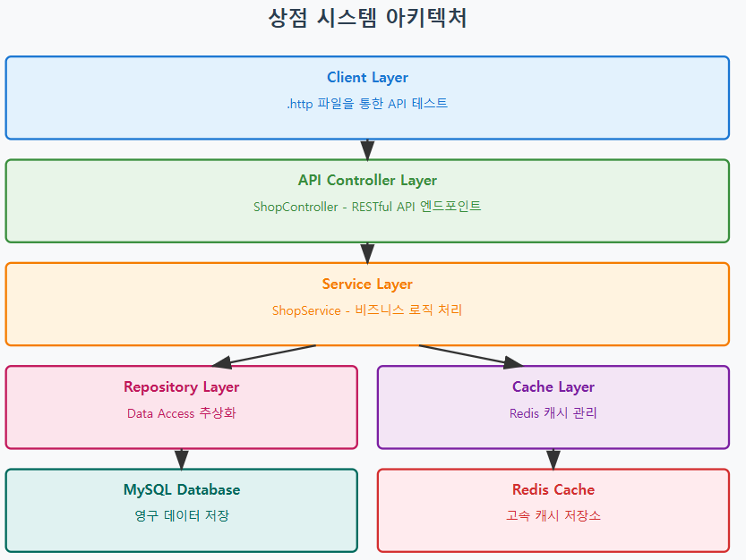
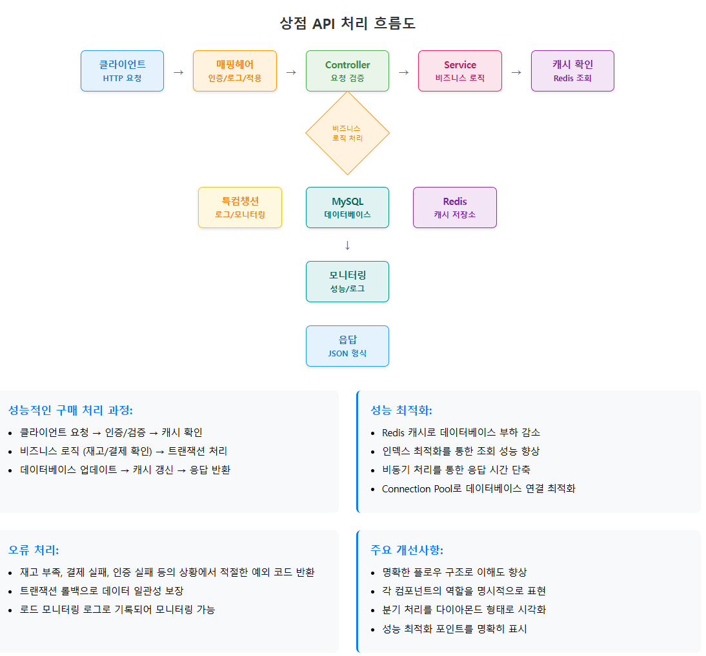

# ASP.NET Core Web API로 게임 서버 개발
  
저자: 최흥배, Claude AI   
-----------------------    
     
# API 분리 및 모듈화 - 상점
수집형 RPG 게임에서 상점은 플레이어가 아이템을 구매하고 판매하는 핵심 시스템입니다. 이번 장에서는 ASP.NET Core Web API를 사용하여 상점 시스템을 모듈화하고 효율적으로 설계하는 방법을 알아보겠습니다.
  

## 1. 상점 시스템 개요
수집형 RPG의 상점 시스템은 일반적으로 다음과 같은 기능을 제공합니다:

- **상점 목록 조회**: 현재 판매 중인 아이템 목록
- **아이템 구매**: 게임 내 화폐로 아이템 구매
- **아이템 판매**: 보유 아이템을 게임 내 화폐로 판매
- **상점 갱신**: 일정 시간마다 판매 아이템 목록 변경
- **특별 상점**: 이벤트나 시즌별 특별 아이템 판매

## 2. 시스템 아키텍처
    


## 3. 프로젝트 구조
상점 시스템을 모듈화하기 위해 다음과 같은 폴더 구조를 사용합니다
  
<pre>
GameServer/
├── Controllers/
│   └── ShopController.cs
├── Services/
│   ├── IShopService.cs
│   └── ShopService.cs
├── Repositories/
│   ├── IShopRepository.cs
│   ├── IPlayerRepository.cs
│   └── Implementations/
│       ├── ShopRepository.cs
│       └── PlayerRepository.cs
├── Models/
│   ├── Entities/
│   │   ├── ShopItem.cs
│   │   ├── Player.cs
│   │   └── PlayerItem.cs
│   ├── DTOs/
│   │   ├── ShopItemDto.cs
│   │   ├── PurchaseRequestDto.cs
│   │   └── SellRequestDto.cs
│   └── Responses/
│       ├── ApiResponse.cs
│       ├── ShopListResponse.cs
│       └── TransactionResponse.cs
├── Configuration/
│   ├── DatabaseConfig.cs
│   └── RedisConfig.cs
├── Middleware/
│   └── AuthenticationMiddleware.cs
├── Tests/
│   └── shop_tests.http
└── appsettings.json
</pre>
  

## 4. 데이터 모델 설계

### 4.1 Entity 모델
  
```
// Models/Entities/ShopItem.cs
namespace GameServer.Models.Entities;

public class ShopItem
{
    public int Id { get; set; }
    public int ItemId { get; set; }
    public string ItemName { get; set; } = string.Empty;
    public string ItemType { get; set; } = string.Empty;
    public int Price { get; set; }
    public int Stock { get; set; }
    public int MaxStock { get; set; }
    public DateTime RefreshTime { get; set; }
    public bool IsAvailable { get; set; }
    public string Description { get; set; } = string.Empty;
    public string IconUrl { get; set; } = string.Empty;
    public int SortOrder { get; set; }
    public DateTime CreatedAt { get; set; }
    public DateTime UpdatedAt { get; set; }
}

// Models/Entities/Player.cs
namespace GameServer.Models.Entities;

public class Player
{
    public int PlayerId { get; set; }
    public string Username { get; set; } = string.Empty;
    public int Gold { get; set; }
    public int Diamond { get; set; }
    public int Level { get; set; }
    public DateTime LastLoginAt { get; set; }
    public DateTime CreatedAt { get; set; }
    public DateTime UpdatedAt { get; set; }
}

// Models/Entities/PlayerItem.cs
namespace GameServer.Models.Entities;

public class PlayerItem
{
    public int Id { get; set; }
    public int PlayerId { get; set; }
    public int ItemId { get; set; }
    public int Quantity { get; set; }
    public DateTime ObtainedAt { get; set; }
    public DateTime UpdatedAt { get; set; }
}

// Models/Entities/Transaction.cs
namespace GameServer.Models.Entities;

public class Transaction
{
    public int Id { get; set; }
    public int PlayerId { get; set; }
    public string TransactionType { get; set; } = string.Empty; // "BUY", "SELL"
    public int ItemId { get; set; }
    public int Quantity { get; set; }
    public int Price { get; set; }
    public int TotalAmount { get; set; }
    public string CurrencyType { get; set; } = string.Empty; // "GOLD", "DIAMOND"
    public DateTime TransactionTime { get; set; }
}
```   
  

### 4.2 DTO 모델
  
```
// Models/DTOs/ShopItemDto.cs
namespace GameServer.Models.DTOs;

public class ShopItemDto
{
    public int Id { get; set; }
    public int ItemId { get; set; }
    public string ItemName { get; set; } = string.Empty;
    public string ItemType { get; set; } = string.Empty;
    public int Price { get; set; }
    public int Stock { get; set; }
    public bool IsAvailable { get; set; }
    public string Description { get; set; } = string.Empty;
    public string IconUrl { get; set; } = string.Empty;
    public DateTime RefreshTime { get; set; }
}

// Models/DTOs/PurchaseRequestDto.cs
namespace GameServer.Models.DTOs;

public class PurchaseRequestDto
{
    public int ItemId { get; set; }
    public int Quantity { get; set; }
    public string CurrencyType { get; set; } = "GOLD"; // "GOLD", "DIAMOND"
}

// Models/DTOs/SellRequestDto.cs
namespace GameServer.Models.DTOs;

public class SellRequestDto
{
    public int ItemId { get; set; }
    public int Quantity { get; set; }
}

// Models/DTOs/PlayerDto.cs
namespace GameServer.Models.DTOs;

public class PlayerDto
{
    public int PlayerId { get; set; }
    public string Username { get; set; } = string.Empty;
    public int Gold { get; set; }
    public int Diamond { get; set; }
    public int Level { get; set; }
}

// Models/Responses/ApiResponse.cs
namespace GameServer.Models.Responses;

public class ApiResponse<T>
{
    public bool Success { get; set; }
    public string Message { get; set; } = string.Empty;
    public T? Data { get; set; }
    public int ErrorCode { get; set; }
    public DateTime Timestamp { get; set; } = DateTime.UtcNow;

    public static ApiResponse<T> SuccessResult(T data, string message = "성공")
    {
        return new ApiResponse<T>
        {
            Success = true,
            Message = message,
            Data = data,
            ErrorCode = 0
        };
    }

    public static ApiResponse<T> ErrorResult(string message, int errorCode = 1)
    {
        return new ApiResponse<T>
        {
            Success = false,
            Message = message,
            ErrorCode = errorCode
        };
    }
}

// Models/Responses/ShopListResponse.cs
namespace GameServer.Models.Responses;

public class ShopListResponse
{
    public List<ShopItemDto> Items { get; set; } = new();
    public DateTime NextRefreshTime { get; set; }
    public PlayerDto PlayerInfo { get; set; } = new();
}

// Models/Responses/TransactionResponse.cs
namespace GameServer.Models.Responses;

public class TransactionResponse
{
    public int TransactionId { get; set; }
    public bool Success { get; set; }
    public string TransactionType { get; set; } = string.Empty;
    public int ItemId { get; set; }
    public int Quantity { get; set; }
    public int TotalAmount { get; set; }
    public PlayerDto UpdatedPlayerInfo { get; set; } = new();
}
```  
  
  
## 5. Repository Layer 구현

### 5.1 Repository 인터페이스

```
// Repositories/IShopRepository.cs
using GameServer.Models.Entities;

namespace GameServer.Repositories;

public interface IShopRepository
{
    Task<IEnumerable<ShopItem>> GetAvailableItemsAsync();
    Task<ShopItem?> GetShopItemAsync(int itemId);
    Task<bool> UpdateStockAsync(int itemId, int newStock);
    Task<bool> RefreshShopAsync();
    Task<DateTime> GetNextRefreshTimeAsync();
    Task<Transaction> CreateTransactionAsync(Transaction transaction);
}

// Repositories/IPlayerRepository.cs
using GameServer.Models.Entities;

namespace GameServer.Repositories;

public interface IPlayerRepository
{
    Task<Player?> GetPlayerAsync(int playerId);
    Task<bool> UpdatePlayerCurrencyAsync(int playerId, int gold, int diamond);
    Task<IEnumerable<PlayerItem>> GetPlayerItemsAsync(int playerId);
    Task<PlayerItem?> GetPlayerItemAsync(int playerId, int itemId);
    Task<bool> AddOrUpdatePlayerItemAsync(PlayerItem playerItem);
    Task<bool> RemovePlayerItemAsync(int playerId, int itemId, int quantity);
}

// Repositories/IRedisRepository.cs
namespace GameServer.Repositories;

public interface IRedisRepository
{
    Task<T?> GetAsync<T>(string key) where T : class;
    Task<bool> SetAsync<T>(string key, T value, TimeSpan? expiry = null) where T : class;
    Task<bool> DeleteAsync(string key);
    Task<bool> ExistsAsync(string key);
    Task<long> IncrementAsync(string key, long increment = 1);
    Task<long> DecrementAsync(string key, long decrement = 1);
}
```  
  

### 5.2 Repository 구현체
  
#### Shop
  
```
// Repositories/Implementations/ShopRepository.cs
using GameServer.Models.Entities;
using GameServer.Repositories;
using MySqlConnector;
using SqlKata;
using SqlKata.Execution;

namespace GameServer.Repositories.Implementations;

public class ShopRepository : IShopRepository
{
    private readonly QueryFactory _db;
    private const string SHOP_ITEMS_TABLE = "shop_items";
    private const string TRANSACTIONS_TABLE = "transactions";

    public ShopRepository(QueryFactory queryFactory)
    {
        _db = queryFactory;
    }

    public async Task<IEnumerable<ShopItem>> GetAvailableItemsAsync()
    {
        try
        {
            var items = await _db.Query(SHOP_ITEMS_TABLE)
                .Where("is_available", true)
                .Where("stock", ">", 0)
                .OrderBy("sort_order")
                .GetAsync<ShopItem>();

            return items;
        }
        catch (Exception ex)
        {
            throw new Exception($"상점 아이템 조회 중 오류 발생: {ex.Message}", ex);
        }
    }

    public async Task<ShopItem?> GetShopItemAsync(int itemId)
    {
        try
        {
            var item = await _db.Query(SHOP_ITEMS_TABLE)
                .Where("item_id", itemId)
                .FirstOrDefaultAsync<ShopItem>();

            return item;
        }
        catch (Exception ex)
        {
            throw new Exception($"상점 아이템 조회 중 오류 발생: {ex.Message}", ex);
        }
    }

    public async Task<bool> UpdateStockAsync(int itemId, int newStock)
    {
        try
        {
            var affectedRows = await _db.Query(SHOP_ITEMS_TABLE)
                .Where("item_id", itemId)
                .UpdateAsync(new
                {
                    stock = newStock,
                    updated_at = DateTime.UtcNow
                });

            return affectedRows > 0;
        }
        catch (Exception ex)
        {
            throw new Exception($"재고 업데이트 중 오류 발생: {ex.Message}", ex);
        }
    }

    public async Task<bool> RefreshShopAsync()
    {
        try
        {
            // 상점 갱신 로직 - 모든 아이템의 재고를 최대치로 복원
            var affectedRows = await _db.Query(SHOP_ITEMS_TABLE)
                .Where("is_available", true)
                .UpdateAsync(new
                {
                    stock = _db.Query().Raw("max_stock"),
                    refresh_time = DateTime.UtcNow.AddHours(24), // 24시간 후 다시 갱신
                    updated_at = DateTime.UtcNow
                });

            return affectedRows > 0;
        }
        catch (Exception ex)
        {
            throw new Exception($"상점 갱신 중 오류 발생: {ex.Message}", ex);
        }
    }

    public async Task<DateTime> GetNextRefreshTimeAsync()
    {
        try
        {
            var refreshTime = await _db.Query(SHOP_ITEMS_TABLE)
                .Select("refresh_time")
                .Where("is_available", true)
                .FirstAsync<DateTime>();

            return refreshTime;
        }
        catch (Exception ex)
        {
            // 기본값으로 24시간 후 반환
            return DateTime.UtcNow.AddHours(24);
        }
    }

    public async Task<Transaction> CreateTransactionAsync(Transaction transaction)
    {
        try
        {
            var id = await _db.Query(TRANSACTIONS_TABLE)
                .InsertGetIdAsync<int>(new
                {
                    player_id = transaction.PlayerId,
                    transaction_type = transaction.TransactionType,
                    item_id = transaction.ItemId,
                    quantity = transaction.Quantity,
                    price = transaction.Price,
                    total_amount = transaction.TotalAmount,
                    currency_type = transaction.CurrencyType,
                    transaction_time = transaction.TransactionTime
                });

            transaction.Id = id;
            return transaction;
        }
        catch (Exception ex)
        {
            throw new Exception($"거래 기록 생성 중 오류 발생: {ex.Message}", ex);
        }
    }
}
```

  
#### PlayerRepository, RedisRepository 
  
```
// Repositories/Implementations/PlayerRepository.cs
using GameServer.Models.Entities;
using GameServer.Repositories;
using MySqlConnector;
using SqlKata;
using SqlKata.Execution;

namespace GameServer.Repositories.Implementations;

public class PlayerRepository : IPlayerRepository
{
    private readonly QueryFactory _db;
    private const string PLAYERS_TABLE = "players";
    private const string PLAYER_ITEMS_TABLE = "player_items";

    public PlayerRepository(QueryFactory queryFactory)
    {
        _db = queryFactory;
    }

    public async Task<Player?> GetPlayerAsync(int playerId)
    {
        try
        {
            var player = await _db.Query(PLAYERS_TABLE)
                .Where("player_id", playerId)
                .FirstOrDefaultAsync<Player>();

            return player;
        }
        catch (Exception ex)
        {
            throw new Exception($"플레이어 조회 중 오류 발생: {ex.Message}", ex);
        }
    }

    public async Task<bool> UpdatePlayerCurrencyAsync(int playerId, int gold, int diamond)
    {
        try
        {
            var affectedRows = await _db.Query(PLAYERS_TABLE)
                .Where("player_id", playerId)
                .UpdateAsync(new
                {
                    gold = gold,
                    diamond = diamond,
                    updated_at = DateTime.UtcNow
                });

            return affectedRows > 0;
        }
        catch (Exception ex)
        {
            throw new Exception($"플레이어 화폐 업데이트 중 오류 발생: {ex.Message}", ex);
        }
    }

    public async Task<IEnumerable<PlayerItem>> GetPlayerItemsAsync(int playerId)
    {
        try
        {
            var items = await _db.Query(PLAYER_ITEMS_TABLE)
                .Where("player_id", playerId)
                .Where("quantity", ">", 0)
                .GetAsync<PlayerItem>();

            return items;
        }
        catch (Exception ex)
        {
            throw new Exception($"플레이어 아이템 조회 중 오류 발생: {ex.Message}", ex);
        }
    }

    public async Task<PlayerItem?> GetPlayerItemAsync(int playerId, int itemId)
    {
        try
        {
            var item = await _db.Query(PLAYER_ITEMS_TABLE)
                .Where("player_id", playerId)
                .Where("item_id", itemId)
                .FirstOrDefaultAsync<PlayerItem>();

            return item;
        }
        catch (Exception ex)
        {
            throw new Exception($"플레이어 아이템 조회 중 오류 발생: {ex.Message}", ex);
        }
    }

    public async Task<bool> AddOrUpdatePlayerItemAsync(PlayerItem playerItem)
    {
        try
        {
            var existingItem = await GetPlayerItemAsync(playerItem.PlayerId, playerItem.ItemId);

            if (existingItem == null)
            {
                // 새 아이템 추가
                await _db.Query(PLAYER_ITEMS_TABLE)
                    .InsertAsync(new
                    {
                        player_id = playerItem.PlayerId,
                        item_id = playerItem.ItemId,
                        quantity = playerItem.Quantity,
                        obtained_at = DateTime.UtcNow,
                        updated_at = DateTime.UtcNow
                    });
            }
            else
            {
                // 기존 아이템 수량 업데이트
                await _db.Query(PLAYER_ITEMS_TABLE)
                    .Where("player_id", playerItem.PlayerId)
                    .Where("item_id", playerItem.ItemId)
                    .UpdateAsync(new
                    {
                        quantity = existingItem.Quantity + playerItem.Quantity,
                        updated_at = DateTime.UtcNow
                    });
            }

            return true;
        }
        catch (Exception ex)
        {
            throw new Exception($"플레이어 아이템 추가/업데이트 중 오류 발생: {ex.Message}", ex);
        }
    }

    public async Task<bool> RemovePlayerItemAsync(int playerId, int itemId, int quantity)
    {
        try
        {
            var existingItem = await GetPlayerItemAsync(playerId, itemId);
            if (existingItem == null || existingItem.Quantity < quantity)
            {
                return false; // 아이템이 없거나 수량이 부족함
            }

            var newQuantity = existingItem.Quantity - quantity;

            if (newQuantity <= 0)
            {
                // 아이템 완전 삭제
                await _db.Query(PLAYER_ITEMS_TABLE)
                    .Where("player_id", playerId)
                    .Where("item_id", itemId)
                    .DeleteAsync();
            }
            else
            {
                // 수량만 감소
                await _db.Query(PLAYER_ITEMS_TABLE)
                    .Where("player_id", playerId)
                    .Where("item_id", itemId)
                    .UpdateAsync(new
                    {
                        quantity = newQuantity,
                        updated_at = DateTime.UtcNow
                    });
            }

            return true;
        }
        catch (Exception ex)
        {
            throw new Exception($"플레이어 아이템 제거 중 오류 발생: {ex.Message}", ex);
        }
    }
}

// Repositories/Implementations/RedisRepository.cs
using CloudStructures;
using CloudStructures.Structures;
using GameServer.Repositories;
using System.Text.Json;

namespace GameServer.Repositories.Implementations;

public class RedisRepository : IRedisRepository
{
    private readonly RedisConnection _connection;

    public RedisRepository(RedisConnection connection)
    {
        _connection = connection;
    }

    public async Task<T?> GetAsync<T>(string key) where T : class
    {
        try
        {
            var redis = new RedisString<string>(_connection, key, null);
            var result = await redis.GetAsync();

            if (!result.HasValue)
                return null;

            return JsonSerializer.Deserialize<T>(result.Value);
        }
        catch (Exception ex)
        {
            throw new Exception($"Redis 데이터 조회 중 오류 발생: {ex.Message}", ex);
        }
    }

    public async Task<bool> SetAsync<T>(string key, T value, TimeSpan? expiry = null) where T : class
    {
        try
        {
            var redis = new RedisString<string>(_connection, key, expiry);
            var jsonValue = JsonSerializer.Serialize(value);
            
            return await redis.SetAsync(jsonValue);
        }
        catch (Exception ex)
        {
            throw new Exception($"Redis 데이터 설정 중 오류 발생: {ex.Message}", ex);
        }
    }

    public async Task<bool> DeleteAsync(string key)
    {
        try
        {
            var redis = new RedisString<string>(_connection, key, null);
            return await redis.DeleteAsync();
        }
        catch (Exception ex)
        {
            throw new Exception($"Redis 데이터 삭제 중 오류 발생: {ex.Message}", ex);
        }
    }

    public async Task<bool> ExistsAsync(string key)
    {
        try
        {
            var redis = new RedisString<string>(_connection, key, null);
            var result = await redis.GetAsync();
            return result.HasValue;
        }
        catch (Exception ex)
        {
            throw new Exception($"Redis 키 존재 확인 중 오류 발생: {ex.Message}", ex);
        }
    }

    public async Task<long> IncrementAsync(string key, long increment = 1)
    {
        try
        {
            var redis = new RedisString<long>(_connection, key, null);
            return await redis.IncrementAsync(increment);
        }
        catch (Exception ex)
        {
            throw new Exception($"Redis 증가 연산 중 오류 발생: {ex.Message}", ex);
        }
    }

    public async Task<long> DecrementAsync(string key, long decrement = 1)
    {
        try
        {
            var redis = new RedisString<long>(_connection, key, null);
            return await redis.DecrementAsync(decrement);
        }
        catch (Exception ex)
        {
            throw new Exception($"Redis 감소 연산 중 오류 발생: {ex.Message}", ex);
        }
    }
}
```  
    
  
## 6. Service Layer 구현
  
```
// Services/IShopService.cs
using GameServer.Models.DTOs;
using GameServer.Models.Responses;

namespace GameServer.Services;

public interface IShopService
{
    Task<ApiResponse<ShopListResponse>> GetShopListAsync(int playerId);
    Task<ApiResponse<TransactionResponse>> PurchaseItemAsync(int playerId, PurchaseRequestDto request);
    Task<ApiResponse<TransactionResponse>> SellItemAsync(int playerId, SellRequestDto request);
    Task<ApiResponse<bool>> RefreshShopAsync();
}

// Services/ShopService.cs
using GameServer.Models.DTOs;
using GameServer.Models.Entities;
using GameServer.Models.Responses;
using GameServer.Repositories;
using GameServer.Services;

namespace GameServer.Services;

public class ShopService : IShopService
{
    private readonly IShopRepository _shopRepository;
    private readonly IPlayerRepository _playerRepository;
    private readonly IRedisRepository _redisRepository;

    private const string SHOP_LIST_CACHE_KEY = "shop:list";
    private const string PLAYER_CACHE_KEY_PREFIX = "player:";
    private const int CACHE_EXPIRY_MINUTES = 30;

    public ShopService(
        IShopRepository shopRepository,
        IPlayerRepository playerRepository,
        IRedisRepository redisRepository)
    {
        _shopRepository = shopRepository;
        _playerRepository = playerRepository;
        _redisRepository = redisRepository;
    }

    public async Task<ApiResponse<ShopListResponse>> GetShopListAsync(int playerId)
    {
        try
        {
            // 캐시에서 상점 목록 조회 시도
            var cachedShopList = await _redisRepository.GetAsync<ShopListResponse>(SHOP_LIST_CACHE_KEY);
            
            ShopListResponse response;
            
            if (cachedShopList != null)
            {
                response = cachedShopList;
            }
            else
            {
                // 캐시에 없으면 DB에서 조회
                var shopItems = await _shopRepository.GetAvailableItemsAsync();
                var nextRefreshTime = await _shopRepository.GetNextRefreshTimeAsync();

                var shopItemDtos = shopItems.Select(item => new ShopItemDto
                {
                    Id = item.Id,
                    ItemId = item.ItemId,
                    ItemName = item.ItemName,
                    ItemType = item.ItemType,
                    Price = item.Price,
                    Stock = item.Stock,
                    IsAvailable = item.IsAvailable,
                    Description = item.Description,
                    IconUrl = item.IconUrl,
                    RefreshTime = item.RefreshTime
                }).ToList();

                response = new ShopListResponse
                {
                    Items = shopItemDtos,
                    NextRefreshTime = nextRefreshTime
                };

                // 캐시에 저장
                await _redisRepository.SetAsync(SHOP_LIST_CACHE_KEY, response, 
                    TimeSpan.FromMinutes(CACHE_EXPIRY_MINUTES));
            }

            // 플레이어 정보 조회
            var player = await GetPlayerInfoAsync(playerId);
            if (player == null)
            {
                return ApiResponse<ShopListResponse>.ErrorResult("플레이어를 찾을 수 없습니다", 404);
            }

            response.PlayerInfo = player;

            return ApiResponse<ShopListResponse>.SuccessResult(response);
        }
        catch (Exception ex)
        {
            return ApiResponse<ShopListResponse>.ErrorResult($"상점 목록 조회 실패: {ex.Message}", 500);
        }
    }

    public async Task<ApiResponse<TransactionResponse>> PurchaseItemAsync(int playerId, PurchaseRequestDto request)
    {
        try
        {
            // 플레이어 정보 조회
            var player = await _playerRepository.GetPlayerAsync(playerId);
            if (player == null)
            {
                return ApiResponse<TransactionResponse>.ErrorResult("플레이어를 찾을 수 없습니다", 404);
            }

            // 상점 아이템 조회
            var shopItem = await _shopRepository.GetShopItemAsync(request.ItemId);
            if (shopItem == null)
            {
                return ApiResponse<TransactionResponse>.ErrorResult("상점에서 해당 아이템을 찾을 수 없습니다", 404);
            }

            // 재고 확인
            if (shopItem.Stock < request.Quantity)
            {
                return ApiResponse<TransactionResponse>.ErrorResult("재고가 부족합니다", 400);
            }

            // 가격 계산
            var totalPrice = shopItem.Price * request.Quantity;

            // 화폐 확인 및 차감
            var updatedGold = player.Gold;
            var updatedDiamond = player.Diamond;

            if (request.CurrencyType == "GOLD")
            {
                if (player.Gold < totalPrice)
                {
                    return ApiResponse<TransactionResponse>.ErrorResult("골드가 부족합니다", 400);
                }
                updatedGold -= totalPrice;
            }
            else if (request.CurrencyType == "DIAMOND")
            {
                if (player.Diamond < totalPrice)
                {
                    return ApiResponse<TransactionResponse>.ErrorResult("다이아몬드가 부족합니다", 400);
                }
                updatedDiamond -= totalPrice;
            }
            else
            {
                return ApiResponse<TransactionResponse>.ErrorResult("잘못된 화폐 타입입니다", 400);
            }

            // 거래 시작 (트랜잭션 처리)
            // 1. 플레이어 화폐 업데이트
            await _playerRepository.UpdatePlayerCurrencyAsync(playerId, updatedGold, updatedDiamond);

            // 2. 상점 재고 업데이트
            await _shopRepository.UpdateStockAsync(request.ItemId, shopItem.Stock - request.Quantity);

            // 3. 플레이어 아이템 추가
            var playerItem = new PlayerItem
            {
                PlayerId = playerId,
                ItemId = request.ItemId,
                Quantity = request.Quantity,
                ObtainedAt = DateTime.UtcNow
            };
            await _playerRepository.AddOrUpdatePlayerItemAsync(playerItem);

            // 4. 거래 기록 생성
            var transaction = new Transaction
            {
                PlayerId = playerId,
                TransactionType = "BUY",
                ItemId = request.ItemId,
                Quantity = request.Quantity,
                Price = shopItem.Price,
                TotalAmount = totalPrice,
                CurrencyType = request.CurrencyType,
                TransactionTime = DateTime.UtcNow
            };
            var createdTransaction = await _shopRepository.CreateTransactionAsync(transaction);

            // 5. 캐시 무효화
            await _redisRepository.DeleteAsync(SHOP_LIST_CACHE_KEY);
            await _redisRepository.DeleteAsync($"{PLAYER_CACHE_KEY_PREFIX}{playerId}");

            var response = new TransactionResponse
            {
                TransactionId = createdTransaction.Id,
                Success = true,
                TransactionType = "BUY",
                ItemId = request.ItemId,
                Quantity = request.Quantity,
                TotalAmount = totalPrice,
                UpdatedPlayerInfo = new PlayerDto
                {
                    PlayerId = playerId,
                    Username = player.Username,
                    Gold = updatedGold,
                    Diamond = updatedDiamond,
                    Level = player.Level
                }
            };

            return ApiResponse<TransactionResponse>.SuccessResult(response, "아이템 구매가 완료되었습니다");
        }
        catch (Exception ex)
        {
            return ApiResponse<TransactionResponse>.ErrorResult($"아이템 구매 실패: {ex.Message}", 500);
        }
    }

    public async Task<ApiResponse<TransactionResponse>> SellItemAsync(int playerId, SellRequestDto request)
    {
        try
        {
            // 플레이어 정보 조회
            var player = await _playerRepository.GetPlayerAsync(playerId);
            if (player == null)
            {
                return ApiResponse<TransactionResponse>.ErrorResult("플레이어를 찾을 수 없습니다", 404);
            }

            // 플레이어가 해당 아이템을 보유하고 있는지 확인
            var playerItem = await _playerRepository.GetPlayerItemAsync(playerId, request.ItemId);
            if (playerItem == null || playerItem.Quantity < request.Quantity)
            {
                return ApiResponse<TransactionResponse>.ErrorResult("판매할 아이템이 부족합니다", 400);
            }

            // 상점 아이템 정보 조회 (판매 가격 계산용)
            var shopItem = await _shopRepository.GetShopItemAsync(request.ItemId);
            if (shopItem == null)
            {
                return ApiResponse<TransactionResponse>.ErrorResult("판매할 수 없는 아이템입니다", 400);
            }

            // 판매 가격 계산 (구매 가격의 50%)
            var sellPrice = (int)(shopItem.Price * 0.5f);
            var totalAmount = sellPrice * request.Quantity;

            // 거래 시작
            // 1. 플레이어 아이템 제거
            await _playerRepository.RemovePlayerItemAsync(playerId, request.ItemId, request.Quantity);

            // 2. 플레이어 골드 추가
            await _playerRepository.UpdatePlayerCurrencyAsync(playerId, player.Gold + totalAmount, player.Diamond);

            // 3. 거래 기록 생성
            var transaction = new Transaction
            {
                PlayerId = playerId,
                TransactionType = "SELL",
                ItemId = request.ItemId,
                Quantity = request.Quantity,
                Price = sellPrice,
                TotalAmount = totalAmount,
                CurrencyType = "GOLD",
                TransactionTime = DateTime.UtcNow
            };
            var createdTransaction = await _shopRepository.CreateTransactionAsync(transaction);

            // 4. 캐시 무효화
            await _redisRepository.DeleteAsync($"{PLAYER_CACHE_KEY_PREFIX}{playerId}");

            var response = new TransactionResponse
            {
                TransactionId = createdTransaction.Id,
                Success = true,
                TransactionType = "SELL",
                ItemId = request.ItemId,
                Quantity = request.Quantity,
                TotalAmount = totalAmount,
                UpdatedPlayerInfo = new PlayerDto
                {
                    PlayerId = playerId,
                    Username = player.Username,
                    Gold = player.Gold + totalAmount,
                    Diamond = player.Diamond,
                    Level = player.Level
                }
            };

            return ApiResponse<TransactionResponse>.SuccessResult(response, "아이템 판매가 완료되었습니다");
        }
        catch (Exception ex)
        {
            return ApiResponse<TransactionResponse>.ErrorResult($"아이템 판매 실패: {ex.Message}", 500);
        }
    }

    public async Task<ApiResponse<bool>> RefreshShopAsync()
    {
        try
        {
            var success = await _shopRepository.RefreshShopAsync();
            if (success)
            {
                // 캐시 무효화
                await _redisRepository.DeleteAsync(SHOP_LIST_CACHE_KEY);
                return ApiResponse<bool>.SuccessResult(true, "상점이 갱신되었습니다");
            }
            else
            {
                return ApiResponse<bool>.ErrorResult("상점 갱신에 실패했습니다", 500);
            }
        }
        catch (Exception ex)
        {
            return ApiResponse<bool>.ErrorResult($"상점 갱신 실패: {ex.Message}", 500);
        }
    }

    private async Task<PlayerDto?> GetPlayerInfoAsync(int playerId)
    {
        try
        {
            // 캐시에서 플레이어 정보 조회
            var cacheKey = $"{PLAYER_CACHE_KEY_PREFIX}{playerId}";
            var cachedPlayer = await _redisRepository.GetAsync<PlayerDto>(cacheKey);

            if (cachedPlayer != null)
            {
                return cachedPlayer;
            }

            // 캐시에 없으면 DB에서 조회
            var player = await _playerRepository.GetPlayerAsync(playerId);
            if (player == null)
            {
                return null;
            }

            var playerDto = new PlayerDto
            {
                PlayerId = player.PlayerId,
                Username = player.Username,
                Gold = player.Gold,
                Diamond = player.Diamond,
                Level = player.Level
            };

            // 캐시에 저장
            await _redisRepository.SetAsync(cacheKey, playerDto, TimeSpan.FromMinutes(CACHE_EXPIRY_MINUTES));

            return playerDto;
        }
        catch (Exception ex)
        {
            throw new Exception($"플레이어 정보 조회 실패: {ex.Message}", ex);
        }
    }
}
```    
  

## 7. Controller 구현

```
// Controllers/ShopController.cs
using GameServer.Models.DTOs;
using GameServer.Models.Responses;
using GameServer.Services;
using Microsoft.AspNetCore.Mvc;

namespace GameServer.Controllers;

[ApiController]
[Route("api/[controller]")]
[Produces("application/json")]
public class ShopController : ControllerBase
{
    private readonly IShopService _shopService;
    private readonly ILogger<ShopController> _logger;

    public ShopController(IShopService shopService, ILogger<ShopController> logger)
    {
        _shopService = shopService;
        _logger = logger;
    }

    /// <summary>
    /// 상점 아이템 목록 조회
    /// </summary>
    /// <param name="playerId">플레이어 ID</param>
    /// <returns>상점 아이템 목록과 플레이어 정보</returns>
    [HttpGet("{playerId}")]
    public async Task<ActionResult<ApiResponse<ShopListResponse>>> GetShopList(int playerId)
    {
        try
        {
            _logger.LogInformation("상점 목록 조회 요청 - PlayerId: {PlayerId}", playerId);

            if (playerId <= 0)
            {
                return BadRequest(ApiResponse<ShopListResponse>.ErrorResult("잘못된 플레이어 ID입니다", 400));
            }

            var result = await _shopService.GetShopListAsync(playerId);

            if (result.Success)
            {
                _logger.LogInformation("상점 목록 조회 성공 - PlayerId: {PlayerId}, Items: {ItemCount}", 
                    playerId, result.Data?.Items.Count ?? 0);
                return Ok(result);
            }
            else
            {
                _logger.LogWarning("상점 목록 조회 실패 - PlayerId: {PlayerId}, Error: {Error}", 
                    playerId, result.Message);
                
                return result.ErrorCode switch
                {
                    404 => NotFound(result),
                    _ => StatusCode(500, result)
                };
            }
        }
        catch (Exception ex)
        {
            _logger.LogError(ex, "상점 목록 조회 중 예외 발생 - PlayerId: {PlayerId}", playerId);
            return StatusCode(500, ApiResponse<ShopListResponse>.ErrorResult("서버 오류가 발생했습니다", 500));
        }
    }

    /// <summary>
    /// 아이템 구매
    /// </summary>
    /// <param name="playerId">플레이어 ID</param>
    /// <param name="request">구매 요청 정보</param>
    /// <returns>구매 결과</returns>
    [HttpPost("{playerId}/purchase")]
    public async Task<ActionResult<ApiResponse<TransactionResponse>>> PurchaseItem(
        int playerId, 
        [FromBody] PurchaseRequestDto request)
    {
        try
        {
            _logger.LogInformation("아이템 구매 요청 - PlayerId: {PlayerId}, ItemId: {ItemId}, Quantity: {Quantity}", 
                playerId, request.ItemId, request.Quantity);

            if (playerId <= 0)
            {
                return BadRequest(ApiResponse<TransactionResponse>.ErrorResult("잘못된 플레이어 ID입니다", 400));
            }

            if (request.ItemId <= 0 || request.Quantity <= 0)
            {
                return BadRequest(ApiResponse<TransactionResponse>.ErrorResult("잘못된 구매 요청입니다", 400));
            }

            if (request.CurrencyType != "GOLD" && request.CurrencyType != "DIAMOND")
            {
                return BadRequest(ApiResponse<TransactionResponse>.ErrorResult("잘못된 화폐 타입입니다", 400));
            }

            var result = await _shopService.PurchaseItemAsync(playerId, request);

            if (result.Success)
            {
                _logger.LogInformation("아이템 구매 성공 - PlayerId: {PlayerId}, ItemId: {ItemId}, TransactionId: {TransactionId}", 
                    playerId, request.ItemId, result.Data?.TransactionId);
                return Ok(result);
            }
            else
            {
                _logger.LogWarning("아이템 구매 실패 - PlayerId: {PlayerId}, ItemId: {ItemId}, Error: {Error}", 
                    playerId, request.ItemId, result.Message);
                
                return result.ErrorCode switch
                {
                    400 => BadRequest(result),
                    404 => NotFound(result),
                    _ => StatusCode(500, result)
                };
            }
        }
        catch (Exception ex)
        {
            _logger.LogError(ex, "아이템 구매 중 예외 발생 - PlayerId: {PlayerId}, ItemId: {ItemId}", 
                playerId, request.ItemId);
            return StatusCode(500, ApiResponse<TransactionResponse>.ErrorResult("서버 오류가 발생했습니다", 500));
        }
    }

    /// <summary>
    /// 아이템 판매
    /// </summary>
    /// <param name="playerId">플레이어 ID</param>
    /// <param name="request">판매 요청 정보</param>
    /// <returns>판매 결과</returns>
    [HttpPost("{playerId}/sell")]
    public async Task<ActionResult<ApiResponse<TransactionResponse>>> SellItem(
        int playerId, 
        [FromBody] SellRequestDto request)
    {
        try
        {
            _logger.LogInformation("아이템 판매 요청 - PlayerId: {PlayerId}, ItemId: {ItemId}, Quantity: {Quantity}", 
                playerId, request.ItemId, request.Quantity);

            if (playerId <= 0)
            {
                return BadRequest(ApiResponse<TransactionResponse>.ErrorResult("잘못된 플레이어 ID입니다", 400));
            }

            if (request.ItemId <= 0 || request.Quantity <= 0)
            {
                return BadRequest(ApiResponse<TransactionResponse>.ErrorResult("잘못된 판매 요청입니다", 400));
            }

            var result = await _shopService.SellItemAsync(playerId, request);

            if (result.Success)
            {
                _logger.LogInformation("아이템 판매 성공 - PlayerId: {PlayerId}, ItemId: {ItemId}, TransactionId: {TransactionId}", 
                    playerId, request.ItemId, result.Data?.TransactionId);
                return Ok(result);
            }
            else
            {
                _logger.LogWarning("아이템 판매 실패 - PlayerId: {PlayerId}, ItemId: {ItemId}, Error: {Error}", 
                    playerId, request.ItemId, result.Message);
                
                return result.ErrorCode switch
                {
                    400 => BadRequest(result),
                    404 => NotFound(result),
                    _ => StatusCode(500, result)
                };
            }
        }
        catch (Exception ex)
        {
            _logger.LogError(ex, "아이템 판매 중 예외 발생 - PlayerId: {PlayerId}, ItemId: {ItemId}", 
                playerId, request.ItemId);
            return StatusCode(500, ApiResponse<TransactionResponse>.ErrorResult("서버 오류가 발생했습니다", 500));
        }
    }

    /// <summary>
    /// 상점 갱신 (관리자용)
    /// </summary>
    /// <returns>갱신 결과</returns>
    [HttpPost("refresh")]
    public async Task<ActionResult<ApiResponse<bool>>> RefreshShop()
    {
        try
        {
            _logger.LogInformation("상점 갱신 요청");

            var result = await _shopService.RefreshShopAsync();

            if (result.Success)
            {
                _logger.LogInformation("상점 갱신 성공");
                return Ok(result);
            }
            else
            {
                _logger.LogWarning("상점 갱신 실패 - Error: {Error}", result.Message);
                return StatusCode(500, result);
            }
        }
        catch (Exception ex)
        {
            _logger.LogError(ex, "상점 갱신 중 예외 발생");
            return StatusCode(500, ApiResponse<bool>.ErrorResult("서버 오류가 발생했습니다", 500));
        }
    }

    /// <summary>
    /// 상점 상태 확인 (헬스체크)
    /// </summary>
    /// <returns>상점 상태</returns>
    [HttpGet("health")]
    public ActionResult<object> HealthCheck()
    {
        return Ok(new
        {
            status = "healthy",
            timestamp = DateTime.UtcNow,
            service = "ShopService"
        });
    }
}
```  
    
  
## 8. 의존성 주입 및 설정
  
```
// Program.cs
using CloudStructures;
using GameServer.Repositories;
using GameServer.Repositories.Implementations;
using GameServer.Services;
using MySqlConnector;
using SqlKata.Compilers;
using SqlKata.Execution;

var builder = WebApplication.CreateBuilder(args);

// Configuration
var connectionString = builder.Configuration.GetConnectionString("DefaultConnection");
var redisConnectionString = builder.Configuration.GetConnectionString("Redis");

// Add services to the container
builder.Services.AddControllers();
builder.Services.AddEndpointsApiExplorer();
builder.Services.AddSwaggerGen();

// Add CORS
builder.Services.AddCors(options =>
{
    options.AddPolicy("AllowAll", policy =>
    {
        policy.AllowAnyOrigin()
              .AllowAnyMethod()
              .AllowAnyHeader();
    });
});

// Database Configuration
builder.Services.AddScoped<MySqlConnection>(provider => 
    new MySqlConnection(connectionString));

builder.Services.AddScoped<QueryFactory>(provider =>
{
    var connection = provider.GetRequiredService<MySqlConnection>();
    var compiler = new MySqlCompiler();
    return new QueryFactory(connection, compiler);
});

// Redis Configuration
builder.Services.AddSingleton<RedisConnection>(provider =>
{
    var config = CloudStructures.RedisConfig.From(redisConnectionString);
    return new RedisConnection(config);
});

// Repository Registration
builder.Services.AddScoped<IShopRepository, ShopRepository>();
builder.Services.AddScoped<IPlayerRepository, PlayerRepository>();
builder.Services.AddScoped<IRedisRepository, RedisRepository>();

// Service Registration
builder.Services.AddScoped<IShopService, ShopService>();

// Logging
builder.Services.AddLogging(logging =>
{
    logging.AddConsole();
    logging.AddDebug();
});

var app = builder.Build();

// Configure the HTTP request pipeline
if (app.Environment.IsDevelopment())
{
    app.UseSwagger();
    app.UseSwaggerUI();
}

app.UseHttpsRedirection();
app.UseCors("AllowAll");
app.UseAuthorization();
app.MapControllers();

app.Run();

// appsettings.json
/*
{
  "Logging": {
    "LogLevel": {
      "Default": "Information",
      "Microsoft.AspNetCore": "Warning"
    }
  },
  "AllowedHosts": "*",
  "ConnectionStrings": {
    "DefaultConnection": "Server=localhost;Database=gameserver;Uid=root;Pwd=password;charset=utf8mb4;",
    "Redis": "localhost:6379"
  },
  "ShopSettings": {
    "RefreshIntervalHours": 24,
    "CacheExpiryMinutes": 30,
    "SellPriceRatio": 0.5
  }
}
*/

// Configuration/DatabaseConfig.cs
namespace GameServer.Configuration;

public class DatabaseConfig
{
    public const string SHOP_ITEMS_TABLE = "shop_items";
    public const string PLAYERS_TABLE = "players";
    public const string PLAYER_ITEMS_TABLE = "player_items";
    public const string TRANSACTIONS_TABLE = "transactions";
}

// Database Schema (MySQL)
/*
-- 상점 아이템 테이블
CREATE TABLE shop_items (
    id INT AUTO_INCREMENT PRIMARY KEY,
    item_id INT NOT NULL UNIQUE,
    item_name VARCHAR(100) NOT NULL,
    item_type VARCHAR(50) NOT NULL,
    price INT NOT NULL,
    stock INT NOT NULL DEFAULT 0,
    max_stock INT NOT NULL DEFAULT 0,
    refresh_time DATETIME NOT NULL,
    is_available BOOLEAN NOT NULL DEFAULT TRUE,
    description TEXT,
    icon_url VARCHAR(255),
    sort_order INT NOT NULL DEFAULT 0,
    created_at DATETIME NOT NULL DEFAULT CURRENT_TIMESTAMP,
    updated_at DATETIME NOT NULL DEFAULT CURRENT_TIMESTAMP ON UPDATE CURRENT_TIMESTAMP,
    INDEX idx_item_id (item_id),
    INDEX idx_is_available (is_available),
    INDEX idx_sort_order (sort_order)
);

-- 플레이어 테이블
CREATE TABLE players (
    player_id INT AUTO_INCREMENT PRIMARY KEY,
    username VARCHAR(50) NOT NULL UNIQUE,
    gold INT NOT NULL DEFAULT 0,
    diamond INT NOT NULL DEFAULT 0,
    level INT NOT NULL DEFAULT 1,
    last_login_at DATETIME,
    created_at DATETIME NOT NULL DEFAULT CURRENT_TIMESTAMP,
    updated_at DATETIME NOT NULL DEFAULT CURRENT_TIMESTAMP ON UPDATE CURRENT_TIMESTAMP,
    INDEX idx_username (username)
);

-- 플레이어 아이템 테이블
CREATE TABLE player_items (
    id INT AUTO_INCREMENT PRIMARY KEY,
    player_id INT NOT NULL,
    item_id INT NOT NULL,
    quantity INT NOT NULL DEFAULT 0,
    obtained_at DATETIME NOT NULL DEFAULT CURRENT_TIMESTAMP,
    updated_at DATETIME NOT NULL DEFAULT CURRENT_TIMESTAMP ON UPDATE CURRENT_TIMESTAMP,
    FOREIGN KEY (player_id) REFERENCES players(player_id) ON DELETE CASCADE,
    UNIQUE KEY uk_player_item (player_id, item_id),
    INDEX idx_player_id (player_id),
    INDEX idx_item_id (item_id)
);

-- 거래 기록 테이블
CREATE TABLE transactions (
    id INT AUTO_INCREMENT PRIMARY KEY,
    player_id INT NOT NULL,
    transaction_type ENUM('BUY', 'SELL') NOT NULL,
    item_id INT NOT NULL,
    quantity INT NOT NULL,
    price INT NOT NULL,
    total_amount INT NOT NULL,
    currency_type ENUM('GOLD', 'DIAMOND') NOT NULL,
    transaction_time DATETIME NOT NULL DEFAULT CURRENT_TIMESTAMP,
    FOREIGN KEY (player_id) REFERENCES players(player_id) ON DELETE CASCADE,
    INDEX idx_player_id (player_id),
    INDEX idx_transaction_time (transaction_time),
    INDEX idx_transaction_type (transaction_type)
);

-- 초기 데이터 삽입
INSERT INTO players (username, gold, diamond, level) VALUES 
('player1', 10000, 100, 1),
('player2', 5000, 50, 1);

INSERT INTO shop_items (item_id, item_name, item_type, price, stock, max_stock, refresh_time, description, sort_order) VALUES
(1001, '체력 포션', 'CONSUMABLE', 100, 50, 50, DATE_ADD(NOW(), INTERVAL 24 HOUR), '체력을 100 회복합니다', 1),
(1002, '마나 포션', 'CONSUMABLE', 80, 30, 30, DATE_ADD(NOW(), INTERVAL 24 HOUR), '마나를 80 회복합니다', 2),
(2001, '철 검', 'WEAPON', 500, 10, 10, DATE_ADD(NOW(), INTERVAL 24 HOUR), '공격력 +20', 3),
(2002, '강철 방패', 'ARMOR', 800, 5, 5, DATE_ADD(NOW(), INTERVAL 24 HOUR), '방어력 +15', 4),
(3001, '경험치 부스터', 'BOOST', 200, 20, 20, DATE_ADD(NOW(), INTERVAL 24 HOUR), '1시간 동안 경험치 2배', 5);
*/
```
  

## 9. API 테스트 (.http 파일)
  
```
# 상점 API 테스트
# 테스트 환경: https://localhost:7001

### 변수 설정
@baseUrl = https://localhost:7001/api/shop
@playerId = 1
@itemId = 1001

###
# 1. 상점 헬스체크
GET {{baseUrl}}/health

###
# 2. 상점 목록 조회
GET {{baseUrl}}/{{playerId}}
Accept: application/json

###
# 3. 아이템 구매 (골드로 체력 포션 5개 구매)
POST {{baseUrl}}/{{playerId}}/purchase
Content-Type: application/json

{
  "itemId": 1001,
  "quantity": 5,
  "currencyType": "GOLD"
}

###
# 4. 아이템 구매 (다이아몬드로 경험치 부스터 3개 구매)
POST {{baseUrl}}/{{playerId}}/purchase
Content-Type: application/json

{
  "itemId": 3001,
  "quantity": 3,
  "currencyType": "DIAMOND"
}

###
# 5. 아이템 판매 (체력 포션 2개 판매)
POST {{baseUrl}}/{{playerId}}/sell
Content-Type: application/json

{
  "itemId": 1001,
  "quantity": 2
}

###
# 6. 잘못된 구매 요청 (재고 부족)
POST {{baseUrl}}/{{playerId}}/purchase
Content-Type: application/json

{
  "itemId": 1001,
  "quantity": 999,
  "currencyType": "GOLD"
}

###
# 7. 잘못된 구매 요청 (화폐 부족)
POST {{baseUrl}}/{{playerId}}/purchase
Content-Type: application/json

{
  "itemId": 2002,
  "quantity": 50,
  "currencyType": "GOLD"
}

###
# 8. 잘못된 판매 요청 (아이템 없음)
POST {{baseUrl}}/{{playerId}}/sell
Content-Type: application/json

{
  "itemId": 9999,
  "quantity": 1
}

###
# 9. 상점 갱신 (관리자용)
POST {{baseUrl}}/refresh

###
# 10. 상점 갱신 후 목록 재조회
GET {{baseUrl}}/{{playerId}}
Accept: application/json

###
# 11. 다른 플레이어의 상점 조회
GET {{baseUrl}}/2
Accept: application/json

###
# 12. 잘못된 플레이어 ID로 조회
GET {{baseUrl}}/0
Accept: application/json

###
# 13. 존재하지 않는 플레이어 ID로 조회
GET {{baseUrl}}/999
Accept: application/json

###
# 14. 잘못된 아이템 ID로 구매 시도
POST {{baseUrl}}/{{playerId}}/purchase
Content-Type: application/json

{
  "itemId": 9999,
  "quantity": 1,
  "currencyType": "GOLD"
}

###
# 15. 잘못된 화폐 타입으로 구매 시도
POST {{baseUrl}}/{{playerId}}/purchase
Content-Type: application/json

{
  "itemId": 1001,
  "quantity": 1,
  "currencyType": "INVALID"
}

###
# 성능 테스트: 동시 구매 요청 시뮬레이션
# (실제로는 동시 실행되지 않지만 순차적으로 빠르게 실행)

# 첫 번째 구매
POST {{baseUrl}}/{{playerId}}/purchase
Content-Type: application/json

{
  "itemId": 1002,
  "quantity": 1,
  "currencyType": "GOLD"
}

###
# 두 번째 구매 (바로 이어서)
POST {{baseUrl}}/{{playerId}}/purchase
Content-Type: application/json

{
  "itemId": 1002,
  "quantity": 1,
  "currencyType": "GOLD"
}

###
# 캐시 테스트: 같은 요청 반복 (캐시 히트 확인)
GET {{baseUrl}}/{{playerId}}
Accept: application/json

###
GET {{baseUrl}}/{{playerId}}
Accept: application/json

###
GET {{baseUrl}}/{{playerId}}
Accept: application/json
```  
  

## 10. 보안 및 모니터링

### 10.1 보안 고려사항
  
```
// Middleware/AuthenticationMiddleware.cs
using System.Text.Json;

namespace GameServer.Middleware;

public class AuthenticationMiddleware
{
    private readonly RequestDelegate _next;
    private readonly ILogger<AuthenticationMiddleware> _logger;

    public AuthenticationMiddleware(RequestDelegate next, ILogger<AuthenticationMiddleware> logger)
    {
        _next = next;
        _logger = logger;
    }

    public async Task InvokeAsync(HttpContext context)
    {
        // API 키 기반 인증 (실제 환경에서는 JWT나 OAuth 사용 권장)
        if (context.Request.Path.StartsWithSegments("/api/shop") && 
            !context.Request.Path.Value.EndsWith("/health"))
        {
            var apiKey = context.Request.Headers["X-API-Key"].FirstOrDefault();
            var playerId = ExtractPlayerIdFromPath(context.Request.Path);

            if (string.IsNullOrEmpty(apiKey))
            {
                await WriteErrorResponse(context, "API 키가 필요합니다", 401);
                return;
            }

            // 간단한 API 키 검증 (실제로는 데이터베이스에서 검증)
            if (!IsValidApiKey(apiKey, playerId))
            {
                await WriteErrorResponse(context, "유효하지 않은 API 키입니다", 401);
                return;
            }

            _logger.LogInformation("API 인증 성공 - PlayerId: {PlayerId}, ApiKey: {ApiKey}", 
                playerId, apiKey[..8] + "...");
        }

        await _next(context);
    }

    private int? ExtractPlayerIdFromPath(PathString path)
    {
        var segments = path.Value?.Split('/');
        if (segments != null && segments.Length >= 4)
        {
            if (int.TryParse(segments[3], out int playerId))
            {
                return playerId;
            }
        }
        return null;
    }

    private bool IsValidApiKey(string apiKey, int? playerId)
    {
        // 실제 환경에서는 데이터베이스나 캐시에서 API 키 검증
        // 여기서는 단순한 예제로 구현
        var validKeys = new Dictionary<string, int>
        {
            { "player1-api-key-12345", 1 },
            { "player2-api-key-67890", 2 }
        };

        return validKeys.ContainsKey(apiKey) && validKeys[apiKey] == playerId;
    }

    private async Task WriteErrorResponse(HttpContext context, string message, int statusCode)
    {
        context.Response.StatusCode = statusCode;
        context.Response.ContentType = "application/json";

        var response = new
        {
            success = false,
            message = message,
            errorCode = statusCode,
            timestamp = DateTime.UtcNow
        };

        var jsonResponse = JsonSerializer.Serialize(response);
        await context.Response.WriteAsync(jsonResponse);
    }
}

// Middleware/RateLimitingMiddleware.cs
using System.Collections.Concurrent;

namespace GameServer.Middleware;

public class RateLimitingMiddleware
{
    private readonly RequestDelegate _next;
    private readonly ILogger<RateLimitingMiddleware> _logger;
    private static readonly ConcurrentDictionary<string, List<DateTime>> _requestCounts = new();
    private const int MAX_REQUESTS_PER_MINUTE = 100;

    public RateLimitingMiddleware(RequestDelegate next, ILogger<RateLimitingMiddleware> logger)
    {
        _next = next;
        _logger = logger;
    }

    public async Task InvokeAsync(HttpContext context)
    {
        var clientId = GetClientIdentifier(context);
        var now = DateTime.UtcNow;

        var requests = _requestCounts.GetOrAdd(clientId, _ => new List<DateTime>());

        lock (requests)
        {
            // 1분 이전 요청들 제거
            requests.RemoveAll(time => now.Subtract(time).TotalMinutes > 1);

            if (requests.Count >= MAX_REQUESTS_PER_MINUTE)
            {
                _logger.LogWarning("Rate limit exceeded for client: {ClientId}", clientId);
                context.Response.StatusCode = 429;
                context.Response.ContentType = "application/json";
                
                var response = JsonSerializer.Serialize(new
                {
                    success = false,
                    message = "요청 한도를 초과했습니다. 잠시 후 다시 시도해주세요.",
                    errorCode = 429,
                    timestamp = DateTime.UtcNow
                });
                
                await context.Response.WriteAsync(response);
                return;
            }

            requests.Add(now);
        }

        await _next(context);
    }

    private string GetClientIdentifier(HttpContext context)
    {
        // IP 주소와 User-Agent 조합으로 클라이언트 식별
        var ip = context.Connection.RemoteIpAddress?.ToString() ?? "unknown";
        var userAgent = context.Request.Headers["User-Agent"].FirstOrDefault() ?? "unknown";
        return $"{ip}:{userAgent.GetHashCode()}";
    }
}

// Middleware/RequestLoggingMiddleware.cs
using System.Text;

namespace GameServer.Middleware;

public class RequestLoggingMiddleware
{
    private readonly RequestDelegate _next;
    private readonly ILogger<RequestLoggingMiddleware> _logger;

    public RequestLoggingMiddleware(RequestDelegate next, ILogger<RequestLoggingMiddleware> logger)
    {
        _next = next;
        _logger = logger;
    }

    public async Task InvokeAsync(HttpContext context)
    {
        var stopwatch = System.Diagnostics.Stopwatch.StartNew();
        var originalBodyStream = context.Response.Body;

        using var responseBody = new MemoryStream();
        context.Response.Body = responseBody;

        try
        {
            await _next(context);
        }
        finally
        {
            stopwatch.Stop();

            // 응답 로깅
            responseBody.Seek(0, SeekOrigin.Begin);
            var responseBodyText = await new StreamReader(responseBody).ReadToEndAsync();
            responseBody.Seek(0, SeekOrigin.Begin);

            _logger.LogInformation(
                "HTTP {Method} {Path} responded {StatusCode} in {ElapsedMs}ms",
                context.Request.Method,
                context.Request.Path,
                context.Response.StatusCode,
                stopwatch.ElapsedMilliseconds);

            // 에러 응답일 경우 상세 로깅
            if (context.Response.StatusCode >= 400)
            {
                _logger.LogWarning(
                    "Error Response - Method: {Method}, Path: {Path}, StatusCode: {StatusCode}, Response: {Response}",
                    context.Request.Method,
                    context.Request.Path,
                    context.Response.StatusCode,
                    responseBodyText);
            }

            await responseBody.CopyToAsync(originalBodyStream);
        }
    }
}
```  
  

### 10.2 모니터링 및 성능 최적화
  
```
// Services/MonitoringService.cs
using System.Diagnostics;
using System.Text.Json;

namespace GameServer.Services;

public interface IMonitoringService
{
    Task LogTransactionAsync(string transactionType, int playerId, int itemId, int quantity, int amount);
    Task LogPerformanceAsync(string operation, TimeSpan duration);
    Task<Dictionary<string, object>> GetMetricsAsync();
}

public class MonitoringService : IMonitoringService
{
    private readonly ILogger<MonitoringService> _logger;
    private readonly IRedisRepository _redisRepository;
    private static readonly ActivitySource ActivitySource = new("GameServer.Shop");

    public MonitoringService(ILogger<MonitoringService> logger, IRedisRepository redisRepository)
    {
        _logger = logger;
        _redisRepository = redisRepository;
    }

    public async Task LogTransactionAsync(string transactionType, int playerId, int itemId, int quantity, int amount)
    {
        using var activity = ActivitySource.StartActivity("transaction_log");
        activity?.SetTag("transaction.type", transactionType);
        activity?.SetTag("player.id", playerId.ToString());
        activity?.SetTag("item.id", itemId.ToString());

        try
        {
            // 거래 통계 업데이트
            await _redisRepository.IncrementAsync($"metrics:transactions:{transactionType.ToLower()}:count");
            await _redisRepository.IncrementAsync($"metrics:transactions:{transactionType.ToLower()}:amount", amount);
            await _redisRepository.IncrementAsync($"metrics:items:{itemId}:{transactionType.ToLower()}", quantity);

            _logger.LogInformation(
                "Transaction logged - Type: {Type}, PlayerId: {PlayerId}, ItemId: {ItemId}, Quantity: {Quantity}, Amount: {Amount}",
                transactionType, playerId, itemId, quantity, amount);
        }
        catch (Exception ex)
        {
            _logger.LogError(ex, "거래 로깅 중 오류 발생");
        }
    }

    public async Task LogPerformanceAsync(string operation, TimeSpan duration)
    {
        using var activity = ActivitySource.StartActivity("performance_log");
        activity?.SetTag("operation", operation);
        activity?.SetTag("duration_ms", duration.TotalMilliseconds.ToString());

        try
        {
            var key = $"metrics:performance:{operation}";
            await _redisRepository.IncrementAsync($"{key}:count");
            
            // 평균 응답 시간 계산을 위한 총 시간 누적
            await _redisRepository.IncrementAsync($"{key}:total_ms", (long)duration.TotalMilliseconds);

            // 느린 요청 로깅 (1초 이상)
            if (duration.TotalSeconds > 1)
            {
                _logger.LogWarning("Slow operation detected - Operation: {Operation}, Duration: {Duration}ms",
                    operation, duration.TotalMilliseconds);
            }
        }
        catch (Exception ex)
        {
            _logger.LogError(ex, "성능 로깅 중 오류 발생");
        }
    }

    public async Task<Dictionary<string, object>> GetMetricsAsync()
    {
        try
        {
            var metrics = new Dictionary<string, object>();

            // 거래 통계
            var buyCount = await GetMetricValue("metrics:transactions:buy:count");
            var sellCount = await GetMetricValue("metrics:transactions:sell:count");
            var buyAmount = await GetMetricValue("metrics:transactions:buy:amount");
            var sellAmount = await GetMetricValue("metrics:transactions:sell:amount");

            metrics["transactions"] = new
            {
                buy_count = buyCount,
                sell_count = sellCount,
                buy_total_amount = buyAmount,
                sell_total_amount = sellAmount
            };

            // 성능 통계
            var shopListCount = await GetMetricValue("metrics:performance:GetShopList:count");
            var shopListTotalMs = await GetMetricValue("metrics:performance:GetShopList:total_ms");
            var purchaseCount = await GetMetricValue("metrics:performance:PurchaseItem:count");
            var purchaseTotalMs = await GetMetricValue("metrics:performance:PurchaseItem:total_ms");

            metrics["performance"] = new
            {
                shop_list = new
                {
                    count = shopListCount,
                    avg_response_time_ms = shopListCount > 0 ? shopListTotalMs / shopListCount : 0
                },
                purchase = new
                {
                    count = purchaseCount,
                    avg_response_time_ms = purchaseCount > 0 ? purchaseTotalMs / purchaseCount : 0
                }
            };

            return metrics;
        }
        catch (Exception ex)
        {
            _logger.LogError(ex, "메트릭 조회 중 오류 발생");
            return new Dictionary<string, object>();
        }
    }

    private async Task<long> GetMetricValue(string key)
    {
        try
        {
            var exists = await _redisRepository.ExistsAsync(key);
            if (!exists) return 0;
            
            return await _redisRepository.IncrementAsync(key, 0); // 0을 더해서 현재 값 조회
        }
        catch
        {
            return 0;
        }
    }
}

// Extensions/ServiceCollectionExtensions.cs
namespace GameServer.Extensions;

public static class ServiceCollectionExtensions
{
    public static IServiceCollection AddShopModule(this IServiceCollection services, IConfiguration configuration)
    {
        // Database Configuration
        var connectionString = configuration.GetConnectionString("DefaultConnection");
        services.AddScoped<MySqlConnection>(provider => new MySqlConnection(connectionString));
        services.AddScoped<QueryFactory>(provider =>
        {
            var connection = provider.GetRequiredService<MySqlConnection>();
            var compiler = new MySqlCompiler();
            return new QueryFactory(connection, compiler);
        });

        // Redis Configuration
        var redisConnectionString = configuration.GetConnectionString("Redis");
        services.AddSingleton<RedisConnection>(provider =>
        {
            var config = CloudStructures.RedisConfig.From(redisConnectionString);
            return new RedisConnection(config);
        });

        // Repository Registration
        services.AddScoped<IShopRepository, ShopRepository>();
        services.AddScoped<IPlayerRepository, PlayerRepository>();
        services.AddScoped<IRedisRepository, RedisRepository>();

        // Service Registration
        services.AddScoped<IShopService, ShopService>();
        services.AddScoped<IMonitoringService, MonitoringService>();

        return services;
    }

    public static IServiceCollection AddCustomMiddleware(this IServiceCollection services)
    {
        services.AddScoped<AuthenticationMiddleware>();
        services.AddScoped<RateLimitingMiddleware>();
        services.AddScoped<RequestLoggingMiddleware>();

        return services;
    }
}

// Controllers/MetricsController.cs (관리자용 메트릭 조회)
using GameServer.Services;
using Microsoft.AspNetCore.Mvc;

namespace GameServer.Controllers;

[ApiController]
[Route("api/[controller]")]
public class MetricsController : ControllerBase
{
    private readonly IMonitoringService _monitoringService;

    public MetricsController(IMonitoringService monitoringService)
    {
        _monitoringService = monitoringService;
    }

    [HttpGet]
    public async Task<ActionResult<Dictionary<string, object>>> GetMetrics()
    {
        var metrics = await _monitoringService.GetMetricsAsync();
        return Ok(metrics);
    }
}

// Services/CacheService.cs (캐시 관리 서비스)
namespace GameServer.Services;

public interface ICacheService
{
    Task InvalidateShopCacheAsync();
    Task InvalidatePlayerCacheAsync(int playerId);
    Task WarmUpCacheAsync();
}

public class CacheService : ICacheService
{
    private readonly IRedisRepository _redisRepository;
    private readonly IShopRepository _shopRepository;
    private readonly ILogger<CacheService> _logger;

    private const string SHOP_LIST_CACHE_KEY = "shop:list";
    private const string PLAYER_CACHE_KEY_PREFIX = "player:";

    public CacheService(
        IRedisRepository redisRepository,
        IShopRepository shopRepository,
        ILogger<CacheService> logger)
    {
        _redisRepository = redisRepository;
        _shopRepository = shopRepository;
        _logger = logger;
    }

    public async Task InvalidateShopCacheAsync()
    {
        try
        {
            await _redisRepository.DeleteAsync(SHOP_LIST_CACHE_KEY);
            _logger.LogInformation("상점 캐시가 무효화되었습니다");
        }
        catch (Exception ex)
        {
            _logger.LogError(ex, "상점 캐시 무효화 중 오류 발생");
        }
    }

    public async Task InvalidatePlayerCacheAsync(int playerId)
    {
        try
        {
            await _redisRepository.DeleteAsync($"{PLAYER_CACHE_KEY_PREFIX}{playerId}");
            _logger.LogInformation("플레이어 캐시가 무효화되었습니다 - PlayerId: {PlayerId}", playerId);
        }
        catch (Exception ex)
        {
            _logger.LogError(ex, "플레이어 캐시 무효화 중 오류 발생 - PlayerId: {PlayerId}", playerId);
        }
    }

    public async Task WarmUpCacheAsync()
    {
        try
        {
            _logger.LogInformation("캐시 워밍업 시작");
            
            // 상점 목록 미리 캐시
            var shopItems = await _shopRepository.GetAvailableItemsAsync();
            // ... 캐시 저장 로직
            
            _logger.LogInformation("캐시 워밍업 완료");
        }
        catch (Exception ex)
        {
            _logger.LogError(ex, "캐시 워밍업 중 오류 발생");
        }
    }
}
```  
  
  
## 11. API 설계 흐름도
  
   
  

## 12. 정리 및 향후 개선 방향

### 12.1 구현한 기능 요약
이번 장에서 구현한 상점 시스템의 주요 특징들은 다음과 같습니다:

**아키텍처 설계**
- Clean Architecture 원칙에 따른 계층 분리
- Repository Pattern으로 데이터 접근 추상화
- Service Layer에서 비즈니스 로직 캡슐화
- RESTful API 설계 원칙 준수

**데이터 관리**
- MySQL을 사용한 영구 데이터 저장
- Redis를 활용한 고성능 캐싱
- SqlKata를 통한 쿼리 빌더 패턴
- CloudStructures로 Redis 조작 간소화

**보안 및 안정성**
- API 키 기반 인증 시스템
- Rate Limiting으로 서비스 보호
- 트랜잭션 처리로 데이터 일관성 보장
- 종합적인 오류 처리 및 로깅

**성능 최적화**
- 다층 캐싱 전략 구현
- 비동기 처리로 응답 시간 개선
- 데이터베이스 인덱스 최적화
- 모니터링 시스템으로 성능 추적

### 12.2 핵심 학습 포인트
**모듈화의 장점**
- 각 기능별로 독립적인 개발이 가능합니다
- 테스트 코드 작성이 용이합니다
- 유지보수성과 확장성이 크게 향상됩니다
- 팀 개발 시 협업이 원활해집니다

**캐시 전략**
- 읽기 성능을 대폭 향상시킵니다
- 데이터베이스 부하를 효과적으로 분산합니다
- 적절한 만료 시간 설정으로 데이터 일관성을 유지합니다

**API 설계 원칙**
- RESTful 설계로 직관적인 엔드포인트를 제공합니다
- 일관된 응답 형식으로 클라이언트 개발을 지원합니다
- 적절한 HTTP 상태 코드 사용으로 명확한 의사소통을 합니다

### 12.3 향후 개선 방향
**1. 확장성 개선**
- 마이크로서비스 아키텍처로의 전환
- 메시지 큐를 활용한 비동기 처리
- 수평 확장을 위한 로드 밸런싱

**2. 보안 강화**
- JWT 토큰 기반 인증으로 업그레이드
- OAuth 2.0 연동
- API Gateway를 통한 중앙화된 보안 관리

**3. 고급 기능 추가**
- 실시간 상점 업데이트 (SignalR)
- 개인화된 상점 추천 시스템
- A/B 테스트 기능

**4. 데이터 분석**
- 실시간 대시보드 구축
- 사용자 행동 분석
- 매출 및 KPI 추적

수집형 RPG 게임의 상점 시스템은 게임의 핵심 수익 모델과 직결되는 중요한 기능입니다. 이번 장에서 구현한 모듈화된 설계는 향후 다양한 요구사항 변경에 유연하게 대응할 수 있는 견고한 기반을 제공합니다. 특히 ASP.NET Core의 강력한 기능들과 MySQL, Redis의 조합은 상업적 수준의 게임 서버 개발에 충분한 성능과 안정성을 보장합니다.


   