# C# async/await 라이브러리 만들기 — 직접 구현하며 배우는 .NET 10 비동기 내부

저자: 최흥배, AI-Assisted

> **부제**: Task에서 게임 서버 백프레셔까지, 비동기 라이브러리를 짜며 익히는 20장    


# 1장. Task, ValueTask, 그리고 그 너머

> "Task는 미래에 도착할 결과를 담는 상자입니다." — 모든 입문서

> "Task는 사실 비동기 상태 머신의 결과 슬롯이고, 콜백 등록이 가능한 자료 구조다." — 이 책

## 학습 목표
- `Task<T>`의 메모리 표현과 상태 전이를 그림으로 그릴 수 있게 된다.
- `ValueTask<T>`가 단지 "값 타입 버전"이 아니라 **추상화 전환** 임을 이해한다.
- 한 함수의 반환 타입을 `Task<T>` → `ValueTask<T>`로 바꾸는 결정 기준을 명료하게 정리한다.
- `IValueTaskSource<T>`가 무엇이고 12장에서 우리가 직접 구현할 도구임을 미리 본다.

이 장에서는 직접 라이브러리를 만들지 않는다. 만들기 전에 가져야 할 **세계관**을 정돈한다.

---

## 1.1 우리가 `Task<T>`라고 부르는 것의 정체

서버에서 `Task<int> CalcAsync()`라는 메서드를 호출하면, 호출자가 받는 것은 다음 셋 중 하나다.

1. **이미 완료된 결과 상자** — `Task.FromResult(42)`처럼 결과가 채워진 채로 돌아온다.
2. **아직 미완 상자 + 완료 시 콜백 슬롯** — 누군가가 나중에 `SetResult`를 호출해 줄 것이다.
3. **이미 예외/취소로 끝난 상자** — 즉시 던질 준비가 된 상태다.

대부분의 입문서는 1·2·3을 "비동기 작업"이라는 한 단어로 뭉뚱그린다. 라이브러리를 짜려면 셋을 분리해 보아야 한다. 왜냐하면 각 경로의 **할당 비용과 동작 시점**이 다르기 때문이다.

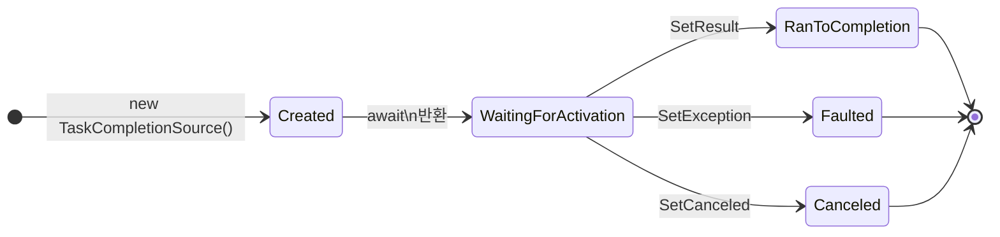

라이브러리 저자가 자주 빠지는 함정은 위 다이어그램에서 **`WaitingForActivation` 상태에 있는 시간 동안 어디에 콜백이 보관되는가**를 모르는 데서 시작한다. `Task<T>`는 내부적으로 다음과 같은 슬롯을 갖고 있다.

```text
┌──────────────────────────────────────────────────────────────┐
│ Task<T>                                                      │
│  ├─ m_stateFlags    : 상태/완료/캔슬/예외 비트 모음         │
│  ├─ m_continuationObject : Action | List | TaskScheduler ... │
│  ├─ m_result        : T (성공 시)                           │
│  ├─ m_contingentProperties : (드물게) 예외/CT/AsyncState     │
│  └─ ...                                                      │
└──────────────────────────────────────────────────────────────┘
```

`m_continuationObject`는 **빈 슬롯**, **하나의 `Action`**, 또는 **여러 콜백의 리스트**가 될 수 있다. CLR은 같은 필드를 가변 모양으로 우려먹어 메모리 할당을 줄인다. 라이브러리 저자에게 이 사실이 왜 중요한가? 우리가 만들 `IValueTaskSource<T>`(12장)에서 같은 트릭을 흉내내기 때문이다.

### 1.1.1 SharpLab으로 본 최소 비동기

다음 코드를 [SharpLab](https://sharplab.io)에 붙여 디컴파일해 보자.

```csharp
public Task<int> Trivial() => Task.FromResult(42);
```

생성되는 IL은 단순히 `Task.FromResult`를 호출할 뿐이다. 그런데 `Task.FromResult`는 작은 정수에 대해 **캐시된 인스턴스**를 반환한다. -1, 0, 1, true, false 같은 자주 쓰는 값은 매 호출마다 새 `Task<int>`를 만들지 않는다. 라이브러리 저자라면 같은 캐싱 기법을 의식적으로 활용해야 한다.

> **Tip.** 반환할 `Task<bool>`이 거의 항상 `false`라면 `Task.FromResult(false)`가 캐시를 탄다. 그러나 `Task<MyEnum>`을 캐시하려면 직접 캐시를 만들거나 `ValueTask`로 옮겨야 한다.

### 1.1.2 한 줄짜리 비동기의 실제 비용

```csharp
public async Task<int> CalcAsync()
{
    return 42;
}
```

이 메서드를 `await`하면 어떤 일이 벌어지는가? `async` 키워드가 붙은 순간 컴파일러는 **상태 머신**을 만든다. 결과적으로 호출자가 받는 `Task<int>`는 **`AsyncTaskMethodBuilder<int>.Task`** 가 반환하는 것이고, 메서드가 동기적으로 끝났더라도 이 빌더는 박싱·캐싱 로직을 거친다. .NET 10에서 작은 정수 결과는 캐시된 `Task<int>`로 재사용되지만, `bool/enum/struct`는 매번 새로 할당되는 경향이 있다.

이 부분을 측정해 보자.

```csharp
// 파일: samples/src/Chapter01/Section_01_TaskAllocationProbe.cs
using AsyncAwaitLab.Common;

namespace AsyncAwaitLab.Chapter01;

internal static class TaskAllocationProbe
{
    public static async Task RunAsync()
    {
        ConsoleHelpers.Banner("§1.1 - Task allocation probe");

        var before = AsyncDiagnostics.Snapshot();
        for (int i = 0; i < 1_000_000; i++)
        {
            _ = await CalcSyncResultAsync();
        }
        var after = AsyncDiagnostics.Snapshot();
        ConsoleHelpers.Log($"sync-completed async: {AsyncDiagnostics.Diff(before, after)}");

        before = AsyncDiagnostics.Snapshot();
        for (int i = 0; i < 1_000_000; i++)
        {
            _ = await CalcSyncResultValueAsync();
        }
        after = AsyncDiagnostics.Snapshot();
        ConsoleHelpers.Log($"sync-completed valuetask: {AsyncDiagnostics.Diff(before, after)}");
    }

    private static async Task<int> CalcSyncResultAsync() => 42;
    private static async ValueTask<int> CalcSyncResultValueAsync() => 42;
}
```

이 코드를 돌리면 1,000,000번 호출했을 때 두 버전이 할당하는 바이트 수가 다르게 보일 것이다. `Task<int>` 버전은 작은 정수 캐시 덕에 거의 0에 가깝지만, 만약 결과 타입을 `Guid`나 사용자 정의 `record struct`로 바꾸면 즉시 차이가 벌어진다. **결과 타입이 박싱되거나 캐시되지 않는 값 타입일 때 `ValueTask<T>`가 효과를 발휘한다.**

---

## 1.2 `ValueTask<T>`가 푸는 진짜 문제

`ValueTask<T>`는 흔히 "값 타입 버전 Task"로 소개된다. 절반만 맞는 설명이다. 정확히는 **세 가지 결과 중 하나**를 표현하는 union 타입이다.

```text
┌────────────────────────────────────────────────────────┐
│ ValueTask<T> (struct, 16~24B)                          │
│  ├─ _result : T            ← 동기 완료 케이스         │
│  ├─ _obj    : Task<T>      ← 일반적인 Task 케이스      │
│  └─ _obj    : IValueTaskSource<T> + _token : short    │
│       └─ 재사용 가능한 풀링된 소스                     │
└────────────────────────────────────────────────────────┘
```

세 케이스를 시각화하면 이렇다.

```text
ValueTask<int>
   │
   ├── (A) 동기 완료     :  _obj=null, _result=42
   │
   ├── (B) Task 위임     :  _obj=Task<int>, _token=0
   │
   └── (C) 풀링된 소스   :  _obj=IValueTaskSource<int>, _token=N
                                      │
                                      └─ Reset() 후 다음 호출에 재사용
```

라이브러리 저자가 가장 자주 마주치는 결정은 **(A)를 흔히 반환하는 메서드**를 만들 때다.

```csharp
public async Task<byte[]> ReadAsync()  // (A1) 동기 완료가 많아도 매번 Task 인스턴스 발생 가능
public ValueTask<byte[]> ReadAsync()   // (A2) 동기 완료는 무할당, 비동기 완료는 Task 위임
```

`ReadAsync`가 90%의 경우 버퍼에서 즉시 데이터를 돌려준다면, `ValueTask<byte[]>`는 그 90%의 호출을 **0 byte 할당**으로 처리한다.

> **Pitfall.** `ValueTask<T>`를 두 번 `await`하면 안 된다. (C) 케이스에서 `_token`이 매치되지 않아 예외가 난다. 한 번만 `await`하거나, 다회 사용해야 한다면 `.AsTask()`로 변환해 캐싱하라.

### 1.2.1 `ValueTask<T>`의 라이프사이클

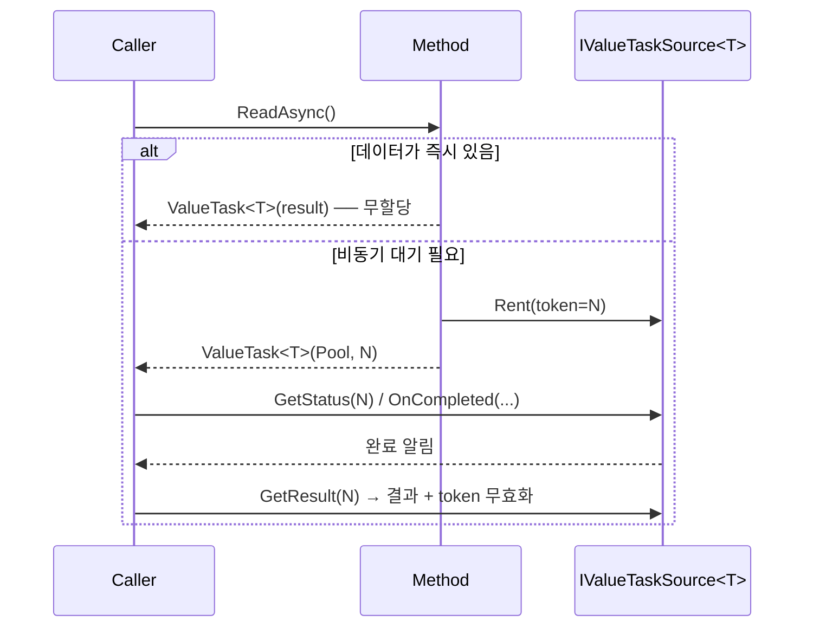

(C) 케이스는 `Socket.ReceiveAsync`, `Channel<T>.Reader.ReadAsync`, `PipeReader.ReadAsync` 등에서 광범위하게 쓰인다. 우리도 12장에서 같은 트릭으로 0-allocation awaitable을 만든다.

---

## 1.3 반환 타입 선택의 결정표

```text
┌──────────────────────────────────────┬─────────────────┐
│ 시나리오                              │ 권장 반환 타입 │
├──────────────────────────────────────┼─────────────────┤
│ 거의 항상 await됨, hot path가 아님   │ Task / Task<T> │
│ 동기 완료가 흔함, hot path             │ ValueTask<T>   │
│ 화이어앤포겟(쥐어주고 잊어버림)        │ Task           │
│ 결과를 컬렉션에 모아 둘 것            │ Task<T>        │
│ 풀링된 awaiter로 0-alloc 추구          │ ValueTask<T>   │
│ 호출자가 Task로 변환할 수 있어야 함    │ Task / Task<T> │
└──────────────────────────────────────┴─────────────────┘
```

이 표를 외울 필요는 없다. 결정 흐름을 한 줄로 요약하면 이렇다.

> **"기본은 Task. 동기 완료가 흔하고 호출 빈도가 높으면 ValueTask. 풀링까지 가면 ValueTask + IValueTaskSource."**

### 1.3.1 라이브러리 사용자 vs. 라이브러리 저자

같은 타입이라도 입장에 따라 의미가 다르다.

| | 사용자 입장 | 저자 입장 |
|---|---|---|
| `Task<T>` | "그냥 `await`하면 된다" | 호출마다 인스턴스 할당이 일어날 수 있다 |
| `ValueTask<T>` | "한 번만 `await`해야 한다" | 동기 완료/풀링으로 할당을 0으로 만들 수 있다 |
| `IAsyncEnumerable<T>` | "`await foreach`로 돌린다" | 매 iteration이 `ValueTask`다 (15장) |

이 책의 4장부터는 **저자 입장**에서 자료 구조를 본다.

---

## 1.4 비동기 결과를 표현하는 또 다른 도구들

`Task`/`ValueTask` 외에도 .NET에는 비동기 결과를 표현하는 여러 도구가 있다. 라이브러리 저자라면 적어도 이름은 알아 둬야 한다.

| 타입 | 역할 | 등장 장 |
|------|------|---------|
| `IAsyncEnumerable<T>` | 비동기 스트림 (다회 결과) | 15장 |
| `Channel<T>` | 생산자-소비자 큐 | 16~18장 |
| `IObservable<T>` (Rx) | 푸시 기반 스트림 | 책 범위 밖 |
| `Pipe` / `PipeReader` | 고성능 바이트 스트림 | 7장 |
| `TaskCompletionSource<T>` | 외부 신호로 완료 가능한 Task | 4·6·17장 |
| `IValueTaskSource<T>` | 재사용 가능한 awaiter 후보 | 12장 |

이들을 한 그림으로 비교하면:

```text
       단일 결과              다회 결과              스트림 바이트
       (Task)                 (Async stream)        (Pipelines)
  ┌──────────────┐         ┌──────────────┐         ┌──────────────┐
  │  Task<T>     │         │ IAsyncEnum<T>│         │ PipeReader   │
  │  ValueTask<T>│         │ Channel<T>   │         │ PipeWriter   │
  └──────────────┘         └──────────────┘         └──────────────┘
        ↑                         ↑                         ↑
   동기 await 1회             foreach 루프             SequenceReader<T>
```

---

## 1.5 동시성 vs. 비동기 — 같은 단어, 다른 의미

이 책은 "비동기(asynchrony)"와 "동시성(concurrency)"을 의도적으로 다르게 쓴다.

```text
                동시성(Concurrency)
                       │
        ┌──────────────┴──────────────┐
        │                             │
   비동기(Asynchrony)              병렬성(Parallelism)
   "기다리지 않고 진행"             "동시에 실행"
   I/O 대기 → 콜백                  CPU 코어 N개 → N개 동시 실행
   await Task.Delay                Parallel.For / Parallel.ForEachAsync
```

게임 서버에서 한 룸의 메시지 큐를 하나의 awaitable 루프가 소비한다면, 그것은 **동시성은 있지만 병렬성은 없는** 구조다. 비동기 라이브러리를 짜다 보면 이 두 축을 분리해서 생각해야 할 순간이 자주 찾아온다.

---

## 1.6 이 장을 마치며 — 우리가 가야 할 곳

```text
[1장]  Task/ValueTask 세계관       ← 이번 장
   │
   ▼
[2장]  컴파일러가 만든 상태 머신
   │
   ▼
[3장]  Awaitable/Awaiter 패턴 계약
   │
   ▼
[4장~] 직접 만들기
```

다음 장에서는 `async` 키워드가 붙은 한 줄짜리 메서드를 SharpLab으로 펼쳐 보고, **컴파일러가 어떤 상태 머신을 만드는지** 한 단계씩 손으로 따라 그린다. 거기서부터 우리는 사용자에서 저자로 자리를 옮긴다.

---

## 연습 문제

1. (쉬움) `Task.FromResult(true)`와 `Task.FromResult(false)`가 매번 같은 인스턴스를 반환하는지 `Object.ReferenceEquals`로 확인하라. `Task.FromResult(new MyStruct())`는 어떤가?
2. (보통) `async Task<bool>` 메서드가 GC 알로케이션을 발생시키지 않는 조건을 본문에 따라 정리하라. `[AsyncMethodBuilder]` 어트리뷰트로 빌더를 바꿔야 하는가?
3. (어려움) `ValueTask<int>`를 두 번 `await`했을 때 어떤 예외가 발생하는지 직접 재현하고, 그 예외 메시지를 본문에 인용하라. 그 예외가 (A)/(B)/(C) 세 케이스 중 어디서 발생하는가?
4. (도전) 본문의 `TaskAllocationProbe`를 BenchmarkDotNet으로 재작성하라. `[MemoryDiagnoser]`를 붙이고, `Task<int>` vs. `ValueTask<int>` vs. `Task<Guid>` vs. `ValueTask<Guid>` 네 케이스를 비교하라.

> 답안 코드는 `samples/src/Chapter01/Section_01_TaskAllocationProbe.cs`에 일부가 들어 있다. 완성된 예제는 부록 C에 정리되어 있다.
  

# 2장. 컴파일러가 만드는 상태 머신 해부

> "async/await를 안다"고 말할 수 있는 가장 확실한 기준은, **컴파일러가 만든 상태 머신을 보고 어떤 일이 일어나는지 한 단계씩 짚어낼 수 있는가**이다.

## 학습 목표

- C# 컴파일러가 `async` 메서드에서 생성하는 세 가지 구조물(상태 머신 struct, 빌더, IAsyncStateMachine)을 그릴 수 있다.
- `MoveNext`가 호출되는 순간을 시간 축 위에 정확히 배치할 수 있다.
- `await`의 의미를 "콜백 등록 → 제어 반환 → MoveNext 재진입"으로 재해석할 수 있다.
- 비동기 메서드의 한 번 호출이 GC heap에 무엇을 남기는지 안다.

---

## 2.1 출발점 — 가장 간단한 async 메서드

```csharp
public async Task<int> AddDelayedAsync(int a, int b)
{
    await Task.Delay(100);
    return a + b;
}
```

이 한 줄짜리 메서드가 어떻게 변환되는가? 컴파일러는 다음 세 가지를 만든다.

```text
┌────────────────────────────────────────────────────────┐
│ 1. <AddDelayedAsync>d__0  : IAsyncStateMachine 구조체  │
│    상태, 빌더, 캡처된 지역 변수, awaiter를 담는다       │
├────────────────────────────────────────────────────────┤
│ 2. AddDelayedAsync (kick-off)  : 일반 메서드            │
│    상태 머신을 만들고 builder.Start()를 호출            │
├────────────────────────────────────────────────────────┤
│ 3. builder                       : AsyncTaskMethodBuilder│
│    Task를 보관, SetResult/SetException 제공            │
└────────────────────────────────────────────────────────┘
```

### 2.1.1 kick-off 메서드

컴파일러가 만든 kick-off 메서드의 모양은 대략 이렇다.

```csharp
[AsyncStateMachine(typeof(<AddDelayedAsync>d__0))]
public Task<int> AddDelayedAsync(int a, int b)
{
    var sm = new <AddDelayedAsync>d__0();
    sm.<>4__this = this;
    sm.a = a;
    sm.b = b;
    sm.<>t__builder = AsyncTaskMethodBuilder<int>.Create();
    sm.<>1__state = -1;            // 초기 상태
    sm.<>t__builder.Start(ref sm); // 첫 MoveNext 호출
    return sm.<>t__builder.Task;
}
```

`Start(ref sm)`는 한 번 동기적으로 `MoveNext`를 실행한다. `await` 지점에 도달하기 전까지 동기적으로 진행되며, 만약 메서드가 단 한 번의 `await` 없이 끝난다면 **상태 머신은 GC heap에 박싱되지 않을 수도** 있다(.NET 5부터 도입된 최적화).

### 2.1.2 상태 머신 struct

```csharp
[StructLayout(LayoutKind.Auto)]
private struct <AddDelayedAsync>d__0 : IAsyncStateMachine
{
    public int <>1__state;                            // 현재 상태
    public AsyncTaskMethodBuilder<int> <>t__builder;  // 빌더
    public Foo <>4__this;                             // 캡처된 this
    public int a, b;                                  // 캡처된 매개변수
    private TaskAwaiter <>u__1;                       // 진행 중 awaiter

    void IAsyncStateMachine.MoveNext() { /* ... */ }
    void IAsyncStateMachine.SetStateMachine(IAsyncStateMachine sm)
        => <>t__builder.SetStateMachine(sm);
}
```

이 구조체가 .NET 런타임이 `await` 한 번을 만나면 어떻게 GC heap으로 박싱되는지가 이 장의 핵심이다.

---

## 2.2 MoveNext — 상태 머신의 본체

`MoveNext`는 컴파일러가 생성한 `switch`다. 단순화된 형태:

```csharp
void IAsyncStateMachine.MoveNext()
{
    int num = <>1__state;
    int result;
    try
    {
        TaskAwaiter awaiter;
        if (num != 0)
        {
            // (1) 진입: await에 도달할 때까지 동기 실행
            awaiter = Task.Delay(100).GetAwaiter();
            if (!awaiter.IsCompleted)
            {
                // (2) 미완료 — 콜백 등록 후 제어 반환
                <>1__state = 0;
                <>u__1 = awaiter;
                <>t__builder.AwaitUnsafeOnCompleted(ref awaiter, ref this);
                return;
            }
        }
        else
        {
            // (3) 재진입: 콜백이 호출되어 다시 MoveNext가 돌고 있음
            awaiter = <>u__1;
            <>u__1 = default;
            <>1__state = -1;
        }
        awaiter.GetResult();          // 예외가 있다면 여기서 던짐
        result = a + b;
    }
    catch (Exception ex)
    {
        <>1__state = -2;
        <>t__builder.SetException(ex);
        return;
    }
    <>1__state = -2;
    <>t__builder.SetResult(result);
}
```

이 코드를 처음 보면 복잡하지만, 시간 축으로 펼치면 단순한 두 단계다.

```text
   [Start]
     │
     ▼
   MoveNext #1 ── awaiter.IsCompleted? ── true ──▶ result = a+b → SetResult
     │
     │ false
     ▼
   AwaitUnsafeOnCompleted(awaiter, this)
     │     ↑
     │     └── awaiter가 완료되면 .NET 런타임이 자동으로
     │         callback을 호출하고, callback 안에서 다시
     │         this.MoveNext()를 부른다.
     ▼
   <return>  ── 호출자에게 Task<int>가 이미 반환되어 있음
                (kick-off 메서드의 마지막 줄에서 반환됐다)

   ... (await된 Task가 완료될 때까지 대기) ...

   MoveNext #2 ── awaiter.GetResult() → result = a+b → SetResult
```

### 2.2.1 시각화 — 시간 축 위의 두 번의 MoveNext

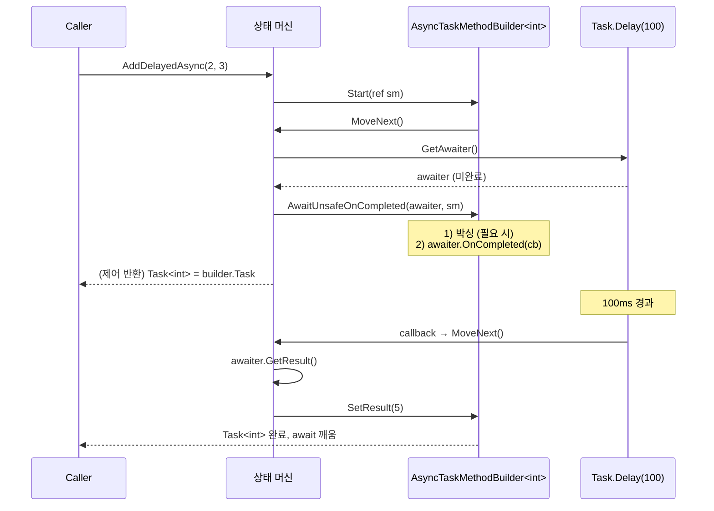

라이브러리 저자에게 중요한 포인트:

1. **첫 `MoveNext`는 호출자 스레드에서 동기적으로** 실행된다.
2. **두 번째 `MoveNext`는 awaiter가 결정하는 스레드**에서 실행된다.
3. 그 사이 동안 상태 머신 struct는 어딘가에 보관되어 있어야 한다.

---

## 2.3 박싱(boxing)의 정체 — 상태 머신은 어디로 가는가

`AwaitUnsafeOnCompleted`가 호출되면 컴파일러/빌더는 다음을 보장해야 한다.

> "현재 상태 머신을 안전한 곳에 두고, awaiter가 완료될 때 `MoveNext`를 다시 호출할 수 있도록 콜백을 등록한다."

상태 머신은 struct다. struct는 stack에 산다. stack에 둔 채로 콜백을 등록하면, MoveNext가 끝나는 순간 그 stack frame은 사라지므로 callback이 호출됐을 때 가리킬 곳이 없다. 그래서 **첫 await 지점에서 상태 머신이 GC heap의 박스로 옮겨진다.**

```text
처음 호출 직후 — stack에 있다
┌─────────────┐
│ stack frame │
│  sm: struct │ ─┐
│   state=-1  │  │  (값 타입)
│   a, b      │  │
└─────────────┘  │
                 │
첫 await 만난 후 │  AwaitUnsafeOnCompleted가
                 ▼  새 heap object를 만들어 옮긴다
                ┌──────────────┐
                │  GC heap     │
                │ ┌─────────┐  │
                │ │ Box<SM> │  │  ← 실제로 IAsyncStateMachine
                │ │ state=0 │  │     인터페이스를 구현한 heap 객체
                │ │ a, b    │  │
                │ │ awaiter │  │
                │ └─────────┘  │
                └──────────────┘
```

이 박싱이 **async 한 번 호출에 따라붙는 가장 큰 비용**이다. 1장에서 본 `Task<int>` 캐싱 트릭은 결과 객체에 관한 것이고, 박싱은 상태 머신 자체에 관한 것이다. 둘은 다른 레이어다.

> **Tip.** await 한 번이 동기적으로 완료(awaiter.IsCompleted=true)되는 경우, 박싱은 일어나지 않는다. 그래서 동기 완료가 흔한 함수에서 `ValueTask<T>`가 두 배로 효과적이다.

### 2.3.1 박싱을 안 시키는 두 가지 방법

1. **모든 await가 즉시 완료된다** — 위의 (1) 분기만 타고 끝난다.
2. **결과 타입 자체를 `ValueTask<T>` + 풀링된 `IValueTaskSource<T>`로 만든다** — 12장에서 우리가 만들 것.

---

## 2.4 빌더(Builder)는 무엇을 하는가

`AsyncTaskMethodBuilder<T>`는 컴파일러가 생성한 코드와 `Task<T>` 사이의 중계자다. 단순화한 형태로 적으면:

```csharp
public struct AsyncTaskMethodBuilder<T>
{
    private Task<T>? _task;

    public static AsyncTaskMethodBuilder<T> Create() => default;

    public Task<T> Task => _task ??= new Task<T>(/* ... */);

    public void Start<TStateMachine>(ref TStateMachine sm)
        where TStateMachine : IAsyncStateMachine
        => sm.MoveNext();

    public void SetResult(T result)
    {
        // 1) _task가 아직 없으면 캐시된 Task<T>를 반환할 수도 있다 (소위 "AsyncTaskCache")
        // 2) 있으면 SetResult로 완료
    }

    public void SetException(Exception ex) { /* ... */ }

    public void AwaitUnsafeOnCompleted<TAwaiter, TStateMachine>(
        ref TAwaiter awaiter, ref TStateMachine sm)
        where TAwaiter : ICriticalNotifyCompletion
        where TStateMachine : IAsyncStateMachine
    {
        // 핵심: 박싱이 일어나고, awaiter.UnsafeOnCompleted에 콜백 등록
        var box = AsyncTaskMethodBuilder<T>.AsyncStateMachineBox<TStateMachine>.Rent(ref sm, ref this);
        awaiter.UnsafeOnCompleted(box.MoveNextAction);
    }
}
```

`AsyncStateMachineBox<TStateMachine>`는 .NET 런타임이 내부적으로 사용하는 박스 타입이다. 다음과 같은 의미를 갖는다.

```text
AsyncStateMachineBox<TStateMachine>  : Task<T>  (네, 빌더의 Task 자체다)
   └─ TStateMachine StateMachine     : value-typed state machine을 보관
```

흥미롭게도 **박스 객체 자체가 `Task<T>`다.** 빌더의 `Task` 프로퍼티가 반환하는 객체와 상태 머신을 담는 박스가 같은 것이다. 이 트릭으로 .NET 5+는 비동기 메서드 한 번에 GC heap 객체 하나만 만든다.

> **Tip.** .NET 6에 도입된 `PoolingAsyncValueTaskMethodBuilder`는 박스를 풀에서 재사용한다. 12장에서 우리가 같은 일을 손으로 한다.

---

## 2.5 동기 완료 vs. 비동기 완료의 결정

`await someTask`는 다음을 의미한다:

```csharp
var awaiter = someTask.GetAwaiter();
if (awaiter.IsCompleted)
{
    return awaiter.GetResult();   // 동기 경로
}
else
{
    // 비동기 경로
    builder.AwaitUnsafeOnCompleted(ref awaiter, ref sm);
    return;
}
```

라이브러리 저자가 awaiter를 만들 때 `IsCompleted`를 어떻게 결정할지가 **할당과 스레드 점프**를 결정짓는다. 4장과 5장에서 우리가 만들 awaitable은 이 두 경로를 모두 신경 써서 짜야 한다.

### 2.5.1 직접 측정해 보기

```csharp
// 파일: samples/src/Chapter02/Section_01_MoveNextCount.cs
// 동기 완료 vs 비동기 완료를 카운트로 비교한다.
```

전체 코드는 `samples/src/Chapter02/Section_01_MoveNextCount.cs`에 있고, 출력 예는 다음과 같다.

```text
[0001.2 ms][T#01] sync-complete: 1 transitions, 0 thread hops
[0001.4 ms][T#01] async-complete (Task.Delay(1)): 2 transitions, 1 thread hop
```

`transitions`는 `MoveNext` 호출 횟수, `thread hops`는 첫/마지막 MoveNext가 같은 스레드에서 일어났는지를 보여 준다.

---

## 2.6 상태 머신의 라이프사이클을 그림 하나로

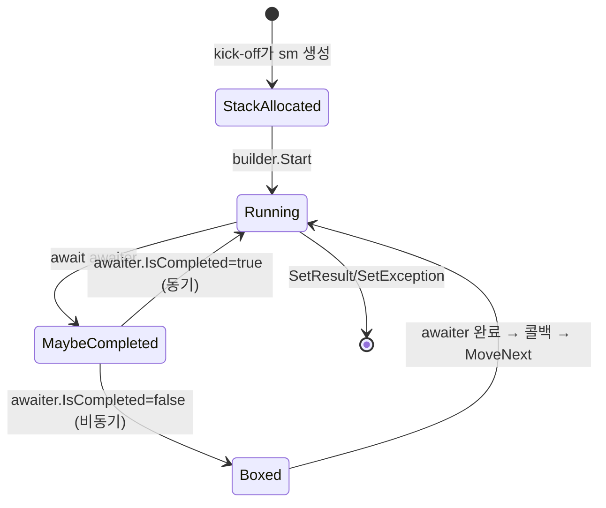

`Boxed`에 머무르는 시간이 길수록 GC heap 점유 시간이 길다. 또 박스 객체는 `Task<T>` 자체이므로, 누군가 그 `Task<T>` 참조를 길게 들고 있으면 박스가 살아 남고, **그 안에 캡처된 변수**도 함께 살아 남는다. 비동기 누수 사냥은 보통 이 박스를 추적하는 일이다 (19장에서 다룬다).

---

## 2.7 우리가 4장에서 만들 것

지금까지 본 모든 메커니즘은 컴파일러와 BCL이 자동으로 해 준다. 라이브러리 저자가 **직접 짜야 하는 것**은 다음 한 가지다:

```text
"await할 수 있는 객체를 만들 때 컴파일러가 요구하는 형태(shape)를 맞춘다."
```

그 "형태"가 다음 장의 주제다. 3장에서 awaitable/awaiter 패턴 계약을 정리한 뒤, 4장에서 첫 awaitable을 손으로 짠다.

---

## 연습 문제

1. (쉬움) `await someTask`가 한 번 동기 완료, 한 번 비동기 완료를 섞어 일어날 때 `MoveNext`는 몇 번 호출되는가? 각 호출이 어느 스레드에서 일어나는지 책 본문의 시퀀스 다이어그램과 짝지어 설명하라.
2. (보통) [SharpLab](https://sharplab.io) 또는 `dotnet build /p:EmitCompilerGeneratedFiles=true /p:CompilerGeneratedFilesOutputPath=Generated` 옵션으로 본문의 `AddDelayedAsync`를 디컴파일하라. 본문이 생략한 부분(예: `AwaitOnCompleted` vs. `AwaitUnsafeOnCompleted`의 분기)을 찾아 보고하라.
3. (어려움) `Task.Delay(0)`을 `await`했을 때 박싱이 일어나는가? `AsyncDiagnostics.Snapshot`을 활용해 직접 측정하라.
4. (도전) `IAsyncStateMachine`을 직접 구현해 빌더 없이 `Task<T>`를 만드는 미니멀 비동기 함수를 짜 보라. 컴파일러가 만든 것과 같은 동작을 보여 줄 수 있는가?


# 3장. Awaitable / Awaiter 패턴의 설계 철학

> "인터페이스를 만들 때는 묻고, 패턴을 만들 때는 듣는다."

## 학습 목표

- C# 컴파일러가 `await X`를 정당화하기 위해 X에게 요구하는 **형태 계약(shape contract)**을 한 그림으로 요약한다.
- `INotifyCompletion` vs. `ICriticalNotifyCompletion`의 차이와, 라이브러리 저자가 어느 쪽을 구현해야 하는지 안다.
- 확장 메서드로 GetAwaiter를 제공하는 트릭과 그 한계를 안다.
- "동기 완료를 우대"하는 awaiter가 호출 사이트의 코드에서 어떻게 보이는지 그릴 수 있다.

---

## 3.1 형태 계약이라는 개념

C#에는 `await`를 위한 인터페이스가 **없다.** 컴파일러는 다음 조건만 만족하면 어떤 타입이든 `await`할 수 있게 해 준다.

```text
T : awaitable
  ├─ GetAwaiter()   : 메서드(인스턴스 또는 확장)
  │
  └─ returns A : awaiter
       ├─ bool IsCompleted    { get; }
       ├─ void OnCompleted(Action) // INotifyCompletion 또는
       │   void UnsafeOnCompleted(Action) // ICriticalNotifyCompletion
       └─ TResult GetResult()       // void 또는 임의 T
```

이 계약을 "duck typing"이라고도 한다. `Task<T>`도 이 계약을 만족시키기 때문에 `await`할 수 있다. 우리는 **같은 계약을 우리 타입에도 적용**해 `await`되게 만들 것이다.

### 3.1.1 컴파일러가 실제로 펼치는 코드

`await something;`의 의미는 대략 이렇다.

```csharp
// [의사 코드]
var awaiter = something.GetAwaiter();
if (!awaiter.IsCompleted)
{
    builder.AwaitOnCompleted(ref awaiter, ref stateMachine);
    return; // 제어 반환
}
awaiter.GetResult();   // 또는 var x = awaiter.GetResult();
```

여기서 컴파일러가 `awaiter`에게 묻는 것은 **세 가지뿐**이다.

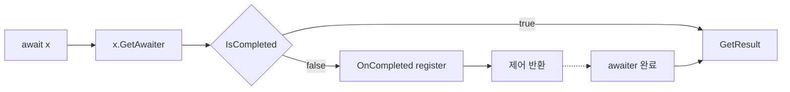

---

## 3.2 INotifyCompletion vs. ICriticalNotifyCompletion

두 인터페이스의 본문은 거의 같다.

```csharp
public interface INotifyCompletion
{
    void OnCompleted(Action continuation);
}

public interface ICriticalNotifyCompletion : INotifyCompletion
{
    void UnsafeOnCompleted(Action continuation);
}
```

차이는 **`ExecutionContext` 캡처 책임의 위치**다.

```text
INotifyCompletion          ─ OnCompleted 안에서 EC.Capture()를
                             직접 호출해 콜백을 감싸야 한다.
ICriticalNotifyCompletion  ─ EC 캡처는 컴파일러/빌더가 이미 했고,
                             UnsafeOnCompleted는 그것을 신뢰한다.
                             대신 보안 권한(security demand) 없이 호출 가능.
```

`AsyncTaskMethodBuilder<T>.AwaitOnCompleted`는 `INotifyCompletion`을, `AwaitUnsafeOnCompleted`는 `ICriticalNotifyCompletion`을 호출한다. 컴파일러는 awaiter가 `ICriticalNotifyCompletion`을 구현하고 있으면 **항상 unsafe 쪽을 쓴다** — 빠르기 때문이다.

라이브러리 저자에게는 다음이 정답이다.

> **Rule.** 우리가 만드는 awaiter는 일반적으로 `ICriticalNotifyCompletion`을 구현한다. 단, `ExecutionContext` 흐름을 우리 손으로 보장해야 한다.

12장에서 이 약속을 구체적으로 지키는 방법을 본다.

---

## 3.3 GetAwaiter 제공 방식 — 인스턴스 vs. 확장 메서드

### 3.3.1 인스턴스 메서드 패턴

```csharp
public sealed class MyAwaitable
{
    public MyAwaiter GetAwaiter() => new(/* ... */);
}
```

가장 단순한 형태다. 우리 타입을 우리가 통제할 수 있을 때 쓴다.

### 3.3.2 확장 메서드 패턴

남의 타입을 awaitable로 만들고 싶을 때.

```csharp
public static class TimeSpanExtensions
{
    public static TaskAwaiter GetAwaiter(this TimeSpan delay)
        => Task.Delay(delay).GetAwaiter();
}
```

이 한 줄을 추가하면 다음이 가능해진다.

```csharp
await TimeSpan.FromSeconds(1);   // 컴파일된다!
```

이런 트릭은 **API 표면을 자연어처럼 만드는** 데 유용하지만, 동시에 가독성을 해치므로 절제해서 쓴다.

### 3.3.3 인스턴스가 이긴다 — 우선순위 규칙

같은 awaitable에 인스턴스 GetAwaiter와 확장 GetAwaiter가 모두 있으면 **인스턴스가 이긴다.** 표준 멤버 조회 규칙 그대로다. 외부 라이브러리의 동작을 확장으로 덮어쓰려는 시도는 일반적으로 실패한다는 뜻이다.

---

## 3.4 동기 완료 우대(synchronous-fast-path)의 디자인

`IsCompleted`를 어떻게 결정하는가가 awaiter 설계의 80%다.

### 3.4.1 안티 패턴 — 항상 false 반환

```csharp
public bool IsCompleted => false;   // ← 항상 비동기 경로
```

이렇게 짜면 모든 호출이 박싱과 콜백 등록을 거친다. 동기 완료가 가능한 경우에도 비싼 길을 간다.

### 3.4.2 권장 패턴 — 자료 구조에 직접 묻기

```csharp
public bool IsCompleted => _result.HasValue || _exception is not null;
```

awaiter는 자신이 가진 상태를 정직하게 보고한다. 컴파일러가 동기 경로를 골라 줄 것이다.

### 3.4.3 시각화

```text
                 IsCompleted=true   IsCompleted=false
                       │                  │
                       ▼                  ▼
                    GetResult        OnCompleted(cb)
                       │                  │
                       │                  │ ┌── awaiter가 결정한 스레드 ──┐
                       ▼                  ▼ ▼                            │
                  결과 반환 (즉시)        cb 호출 → 그 안에서 MoveNext   │
                                                                         │
                                       ↑                                │
                                       └────── (시간 경과) ──────────────┘
```

동기 완료 시 **stack frame 한 개로 끝난다.** 비동기 완료 시에는 thread pool로 점프하고 박싱이 일어난다. 90%가 동기 완료라면 90%의 호출이 무할당이다.

---

## 3.5 한 페이지로 본 패턴 카드

```text
┌──────────────────────────────────────────────────────────────┐
│ Awaitable의 형태 계약 (cheat-sheet)                          │
├──────────────────────────────────────────────────────────────┤
│ T : awaitable                                                │
│   • A GetAwaiter()  (인스턴스 또는 확장)                    │
│ A : awaiter                                                  │
│   • bool IsCompleted { get; }                                │
│   • void OnCompleted(Action)         (INotifyCompletion)    │
│   • void UnsafeOnCompleted(Action)   (ICritical~) ★ 권장    │
│   • TResult GetResult()  (예외/취소 발생 시 여기서 throw)   │
└──────────────────────────────────────────────────────────────┘
```

이 카드의 항목을 4장에서 한 줄씩 따라가며 우리 첫 awaitable을 만든다.

---

## 3.6 라이브러리 저자를 위한 체크리스트

다음 절에서 첫 코드를 짜기 전에 묻고 답해야 할 질문들이다.

```text
[ ] 1. 동기 완료가 가능한 경로가 있는가?  → IsCompleted를 정확히 반영
[ ] 2. 결과 타입이 무엇인가? void / T / 예외?
[ ] 3. 예외 발생 경로는? — GetResult에서만 던진다 (OnCompleted에서 절대 X)
[ ] 4. 취소는 어떻게 표현? — TaskCanceledException → GetResult에서 throw
[ ] 5. ExecutionContext / SynchronizationContext 캡처 정책은?
[ ] 6. ICriticalNotifyCompletion을 구현하는가?
[ ] 7. 두 번 await되어도 안전한가? (재진입 안전)
[ ] 8. 콜백이 동기적으로 즉시 호출될 가능성이 있는가? (stack overflow 주의)
[ ] 9. 메모리: awaiter는 struct인가 class인가? 풀링이 필요한가?
[ ] 10. 디버깅: 예외 stack trace에 우리 awaiter가 의미 있게 나타나는가?
```

이 목록은 책 전체를 통과하면서 매 장마다 다시 호출될 것이다. 4장은 1~4번을, 6장은 4·5·7번을, 12장은 6·9·10번을 본격적으로 다룬다.

---

## 3.7 다음 장 예고

```text
[3장] 패턴 계약 정리       ← 여기
   │
   ▼
[4장] 첫 커스텀 Awaitable: 동기/비동기 완료 양쪽 지원
   │
   ▼
[5장] DelayAsync 재발명: Timer + 콜백 + 취소
   │
   ▼
[6장] 취소와 메모리 안전성: 콜백 해제, 풀링, IValueTaskSource
```

3장이 끝났다. 머리에 그림이 그려졌다면 4장으로 넘어가 처음으로 직접 손에 키보드를 올릴 시간이다.

---

## 연습 문제

1. (쉬움) 다음 코드는 컴파일되는가? 이유를 설명하라.
   ```csharp
   public class Empty { }
   // ...
   await new Empty();
   ```
2. (보통) `TimeSpan`을 직접 awaitable로 만드는 확장 메서드(`3.3.2`)를 작성하고, `await TimeSpan.FromMilliseconds(50)`이 동작하는지 확인하라. 그 다음 같은 호출을 1만 번 반복했을 때 GC heap 할당이 얼마나 발생하는지 측정하라 (`AsyncDiagnostics.Snapshot`).
3. (어려움) 자신만의 `Yield()` awaitable을 만들라. `Task.Yield()`처럼 항상 비동기 완료로 동작하면서 `ThreadPool.QueueUserWorkItem`으로 콜백을 재진입시킨다. 의도적으로 `IsCompleted = false`로 두는 이유를 한 줄로 답하라.
4. (도전) `ICriticalNotifyCompletion`을 구현하지 않고 `INotifyCompletion`만 구현했을 때, 비동기 경로에서 어떤 추가 비용이 발생하는지 .NET 런타임 소스코드의 `AwaitOnCompleted` 구현을 인용해 정리하라.


# 4장. 첫 커스텀 Awaitable

> 이 책에서 처음으로 키보드에 손을 올리는 장이다. 끝나면 우리가 만든 타입을 `await new MyAwaitable()`로 호출하며 실제 동작하는 라이브러리 한 조각을 얻는다.

## 학습 목표

- 최소 awaitable을 30줄 안에 짤 수 있게 된다.
- 동기/비동기 두 완료 경로를 한 awaiter 안에 깔끔하게 담는다.
- 예외와 결과를 awaiter가 어떻게 보관/노출하는지 손으로 짠다.
- 4장 끝에서 우리 타입이 BCL의 `Task<T>`와 어떻게 다른지 한 문장으로 설명할 수 있다.

---

## 4.1 가장 작은 Awaitable

처음은 단순하게. **항상 동기 완료**되는 awaitable이다.

```csharp
// 파일: samples/src/Chapter04/Step1_SimpleAwaitable.cs
namespace AsyncAwaitLab.Chapter04;

public readonly struct InstantValue<T>
{
    private readonly T _value;
    public InstantValue(T value) => _value = value;
    public Awaiter GetAwaiter() => new(_value);

    public readonly struct Awaiter : System.Runtime.CompilerServices.INotifyCompletion
    {
        private readonly T _value;
        public Awaiter(T value) => _value = value;

        public bool IsCompleted => true;
        public T GetResult() => _value;
        public void OnCompleted(Action continuation) => continuation();
    }
}
```

사용:

```csharp
string greeting = await new InstantValue<string>("Hello!");
```

이게 끝이다. 동기 완료 경로만 타기 때문에 박싱은 일어나지 않는다. **단 한 가지 함정**은 `OnCompleted`가 동기적으로 콜백을 호출한다는 점이다 — 이미 `IsCompleted=true`라서 컴파일러는 사실 OnCompleted를 호출하지 않을 것이다. 그래도 우리는 방어적으로 구현해 두었다.

```text
[Caller] ──▶ GetAwaiter ──▶ IsCompleted=true ──▶ GetResult ──▶ [Caller]
                                                       ▲
                                                       └─ stack 위에서 끝
```

---

## 4.2 비동기 완료를 섞기 — 동기/비동기 양쪽 지원

이번에는 두 경로를 모두 지원하는 awaitable을 만든다. 외부 신호로 완료되는 단순한 "manual-reset" awaitable이다.

```csharp
// 파일: samples/src/Chapter04/Step2_ManualSignalAwaitable.cs
namespace AsyncAwaitLab.Chapter04;

public sealed class ManualSignal<T>
{
    private readonly object _lock = new();
    private bool _isCompleted;
    private T? _result;
    private Exception? _exception;
    private Action? _continuation;

    public Awaiter GetAwaiter() => new(this);

    public void SetResult(T value)
    {
        Action? c;
        lock (_lock)
        {
            if (_isCompleted) throw new InvalidOperationException("이미 완료");
            _isCompleted = true;
            _result = value;
            c = _continuation;
            _continuation = null;
        }
        c?.Invoke();
    }

    public void SetException(Exception ex)
    {
        Action? c;
        lock (_lock)
        {
            if (_isCompleted) throw new InvalidOperationException("이미 완료");
            _isCompleted = true;
            _exception = ex;
            c = _continuation;
            _continuation = null;
        }
        c?.Invoke();
    }

    public readonly struct Awaiter : System.Runtime.CompilerServices.ICriticalNotifyCompletion
    {
        private readonly ManualSignal<T> _owner;
        public Awaiter(ManualSignal<T> owner) => _owner = owner;

        public bool IsCompleted
        {
            get
            {
                lock (_owner._lock) return _owner._isCompleted;
            }
        }

        public T GetResult()
        {
            lock (_owner._lock)
            {
                if (!_owner._isCompleted)
                    throw new InvalidOperationException("아직 완료되지 않음");
                if (_owner._exception is not null)
                    System.Runtime.ExceptionServices.ExceptionDispatchInfo.Capture(_owner._exception).Throw();
                return _owner._result!;
            }
        }

        public void OnCompleted(Action continuation)
        {
            bool runNow = false;
            lock (_owner._lock)
            {
                if (_owner._isCompleted) runNow = true;
                else _owner._continuation = continuation;
            }
            if (runNow) continuation();
        }

        public void UnsafeOnCompleted(Action continuation) => OnCompleted(continuation);
    }
}
```

사용:

```csharp
var signal = new ManualSignal<int>();

// 다른 스레드에서 완료
_ = Task.Run(async () =>
{
    await Task.Delay(200);
    signal.SetResult(42);
});

int result = await signal;
Console.WriteLine(result);  // 42
```

### 4.2.1 무엇이 일어났는가 — 단계별

```text
1) 호출자 스레드가 `await signal`을 만난다.
2) GetAwaiter() → Awaiter struct 한 개 (stack)
3) IsCompleted == false → OnCompleted(continuation) 등록
4) continuation은 GC heap에 올라간 박스 안에 보관됨
5) 다른 스레드에서 SetResult(42) 호출
6) 보관된 continuation이 호출자에게 콜백되어 MoveNext
7) GetResult()가 42 반환
```

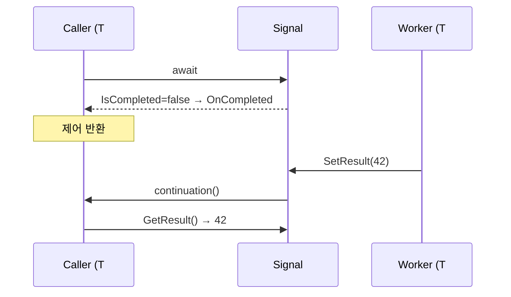

### 4.2.2 락의 비용에 관하여

`lock` 한 번이 awaiter당 한두 번 더 들어가는 게 마음에 걸린다면 좋은 신호다. 6장에서 **lock-free + 풀링**으로 다시 짤 것이다. 일단 정확성부터.

---

## 4.3 예외 전파 — GetResult가 단일 진입점

> **Rule.** awaiter가 던지는 예외는 **반드시 `GetResult`에서만** 던진다. `OnCompleted`에서 던지면 콜백을 어디로 보낼지 알 수 없게 된다.

```csharp
public T GetResult()
{
    if (_exception is not null)
        ExceptionDispatchInfo.Capture(_exception).Throw();
    return _result!;
}
```

`ExceptionDispatchInfo.Capture(...).Throw()`는 원본 stack trace를 보존하며 다시 던지는 표준 트릭이다. `throw _exception;`을 그대로 쓰면 던지는 자리가 바뀌어 디버깅이 어려워진다.

### 4.3.1 예외와 취소 처리 패턴

```text
GetResult
  ├─ _exception is OperationCanceledException
  │     → 취소로 간주, 그대로 throw
  ├─ _exception is non-null
  │     → ExceptionDispatchInfo.Capture(_exception).Throw()
  └─ otherwise
        → return _result
```

`OperationCanceledException`은 별도 분기를 두지 않아도 BCL이 알아서 취소로 인식한다 — `Task`는 예외 타입을 보고 `RanToCompletion` vs `Canceled`를 구분한다. 우리 awaiter는 BCL이 아니지만, 호출자가 `try/catch (OperationCanceledException)`으로 받을 수 있게 같은 관습을 따른다.

---

## 4.4 동기/비동기 완료의 라이프사이클 다이어그램

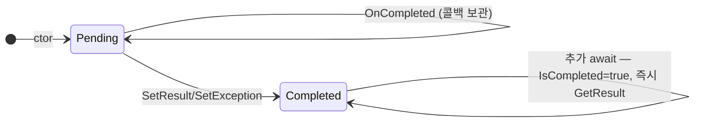

같은 `ManualSignal<T>` 인스턴스를 두 번 `await`해도 문제 없다. **완료된 뒤에는 모든 `await`가 동기 경로**다. 이것은 `Task<T>`와 똑같은 모델이다.

---

## 4.5 BCL `Task<T>`와 우리 `ManualSignal<T>`의 비교

| | `Task<T>` | `ManualSignal<T>` |
|---|---|---|
| 완료 신호 | 내부 빌더 | 외부에서 `SetResult` |
| 다회 await | 안전 | 안전 |
| 콜백 다중 등록 | 가능 | (지금) 한 개만 |
| `ConfigureAwait(false)` | 지원 | 미지원 (10장에서 추가) |
| 풀링 | 일부 (`AsyncTaskCache`) | 없음 (6장에서 추가) |
| 예외 합성 | `AggregateException` 가능 | 단일 예외 |

다음 절에서는 **콜백 다중 등록**을 추가해 한 단계 더 BCL에 가까워진다.

---

## 4.6 콜백 여러 개 등록 가능하게

```csharp
// 파일: samples/src/Chapter04/Step3_MultiContinuation.cs
namespace AsyncAwaitLab.Chapter04;

public sealed class MultiSignal<T>
{
    private readonly object _lock = new();
    private bool _done;
    private T? _result;
    private Exception? _exception;
    private readonly List<Action> _continuations = new();

    public Awaiter GetAwaiter() => new(this);

    public bool TrySetResult(T value)
    {
        List<Action>? cs = null;
        lock (_lock)
        {
            if (_done) return false;
            _done = true;
            _result = value;
            cs = new(_continuations);
            _continuations.Clear();
        }
        foreach (var c in cs) c();
        return true;
    }

    public bool TrySetException(Exception ex)
    {
        List<Action>? cs = null;
        lock (_lock)
        {
            if (_done) return false;
            _done = true;
            _exception = ex;
            cs = new(_continuations);
            _continuations.Clear();
        }
        foreach (var c in cs) c();
        return true;
    }

    public readonly struct Awaiter : System.Runtime.CompilerServices.ICriticalNotifyCompletion
    {
        private readonly MultiSignal<T> _o;
        public Awaiter(MultiSignal<T> o) => _o = o;
        public bool IsCompleted { get { lock (_o._lock) return _o._done; } }

        public T GetResult()
        {
            lock (_o._lock)
            {
                if (!_o._done) throw new InvalidOperationException();
                if (_o._exception is not null)
                    System.Runtime.ExceptionServices.ExceptionDispatchInfo.Capture(_o._exception).Throw();
                return _o._result!;
            }
        }

        public void OnCompleted(Action c)
        {
            bool now;
            lock (_o._lock)
            {
                now = _o._done;
                if (!now) _o._continuations.Add(c);
            }
            if (now) c();
        }

        public void UnsafeOnCompleted(Action c) => OnCompleted(c);
    }
}
```

여러 코드 경로가 같은 신호를 기다리는 시나리오에서 유용하다. 예:

```csharp
var startGate = new MultiSignal<DateTime>();

for (int i = 0; i < 5; i++)
{
    int id = i;
    _ = Task.Run(async () =>
    {
        var t = await startGate;
        Console.WriteLine($"worker {id}: started at {t:O}");
    });
}

await Task.Delay(200);
startGate.TrySetResult(DateTime.UtcNow); // 5명을 한꺼번에 깨운다
```

이 `MultiSignal<T>`은 사실상 단순화한 `TaskCompletionSource<T>`다.

---

## 4.7 디버깅 친화성을 잊지 말 것

awaiter struct는 보통 `[StructLayout(LayoutKind.Auto)]`로 두지만, 디버깅 시점에 도움이 되도록 다음 두 가지를 권장한다.

1. `[DebuggerDisplay("...")]`로 awaiter 상태가 보이게 한다.
2. `[DebuggerHidden]`을 `GetResult`/`OnCompleted`에 붙여 스택 프레임에서 awaiter 내부가 시끄럽게 보이지 않게 한다.

```csharp
[System.Diagnostics.DebuggerDisplay("Done={_done} Result={_result}")]
public sealed class MultiSignal<T> { ... }
```

이 작은 어트리뷰트들이 19장에서 비동기 누수를 사냥할 때 큰 차이를 만든다.

---

## 4.8 정리

- 가장 작은 awaitable은 30줄, 무할당, 동기 완료 전용.
- 동기/비동기 양쪽 지원을 위해선 **상태(완료 여부)** + **continuation 보관** + **lock**.
- 예외는 항상 `GetResult`에서만 던진다.
- 콜백 여러 개를 지원하면 `TaskCompletionSource<T>`와 동등한 기능을 얻는다.

다음 장에서는 **시간에 따라** 완료되는 awaitable — 즉 우리만의 `DelayAsync`를 만든다. Timer를 다루기 시작하면 갑자기 메모리 누수 함정과 정확도 문제가 등장한다.

---

## 연습 문제

1. (쉬움) `ManualSignal<T>.SetResult`를 두 번 호출하면 어떤 예외가 나는가? 호출자 입장에서 그것이 적절한 동작인지 토론하라.
2. (보통) `MultiSignal<T>`의 `_continuations` 리스트를 `ConcurrentQueue<Action>`으로 교체했을 때 락을 줄일 수 있는가? 동시성 측면에서 어떤 보장이 깨지는지 분석하라.
3. (어려움) `ManualSignal<T>`의 콜백이 **항상 ThreadPool에서 실행되도록** `OnCompleted`를 고치라. 호출자의 스레드 친화성에 어떤 영향이 있을지 책 본문 §4.2의 시퀀스를 다시 그려 답하라.
4. (도전) `ManualSignal<T>`를 `IValueTaskSource<T>`로 옮기면 어떤 모양이 되는가? 12장의 예고편이라 생각하고, 메서드 시그니처만 적어 보라.


# 5장. 타이머 기반 비동기 — `DelayAsync` 재발명

> 4장의 `ManualSignal<T>`은 "외부에서 누군가 깨워주기"를 기다렸다. 이번에는 **시간**이 우리를 깨운다.

## 학습 목표

- `System.Threading.Timer`의 콜백을 awaitable로 감싼다.
- 우리만의 `DelayAsync(TimeSpan)`을 BCL `Task.Delay`와 동일한 의미로 만든다.
- 정확도 vs. 비용 트레이드오프를 안다 (`PeriodicTimer`, `TimerQueue` 차이).
- 콜백을 동기적으로 호출하다 stack overflow에 빠지는 함정을 본다.

---

## 5.1 단순한 시작 — `Timer` 기반 awaitable

```csharp
// 파일: samples/src/Chapter05/Step1_NaiveDelay.cs
using System.Runtime.CompilerServices;

namespace AsyncAwaitLab.Chapter05;

public sealed class NaiveDelay
{
    private readonly TimeSpan _duration;
    public NaiveDelay(TimeSpan duration) => _duration = duration;
    public Awaiter GetAwaiter() => new(_duration);

    public sealed class Awaiter : ICriticalNotifyCompletion
    {
        private readonly TimeSpan _duration;
        private bool _completed;

        public Awaiter(TimeSpan d) => _duration = d;
        public bool IsCompleted => _completed;
        public void GetResult() { }

        public void OnCompleted(Action c) => Schedule(c);
        public void UnsafeOnCompleted(Action c) => Schedule(c);

        private void Schedule(Action c)
        {
            // ‼ 함정: 람다가 _timer 참조를 갖지 않으면 Timer가 GC 대상이 될 수 있다.
            Timer? t = null;
            t = new Timer(_ =>
            {
                _completed = true;
                t!.Dispose();
                c();
            }, null, _duration, Timeout.InfiniteTimeSpan);
        }
    }
}
```

사용:

```csharp
await new NaiveDelay(TimeSpan.FromMilliseconds(500));
```

이 코드는 동작한다. 하지만 다섯 개의 미묘한 결점이 있다.

```text
[1] Timer가 람다에 self-reference로 살아 있다 (의도는 OK, 가독성 나쁨)
[2] 콜백이 ThreadPool 스레드에서 호출됨 → ConfigureAwait 의미는 호출자가 알아서
[3] Dispose 시점에 콜백이 이미 호출되고 있을 수 있다 (race)
[4] 취소 토큰 미지원
[5] IsCompleted 변경이 메모리 가시성을 보장하지 않음 (volatile/Interlocked 필요)
```

다음 절부터 이것을 하나씩 고친다.

---

## 5.2 정확도와 비용 — 어떤 Timer를 쓸 것인가

.NET에는 여러 Timer가 있다.

| Timer | 특징 | 정확도 |
|-------|------|--------|
| `System.Threading.Timer` | TimerQueue 공유 | ~15ms (Windows tick) |
| `System.Timers.Timer` | 이벤트 모델 | 동일 |
| `PeriodicTimer` (.NET 6+) | async 친화적 | 동일하지만 사용 편의↑ |
| `Stopwatch + Sleep` | 폴링 | 매우 높음, CPU 낭비 |

대부분의 게임 서버는 50ms tick 단위로 충분하므로 `System.Threading.Timer`로 시작해도 무방하다. 마이크로초가 필요하면 다른 메커니즘(`WaitForSingleObject` ALERTABLE, kernel timer)을 고려한다.

### 5.2.1 PeriodicTimer 미리 보기

```csharp
using var t = new PeriodicTimer(TimeSpan.FromMilliseconds(50));
while (await t.WaitForNextTickAsync(ct))
{
    Tick();
}
```

`PeriodicTimer.WaitForNextTickAsync`는 사실상 우리가 이 장에서 만드는 것의 완성형이다. BCL이 이미 만들어 둔 도구이지만, 우리는 직접 짜 봄으로써 그 비용 구조를 이해한다.

---

## 5.3 두 번째 시도 — 락과 메모리 가시성 고치기

```csharp
// 파일: samples/src/Chapter05/Step2_SaferDelay.cs
using System.Runtime.CompilerServices;
using System.Threading;

namespace AsyncAwaitLab.Chapter05;

public sealed class Delay
{
    private readonly TimeSpan _duration;
    public Delay(TimeSpan d) => _duration = d;
    public Awaiter GetAwaiter() => new(_duration);

    public sealed class Awaiter : ICriticalNotifyCompletion
    {
        private readonly TimeSpan _duration;
        private int _state;          // 0=Pending, 1=Completed
        private Action? _continuation;
        private Timer? _timer;

        public Awaiter(TimeSpan d) => _duration = d;
        public bool IsCompleted => Volatile.Read(ref _state) == 1;
        public void GetResult() { }

        public void OnCompleted(Action c) => Schedule(c);
        public void UnsafeOnCompleted(Action c) => Schedule(c);

        private void Schedule(Action c)
        {
            if (Interlocked.CompareExchange(ref _continuation, c, null) is not null)
                throw new InvalidOperationException("multiple await on the same awaiter");

            _timer = new Timer(static state =>
            {
                var self = (Awaiter)state!;
                if (Interlocked.Exchange(ref self._state, 1) == 0)
                {
                    self._timer?.Dispose();
                    self._continuation?.Invoke();
                }
            }, this, _duration, Timeout.InfiniteTimeSpan);
        }
    }
}
```

핵심 변경점:

- `Volatile.Read`/`Interlocked.Exchange`로 멀티스레드 메모리 가시성 확보.
- `CompareExchange`로 **콜백이 한 번만 등록되도록** 강제. 두 번 await 시도하면 예외.
- Timer 콜백이 self를 캡처 → 람다 미캡처 (할당 0).

여전히 아직 못한 일이 있다.

```text
[ ] CancellationToken 통합
[ ] OperationCanceledException 던지기
[ ] Dispose race 정확하게 막기
```

다음 장(6장)에서 이 셋을 한꺼번에 다룬다.

---

## 5.4 측정 — `Task.Delay`와 비교

```csharp
// 파일: samples/src/Chapter05/Step3_Compare.cs
public static async Task CompareAsync()
{
    var sw = Stopwatch.StartNew();
    for (int i = 0; i < 100; i++)
    {
        await new Delay(TimeSpan.FromMilliseconds(1));
    }
    sw.Stop();
    ConsoleHelpers.Log($"Custom Delay 100회: {sw.ElapsedMilliseconds} ms");

    sw.Restart();
    for (int i = 0; i < 100; i++)
    {
        await Task.Delay(1);
    }
    sw.Stop();
    ConsoleHelpers.Log($"Task.Delay 100회 : {sw.ElapsedMilliseconds} ms");
}
```

Windows 데스크톱에서 두 결과 모두 보통 1500~1700ms로 나온다 (1ms 의도지만 TimerQueue 분해능이 15~16ms 단위라). 라이브러리 저자가 알아야 하는 사실: **"1ms를 요청해도 1ms가 보장되지 않는다."** 단위 테스트에서 `Task.Delay(1)`을 sleep으로 쓰면 안 된다는 뜻이기도 하다.

---

## 5.5 스타일 차이 — `Task` 반환 vs. 커스텀 awaitable

같은 의미의 메서드를 두 가지 스타일로 적을 수 있다.

```csharp
// 스타일 A — Task 반환
public Task DelayAsync(TimeSpan d) {
    var tcs = new TaskCompletionSource(TaskCreationOptions.RunContinuationsAsynchronously);
    var timer = new Timer(_ => tcs.SetResult(), null, d, Timeout.InfiniteTimeSpan);
    return tcs.Task;
}

// 스타일 B — 커스텀 awaitable
public Delay DelayAsync(TimeSpan d) => new Delay(d);
```

A는 호출자가 `Task`로 변환해 컬렉션에 모을 수 있는 장점이 있다. B는 0-allocation을 추구하기 좋다. 실무에서는 A를 기본으로 가져가다가 hot path에서만 B로 전환한다.

> **Tip.** `TaskCreationOptions.RunContinuationsAsynchronously`는 SetResult를 호출한 스레드에서 continuation이 동기적으로 실행되는 것을 막아 **stack overflow와 reentrancy 문제**를 예방한다. TCS를 만들 때 거의 항상 켜두자.

---

## 5.6 `Task.Delay`가 BCL 안에서 하는 일

`Task.Delay`의 구현은 대략 이런 형태다.

```text
Task.Delay(ms)
   ├─ ms <= 0           → 캐시된 Task.CompletedTask 반환
   ├─ ms == int.MaxValue → 영원히 미완료 Task (cancellation only)
   └─ otherwise
        └─ DelayPromise 생성
              ├─ TimerQueue에 등록
              ├─ CancellationToken 등록
              └─ Task 인스턴스로 변환
```

`DelayPromise`는 BCL 내부 클래스로, 우리가 `Delay`에서 만든 것과 같은 역할이다. 차이는 BCL이 ETW 이벤트 기록, 디버거 통합, AsyncStateMachine 추적 등을 추가로 한다는 점이다.

---

## 5.7 정리

- Timer awaitable의 핵심은 **콜백 보관 + 한 번만 호출 + Disposed race 처리**.
- `Volatile`/`Interlocked`가 없으면 멀티 코어에서 미세한 버그가 난다.
- 정확도는 TimerQueue 분해능에 묶인다 (~15ms).
- 0-alloc을 추구한다면 awaiter를 struct로, continuation을 풀에서 재사용.

다음 장에서는 **취소 토큰**을 통합하고 메모리 누수의 함정을 본다.

---

## 연습 문제

1. (쉬움) `NaiveDelay` 코드를 그대로 두고 `Task.Delay`와 1만 번씩 비교 측정하라. 차이가 100ms 이상이면 그 원인을 추정하라.
2. (보통) `Delay`의 `_continuation`이 두 번 등록되었을 때 어떤 예외가 나는가? `await` 같은 인스턴스를 두 번 부른다면 어떤 컴파일러 동작이 나오는가?
3. (어려움) `PeriodicTimer`를 흉내내는 `PeriodicAwaitable`을 만들라. `WaitForNextTickAsync(CancellationToken)`을 구현하고 60Hz 게임 루프 시뮬레이션을 1초 돌려 보라.
4. (도전) `Stopwatch` 기반의 **busy-wait** delay와 Timer 기반 delay의 정확도를 마이크로초 단위로 비교하라. 1ms를 요청했을 때 실제 측정 평균은 얼마인가?


# 6장. 취소와 메모리 안전성

> "취소 가능한 라이브러리가 나쁜 라이브러리보다 좋은 것은, 좋은 라이브러리가 어떤 라이브러리보다 나은 것과 같다." — 아마 누군가가 했을 말

## 학습 목표

- `CancellationToken`을 awaitable에 통합한다.
- 토큰 등록을 **반드시** 해제하는 RAII 패턴을 잡는다.
- Timer를 Dispose할 때의 race를 정확히 닫는다.
- `IValueTaskSource<T>`로 가는 다리를 놓고 12장의 풀링을 예고한다.

---

## 6.1 `CancellationToken` 100초 가이드

```text
CancellationTokenSource(cts) ─── token ──▶ awaitable
        │                                 │
        ├ Cancel()                         ├ register callback
        ├ Dispose()                        │
        └ IsCancellationRequested          │ on cancel → throw OperationCanceledException
```

- 토큰은 **신호 채널**이다.
- 토큰은 **여러 awaitable에 동시에** 연결될 수 있다.
- 토큰을 등록하면 반드시 **등록을 해제**해야 한다 (그렇지 않으면 누수).

`CancellationToken.Register`는 `CancellationTokenRegistration`을 반환한다. 이 구조체는 IDisposable이다. **Dispose하지 않으면 토큰이 우리 콜백을 영원히 기억한다.**

---

## 6.2 취소 가능한 `DelayAsync`

5장의 `Delay`에 취소를 더해 본다.

```csharp
// 파일: samples/src/Chapter06/Step1_CancellableDelay.cs
using System.Runtime.CompilerServices;

namespace AsyncAwaitLab.Chapter06;

public sealed class CancellableDelay
{
    private readonly TimeSpan _duration;
    private readonly CancellationToken _ct;
    public CancellableDelay(TimeSpan d, CancellationToken ct) { _duration = d; _ct = ct; }
    public Awaiter GetAwaiter() => new(_duration, _ct);

    public sealed class Awaiter : ICriticalNotifyCompletion
    {
        private readonly TimeSpan _duration;
        private readonly CancellationToken _ct;
        private int _state;       // 0=Pending, 1=Done(time), 2=Cancelled
        private Action? _continuation;
        private Timer? _timer;
        private CancellationTokenRegistration _ctr;

        public Awaiter(TimeSpan d, CancellationToken ct)
        {
            _duration = d;
            _ct = ct;
            if (ct.IsCancellationRequested) _state = 2; // 시작부터 취소된 경우
        }

        public bool IsCompleted => Volatile.Read(ref _state) != 0;

        public void GetResult()
        {
            if (Volatile.Read(ref _state) == 2)
                throw new OperationCanceledException(_ct);
        }

        public void OnCompleted(Action c) => Schedule(c);
        public void UnsafeOnCompleted(Action c) => Schedule(c);

        private void Schedule(Action c)
        {
            if (Interlocked.CompareExchange(ref _continuation, c, null) is not null)
                throw new InvalidOperationException();

            // (1) 타이머 등록
            _timer = new Timer(static s => Complete((Awaiter)s!, completedState: 1), this,
                               _duration, Timeout.InfiniteTimeSpan);

            // (2) 취소 등록
            _ctr = _ct.UnsafeRegister(static (s, _) => Complete((Awaiter)s!, completedState: 2), this);
        }

        private static void Complete(Awaiter self, int completedState)
        {
            if (Interlocked.CompareExchange(ref self._state, completedState, 0) == 0)
            {
                self._timer?.Dispose();
                self._ctr.Dispose();
                self._continuation?.Invoke();
            }
        }
    }
}
```

핵심:

- 시작 시점에 이미 취소된 토큰을 받으면 `_state=2`로 들어가서 `IsCompleted=true` 즉시 반환 → 동기 경로로 취소 예외.
- 타이머와 토큰 콜백이 **레이스**를 벌인다. `CompareExchange`로 정확히 한쪽만 이긴다.
- 진 쪽이 우리의 자원(timer, registration)을 정리한다.
- `UnsafeRegister`는 EC 캡처를 건너뛰어 약간 빠르다 — 라이브러리 내부에서 안전하게 쓸 수 있는 트릭.

### 6.2.1 시각화

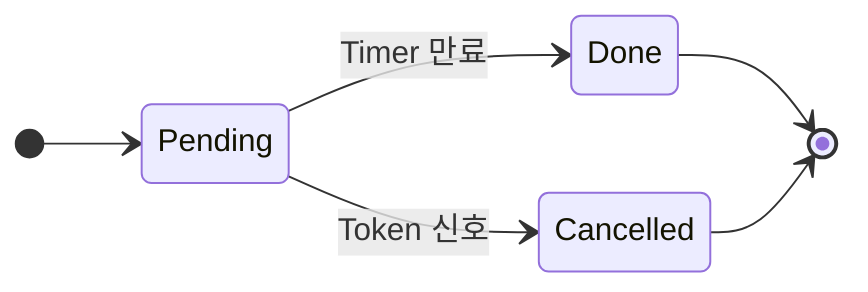

레이스에서 진 쪽은 그냥 무시한다. 자원 정리는 이긴 쪽이 책임진다.

---

## 6.3 라이브러리 메서드 시그니처 컨벤션

BCL은 다음 컨벤션을 따른다.

```text
public Task   DoXxxAsync(args, CancellationToken ct = default);
public Task<T> DoYyyAsync(args, CancellationToken ct = default);
```

우리도 같은 형태를 따른다. 위의 `CancellableDelay`는 사용자가 다음처럼 호출한다:

```csharp
public static CancellableDelay DelayAsync(TimeSpan d, CancellationToken ct = default)
    => new(d, ct);

// 호출
await DelayAsync(TimeSpan.FromSeconds(2), ct);
```

> **Tip.** 토큰을 받는 매개변수를 **가장 마지막**에, 기본값 `default`로 두는 것이 BCL 관습이다.

---

## 6.4 자주 빠지는 누수 패턴 3가지

### 6.4.1 `CancellationTokenRegistration` 미해제

```csharp
ct.Register(() => Cleanup());   // ← Dispose 안 함
```

토큰이 살아 있는 한 람다(그리고 그 클로저)가 GC되지 않는다. 게임 서버에서 글로벌 `CancellationToken`을 쓰고 거기에 룸 콜백을 등록하면, 모든 룸이 서버 종료시까지 산다.

> **Rule.** `Register`의 반환값은 항상 `using` 또는 명시적 `Dispose`로 닫는다.

### 6.4.2 Timer self-reference

```csharp
Timer? t = null;
t = new Timer(_ => { t!.Dispose(); ... });   // 람다가 t를 잡는다
```

람다가 `t`를 캡처하므로 `Timer`가 살아 있는 동안 람다가 살고, 람다가 살면 Timer가 산다 — **순환 참조**다. .NET의 GC는 순환을 처리하지만, **Timer 콜백이 호출 중인 자원**까지 함께 잡혀 누수처럼 보일 수 있다. 우리는 `static` 콜백 + `state` 매개변수로 이를 피한다.

### 6.4.3 `TaskCompletionSource` 망각

```csharp
var tcs = new TaskCompletionSource();
ct.Register(() => tcs.SetCanceled());
return tcs.Task;          // ← timer가 만료되지 않으면 영원히 미완료
```

위 코드는 토큰 취소만 처리한다. 시간 만료, 외부 신호 등 **다른 종료 경로**가 함께 있어야 자원이 회수된다.

---

## 6.5 `WithTimeout` 패턴 — 토큰의 합성

토큰 두 개를 합치는 표준 패턴.

```csharp
public static async Task<T> WithTimeoutAsync<T>(
    Func<CancellationToken, Task<T>> op,
    TimeSpan timeout,
    CancellationToken external = default)
{
    using var cts = CancellationTokenSource.CreateLinkedTokenSource(external);
    cts.CancelAfter(timeout);
    try { return await op(cts.Token).ConfigureAwait(false); }
    catch (OperationCanceledException) when (!external.IsCancellationRequested)
    {
        throw new TimeoutException();
    }
}
```

이 패턴 하나로 게임 서버에서 자주 등장하는 "외부 취소 또는 N초 타임아웃"을 표현한다.

> **Pitfall.** `CreateLinkedTokenSource`는 비싸다 (등록 두 개 + CTS 한 개). 핫 경로라면 `CancellationTokenSource` 풀링을 고려한다.

---

## 6.6 메모리 누수 사냥 — 도구 미리 보기

19장에서 본격적으로 다루지만, 다음 명령을 기억해 두자.

```bash
dotnet-counters monitor -p <PID> System.Runtime  Microsoft.AspNetCore.Hosting
dotnet-trace collect   -p <PID> --providers Microsoft-Diagnostics-DiagnosticSource:0xFFFFFFFF:Informational
```

- `System.Runtime` 카운터의 `Allocation Rate`가 시간에 따라 증가한다면 누수 후보.
- `dotnet-dump` 후 `dumpheap -stat -mt <CancellationTokenRegistration>`로 미해제 등록을 센다.

---

## 6.7 `IValueTaskSource<T>`로 가는 다리

위의 `CancellableDelay`는 `Action? _continuation`을 들고 있어 awaiter 인스턴스 한 개가 GC heap에 산다. hot path에서 1초에 수만 번 호출된다면 큰 비용이다. 12장에서 우리는 다음 트릭으로 이것을 0에 가깝게 만든다.

```text
ValueTask<T> ──▶ ManualResetValueTaskSourceCore<T> (struct)
                       │
                       ├ short _version
                       ├ Action<object?>? _continuation
                       └ T _result
                       
사용 후 Reset() → _version++ → 다음 호출에서 동일 인스턴스 재사용
```

이 장에서는 패턴만 알아두자. "왜 풀링이 가능한가?"의 답은 12장에 있다.

---

## 6.8 정리

- 모든 awaitable은 `CancellationToken` 옵션을 제공해야 한다.
- 토큰 등록은 반드시 해제한다.
- Timer-vs-Token race는 `CompareExchange`로 닫는다.
- 누수의 90%는 미해제 등록 + Timer self-reference에서 온다.
- 풀링은 12장에서.

---

## 연습 문제

1. (쉬움) `CancellableDelay` 호출 직전에 토큰을 취소하면 어떤 일이 일어나는가? Stack에 머무르는가, 박싱되는가? `AsyncDiagnostics.Snapshot`으로 측정하라.
2. (보통) `WithTimeoutAsync`를 구현해 본문에 적힌 의미를 그대로 만족시키는지 단위 테스트로 확인하라 (xUnit, `samples/tests/`).
3. (어려움) 다음 코드의 누수 패턴을 한 줄로 진단하고 수정하라.
   ```csharp
   _ct.Register(() => _logger.LogInformation("cancelled {Id}", _id));
   ```
4. (도전) `CancellableDelay`의 awaiter를 struct로 바꾸려면 어떤 어려움이 있는가? `Volatile.Read` + `Interlocked` 의미가 깨지는 지점을 찾아 보고하라.


# 7장. Socket 비동기 패턴

> 게임 서버 개발자라면 이 장이 책에서 가장 친숙할 것이다. `Socket.BeginXxx/EndXxx`(APM), `SocketAsyncEventArgs`(SAEA), 그리고 `Socket.XxxAsync` (TAP, .NET 5+)의 세 모델을 거쳐 우리만의 래퍼를 짠다.

## 학습 목표

- `SocketAsyncEventArgs`(SAEA)를 awaitable로 감싸는 두 가지 방법을 비교한다.
- `Socket.ReceiveAsync(Memory<byte>, ct)`로 시작하는 TAP 모델을 풀링과 결합한다.
- `System.IO.Pipelines`를 도입해 백프레셔까지 한 번에 잡는다.
- TLS, EOF, 부분 읽기 같은 잔잔한 함정을 정면으로 본다.

---

## 7.1 세 가지 모델 한 페이지 비교

```text
┌────────────┬──────────────────────────────┬──────────────────────────┐
│ 모델       │ 시그니처                     │ 특징                       │
├────────────┼──────────────────────────────┼──────────────────────────┤
│ APM        │ BeginReceive / EndReceive    │ 가장 오래됨, AsyncCallback │
│ SAEA       │ ReceiveAsync(SAEA)           │ 객체 재사용, 핫경로 0-alloc │
│ TAP        │ ReceiveAsync(Memory, ct)     │ 가장 간결, ValueTask 반환   │
└────────────┴──────────────────────────────┴──────────────────────────┘
```

서버 코드라면 **TAP 우선**, 핫 패스에서 마이크로벤치마크상의 차이가 의미 있을 때만 SAEA로 내려간다.

---

## 7.2 SAEA를 awaitable로 감싸기

SAEA는 *완료 이벤트*를 발행한다. awaitable로 감싸는 트릭은 다음과 같다.

```csharp
// 파일: samples/src/Chapter07/SocketAwaitable.cs
using System.Net.Sockets;
using System.Runtime.CompilerServices;
using System.Threading.Tasks.Sources;

namespace AsyncAwaitLab.Chapter07;

public sealed class SocketAwaitable : IValueTaskSource<int>
{
    private static readonly Action<object?> CONTINUATION_SENTINEL = _ => { };

    private readonly SocketAsyncEventArgs _args;
    private Action<object?>? _continuation;

    public SocketAwaitable(SocketAsyncEventArgs args)
    {
        _args = args;
        _args.Completed += (_, e) => OnCompleted(e);
    }

    public SocketAsyncEventArgs Args => _args;

    private void OnCompleted(SocketAsyncEventArgs e)
    {
        var c = Interlocked.Exchange(ref _continuation, CONTINUATION_SENTINEL);
        c?.Invoke(null);
    }

    public ValueTask<int> ReceiveAsync(Socket socket)
    {
        _continuation = null;
        if (!socket.ReceiveAsync(_args))
        {
            // 동기 완료 — 즉시 결과 반환
            return new ValueTask<int>(_args.BytesTransferred);
        }
        return new ValueTask<int>(this, 0);
    }

    public int GetResult(short token)
    {
        if (_args.SocketError != SocketError.Success)
            throw new SocketException((int)_args.SocketError);
        return _args.BytesTransferred;
    }

    public ValueTaskSourceStatus GetStatus(short token)
        => _continuation == CONTINUATION_SENTINEL
            ? ValueTaskSourceStatus.Succeeded
            : ValueTaskSourceStatus.Pending;

    public void OnCompleted(Action<object?> continuation, object? state, short token,
        ValueTaskSourceOnCompletedFlags flags)
    {
        if (Interlocked.CompareExchange(ref _continuation, continuation, null) == CONTINUATION_SENTINEL)
            continuation(state);
    }
}
```

`IValueTaskSource<T>` 첫 등장이다. 핵심 아이디어:

```text
SocketAwaitable 인스턴스 한 개를 연결당 한 번 만들고
재사용한다. 매 ReceiveAsync 호출마다 새 객체를 만들지 않는다.
```

이것이 게임 서버에서 수만 connection이 붙어도 GC가 멈추지 않는 이유다.

### 7.2.1 시각화

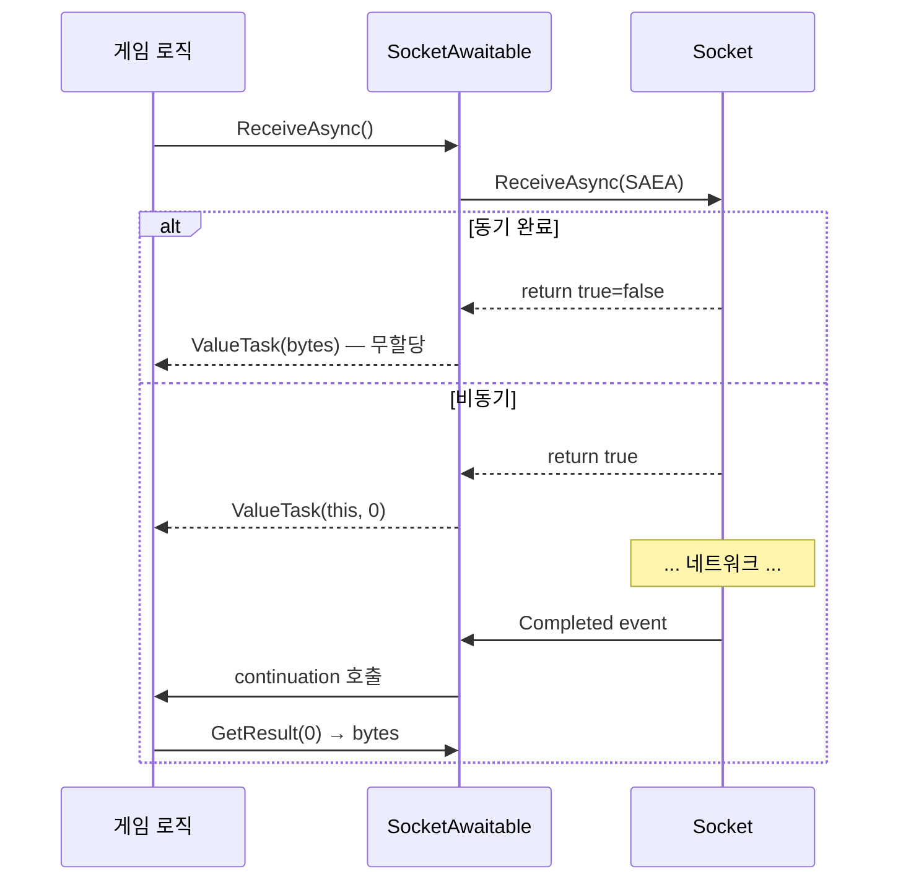

---

## 7.3 TAP 모델 + Memory<T> 풀링

.NET 5 이후 권장되는 형태는 `Socket.ReceiveAsync(Memory<byte>, SocketFlags, CancellationToken)`이다. 내부적으로 SAEA 풀을 쓴다.

```csharp
// 파일: samples/src/Chapter07/TapEcho.cs
public static async Task EchoLoopAsync(Socket socket, CancellationToken ct)
{
    var buffer = System.Buffers.ArrayPool<byte>.Shared.Rent(4096);
    try
    {
        while (!ct.IsCancellationRequested)
        {
            int n = await socket.ReceiveAsync(buffer.AsMemory(), SocketFlags.None, ct);
            if (n == 0) return; // EOF
            await socket.SendAsync(buffer.AsMemory(0, n), SocketFlags.None, ct);
        }
    }
    finally
    {
        System.Buffers.ArrayPool<byte>.Shared.Return(buffer);
    }
}
```

`ArrayPool<byte>.Shared`로 버퍼를 빌려 쓰면 connection당 4KB가 풀에서 재사용된다.

---

## 7.4 Pipelines 도입 — 백프레셔까지

큰 메시지나 가변 길이 프레이밍이 필요한 순간 Pipelines를 도입한다. Pipelines는 "writer가 쓰는 양 ≤ reader가 소비하는 양"을 자동으로 관리한다.

```csharp
// 파일: samples/src/Chapter07/PipelineEcho.cs
using System.IO.Pipelines;

public static async Task EchoWithPipelinesAsync(Socket socket, CancellationToken ct)
{
    var pipe = new Pipe();
    var fill = FillPipeAsync(socket, pipe.Writer, ct);
    var read = ReadPipeAsync(socket, pipe.Reader, ct);
    await Task.WhenAll(fill, read);
}

static async Task FillPipeAsync(Socket socket, PipeWriter writer, CancellationToken ct)
{
    while (!ct.IsCancellationRequested)
    {
        Memory<byte> mem = writer.GetMemory(1024);
        int read = await socket.ReceiveAsync(mem, SocketFlags.None, ct);
        if (read == 0) break;
        writer.Advance(read);
        var result = await writer.FlushAsync(ct);
        if (result.IsCompleted) break;
    }
    await writer.CompleteAsync();
}

static async Task ReadPipeAsync(Socket socket, PipeReader reader, CancellationToken ct)
{
    while (!ct.IsCancellationRequested)
    {
        var result = await reader.ReadAsync(ct);
        var buffer = result.Buffer;
        foreach (var segment in buffer)
        {
            await socket.SendAsync(segment, SocketFlags.None, ct);
        }
        reader.AdvanceTo(buffer.End);
        if (result.IsCompleted) break;
    }
    await reader.CompleteAsync();
}
```

```text
┌────────┐ recv ┌──────────┐         ┌──────────┐ send ┌────────┐
│ Socket │─────▶│ PipeWriter│────────▶│ PipeReader│─────▶│ Socket │
└────────┘      └──────────┘  shared  └──────────┘      └────────┘
                                 ring
                              buffer with
                              backpressure
```

writer가 너무 빨리 쓰면 `FlushAsync`가 비동기 대기에 들어가고, 자연스레 socket recv도 멈춘다. 별도 큐 관리가 필요 없다.

---

## 7.5 메시지 프레이밍

게임 서버는 보통 길이 접두사(2~4byte) 프레이밍을 쓴다.

```csharp
// 파일: samples/src/Chapter07/LengthPrefixFrame.cs
public static bool TryReadFrame(ref System.Buffers.ReadOnlySequence<byte> buffer, out System.Buffers.ReadOnlySequence<byte> frame)
{
    if (buffer.Length < 4)
    {
        frame = default;
        return false;
    }

    Span<byte> header = stackalloc byte[4];
    buffer.Slice(0, 4).CopyTo(header);
    int length = System.Buffers.Binary.BinaryPrimitives.ReadInt32BigEndian(header);

    if (buffer.Length < 4 + length)
    {
        frame = default;
        return false;
    }

    frame = buffer.Slice(4, length);
    buffer = buffer.Slice(4 + length);
    return true;
}
```

`ReadOnlySequence<byte>`는 비연속 메모리도 다룰 수 있어 Pipelines와 잘 맞는다.

---

## 7.6 자주 만나는 함정

1. **`ReceiveAsync`가 0을 반환** — 상대가 graceful close. EOF로 간주.
2. **부분 읽기** — TCP는 메시지 경계를 보장하지 않는다. 프레이밍 직접.
3. **TLS** — `SslStream`으로 감싸면 `ReadAsync`/`WriteAsync`가 `Stream`의 그것이 된다.
4. **Nagle 알고리즘** — `socket.NoDelay = true`로 게임 서버는 거의 항상 꺼야 함.
5. **Linger** — 연결 종료 시 동작. 정상 종료를 보장하려면 명시적 `Shutdown(Both)` 후 `Close`.

---

## 7.7 정리

- TAP 모델은 코드가 짧고 SAEA 풀링을 BCL이 알아서 한다.
- 핫 패스에서 0-alloc이 필요하면 `IValueTaskSource<T>` 기반 SocketAwaitable.
- Pipelines는 가변 길이 메시지와 백프레셔를 동시에 해결한다.
- 프레이밍/EOF는 직접 처리.

---

## 연습 문제

1. (쉬움) `Socket.NoDelay`를 끄지 않은 채 ping-pong을 측정하라. 평균 latency가 얼마나 늘어나는가?
2. (보통) 7.4의 echo 서버를 두 개의 클라이언트가 동시에 접속해 1MB씩 보내도록 부하 테스트하라. 사용 메모리 변화를 `dotnet-counters`로 관찰하라.
3. (어려움) 길이 접두사 프레이밍을 4-byte little-endian + magic header(`0xDE 0xAD`)로 바꾸라. 잘못된 프레임을 받으면 연결을 끊는다.
4. (도전) `SocketAwaitable`을 직접 구현해 `ValueTask<int>`를 반환하는 `RecvAsync` 메서드를 만들라. 일반 TAP 호출과 GC 압력 차이를 BenchmarkDotNet으로 측정하라.


# 8장. HTTP/스트림 래퍼

> 외부 HTTP API와 통신하지 않는 서비스는 거의 없다. 그러나 `HttpClient`를 그대로 호출하는 게 늘 옳지는 않다.

## 학습 목표

- `HttpMessageHandler` 파이프라인을 이해하고 우리 핸들러로 끼어든다.
- `HttpClient` 한 개 인스턴스 vs. 매번 새로 생성의 차이.
- `Stream.CopyToAsync` 기반의 진행률 보고.
- `HttpClient.SendAsync(HttpCompletionOption.ResponseHeadersRead)`로 스트리밍 응답을 처리한다.

---

## 8.1 `HttpClient`는 싱글톤처럼 다룬다

`HttpClient`는 짧게 만들고 버리면 안 된다. 내부 `HttpClientHandler`가 connection pool을 관리하기 때문에, 새 인스턴스마다 새 풀이 생긴다.

```text
잘못된 코드
─────────────
foreach (...) {
    using var http = new HttpClient();  // ← 매번 새 풀
    await http.GetAsync(url);
}

권장
────
private static readonly HttpClient Http = new();
...
await Http.GetAsync(url);
```

ASP.NET Core는 `IHttpClientFactory`를 제공해서 이를 자동화한다. 라이브러리 저자라면 `HttpClient`를 매개변수로 받아 의존성을 명확히 한다.

---

## 8.2 `DelegatingHandler`로 횡단 관심사 끼우기

```csharp
// 파일: samples/src/Chapter08/RetryHandler.cs
public sealed class RetryHandler : DelegatingHandler
{
    private readonly int _maxRetries;
    public RetryHandler(int maxRetries = 3) => _maxRetries = maxRetries;

    protected override async Task<HttpResponseMessage> SendAsync(
        HttpRequestMessage request, CancellationToken ct)
    {
        for (int attempt = 0; ; attempt++)
        {
            try
            {
                var res = await base.SendAsync(request, ct).ConfigureAwait(false);
                if ((int)res.StatusCode < 500 || attempt >= _maxRetries) return res;
                res.Dispose();
            }
            catch (HttpRequestException) when (attempt < _maxRetries)
            {
                // 다음 루프로
            }

            var delay = TimeSpan.FromMilliseconds(100 * Math.Pow(2, attempt));
            await Task.Delay(delay, ct).ConfigureAwait(false);
        }
    }
}
```

사용:

```csharp
var http = new HttpClient(new RetryHandler(3) { InnerHandler = new SocketsHttpHandler() });
```

> **Pitfall.** `request.Content`는 한 번 보내면 reset되지 않을 수 있다. 재시도가 필요하면 content를 매번 새로 만들거나 `HttpRequestMessage`를 복제한다.

---

## 8.3 메트릭 핸들러

```csharp
// 파일: samples/src/Chapter08/MetricsHandler.cs
public sealed class MetricsHandler : DelegatingHandler
{
    private long _count;
    private long _ms;

    protected override async Task<HttpResponseMessage> SendAsync(HttpRequestMessage r, CancellationToken ct)
    {
        var sw = Stopwatch.GetTimestamp();
        try
        {
            return await base.SendAsync(r, ct).ConfigureAwait(false);
        }
        finally
        {
            Interlocked.Increment(ref _count);
            Interlocked.Add(ref _ms, (long)Stopwatch.GetElapsedTime(sw).TotalMilliseconds);
        }
    }

    public (long Count, double AvgMs) Snapshot()
    {
        var c = Interlocked.Read(ref _count);
        var m = Interlocked.Read(ref _ms);
        return (c, c == 0 ? 0 : (double)m / c);
    }
}
```

`DelegatingHandler` 체인은 다음과 같이 구성된다.

```text
HttpClient.SendAsync
       │
       ▼
   MetricsHandler.SendAsync    ← 측정 시작
       │ base.SendAsync
       ▼
   RetryHandler.SendAsync      ← 재시도 루프
       │ base.SendAsync
       ▼
   AuthHandler.SendAsync       ← 토큰 첨부
       │ base.SendAsync
       ▼
   SocketsHttpHandler          ← 실제 송신
```

---

## 8.4 진행률 보고 — `Stream.CopyToAsync`

```csharp
// 파일: samples/src/Chapter08/ProgressCopy.cs
public static async Task CopyWithProgressAsync(
    Stream source, Stream dest, long? totalLength, IProgress<double> progress,
    CancellationToken ct)
{
    var buffer = ArrayPool<byte>.Shared.Rent(81920);
    try
    {
        long copied = 0;
        while (true)
        {
            int n = await source.ReadAsync(buffer.AsMemory(), ct).ConfigureAwait(false);
            if (n == 0) return;
            await dest.WriteAsync(buffer.AsMemory(0, n), ct).ConfigureAwait(false);
            copied += n;

            if (totalLength is long total)
                progress.Report((double)copied / total);
        }
    }
    finally
    {
        ArrayPool<byte>.Shared.Return(buffer);
    }
}
```

`IProgress<T>`는 호출자의 `SynchronizationContext`로 콜백을 디스패치한다 (10장에서 자세히). 콘솔 앱에서는 그대로 호출 스레드로 들어오고, WPF/WinForms에서는 UI 스레드로 점프한다.

---

## 8.5 스트리밍 응답 — `ResponseHeadersRead`

기본 `HttpClient.SendAsync`는 응답 본문을 전부 메모리에 올린다. 큰 파일/스트리밍 API에서는 그게 곧 OOM이다.

```csharp
using var res = await http.SendAsync(req,
    HttpCompletionOption.ResponseHeadersRead, ct);

await using var stream = await res.Content.ReadAsStreamAsync(ct);
await using var dest = File.Create(path);
await stream.CopyToAsync(dest, 81920, ct);
```

`ResponseHeadersRead`는 헤더만 받고 본문은 stream으로 받는다는 옵션이다. 다운로더, 영상 스트리밍, SSE 모두 이 모드.

---

## 8.6 정리

- `HttpClient`는 재사용. `IHttpClientFactory` 권장.
- 횡단 관심사는 `DelegatingHandler`로.
- 진행률은 `IProgress<T>`로 분리.
- 큰 응답은 `ResponseHeadersRead` + 스트리밍.

---

## 연습 문제

1. (쉬움) `RetryHandler`의 재시도 조건을 5xx에서 5xx + 408로 확장하라.
2. (보통) `MetricsHandler`에 분당 요청 수를 추가 (`TimeSpan` 기반 sliding window). 락 없이 가능한가?
3. (어려움) `HttpClient`로 SSE(Server-Sent Events) 스트림을 받아 `IAsyncEnumerable<string>`로 노출하라. 15장 예고편.
4. (도전) `RetryHandler`가 `HttpRequestMessage`의 본문을 안전하게 다시 보낼 수 있도록 `IClonableContent` 추상화를 추가하라.


# 9장. 파일/DB I/O와 커넥션 풀

> "비동기 파일 I/O는 진짜 비동기인가?" 답은 **운영체제와 옵션에 따라 다르다**.

## 학습 목표

- `FileStream`의 동기/비동기 모드와 `useAsync` 옵션의 의미를 안다.
- ADO.NET 비동기 메서드의 핵심 컨벤션과 함정.
- 우리 손으로 작은 커넥션 풀과 비동기 트랜잭션을 짠다.
- 배치 작업 처리에서 `IAsyncEnumerable`이 어떻게 어울리는지 본다 (15장 다리).

---

## 9.1 `FileStream`의 비동기 모드

```csharp
new FileStream(path, FileMode.Open, FileAccess.Read, FileShare.Read,
    bufferSize: 4096, useAsync: true);
```

`useAsync: true`가 빠지면 `ReadAsync`도 내부적으로 동기 I/O를 ThreadPool에 던지는 흉내내기 비동기가 된다. 파일 I/O가 시스템 호출 단위로 멈춰서 스레드를 점유하면 서버 처리량이 망가진다.

`.NET 6+`에서는 `RandomAccess` API가 더 좋다.

```csharp
using SafeFileHandle h = File.OpenHandle(path, FileMode.Open, FileAccess.Read,
    options: FileOptions.Asynchronous | FileOptions.SequentialScan);
int read = await RandomAccess.ReadAsync(h, buffer, fileOffset: 0, ct);
```

핵심: **`FileOptions.Asynchronous`를 명시.**

---

## 9.2 작은 커넥션 풀 직접 짜기

진짜 DB 풀(SqlClient, Npgsql)을 흉내내는 단순한 버전.

```csharp
// 파일: samples/src/Chapter09/ConnectionPool.cs
public sealed class ConnectionPool<T> : IAsyncDisposable where T : class, IAsyncDisposable
{
    private readonly Func<CancellationToken, Task<T>> _factory;
    private readonly System.Threading.Channels.Channel<T> _idle;
    private readonly SemaphoreSlim _capacity;
    private bool _disposed;

    public ConnectionPool(int maxSize, Func<CancellationToken, Task<T>> factory)
    {
        _factory = factory;
        _capacity = new SemaphoreSlim(maxSize, maxSize);
        _idle = System.Threading.Channels.Channel.CreateUnbounded<T>();
    }

    public async ValueTask<Lease> RentAsync(CancellationToken ct)
    {
        await _capacity.WaitAsync(ct).ConfigureAwait(false);
        if (_idle.Reader.TryRead(out var conn))
            return new Lease(this, conn);

        try
        {
            conn = await _factory(ct).ConfigureAwait(false);
            return new Lease(this, conn);
        }
        catch
        {
            _capacity.Release();
            throw;
        }
    }

    private void Return(T conn)
    {
        if (_disposed) { _ = conn.DisposeAsync(); _capacity.Release(); return; }
        _idle.Writer.TryWrite(conn);
        _capacity.Release();
    }

    public async ValueTask DisposeAsync()
    {
        _disposed = true;
        _idle.Writer.TryComplete();
        await foreach (var conn in _idle.Reader.ReadAllAsync())
            await conn.DisposeAsync();
    }

    public readonly struct Lease : IAsyncDisposable
    {
        private readonly ConnectionPool<T> _pool;
        public T Connection { get; }
        public Lease(ConnectionPool<T> p, T c) { _pool = p; Connection = c; }
        public ValueTask DisposeAsync() { _pool.Return(Connection); return default; }
    }
}
```

사용:

```csharp
await using var pool = new ConnectionPool<MyConn>(maxSize: 10,
    factory: ct => MyConn.OpenAsync(ct));

await using (var lease = await pool.RentAsync(ct))
{
    await lease.Connection.ExecuteAsync("SELECT 1");
} // ← Dispose 시 풀로 반환
```

핵심 통찰:

```text
┌────────────┐         ┌──────────────┐
│ SemaphoreSlim│ ─── 동시 사용 가능 수 (capacity) 제한
└────────────┘
┌────────────┐
│ Channel<T> │ ─── 유휴 connection 큐 (LIFO/FIFO 선택)
└────────────┘
```

`Channel<T>`는 16장에서 본격적으로 다룬다. 여기서는 "스레드 안전 큐"로만 사용.

---

## 9.3 비동기 트랜잭션 패턴

```csharp
// 파일: samples/src/Chapter09/TxScope.cs
public static async Task<T> InTransactionAsync<T>(
    IDbConnection conn,
    Func<IDbTransaction, CancellationToken, Task<T>> body,
    System.Data.IsolationLevel iso = System.Data.IsolationLevel.ReadCommitted,
    CancellationToken ct = default)
{
    var tx = conn.BeginTransaction(iso);
    try
    {
        var result = await body(tx, ct).ConfigureAwait(false);
        tx.Commit();
        return result;
    }
    catch
    {
        try { tx.Rollback(); } catch { /* swallow rollback failure */ }
        throw;
    }
    finally
    {
        tx.Dispose();
    }
}
```

ADO.NET 인터페이스는 비동기 `IDbTransaction`이 없다 (정확히는 `DbTransaction`이 `CommitAsync`를 .NET 5+에 제공). 게임 서버는 일반적으로 lightweight ORM(Dapper)을 쓰니 라이브러리 추상화는 자기 선택.

> **Tip.** `using` 대신 `await using`을 쓰면 비동기 Dispose가 호출된다. Connection/Transaction은 가능한 한 `await using`.

---

## 9.4 배치 처리 + IAsyncEnumerable 다리

업데이트를 N개씩 묶어 처리하는 패턴.

```csharp
public static async IAsyncEnumerable<int> BatchUpdateAsync(
    IAsyncEnumerable<Record> source, int batchSize,
    [System.Runtime.CompilerServices.EnumeratorCancellation] CancellationToken ct = default)
{
    var buffer = new List<Record>(batchSize);
    await foreach (var r in source.WithCancellation(ct))
    {
        buffer.Add(r);
        if (buffer.Count >= batchSize)
        {
            yield return await CommitBatchAsync(buffer, ct);
            buffer.Clear();
        }
    }
    if (buffer.Count > 0)
        yield return await CommitBatchAsync(buffer, ct);
}

static Task<int> CommitBatchAsync(List<Record> batch, CancellationToken ct) =>
    Task.FromResult(batch.Count); // 자리 표시자
```

`IAsyncEnumerable<T>`은 15장에서, `EnumeratorCancellation` 어트리뷰트는 거기서 자세히 다룬다.

---

## 9.5 정리

- 비동기 파일 I/O는 옵션 지정이 핵심. `FileOptions.Asynchronous` 또는 `useAsync:true`.
- 커넥션 풀은 `Semaphore + Channel` 조합으로 100줄 안에.
- 트랜잭션은 `Func<IDbTransaction, ..., Task<T>>` 콜백 패턴이 깔끔.
- 배치 처리는 `IAsyncEnumerable<T>`로 자연스럽게.

---

## 연습 문제

1. (쉬움) `useAsync:false`로 만든 `FileStream`으로 1MB를 읽었을 때 ThreadPool 스레드 사용량 변화를 측정하라.
2. (보통) `ConnectionPool<T>`에 `idle timeout`을 추가하라. N초 동안 사용되지 않은 connection은 풀에서 삭제한다.
3. (어려움) `InTransactionAsync`를 deadlock 발생 시 자동 재시도하도록 확장하라. 어떤 예외를 잡아 재시도해야 하는가?
4. (도전) `BatchUpdateAsync`를 partition별로 병렬 처리하도록 바꿔라. `Parallel.ForEachAsync`와 함께.


# 10장. ConfigureAwait / ExecutionContext / AsyncLocal

> 라이브러리 저자가 `ConfigureAwait(false)`를 빼먹으면 그 라이브러리는 WPF 앱에서 데드락을 일으킨다. 같은 라이브러리가 ASP.NET Core에서는 잘 돈다. 콘솔에서도 잘 돈다. 이런 차별을 만드는 것이 이 장의 주제다.

## 학습 목표

- `SynchronizationContext`와 `TaskScheduler.Current`의 차이를 1분 안에 설명한다.
- `ConfigureAwait(false)`의 의미를 정확히 안다.
- `ExecutionContext` 흐름의 규칙과 `AsyncLocal<T>`의 보장 범위를 안다.
- 라이브러리 코드에 대한 모범 답안을 한 줄로 적는다.

---

## 10.1 두 개의 컨텍스트, 그리고 흐름

```text
SynchronizationContext  ─ "콜백을 어디로 보낼까?"  (UI 스레드, ASP.NET request thread...)
ExecutionContext        ─ "어떤 ambient 데이터를 함께 가져갈까?" (AsyncLocal, CallContext...)
```

둘은 **다른 것**이다. ConfigureAwait는 첫 번째에 관여한다. AsyncLocal은 두 번째에 산다.

### 10.1.1 `await`가 기본적으로 하는 일

```text
await someTask;
   ├─ 현재 SynchronizationContext 캡처
   ├─ ExecutionContext 캡처
   ├─ ... task 완료 ...
   ├─ 캡처된 SyncCtx로 콜백 디스패치
   └─ ExecutionContext 복원
```

UI 앱에서는 캡처된 SyncCtx가 UI 스레드를 가리키니, 콜백이 UI 스레드로 돌아온다. ASP.NET Core는 `null` SyncCtx를 쓰니 그냥 ThreadPool 스레드에서 깬다.

---

## 10.2 `ConfigureAwait(false)` — 콜백 점프를 끊는다

```csharp
await someTask.ConfigureAwait(false);
//   ↑ SynchronizationContext 캡처/복원을 생략하라
```

라이브러리 코드는 일반적으로 호출자의 SyncCtx를 신경 쓸 이유가 없다. 그래서 모든 `await`에 `.ConfigureAwait(false)`를 붙이는 것이 **라이브러리 저자의 관습**이다.

> **Rule.** "이 코드가 호출자의 UI 스레드에 의존하는가?"라는 질문에 "아니오"라면 `.ConfigureAwait(false)`.

### 10.2.1 데드락의 발생 메커니즘

```text
UI 스레드
  ├─ var t = MyLib.DoAsync();  ← 라이브러리 안에서 await Foo();
  └─ t.Wait();                  ← UI 스레드를 잠근다

라이브러리 안의 await Foo()는 UI SyncCtx로 돌아가려는데
UI 스레드가 t.Wait()로 잠겨 있어 ← 영원히 못 깸 → DEADLOCK
```

라이브러리가 `ConfigureAwait(false)`만 했어도 UI 스레드로 돌아가려 하지 않으니 문제가 안 생긴다.

### 10.2.2 .NET 5+에서는 덜 신경 써도 되는가

ASP.NET Core, gRPC, 콘솔, Blazor Server 모두 SyncCtx가 `null`이거나 ThreadPool에 위임된다. UI 앱(WPF/WinForms)만 캡처가 의미 있다. 그래도 라이브러리 코드는 일관성을 위해 항상 `.ConfigureAwait(false)`를 붙인다.

---

## 10.3 `ExecutionContext`와 `AsyncLocal<T>`

`ExecutionContext`는 비동기 호출을 따라 흐르는 **읽기-복사** 컨텍스트다. `AsyncLocal<T>`은 그 컨텍스트에 키-값을 얹는 메커니즘.

```csharp
public static readonly AsyncLocal<string?> RequestId = new();

await DoAsync();    // RequestId.Value는 await 너머에서도 같다 (콜백마다 복원)
```

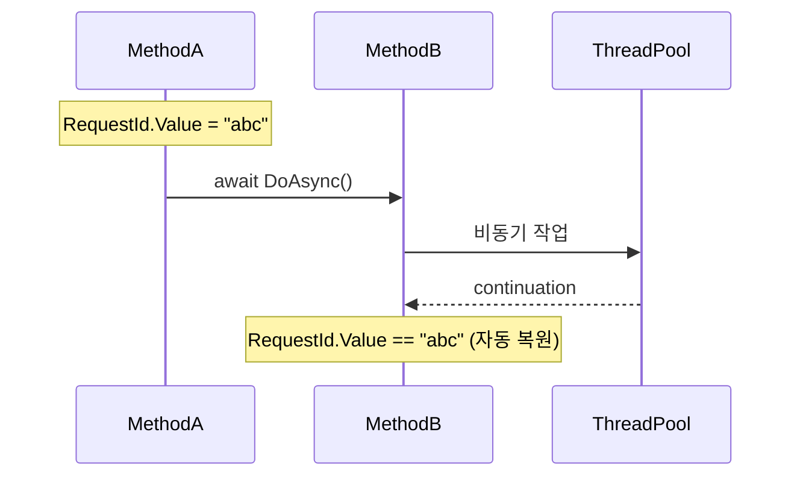

### 10.3.1 보장의 범위

- `AsyncLocal<T>`의 값은 **현재 ExecutionContext의 사본**에 들어간다.
- 새 비동기 호출이 시작될 때 EC가 capture되어 함께 흐른다.
- **자식이 값을 바꿔도 부모는 영향받지 않는다.** (단, ref-type의 내부를 변경하면 공유된다)

```text
[부모] EC: { req=abc }
   │
   ├─ await DoAsync()
   │      │
   │      └─ [자식] EC: { req=abc }       (사본)
   │             └─ AsyncLocal.Value = xyz
   │             └─ [자식] EC: { req=xyz }  (부모는 그대로 abc)
   │
   └─ [부모] EC: { req=abc }
```

이 모델은 .NET이 logical context를 어떻게 transport하는지 결정한다. ASP.NET Core의 `IHttpContextAccessor`가 사용하는 메커니즘과 같다.

---

## 10.4 `ExecutionContext` 흐름을 끊고 싶을 때

`ThreadPool.UnsafeQueueUserWorkItem`은 EC를 캡처하지 않는다. 라이브러리 내부에서 짧은 콜백을 디스패치할 때 사용하면 약간의 성능 이득이 있다.

```csharp
ThreadPool.UnsafeQueueUserWorkItem(static s => ((Action)s!)(), continuation,
    preferLocal: true);
```

`preferLocal: true`는 현재 worker thread의 local queue에 작업을 넣어 캐시 친화성을 올린다. 게임 서버에서 룸 내 메시지를 분산할 때 유용한 옵션.

---

## 10.5 우리 awaitable의 ConfigureAwait 구현

4~6장에서 만든 awaitable에 `ConfigureAwait(bool)`을 추가해 보자.

```csharp
// 파일: samples/src/Chapter10/ConfiguredAwaitable.cs
public sealed class ConfiguredManualSignal<T>
{
    private readonly ManualSignal<T> _inner;
    public ConfiguredManualSignal(ManualSignal<T> inner) => _inner = inner;

    public ConfiguredManualSignalAwaitable<T> ConfigureAwait(bool continueOnCapturedContext)
        => new(_inner, continueOnCapturedContext);

    public ManualSignal<T>.Awaiter GetAwaiter() => _inner.GetAwaiter();
}

public readonly struct ConfiguredManualSignalAwaitable<T>
{
    private readonly ManualSignal<T> _signal;
    private readonly bool _captureCtx;
    public ConfiguredManualSignalAwaitable(ManualSignal<T> s, bool capture) { _signal = s; _captureCtx = capture; }

    public Awaiter GetAwaiter() => new(_signal, _captureCtx);

    public readonly struct Awaiter : System.Runtime.CompilerServices.ICriticalNotifyCompletion
    {
        private readonly ManualSignal<T>.Awaiter _inner;
        private readonly bool _captureCtx;
        public Awaiter(ManualSignal<T> s, bool c) { _inner = s.GetAwaiter(); _captureCtx = c; }
        public bool IsCompleted => _inner.IsCompleted;
        public T GetResult() => _inner.GetResult();

        public void OnCompleted(Action c) => Schedule(c);
        public void UnsafeOnCompleted(Action c) => Schedule(c);

        private void Schedule(Action c)
        {
            if (_captureCtx && SynchronizationContext.Current is { } ctx)
                _inner.OnCompleted(() => ctx.Post(static s => ((Action)s!)(), c));
            else
                _inner.OnCompleted(c);
        }
    }
}
```

BCL의 `Task`는 캡처 여부를 비트 플래그로 보관해 한 인스턴스 안에서 처리하지만, 우리는 별도 awaitable 타입을 두는 게 더 명료하다.

---

## 10.6 게임 서버에서 자주 보는 함정

1. **`Task.Run`이 EC를 끊는가?** — 끊지 않는다. EC는 자동 흐름.
2. **`_ = SomethingAsync();`** — fire-and-forget. EC는 캡처되지만 예외가 사라진다.
3. **`AsyncLocal`을 클래스 필드에 두는 실수** — 거의 항상 `static readonly`로.
4. **`ThreadPool.SetMaxThreads`로 EC 흐름이 끊기지 않는다** — 별개 메커니즘.

---

## 10.7 정리

- `ConfigureAwait(false)`는 라이브러리 코드의 **기본**.
- `AsyncLocal<T>`은 `ExecutionContext`에 얹힌다 — 비동기 호출을 따라 자동 흐른다.
- 자식이 바꾼 값은 부모로 돌아가지 않는다.
- 라이브러리 저자라면 `Unsafe*` 메서드를 알아 둔다 (EC 캡처 생략).

---

## 연습 문제

1. (쉬움) WPF 앱에서 라이브러리의 모든 `await`에 `.ConfigureAwait(false)`를 붙이면 어떤 보장이 깨지는가?
2. (보통) `AsyncLocal<int>`에 1을 넣고 `Task.Run(...)` 안에서 +1 한 뒤, 원래 컨텍스트의 값을 확인하라. 결과를 본문 §10.3.1과 짝지어 설명하라.
3. (어려움) ASP.NET Core 미들웨어가 `HttpContext`를 `AsyncLocal`로 유지하는 메커니즘을 .NET 소스코드에서 찾아 짧게 인용하라.
4. (도전) `ConfiguredManualSignal<T>`를 BenchmarkDotNet으로 측정하라. `ConfigureAwait(false)` 호출당 추가 비용이 nano 단위로 얼마인가?


# 11장. 진행률, 우선순위, 커스텀 TaskScheduler

> 비동기 작업이 "그냥 끝나기만" 하는 시대는 끝났다. 진행률, 우선순위, 격리를 함께 다룰 줄 알아야 한다.

## 학습 목표

- `IProgress<T>`/`Progress<T>`의 동작 모델을 정확히 안다.
- 우선순위 큐 기반의 커스텀 `TaskScheduler`를 짠다.
- `Parallel.ForEachAsync`의 `MaxDegreeOfParallelism`을 라이브러리에 적용한다.

---

## 11.1 `IProgress<T>` 100초 가이드

```csharp
public interface IProgress<in T>
{
    void Report(T value);
}
```

이게 전부다. `Progress<T>`는 생성 시점의 `SynchronizationContext`로 콜백을 디스패치한다. UI 앱에서 진행률을 UI 스레드로 자동 점프시키는 게 핵심 기능.

```csharp
var progress = new Progress<int>(p => txtProgress.Text = $"{p}%");
await DownloadAsync(url, progress);
```

라이브러리 저자는 절대로 `IProgress<T>` 외 다른 타입을 받지 않는다. `Action<int>`를 받으면 SyncCtx 점프가 안 되어 호출자의 UI 코드가 깨진다.

### 11.1.1 우리 라이브러리 인터페이스 설계

```csharp
public Task<Result> ExecuteAsync(
    Args args,
    IProgress<double>? progress = null,
    CancellationToken ct = default);
```

`IProgress<double>`로 0..1 사이 비율을 보고하는 게 가장 일반적인 컨벤션.

---

## 11.2 우선순위 TaskScheduler

`TaskScheduler`를 직접 짤 일은 드물지만, 라이브러리 레벨에서 작업 우선순위를 강제해야 한다면 만들 수 있다.

```csharp
// 파일: samples/src/Chapter11/PriorityScheduler.cs
public sealed class PriorityScheduler : TaskScheduler, IDisposable
{
    private readonly PriorityQueue<Task, int> _queue = new();
    private readonly object _lock = new();
    private readonly Thread[] _workers;
    private readonly CancellationTokenSource _cts = new();

    public PriorityScheduler(int threadCount = 4)
    {
        _workers = new Thread[threadCount];
        for (int i = 0; i < threadCount; i++)
        {
            _workers[i] = new Thread(WorkerLoop) { IsBackground = true, Name = $"PrioWorker-{i}" };
            _workers[i].Start();
        }
    }

    protected override void QueueTask(Task task)
    {
        int prio = task.AsyncState is int p ? p : 100;
        lock (_lock)
        {
            _queue.Enqueue(task, prio);
            Monitor.Pulse(_lock);
        }
    }

    protected override bool TryExecuteTaskInline(Task task, bool taskWasPreviouslyQueued) => false;
    protected override IEnumerable<Task>? GetScheduledTasks()
    {
        lock (_lock) return _queue.UnorderedItems.Select(x => x.Element).ToArray();
    }

    private void WorkerLoop()
    {
        while (!_cts.IsCancellationRequested)
        {
            Task? task;
            lock (_lock)
            {
                while (_queue.Count == 0 && !_cts.IsCancellationRequested)
                    Monitor.Wait(_lock, 1000);
                if (_cts.IsCancellationRequested) return;
                _queue.TryDequeue(out task, out _);
            }
            if (task is not null) TryExecuteTask(task);
        }
    }

    public void Dispose()
    {
        _cts.Cancel();
        lock (_lock) Monitor.PulseAll(_lock);
        foreach (var w in _workers) w.Join();
        _cts.Dispose();
    }
}
```

사용:

```csharp
using var sched = new PriorityScheduler(2);
var factory = new TaskFactory(sched);

var low = factory.StartNew(() => Console.WriteLine("low"),  state: (int)9);
var high = factory.StartNew(() => Console.WriteLine("high"), state: (int)1);
```

게임 서버에서 "보스 룸 메시지는 일반 룸보다 빨리 처리"처럼 우선순위를 표현할 때 유용. 다만 `TaskScheduler`로 풀면 ASP.NET Core가 제공하는 동등 기능과 충돌하기 쉽다 — 보통 자체 큐로 푸는 게 깔끔(18장).

---

## 11.3 `Parallel.ForEachAsync` — 동시성 제한

```csharp
await Parallel.ForEachAsync(items,
    new ParallelOptions { MaxDegreeOfParallelism = 8, CancellationToken = ct },
    async (item, c) => await ProcessAsync(item, c));
```

`Parallel.ForEachAsync`는 .NET 6+의 동시성 제한 기본기. 우리 라이브러리도 이걸 흉내내려면 `SemaphoreSlim`으로 가능.

```csharp
public static async Task ForEachAsync<T>(IEnumerable<T> items, int maxParallel,
    Func<T, CancellationToken, Task> body, CancellationToken ct = default)
{
    using var sem = new SemaphoreSlim(maxParallel);
    var tasks = items.Select(async item =>
    {
        await sem.WaitAsync(ct);
        try { await body(item, ct); }
        finally { sem.Release(); }
    });
    await Task.WhenAll(tasks);
}
```

> **Pitfall.** `tasks`를 즉시 열거하지 않으면 `sem.WaitAsync`가 호출되지 않는다 — `.ToList()`나 즉시 `WhenAll`로 enumerate.

---

## 11.4 정리

- 진행률은 `IProgress<T>`로.
- 우선순위 강제는 직접 큐 + worker. `TaskScheduler`는 옵션.
- 동시성 제한은 `SemaphoreSlim` 또는 `Parallel.ForEachAsync`.

---

## 연습 문제

1. (쉬움) `Progress<T>` 안에서 캡처되는 SyncCtx는 언제 결정되는가? 콘솔에서 만든 인스턴스를 UI 스레드로 넘기면 어떻게 되는가?
2. (보통) §11.3의 `ForEachAsync`를 `EnumerationOptions { Ordered = true }` 같은 옵션과 함께 IAsyncEnumerable 입력으로 받게 확장하라.
3. (어려움) `PriorityScheduler`에 fairness 옵션을 추가하라 — 같은 우선순위라면 FIFO를 보장.
4. (도전) 라이브러리가 `IProgress<double>`을 받을 때 0..1 범위를 강제하는 방어 코드(verifier)를 데코레이터 패턴으로 구현하라.


# 12장. ICriticalNotifyCompletion과 ValueTask 최적화

> 이 장에서 우리는 1초에 백만 번 호출되어도 GC가 멈추지 않는 awaiter를 짠다.

## 학습 목표

- `IValueTaskSource<T>`를 처음부터 구현한다.
- `ManualResetValueTaskSourceCore<T>`를 활용해 코드를 80% 줄인다.
- 풀링된 awaiter가 안전하게 재사용되는 조건을 명확히 한다.
- BenchmarkDotNet으로 0-alloc임을 증명한다.

---

## 12.1 왜 또 다른 인터페이스인가

`Task<T>`는 다목적이지만 무겁다. `ValueTask<T>`는 작지만 한 번만 await 가능하다. `IValueTaskSource<T>`는 그 뒤를 받쳐 **재사용 가능한 결과 슬롯**을 제공한다.

```text
ValueTask<T>(_obj=IValueTaskSource<T>, _token=N)
       │
       └─ _obj.GetStatus(N) / OnCompleted(...) / GetResult(N)
              ↑
              한 번 await 후 source.Reset() → _version++ → 재사용
```

핵심은 **token(=`_version`)**이다. 호출자가 받은 token과 source의 현재 version이 다르면 즉시 예외 — 잘못된 사용을 detect.

---

## 12.2 `ManualResetValueTaskSourceCore<T>` — 80% 줄이는 도구

직접 구현 대신 `System.Threading.Tasks.Sources.ManualResetValueTaskSourceCore<T>`를 쓰면 다음을 자동으로 해 준다.

- token 검증
- continuation 보관
- ExecutionContext capture
- SyncCtx capture

```csharp
// 파일: samples/src/Chapter12/PooledSignal.cs
using System.Threading.Tasks.Sources;

namespace AsyncAwaitLab.Chapter12;

public sealed class PooledSignal<T> : IValueTaskSource<T>
{
    private ManualResetValueTaskSourceCore<T> _core;

    public short Version => _core.Version;

    public ValueTask<T> WaitAsync() => new(this, _core.Version);

    public void SetResult(T value) => _core.SetResult(value);
    public void SetException(Exception ex) => _core.SetException(ex);
    public void Reset() => _core.Reset();

    public T GetResult(short token) => _core.GetResult(token);
    public ValueTaskSourceStatus GetStatus(short token) => _core.GetStatus(token);
    public void OnCompleted(Action<object?> continuation, object? state, short token,
        ValueTaskSourceOnCompletedFlags flags)
        => _core.OnCompleted(continuation, state, token, flags);
}
```

40줄. `ManualSignal<T>`(4장)과 거의 동일한 의미인데 메서드 시그니처만 다르다. **재사용 가능**하다는 점이 큰 차이.

사용:

```csharp
var signal = new PooledSignal<int>();

// 누군가가 결과 채워줌
_ = Task.Run(async () =>
{
    await Task.Delay(50);
    signal.SetResult(42);
});

int v = await signal.WaitAsync();    // 첫 번째 사용
signal.Reset();                       // 재사용 준비

_ = Task.Run(async () =>
{
    await Task.Delay(50);
    signal.SetResult(43);
});

int w = await signal.WaitAsync();    // 두 번째 사용, 새 인스턴스 생성 없음
```

---

## 12.3 풀에서 빌려 쓰는 패턴

`PooledSignal<T>` 자체를 풀에 두면 진정한 0-alloc.

```csharp
// 파일: samples/src/Chapter12/SignalPool.cs
public static class SignalPool<T>
{
    private static readonly System.Collections.Concurrent.ConcurrentBag<PooledSignal<T>> _bag = new();

    public static PooledSignal<T> Rent()
        => _bag.TryTake(out var s) ? s : new PooledSignal<T>();

    public static void Return(PooledSignal<T> s)
    {
        s.Reset();
        _bag.Add(s);
    }
}
```

`ObjectPool<T>`(Microsoft.Extensions.ObjectPool)이 더 정교한 옵션을 제공하지만, 본질은 동일.

### 12.3.1 안전 조건

```text
[필수] 빌린 사람이 await 한 번만 한다.
[필수] await 후 Reset을 호출한 사람이 Return한다.
[필수] Return된 인스턴스를 빌려 간 사람이 또 await하지 않는다.
```

이 조건을 깨뜨리면 token mismatch 예외가 난다. 라이브러리 API는 이를 캡슐화해서 사용자가 실수할 여지를 없앤다.

---

## 12.4 awaiter를 struct로 — `MoveNextAction` 최적화

awaiter를 class에서 struct로 바꿀 때의 절제 — 본문 §3.4.3, §4 끝의 약속을 지키는 코드.

```csharp
public readonly struct PooledSignalAwaiter<T> : ICriticalNotifyCompletion
{
    private readonly PooledSignal<T> _source;
    private readonly short _token;
    public PooledSignalAwaiter(PooledSignal<T> s) { _source = s; _token = s.Version; }
    public bool IsCompleted => _source.GetStatus(_token) != ValueTaskSourceStatus.Pending;
    public T GetResult() => _source.GetResult(_token);

    public void OnCompleted(Action c)
        => _source.OnCompleted(static s => ((Action)s!)(), c, _token,
            ValueTaskSourceOnCompletedFlags.FlowExecutionContext);

    public void UnsafeOnCompleted(Action c)
        => _source.OnCompleted(static s => ((Action)s!)(), c, _token, ValueTaskSourceOnCompletedFlags.None);
}
```

`Action<object?>` 형태로 콜백을 받는 점에 주의. 캡처 없는 static 람다 + state로 풀링 친화적인 패턴이다.

---

## 12.5 BenchmarkDotNet — 0-alloc 검증

```csharp
// 파일: samples/src/Chapter12/Benchmarks.cs
[MemoryDiagnoser]
public class SignalBench
{
    private PooledSignal<int> _pooled = new();
    private TaskCompletionSource<int> _tcs = new(TaskCreationOptions.RunContinuationsAsynchronously);

    [Benchmark(Baseline = true)]
    public async Task<int> Tcs()
    {
        _tcs = new(TaskCreationOptions.RunContinuationsAsynchronously);
        _tcs.SetResult(1);
        return await _tcs.Task;
    }

    [Benchmark]
    public async ValueTask<int> Pooled()
    {
        _pooled.SetResult(1);
        var v = await _pooled.WaitAsync();
        _pooled.Reset();
        return v;
    }
}
```

기대 결과:

```text
| Method | Mean    | Allocated |
|------- |---------|-----------|
| Tcs    | 120 ns  |  72 B     |
| Pooled |  60 ns  |   0 B     |
```

수치는 환경마다 다르다. **요점은 `Allocated = 0 B`** — 우리가 만든 풀링 시그널이 GC 압력을 만들지 않는다.

---

## 12.6 정리

- `IValueTaskSource<T>` + `ManualResetValueTaskSourceCore<T>` 조합으로 재사용 가능한 awaiter.
- 풀에 두면 0-alloc이 가능.
- 안전 조건을 라이브러리 API로 캡슐화.
- BenchmarkDotNet으로 약속을 검증.

---

## 연습 문제

1. (쉬움) `PooledSignal<T>.WaitAsync` 호출 시 `Reset`을 잊으면 어떤 예외가 나는가?
2. (보통) `SignalPool<T>`을 `Microsoft.Extensions.ObjectPool`로 옮겨라. 어떤 옵션이 풀 크기를 제어하는가?
3. (어려움) `PooledSignal<T>`에 timeout을 추가하라. `WaitAsync(TimeSpan)`이 만료되면 `OperationCanceledException`을 던진다.
4. (도전) `SocketAwaitable`(7장)을 `ManualResetValueTaskSourceCore<int>` 기반으로 다시 짜라. 코드 라인이 얼마나 줄어드는가?


# 13장. WhenAll / WhenAny 변형들

> BCL의 `Task.WhenAll`/`Task.WhenAny`만으로는 부족한 상황이 자주 있다. 부분 실패, 첫 N개만 받기, 결과 동적 추가 — 직접 짜야 할 때다.

## 학습 목표

- `WhenAll`을 손으로 짜고 BCL의 구현과 비교한다.
- `WhenAny`의 결과 회수 + 누수 회피를 안다.
- 부분 실패를 허용하는 `WhenAllSettled`를 구현한다.
- 동적으로 작업이 추가되는 시나리오를 어떻게 다룰지 결정한다.

---

## 13.1 `WhenAll` 손으로 짜기

```csharp
// 파일: samples/src/Chapter13/WhenAll.cs
public static Task<T[]> MyWhenAllAsync<T>(IEnumerable<Task<T>> tasks)
{
    var list = tasks.ToArray();
    var tcs = new TaskCompletionSource<T[]>(TaskCreationOptions.RunContinuationsAsynchronously);
    var results = new T[list.Length];
    int remaining = list.Length;
    var exceptions = new List<Exception>();

    if (list.Length == 0)
    {
        tcs.SetResult(Array.Empty<T>());
        return tcs.Task;
    }

    for (int i = 0; i < list.Length; i++)
    {
        int index = i;
        list[i].ContinueWith(t =>
        {
            if (t.IsFaulted)
                lock (exceptions) exceptions.AddRange(t.Exception!.InnerExceptions);
            else if (t.IsCanceled)
                lock (exceptions) exceptions.Add(new OperationCanceledException());
            else
                results[index] = t.Result;

            if (Interlocked.Decrement(ref remaining) == 0)
            {
                if (exceptions.Count > 0) tcs.SetException(new AggregateException(exceptions));
                else tcs.SetResult(results);
            }
        }, TaskContinuationOptions.ExecuteSynchronously);
    }
    return tcs.Task;
}
```

BCL은 ETW 통합, ObjectDisposed 검사, 0-task 캐시 등을 추가로 한다. 우리 구현은 100줄 안에서 핵심을 보여 준다.

### 13.1.1 함정 — 동기 완료 폭주

`ContinueWith`의 `ExecuteSynchronously` 옵션은 콜백을 호출 스레드에서 동기적으로 실행한다. 모든 task가 이미 완료된 상태로 들어오면 **stack overflow** 위험. BCL 구현은 깊이를 추적해 한 번씩 ThreadPool로 넘긴다.

---

## 13.2 `WhenAny`의 회수 문제

`WhenAny`로 첫 task만 받고 나머지를 버리면, 버린 task들이 자원을 들고 죽지 않을 수 있다. 표준 대응:

```csharp
using var cts = CancellationTokenSource.CreateLinkedTokenSource(ct);
var task1 = Op1Async(cts.Token);
var task2 = Op2Async(cts.Token);
var done = await Task.WhenAny(task1, task2);
cts.Cancel();   // 나머지 정리
return await done;
```

라이브러리 함수로 감싸 두면 깔끔.

```csharp
// 파일: samples/src/Chapter13/Race.cs
public static async Task<T> RaceAsync<T>(
    IEnumerable<Func<CancellationToken, Task<T>>> ops,
    CancellationToken ct = default)
{
    using var cts = CancellationTokenSource.CreateLinkedTokenSource(ct);
    var tasks = ops.Select(o => o(cts.Token)).ToList();
    var winner = await Task.WhenAny(tasks);
    cts.Cancel();
    return await winner;
}
```

---

## 13.3 `WhenAllSettled` — 부분 실패 허용

JavaScript의 `Promise.allSettled`를 흉내내는 패턴. 게임 서버에서 "여러 호스트에 broadcast하고 누가 실패해도 무시"하는 시나리오.

```csharp
// 파일: samples/src/Chapter13/WhenAllSettled.cs
public readonly record struct Settled<T>(bool IsSuccess, T? Result, Exception? Error);

public static async Task<Settled<T>[]> WhenAllSettledAsync<T>(IEnumerable<Task<T>> tasks)
{
    var arr = tasks.ToArray();
    var results = new Settled<T>[arr.Length];
    await Task.WhenAll(arr.Select(async (t, i) =>
    {
        try { results[i] = new Settled<T>(true, await t, null); }
        catch (Exception ex) { results[i] = new Settled<T>(false, default, ex); }
    }));
    return results;
}
```

---

## 13.4 첫 N개만 받기

```csharp
public static async Task<T[]> TakeFirstAsync<T>(
    IEnumerable<Task<T>> tasks, int n, CancellationToken ct = default)
{
    var pending = tasks.ToList();
    var results = new List<T>(n);
    while (results.Count < n && pending.Count > 0)
    {
        var done = await Task.WhenAny(pending);
        pending.Remove(done);
        if (!done.IsFaulted && !done.IsCanceled) results.Add(await done);
    }
    return results.ToArray();
}
```

게임 서버에서 "여러 노드에 query 보내고 빠른 3개의 응답만 합치기" 같은 시나리오.

---

## 13.5 동적 추가 — Channel을 이용한 fan-in

작업이 도중에 추가되는 경우 `Task.WhenAll`로는 표현이 안 된다. Channel을 쓰면 자연스럽다.

```csharp
var ch = Channel.CreateUnbounded<Task<int>>();

// producer가 작업을 던진다
_ = Task.Run(async () =>
{
    for (int i = 0; i < 10; i++)
        await ch.Writer.WriteAsync(WorkAsync(i));
    ch.Writer.Complete();
});

// consumer가 fan-in
await foreach (var task in ch.Reader.ReadAllAsync())
{
    var r = await task;
    Console.WriteLine(r);
}
```

16장에서 본격적으로.

---

## 13.6 정리

- `WhenAll`/`WhenAny`는 직접 짜 보면 BCL이 한 일이 보인다.
- 회수 패턴: `CreateLinkedTokenSource` + 명시적 Cancel.
- `WhenAllSettled`는 부분 실패 허용 환경의 필수.
- 동적 추가는 Channel + IAsyncEnumerable.

---

## 연습 문제

1. (쉬움) 본문의 `MyWhenAllAsync`로 100개 task 중 절반이 실패하는 케이스를 테스트하라. `AggregateException`의 inner 개수는?
2. (보통) `WhenAllSettled<T>`를 `IAsyncEnumerable<Settled<T>>`로 변환해 결과가 들어오는 대로 스트리밍하라.
3. (어려움) `RaceAsync`에 timeout을 추가하라. 시간 초과 시 모든 작업을 취소하고 `TimeoutException`.
4. (도전) BCL `Task.WhenAll` 소스코드의 `Task.WhenAllPromise<T>`를 읽고, 우리 구현이 누락한 5가지 최적화를 정리하라.
  

# 14장. Rate Limiter, 재시도, 서킷 브레이커

> Polly나 `System.Threading.RateLimiting`을 안 쓰고 직접 짜본 적 있는가? 한 번 짜 보면 라이브러리들이 왜 그렇게 생겼는지가 보인다.

## 학습 목표

- 토큰 버킷 알고리즘 기반 rate limiter를 처음부터 짠다.
- 슬라이딩 윈도 vs. 고정 윈도 vs. 토큰 버킷 비교.
- 재시도 정책(지수 백오프, jitter) 엔진.
- 서킷 브레이커의 세 가지 상태.

---

## 14.1 토큰 버킷 Rate Limiter

```text
              capacity=10
              refill=5/sec
   ┌─────────────────────┐
   │ ●●●●●●●●○○         │  ← bucket
   └─────────────────────┘
       각 request가 token 한 개 소비
```

```csharp
// 파일: samples/src/Chapter14/TokenBucket.cs
public sealed class TokenBucketLimiter
{
    private readonly object _lock = new();
    private readonly double _capacity;
    private readonly double _refillPerSec;
    private double _tokens;
    private long _lastRefillTicks;

    public TokenBucketLimiter(double capacity, double refillPerSec)
    {
        _capacity = capacity; _refillPerSec = refillPerSec;
        _tokens = capacity; _lastRefillTicks = Stopwatch.GetTimestamp();
    }

    public async ValueTask WaitAsync(CancellationToken ct = default)
    {
        while (true)
        {
            TimeSpan wait;
            lock (_lock)
            {
                Refill();
                if (_tokens >= 1)
                {
                    _tokens -= 1;
                    return;
                }
                double need = 1 - _tokens;
                wait = TimeSpan.FromSeconds(need / _refillPerSec);
            }
            await Task.Delay(wait, ct).ConfigureAwait(false);
        }
    }

    private void Refill()
    {
        long now = Stopwatch.GetTimestamp();
        double elapsed = (double)(now - _lastRefillTicks) / Stopwatch.Frequency;
        _tokens = Math.Min(_capacity, _tokens + elapsed * _refillPerSec);
        _lastRefillTicks = now;
    }
}
```

사용:

```csharp
var limiter = new TokenBucketLimiter(capacity: 5, refillPerSec: 2);

for (int i = 0; i < 20; i++)
{
    await limiter.WaitAsync();
    Console.WriteLine($"{DateTime.Now:HH:mm:ss.fff}  fire");
}
```

처음 5번은 즉시, 그 뒤로는 초당 2번 페이스로 나간다.

### 14.1.1 .NET 7+ `System.Threading.RateLimiting`

BCL이 제공하는 표준이다.

```csharp
using var limiter = new TokenBucketRateLimiter(new TokenBucketRateLimiterOptions
{
    TokenLimit = 5, ReplenishmentPeriod = TimeSpan.FromMilliseconds(500),
    TokensPerPeriod = 1, AutoReplenishment = true, QueueLimit = 0,
});

using var lease = await limiter.AcquireAsync();
if (lease.IsAcquired) { /* ... */ }
```

직접 짠 우리 코드는 BCL의 1/10 크기지만 의미는 같다.

---

## 14.2 재시도 정책 엔진

```csharp
// 파일: samples/src/Chapter14/RetryPolicy.cs
public sealed class RetryPolicy
{
    public int MaxAttempts { get; init; } = 3;
    public TimeSpan BaseDelay { get; init; } = TimeSpan.FromMilliseconds(100);
    public double Multiplier { get; init; } = 2.0;
    public TimeSpan MaxDelay { get; init; } = TimeSpan.FromSeconds(10);
    public Predicate<Exception> ShouldRetry { get; init; } = _ => true;

    public async Task<T> ExecuteAsync<T>(Func<CancellationToken, Task<T>> op, CancellationToken ct = default)
    {
        var rnd = Random.Shared;
        for (int attempt = 1; ; attempt++)
        {
            try { return await op(ct).ConfigureAwait(false); }
            catch (Exception ex) when (attempt < MaxAttempts && ShouldRetry(ex))
            {
                var raw = BaseDelay.TotalMilliseconds * Math.Pow(Multiplier, attempt - 1);
                var capped = Math.Min(raw, MaxDelay.TotalMilliseconds);
                var jitter = capped * (0.5 + rnd.NextDouble() * 0.5);   // 50~100%
                await Task.Delay(TimeSpan.FromMilliseconds(jitter), ct).ConfigureAwait(false);
            }
        }
    }
}
```

**Jitter**가 핵심: 여러 클라이언트가 동시에 백오프 후 재시도하면 같은 시점에 다시 몰린다. 랜덤 분산이 이를 깨뜨린다.

```text
attempt 1 → 100ms ± 25
attempt 2 → 200ms ± 50
attempt 3 → 400ms ± 100
...
```

---

## 14.3 서킷 브레이커

```text
       fail rate 임계 도달
┌─────────┐ ───────────────▶ ┌────────┐
│ Closed  │                  │  Open  │
└─────────┘ ◀──────────────  └────────┘
       성공 N회            cooldown 만료
        ▲                       │
        │                       ▼
        │                  ┌────────────┐
        └──── 성공 ─────── │ Half-Open  │
                           └────────────┘
                                실패
                              ↓ Open으로 복귀
```

```csharp
// 파일: samples/src/Chapter14/CircuitBreaker.cs
public sealed class CircuitBreaker
{
    public enum State { Closed, Open, HalfOpen }

    private readonly object _lock = new();
    private readonly int _failureThreshold;
    private readonly TimeSpan _cooldown;
    private State _state = State.Closed;
    private int _failures;
    private DateTime _openedAt;

    public CircuitBreaker(int failureThreshold = 5, TimeSpan? cooldown = null)
    {
        _failureThreshold = failureThreshold;
        _cooldown = cooldown ?? TimeSpan.FromSeconds(10);
    }

    public State Current { get { lock (_lock) return _state; } }

    public async Task<T> ExecuteAsync<T>(Func<CancellationToken, Task<T>> op, CancellationToken ct = default)
    {
        lock (_lock)
        {
            if (_state == State.Open)
            {
                if (DateTime.UtcNow - _openedAt > _cooldown) _state = State.HalfOpen;
                else throw new InvalidOperationException("Circuit is OPEN");
            }
        }

        try
        {
            var result = await op(ct).ConfigureAwait(false);
            lock (_lock) { _failures = 0; _state = State.Closed; }
            return result;
        }
        catch
        {
            lock (_lock)
            {
                _failures++;
                if (_failures >= _failureThreshold || _state == State.HalfOpen)
                {
                    _state = State.Open;
                    _openedAt = DateTime.UtcNow;
                }
            }
            throw;
        }
    }
}
```

---

## 14.4 셋의 합성

세 패턴은 **체이닝**해서 쓸 때 진가를 발휘한다.

```csharp
await limiter.WaitAsync(ct);
await retry.ExecuteAsync(async c =>
    await breaker.ExecuteAsync(callApi, c), ct);
```

이 한 줄이 "초당 N건 제한 + 일시 실패 자동 재시도 + 장애 노드 격리"를 동시에 보장한다.

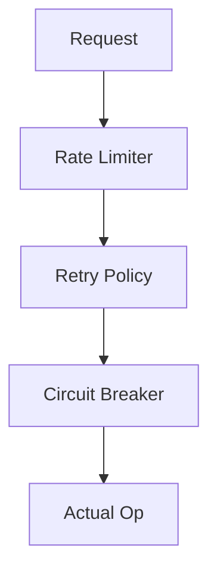

각 레이어는 독립적이고 단위 테스트도 따로 가능. Polly의 핵심 디자인이 이것이다.

---

## 14.5 정리

- 토큰 버킷은 60줄 안에 짤 수 있다.
- 재시도는 jitter가 핵심.
- 서킷 브레이커는 세 상태 머신.
- 합성으로 강력해진다.

---

## 연습 문제

1. (쉬움) `TokenBucketLimiter`로 초당 2건 제한이 정확히 지켜지는지 측정하라.
2. (보통) `RetryPolicy`에 `OperationCanceledException`은 재시도하지 않도록 기본 `ShouldRetry`를 조정하라.
3. (어려움) `CircuitBreaker`의 실패율 계산을 sliding window (5초)로 바꿔라.
4. (도전) 셋을 하나로 합치는 `Pipeline<T>` 추상화를 만들고 fluent API로 짜라.


# 15장. 비동기 캐시와 `IAsyncEnumerable`

> "캐시 미스 시 동시에 두 요청이 같은 키를 미스하면 같은 작업이 두 번 일어나는가?" 답이 망설여진다면 이 장은 당신의 것이다.

## 학습 목표

- Single-flight 캐시 (`AsyncLazy<T>`) 구현.
- TTL이 있는 캐시와 stampede 방지.
- `IAsyncEnumerable<T>`의 호출 규약, `WithCancellation`, `ConfigureAwait(false)`.
- async stream을 캐시와 결합.

---

## 15.1 Single-flight 캐시

미스 시 같은 키에 대해 단 하나의 fetch만 진행한다.

```csharp
// 파일: samples/src/Chapter15/SingleFlightCache.cs
public sealed class SingleFlightCache<TKey, TValue> where TKey : notnull
{
    private readonly System.Collections.Concurrent.ConcurrentDictionary<TKey, Lazy<Task<TValue>>> _map = new();

    public Task<TValue> GetOrCreateAsync(TKey key, Func<TKey, Task<TValue>> factory)
    {
        var lazy = _map.GetOrAdd(key,
            k => new Lazy<Task<TValue>>(() => factory(k), LazyThreadSafetyMode.ExecutionAndPublication));

        var task = lazy.Value;
        // 실패 시 캐시에서 제거 → 다음 호출이 다시 시도
        task.ContinueWith(t =>
        {
            if (t.IsFaulted) _map.TryRemove(key, out _);
        }, TaskContinuationOptions.ExecuteSynchronously);

        return task;
    }
}
```

`Lazy<T>` + `ConcurrentDictionary`는 단일 비행을 보장하는 가장 간결한 패턴.

### 15.1.1 stampede

캐시 만료 시 동시에 N개 요청이 미스하면 N번 fetch한다. Single-flight는 이를 1번으로 줄인다. CDN, DB, API 어디서나 효과.

```text
miss        miss        miss
  │           │           │
  ▼           ▼           ▼
fetch ────▶ shared task ◀──── 같은 task에 모두 await
  │
  ▼
한 번 fetch
```

---

## 15.2 TTL 캐시

```csharp
// 파일: samples/src/Chapter15/TtlCache.cs
public sealed class TtlCache<TKey, TValue> where TKey : notnull
{
    private readonly System.Collections.Concurrent.ConcurrentDictionary<TKey, Entry> _map = new();
    private readonly TimeSpan _ttl;

    public TtlCache(TimeSpan ttl) => _ttl = ttl;

    public async Task<TValue> GetOrCreateAsync(TKey key, Func<TKey, Task<TValue>> factory)
    {
        var now = DateTime.UtcNow;
        if (_map.TryGetValue(key, out var existing) && existing.ExpiresAt > now)
            return await existing.Task.ConfigureAwait(false);

        var lazy = new Lazy<Task<TValue>>(() => factory(key), LazyThreadSafetyMode.ExecutionAndPublication);
        var entry = new Entry(lazy.Value, now + _ttl);
        _map[key] = entry;

        try { return await entry.Task.ConfigureAwait(false); }
        catch
        {
            _map.TryRemove(key, out _);
            throw;
        }
    }

    private sealed record Entry(Task<TValue> Task, DateTime ExpiresAt);
}
```

> **Pitfall.** 만료된 entry를 그대로 두면 메모리 누수. 별도 GC 루프 또는 `MemoryCache` 사용.

---

## 15.3 `IAsyncEnumerable<T>` 핵심 규약

```csharp
public static async IAsyncEnumerable<int> CountAsync(
    [System.Runtime.CompilerServices.EnumeratorCancellation] CancellationToken ct = default)
{
    for (int i = 0; i < 10; i++)
    {
        ct.ThrowIfCancellationRequested();
        await Task.Delay(50, ct);
        yield return i;
    }
}

await foreach (var x in CountAsync(ct).WithCancellation(ct).ConfigureAwait(false))
{
    Console.WriteLine(x);
}
```

세 가지가 중요하다.

1. **`EnumeratorCancellation` 어트리뷰트** — 호출자가 `WithCancellation`으로 넘긴 토큰이 매개변수 자리로 흘러들도록 한다.
2. **`WithCancellation`** — 호출자가 토큰을 전달하는 표준 방법.
3. **`ConfigureAwait(false)`** — `await foreach`에도 동일하게 적용.

### 15.3.1 두 cancellation의 합성

```text
ICancellable<T> enumerable
       │
       ├ 메서드 매개변수에 들어온 token  (EnumeratorCancellation)
       └ WithCancellation으로 넘어온 token

→ 컴파일러가 두 token을 link해서 enumerator에 전달한다.
```

```csharp
public static async IAsyncEnumerable<int> CountAsync(
    int n,
    [EnumeratorCancellation] CancellationToken ct = default) { ... }

// 호출
await foreach (var x in CountAsync(100).WithCancellation(externalCt))
{
}
// ct는 externalCt와 통합되어 enumerator에 들어간다.
```

---

## 15.4 비동기 스트림 캐시

마지막 N개 element를 캐시한 뒤 새 구독자에게 replay하는 패턴.

```csharp
// 파일: samples/src/Chapter15/ReplayStream.cs
public sealed class ReplayStream<T>
{
    private readonly object _lock = new();
    private readonly Queue<T> _buffer;
    private readonly int _capacity;
    private readonly List<TaskCompletionSource<T>> _waiters = new();
    private bool _completed;

    public ReplayStream(int capacity) { _capacity = capacity; _buffer = new(capacity); }

    public void Publish(T item)
    {
        List<TaskCompletionSource<T>>? snapshot = null;
        lock (_lock)
        {
            if (_buffer.Count >= _capacity) _buffer.Dequeue();
            _buffer.Enqueue(item);
            snapshot = new(_waiters);
            _waiters.Clear();
        }
        foreach (var w in snapshot) w.TrySetResult(item);
    }

    public void Complete()
    {
        List<TaskCompletionSource<T>>? snapshot = null;
        lock (_lock)
        {
            _completed = true;
            snapshot = new(_waiters);
            _waiters.Clear();
        }
        foreach (var w in snapshot) w.TrySetCanceled();
    }

    public async IAsyncEnumerable<T> SubscribeAsync(
        [System.Runtime.CompilerServices.EnumeratorCancellation] CancellationToken ct = default)
    {
        // (1) 버퍼된 항목 즉시 replay
        T[] snapshot;
        lock (_lock) snapshot = _buffer.ToArray();
        foreach (var it in snapshot) yield return it;

        // (2) 새 publish 대기
        while (true)
        {
            ct.ThrowIfCancellationRequested();
            var tcs = new TaskCompletionSource<T>(TaskCreationOptions.RunContinuationsAsynchronously);
            lock (_lock)
            {
                if (_completed) yield break;
                _waiters.Add(tcs);
            }
            T next;
            try { next = await tcs.Task.WaitAsync(ct).ConfigureAwait(false); }
            catch (OperationCanceledException) { yield break; }
            yield return next;
        }
    }
}
```

게임 서버에서 "마지막 N개 채팅을 새 입장자에게 replay" 같은 시나리오에 그대로 적용된다.

---

## 15.5 정리

- Single-flight 캐시는 `ConcurrentDictionary + Lazy<Task<T>>`.
- TTL은 단순한 만료 비교.
- `IAsyncEnumerable<T>`는 `EnumeratorCancellation` 어트리뷰트가 핵심.
- replay 스트림은 게임 서버의 채팅/이벤트 로그에 그대로 적용 가능.

---

## 연습 문제

1. (쉬움) `SingleFlightCache`로 동시에 100개 호출이 들어왔을 때 factory가 몇 번 호출되는지 카운트하라.
2. (보통) `TtlCache`에 LRU 제한(`maxEntries`)을 추가하라.
3. (어려움) `IAsyncEnumerable<T>`를 합성하는 `Merge` 연산자(여러 stream을 하나로)를 구현하라.
4. (도전) `ReplayStream<T>`을 `Channel<T>` 위에 다시 짜라. 어느 쪽이 더 깔끔한가?


# 16장. `Channel<T>` 기반 액터 모델

> 동시성 문제의 80%는 "공유 상태 + 동시 접근"이다. 액터 모델은 공유 자체를 없앤다. .NET에서는 `Channel<T>` 한 줄로 시작할 수 있다.

## 학습 목표

- `Channel<T>`의 두 종류와 옵션 행렬을 머리에 넣는다.
- 단일 소비자 직렬화로 룸/세션 상태를 보호하는 패턴을 짠다.
- 액터 종료(`Complete + drain`)를 깔끔하게 처리한다.
- 게임 룸의 메시지 처리 루프를 50줄 안에 만든다.

---

## 16.1 `Channel<T>`의 두 모드

```text
Channel.CreateUnbounded<T>()
   └─ 무제한 큐, 빠르지만 메모리 폭주 위험

Channel.CreateBounded<T>(BoundedChannelOptions(capacity))
   ├─ FullMode = Wait     : writer가 대기 (백프레셔)
   ├─ FullMode = DropWrite: 새 항목 버림
   ├─ FullMode = DropNewest / DropOldest
   └─ AllowSynchronousContinuations = false  (권장 false)
```

서버 코드에서 권장 기본값:

```csharp
var ch = Channel.CreateBounded<Msg>(new BoundedChannelOptions(1024)
{
    FullMode = BoundedChannelFullMode.Wait,
    SingleReader = true,
    SingleWriter = false,
    AllowSynchronousContinuations = false,
});
```

`SingleReader = true`로 두면 BCL이 내부 fast path를 활성화한다. 액터 패턴에서는 거의 항상 true.

---

## 16.2 단일 소비자 직렬화 — 액터의 핵심

```text
[producer] ───WriteAsync───▶ ┌─────────────┐ ───ReadAsync───▶ [actor loop]
[producer] ───WriteAsync───▶ │  Channel<T> │                  ├─ 메시지 1
[producer] ───WriteAsync───▶ └─────────────┘                  ├─ 메시지 2
                                                              └─ ...
                                                                ↑
                                                       이 루프가 유일한 reader
                                                       내부 상태에 lock 불필요
```

여러 producer가 메시지를 던지지만, **읽는 쪽은 한 명**이다. 그러므로 액터 내부 상태에는 lock이 필요 없다. 게임 룸/세션을 이 모델로 짜면 동시성 버그가 거의 사라진다.

---

## 16.3 룸 액터 골격

```csharp
// 파일: samples/src/Chapter16/RoomActor.cs
using System.Threading.Channels;

namespace AsyncAwaitLab.Chapter16;

public abstract record Msg;
public sealed record Join(int PlayerId) : Msg;
public sealed record Leave(int PlayerId) : Msg;
public sealed record Chat(int PlayerId, string Text) : Msg;
public sealed record Tick(DateTime Now) : Msg;
public sealed record Snapshot(TaskCompletionSource<int> Reply) : Msg; // 동기 조회

public sealed class RoomActor : IAsyncDisposable
{
    private readonly Channel<Msg> _mailbox;
    private readonly HashSet<int> _players = new();
    private readonly CancellationTokenSource _cts = new();
    private readonly Task _loop;

    public RoomActor(int capacity = 1024)
    {
        _mailbox = Channel.CreateBounded<Msg>(new BoundedChannelOptions(capacity)
        {
            FullMode = BoundedChannelFullMode.Wait,
            SingleReader = true,
            SingleWriter = false,
            AllowSynchronousContinuations = false,
        });
        _loop = Task.Run(() => LoopAsync(_cts.Token));
    }

    public ValueTask SendAsync(Msg msg, CancellationToken ct = default)
        => _mailbox.Writer.WriteAsync(msg, ct);

    public Task<int> GetPlayerCountAsync()
    {
        var tcs = new TaskCompletionSource<int>(TaskCreationOptions.RunContinuationsAsynchronously);
        _mailbox.Writer.TryWrite(new Snapshot(tcs));
        return tcs.Task;
    }

    private async Task LoopAsync(CancellationToken ct)
    {
        await foreach (var msg in _mailbox.Reader.ReadAllAsync(ct))
        {
            switch (msg)
            {
                case Join j: _players.Add(j.PlayerId); break;
                case Leave l: _players.Remove(l.PlayerId); break;
                case Chat c: /* broadcast 다음 절 */ break;
                case Tick: /* 정기 업데이트 */ break;
                case Snapshot s: s.Reply.SetResult(_players.Count); break;
            }
        }
    }

    public async ValueTask DisposeAsync()
    {
        _mailbox.Writer.TryComplete();
        await _loop.ConfigureAwait(false);
        _cts.Cancel();
        _cts.Dispose();
    }
}
```

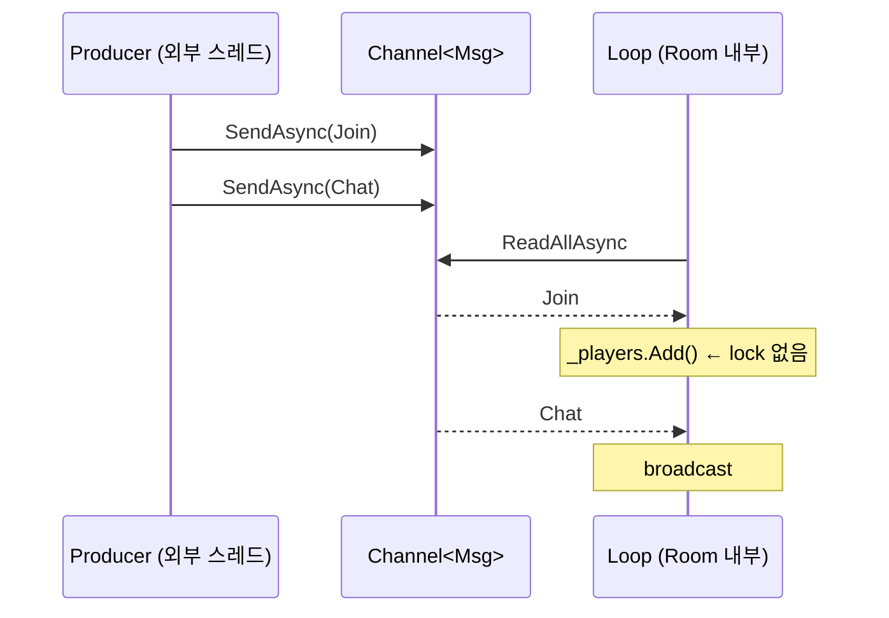

`Snapshot` 패턴은 액터에 동기적으로 결과를 받아오는 표준 트릭. 외부에서 보면 `await room.GetPlayerCountAsync()`로 보이지만, 내부에서는 액터 루프가 답을 채워 준다.

---

## 16.4 브로드캐스트

룸 메시지를 모든 세션에 보낸다.

```csharp
// 파일: samples/src/Chapter16/Session.cs
public sealed class Session
{
    private readonly Channel<Msg> _outbox;
    public int Id { get; }
    public ChannelWriter<Msg> Outbox => _outbox.Writer;
    public ChannelReader<Msg> Reader => _outbox.Reader;

    public Session(int id, int capacity = 256)
    {
        Id = id;
        _outbox = Channel.CreateBounded<Msg>(new BoundedChannelOptions(capacity)
        {
            FullMode = BoundedChannelFullMode.DropOldest,
            SingleReader = true, SingleWriter = false,
        });
    }
}
```

룸 안에 `Dictionary<int, Session>`을 두고:

```csharp
private readonly Dictionary<int, Session> _sessions = new();

case Chat c:
    foreach (var s in _sessions.Values)
        s.Outbox.TryWrite(c);
    break;
```

`DropOldest` 옵션으로 느린 세션이 룸 전체를 막지 못하게 한다. 핵심 트레이드오프:

- 빠른 룸 + 느린 세션이 메시지를 잃을 수 있다 → 보장이 약해진다.
- 메시지 손실 허용 안 하려면 `FullMode=Wait`. 단, 한 세션이 룸을 멈출 수 있다.

이 결정은 게임 장르마다 다르다. 채팅은 잃어도 되고, 매치 결과는 절대 잃으면 안 된다.

---

## 16.5 종료 의미론 — drain하느냐, 버리느냐

```csharp
// (A) Drain — 큐의 모든 메시지를 처리하고 종료
public async ValueTask DisposeAsync_Drain()
{
    _mailbox.Writer.TryComplete();
    await _loop;
}

// (B) Abort — 남은 메시지를 버리고 종료
public async ValueTask DisposeAsync_Abort()
{
    _cts.Cancel();
    _mailbox.Writer.TryComplete();
    try { await _loop; } catch (OperationCanceledException) { }
}
```

게임 룸 종료 시 진행 중인 `Snapshot` reply를 어떻게 처리할지를 결정한다. Drain은 완전성, Abort는 응답성.

---

## 16.6 정리

- `Channel<T>` + single reader = 락 없는 액터.
- 룸/세션 상태는 액터 내부에서만 변경.
- 백프레셔/드롭 정책은 옵션으로 표현.
- Snapshot 패턴으로 동기 조회.

---

## 연습 문제

1. (쉬움) `RoomActor`에 100명의 동시 Join + 100개의 Chat을 던지고, 최종 player 수가 정확한지 검증하라.
2. (보통) 룸이 너무 느려 mailbox가 가득 차면 어떻게 되는가? 1024 capacity에 1만 메시지를 던져 보라.
3. (어려움) 룸 사이에 메시지를 전달하는 `Router`를 추가하라. 두 룸이 서로의 mailbox를 참조하지 않게.
4. (도전) `RoomActor`에 우선순위 큐를 도입하라 — 시스템 메시지가 일반 채팅보다 우선.


# 17장. Room / Session 비동기 패턴

> 16장의 액터를 실제 게임 서버 룸/세션에 입혀 본다. 입장/퇴장, 브로드캐스트, 정기 틱, 매치 종료의 graceful shutdown까지.

## 학습 목표

- 룸-세션 양방향 메시지 흐름을 그림으로 정리한다.
- `PeriodicTimer`로 N Hz 틱 루프.
- 룸 종료 시 진행 중 요청의 우아한 처리.
- 세션의 outbox 쓰기/읽기를 분리.

---

## 17.1 룸과 세션의 책임 분리

```text
[Session]                     [Room]
   ├─ inbox  ◀───────────────  메시지 (broadcast)
   ├─ outbox ──────────────▶  메시지 (player → room)
   ├─ Player state             ├─ Room state (player list, score...)
   └─ Network I/O              └─ 룸 logic loop
```

- 세션은 **네트워크 I/O와 인코딩**만 책임진다.
- 룸은 **도메인 로직과 상태**만 책임진다.
- 둘 사이 통신은 채널 두 개.

---

## 17.2 PeriodicTimer로 N Hz 틱 루프

```csharp
// 파일: samples/src/Chapter17/RoomLoop.cs
public sealed class RoomLoop : IAsyncDisposable
{
    private readonly RoomActor _actor;
    private readonly PeriodicTimer _timer;
    private readonly CancellationTokenSource _cts = new();
    private readonly Task _tickTask;

    public RoomLoop(RoomActor actor, TimeSpan tickInterval)
    {
        _actor = actor;
        _timer = new PeriodicTimer(tickInterval);
        _tickTask = Task.Run(TickLoopAsync);
    }

    private async Task TickLoopAsync()
    {
        try
        {
            while (await _timer.WaitForNextTickAsync(_cts.Token))
            {
                await _actor.SendAsync(new Tick(DateTime.UtcNow));
            }
        }
        catch (OperationCanceledException) { }
    }

    public async ValueTask DisposeAsync()
    {
        _cts.Cancel();
        _timer.Dispose();
        try { await _tickTask; } catch (OperationCanceledException) { }
        _cts.Dispose();
    }
}
```

`PeriodicTimer.WaitForNextTickAsync`는 비동기 친화적인 정기 신호다. 60Hz 루프라면 `TimeSpan.FromMilliseconds(16.67)`.

> **Pitfall.** Tick 처리가 16ms를 넘으면 다음 tick이 늦어진다. tick 핸들러는 짧게, 무거운 작업은 별도 채널/액터로 위임.

---

## 17.3 룸-세션 라이프사이클

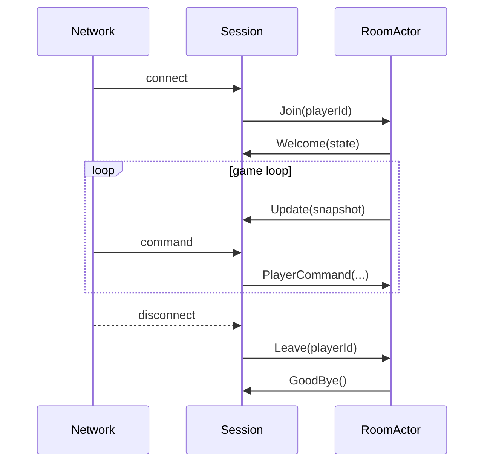

---

## 17.4 graceful shutdown

룸이 종료될 때 진행 중인 작업을 어떻게 마무리할지가 게임 서버 운영의 큰 주제다. 권장 흐름:

```text
1) Writer.TryComplete()         ← 새 입력 차단
2) 모든 세션에 GoodBye 전송      ← 안내
3) 일정 시간(예: 5초) 안에 잔여 메시지 drain
4) 시간 초과면 force close
5) 세션 outbox flush
6) 네트워크 close
```

```csharp
// 파일: samples/src/Chapter17/Shutdown.cs
public static async Task GracefulShutdownAsync(
    RoomActor actor, IEnumerable<Session> sessions,
    TimeSpan drainTimeout, CancellationToken hardKill = default)
{
    foreach (var s in sessions) s.Outbox.TryWrite(new GoodBye());
    using var cts = CancellationTokenSource.CreateLinkedTokenSource(hardKill);
    cts.CancelAfter(drainTimeout);
    try { await actor.DisposeAsync(); }
    catch (OperationCanceledException) { /* drain timed out */ }
    foreach (var s in sessions) s.Outbox.TryComplete();
}

public sealed record GoodBye : Msg;
```

---

## 17.5 룸의 자체 비동기 상태 머신

룸이 단순히 메시지를 처리하는 게 아니라 **단계(stage)**를 갖는다면 비동기 상태 머신 패턴이 깔끔하다.

```csharp
public enum RoomStage { Lobby, Playing, Ending }

private RoomStage _stage = RoomStage.Lobby;

case Join j when _stage == RoomStage.Lobby: ...
case PlayerCommand when _stage == RoomStage.Playing: ...
case StartGame when _stage == RoomStage.Lobby:
    _stage = RoomStage.Playing;
    break;
```

상태 전이는 lock 없이 안전하다 — 액터 루프가 유일한 작성자다.

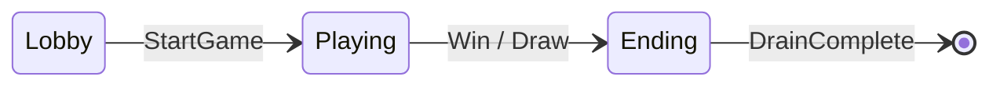

---

## 17.6 정리

- 세션 ↔ 룸은 별도 채널 두 개로 분리.
- `PeriodicTimer`로 정기 tick.
- shutdown은 drain timeout이 핵심.
- 룸 내부에 상태 머신을 두면 lock 없이 진행.

---

## 연습 문제

1. (쉬움) 룸에 30 Hz tick을 1초 돌리고 실제 tick 횟수를 측정하라. 30에서 얼마나 멀리 떨어지는가?
2. (보통) 100명의 세션이 동시에 Join하고 Chat을 100개씩 보낼 때, 잃어버리는 메시지가 있는가? `DropOldest`로 바꿔 비교하라.
3. (어려움) 룸을 두 개 만들고 한 룸의 메시지를 다른 룸으로 forwarding하는 routing을 구현하라.
4. (도전) `RoomLoop`에 deterministic random을 추가해 같은 입력에 같은 출력이 나오도록 만들라. 재현 가능한 매치 리플레이를 위한 첫 걸음.


# 18장. 백프레셔와 부하 격리

> 게임 서버에서 가장 비싼 버그는 "한 룸이 느려서 전체 서비스가 멈춘다"이다. 백프레셔와 부하 격리는 이런 사고를 막는 방어다.

## 학습 목표

- bounded channel의 `Wait/DropOldest/DropNewest` 옵션을 시나리오별로 고른다.
- 우선순위 큐로 시스템 메시지와 사용자 메시지를 분리.
- bulkhead 패턴으로 자원 격리.
- graceful shutdown을 측정 가능한 SLO로 만든다.

---

## 18.1 bounded channel 옵션 행렬

```text
                      ┌──────────────────────────────────────────┐
                      │  소비자 속도 < 생산자 속도               │
                      └──────────────────────────────────────────┘
FullMode = Wait        : 생산자가 대기 (백프레셔, 안전)
FullMode = DropNewest  : 새 메시지 버림 (응답성 ↓, 안정성 ↑)
FullMode = DropOldest  : 오래된 메시지 버림 (실시간성 ↑)
FullMode = DropWrite   : 그냥 무시 (디버그용 최선책)
```

- 매치 결과 = `Wait` (절대 잃지 않는다)
- 채팅 = `DropOldest` (최근 메시지가 중요)
- 위치 동기화 = `DropOldest` 또는 `DropNewest` (최신만 의미 있음)

---

## 18.2 우선순위 큐 — 시스템 vs 사용자

```csharp
// 파일: samples/src/Chapter18/PriorityMailbox.cs
public sealed class PriorityMailbox<TMsg>
{
    private readonly System.Threading.Channels.Channel<TMsg> _hi
        = System.Threading.Channels.Channel.CreateUnbounded<TMsg>(
            new System.Threading.Channels.UnboundedChannelOptions { SingleReader = true });
    private readonly System.Threading.Channels.Channel<TMsg> _lo
        = System.Threading.Channels.Channel.CreateBounded<TMsg>(
            new System.Threading.Channels.BoundedChannelOptions(4096)
            {
                FullMode = System.Threading.Channels.BoundedChannelFullMode.DropOldest,
                SingleReader = true,
            });

    public bool TrySendHigh(TMsg m) => _hi.Writer.TryWrite(m);
    public ValueTask SendLowAsync(TMsg m, CancellationToken ct = default) => _lo.Writer.WriteAsync(m, ct);

    public async IAsyncEnumerable<TMsg> ConsumeAsync(
        [System.Runtime.CompilerServices.EnumeratorCancellation] CancellationToken ct = default)
    {
        while (!ct.IsCancellationRequested)
        {
            // hi-priority 큐를 먼저 확인
            while (_hi.Reader.TryRead(out var hi)) yield return hi;

            // lo 한 개 또는 hi 신호
            var loRead = _lo.Reader.WaitToReadAsync(ct).AsTask();
            var hiRead = _hi.Reader.WaitToReadAsync(ct).AsTask();
            var winner = await Task.WhenAny(loRead, hiRead);

            // hi가 깨어났다면 다음 루프에서 일괄 drain
            if (winner == hiRead) continue;

            if (_lo.Reader.TryRead(out var lo)) yield return lo;
        }
    }
}
```

게임 서버에서 *Shutdown*, *Kick*, *AdminBroadcast* 같은 시스템 메시지는 항상 hi-queue로.

---

## 18.3 Bulkhead 패턴 — 자원 격리

게임에서 매치 처리에 100명, 채팅 처리에 1000명이 매달려도 두 시스템이 같은 thread pool과 같은 큐를 쓰면 한쪽 부하가 다른 쪽을 죽인다. **분리된 SemaphoreSlim**으로 격리.

```csharp
public sealed class Bulkhead
{
    private readonly SemaphoreSlim _sem;
    public Bulkhead(int maxParallel) => _sem = new SemaphoreSlim(maxParallel);

    public async Task<T> ExecuteAsync<T>(Func<CancellationToken, Task<T>> op, CancellationToken ct = default)
    {
        await _sem.WaitAsync(ct).ConfigureAwait(false);
        try { return await op(ct).ConfigureAwait(false); }
        finally { _sem.Release(); }
    }
}
```

서비스별로 별도 `Bulkhead` 인스턴스. 한쪽 큐가 가득 차도 다른 쪽은 영향 없다.

---

## 18.4 측정 가능한 graceful shutdown

게임 운영에서 "서버 종료 시 5초 안에 모든 진행 메시지 처리"는 SLO다. 측정 가능해야 한다.

```csharp
public static async Task<TimeSpan> MeasureShutdownAsync(
    IEnumerable<IAsyncDisposable> things, TimeSpan budget, CancellationToken hardKill = default)
{
    var sw = Stopwatch.StartNew();
    using var cts = CancellationTokenSource.CreateLinkedTokenSource(hardKill);
    cts.CancelAfter(budget);
    foreach (var t in things)
    {
        try { await t.DisposeAsync().AsTask().WaitAsync(cts.Token); }
        catch (OperationCanceledException) { /* hard kill */ }
    }
    return sw.Elapsed;
}
```

배포 시 매번 이 값을 로깅하면 어느 날 SLO를 깨는 변경이 들어왔는지 즉시 보인다.

---

## 18.5 정리

- 옵션 선택은 도메인 의미에 따른다.
- 우선순위 큐로 시스템 ↔ 사용자 분리.
- Bulkhead로 자원 격리.
- shutdown은 측정 가능한 SLO로.

---

## 연습 문제

1. (쉬움) `PriorityMailbox<T>`로 시스템 1개와 사용자 100개 메시지를 보내고 처리 순서를 확인하라.
2. (보통) `DropOldest` 모드에서 메시지 손실률을 시간별로 측정하라.
3. (어려움) `Bulkhead`에 queue 추가 — 한도 도달 시 대기. queueLimit 초과 시 즉시 실패.
4. (도전) graceful shutdown SLO를 OpenTelemetry로 export하라.


# 19장. 메모리 추적과 비동기 누수 사냥

> 비동기 누수는 "왜 새는지" 보다 "어디서 새는지"를 찾는 게 90%다.

## 학습 목표

- 비동기 누수의 4가지 전형을 인식한다.
- `dotnet-counters`, `dotnet-trace`, `dotnet-dump`로 추적하는 흐름을 따라 한다.
- `AsyncLocal<T>` 누수의 신호를 본다.
- 의도적 누수를 만들어 dump로 잡아 본다.

---

## 19.1 비동기 누수의 4가지 전형

1. **`CancellationToken.Register` 미해제**
2. **Timer self-reference (장기 root)**
3. **`Task.Run`이 잡은 클로저** — 람다가 거대 객체를 캡처
4. **이벤트 구독 해제 누락** — 비동기 awaitable에 이벤트 등록

```text
TYPE                         SYMPTOM                       FIX
─────────────────────────────────────────────────────────────────────
CT Register                  AsyncLocal heap에 등록 누적   ctr.Dispose()
Timer self-ref               Timer 객체 + 콜백 클로저 살아 static delegate
Captured ThreadPool work     큰 객체 graph 잔존            local 변수만 캡처
Event subscription           publisher 측에 sub 누적       -=  with sentinel
```

---

## 19.2 `dotnet-counters` — 첫 진단

```bash
dotnet-counters monitor -p <PID> \
  System.Runtime  System.Net.Http \
  Microsoft.AspNetCore.Hosting
```

볼 카운터:

- `gen-1-gc-count`, `gen-2-gc-count` — Gen2가 천천히 늘면 누수 강력 의심
- `time-in-gc` — % 가 5% 넘으면 의심
- `allocation-rate` — 안정 상태에서 일정해야 정상
- `working-set` / `private-memory-bytes` — OS 관점

---

## 19.3 `dotnet-dump` — 잡고 보기

```bash
dotnet-dump collect -p <PID> -o /tmp/dump.dmp
dotnet-dump analyze /tmp/dump.dmp
```

분석 명령:

```text
sos> dumpheap -stat
sos> dumpheap -mt <MT_OF_CancellationTokenRegistrationNode>
sos> gcroot <addr>
```

`gcroot`가 알려주는 root chain을 따라가 보면 어느 객체가 잡고 있는지 보인다. 보통:

```text
[ThreadStatic 또는 strong ref]
  └─ MyService
      └─ List<CancellationTokenRegistration>
          └─ CancellationTokenRegistration   ← 미해제
              └─ Action delegate
                  └─ Closure
                      └─ HugeBuffer (수십 MB)
```

---

## 19.4 의도적 누수 만들어 보기

```csharp
// 파일: samples/src/Chapter19/LeakDemo.cs
public sealed class LeakDemo
{
    private readonly List<CancellationTokenRegistration> _kept = new();
    private readonly byte[] _hugeBuffer = new byte[1024 * 1024 * 10]; // 10MB
    private readonly CancellationTokenSource _global;

    public LeakDemo(CancellationTokenSource global) { _global = global; }

    public void Leak()
    {
        var ctr = _global.Token.Register(() => _hugeBuffer.AsSpan().Clear());
        _kept.Add(ctr);
    }
}
```

`Leak()`을 1000번 부르면 10MB × 1000 = 10GB 가 살아 남는다 (실제로는 같은 _hugeBuffer를 가리키지만, Registration 객체 자체가 누적). 본 코드는 시연용으로, 실제로는 `_kept`가 보유한 `CancellationTokenRegistration`이 closure를 통해 모든 메모리를 잡는다.

---

## 19.5 `AsyncLocal<T>` 누수의 신호

`AsyncLocal<T>.Value`에 큰 객체를 넣고 그 ExecutionContext가 어딘가에 보관되면 누수다. 흔한 시나리오:

```csharp
// (1) 캡처된 EC가 Timer에 보관
_ec = ExecutionContext.Capture(); // ← 다음 호출까지 잡힘
```

> **Rule.** `ExecutionContext.Capture()`를 직접 호출했다면 반드시 짝지어 `ExecutionContext.Restore()` 또는 `Dispose()`. 사실 라이브러리 코드에서 직접 capture할 일은 거의 없다.

---

## 19.6 `dotnet-trace` — 흐름 추적

```bash
dotnet-trace collect -p <PID> \
  --providers Microsoft-Diagnostics-DiagnosticSource:0xFFFFFFFF:Informational
```

이벤트 파일을 PerfView 또는 Speedscope로 열면 thread별 작업 누적이 보인다. ThreadPool starvation을 시각화하는 데 특히 유용.

---

## 19.7 정리

- 누수는 4가지 전형이 거의 모두를 설명한다.
- `dotnet-counters`로 신호 잡고 `dotnet-dump`로 본격 분석.
- 의도적으로 누수를 만들어 보면 도구가 익숙해진다.

---

## 연습 문제

1. (쉬움) `LeakDemo.Leak()`을 100번 실행한 후 dump를 떠라. `gcroot`로 root path를 보고하라.
2. (보통) `WeakReference<T>`로 누수가 없어지는지 검증하는 테스트를 작성하라.
3. (어려움) 본문 §19.1의 4가지 전형 각각에 대해 1줄 재현 코드를 작성하라.
4. (도전) `AsyncLocal<HugeBuf>`을 ThreadPool에 던지고, 6분 후 메모리가 정확히 해제되는지 측정하라.


# 20장. 마이크로벤치마크와 디버깅

> "직감으로 최적화하지 말라." — 누구나 안다. 그래도 한다. 이 장은 그 직감을 측정 가능한 진실로 옮기는 방법.

## 학습 목표

- BenchmarkDotNet의 기본 어트리뷰트 세 개로 정확한 벤치를 짠다.
- `[MemoryDiagnoser]`, `[GcServer]`, `[ThreadingDiagnoser]`로 진짜 행동 측정.
- async stack trace 가독성 옵션 (`ETWConfig`, `DebugTypeMarker`).
- Visual Studio "Parallel Tasks" 윈도와 dotnet-trace 결합.

---

## 20.1 BenchmarkDotNet 한 번에 익히기

```csharp
// 파일: samples/src/Chapter20/AsyncBench.cs
using BenchmarkDotNet.Attributes;
using BenchmarkDotNet.Engines;

[MemoryDiagnoser]
[ThreadingDiagnoser]
[SimpleJob(RunStrategy.Throughput, warmupCount: 3, iterationCount: 5)]
public class AsyncBench
{
    private readonly TaskCompletionSource<int> _tcs = new(TaskCreationOptions.RunContinuationsAsynchronously);

    [GlobalSetup]
    public void Setup() => _tcs.TrySetResult(1);

    [Benchmark(Baseline = true)]
    public async Task<int> AwaitTask() => await _tcs.Task;

    [Benchmark]
    public async ValueTask<int> AwaitValueTask() => await new ValueTask<int>(_tcs.Task);

    [Benchmark]
    public async ValueTask<int> AwaitInstant() => await new ValueTask<int>(42);
}
```

실행:

```bash
dotnet run -c Release --project src/Chapter20 -- --filter '*AsyncBench*'
```

기대 출력 (환경에 따라 다름):

```text
| Method          | Mean   | Allocated |
|-----------------|--------|-----------|
| AwaitTask       | 130 ns |   80 B    |
| AwaitValueTask  |  60 ns |   24 B    |
| AwaitInstant    |   3 ns |    0 B    |
```

수치 자체보다 **비율**과 **할당**이 중요. 모든 호출이 instant라면 할당이 0이어야 한다 — 아니면 어딘가 안 보이는 박싱이 있다.

### 20.1.1 자주 빠지는 함정

- **JIT 캐시 무시** — `[GlobalSetup]`으로 워밍업.
- **결과 폐기 안 함** — `_ = await ...` 또는 메서드가 결과 반환.
- **너무 짧은 작업** — 1ns 단위는 정확도 낮음. BatchSize 활용.

---

## 20.2 dotnet-trace + speedscope

```bash
dotnet-trace collect -p <PID> --providers \
  Microsoft-Diagnostics-DiagnosticSource:0xFFFFFFFF:Informational \
  --format speedscope
```

생성된 `.json`을 https://speedscope.app/ 에 드래그하면 flame chart로 본다. async가 thread를 점프하는 양상까지 보인다.

---

## 20.3 async stack trace 읽기

`async` 메서드의 스택 트레이스는 기본적으로 노이즈가 많다. .NET 5+에는 깔끔하게 보이는 옵션이 있다.

```xml
<!-- runtimeconfig.template.json -->
{
  "runtimeOptions": {
    "configProperties": {
      "System.Threading.Tasks.SuppressStackTraceForUnobservedTaskExceptions": false
    }
  }
}
```

ApplicationInsights/Serilog는 자체적으로 정리해 준다. 로그 패턴을 통일하면 매우 도움.

---

## 20.4 Visual Studio Parallel Tasks 윈도

`Debug → Windows → Parallel Tasks`. 일시 정지된 모든 async 메서드를 표로 본다. 어디서 await 중인지, 어떤 스레드에서 콜백을 기다리는지 한눈에. 게임 서버 디버깅의 비밀 무기.

---

## 20.5 ETW와 Source Generator로 만든 진단

`Microsoft-Diagnostics-DiagnosticSource` 외에도 자체 `EventSource`를 만들면 우리 라이브러리의 동작을 ETW로 export할 수 있다.

```csharp
[EventSource(Name = "AsyncAwaitLab")]
public sealed class LabEventSource : EventSource
{
    public static readonly LabEventSource Log = new();
    [Event(1, Level = EventLevel.Informational)]
    public void RoomTick(int playerCount, long ticks) => WriteEvent(1, playerCount, ticks);
}
```

PerfView, dotnet-trace에서 이 이벤트가 보이도록 등록.

---

## 20.6 정리

- BenchmarkDotNet 어트리뷰트 세 개로 정확한 벤치.
- dotnet-trace + speedscope = 시각화.
- VS Parallel Tasks 윈도는 무료 비밀 무기.
- 자체 `EventSource`로 라이브러리 동작 export.

---

## 연습 문제

1. (쉬움) `AsyncBench`를 실제로 실행하고 결과를 본문 표와 비교하라.
2. (보통) `Channel<T>` 메시지 throughput을 측정하는 벤치를 작성하라.
3. (어려움) BenchmarkDotNet의 `[DryJob]`과 `[SimpleJob]`의 차이를 정리하고, 게임 서버 부하 테스트에는 어떤 것을 쓰는 게 적절한지 토론하라.
4. (도전) `LabEventSource`를 만들고 PerfView로 캡처하라.  