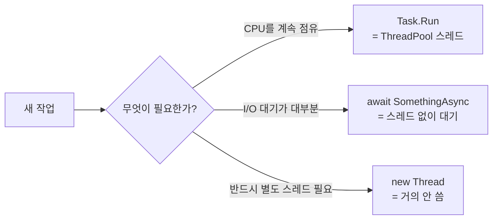

# 1장. 동기와 비동기, 그리고 Task

## 1.1 한 줄 정리

**비동기란, 결과를 기다리지 않고 다음 줄로 넘어가는 것이다.** 그게 전부다. 어떻게 기다리지 않을 수 있는지, 어떻게 결과를 나중에 받을 수 있는지의 차이가 동기/비동기를 가른다.

## 1.2 동기 vs 비동기 vs 병렬

세 단어가 자주 혼동된다. 그림으로 정리하면 다음과 같다.

```
[ 동기 (Synchronous) ]
Thread 1: ▓▓▓▓▓▓▓▓▓▓▓▓▓▓▓▓▓▓▓▓▓▓▓▓
          ↑ DB 조회 (2초)  ↑ 다음 작업
          이 동안 스레드는 아무것도 못 한다.

[ 비동기 (Asynchronous) ]
Thread 1: ▓▓▓▓░░░░░░░░░░░░░░░░▓▓▓▓
          ↑ DB 요청만 던지고 스레드 반환
                ↑ 그동안 다른 일 처리
                                ↑ 결과 도착하면 이어서 실행

[ 병렬 (Parallel) ]
Thread 1: ▓▓▓▓▓▓▓▓▓▓▓▓▓▓
Thread 2: ▓▓▓▓▓▓▓▓▓▓▓▓▓▓   동시에 여러 스레드가 일한다.
Thread 3: ▓▓▓▓▓▓▓▓▓▓▓▓▓▓
```

비동기는 *언제* 실행될지의 이야기이고, 병렬은 *어디서* 실행될지의 이야기다. 비동기 코드가 반드시 병렬로 도는 것은 아니고, 병렬 코드가 반드시 비동기인 것도 아니다.

## 1.3 Thread vs Task

C#에서 비동기 작업을 표현하는 단위는 `Thread`가 아니라 `Task`다. 둘의 차이는 분명하다.

| 구분 | Thread | Task |
|------|--------|------|
| 무엇인가 | OS의 실행 단위 | **비동기 작업의 약속** (Promise) |
| 비용 | 약 1MB 스택 + 커널 자원 | 객체 하나 (~수십 바이트) |
| 결과 반환 | 직접 못 받음 | `Task<T>`로 받음 |
| 취소 | 불가능 (Abort은 deprecated) | `CancellationToken`으로 협조적 취소 |
| 풀링 | 사용자가 직접 | `ThreadPool`이 알아서 |

게임 서버에서 1만 명을 받겠다고 1만 개의 `Thread`를 만들 수는 없지만, 1만 개의 `Task`는 만들 수 있다. 이 차이가 비동기를 쓸 수밖에 없게 만든다.



## 1.4 async / await의 첫 모습

가장 간단한 비동기 메서드는 다음과 같다.

> `Ch01_Basics/Program.cs · Example01_Basics`

```csharp
using System.Net.Http;

var client = new HttpClient();

string html = await DownloadAsync(client, "https://example.com");
Console.WriteLine($"Length: {html.Length}");

static async Task<string> DownloadAsync(HttpClient client, string url)
{
    // 이 한 줄에서 "결과를 기다리지 않고 스레드를 반환"한다.
    HttpResponseMessage response = await client.GetAsync(url);
    return await response.Content.ReadAsStringAsync();
}
```

세 가지 규칙을 기억하면 된다.

1. **`async`는 메서드 시그니처에 붙이는 표시**다. 컴파일러에게 "이 안에 `await`가 있을 거다"라고 알려 준다.
2. **`await`는 식(expression) 앞에 붙이는 키워드**다. `Task`, `Task<T>`, `ValueTask`, `ValueTask<T>` 등 *awaitable*한 것이라면 무엇이든 앞에 붙일 수 있다.
3. **반환 타입은 `Task`, `Task<T>`, `ValueTask`, `ValueTask<T>` 중 하나**여야 한다. `void`도 가능하지만 이벤트 핸들러 외에는 쓰지 말아야 한다 (6장 참조).

## 1.5 await의 정체

`await` 한 줄이 컴파일되면 어떻게 변할까? 결론부터 말하면 **상태 머신(State Machine)** 으로 풀린다. 자세한 변환은 4장에서 다루겠지만, 이 장에서는 의사 코드 수준만 보고 가자.

```csharp
// 원본
async Task<int> DemoAsync()
{
    int a = 1;
    int b = await SomeAsync();
    return a + b;
}

// 의사 코드 (개념적)
Task<int> DemoAsync()
{
    var sm = new StateMachine();
    sm.state = -1;
    sm.builder = AsyncTaskMethodBuilder<int>.Create();
    sm.builder.Start(ref sm);
    return sm.builder.Task;
}

class StateMachine
{
    public int state;
    public AsyncTaskMethodBuilder<int> builder;
    int a;

    public void MoveNext()
    {
        if (state == -1)
        {
            a = 1;
            var awaiter = SomeAsync().GetAwaiter();
            if (!awaiter.IsCompleted)
            {
                state = 0;
                builder.AwaitOnCompleted(ref awaiter, ref this);
                return;          // ← 여기서 메서드가 "잠시 멈춘다"
            }
        }
        // state == 0 으로 다시 진입
        int b = awaiter.GetResult();
        builder.SetResult(a + b); // ← 여기서 Task가 완료된다
    }
}
```

이 그림이 머릿속에 있어야 다음 사실들이 이해된다.

- `await` 앞과 뒤는 *같은 스레드일 수도, 다른 스레드일 수도* 있다 (2장).
- `await` 이전 코드는 **호출 스레드에서 동기로 실행**된다 (6장의 "Async는 비동기로 동작하지 않는다").
- `await`가 풀어준 시간 동안 그 스레드는 다른 일을 한다.

## 1.6 Task 만드는 다섯 가지 방법

```
                     Task 만들기
                          │
        ┌─────────────────┼─────────────────┐
        │                 │                 │
   1. async 메서드   2. Task.Run        3. Task.FromResult
   (대부분의 경우)   (CPU 작업)         (이미 결과가 있을 때)
        │                 │                 │
   ┌────┴────┐       ┌────┴────┐       ┌────┴────┐
   │ await로  │       │ 스레드풀  │       │ 캐시된 값  │
   │ I/O 대기 │       │ 스레드 사용│       │ 즉시 반환  │
   └─────────┘       └─────────┘       └─────────┘

   4. TaskCompletionSource<T>  ─  외부 이벤트를 Task로 변환할 때
   5. Task.WhenAll / WhenAny   ─  여러 Task 조합
```

각각의 사용처는 다음과 같다.

> `Ch01_Basics/Program.cs · Example02_TaskFactories`

```csharp
// 1. async 메서드 — 가장 흔하다
async Task<string> LoadAsync()
{
    using var http = new HttpClient();
    return await http.GetStringAsync("https://example.com");
}

// 2. Task.Run — CPU 바운드 작업을 스레드풀에 넘긴다
Task<int> ComputeAsync(int n) => Task.Run(() =>
{
    int sum = 0;
    for (int i = 0; i < n; i++) sum += i;
    return sum;
});

// 3. Task.FromResult — 이미 결과가 있을 때 (캐시 hit 등)
Task<User> GetUserAsync(int id)
{
    if (_cache.TryGetValue(id, out var user))
        return Task.FromResult(user);
    return LoadFromDbAsync(id);
}

// 4. TaskCompletionSource — 콜백 API를 Task로 감싼다
Task<string> WaitForFirstMessageAsync(IMessageBus bus)
{
    var tcs = new TaskCompletionSource<string>();
    bus.OnMessage += msg => tcs.TrySetResult(msg);
    return tcs.Task;
}

// 5. Task.WhenAll — 여러 작업을 병렬로 묶기
async Task<User[]> LoadManyAsync(int[] ids)
{
    var tasks = ids.Select(LoadUserAsync);
    return await Task.WhenAll(tasks);
}
```

⚠️ **주의:** "비동기 메서드 안에서 그냥 무거운 계산을 한다" → `Task.Run`으로 감싸지 않으면 호출 스레드에서 다 돈다. 비동기 메서드라는 이유만으로 백그라운드에서 도는 게 아니다.

## 1.7 Task vs ValueTask 미리보기

.NET 10 시대의 코드를 보면 `Task<T>` 대신 `ValueTask<T>`가 자주 보인다.

```csharp
// 캐시가 자주 히트하는 경우
public ValueTask<User> GetUserAsync(int id)
{
    if (_cache.TryGetValue(id, out var user))
        return new ValueTask<User>(user);          // 즉시 반환, Task 할당 없음
    return new ValueTask<User>(LoadFromDbAsync(id)); // 캐시 미스만 Task 사용
}
```

`ValueTask`는 `struct`라서 힙 할당이 없다. 캐시 히트가 자주 일어나는 핫패스에서 `Task` 객체 할당을 줄이는 용도다. 다만 *한 번만 await할 것*, *Result를 두 번 읽지 말 것* 같은 제약이 있다 (자세한 내용은 9장).

지금은 "기본은 `Task`, 핫패스에서 `ValueTask`"라고만 기억해 두면 된다.

## 1.8 체크리스트

- [ ] `async`는 메서드 *내부에 await가 있다*는 표시일 뿐, 호출이 자동으로 별도 스레드에서 도는 게 아니다.
- [ ] `await` 앞과 뒤는 다른 스레드일 수 있다.
- [ ] CPU 바운드 작업은 `Task.Run`, I/O 바운드는 `await xxxAsync`.
- [ ] 콜백 API를 비동기로 감쌀 때는 `TaskCompletionSource<T>`.
- [ ] 여러 Task를 동시에 기다릴 때는 `await Task.WhenAll(...)`.

## 1.9 다음 챕터로 가기 전에

다음 코드는 어떤 순서로 출력될까? 그리고 왜 그럴까?

```csharp
async Task Main()
{
    Console.WriteLine($"A: thread {Environment.CurrentManagedThreadId}");
    await Task.Delay(100);
    Console.WriteLine($"B: thread {Environment.CurrentManagedThreadId}");
}
```

답은 환경(콘솔/WinForms/ASP.NET Core)에 따라 다르다. 그 이유가 바로 다음 장의 주제, **SynchronizationContext** 다.
