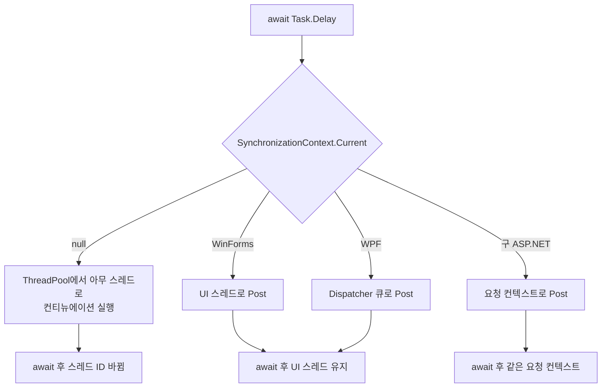

# 2장. SynchronizationContext의 비밀

## 2.1 같은 코드, 다른 결과

다음 코드를 콘솔 앱과 WinForms 앱에서 각각 돌려 보자.

```csharp
async void Run()
{
    Console.WriteLine($"Before: {Environment.CurrentManagedThreadId}");
    await Task.Delay(100);
    Console.WriteLine($"After : {Environment.CurrentManagedThreadId}");
}
```

콘솔 앱에서는 보통 다음과 같이 나온다.

```
Before: 1
After : 7
```

WinForms나 WPF 같은 GUI 앱에서는 이렇게 나온다.

```
Before: 1
After : 1     ← 같은 스레드!
```

같은 `await`인데 결과가 다르다. 왜일까. 답은 **`SynchronizationContext`** 다.

## 2.2 SynchronizationContext란

`SynchronizationContext`는 "이 코드를 어디서 실행해야 할지를 결정하는 추상화"다. 더 정확히는 *컨티뉴에이션(continuation)*, 즉 `await` 이후의 코드를 어디로 보낼지 결정한다.

```
┌──────────────────────────────────────────────────────────────┐
│                         await 의 동작                          │
│                                                              │
│   ┌─────────┐                                                │
│   │ await X │ ───┐                                           │
│   └─────────┘    │   1. 현재 SynchronizationContext 캡처      │
│                  │      (혹은 TaskScheduler)                  │
│                  ▼                                           │
│            X 가 완료될 때까지 대기                              │
│                  │                                           │
│                  │   2. 캡처해 둔 컨텍스트에                    │
│                  │      나머지 코드를 Post                     │
│                  ▼                                           │
│            ┌──────────────┐                                  │
│            │ 컨티뉴에이션  │ ← 여기서 실행되는 스레드가 결정됨    │
│            │   실행       │                                   │
│            └──────────────┘                                  │
└──────────────────────────────────────────────────────────────┘
```

핵심은 다음 한 줄이다.

> **`await`는 현재 `SynchronizationContext.Current`를 캡처해서, 컨티뉴에이션을 그쪽으로 다시 보낸다.**

## 2.3 환경별 SynchronizationContext

`SynchronizationContext.Current`는 환경마다 다르다.

| 환경 | SynchronizationContext.Current | 컨티뉴에이션 실행 위치 |
|------|--------------------------------|------------------------|
| 콘솔 앱 | `null` | 스레드 풀의 아무 스레드 |
| Windows Service | `null` | 스레드 풀의 아무 스레드 |
| WinForms | `WindowsFormsSynchronizationContext` | UI 스레드 |
| WPF | `DispatcherSynchronizationContext` | UI 스레드 |
| ASP.NET (구 .NET Framework) | `AspNetSynchronizationContext` | 요청 컨텍스트 |
| **ASP.NET Core** | **`null`** | **스레드 풀의 아무 스레드** |
| Unity (메인 스레드) | `UnitySynchronizationContext` | Unity 메인 스레드 |

⚠️ **반드시 기억:** ASP.NET Core는 `SynchronizationContext`가 `null`이다. 구 ASP.NET과는 동작이 완전히 다르다. 옛날 자료를 보고 ASP.NET Core에서 `ConfigureAwait(false)`를 도배하는 사람들이 있는데, 효과가 없다 (3장).



## 2.4 콘솔 앱 예제

> `Ch02_SynchronizationContext/Program.cs · ConsoleDemo`

```csharp
using System.Threading;

Console.WriteLine($"Context: {SynchronizationContext.Current?.GetType().Name ?? "null"}");

await DemoAsync();

static async Task DemoAsync()
{
    Console.WriteLine($"Before await: thread {Environment.CurrentManagedThreadId}");
    await Task.Run(() =>
        Console.WriteLine($"In Task.Run : thread {Environment.CurrentManagedThreadId}"));
    Console.WriteLine($"After  await: thread {Environment.CurrentManagedThreadId}");
}
```

실행 결과 (예시):

```
Context: null
Before await: thread 1
In Task.Run : thread 5
After  await: thread 5     ← Task가 끝난 그 스레드에서 그대로 이어진다
```

콘솔은 `Current`가 `null`이라서, `await` 이후 컨티뉴에이션은 **스레드 풀의 아무 스레드**에서 실행된다. 운이 좋으면 같은 스레드일 수도 있지만, 일반적으로 바뀐다.

## 2.5 GUI 앱 예제

> `Ch02_SynchronizationContext/Program.cs · WinFormsLikeDemo`

WinForms 환경을 흉내내려면 컨텍스트를 직접 설치해야 한다. 예제 프로젝트에는 단일 스레드 펌프로 구현한 `SingleThreadSyncContext`가 들어 있다.

```csharp
SingleThreadSyncContext.Run(async () =>
{
    Console.WriteLine($"Before: thread {Environment.CurrentManagedThreadId}");
    await Task.Run(() =>
        Console.WriteLine($"In Run: thread {Environment.CurrentManagedThreadId}"));
    Console.WriteLine($"After : thread {Environment.CurrentManagedThreadId}");
});
```

실행 결과:

```
Before: thread 1
In Run: thread 5     ← Task.Run은 스레드풀 스레드에서 돈다
After : thread 1     ← 하지만 컨티뉴에이션은 "원래 컨텍스트"로 돌아온다
```

GUI 앱이 이렇게 동작해야 하는 이유는 명확하다. UI 컨트롤은 UI 스레드에서만 만질 수 있기 때문이다. `await` 이후 코드에서 `button.Text = "..."`를 쓰려면, 거기로 다시 돌아와야 한다.

## 2.6 컨텍스트가 만드는 데드락

지금까지의 그림이 이해되면, 다음 코드가 왜 데드락에 빠지는지도 보인다.

```csharp
// WinForms 버튼 클릭 핸들러
private void Button_Click(object sender, EventArgs e)
{
    var result = LoadAsync().Result;   // ⚠️ 데드락!
    label.Text = result;
}

private async Task<string> LoadAsync()
{
    await Task.Delay(1000);
    return "done";
}
```

순서를 따라가 보자.

```
[UI 스레드]
  Button_Click 진입
     │
     ▼
  LoadAsync() 호출
     │
     ▼
  await Task.Delay(1000)
     │  ① SynchronizationContext.Current 캡처 (UI 컨텍스트)
     │  ② 1초 후 컨티뉴에이션을 UI 컨텍스트에 Post 예약
     │
     ▼
  Task 반환 (아직 완료 안 됨)
     │
     ▼
  .Result 호출 → 완료될 때까지 ★UI 스레드 차단★
                                 │
                                 │ 1초 후...
                                 │
                                 ▼
                          UI 컨텍스트로 Post 시도
                                 │
                                 ▼
                          ★하지만 UI 스레드는 .Result에서 차단됨!★
                                 │
                                 ▼
                          ───── 💀 데드락 ─────
```

**원칙:** 같은 컨텍스트로 돌아오려는 컨티뉴에이션 앞에서 `.Result`나 `.Wait()`로 그 컨텍스트를 차단하면 데드락이다. 이 패턴을 *Sync-over-async anti-pattern*이라고 부른다.

해결책은 두 가지다.

```csharp
// ✅ 방법 1: 비동기를 끝까지 비동기로
private async void Button_Click(object sender, EventArgs e)
{
    var result = await LoadAsync();
    label.Text = result;
}

// ✅ 방법 2: 컨텍스트로 안 돌아오게 (라이브러리 코드에 한정)
private async Task<string> LoadAsync()
{
    await Task.Delay(1000).ConfigureAwait(false);
    return "done";
}
```

방법 2는 3장에서 자세히 본다.

## 2.7 SynchronizationContext를 직접 다루기

내부 라이브러리에서 "지금 컨텍스트가 있나 없나"를 알아야 할 때가 있다. 예를 들어 콜백을 어디서 호출해야 할지 결정하는 라이브러리.

```csharp
public sealed class Notifier
{
    private SynchronizationContext? _ctx;

    public void Subscribe(Action handler)
    {
        // 구독 시점의 컨텍스트를 캡처
        _ctx = SynchronizationContext.Current;
        _handler = handler;
    }

    public void Fire()
    {
        if (_ctx is not null)
            _ctx.Post(_ => _handler?.Invoke(), null);  // 캡처해 둔 컨텍스트로
        else
            _handler?.Invoke();                         // 그냥 호출 스레드에서
    }
}
```

라이브러리를 쓰는 쪽에서 UI든 콘솔이든 그쪽 컨텍스트에서 자연스럽게 콜백이 도는 효과를 만든다.

## 2.8 ASP.NET Core가 SynchronizationContext를 버린 이유

구 ASP.NET (System.Web)에는 `AspNetSynchronizationContext`가 있었다. 하나의 HTTP 요청 = 하나의 컨텍스트로 묶어, 요청별 상태 (HttpContext.Current 등) 가 비동기 호출 트리 어디서나 보이도록 했다.

대신 성능 비용이 컸다. 모든 `await` 컨티뉴에이션이 컨텍스트를 다시 잡고 큐잉을 거쳐야 했다. 게다가 위에서 본 데드락 패턴의 단골 무대였다.

ASP.NET Core는 이 컨텍스트를 통째로 버렸다. 대신 *모든 요청 상태를 DI로 주입받게* 만들고 (`IHttpContextAccessor`), `await` 이후엔 그냥 스레드 풀에서 이어 달리게 했다. 이 결정이 ASP.NET Core가 빠른 핵심 이유 중 하나다.

```
┌─────────────────────┐       ┌─────────────────────┐
│   구 ASP.NET         │       │   ASP.NET Core      │
├─────────────────────┤       ├─────────────────────┤
│ 요청별 컨텍스트 ★    │       │ SyncContext = null  │
│ HttpContext.Current │       │ DI로 IHttpContext-  │
│ 데드락 자주 발생     │       │   Accessor          │
│ ConfigureAwait(false│       │ 데드락 거의 없음     │
│  필요 (라이브러리)   │       │ ConfigureAwait 불필 │
└─────────────────────┘       └─────────────────────┘
```

## 2.9 체크리스트

- [ ] `SynchronizationContext.Current`는 환경에 따라 다르다. 콘솔/ASP.NET Core는 `null`, GUI는 UI 디스패처.
- [ ] `await`는 *현재 컨텍스트*를 캡처하고, 컨티뉴에이션을 그쪽으로 보낸다.
- [ ] `null` 컨텍스트에서 `await`하면 컨티뉴에이션은 스레드 풀 어딘가에서 돈다 (스레드 ID 바뀜).
- [ ] UI 컨텍스트로 돌아오는 `await` 앞에서 `.Result` / `.Wait()`는 데드락이다.
- [ ] ASP.NET Core에는 `SynchronizationContext`가 없다.

## 2.10 다음 챕터로 가기 전에

GUI 앱에서 `Button_Click` 안의 모든 `await`에 `ConfigureAwait(false)`를 붙이면 어떤 일이 일어날까? 그렇게 해도 괜찮은 코드와 그러면 안 되는 코드를 어떻게 구분할까? 답은 다음 장, **ConfigureAwait 깊이 파기** 에서.
