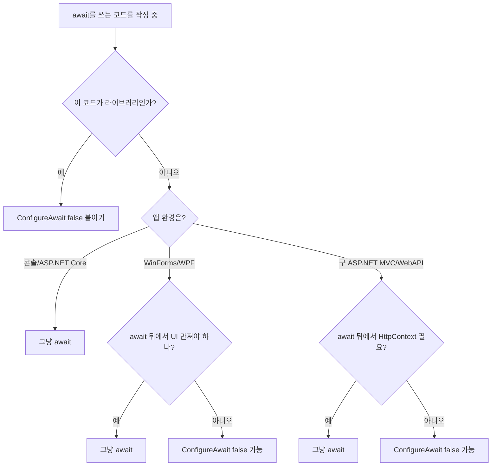

# 3장. ConfigureAwait 깊이 파기

## 3.1 한 줄 정리

**`ConfigureAwait(false)`는 "컨티뉴에이션을 원래 컨텍스트로 안 돌려도 됩니다"라고 컴파일러에게 알려 주는 신호다.** 성능을 위해 붙이는 게 아니다.

## 3.2 무엇을 끄는가

2장에서 본 `await`의 동작은 다음과 같았다.

```
await X
   ① SynchronizationContext.Current 캡처
   ② X 완료까지 대기
   ③ 캡처해 둔 컨텍스트로 컨티뉴에이션 Post
```

`ConfigureAwait(false)`는 ①과 ③을 끈다. 즉,

```
await X.ConfigureAwait(false)
   ① 컨텍스트 캡처 안 함
   ② X 완료까지 대기
   ③ 그냥 끝낸 스레드(=스레드풀 어딘가)에서 컨티뉴에이션 실행
```

GUI 컨텍스트에서 이 옵션을 쓰면 `await` 이후는 UI 스레드가 아닌 곳에서 실행될 수 있다. ASP.NET Core처럼 원래 컨텍스트가 `null`이면 효과 자체가 없다.

## 3.3 GUI 앱에서의 동작 비교

> `Ch03_ConfigureAwait/Program.cs · GuiCompare`

```csharp
private async Task DefaultAwaitAsync()
{
    Print($"Before: {Environment.CurrentManagedThreadId}");
    await Task.Run(() =>
        Print($"In Run: {Environment.CurrentManagedThreadId}"));
    Print($"After : {Environment.CurrentManagedThreadId}");
}
```

WinForms에서 실행하면:

```
Before: 1   (UI 스레드)
In Run: 5   (스레드풀)
After : 1   (UI 스레드로 복귀)
```

`ConfigureAwait(false)`를 붙이면:

```csharp
private async Task ConfiguredAwaitAsync()
{
    Print($"Before: {Environment.CurrentManagedThreadId}");
    await Task.Run(() =>
        Print($"In Run: {Environment.CurrentManagedThreadId}"))
        .ConfigureAwait(false);
    Print($"After : {Environment.CurrentManagedThreadId}");
}
```

```
Before: 1   (UI 스레드)
In Run: 5   (스레드풀)
After : 5   (스레드풀에서 그대로 이어감)
```

## 3.4 한 번 false면 끝이다

⚠️ **함정:** 한 메서드 안에서 한 번이라도 `ConfigureAwait(false)`를 쓰면, 그 다음 `await`에 `ConfigureAwait(true)`를 붙여도 원래 컨텍스트로 돌아오지 않는다.

> `Ch03_ConfigureAwait/Program.cs · TwoAwaits`

```csharp
private async Task MethodAsync()
{
    Print($"Before: {Environment.CurrentManagedThreadId}");

    await Task.Run(() => Print($"Run1: {Environment.CurrentManagedThreadId}"))
        .ConfigureAwait(false);     // ← 여기서 컨텍스트 버림

    Print($"After1: {Environment.CurrentManagedThreadId}");

    await Task.Run(() => Print($"Run2: {Environment.CurrentManagedThreadId}"))
        .ConfigureAwait(true);      // ← 이제 와서 true여도 의미 없음

    Print($"After2: {Environment.CurrentManagedThreadId}");
}
```

```
Before: 1
Run1  : 4
After1: 4   ← 컨텍스트 버려짐
Run2  : 5
After2: 5   ← 돌아갈 컨텍스트가 이미 없음
```

`ConfigureAwait(true)`가 의미하는 것은 "캡처해 둔 컨텍스트로 돌아간다"이다. 이미 첫 `await`에서 *캡처 자체를 안 했기* 때문에 돌아갈 곳이 없다.

## 3.5 그래서 언제 붙여야 하나

```
┌────────────────────────────────────────────────────────────────┐
│  ConfigureAwait(false) 사용 가이드                              │
├────────────────────────────────────────────────────────────────┤
│                                                                │
│  ✅ 붙여야 하는 경우                                            │
│   ─ 라이브러리 / NuGet 패키지의 내부 코드                       │
│   ─ 호출자가 어떤 컨텍스트에서 부를지 모르는 코드               │
│   ─ 컨텍스트를 알 필요가 없는 순수 비즈니스 로직                │
│                                                                │
│  ⚠️ 붙이면 안 되는 경우                                         │
│   ─ UI 이벤트 핸들러 (await 후 UI 만져야 함)                    │
│   ─ 구 ASP.NET 컨트롤러 (HttpContext.Current 깨짐)              │
│                                                                │
│  🤷 의미 없는 경우                                              │
│   ─ ASP.NET Core (컨텍스트가 null)                              │
│   ─ 콘솔 앱 (컨텍스트가 null)                                   │
│                                                                │
└────────────────────────────────────────────────────────────────┘
```

판단 기준은 명확하다. **"이 `await` 뒤에서 원래 컨텍스트가 필요한가?"**

- 필요하다 → 기본값 (`ConfigureAwait(true)`, 즉 그냥 `await`)
- 필요 없다 → `ConfigureAwait(false)`

## 3.6 .NET 8+ : ConfigureAwaitOptions

.NET 8부터 `Task`에 한해 새로운 오버로드가 생겼다. 플래그를 비트 OR로 조합할 수 있다.

```csharp
public enum ConfigureAwaitOptions
{
    None = 0,
    ContinueOnCapturedContext = 1,  // 기본값. ConfigureAwait(true)와 동일
    SuppressThrowing = 2,           // 예외/취소를 await에서 던지지 않음
    ForceYielding = 4,              // 항상 비동기로 양보 (Task.Yield와 유사)
}
```

대표적으로 다음 두 사용법이 유용하다.

> `Ch03_ConfigureAwait/Program.cs · OptionsDemo`

```csharp
// 1. 예외 / 취소를 await에서 throw하지 않고 task만 회수
await someTask.ConfigureAwait(ConfigureAwaitOptions.SuppressThrowing);
if (someTask.IsCanceled) { ... }
if (someTask.IsFaulted) { ... }

// 2. 즉시 완료된 Task도 강제로 비동기 양보 (스택 오버플로 방지 등)
await ComputeAsync().ConfigureAwait(ConfigureAwaitOptions.ForceYielding);
```

`SuppressThrowing`은 "여러 작업을 모아 결과를 일괄 분석하고 싶을 때" 코드가 훨씬 깔끔해진다.

```csharp
async Task ShutdownAllAsync(IEnumerable<IService> services)
{
    var tasks = services.Select(s => s.StopAsync()).ToList();
    foreach (var t in tasks)
        await t.ConfigureAwait(ConfigureAwaitOptions.SuppressThrowing);

    var failed = tasks.Where(t => t.IsFaulted).Select(t => t.Exception!).ToList();
    if (failed.Count > 0) Log(failed);
}
```

## 3.7 ValueTask와 ConfigureAwait

`ValueTask`에도 `ConfigureAwait(bool)`는 있지만, `ConfigureAwaitOptions` 오버로드는 (.NET 10 시점) `Task` 전용이다. `ValueTask`는 그 자체가 한 번만 await하는 가벼운 타입이라 옵션 조합이 제한된다.

## 3.8 잘못된 신화 깨기

자주 보는 잘못된 진술을 정리한다.

> ❌ "성능이 좋아지니까 모든 `await`에 `ConfigureAwait(false)` 붙여라."

성능 차이는 컨텍스트가 있는 경우에 한정해 *컨텍스트로 다시 점프하지 않는 만큼*이다. ASP.NET Core나 콘솔에서는 0이다. 라이브러리 코드라면 이유는 성능이 아니라 *호출자 환경에 영향 받지 않기 위해서*다.

> ❌ "`ConfigureAwait(false)`만 붙이면 데드락이 안 난다."

`Task.Result`나 `.Wait()`를 호출하는 쪽이 문제다. 라이브러리 안에 `false`를 다 도배해도, 호출자가 `Wait()`를 쓰면 라이브러리 입구의 `Task` 자체가 안 완료된다. (라이브러리 안의 마지막 `await`가 `false`로 끝나면 라이브러리 입구 `Task`가 컨텍스트와 무관하게 완료되기 때문에 그나마 막아 주긴 한다.)

> ❌ "ASP.NET Core에서도 안전 차원에서 붙이는 게 좋다."

ASP.NET Core에는 `SynchronizationContext`가 없으니 옵션 자체가 의미가 없다. 단, 라이브러리는 *어떤 환경에서 쓰일지 모르므로* 라이브러리 입장에서는 여전히 붙이는 게 권장된다.

## 3.9 결정 트리



## 3.10 체크리스트

- [ ] `ConfigureAwait(false)`는 *컨텍스트 캡처/복귀*를 끄는 것. 성능 옵션이 아니다.
- [ ] 한 메서드 안에서 한 번이라도 false면 그 뒤로 컨텍스트는 영영 못 돌아온다.
- [ ] ASP.NET Core / 콘솔에는 효과가 없다 (해도 무방).
- [ ] 라이브러리는 *기본적으로* `false`로 작성.
- [ ] .NET 8+ 의 `ConfigureAwaitOptions.SuppressThrowing`은 그래스풀 셧다운 코드에 유용하다.

## 3.11 다음 챕터로 가기 전에

이제 `await`가 컨텍스트를 어떻게 다루는지는 안다. 그런데 `await` 자체는 어떻게 동작할까? `Task`가 아닌 내가 만든 타입을 `await`하려면 무엇을 구현해야 할까? 답은 다음 장, **Awaitable 패턴 직접 구현** 에서.
