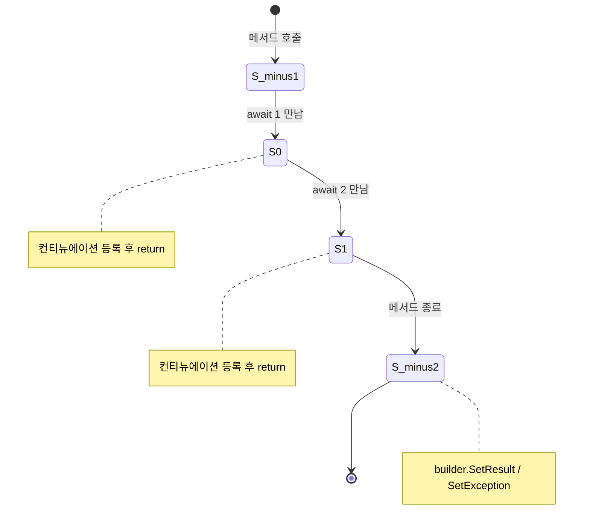

# 4장. Awaitable 패턴 직접 구현

## 4.1 await는 인터페이스가 아니다

C#에서 `await`는 인터페이스 기반이 아니라 **덕 타이핑(Duck Typing)** 으로 동작한다. 즉, 특정 시그니처의 메서드만 갖추고 있으면 컴파일러가 `await`를 받아들인다.

```
                    ┌─────────────────────────┐
                    │   X 를 await 하려면      │
                    └─────────────┬───────────┘
                                  │
                                  ▼
                    X.GetAwaiter() 가 있어야 한다
                    (인스턴스 메서드 또는 확장 메서드)
                                  │
                                  ▼
                    GetAwaiter 의 반환값(=Awaiter)이
                    아래 셋을 모두 갖춰야 한다
                                  │
        ┌─────────────────────────┼─────────────────────────┐
        ▼                         ▼                         ▼
   bool IsCompleted {get;}   T GetResult();        INotifyCompletion 구현
                                                   (void OnCompleted(Action))
```

이 그림이 정확히 *Awaitable 패턴*이다. 인터페이스가 아니라 *패턴*이기에, 확장 메서드만 정의해도 외부 타입을 `await` 가능하게 만들 수 있다.

## 4.2 가장 단순한 Awaitable

먼저 가장 단순한 구현을 본다. `MyAwaitable`을 `await`하면 2초 후 완료된다.

> `Ch04_AwaitablePattern/Program.cs · BasicAwaitable`

```csharp
using System.Runtime.CompilerServices;

public sealed class MyAwaitable
{
    public MyAwaiter GetAwaiter() => new MyAwaiter();
}

public sealed class MyAwaiter : INotifyCompletion
{
    private Action? _continuation;

    public MyAwaiter()
    {
        // 비동기 작업 흉내 — 실제로는 I/O 콜백 등이 들어간다
        Task.Run(async () =>
        {
            await Task.Delay(2000);
            var c = Interlocked.Exchange(ref _continuation, null);
            c?.Invoke();
        });
    }

    public bool IsCompleted => false;
    public void GetResult() { }
    public void OnCompleted(Action continuation) => _continuation = continuation;
}

// 사용
Console.WriteLine($"Before: {Environment.CurrentManagedThreadId}");
await new MyAwaitable();
Console.WriteLine($"After : {Environment.CurrentManagedThreadId}");
```

세 가지만 갖추면 끝이다.

1. `MyAwaitable.GetAwaiter()` — `await`의 진입점
2. `MyAwaiter.IsCompleted` — 이미 완료된 경우 fast-path를 위해
3. `INotifyCompletion.OnCompleted(Action)` — 컴파일러가 만든 컨티뉴에이션을 전달받음

## 4.3 컴파일러가 만든 상태 머신 들여다보기

위 코드를 디컴파일하면 컴파일러가 `await` 한 줄을 어떻게 풀어 놓는지 보인다. 핵심만 추리면 다음과 같다.

```csharp
[CompilerGenerated]
private sealed class StateMachine : IAsyncStateMachine
{
    public int state;
    public AsyncTaskMethodBuilder builder;
    public MyAwaiter awaiter;          // ← 캡처된 Awaiter

    public void MoveNext()
    {
        try
        {
            if (state == -1)            // 진입
            {
                var a = new MyAwaitable();
                awaiter = a.GetAwaiter();
                if (!awaiter.IsCompleted)
                {
                    state = 0;
                    // 컨티뉴에이션 등록 — 여기서 메서드가 "잠시 멈춤"
                    builder.AwaitOnCompleted(ref awaiter, ref this);
                    return;
                }
            }
            else                        // state == 0 (재진입)
            {
                /* awaiter는 이미 캡처돼 있다 */
                state = -1;
            }

            awaiter.GetResult();
            // ─ await 이후의 코드가 여기로 ─
        }
        catch (Exception ex)
        {
            state = -2;
            builder.SetException(ex);
            return;
        }
        state = -2;
        builder.SetResult();
    }
}
```

`MoveNext`라는 거대한 `switch`가 핵심이다. `await`마다 새 state 번호가 부여되고, 각 state는 *"이 await 다음부터 다음 await 직전까지"* 의 코드 조각을 담당한다.



`await`마다 메서드가 `return`된다는 사실을 처음 알면 충격적이다. 동기 코드처럼 보이는 비동기 메서드는, 사실 호출될 때마다 메서드 내부를 토막 토막 돌아 다니는 *상태 머신*이다.

## 4.4 결과를 반환하는 Awaiter

`GetResult()`의 반환 타입을 바꾸면 `await`로 값을 얻을 수 있다.

> `Ch04_AwaitablePattern/Program.cs · TypedAwaiter`

```csharp
public sealed class DelayedValue<T>
{
    private readonly T _value;
    private readonly TimeSpan _delay;

    public DelayedValue(T value, TimeSpan delay)
    {
        _value = value; _delay = delay;
    }

    public Awaiter GetAwaiter() => new Awaiter(_value, _delay);

    public sealed class Awaiter : INotifyCompletion
    {
        private readonly T _value;
        private Action? _continuation;
        private bool _completed;

        public Awaiter(T value, TimeSpan delay)
        {
            _value = value;
            Task.Run(async () =>
            {
                await Task.Delay(delay);
                _completed = true;
                Interlocked.Exchange(ref _continuation, null)?.Invoke();
            });
        }

        public bool IsCompleted => _completed;
        public T GetResult() => _value;
        public void OnCompleted(Action continuation) => _continuation = continuation;
    }
}

// 사용
int x = await new DelayedValue<int>(42, TimeSpan.FromSeconds(1));
Console.WriteLine(x);   // 1초 후 "42"
```

## 4.5 확장 메서드로 Awaitable 만들기

`GetAwaiter()`는 **확장 메서드여도 된다**. 이 점이 강력하다. 남이 만든 타입을 그대로 `await` 가능하게 만들 수 있다.

> `Ch04_AwaitablePattern/Program.cs · ExtensionAwaiter`

```csharp
public static class TimerExtensions
{
    public static TaskAwaiter GetAwaiter(this TimeSpan span)
        => Task.Delay(span).GetAwaiter();
}

// 어디서나
await TimeSpan.FromSeconds(1);   // 1초 기다리기, await로
```

⚠️ 실전에서는 *남이 만든 타입에 확장 GetAwaiter를 함부로 붙이는 것*은 좋은 매너가 아니다. `TimeSpan` 같은 기본 타입에 행위를 부여하면 코드 리뷰가 혼란스러워진다. 내가 만든 도메인 타입에서만 쓰는 것이 좋다.

## 4.6 INotifyCompletion vs ICriticalNotifyCompletion

진짜로 잘 만든 Awaiter는 `INotifyCompletion` 대신 `ICriticalNotifyCompletion`도 구현한다.

```csharp
public interface ICriticalNotifyCompletion : INotifyCompletion
{
    void UnsafeOnCompleted(Action continuation);
}
```

차이는 **실행 컨텍스트(`ExecutionContext`) 흐름**이다.

- `OnCompleted`: 호출자의 `ExecutionContext`를 캡처해 컨티뉴에이션 실행 시 복원 (AsyncLocal, 보안 컨텍스트 등 유지)
- `UnsafeOnCompleted`: 캡처/복원 생략 → 빠르지만 컨텍스트 무시

런타임이 신뢰할 수 있는 환경(예: 컴파일러 생성 코드, BCL 내부)에서는 `UnsafeOnCompleted`를 호출해 비용을 줄인다. 우리 코드에서 일반적으로 구현하라는 뜻은 아니지만, *고성능 awaiter를 만들 때* 알아두면 좋다.

```csharp
public sealed class FastAwaiter : ICriticalNotifyCompletion
{
    public bool IsCompleted { get; }
    public void GetResult() { }
    public void OnCompleted(Action c)        => _continuation = c;
    public void UnsafeOnCompleted(Action c)  => _continuation = c;
}
```

## 4.7 실전 사례: 채널 메시지를 await하기

다음은 메시지 큐를 `await`로 꺼내는 패턴이다. 게임 서버에서 한 플레이어용 인박스를 만들 때 유용하다.

> `Ch04_AwaitablePattern/Inbox.cs`

```csharp
using System.Collections.Concurrent;
using System.Runtime.CompilerServices;

public sealed class Inbox<T> where T : class
{
    private readonly ConcurrentQueue<T> _queue = new();
    private Action? _waiter;
    private readonly object _gate = new();

    public void Send(T msg)
    {
        _queue.Enqueue(msg);
        Action? w;
        lock (_gate) { w = _waiter; _waiter = null; }
        w?.Invoke();
    }

    public ReceiveAwaiter ReceiveAsync() => new(this);

    public sealed class ReceiveAwaiter : INotifyCompletion
    {
        private readonly Inbox<T> _owner;
        internal ReceiveAwaiter(Inbox<T> o) => _owner = o;

        public ReceiveAwaiter GetAwaiter() => this;
        public bool IsCompleted => !_owner._queue.IsEmpty;

        public T GetResult()
            => _owner._queue.TryDequeue(out var item) ? item! : null!;

        public void OnCompleted(Action continuation)
        {
            lock (_owner._gate) _owner._waiter = continuation;
            // 큐가 등록 사이에 채워졌을 수 있다 — race 보정
            if (!_owner._queue.IsEmpty)
            {
                Action? w;
                lock (_owner._gate) { w = _owner._waiter; _owner._waiter = null; }
                w?.Invoke();
            }
        }
    }
}

// 사용
var inbox = new Inbox<string>();

// Consumer
_ = Task.Run(async () =>
{
    while (true)
    {
        string msg = await inbox.ReceiveAsync();
        Console.WriteLine($"got: {msg}");
    }
});

// Producer
inbox.Send("hello");
inbox.Send("world");
```

⚠️ **주의:** 위 구현은 *교육용* 단순화 버전이다. 실전에서는 `System.Threading.Channels.Channel<T>`를 쓰는 것이 훨씬 안전하고 빠르다 (9장 참조). 직접 만들 때는 *큐 등록과 대기자 등록 사이의 race*가 가장 흔한 버그 지점이다.

## 4.8 디버깅 — Awaiter가 호출되지 않는 함정

직접 만든 awaiter가 "걸리는데 깨어나지 않는다"는 버그가 자주 난다. 다음을 점검한다.

```
┌───────────────────────────────────────────────────────────────┐
│ Awaiter가 깨어나지 않는 5가지 흔한 원인                          │
├───────────────────────────────────────────────────────────────┤
│ 1. OnCompleted를 등록하기 전에 작업이 끝나 _continuation 이 null │
│    → IsCompleted를 정직하게 구현하거나, OnCompleted 안에서       │
│       완료 여부를 한 번 더 체크 (위 Inbox 예제 참조)              │
│                                                                │
│ 2. 컨티뉴에이션을 캡처만 하고 호출 안 함                          │
│    → Set/Done 시점에 Interlocked.Exchange로 가져와서 Invoke      │
│                                                                │
│ 3. 멀티스레드 경합으로 OnCompleted가 두 번 호출됨                │
│    → continuation 슬롯에 sentinel 값을 두거나 lock으로 보호      │
│                                                                │
│ 4. 예외가 throw됐는데 GetResult에서 다시 throw하지 않음          │
│    → GetResult 안에서 예외 상태를 확인해 던져 줘야 한다            │
│                                                                │
│ 5. async void / fire-and-forget으로 호출돼 누가 await 안 함      │
│    → 호출자 쪽 문제, Awaiter는 잘 동작하고 있다                   │
└───────────────────────────────────────────────────────────────┘
```

## 4.9 체크리스트

- [ ] `await`는 인터페이스가 아니라 패턴이다. `GetAwaiter()` + `IsCompleted` + `GetResult()` + `OnCompleted()`.
- [ ] 컴파일러는 `await`마다 메서드를 토막내 상태 머신을 만든다.
- [ ] `await` 앞 코드는 호출 스레드에서 동기로 실행된다.
- [ ] `GetAwaiter`는 확장 메서드여도 동작한다.
- [ ] 직접 만들지 말고 가능하면 `Task`, `ValueTask`, `Channel`을 쓰자. 직접 만들어야 한다면 race 처리에 주의.

## 4.10 다음 챕터로 가기 전에

이제 *내부 동작*은 안다. 그렇다면 *현장에서* 이 비동기는 어떤 가치를 만드는가? 다음 장에서는 ASP.NET Core와 게임 서버에서 비동기가 실제로 어떻게 스레드 풀을 살리는지 본다.
