# 5장. ASP.NET / 서버에서 async/await

## 5.1 왜 서버에서 비동기인가

서버 코드의 90%는 *기다리는 일*이다. DB 조회, 외부 API 호출, 파일 읽기, 다른 마이크로서비스 응답. 이런 작업의 공통점은 **CPU가 일을 하지 않는다**는 것이다. 그런데도 동기 코드에서는 그 시간을 스레드 하나가 통째로 깔고 앉아 있는다.

```
[ 동기 서버 ]
요청 1: Thread #5  ▓▓▓▓▓▓▓▓▓▓▓▓▓▓▓▓▓▓▓▓▓▓▓▓▓▓▓
요청 2: Thread #6  ▓▓▓▓▓▓▓▓▓▓▓▓▓▓▓▓▓▓▓▓▓▓▓▓▓▓▓
요청 3: Thread #7  ▓▓▓▓▓▓▓▓▓▓▓▓▓▓▓▓▓▓▓▓▓▓▓▓▓▓▓
요청 4: Thread #8  ▓▓▓▓▓▓▓▓▓▓▓▓▓▓▓▓▓▓▓▓▓▓▓▓▓▓▓
   ...
요청 N: Thread #?  ❌ 풀에 더 이상 스레드 없음 → 대기열에서 무한 대기

[ 비동기 서버 ]
요청 1: Thread #5  ▓▓░░░░░░░░░░░░░░░░░░░░░░░▓▓
요청 2:    Thread #5  ▓▓░░░░░░░░░░░░░░░░░░▓▓
요청 3:       Thread #5  ▓▓░░░░░░░░░░░▓▓
요청 N:         Thread #5  ▓▓...
```

`░` 구간 — 즉 I/O 대기 시간 — 동안 스레드는 풀로 반환되어 다른 요청을 처리한다. 같은 12개의 스레드로도 수천 개의 동시 요청을 다룰 수 있게 된다.

## 5.2 스레드 풀과 IOCP

.NET의 `ThreadPool`은 두 가지 큐를 갖고 있다.

```
                       ThreadPool
        ┌──────────────────────────────────────┐
        │                                      │
        │    ┌─────────────────────────────┐   │
        │    │  Worker Queue                │  │  ← Task.Run, await 컨티뉴에이션
        │    │  (CPU 작업, 컨티뉴에이션)     │   │
        │    └─────────────────────────────┘   │
        │                                      │
        │    ┌─────────────────────────────┐   │
        │    │  IOCP Queue                  │  │  ← OS의 비동기 I/O 완료
        │    │  (I/O 완료 콜백)             │   │
        │    └─────────────────────────────┘   │
        │                                      │
        └──────────────────────────────────────┘
                          │
                          ▼
                    Worker Threads
                    (수십~수백 개)
```

비동기 I/O 작업(`NetworkStream.ReadAsync`, `SqlCommand.ExecuteReaderAsync` 등)은 다음 흐름을 탄다.

1. 호출 시 *I/O 요청만 OS에 등록*하고 스레드는 즉시 반환.
2. OS 디바이스 드라이버 / 네트워크 스택에서 작업이 완료되면 IOCP를 통해 알림.
3. 알림을 받은 IOCP 스레드가 등록된 컨티뉴에이션을 worker queue에 넣음.
4. worker 스레드가 컨티뉴에이션을 실행.

여기서 핵심은 **(1)~(2) 사이에 .NET 스레드를 전혀 점유하지 않는다**는 점이다. 게임 서버에서 1만 명이 동시에 DB를 기다려도 .NET 스레드는 0개가 점유된다.

## 5.3 IIS / ASP.NET (구) — 왜 스레드 고갈이 생겼나

.NET Framework 기반 ASP.NET은 IIS의 worker process(w3wp.exe) 안에서 실행된다. 각 HTTP 요청은 스레드 풀의 worker 스레드 하나가 받아 처리한다. 기본 설정은 CPU 코어당 25~30개 정도 (버전마다 다름).

동기 코드에서 1초짜리 DB 호출이 있다면, 그 1초 동안 worker 스레드 하나가 통째로 막힌다. 동시 요청 200개가 들어오면 200개 스레드가 다 막혀 *스레드 고갈*이 일어난다. 추가 요청은 IIS의 요청 큐에서 무한 대기다.

```csharp
// ❌ 동기 — 스레드 점유
public ActionResult GetPlayerData(int playerId)
{
    var player = _db.GetPlayer(playerId);   // 2초 블로킹
    return View(player);
}

// ✅ 비동기 — 대기 동안 스레드 반환
public async Task<ActionResult> GetPlayerDataAsync(int playerId)
{
    var player = await _db.GetPlayerAsync(playerId);
    return View(player);
}
```

## 5.4 ASP.NET Core — 그래도 비동기가 답이다

ASP.NET Core는 Kestrel이 직접 소켓을 비동기로 다룬다. IIS 시절의 동기 파이프라인이 아니라 처음부터 끝까지 *Task 기반*이다. 그래서:

- `Controller.Action`의 반환 타입은 `Task<IActionResult>` 또는 `IActionResult`. 둘 다 허용.
- 미들웨어는 `Func<HttpContext, Task>` 형태. 모든 미들웨어가 비동기.
- 동기 메서드를 써도 동작은 하지만, *그 요청을 처리하는 worker 스레드 하나가 막힌다*는 사실은 그대로다.

Kestrel의 기본 worker 스레드 수는 `Environment.ProcessorCount` 정도다. 16코어 머신에서 16개. 동기 DB 호출 16개 동시에 들어오면, 17번째 요청부터 큐잉이다.

## 5.5 실측: 동기 vs 비동기

예제 프로젝트에 두 엔드포인트를 만들어 두었다.

> `Ch05_ServerAsync/MiniServer.cs`

```csharp
// 동기 핸들러
app.MapGet("/sync/player/{id:int}", (int id) =>
{
    Thread.Sleep(200);              // DB 호출 흉내
    return Results.Ok(new { id, name = $"player-{id}" });
});

// 비동기 핸들러
app.MapGet("/async/player/{id:int}", async (int id) =>
{
    await Task.Delay(200);          // DB 호출 흉내 (비동기)
    return Results.Ok(new { id, name = $"player-{id}" });
});
```

스레드 풀을 일부러 작게 만들고 동시 부하를 걸어 측정해 보면 차이가 극명하다.

```
ThreadPool.SetMaxThreads(8, 8);   // 일부러 작게
부하: 100 동시 요청, 200ms 작업

[ 동기 결과 ]                       [ 비동기 결과 ]
완료까지: 약 2,500ms                완료까지: 약 250ms
최대 동시 스레드: 8                 최대 동시 스레드: 8
큐 대기 시간: 평균 1,200ms          큐 대기 시간: 평균 20ms
```

같은 8개 스레드로 비동기 코드는 100개 요청을 *거의 동시에* 처리한다.

```mermaid
gantt
    title 동기 vs 비동기 (스레드풀 8개, 요청 16개, 200ms씩)
    dateFormat X
    axisFormat %L

    section 동기
    Req1 (T1): 0, 200
    Req2 (T2): 0, 200
    Req3 (T3): 0, 200
    Req4 (T4): 0, 200
    Req5 (T5): 0, 200
    Req6 (T6): 0, 200
    Req7 (T7): 0, 200
    Req8 (T8): 0, 200
    Req9 ~ Req16 (대기): 200, 400

    section 비동기
    Req1-16 (수신, 스레드 반환): 0, 5
    I/O 대기 (스레드 없음): 5, 205
    컨티뉴에이션 (8개씩 2배치): 205, 210
```



## 5.6 게임 서버에서의 패턴

MMO 게임 서버처럼 *수천~수만 명의 영구 연결*을 받는 환경에서는 비동기가 필수다. 일반적인 패턴은 다음과 같다.

### 5.6.1 연결당 비동기 루프

> `Ch05_ServerAsync/GameSession.cs`

```csharp
public sealed class GameSession
{
    private readonly TcpClient _client;
    private readonly CancellationTokenSource _cts = new();

    public async Task RunAsync()
    {
        var stream = _client.GetStream();
        var buffer = new byte[4096];

        try
        {
            while (!_cts.IsCancellationRequested)
            {
                int n = await stream.ReadAsync(buffer, _cts.Token);
                if (n == 0) break;                                // 연결 종료
                await HandlePacketAsync(buffer.AsMemory(0, n));
            }
        }
        catch (OperationCanceledException) { /* 정상 종료 */ }
    }

    private async Task HandlePacketAsync(ReadOnlyMemory<byte> data)
    {
        // 패킷 처리. 비동기 DB 조회 등.
    }
}
```

이 코드 1만 개가 동시에 떠 있어도 .NET 스레드는 10개 안팎으로 충분하다. `ReadAsync`가 대기하는 동안 스레드는 모두 반환되어 있기 때문이다.

### 5.6.2 패킷별 비동기 처리 vs 채널 기반

위 코드는 *한 패킷 처리가 끝나야 다음 패킷을 읽는다*. 패킷 순서 보장이 필요한 게임에서는 적합하지만, 동시 처리가 필요하면 채널을 끼워 넣는다 (9장 참조).

```
[ 순차 처리 ]
ReadAsync → Handle → ReadAsync → Handle → ...
            ↑ 이게 길면 다음 패킷 못 읽음

[ 채널 기반 ]
Reader Task:   ReadAsync → Channel.Write → ReadAsync → Channel.Write
Worker Task:   Channel.Read → Handle → Channel.Read → Handle
```

## 5.7 동기 API를 강제로 비동기로 — Task.Run의 함정

라이브러리가 동기만 제공할 때 `Task.Run`으로 감싸 비동기처럼 만드는 트릭이 있다.

```csharp
public Task<User> GetUserAsync(int id)
    => Task.Run(() => _legacyDb.GetUser(id));
```

⚠️ **함정:** 이건 *진짜 비동기가 아니다.* 단지 *호출자의 스레드를 안 막을 뿐*, ThreadPool의 스레드 하나는 200ms든 2초든 통째로 막힌다. 서버 측 코드에서 이걸 광범위하게 쓰면, 결국 스레드 풀에서 막히는 스레드 수만 늘어난다.

✅ 올바른 대처: 진짜 비동기 API를 쓴다. `Microsoft.Data.SqlClient`, `Npgsql`, `MongoDB.Driver` 등 메이저 라이브러리는 모두 진짜 비동기 메서드를 제공한다.

`Task.Run`이 정당한 경우는 다음 정도다.

- UI 앱에서 *UI를 막지 않기 위해* 무거운 CPU 작업을 분리
- 콘솔 앱에서 CPU 코어를 충분히 활용하고 싶을 때
- 라이브러리 동기 API를 *한두 번* 호출해야 할 때

## 5.8 ConfigureAwait는?

ASP.NET Core 서버 코드에는 `SynchronizationContext`가 없으니 (`null`) `ConfigureAwait(false)`는 효과 없다. 하지만 *공용 라이브러리*를 짠다면 붙이는 게 안전하다. 3장에서 본 결정 트리를 참조한다.

## 5.9 그래스풀 셧다운

서버 종료 시 `IHostApplicationLifetime`이 `CancellationToken`을 발화한다. 비동기 코드는 이걸 받아 *진행 중인 요청을 끝내고* *새 요청은 거부*하는 식으로 정리해야 한다.

```csharp
public sealed class WorkerService : BackgroundService
{
    protected override async Task ExecuteAsync(CancellationToken stoppingToken)
    {
        while (!stoppingToken.IsCancellationRequested)
        {
            try
            {
                var item = await _queue.DequeueAsync(stoppingToken);
                await ProcessAsync(item, stoppingToken);
            }
            catch (OperationCanceledException) when (stoppingToken.IsCancellationRequested)
            {
                break;     // 정상 종료
            }
        }
    }
}
```

`CancellationToken`을 *맨 아래까지 전달*하는 것이 핵심이다. 6장에서 더 자세히 본다.

## 5.10 체크리스트

- [ ] 서버 코드는 기본이 비동기다. 동기 함수는 *진짜* CPU 작업일 때만.
- [ ] `Task.Run`으로 동기 라이브러리를 감싸는 건 임시방편이다. 진짜 비동기 API를 우선.
- [ ] 게임 서버에서 연결당 비동기 루프 패턴은 ThreadPool 효율의 정수다.
- [ ] 그래스풀 셧다운을 위해 `CancellationToken`을 끝까지 전달.
- [ ] ASP.NET Core에선 `ConfigureAwait` 효과 없음. 라이브러리 코드는 여전히 false 권장.

## 5.11 다음 챕터로 가기 전에

이제 비동기를 *써야 하는 이유*는 안다. 그런데 막상 쓰다 보면 *예상치 못한 동작*이 자주 나온다. 다음 장에서는 현장에서 자주 부딪치는 함정 12가지를 한 번에 정리한다.
