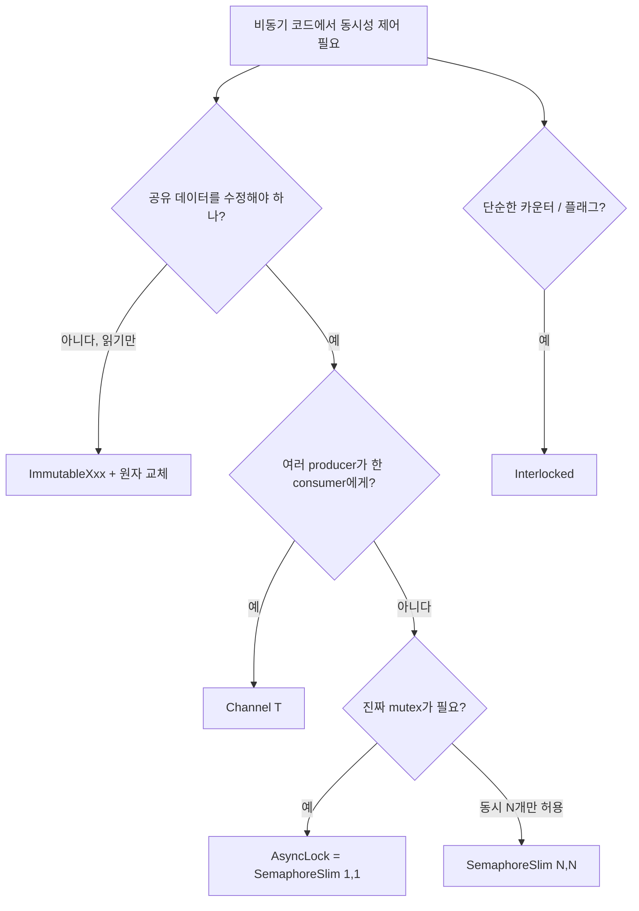

# 7장. 비동기 환경의 동기화 객체

## 7.1 왜 lock이 안 되는가

`lock` 키워드는 `Monitor.Enter`/`Monitor.Exit` 쌍으로 풀린다. 그리고 모니터는 *한 번 잡은 스레드가 풀어야 한다*. 그런데 비동기 메서드의 `await` 앞과 뒤는 스레드가 다를 수 있다 (2장).

```csharp
async Task Bad()
{
    lock (_gate)
    {
        await DoSomethingAsync();   // ❌ 컴파일 에러
    }
}
```

```
error CS1996: 'await' 연산자를 lock 문 본문에서 사용할 수 없습니다
```

컴파일러가 막아 준다. 만약 막지 않는다면, `await` 뒤에 다른 스레드가 들어와 `Monitor.Exit`를 호출하려 해 InvalidOperationException이 났을 것이다.

## 7.2 비동기 동기화 도구 한눈에 보기

```
┌────────────────────────────────────────────────────────────────┐
│  도구             │  쓰임                                       │
├───────────────────┼─────────────────────────────────────────────┤
│  SemaphoreSlim    │  진짜 락 (1짜리 세마포어로 mutex처럼)        │
│  AsyncLock        │  SemaphoreSlim을 using 패턴으로 래핑         │
│  ReaderWriterLock │  X (비동기용 표준 없음)                      │
│  Channel<T>       │  메시지 패싱 (락 대신 큐로)                  │
│  Interlocked      │  원자 연산 (그대로 사용 가능)                │
│  ImmutableXxx     │  불변 자료구조 (락 불필요)                   │
└────────────────────────────────────────────────────────────────┘
```

가장 흔히 쓰는 것은 `SemaphoreSlim`과 `Channel<T>`다.

## 7.3 SemaphoreSlim — 비동기 mutex

`SemaphoreSlim(1, 1)`은 동시에 한 명만 통과하는 게이트 = 사실상 mutex다. `WaitAsync`로 비동기 대기, `Release`로 해제한다.

> `Ch07_AsyncLock/Program.cs · SemaphoreDemo`

```csharp
private static readonly SemaphoreSlim _sem = new(1, 1);

async Task CriticalSectionAsync()
{
    await _sem.WaitAsync();
    try
    {
        await DoWorkAsync();    // 한 번에 한 task만 진입
    }
    finally
    {
        _sem.Release();
    }
}
```

`try/finally` 잊으면 데드락 직행이다. 이 패턴을 매번 손으로 쓰는 건 위험하니 보통 래핑한다.

## 7.4 AsyncLock — using 한 줄로 끝

> `Ch07_AsyncLock/AsyncLock.cs`

```csharp
public sealed class AsyncLock
{
    private readonly SemaphoreSlim _sem = new(1, 1);

    public async ValueTask<Releaser> LockAsync(CancellationToken ct = default)
    {
        await _sem.WaitAsync(ct);
        return new Releaser(this);
    }

    public readonly struct Releaser : IDisposable
    {
        private readonly AsyncLock _owner;
        internal Releaser(AsyncLock owner) => _owner = owner;
        public void Dispose() => _owner._sem.Release();
    }
}
```

사용:

```csharp
private static readonly AsyncLock _gate = new();

async Task DoubleCheckedAsync()
{
    if (_initialized) return;

    using (await _gate.LockAsync())
    {
        if (_initialized) return;          // 더블 체크
        await InitializeAsync();
        _initialized = true;
    }
}
```

`using` 한 줄로 락 획득/해제가 보장된다. 이 패턴이 비동기 코드의 표준 락 관용구다.

⚠️ **주의:** `SemaphoreSlim`은 *재진입(reentrant) 불가*. 같은 task에서 두 번 `WaitAsync`하면 데드락. 일반 `lock`(`Monitor`)은 같은 스레드의 재진입을 허용하지만, 비동기에는 그런 게 없다.

## 7.5 더블 체크 락킹의 비동기 버전

`Lazy<T>`의 비동기 버전이 필요할 때 쓰는 표준 패턴:

> `Ch07_AsyncLock/AsyncLazy.cs`

```csharp
public sealed class AsyncLazy<T>
{
    private readonly Func<Task<T>> _factory;
    private readonly object _gate = new();
    private Task<T>? _task;

    public AsyncLazy(Func<Task<T>> factory) => _factory = factory;

    public Task<T> Value
    {
        get
        {
            // 빠른 경로 — 이미 만들어진 경우
            if (_task is not null) return _task;
            lock (_gate)
            {
                _task ??= _factory();   // 한 번만 호출
            }
            return _task!;
        }
    }
}

// 사용
private static readonly AsyncLazy<Config> _config =
    new(() => LoadConfigAsync());

async Task UseAsync()
{
    var cfg = await _config.Value;     // 첫 호출만 진짜 로드, 이후엔 캐시 hit
}
```

여기는 `lock`을 *한 줄* 안에서만 잡고 풀어서 안전하다. `await`가 그 안에 없기 때문이다. 락 안에서 await가 필요하면 `AsyncLock`을 쓴다.

## 7.6 Channel — 락보다 큐를 쓰자

여러 producer가 한 consumer에게 데이터를 넘기는 경우, 락 대신 *큐*를 쓰는 게 더 자연스럽다. .NET의 `System.Threading.Channels.Channel<T>`는 비동기 친화적인 SPSC/MPMC 큐다.

```
[ 락 기반 ]
Producer ──┐
Producer ──┼─► lock(state) { ... } ◄─ Consumer
Producer ──┘

[ 채널 기반 ]
Producer ──┐
Producer ──┼─► [큐] ◄── Consumer (await ReadAsync)
Producer ──┘
```

> `Ch07_AsyncLock/Program.cs · ChannelDemo`

```csharp
var channel = Channel.CreateBounded<Order>(
    new BoundedChannelOptions(capacity: 100)
    {
        FullMode = BoundedChannelFullMode.Wait,    // 가득 차면 producer 대기
        SingleReader = true,
        SingleWriter = false,
    });

// Producers
_ = Task.Run(async () =>
{
    for (int i = 0; i < 1000; i++)
        await channel.Writer.WriteAsync(new Order(i));
    channel.Writer.Complete();
});

// Consumer
_ = Task.Run(async () =>
{
    await foreach (var order in channel.Reader.ReadAllAsync())
        await ProcessAsync(order);
});
```

`Channel`은 다음의 장점이 크다.

- **백프레셔**: `BoundedChannelOptions(capacity)`로 자연스럽게 흐름 제어.
- **취소**: `WriteAsync(ct)`, `ReadAsync(ct)`에 토큰 전달.
- **종료**: `Complete()` 한 번으로 `ReadAllAsync()`가 깔끔하게 끝남.

게임 서버에서 *플레이어 인박스*, *DB 쓰기 배칭 큐*, *로그 비동기 플러시* 등에 그대로 쓴다.

## 7.7 SemaphoreSlim의 동시 제한 활용

`SemaphoreSlim(N, N)`은 "동시 N개만 통과"하는 게이트로 쓸 수 있다. 외부 API 호출 동시성 제한, 다운로드 워커 수 제한 등에 유용.

> `Ch07_AsyncLock/Program.cs · ConcurrencyLimit`

```csharp
private static readonly SemaphoreSlim _limit = new(initialCount: 8, maxCount: 8);

async Task<string> DownloadAsync(string url)
{
    await _limit.WaitAsync();
    try
    {
        return await _http.GetStringAsync(url);
    }
    finally
    {
        _limit.Release();
    }
}

// 1000개 URL을 동시에 시작해도, 실제 진행은 항상 8개만
var results = await Task.WhenAll(urls.Select(DownloadAsync));
```

.NET 6+의 `Parallel.ForEachAsync(MaxDegreeOfParallelism = 8)`로도 같은 효과를 더 깔끔하게 낼 수 있다.

## 7.8 Interlocked는 그대로 쓴다

원자 연산은 비동기에서도 정상 동작한다. 비동기 메서드 안에서 카운터를 안전하게 증가시키려면 그냥 `Interlocked.Increment`.

```csharp
private static long _counter;

async Task HandleAsync(Request r)
{
    var n = Interlocked.Increment(ref _counter);
    Console.WriteLine($"Request #{n}");
    await ProcessAsync(r);
}
```

`Interlocked`는 락이 아니라 *CPU 명령*이므로, 스레드 어디서 호출되든 안전하다.

## 7.9 Immutable 자료구조

복잡한 자료구조를 비동기 다중 접근에서 안전하게 다루는 *가장 단순한* 방법은 *불변으로 만드는 것*이다. `System.Collections.Immutable` 네임스페이스의 자료구조들은 변경 시 *새 객체*를 반환한다.

```csharp
private ImmutableDictionary<int, Player> _players =
    ImmutableDictionary<int, Player>.Empty;

void AddPlayer(Player p)
{
    // 원자 교체. 변경 도중 다른 스레드는 옛 스냅샷을 본다.
    ImmutableInterlocked.AddOrUpdate(ref _players, p.Id, p, (_, _) => p);
}

IEnumerable<Player> Snapshot() => _players.Values;   // 락 없이 안전
```

게임 서버의 *읽기는 자주, 쓰기는 가끔* 상황에서 이 패턴이 락보다 훨씬 빠르다.

## 7.10 패턴 선택 결정 트리



## 7.11 체크리스트

- [ ] 비동기 메서드 안에서 `lock`은 못 쓴다. `SemaphoreSlim` 또는 `AsyncLock`.
- [ ] `AsyncLock`은 `using` 패턴으로 락 누락을 막아 준다.
- [ ] 가능하면 락 대신 `Channel<T>`로 메시지 패싱.
- [ ] 읽기가 잦은 자료는 Immutable + `Interlocked` 교체.
- [ ] `SemaphoreSlim`은 재진입 불가다.

## 7.12 다음 챕터로 가기 전에

비동기 호출 트리는 스레드를 넘나든다. 그런데 "이 요청을 처리하는 동안만 살아 있는 컨텍스트 값"이 필요하다면 어떻게 해야 할까? 답은 다음 장, **AsyncLocal과 실행 컨텍스트** 다.
