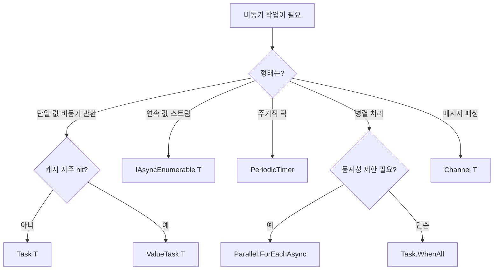

# 9장. .NET 10 비동기 신무기

C# 5.0의 `async/await`가 만들어진 후 10년이 넘는 시간 동안, .NET은 비동기 도구를 꾸준히 보강해 왔다. 이 장에서는 .NET 10 시대에 *반드시 알아야 할* 도구들을 정리한다.

```
.NET 비동기 진화 타임라인
┌──────────────────────────────────────────────────────────────┐
│  .NET 4.5  ── async/await, Task<T>                          │
│  .NET 4.6  ── AsyncLocal<T>                                  │
│  .NET Core ── Kestrel (전면 비동기), Task.Run 풀 개선          │
│  .NET Core 2.1 ── ValueTask<T>, ManualResetValueTaskSource    │
│  .NET Core 3.0 ── IAsyncEnumerable<T>, await foreach,        │
│                   IAsyncDisposable, await using              │
│  .NET 5    ── ValueTask 풀링, Activity 비동기 흐름            │
│  .NET 6    ── Parallel.ForEachAsync, PeriodicTimer           │
│  .NET 7    ── Task.WaitAsync(timeout, ct)                    │
│  .NET 8    ── ConfigureAwaitOptions (SuppressThrowing 등)    │
│  .NET 9~10 ── ConcurrentDictionary AsyncLocal 최적화, 추가     │
│              CancellationTokenSource 풀 개선                  │
└──────────────────────────────────────────────────────────────┘
```

## 9.1 ValueTask<T> — 핫패스의 친구

`Task<T>`는 *클래스*다. 매번 새로 할당된다. 캐시가 자주 히트하는 메서드라면, 매 호출마다 힙 할당이 일어난다.

```csharp
public Task<User> GetUserAsync(int id)
{
    if (_cache.TryGetValue(id, out var u))
        return Task.FromResult(u);     // 매번 새 Task<User> 객체
    return LoadFromDbAsync(id);
}
```

`ValueTask<T>`는 *struct*다. 동기 완료 경로에서 힙 할당이 없다.

```csharp
public ValueTask<User> GetUserAsync(int id)
{
    if (_cache.TryGetValue(id, out var u))
        return new ValueTask<User>(u);       // struct, 할당 없음
    return new ValueTask<User>(LoadFromDbAsync(id));
}
```

### 사용 규칙

```
┌─────────────────────────────────────────────────────────┐
│  ValueTask 황금 규칙                                     │
├─────────────────────────────────────────────────────────┤
│ 1. 한 번만 await 한다                                    │
│ 2. .Result / .GetAwaiter().GetResult() 호출은 한 번만    │
│ 3. 둘 다 안 할 거면 .AsTask()로 Task로 변환 후 보관       │
│ 4. 캐시 히트가 자주 일어나는 곳에서만 쓴다                │
│ 5. 인터페이스 메서드 시그니처에 쓸 때 호환성 주의          │
└─────────────────────────────────────────────────────────┘
```

위반 시 결과는 *미정의*다 (6장 함정 ⑪). 평범한 비동기 메서드 99%는 그냥 `Task<T>`가 맞다. `ValueTask<T>`는 *벤치마크로 효과를 본 핫패스에 한정*해서 쓴다.

### 풀링되는 ValueTask

`async ValueTask` 메서드는 .NET 5+ 에서 *기본적으로 풀링 가능*하다. 즉 내부 상태 머신 객체가 풀에서 재사용된다. 추가 설정 없이 그냥 쓰면 된다.

> `Ch09_ModernFeatures/Program.cs · ValueTaskBenchmark`

```csharp
public async ValueTask<int> HotPathAsync(int n)
{
    if (n == 0) return 0;            // 동기 완료 경로 — 할당 0
    await Task.Yield();
    return n;
}
```

## 9.2 IAsyncEnumerable<T> — 비동기 스트림

LINQ가 `IEnumerable<T>`를 다룰 때처럼, *결과가 점차 도착하는 데이터*를 비동기로 다루고 싶을 때 쓰는 게 `IAsyncEnumerable<T>`다.

> `Ch09_ModernFeatures/Program.cs · AsyncEnumerableDemo`

```csharp
public async IAsyncEnumerable<int> ReadPagesAsync(
    [EnumeratorCancellation] CancellationToken ct = default)
{
    int page = 0;
    while (true)
    {
        ct.ThrowIfCancellationRequested();
        var batch = await _api.GetPageAsync(page++, ct);
        if (batch.Count == 0) break;
        foreach (var item in batch)
            yield return item;
    }
}

// 사용
await foreach (var item in ReadPagesAsync().WithCancellation(cts.Token))
{
    Console.WriteLine(item);
}
```

### IEnumerable<Task<T>> vs IAsyncEnumerable<T>

흔히 헷갈리는 두 시그니처:

```csharp
IEnumerable<Task<int>> GetTasks();    // Task를 나열하는 enumerable
IAsyncEnumerable<int> GetValues();    // 값을 비동기로 흘리는 stream
```

- 전자는 "Task의 리스트". 모두 동시에 시작하고 `Task.WhenAll` 가능.
- 후자는 "값이 비동기로 차례차례 도착". 백프레셔가 자연스럽게 걸린다.

게임 서버 통계 스트리밍, gRPC 서버 스트리밍, EF Core의 `AsAsyncEnumerable()` 등에 사용된다.

### EnumeratorCancellation 어트리뷰트

`IAsyncEnumerable<T>` 메서드의 매개변수에는 `[EnumeratorCancellation]`을 붙여야 `await foreach (... .WithCancellation(ct))`로 전달된 토큰을 받을 수 있다. 안 붙이면 토큰이 흘러 들어오지 않는다.

## 9.3 await using과 IAsyncDisposable

`IDisposable`의 비동기 버전. `using` 대신 `await using`을 쓴다.

```csharp
public interface IAsyncDisposable
{
    ValueTask DisposeAsync();
}

await using var conn = new AsyncConnection();
await conn.OpenAsync();
// 블록 끝나면 자동으로 await conn.DisposeAsync()
```

EF Core의 `DbContext`, `IAsyncEnumerator<T>`, 일부 `Stream` 구현이 `IAsyncDisposable`을 구현한다. 자원이 비동기로 닫혀야 하는 경우 (DB 트랜잭션 롤백, 네트워크 셧다운 페이로드 전송 등) 필수.

## 9.4 CancellationToken — 협조적 취소의 표준

`CancellationToken`은 .NET 4.0부터 있었지만 비동기 메서드 시그니처에 *반드시* 흐르는 게 표준화된 건 비교적 최근이다.

### 토큰을 만들고 발화하기

```csharp
using var cts = new CancellationTokenSource();
cts.CancelAfter(TimeSpan.FromSeconds(5));     // 5초 후 취소

await DoAsync(cts.Token);
```

### 여러 토큰 합치기

```csharp
using var linked = CancellationTokenSource.CreateLinkedTokenSource(
    requestCt, shutdownCt);
await DoAsync(linked.Token);
```

### .NET 7+의 Task.WaitAsync

타임아웃을 *기존 Task에 외부에서 걸기* 위한 메서드.

```csharp
var task = LoadAsync();
var result = await task.WaitAsync(TimeSpan.FromSeconds(2));
// 2초 안에 안 끝나면 TimeoutException
```

토큰과 결합:

```csharp
var result = await task.WaitAsync(TimeSpan.FromSeconds(2), ct);
```

기존엔 `Task.WhenAny(task, Task.Delay(...))` 로 흉내내야 했는데, 이 메서드 한 줄로 정리된다.

### 토큰 등록 콜백

```csharp
ct.Register(() => Console.WriteLine("cancelled!"));
```

I/O 작업 자체가 토큰을 받지 못하는 경우, 강제 종료 로직을 여기 넣는다 (소켓 close 등). 단, 이 콜백은 *취소 발화 스레드에서 동기 실행*되므로 무거운 일은 금물.

## 9.5 PeriodicTimer — 주기적 비동기 루프

타이머 콜백을 비동기로 받을 수 있는 .NET 6+ 도구. 게임 서버의 *틱 루프*에 안성맞춤이다.

> `Ch09_ModernFeatures/Program.cs · PeriodicTimerDemo`

```csharp
using var timer = new PeriodicTimer(TimeSpan.FromMilliseconds(33));   // ~30 FPS

while (await timer.WaitForNextTickAsync(stoppingToken))
{
    await TickAsync();
}
```

`WaitForNextTickAsync`는 다음 틱 시각까지 *완전히 비동기로* 기다린다. `Thread.Sleep`이나 `Task.Delay` 루프보다 훨씬 정확하고, ThreadPool도 안 막는다.

## 9.6 System.Threading.Channels

7장에서 잠깐 본 채널을 다시 한 번. *진짜로 자주 쓰는* 옵션은 다음과 같다.

```csharp
// 1. Bounded — 백프레셔 (가득 차면 producer 대기)
var ch = Channel.CreateBounded<T>(new BoundedChannelOptions(1000)
{
    FullMode = BoundedChannelFullMode.Wait,
    SingleReader = true,
});

// 2. Unbounded — 빠르지만 폭주 위험
var ch = Channel.CreateUnbounded<T>(new UnboundedChannelOptions
{
    SingleReader = true,
    SingleWriter = false,
});

// 3. 가득 차면 가장 오래된 것 버리기 (실시간 텔레메트리 등)
var ch = Channel.CreateBounded<T>(new BoundedChannelOptions(100)
{
    FullMode = BoundedChannelFullMode.DropOldest,
});
```

### Producer/Consumer 패턴

> `Ch09_ModernFeatures/Program.cs · ChannelPipeline`

```csharp
var channel = Channel.CreateBounded<Job>(new BoundedChannelOptions(1024)
{
    FullMode = BoundedChannelFullMode.Wait,
    SingleReader = false,
});

// N개 워커
var workers = Enumerable.Range(0, 4).Select(_ => Task.Run(async () =>
{
    await foreach (var job in channel.Reader.ReadAllAsync(ct))
        await ProcessAsync(job);
})).ToArray();

// Producer
await foreach (var job in ReadJobsAsync(ct))
    await channel.Writer.WriteAsync(job, ct);

channel.Writer.Complete();
await Task.WhenAll(workers);
```

이 한 패턴이 *대부분의* 워크로드 분배 / 백그라운드 처리 / 메시지 큐 문제를 해결한다.

## 9.7 Parallel.ForEachAsync

`Parallel.ForEach`의 진짜 비동기 버전. .NET 6+.

```csharp
await Parallel.ForEachAsync(items,
    new ParallelOptions
    {
        MaxDegreeOfParallelism = 16,
        CancellationToken = ct,
    },
    async (item, t) =>
    {
        await ProcessAsync(item, t);
    });
```

내부적으로는 동시 task 수를 제한하면서 모든 항목을 처리한다. 7장의 `SemaphoreSlim(8, 8)` 패턴을 한 줄로 대체한다.

⚠️ `Parallel.ForEachAsync`는 *각 람다*가 비동기다. CPU 작업을 N코어에 자동 분배해 주는 게 아니라, *비동기 작업을 N개씩 동시 진행*한다. CPU 분배가 목적이면 `Parallel.ForEach`(동기 버전)이다.

## 9.8 IAsyncEnumerable + Channel 콤보

채널을 `IAsyncEnumerable`로 노출하면, *소비자가 await foreach로 자연스럽게 받을 수 있다*.

```csharp
public IAsyncEnumerable<Job> GetJobsAsync(CancellationToken ct = default)
    => _channel.Reader.ReadAllAsync(ct);

// 소비자
await foreach (var job in service.GetJobsAsync(ct))
{
    await Process(job);
}
```

가장 깔끔한 인터페이스다. 내부적으로 채널을 쓰는 사실은 숨기고, 소비자에게는 *비동기 스트림*만 보여준다.

## 9.9 ConfigureAwaitOptions 복습

3장에서 본 .NET 8+의 옵션 플래그.

```csharp
await task.ConfigureAwait(
    ConfigureAwaitOptions.ContinueOnCapturedContext |
    ConfigureAwaitOptions.SuppressThrowing);
```

- `SuppressThrowing`: `await` 시 예외/취소를 던지지 않음 → Task 객체 자체에서 상태 확인.
- `ForceYielding`: 동기 완료여도 강제로 비동기 양보.

`SuppressThrowing`은 *대량의 Task를 한꺼번에 처리할 때* 코드가 훨씬 깔끔해진다.

## 9.10 TimeProvider — 테스트 가능한 시간

.NET 8+. 시간을 추상화해 단위 테스트에서 *시간을 조작*할 수 있게 한다.

```csharp
public sealed class Worker
{
    private readonly TimeProvider _time;
    public Worker(TimeProvider time) { _time = time; }

    public async Task RunAsync(CancellationToken ct)
    {
        using var timer = _time.CreateTimer(...);
        await Task.Delay(TimeSpan.FromSeconds(10), _time, ct);
    }
}

// 운영: TimeProvider.System
// 테스트: Microsoft.Extensions.Time.Testing 의 FakeTimeProvider
```

`Task.Delay(ts, timeProvider)`처럼 *시간 인자*를 받는 오버로드들이 BCL에 추가됐다.

## 9.11 정리: 무엇을 언제 쓰나



## 9.12 체크리스트

- [ ] `ValueTask`는 핫패스만. 한 번만 await.
- [ ] `IAsyncEnumerable<T>`로 비동기 스트림을 표현.
- [ ] 주기적 작업은 `PeriodicTimer`.
- [ ] 병렬 비동기는 `Parallel.ForEachAsync`.
- [ ] 메시지 패싱은 `Channel<T>`.
- [ ] `Task.WaitAsync`로 외부 타임아웃.
- [ ] 시간을 다루는 코드는 `TimeProvider`로 추상화해 테스트 가능하게.

## 9.13 다음 챕터로 가기 전에

도구는 다 봤다. 마지막 장에서는 이 도구들을 조합해 *현장에서 자주 쓰는 패턴 6가지*를 정리한다. 게임 서버 프레임 루프, 백프레셔 파이프라인, 그래스풀 셧다운, 재시도/타임아웃, 팬아웃-팬인 등이다.
