# laster40Net - C# 게임서버 네트워크 라이브러리 완전 분석

  
## 1. 전체 구조 개요
laster40Net은 고성능 TCP 기반의 게임서버를 구축하기 위한 C# 네트워크 라이브러리이다. 이 라이브러리는 다음과 같은 특징을 가지고 있다:

- **비동기 I/O 기반**: SocketAsyncEventArgs를 활용한 고성능 비동기 통신
- **메모리 풀링**: 객체 할당/해제 오버헤드 최소화
- **확장 가능한 아키텍처**: 메시지 프로토콜 추상화
- **멀티스레드 안전성**: 원자적 연산과 동시성 제어

### 1.1 디렉터리 구조

```
laster40Net/
├── Core/                    # 핵심 네트워크 컴포넌트
│   ├── TcpService.cs       # 메인 서비스 클래스
│   ├── Session.cs          # 클라이언트 세션 관리
│   ├── Listener.cs         # 서버 리스너
│   ├── Connector.cs        # 클라이언트 커넥터
│   └── TcpServiceConfig.cs # 설정 관리
├── Message/                # 메시지 처리 시스템
│   ├── Message.cs          # 메시지 인터페이스
│   ├── RawMessage.cs       # Raw 데이터 처리
│   └── SimpleBinaryMessage.cs # 바이너리 메시지 프로토콜
├── Util/                   # 유틸리티 클래스들
│   ├── BufferManager.cs    # 버퍼 관리
│   ├── PooledBufferManager.cs # 풀링 버퍼 관리
│   ├── AtomicInt.cs        # 원자적 정수 연산
│   ├── FastBitConverter.cs # 고속 바이트 변환
│   └── ILogger.cs          # 로깅 시스템
└── Data/
    └── DBQueryProcess.cs   # 데이터베이스 쿼리 처리
```

### 1.2 전체 아키텍처 다이어그램

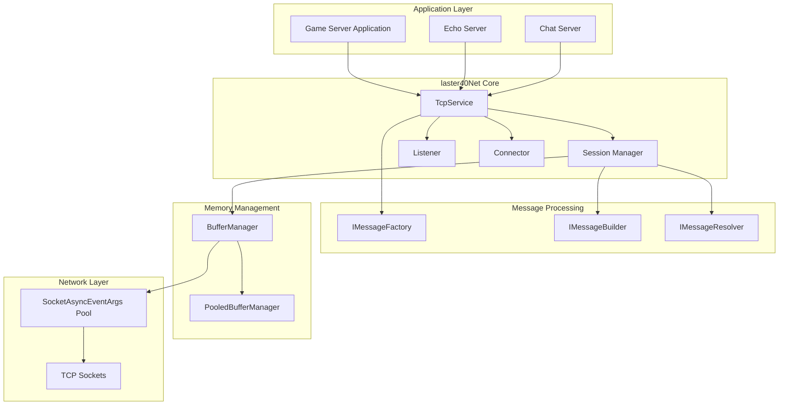

---

## 2. 핵심 아키텍처 분석

### 2.1 TcpService - 중앙 관제탑
`TcpService`는 전체 네트워크 라이브러리의 핵심이며, 모든 네트워크 작업을 조율하는 중앙 관제탑 역할을 한다.

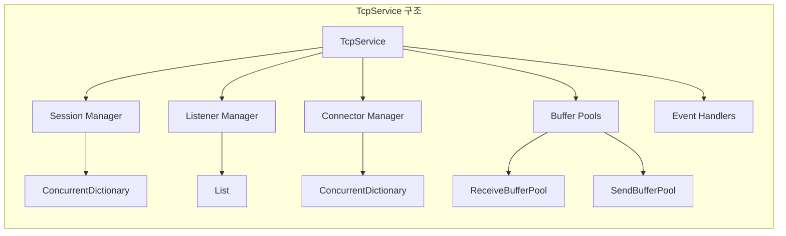

**주요 책임:**
- 세션 생명주기 관리
- 리스너와 커넥터 관리
- 메모리 풀 관리
- 이벤트 라우팅

### 2.2 비동기 I/O 패턴
이 라이브러리는 .NET의 `SocketAsyncEventArgs`를 사용하여 고성능 비동기 I/O를 구현한다.

```ascii
Client Connection Flow:
┌─────────────┐    ┌─────────────┐    ┌─────────────┐
│   Listener  │───▶│  AcceptAsync│───▶│ NewSession  │
└─────────────┘    └─────────────┘    └─────────────┘
                           │
                           ▼
┌─────────────┐    ┌─────────────┐    ┌─────────────┐
│ Session     │◀───│EventArgs    │◀───│SocketAsync  │
│ Created     │    │ Pool        │    │ Completed   │
└─────────────┘    └─────────────┘    └─────────────┘
```

### 2.3 메모리 관리 전략

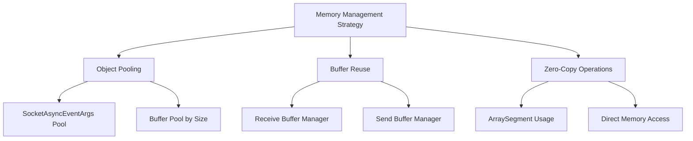

---

## 3. 주요 클래스별 상세 분석

### 3.1 TcpService 클래스 분석
`TcpService`는 전체 시스템의 facade 역할을 하며, 사용자가 직접 상호작용하는 주요 클래스이다.

```csharp
public class TcpService : IDisposable
{
    // 핵심 구성 요소들
    internal TcpServiceConfig Config { get; private set; }
    internal ILogger Logger { get; private set; }
    internal ConcurrentDictionary<long, Session> _sessions;
    internal PooledBufferManager _pooledBufferManager;
    
    // 이벤트 풀들
    internal ConcurrentStack<SocketAsyncEventArgs> ReceiveSockAsyncEventArgsPool;
    internal ConcurrentStack<SocketAsyncEventArgs> SendSockAsyncEventArgsPool;
}
```

**주요 메서드 분석:**

1. **Run() 메서드** - 서비스 시작
```csharp
public bool Run()
{
    if (!_running.CasOn()) return false; // 원자적 상태 변경
    
    // 메모리 초기화
    ReceiveBufferManager = new BufferManager(
        Config.ReceviceBuffer * Config.MaxConnectionCount, 
        Config.ReceviceBuffer);
    
    // EventArgs 풀 초기화
    for (int i = 0; i < Config.MaxConnectionCount; i++)
    {
        // Receive용 EventArgs 생성
        SocketAsyncEventArgs receiveArgs = new SocketAsyncEventArgs();
        receiveArgs.UserToken = new SessionIOUserToken();
        receiveArgs.Completed += CompletedReceive;
        ReceiveBufferManager.SetBuffer(receiveArgs);
        ReceiveSockAsyncEventArgsPool.Push(receiveArgs);
        
        // Send용 EventArgs 생성
        SocketAsyncEventArgs sendArgs = new SocketAsyncEventArgs();
        sendArgs.UserToken = new SessionIOUserToken();
        sendArgs.Completed += CompletedSend;
        SendSockAsyncEventArgsPool.Push(sendArgs);
    }
    
    return true;
}
```

2. **NewClient() 메서드** - 새로운 클라이언트 처리
```csharp
internal bool NewClient(Socket socket, Object token)
{
    // 동시 접속자 수 체크
    if (_sessions.Count + 1 > Config.MaxConnectionCount)
        return false;
    
    // 풀에서 EventArgs 가져오기
    if (!ReceiveSockAsyncEventArgsPool.TryPop(out SocketAsyncEventArgs receiveEventArgs))
        return false;
    if (!SendSockAsyncEventArgsPool.TryPop(out SocketAsyncEventArgs sendEventArgs))
    {
        ReceiveSockAsyncEventArgsPool.Push(receiveEventArgs);
        return false;
    }
    
    // 메시지 팩토리에서 빌더/리졸버 생성
    Message.IMessageBuilder messageBuilder = null;
    Message.IMessageResolver messageResolver = null;
    if (_messageFactory != null)
    {
        messageBuilder = _messageFactory.CreateBuilder();
        messageResolver = _messageFactory.CreateResolver();
    }
    
    // 세션 생성 및 등록
    Session client = new Session(this, socket, messageBuilder, messageResolver);
    if (!_sessions.TryAdd(client.ID, client))
    {
        // 실패시 EventArgs 반환
        ReceiveSockAsyncEventArgsPool.Push(receiveEventArgs);
        SendSockAsyncEventArgsPool.Push(sendEventArgs);
        return false;
    }
    
    // 세션 오픈
    client.Open(receiveEventArgs, sendEventArgs);
    FireConnectionEvent(client.ID, true, client.RemoteEndPoint, token);
    
    return true;
}
```

### 3.2 Session 클래스 - 연결 관리의 핵심
`Session` 클래스는 개별 클라이언트 연결을 관리하는 핵심 클래스이다.

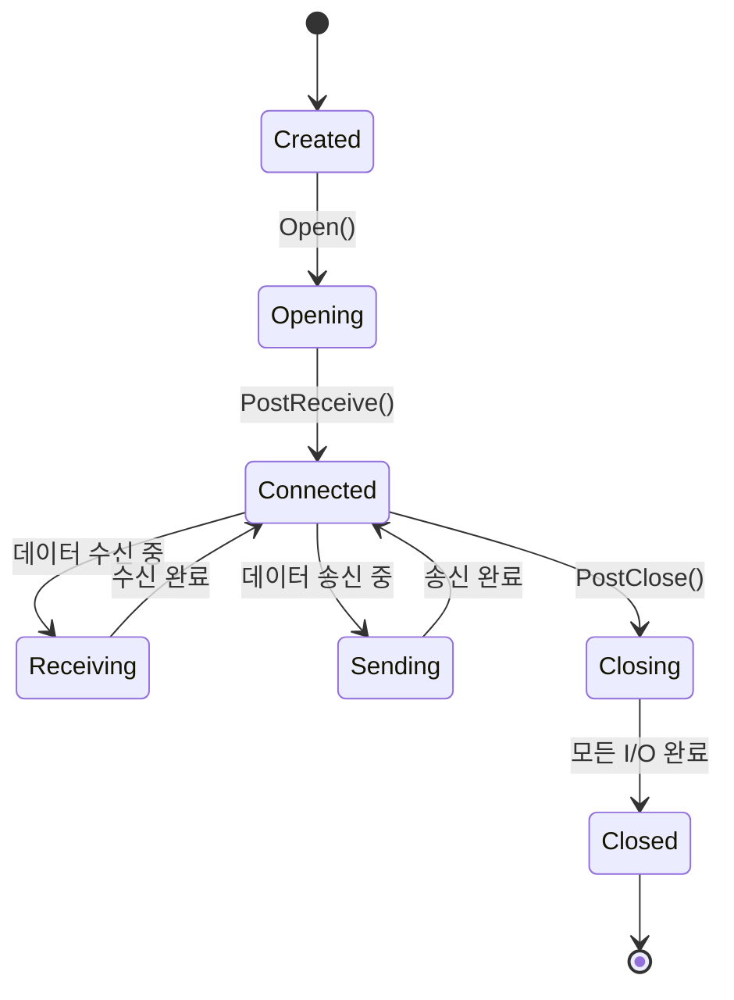

**세션 상태 관리:**
```csharp
// 상태를 관리할 AtomicInt들
private AtomicInt _receiving = new AtomicInt();  // 받기 중?
private AtomicInt _sending = new AtomicInt();    // 보내기 중?
private AtomicInt _closing = new AtomicInt(1);   // 종료 중? (초기값 1)
private AtomicInt _disposed = new AtomicInt();   // 해제됨?
private AtomicInt _updating = new AtomicInt();   // 업데이트 중?
```

**비동기 수신 처리:**
```csharp
public void PostReceive()
{
    if (!IsConnected)
    {
        PostClose(CloseReason.LocalClosing);
        _receiving.Off();
        return;
    }

    bool pending = false;
    try
    {
        pending = Socket.ReceiveAsync(_receiveEventArgs);
    }
    catch (Exception e)
    {
        PostClose(CloseReason.SocketError);
        _receiving.Off();
        return;
    }

    _receiving.On(); // 받기 상태로 설정

    if (!pending) // 즉시 완료된 경우
    {
        CompletedReceive(_receiveEventArgs);
    }
}
```

**수신 완료 처리:**
```csharp
public void CompletedReceive(SocketAsyncEventArgs e)
{
    if (e.BytesTransferred <= 0 || e.SocketError != SocketError.Success)
    {
        PostClose(CloseReason.RemoteClosing);
        _receiving.Off();
        return;
    }

    _lastActivateTime = Environment.TickCount;

    bool eventFire = true;
    if (_messageResolver != null)
    {
        // 메시지 리졸버가 처리하면 이벤트 발생 안함
        if (_messageResolver.OnReceive(this, 
            new ArraySegment<byte>(e.Buffer, e.Offset, e.BytesTransferred)))
        {
            eventFire = false;
        }
    }

    if (eventFire)
    {
        Service.FireReceiveEvent(ID, e.Buffer, e.Offset, e.BytesTransferred);
    }

    PostReceive(); // 다음 수신 요청
}
```

### 3.3 Listener 클래스 - 서버 소켓 관리
`Listener`는 서버 소켓을 관리하고 클라이언트의 연결 요청을 받아들이는 역할을 한다.

```ascii
Listener 동작 흐름:
┌──────────────┐
│ Start()      │ ── 소켓 생성 및 바인딩
└──────┬───────┘
       │
       ▼
┌──────────────┐
│ListenThread  │ ── 백그라운드 스레드 시작
└──────┬───────┘
       │
       ▼
┌──────────────┐    ┌──────────────┐
│AcceptAsync() │───▶│ 연결 대기    │
└──────┬───────┘    └──────────────┘
       │                    │
       ▼                    │
┌───────────────┐           │
│CompletedAccept│◀─────────┘
└──────┬────────┘
       │
       ▼
┌──────────────┐
│NewClient()   │ ── TcpService로 전달
└──────────────┘
```

**핵심 구현:**
```csharp
private void ListenThreadEntry()
{
    try
    {
        _socket = new Socket(AddressFamily.InterNetwork, SocketType.Stream, ProtocolType.Tcp);
        _socket.Bind(EndPoint);
        _socket.Listen(Backlog);
    }
    catch (Exception e)
    {
        _service.Logger.Log(LogLevel.Error, e);
        _startupFinished.Set();
        return;
    }

    SocketAsyncEventArgs eventArgs = new SocketAsyncEventArgs();
    eventArgs.Completed += CompletedAcceptClient;
    IsRunning = true;
    _startupFinished.Set();

    while (!IsStopping)
    {
        bool pending = false;
        try
        {
            eventArgs.AcceptSocket = null;
            pending = _socket.AcceptAsync(eventArgs);
        }
        catch (Exception e)
        {
            _service.Logger.Log(LogLevel.Error, e);
            break;
        }

        if (!pending)
        {
            CompletedAcceptClient(null, eventArgs);
        }

        _connected.WaitOne(); // 연결 완료까지 대기
    }

    IsRunning = false;
}
```

### 3.4 Connector 클래스 - 클라이언트 연결
`Connector`는 다른 서버로의 아웃바운드 연결을 관리한다.

```csharp
private Socket ConnectToserver(IPEndPoint endPoint, int timeoutMs)
{
    Socket socket = new Socket(AddressFamily.InterNetwork, SocketType.Stream, ProtocolType.Tcp);
    try
    {
        socket.Blocking = false;
        socket.Connect(endPoint);
        return socket;
    }
    catch (SocketException socketException)
    {
        if (socketException.ErrorCode != 10035) // WSAEWOULDBLOCK
        {
            socket.Close();
            return null;
        }
    }

    try
    {
        int timeoutMicroseconds = timeoutMs * 1000;
        if (socket.Poll(timeoutMicroseconds, SelectMode.SelectWrite) == false)
        {
            socket.Close();
            return null;
        }

        socket.Blocking = true;
    }
    catch(Exception)
    {
        return null;
    }

    return socket;
}
```

---
  

## 4. 메시지 처리 시스템

### 4.1 메시지 추상화 구조
메시지 시스템은 다양한 프로토콜을 지원하기 위해 추상화되어 있다.

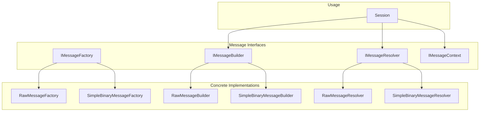

### 4.2 SimpleBinaryMessage 프로토콜
가장 널리 사용되는 바이너리 메시지 프로토콜의 구현을 살펴보겠다.

**프로토콜 구조:**
```ascii
Binary Message Format:
┌─────────────┬─────────────────────────┐
│   Header    │        Payload          │
│  (4 bytes)  │     (variable length)   │
├─────────────┼─────────────────────────┤
│ Data Length │      Actual Data        │
└─────────────┴─────────────────────────┘
```

**SimpleBinaryMessageBuilder:**
```csharp
public void OnSend(IMessageContext context, ref List<ArraySegment<byte>> lists, ArraySegment<byte> payload)
{
    // 헤더 생성 (4바이트 길이 정보)
    byte[] header = context.BufferManager.Take(SimpleBinaryMessageProtocol.HEADERSIZE);
    FastBitConverter.GetBytes(payload.Count, header, 0);
    lists.Add(new ArraySegment<byte>(header, 0, SimpleBinaryMessageProtocol.HEADERSIZE));

    // 페이로드 복사 (제로카피를 위해 ArraySegment 사용)
    byte[] copyPayload = context.BufferManager.Take(payload.Count);
    Array.Copy(payload.Array, payload.Offset, copyPayload, 0, payload.Count);
    lists.Add(new ArraySegment<byte>(copyPayload, 0, payload.Count));
}
```

**SimpleBinaryMessageResolver:**
```csharp
public bool OnReceive(IMessageContext context, ArraySegment<byte> arraySegment)
{
    byte[] srcBuffer = arraySegment.Array;
    int srcEndIdx = arraySegment.Offset + arraySegment.Count;
    
    for (int srcIdx = arraySegment.Offset; srcIdx < srcEndIdx; ++srcIdx)
    {
        // 최대 메시지 크기 검증
        if (_messagePos >= SimpleBinaryMessageProtocol.MAXMESSAGE)
        {
            context.CloseMessageContext(CloseReason.MessageResolveError);
            return true;
        }

        // 바이트 단위로 메시지 버퍼에 복사
        _messageBuffer[_messagePos] = srcBuffer[srcIdx];
        ++_messagePos;

        // 헤더 완성 시 메시지 크기 파싱
        if (_messageSize == 0 && _messagePos >= SimpleBinaryMessageProtocol.HEADERSIZE)
        {
            _messageSize = GetPayloadLength() + SimpleBinaryMessageProtocol.HEADERSIZE;
            
            // 유효성 검증
            if (_messageSize <= 0 || _messageSize >= SimpleBinaryMessageProtocol.MAXMESSAGE)
            {
                context.CloseMessageContext(CloseReason.MessageResolveError);
                return true;
            }
        }

        // 메시지 완성 시 처리
        if (_messageSize != 0 && _messagePos == _messageSize)
        {
            context.CompletedMessage(new ArraySegment<byte>(
                _messageBuffer, 
                SimpleBinaryMessageProtocol.HEADERSIZE, 
                _messageSize - SimpleBinaryMessageProtocol.HEADERSIZE));
            ResetMessageBuffer();
            continue;
        }
    }

    return true; // 메시지 시스템에서 처리했음을 표시
}
```

### 4.3 메시지 처리 흐름

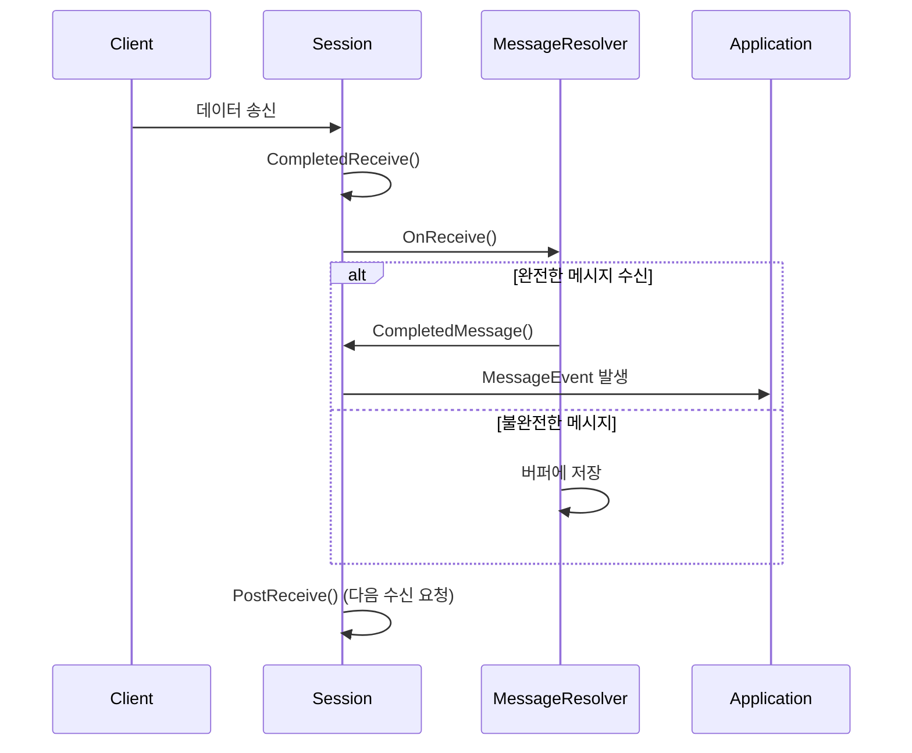

---
  

## 5. 버퍼 관리 시스템

### 5.1 계층적 버퍼 관리
laster40Net은 성능 최적화를 위해 다층적인 버퍼 관리 시스템을 사용한다.

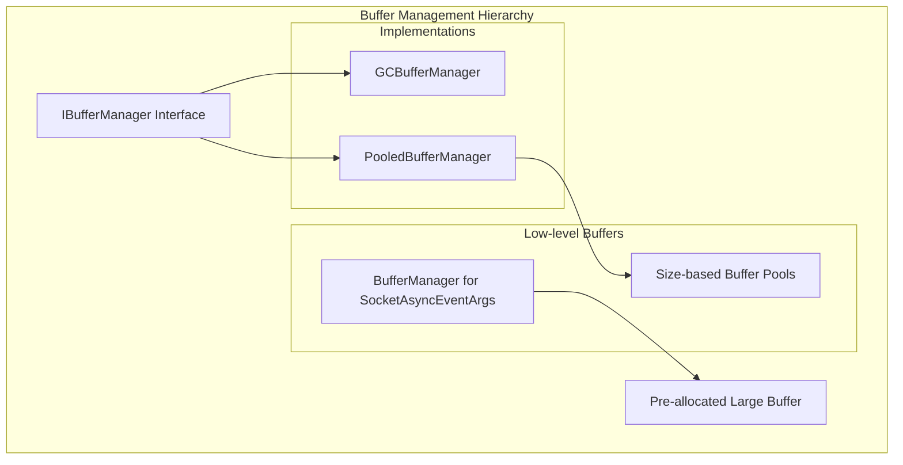

### 5.2 PooledBufferManager 구현
가장 중요한 `PooledBufferManager`의 구현을 자세히 살펴보겠다.

```csharp
public class PooledBufferManager : IBufferManager
{
    private class PooledBuffer : IBufferManager
    {
        public int _allocSize;
        private int _allocCount;
        private int _hitsCount;
        private int _missesCount;
        ConcurrentBag<byte[]> _buffers; // 스레드 안전한 버퍼 컬렉션

        public byte[] Take(int size)
        {
            bool fill = false;
            byte[] buffer;
            
            // 풀에서 버퍼 가져오기 시도
            while (!_buffers.TryTake(out buffer))
            {
                fill = true;
                FillBuffer(); // 풀이 비어있으면 새로 생성
            }
            
            if (fill)
                Interlocked.Increment(ref _missesCount);
            else
                Interlocked.Increment(ref _hitsCount);
                
            return buffer;
        }

        public void Return(byte[] buffer)
        {
            _buffers.Add(buffer); // 버퍼 반환
        }

        private void FillBuffer()
        {
            try
            {
                _buffers.Add(AllocNewBuffer(_allocSize));
                Interlocked.Increment(ref _allocCount);
            }
            catch (Exception)
            {
                Console.WriteLine("Alloc - size:{0},count:{1}", _allocSize, _allocCount);
            }
        }
    }

    private PooledBuffer[] _pools = null;

    public PooledBufferManager(int[] sizeArray)
    {
        Array.Sort(sizeArray); // 크기 순으로 정렬
        
        _pools = new PooledBuffer[sizeArray.Length];
        for (int i = 0; i < sizeArray.Length; ++i)
        {
            _pools[i] = new PooledBuffer(sizeArray[i]);
        }
    }

    public byte[] Take(int size)
    {
        PooledBuffer pooled = FindPool(size);
        if (pooled == null)
            return PooledBuffer.AllocNewBuffer(size); // 풀에 없으면 직접 할당
            
        return pooled.Take(size);
    }

    private PooledBuffer FindPool(int size)
    {
        // 요청된 크기보다 같거나 큰 첫 번째 풀 찾기
        foreach (var buffer in _pools)
        {
            if (size <= buffer._allocSize)
                return buffer;
        }
        return null;
    }
}
```

### 5.3 BufferManager - SocketAsyncEventArgs용
`BufferManager`는 `SocketAsyncEventArgs`를 위한 대용량 연속 버퍼를 관리한다.

```ascii
BufferManager 메모리 레이아웃:
┌─────────────────────────────────────────────────────┐
│                  Large Buffer                       │
├──────────┬──────────┬──────────┬──────────┬─────────┤
│ Session1 │ Session2 │ Session3 │ Session4 │   ...   │
│ Buffer   │ Buffer   │ Buffer   │ Buffer   │         │
│(4KB)     │(4KB)     │(4KB)     │(4KB)     │         │
└──────────┴──────────┴──────────┴──────────┴─────────┘
           ▲          ▲          ▲          ▲
         Offset    Offset+1    Offset+2   Offset+3
```

```csharp
internal class BufferManager
{
    int m_numBytes;                 // 전체 버퍼 크기
    byte[] m_buffer;                // 실제 대용량 버퍼
    Stack<int> m_freeIndexPool;     // 사용 가능한 오프셋들
    int m_currentIndex;             // 현재 할당 위치
    int m_bufferSize;               // 개별 버퍼 크기

    public void InitBuffer()
    {
        m_buffer = new byte[m_numBytes]; // 한 번에 대용량 메모리 할당
    }

    public bool SetBuffer(SocketAsyncEventArgs args)
    {
        if (m_freeIndexPool.Count > 0)
        {
            // 반환된 버퍼 재사용
            args.SetBuffer(m_buffer, m_freeIndexPool.Pop(), m_bufferSize);
        }
        else
        {
            // 새로운 버퍼 할당
            if ((m_numBytes - m_bufferSize) < m_currentIndex)
                return false;
                
            args.SetBuffer(m_buffer, m_currentIndex, m_bufferSize);
            m_currentIndex += m_bufferSize;
        }
        return true;
    }

    public void FreeBuffer(SocketAsyncEventArgs args)
    {
        m_freeIndexPool.Push(args.Offset); // 오프셋만 반환
        args.SetBuffer(null, 0, 0);
    }
}
```

---
  

## 6. 실제 사용 예제

### 6.1 Echo Server 구현
Echo Server는 가장 기본적인 서버 구현 예제이다.

```csharp
class Program
{
    public static TcpService service = null;

    static void ConnectionCallback(long session, bool success, EndPoint address, Object token)
    {
        if (success)
        {
            Console.WriteLine("접속 완료 - id:{0}, remote:{1}", session, address);
        }
        else
        {
            Console.WriteLine("접속 실패 - id:{0}, remote:{1}", session, address);
        }
    }

    static void CloseCallback(long session, CloseReason reason)
    {
        Console.WriteLine("접속 종료 - id:{0}, reason:{1}", session, reason);
    }

    static void ReceiveCallback(long session, byte[] buffer, int offset, int length)
    {
        // 받은 데이터를 그대로 다시 전송 (Echo)
        service.SendToSession(session, buffer, offset, length, true);
    }

    static void Main(string[] args)
    {
        // XML 설정 파일에서 서비스 생성
        service = new TcpService("SimpleEchoServer.xml");
        
        // 이벤트 핸들러 등록
        service.ConnectionEvent += ConnectionCallback;
        service.CloseEvent += CloseCallback;
        service.ReceiveEvent += ReceiveCallback;
        
        // 서비스 시작
        service.Run();

        Console.WriteLine("Echo Server 시작!");

        // 메인 루프
        while (true)
        {
            Thread.Sleep(50);
            
            if (Console.KeyAvailable)
            {
                ConsoleKeyInfo key = Console.ReadKey(true);
                if (key.KeyChar == 'q') break;
                if (key.KeyChar == '1') service.Stop();
                if (key.KeyChar == '2') service.Run();
            }
        }

        service.Stop();
    }
}
```

### 6.2 설정 파일 (SimpleEchoServer.xml)

```xml
<?xml version="1.0" encoding="utf-8"?>
<TcpServiceConfig>
  <ReceviceBuffer>41000</ReceviceBuffer>
  <SendBuffer>41000</SendBuffer>
  <SendCount>100</SendCount>
  <MaxConnectionCount>10</MaxConnectionCount>
  <UpdateSessionIntval>50</UpdateSessionIntval>
  <SessionReceiveTimeout>30000</SessionReceiveTimeout>
  <MessageFactoryAssemblyName>NetService</MessageFactoryAssemblyName>
  <MessageFactoryTypeName>NetService.Message.SimpleBinaryMessageFactory</MessageFactoryTypeName>
  <Log>file</Log>
  <LogLevel>Info</LogLevel>
  <Listeners>
    <Listener>
      <port>11110</port>
      <backlog>128</backlog>
    </Listener>
  </Listeners>
</TcpServiceConfig>
```

### 6.3 Chat Server 구현
더 복잡한 예제로 채팅 서버를 살펴보겠다.

```csharp
public class ChatClient
{
    public long ID { get; set; }
    public string Account { get; set; }
    private TcpService Service { get; set; }

    public ChatClient(TcpService service)
    {
        this.Service = service;
    }

    public void SendObject(int id, Object obj)
    {
        // 실제 구현에서는 직렬화 로직이 들어갑니다
        // 예: ProtoBuf, MessagePack 등
    }
}

public class ChatServer
{
    private ConcurrentDictionary<long, ChatClient> _clients = 
        new ConcurrentDictionary<long, ChatClient>();
    private TcpService Service { get; set; }

    public void HandleNewClient(long session)
    {
        ChatClient client = new ChatClient(Service);
        client.ID = session;
        _clients.TryAdd(session, client);
    }

    public void HandleRemoveClient(long session)
    {
        _clients.TryRemove(session, out ChatClient client);
    }

    public void HandleMessage(long sessionId, byte[] buffer, int offset, int length)
    {
        using (MemoryStream stream = new MemoryStream(buffer, offset, length))
        {
            try
            {
                // 메시지 타입 파싱 및 처리
                // 실제 구현에서는 프로토콜 파서가 들어갑니다
            }
            catch (Exception e)
            {
                // 에러 처리
            }
        }
    }
}
```

---
  

## 7. 성능 최적화 기법

### 7.1 원자적 연산을 통한 락-프리 프로그래밍
`AtomicInt` 클래스는 락 없이 멀티스레드 안전성을 보장한다.

```csharp
public class AtomicInt
{
    private int _value = 0;

    // Compare-And-Swap 연산
    public bool CasOn()
    {
        return Interlocked.CompareExchange(ref _value, 1, 0) == 0;
    }

    public bool CasOff()
    {
        return Interlocked.CompareExchange(ref _value, 0, 1) == 1;
    }

    // 원자적 설정
    public void On() => Interlocked.Exchange(ref _value, 1);
    public void Off() => Interlocked.Exchange(ref _value, 0);
    public bool IsOn() => _value == 1;
}
```

**사용 예제:**
```csharp
// 세션에서 동시 송신 방지
if (!_sending.CasOn())
{
    return; // 이미 송신 중이면 리턴
}

try
{
    // 송신 로직
    bool pending = Socket.SendAsync(_sendEventArgs);
    if (!pending)
    {
        CompletedSend(_sendEventArgs);
    }
}
catch (Exception e)
{
    _sending.Off(); // 에러 시 상태 복원
    PostClose(CloseReason.SocketError);
}
```

### 7.2 고속 바이트 변환
`FastBitConverter`는 포인터를 사용하여 기본 `BitConverter`보다 빠른 성능을 제공한다.

```csharp
public class FastBitConverter
{
    public unsafe static Int32 ToInt32(byte[] value, int startIndex)
    {
        fixed (byte* pointer = &(value[startIndex]))
        {
            return *(((int*)pointer)); // 직접 메모리 접근
        }
    }

    public unsafe static void GetBytes(int value, byte[] buffer, int startIndex)
    {
        fixed (byte* pointer = buffer)
        {
            *((int*)(pointer + startIndex)) = value; // 직접 메모리 쓰기
        }
    }
}
```

### 7.3 메모리 할당 최소화 전략

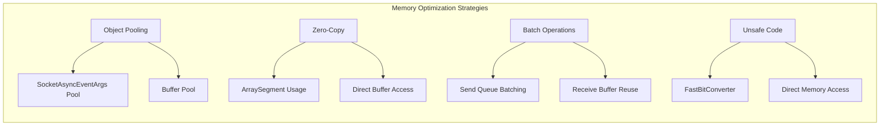

### 7.4 성능 모니터링

```csharp
public override string ToString()
{
    StringBuilder builder = new StringBuilder();
    builder.AppendLine("--------------------------------------------");
    builder.Append("Session Count : ");
    builder.Append(_sessions.Count);
    builder.AppendLine();
    builder.Append(_pooledBufferManager.ToString());
    return builder.ToString();
}
```

**PooledBufferManager 상태 정보:**
```csharp
public string Dump()
{
    return string.Format("alloc size:{0} - count:{1}, free:{2}, hit:{3}, miss:{4}", 
        _allocSize, _allocCount, _buffers.Count, _hitsCount, _missesCount);
}
```

---
  

## 8. 확장성과 설계 원칙

### 8.1 SOLID 원칙 적용

**1. Single Responsibility Principle (단일 책임 원칙)**
- `TcpService`: 전체 서비스 관리
- `Session`: 개별 연결 관리
- `Listener`: 서버 소켓 관리
- `MessageResolver`: 메시지 파싱

**2. Open/Closed Principle (개방/폐쇄 원칙)**
- `IMessageFactory`, `IMessageBuilder`, `IMessageResolver` 인터페이스를 통한 확장
- 새로운 프로토콜 추가 시 기존 코드 수정 없이 확장 가능

**3. Dependency Inversion Principle (의존성 역전 원칙)**
- 구체 클래스가 아닌 인터페이스에 의존
- `IBufferManager`, `ILogger` 등의 추상화 사용

### 8.2 확장 가능한 아키텍처

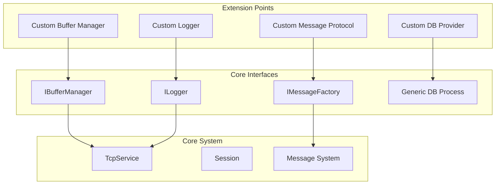

### 8.3 사용자 정의 프로토콜 구현
새로운 메시지 프로토콜을 구현하는 방법:

```csharp
// 1. 메시지 팩토리 구현
public class CustomMessageFactory : IMessageFactory
{
    public IMessageBuilder CreateBuilder()
    {
        return new CustomMessageBuilder();
    }

    public IMessageResolver CreateResolver()
    {
        return new CustomMessageResolver();
    }
}

// 2. 메시지 빌더 구현
public class CustomMessageBuilder : IMessageBuilder
{
    public void OnOpen(IMessageContext context) 
    {
        // 연결 시 초기화
    }

    public void OnSend(IMessageContext context, ref List<ArraySegment<byte>> lists, ArraySegment<byte> payload)
    {
        // 커스텀 헤더 추가
        // 암호화 적용
        // 압축 적용 등
    }

    public void OnClose(IMessageContext context) 
    {
        // 정리 작업
    }
}

// 3. 메시지 리졸버 구현
public class CustomMessageResolver : IMessageResolver
{
    public void OnOpen(IMessageContext context) { }

    public bool OnReceive(IMessageContext context, ArraySegment<byte> arraySegment)
    {
        // 커스텀 파싱 로직
        // 복호화
        // 압축 해제 등
        
        // 완전한 메시지 파싱 시
        context.CompletedMessage(parsedMessage);
        
        return true; // 처리했음을 표시
    }

    public void OnClose(IMessageContext context) { }
}
```

### 8.4 데이터베이스 통합
`DBQueryProcess`는 비동기 데이터베이스 처리를 위한 제네릭 클래스이다.

```csharp
public class DBQueryProcess<TDBConn> where TDBConn : IDbConnection, new()
{
    public void Enqueue(DoDBQuery<TDBConn> query)
    {
        if (!IsRunning) return;
        _queue.Enqueue(query);
        _event.Set(); // 워커 스레드 깨우기
    }

    // 사용 예제
    public void SavePlayerData(PlayerData data)
    {
        dbProcessor.Enqueue((conn) => {
            using (var cmd = conn.CreateCommand())
            {
                cmd.CommandText = "UPDATE Players SET level = @level WHERE id = @id";
                cmd.Parameters.Add(new SqlParameter("@level", data.Level));
                cmd.Parameters.Add(new SqlParameter("@id", data.Id));
                return cmd.ExecuteNonQuery() > 0;
            }
        });
    }
}
```

### 8.5 최적화된 설정 관리
XML 기반 설정과 코드 기반 설정을 모두 지원:

```csharp
// XML 설정 사용
TcpService service = new TcpService("config.xml");

// 코드 설정 사용
TcpServiceConfig config = new TcpServiceConfig
{
    ReceviceBuffer = 4096,
    SendBuffer = 4096,
    MaxConnectionCount = 1000,
    UpdateSessionIntval = 50,
    SessionReceiveTimeout = 30000
};
TcpService service = new TcpService(config);
```

---

## 결론
laster40Net은 C#으로 구현된 고성능 게임서버 네트워크 라이브러리로, 다음과 같은 핵심 특징을 가지고 있습:

1. **고성능 비동기 I/O**: SocketAsyncEventArgs를 활용한 스케일러블한 네트워크 처리
2. **메모리 효율성**: 객체 풀링과 버퍼 재사용을 통한 GC 압박 최소화
3. **확장성**: 인터페이스 기반의 메시지 프로토콜 추상화
4. **안정성**: 원자적 연산을 통한 스레드 안전성 보장
5. **유연성**: XML과 코드 기반 설정, 다양한 로깅 옵션

이 라이브러리는 MMORPG부터 실시간 액션 게임까지 다양한 온라인 게임의 서버 개발에 활용할 수 있으며, 특히 동시 접속자 수가 많은 게임에서 그 진가를 발휘한다.

핵심은 **성능과 확장성의 균형**을 맞춘 설계에 있으며, 개발자는 비즈니스 로직에 집중하면서도 고성능을 달성할 수 있다.
  
-----  

</br>    
</br>    
</br>    
  
  
# 네트워크 데이터 수신부터 처리까지의 완전한 코드 흐름
네트워크로 데이터를 받아서 처리하는 과정은 laster40Net의 핵심 기능이다. 이 과정을 단계별로 자세히 분석해보겠다.
  

## 전체 흐름 다이어그램

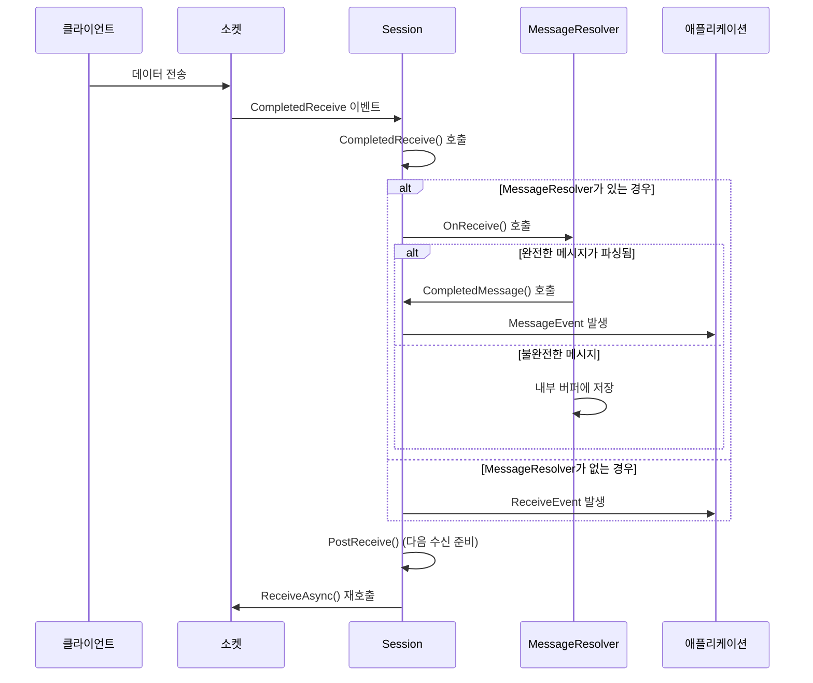

---

## 1. 비동기 수신 준비 단계

### 1.1 세션 초기화 시 수신 준비
세션이 생성되고 `Open()` 메서드가 호출될 때 첫 번째 수신 요청이 시작된다.

```csharp
// Session.cs - Open 메서드
public void Open(SocketAsyncEventArgs receiveEventArgs, SocketAsyncEventArgs sendEventArgs)
{
    _lastActivateTime = Environment.TickCount;
    
    // SocketAsyncEventArgs 초기화
    _receiveEventArgs = receiveEventArgs;
    {
        var token = _receiveEventArgs.UserToken as SessionIOUserToken;
        token.Socket = this.Socket;
        token.Session = this;
    }
    
    // MessageBuilder/Resolver 초기화
    if (_messageBuilder != null)
        _messageBuilder.OnOpen(this);
    if (_messageResolver != null)
        _messageResolver.OnOpen(this);

    // 접속 상태로 변경 (초기값이 On이므로 Off로 설정)
    _closing.Off();

    // 첫 번째 수신 요청 시작
    PostReceive();
    
    // 타이머 시작 (주기적 업데이트용)
    _updateTimer = new Timer(CompletedUpdateTimer, null, 
        Service.Config.UpdateSessionIntval, 
        Service.Config.UpdateSessionIntval);
}
```

### 1.2 PostReceive() - 비동기 수신 요청

```csharp
// Session.cs - PostReceive 메서드
public void PostReceive()
{
    // 접속이 해제 중인 경우 수신 중단
    if (!IsConnected)
    {
        PostClose(CloseReason.LocalClosing);
        _receiving.Off();
        return;
    }

    bool pending = false;
    try
    {
        // 비동기 수신 요청
        pending = Socket.ReceiveAsync(_receiveEventArgs);
        Service.Logger.Log(LogLevel.Debug, 
            string.Format("Session - Receive요청 - ID:{0},pending:{1}", ID, pending));
    }
    catch (Exception e)
    {
        Service.Logger.Log(LogLevel.Debug, "Post Receive에러", e);
        PostClose(CloseReason.SocketError);
        _receiving.Off();
        return;
    }

    // 수신 상태로 설정 (중요: 에러 발생 전에 설정하지 않음)
    _receiving.On();

    // 즉시 완료된 경우 (pending == false)
    if (!pending)
    {
        CompletedReceive(_receiveEventArgs);
    }
}
```

**중요한 포인트:**
- `_receiving.On()`을 `ReceiveAsync()` 호출 후에 설정하여 에러 시 상태 불일치 방지
- `pending` 값에 따라 즉시 완료 처리 또는 비동기 완료 대기

---

## 2. 데이터 수신 완료 처리

### 2.1 CompletedReceive() - 핵심 수신 처리 로직

```csharp
// Session.cs - CompletedReceive 메서드
public void CompletedReceive(SocketAsyncEventArgs e)
{
    Service.Logger.Log(LogLevel.Debug, 
        string.Format("Session - recv완료 - ID:{0},len:{1},offset:{2},error:{3}", 
            ID, e.BytesTransferred, e.Offset, e.SocketError.ToString()));

    // 연결 종료 조건 체크
    if (e.BytesTransferred <= 0 || e.SocketError != SocketError.Success)
    {
        PostClose(CloseReason.RemoteClosing);
        _receiving.Off();
        return;
    }

    // 마지막 활성 시간 업데이트 (좀비 연결 방지용)
    _lastActivateTime = Environment.TickCount;

    bool eventFire = true;
    
    // MessageResolver가 있는 경우 메시지 파싱 시도
    if (_messageResolver != null)
    {
        if (_messageResolver.OnReceive(this, 
            new ArraySegment<byte>(e.Buffer, e.Offset, e.BytesTransferred)))
        {
            eventFire = false; // MessageResolver가 처리했으므로 Raw 이벤트 발생 안함
        }
    }

    // Raw 데이터 이벤트 발생 (MessageResolver가 처리하지 않은 경우)
    if (eventFire)
    {
        Service.FireReceiveEvent(ID, e.Buffer, e.Offset, e.BytesTransferred);
    }

    // 다음 수신 요청
    PostReceive();
}
```

### 2.2 TcpService의 CompletedReceive 이벤트 핸들러

```csharp
// TcpService.cs - CompletedReceive 메서드
internal void CompletedReceive(object sender, SocketAsyncEventArgs e)
{
    var token = e.UserToken as SessionIOUserToken;
    var session = token.Session;

    if (session == null)
        return;

    // 해당 세션의 CompletedReceive 호출
    session.CompletedReceive(e);
}
```

---

## 3. 메시지 파싱 단계 (MessageResolver)

### 3.1 SimpleBinaryMessageResolver의 OnReceive
가장 많이 사용되는 `SimpleBinaryMessageResolver`의 구현을 살펴보겠다.

```csharp
// SimpleBinaryMessage.cs - OnReceive 메서드
public bool OnReceive(IMessageContext context, ArraySegment<byte> arraySegment)
{
    byte[] srcBuffer = arraySegment.Array;
    int srcEndIdx = arraySegment.Offset + arraySegment.Count;
    
    // 받은 데이터를 바이트 단위로 처리
    for (int srcIdx = arraySegment.Offset; srcIdx < srcEndIdx; ++srcIdx)
    {
        // 메시지 버퍼 오버플로우 체크
        if (_messagePos >= SimpleBinaryMessageProtocol.MAXMESSAGE)
        {
            context.CloseMessageContext(CloseReason.MessageResolveError);
            return true;
        }

        // 바이트를 메시지 버퍼에 복사
        _messageBuffer[_messagePos] = srcBuffer[srcIdx];
        ++_messagePos;

        // 헤더 파싱 (첫 4바이트가 완성되면)
        if (_messageSize == 0 && _messagePos >= SimpleBinaryMessageProtocol.HEADERSIZE)
        {
            _messageSize = GetPayloadLength() + SimpleBinaryMessageProtocol.HEADERSIZE;
            
            // 메시지 크기 유효성 검증
            if (_messageSize <= 0 || _messageSize >= SimpleBinaryMessageProtocol.MAXMESSAGE)
            {
                context.CloseMessageContext(CloseReason.MessageResolveError);
                return true;
            }
        }

        // 완전한 메시지가 수신된 경우
        if (_messageSize != 0 && _messagePos == _messageSize)
        {
            // 헤더를 제외한 페이로드만 전달
            context.CompletedMessage(new ArraySegment<byte>(
                _messageBuffer, 
                SimpleBinaryMessageProtocol.HEADERSIZE, 
                _messageSize - SimpleBinaryMessageProtocol.HEADERSIZE));
            
            // 다음 메시지를 위해 버퍼 리셋
            ResetMessageBuffer();
            continue;
        }
    }

    return true; // MessageResolver가 데이터를 처리했음을 표시
}

private int GetPayloadLength()
{
    // FastBitConverter를 사용한 고속 바이트 변환
    return FastBitConverter.ToInt32(_messageBuffer, 0);
}

private void ResetMessageBuffer()
{
    _messagePos = 0;
    _messageSize = 0;
}
```

### 3.2 메시지 파싱 상태 머신

```ascii
Message Parsing State Machine:

┌─────────────┐    수신 데이터    ┌─────────────┐
│    대기     │ ──────────────▶ │ 헤더 파싱   │
│   상태      │                  │   상태      │
└─────────────┘                  └──────┬──────┘
                                        │
                                        ▼ 헤더 완성
                                  ┌─────────────┐
                                  │ 페이로드     │
                                  │ 수집 상태    │
                                  └──────┬──────┘
                                         │
                                         ▼ 메시지 완성
                                  ┌─────────────┐
                                  │ 메시지 완료   │ ──┐
                                  │   처리       │   │
                                  └─────────────┘   │
                                         │          │
                                         ▼          │
                                  ┌─────────────┐   │
                                  │ 버퍼 리셋    │ ──┘
                                  └─────────────┘
```

---

## 4. 완성된 메시지 처리

### 4.1 Session의 CompletedMessage

```csharp
// Session.cs - CompletedMessage 메서드
public void CompletedMessage(ArraySegment<byte> message)
{
    // TcpService의 MessageEvent 발생
    Service.FireMessageEvent(ID, message.Array, message.Offset, message.Count);
}
```

### 4.2 TcpService의 이벤트 발생

```csharp
// TcpService.cs - 이벤트 발생 메서드들
internal void FireReceiveEvent(long Id, byte[] buffer, int offset, int length)
{
    if (this.ReceiveEvent != null)
    {
        this.ReceiveEvent(Id, buffer, offset, length);
    }
}

internal void FireMessageEvent(long Id, byte[] buffer, int offset, int length)
{
    if (this.MessageEvent != null)
    {
        this.MessageEvent(Id, buffer, offset, length);
    }
}
```

---

## 5. 애플리케이션 레벨 처리

### 5.1 Echo Server 예제

```csharp
// Echo Server의 콜백 함수
static void ReceiveCallback(long session, byte[] buffer, int offset, int length)
{
    // Raw 데이터를 받았을 때 (MessageResolver가 없는 경우)
    service.SendToSession(session, buffer, offset, length, true);
}

static void MessageCallback(long session, byte[] buffer, int offset, int length)
{
    // 완성된 메시지를 받았을 때
    Console.WriteLine("완성된 메시지 수신 - Session:{0}, Length:{1}", session, length);
    service.SendToSession(session, buffer, offset, length, true);
}
```

### 5.2 Chat Server 예제

```csharp
// Chat Server의 메시지 처리
public void HandleMessage(long sessionId, byte[] buffer, int offset, int length)
{
    using (MemoryStream stream = new MemoryStream(buffer, offset, length))
    {
        try
        {
            // 실제 구현에서는 프로토콜 파서 사용
            // 예: ProtoBuf, MessagePack, JSON 등
            
            // 메시지 타입 파싱
            // int messageType = BinaryReader.ReadInt32();
            
            // switch (messageType)
            // {
            //     case MSG_CHAT:
            //         HandleChatMessage(sessionId, stream);
            //         break;
            //     case MSG_LOGIN:
            //         HandleLoginMessage(sessionId, stream);
            //         break;
            // }
        }
        catch (Exception e)
        {
            // 파싱 에러 처리
            Console.WriteLine("메시지 파싱 에러: {0}", e.Message);
        }
    }
}
```

---

## 6. 상세한 데이터 흐름 분석

### 6.1 메모리 관리 관점에서의 데이터 흐름

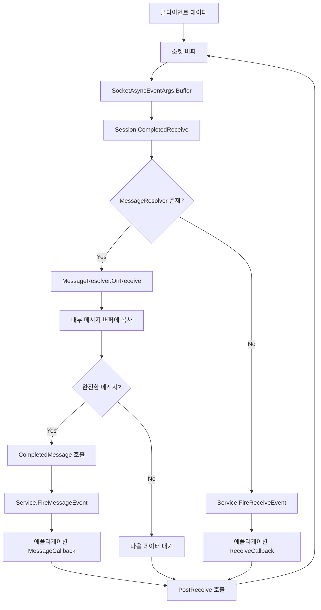

### 6.2 버퍼 사용 패턴

```ascii
Buffer Usage Pattern:

1. 소켓 레벨 버퍼 (OS 관리)
   ┌─────────────────────────────────┐
   │ OS Socket Receive Buffer        │
   └─────────────────────────────────┘
                    │
                    ▼ 데이터 복사
2. SocketAsyncEventArgs 버퍼 (BufferManager 관리)
   ┌─────────────────────────────────┐
   │ Pre-allocated Buffer Pool       │
   │ ┌─────┬─────┬─────┬─────┬─────┐ │
   │ │ 4KB │ 4KB │ 4KB │ 4KB │ ... │ │
   │ └─────┴─────┴─────┴─────┴─────┘ │
   └─────────────────────────────────┘
                    │
                    ▼ ArraySegment로 참조
3. MessageResolver 내부 버퍼
   ┌─────────────────────────────────┐
   │ Message Assembly Buffer         │
   │ ┌─────┬─────────────────────┐   │
   │ │Head │      Payload        │   │
   │ │4byte│    (variable)       │   │
   │ └─────┴─────────────────────┘   │
   └─────────────────────────────────┘
                    │
                    ▼ 완성된 메시지
4. 애플리케이션 레벨
   ┌─────────────────────────────────┐
   │ Parsed Message Object           │
   └─────────────────────────────────┘
```

### 6.3 스레드 안전성 분석

```csharp
// 수신 처리에서의 스레드 안전성 보장

// 1. 원자적 상태 체크
if (!IsConnected) // _closing.IsOn()의 원자적 읽기
{
    PostClose(CloseReason.LocalClosing);
    _receiving.Off(); // 원자적 쓰기
    return;
}

// 2. 중복 수신 방지
_receiving.On(); // Compare-And-Swap 연산으로 구현

// 3. 세션 상태 동기화
if (e.BytesTransferred <= 0 || e.SocketError != SocketError.Success)
{
    PostClose(CloseReason.RemoteClosing); // 원자적 종료 요청
    _receiving.Off(); // 수신 상태 해제
    return;
}
```

### 6.4 에러 처리 및 복구

```csharp
// 다양한 에러 시나리오별 처리

// 1. 소켓 에러
try
{
    pending = Socket.ReceiveAsync(_receiveEventArgs);
}
catch (Exception e)
{
    Service.Logger.Log(LogLevel.Debug, "Post Receive에러", e);
    PostClose(CloseReason.SocketError);
    _receiving.Off();
    return;
}

// 2. 메시지 파싱 에러
if (_messageSize <= 0 || _messageSize >= SimpleBinaryMessageProtocol.MAXMESSAGE)
{
    context.CloseMessageContext(CloseReason.MessageResolveError);
    return true;
}

// 3. 버퍼 오버플로우
if (_messagePos >= SimpleBinaryMessageProtocol.MAXMESSAGE)
{
    context.CloseMessageContext(CloseReason.MessageResolveError);
    return true;
}
```

---

## 7. 성능 최적화 포인트

### 7.1 제로 카피 최적화

```csharp
// ArraySegment를 사용한 제로 카피
ArraySegment<byte> receivedData = new ArraySegment<byte>(
    e.Buffer,      // 원본 버퍼 참조
    e.Offset,      // 시작 위치
    e.BytesTransferred // 길이
);

// 복사 없이 MessageResolver에 전달
_messageResolver.OnReceive(this, receivedData);
```

### 7.2 배치 처리 최적화

```csharp
// 한 번의 수신으로 여러 메시지 처리
for (int srcIdx = arraySegment.Offset; srcIdx < srcEndIdx; ++srcIdx)
{
    _messageBuffer[_messagePos] = srcBuffer[srcIdx];
    ++_messagePos;

    // 메시지 완성 시 즉시 처리하고 다음 메시지 파싱 계속
    if (_messageSize != 0 && _messagePos == _messageSize)
    {
        context.CompletedMessage(new ArraySegment<byte>(...));
        ResetMessageBuffer();
        continue; // 같은 수신 데이터에서 다음 메시지 파싱
    }
}
```

### 7.3 메모리 풀 활용

```csharp
// 메시지 완료 시 버퍼 관리
public void CompletedMessage(ArraySegment<byte> message)
{
    // 애플리케이션으로 전달
    Service.FireMessageEvent(ID, message.Array, message.Offset, message.Count);
    
    // 참고: message.Array는 MessageResolver의 내부 버퍼이므로
    // 애플리케이션에서 데이터를 복사해서 사용해야 함
}
```

---

## 8. 실제 사용 시나리오

### 8.1 단일 패킷 수신

```ascii
시나리오: 클라이언트가 "Hello" 메시지 전송

1. 클라이언트: [4][H][e][l][l][o] (총 6바이트)
2. 소켓 수신: 6바이트 한 번에 수신
3. MessageResolver:
   - 1바이트: [4] → _messageBuffer[0] = 4
   - 2바이트: [0] → _messageBuffer[1] = 0  
   - 3바이트: [0] → _messageBuffer[2] = 0
   - 4바이트: [0] → _messageBuffer[3] = 0
   - 헤더 완성: _messageSize = 4 + 4 = 8
   - 5바이트: [H] → _messageBuffer[4] = 'H'
   - 6바이트: [e] → _messageBuffer[5] = 'e'
   - 7바이트: [l] → _messageBuffer[6] = 'l'
   - 8바이트: [l] → _messageBuffer[7] = 'l'
   - 9바이트: [o] → _messageBuffer[8] = 'o'
   - 메시지 완성: CompletedMessage("Hello")
```

### 8.2 분할 수신 시나리오

```ascii
시나리오: 대용량 메시지가 여러 번에 나누어 수신

1. 첫 번째 수신: [100][0][0][0][데이터1...데이터50] (54바이트)
   - 헤더 파싱: 메시지 크기 = 104바이트
   - 50바이트 데이터 버퍼에 저장
   - 아직 불완전 → 다음 수신 대기

2. 두 번째 수신: [데이터51...데이터100] (50바이트)
   - 나머지 50바이트 버퍼에 추가
   - 메시지 완성 → CompletedMessage() 호출
```

### 8.3 다중 메시지 수신

```ascii
시나리오: 한 번의 수신으로 여러 메시지 도착

수신 데이터: [4][0][0][0][H][i][3][0][0][0][B][y][e]

처리 과정:
1. 첫 번째 메시지 파싱:
   - 헤더: [4][0][0][0] → 크기 4
   - 데이터: [H][i] → "Hi" 완성
   - CompletedMessage("Hi") 호출

2. 두 번째 메시지 파싱:
   - 헤더: [3][0][0][0] → 크기 3  
   - 데이터: [B][y][e] → "Bye" 완성
   - CompletedMessage("Bye") 호출
```

---

이것이 laster40Net에서 네트워크 데이터를 받아서 처리하는 전체 흐름이다. 핵심은 **비동기 I/O**, **효율적인 메모리 관리**, **확장 가능한 메시지 파싱**이며, 이를 통해 고성능 게임서버를 구현할 수 있다.
  
-----  

</br>      
</br>      
</br>      
  
  
# 네트워크 Send 호출부터 실제 데이터 전송까지의 완전한 코드 흐름
네트워크 데이터 전송은 laster40Net에서 매우 정교하게 설계된 부분이다. 큐잉, 배치 처리, 비동기 전송까지의 전체 과정을 단계별로 분석해보겠다.

## 전체 Send 흐름 다이어그램

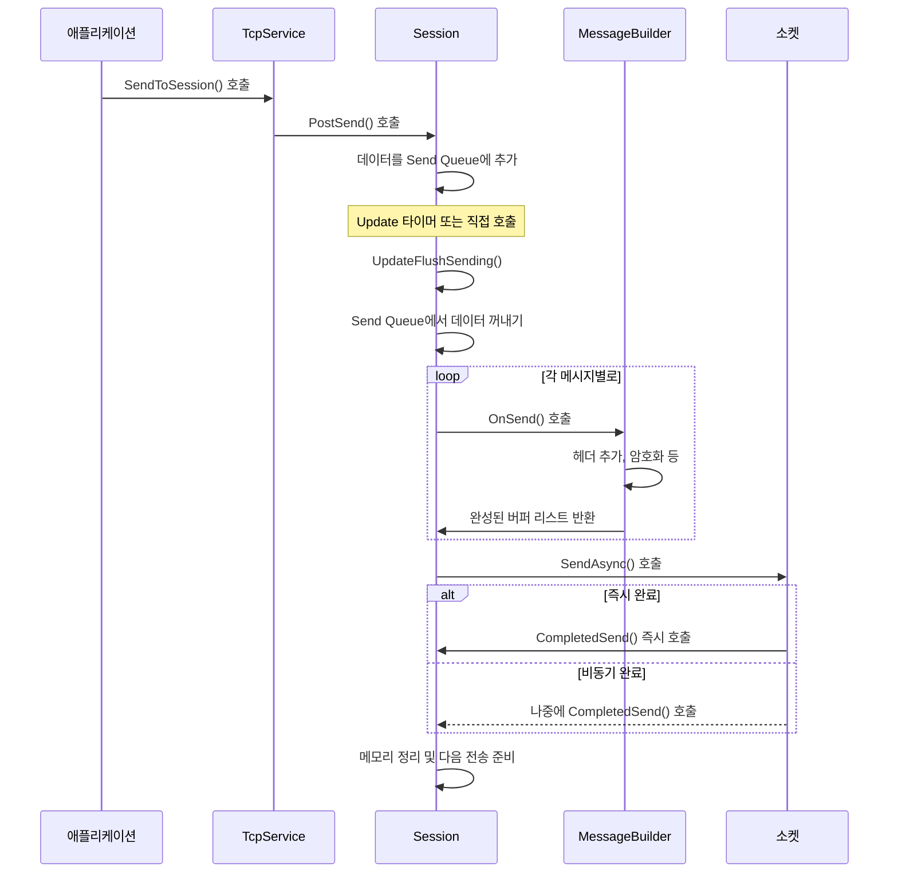

---

## 1. 애플리케이션 레벨에서 전송 요청

### 1.1 TcpService.SendToSession() 호출

```csharp
// TcpService.cs - SendToSession 메서드
public void SendToSession(long id, byte[] buffer, int offset, int length, bool directly)
{
    // 세션 검색
    if (_sessions.TryGetValue(id, out var session))
    {
        // 해당 세션의 PostSend 호출
        session.PostSend(buffer, offset, length, directly);
    }
    // 세션이 없으면 무시 (이미 연결이 끊어진 경우)
}
```

**파라미터 의미:**
- `id`: 대상 세션 ID
- `buffer`: 전송할 데이터
- `offset`: 버퍼 시작 위치
- `length`: 전송할 데이터 길이
- `directly`: `true`면 즉시 전송, `false`면 배치로 모아서 전송

### 1.2 사용 예제

```csharp
// Echo Server 예제
static void ReceiveCallback(long session, byte[] buffer, int offset, int length)
{
    // 받은 데이터를 즉시 다시 전송
    service.SendToSession(session, buffer, offset, length, true);
}

// Chat Server 예제  
public void BroadcastMessage(string message)
{
    byte[] data = Encoding.UTF8.GetBytes(message);
    foreach (var sessionId in _connectedSessions)
    {
        // 모든 클라이언트에게 브로드캐스트 (배치 전송)
        service.SendToSession(sessionId, data, 0, data.Length, false);
    }
}
```

---

## 2. Session 레벨 전송 처리

### 2.1 PostSend() - 전송 큐에 데이터 추가

```csharp
// Session.cs - PostSend 메서드
public void PostSend(byte[] buffer, int offset, int length, bool directly)
{
    // 연결 상태 체크
    if (!IsConnected)
        return;

    // 전송 데이터 크기 제한 체크
    if (length > Service.Config.SendBuffer)
        return;

    // 큐 크기 제한 체크 (메모리 보호)
    if (_sendQueue.Count + 1 > Service.Config.SendCount)
        return;

    // 메모리 할당 및 데이터 복사
    var copy = Service._pooledBufferManager.Take(length);
    Array.Copy(buffer, offset, copy, 0, length);
    
    // 전송 큐에 추가 (스레드 안전)
    _sendQueue.Enqueue(new ArraySegment<byte>(copy, 0, length));

    // 즉시 전송 요청
    if (directly)
    {
        UpdateFlushSending();
    }
    // 배치 전송의 경우 타이머에 의해 주기적으로 처리됨
}
```

**중요한 설계 포인트:**
1. **데이터 복사**: 원본 버퍼를 안전하게 보호하기 위해 복사본 생성
2. **메모리 풀 사용**: `PooledBufferManager`에서 효율적으로 메모리 할당
3. **큐 크기 제한**: 메모리 오버플로우 방지
4. **스레드 안전성**: `ConcurrentQueue` 사용

### 2.2 Send Queue 구조

```ascii
Send Queue 구조:
┌─────────────────────────────────────────────────────┐
│                ConcurrentQueue                      │
├─────────────┬─────────────┬─────────────┬─────────┤
│ArraySegment │ArraySegment │ArraySegment │   ...   │
│   Message1  │   Message2  │   Message3  │         │
├─────────────┼─────────────┼─────────────┼─────────┤
│┌───────────┐│┌───────────┐│┌───────────┐│         │
││PooledBuf  ││││PooledBuf  ││││PooledBuf  ││         │
││  (copy)   ││││  (copy)   ││││  (copy)   ││         │
│└───────────┘││└───────────┘││└───────────┘│         │
└─────────────┴─────────────┴─────────────┴─────────┘
```

---

## 3. 배치 전송 처리

### 3.1 Update 메커니즘
세션은 주기적으로 `Update()`가 호출되어 전송 처리를 수행한다.

```csharp
// Session.cs - Update 메서드
private void Update()
{
    // 타이머가 dispose된 후에도 호출될 수 있으므로 체크
    if (_disposed.IsOn())
        return;

    // 중복 업데이트 방지 (원자적 연산)
    if (!_updating.CasOn())
        return;

    try
    {
        // 1. 전송 대기 중인 데이터 처리
        UpdateFlushSending();

        // 2. 좀비 연결 체크 및 정리
        UpdateZombie();

        // 3. 연결 종료 처리
        UpdateClosing();
    }
    finally
    {
        _updating.Off();
    }
}

// 타이머 콜백
public void CompletedUpdateTimer(Object e)
{
    Update();
}
```

### 3.2 UpdateFlushSending() - 실제 전송 처리

```csharp
// Session.cs - UpdateFlushSending 메서드
private void UpdateFlushSending()
{
    // 연결 상태 체크
    if (!IsConnected)
        return;

    // 전송할 데이터가 없으면 리턴
    if (_sendQueue.Count <= 0)
        return;

    // 이미 전송 중이면 리턴 (원자적 체크)
    if (!_sending.CasOn())
        return;

    // 전송용 리스트 초기화
    _sendingArraySegmentList.Clear();

    // 큐에서 모든 데이터를 꺼내서 리스트로 구성
    ArraySegment<byte> arraySeg;
    while (_sendQueue.TryDequeue(out arraySeg))
    {
        if (_messageBuilder != null)
        {
            // MessageBuilder가 있으면 메시지 빌딩 처리
            _messageBuilder.OnSend(this, ref _sendingArraySegmentList, arraySeg);
        }
        else
        {
            // Raw 데이터 그대로 전송
            _sendingArraySegmentList.Add(arraySeg);
        }
    }

    // SocketAsyncEventArgs에 버퍼 리스트 설정
    _sendEventArgs.BufferList = _sendingArraySegmentList;

    try
    {
        // 비동기 전송 시작
        bool pending = Socket.SendAsync(_sendEventArgs);
        if (!pending)
        {
            // 즉시 완료된 경우
            CompletedSend(_sendEventArgs);
        }
    }
    catch (Exception e)
    {
        // 전송 실패 시 메모리 정리
        foreach (var buf in _sendEventArgs.BufferList)
        {
            Service._pooledBufferManager.Return(buf.Array);
        }

        _sending.Off();
        PostClose(CloseReason.SocketError);

        Service.Logger.Log(LogLevel.Error, "Session - 패킷전송 실패!", e);
    }
}
```

---

## 4. 메시지 빌더를 통한 프로토콜 처리

### 4.1 SimpleBinaryMessageBuilder 구현

```csharp
// SimpleBinaryMessage.cs - OnSend 메서드
public void OnSend(IMessageContext context, ref List<ArraySegment<byte>> lists, ArraySegment<byte> payload)
{
    // 1. 헤더 생성 (4바이트 길이 정보)
    byte[] header = context.BufferManager.Take(SimpleBinaryMessageProtocol.HEADERSIZE);
    FastBitConverter.GetBytes(payload.Count, header, 0);
    lists.Add(new ArraySegment<byte>(header, 0, SimpleBinaryMessageProtocol.HEADERSIZE));

    // 2. 페이로드 복사 
    byte[] copyPayload = context.BufferManager.Take(payload.Count);
    Array.Copy(payload.Array, payload.Offset, copyPayload, 0, payload.Count);
    lists.Add(new ArraySegment<byte>(copyPayload, 0, payload.Count));
}
```

### 4.2 메시지 빌딩 과정

```ascii
MessageBuilder 처리 과정:

입력: "Hello" (5바이트)
┌─────────────────────────┐
│ ArraySegment<byte>      │
│ [H][e][l][l][o]        │
└─────────────────────────┘
            │
            ▼ OnSend() 호출
┌─────────────────────────┐    ┌─────────────────────────┐
│ Header Buffer           │    │ Payload Buffer          │
│ [5][0][0][0]           │    │ [H][e][l][l][o]        │
│ (4 bytes)              │    │ (5 bytes)              │
└─────────────────────────┘    └─────────────────────────┘
            │                              │
            └──────────────┬───────────────┘
                          ▼
            ┌─────────────────────────┐
            │ BufferList              │
            │ [헤더] [페이로드]       │
            │ 총 9바이트              │
            └─────────────────────────┘
```

### 4.3 RawMessageBuilder vs SimpleBinaryMessageBuilder

```csharp
// RawMessageBuilder - 헤더 없이 그대로 전송
public void OnSend(IMessageContext context, ref List<ArraySegment<byte>> lists, ArraySegment<byte> payload)
{
    // 단순히 데이터 복사만 수행
    byte[] copyPayload = context.BufferManager.Take(payload.Count);
    Array.Copy(payload.Array, payload.Offset, copyPayload, 0, payload.Count);
    lists.Add(new ArraySegment<byte>(copyPayload, 0, payload.Count));
}

// SimpleBinaryMessageBuilder - 4바이트 헤더 추가
public void OnSend(IMessageContext context, ref List<ArraySegment<byte>> lists, ArraySegment<byte> payload)
{
    // 헤더 + 페이로드 구조로 변환
    byte[] header = context.BufferManager.Take(4);
    FastBitConverter.GetBytes(payload.Count, header, 0);
    lists.Add(new ArraySegment<byte>(header, 0, 4));
    
    byte[] copyPayload = context.BufferManager.Take(payload.Count);
    Array.Copy(payload.Array, payload.Offset, copyPayload, 0, payload.Count);
    lists.Add(new ArraySegment<byte>(copyPayload, 0, payload.Count));
}
```

---

## 5. 소켓 레벨 비동기 전송

### 5.1 SocketAsyncEventArgs 설정

```csharp
// UpdateFlushSending에서 BufferList 설정
_sendEventArgs.BufferList = _sendingArraySegmentList;

// BufferList 구조 예시:
// _sendingArraySegmentList = [
//     ArraySegment(header1, 0, 4),     // 첫 번째 메시지 헤더
//     ArraySegment(payload1, 0, 10),   // 첫 번째 메시지 데이터
//     ArraySegment(header2, 0, 4),     // 두 번째 메시지 헤더  
//     ArraySegment(payload2, 0, 8),    // 두 번째 메시지 데이터
//     ...
// ]
```

### 5.2 Socket.SendAsync() 호출

```csharp
try
{
    bool pending = Socket.SendAsync(_sendEventArgs);
    if (!pending)
    {
        // 즉시 완료: 동기적으로 전송 완료됨
        CompletedSend(_sendEventArgs);
    }
    // pending == true인 경우: 비동기로 처리되며 나중에 Completed 이벤트 발생
}
catch (Exception e)
{
    // 소켓 에러 처리
    // 메모리 해제 및 연결 종료
}
```

### 5.3 실제 네트워크 전송

```ascii
소켓 레벨 전송 과정:

애플리케이션 버퍼:
┌────┬─────────┬────┬────────┐
│ H1 │   D1    │ H2 │   D2   │  (BufferList)
└────┴─────────┴────┴────────┘
  4B     10B     4B     8B
          │
          ▼ Socket.SendAsync()
┌─────────────────────────────┐
│    OS Socket Send Buffer    │  
│ ┌────┬─────────┬────┬────┐  │
│ │ H1 │   D1    │ H2 │ D2 │  │
│ └────┴─────────┴────┴────┘  │
└─────────────────────────────┘
          │
          ▼ TCP 계층에서 처리
┌─────────────────────────────┐
│       TCP Segments          │
│ ┌─────────┬─────────┬─────┐ │
│ │ Seg1    │ Seg2    │ ... │ │
│ └─────────┴─────────┴─────┘ │
└─────────────────────────────┘
          │
          ▼ 네트워크로 전송
     클라이언트로 전달
```

---

## 6. 전송 완료 처리

### 6.1 CompletedSend() 콜백

```csharp
// Session.cs - CompletedSend 메서드
public void CompletedSend(SocketAsyncEventArgs e)
{
    Service.Logger.Log(LogLevel.Debug, 
        string.Format("Session - send완료 - ID:{0},len:{1},offset:{2},error:{3}", 
            ID, e.BytesTransferred, e.Offset, e.SocketError.ToString()));

    // 전송에 사용된 버퍼들 메모리 해제
    if (e.BufferList != null)
    {
        // 버퍼 개수 검증 (디버깅용)
        if (e.BufferList.Count != _sendingArraySegmentList.Count)
        {
            Console.WriteLine("보내기 갯수가 안맞네요");
        }

        // 각 버퍼를 풀에 반환하고 SendEvent 발생
        foreach (var buf in _sendingArraySegmentList)
        {
            Service._pooledBufferManager.Return(buf.Array);
            Service.FireSendEvent(ID, buf.Array, buf.Offset, buf.Count);
        }

        _sendingArraySegmentList.Clear();
    }

    // 전송 상태 해제
    _sending.Off();

    // 전송 에러 체크
    if (e.BytesTransferred <= 0 || e.SocketError != SocketError.Success)
    {
        PostClose(CloseReason.LocalClosing);
        return;
    }

    // 마지막 활성 시간 업데이트
    _lastActivateTime = Environment.TickCount;

    // 주의: 여기서 UpdateFlushSending()을 호출하지 않음
    // 다음 Update 주기에서 남은 데이터 처리
}
```

### 6.2 TcpService의 CompletedSend 이벤트 핸들러

```csharp
// TcpService.cs - CompletedSend 메서드
internal void CompletedSend(object sender, SocketAsyncEventArgs e)
{
    var token = e.UserToken as SessionIOUserToken;
    var session = token.Session;

    if (session == null)
        return;

    // 해당 세션의 CompletedSend 호출
    session.CompletedSend(e);
}
```

---

## 7. 메모리 관리 및 최적화

### 7.1 메모리 생명주기

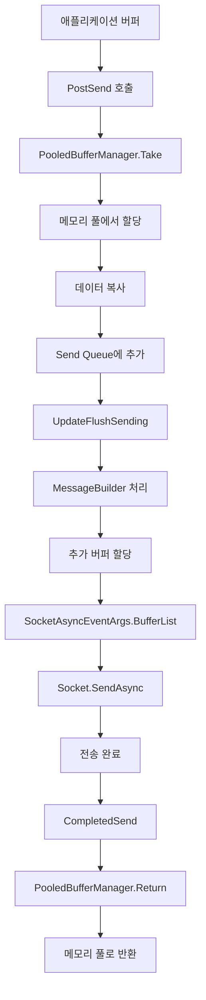

### 7.2 배치 전송의 이점

```ascii
배치 전송 vs 즉시 전송:

즉시 전송 (directly = true):
App→PostSend→Queue→즉시Flush→Socket
      ↓
시스템 콜 호출 빈도 높음, CPU 오버헤드 증가

배치 전송 (directly = false):  
App→PostSend→Queue
App→PostSend→Queue  } 50ms 주기로
App→PostSend→Queue  } 모아서 처리
      ↓
타이머→UpdateFlushSending→Socket
      ↓
시스템 콜 호출 빈도 낮음, 처리량 증가
```

### 7.3 BufferList의 장점

```csharp
// BufferList 사용의 이점:

// 1. Scatter-Gather I/O 지원
// 여러 버퍼를 한 번의 시스템 콜로 전송 가능

// 2. 메모리 연속성 불필요
// 헤더와 페이로드가 다른 위치에 있어도 OK

// 3. 제로 카피 최적화
// 데이터 재배치 없이 직접 소켓으로 전송

// 예시:
_sendEventArgs.BufferList = new List<ArraySegment<byte>>
{
    new ArraySegment<byte>(headerBuffer, 0, 4),    // 헤더
    new ArraySegment<byte>(payloadBuffer, 0, 100), // 페이로드
    new ArraySegment<byte>(headerBuffer2, 0, 4),   // 다음 헤더
    new ArraySegment<byte>(payloadBuffer2, 0, 50)  // 다음 페이로드
};
// → 총 158바이트를 한 번의 SendAsync로 전송
```

---

## 8. 다양한 전송 시나리오

### 8.1 고빈도 작은 메시지 전송

```csharp
// 게임에서 플레이어 위치 업데이트 (초당 30회)
public void SendPlayerPosition(long sessionId, float x, float y, float z)
{
    byte[] posData = new byte[12];
    BitConverter.GetBytes(x).CopyTo(posData, 0);
    BitConverter.GetBytes(y).CopyTo(posData, 4);
    BitConverter.GetBytes(z).CopyTo(posData, 8);
    
    // 배치 전송으로 네트워크 효율성 향상
    service.SendToSession(sessionId, posData, 0, 12, false);
}
```

### 8.2 대용량 파일 전송

```csharp
// 큰 파일을 청크로 나누어서 전송
public void SendLargeFile(long sessionId, byte[] fileData)
{
    const int CHUNK_SIZE = 4096;
    
    for (int offset = 0; offset < fileData.Length; offset += CHUNK_SIZE)
    {
        int chunkSize = Math.Min(CHUNK_SIZE, fileData.Length - offset);
        
        // 각 청크를 즉시 전송하여 플로우 컨트롤
        service.SendToSession(sessionId, fileData, offset, chunkSize, true);
        
        // 너무 빠른 전송 방지를 위한 약간의 지연
        Thread.Sleep(1);
    }
}
```

### 8.3 브로드캐스트 메시지

```csharp
// 채팅 메시지를 모든 클라이언트에게 브로드캐스트
public void BroadcastChatMessage(string sender, string message)
{
    // 메시지 직렬화
    var chatData = SerializeChatMessage(sender, message);
    
    // 모든 세션에 배치 전송
    foreach (var sessionId in _connectedSessions)
    {
        service.SendToSession(sessionId, chatData, 0, chatData.Length, false);
    }
    
    // 모든 큐잉이 완료된 후 일괄 플러시 (선택적)
    // FlushAllPendingSends();
}
```

---

## 9. 성능 최적화 및 모니터링

### 9.1 전송 성능 지표

```csharp
// Session 클래스에 성능 측정 추가 (예시)
public class SessionPerformanceStats
{
    public long TotalBytesSent { get; set; }
    public long TotalMessagesSent { get; set; }
    public long SendQueuePeakSize { get; set; }
    public TimeSpan AverageSendTime { get; set; }
    public int SendErrors { get; set; }
}

// 전송 성능 모니터링
private void MonitorSendPerformance()
{
    var stats = new SessionPerformanceStats
    {
        TotalBytesSent = _totalBytesSent,
        TotalMessagesSent = _totalMessagesSent,
        SendQueuePeakSize = _sendQueuePeakSize,
        SendErrors = _sendErrors
    };
    
    Service.Logger.Log(LogLevel.Info, $"세션 {ID} 전송 통계: {stats}");
}
```

### 9.2 병목 지점 식별

```ascii
전송 과정의 잠재적 병목 지점:

1. PostSend 단계:
   - 메모리 할당 속도 (PooledBufferManager)
   - 큐 추가 속도 (ConcurrentQueue)

2. UpdateFlushSending 단계:
   - MessageBuilder 처리 속도
   - 큐 디큐 속도
   - BufferList 구성 속도

3. Socket.SendAsync 단계:
   - OS 소켓 버퍼 크기
   - 네트워크 대역폭
   - TCP 윈도우 크기

4. CompletedSend 단계:
   - 메모리 반환 속도
   - 이벤트 처리 속도
```

### 9.3 최적화 전략

```csharp
// 1. Send Queue 크기 튜닝
config.SendCount = 1000; // 큐 크기 조정

// 2. Update 주기 조정  
config.UpdateSessionIntval = 16; // 60FPS 게임의 경우

// 3. 버퍼 풀 크기 최적화
int[] poolSizes = new int[] { 64, 256, 1024, 4096, 16384 };
var bufferManager = new PooledBufferManager(poolSizes);

// 4. 소켓 옵션 튜닝
socket.SetSocketOption(SocketOptionLevel.Socket, SocketOptionName.SendBuffer, 65536);
socket.SetSocketOption(SocketOptionLevel.Tcp, SocketOptionName.NoDelay, true);
```

---

## 결론
laster40Net의 전송 시스템은 다음과 같은 핵심 원칙으로 설계되었다:

1. **비동기 처리**: 블로킹 없는 고성능 전송
2. **배치 최적화**: 작은 메시지들을 모아서 효율적 전송
3. **메모리 효율성**: 풀링을 통한 GC 압박 최소화
4. **확장성**: 프로토콜 추상화를 통한 유연한 확장
5. **안정성**: 원자적 연산을 통한 스레드 안전성

이러한 설계를 통해 동시 접속자가 많은 게임서버에서도 안정적이고 효율적인 데이터 전송이 가능하다.  
  
-----  

</br>      
</br>      
</br>      
  

# laster40Net 코드 개선 방안 - 고성능과 유지보수성 향상
laster40Net은 잘 설계된 라이브러리이지만, 현대적인 C# 개발 표준과 성능 최적화 측면에서 개선할 수 있는 부분들이 있다. 각 영역별로 상세하게 분석해보겠다.

## 1. 메모리 관리 및 성능 최적화

### 1.1 ArraySegment<byte>를 Span<byte>/Memory<byte>로 교체

**현재 문제점:**
```csharp
// 현재 코드 - ArraySegment 사용
public bool OnReceive(IMessageContext context, ArraySegment<byte> arraySegment)
{
    byte[] srcBuffer = arraySegment.Array;
    int srcEndIdx = arraySegment.Offset + arraySegment.Count;
    
    for (int srcIdx = arraySegment.Offset; srcIdx < srcEndIdx; ++srcIdx)
    {
        _messageBuffer[_messagePos] = srcBuffer[srcIdx];
        ++_messagePos;
    }
}
```

**개선 방안:**
```csharp
// 개선된 코드 - Span<byte> 사용
public bool OnReceive(IMessageContext context, ReadOnlySpan<byte> data)
{
    foreach (byte b in data)
    {
        if (_messagePos >= SimpleBinaryMessageProtocol.MAXMESSAGE)
        {
            context.CloseMessageContext(CloseReason.MessageResolveError);
            return true;
        }

        _messageBuffer[_messagePos++] = b;

        // 헤더 파싱
        if (_messageSize == 0 && _messagePos >= SimpleBinaryMessageProtocol.HEADERSIZE)
        {
            _messageSize = GetPayloadLength() + SimpleBinaryMessageProtocol.HEADERSIZE;
            
            if (_messageSize <= 0 || _messageSize >= SimpleBinaryMessageProtocol.MAXMESSAGE)
            {
                context.CloseMessageContext(CloseReason.MessageResolveError);
                return true;
            }
        }

        // 메시지 완성
        if (_messageSize != 0 && _messagePos == _messageSize)
        {
            var payload = _messageBuffer.AsSpan(
                SimpleBinaryMessageProtocol.HEADERSIZE, 
                _messageSize - SimpleBinaryMessageProtocol.HEADERSIZE);
            
            context.CompletedMessage(payload);
            ResetMessageBuffer();
        }
    }

    return true;
}

// 더 효율적인 대량 복사
public bool OnReceive(IMessageContext context, ReadOnlySpan<byte> data)
{
    var remainingData = data;
    
    while (remainingData.Length > 0)
    {
        int availableSpace = SimpleBinaryMessageProtocol.MAXMESSAGE - _messagePos;
        int copySize = Math.Min(remainingData.Length, availableSpace);
        
        if (copySize == 0)
        {
            context.CloseMessageContext(CloseReason.MessageResolveError);
            return true;
        }

        // 대량 복사 (더 효율적)
        remainingData.Slice(0, copySize).CopyTo(_messageBuffer.AsSpan(_messagePos));
        _messagePos += copySize;
        remainingData = remainingData.Slice(copySize);

        // 메시지 파싱 로직
        ProcessMessageBuffer(context);
    }

    return true;
}
```

### 1.2 PooledBufferManager 개선

**현재 문제점:**
- 고정된 버퍼 크기만 지원
- 메모리 단편화 가능성
- 풀 크기 자동 조정 없음

**개선 방안:**
```csharp
public class ImprovedPooledBufferManager : IBufferManager
{
    private readonly struct PoolStats
    {
        public readonly int AllocCount;
        public readonly int HitCount;
        public readonly int MissCount;
        public readonly int CurrentPoolSize;
        
        public double HitRatio => HitCount + MissCount > 0 ? (double)HitCount / (HitCount + MissCount) : 0;
        
        public PoolStats(int allocCount, int hitCount, int missCount, int currentPoolSize)
        {
            AllocCount = allocCount;
            HitCount = hitCount;
            MissCount = missCount;
            CurrentPoolSize = currentPoolSize;
        }
    }

    private class AdaptivePooledBuffer
    {
        private readonly int _bufferSize;
        private readonly ConcurrentQueue<byte[]> _buffers = new();
        private int _allocCount;
        private int _hitCount;
        private int _missCount;
        private int _targetPoolSize;
        private readonly Timer _adjustmentTimer;

        public AdaptivePooledBuffer(int bufferSize, int initialPoolSize = 10)
        {
            _bufferSize = bufferSize;
            _targetPoolSize = initialPoolSize;
            
            // 초기 풀 채우기
            FillPool(initialPoolSize);
            
            // 주기적으로 풀 크기 조정
            _adjustmentTimer = new Timer(AdjustPoolSize, null, 
                TimeSpan.FromMinutes(1), TimeSpan.FromMinutes(1));
        }

        public byte[] Take()
        {
            if (_buffers.TryDequeue(out byte[] buffer))
            {
                Interlocked.Increment(ref _hitCount);
                return buffer;
            }

            Interlocked.Increment(ref _missCount);
            Interlocked.Increment(ref _allocCount);
            return GC.AllocateUninitializedArray<byte>(_bufferSize, pinned: false);
        }

        public void Return(byte[] buffer)
        {
            if (buffer?.Length != _bufferSize) return;
            
            // 풀 크기 제한
            if (_buffers.Count < _targetPoolSize * 2)
            {
                _buffers.Enqueue(buffer);
            }
        }

        private void AdjustPoolSize(object state)
        {
            var stats = GetStats();
            
            // 히트율이 낮으면 풀 크기 증가
            if (stats.HitRatio < 0.8 && _targetPoolSize < 1000)
            {
                int increaseCount = Math.Max(1, _targetPoolSize / 10);
                FillPool(increaseCount);
                _targetPoolSize += increaseCount;
            }
            // 풀이 너무 크고 사용률이 낮으면 축소
            else if (stats.HitRatio > 0.95 && stats.CurrentPoolSize > _targetPoolSize * 1.5)
            {
                _targetPoolSize = Math.Max(_targetPoolSize / 2, 5);
            }
        }

        private void FillPool(int count)
        {
            for (int i = 0; i < count; i++)
            {
                _buffers.Enqueue(GC.AllocateUninitializedArray<byte>(_bufferSize, pinned: false));
                Interlocked.Increment(ref _allocCount);
            }
        }

        public PoolStats GetStats()
        {
            return new PoolStats(_allocCount, _hitCount, _missCount, _buffers.Count);
        }
    }

    private readonly AdaptivePooledBuffer[] _pools;
    private readonly int[] _poolSizes;

    public ImprovedPooledBufferManager(int[] poolSizes)
    {
        Array.Sort(poolSizes);
        _poolSizes = poolSizes;
        _pools = new AdaptivePooledBuffer[poolSizes.Length];
        
        for (int i = 0; i < poolSizes.Length; i++)
        {
            _pools[i] = new AdaptivePooledBuffer(poolSizes[i]);
        }
    }

    public byte[] Take(int size)
    {
        var pool = FindPool(size);
        return pool?.Take() ?? GC.AllocateUninitializedArray<byte>(size, pinned: false);
    }

    public void Return(byte[] buffer)
    {
        if (buffer == null) return;
        
        var pool = FindPoolExact(buffer.Length);
        pool?.Return(buffer);
    }

    private AdaptivePooledBuffer FindPool(int size)
    {
        for (int i = 0; i < _poolSizes.Length; i++)
        {
            if (size <= _poolSizes[i])
                return _pools[i];
        }
        return null;
    }

    private AdaptivePooledBuffer FindPoolExact(int size)
    {
        for (int i = 0; i < _poolSizes.Length; i++)
        {
            if (size == _poolSizes[i])
                return _pools[i];
        }
        return null;
    }

    public string GetDetailedStats()
    {
        var sb = new StringBuilder();
        sb.AppendLine("=== Buffer Pool Statistics ===");
        
        for (int i = 0; i < _pools.Length; i++)
        {
            var stats = _pools[i].GetStats();
            sb.AppendLine($"Pool {_poolSizes[i]:N0} bytes: " +
                         $"Alloc={stats.AllocCount:N0}, " +
                         $"Hit={stats.HitCount:N0}, " +
                         $"Miss={stats.MissCount:N0}, " +
                         $"HitRatio={stats.HitRatio:P2}, " +
                         $"PoolSize={stats.CurrentPoolSize:N0}");
        }
        
        return sb.ToString();
    }
}
```

### 1.3 Zero-Copy 최적화

**현재 문제점:**
```csharp
// PostSend에서 항상 데이터 복사
var copy = Service._pooledBufferManager.Take(length);
Array.Copy(buffer, offset, copy, 0, length);
_sendQueue.Enqueue(new ArraySegment<byte>(copy, 0, length));
```

**개선 방안:**
```csharp
public interface INetworkBuffer : IDisposable
{
    ReadOnlySpan<byte> Data { get; }
    bool IsRented { get; }
}

public struct RentedBuffer : INetworkBuffer
{
    private byte[] _buffer;
    private readonly IBufferManager _bufferManager;
    private readonly int _length;
    private bool _disposed;

    public RentedBuffer(IBufferManager bufferManager, int length)
    {
        _bufferManager = bufferManager;
        _length = length;
        _buffer = bufferManager.Take(length);
        _disposed = false;
    }

    public ReadOnlySpan<byte> Data => _disposed ? Span<byte>.Empty : _buffer.AsSpan(0, _length);
    public Span<byte> WritableData => _disposed ? Span<byte>.Empty : _buffer.AsSpan(0, _length);
    public bool IsRented => !_disposed;

    public void Dispose()
    {
        if (!_disposed && _buffer != null)
        {
            _bufferManager.Return(_buffer);
            _buffer = null;
            _disposed = true;
        }
    }
}

// 개선된 PostSend
public void PostSend(ReadOnlySpan<byte> data, bool directly)
{
    if (!IsConnected || data.Length > Service.Config.SendBuffer) return;
    if (_sendQueue.Count >= Service.Config.SendCount) return;

    // 버퍼 대여 및 데이터 복사
    using var rentedBuffer = new RentedBuffer(Service._pooledBufferManager, data.Length);
    data.CopyTo(rentedBuffer.WritableData);
    
    _sendQueue.Enqueue(rentedBuffer);

    if (directly)
        UpdateFlushSending();
}
```

---

## 2. 비동기 프로그래밍 현대화

### 2.1 Task 기반 비동기 패턴(TAP) 도입

**현재 문제점:**
- 콜백 기반 이벤트 패턴
- 에러 처리 복잡성
- 비동기 코드 추적 어려움

**개선 방안:**
```csharp
public class ModernTcpService : IAsyncDisposable
{
    public event Func<SessionConnectedEventArgs, Task> SessionConnected;
    public event Func<SessionDisconnectedEventArgs, Task> SessionDisconnected;
    public event Func<MessageReceivedEventArgs, Task> MessageReceived;

    // 현대적 비동기 시작 메서드
    public async Task<bool> StartAsync(CancellationToken cancellationToken = default)
    {
        try
        {
            if (!_running.CompareExchange(true, false))
                return false;

            await InitializeBuffersAsync();
            await StartListenersAsync(cancellationToken);
            await StartConnectorsAsync(cancellationToken);

            return true;
        }
        catch (Exception ex)
        {
            _logger.LogError(ex, "Failed to start TcpService");
            return false;
        }
    }

    // 우아한 종료
    public async Task StopAsync(CancellationToken cancellationToken = default)
    {
        _running.Value = false;
        
        // 모든 리스너 중지
        await Task.WhenAll(_listeners.Select(l => l.StopAsync(cancellationToken)));
        
        // 모든 세션 우아하게 종료
        var closeTasks = _sessions.Values.Select(s => s.CloseAsync(CloseReason.Shutdown));
        await Task.WhenAll(closeTasks);
        
        // 모든 세션이 정리될 때까지 대기
        while (_sessions.Count > 0 && !cancellationToken.IsCancellationRequested)
        {
            await Task.Delay(10, cancellationToken);
        }
    }

    // 비동기 메시지 전송
    public async Task<bool> SendAsync<T>(long sessionId, T message, CancellationToken cancellationToken = default)
        where T : class
    {
        if (!_sessions.TryGetValue(sessionId, out var session))
            return false;

        try
        {
            var serializedData = await SerializeMessageAsync(message, cancellationToken);
            await session.SendAsync(serializedData, cancellationToken);
            return true;
        }
        catch (Exception ex)
        {
            _logger.LogError(ex, "Failed to send message to session {SessionId}", sessionId);
            return false;
        }
    }

    // 비동기 이벤트 발생
    private async Task FireSessionConnectedAsync(Session session)
    {
        if (SessionConnected == null) return;

        var eventArgs = new SessionConnectedEventArgs(session.ID, session.RemoteEndPoint);
        
        // 모든 핸들러를 병렬로 실행
        var handlers = SessionConnected.GetInvocationList().Cast<Func<SessionConnectedEventArgs, Task>>();
        var tasks = handlers.Select(handler => SafeInvokeAsync(handler, eventArgs));
        
        await Task.WhenAll(tasks);
    }

    private async Task SafeInvokeAsync<T>(Func<T, Task> handler, T args)
    {
        try
        {
            await handler(args);
        }
        catch (Exception ex)
        {
            _logger.LogError(ex, "Error in event handler");
        }
    }
}

// 이벤트 인자 클래스들
public class SessionConnectedEventArgs
{
    public long SessionId { get; }
    public EndPoint RemoteEndPoint { get; }
    public DateTime ConnectedTime { get; }

    public SessionConnectedEventArgs(long sessionId, EndPoint remoteEndPoint)
    {
        SessionId = sessionId;
        RemoteEndPoint = remoteEndPoint;
        ConnectedTime = DateTime.UtcNow;
    }
}

public class MessageReceivedEventArgs
{
    public long SessionId { get; }
    public ReadOnlyMemory<byte> Data { get; }
    public DateTime ReceivedTime { get; }

    public MessageReceivedEventArgs(long sessionId, ReadOnlyMemory<byte> data)
    {
        SessionId = sessionId;
        Data = data;
        ReceivedTime = DateTime.UtcNow;
    }
}
```

### 2.2 Channel 기반 메시지 큐

**현재 문제점:**
```csharp
// ConcurrentQueue 사용 - 백프레셔 제어 없음
private ConcurrentQueue<ArraySegment<byte>> _sendQueue = new ConcurrentQueue<ArraySegment<byte>>();
```

**개선 방안:**
```csharp
using System.Threading.Channels;

public class ChannelBasedSession
{
    private readonly Channel<INetworkBuffer> _sendChannel;
    private readonly ChannelWriter<INetworkBuffer> _sendWriter;
    private readonly ChannelReader<INetworkBuffer> _sendReader;

    public ChannelBasedSession(int maxQueueSize = 1000)
    {
        var options = new BoundedChannelOptions(maxQueueSize)
        {
            FullMode = BoundedChannelFullMode.Wait, // 백프레셔 적용
            SingleReader = true,  // 성능 최적화
            SingleWriter = false  // 멀티 스레드 쓰기 허용
        };

        _sendChannel = Channel.CreateBounded<INetworkBuffer>(options);
        _sendWriter = _sendChannel.Writer;
        _sendReader = _sendChannel.Reader;

        // 백그라운드에서 전송 처리
        _ = Task.Run(ProcessSendQueueAsync);
    }

    public async ValueTask<bool> SendAsync(ReadOnlyMemory<byte> data, CancellationToken cancellationToken = default)
    {
        if (!IsConnected) return false;

        var buffer = new RentedBuffer(_bufferManager, data.Length);
        data.CopyTo(buffer.WritableData);

        try
        {
            await _sendWriter.WriteAsync(buffer, cancellationToken);
            return true;
        }
        catch (OperationCanceledException)
        {
            buffer.Dispose();
            return false;
        }
        catch (InvalidOperationException) // Channel closed
        {
            buffer.Dispose();
            return false;
        }
    }

    private async Task ProcessSendQueueAsync()
    {
        var buffers = new List<INetworkBuffer>();

        await foreach (var buffer in _sendReader.ReadAllAsync())
        {
            buffers.Add(buffer);

            // 배치 크기만큼 모이거나 타임아웃 시 전송
            if (buffers.Count >= 10 || !await WaitForMoreBuffers(TimeSpan.FromMilliseconds(5)))
            {
                await FlushBuffersAsync(buffers);
                buffers.Clear();
            }
        }

        // 남은 버퍼 처리
        if (buffers.Count > 0)
        {
            await FlushBuffersAsync(buffers);
        }
    }

    private async ValueTask<bool> WaitForMoreBuffers(TimeSpan timeout)
    {
        using var cts = new CancellationTokenSource(timeout);
        try
        {
            return await _sendReader.WaitToReadAsync(cts.Token);
        }
        catch (OperationCanceledException)
        {
            return false;
        }
    }
}
```

---

## 3. 로깅 및 모니터링 현대화

### 3.1 구조화된 로깅

**현재 문제점:**
```csharp
// 단순한 문자열 로깅
Service.Logger.Log(LogLevel.Debug, string.Format("Session - recv완료 - ID:{0},len:{1}", ID, length));
```

**개선 방안:**
```csharp
// Microsoft.Extensions.Logging 사용
public class ModernSession
{
    private readonly ILogger<ModernSession> _logger;
    private static readonly Action<ILogger, long, int, int, Exception> _logReceiveCompleted = 
        LoggerMessage.Define<long, int, int>(
            LogLevel.Debug,
            new EventId(1001, "ReceiveCompleted"),
            "Session {SessionId} receive completed: {BytesReceived} bytes at offset {Offset}");

    private static readonly Action<ILogger, long, int, Exception> _logSendCompleted = 
        LoggerMessage.Define<long, int>(
            LogLevel.Debug,
            new EventId(1002, "SendCompleted"),
            "Session {SessionId} send completed: {BytesSent} bytes");

    public void CompletedReceive(SocketAsyncEventArgs e)
    {
        _logReceiveCompleted(_logger, ID, e.BytesTransferred, e.Offset, null);

        // 성능 메트릭 수집
        _metricsCollector.RecordReceive(ID, e.BytesTransferred);
        
        // 나머지 로직...
    }
}

// 메트릭 수집
public interface IMetricsCollector
{
    void RecordReceive(long sessionId, int bytes);
    void RecordSend(long sessionId, int bytes);
    void RecordConnection(long sessionId);
    void RecordDisconnection(long sessionId, CloseReason reason);
    void RecordError(string errorType, Exception exception);
}

public class PrometheusMetricsCollector : IMetricsCollector
{
    private static readonly Counter BytesReceived = Metrics
        .CreateCounter("network_bytes_received_total", "Total bytes received")
        .WithLabels("session_id");

    private static readonly Counter BytesSent = Metrics
        .CreateCounter("network_bytes_sent_total", "Total bytes sent")
        .WithLabels("session_id");

    private static readonly Gauge ActiveSessions = Metrics
        .CreateGauge("network_active_sessions", "Number of active sessions");

    private static readonly Counter ConnectionsTotal = Metrics
        .CreateCounter("network_connections_total", "Total connections")
        .WithLabels("result");

    public void RecordReceive(long sessionId, int bytes)
    {
        BytesReceived.WithLabels(sessionId.ToString()).Inc(bytes);
    }

    public void RecordSend(long sessionId, int bytes)
    {
        BytesSent.WithLabels(sessionId.ToString()).Inc(bytes);
    }

    public void RecordConnection(long sessionId)
    {
        ActiveSessions.Inc();
        ConnectionsTotal.WithLabels("success").Inc();
    }

    public void RecordDisconnection(long sessionId, CloseReason reason)
    {
        ActiveSessions.Dec();
        ConnectionsTotal.WithLabels(reason.ToString().ToLower()).Inc();
    }
}
```

### 3.2 분산 추적 (Distributed Tracing)

```csharp
using System.Diagnostics;

public class TracedSession : Session
{
    private static readonly ActivitySource ActivitySource = new("laster40Net.Session");

    public override async Task SendAsync(ReadOnlyMemory<byte> data, CancellationToken cancellationToken = default)
    {
        using var activity = ActivitySource.StartActivity("Session.Send");
        activity?.SetTag("session.id", ID.ToString());
        activity?.SetTag("data.size", data.Length.ToString());

        try
        {
            await base.SendAsync(data, cancellationToken);
            activity?.SetTag("result", "success");
        }
        catch (Exception ex)
        {
            activity?.SetTag("result", "error");
            activity?.SetTag("error.message", ex.Message);
            throw;
        }
    }

    protected override async Task<bool> ProcessMessageAsync(ReadOnlyMemory<byte> messageData)
    {
        using var activity = ActivitySource.StartActivity("Session.ProcessMessage");
        activity?.SetTag("session.id", ID.ToString());
        activity?.SetTag("message.size", messageData.Length.ToString());

        return await base.ProcessMessageAsync(messageData);
    }
}
```

---

## 4. 설정 및 의존성 주입

### 4.1 현대적 설정 시스템

**현재 문제점:**
- XML 기반 설정의 한계
- 타입 안전성 부족
- 런타임 설정 변경 불가

**개선 방안:**
```csharp
// appsettings.json 기반 설정
{
  "TcpService": {
    "Network": {
      "ReceiveBufferSize": 4096,
      "SendBufferSize": 4096,
      "MaxConnectionCount": 10000,
      "SessionTimeout": "00:05:00"
    },
    "Performance": {
      "UpdateInterval": "00:00:00.050",
      "BufferPoolSizes": [256, 1024, 4096, 16384],
      "UseNagleAlgorithm": false
    },
    "Listeners": [
      {
        "IPAddress": "0.0.0.0",
        "Port": 8080,
        "Backlog": 128
      }
    ]
  },
  "Logging": {
    "LogLevel": {
      "Default": "Information",
      "laster40Net": "Debug"
    }
  }
}

// 강타입 설정 클래스
public class TcpServiceOptions
{
    public const string SectionName = "TcpService";

    public NetworkOptions Network { get; set; } = new();
    public PerformanceOptions Performance { get; set; } = new();
    public List<ListenerOptions> Listeners { get; set; } = new();
}

public class NetworkOptions
{
    [Range(1024, 1024 * 1024)]
    public int ReceiveBufferSize { get; set; } = 4096;
    
    [Range(1024, 1024 * 1024)]
    public int SendBufferSize { get; set; } = 4096;
    
    [Range(1, 100000)]
    public int MaxConnectionCount { get; set; } = 1000;
    
    public TimeSpan SessionTimeout { get; set; } = TimeSpan.FromMinutes(5);
}

public class PerformanceOptions
{
    public TimeSpan UpdateInterval { get; set; } = TimeSpan.FromMilliseconds(50);
    public int[] BufferPoolSizes { get; set; } = { 256, 1024, 4096, 16384 };
    public bool UseNagleAlgorithm { get; set; } = false;
}

// 의존성 주입 설정
public static class ServiceCollectionExtensions
{
    public static IServiceCollection AddTcpService(this IServiceCollection services, IConfiguration configuration)
    {
        services.Configure<TcpServiceOptions>(configuration.GetSection(TcpServiceOptions.SectionName));
        
        services.AddSingleton<IBufferManager, ImprovedPooledBufferManager>();
        services.AddSingleton<IMetricsCollector, PrometheusMetricsCollector>();
        services.AddSingleton<IMessageFactory, SimpleBinaryMessageFactory>();
        services.AddSingleton<ITcpService, ModernTcpService>();
        
        // 설정 검증
        services.AddSingleton<IValidateOptions<TcpServiceOptions>, TcpServiceOptionsValidator>();
        
        return services;
    }
}

// 설정 검증
public class TcpServiceOptionsValidator : IValidateOptions<TcpServiceOptions>
{
    public ValidateOptionsResult Validate(string name, TcpServiceOptions options)
    {
        var errors = new List<string>();

        if (options.Network.ReceiveBufferSize < 1024)
            errors.Add("ReceiveBufferSize must be at least 1024 bytes");

        if (options.Network.MaxConnectionCount <= 0)
            errors.Add("MaxConnectionCount must be positive");

        if (options.Performance.UpdateInterval.TotalMilliseconds < 1)
            errors.Add("UpdateInterval must be at least 1ms");

        return errors.Count > 0 
            ? ValidateOptionsResult.Fail(errors)
            : ValidateOptionsResult.Success;
    }
}
```

### 4.2 호스팅 서비스 통합

```csharp
public class TcpServiceHostedService : BackgroundService
{
    private readonly ITcpService _tcpService;
    private readonly ILogger<TcpServiceHostedService> _logger;
    private readonly IOptionsMonitor<TcpServiceOptions> _options;

    public TcpServiceHostedService(
        ITcpService tcpService, 
        ILogger<TcpServiceHostedService> logger,
        IOptionsMonitor<TcpServiceOptions> options)
    {
        _tcpService = tcpService;
        _logger = logger;
        _options = options;
        
        // 설정 변경 감지
        _options.OnChange(OnOptionsChanged);
    }

    protected override async Task ExecuteAsync(CancellationToken stoppingToken)
    {
        try
        {
            await _tcpService.StartAsync(stoppingToken);
            _logger.LogInformation("TcpService started successfully");

            // 서비스가 중지될 때까지 대기
            await Task.Delay(Timeout.Infinite, stoppingToken);
        }
        catch (OperationCanceledException)
        {
            _logger.LogInformation("TcpService is stopping");
        }
        catch (Exception ex)
        {
            _logger.LogError(ex, "TcpService failed to start");
            throw;
        }
    }

    public override async Task StopAsync(CancellationToken cancellationToken)
    {
        _logger.LogInformation("Stopping TcpService...");
        await _tcpService.StopAsync(cancellationToken);
        await base.StopAsync(cancellationToken);
        _logger.LogInformation("TcpService stopped");
    }

    private void OnOptionsChanged(TcpServiceOptions options, string name)
    {
        _logger.LogInformation("TcpService configuration changed, applying new settings...");
        // 런타임 설정 변경 처리
        _tcpService.UpdateConfiguration(options);
    }
}

// Program.cs
var builder = WebApplication.CreateBuilder(args);

builder.Services.AddTcpService(builder.Configuration);
builder.Services.AddHostedService<TcpServiceHostedService>();

var app = builder.Build();
await app.RunAsync();
```

---

## 5. 예외 처리 및 복원력

### 5.1 Circuit Breaker 패턴

```csharp
public class CircuitBreakerSession : Session
{
    private readonly CircuitBreaker _circuitBreaker;

    public class CircuitBreaker
    {
        private readonly TimeSpan _timeout;
        private readonly int _failureThreshold;
        private readonly int _successThreshold;
        
        private int _failureCount;
        private int _successCount;
        private DateTime _lastFailureTime;
        private CircuitState _state = CircuitState.Closed;

        public enum CircuitState { Closed, Open, HalfOpen }

        public CircuitBreaker(TimeSpan timeout, int failureThreshold = 5, int successThreshold = 3)
        {
            _timeout = timeout;
            _failureThreshold = failureThreshold;
            _successThreshold = successThreshold;
        }

        public async Task<T> ExecuteAsync<T>(Func<Task<T>> operation)
        {
            if (_state == CircuitState.Open)
            {
                if (DateTime.UtcNow - _lastFailureTime < _timeout)
                {
                    throw new CircuitBreakerOpenException("Circuit breaker is open");
                }
                _state = CircuitState.HalfOpen;
                _successCount = 0;
            }

            try
            {
                var result = await operation();
                OnSuccess();
                return result;
            }
            catch (Exception ex)
            {
                OnFailure();
                throw;
            }
        }

        private void OnSuccess()
        {
            _failureCount = 0;
            if (_state == CircuitState.HalfOpen)
            {
                _successCount++;
                if (_successCount >= _successThreshold)
                {
                    _state = CircuitState.Closed;
                }
            }
        }

        private void OnFailure()
        {
            _failureCount++;
            _lastFailureTime = DateTime.UtcNow;
            if (_failureCount >= _failureThreshold)
            {
                _state = CircuitState.Open;
            }
        }
    }

    protected override async Task<bool> SendInternalAsync(ReadOnlyMemory<byte> data)
    {
        return await _circuitBreaker.ExecuteAsync(async () =>
        {
            return await base.SendInternalAsync(data);
        });
    }
}
```

### 5.2 재시도 정책

```csharp
public class RetryPolicy
{
    public static readonly RetryPolicy Default = new RetryPolicy(
        retryCount: 3,
        delay: TimeSpan.FromMilliseconds(100),
        backoffMultiplier: 2.0);

    private readonly int _retryCount;
    private readonly TimeSpan _delay;
    private readonly double _backoffMultiplier;

    public RetryPolicy(int retryCount, TimeSpan delay, double backoffMultiplier = 1.0)
    {
        _retryCount = retryCount;
        _delay = delay;
        _backoffMultiplier = backoffMultiplier;
    }

    public async Task<T> ExecuteAsync<T>(Func<Task<T>> operation, Predicate<Exception> shouldRetry = null)
    {
        var currentDelay = _delay;
        
        for (int attempt = 0; attempt <= _retryCount; attempt++)
        {
            try
            {
                return await operation();
            }
            catch (Exception ex) when (attempt < _retryCount && (shouldRetry?.Invoke(ex) ?? IsRetriableException(ex)))
            {
                await Task.Delay(currentDelay);
                currentDelay = TimeSpan.FromMilliseconds(currentDelay.TotalMilliseconds * _backoffMultiplier);
            }
        }

        // 모든 재시도 실패 시 마지막 시도
        return await operation();
    }

    private static bool IsRetriableException(Exception ex)
    {
        return ex is SocketException or TimeoutException or TaskCanceledException;
    }
}

// 사용 예제
public class ResilientConnector : Connector
{
    private readonly RetryPolicy _retryPolicy;
    private readonly CircuitBreaker _circuitBreaker;

    public override async Task<bool> ConnectAsync(IPEndPoint endPoint, CancellationToken cancellationToken)
    {
        return await _retryPolicy.ExecuteAsync(async () =>
        {
            return await _circuitBreaker.ExecuteAsync(async () =>
            {
                return await base.ConnectAsync(endPoint, cancellationToken);
            });
        }, ex => ex is SocketException { SocketErrorCode: SocketError.ConnectionRefused });
    }
}
```

---

## 6. 테스트 가능성 개선

### 6.1 인터페이스 분리 및 모킹 지원

```csharp
// 현재 Session 클래스는 테스트하기 어려움
// 개선: 인터페이스 분리

public interface ISession
{
    long Id { get; }
    EndPoint RemoteEndPoint { get; }
    bool IsConnected { get; }
    
    Task<bool> SendAsync(ReadOnlyMemory<byte> data, CancellationToken cancellationToken = default);
    Task CloseAsync(CloseReason reason);
    
    event Func<ReadOnlyMemory<byte>, Task> MessageReceived;
    event Func<CloseReason, Task> Disconnected;
}

public interface INetworkSocket
{
    Task<bool> ConnectAsync(EndPoint endPoint, CancellationToken cancellationToken);
    Task<int> ReceiveAsync(Memory<byte> buffer, CancellationToken cancellationToken);
    Task<int> SendAsync(ReadOnlyMemory<byte> buffer, CancellationToken cancellationToken);
    Task DisconnectAsync();
}

// 테스트 가능한 Session 구현
public class TestableSession : ISession
{
    private readonly INetworkSocket _socket;
    private readonly IMessageResolver _messageResolver;
    private readonly ILogger<TestableSession> _logger;

    public TestableSession(
        INetworkSocket socket,
        IMessageResolver messageResolver,
        ILogger<TestableSession> logger)
    {
        _socket = socket;
        _messageResolver = messageResolver;
        _logger = logger;
    }

    // 구현...
}

// 단위 테스트 예제
[Test]
public async Task SendAsync_WhenConnected_ShouldSendData()
{
    // Arrange
    var mockSocket = new Mock<INetworkSocket>();
    var mockResolver = new Mock<IMessageResolver>();
    var logger = Mock.Of<ILogger<TestableSession>>();
    
    mockSocket.Setup(s => s.SendAsync(It.IsAny<ReadOnlyMemory<byte>>(), It.IsAny<CancellationToken>()))
           .ReturnsAsync(5);

    var session = new TestableSession(mockSocket.Object, mockResolver.Object, logger);
    var data = new byte[] { 1, 2, 3, 4, 5 };

    // Act
    var result = await session.SendAsync(data);

    // Assert
    Assert.IsTrue(result);
    mockSocket.Verify(s => s.SendAsync(
        It.Is<ReadOnlyMemory<byte>>(m => m.Length == 5), 
        It.IsAny<CancellationToken>()), 
        Times.Once);
}

// 통합 테스트용 Mock Socket
public class InMemorySocket : INetworkSocket
{
    private readonly Channel<byte[]> _receiveChannel;
    private readonly Channel<byte[]> _sendChannel;
    private bool _connected;

    public InMemorySocket()
    {
        _receiveChannel = Channel.CreateUnbounded<byte[]>();
        _sendChannel = Channel.CreateUnbounded<byte[]>();
    }

    public Task<bool> ConnectAsync(EndPoint endPoint, CancellationToken cancellationToken)
    {
        _connected = true;
        return Task.FromResult(true);
    }

    public async Task<int> ReceiveAsync(Memory<byte> buffer, CancellationToken cancellationToken)
    {
        if (!_connected) throw new InvalidOperationException("Not connected");
        
        var data = await _receiveChannel.Reader.ReadAsync(cancellationToken);
        var copyLength = Math.Min(data.Length, buffer.Length);
        data.AsSpan(0, copyLength).CopyTo(buffer.Span);
        return copyLength;
    }

    public async Task<int> SendAsync(ReadOnlyMemory<byte> buffer, CancellationToken cancellationToken)
    {
        if (!_connected) throw new InvalidOperationException("Not connected");
        
        await _sendChannel.Writer.WriteAsync(buffer.ToArray(), cancellationToken);
        return buffer.Length;
    }

    // 테스트용 메서드들
    public async Task SimulateReceiveAsync(byte[] data)
    {
        await _receiveChannel.Writer.WriteAsync(data);
    }

    public async Task<byte[]> GetSentDataAsync(CancellationToken cancellationToken = default)
    {
        return await _sendChannel.Reader.ReadAsync(cancellationToken);
    }
}
```

### 6.2 성능 테스트 프레임워크

```csharp
[TestFixture]
public class PerformanceTests
{
    [Test]
    [Explicit("Performance test - run manually")]
    public async Task TcpService_ShouldHandleHighConcurrentConnections()
    {
        // Arrange
        const int connectionCount = 1000;
        const int messagesPerConnection = 100;
        
        using var services = new ServiceCollection()
            .AddLogging()
            .AddTcpService(GetTestConfiguration())
            .BuildServiceProvider();

        var tcpService = services.GetRequiredService<ITcpService>();
        await tcpService.StartAsync();

        var stopwatch = Stopwatch.StartNew();
        var completedConnections = new CountdownEvent(connectionCount);
        var totalMessagesSent = 0;
        var totalMessagesReceived = 0;

        // Act
        var connectionTasks = Enumerable.Range(0, connectionCount)
            .Select(_ => CreateTestClientAsync(messagesPerConnection, completedConnections))
            .ToArray();

        await Task.WhenAll(connectionTasks);
        stopwatch.Stop();

        // Assert
        Assert.AreEqual(connectionCount * messagesPerConnection, totalMessagesSent);
        Assert.AreEqual(connectionCount * messagesPerConnection, totalMessagesReceived);
        
        var messagesPerSecond = (totalMessagesSent + totalMessagesReceived) / stopwatch.Elapsed.TotalSeconds;
        
        Console.WriteLine($"Performance Results:");
        Console.WriteLine($"- Connections: {connectionCount:N0}");
        Console.WriteLine($"- Messages per connection: {messagesPerConnection:N0}");
        Console.WriteLine($"- Total messages: {totalMessagesSent + totalMessagesReceived:N0}");
        Console.WriteLine($"- Duration: {stopwatch.Elapsed:g}");
        Console.WriteLine($"- Messages/sec: {messagesPerSecond:N0}");
        
        // 성능 임계값 검증
        Assert.Greater(messagesPerSecond, 10000, "Should handle at least 10K messages/sec");
    }

    private async Task CreateTestClientAsync(int messageCount, CountdownEvent countdown)
    {
        using var client = new TcpClient();
        await client.ConnectAsync("localhost", 8080);
        
        var stream = client.GetStream();
        var message = Encoding.UTF8.GetBytes("Hello, World!");
        
        for (int i = 0; i < messageCount; i++)
        {
            await stream.WriteAsync(message);
            
            var response = new byte[message.Length];
            await stream.ReadExactlyAsync(response);
            
            Interlocked.Increment(ref totalMessagesSent);
            Interlocked.Increment(ref totalMessagesReceived);
        }
        
        countdown.Signal();
    }
}
```

---

## 7. 보안 강화

### 7.1 연결 제한 및 DDoS 방어

```csharp
public class SecurityEnhancedListener : IListener
{
    private readonly IConnectionThrottler _connectionThrottler;
    private readonly IIpFilter _ipFilter;
    private readonly IRateLimiter _rateLimiter;

    public interface IConnectionThrottler
    {
        Task<bool> TryAcquireConnectionSlotAsync(IPAddress clientIp, CancellationToken cancellationToken);
        void ReleaseConnectionSlot(IPAddress clientIp);
    }

    public class ConnectionThrottler : IConnectionThrottler
    {
        private readonly ConcurrentDictionary<IPAddress, SemaphoreSlim> _connectionSemaphores = new();
        private readonly ConcurrentDictionary<IPAddress, DateTime> _lastConnectionAttempt = new();
        private readonly int _maxConnectionsPerIp;
        private readonly TimeSpan _connectionCooldown;

        public ConnectionThrottler(int maxConnectionsPerIp = 10, TimeSpan? connectionCooldown = null)
        {
            _maxConnectionsPerIp = maxConnectionsPerIp;
            _connectionCooldown = connectionCooldown ?? TimeSpan.FromSeconds(1);
        }

        public async Task<bool> TryAcquireConnectionSlotAsync(IPAddress clientIp, CancellationToken cancellationToken)
        {
            // 연결 시도 간격 체크
            if (_lastConnectionAttempt.TryGetValue(clientIp, out var lastAttempt))
            {
                if (DateTime.UtcNow - lastAttempt < _connectionCooldown)
                {
                    return false; // 너무 빈번한 연결 시도
                }
            }

            _lastConnectionAttempt[clientIp] = DateTime.UtcNow;

            // IP별 연결 수 제한
            var semaphore = _connectionSemaphores.GetOrAdd(clientIp, 
                _ => new SemaphoreSlim(_maxConnectionsPerIp, _maxConnectionsPerIp));

            return await semaphore.WaitAsync(TimeSpan.Zero, cancellationToken);
        }

        public void ReleaseConnectionSlot(IPAddress clientIp)
        {
            if (_connectionSemaphores.TryGetValue(clientIp, out var semaphore))
            {
                semaphore.Release();
            }
        }
    }

    public interface IRateLimiter
    {
        Task<bool> TryAcquireAsync(string key, int permits = 1, CancellationToken cancellationToken = default);
    }

    public class TokenBucketRateLimiter : IRateLimiter
    {
        private readonly ConcurrentDictionary<string, TokenBucket> _buckets = new();
        private readonly int _capacity;
        private readonly TimeSpan _refillInterval;
        private readonly int _refillTokens;

        private class TokenBucket
        {
            private readonly object _lock = new();
            private int _tokens;
            private DateTime _lastRefill;
            private readonly int _capacity;
            private readonly TimeSpan _refillInterval;
            private readonly int _refillTokens;

            public TokenBucket(int capacity, TimeSpan refillInterval, int refillTokens)
            {
                _capacity = capacity;
                _refillInterval = refillInterval;
                _refillTokens = refillTokens;
                _tokens = capacity;
                _lastRefill = DateTime.UtcNow;
            }

            public bool TryAcquire(int permits)
            {
                lock (_lock)
                {
                    Refill();
                    
                    if (_tokens >= permits)
                    {
                        _tokens -= permits;
                        return true;
                    }
                    
                    return false;
                }
            }

            private void Refill()
            {
                var now = DateTime.UtcNow;
                var timeSinceRefill = now - _lastRefill;
                
                if (timeSinceRefill >= _refillInterval)
                {
                    var refillCount = (int)(timeSinceRefill.TotalMilliseconds / _refillInterval.TotalMilliseconds);
                    _tokens = Math.Min(_capacity, _tokens + refillCount * _refillTokens);
                    _lastRefill = now;
                }
            }
        }

        public Task<bool> TryAcquireAsync(string key, int permits = 1, CancellationToken cancellationToken = default)
        {
            var bucket = _buckets.GetOrAdd(key, _ => new TokenBucket(_capacity, _refillInterval, _refillTokens));
            return Task.FromResult(bucket.TryAcquire(permits));
        }
    }

    protected override async Task<bool> AcceptConnectionAsync(Socket clientSocket)
    {
        var clientEndPoint = clientSocket.RemoteEndPoint as IPEndPoint;
        if (clientEndPoint == null)
        {
            clientSocket.Close();
            return false;
        }

        // IP 필터링
        if (!await _ipFilter.IsAllowedAsync(clientEndPoint.Address))
        {
            _logger.LogWarning("Connection rejected from banned IP: {IPAddress}", clientEndPoint.Address);
            clientSocket.Close();
            return false;
        }

        // 연결 수 제한
        if (!await _connectionThrottler.TryAcquireConnectionSlotAsync(clientEndPoint.Address, CancellationToken.None))
        {
            _logger.LogWarning("Connection throttled for IP: {IPAddress}", clientEndPoint.Address);
            clientSocket.Close();
            return false;
        }

        // 속도 제한
        var rateLimitKey = $"connection:{clientEndPoint.Address}";
        if (!await _rateLimiter.TryAcquireAsync(rateLimitKey))
        {
            _logger.LogWarning("Rate limit exceeded for IP: {IPAddress}", clientEndPoint.Address);
            _connectionThrottler.ReleaseConnectionSlot(clientEndPoint.Address);
            clientSocket.Close();
            return false;
        }

        return await base.AcceptConnectionAsync(clientSocket);
    }
}
```

### 7.2 메시지 크기 및 빈도 제한

```csharp
public class SecureMessageResolver : IMessageResolver
{
    private readonly IRateLimiter _messageRateLimiter;
    private readonly IMessageValidator _messageValidator;
    private readonly ILogger<SecureMessageResolver> _logger;

    public interface IMessageValidator
    {
        ValidationResult ValidateMessage(ReadOnlySpan<byte> message);
    }

    public class ValidationResult
    {
        public bool IsValid { get; set; }
        public string ErrorMessage { get; set; }
        public SecurityThreatLevel ThreatLevel { get; set; }
    }

    public enum SecurityThreatLevel
    {
        None,
        Low,
        Medium,
        High,
        Critical
    }

    public class DefaultMessageValidator : IMessageValidator
    {
        private readonly int _maxMessageSize;
        private readonly ReadOnlyMemory<byte> _bannedPatterns;

        public DefaultMessageValidator(int maxMessageSize = 1024 * 64)
        {
            _maxMessageSize = maxMessageSize;
        }

        public ValidationResult ValidateMessage(ReadOnlySpan<byte> message)
        {
            // 크기 검증
            if (message.Length > _maxMessageSize)
            {
                return new ValidationResult
                {
                    IsValid = false,
                    ErrorMessage = $"Message too large: {message.Length} bytes",
                    ThreatLevel = SecurityThreatLevel.Medium
                };
            }

            // 최소 크기 검증
            if (message.Length < 4) // 최소 헤더 크기
            {
                return new ValidationResult
                {
                    IsValid = false,
                    ErrorMessage = "Message too small",
                    ThreatLevel = SecurityThreatLevel.Low
                };
            }

            // 악성 패턴 검사 (예: 버퍼 오버플로우 시도)
            if (ContainsSuspiciousPatterns(message))
            {
                return new ValidationResult
                {
                    IsValid = false,
                    ErrorMessage = "Suspicious pattern detected",
                    ThreatLevel = SecurityThreatLevel.High
                };
            }

            return new ValidationResult { IsValid = true, ThreatLevel = SecurityThreatLevel.None };
        }

        private bool ContainsSuspiciousPatterns(ReadOnlySpan<byte> message)
        {
            // 반복되는 패턴 검사 (예: 0x41414141... - 버퍼 오버플로우 시도)
            if (message.Length > 16)
            {
                var pattern = message.Slice(0, 4);
                bool isRepeating = true;
                
                for (int i = 4; i < Math.Min(message.Length, 64); i += 4)
                {
                    if (!message.Slice(i, Math.Min(4, message.Length - i)).SequenceEqual(pattern))
                    {
                        isRepeating = false;
                        break;
                    }
                }
                
                if (isRepeating) return true;
            }

            return false;
        }
    }

    public async Task<bool> OnReceiveAsync(IMessageContext context, ReadOnlyMemory<byte> data)
    {
        // 메시지 빈도 제한 체크
        var rateLimitKey = $"messages:{context.RemoteEndPoint}";
        if (!await _messageRateLimiter.TryAcquireAsync(rateLimitKey))
        {
            _logger.LogWarning("Message rate limit exceeded for {EndPoint}", context.RemoteEndPoint);
            context.CloseMessageContext(CloseReason.MessageResolveError);
            return true;
        }

        // 메시지 유효성 검사
        var validationResult = _messageValidator.ValidateMessage(data.Span);
        if (!validationResult.IsValid)
        {
            _logger.LogWarning("Invalid message from {EndPoint}: {Error} (Threat Level: {ThreatLevel})",
                context.RemoteEndPoint, validationResult.ErrorMessage, validationResult.ThreatLevel);

            // 위협 수준에 따른 처리
            if (validationResult.ThreatLevel >= SecurityThreatLevel.High)
            {
                // 심각한 위협 시 즉시 연결 해제
                context.CloseMessageContext(CloseReason.MessageResolveError);
                return true;
            }

            // 경미한 위협 시 메시지만 무시
            return true;
        }

        // 정상 메시지 처리
        return await base.OnReceiveAsync(context, data);
    }
}
```

---

이러한 개선사항들을 단계적으로 적용하면 laster40Net을 현대적이고 유지보수가 용이한 고성능 네트워크 라이브러리로 발전시킬 수 있다. 각 개선사항은 독립적으로 적용 가능하므로, 우선순위에 따라 점진적으로 도입할 수 있다.


# laster40Net의 핵심 복잡한 코드 상세 분석
laster40Net에서 가장 복잡하고 중요한 부분은 **Session 클래스의 비동기 I/O 처리와 상태 관리**이다. 이 부분이 전체 라이브러리의 성능과 안정성을 결정하는 핵심이므로, 매우 상세하게 분석해보겠다.  
  
## 1. Session 클래스의 상태 관리 - 가장 복잡한 부분

### 1.1 AtomicInt 기반 상태 관리 시스템

```csharp
internal sealed class Session : IDisposable, IMessageContext
{
    // 상태를 관리하는 원자적 정수들 - 핵심 복잡성의 시작점
    private AtomicInt _receiving = new AtomicInt();    // 0: 비수신, 1: 수신중
    private AtomicInt _sending = new AtomicInt();      // 0: 비송신, 1: 송신중  
    private AtomicInt _closing = new AtomicInt(1);     // 1: 닫힘, 0: 열림 (초기값 1!)
    private AtomicInt _disposed = new AtomicInt();     // 0: 활성, 1: 해제됨
    private AtomicInt _updating = new AtomicInt();     // 0: 비업데이트, 1: 업데이트중
}
```

**왜 이렇게 복잡한가?**

이 상태 관리가 복잡한 이유는 **멀티스레드 환경에서 동시에 발생할 수 있는 모든 상황을 안전하게 처리**해야 하기 때문이다.

```ascii
동시에 발생할 수 있는 상황들:

Thread 1: 데이터 수신 중
Thread 2: 데이터 송신 중  
Thread 3: 연결 종료 시도
Thread 4: Update 타이머 실행
Thread 5: 애플리케이션에서 PostSend 호출

이 모든 상황에서 메모리 누수, 데드락, 레이스 컨디션 없이
안전하게 동작해야 함!
```

### 1.2 _closing 상태의 초기값이 1인 이유

```csharp
private AtomicInt _closing = new AtomicInt(1);  // 초기값 1 = 닫힌 상태
```

**이것이 가장 헷갈리는 부분이다!** 일반적으로 생각하면 새로 생성된 세션은 "열림" 상태여야 할 것 같은데 왜 "닫힌" 상태로 시작할까?

```csharp
public void Open(SocketAsyncEventArgs receiveEventArgs, SocketAsyncEventArgs sendEventArgs)
{
    // ... 초기화 코드 ...
    
    // 여기서 명시적으로 열림 상태로 변경!
    _closing.Off();  // 1 → 0으로 변경
    
    // 이제 수신 시작
    PostReceive();
}
```

**이유:**
1. **생성과 활성화를 분리**: 세션 객체 생성 ≠ 네트워크 활성화
2. **초기화 완료 보장**: 모든 설정이 완료된 후에만 활성화
3. **동시성 안전성**: 초기화 중에 다른 스레드가 I/O 작업을 시도하는 것을 방지

```ascii
세션 생명주기:

1. new Session()     → _closing = 1 (안전한 닫힌 상태)
2. 초기화 작업들...  → 여전히 _closing = 1
3. Open() 호출       → _closing = 0 (활성화)
4. PostReceive()     → 수신 시작
5. 정상 동작...
6. PostClose()       → _closing = 1 (종료 요청)
7. 정리 작업...
8. Dispose()         → 완전 해제
```

### 1.3 Compare-And-Swap (CAS) 연산의 핵심 역할

```csharp
public void PostReceive()
{
    if (!IsConnected)  // _closing.IsOn() 체크
    {
        PostClose(CloseReason.LocalClosing);
        _receiving.Off();
        return;
    }

    bool pending = false;
    try
    {
        pending = Socket.ReceiveAsync(_receiveEventArgs);
    }
    catch (Exception e)
    {
        PostClose(CloseReason.SocketError);
        _receiving.Off();
        return;
    }

    // 핵심: 에러가 발생하지 않은 경우에만 수신 상태로 설정
    _receiving.On();  // 원자적으로 0 → 1

    if (!pending)
    {
        CompletedReceive(_receiveEventArgs);
    }
}
```

**핵심 포인트:**
- `_receiving.On()`을 `ReceiveAsync()` **이후**에 호출
- 만약 `ReceiveAsync()`에서 예외가 발생하면 `_receiving`은 여전히 0
- 이것이 `UpdateClosing()`에서 안전한 종료를 가능하게 함

---

## 2. UpdateFlushSending() - 가장 중요하고 복잡한 메서드
이 메서드는 **배치 전송의 핵심**이며, 성능과 안정성의 균형을 맞추는 가장 어려운 부분이다.

```csharp
private void UpdateFlushSending()
{
    // 1단계: 전송 가능 상태 체크
    if (!IsConnected)
        return;

    if (_sendQueue.Count <= 0)
        return;

    // 2단계: 중복 전송 방지 (핵심!)
    if (!_sending.CasOn())
        return;

    // 3단계: 전송 데이터 준비
    _sendingArraySegmentList.Clear();
    
    // 4단계: 큐에서 모든 데이터 추출
    ArraySegment<byte> arraySeg;
    while (_sendQueue.TryDequeue(out arraySeg))
    {
        if (_messageBuilder != null)
        {
            _messageBuilder.OnSend(this, ref _sendingArraySegmentList, arraySeg);
        }
        else
        {
            _sendingArraySegmentList.Add(arraySeg);
        }
    }
    
    // 5단계: 소켓 전송 설정
    _sendEventArgs.BufferList = _sendingArraySegmentList;

    try
    {
        // 6단계: 비동기 전송 시작
        bool pending = Socket.SendAsync(_sendEventArgs);
        if (!pending)
        {
            // 즉시 완료된 경우
            CompletedSend(_sendEventArgs);
        }
    }
    catch (Exception e)
    {
        // 7단계: 에러 시 정리
        foreach (var buf in _sendEventArgs.BufferList)
        {
            Service._pooledBufferManager.Return(buf.Array);
        }

        _sending.Off();  // 중요: 전송 상태 해제
        PostClose(CloseReason.SocketError);
    }
}
```

### 2.1 왜 이 메서드가 복잡한가?

**1) 동시성 제어의 복잡성**

```ascii
시나리오: 동시 전송 시도

Time: 0ms
Thread A: UpdateFlushSending() 호출
Thread B: UpdateFlushSending() 호출

Time: 1ms  
Thread A: _sending.CasOn() → 성공 (0→1)
Thread B: _sending.CasOn() → 실패 (이미 1) → return

Time: 2ms
Thread A: 큐에서 데이터 추출 시작
Thread C: PostSend() 호출 → 새 데이터 큐에 추가

Time: 3ms
Thread A: Socket.SendAsync() 호출
Thread D: PostClose() 호출

Time: 4ms  
Thread A: CompletedSend() 에서 _sending.Off()
Thread B: 다시 UpdateFlushSending() 호출 가능
```

**2) 메모리 관리의 복잡성**

```csharp
// 큐에서 데이터를 꺼낼 때마다 발생하는 메모리 이슈
while (_sendQueue.TryDequeue(out arraySeg))
{
    // 이 시점에서 arraySeg.Array는 PooledBufferManager에서 할당된 메모리
    // MessageBuilder가 추가 메모리를 할당할 수 있음
    _messageBuilder.OnSend(this, ref _sendingArraySegmentList, arraySeg);
    
    // 원본 arraySeg.Array는 어떻게 될까?
    // → CompletedSend()에서 해제되어야 함
}
```

**3) 에러 처리의 복잡성**

```csharp
try
{
    bool pending = Socket.SendAsync(_sendEventArgs);
    if (!pending)
        CompletedSend(_sendEventArgs);
}
catch (Exception e)
{
    // 여기서 예외가 발생하면:
    // 1. _sendingArraySegmentList의 모든 버퍼를 해제해야 함
    // 2. _sending 상태를 다시 Off로 설정해야 함  
    // 3. 연결을 종료해야 함
    // 4. 하지만 CompletedSend()는 호출되지 않음!
    
    foreach (var buf in _sendEventArgs.BufferList)
    {
        Service._pooledBufferManager.Return(buf.Array);
    }
    _sending.Off();
    PostClose(CloseReason.SocketError);
}
```

### 2.2 MessageBuilder 통합의 복잡성

```csharp
// SimpleBinaryMessageBuilder의 OnSend 구현
public void OnSend(IMessageContext context, ref List<ArraySegment<byte>> lists, ArraySegment<byte> payload)
{
    // 1. 헤더 생성 (추가 메모리 할당!)
    byte[] header = context.BufferManager.Take(SimpleBinaryMessageProtocol.HEADERSIZE);
    FastBitConverter.GetBytes(payload.Count, header, 0);
    lists.Add(new ArraySegment<byte>(header, 0, SimpleBinaryMessageProtocol.HEADERSIZE));

    // 2. 페이로드 복사 (또 다른 메모리 할당!)
    byte[] copyPayload = context.BufferManager.Take(payload.Count);
    Array.Copy(payload.Array, payload.Offset, copyPayload, 0, payload.Count);
    lists.Add(new ArraySegment<byte>(copyPayload, 0, payload.Count));
}
```

**메모리 흐름의 복잡성:**

```ascii
메모리 할당/해제 추적:

1. PostSend()에서:
   원본 데이터 → PooledBuffer 할당 → Send Queue

2. UpdateFlushSending()에서:
   Send Queue → MessageBuilder → 추가 PooledBuffer 할당들
   
   예시:
   원본: "Hello" (5바이트)
   큐의 버퍼: [H][e][l][l][o] (5바이트 - 메모리 A)
   헤더 버퍼: [5][0][0][0] (4바이트 - 메모리 B) 
   페이로드 버퍼: [H][e][l][l][o] (5바이트 - 메모리 C)
   
   BufferList: [메모리 B, 메모리 C]
   메모리 A는? → CompletedSend에서 해제되어야 함!

3. CompletedSend()에서:
   _sendingArraySegmentList의 모든 버퍼를 해제
   하지만 원본 큐의 버퍼(메모리 A)는 어떻게 추적?
```

**이 문제의 해결책:**

```csharp
// 현재 코드의 해결 방법
while (_sendQueue.TryDequeue(out arraySeg))
{
    if (_messageBuilder != null)
    {
        _messageBuilder.OnSend(this, ref _sendingArraySegmentList, arraySeg);
        // 주의: 원본 arraySeg는 MessageBuilder에서 복사되고
        // 원본은 사용되지 않지만 메모리는 아직 해제되지 않음
    }
    else
    {
        _sendingArraySegmentList.Add(arraySeg);
        // Raw 모드에서는 원본을 직접 사용
    }
}

// CompletedSend()에서
foreach (var buf in _sendingArraySegmentList)
{
    Service._pooledBufferManager.Return(buf.Array);
    // 이것은 MessageBuilder가 생성한 버퍼들만 해제
    // 원본 큐 버퍼는 어떻게?
}
```

**현재 코드의 메모리 누수 가능성:**
MessageBuilder를 사용할 때 원본 큐 버퍼가 해제되지 않을 수 있다!

---

## 3. CompletedReceive() - 데이터 수신 완료 처리의 복잡성

```csharp
public void CompletedReceive(SocketAsyncEventArgs e)
{
    // 1단계: 수신 결과 검증
    if (e.BytesTransferred <= 0 || e.SocketError != SocketError.Success)
    {
        PostClose(CloseReason.RemoteClosing);
        _receiving.Off();  // 중요: 수신 상태 해제
        return;
    }

    // 2단계: 활성 시간 업데이트 (좀비 연결 방지)
    _lastActivateTime = Environment.TickCount;

    bool eventFire = true;
    
    // 3단계: 메시지 리졸버 처리
    if (_messageResolver != null)
    {
        if (_messageResolver.OnReceive(this, 
            new ArraySegment<byte>(e.Buffer, e.Offset, e.BytesTransferred)))
        {
            eventFire = false;
        }
    }

    // 4단계: 이벤트 발생
    if (eventFire)
    {
        Service.FireReceiveEvent(ID, e.Buffer, e.Offset, e.BytesTransferred);
    }

    // 5단계: 다음 수신 요청
    PostReceive();
}
```

### 3.1 MessageResolver와의 복잡한 상호작용

```csharp
// SimpleBinaryMessageResolver.OnReceive()의 복잡성
public bool OnReceive(IMessageContext context, ArraySegment<byte> arraySegment)
{
    byte[] srcBuffer = arraySegment.Array;
    int srcEndIdx = arraySegment.Offset + arraySegment.Count;
    
    // 바이트 단위 처리 - 성능 vs 정확성의 트레이드오프
    for (int srcIdx = arraySegment.Offset; srcIdx < srcEndIdx; ++srcIdx)
    {
        // 버퍼 오버플로우 체크
        if (_messagePos >= SimpleBinaryMessageProtocol.MAXMESSAGE)
        {
            // 여기서 연결을 끊어야 함
            context.CloseMessageContext(CloseReason.MessageResolveError);
            return true;
        }

        // 바이트 복사
        _messageBuffer[_messagePos] = srcBuffer[srcIdx];
        ++_messagePos;

        // 헤더 파싱 (4바이트 완성 시)
        if (_messageSize == 0 && _messagePos >= SimpleBinaryMessageProtocol.HEADERSIZE)
        {
            _messageSize = GetPayloadLength() + SimpleBinaryMessageProtocol.HEADERSIZE;
            
            // 메시지 크기 유효성 검증
            if (_messageSize <= 0 || _messageSize >= SimpleBinaryMessageProtocol.MAXMESSAGE)
            {
                context.CloseMessageContext(CloseReason.MessageResolveError);
                return true;
            }
        }

        // 메시지 완성 체크
        if (_messageSize != 0 && _messagePos == _messageSize)
        {
            // 완성된 메시지 전달
            context.CompletedMessage(new ArraySegment<byte>(
                _messageBuffer, 
                SimpleBinaryMessageProtocol.HEADERSIZE, 
                _messageSize - SimpleBinaryMessageProtocol.HEADERSIZE));
            
            // 다음 메시지를 위한 리셋
            ResetMessageBuffer();
            continue;  // 같은 수신 데이터에서 다음 메시지 파싱 계속
        }
    }

    return true;  // 메시지 시스템에서 처리했음
}
```

### 3.2 이 구현의 복잡한 문제점들

**1) 성능 문제**
```csharp
// 바이트 단위 루프 - 매우 비효율적
for (int srcIdx = arraySegment.Offset; srcIdx < srcEndIdx; ++srcIdx)
{
    _messageBuffer[_messagePos] = srcBuffer[srcIdx];
    ++_messagePos;
}
```

**개선된 버전:**
```csharp
// 대량 복사를 사용한 개선
public bool OnReceive(IMessageContext context, ArraySegment<byte> arraySegment)
{
    var data = arraySegment;
    
    while (data.Count > 0)
    {
        if (_messageSize == 0)
        {
            // 헤더 수집 단계
            int headerNeeded = SimpleBinaryMessageProtocol.HEADERSIZE - _messagePos;
            int headerCopy = Math.Min(headerNeeded, data.Count);
            
            Array.Copy(data.Array, data.Offset, _messageBuffer, _messagePos, headerCopy);
            _messagePos += headerCopy;
            data = new ArraySegment<byte>(data.Array, data.Offset + headerCopy, data.Count - headerCopy);
            
            if (_messagePos >= SimpleBinaryMessageProtocol.HEADERSIZE)
            {
                _messageSize = GetPayloadLength() + SimpleBinaryMessageProtocol.HEADERSIZE;
                if (_messageSize <= 0 || _messageSize >= SimpleBinaryMessageProtocol.MAXMESSAGE)
                {
                    context.CloseMessageContext(CloseReason.MessageResolveError);
                    return true;
                }
            }
        }
        else
        {
            // 페이로드 수집 단계
            int payloadNeeded = _messageSize - _messagePos;
            int payloadCopy = Math.Min(payloadNeeded, data.Count);
            
            Array.Copy(data.Array, data.Offset, _messageBuffer, _messagePos, payloadCopy);
            _messagePos += payloadCopy;
            data = new ArraySegment<byte>(data.Array, data.Offset + payloadCopy, data.Count - payloadCopy);
            
            if (_messagePos >= _messageSize)
            {
                context.CompletedMessage(new ArraySegment<byte>(
                    _messageBuffer, 
                    SimpleBinaryMessageProtocol.HEADERSIZE, 
                    _messageSize - SimpleBinaryMessageProtocol.HEADERSIZE));
                ResetMessageBuffer();
            }
        }
    }
    
    return true;
}
```

**2) 메모리 사용 문제**
```csharp
// 각 MessageResolver마다 고정 크기 버퍼 할당
private byte[] _messageBuffer = new byte[SimpleBinaryMessageProtocol.MAXMESSAGE];
```

동시 접속자가 10,000명이고 MAXMESSAGE가 4KB라면:
`10,000 × 4KB = 40MB`의 메모리가 항상 할당되어 있음!

**3) 재진입 문제**
```csharp
// CompletedMessage 호출 시 발생할 수 있는 문제
context.CompletedMessage(new ArraySegment<byte>(...));

// 이 호출이 다시 PostSend()를 유발할 수 있음
// → 같은 스레드에서 재진입 발생 가능
```

---

## 4. UpdateClosing() - 안전한 종료 처리의 복잡성

```csharp
private void UpdateClosing()
{
    // 1단계: 종료 요청이 있었는지 체크
    if (!_closing.IsOn())
        return;

    // 2단계: 모든 I/O 작업이 완료되었는지 확인
    if (_receiving.IsOn() || _sending.IsOn())
        return;  // 아직 I/O 진행 중이면 대기

    // 3단계: 동시 종료 방지
    lock (_closeSync)
    {
        Close();  // 실제 종료 처리
    }
}
```

### 4.1 왜 이 간단해 보이는 메서드가 복잡한가?

**동시 종료 시나리오:**

```ascii
복잡한 종료 시나리오:

Time 0: Thread A가 PostClose() 호출 → _closing = 1
Time 1: Thread B가 CompletedReceive() 실행 중
Time 2: Thread C가 CompletedSend() 실행 중  
Time 3: Thread D가 Update() → UpdateClosing() 호출

Thread B: _receiving.Off() 호출
Thread C: _sending.Off() 호출
Thread D: _receiving.IsOn() == false && _sending.IsOn() == false
Thread D: Close() 호출 시작

Time 4: Thread E가 또 다른 Update() → UpdateClosing() 호출
Thread E: 동시에 Close() 호출 시도!

→ lock (_closeSync)가 필요한 이유!
```

**메모리 해제 순서의 복잡성:**

```csharp
public void Dispose(bool disposing)
{
    if (disposing)
    {
        // 1. Send Queue 정리
        ArraySegment<byte> arraySeg;
        while (_sendQueue.TryDequeue(out arraySeg))
        {
            Service._pooledBufferManager.Return(arraySeg.Array);
        }
        
        // 2. 소켓 닫기
        try
        {
            Socket.Close();
            Socket = null;
        }
        catch (Exception e)
        {
            // 소켓 닫기도 예외가 발생할 수 있음!
        }

        // 3. 타이머 종료
        _updateTimer.Dispose();
        _updateTimer = null;

        // 4. 서비스에 종료 알림 (EventArgs 반환)
        Service.CloseSession(ID, _closeReason, _receiveEventArgs, _sendEventArgs);
        
        // 5. MessageResolver/Builder 정리
        if (_messageResolver != null)
        {
            _messageResolver.OnClose(this);
            _messageResolver = null;
        }
    }
}
```

**타이머 해제의 복잡성:**
```csharp
// 타이머 해제 시 발생할 수 있는 문제
_updateTimer.Dispose();

// 하지만 이미 실행 중인 타이머 콜백이 있을 수 있음!
public void CompletedUpdateTimer(Object e)
{
    Update();  // 이 메서드가 Dispose() 이후에 실행될 수 있음!
}

// 따라서 Update() 시작 부분에 방어 코드 필요:
private void Update()
{
    if (_disposed.IsOn())
        return;  // 이미 해제된 경우 즉시 리턴
    
    // 나머지 처리...
}
```

---

## 5. 전체적인 복잡성의 근본 원인

### 5.1 비동기 프로그래밍의 복잡성

```ascii
동시에 실행되는 모든 가능한 스레드들:

1. 소켓 I/O 완료 스레드 (ThreadPool)
   - CompletedReceive()
   - CompletedSend()

2. 타이머 스레드 (ThreadPool)  
   - Update() → UpdateFlushSending(), UpdateClosing()

3. 애플리케이션 스레드들
   - PostSend() 호출
   - PostClose() 호출
   - SendToSession() 호출

4. Listener 스레드
   - 새 연결 수락

5. Connector 스레드  
   - 아웃바운드 연결

이 모든 스레드가 동시에 같은 Session 객체에 접근!
```

### 5.2 메모리 관리의 복잡성

```ascii
메모리 추적의 복잡성:

1. BufferManager (SocketAsyncEventArgs용)
   - 대용량 연속 메모리
   - 세션별 고정 할당

2. PooledBufferManager (전송 데이터용)
   - 크기별 메모리 풀
   - 동적 할당/반환

3. MessageResolver 내부 버퍼
   - 세션별 메시지 조립 버퍼
   - 고정 크기 할당

4. Send Queue의 ArraySegment들
   - 전송 대기 중인 데이터들
   - 각각 다른 크기

메모리 누수를 방지하려면 모든 할당을 정확히 추적하고
올바른 순서로 해제해야 함!
```

### 5.3 에러 처리의 복잡성

```csharp
// 가능한 모든 예외 상황들:

1. 소켓 예외
   - SocketException (연결 끊김, 네트워크 오류)
   - ObjectDisposedException (이미 해제된 소켓)

2. 메모리 예외
   - OutOfMemoryException (메모리 부족)
   - ArgumentException (잘못된 버퍼 크기)

3. 스레드 예외  
   - OperationCanceledException (취소됨)
   - ThreadAbortException (스레드 중단)

4. 애플리케이션 예외
   - MessageResolver에서 발생하는 모든 예외
   - MessageBuilder에서 발생하는 모든 예외

5. 타이밍 예외
   - 이미 해제된 객체에 접근
   - 동시 수정 시도

각 예외마다 적절한 정리 작업이 필요하며,
다른 작업에 영향을 주지 않도록 처리해야 함!
```

---

## 6. 개선된 구현 제안

이러한 복잡성을 해결하기 위한 현대적 접근법:

### 6.1 상태 머신 기반 접근법

```csharp
public enum SessionState
{
    Created,      // 생성됨
    Opening,      // 열리는 중
    Connected,    // 연결됨
    Closing,      // 닫히는 중
    Closed,       // 닫힘
    Disposed      // 해제됨
}

public class ImprovedSession
{
    private volatile SessionState _state = SessionState.Created;
    private readonly object _stateLock = new object();
    
    public bool TryChangeState(SessionState from, SessionState to)
    {
        lock (_stateLock)
        {
            if (_state == from)
            {
                _state = to;
                return true;
            }
            return false;
        }
    }
    
    public void PostReceive()
    {
        if (_state != SessionState.Connected)
            return;
            
        // 상태 기반 로직...
    }
}
```

### 6.2 Actor 모델 기반 접근법

```csharp
public class ActorBasedSession
{
    private readonly Channel<ISessionMessage> _messageChannel;
    private readonly Task _processingTask;
    
    // 모든 작업을 단일 스레드에서 순차 처리
    private async Task ProcessMessages()
    {
        await foreach (var message in _messageChannel.Reader.ReadAllAsync())
        {
            try
            {
                await message.ProcessAsync(this);
            }
            catch (Exception ex)
            {
                // 중앙 집중식 에러 처리
                await HandleErrorAsync(ex);
            }
        }
    }
}

public interface ISessionMessage
{
    Task ProcessAsync(ActorBasedSession session);
}

public class SendMessage : ISessionMessage
{
    public ReadOnlyMemory<byte> Data { get; }
    
    public async Task ProcessAsync(ActorBasedSession session)
    {
        // 안전한 단일 스레드 전송 처리
    }
}
```

---
  

## 결론
laster40Net의 Session 클래스는 **고성능과 안정성을 동시에 달성하기 위한 복잡한 설계**의 결정체이다. 이 복잡성은:

1. **멀티스레드 환경에서의 안전성**
2. **메모리 효율성과 가비지 컬렉션 최소화**  
3. **네트워크 I/O의 비동기 특성**
4. **확장 가능한 메시지 프로토콜 지원**

이 모든 요구사항을 동시에 만족시키려다 보니 발생한 것이다. 현대적인 접근법으로는 이런 복잡성을 크게 줄일 수 있지만, 당시의 기술적 제약과 성능 요구사항을 고려하면 매우 잘 설계된 코드라고 할 수 있다.

핵심은 이런 복잡한 코드를 **이해하고 유지보수하는 것**이며, 새로운 프로젝트에서는 더 현대적이고 단순한 접근법을 사용하는 것이 바람직하다.


