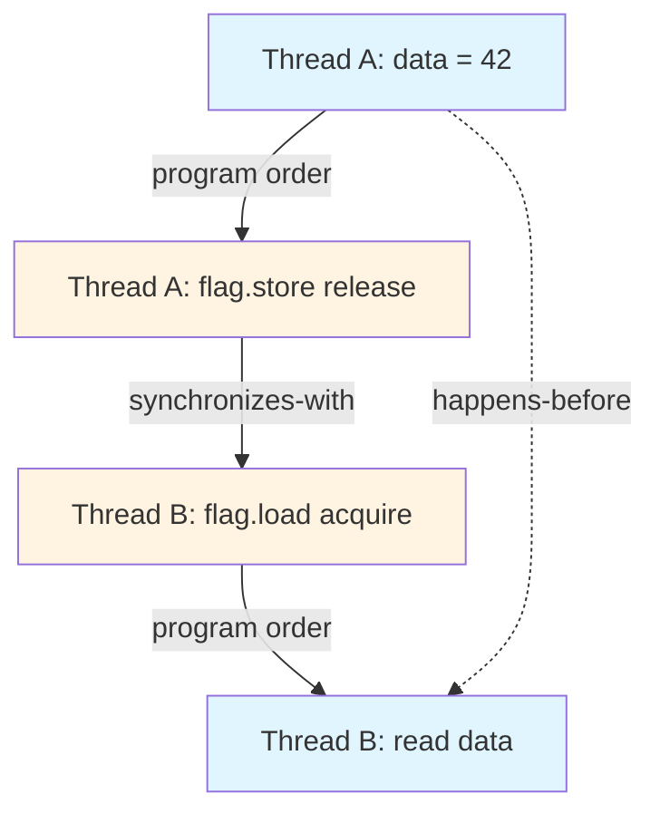
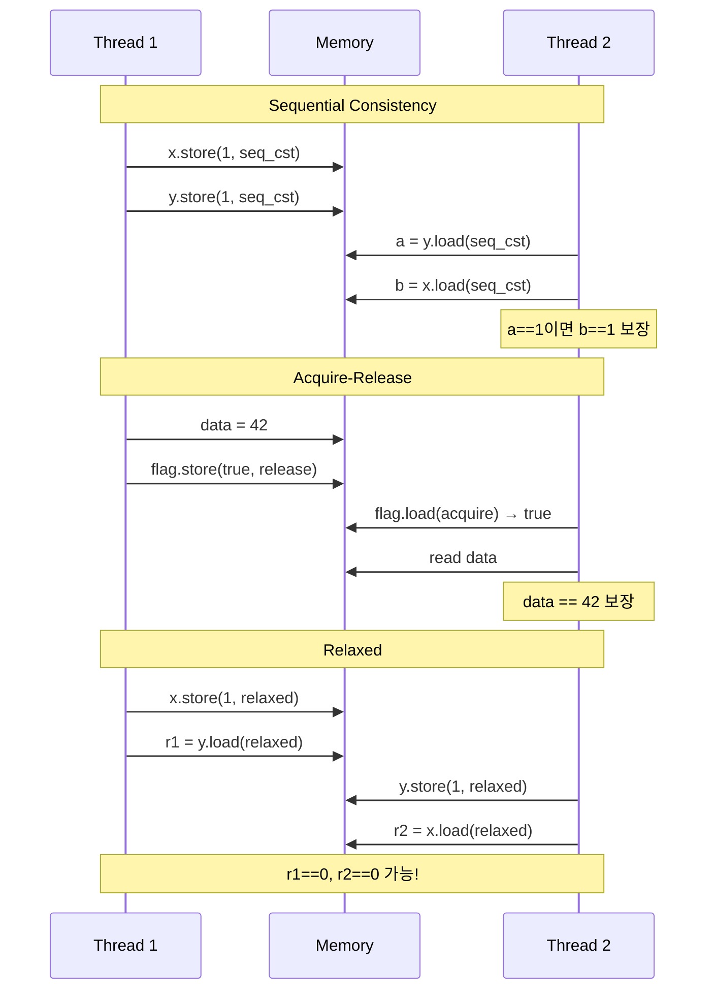

# C++23 메모리 모델(Memory Order) 완벽 가이드  

저자: 최흥배, Claude AI   
    
권장 개발 환경
- **IDE**: Visual Studio 2022 (Community 이상)
- **컴파일러**: MSVC v143 (C++20 지원)
- **OS**: Windows 10 이상

-----
  
# 📚 4부: 고급 주제

## 4.1 Happens-Before 관계

### 이론적 배경

Happens-Before는 C++ 메모리 모델의 핵심 개념으로, 두 연산 간의 순서 관계를 정의한다. A가 B보다 happens-before 관계에 있으면, A의 효과가 B를 실행하기 전에 반드시 관찰 가능하다.

**Happens-Before의 기본 규칙:**

```
순서 보장 규칙:

1. 프로그램 순서 (Program Order):
   같은 스레드 내에서 앞선 문장은 뒤따르는 문장보다 happens-before

   int x = 1;        // A
   int y = 2;        // B
   // A happens-before B

2. 동기화 순서 (Synchronization Order):
   Release 연산은 같은 변수의 Acquire 연산보다 happens-before
   
   스레드 1: flag.store(true, release);   // A
   스레드 2: while(!flag.load(acquire));  // B
             use_data();                   // C
   // A happens-before B, B happens-before C
   // 따라서 A happens-before C (전이성)

3. 전이성 (Transitivity):
   A happens-before B이고 B happens-before C이면
   A happens-before C
```

**Happens-Before 체인:**

```
스레드 A                 스레드 B                 스레드 C
   |                        |                        |
data = 42;     (1)         |                        |
   |                        |                        |
flag1.store(true)  (2)     |                        |
release  ─────────────────>|                        |
   |                        |                        |
   |                   flag1.load()      (3)         |
   |                   acquire                       |
   |                        |                        |
   |                   data2 = data;    (4)          |
   |                        |                        |
   |                   flag2.store(true) (5)         |
   |                   release  ────────────────────>|
   |                        |                        |
   |                        |                   flag2.load()   (6)
   |                        |                   acquire
   |                        |                        |
   |                        |                   use(data2);   (7)

Happens-before 관계:
(1) → (2) → (3) → (4) → (5) → (6) → (7)
따라서 (1)의 효과가 (7)에서 보장됨
```

**코드 예제:**

```cpp
#include <atomic>
#include <thread>
#include <iostream>
#include <cassert>

// Happens-Before 기본 예제
void basic_happens_before() {
    std::atomic<bool> ready{false};
    int data = 0;
    
    std::thread producer([&]() {
        data = 42;  // (1) 일반 변수 쓰기
        ready.store(true, std::memory_order_release);  // (2) release
        // (1) happens-before (2) (같은 스레드 내 순서)
    });
    
    std::thread consumer([&]() {
        while (!ready.load(std::memory_order_acquire));  // (3) acquire
        // (2) synchronizes-with (3)
        // 따라서 (1) happens-before (3)
        
        assert(data == 42);  // (4) 항상 성공
        // (3) happens-before (4)
        // 따라서 (1) happens-before (4)
    });
    
    producer.join();
    consumer.join();
}

// 다중 체인 예제
void multi_chain_happens_before() {
    std::atomic<int> stage{0};
    int shared_data[3] = {0, 0, 0};
    
    // 스레드 1: 첫 번째 단계
    std::thread t1([&]() {
        shared_data[0] = 100;  // (1)
        stage.store(1, std::memory_order_release);  // (2)
    });
    
    // 스레드 2: 두 번째 단계
    std::thread t2([&]() {
        while (stage.load(std::memory_order_acquire) < 1);  // (3)
        shared_data[1] = shared_data[0] + 100;  // (4)
        stage.store(2, std::memory_order_release);  // (5)
    });
    
    // 스레드 3: 세 번째 단계
    std::thread t3([&]() {
        while (stage.load(std::memory_order_acquire) < 2);  // (6)
        shared_data[2] = shared_data[1] + 100;  // (7)
        
        std::cout << "결과: " 
                  << shared_data[0] << ", "
                  << shared_data[1] << ", "
                  << shared_data[2] << "\n";
        // 출력: 100, 200, 300 (항상 보장됨)
    });
    
    t1.join();
    t2.join();
    t3.join();
}
```

### 메모리 순서별 happens-before 보장

각 메모리 순서가 제공하는 happens-before 관계는 다르다.

**1. Sequential Consistency:**

```cpp
#include <atomic>
#include <thread>
#include <iostream>

// seq_cst는 전역 순서를 보장
void sequential_consistency_example() {
    std::atomic<bool> x{false}, y{false};
    std::atomic<int> z{0};
    
    std::thread t1([&]() {
        x.store(true, std::memory_order_seq_cst);  // (1)
    });
    
    std::thread t2([&]() {
        y.store(true, std::memory_order_seq_cst);  // (2)
    });
    
    std::thread t3([&]() {
        while (!x.load(std::memory_order_seq_cst));  // (3)
        if (y.load(std::memory_order_seq_cst)) {  // (4)
            ++z;
        }
    });
    
    std::thread t4([&]() {
        while (!y.load(std::memory_order_seq_cst));  // (5)
        if (x.load(std::memory_order_seq_cst)) {  // (6)
            ++z;
        }
    });
    
    t1.join(); t2.join(); t3.join(); t4.join();
    
    // seq_cst는 전역 순서 보장 → z는 항상 2
    std::cout << "z = " << z.load() << "\n";  // 항상 2
}
```

**2. Acquire-Release:**

```cpp
#include <atomic>
#include <thread>
#include <vector>

// acquire-release는 체인 보장
void acquire_release_example() {
    std::atomic<int> data{0};
    std::atomic<bool> flag{false};
    
    // Release 연산
    std::thread writer([&]() {
        data.store(42, std::memory_order_relaxed);  // (1)
        flag.store(true, std::memory_order_release);  // (2)
        // (1) happens-before (2)
    });
    
    // Acquire 연산
    std::thread reader([&]() {
        while (!flag.load(std::memory_order_acquire));  // (3)
        // (2) synchronizes-with (3)
        int value = data.load(std::memory_order_relaxed);  // (4)
        // (1) happens-before (4)
        std::cout << "값: " << value << "\n";  // 항상 42
    });
    
    writer.join();
    reader.join();
}
```

**3. Relaxed:**

```cpp
#include <atomic>
#include <thread>
#include <iostream>

// relaxed는 happens-before 보장 없음
void relaxed_no_guarantee() {
    std::atomic<int> x{0}, y{0};
    int r1 = 0, r2 = 0;
    
    std::thread t1([&]() {
        x.store(1, std::memory_order_relaxed);
        r1 = y.load(std::memory_order_relaxed);
    });
    
    std::thread t2([&]() {
        y.store(1, std::memory_order_relaxed);
        r2 = x.load(std::memory_order_relaxed);
    });
    
    t1.join();
    t2.join();
    
    // r1 == 0 && r2 == 0 가능! (happens-before 없음)
    std::cout << "r1 = " << r1 << ", r2 = " << r2 << "\n";
}

// relaxed도 modification order는 보장
void relaxed_modification_order() {
    std::atomic<int> counter{0};
    const int iterations = 100000;
    
    std::vector<std::thread> threads;
    for (int i = 0; i < 10; ++i) {
        threads.emplace_back([&]() {
            for (int j = 0; j < iterations; ++j) {
                counter.fetch_add(1, std::memory_order_relaxed);
            }
        });
    }
    
    for (auto& t : threads) t.join();
    
    // modification order 보장 → 항상 정확한 값
    std::cout << "카운터: " << counter.load() << "\n";  // 1,000,000
}
```

### 머메이드 다이어그램으로 시각화

**Happens-Before 관계 다이어그램:**



**메모리 순서별 동기화:**



**복잡한 Happens-Before 체인:**

```cpp
#include <atomic>
#include <thread>
#include <iostream>

void complex_happens_before_chain() {
    std::atomic<int> stage1{0}, stage2{0}, stage3{0};
    int data1 = 0, data2 = 0, data3 = 0;
    
    // 파이프라인 구조
    std::thread producer([&]() {
        data1 = 100;
        stage1.store(1, std::memory_order_release);  // P1
    });
    
    std::thread processor1([&]() {
        while (stage1.load(std::memory_order_acquire) == 0);  // C1
        data2 = data1 * 2;
        stage2.store(1, std::memory_order_release);  // P2
    });
    
    std::thread processor2([&]() {
        while (stage2.load(std::memory_order_acquire) == 0);  // C2
        data3 = data2 + 50;
        stage3.store(1, std::memory_order_release);  // P3
    });
    
    std::thread consumer([&]() {
        while (stage3.load(std::memory_order_acquire) == 0);  // C3
        std::cout << "최종 결과: " << data3 << "\n";  // 250
    });
    
    producer.join();
    processor1.join();
    processor2.join();
    consumer.join();
}
```

**Happens-Before 체인 시각화:**

```
Producer → Processor1 → Processor2 → Consumer

data1=100      data2=200      data3=250
   |              |              |
   v              v              v
P1(release)    P2(release)    P3(release)
   |              |              |
   | sync-with    | sync-with    | sync-with
   v              v              v
C1(acquire)    C2(acquire)    C3(acquire)
   |              |              |
   v              v              v
read data1     read data2     read data3

Happens-before 관계:
- data1 설정 → data2 계산 → data3 계산 → data3 읽기
- 전체 체인이 순서 보장됨
```

---

## 4.2 플랫폼별 구현 차이

### x86/x64의 강한 메모리 모델

x86/x64 아키텍처는 강한 메모리 모델(Total Store Order)을 가지고 있어, 대부분의 메모리 순서가 하드웨어 레벨에서 보장된다.

**x86/x64 메모리 모델 특징:**

```
x86/x64의 보장사항:

1. Store-Load는 재정렬 가능
   Store A
   Load B
   → Load B가 먼저 실행될 수 있음

2. 다른 모든 조합은 재정렬 불가
   ✓ Load-Load: 순서 보장
   ✓ Load-Store: 순서 보장
   ✓ Store-Store: 순서 보장
   ✗ Store-Load: 순서 미보장

3. 각 CPU 코어의 Store는 다른 코어에 순서대로 보임
```

**x86/x64에서의 메모리 순서 구현:**

```cpp
#include <atomic>
#include <iostream>

// x86/x64 플랫폼 특성
void x86_memory_model() {
    std::atomic<int> x{0}, y{0};
    
    // acquire/release가 x86에서는 컴파일러 배리어만 필요
    // (하드웨어가 이미 대부분 순서 보장)
    
    // Release store
    x.store(1, std::memory_order_release);
    // x86: MOV [x], 1 + 컴파일러 배리어
    // 추가 하드웨어 명령어 불필요!
    
    // Acquire load
    int val = y.load(std::memory_order_acquire);
    // x86: MOV val, [y] + 컴파일러 배리어
    // 역시 추가 명령어 불필요!
    
    // Sequential consistency는 MFENCE 필요
    x.store(1, std::memory_order_seq_cst);
    // x86: MOV [x], 1
    //      MFENCE (또는 LOCK 접두사)
}
```

**x86/x64 어셈블리 확인:**

```cpp
#include <atomic>

std::atomic<int> counter{0};

// 각 메모리 순서의 어셈블리 비교
void compare_assembly() {
    // Relaxed
    counter.store(1, std::memory_order_relaxed);
    // x86: MOV DWORD PTR [counter], 1
    
    // Release
    counter.store(1, std::memory_order_release);
    // x86: MOV DWORD PTR [counter], 1
    //      (컴파일러 배리어만, 동일한 명령어!)
    
    // Seq_cst
    counter.store(1, std::memory_order_seq_cst);
    // x86: LOCK MOV DWORD PTR [counter], 1
    //      또는
    //      MOV DWORD PTR [counter], 1
    //      MFENCE
}

// fetch_add의 경우
void fetch_add_assembly() {
    // Relaxed
    counter.fetch_add(1, std::memory_order_relaxed);
    // x86: LOCK XADD DWORD PTR [counter], eax
    //      (LOCK은 원자성 보장, 메모리 순서 아님)
    
    // Seq_cst
    counter.fetch_add(1, std::memory_order_seq_cst);
    // x86: LOCK XADD DWORD PTR [counter], eax
    //      (relaxed와 동일!)
}
```

### ARM의 약한 메모리 모델

ARM 아키텍처는 약한 메모리 모델을 가지고 있어, 명시적인 배리어 명령어가 필요하다.

**ARM 메모리 모델 특징:**

```
ARM의 특징:

1. 거의 모든 재정렬이 가능
   Load-Load, Load-Store, Store-Load, Store-Store
   모두 재정렬 가능!

2. 명시적 배리어 필요
   DMB (Data Memory Barrier)
   DSB (Data Synchronization Barrier)
   ISB (Instruction Synchronization Barrier)

3. Load-Acquire / Store-Release 명령어 지원
   LDAR (Load-Acquire Register)
   STLR (Store-Release Register)
```

**ARM에서의 메모리 순서 구현:**

```cpp
#include <atomic>

std::atomic<int> x{0}, y{0};

void arm_memory_model() {
    // Release store
    x.store(1, std::memory_order_release);
    // ARM: STLR w0, [x]  (Store-Release)
    //      또는
    //      STR w0, [x]
    //      DMB ISH (배리어)
    
    // Acquire load
    int val = y.load(std::memory_order_acquire);
    // ARM: LDAR w1, [y]  (Load-Acquire)
    //      또는
    //      LDR w1, [y]
    //      DMB ISH
    
    // Sequential consistency
    x.store(1, std::memory_order_seq_cst);
    // ARM: DMB ISH
    //      STR w0, [x]
    //      DMB ISH
}
```

**ARM vs x86 비교 코드:**

```cpp
#include <atomic>
#include <thread>
#include <iostream>

// Store Buffering 테스트
void store_buffering_test() {
    std::atomic<int> x{0}, y{0};
    int r1 = 0, r2 = 0;
    
    std::thread t1([&]() {
        x.store(1, std::memory_order_relaxed);
        r1 = y.load(std::memory_order_relaxed);
    });
    
    std::thread t2([&]() {
        y.store(1, std::memory_order_relaxed);
        r2 = x.load(std::memory_order_relaxed);
    });
    
    t1.join();
    t2.join();
    
    // x86: r1==0 && r2==0 발생 가능 (Store-Load 재정렬)
    // ARM: r1==0 && r2==0 발생 가능 (모든 재정렬 가능)
    std::cout << "r1=" << r1 << ", r2=" << r2 << "\n";
}

// Message Passing 테스트
void message_passing_test() {
    std::atomic<bool> ready{false};
    int data = 0;
    
    std::thread writer([&]() {
        data = 42;
        ready.store(true, std::memory_order_release);
    });
    
    std::thread reader([&]() {
        while (!ready.load(std::memory_order_acquire));
        std::cout << "data=" << data << "\n";
    });
    
    writer.join();
    reader.join();
    
    // x86: release/acquire가 거의 공짜 (컴파일러 배리어만)
    // ARM: LDAR/STLR 명령어 필요 (약간의 비용)
}
```

### 크로스 플랫폼 고려사항

**1. 메모리 순서 선택 지침:**

```cpp
#include <atomic>
#include <thread>

// 크로스 플랫폼 안전한 패턴
class CrossPlatformSafe {
private:
    std::atomic<bool> flag{false};
    int data = 0;

public:
    // 항상 acquire-release 사용
    void write(int value) {
        data = value;
        flag.store(true, std::memory_order_release);
        // x86: 컴파일러 배리어만
        // ARM: STLR 또는 DMB
    }
    
    int read() {
        while (!flag.load(std::memory_order_acquire));
        // x86: 컴파일러 배리어만
        // ARM: LDAR 또는 DMB
        return data;
    }
};

// 플랫폼 최적화 vs 이식성
class PlatformOptimized {
private:
    std::atomic<int> counter{0};

public:
    void increment() {
        #ifdef __x86_64__
            // x86: relaxed로 충분 (fetch_add는 LOCK 사용)
            counter.fetch_add(1, std::memory_order_relaxed);
        #elif defined(__aarch64__)
            // ARM: acquire-release 권장
            counter.fetch_add(1, std::memory_order_acq_rel);
        #else
            // 기타: seq_cst로 안전하게
            counter.fetch_add(1, std::memory_order_seq_cst);
        #endif
    }
};
```

**2. 성능 고려사항:**

```cpp
#include <atomic>
#include <chrono>
#include <iostream>
#include <thread>
#include <vector>

// 플랫폼별 성능 측정
void benchmark_memory_orders() {
    const int iterations = 10000000;
    
    // Relaxed 벤치마크
    {
        std::atomic<int> counter{0};
        auto start = std::chrono::high_resolution_clock::now();
        
        std::vector<std::thread> threads;
        for (int i = 0; i < 4; ++i) {
            threads.emplace_back([&]() {
                for (int j = 0; j < iterations; ++j) {
                    counter.fetch_add(1, std::memory_order_relaxed);
                }
            });
        }
        for (auto& t : threads) t.join();
        
        auto end = std::chrono::high_resolution_clock::now();
        auto duration = std::chrono::duration_cast<std::chrono::milliseconds>(end - start);
        
        std::cout << "Relaxed: " << duration.count() << "ms\n";
        // x86: ~X ms
        // ARM: ~X ms (비슷함)
    }
    
    // Acquire-Release 벤치마크
    {
        std::atomic<int> counter{0};
        auto start = std::chrono::high_resolution_clock::now();
        
        std::vector<std::thread> threads;
        for (int i = 0; i < 4; ++i) {
            threads.emplace_back([&]() {
                for (int j = 0; j < iterations; ++j) {
                    counter.fetch_add(1, std::memory_order_acq_rel);
                }
            });
        }
        for (auto& t : threads) t.join();
        
        auto end = std::chrono::high_resolution_clock::now();
        auto duration = std::chrono::duration_cast<std::chrono::milliseconds>(end - start);
        
        std::cout << "Acq-Rel: " << duration.count() << "ms\n";
        // x86: relaxed와 거의 동일
        // ARM: relaxed보다 느림
    }
    
    // Sequential Consistency 벤치마크
    {
        std::atomic<int> counter{0};
        auto start = std::chrono::high_resolution_clock::now();
        
        std::vector<std::thread> threads;
        for (int i = 0; i < 4; ++i) {
            threads.emplace_back([&]() {
                for (int j = 0; j < iterations; ++j) {
                    counter.fetch_add(1, std::memory_order_seq_cst);
                }
            });
        }
        for (auto& t : threads) t.join();
        
        auto end = std::chrono::high_resolution_clock::now();
        auto duration = std::chrono::duration_cast<std::chrono::milliseconds>(end - start);
        
        std::cout << "Seq-Cst: " << duration.count() << "ms\n";
        // x86: relaxed보다 약간 느림
        // ARM: 훨씬 느림
    }
}
```

**3. 이식 가능한 코드 작성:**

```cpp
#include <atomic>
#include <thread>
#include <vector>

// 올바른 크로스 플랫폼 코드
class PortableQueue {
private:
    struct Node {
        int data;
        std::atomic<Node*> next{nullptr};
    };
    
    std::atomic<Node*> head{nullptr};
    std::atomic<Node*> tail{nullptr};

public:
    PortableQueue() {
        Node* dummy = new Node();
        head.store(dummy, std::memory_order_relaxed);
        tail.store(dummy, std::memory_order_relaxed);
    }
    
    void enqueue(int value) {
        Node* new_node = new Node();
        new_node->data = value;
        
        // release: 새 노드 초기화 완료를 보장
        Node* prev_tail = tail.exchange(new_node, std::memory_order_acq_rel);
        
        // release: 링크 연결 완료를 보장
        prev_tail->next.store(new_node, std::memory_order_release);
    }
    
    bool dequeue(int& result) {
        // acquire: head 읽기 동기화
        Node* old_head = head.load(std::memory_order_acquire);
        
        // acquire: next 읽기 동기화
        Node* next = old_head->next.load(std::memory_order_acquire);
        
        if (next == nullptr) {
            return false;  // 큐가 비어있음
        }
        
        result = next->data;
        
        // release: head 업데이트 동기화
        head.store(next, std::memory_order_release);
        
        delete old_head;
        return true;
    }
};

// 플랫폼 독립적인 테스트
void test_portable_queue() {
    PortableQueue queue;
    const int num_threads = 4;
    const int operations = 100000;
    
    std::vector<std::thread> producers;
    std::vector<std::thread> consumers;
    
    std::atomic<int> enqueue_count{0};
    std::atomic<int> dequeue_count{0};
    
    // Producers
    for (int i = 0; i < num_threads; ++i) {
        producers.emplace_back([&, i]() {
            for (int j = 0; j < operations; ++j) {
                queue.enqueue(i * operations + j);
                enqueue_count.fetch_add(1, std::memory_order_relaxed);
            }
        });
    }
    
    // Consumers
    for (int i = 0; i < num_threads; ++i) {
        consumers.emplace_back([&]() {
            int value;
            int local_count = 0;
            while (local_count < operations) {
                if (queue.dequeue(value)) {
                    ++local_count;
                }
            }
            dequeue_count.fetch_add(local_count, std::memory_order_relaxed);
        });
    }
    
    for (auto& t : producers) t.join();
    for (auto& t : consumers) t.join();
    
    std::cout << "Enqueued: " << enqueue_count.load() << "\n";
    std::cout << "Dequeued: " << dequeue_count.load() << "\n";
    
    // x86과 ARM 모두에서 정확하게 동작
}
```

**플랫폼별 최적화 매크로:**

```cpp
#include <atomic>

// 플랫폼 감지 매크로
#if defined(__x86_64__) || defined(_M_X64) || defined(__i386__) || defined(_M_IX86)
    #define PLATFORM_X86
#elif defined(__aarch64__) || defined(_M_ARM64) || defined(__arm__) || defined(_M_ARM)
    #define PLATFORM_ARM
#endif

// 플랫폼 최적화 래퍼
template<typename T>
class PlatformAtomic {
private:
    std::atomic<T> value;

public:
    void store_optimized(T desired) {
        #ifdef PLATFORM_X86
            // x86: release로 충분
            value.store(desired, std::memory_order_release);
        #elif defined(PLATFORM_ARM)
            // ARM: seq_cst가 더 안전
            value.store(desired, std::memory_order_seq_cst);
        #else
            value.store(desired, std::memory_order_seq_cst);
        #endif
    }
    
    T load_optimized() {
        #ifdef PLATFORM_X86
            return value.load(std::memory_order_acquire);
        #elif defined(PLATFORM_ARM)
            return value.load(std::memory_order_seq_cst);
        #else
            return value.load(std::memory_order_seq_cst);
        #endif
    }
};

// 하지만 권장하지 않음!
// 이유: 플랫폼마다 다른 동작 → 버그 발견 어려움
// 대신: 모든 플랫폼에서 동일하게 동작하는 코드 작성
```

---

## 4.3 성능 최적화 전략

### 메모리 순서 선택 가이드라인

올바른 메모리 순서 선택은 성능과 정확성의 균형이다.

**선택 플로우차트:**

```
메모리 순서 선택 가이드:

START
  |
  v
[단순 카운터/통계?] ─YES─> Relaxed
  |
  NO
  v
[데이터 동기화 필요?] ─NO─> Relaxed
  |
  YES
  v
[단일 Producer-Consumer?] ─YES─> Acquire-Release
  |
  NO
  v
[다중 스레드 복잡한 동기화?] ─YES─> Sequential Consistency
  |
  NO
  v
[확실하지 않음?] ─YES─> Sequential Consistency (안전)
```

**실전 예제:**

```cpp
#include <atomic>
#include <thread>
#include <vector>
#include <iostream>

// 1. 단순 카운터 → Relaxed
class StatisticsCounter {
private:
    std::atomic<long> request_count{0};
    std::atomic<long> error_count{0};

public:
    void increment_requests() {
        // 순서 무관, 최종 값만 중요
        request_count.fetch_add(1, std::memory_order_relaxed);
    }
    
    void increment_errors() {
        error_count.fetch_add(1, std::memory_order_relaxed);
    }
    
    void print_stats() const {
        // 읽기도 relaxed
        std::cout << "요청: " << request_count.load(std::memory_order_relaxed)
                  << ", 에러: " << error_count.load(std::memory_order_relaxed) << "\n";
    }
};

// 2. 데이터 동기화 → Acquire-Release
class DataSynchronizer {
private:
    int shared_data = 0;
    std::atomic<bool> data_ready{false};

public:
    void produce(int value) {
        shared_data = value;
        // release: shared_data 쓰기 완료 보장
        data_ready.store(true, std::memory_order_release);
    }
    
    int consume() {
        // acquire: shared_data 읽기 전 동기화
        while (!data_ready.load(std::memory_order_acquire));
        return shared_data;
    }
};

// 3. 복잡한 다중 스레드 → Sequential Consistency
class ComplexCoordinator {
private:
    std::atomic<int> phase{0};
    std::atomic<int> ready_count{0};

public:
    void wait_all_ready(int thread_count) {
        ready_count.fetch_add(1, std::memory_order_seq_cst);
        
        while (ready_count.load(std::memory_order_seq_cst) < thread_count);
        
        // 모든 스레드가 같은 순서로 관찰
        phase.store(1, std::memory_order_seq_cst);
    }
    
    void advance_phase() {
        int current = phase.load(std::memory_order_seq_cst);
        phase.store(current + 1, std::memory_order_seq_cst);
    }
};
```

### False Sharing 방지

False Sharing은 여러 스레드가 같은 캐시 라인의 다른 변수에 접근할 때 발생하는 성능 문제다.

**False Sharing 발생:**

```
캐시 라인 (64바이트):
┌──────────┬──────────┬──────────┬──────────┐
│ Thread 1 │ Thread 2 │ Thread 3 │ Thread 4 │
│ counter  │ counter  │ counter  │ counter  │
└──────────┴──────────┴──────────┴──────────┘

문제:
- Thread 1이 counter 수정 → 전체 캐시 라인 무효화
- Thread 2,3,4의 캐시 라인도 무효화됨
- 모든 스레드가 메모리에서 다시 읽어야 함
- 성능 급격히 저하!
```

**False Sharing 예제:**

```cpp
#include <atomic>
#include <thread>
#include <vector>
#include <chrono>
#include <iostream>

// 나쁜 예: False Sharing 발생
struct BadCounters {
    std::atomic<long> counter1{0};  // 8바이트
    std::atomic<long> counter2{0};  // 8바이트
    std::atomic<long> counter3{0};  // 8바이트
    std::atomic<long> counter4{0};  // 8바이트
    // 모두 같은 캐시 라인에 위치!
};

void test_false_sharing() {
    BadCounters counters;
    const int iterations = 10000000;
    
    auto start = std::chrono::high_resolution_clock::now();
    
    std::vector<std::thread> threads;
    
    threads.emplace_back([&]() {
        for (int i = 0; i < iterations; ++i) {
            counters.counter1.fetch_add(1, std::memory_order_relaxed);
        }
    });
    
    threads.emplace_back([&]() {
        for (int i = 0; i < iterations; ++i) {
            counters.counter2.fetch_add(1, std::memory_order_relaxed);
        }
    });
    
    threads.emplace_back([&]() {
        for (int i = 0; i < iterations; ++i) {
            counters.counter3.fetch_add(1, std::memory_order_relaxed);
        }
    });
    
    threads.emplace_back([&]() {
        for (int i = 0; i < iterations; ++i) {
            counters.counter4.fetch_add(1, std::memory_order_relaxed);
        }
    });
    
    for (auto& t : threads) t.join();
    
    auto end = std::chrono::high_resolution_clock::now();
    auto duration = std::chrono::duration_cast<std::chrono::milliseconds>(end - start);
    
    std::cout << "False Sharing: " << duration.count() << "ms\n";
    // 매우 느림!
}

// 좋은 예: 패딩으로 False Sharing 방지
struct alignas(64) GoodCounters {
    struct alignas(64) PaddedCounter {
        std::atomic<long> value{0};
        char padding[64 - sizeof(std::atomic<long>)];  // 캐시 라인 크기까지 패딩
    };
    
    PaddedCounter counter1;
    PaddedCounter counter2;
    PaddedCounter counter3;
    PaddedCounter counter4;
    // 각각 다른 캐시 라인에 위치!
};

void test_no_false_sharing() {
    GoodCounters counters;
    const int iterations = 10000000;
    
    auto start = std::chrono::high_resolution_clock::now();
    
    std::vector<std::thread> threads;
    
    threads.emplace_back([&]() {
        for (int i = 0; i < iterations; ++i) {
            counters.counter1.value.fetch_add(1, std::memory_order_relaxed);
        }
    });
    
    threads.emplace_back([&]() {
        for (int i = 0; i < iterations; ++i) {
            counters.counter2.value.fetch_add(1, std::memory_order_relaxed);
        }
    });
    
    threads.emplace_back([&]() {
        for (int i = 0; i < iterations; ++i) {
            counters.counter3.value.fetch_add(1, std::memory_order_relaxed);
        }
    });
    
    threads.emplace_back([&]() {
        for (int i = 0; i < iterations; ++i) {
            counters.counter4.value.fetch_add(1, std::memory_order_relaxed);
        }
    });
    
    for (auto& t : threads) t.join();
    
    auto end = std::chrono::high_resolution_clock::now();
    auto duration = std::chrono::duration_cast<std::chrono::milliseconds>(end - start);
    
    std::cout << "No False Sharing: " << duration.count() << "ms\n";
    // 훨씬 빠름!
}
```

### 캐시 라인 정렬

**C++17 hardware_destructive_interference_size:**

```cpp
#include <atomic>
#include <new>
#include <iostream>

// C++17 표준 방법
#ifdef __cpp_lib_hardware_interference_size
    constexpr std::size_t cache_line_size = 
        std::hardware_destructive_interference_size;
#else
    constexpr std::size_t cache_line_size = 64;  // 일반적인 값
#endif

// 올바른 정렬
struct alignas(cache_line_size) AlignedCounter {
    std::atomic<long> value{0};
};

// 실전 예제: 스레드별 캐시 친화적 구조
template<typename T, std::size_t N>
class PerThreadData {
private:
    struct alignas(cache_line_size) AlignedData {
        T data;
    };
    
    AlignedData thread_data[N];

public:
    T& get(std::size_t thread_id) {
        return thread_data[thread_id].data;
    }
    
    const T& get(std::size_t thread_id) const {
        return thread_data[thread_id].data;
    }
};

// 사용 예제
void test_per_thread_data() {
    constexpr int num_threads = 4;
    PerThreadData<std::atomic<long>, num_threads> counters;
    
    std::vector<std::thread> threads;
    
    for (int i = 0; i < num_threads; ++i) {
        threads.emplace_back([&, i]() {
            for (int j = 0; j < 10000000; ++j) {
                counters.get(i).fetch_add(1, std::memory_order_relaxed);
            }
        });
    }
    
    for (auto& t : threads) t.join();
    
    long total = 0;
    for (int i = 0; i < num_threads; ++i) {
        total += counters.get(i).load(std::memory_order_relaxed);
    }
    
    std::cout << "총합: " << total << "\n";
}
```

**정렬 검증:**

```cpp
#include <iostream>
#include <atomic>
#include <new>

// 정렬 확인 헬퍼
template<typename T>
void check_alignment() {
    std::cout << "타입: " << typeid(T).name() << "\n";
    std::cout << "크기: " << sizeof(T) << " 바이트\n";
    std::cout << "정렬: " << alignof(T) << " 바이트\n";
    
    T instance;
    std::cout << "주소: " << &instance << "\n";
    std::cout << "주소 % 64 = " << (reinterpret_cast<std::uintptr_t>(&instance) % 64) << "\n";
    std::cout << "\n";
}

struct Unaligned {
    std::atomic<long> value;
};

struct alignas(64) Aligned {
    std::atomic<long> value;
};

int main() {
    check_alignment<Unaligned>();
    check_alignment<Aligned>();
    
    return 0;
}
```

---

## 4.4 C++23의 새로운 기능

### `atomic_ref` 개선사항

C++20에서 도입된 `atomic_ref`가 C++23에서 더욱 개선되었다.

**atomic_ref 기본 사용:**

```cpp
#include <atomic>
#include <iostream>
#include <thread>
#include <vector>

// C++20/23: 일반 변수를 원자적으로 접근
void basic_atomic_ref() {
    int regular_int = 0;  // 일반 변수!
    
    // atomic_ref로 래핑
    std::atomic_ref<int> atomic_int(regular_int);
    
    std::vector<std::thread> threads;
    
    for (int i = 0; i < 4; ++i) {
        threads.emplace_back([&atomic_int]() {
            for (int j = 0; j < 100000; ++j) {
                atomic_int.fetch_add(1, std::memory_order_relaxed);
            }
        });
    }
    
    for (auto& t : threads) t.join();
    
    std::cout << "결과: " << regular_int << "\n";  // 400,000
}

// 배열 원소에 atomic_ref 사용
void atomic_ref_array() {
    int counters[10] = {0};  // 일반 배열
    
    std::vector<std::thread> threads;
    
    for (int i = 0; i < 10; ++i) {
        threads.emplace_back([&counters, i]() {
            std::atomic_ref<int> atomic_counter(counters[i]);
            
            for (int j = 0; j < 100000; ++j) {
                atomic_counter.fetch_add(1, std::memory_order_relaxed);
            }
        });
    }
    
    for (auto& t : threads) t.join();
    
    for (int i = 0; i < 10; ++i) {
        std::cout << "counters[" << i << "] = " << counters[i] << "\n";
    }
}
```

**atomic_ref의 장점:**

```cpp
#include <atomic>
#include <memory>
#include <vector>

// 기존 데이터 구조에 원자성 추가
struct LegacyData {
    int id;
    int counter;
    double value;
};

class DataManager {
private:
    std::vector<LegacyData> data;

public:
    DataManager(size_t size) : data(size) {}
    
    // atomic_ref로 기존 구조를 원자적으로 수정
    void increment_counter(size_t index) {
        if (index >= data.size()) return;
        
        std::atomic_ref<int> atomic_counter(data[index].counter);
        atomic_counter.fetch_add(1, std::memory_order_relaxed);
    }
    
    int get_counter(size_t index) const {
        if (index >= data.size()) return 0;
        
        // const_cast 필요 (atomic_ref는 비-const 참조 필요)
        std::atomic_ref<int> atomic_counter(
            const_cast<int&>(data[index].counter)
        );
        return atomic_counter.load(std::memory_order_relaxed);
    }
};
```

### 대기 연산 (wait/notify)

C++20에서 도입된 `wait`/`notify` 연산은 효율적인 대기 메커니즘을 제공한다.

**기본 wait/notify:**

```cpp
#include <atomic>
#include <thread>
#include <iostream>
#include <chrono>

// 조건 변수 없이 효율적인 대기
void basic_wait_notify() {
    std::atomic<int> flag{0};
    
    std::thread worker([&]() {
        std::cout << "작업 시작...\n";
        std::this_thread::sleep_for(std::chrono::seconds(2));
        
        flag.store(1, std::memory_order_release);
        flag.notify_one();  // 대기 중인 스레드 하나 깨우기
        std::cout << "작업 완료, 통지 전송\n";
    });
    
    std::cout << "대기 중...\n";
    
    // 값이 0이 아닐 때까지 대기 (효율적인 대기!)
    flag.wait(0, std::memory_order_acquire);
    
    std::cout << "통지 받음, flag = " << flag.load() << "\n";
    
    worker.join();
}

// 여러 스레드 통지
void notify_all_example() {
    std::atomic<bool> ready{false};
    const int num_threads = 4;
    
    std::vector<std::thread> threads;
    
    for (int i = 0; i < num_threads; ++i) {
        threads.emplace_back([&, i]() {
            std::cout << "스레드 " << i << " 대기 중...\n";
            ready.wait(false, std::memory_order_acquire);
            std::cout << "스레드 " << i << " 시작!\n";
        });
    }
    
    std::this_thread::sleep_for(std::chrono::seconds(1));
    
    std::cout << "모든 스레드 깨우기\n";
    ready.store(true, std::memory_order_release);
    ready.notify_all();  // 모든 대기 스레드 깨우기
    
    for (auto& t : threads) t.join();
}
```

**wait vs busy-wait 비교:**

```cpp
#include <atomic>
#include <thread>
#include <chrono>
#include <iostream>

void compare_wait_methods() {
    std::atomic<bool> flag{false};
    
    // 1. Busy-wait (나쁨)
    auto busy_wait_test = [&]() {
        auto start = std::chrono::high_resolution_clock::now();
        
        std::thread worker([&]() {
            std::this_thread::sleep_for(std::chrono::milliseconds(100));
            flag.store(true, std::memory_order_release);
        });
        
        // CPU를 계속 소모
        while (!flag.load(std::memory_order_acquire)) {
            // 바쁜 대기
        }
        
        worker.join();
        
        auto end = std::chrono::high_resolution_clock::now();
        return std::chrono::duration_cast<std::chrono::microseconds>(end - start);
    };
    
    // 2. wait/notify (좋음)
    flag.store(false);
    
    auto wait_notify_test = [&]() {
        auto start = std::chrono::high_resolution_clock::now();
        
        std::thread worker([&]() {
            std::this_thread::sleep_for(std::chrono::milliseconds(100));
            flag.store(true, std::memory_order_release);
            flag.notify_one();
        });
        
        // CPU를 절약하며 대기
        flag.wait(false, std::memory_order_acquire);
        
        worker.join();
        
        auto end = std::chrono::high_resolution_clock::now();
        return std::chrono::duration_cast<std::chrono::microseconds>(end - start);
    };
    
    std::cout << "Busy-wait: " << busy_wait_test().count() << "μs (CPU 100%)\n";
    std::cout << "Wait/Notify: " << wait_notify_test().count() << "μs (CPU 절약)\n";
}
```

**실전 패턴: 세마포어 구현:**

```cpp
#include <atomic>
#include <stdexcept>

class Semaphore {
private:
    std::atomic<int> count;

public:
    explicit Semaphore(int initial_count) : count(initial_count) {
        if (initial_count < 0) {
            throw std::invalid_argument("초기 카운트는 음수일 수 없다");
        }
    }
    
    void acquire() {
        int old_count = count.load(std::memory_order_acquire);
        
        while (true) {
            // 카운트가 0이면 대기
            while (old_count == 0) {
                count.wait(0, std::memory_order_acquire);
                old_count = count.load(std::memory_order_acquire);
            }
            
            // CAS로 카운트 감소 시도
            if (count.compare_exchange_weak(
                old_count, old_count - 1,
                std::memory_order_acquire,
                std::memory_order_acquire
            )) {
                return;  // 성공
            }
        }
    }
    
    void release() {
        count.fetch_add(1, std::memory_order_release);
        count.notify_one();  // 대기 중인 스레드 하나 깨우기
    }
};

// 사용 예제
void test_semaphore() {
    Semaphore sem(2);  // 최대 2개 동시 접근
    
    std::vector<std::thread> threads;
    
    for (int i = 0; i < 5; ++i) {
        threads.emplace_back([&sem, i]() {
            std::cout << "스레드 " << i << " 대기 중...\n";
            sem.acquire();
            
            std::cout << "스레드 " << i << " 진입\n";
            std::this_thread::sleep_for(std::chrono::seconds(1));
            std::cout << "스레드 " << i << " 종료\n";
            
            sem.release();
        });
    }
    
    for (auto& t : threads) t.join();
}
```

### `atomic_flag` 확장

C++20/23에서 `atomic_flag`가 대폭 개선되었다.

**C++20 이전 vs 이후:**

```cpp
#include <atomic>
#include <thread>
#include <iostream>

void old_atomic_flag() {
    std::atomic_flag flag = ATOMIC_FLAG_INIT;  // C++20 이전
    
    // 단점:
    // - 초기화가 번거로움
    // - test() 함수 없음
    // - wait/notify 없음
    
    if (!flag.test_and_set()) {
        std::cout << "첫 번째 설정\n";
    }
    
    flag.clear();
}

void new_atomic_flag() {
    std::atomic_flag flag;  // C++20: 기본 초기화 가능
    
    // 새 기능들:
    
    // 1. test() - 값 확인만 (변경 없음)
    if (!flag.test()) {
        std::cout << "플래그가 설정되지 않음\n";
    }
    
    // 2. wait/notify
    flag.test_and_set();
    flag.notify_one();
    
    // 3. 더 명확한 초기화
    std::atomic_flag flag2{false};  // 명시적 초기화
}
```

**개선된 스핀락:**

```cpp
#include <atomic>
#include <thread>
#include <vector>

// C++20/23 atomic_flag 기반 스핀락
class ModernSpinlock {
private:
    std::atomic_flag locked = ATOMIC_FLAG_INIT;

public:
    void lock() {
        // test()로 먼저 확인 (읽기만)
        while (locked.test(std::memory_order_relaxed)) {
            // wait로 효율적인 대기 (선택적)
            // locked.wait(true, std::memory_order_relaxed);
            
            // 또는 CPU 힌트
            #ifdef _MSC_VER
                _mm_pause();
            #endif
        }
        
        // test_and_set으로 획득
        while (locked.test_and_set(std::memory_order_acquire)) {
            while (locked.test(std::memory_order_relaxed)) {
                #ifdef _MSC_VER
                    _mm_pause();
                #endif
            }
        }
    }
    
    void unlock() {
        locked.clear(std::memory_order_release);
        // notify_one()으로 대기 중인 스레드 깨우기 (선택적)
        // locked.notify_one();
    }
};

// 테스트
void test_modern_spinlock() {
    ModernSpinlock spinlock;
    int shared_counter = 0;
    
    std::vector<std::thread> threads;
    
    for (int i = 0; i < 4; ++i) {
        threads.emplace_back([&]() {
            for (int j = 0; j < 100000; ++j) {
                spinlock.lock();
                ++shared_counter;
                spinlock.unlock();
            }
        });
    }
    
    for (auto& t : threads) t.join();
    
    std::cout << "카운터: " << shared_counter << "\n";  // 400,000
}
```

**wait/notify를 활용한 이벤트:**

```cpp
#include <atomic>
#include <thread>
#include <chrono>
#include <iostream>

class Event {
private:
    std::atomic_flag signaled = ATOMIC_FLAG_INIT;

public:
    void set() {
        signaled.test_and_set(std::memory_order_release);
        signaled.notify_all();  // 모든 대기 스레드 깨우기
    }
    
    void reset() {
        signaled.clear(std::memory_order_relaxed);
    }
    
    void wait() {
        // signaled가 false이면 대기
        while (!signaled.test(std::memory_order_acquire)) {
            signaled.wait(false, std::memory_order_acquire);
        }
    }
    
    bool wait_for(std::chrono::milliseconds timeout) {
        auto start = std::chrono::steady_clock::now();
        
        while (!signaled.test(std::memory_order_acquire)) {
            auto elapsed = std::chrono::steady_clock::now() - start;
            if (elapsed >= timeout) {
                return false;  // 타임아웃
            }
            
            // 짧은 대기 후 재확인
            std::this_thread::sleep_for(std::chrono::milliseconds(1));
        }
        
        return true;
    }
};

// 사용 예제
void test_event() {
    Event event;
    
    std::thread worker([&]() {
        std::cout << "작업 시작...\n";
        std::this_thread::sleep_for(std::chrono::seconds(2));
        std::cout << "작업 완료, 이벤트 설정\n";
        event.set();
    });
    
    std::cout << "이벤트 대기 중...\n";
    event.wait();
    std::cout << "이벤트 받음!\n";
    
    worker.join();
}
```

**C++23 요약:**

```cpp
// C++23의 주요 개선사항 정리

#include <atomic>

void cpp23_summary() {
    // 1. atomic_ref - 기존 변수를 원자적으로
    int normal_var = 0;
    std::atomic_ref<int> ref(normal_var);
    ref.fetch_add(1);
    
    // 2. wait/notify - 효율적인 대기
    std::atomic<bool> flag{false};
    // flag.wait(false);  // false일 동안 대기
    // flag.notify_one();  // 대기 중인 스레드 깨우기
    
    // 3. atomic_flag 개선
    std::atomic_flag af;  // 간단한 초기화
    af.test();  // 값만 확인
    // af.wait(true);  // wait/notify 지원
    
    // 4. 명시적 메모리 순서 기본값 개선
    std::atomic<int> counter{0};
    counter.load();  // 기본: memory_order_seq_cst
}
```

이것으로 4부 "고급 주제"를 마친다. Happens-Before 관계, 플랫폼별 차이점, 성능 최적화 전략, 그리고 C++23의 새로운 기능들을 다루었다. 이 지식들은 고성능 멀티스레드 프로그램을 작성하는 데 필수적이다.  