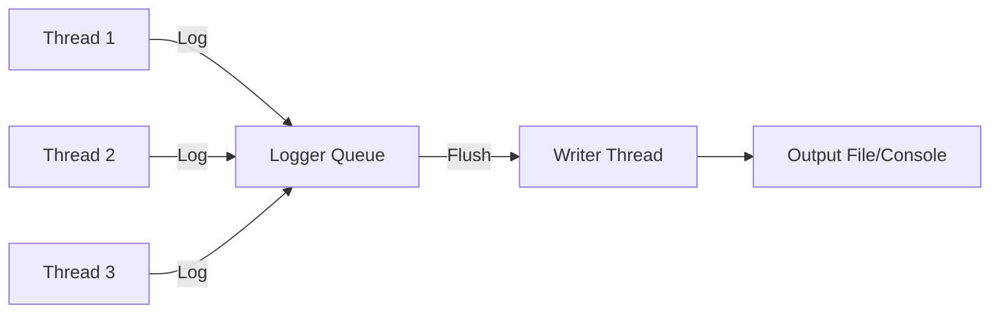

# C++23 메모리 모델(Memory Order) 완벽 가이드  

저자: 최흥배, Claude AI   
    
권장 개발 환경
- **IDE**: Visual Studio 2022 (Community 이상)
- **컴파일러**: MSVC v143 (C++20 지원)
- **OS**: Windows 10 이상

-----
  
# 📚 5부: 실전 프로젝트

이 장에서는 앞서 학습한 메모리 모델 개념을 실제 프로젝트에 적용한다. 각 프로젝트는 실무에서 자주 마주치는 문제를 해결하며, 단계별로 구현하고 최적화한다.

---

## 5.1 프로젝트 1: Thread-Safe 로거

### 요구사항 분석

멀티스레드 환경에서 안전하게 동작하는 로거를 구현한다. 주요 요구사항은 다음과 같다:

- 여러 스레드에서 동시에 로그를 기록할 수 있다
- 로그 순서가 뒤바뀌지 않는다
- 최소한의 성능 오버헤드를 가진다
- 로그 레벨(DEBUG, INFO, WARNING, ERROR)을 지원한다
- 파일 또는 콘솔에 출력한다



### 설계 및 구현

**기본 구조**

```cpp
#include <atomic>
#include <thread>
#include <vector>
#include <string>
#include <fstream>
#include <chrono>
#include <iostream>
#include <format>

enum class LogLevel {
    DEBUG = 0,
    INFO = 1,
    WARNING = 2,
    ERROR = 3
};

struct LogEntry {
    LogLevel level;
    std::string message;
    std::chrono::system_clock::time_point timestamp;
    std::thread::id thread_id;
};

class ThreadSafeLogger {
private:
    // 순환 버퍼 구조
    static constexpr size_t BUFFER_SIZE = 4096;
    
    struct alignas(64) Slot {  // 캐시 라인 정렬
        std::atomic<bool> ready{false};
        LogEntry entry;
        char padding[64 - sizeof(std::atomic<bool>) - sizeof(LogEntry)];
    };
    
    std::vector<Slot> buffer_;
    std::atomic<size_t> write_index_{0};
    std::atomic<size_t> read_index_{0};
    std::atomic<bool> running_{false};
    std::thread writer_thread_;
    std::ofstream output_file_;
    LogLevel min_level_;

    // Writer 스레드 함수
    void writer_loop() {
        while (running_.load(std::memory_order_acquire) || 
               read_index_.load(std::memory_order_relaxed) != 
               write_index_.load(std::memory_order_relaxed)) {
            
            size_t current_read = read_index_.load(std::memory_order_relaxed);
            size_t current_write = write_index_.load(std::memory_order_acquire);
            
            if (current_read == current_write) {
                std::this_thread::sleep_for(std::chrono::microseconds(100));
                continue;
            }
            
            size_t index = current_read % BUFFER_SIZE;
            
            // ready 플래그를 acquire로 읽어서 entry 데이터를 안전하게 읽는다
            if (buffer_[index].ready.load(std::memory_order_acquire)) {
                write_log(buffer_[index].entry);
                buffer_[index].ready.store(false, std::memory_order_release);
                read_index_.store(current_read + 1, std::memory_order_release);
            }
        }
        
        // 남은 로그 처리
        flush_remaining();
    }

    void write_log(const LogEntry& entry) {
        auto time = std::chrono::system_clock::to_time_t(entry.timestamp);
        auto ms = std::chrono::duration_cast<std::chrono::milliseconds>(
            entry.timestamp.time_since_epoch()) % 1000;
        
        std::tm tm_buf;
        localtime_s(&tm_buf, &time);
        
        char time_str[64];
        std::strftime(time_str, sizeof(time_str), "%Y-%m-%d %H:%M:%S", &tm_buf);
        
        const char* level_str[] = {"DEBUG", "INFO", "WARNING", "ERROR"};
        
        std::string log_line = std::format("[{}] [{}] [Thread:{}] {}\n",
            time_str,
            level_str[static_cast<int>(entry.level)],
            entry.thread_id,
            entry.message);
        
        if (output_file_.is_open()) {
            output_file_ << log_line;
            output_file_.flush();
        } else {
            std::cout << log_line;
        }
    }

    void flush_remaining() {
        size_t current_read = read_index_.load(std::memory_order_relaxed);
        size_t current_write = write_index_.load(std::memory_order_acquire);
        
        while (current_read != current_write) {
            size_t index = current_read % BUFFER_SIZE;
            if (buffer_[index].ready.load(std::memory_order_acquire)) {
                write_log(buffer_[index].entry);
                buffer_[index].ready.store(false, std::memory_order_release);
            }
            current_read++;
        }
    }

public:
    ThreadSafeLogger(const std::string& filename = "", 
                     LogLevel min_level = LogLevel::DEBUG)
        : buffer_(BUFFER_SIZE)
        , min_level_(min_level) {
        
        if (!filename.empty()) {
            output_file_.open(filename, std::ios::app);
            if (!output_file_.is_open()) {
                throw std::runtime_error("파일을 열 수 없다: " + filename);
            }
        }
        
        running_.store(true, std::memory_order_release);
        writer_thread_ = std::thread(&ThreadSafeLogger::writer_loop, this);
    }

    ~ThreadSafeLogger() {
        running_.store(false, std::memory_order_release);
        if (writer_thread_.joinable()) {
            writer_thread_.join();
        }
        if (output_file_.is_open()) {
            output_file_.close();
        }
    }

    void log(LogLevel level, const std::string& message) {
        if (level < min_level_) {
            return;
        }
        
        // 버퍼가 가득 찬 경우 대기
        size_t current_write = write_index_.load(std::memory_order_relaxed);
        size_t current_read = read_index_.load(std::memory_order_acquire);
        
        while (current_write - current_read >= BUFFER_SIZE) {
            std::this_thread::yield();
            current_read = read_index_.load(std::memory_order_acquire);
        }
        
        size_t index = current_write % BUFFER_SIZE;
        
        // ready가 false가 될 때까지 대기
        while (buffer_[index].ready.load(std::memory_order_acquire)) {
            std::this_thread::yield();
        }
        
        // 로그 엔트리 작성
        buffer_[index].entry.level = level;
        buffer_[index].entry.message = message;
        buffer_[index].entry.timestamp = std::chrono::system_clock::now();
        buffer_[index].entry.thread_id = std::this_thread::get_id();
        
        // release로 데이터를 게시하고 ready를 설정한다
        buffer_[index].ready.store(true, std::memory_order_release);
        
        // write_index를 증가시킨다
        write_index_.fetch_add(1, std::memory_order_release);
    }

    // 편의 함수들
    void debug(const std::string& msg) { log(LogLevel::DEBUG, msg); }
    void info(const std::string& msg) { log(LogLevel::INFO, msg); }
    void warning(const std::string& msg) { log(LogLevel::WARNING, msg); }
    void error(const std::string& msg) { log(LogLevel::ERROR, msg); }
};
```

### 성능 측정

```cpp
#include <random>

void benchmark_logger() {
    ThreadSafeLogger logger("benchmark.log", LogLevel::DEBUG);
    
    const int num_threads = 8;
    const int logs_per_thread = 10000;
    
    auto start = std::chrono::high_resolution_clock::now();
    
    std::vector<std::thread> threads;
    for (int t = 0; t < num_threads; ++t) {
        threads.emplace_back([&logger, t, logs_per_thread]() {
            std::random_device rd;
            std::mt19937 gen(rd());
            std::uniform_int_distribution<> dis(0, 3);
            
            for (int i = 0; i < logs_per_thread; ++i) {
                LogLevel level = static_cast<LogLevel>(dis(gen));
                std::string msg = std::format("Thread {} - Message {}", t, i);
                logger.log(level, msg);
            }
        });
    }
    
    for (auto& thread : threads) {
        thread.join();
    }
    
    auto end = std::chrono::high_resolution_clock::now();
    auto duration = std::chrono::duration_cast<std::chrono::milliseconds>(end - start);
    
    int total_logs = num_threads * logs_per_thread;
    double logs_per_second = (total_logs * 1000.0) / duration.count();
    
    std::cout << std::format("총 로그 수: {}\n", total_logs);
    std::cout << std::format("소요 시간: {} ms\n", duration.count());
    std::cout << std::format("처리량: {:.2f} logs/sec\n", logs_per_second);
}

int main() {
    // 기본 사용 예제
    {
        ThreadSafeLogger logger("app.log");
        
        std::vector<std::thread> threads;
        for (int i = 0; i < 4; ++i) {
            threads.emplace_back([&logger, i]() {
                for (int j = 0; j < 100; ++j) {
                    logger.info(std::format("Thread {} - Count {}", i, j));
                }
            });
        }
        
        for (auto& t : threads) {
            t.join();
        }
    }
    
    // 성능 벤치마크
    benchmark_logger();
    
    return 0;
}
```

**성능 분석 포인트:**

1. **메모리 순서 선택**: `acquire-release`를 사용하여 필요한 동기화만 수행한다
2. **캐시 라인 정렬**: False sharing을 방지하기 위해 `alignas(64)` 사용한다
3. **락 프리 설계**: 뮤텍스 없이 원자적 연산만으로 동기화한다

---

## 5.2 프로젝트 2: 작업 큐 시스템

### Producer-Consumer 구현

작업 큐는 멀티스레드 프로그래밍에서 가장 많이 사용되는 패턴 중 하나다. 여러 생산자가 작업을 추가하고, 여러 소비자가 작업을 처리한다.

```cpp
#include <atomic>
#include <thread>
#include <vector>
#include <functional>
#include <optional>
#include <iostream>
#include <format>

template<typename T>
class WorkQueue {
private:
    static constexpr size_t QUEUE_SIZE = 1024;
    
    struct alignas(64) Node {
        std::atomic<bool> has_data{false};
        T data;
        char padding[64 - sizeof(std::atomic<bool>) - sizeof(T)];
    };
    
    std::vector<Node> queue_;
    alignas(64) std::atomic<size_t> head_{0};
    alignas(64) std::atomic<size_t> tail_{0};
    std::atomic<bool> closed_{false};

public:
    WorkQueue() : queue_(QUEUE_SIZE) {}
    
    // 작업 추가 (생산자)
    bool enqueue(T&& item) {
        if (closed_.load(std::memory_order_acquire)) {
            return false;
        }
        
        size_t current_tail = tail_.load(std::memory_order_relaxed);
        
        // 큐가 가득 찬 경우
        while (current_tail - head_.load(std::memory_order_acquire) >= QUEUE_SIZE) {
            if (closed_.load(std::memory_order_acquire)) {
                return false;
            }
            std::this_thread::yield();
        }
        
        size_t index = current_tail % QUEUE_SIZE;
        
        // 슬롯이 비워질 때까지 대기
        while (queue_[index].has_data.load(std::memory_order_acquire)) {
            std::this_thread::yield();
        }
        
        // 데이터 저장
        queue_[index].data = std::move(item);
        
        // release로 데이터를 게시한다
        queue_[index].has_data.store(true, std::memory_order_release);
        
        // tail을 증가시킨다
        tail_.fetch_add(1, std::memory_order_release);
        
        return true;
    }
    
    // 작업 가져오기 (소비자)
    std::optional<T> dequeue() {
        size_t current_head = head_.load(std::memory_order_relaxed);
        
        // 큐가 비어있는 경우
        if (current_head == tail_.load(std::memory_order_acquire)) {
            return std::nullopt;
        }
        
        size_t index = current_head % QUEUE_SIZE;
        
        // 데이터가 준비될 때까지 대기
        if (!queue_[index].has_data.load(std::memory_order_acquire)) {
            return std::nullopt;
        }
        
        // 데이터 복사
        T item = std::move(queue_[index].data);
        
        // release로 슬롯을 비운다
        queue_[index].has_data.store(false, std::memory_order_release);
        
        // head를 증가시킨다
        head_.fetch_add(1, std::memory_order_release);
        
        return item;
    }
    
    void close() {
        closed_.store(true, std::memory_order_release);
    }
    
    bool is_closed() const {
        return closed_.load(std::memory_order_acquire);
    }
    
    bool is_empty() const {
        return head_.load(std::memory_order_acquire) == 
               tail_.load(std::memory_order_acquire);
    }
};
```

### 작업자 스레드 풀 구현

```cpp
class ThreadPool {
private:
    using Task = std::function<void()>;
    
    WorkQueue<Task> queue_;
    std::vector<std::thread> workers_;
    std::atomic<size_t> active_tasks_{0};
    std::atomic<size_t> completed_tasks_{0};

    void worker_thread() {
        while (true) {
            auto task = queue_.dequeue();
            
            if (task.has_value()) {
                active_tasks_.fetch_add(1, std::memory_order_relaxed);
                
                try {
                    (*task)();
                } catch (const std::exception& e) {
                    std::cerr << std::format("작업 실행 중 예외 발생: {}\n", e.what());
                }
                
                active_tasks_.fetch_sub(1, std::memory_order_release);
                completed_tasks_.fetch_add(1, std::memory_order_relaxed);
            } else {
                if (queue_.is_closed() && queue_.is_empty()) {
                    break;
                }
                std::this_thread::sleep_for(std::chrono::microseconds(100));
            }
        }
    }

public:
    explicit ThreadPool(size_t num_threads) {
        workers_.reserve(num_threads);
        for (size_t i = 0; i < num_threads; ++i) {
            workers_.emplace_back(&ThreadPool::worker_thread, this);
        }
    }

    ~ThreadPool() {
        queue_.close();
        for (auto& worker : workers_) {
            if (worker.joinable()) {
                worker.join();
            }
        }
    }

    bool submit(Task task) {
        return queue_.enqueue(std::move(task));
    }

    void wait_for_completion() {
        queue_.close();
        for (auto& worker : workers_) {
            if (worker.joinable()) {
                worker.join();
            }
        }
    }

    size_t get_active_tasks() const {
        return active_tasks_.load(std::memory_order_relaxed);
    }

    size_t get_completed_tasks() const {
        return completed_tasks_.load(std::memory_order_relaxed);
    }
};
```

### 메모리 순서 최적화

위 구현에서 사용된 메모리 순서를 분석한다:

```
┌─────────────────────────────────────────────────────────┐
│ Producer Thread                                          │
│                                                          │
│  queue_[index].data = std::move(item);                  │
│  queue_[index].has_data.store(true, release) ────┐      │
│  tail_.fetch_add(1, release) ────────────────────┼──┐   │
└──────────────────────────────────────────────────┼──┼───┘
                                                   │  │
                         happens-before 관계       │  │
                                                   ↓  ↓
┌──────────────────────────────────────────────────┼──┼───┐
│ Consumer Thread                                  │  │   │
│                                                  │  │   │
│  current_head == tail_.load(acquire) ←──────────┘  │   │
│  queue_[index].has_data.load(acquire) ←────────────┘   │
│  T item = std::move(queue_[index].data);               │
└────────────────────────────────────────────────────────┘
```

**최적화 포인트:**

1. **내부 카운터는 relaxed**: `active_tasks_`와 `completed_tasks_`는 정확한 순서가 중요하지 않으므로 `relaxed` 사용한다
2. **동기화 지점에서만 acquire-release**: 데이터 교환이 일어나는 지점에서만 강한 순서를 사용한다
3. **캐시 라인 분리**: `head_`와 `tail_`을 다른 캐시 라인에 배치하여 false sharing을 방지한다

### 벤치마킹

```cpp
void benchmark_thread_pool() {
    const size_t num_tasks = 100000;
    const size_t num_threads = std::thread::hardware_concurrency();
    
    ThreadPool pool(num_threads);
    
    std::atomic<size_t> counter{0};
    
    auto start = std::chrono::high_resolution_clock::now();
    
    // 작업 제출
    for (size_t i = 0; i < num_tasks; ++i) {
        pool.submit([&counter]() {
            // 간단한 작업 시뮬레이션
            counter.fetch_add(1, std::memory_order_relaxed);
            
            // 약간의 계산
            volatile int sum = 0;
            for (int j = 0; j < 100; ++j) {
                sum += j;
            }
        });
    }
    
    pool.wait_for_completion();
    
    auto end = std::chrono::high_resolution_clock::now();
    auto duration = std::chrono::duration_cast<std::chrono::milliseconds>(end - start);
    
    std::cout << std::format("총 작업 수: {}\n", num_tasks);
    std::cout << std::format("스레드 수: {}\n", num_threads);
    std::cout << std::format("완료된 작업: {}\n", pool.get_completed_tasks());
    std::cout << std::format("카운터 값: {}\n", counter.load());
    std::cout << std::format("소요 시간: {} ms\n", duration.count());
    std::cout << std::format("처리량: {:.2f} tasks/ms\n", 
                            static_cast<double>(num_tasks) / duration.count());
}

int main() {
    // 기본 사용 예제
    {
        ThreadPool pool(4);
        
        for (int i = 0; i < 10; ++i) {
            pool.submit([i]() {
                std::cout << std::format("Task {} 실행 중\n", i);
                std::this_thread::sleep_for(std::chrono::milliseconds(100));
                std::cout << std::format("Task {} 완료\n", i);
            });
        }
        
        pool.wait_for_completion();
    }
    
    // 성능 벤치마크
    benchmark_thread_pool();
    
    return 0;
}
```

---

## 5.3 프로젝트 3: 간단한 메모리 풀

### Lock-Free 메모리 할당

메모리 풀은 빈번한 동적 메모리 할당을 최적화하기 위해 사용한다. 여기서는 고정 크기 블록을 관리하는 간단한 락프리 메모리 풀을 구현한다.

```cpp
#include <atomic>
#include <memory>
#include <vector>
#include <cstddef>
#include <new>

template<typename T, size_t PoolSize = 1024>
class LockFreeMemoryPool {
private:
    // ABA 문제 해결을 위한 태그가 포함된 포인터
    struct TaggedPointer {
        T* ptr;
        uintptr_t tag;
        
        TaggedPointer() : ptr(nullptr), tag(0) {}
        TaggedPointer(T* p, uintptr_t t) : ptr(p), tag(t) {}
        
        bool operator==(const TaggedPointer& other) const {
            return ptr == other.ptr && tag == other.tag;
        }
    };
    
    struct Node {
        alignas(T) unsigned char storage[sizeof(T)];
        std::atomic<TaggedPointer> next;
        
        Node() : next(TaggedPointer{nullptr, 0}) {}
        
        T* get_object() {
            return reinterpret_cast<T*>(storage);
        }
    };
    
    std::vector<Node> nodes_;
    std::atomic<TaggedPointer> free_list_;
    std::atomic<size_t> allocated_count_{0};

public:
    LockFreeMemoryPool() : nodes_(PoolSize) {
        // 모든 노드를 free list에 연결한다
        for (size_t i = 0; i < PoolSize; ++i) {
            Node* node = &nodes_[i];
            TaggedPointer next = free_list_.load(std::memory_order_relaxed);
            node->next.store(next, std::memory_order_relaxed);
            free_list_.store(TaggedPointer{node, 0}, std::memory_order_relaxed);
        }
    }

    ~LockFreeMemoryPool() {
        // 할당된 객체가 있는지 확인한다
        if (allocated_count_.load(std::memory_order_relaxed) > 0) {
            // 경고: 아직 할당된 객체가 있다
        }
    }

    // 객체 할당
    template<typename... Args>
    T* allocate(Args&&... args) {
        TaggedPointer old_head = free_list_.load(std::memory_order_acquire);
        
        while (true) {
            if (old_head.ptr == nullptr) {
                // 풀이 가득 찬 경우
                return nullptr;
            }
            
            Node* node = static_cast<Node*>(old_head.ptr);
            TaggedPointer next = node->next.load(std::memory_order_acquire);
            
            // ABA 문제를 방지하기 위해 태그를 증가시킨다
            TaggedPointer new_head{next.ptr, old_head.tag + 1};
            
            if (free_list_.compare_exchange_weak(
                    old_head, new_head,
                    std::memory_order_release,
                    std::memory_order_acquire)) {
                
                // 객체 생성
                T* obj = node->get_object();
                new (obj) T(std::forward<Args>(args)...);
                
                allocated_count_.fetch_add(1, std::memory_order_relaxed);
                return obj;
            }
        }
    }

    // 객체 해제
    void deallocate(T* ptr) {
        if (ptr == nullptr) {
            return;
        }
        
        // 소멸자 호출
        ptr->~T();
        
        // 노드 포인터 계산
        Node* node = reinterpret_cast<Node*>(
            reinterpret_cast<unsigned char*>(ptr) - offsetof(Node, storage));
        
        TaggedPointer old_head = free_list_.load(std::memory_order_acquire);
        
        while (true) {
            node->next.store(old_head, std::memory_order_relaxed);
            
            // 태그를 증가시켜 ABA 문제를 방지한다
            TaggedPointer new_head{node, old_head.tag + 1};
            
            if (free_list_.compare_exchange_weak(
                    old_head, new_head,
                    std::memory_order_release,
                    std::memory_order_acquire)) {
                
                allocated_count_.fetch_sub(1, std::memory_order_relaxed);
                break;
            }
        }
    }

    size_t get_allocated_count() const {
        return allocated_count_.load(std::memory_order_relaxed);
    }

    size_t capacity() const {
        return PoolSize;
    }
};
```

### ABA 문제 해결

ABA 문제는 락프리 자료구조에서 발생하는 고전적인 문제다:

```
시간    스레드 A                    스레드 B
──────────────────────────────────────────────
t0      head = A 읽기
t1                                  A 제거
t2                                  B 제거
t3                                  A 재할당
t4                                  A를 head에 추가
t5      CAS(head, A, B) 성공!
        ☠️ 문제: A가 다른 A다!
```

**해결 방법: 태그 카운터 사용**

```cpp
struct TaggedPointer {
    T* ptr;
    uintptr_t tag;  // 각 수정마다 증가한다
};

// CAS 수행 시
TaggedPointer new_head{next.ptr, old_head.tag + 1};  // 태그 증가
```

### 실전 테스트

```cpp
struct TestObject {
    int data[16];  // 64 바이트
    
    TestObject(int value = 0) {
        for (int i = 0; i < 16; ++i) {
            data[i] = value + i;
        }
    }
    
    ~TestObject() {
        // 소멸자에서 데이터 초기화
        for (int i = 0; i < 16; ++i) {
            data[i] = -1;
        }
    }
};

void test_memory_pool() {
    LockFreeMemoryPool<TestObject, 100> pool;
    
    // 단일 스레드 테스트
    {
        std::vector<TestObject*> objects;
        
        // 할당
        for (int i = 0; i < 50; ++i) {
            auto* obj = pool.allocate(i);
            if (obj) {
                objects.push_back(obj);
            }
        }
        
        std::cout << std::format("할당된 객체 수: {}\n", pool.get_allocated_count());
        
        // 해제
        for (auto* obj : objects) {
            pool.deallocate(obj);
        }
        
        std::cout << std::format("해제 후 객체 수: {}\n", pool.get_allocated_count());
    }
    
    // 멀티스레드 스트레스 테스트
    {
        const int num_threads = 8;
        const int operations_per_thread = 10000;
        
        std::atomic<int> allocation_failures{0};
        
        auto worker = [&pool, &allocation_failures, operations_per_thread]() {
            std::vector<TestObject*> local_objects;
            local_objects.reserve(10);
            
            for (int i = 0; i < operations_per_thread; ++i) {
                // 할당
                if (local_objects.size() < 10) {
                    auto* obj = pool.allocate(i);
                    if (obj) {
                        local_objects.push_back(obj);
                    } else {
                        allocation_failures.fetch_add(1, std::memory_order_relaxed);
                    }
                }
                
                // 해제
                if (!local_objects.empty() && (i % 3 == 0)) {
                    pool.deallocate(local_objects.back());
                    local_objects.pop_back();
                }
            }
            
            // 남은 객체 모두 해제
            for (auto* obj : local_objects) {
                pool.deallocate(obj);
            }
        };
        
        auto start = std::chrono::high_resolution_clock::now();
        
        std::vector<std::thread> threads;
        for (int i = 0; i < num_threads; ++i) {
            threads.emplace_back(worker);
        }
        
        for (auto& t : threads) {
            t.join();
        }
        
        auto end = std::chrono::high_resolution_clock::now();
        auto duration = std::chrono::duration_cast<std::chrono::milliseconds>(end - start);
        
        std::cout << std::format("\n멀티스레드 테스트 결과:\n");
        std::cout << std::format("스레드 수: {}\n", num_threads);
        std::cout << std::format("총 연산 수: {}\n", num_threads * operations_per_thread);
        std::cout << std::format("할당 실패: {}\n", allocation_failures.load());
        std::cout << std::format("최종 할당 객체 수: {}\n", pool.get_allocated_count());
        std::cout << std::format("소요 시간: {} ms\n", duration.count());
    }
}

// new/delete와 성능 비교
void benchmark_allocation() {
    const int iterations = 100000;
    
    // 표준 new/delete
    {
        auto start = std::chrono::high_resolution_clock::now();
        
        for (int i = 0; i < iterations; ++i) {
            TestObject* obj = new TestObject(i);
            delete obj;
        }
        
        auto end = std::chrono::high_resolution_clock::now();
        auto duration = std::chrono::duration_cast<std::chrono::microseconds>(end - start);
        
        std::cout << std::format("new/delete: {} μs\n", duration.count());
    }
    
    // 메모리 풀
    {
        LockFreeMemoryPool<TestObject, 1> pool;  // 재사용 강제
        
        auto start = std::chrono::high_resolution_clock::now();
        
        for (int i = 0; i < iterations; ++i) {
            TestObject* obj = pool.allocate(i);
            pool.deallocate(obj);
        }
        
        auto end = std::chrono::high_resolution_clock::now();
        auto duration = std::chrono::duration_cast<std::chrono::microseconds>(end - start);
        
        std::cout << std::format("메모리 풀: {} μs\n", duration.count());
    }
}

int main() {
    std::cout << "=== 메모리 풀 테스트 ===\n";
    test_memory_pool();
    
    std::cout << "\n=== 성능 벤치마크 ===\n";
    benchmark_allocation();
    
    return 0;
}
```

### Visual Studio 2022에서 디버깅 팁

**동시성 문제 탐지:**

1. **프로젝트 속성 > C/C++ > 코드 생성 > 기본 런타임 검사**: "둘 다(/RTC1)" 설정
2. **분석 > 코드 분석 실행**: 동시성 경고를 확인한다
3. **디버그 > 창 > 병렬 스택**: 모든 스레드의 호출 스택을 시각화한다
4. **디버그 > 창 > 병렬 조사식**: 여러 스레드의 변수 값을 동시에 확인한다

**메모리 문제 탐지:**

```cpp
// 디버그 빌드에서 메모리 검사 활성화
#ifdef _DEBUG
    #define _CRTDBG_MAP_ALLOC
    #include <crtdbg.h>
    #define new new(_NORMAL_BLOCK, __FILE__, __LINE__)
#endif

int main() {
    #ifdef _DEBUG
        _CrtSetDbgFlag(_CRTDBG_ALLOC_MEM_DF | _CRTDBG_LEAK_CHECK_DF);
    #endif
    
    // 테스트 코드...
    
    return 0;
}
```

**성능 프로파일링:**

1. **디버그 > 성능 프로파일러** (Alt+F2)
2. **CPU 사용량** 도구 선택
3. **동시성 시각화 도우미** 활성화
4. 프로파일링 시작하여 병목 지점 식별

---

## 프로젝트 요약

이 장에서 구현한 세 가지 프로젝트는 실무에서 자주 마주치는 시나리오를 다룬다:

| 프로젝트 | 주요 메모리 순서 | 핵심 기법 | 활용 분야 |
|---------|---------------|----------|----------|
| Thread-Safe 로거 | acquire-release | 순환 버퍼, 단일 writer | 로깅, 모니터링 |
| 작업 큐 시스템 | acquire-release | MPMC 큐, 스레드 풀 | 비동기 처리, 서버 |
| 메모리 풀 | acquire-release + 태그 | ABA 방지, 락프리 스택 | 게임, 실시간 시스템 |

**공통 최적화 전략:**

1. **캐시 라인 정렬**: false sharing 방지
2. **최소한의 동기화**: 필요한 지점에서만 강한 메모리 순서 사용
3. **백오프 전략**: 경합 시 `yield()` 또는 짧은 대기
4. **태그 카운터**: ABA 문제 해결

이러한 패턴들을 이해하고 적용하면 고성능 멀티스레드 애플리케이션을 구현할 수 있다.  