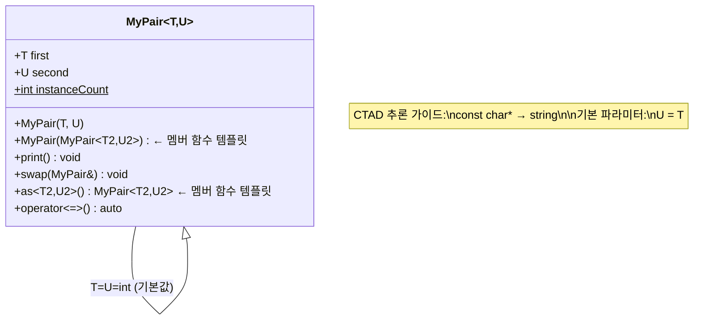
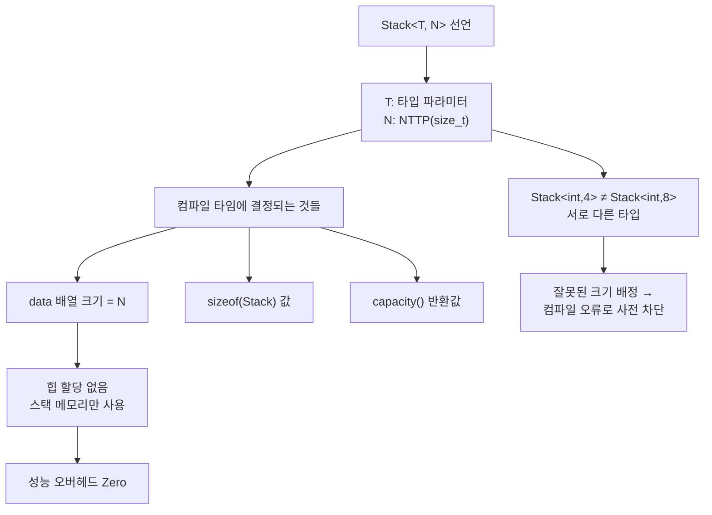
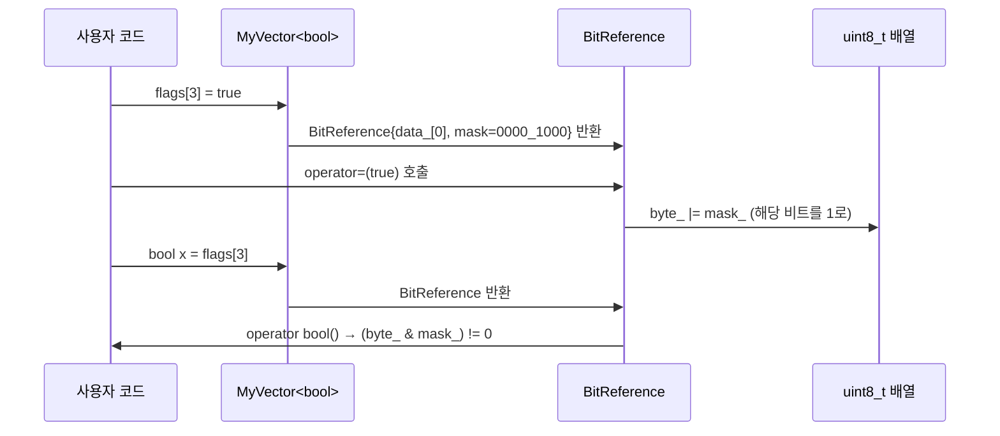

# Modern C++23 템플릿 프로그래밍  

저자: 최흥배, AI-Assisted   
    
권장 개발 환경
- **IDE**: Visual Studio 2026 (Community 이상)
- **컴파일러**: C++ 23
- **OS**: Windows 10 이상

----- 
  
# Chapter 1. 왜 템플릿인가?

---

## **1.1 코드 중복의 문제 — 타입별로 함수를 복붙하던 시절의 고통**

프로그래밍을 처음 배울 때 우리는 함수를 작성하는 것이 얼마나 훌륭한 도구인지 배웁니다. 반복되는 코드를 하나의 함수로 묶어서 재사용하면 코드가 짧아지고, 유지보수도 쉬워진다고요. 그런데 함수를 열심히 만들다 보면 금세 새로운 벽에 부딪힙니다. 바로 **타입의 벽**입니다.

예를 들어, 두 정수 중 더 큰 값을 반환하는 함수를 만들어봅시다.

```cpp
// int 버전
int max_int(int a, int b) {
    return (a > b) ? a : b;
}
```

잘 동작합니다. 그런데 이번엔 `double`도 비교해야 합니다.

```cpp
// double 버전
double max_double(double a, double b) {
    return (a > b) ? a : b;
}
```

함수 본문을 보면 완전히 동일합니다. 그저 타입만 다를 뿐이죠. 그런데 `long`, `float`, `char`, `std::string`도 비교해야 한다면 어떻게 될까요?

```cpp
// 이런 짓을 반복해야 했다...
int         max_int   (int a,         int b)         { return (a > b) ? a : b; }
double      max_double(double a,      double b)      { return (a > b) ? a : b; }
float       max_float (float a,       float b)       { return (a > b) ? a : b; }
long        max_long  (long a,        long b)        { return (a > b) ? a : b; }
std::string max_string(std::string a, std::string b) { return (a > b) ? a : b; }
```

내용은 완벽히 동일한데 타입 때문에 5개의 함수를 따로 써야 합니다. 이것은 단순히 귀찮음의 문제가 아닙니다. 만약 비교 로직을 수정해야 할 일이 생기면 5곳을 모두 찾아서 고쳐야 합니다. 하나라도 빠뜨리면 버그가 됩니다. 이것이 바로 **코드 중복(Code Duplication)** 이 무서운 이유입니다.

```
┌─────────────────────────────────────────────────────────┐
│              코드 중복의 악순환                          │
│                                                         │
│  새 타입 필요 ──→ 함수 복붙 ──→ 이름 바꾸기             │
│       ↑                                ↓                │
│  또 새 타입                    버그 수정 필요            │
│       ↑                                ↓                │
│       └──────────── 5곳 모두 수정 ─────┘               │
│                   (하나라도 빠뜨리면 💥)                │
└─────────────────────────────────────────────────────────┘
```

C++ 함수 오버로딩(overloading)을 사용하면 이름은 통일할 수 있습니다.

```cpp
// 오버로딩으로 이름은 통일했지만...
int    max(int a,    int b)    { return (a > b) ? a : b; }
double max(double a, double b) { return (a > b) ? a : b; }
float  max(float a,  float b)  { return (a > b) ? a : b; }
// 여전히 본문은 복붙 중
```

이름은 하나로 만들었지만 **본문의 중복은 해결되지 않았습니다.** 바로 이 지점에서 템플릿의 필요성이 탄생합니다.

---

## **1.2 매크로로 해결하려 했던 C의 방식과 그 한계**

C 언어 시절의 프로그래머들도 이 문제를 알고 있었고, 해결책을 찾아냈습니다. 바로 **전처리기 매크로(Preprocessor Macro)** 입니다.

```c
// C 스타일: 매크로로 제네릭 흉내내기
#define MAX(a, b) ((a) > (b) ? (a) : (b))
```

얼핏 보면 훌륭한 해결책 같습니다. `MAX(3, 5)`, `MAX(3.14, 2.71)`, `MAX('A', 'Z')` 모두 동작하니까요. 하지만 매크로는 **컴파일러가 전혀 개입하지 않는 단순 텍스트 치환**이기 때문에, 실제로 쓰다 보면 끔찍한 함정이 도사리고 있습니다.

**함정 1: 부작용(Side Effect) 문제**

```c
int x = 5, y = 3;
int result = MAX(x++, y++);  // 어떤 값이 나올까?
```

`MAX(x++, y++)` 는 전처리기에 의해 이렇게 치환됩니다.

```c
int result = ((x++) > (y++) ? (x++) : (y++));
//                                   ↑ x++가 두 번 실행된다!
```

`x`가 더 크다면 `x++`가 두 번 실행되어 `x`가 예상보다 1 더 증가합니다. 이런 버그는 찾기도 매우 어렵습니다.

**함정 2: 타입 안전성 없음**

```c
// 컴파일러가 아무 경고도 주지 않는다
int n = MAX(3, "hello");  // 정수와 문자열을 비교?!
```

매크로는 텍스트를 치환할 뿐이라서, 말이 안 되는 타입끼리 비교해도 컴파일러가 경고조차 주지 못합니다.

**함정 3: 디버깅 불가**

```c
#define SQUARE(x) ((x) * (x))
```

이 매크로에서 버그가 나도 디버거는 매크로 내부로 들어갈 수 없습니다. 매크로는 컴파일러가 보기 전에 이미 텍스트로 펼쳐져 버리기 때문입니다.

**함정 4: 이름 충돌**

```c
#define MAX(a, b) ...  // 어딘가에 정의됨
// 나중에 MAX라는 이름의 변수나 함수를 쓰면? 💥
int MAX = 100;  // 전처리기가 이것도 치환해버린다!
```

```
┌──────────────────────────────────────────────────────────┐
│              매크로의 문제점 요약                         │
├──────────────────────────────────────────────────────────┤
│  ❌ 타입 검사 없음   → 말도 안 되는 타입도 통과          │
│  ❌ 부작용 문제      → a++가 두 번 실행될 수 있음        │
│  ❌ 디버깅 불가      → 디버거가 매크로 내부를 못 봄      │
│  ❌ 이름 충돌        → 스코프 개념이 없음                │
│  ❌ 에러 메시지 혼란 → 치환된 코드에서 에러가 나옴       │
└──────────────────────────────────────────────────────────┘
```

C++에서도 매크로를 완전히 추방하지는 못했지만, 오늘날의 가이드라인은 **매크로 사용을 최소화**하고 그 자리를 템플릿, `constexpr`, `inline` 함수 등으로 대체할 것을 강력히 권장합니다. 바로 이 이유 때문에 C++에는 처음부터 템플릿이 설계되었습니다.

---

## **1.3 템플릿이란 무엇인가 — 컴파일러가 코드를 찍어내는 틀(mold)**

이제 드디어 템플릿을 만날 시간입니다. 템플릿(Template)의 어원적 의미는 **"틀"** 또는 **"거푸집"** 입니다. 공장에서 같은 모양의 부품을 찍어낼 때 쓰는 그 틀 말입니다. C++ 템플릿도 정확히 같은 역할을 합니다. 프로그래머는 **코드의 틀**을 하나 작성하고, 컴파일러가 필요한 타입에 맞게 실제 코드를 찍어냅니다.

앞서 고통스럽게 5번 복붙했던 `max` 함수를 템플릿으로 표현하면 이렇게 됩니다.

```cpp
// 하나의 틀로 모든 타입을 처리!
template<typename T>
T max(T a, T b) {
    return (a > b) ? a : b;
}
```

이제 이것을 다양한 타입으로 사용해봅시다.

```cpp
#include <iostream>
#include <string>

template<typename T>
T max(T a, T b) {
    return (a > b) ? a : b;
}

int main() {
    std::cout << max(3, 5)            << "\n";  // int 버전 생성
    std::cout << max(3.14, 2.71)      << "\n";  // double 버전 생성
    std::cout << max('A', 'Z')        << "\n";  // char 버전 생성

    std::string s1 = "apple", s2 = "banana";
    std::cout << max(s1, s2)          << "\n";  // string 버전 생성
}
```

```
출력:
5
3.14
Z
banana
```

단 하나의 함수 정의로 네 가지 타입 모두 처리했습니다. 이것이 가능한 이유는 컴파일러가 **컴파일 시간에** 실제 코드를 자동으로 생성해주기 때문입니다.

컴파일러가 실제로 하는 일을 시각적으로 표현하면 다음과 같습니다.

```
  소스 코드 (프로그래머가 작성)
  ┌─────────────────────────┐
  │  template<typename T>   │
  │  T max(T a, T b) {      │  ← 하나의 틀(mold)
  │    return (a>b)?a:b;    │
  │  }                      │
  └────────────┬────────────┘
               │  컴파일러가 사용 현황을 분석
               │
       ┌───────┼────────────┐
       ↓       ↓            ↓
  max(3,5)  max(3.14,2.71)  max('A','Z')
       │       │            │
       ↓       ↓            ↓
  ┌─────────┐ ┌──────────┐ ┌──────────┐
  │int max  │ │double max│ │char max  │  ← 컴파일러가 자동 생성
  │(int a,  │ │(double a,│ │(char a,  │     (템플릿 인스턴스화)
  │ int b)  │ │ double b)│ │ char b)  │
  └─────────┘ └──────────┘ └──────────┘
```

이 과정을 **템플릿 인스턴스화(Template Instantiation)** 라고 부릅니다. "T라는 빈칸에 실제 타입을 채워 넣어서 실제 코드를 만드는 것"이라고 이해하면 됩니다.

여기서 매우 중요한 사실이 있습니다. 템플릿은 매크로와 달리 **컴파일러가 완전히 이해하는 코드**입니다. 따라서:

- ✅ **타입 안전성**: `max(3, "hello")` 처럼 잘못된 호출은 컴파일 에러로 즉시 잡힙니다.
- ✅ **부작용 없음**: 일반 함수와 동일하게 동작하므로 `max(x++, y++)` 도 안전합니다.
- ✅ **디버깅 가능**: 인스턴스화된 함수는 일반 함수와 동일하게 디버거로 추적할 수 있습니다.
- ✅ **스코프 준수**: 템플릿도 네임스페이스, 클래스 안에 정의할 수 있습니다.
- ✅ **성능 손실 없음**: 런타임 오버헤드가 전혀 없습니다. 컴파일 타임에 모든 것이 결정됩니다.

> 💡 **핵심 개념: 제로 오버헤드 추상화**
>
> C++ 설계 철학의 핵심 중 하나는 "사용하지 않는 것에는 비용을 지불하지 않는다"는 것입니다. 템플릿은 이 철학을 완벽하게 구현합니다. 컴파일러가 생성한 `int max(int, int)`는 프로그래머가 직접 손으로 작성한 것과 **완전히 동일한 기계어 코드**를 만들어냅니다.

---

## **1.4 템플릿의 두 얼굴: 제네릭 프로그래밍 vs. 메타프로그래밍**

템플릿을 배우다 보면 두 가지 전혀 다른 방향의 활용법이 존재한다는 것을 알게 됩니다. 이 책 전체를 이해하는 데 중요한 개념이므로 처음부터 명확하게 구분해 두겠습니다.

**제네릭 프로그래밍 (Generic Programming)**

제네릭 프로그래밍은 타입에 독립적인 알고리즘과 자료구조를 작성하는 방식입니다. "어떤 타입이든 동작하는 코드"를 만드는 것이 목표입니다. 우리가 앞서 만든 `max<T>` 함수가 바로 제네릭 프로그래밍의 예입니다.

```cpp
// 제네릭 프로그래밍: 타입에 무관한 알고리즘
template<typename T>
void sort(std::vector<T>& v) {
    // int든 string이든 동일한 정렬 로직
}
```

C++ 표준 라이브러리(STL)가 제네릭 프로그래밍의 가장 훌륭한 사례입니다. `std::vector<int>`, `std::vector<std::string>`, `std::sort`, `std::find` 등이 모두 템플릿으로 만들어져 있습니다.

**템플릿 메타프로그래밍 (Template Metaprogramming, TMP)**

템플릿 메타프로그래밍은 훨씬 더 독특한 개념입니다. 템플릿을 이용해 **컴파일 타임에 계산을 수행**하는 기법입니다. 쉽게 말해, "프로그램을 컴파일하는 과정 자체가 프로그램을 실행하는 것"입니다.

```cpp
// 템플릿 메타프로그래밍: 컴파일 타임에 계산
template<int N>
struct Factorial {
    static constexpr int value = N * Factorial<N-1>::value;
};

template<>
struct Factorial<0> {
    static constexpr int value = 1;
};

// 이 값은 런타임이 아닌 컴파일 타임에 이미 120으로 결정됨
constexpr int result = Factorial<5>::value;  // result == 120
```

이 코드에서 `Factorial<5>::value`는 **프로그램이 실행되기도 전에** 이미 120이라는 값으로 결정됩니다. 컴파일러가 계산을 대신 해주는 것입니다.

두 방향의 차이를 한눈에 비교하면 다음과 같습니다.

```
┌──────────────────────────────────────────────────────────────┐
│               템플릿의 두 가지 활용 방향                      │
├──────────────────────┬───────────────────────────────────────┤
│  제네릭 프로그래밍   │       템플릿 메타프로그래밍            │
├──────────────────────┼───────────────────────────────────────┤
│  타입에 독립적 코드  │  컴파일 타임 계산                      │
│  목적: 코드 재사용   │  목적: 런타임 비용을 컴파일 타임으로   │
│  결과: 런타임 실행   │  결과: 컴파일 타임에 값/타입 결정      │
├──────────────────────┼───────────────────────────────────────┤
│  std::vector<T>      │  Factorial<5>::value                  │
│  std::sort(...)      │  is_integral<T>::value                │
│  std::optional<T>    │  conditional<cond, T, F>::type        │
├──────────────────────┼───────────────────────────────────────┤
│  🟢 이 책의 주 내용  │  🔵 후반부에서 점진적으로 다룸        │
└──────────────────────┴───────────────────────────────────────┘
```

이 책은 제네릭 프로그래밍을 주축으로 하되, 메타프로그래밍도 실용적인 범위에서 함께 다룹니다. 처음에는 제네릭 프로그래밍에 집중하고, PART 3에서 메타프로그래밍으로 자연스럽게 넘어가는 구성입니다.


> 💡 **C++23에서 메타프로그래밍이 더 쉬워진 이유**
>
> 과거의 템플릿 메타프로그래밍은 매우 난해한 트릭들로 가득했습니다. 그러나 C++17의 `if constexpr`, C++20의 Concepts, C++23의 `if consteval`과 `deducing this` 덕분에 이전에는 복잡한 메타프로그래밍 트릭이 필요했던 많은 것들을 이제는 훨씬 직관적인 코드로 표현할 수 있게 되었습니다. 이 책이 C++23을 기준으로 삼은 이유가 바로 여기에 있습니다.

---

## **Chapter 1 정리**

이번 챕터에서 우리는 템플릿이 왜 필요한지를 역사적 흐름 속에서 살펴보았습니다. 중복 코드의 고통에서 출발해서, 매크로라는 불완전한 해결책을 거쳐, 마침내 템플릿이라는 우아하고 타입 안전한 해결책에 도달했습니다. 또한 템플릿에는 "제네릭 프로그래밍"과 "메타프로그래밍"이라는 두 가지 활용 방향이 있음을 이해했습니다.

```
코드 중복의 고통
      │
      ▼
매크로 (임시방편) ── 타입 안전성 없음, 디버깅 불가
      │
      ▼
함수 오버로딩 ──── 이름은 통일되지만 본문 중복은 해결 안 됨
      │
      ▼
C++ 템플릿 ◀──── 타입 안전 + 제로 오버헤드 + 완전한 표현력
      │
      ├── 제네릭 프로그래밍 → 타입에 무관한 알고리즘/자료구조
      └── 메타프로그래밍   → 컴파일 타임 계산/타입 조작
```

다음 챕터에서는 드디어 손으로 직접 함수 템플릿을 작성하는 법을 배웁니다. `template<typename T>` 라는 선언이 실제로 어떻게 동작하는지, 컴파일러가 타입을 어떻게 추론하는지를 단계별로 알아봅시다.

---

> ⚙️ **Visual Studio 2026 설정 확인**
>
> 이 책의 모든 예제를 실행하려면 프로젝트 속성에서 C++ 언어 표준을 `ISO C++23 표준(/std:c++23)` 또는 `최신 C++ 초안 기능 사용(/std:c++latest)` 으로 설정해야 합니다.
> **프로젝트 속성 → 구성 속성 → C/C++ → 언어 → C++ 언어 표준**


# Chapter 2. 함수 템플릿 (Function Template)

---

## **2.1 기본 문법: `template<typename T>`**

함수 템플릿의 선언은 일반 함수 앞에 **템플릿 선언부**를 붙이는 것으로 시작합니다. 문법의 구조를 먼저 해부해봅시다.

```
template < typename T >
   ①         ②      ③
```

① `template` — "이 다음에 오는 것은 템플릿이다"라고 컴파일러에게 알리는 키워드입니다.  
② `typename` — "T는 타입 파라미터다"라는 의미입니다. 역사적으로 `class`라는 키워드도 동일한 의미로 사용됩니다.  
③ `T` — 타입 파라미터의 이름입니다. 관례적으로 `T`를 쓰지만, 어떤 이름이든 가능합니다.

> 💡 **`typename` vs `class`**
>
> `template<typename T>` 와 `template<class T>` 는 함수 템플릿에서 완전히 동일한 의미입니다. 다만 현대 C++ 스타일에서는 "T는 꼭 클래스가 아니어도 된다"는 의도를 명확히 하기 위해 `typename`을 선호합니다. 이 책에서도 `typename`을 기본으로 사용합니다.

실제 함수 템플릿의 구조를 살펴봅시다.

```cpp
//  ┌─── 템플릿 선언부
//  │          ┌─── 타입 파라미터 이름
template<typename T>
T add(T a, T b) {   // ← T를 실제 타입처럼 사용
    return a + b;
}
```

```
┌─────────────────────────────────────────────────┐
│           함수 템플릿 구조 해부                   │
│                                                 │
│  template<typename T>                           │
│  ┌────────┐                                     │
│  │반환타입│  T                                  │
│  └────────┘                                     │
│             add ( T a, T b ) {                  │
│                   └──┬──┘                       │
│               파라미터도 T 사용                  │
│               return a + b;                     │
│             }                                   │
└─────────────────────────────────────────────────┘
```

이제 간단한 완성 예제를 보겠습니다.

```cpp
#include <iostream>

template<typename T>
T add(T a, T b) {
    return a + b;
}

int main() {
    std::cout << add(1, 2)          << "\n";  // T = int
    std::cout << add(1.5, 2.5)      << "\n";  // T = double
    std::cout << add(1.0f, 2.0f)    << "\n";  // T = float
}
```

```
출력:
3
4
3
```

단 하나의 함수 정의로 세 가지 타입을 처리했습니다. 컴파일러는 각 호출을 보고 `T`에 어떤 타입을 넣어야 할지 자동으로 판단합니다. 이 과정을 다음 절에서 자세히 살펴봅니다.

---

## **2.2 타입 추론(Template Argument Deduction) — 컴파일러가 T를 읽는 법**

`add(1, 2)`를 호출할 때 우리는 `T`가 무엇인지 명시하지 않았습니다. 컴파일러가 인수를 보고 스스로 `T = int`라고 결론 내립니다. 이것을 **템플릿 인수 추론(Template Argument Deduction)** 이라고 합니다.

추론 규칙은 직관적입니다. **인수의 타입이 곧 T의 타입**이 됩니다.

```cpp
template<typename T>
T max(T a, T b) {
    return (a > b) ? a : b;
}

max(10, 20);        // 10은 int  → T = int
max(3.14, 2.71);    // 3.14는 double → T = double
max('A', 'Z');      // 'A'는 char → T = char
```

```
  호출: max(10, 20)
        │    │
        ↓    ↓
     int  , int  → T = int ✅

  호출: max(3.14, 2.71)
        │      │
        ↓      ↓
    double, double → T = double ✅

  호출: max(10, 3.14)
        │     │
        ↓     ↓
      int , double → T = ??? ❌ 충돌! 컴파일 에러
```

마지막 경우가 중요합니다. `max(10, 3.14)`처럼 두 인수의 타입이 다르면 컴파일러는 **T를 하나로 결정할 수 없어서** 에러가 발생합니다. 이 문제의 해결책은 뒤에서 다룹니다.

**추론이 실패하는 대표적인 케이스**들을 정리하면 다음과 같습니다.

```cpp
template<typename T>
T max(T a, T b) { return (a > b) ? a : b; }

// ❌ 케이스 1: 두 인수의 타입이 달라서 T를 결정 불가
max(1, 2.0);

// ❌ 케이스 2: 반환 타입에만 T가 쓰이는 경우 추론 불가
template<typename T>
T zero() { return T{}; }
zero();      // 어떤 T를 원하는지 알 수 없음

// ✅ 해결: 명시적으로 타입 지정 (2.3절에서 설명)
max<double>(1, 2.0);  // int → double 로 암묵 변환
zero<int>();
```

**참조 타입과 추론**도 알아두어야 합니다. 함수 파라미터가 참조(reference)인 경우 추론 결과가 달라질 수 있습니다.

```cpp
template<typename T>
void show(T a) {          // 값으로 받을 때: 참조/const 제거
    // T = int (int&, const int 모두 int로 추론)
}

template<typename T>
void show_ref(T& a) {     // 참조로 받을 때: 참조는 제거, const는 유지
    // const int& 인수 → T = const int
}
```

이 참조와 추론의 미묘한 관계는 Chapter 8에서 보편 참조(Universal Reference)를 다룰 때 더 깊이 살펴봅니다.

---

## **2.3 명시적 타입 지정: `add<int>(a, b)`**

자동 추론에 의존하지 않고, 프로그래머가 직접 `T`를 지정할 수도 있습니다. 함수 이름 뒤에 꺾쇠괄호(`<>`)로 타입을 명시하면 됩니다.

```cpp
template<typename T>
T add(T a, T b) {
    return a + b;
}

int main() {
    // 명시적 타입 지정
    add<int>(1, 2);          // T = int 로 강제 지정
    add<double>(1, 2);       // T = double, int→double 암묵 변환 발생
    add<double>(1, 2.5);     // T = double, 1은 1.0으로 변환
}
```

명시적 지정이 필요한 상황은 크게 세 가지입니다.

```cpp
// 상황 1: 두 인수의 타입이 달라 추론이 실패할 때
max<double>(10, 3.14);   // int → double 으로 변환 후 비교

// 상황 2: 반환 타입에만 T가 있어서 추론 불가능할 때
template<typename T>
T create() { return T{}; }
auto val = create<std::string>();  // 명시 필수

// 상황 3: 추론 가능하지만 의도를 명확히 하고 싶을 때
add<long long>(100, 200);  // 의도적으로 long long 사용
```

**부분 명시(Partial Explicit Specification)** 도 가능합니다. 여러 타입 파라미터가 있을 때 앞쪽 파라미터만 명시하면 나머지는 추론에 맡길 수 있습니다.

```cpp
template<typename R, typename T>
R convert(T val) {
    return static_cast<R>(val);
}

// R만 명시, T는 3.14에서 추론 (double)
auto result = convert<int>(3.14);   // result = 3
```

---

## **2.4 다중 타입 파라미터: `template<typename T, typename U>`**

타입 파라미터는 하나로 제한되지 않습니다. 서로 다른 타입의 인수를 받아야 할 때는 여러 개의 타입 파라미터를 선언할 수 있습니다.

```cpp
#include <iostream>

// T와 U가 서로 다른 타입일 수 있음
template<typename T, typename U>
void print_pair(T first, U second) {
    std::cout << first << " / " << second << "\n";
}

int main() {
    print_pair(42, "hello");         // T=int, U=const char*
    print_pair(3.14, true);          // T=double, U=bool
    print_pair("age", 25);           // T=const char*, U=int
}
```

```
출력:
42 / hello
3.14 / 1
age / 25
```

다중 파라미터를 활용하는 전형적인 패턴으로 두 타입 중 "더 큰" 타입으로 결과를 반환하는 함수를 생각해봅시다. `std::common_type_t`를 이용하면 우아하게 해결됩니다.

```cpp
#include <type_traits>

// int + double → double 반환
// int + float  → float 반환
template<typename T, typename U>
auto add(T a, U b) -> std::common_type_t<T, U> {
    return a + b;
}

int main() {
    auto r1 = add(1, 2.5);    // int + double → double 3.5
    auto r2 = add(1, 2);      // int + int    → int 3
}
```

```
              T=int    U=double
                │          │
                └────┬─────┘
                     ↓
          common_type_t<int, double>
                     ↓
                  = double  ← 반환 타입
```

> 💡 **`std::common_type_t`란?**
>
> 두 타입 사이의 "공통 타입"을 컴파일 타임에 계산해주는 표준 라이브러리 도구입니다. `int`와 `double`의 공통 타입은 `double`이고, `int`와 `float`의 공통 타입은 `float`입니다. `<type_traits>` 헤더에 있으며, Chapter 11에서 자세히 다룹니다.

---

## **2.5 반환 타입 추론과 `auto`의 활용**

함수 템플릿에서 반환 타입을 결정하는 방법은 시대에 따라 발전해왔습니다. C++11, C++14, C++23으로 이어지는 발전 과정을 살펴보면 현대적인 스타일이 왜 편리한지 자연스럽게 이해할 수 있습니다.

**방법 1: 후행 반환 타입 (C++11)**

```cpp
// decltype으로 반환 타입을 명시적으로 표현
template<typename T, typename U>
auto add(T a, U b) -> decltype(a + b) {
    return a + b;
}
```

`decltype(a + b)`는 "`a + b`라는 표현식의 타입"을 의미합니다. `int + double`이면 `double`, `double + double`이면 `double`이 됩니다. 정확하지만 반환 타입을 따로 써야 해서 장황합니다.

**방법 2: `auto` 반환 타입 추론 (C++14~)**

```cpp
// 컴파일러가 return 문에서 타입을 자동 추론
template<typename T, typename U>
auto add(T a, U b) {    // ← 반환 타입 auto
    return a + b;       // ← 이 표현식의 타입이 반환 타입
}
```

훨씬 간결합니다. `return a + b`에서 `a + b`의 타입을 컴파일러가 알아서 추론해줍니다.

**방법 3: `decltype(auto)` — 참조까지 정확하게**

```cpp
template<typename T>
decltype(auto) get_first(T& container) {
    return container[0];  // 참조라면 참조로, 값이면 값으로 반환
}
```

`auto`만 쓰면 참조가 제거되어 복사가 발생할 수 있습니다. `decltype(auto)`는 `return` 표현식의 타입을 참조 여부까지 포함하여 그대로 보존합니다. 이 미묘한 차이는 Chapter 8에서 자세히 다룹니다.

세 방법을 비교 정리하면 다음과 같습니다.

```
┌──────────────────┬────────────────────────────────────────┐
│      방법        │              예시                       │
├──────────────────┼────────────────────────────────────────┤
│ 명시적 반환 타입 │ T add(T a, T b)                        │
│  → 타입 고정     │ (T가 하나일 때 단순한 경우에 적합)     │
├──────────────────┼────────────────────────────────────────┤
│ 후행 반환 타입   │ auto add(T a, U b) -> decltype(a+b)    │
│  → C++11 스타일  │ (정확하지만 반복적)                    │
├──────────────────┼────────────────────────────────────────┤
│ auto 반환 추론   │ auto add(T a, U b) { return a+b; }     │
│  → C++14~ 스타일 │ (가장 간결, 이 책의 기본 스타일)       │
├──────────────────┼────────────────────────────────────────┤
│ decltype(auto)   │ decltype(auto) get(T& c)               │
│  → 참조 보존     │ (참조 반환이 중요할 때 사용)            │
└──────────────────┴────────────────────────────────────────┘
```

이 책에서는 특별한 이유가 없다면 **`auto` 반환 추론** 방식을 기본으로 사용합니다. 가장 간결하고 현대적인 스타일이기 때문입니다.

---

## **2.6 인라인과 헤더 파일: 왜 `.h`에 구현을 넣는가**

C++을 배우면서 "선언은 `.h`에, 구현은 `.cpp`에"라는 규칙을 배웁니다. 그런데 템플릿은 이 규칙의 예외입니다. **템플릿의 구현은 반드시 헤더 파일에 있어야 합니다.** 왜 그럴까요?

이유를 이해하기 위해 컴파일러가 템플릿을 처리하는 과정을 살펴봅시다.

```
┌─────────────────────────────────────────────────────────┐
│              일반 함수의 컴파일 과정                     │
│                                                         │
│  main.cpp          math.h           math.cpp            │
│  ┌──────────┐      ┌──────────┐     ┌──────────┐        │
│  │#include  │      │int add(  │     │int add(  │        │
│  │"math.h"  │─────▶│ int,int);│     │int a,    │        │
│  │          │      └──────────┘     │int b){   │        │
│  │add(1,2); │                       │return a+b│        │
│  └──────────┘                       │}         │        │
│       │                             └──────────┘        │
│       │ 컴파일                            │ 컴파일        │
│       ↓                                   ↓             │
│  main.obj ──────────────────────── math.obj             │
│       └──────────── 링킹 ───────────────┘               │
│                        ↓                                │
│                   실행 파일                              │
└─────────────────────────────────────────────────────────┘
```

일반 함수는 선언만 알면 컴파일이 가능하고, 구현은 나중에 링킹 단계에서 연결됩니다.

```
┌─────────────────────────────────────────────────────────┐
│           템플릿 함수의 컴파일 과정                      │
│                                                         │
│  main.cpp                    mytemplate.h               │
│  ┌──────────────────┐        ┌──────────────────┐       │
│  │#include          │        │template<typename T>      │
│  │"mytemplate.h"    │───────▶│T add(T a, T b) { │       │
│  │                  │        │  return a + b;   │       │
│  │add(1, 2);        │        │}                 │       │
│  │add(1.5, 2.5);    │        └──────────────────┘       │
│  └──────────────────┘                                   │
│          │                                              │
│          │ 컴파일러가 add<int>, add<double> 생성        │
│          ↓                                              │
│      main.obj (인스턴스화된 코드 포함)                  │
└─────────────────────────────────────────────────────────┘
```

핵심은 **컴파일러가 템플릿을 인스턴스화하려면 그 시점에 구현 전체를 볼 수 있어야** 한다는 것입니다. `add(1, 2)`를 컴파일하는 순간, 컴파일러는 `add<int>`의 코드를 실제로 만들어야 합니다. 그러려면 함수 본문이 필요합니다. 만약 구현이 다른 `.cpp` 파일에 있다면, 컴파일러는 그것을 볼 수 없습니다.

```cpp
// ❌ 잘못된 방식: 구현을 .cpp에 두면 링킹 에러 발생
// template_math.h
template<typename T>
T add(T a, T b);  // 선언만

// template_math.cpp
template<typename T>
T add(T a, T b) { return a + b; }  // 구현

// main.cpp
#include "template_math.h"
add(1, 2);  // ❌ 링커가 add<int>를 찾을 수 없음!
```

```cpp
// ✅ 올바른 방식: 선언과 구현 모두 헤더에
// template_math.h
template<typename T>
T add(T a, T b) {   // 선언 + 구현 모두 헤더에
    return a + b;
}
```

**`inline` 키워드는 필요한가?**

헤더에 일반 함수 구현을 넣으면 여러 `.cpp`에서 include 할 때 "중복 정의" 에러가 납니다. 그래서 보통 `inline`을 붙입니다. 그런데 템플릿 함수는 자동으로 `inline` 처리가 됩니다. 따라서 별도로 `inline`을 붙이지 않아도 됩니다.

```cpp
// 아래 두 가지는 사실상 동일
template<typename T>
T add(T a, T b) { return a + b; }

template<typename T>
inline T add(T a, T b) { return a + b; }  // inline은 중복이지만 무해
```

> 💡 **예외: 명시적 특수화(Explicit Specialization)**
>
> 템플릿의 특정 타입에 대한 완전한 특수화(Chapter 5에서 다룸)는 일반 함수처럼 동작하므로, `.cpp`에 구현하고 헤더에는 선언만 둘 수도 있습니다. 하지만 특별한 이유가 없다면 헤더에 모두 두는 것이 일관성 면에서 낫습니다.

---

## **🛠 실습: `my_max`, `my_swap`, `print` 함수 템플릿 만들기**

지금까지 배운 내용을 종합해서 세 가지 실용적인 함수 템플릿을 만들어봅시다.

**실습 목표**
- 함수 템플릿 기본 문법 작성
- 타입 추론 동작 확인
- `auto` 반환 타입 추론 활용
- 다중 타입 파라미터 활용

**실습 파일 구조**

```
MyTemplates/
├── my_templates.h    ← 템플릿 구현
└── main.cpp          ← 테스트 코드
```

**my_templates.h**

```cpp
#pragma once
#include <iostream>
#include <utility>   // std::move

// ─────────────────────────────────────────
// 1. my_max: 두 값 중 큰 것을 반환
//    > 연산자가 정의된 모든 타입에 동작
// ─────────────────────────────────────────
template<typename T>
const T& my_max(const T& a, const T& b) {
    return (a > b) ? a : b;
}

// ─────────────────────────────────────────
// 2. my_swap: 두 변수의 값을 교환
//    std::move로 불필요한 복사를 방지
// ─────────────────────────────────────────
template<typename T>
void my_swap(T& a, T& b) {
    T temp = std::move(a);
    a = std::move(b);
    b = std::move(temp);
}

// ─────────────────────────────────────────
// 3. print: 어떤 타입이든 출력
//    다중 타입 파라미터로 레이블과 값 분리
// ─────────────────────────────────────────
template<typename Label, typename Value>
void print(const Label& label, const Value& value) {
    std::cout << label << ": " << value << "\n";
}
```

**main.cpp**

```cpp
#include <iostream>
#include <string>
#include "my_templates.h"

int main() {
    // ── my_max 테스트 ──────────────────────
    std::cout << "=== my_max ===\n";
    print("int max(3,7)",       my_max(3, 7));
    print("double max(1.5,2.5)",my_max(1.5, 2.5));

    std::string s1 = "apple", s2 = "banana";
    print("string max",         my_max(s1, s2));

    // ── my_swap 테스트 ─────────────────────
    std::cout << "\n=== my_swap ===\n";
    int x = 10, y = 20;
    print("before x", x);
    print("before y", y);
    my_swap(x, y);
    print("after  x", x);
    print("after  y", y);

    std::string hello = "hello", world = "world";
    my_swap(hello, world);
    print("swapped", hello + " " + world);

    // ── print 테스트 ───────────────────────
    std::cout << "\n=== print ===\n";
    print("integer",  42);
    print("pi",       3.14159);
    print("greeting", std::string("Hi!"));
    print(100,        "value with int label");
}
```

**예상 출력**

```
=== my_max ===
int max(3,7): 7
double max(1.5,2.5): 2.5
string max: banana

=== my_swap ===
before x: 10
before y: 20
after  x: 20
after  y: 10
swapped: world hello

=== print ===
integer: 42
pi: 3.14159
greeting: Hi!
100: value with int label
```

**코드 포인트 해설**

`my_max`에서 파라미터 타입으로 `const T&`를 사용한 것에 주목하세요. 값으로 받는 `T a`와 달리, `const T&`는 **복사 없이 참조**로 받기 때문에 `std::string`처럼 복사 비용이 큰 타입에도 효율적입니다. 또한 반환 타입도 `const T&`로 하여 결과 역시 복사 없이 반환합니다.

`my_swap`에서는 `std::move`를 활용했습니다. `T temp = a` 대신 `T temp = std::move(a)`를 쓰면 `std::string`처럼 이동(move)이 가능한 타입에서 불필요한 메모리 복사를 피할 수 있습니다. 표준 라이브러리의 `std::swap`도 내부적으로 동일한 방식으로 구현되어 있습니다.

`print`는 서로 다른 타입 `Label`과 `Value`를 독립적으로 추론합니다. 덕분에 `print(100, "hello")`처럼 레이블이 정수고 값이 문자열인 경우도 자연스럽게 처리됩니다.

**Visual Studio 2026에서 인스턴스화 확인하기**

Visual Studio의 [빌드 → 컴파일] 후 **출력 창**에서 생성된 코드를 확인하거나, `/d1templateStats` 컴파일 옵션을 추가하면 몇 개의 템플릿 인스턴스가 생성됐는지 통계를 볼 수 있습니다. 위 예제에서는 `my_max<int>`, `my_max<double>`, `my_max<std::string>` 등 총 여러 개의 인스턴스가 생성되었을 것입니다.

---

## **Chapter 2 정리**

이번 챕터에서 함수 템플릿의 핵심을 배웠습니다. 한 눈에 정리하면 다음과 같습니다.

```
┌──────────────────────────────────────────────────────────┐
│               Chapter 2 핵심 정리                        │
├──────────────────────────────────────────────────────────┤
│                                                          │
│  2.1 기본 문법                                           │
│      template<typename T>                                │
│      T func(T a) { ... }                                 │
│                                                          │
│  2.2 타입 추론                                           │
│      func(42)    → T = int   (자동)                      │
│      func(3.14)  → T = double(자동)                      │
│      func(1,2.0) → ❌ 추론 실패                          │
│                                                          │
│  2.3 명시적 지정                                         │
│      func<double>(1, 2.0)   → OK                        │
│                                                          │
│  2.4 다중 파라미터                                       │
│      template<typename T, typename U>                    │
│      void func(T a, U b) { ... }                         │
│                                                          │
│  2.5 반환 타입                                           │
│      auto func(T a, U b) { return a + b; }  ← 권장      │
│                                                          │
│  2.6 헤더 배치                                           │
│      템플릿 구현은 반드시 .h 파일에!                      │
│      (컴파일 타임에 본문이 필요하기 때문)                 │
└──────────────────────────────────────────────────────────┘
```

다음 챕터에서는 함수 템플릿에서 한 발 더 나아가, **클래스 템플릿**을 만들어봅니다. `std::vector<T>`, `std::optional<T>` 같은 표준 라이브러리가 어떤 원리로 동작하는지 직접 만들어보면서 이해하게 될 것입니다.


# Chapter 3. 클래스 템플릿 (Class Template)

앞 챕터에서 함수 템플릿을 통해 "컴파일러가 코드를 찍어내는 틀"이라는 템플릿의 핵심 개념을 익혔다. 이제 그 개념을 **클래스**에도 적용해보자. 함수 하나가 아니라 **데이터와 행동을 함께 묶은 설계도** 자체를 타입에 관계없이 재사용할 수 있게 되면, 코드의 표현력이 한 차원 올라간다.

`std::vector<int>`, `std::vector<std::string>`, `std::pair<int, double>` — 우리가 매일 쓰는 표준 라이브러리의 이 모든 클래스들이 바로 클래스 템플릿으로 만들어져 있다.

---

## 3.1 기본 문법과 멤버 함수 정의

**클래스 템플릿이란 무엇인가**

클래스 템플릿은 "타입을 변수처럼 받는 클래스 설계도"다. 함수 템플릿이 `template<typename T>`를 함수 앞에 붙이듯, 클래스 템플릿은 `class` 또는 `struct` 키워드 앞에 동일한 방식으로 선언한다.

```
  템플릿 선언
  ┌─────────────────────────────┐
  │ template<typename T>        │
  │ class Box { T value; };     │
  └─────────────────────────────┘
           │
           │ 컴파일러가 T를 구체적인 타입으로 대체
           ▼
  ┌──────────────────────────────────────────────┐
  │ Box<int>          Box<double>    Box<string>  │
  │ class Box {       class Box {    class Box {  │
  │   int value;        double value;  string ..  │
  │ };                };            };            │
  └──────────────────────────────────────────────┘
```

하나의 설계도에서 무한히 많은 구체 클래스가 탄생하는 구조다.

**가장 단순한 예제부터**

```cpp
#include <iostream>

template<typename T>
class Box {
public:
    T value;

    Box(T v) : value(v) {}

    void print() const {
        std::cout << "Box contains: " << value << "\n";
    }
};

int main() {
    Box<int>         intBox(42);
    Box<double>      dblBox(3.14);
    Box<std::string> strBox("hello");

    intBox.print();   // Box contains: 42
    dblBox.print();   // Box contains: 3.14
    strBox.print();   // Box contains: hello
}
```

`Box<int>`를 선언하는 순간, 컴파일러는 `T`를 `int`로 치환한 완전한 클래스를 내부적으로 생성한다. 이 과정을 **인스턴스화(Instantiation)**라고 부른다.

**멤버 함수를 클래스 외부에서 정의하기**

멤버 함수를 클래스 본문 바깥에 따로 정의할 때는, **`template<typename T>` 선언을 매번 반복**해야 하고, 클래스명도 `Box<T>`처럼 타입 파라미터를 명시해야 한다.

```cpp
template<typename T>
class Box {
public:
    T value;
    Box(T v);
    void print() const;
};

// 클래스 외부 정의: template<typename T>를 다시 써야 한다
template<typename T>
Box<T>::Box(T v) : value(v) {}

template<typename T>
void Box<T>::print() const {
    std::cout << "Box contains: " << value << "\n";
}
```

> 💡 **실전 팁**: 클래스 템플릿의 멤버 함수 구현은 반드시 헤더 파일(`.h` 또는 `.hpp`)에 있어야 한다. 컴파일러가 인스턴스화 시점에 구현 코드를 볼 수 있어야 하기 때문이다. 이 원칙은 Chapter 2에서 다룬 함수 템플릿과 동일하다.

**다중 타입 파라미터**

타입 파라미터는 하나에 국한되지 않는다. `std::pair`처럼 두 개 이상의 타입을 받을 수 있다.

```cpp
template<typename T, typename U>
class Pair {
public:
    T first;
    U second;

    Pair(T f, U s) : first(f), second(s) {}

    void print() const {
        std::cout << "(" << first << ", " << second << ")\n";
    }
};

int main() {
    Pair<int, std::string> p(1, "apple");
    p.print();  // (1, apple)
}
```

---

## 3.2 클래스 템플릿의 타입 추론 (C++17 CTAD)

**CTAD가 나오기 전의 불편함**

C++17 이전에는 클래스 템플릿을 사용할 때 항상 타입을 명시해야 했다. 함수 템플릿은 인자에서 타입을 추론할 수 있었지만, 클래스 템플릿은 그렇지 않았다.

```cpp
// C++14까지: 타입을 직접 써야 했다
Pair<int, double> p(1, 3.14);  // 번거롭다

// 그래서 make_pair 같은 헬퍼 함수를 만들었다
auto p = make_pair(1, 3.14);   // 함수 템플릿 추론을 우회하는 방법
```

**C++17 CTAD: Class Template Argument Deduction**

C++17부터는 생성자 인자를 보고 컴파일러가 타입 파라미터를 자동으로 추론한다. 이를 **CTAD(클래스 템플릿 인수 추론)**이라 한다.

```cpp
template<typename T, typename U>
class Pair {
public:
    T first;
    U second;
    Pair(T f, U s) : first(f), second(s) {}
};

int main() {
    // C++17 CTAD: 타입 명시 불필요!
    Pair p(1, 3.14);           // Pair<int, double>로 추론
    Pair q("hello", true);     // Pair<const char*, bool>로 추론

    // 표준 라이브러리도 동일하게 동작
    std::vector v = {1, 2, 3}; // std::vector<int>
    std::pair  pr(42, "hi");   // std::pair<int, const char*>
}
```

추론 과정을 그림으로 보면 다음과 같다.

```
Pair p(1, 3.14);
     │  │  │
     │  │  └── U = double 추론
     │  └────── T = int 추론
     └────────── Pair<int, double> 인스턴스화
```

**추론 가이드 (Deduction Guide)**

컴파일러의 자동 추론이 우리 의도와 다를 때는 **추론 가이드**를 직접 작성할 수 있다. 예를 들어, C 문자열 리터럴을 받을 때 `const char*` 대신 `std::string`으로 추론시키고 싶다면 이렇게 한다.

```cpp
template<typename T, typename U>
class Pair {
public:
    T first;
    U second;
    Pair(T f, U s) : first(f), second(s) {}
};

// 추론 가이드: const char*가 들어오면 string으로 바꿔서 추론하라
Pair(const char*, const char*) -> Pair<std::string, std::string>;

int main() {
    Pair p("hello", "world");
    // 가이드 없으면: Pair<const char*, const char*>
    // 가이드 있으면: Pair<std::string, std::string>

    p.first += " C++";  // string이므로 += 가능
    std::cout << p.first << "\n";  // hello C++
}
```

> 💡 **언제 추론 가이드가 필요한가?** 생성자 파라미터 타입과 클래스 타입 파라미터 간에 변환이 필요하거나, 집합체(aggregate) 타입처럼 생성자가 없는 경우 컴파일러가 추론에 실패할 수 있다. 이때 추론 가이드로 명시적 규칙을 제공한다.

---

## 3.3 기본 타입 파라미터 (Default Template Arguments)

**함수 기본값처럼, 타입에도 기본값을 줄 수 있다**

함수의 기본 매개변수와 유사하게, 템플릿 파라미터에도 기본 타입을 지정할 수 있다. 사용자가 타입을 명시하지 않으면 기본 타입이 사용된다.

```cpp
// U의 기본 타입은 int
template<typename T, typename U = int>
class Pair {
public:
    T first;
    U second;

    Pair(T f, U s = U{}) : first(f), second(s) {}

    void print() const {
        std::cout << "(" << first << ", " << second << ")\n";
    }
};

int main() {
    Pair<double>       p1(3.14);       // Pair<double, int>
    Pair<std::string>  p2("hello");    // Pair<std::string, int>
    Pair<int, double>  p3(1, 2.5);    // 명시적으로 두 타입 지정

    p1.print();  // (3.14, 0)
    p2.print();  // (hello, 0)
    p3.print();  // (1, 2.5)
}
```

**표준 라이브러리에서의 실제 활용**

이 기법은 표준 라이브러리 전체에 걸쳐 광범위하게 사용된다.

```cpp
// std::vector의 실제 선언 (단순화)
template<
    typename T,
    typename Allocator = std::allocator<T>  // 기본 할당자
>
class vector { /* ... */ };

// std::map의 실제 선언 (단순화)
template<
    typename Key,
    typename Value,
    typename Compare   = std::less<Key>,          // 기본 비교자
    typename Allocator = std::allocator<std::pair<const Key, Value>>
>
class map { /* ... */ };
```

`std::vector<int>`라고 쓸 때 할당자를 매번 명시하지 않아도 되는 이유가 바로 기본 타입 파라미터 덕분이다.

**주의: 기본 파라미터는 오른쪽부터**

함수의 기본 매개변수와 마찬가지로, **기본값이 있는 타입 파라미터는 항상 오른쪽에 위치**해야 한다.

```cpp
// ✅ 올바름: 기본값 없는 것이 왼쪽
template<typename T, typename U = int, typename V = double>
class Triple { /* ... */ };

// ❌ 컴파일 오류: 기본값 있는 것 다음에 기본값 없는 것
template<typename T = int, typename U>
class Bad { /* ... */ };
```

---

## 3.4 멤버 함수 템플릿 (Member Function Template)

**클래스 템플릿 안의 또 다른 템플릿**

클래스 자체가 템플릿이더라도, 그 안의 멤버 함수가 **추가적인 타입 파라미터**를 받을 수 있다. 이를 **멤버 함수 템플릿**이라 한다. 클래스의 `T`와는 별개로, 멤버 함수만의 `U`를 따로 도입하는 것이다.

```cpp
template<typename T>
class Box {
public:
    T value;

    Box(T v) : value(v) {}

    // 멤버 함수 템플릿: Box의 T와 독립적인 U를 받는다
    template<typename U>
    Box<U> convert() const {
        return Box<U>(static_cast<U>(value));
    }

    // 다른 Box 타입과 값을 비교하는 멤버 함수 템플릿
    template<typename U>
    bool equals(const Box<U>& other) const {
        return static_cast<double>(value) == static_cast<double>(other.value);
    }
};

int main() {
    Box<int> intBox(42);

    // int Box → double Box로 변환
    auto dblBox = intBox.convert<double>();
    std::cout << dblBox.value << "\n";  // 42.0

    Box<double> other(42.0);
    std::cout << intBox.equals(other) << "\n";  // 1 (true)
}
```

이 관계를 도식화하면 다음과 같다.

```
Box<T=int>
│
├── value : int
│
├── print()                  ← 일반 멤버 함수 (T=int 고정)
│
└── convert<U>()             ← 멤버 함수 템플릿 (U는 호출 시 결정)
    ├── convert<double>()    → Box<double> 반환
    ├── convert<float>()     → Box<float> 반환
    └── convert<long>()      → Box<long> 반환
```

**변환 생성자 (Converting Constructor)로 활용하기**

멤버 함수 템플릿의 강력한 활용처 중 하나는 **다른 인스턴스화로부터의 변환 생성자**다. `std::vector<int>`를 `std::vector<double>`로 만들 때 내부적으로 이 기법이 사용된다.

```cpp
template<typename T>
class Box {
public:
    T value;

    Box(T v) : value(v) {}

    // 다른 타입의 Box에서 생성하는 변환 생성자
    template<typename U>
    Box(const Box<U>& other)
        : value(static_cast<T>(other.value)) {}
};

int main() {
    Box<int>    intBox(100);
    Box<double> dblBox(intBox);  // Box<int> → Box<double> 변환

    std::cout << dblBox.value << "\n";  // 100.0
}
```

---

## 3.5 static 멤버와 템플릿

**각 인스턴스화마다 독립적인 static 멤버**

일반 클래스의 `static` 멤버는 모든 인스턴스가 공유하는 하나의 변수다. 그런데 클래스 템플릿의 `static` 멤버는 **인스턴스화된 타입별로 각각 독립적으로 존재**한다. 즉 `Box<int>`의 static과 `Box<double>`의 static은 서로 별개의 변수다.

```
                 static count
                      │
     ┌────────────────┼────────────────┐
     │                │                │
 Box<int>        Box<double>      Box<string>
 count = 2       count = 1        count = 3

  ※ 세 count는 메모리상 완전히 다른 변수
```

코드로 확인해보자.

```cpp
#include <iostream>

template<typename T>
class Box {
public:
    T value;
    static int count;  // 선언

    Box(T v) : value(v) {
        ++count;
    }
    ~Box() {
        --count;
    }

    static int getCount() { return count; }
};

// static 멤버 정의: 각 인스턴스화마다 따로 정의해야 한다
template<typename T>
int Box<T>::count = 0;

int main() {
    Box<int> a(1), b(2);          // Box<int>::count = 2
    Box<double> x(3.14);          // Box<double>::count = 1

    std::cout << Box<int>::count    << "\n";  // 2
    std::cout << Box<double>::count << "\n";  // 1

    // 서로 독립적임을 확인
    {
        Box<int> c(3);
        std::cout << Box<int>::count << "\n";  // 3
    }
    // c 소멸 후
    std::cout << Box<int>::count << "\n";  // 2 (다시 감소)
}
```

**static 멤버 함수도 동일한 규칙**

`static` 멤버 함수 역시 타입별로 독립적으로 존재한다. 이를 활용하면 **팩토리 메서드 패턴**을 우아하게 구현할 수 있다.

```cpp
template<typename T>
class Box {
    T value;

    // private 생성자
    Box(T v) : value(v) {}

public:
    // static 팩토리 함수
    static Box create(T v) {
        return Box(v);
    }

    T get() const { return value; }
};

int main() {
    auto intBox = Box<int>::create(42);
    auto strBox = Box<std::string>::create("hello");

    std::cout << intBox.get() << "\n";  // 42
    std::cout << strBox.get() << "\n";  // hello
}
```

**C++17: inline static으로 헤더 내 정의**

C++17부터는 `inline static`을 사용해 헤더 파일 안에서 바로 static 멤버를 정의할 수 있다. 별도의 `.cpp` 파일 없이도 ODR(One Definition Rule) 위반 없이 사용 가능하다.

```cpp
template<typename T>
class Box {
public:
    T value;

    // C++17: inline static으로 헤더에서 바로 정의 가능
    inline static int count = 0;

    Box(T v) : value(v) { ++count; }
};

// 별도의 template<typename T> int Box<T>::count = 0; 불필요!
```

---

## 🛠 실습: 제네릭 `Pair<T, U>` 클래스 만들기

이번 챕터에서 배운 내용을 모두 통합하여, 표준 라이브러리의 `std::pair`를 직접 모방한 `MyPair<T, U>`를 만들어보자. 단순한 데이터 보관에서 시작해 비교 연산자, 타입 변환, CTAD까지 단계적으로 기능을 추가한다.

**전체 구현 코드**

```cpp
// MyPair.hpp
#pragma once
#include <iostream>
#include <string>
#include <utility>  // std::forward

// ─────────────────────────────────────────────
//  MyPair<T, U>
//  Chapter 3 실습: 클래스 템플릿의 핵심 기능 총정리
// ─────────────────────────────────────────────
template<typename T, typename U = T>  // 3.3: 기본 타입 파라미터
class MyPair {
public:
    T first;
    U second;

    // 기본 생성자
    MyPair() = default;

    // 값 생성자
    MyPair(const T& f, const U& s) : first(f), second(s) {}

    // 이동 생성자 지원 (완벽 전달)
    MyPair(T&& f, U&& s)
        : first(std::move(f)), second(std::move(s)) {}

    // 3.4: 멤버 함수 템플릿 — 다른 타입의 MyPair에서 변환 생성
    template<typename T2, typename U2>
    MyPair(const MyPair<T2, U2>& other)
        : first(static_cast<T>(other.first))
        , second(static_cast<U>(other.second)) {}

    // ── 멤버 함수 ──────────────────────────────

    void print() const {
        std::cout << "MyPair(" << first << ", " << second << ")\n";
    }

    // 두 값을 swap
    void swap(MyPair& other) noexcept {
        std::swap(first,  other.first);
        std::swap(second, other.second);
    }

    // 3.4: 멤버 함수 템플릿 — 다른 MyPair 타입으로 변환
    template<typename T2, typename U2>
    MyPair<T2, U2> as() const {
        return MyPair<T2, U2>(
            static_cast<T2>(first),
            static_cast<U2>(second)
        );
    }

    // 3.5: static 멤버 — 생성된 인스턴스 수 추적
    inline static int instanceCount = 0;  // C++17 inline static

    // ── 비교 연산자 (C++20 spaceship operator) ──
    auto operator<=>(const MyPair&) const = default;
};

// ─────────────────────────────────────────────
//  3.2: CTAD 추론 가이드
//  const char* → std::string으로 자동 변환
// ─────────────────────────────────────────────
MyPair(const char*, const char*)
    -> MyPair<std::string, std::string>;

// ─────────────────────────────────────────────
//  편의 함수: make_my_pair (C++17 이전 스타일 보완)
// ─────────────────────────────────────────────
template<typename T, typename U>
MyPair<T, U> make_my_pair(T&& f, U&& s) {
    return MyPair<T, U>(std::forward<T>(f), std::forward<U>(s));
}
```

```cpp
// main.cpp
#include "MyPair.hpp"

int main() {
    // ── 3.1: 기본 사용 ───────────────────────────────
    std::cout << "=== 기본 사용 ===\n";
    MyPair<int, double> p1(10, 3.14);
    p1.print();  // MyPair(10, 3.14)

    // ── 3.2: CTAD (C++17) ────────────────────────────
    std::cout << "\n=== CTAD ===\n";
    MyPair p2(42, true);       // MyPair<int, bool> 추론
    MyPair p3("hi", "world");  // 추론 가이드: MyPair<string, string>

    p2.print();  // MyPair(42, 1)
    p3.print();  // MyPair(hi, world)
    p3.first += "!";  // std::string이므로 += 가능
    p3.print();  // MyPair(hi!, world)

    // ── 3.3: 기본 타입 파라미터 ──────────────────────
    std::cout << "\n=== 기본 타입 파라미터 ===\n";
    MyPair<int> p4(1, 2);  // MyPair<int, int>
    p4.print();            // MyPair(1, 2)

    // ── 3.4: 멤버 함수 템플릿 — 타입 변환 ────────────
    std::cout << "\n=== 타입 변환 (멤버 함수 템플릿) ===\n";
    MyPair<int, int> intPair(10, 20);
    auto dblPair = intPair.as<double, double>();
    dblPair.print();  // MyPair(10, 20) — double로

    // 변환 생성자
    MyPair<double, double> fromInt(intPair);
    fromInt.print();  // MyPair(10, 20) — double로

    // ── swap ─────────────────────────────────────────
    std::cout << "\n=== swap ===\n";
    MyPair<int, std::string> a(1, "one");
    MyPair<int, std::string> b(2, "two");
    a.print();  // MyPair(1, one)
    b.print();  // MyPair(2, two)
    a.swap(b);
    a.print();  // MyPair(2, two)
    b.print();  // MyPair(1, one)

    // ── 비교 연산자 ───────────────────────────────────
    std::cout << "\n=== 비교 연산자 ===\n";
    MyPair<int, int> x(1, 2), y(1, 3), z(1, 2);
    std::cout << (x == z) << "\n";  // 1 (true)
    std::cout << (x <  y) << "\n";  // 1 (true)
}
```

**실행 결과**

```
=== 기본 사용 ===
MyPair(10, 3.14)

=== CTAD ===
MyPair(42, 1)
MyPair(hi, world)
MyPair(hi!, world)

=== 기본 타입 파라미터 ===
MyPair(1, 2)

=== 타입 변환 (멤버 함수 템플릿) ===
MyPair(10, 20)
MyPair(10, 20)

=== swap ===
MyPair(1, one)
MyPair(2, two)
MyPair(2, two)
MyPair(1, one)

=== 비교 연산자 ===
1
1
```

**이번 챕터에서 다룬 개념이 코드 속에서 어떻게 어우러지는지** 다이어그램으로 정리하면 다음과 같다.



---

## 📌 Chapter 3 핵심 정리

이번 챕터에서 다룬 내용을 한눈에 요약하면 다음과 같다.

| 개념 | 핵심 문법 | 도입 버전 |
|---|---|---|
| 클래스 템플릿 기본 | `template<typename T> class Box { ... };` | C++98 |
| 외부 멤버 정의 | `template<typename T> void Box<T>::func() { }` | C++98 |
| 기본 타입 파라미터 | `template<typename T, typename U = int>` | C++98 |
| 멤버 함수 템플릿 | 클래스 내부의 또 다른 `template<typename U>` | C++98 |
| CTAD | `Pair p(1, 3.14);` — 타입 자동 추론 | C++17 |
| 추론 가이드 | `MyPair(const char*, ...) -> MyPair<string, ...>;` | C++17 |
| inline static | `inline static int count = 0;` | C++17 |
| 우주선 연산자 | `auto operator<=>(...) const = default;` | C++20 |

다음 챕터에서는 **타입** 대신 **값(정수, 크기 등)**을 템플릿 파라미터로 받는 **비타입 템플릿 파라미터(NTTP)**를 배운다. 이 개념을 이용하면 `std::array<int, 5>`처럼 크기가 컴파일 타임에 고정된 자료구조를 직접 만들 수 있게 된다.


# Chapter 4. 비타입 템플릿 파라미터 (Non-type Template Parameter)

지금까지 배운 템플릿 파라미터는 모두 **타입(type)** 이었다. `template<typename T>`에서 `T`는 `int`, `double`, `std::string` 같은 타입 자리였다. 그런데 템플릿은 타입만 파라미터로 받는 게 아니다. **값(value)** 도 파라미터로 받을 수 있다.

이것이 바로 **비타입 템플릿 파라미터(NTTP, Non-type Template Parameter)**다.

```cpp
std::array<int, 5>  arr;   // 5가 바로 NTTP
std::bitset<32>     bits;  // 32가 바로 NTTP
```

`std::array<int, 5>`에서 `5`는 런타임 변수가 아니다. 컴파일 시점에 확정되는 **컴파일 타임 상수**이며, 이것이 템플릿 파라미터로 전달된다. 이 챕터에서는 이 강력한 기능을 처음부터 차근차근 익혀본다.

---

## 4.1 정수, 포인터, 열거형을 파라미터로

**가장 기본적인 형태: 정수 NTTP**

NTTP의 가장 흔한 형태는 정수형(`int`, `size_t`, `bool` 등)이다. 문법은 `typename T` 자리에 `int N`처럼 타입과 이름을 함께 쓴다.

```cpp
#include <iostream>

// N은 타입이 아니라 정수 값을 받는 파라미터
template<int N>
void printN() {
    std::cout << "N = " << N << "\n";
}

int main() {
    printN<1>();   // N = 1
    printN<42>();  // N = 42
    printN<-7>();  // N = -7

    // ❌ 런타임 변수는 NTTP로 쓸 수 없다
    // int x = 5;
    // printN<x>();  // 컴파일 오류!
}
```

타입 파라미터(`typename T`)와 비타입 파라미터(`int N`)는 같은 템플릿 안에서 함께 쓸 수 있다.

```cpp
// T: 타입 파라미터,  N: 비타입 파라미터 (혼합 사용)
template<typename T, int N>
T multiplyByN(T value) {
    return value * N;
}

int main() {
    std::cout << multiplyByN<int, 3>(10)    << "\n";  // 30
    std::cout << multiplyByN<double, 2>(3.14) << "\n";  // 6.28
}
```

**열거형(enum)을 파라미터로**

정수 외에도 열거형을 NTTP로 사용할 수 있다. 이를 통해 컴파일 타임에 "동작 방식"을 선택하는 코드를 만들 수 있다.

```cpp
#include <iostream>

enum class LogLevel { Debug, Info, Warning, Error };

template<LogLevel Level>
void log(const std::string& msg) {
    if constexpr (Level == LogLevel::Debug)
        std::cout << "[DEBUG] " << msg << "\n";
    else if constexpr (Level == LogLevel::Info)
        std::cout << "[INFO]  " << msg << "\n";
    else if constexpr (Level == LogLevel::Warning)
        std::cout << "[WARN]  " << msg << "\n";
    else
        std::cout << "[ERROR] " << msg << "\n";
}

int main() {
    log<LogLevel::Info>("서버 시작");       // [INFO]  서버 시작
    log<LogLevel::Warning>("메모리 부족");  // [WARN]  메모리 부족
    log<LogLevel::Error>("연결 실패");      // [ERROR] 연결 실패
}
```

`if constexpr`와 NTTP의 조합으로, 런타임 분기 없이 컴파일 타임에 각 레벨별 코드 경로가 선택된다. `if constexpr`의 자세한 내용은 Chapter 9에서 다루지만, 여기서는 "컴파일 타임에 분기한다"는 것만 이해하면 충분하다.

**포인터와 참조를 파라미터로**

포인터나 참조도 NTTP로 사용할 수 있다. 단, 링크 연결(linkage)이 있는 객체의 주소만 가능하다. 이 규칙은 "컴파일러가 주소를 컴파일 타임에 알 수 있어야 한다"는 제약에서 비롯된다.

```cpp
// 전역 변수는 주소가 컴파일 타임에 확정됨
int globalValue = 100;

template<int* Ptr>
void incrementAndPrint() {
    ++(*Ptr);
    std::cout << *Ptr << "\n";
}

int main() {
    incrementAndPrint<&globalValue>();  // 101
    incrementAndPrint<&globalValue>();  // 102

    // ❌ 지역 변수는 주소가 컴파일 타임에 미정 — 불가
    // int local = 5;
    // incrementAndPrint<&local>();  // 컴파일 오류
}
```

실무에서 포인터 NTTP는 드물게 쓰이지만, 전략 패턴이나 콜백 함수 포인터를 컴파일 타임에 고정할 때 활용된다.

**C++까지 허용되는 NTTP 타입 정리**

```
NTTP로 사용 가능한 타입 (C++20 이전)
──────────────────────────────────────────────────
  ✅ 정수형      int, long, size_t, bool, char 등
  ✅ 열거형      enum, enum class
  ✅ 포인터      T* (단, 링크 연결 있는 객체만)
  ✅ 참조        T& (단, 링크 연결 있는 객체만)
  ✅ 멤버 포인터 T::*

  ❌ float, double     (C++20 이전)
  ❌ std::string, 클래스 (C++20 이전)
──────────────────────────────────────────────────
C++20부터는 부동소수점과 일부 클래스 타입도 허용!
(→ 4.3절에서 자세히 다룸)
```

---

## 4.2 컴파일 타임 상수로 배열 크기 지정하기

**NTTP의 가장 실용적인 활용처**

NTTP의 대표적이고 가장 실용적인 용도는 **컴파일 타임에 크기가 고정된 배열(또는 컨테이너)**을 만드는 것이다. 표준 라이브러리의 `std::array<T, N>`이 바로 이 방식으로 구현되어 있다.

런타임 크기 배열(`std::vector`)과 컴파일 타임 크기 배열의 차이를 먼저 이해하자.

```
  std::vector<int>            std::array<int, 5>
  ─────────────────           ─────────────────────────
  크기: 런타임 결정             크기: 컴파일 타임 고정
  힙(heap) 할당                스택(stack) 할당
  동적 크기 변경 가능           크기 변경 불가
  오버헤드 있음                 오버헤드 없음 (C 배열과 동일)
  sizeof = 24 bytes            sizeof = 5 * sizeof(int) = 20 bytes
```

`std::array`를 모방한 간단한 배열 클래스를 직접 만들어보자.

```cpp
#include <iostream>
#include <stdexcept>

template<typename T, std::size_t N>
class FixedArray {
    T data[N];  // 스택에 N개 원소 할당

public:
    // 원소 접근
    T& operator[](std::size_t i) {
        return data[i];
    }
    const T& operator[](std::size_t i) const {
        return data[i];
    }

    // 범위 검사 포함 접근
    T& at(std::size_t i) {
        if (i >= N)
            throw std::out_of_range("index out of range");
        return data[i];
    }

    // 크기는 컴파일 타임 상수
    constexpr std::size_t size() const { return N; }

    // 범위 기반 for 지원
    T* begin() { return data; }
    T* end()   { return data + N; }
    const T* begin() const { return data; }
    const T* end()   const { return data + N; }
};

int main() {
    FixedArray<int, 5> arr;

    for (std::size_t i = 0; i < arr.size(); ++i)
        arr[i] = static_cast<int>(i * 10);

    for (int v : arr)
        std::cout << v << " ";  // 0 10 20 30 40
    std::cout << "\n";

    std::cout << "size: " << arr.size() << "\n";         // 5
    std::cout << "sizeof: " << sizeof(arr) << " bytes\n"; // 20 bytes
}
```

`size()`가 `constexpr`이므로 그 반환값은 컴파일 타임 상수로 활용할 수 있다.

**NTTP를 활용한 컴파일 타임 행렬**

NTTP로 행과 열 크기를 모두 지정하면 완전히 스택에 올라가는 행렬을 만들 수 있다.

```cpp
template<typename T, std::size_t Rows, std::size_t Cols>
class Matrix {
    T data[Rows][Cols]{};  // 0으로 초기화

public:
    T& operator()(std::size_t r, std::size_t c) {
        return data[r][c];
    }

    constexpr std::size_t rows() const { return Rows; }
    constexpr std::size_t cols() const { return Cols; }

    void print() const {
        for (std::size_t r = 0; r < Rows; ++r) {
            for (std::size_t c = 0; c < Cols; ++c)
                std::cout << data[r][c] << "\t";
            std::cout << "\n";
        }
    }
};

int main() {
    Matrix<double, 2, 3> m;
    m(0, 0) = 1.0;  m(0, 1) = 2.0;  m(0, 2) = 3.0;
    m(1, 0) = 4.0;  m(1, 1) = 5.0;  m(1, 2) = 6.0;

    m.print();
    // 1    2    3
    // 4    5    6
}
```

`Matrix<double, 2, 3>`와 `Matrix<double, 3, 2>`는 **완전히 다른 타입**이다. 행과 열이 바뀐 행렬을 잘못 대입하는 실수를 컴파일 타임에 잡아낼 수 있다.

```cpp
Matrix<double, 2, 3> m1;
Matrix<double, 3, 2> m2;

// m1 = m2;  // ❌ 컴파일 오류! 서로 다른 타입
```

이것이 NTTP 기반 설계의 핵심 장점이다. **크기 불일치 오류를 런타임이 아닌 컴파일 타임에 잡는다.**

**`bool` NTTP로 동작 방식을 컴파일 타임에 선택하기**

```cpp
template<typename T, bool Ascending = true>
void sortAndPrint(T* arr, std::size_t n) {
    // 간단한 버블 정렬
    for (std::size_t i = 0; i < n - 1; ++i)
        for (std::size_t j = 0; j < n - i - 1; ++j) {
            bool shouldSwap;
            if constexpr (Ascending)
                shouldSwap = arr[j] > arr[j+1];
            else
                shouldSwap = arr[j] < arr[j+1];

            if (shouldSwap) std::swap(arr[j], arr[j+1]);
        }

    for (std::size_t i = 0; i < n; ++i)
        std::cout << arr[i] << " ";
    std::cout << "\n";
}

int main() {
    int data[] = {5, 2, 8, 1, 9, 3};

    sortAndPrint<int, true>(data, 6);   // 1 2 3 5 8 9 (오름차순)
    sortAndPrint<int, false>(data, 6);  // 9 8 5 3 2 1 (내림차순)
}
```

---

## 4.3 C++20부터 가능한 부동소수점, 클래스 타입 NTTP

**C++20이 열어준 새로운 문**

C++20 이전에는 `float`이나 `double`을 NTTP로 쓸 수 없었다. 부동소수점은 동일한 값이라도 표현 방식이나 비교 방식에 모호함이 있어 컴파일러가 "같은 타입인지"를 판단하기 어려웠기 때문이다. C++20에서 이 제한이 해제되었다.

```cpp
// C++20: float, double도 NTTP로 사용 가능!
template<double Factor>
double scale(double value) {
    return value * Factor;
}

int main() {
    std::cout << scale<2.0>(10.0)  << "\n";  // 20.0
    std::cout << scale<0.5>(10.0)  << "\n";  // 5.0
    std::cout << scale<3.14>(1.0)  << "\n";  // 3.14
}
```

**구조적 타입(Structural Type): 클래스도 NTTP로**

C++20에서는 특정 조건을 만족하는 클래스 타입도 NTTP로 사용할 수 있다. 이 조건을 만족하는 타입을 **구조적 타입(structural type)**이라고 한다.

구조적 타입이 되려면 다음 조건을 모두 충족해야 한다.

```
구조적 타입(Structural Type) 조건
─────────────────────────────────────────────
 1. 모든 비정적 데이터 멤버가 public
 2. 모든 비정적 데이터 멤버가 구조적 타입이거나
    (배열이면 원소 타입이 구조적 타입)
 3. 기반 클래스도 구조적 타입
 4. union이 아님
─────────────────────────────────────────────
쉽게 말해: public 멤버만 가진 단순 집합체(aggregate)
```

실제 예제로 확인해보자.

```cpp
#include <iostream>

// ✅ 구조적 타입: public 멤버만 있는 단순 구조체
struct Point {
    double x;
    double y;

    // constexpr 연산자 정의
    constexpr bool operator==(const Point&) const = default;
};

// Point를 NTTP로 사용
template<Point P>
void printPoint() {
    std::cout << "(" << P.x << ", " << P.y << ")\n";
}

// 여러 컴파일 타임 포인트를 파라미터로
template<Point Origin, Point Scale>
struct Transform {
    static constexpr double applyX(double x) {
        return (x - Origin.x) * Scale.x;
    }
    static constexpr double applyY(double y) {
        return (y - Origin.y) * Scale.y;
    }
};

int main() {
    printPoint<Point{1.0, 2.0}>();  // (1, 2)
    printPoint<Point{0.0, 0.0}>();  // (0, 0)

    using T = Transform<Point{1.0, 1.0}, Point{2.0, 2.0}>;
    std::cout << T::applyX(3.0) << "\n";  // (3-1)*2 = 4
    std::cout << T::applyY(4.0) << "\n";  // (4-1)*2 = 6
}
```

**컴파일 타임 문자열을 NTTP로**

구조적 타입 NTTP의 매우 실용적인 응용 중 하나는 **컴파일 타임 문자열 상수**다. 문자열 리터럴을 래핑한 구조체를 만들면 된다.

```cpp
#include <iostream>
#include <algorithm>  // std::copy

// 컴파일 타임 고정 문자열 래퍼
template<std::size_t N>
struct FixedString {
    char data[N]{};

    // 문자열 리터럴로부터 생성
    constexpr FixedString(const char (&str)[N]) {
        std::copy(str, str + N, data);
    }

    constexpr bool operator==(const FixedString&) const = default;
};

// 문자열을 NTTP로 받는 템플릿
template<FixedString Tag>
struct Logger {
    static void log(const std::string& msg) {
        std::cout << "[" << Tag.data << "] " << msg << "\n";
    }
};

int main() {
    Logger<"Network">::log("연결 시도");   // [Network] 연결 시도
    Logger<"Database">::log("쿼리 실행"); // [Database] 쿼리 실행
    Logger<"Auth">::log("로그인 성공");   // [Auth] 로그인 성공
}
```

이 기법을 활용하면 로그 태그, 단위(unit), 이름 등을 **타입 시스템에 포함**시킬 수 있어 타입 안전성이 대폭 향상된다. `Logger<"Network">`와 `Logger<"Database">`는 서로 완전히 다른 타입이므로 실수로 혼용하는 일이 없다.

---

## 4.4 `auto` 비타입 파라미터로 타입 유연성 높이기

**NTTP의 타입을 고정하지 않아도 된다**

4.1절까지는 `int N`, `std::size_t N`, `bool Flag`처럼 NTTP의 타입을 명시했다. C++17부터는 `auto`를 사용해 **NTTP의 타입 자체도 추론**하도록 만들 수 있다.

```cpp
// ❌ 예전 방식: 타입을 명시해야 한다
template<int N>    void foo() { }
template<char C>   void bar() { }

// ✅ C++17: auto NTTP — 값의 타입도 추론
template<auto Value>
void printValue() {
    std::cout << "value = " << Value << "\n";
    std::cout << "type  = " << typeid(Value).name() << "\n\n";
}

int main() {
    printValue<42>();      // int
    printValue<3.14>();    // double (C++20 이상)
    printValue<'A'>();     // char
    printValue<true>();    // bool
}
```

`auto NTTP`의 실제 타입이 궁금할 때는 `decltype(Value)`로 꺼낼 수 있다.

```cpp
template<auto Value>
struct Constant {
    using value_type = decltype(Value);           // Value의 타입
    static constexpr value_type value = Value;    // 값 자체
};

int main() {
    using IntConst  = Constant<42>;
    using CharConst = Constant<'X'>;
    using BoolConst = Constant<true>;

    std::cout << IntConst::value  << "\n";  // 42
    std::cout << CharConst::value << "\n";  // X
    std::cout << BoolConst::value << "\n";  // 1
}
```

이것은 `std::integral_constant`(Chapter 13에서 자세히 다룸)의 단순화 버전이다.

**`auto` NTTP와 Concept의 결합 (C++20)**

`auto` NTTP에 Concept 제약을 더하면, 특정 조건을 만족하는 값만 받도록 제한할 수 있다.

```cpp
#include <concepts>

// 양수 정수 값만 받는 NTTP
template<std::integral auto N>
    requires (N > 0)
struct RepeatN {
    static void run(auto&& fn) {
        for (int i = 0; i < N; ++i)
            fn(i);
    }
};

int main() {
    RepeatN<3>::run([](int i) {
        std::cout << "반복 " << i << "\n";
    });
    // 반복 0
    // 반복 1
    // 반복 2

    // ❌ 컴파일 오류: N이 양수여야 함
    // RepeatN<-1>::run([](int){});

    // ❌ 컴파일 오류: float은 std::integral 아님
    // RepeatN<3.0>::run([](int){});
}
```

Concept의 자세한 내용은 Chapter 6에서 다루지만, 여기서는 NTTP와의 조합이 가능하다는 점을 확인하는 것으로 충분하다.

**`auto` NTTP 전후 비교**

```
                  auto NTTP 도입 전후 비교
─────────────────────────────────────────────────────────

  // C++14: 각 타입별로 오버로드 필요
  template<int N>      struct Tag { };
  template<char C>     struct Tag { };
  template<bool B>     struct Tag { };

                          ↓ C++17

  // C++17: 하나로 통합
  template<auto Value> struct Tag { };
  //  Tag<42>    → Tag<int, 42>
  //  Tag<'A'>   → Tag<char, 'A'>
  //  Tag<true>  → Tag<bool, true>

─────────────────────────────────────────────────────────
```

---

## 🛠 실습: 고정 크기 `Stack<T, size_t N>` 만들기

이번 챕터에서 배운 NTTP의 핵심 개념들을 모두 담아, **컴파일 타임에 최대 용량이 고정된 스택**을 만들어보자. 힙 할당 없이 스택 메모리만 사용하므로 임베디드, 게임 등 성능에 민감한 환경에서 실제로 유용하다.

**설계 구조**

```
  Stack<int, 4>
  ┌─────────────────────────────────┐
  │  data: [_, _, _, _]  ← 스택 메모리에 N개 원소   │
  │  top:   0            ← 현재 개수               │
  │  N:     4            ← 컴파일 타임 최대 크기    │
  └─────────────────────────────────┘
       push(10) → [10, _,  _,  _ ]  top=1
       push(20) → [10, 20, _,  _ ]  top=2
       push(30) → [10, 20, 30, _ ]  top=3
       push(40) → [10, 20, 30, 40]  top=4
       push(50) → ❌ StackOverflow (컴파일 타임에 크기 알고 있음)
```

**전체 구현**

```cpp
// FixedStack.hpp
#pragma once
#include <iostream>
#include <stdexcept>
#include <string_view>

template<typename T, std::size_t N>
class Stack {
    T           data[N];   // 스택 메모리 (힙 할당 없음)
    std::size_t top = 0;   // 현재 원소 개수

public:
    // ── 용량 관련 ─────────────────────────────────────
    constexpr std::size_t capacity() const { return N; }
    std::size_t           size()     const { return top; }
    bool                  empty()    const { return top == 0; }
    bool                  full()     const { return top == N; }

    // ── 삽입/삭제 ─────────────────────────────────────
    void push(const T& value) {
        if (full())
            throw std::overflow_error("Stack is full");
        data[top++] = value;
    }

    void push(T&& value) {
        if (full())
            throw std::overflow_error("Stack is full");
        data[top++] = std::move(value);
    }

    T pop() {
        if (empty())
            throw std::underflow_error("Stack is empty");
        return data[--top];
    }

    // ── 접근 ──────────────────────────────────────────
    T&       peek()       {
        if (empty()) throw std::underflow_error("Stack is empty");
        return data[top - 1];
    }
    const T& peek() const {
        if (empty()) throw std::underflow_error("Stack is empty");
        return data[top - 1];
    }

    // ── 전체 출력 ─────────────────────────────────────
    void print(std::string_view label = "Stack") const {
        std::cout << label << " [capacity=" << N
                  << ", size=" << top << "]: ";
        std::cout << "bottom [ ";
        for (std::size_t i = 0; i < top; ++i)
            std::cout << data[i] << " ";
        std::cout << "] top\n";
    }
};
```

```cpp
// main.cpp
#include "FixedStack.hpp"
#include <string>

int main() {
    // ── 정수 스택 ─────────────────────────────────────
    std::cout << "=== int Stack<4> ===\n";
    Stack<int, 4> intStack;

    intStack.push(10);
    intStack.push(20);
    intStack.push(30);
    intStack.print();  // bottom [ 10 20 30 ] top

    std::cout << "peek: " << intStack.peek() << "\n";  // 30
    std::cout << "pop:  " << intStack.pop()  << "\n";  // 30
    intStack.print();  // bottom [ 10 20 ] top

    std::cout << "capacity: " << intStack.capacity() << "\n"; // 4
    std::cout << "size:     " << intStack.size()     << "\n"; // 2

    // ── 문자열 스택 ────────────────────────────────────
    std::cout << "\n=== string Stack<3> ===\n";
    Stack<std::string, 3> strStack;

    strStack.push("C++");
    strStack.push("템플릿");
    strStack.push("파워");
    strStack.print();  // bottom [ C++ 템플릿 파워 ] top

    while (!strStack.empty())
        std::cout << strStack.pop() << " ";  // 파워 템플릿 C++
    std::cout << "\n";

    // ── 오버플로 처리 ──────────────────────────────────
    std::cout << "\n=== Overflow 처리 ===\n";
    Stack<int, 2> tinyStack;
    tinyStack.push(1);
    tinyStack.push(2);

    try {
        tinyStack.push(3);  // 용량 초과
    } catch (const std::overflow_error& e) {
        std::cout << "예외: " << e.what() << "\n";
        // 예외: Stack is full
    }

    // ── 타입 안전성 확인 ───────────────────────────────
    // Stack<int, 4>와 Stack<int, 8>은 서로 다른 타입
    Stack<int, 4> s4;
    Stack<int, 8> s8;
    // s4 = s8;  // ❌ 컴파일 오류! 서로 다른 타입

    std::cout << "\n=== 컴파일 타임 크기 ===\n";
    std::cout << "sizeof Stack<int,4>: "
              << sizeof(Stack<int, 4>) << " bytes\n";  // 4*4 + 8 = 24
    std::cout << "sizeof Stack<int,8>: "
              << sizeof(Stack<int, 8>) << " bytes\n";  // 4*8 + 8 = 40
}
```

**실행 결과**

```
=== int Stack<4> ===
Stack [capacity=4, size=3]: bottom [ 10 20 30 ] top
peek: 30
pop:  30
Stack [capacity=4, size=2]: bottom [ 10 20 ] top
capacity: 4
size:     2

=== string Stack<3> ===
Stack [capacity=3, size=3]: bottom [ C++ 템플릿 파워 ] top
파워 템플릿 C++

=== Overflow 처리 ===
예외: Stack is full

=== 컴파일 타임 크기 ===
sizeof Stack<int,4>: 24 bytes
sizeof Stack<int,8>: 40 bytes
```

**이번 실습의 핵심 포인트를 정리하면 다음과 같다.**



---

## 📌 Chapter 4 핵심 정리

| 기능 | 문법 | 도입 버전 |
|---|---|---|
| 정수 NTTP | `template<int N>`, `template<std::size_t N>` | C++98 |
| 열거형 NTTP | `template<MyEnum E>` | C++98 |
| 포인터/참조 NTTP | `template<int* Ptr>` | C++98 |
| `auto` NTTP | `template<auto Value>` | C++17 |
| 부동소수점 NTTP | `template<double D>` | C++20 |
| 구조적 타입 NTTP | `template<Point P>` (public 멤버만 있는 구조체) | C++20 |
| Concept 제약 NTTP | `template<std::integral auto N>` | C++20 |

NTTP의 가장 중요한 철학은 "**런타임에 알 수 있는 것을 컴파일 타임으로 당긴다**"는 것이다. 크기, 용량, 플래그, 전략 등 설계 시점에 확정할 수 있는 정보를 타입 시스템 속으로 끌어들이면, 잘못된 사용이 컴파일 오류로 즉시 드러나고 런타임 오버헤드도 사라진다.

다음 챕터에서는 이렇게 만든 클래스 템플릿이나 함수 템플릿에 대해 **특정 타입이나 값에 한해 전혀 다른 구현을 제공**하는 **템플릿 특수화(Template Specialization)**를 배운다.


# Chapter 5. 템플릿 특수화 (Template Specialization)

---

> **"일반적인 규칙에는 예외가 있다. 템플릿 특수화는 그 예외를 우아하게 처리하는 방법이다."**

---

템플릿은 "모든 타입에 대해 동일한 코드로 동작하라"는 철학을 바탕으로 합니다. 그런데 현실에서는 특정 타입에 대해 완전히 다른 방식으로 동작해야 하는 경우가 생깁니다. `std::vector<bool>`이 일반 `std::vector<T>`와 내부 구현이 전혀 다른 것처럼 말이죠. 이런 요구를 충족시키는 것이 바로 **템플릿 특수화(Template Specialization)**입니다.

이 장에서는 전체 특수화와 부분 특수화의 차이를 명확히 이해하고, 함수 템플릿의 오버로딩 vs. 특수화 논쟁을 정리한 후, 실제로 `Vector<bool>` 비트 압축 버전을 직접 만들어봅니다.

---

## 5.1 전체 특수화 (Full Specialization)

**전체 특수화란 무엇인가**

전체 특수화(Full Specialization)는 템플릿 파라미터를 **모두 특정 타입으로 고정**하여, 그 타입에 대해서만 완전히 다른 구현을 제공하는 것입니다. "이 타입만큼은 내가 직접 처리하겠다"고 컴파일러에게 선언하는 것이라고 볼 수 있습니다.

```
일반 템플릿 (Primary Template)
┌─────────────────────────────┐
│  template<typename T>       │
│  T process(T value) { ... } │
│                             │
│  T = int    → 이 코드 사용  │
│  T = double → 이 코드 사용  │
│  T = char   → 이 코드 사용  │
│  T = bool   → ????          │
└─────────────────────────────┘
          ↓ bool은 특별 처리!
┌─────────────────────────────┐
│  template<>                 │
│  bool process<bool>(bool v) │
│  { ... }   ← 이 코드 사용  │
└─────────────────────────────┘
```

**함수 템플릿 전체 특수화**

간단한 `to_string` 함수 템플릿을 만들고, `bool` 타입에 대해 특수화해봅시다.

```cpp
#include <iostream>
#include <string>

// Primary Template (기본 템플릿)
template<typename T>
std::string to_str(T value) {
    return std::to_string(value);
}

// Full Specialization for bool
// template<> 로 시작하며, 타입 파라미터 목록이 비어있다
template<>
std::string to_str<bool>(bool value) {
    return value ? "true" : "false";  // 숫자 대신 문자열 반환
}

// Full Specialization for const char*
template<>
std::string to_str<const char*>(const char* value) {
    return std::string("\"") + value + "\"";  // 따옴표로 감싸기
}

int main() {
    std::cout << to_str(42)        << "\n";  // "42"
    std::cout << to_str(3.14)      << "\n";  // "3.140000"
    std::cout << to_str(true)      << "\n";  // "true"  ← 특수화 사용
    std::cout << to_str("hello")   << "\n";  // "\"hello\""  ← 특수화 사용
}
```

`template<>` 뒤에 타입 파라미터 목록이 비어 있다는 점에 주목하세요. 이것이 전체 특수화의 핵심 문법입니다.

**클래스 템플릿 전체 특수화**

클래스 템플릿도 마찬가지 방식으로 특수화할 수 있습니다. 이번에는 타입 정보를 담는 `TypeInfo<T>` 클래스를 만들어봅니다.

```cpp
#include <iostream>
#include <string_view>

// Primary Template
template<typename T>
struct TypeInfo {
    static constexpr std::string_view name() { return "unknown"; }
    static constexpr bool is_numeric = false;
};

// Full Specialization for int
template<>
struct TypeInfo<int> {
    static constexpr std::string_view name() { return "int"; }
    static constexpr bool is_numeric = true;
};

// Full Specialization for double
template<>
struct TypeInfo<double> {
    static constexpr std::string_view name() { return "double"; }
    static constexpr bool is_numeric = true;
};

// Full Specialization for bool
template<>
struct TypeInfo<bool> {
    static constexpr std::string_view name() { return "bool"; }
    static constexpr bool is_numeric = false;  // bool은 숫자가 아님!
};

int main() {
    std::cout << TypeInfo<int>::name()     << "\n";  // "int"
    std::cout << TypeInfo<double>::name()  << "\n";  // "double"
    std::cout << TypeInfo<bool>::name()    << "\n";  // "bool"
    std::cout << TypeInfo<char>::name()    << "\n";  // "unknown"

    std::cout << std::boolalpha;
    std::cout << TypeInfo<int>::is_numeric  << "\n";  // true
    std::cout << TypeInfo<bool>::is_numeric << "\n";  // false
}
```

**⚠️ 중요한 규칙: 선언과 정의의 순서**

전체 특수화는 **Primary Template보다 반드시 나중에** 선언되어야 합니다. 또한 특수화의 정의가 사용(인스턴스화) 되기 전에 컴파일러가 볼 수 있어야 합니다.

```cpp
// ❌ 잘못된 순서: Primary Template 선언 전에 특수화
template<>
struct TypeInfo<int> { ... };  // 컴파일 에러!

template<typename T>
struct TypeInfo { ... };       // Primary Template
```

---

## 5.2 부분 특수화 (Partial Specialization) — 클래스 템플릿만의 특권

**부분 특수화란 무엇인가**

부분 특수화는 템플릿 파라미터 중 **일부만 고정**하거나, 특정 패턴(포인터, 참조, const 등)에 해당하는 경우에 대해 별도 구현을 제공하는 기법입니다. 전체 특수화와 달리 `template<...>` 안에 여전히 파라미터가 남아있습니다.

> **💡 핵심:** 부분 특수화는 **클래스 템플릿(및 변수 템플릿)에서만 사용 가능**합니다. 함수 템플릿은 부분 특수화를 지원하지 않습니다!

```
Primary Template:  template<typename T, typename U>
                   ┌────────────────────────────┐

Full Spec:         template<>                          ← 파라미터 0개 남음
                   <int, double>
                   ┌────────────────────────────┐

Partial Spec:      template<typename T>                ← 파라미터 1개 남음
                   <T, double>
                   ┌────────────────────────────┐

Partial Spec:      template<typename T>                ← 포인터 패턴
                   <T*>
                   ┌────────────────────────────┐
```

**다중 파라미터의 부분 특수화**

두 개의 타입 파라미터를 가진 `Pair<T, U>` 클래스에서, 두 타입이 같을 때 특별히 처리하는 예제입니다.

```cpp
#include <iostream>

// Primary Template: T와 U가 다른 경우
template<typename T, typename U>
struct Pair {
    T first;
    U second;

    void print() const {
        std::cout << "[Pair<T,U>] " << first << ", " << second << "\n";
    }
};

// Partial Specialization: T와 U가 같은 경우
template<typename T>
struct Pair<T, T> {       // ← 두 번째 파라미터를 T로 고정
    T first;
    T second;

    void print() const {
        std::cout << "[Pair<T,T>] " << first << ", " << second << "\n";
    }

    // 같은 타입이므로 추가로 의미있는 연산을 제공할 수 있음
    T sum() const { return first + second; }
};

int main() {
    Pair<int, double> p1{1, 3.14};   // Primary Template 사용
    Pair<int, int>    p2{10, 20};    // Partial Specialization 사용

    p1.print();                  // [Pair<T,U>] 1, 3.14
    p2.print();                  // [Pair<T,T>] 10, 20
    std::cout << p2.sum() << "\n";  // 30
}
```

**컴파일러의 특수화 선택 규칙**

컴파일러는 여러 특수화 중에서 "가장 구체적인(most specialized)" 것을 선택합니다.

```
Pair<int, double> → Primary<int, double>    만 해당
Pair<int, int>    → Primary<int, int>과 Partial<int, int> 둘 다 해당
                    → 더 구체적인 Partial<T, T> 선택!
```

---

## 5.3 함수 템플릿의 오버로딩 vs. 특수화 — 어느 것을 써야 하는가

이 주제는 C++ 개발자들 사이에서 꽤 유명한 논쟁입니다. 결론부터 말하면, **함수 템플릿은 오버로딩을 쓰고, 클래스 템플릿은 특수화를 쓰는 것**이 현대 C++의 권장 방식입니다. 그 이유를 차근차근 살펴봅시다.

**왜 함수 템플릿의 특수화는 위험한가?**

아래 코드를 보면서 어떤 함수가 호출될지 직관적으로 예측해보세요.

```cpp
#include <iostream>

// (1) Primary Template
template<typename T>
void process(T value) {
    std::cout << "Primary\n";
}

// (2) Primary Template의 오버로딩 (별개의 함수 템플릿)
template<typename T>
void process(T* value) {
    std::cout << "Overload for pointer\n";
}

// (3) (1)의 전체 특수화
template<>
void process<int>(int value) {
    std::cout << "Specialization for int\n";
}

int main() {
    int x = 5;
    process(x);   // (3) 호출될 것 같다 → 실제로도 (3)
    process(&x);  // (2) 호출될 것 같다 → 실제로도 (2)
}
```

여기까지는 직관과 일치합니다. 그런데 특수화의 순서를 바꾸면 이야기가 달라집니다.

```cpp
// (1) Primary Template
template<typename T>
void process(T value) {
    std::cout << "Primary\n";
}

// (3) (1)의 전체 특수화 ← 이번에는 오버로딩보다 먼저 선언!
template<>
void process<int>(int value) {
    std::cout << "Specialization for int\n";
}

// (2) Primary Template의 오버로딩
template<typename T>
void process(T* value) {
    std::cout << "Overload for pointer\n";
}

int main() {
    int x = 5;
    process(x);   // (3) Specialization for int
    // 아무 문제없어 보이지만...
}
```

이번엔 `int*`에 대해 특수화를 하면 어디에 붙는지가 문제가 됩니다. 이 복잡한 규칙을 Herbert Sutter는 그의 유명한 글 ["Why Not Specialize Function Templates?"](http://www.gotw.ca/publications/mill17.htm)에서 명쾌하게 설명했습니다.

**함수 템플릿 오버로딩 해결(Overload Resolution) 순서**

```
Step 1. 후보 함수 집합 구성
        → 모든 오버로드된 함수 템플릿을 먼저 고려

Step 2. 가장 적합한 Primary Template 또는 일반 함수 선택
        → 특수화는 이 단계에서 고려되지 않음!

Step 3. Step 2에서 선택된 Primary Template에
        특수화가 있으면 → 그때 특수화 사용
```

이 규칙 때문에 특수화가 어느 Primary Template에 "붙어있는지"가 중요하며, 선언 순서에 따라 예상치 못한 결과가 나올 수 있습니다.

**권장 패턴: 오버로딩을 쓰자**

함수 템플릿에서는 특수화 대신 오버로딩을 사용하면 훨씬 명확합니다.

```cpp
#include <iostream>
#include <string>

// 기본 템플릿
template<typename T>
std::string describe(T value) {
    return "value: " + std::to_string(value);
}

// bool에 대한 오버로딩 (특수화가 아님!)
std::string describe(bool value) {          // ← 일반 함수
    return value ? "boolean: true" : "boolean: false";
}

// 포인터에 대한 오버로딩
template<typename T>
std::string describe(T* ptr) {              // ← 오버로드된 함수 템플릿
    if (ptr) return "pointer to: " + std::to_string(*ptr);
    return "null pointer";
}

int main() {
    int x = 42;
    std::cout << describe(x)    << "\n";  // "value: 42"
    std::cout << describe(true) << "\n";  // "boolean: true"
    std::cout << describe(&x)   << "\n";  // "pointer to: 42"
}
```

**정리: 어떤 상황에서 무엇을 쓸까?**

| 상황 | 권장 방법 | 이유 |
|------|-----------|------|
| 함수 템플릿, 특정 타입 처리 | 오버로딩 | 오버로드 해결 규칙이 직관적 |
| 함수 템플릿, 포인터/참조 패턴 | 함수 템플릿 오버로딩 | 부분 특수화 불가, 오버로딩으로 대체 |
| 클래스 템플릿, 특정 타입 처리 | 전체 특수화 | 클래스는 오버로딩이 없음 |
| 클래스 템플릿, 패턴 기반 처리 | 부분 특수화 | 가장 자연스러운 방법 |

---

## 5.4 포인터 타입, 배열 타입에 대한 부분 특수화

실제 라이브러리 코드에서 자주 만나는 패턴입니다. 포인터나 배열을 받았을 때 일반 타입과 다르게 동작해야 하는 경우에 사용합니다.

**포인터 타입 부분 특수화**

```cpp
#include <iostream>
#include <string>

// Primary Template: 일반 타입 처리
template<typename T>
struct Printer {
    static void print(const T& value) {
        std::cout << "Value: " << value << "\n";
    }
};

// Partial Specialization: 포인터 타입 처리
template<typename T>
struct Printer<T*> {         // T*에 대한 부분 특수화
    static void print(T* ptr) {
        if (ptr) {
            std::cout << "Pointer → " << *ptr << "\n";
        } else {
            std::cout << "Pointer → nullptr\n";
        }
    }
};

// Partial Specialization: const 포인터 타입 처리
template<typename T>
struct Printer<const T*> {  // const T*에 대한 부분 특수화
    static void print(const T* ptr) {
        if (ptr) {
            std::cout << "Const Pointer → " << *ptr << "\n";
        } else {
            std::cout << "Const Pointer → nullptr\n";
        }
    }
};

int main() {
    int x = 42;
    const int y = 100;

    Printer<int>::print(x);       // Value: 42
    Printer<int*>::print(&x);     // Pointer → 42
    Printer<const int*>::print(&y); // Const Pointer → 100
    Printer<int*>::print(nullptr);  // Pointer → nullptr
}
```

**배열 타입 부분 특수화**

배열은 크기가 컴파일 타임에 고정되어 있어서, 이를 템플릿 파라미터로 받을 수 있습니다.

```cpp
#include <iostream>
#include <cstddef>   // size_t

// Primary Template
template<typename T>
struct DataHolder {
    T data;

    void info() const {
        std::cout << "Single value\n";
    }
};

// Partial Specialization: 배열 타입 (크기를 파라미터로 받음)
template<typename T, std::size_t N>
struct DataHolder<T[N]> {    // ← T[N] 패턴에 대한 부분 특수화
    T data[N];

    void info() const {
        std::cout << "Array of " << N << " elements\n";
    }

    // 배열에서만 의미있는 연산
    std::size_t size() const { return N; }
};

int main() {
    DataHolder<int>    single;
    DataHolder<int[5]> arr;

    single.info();                // Single value
    arr.info();                   // Array of 5 elements
    std::cout << arr.size() << "\n"; // 5
}
```

**타입 트레이트에서의 부분 특수화 활용**

표준 라이브러리의 `std::is_pointer`가 내부적으로 어떻게 구현되는지 직접 흉내내 봅시다. 타입 트레이트는 부분 특수화의 가장 강력한 활용 사례 중 하나입니다.

```cpp
#include <iostream>

// is_pointer 직접 구현 (표준 라이브러리 흉내내기)
template<typename T>
struct my_is_pointer {
    static constexpr bool value = false;  // 기본값: 포인터가 아님
};

template<typename T>
struct my_is_pointer<T*> {              // T*에 대한 부분 특수화
    static constexpr bool value = true;
};

template<typename T>
struct my_is_pointer<T* const> {        // const 포인터에 대한 부분 특수화
    static constexpr bool value = true;
};

// C++17 스타일: 변수 템플릿으로 편리하게 사용
template<typename T>
inline constexpr bool my_is_pointer_v = my_is_pointer<T>::value;

int main() {
    std::cout << std::boolalpha;
    std::cout << my_is_pointer_v<int>         << "\n";  // false
    std::cout << my_is_pointer_v<int*>        << "\n";  // true
    std::cout << my_is_pointer_v<int* const>  << "\n";  // true
    std::cout << my_is_pointer_v<const int*>  << "\n";  // true (T=const int)
    std::cout << my_is_pointer_v<int**>       << "\n";  // true (T=int*)
}
```

---

## 🛠 실습: `bool` 타입에 특화된 비트 압축 `Vector<bool>` 흉내내기

드디어 이 장의 핵심 실습입니다. 표준 라이브러리의 `std::vector<bool>`이 왜 특별한지, 그리고 부분 특수화를 통해 어떻게 완전히 다른 구현을 제공할 수 있는지 직접 체험해봅니다.

**문제 인식: 일반 `vector<bool>`의 비효율성**

```
일반 Vector<int> 메모리 레이아웃 (4개 요소):
┌────────┬────────┬────────┬────────┐
│  int   │  int   │  int   │  int   │
│ 4 bytes│ 4 bytes│ 4 bytes│ 4 bytes│ = 16 bytes
└────────┴────────┴────────┴────────┘

Vector<bool> 를 그냥 char로 저장하면 (8개 요소):
┌────────┬────────┬────────┬────────┬────────┬────────┬────────┬────────┐
│  bool  │  bool  │  bool  │  bool  │  bool  │  bool  │  bool  │  bool  │
│ 1 byte │ 1 byte │ 1 byte │ 1 byte │ 1 byte │ 1 byte │ 1 byte │ 1 byte │ = 8 bytes
└────────┴────────┴────────┴────────┴────────┴────────┴────────┴────────┘

비트 압축 Vector<bool> (8개 요소):
┌───────────────────────────────┐
│         1 byte (8 bits)       │
│  b7  b6  b5  b4  b3  b2  b1  b0 │
└───────────────────────────────┘
                                  = 1 byte ← 8배 절약!
```

**전체 코드 구현**

```cpp
#include <iostream>
#include <cstddef>      // size_t
#include <cstdint>      // uint8_t
#include <stdexcept>    // out_of_range
#include <memory>       // unique_ptr

// ──────────────────────────────────────────
// Primary Template: 일반적인 경우
// ──────────────────────────────────────────
template<typename T>
class MyVector {
public:
    explicit MyVector(std::size_t size)
        : size_(size), data_(std::make_unique<T[]>(size)) {}

    T& operator[](std::size_t idx) {
        if (idx >= size_) throw std::out_of_range("index out of range");
        return data_[idx];
    }

    std::size_t size() const { return size_; }

    void print_info() const {
        std::cout << "MyVector<T>: " << size_ << " elements, "
                  << size_ * sizeof(T) << " bytes\n";
    }

private:
    std::size_t         size_;
    std::unique_ptr<T[]> data_;
};

// ──────────────────────────────────────────
// Partial Specialization: bool 타입 전용
// 비트 단위로 압축 저장
// ──────────────────────────────────────────
template<>
class MyVector<bool> {
public:
    // bool 하나를 다루는 프록시 객체
    // operator[] 가 참조를 반환해야 하는데,
    // 비트를 직접 참조할 수 없으므로 프록시로 우회
    struct BitReference {
        uint8_t& byte_;   // 실제 바이트에 대한 참조
        uint8_t  mask_;   // 어느 비트인지 나타내는 마스크

        // bool로 변환 (읽기)
        operator bool() const {
            return (byte_ & mask_) != 0;
        }

        // bool 값 쓰기
        BitReference& operator=(bool value) {
            if (value) byte_ |= mask_;   // 해당 비트를 1로
            else       byte_ &= ~mask_;  // 해당 비트를 0으로
            return *this;
        }
    };

    explicit MyVector(std::size_t size)
        : size_(size)
        , byte_count_((size + 7) / 8)   // 올림 나눗셈: 필요한 바이트 수
        , data_(std::make_unique<uint8_t[]>(byte_count_))
    {
        // 모든 비트를 0으로 초기화
        for (std::size_t i = 0; i < byte_count_; ++i)
            data_[i] = 0;
    }

    // 프록시 객체를 반환하여 읽기/쓰기 모두 지원
    BitReference operator[](std::size_t idx) {
        if (idx >= size_) throw std::out_of_range("index out of range");

        std::size_t byte_idx = idx / 8;      // 어느 바이트에 있는지
        std::size_t bit_idx  = idx % 8;      // 그 바이트의 몇 번째 비트인지
        uint8_t     mask     = 1u << bit_idx; // 해당 비트만 1인 마스크

        return BitReference{ data_[byte_idx], mask };
    }

    // const 버전: 직접 bool 반환
    bool operator[](std::size_t idx) const {
        if (idx >= size_) throw std::out_of_range("index out of range");
        return (data_[idx / 8] & (1u << (idx % 8))) != 0;
    }

    std::size_t size()       const { return size_; }
    std::size_t byte_count() const { return byte_count_; }

    void print_info() const {
        std::cout << "MyVector<bool>: " << size_ << " elements, "
                  << byte_count_ << " bytes (bit-packed!)\n";
    }

    // 내부 비트 상태를 시각적으로 출력
    void dump_bits() const {
        std::cout << "Bits: ";
        for (std::size_t i = 0; i < size_; ++i) {
            std::cout << ((*this)[i] ? '1' : '0');
            if ((i + 1) % 8 == 0 && i + 1 < size_) std::cout << '|';
        }
        std::cout << "\n";
    }

private:
    std::size_t              size_;
    std::size_t              byte_count_;
    std::unique_ptr<uint8_t[]> data_;
};

// ──────────────────────────────────────────
// 메모리 효율 비교 함수
// ──────────────────────────────────────────
void compare_memory_usage() {
    constexpr std::size_t N = 16;

    MyVector<int>  vi(N);
    MyVector<bool> vb(N);

    std::cout << "=== Memory Comparison (N=" << N << ") ===\n";
    vi.print_info();   // 16 elements, 64 bytes
    vb.print_info();   // 16 elements, 2 bytes (bit-packed!)
    std::cout << "\n";
}

// ──────────────────────────────────────────
// main: 기능 테스트
// ──────────────────────────────────────────
int main() {
    compare_memory_usage();

    // ── 쓰기 테스트
    MyVector<bool> flags(16);
    flags[0]  = true;
    flags[3]  = true;
    flags[7]  = true;
    flags[8]  = true;
    flags[15] = true;

    std::cout << "=== Bit Access Test ===\n";
    flags.dump_bits();
    // Bits: 10010001|10000001

    // ── 읽기 테스트
    std::cout << "\n=== Read Test ===\n";
    for (std::size_t i = 0; i < flags.size(); ++i) {
        if (flags[i]) {
            std::cout << "flags[" << i << "] = true\n";
        }
    }

    // ── 값 변경 테스트 (프록시 객체 동작 확인)
    std::cout << "\n=== Modify Test ===\n";
    std::cout << "Before: flags[3] = " << (bool)flags[3] << "\n"; // true
    flags[3] = false;
    std::cout << "After:  flags[3] = " << (bool)flags[3] << "\n"; // false
    flags.dump_bits();
}
```

**실행 결과**

```
=== Memory Comparison (N=16) ===
MyVector<T>: 16 elements, 64 bytes
MyVector<bool>: 16 elements, 2 bytes (bit-packed!)

=== Bit Access Test ===
Bits: 10010001|10000001

=== Read Test ===
flags[0] = true
flags[3] = true
flags[7] = true
flags[8] = true
flags[15] = true

=== Modify Test ===
Before: flags[3] = true
After:  flags[3] = false
Bits: 10000001|10000001
```

**비트 인덱싱 동작 원리 시각화**

```
flags[10] 접근 시:
  byte_idx = 10 / 8 = 1        ← data_[1] 을 보면 됨
  bit_idx  = 10 % 8 = 2        ← 그 바이트의 2번째 비트
  mask     = 1 << 2  = 0000 0100

data_[1] 의 현재 상태:   1000 0001
mask:                     0000 0100
                          ---------
data_[1] & mask:          0000 0000  → false (해당 비트가 0)

flags[10] = true 로 쓰기:
data_[1] |= mask:
  1000 0001
| 0000 0100
-----------
  1000 0101                    ← bit 2가 1로 바뀜
```

**💡 프록시 패턴(Proxy Pattern)의 역할**

`Vector<bool>`의 핵심 난제는 `operator[]`가 참조(`bool&`)를 반환해야 하는데, 비트 하나를 직접 참조할 수는 없다는 점입니다. 이를 해결하기 위해 `BitReference`라는 프록시 객체를 사용합니다.



---

**이 장에서 배운 것 정리**

이 장에서 우리는 템플릿 특수화의 두 가지 형태, 즉 전체 특수화와 부분 특수화를 배웠습니다. 전체 특수화는 모든 타입 파라미터를 확정하여 완전히 다른 구현을 제공하고, 부분 특수화는 일부 파라미터나 특정 패턴(포인터, 배열 등)에 대해 대안 구현을 제공합니다. 특히 함수 템플릿에서는 특수화보다 오버로딩이 더 예측 가능하고 안전한 방법임을 확인했습니다. 마지막 실습에서는 이 모든 개념이 결합되어 `Vector<bool>`이라는 실용적인 비트 압축 컨테이너를 만들어냈습니다. 다음 장에서는 C++20의 Concepts를 통해 템플릿에 타입 제약 조건을 부여하는 더욱 현대적인 방법을 배웁니다.  