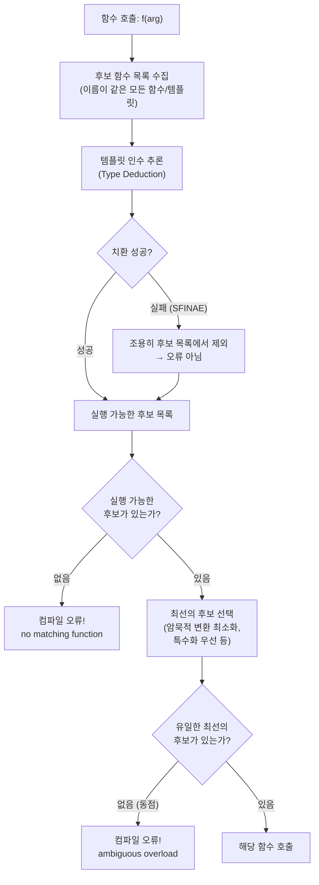
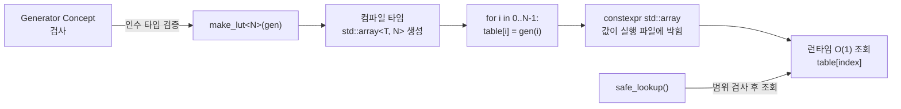
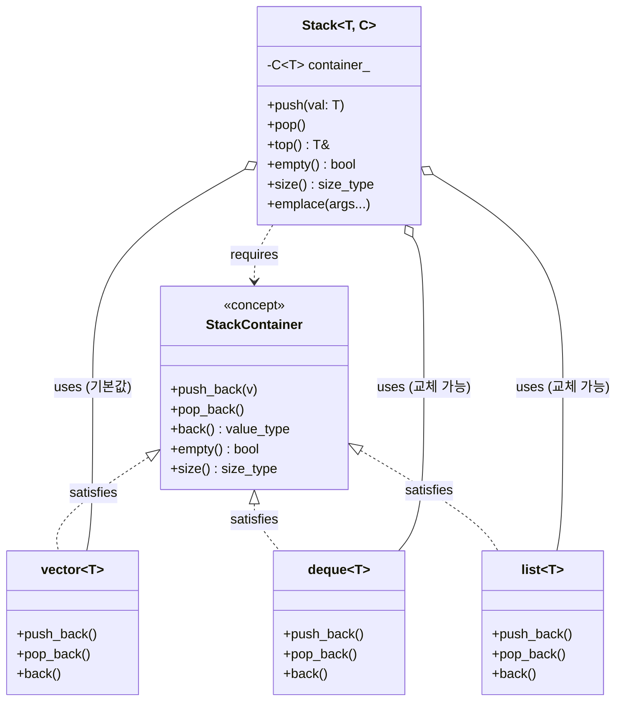

# Modern C++23 템플릿 프로그래밍  

저자: 최흥배, AI-Assisted   
    
권장 개발 환경
- **IDE**: Visual Studio 2026 (Community 이상)
- **컴파일러**: C++ 23
- **OS**: Windows 10 이상

----- 
  
# Chapter 11. 타입 트레이트 (Type Traits)

---

## PART 3를 시작하며 — 타입 메타프로그래밍이란?

PART 2까지는 "값을 다루는 코드를 제네릭하게 만드는" 방법을 배웠습니다. 이제 PART 3에서는 한 단계 더 나아가 **타입 자체를 데이터로 다루는** 메타프로그래밍의 세계로 들어갑니다.

메타프로그래밍(Metaprogramming)의 "메타(meta)"는 "~에 관한(about)"을 의미합니다. 즉, 타입 메타프로그래밍이란 **타입에 관한 프로그래밍**, 다시 말해 컴파일 타임에 타입을 조사하고, 변환하고, 새로운 타입을 만들어내는 기법입니다.

```
일반 프로그래밍:     값(value)을 다룬다
                     int x = 42 + 8;

타입 메타프로그래밍: 타입(type)을 다룬다
                     using T = std::remove_const_t<const int>;  // T = int
```

이 장에서 배울 **타입 트레이트(Type Traits)**는 타입 메타프로그래밍의 기초 도구 상자입니다. 타입이 정수인지, 포인터인지, const인지 등을 컴파일 타임에 질문하고, 타입을 변형하는 강력한 도구들을 제공합니다.

---

## 11.1 `<type_traits>` 헤더의 주요 도구들 한눈에 보기

`<type_traits>`는 C++11에서 등장하여 꾸준히 확장되어 온 헤더입니다. 여기에 담긴 도구들은 크게 세 가지 범주로 나뉩니다.

```
<type_traits>의 도구 분류
─────────────────────────────────────────────────────────
 범주              | 설명                  | 예시
─────────────────────────────────────────────────────────
 타입 검사         | 타입의 특성을 조사    | is_integral_v<T>
 (Type Query)      | 결과: bool 값         | is_pointer_v<T>
─────────────────────────────────────────────────────────
 타입 변환         | 타입을 변형하여       | remove_const_t<T>
 (Type Transform)  | 새 타입 생성          | add_pointer_t<T>
─────────────────────────────────────────────────────────
 타입 관계         | 두 타입의 관계를 조사 | is_same_v<T, U>
 (Type Relation)   | 결과: bool 값         | is_base_of_v<B, D>
─────────────────────────────────────────────────────────
```

**명명 규칙을 먼저 파악하자**

타입 트레이트의 이름에는 규칙이 있습니다. 이 규칙을 알면 처음 보는 트레이트도 사용법을 짐작할 수 있습니다.

```cpp
// 규칙 1: 타입 검사 트레이트
//   _v 접미사: bool 값을 바로 얻음 (C++17~)
//   없으면:   ::value 멤버로 접근 (구식)
std::is_integral_v<int>          // true  ← 권장 (C++17~)
std::is_integral<int>::value     // true  ← 구식

// 규칙 2: 타입 변환 트레이트
//   _t 접미사: 변환된 타입을 바로 얻음 (C++14~)
//   없으면:   ::type 멤버로 접근 (구식)
std::remove_const_t<const int>   // int   ← 권장 (C++14~)
std::remove_const<const int>::type // int ← 구식
```

현대 C++ (C++17 이상)에서는 항상 `_v`와 `_t` 접미사 형태를 사용하는 것을 권장합니다.

---

## 11.2 타입 검사: `is_integral_v`, `is_same_v`, `is_base_of_v`

타입 검사 트레이트는 주어진 타입이 어떤 특성을 가지는지 `true`/`false`로 알려줍니다. 이 값들은 컴파일 타임 상수이므로 `if constexpr`, `static_assert`, Concept 정의 등 다양한 곳에서 활용됩니다.

**카테고리별 주요 타입 검사 트레이트**

```
[기본 타입 분류]
is_void_v<T>             T가 void인가?
is_null_pointer_v<T>     T가 nullptr_t인가?
is_integral_v<T>         T가 정수 타입인가? (bool, char, int, long 등)
is_floating_point_v<T>   T가 부동소수점인가? (float, double, long double)
is_arithmetic_v<T>       T가 산술 타입인가? (정수 + 부동소수점)
is_fundamental_v<T>      T가 기본 타입인가? (산술 + void + nullptr_t)

[복합 타입 분류]
is_pointer_v<T>          T가 포인터 타입인가?
is_reference_v<T>        T가 참조 타입인가?
is_array_v<T>            T가 배열 타입인가?
is_enum_v<T>             T가 열거형인가?
is_class_v<T>            T가 클래스/구조체인가?
is_function_v<T>         T가 함수 타입인가?

[타입 수식어]
is_const_v<T>            T가 const인가?
is_volatile_v<T>         T가 volatile인가?
is_signed_v<T>           T가 부호 있는 타입인가?
is_unsigned_v<T>         T가 부호 없는 타입인가?

[특수 속성]
is_constructible_v<T,Args...>  T가 Args로 생성 가능한가?
is_copyable_v<T>               T가 복사 가능한가?   (C++23)
is_trivially_copyable_v<T>     T가 trivial 복사 가능한가?
is_default_constructible_v<T>  T가 기본 생성자를 가지는가?
```

**실제 사용 예제**

```cpp
#include <iostream>
#include <type_traits>

template <typename T>
void describe_type() {
    std::cout << "=== " << typeid(T).name() << " ===\n";
    std::cout << "  정수:        " << std::is_integral_v<T>       << "\n";
    std::cout << "  부동소수점:  " << std::is_floating_point_v<T> << "\n";
    std::cout << "  포인터:      " << std::is_pointer_v<T>        << "\n";
    std::cout << "  const:       " << std::is_const_v<T>          << "\n";
    std::cout << "  참조:        " << std::is_reference_v<T>      << "\n";
    std::cout << "  클래스:      " << std::is_class_v<T>          << "\n";
}

struct MyStruct {};

int main() {
    std::cout << std::boolalpha;
    describe_type<int>();
    describe_type<const double*>();
    describe_type<MyStruct>();
}
```

**`is_same_v` — 두 타입이 완전히 동일한가?**

```cpp
#include <type_traits>
#include <iostream>

int main() {
    std::cout << std::boolalpha;

    // 완전히 동일한 타입
    std::cout << std::is_same_v<int, int>          << "\n";  // true
    std::cout << std::is_same_v<int, long>         << "\n";  // false!
    std::cout << std::is_same_v<int, signed int>   << "\n";  // true (동의어)

    // const, 참조는 다른 타입으로 취급
    std::cout << std::is_same_v<int, const int>    << "\n";  // false
    std::cout << std::is_same_v<int, int&>         << "\n";  // false
    std::cout << std::is_same_v<int, int*>         << "\n";  // false
}
```

`is_same_v`는 `const`, `&`, `*` 등의 수식어까지 완전히 같아야 `true`를 반환합니다. 이 엄격함이 의도하지 않은 동작을 방지해줍니다.

**`is_base_of_v` — 상속 관계 검사**

```cpp
#include <type_traits>
#include <iostream>

struct Animal {};
struct Dog : Animal {};
struct Cat : Animal {};
struct Robot {};

int main() {
    std::cout << std::boolalpha;

    // is_base_of_v<Base, Derived>
    std::cout << std::is_base_of_v<Animal, Dog>   << "\n";  // true
    std::cout << std::is_base_of_v<Animal, Cat>   << "\n";  // true
    std::cout << std::is_base_of_v<Dog, Animal>   << "\n";  // false (반대!)
    std::cout << std::is_base_of_v<Animal, Robot> << "\n";  // false
    std::cout << std::is_base_of_v<Animal, Animal><< "\n";  // true (자기 자신)
}
```

`is_base_of_v<B, D>`는 `B`가 `D`의 기반 클래스이거나 같은 타입일 때 `true`입니다. 순서를 헷갈리기 쉬우니 주의하세요.

**타입 검사를 `if constexpr`와 결합하기**

```cpp
#include <iostream>
#include <type_traits>
#include <string>

template <typename T>
void safe_negate(T& value) {
    if constexpr (std::is_signed_v<T>) {
        value = -value;
        std::cout << "부호 반전: " << value << "\n";
    } else if constexpr (std::is_floating_point_v<T>) {
        value = -value;
        std::cout << "부동소수점 부호 반전: " << value << "\n";
    } else {
        std::cout << "부호 반전 불가 타입\n";
    }
}

int main() {
    int    a = 42;
    double b = 3.14;
    unsigned int c = 10;

    safe_negate(a);  // 부호 반전: -42
    safe_negate(b);  // 부동소수점 부호 반전: -3.14
    safe_negate(c);  // 부호 반전 불가 타입
}
```

---

## 11.3 타입 변환: `remove_cv_t`, `decay_t`, `common_type_t`

타입 변환 트레이트는 기존 타입에서 새로운 타입을 만들어냅니다. 마치 타입을 재료로 받아 새로운 타입을 반환하는 함수처럼 생각하면 됩니다.

**주요 타입 변환 트레이트 일람**

```
[const/volatile 제거]
remove_const_t<T>         const 제거
remove_volatile_t<T>      volatile 제거
remove_cv_t<T>            const와 volatile 모두 제거

[참조/포인터 조작]
remove_reference_t<T>     참조(&, &&) 제거
add_lvalue_reference_t<T> lvalue 참조(&) 추가
add_rvalue_reference_t<T> rvalue 참조(&&) 추가
remove_pointer_t<T>       포인터(*) 제거
add_pointer_t<T>          포인터(*) 추가

[부호 변환]
make_signed_t<T>          부호 있는 타입으로
make_unsigned_t<T>        부호 없는 타입으로

[타입 정규화]
decay_t<T>                "퇴화" — 배열→포인터, 함수→포인터, cv 제거
remove_cvref_t<T>         const, volatile, 참조 모두 제거 (C++20)

[조건부 타입 선택]
conditional_t<B, T, F>    B가 true면 T, false면 F

[공통 타입]
common_type_t<T, U, ...>  여러 타입의 공통 타입
```

**`remove_cv_t` 와 `remove_cvref_t` — const/volatile/참조 제거**

```cpp
#include <type_traits>

// remove_cv_t: const와 volatile만 제거 (참조는 유지)
static_assert(std::is_same_v<std::remove_cv_t<const int>,       int>);
static_assert(std::is_same_v<std::remove_cv_t<volatile int>,    int>);
static_assert(std::is_same_v<std::remove_cv_t<const volatile int>, int>);
// 주의: 참조는 제거하지 않음!
static_assert(std::is_same_v<std::remove_cv_t<const int&>, const int&>);

// remove_cvref_t (C++20): const + volatile + 참조 모두 제거
static_assert(std::is_same_v<std::remove_cvref_t<const int&>,     int>);
static_assert(std::is_same_v<std::remove_cvref_t<volatile int&&>, int>);
static_assert(std::is_same_v<std::remove_cvref_t<const int*>,     const int*>);
// 주의: 포인터는 제거하지 않음!
```

**`decay_t` — 타입의 퇴화**

`decay_t`는 함수 인자나 배열이 전달될 때 컴파일러가 자동으로 적용하는 타입 변환을 명시적으로 재현합니다.

```cpp
#include <type_traits>

// 배열 → 포인터로 퇴화
static_assert(std::is_same_v<std::decay_t<int[5]>,    int*>);
static_assert(std::is_same_v<std::decay_t<int[3][4]>, int(*)[4]>);

// 함수 → 함수 포인터로 퇴화
static_assert(std::is_same_v<std::decay_t<int(int)>,  int(*)(int)>);

// const/volatile/참조 제거 (remove_cvref_t와 동일)
static_assert(std::is_same_v<std::decay_t<const int&>, int>);
static_assert(std::is_same_v<std::decay_t<int&&>,      int>);
```

`decay_t`는 특히 **완벽 전달(perfect forwarding)** 이나 **타입을 저장**할 때 중요합니다. 예를 들어 `std::make_pair`나 `std::thread`가 내부적으로 타입을 저장할 때 `decay_t`를 사용합니다.

```cpp
#include <type_traits>
#include <iostream>

// decay_t를 이용한 제네릭 값 저장소
template <typename T>
struct ValueStore {
    using stored_type = std::decay_t<T>;  // 참조, const 등을 제거한 실제 값 타입
    stored_type value;

    ValueStore(T&& v) : value(std::forward<T>(v)) {}
};

int main() {
    int x = 42;
    ValueStore<int&>       s1(x);    // stored_type = int (참조 제거)
    ValueStore<const int&> s2(x);   // stored_type = int (const + 참조 제거)
    ValueStore<int>        s3(100);  // stored_type = int

    std::cout << s1.value << "\n";  // 42
    std::cout << s2.value << "\n";  // 42
    std::cout << s3.value << "\n";  // 100
}
```

**`conditional_t` — 컴파일 타임 if-else 타입 선택**

```cpp
#include <type_traits>
#include <cstdint>
#include <iostream>

// 크기에 따라 적절한 정수 타입 선택
template <size_t Size>
using SmallInt = std::conditional_t<
    Size <= 8,  uint8_t,                   // 8비트 이하면 uint8_t
    std::conditional_t<
        Size <= 16, uint16_t,              // 16비트 이하면 uint16_t
        std::conditional_t<
            Size <= 32, uint32_t, uint64_t // 32비트 이하면 uint32_t, 아니면 uint64_t
        >
    >
>;

int main() {
    static_assert(std::is_same_v<SmallInt<8>,  uint8_t>);
    static_assert(std::is_same_v<SmallInt<16>, uint16_t>);
    static_assert(std::is_same_v<SmallInt<32>, uint32_t>);
    static_assert(std::is_same_v<SmallInt<64>, uint64_t>);
    std::cout << "타입 선택 성공!\n";
}
```

**`common_type_t` — 여러 타입의 공통 타입 찾기**

```cpp
#include <type_traits>
#include <iostream>

// common_type_t: 암묵적 변환 규칙에 따른 공통 타입
static_assert(std::is_same_v<std::common_type_t<int, double>, double>);
static_assert(std::is_same_v<std::common_type_t<int, long>,   long>);
static_assert(std::is_same_v<std::common_type_t<int, int>,    int>);

// 실용적 활용: 두 타입을 받아 공통 타입으로 연산
template <typename T, typename U>
auto safe_add(T a, U b) -> std::common_type_t<T, U> {
    return a + b;
}

int main() {
    auto result = safe_add(3, 4.5);  // int + double → double
    std::cout << result << "\n";     // 7.5
}
```

**타입 변환 과정을 시각화하면:**

```
decay_t 변환 흐름:

   T = const int&
        │
        ▼
  remove_reference  →  const int
        │
        ▼
  remove_cv         →  int
        │
        ▼
  decay_t<const int&> = int  ✅

─────────────────────────────────

   T = int[5]
        │
        ▼
  is_array? YES
        │
        ▼
  → int* (배열→포인터 변환)
        │
        ▼
  decay_t<int[5]> = int*  ✅
```

---

## 11.4 C++23의 새 트레이트들

C++23에서는 몇 가지 유용한 타입 트레이트가 새로 추가되었습니다.

**`std::is_scoped_enum_v` — 스코프 열거형 검사**

일반 `enum`과 `enum class`(스코프 열거형)를 구분합니다.

```cpp
#include <type_traits>
#include <iostream>

enum OldEnum { A, B, C };         // 구식 열거형
enum class NewEnum { X, Y, Z };   // 스코프 열거형 (enum class)

int main() {
    std::cout << std::boolalpha;

    // C++23: is_scoped_enum_v
    std::cout << std::is_scoped_enum_v<OldEnum> << "\n";  // false
    std::cout << std::is_scoped_enum_v<NewEnum> << "\n";  // true
    std::cout << std::is_enum_v<OldEnum>        << "\n";  // true (둘 다 enum)
    std::cout << std::is_enum_v<NewEnum>        << "\n";  // true
}
```

**`std::underlying_type_t` — 열거형의 기저 타입 얻기**

```cpp
#include <type_traits>
#include <cstdint>
#include <iostream>

enum class Color : uint8_t { Red, Green, Blue };
enum class BigEnum : int64_t { Small = 1, Large = 1000000000LL };

int main() {
    // 열거형의 기저 정수 타입 얻기
    using ColorBase = std::underlying_type_t<Color>;
    using BigBase   = std::underlying_type_t<BigEnum>;

    static_assert(std::is_same_v<ColorBase, uint8_t>);
    static_assert(std::is_same_v<BigBase,   int64_t>);

    // 실용 예: enum class를 안전하게 정수로 변환
    Color c = Color::Green;
    auto value = static_cast<std::underlying_type_t<Color>>(c);
    std::cout << static_cast<int>(value) << "\n";  // 1
}
```

**`std::invoke_result_t` — 호출 결과 타입 추론**

```cpp
#include <type_traits>
#include <iostream>
#include <string>

int add(int a, int b) { return a + b; }

struct Multiplier {
    double operator()(double x, double y) const { return x * y; }
};

int main() {
    // 함수 호출 결과 타입 추론
    using AddResult = std::invoke_result_t<decltype(add), int, int>;
    static_assert(std::is_same_v<AddResult, int>);

    using MulResult = std::invoke_result_t<Multiplier, double, double>;
    static_assert(std::is_same_v<MulResult, double>);

    // 람다도 가능
    auto lambda = [](std::string s) { return s.size(); };
    using LambdaResult = std::invoke_result_t<decltype(lambda), std::string>;
    static_assert(std::is_same_v<LambdaResult, size_t>);

    std::cout << "모든 타입 추론 성공!\n";
}
```

`invoke_result_t`는 콜백이나 고차 함수(함수를 받는 함수)를 작성할 때 반환 타입을 정확하게 결정하는 데 매우 유용합니다.

---

## 11.5 커스텀 타입 트레이트 만들기

표준 라이브러리가 제공하는 트레이트 외에, 우리만의 타입 트레이트를 직접 만들 수 있습니다. 커스텀 트레이트를 만드는 방법은 세 가지가 있습니다.

**방법 1: `std::integral_constant`를 기반으로 만들기**

모든 타입 트레이트의 기반이 되는 `std::integral_constant`를 직접 활용합니다.

```cpp
#include <type_traits>
#include <iostream>

// "포인터 타입이면서 동시에 const인가?" 를 검사하는 트레이트
template <typename T>
struct is_const_pointer
    : std::integral_constant<bool,
          std::is_pointer_v<T> && std::is_const_v<std::remove_pointer_t<T>>
      > {};

// C++17 스타일의 _v 헬퍼 변수
template <typename T>
inline constexpr bool is_const_pointer_v = is_const_pointer<T>::value;

int main() {
    std::cout << std::boolalpha;
    std::cout << is_const_pointer_v<const int*>  << "\n";  // true  (const 포인터)
    std::cout << is_const_pointer_v<int* const>  << "\n";  // false (포인터 자체가 const)
    std::cout << is_const_pointer_v<int*>        << "\n";  // false
    std::cout << is_const_pointer_v<int>         << "\n";  // false
}
```

**방법 2: 템플릿 특수화로 만들기**

특정 타입이나 타입 패턴을 명시적으로 지정하는 트레이트는 특수화(specialization)로 만듭니다.

```cpp
#include <type_traits>
#include <vector>
#include <list>
#include <iostream>

// "std::vector 계열인가?" 를 검사하는 트레이트 (기본값: false)
template <typename T>
struct is_vector : std::false_type {};

// std::vector<T, Alloc>에 대한 특수화 (true)
template <typename T, typename Alloc>
struct is_vector<std::vector<T, Alloc>> : std::true_type {};

template <typename T>
inline constexpr bool is_vector_v = is_vector<T>::value;

int main() {
    std::cout << std::boolalpha;
    std::cout << is_vector_v<std::vector<int>>         << "\n";  // true
    std::cout << is_vector_v<std::vector<double>>      << "\n";  // true
    std::cout << is_vector_v<std::list<int>>           << "\n";  // false
    std::cout << is_vector_v<int>                      << "\n";  // false
}
```

이 패턴은 다음과 같은 구조를 가집니다.

```
is_vector<T> 작동 방식:

  T = std::vector<int>
  ┌─────────────────────────────┐
  │ 특수화 버전과 매칭됨        │
  │ → std::true_type 상속       │
  │ → ::value = true            │
  └─────────────────────────────┘

  T = std::list<int>
  ┌─────────────────────────────┐
  │ 특수화 버전과 매칭 안 됨    │
  │ → 기본 템플릿 사용          │
  │ → std::false_type 상속      │
  │ → ::value = false           │
  └─────────────────────────────┘
```

**방법 3: `requires` 표현식으로 만들기 (C++20 — 가장 현대적인 방식)**

C++20 이후에는 `requires` 표현식을 이용해 훨씬 간결하게 커스텀 트레이트를 만들 수 있습니다.

```cpp
#include <type_traits>
#include <iostream>
#include <string>
#include <vector>

// "to_string() 멤버 함수를 가지는가?" 를 검사하는 트레이트
template <typename T>
concept HasToString = requires(const T& t) {
    { t.to_string() } -> std::convertible_to<std::string>;
};

// concept을 변수 트레이트로 사용
template <typename T>
inline constexpr bool has_to_string_v = HasToString<T>;

// 테스트용 타입들
struct GoodType {
    std::string to_string() const { return "GoodType"; }
};

struct BadType {
    int compute() const { return 42; }  // to_string() 없음
};

// 트레이트를 활용하는 함수
template <typename T>
void print_description(const T& obj) {
    if constexpr (HasToString<T>) {
        std::cout << "[커스텀] " << obj.to_string() << "\n";
    } else {
        std::cout << "[기본] 설명 없음\n";
    }
}

int main() {
    GoodType g;
    BadType  b;

    print_description(g);  // [커스텀] GoodType
    print_description(b);  // [기본] 설명 없음

    std::cout << std::boolalpha;
    std::cout << has_to_string_v<GoodType> << "\n";  // true
    std::cout << has_to_string_v<BadType>  << "\n";  // false
}
```

---

## 🛠 실습: 직렬화 가능 타입인지 검사하는 커스텀 트레이트 만들기

이번 실습에서는 지금까지 배운 모든 내용을 종합합니다. 어떤 타입이 "직렬화 가능(serializable)"한지 검사하는 트레이트 시스템을 만들고, 이를 활용하는 `serialize_to_json` 함수까지 구현해 봅니다.

**직렬화 가능의 정의:**
- 기본 타입(`int`, `double`, `bool` 등)은 직렬화 가능
- `std::string`은 직렬화 가능
- `serialize() const` 멤버 함수를 가진 클래스는 직렬화 가능
- 그 외 타입은 직렬화 불가

```cpp
#include <iostream>
#include <string>
#include <type_traits>
#include <vector>
#include <sstream>

// ─────────────────────────────────────────────────
// 1단계: 직렬화 가능 여부를 검사하는 트레이트 정의
// ─────────────────────────────────────────────────

// "serialize() 멤버 함수를 가지는가?" Concept
template <typename T>
concept HasSerialize = requires(const T& t) {
    { t.serialize() } -> std::convertible_to<std::string>;
};

// 직렬화 가능 타입의 조건을 종합하는 Concept
template <typename T>
concept Serializable =
    std::is_arithmetic_v<T>          ||  // 기본 산술 타입
    std::is_same_v<T, std::string>   ||  // std::string
    HasSerialize<T>;                     // serialize() 멤버 보유

// 변수 트레이트 형태로도 제공
template <typename T>
inline constexpr bool is_serializable_v = Serializable<T>;

// ─────────────────────────────────────────────────
// 2단계: 트레이트를 활용한 직렬화 함수
// ─────────────────────────────────────────────────

template <Serializable T>
std::string serialize_to_json(const T& value) {
    if constexpr (std::is_same_v<T, bool>) {
        return value ? "true" : "false";
    } else if constexpr (std::is_integral_v<T>) {
        return std::to_string(value);
    } else if constexpr (std::is_floating_point_v<T>) {
        std::ostringstream oss;
        oss << value;
        return oss.str();
    } else if constexpr (std::is_same_v<T, std::string>) {
        return '"' + value + '"';
    } else if constexpr (HasSerialize<T>) {
        return value.serialize();
    }
}

// ─────────────────────────────────────────────────
// 3단계: 테스트용 클래스들
// ─────────────────────────────────────────────────

struct Point {
    double x, y;

    std::string serialize() const {
        return "{\"x\": " + std::to_string(x)
             + ", \"y\": " + std::to_string(y) + "}";
    }
};

struct Color {
    uint8_t r, g, b;

    std::string serialize() const {
        std::ostringstream oss;
        oss << "{\"r\": " << (int)r
            << ", \"g\": " << (int)g
            << ", \"b\": " << (int)b << "}";
        return oss.str();
    }
};

struct UnknownType {
    int secret = 42;
    // serialize() 없음 → Serializable 아님
};

// ─────────────────────────────────────────────────
// 4단계: 컴파일 타임 검증 및 실행
// ─────────────────────────────────────────────────

// 컴파일 타임에 트레이트 정확성 검증
static_assert( is_serializable_v<int>);
static_assert( is_serializable_v<double>);
static_assert( is_serializable_v<bool>);
static_assert( is_serializable_v<std::string>);
static_assert( is_serializable_v<Point>);
static_assert( is_serializable_v<Color>);
static_assert(!is_serializable_v<UnknownType>);  // ✅ 직렬화 불가

int main() {
    std::cout << "=== 기본 타입 직렬화 ===\n";
    std::cout << serialize_to_json(true)              << "\n";  // true
    std::cout << serialize_to_json(42)                << "\n";  // 42
    std::cout << serialize_to_json(3.14)              << "\n";  // 3.14
    std::cout << serialize_to_json(std::string{"hi"}) << "\n";  // "hi"

    std::cout << "\n=== 커스텀 타입 직렬화 ===\n";
    Point p{1.5, 2.7};
    Color c{255, 128, 0};
    std::cout << serialize_to_json(p) << "\n";
    // {"x": 1.500000, "y": 2.700000}
    std::cout << serialize_to_json(c) << "\n";
    // {"r": 255, "g": 128, "b": 0}

    // ❌ 아래 줄의 주석을 해제하면 컴파일 에러 (Serializable 제약 위반)
    // serialize_to_json(UnknownType{});

    std::cout << "\n=== 타입 트레이트 검사 결과 ===\n";
    std::cout << std::boolalpha;
    std::cout << "int:         " << is_serializable_v<int>         << "\n";
    std::cout << "Point:       " << is_serializable_v<Point>       << "\n";
    std::cout << "UnknownType: " << is_serializable_v<UnknownType> << "\n";
}
```

**예상 출력:**

```
=== 기본 타입 직렬화 ===
true
42
3.14
"hi"

=== 커스텀 타입 직렬화 ===
{"x": 1.500000, "y": 2.700000}
{"r": 255, "g": 128, "b": 0}

=== 타입 트레이트 검사 결과 ===
int:         true
Point:       true
UnknownType: false
```

**전체 설계 구조를 다이어그램으로 표현하면:**

```mermaid
graph TD
    A["serialize_to_json(value)"] --> B{Serializable 제약 검사}
    B -- 실패 --> C["❌ 컴파일 에러\n(명확한 메시지)"]
    B -- 통과 --> D{if constexpr 분기}

    D --> E["is_same_v<T, bool>\n→ true/false"]
    D --> F["is_integral_v<T>\n→ to_string()"]
    D --> G["is_floating_point_v<T>\n→ ostringstream"]
    D --> H["is_same_v<T, string>\n→ '\"' + value + '\"'"]
    D --> I["HasSerialize<T>\n→ value.serialize()"]

    J["Serializable Concept"] --> K["is_arithmetic_v<T>"]
    J --> L["is_same_v<T, string>"]
    J --> M["HasSerialize<T>"]
```

---

## 📌 이 장의 핵심 요약

타입 트레이트는 C++ 템플릿 메타프로그래밍의 어휘(vocabulary)입니다. 이것들을 잘 알면 복잡한 제네릭 코드를 읽고 쓸 수 있게 됩니다.

**기억해야 할 핵심 규칙** 세 가지를 꼽자면, 첫째로 현대 C++에서는 항상 `_v`와 `_t` 접미사 형태(`is_integral_v<T>`, `remove_const_t<T>`)를 사용합니다. 둘째로 `decay_t`는 함수 인자로 전달될 때 일어나는 자동 변환을 명시적으로 재현하며, 값을 저장하는 제네릭 코드에 필수입니다. 셋째로 커스텀 트레이트는 C++20 이후에는 `requires` 기반 Concept으로 만드는 것이 가장 간결하고 오류 메시지도 명확합니다.

**자주 쓰이는 트레이트 빠른 참조:**

| 목적 | 사용할 트레이트 |
|------|----------------|
| 정수 타입인지 | `is_integral_v<T>` |
| 숫자 타입인지 | `is_arithmetic_v<T>` |
| 포인터인지 | `is_pointer_v<T>` |
| 두 타입이 같은지 | `is_same_v<T, U>` |
| 상속 관계 확인 | `is_base_of_v<Base, Derived>` |
| const 제거 | `remove_const_t<T>` |
| 참조/const 모두 제거 | `remove_cvref_t<T>` (C++20) |
| 함수 인자처럼 변환 | `decay_t<T>` |
| 조건부 타입 선택 | `conditional_t<Cond, T, F>` |
| 공통 타입 | `common_type_t<T, U>` |
| 함수 반환 타입 | `invoke_result_t<F, Args...>` |

타입 트레이트를 활용하면 컴파일 타임에 타입에 대한 다양한 질문을 하고, 그 답에 따라 코드 동작을 결정할 수 있습니다. 다음 장에서는 이 트레이트를 기반으로 한 SFINAE 기법의 역사와 현대적 대안을 살펴봅니다.

  
 

# Chapter 12. SFINAE와 오버로딩 해결 (그리고 작별 인사)

> 📌 **이 챕터의 목적:** 이 챕터는 "읽기 능력" 습득이 목표입니다. 레거시 코드베이스에서 마주치게 될 SFINAE 패턴을 해독하고, 그것을 현대적인 Concepts 문법으로 리팩터링하는 방법을 배웁니다. **새로 작성하는 코드에는 Concepts를 사용하세요.**

---

## 12.1 SFINAE란 — "치환 실패는 오류가 아니다"

**왜 이런 이상한 규칙이 존재하는가:**

C++ 컴파일러가 함수 호출을 처리할 때, 어떤 함수를 호출할지 결정하기 위해 **오버로딩 해결(Overload Resolution)** 이라는 과정을 거칩니다. 이 과정에서 컴파일러는 후보 함수들의 목록을 만들고, 각 후보에 템플릿 인수를 대입(치환, Substitution)해 보면서 유효한 함수를 찾습니다. 이때 어떤 후보에 인수를 대입했더니 말이 안 되는 타입이 만들어지는 경우가 생기는데, C++는 이것을 **컴파일 오류로 처리하지 않고 조용히 그 후보를 목록에서 제외**합니다. 이 원칙을 **SFINAE(Substitution Failure Is Not An Error)** 라고 부릅니다.

직역하면 "치환 실패는 오류가 아니다"입니다.

이것이 왜 필요한지, 간단한 예시로 먼저 직관을 잡아봅시다.

```cpp
// 두 가지 버전의 함수 템플릿이 있다고 상상해보자.
// 버전 A: T가 포인터일 때만 의미 있는 함수
// 버전 B: T가 포인터가 아닐 때의 함수

// 만약 f(42)를 호출하면?
// - 버전 A에 int를 대입하면 → "int의 역참조 타입" → 말이 안 됨
// - 컴파일러: "버전 A는 포기, 버전 B로 가자" → 오류 없이 정상 동작!
```

이 원칙 덕분에 프로그래머는 서로 다른 타입에 대해 서로 다른 동작을 하는 함수를 **하나의 오버로드 세트(overload set)** 로 표현할 수 있었습니다. C++20의 Concepts가 등장하기 전까지, SFINAE는 이런 **컴파일 타임 조건부 활성화**를 구현하는 유일한 표준 방법이었습니다.

**SFINAE가 작동하는 곳과 작동하지 않는 곳:**

SFINAE는 아무 데서나 작동하는 것이 아닙니다. 오직 **함수 선언부(시그니처)** 의 치환 과정에서만 적용됩니다. 함수 본문(body) 안에서 발생하는 오류는 SFINAE가 아니라 진짜 컴파일 오류입니다.

```
SFINAE가 적용되는 위치:
┌─────────────────────────────────────────────────────┐
│  template <typename T, typename = ???>              │  ← 여기 (기본 템플릿 인수)
│  ???  함수이름(T 파라미터) { ... }                   │
│  ↑↑↑                                               │
│  반환 타입에서도 적용됨                               │
└─────────────────────────────────────────────────────┘

SFINAE가 적용되지 않는 위치:
┌─────────────────────────────────────────────────────┐
│  template <typename T>                              │
│  void func(T t) {                                   │
│      t.some_method();  ← 여기서의 오류는 진짜 오류!  │
│  }                                                  │
└─────────────────────────────────────────────────────┘
```

가장 기초적인 SFINAE의 작동을 코드로 확인해 봅시다.

```cpp
#include <iostream>
#include <type_traits>

// 버전 1: T가 정수 타입일 때 선택됨
// std::enable_if_t<조건>가 치환 성공 → 유효한 반환 타입 생성
template <typename T>
std::enable_if_t<std::is_integral_v<T>, void>
describe(T value) {
    std::cout << value << "은(는) 정수입니다.\n";
}

// 버전 2: T가 부동소수점 타입일 때 선택됨
template <typename T>
std::enable_if_t<std::is_floating_point_v<T>, void>
describe(T value) {
    std::cout << value << "은(는) 실수입니다.\n";
}

int main() {
    describe(42);       // 버전 1 선택
    describe(3.14);     // 버전 2 선택
    // describe("hi"); // 컴파일 오류: 두 버전 모두 SFINAE로 탈락
}
```

`describe(42)`가 호출되면 컴파일러는 두 버전을 모두 검토합니다. 버전 2에 `int`를 대입하면 `std::is_floating_point_v<int>`가 `false`가 되고, 그 결과 `std::enable_if_t<false, void>`는 존재하지 않는 타입이 됩니다. 반환 타입이 존재하지 않으니 버전 2는 조용히 후보에서 제외됩니다. 버전 1만 살아남아서 호출됩니다. 이것이 SFINAE의 핵심 동작입니다.

---

## 12.2 `std::enable_if`의 동작 방식

**`std::enable_if`의 내부 구조를 직접 들여다보자:**

`std::enable_if`는 사실 매우 단순한 구조체 템플릿입니다. 전체 특수화를 이용해서 조건에 따라 `type`이라는 멤버가 있거나 없도록 설계되어 있습니다.

```cpp
// std::enable_if의 개념적 구현 (실제 표준 라이브러리와 동일한 로직)
template <bool Condition, typename T = void>
struct enable_if {
    // Condition이 false이면: 아무 멤버도 없음
    // ::type에 접근하면 컴파일 오류 → SFINAE 발동!
};

// Condition이 true일 때의 전체 특수화
template <typename T>
struct enable_if<true, T> {
    using type = T;  // ::type이 존재함 → 치환 성공!
};

// C++14부터 제공되는 편의용 별칭 템플릿
template <bool Condition, typename T = void>
using enable_if_t = typename enable_if<Condition, T>::type;
```

이 구조를 시각적으로 표현하면 다음과 같습니다.

```
enable_if<false, void>
┌─────────────────────┐
│  (멤버 없음)         │  → ::type 접근 불가 → 치환 실패 → SFINAE!
└─────────────────────┘

enable_if<true, void>
┌─────────────────────┐
│  using type = void; │  → ::type = void → 치환 성공!
└─────────────────────┘
```

**`std::enable_if`를 사용하는 세 가지 패턴:**

레거시 코드에서는 `enable_if`를 배치하는 위치가 세 가지 정도로 나뉩니다. 각 패턴을 이해해야 오래된 코드를 읽을 수 있습니다.

**패턴 1: 반환 타입에 배치 (Return Type SFINAE)**

```cpp
#include <type_traits>
#include <iostream>

// 반환 타입 자리에 enable_if를 사용하는 패턴
// 반환 타입이 void가 되거나, 아예 존재하지 않아서 탈락하거나
template <typename T>
std::enable_if_t<std::is_integral_v<T>, std::string>
to_string_legacy(T value) {
    return "정수: " + std::to_string(value);
}

template <typename T>
std::enable_if_t<std::is_floating_point_v<T>, std::string>
to_string_legacy(T value) {
    return "실수: " + std::to_string(value);
}

int main() {
    std::cout << to_string_legacy(10) << "\n";
    std::cout << to_string_legacy(3.14f) << "\n";
}
```

**패턴 2: 기본 템플릿 인수에 배치 (Default Template Argument SFINAE)**

```cpp
#include <type_traits>
#include <iostream>

// 두 번째 템플릿 파라미터에 enable_if를 숨기는 패턴
// typename = std::enable_if_t<...> 형태가 특징적
template <typename T,
          typename = std::enable_if_t<std::is_integral_v<T>>>
void print_if_integral(T value) {
    std::cout << "정수 출력: " << value << "\n";
}

int main() {
    print_if_integral(42);      // OK
    // print_if_integral(3.14); // 컴파일 오류: SFINAE로 탈락 → 후보 없음
}
```

**패턴 3: 함수 파라미터에 배치 (Function Parameter SFINAE)**

```cpp
#include <type_traits>
#include <iostream>

// 마지막 파라미터에 enable_if*를 넣는 패턴
// 포인터 타입으로 만들어서 기본값 nullptr을 주는 방식
template <typename T>
void process(T value,
             std::enable_if_t<std::is_integral_v<T>>* = nullptr) {
    std::cout << "정수 처리: " << value << "\n";
}

template <typename T>
void process(T value,
             std::enable_if_t<std::is_floating_point_v<T>>* = nullptr) {
    std::cout << "실수 처리: " << value << "\n";
}

int main() {
    process(7);
    process(2.71828);
}
```

이 세 가지 패턴은 모두 동일한 목적(특정 조건을 만족하는 타입에 대해서만 함수를 활성화)을 달성하지만, 작성 방식이 저마다 달라서 처음 보는 사람은 상당히 혼란스럽습니다. 이것이 바로 Concepts의 탄생 배경입니다.

**`void_t`와 검출 이디엄(Detection Idiom):**

C++17에서 추가된 `std::void_t`는 SFINAE를 이용해 어떤 타입에 특정 멤버나 연산이 존재하는지 검사하는 강력한 도구입니다. 이른바 "검출 이디엄(Detection Idiom)"의 핵심 재료입니다.

```cpp
// std::void_t의 개념적 구현 — 단순히 void를 만들어주는 별칭
template <typename...>
using void_t = void;
```

이렇게 단순한 도구가 왜 강력한지, `begin()` 멤버 함수를 가진 타입인지 검사하는 예시로 보겠습니다.

```cpp
#include <type_traits>
#include <vector>
#include <iostream>

// 1단계: 기본 템플릿 - has_begin이 false_type
template <typename T, typename = void>
struct has_begin : std::false_type {};

// 2단계: 부분 특수화 - T가 .begin()을 가지면 void_t가 void로 성공 → true_type
template <typename T>
struct has_begin<T, std::void_t<decltype(std::declval<T>().begin())>>
    : std::true_type {};

// 편의용 변수 템플릿
template <typename T>
inline constexpr bool has_begin_v = has_begin<T>::value;

int main() {
    std::cout << std::boolalpha;
    std::cout << "vector: " << has_begin_v<std::vector<int>> << "\n"; // true
    std::cout << "int:    " << has_begin_v<int>              << "\n"; // false
}
```

이 코드가 동작하는 원리를 단계별로 추적해보겠습니다.

```
has_begin<std::vector<int>> 평가 과정:
─────────────────────────────────────────────────────
1. 기본 템플릿: has_begin<vector<int>, void>  → 후보 1
2. 부분 특수화: 두 번째 인수 자리에 void_t<...> 시도
   → decltype(std::declval<vector<int>>().begin())
   → decltype(iterator)  → 유효한 타입!
   → void_t<iterator>    → void
   → 부분 특수화 성공! → has_begin<vector<int>, void> → true_type
   → 부분 특수화가 더 구체적이므로 선택됨

has_begin<int> 평가 과정:
─────────────────────────────────────────────────────
1. 기본 템플릿: has_begin<int, void>  → 후보 1
2. 부분 특수화: 두 번째 인수 자리에 void_t<...> 시도
   → decltype(std::declval<int>().begin())
   → int에는 .begin()이 없음! → 치환 실패
   → SFINAE: 부분 특수화 조용히 탈락
   → 기본 템플릿 선택 → false_type
```

---

## 12.3 Concepts 이전에 왜 이런 고통이 필요했는가

**SFINAE 코드의 가독성 문제를 직접 체감해보자:**

SFINAE가 얼마나 읽기 어려운지, 그리고 Concepts가 얼마나 명확한지를 나란히 비교해보겠습니다. 아래 예시는 "덧셈 연산자(`+`)를 지원하는 타입만 받는 `sum` 함수"를 구현하는 것입니다.

```cpp
// ❌ SFINAE 방식 (C++17 이전 스타일)
// 읽는 데 30초가 걸리는 코드
template <typename T,
          typename = std::enable_if_t<
              std::is_arithmetic_v<T>
          >>
T sum_sfinae(T a, T b) {
    return a + b;
}
```

```cpp
// ✅ Concepts 방식 (C++20 이후)
// 읽는 데 3초도 안 걸리는 코드
template <std::integral T>
T sum_concept(T a, T b) {
    return a + b;
}
```

하지만 실제 레거시 코드에서는 훨씬 복잡한 SFINAE 조건들을 마주치게 됩니다. 여러 조건을 AND/OR로 조합하는 경우를 봅시다.

```cpp
// 복수 조건을 SFINAE로 표현하기 — 눈이 아프다
template <typename T,
          typename U,
          typename = std::enable_if_t<
              std::is_arithmetic_v<T> &&
              std::is_arithmetic_v<U> &&
              std::is_convertible_v<U, T>
          >>
T complex_op_sfinae(T a, U b) {
    return static_cast<T>(a + b);
}
```

```cpp
// 동일한 제약을 Concepts로 표현 — 훨씬 자연스럽다
template <std::arithmetic T, std::arithmetic U>
    requires std::convertible_to<U, T>
T complex_op_concept(T a, U b) {
    return static_cast<T>(a + b);
}
```

**SFINAE의 오류 메시지는 왜 그리 끔찍한가:**

SFINAE가 실패했을 때 Visual Studio가 뱉어내는 오류 메시지는 악명이 높습니다. 컴파일러는 "어떤 제약 조건이 어느 타입에 대해 왜 실패했는지"를 친절하게 설명해주지 않습니다. 그냥 "후보가 없다"거나 "타입이 맞지 않는다"는 식의 모호한 메시지만 던집니다.

```
// SFINAE 실패 시 Visual Studio의 오류 메시지 (예시)
error C2672: 'sum_sfinae': no matching overloaded function found
error C2783: 'T sum_sfinae(T,T)': could not deduce template argument
  for '__formal'
note: see declaration of 'sum_sfinae'
```

```
// Concepts 실패 시 Visual Studio의 오류 메시지 (훨씬 명확)
error C7602: 'sum_concept': associated constraints are not satisfied
note: the constraint was not satisfied
note: 'std::integral<double>' evaluated to false
```

이 차이는 개발 생산성에 직결됩니다. Concepts를 사용하면 컴파일러가 "어떤 Concept이 어떤 타입에 대해 왜 실패했는지"를 정확하게 알려주기 때문에 디버깅 시간이 크게 줄어듭니다.

**오버로딩 해결(Overload Resolution)의 전체 그림:**

SFINAE는 오버로딩 해결 과정의 일부입니다. 전체 흐름을 이해하면 SFINAE가 어디에 위치하는지 명확해집니다.



---

## 12.4 레거시 코드 읽기: SFINAE → Concept으로 리팩터링

**실전에서 마주치는 SFINAE 패턴들을 해독하고 현대화하기:**

이 절에서는 실제 오래된 코드에서 흔히 보이는 SFINAE 패턴을 하나씩 해독하고, 그것을 Concepts로 변환하는 연습을 합니다.

**사례 1: 포인터/비포인터 분기**

```cpp
// ─── 레거시 코드 (SFINAE 버전) ───────────────────────────
#include <type_traits>
#include <iostream>

template <typename T>
std::enable_if_t<std::is_pointer_v<T>, void>
print_value(T ptr) {
    if (ptr) std::cout << "포인터 값: " << *ptr << "\n";
    else     std::cout << "nullptr\n";
}

template <typename T>
std::enable_if_t<!std::is_pointer_v<T>, void>
print_value(T val) {
    std::cout << "직접 값: " << val << "\n";
}
```

```cpp
// ─── 현대적 코드 (Concepts 버전) ──────────────────────────
#include <concepts>
#include <iostream>

// 포인터 타입을 위한 Concept
template <typename T>
concept Pointer = std::is_pointer_v<T>;

void print_value(Pointer auto ptr) {
    if (ptr) std::cout << "포인터 값: " << *ptr << "\n";
    else     std::cout << "nullptr\n";
}

void print_value(auto val) requires (!Pointer<decltype(val)>) {
    std::cout << "직접 값: " << val << "\n";
}

int main() {
    int x = 42;
    int* p = &x;
    print_value(x);     // 직접 값: 42
    print_value(p);     // 포인터 값: 42
    print_value(3.14);  // 직접 값: 3.14
}
```

**사례 2: `void_t`로 멤버 존재 검사 → Concepts `requires`로**

```cpp
// ─── 레거시 코드 ─────────────────────────────────────────
#include <type_traits>
#include <iostream>
#include <vector>
#include <string>

// toString() 메서드 존재 여부 검사
template <typename T, typename = void>
struct has_to_string : std::false_type {};

template <typename T>
struct has_to_string<T, std::void_t<decltype(std::declval<T>().toString())>>
    : std::true_type {};

template <typename T>
std::enable_if_t<has_to_string<T>::value, std::string>
stringify(const T& obj) {
    return obj.toString();
}

template <typename T>
std::enable_if_t<!has_to_string<T>::value, std::string>
stringify(const T& obj) {
    return "(toString 없음)";
}
```

```cpp
// ─── 현대적 코드 ─────────────────────────────────────────
#include <concepts>
#include <string>
#include <iostream>

// toString() 메서드를 가진 타입을 표현하는 Concept
template <typename T>
concept HasToString = requires(const T& obj) {
    { obj.toString() } -> std::convertible_to<std::string>;
};

// HasToString을 만족하는 타입용
std::string stringify(const HasToString auto& obj) {
    return obj.toString();
}

// 그 외 타입용
std::string stringify(const auto& obj) {
    return "(toString 없음)";
}

// 테스트용 클래스
struct MyClass {
    std::string toString() const { return "나는 MyClass"; }
};

int main() {
    MyClass mc;
    std::cout << stringify(mc) << "\n";  // 나는 MyClass
    std::cout << stringify(42) << "\n";  // (toString 없음)
}
```

**사례 3: 다중 조건 SFINAE → Concept 조합**

실제 코드에서 가장 많이 보이는 복잡한 패턴입니다. 컨테이너처럼 동작하는 타입(반복자를 제공하는 타입)에 대해서만 동작하는 함수를 만드는 예시입니다.

```cpp
// ─── 레거시 코드 (해독 연습용) ────────────────────────────
#include <type_traits>
#include <iterator>

// "반복자를 가진 타입"인지 검사하는 트레이트
template <typename T, typename = void>
struct is_iterable : std::false_type {};

template <typename T>
struct is_iterable<T,
    std::void_t<
        decltype(std::begin(std::declval<T&>())),
        decltype(std::end(std::declval<T&>()))
    >> : std::true_type {};

// 반복자를 가진 컨테이너만 받는 함수
template <typename Container,
          typename = std::enable_if_t<is_iterable<Container>::value>>
auto first_element(const Container& c)
    -> decltype(*std::begin(c))
{
    return *std::begin(c);
}
```

```cpp
// ─── 현대적 코드 ─────────────────────────────────────────
#include <concepts>
#include <ranges>
#include <vector>
#include <iostream>

// std::ranges::range 는 표준 라이브러리에서 이미 제공!
// 별도의 트레이트 없이 바로 사용 가능
auto first_element(const std::ranges::range auto& c)
    -> decltype(*std::begin(c))
{
    return *std::begin(c);
}

int main() {
    std::vector<int> v = {10, 20, 30};
    std::cout << first_element(v) << "\n";       // 10

    int arr[] = {1, 2, 3};
    std::cout << first_element(arr) << "\n";     // 1

    // first_element(42); // 오류: int는 range가 아님 (명확한 메시지!)
}
```

**사례 4: `enable_if`로 구현된 클래스 멤버 선택적 활성화**

클래스 내부에서 SFINAE를 사용하는 패턴도 흔히 등장합니다.

```cpp
// ─── 레거시 코드 ─────────────────────────────────────────
#include <type_traits>

template <typename T>
class NumericBox {
    T value_;
public:
    explicit NumericBox(T v) : value_(v) {}

    // 정수 타입일 때만 활성화되는 멤버 함수
    template <typename U = T>
    std::enable_if_t<std::is_integral_v<U>, U>
    bitwise_and(U mask) const {
        return value_ & mask;
    }

    // 실수 타입일 때만 활성화되는 멤버 함수
    template <typename U = T>
    std::enable_if_t<std::is_floating_point_v<U>, U>
    rounded() const {
        // round() 헤더 포함 필요하지만 예시 간결화
        return value_;
    }
};
```

```cpp
// ─── 현대적 코드 ─────────────────────────────────────────
#include <concepts>
#include <cmath>
#include <iostream>

template <typename T>
class NumericBox {
    T value_;
public:
    explicit NumericBox(T v) : value_(v) {}

    // 정수 타입일 때만 활성화
    T bitwise_and(T mask) const requires std::integral<T> {
        return value_ & mask;
    }

    // 실수 타입일 때만 활성화
    T rounded() const requires std::floating_point<T> {
        return std::round(value_);
    }
};

int main() {
    NumericBox<int> ib(0b1111'0000);
    std::cout << ib.bitwise_and(0b0000'1111) << "\n";  // 0

    NumericBox<double> fb(3.7);
    std::cout << fb.rounded() << "\n";                  // 4
}
```

**리팩터링 치트시트 — SFINAE 패턴과 Concepts 대응표:**

아래는 레거시 코드를 읽다가 각 SFINAE 패턴을 마주쳤을 때, 어떤 Concepts 패턴으로 변환할 수 있는지를 정리한 대응표입니다.

| SFINAE 패턴 (레거시) | Concepts 등가 (현대) |
|---|---|
| `enable_if_t<is_integral_v<T>>` | `std::integral T` 또는 `requires std::integral<T>` |
| `enable_if_t<is_floating_point_v<T>>` | `std::floating_point T` |
| `enable_if_t<is_arithmetic_v<T>>` | `std::arithmetic T` |
| `enable_if_t<is_convertible_v<U, T>>` | `requires std::convertible_to<U, T>` |
| `void_t<decltype(t.method())>` | `requires { t.method(); }` |
| `void_t<decltype(*begin(c), *end(c))>` | `std::ranges::range` |
| `is_same_v<T, U>` | `std::same_as<T, U>` |
| `is_base_of_v<Base, T>` | `std::derived_from<T, Base>` |

**전체 리팩터링 예시 — 실전 수준의 코드 변환:**

마지막으로, 실제 프로젝트에서 만날 법한 규모의 SFINAE 코드를 Concepts로 완전히 변환하는 예시를 보겠습니다. "직렬화 가능한 타입"에 대한 간단한 직렬화기입니다.

```cpp
// ─── 레거시 코드 전체 버전 ────────────────────────────────
#include <type_traits>
#include <string>
#include <sstream>

// serialize() 멤버 함수 존재 검사
template <typename T, typename = void>
struct is_serializable : std::false_type {};

template <typename T>
struct is_serializable<T,
    std::void_t<decltype(std::declval<T>().serialize())>>
    : std::true_type {};

// to_string() 지원 여부 (산술 타입)
template <typename T,
    std::enable_if_t<std::is_arithmetic_v<T>, int> = 0>
std::string to_bytes(const T& val) {
    return std::to_string(val);
}

// serialize() 멤버를 가진 타입
template <typename T,
    std::enable_if_t<is_serializable<T>::value &&
                     !std::is_arithmetic_v<T>, int> = 0>
std::string to_bytes(const T& val) {
    return val.serialize();
}
```

```cpp
// ─── 현대적 코드 전체 버전 ────────────────────────────────
#include <concepts>
#include <string>
#include <iostream>

// Concept 정의: serialize() 멤버를 가진 타입
template <typename T>
concept Serializable = requires(const T& obj) {
    { obj.serialize() } -> std::convertible_to<std::string>;
};

// 산술 타입용: 표준 Concept 직접 사용
std::string to_bytes(std::arithmetic auto val) {
    return std::to_string(val);
}

// Serializable 타입용: 커스텀 Concept 사용
std::string to_bytes(const Serializable auto& val) {
    return val.serialize();
}

// 테스트
struct Packet {
    int id;
    std::string serialize() const {
        return "Packet{id=" + std::to_string(id) + "}";
    }
};

int main() {
    std::cout << to_bytes(42)          << "\n"; // 42
    std::cout << to_bytes(3.14)        << "\n"; // 3.140000
    std::cout << to_bytes(Packet{7})   << "\n"; // Packet{id=7}
}
```

---

> 📌 **Chapter 12 핵심 요약**
>
> SFINAE(치환 실패는 오류가 아니다)는 C++이 오버로딩 해결 과정에서 후보 함수의 템플릿 인수 치환이 실패하면 조용히 해당 후보를 제외하는 원칙입니다. `std::enable_if`는 이 원칙을 활용해 특정 조건을 만족하는 타입에 대해서만 함수를 "존재하게" 만드는 도구입니다. `std::void_t`와 결합한 검출 이디엄은 어떤 타입이 특정 멤버나 연산을 가지는지 컴파일 타임에 검사하는 강력한 패턴이었습니다.
>
> 그러나 SFINAE 코드는 읽기 어렵고, 오류 메시지가 불친절하며, 같은 제약을 표현하는 방법이 여러 가지라서 일관성이 없습니다. C++20 Concepts는 이 모든 문제를 해결합니다. 코드는 더 짧고 읽기 쉬워지며, 컴파일러가 제약 위반 시 명확한 오류 메시지를 제공합니다.
>
> **새로 작성하는 코드에는 항상 Concepts를 사용하고, SFINAE는 레거시 코드를 읽기 위한 역사적 지식으로만 유지하세요.**

   


# Chapter 13. 컴파일 타임 계산 (Compile-time Computation)

> 💡 **이 챕터에서 배울 것:** 프로그램이 *실행되기도 전에* 계산을 끝내버리는 마법, 컴파일 타임 계산의 세계로 들어갑니다. `constexpr`이 C++11부터 C++23까지 어떻게 진화해 왔는지, 그리고 이것이 템플릿과 어떻게 결합되어 강력한 메타프로그래밍 도구가 되는지를 단계적으로 살펴봅니다.

---

## 13.1 `constexpr`로 컴파일 타임에 값 계산하기

**런타임 계산 vs. 컴파일 타임 계산 — 무엇이 다른가:**

우리가 보통 작성하는 함수는 프로그램이 실행될 때, 즉 런타임(runtime)에 계산됩니다. 그런데 어떤 값들은 프로그램을 실행하기도 전, 즉 컴파일(compile) 단계에서 이미 확정될 수 있습니다. 예를 들어, 원주율 π를 이용한 변환 계수나, 특정 알고리즘의 최대 입력 크기에 따른 룩업 테이블처럼 프로그램 실행 중에 절대 변하지 않을 값들이 그렇습니다.

```
컴파일 타임 계산의 이점:

  소스 코드        컴파일러           실행 파일
  ─────────       ──────────        ──────────
  constexpr       계산 수행 →        결과값이
  함수/변수   →   (빌드 시간 소비)    상수로 박혀있음
                                        │
                                        ▼
                                    런타임에는
                                    계산 ZERO!
                                    최적화 극대화
```

`constexpr` 키워드는 C++11에서 처음 도입된 이후 매 표준마다 꾸준히 강화되었습니다. C++23 기준에서는 거의 일반 함수와 동일한 수준의 자유도를 갖습니다.

```cpp
#include <iostream>

// constexpr 함수: 컴파일 타임 또는 런타임, 양쪽 모두에서 호출 가능
constexpr int square(int n) {
    return n * n;
}

int main() {
    // 컴파일 타임 계산: 결과가 컴파일 시점에 확정됨
    constexpr int compile_result = square(7); // → 49로 대체됨

    // 런타임 계산: 일반 함수처럼 동작
    int x;
    std::cin >> x;
    int runtime_result = square(x); // 런타임에 계산

    std::cout << compile_result << "\n"; // 49
    std::cout << runtime_result << "\n"; // 입력값의 제곱
}
```

`constexpr`이 컴파일 타임에 강제로 평가되길 원한다면 결과를 `constexpr` 변수에 대입하면 됩니다. 컴파일러가 컴파일 타임에 계산할 수 없다면 그 자리에서 컴파일 오류를 발생시킵니다.

**C++11 → C++23 `constexpr` 진화 한눈에 보기:**

```
C++11  │ 단 하나의 return문만 허용. 삼항 연산자와 재귀만 사용 가능
───────┤
C++14  │ if/else, 지역 변수, 루프 허용. 사실상 일반 함수처럼 작성 가능
───────┤
C++17  │ if constexpr, constexpr 람다. std::array 완전 constexpr 지원
───────┤
C++20  │ consteval, constinit 추가. std::vector/string constexpr 지원
       │ <algorithm> 전체 constexpr화. try/catch 블록 허용(단 throw 금지)
───────┤
C++23  │ if consteval 개선. 더 많은 표준 라이브러리 함수 constexpr화
       │ static constexpr 지역 변수 허용
```

C++14 이전의 `constexpr` 함수는 단 하나의 `return`문만 허용했기 때문에 재귀와 삼항 연산자로 모든 것을 표현해야 했습니다. C++14부터는 `if`, `for`, 지역 변수 등을 자유롭게 사용할 수 있어서 현대적인 스타일로 작성할 수 있습니다.

```cpp
#include <array>
#include <iostream>

// C++14 스타일: 루프와 지역 변수 자유롭게 사용
constexpr long long factorial(int n) {
    long long result = 1;
    for (int i = 2; i <= n; ++i)
        result *= i;
    return result;
}

// C++17: constexpr 람다도 OK
constexpr auto make_power_of_two = [](int n) constexpr {
    return 1 << n;
};

int main() {
    // 모두 컴파일 타임에 계산됨
    constexpr auto f10 = factorial(10);  // 3628800
    constexpr auto p8  = make_power_of_two(8);  // 256

    std::cout << "10! = " << f10 << "\n";
    std::cout << "2^8 = " << p8  << "\n";
}
```

**`consteval`과 `constinit` — C++20의 새 도구들:**

C++20은 `constexpr`을 보완하는 두 가지 키워드를 추가했습니다. `consteval`은 반드시 컴파일 타임에만 호출되어야 하는 함수(즉각 함수, immediate function)를 선언하며, `constinit`는 변수가 반드시 컴파일 타임 상수로 초기화되어야 함을 보장합니다.

```cpp
#include <iostream>

// consteval: 오직 컴파일 타임에만 호출 가능
// 런타임 값을 인수로 전달하면 컴파일 오류!
consteval int must_be_compile_time(int n) {
    return n * n;
}

// constexpr: 컴파일/런타임 양쪽 모두 가능
constexpr int can_be_either(int n) {
    return n * n;
}

// constinit: 정적 저장기간 변수가 컴파일 타임에 초기화됨을 보장
// (const와 달리 나중에 값 변경 가능, 하지만 초기화는 컴파일 타임)
constinit int global_value = can_be_either(10); // 100으로 초기화

int main() {
    constexpr int a = must_be_compile_time(5); // OK: 5는 상수
    // int x = 5;
    // int b = must_be_compile_time(x); // 오류! x는 런타임 값

    std::cout << a            << "\n"; // 25
    std::cout << global_value << "\n"; // 100
    global_value = 42; // constinit은 변경 가능 (const가 아님)
}
```

---

## 13.2 `std::integral_constant`와 타입-값 묶음

**값을 타입으로 "인코딩"한다는 발상:**

템플릿 메타프로그래밍에서는 종종 숫자나 불리언 값을 타입 시스템 안에 담아서 전달해야 하는 상황이 생깁니다. `std::integral_constant`는 바로 이 목적을 위해 만들어진 구조체 템플릿입니다. 특정 정수 값을 타입 수준에서 표현할 수 있게 해줍니다.

```
값과 타입의 분리:
                                   std::integral_constant<int, 42>
  일반 변수                         ┌──────────────────────────────┐
  int x = 42;      →               │ ::value_type  == int         │
                                   │ ::value       == 42          │
                                   │ operator()()  → 42           │
                                   │ operator T()  → 42           │
                                   └──────────────────────────────┘
                                   이제 42라는 "값"이 타입이 됨!
```

```cpp
#include <type_traits>
#include <iostream>

// integral_constant의 개념적 구현 (실제와 동일한 로직)
template <typename T, T Value>
struct my_integral_constant {
    using value_type = T;
    static constexpr T value = Value;
    constexpr operator T() const noexcept { return value; }
    constexpr T operator()() const noexcept { return value; }
};

int main() {
    // 표준 라이브러리 버전 사용
    using FortyTwo = std::integral_constant<int, 42>;
    using True     = std::true_type;   // integral_constant<bool, true>의 별칭
    using False    = std::false_type;  // integral_constant<bool, false>의 별칭

    // 값처럼 사용 (암묵적 변환 연산자)
    int  n = FortyTwo{};    // n = 42
    bool b = True{};        // b = true

    std::cout << FortyTwo::value << "\n";  // 42
    std::cout << True::value     << "\n";  // 1
    std::cout << n               << "\n";  // 42
}
```

`std::true_type`과 `std::false_type`은 `std::integral_constant`의 가장 흔한 특수화로, `<type_traits>` 헤더에서 제공하는 모든 타입 트레이트의 기반이 됩니다. Chapter 11에서 배운 `is_integral<T>`, `is_same<T, U>` 등이 모두 이 두 타입 중 하나를 상속합니다.

**커스텀 타입 트레이트에서의 활용:**

```cpp
#include <type_traits>
#include <iostream>
#include <vector>

// "컨테이너"인지 판별하는 커스텀 트레이트
// begin/end를 가지면 컨테이너로 간주
template <typename T, typename = void>
struct is_container : std::false_type {};

template <typename T>
struct is_container<T,
    std::void_t<
        decltype(std::declval<T>().begin()),
        decltype(std::declval<T>().end())
    >> : std::true_type {};

// C++14 스타일 변수 템플릿 헬퍼
template <typename T>
inline constexpr bool is_container_v = is_container<T>::value;

int main() {
    std::cout << std::boolalpha;
    std::cout << is_container_v<std::vector<int>> << "\n"; // true
    std::cout << is_container_v<int>              << "\n"; // false
    std::cout << is_container_v<double>           << "\n"; // false
}
```

**`if constexpr`와 `std::integral_constant`의 조합:**

`std::integral_constant`가 진정으로 빛나는 순간은 타입 기반의 컴파일 타임 분기와 결합될 때입니다. 아래는 타입 트레이트를 조건에 따라 다르게 처리하는 패턴입니다.

```cpp
#include <type_traits>
#include <iostream>
#include <string>

template <typename T>
std::string describe() {
    if constexpr (std::is_integral_v<T>)
        return "정수형 (" + std::to_string(sizeof(T)) + "바이트)";
    else if constexpr (std::is_floating_point_v<T>)
        return "부동소수점형 (" + std::to_string(sizeof(T)) + "바이트)";
    else
        return "기타 타입";
}

int main() {
    std::cout << describe<int>()    << "\n"; // 정수형 (4바이트)
    std::cout << describe<double>() << "\n"; // 부동소수점형 (8바이트)
    std::cout << describe<char>()   << "\n"; // 정수형 (1바이트)
}
```

---

## 13.3 컴파일 타임 피보나치, 팩토리얼, 소수 판별

**고전적인 예제들로 감각 익히기:**

컴파일 타임 계산의 교과서적 예제는 팩토리얼과 피보나치 수열입니다. 이 두 예제를 통해 현대적인 `constexpr` 스타일이 얼마나 자연스러운지 확인해 봅시다.

```cpp
#include <iostream>

// ── 팩토리얼 ──────────────────────────────────────────
constexpr long long factorial(int n) {
    if (n <= 1) return 1;
    long long result = 1;
    for (int i = 2; i <= n; ++i)
        result *= i;
    return result;
}

// ── 피보나치 ──────────────────────────────────────────
constexpr long long fibonacci(int n) {
    if (n <= 1) return n;
    long long a = 0, b = 1;
    for (int i = 2; i <= n; ++i) {
        long long c = a + b;
        a = b;
        b = c;
    }
    return b;
}

int main() {
    // 모두 컴파일 타임에 계산됨
    constexpr auto f0  = factorial(0);   // 1
    constexpr auto f10 = factorial(10);  // 3628800
    constexpr auto f20 = factorial(20);  // 2432902008176640000

    constexpr auto fib10 = fibonacci(10); // 55
    constexpr auto fib20 = fibonacci(20); // 6765

    std::cout << "10! = " << f10  << "\n";
    std::cout << "20! = " << f20  << "\n";
    std::cout << "fib(10) = " << fib10 << "\n";
    std::cout << "fib(20) = " << fib20 << "\n";
}
```

**소수 판별 — 조건 분기와 루프의 결합:**

소수 판별은 `constexpr`의 활용도가 더 명확하게 드러나는 예제입니다. 런타임에 반복적으로 판별해야 하는 숫자 범위가 고정되어 있다면, 컴파일 타임에 미리 계산해 두는 것이 훨씬 효율적입니다.

```cpp
#include <iostream>

constexpr bool is_prime(int n) {
    if (n < 2) return false;
    if (n == 2) return true;
    if (n % 2 == 0) return false;
    for (int i = 3; i * i <= n; i += 2)
        if (n % i == 0) return false;
    return true;
}

int main() {
    // 컴파일 타임에 판별
    static_assert(is_prime(2),   "2는 소수");
    static_assert(is_prime(17),  "17은 소수");
    static_assert(!is_prime(15), "15는 소수가 아님");
    static_assert(!is_prime(1),  "1은 소수가 아님");

    // 컴파일 타임 소수 목록 확인
    std::cout << "100 이하의 소수: ";
    for (int n = 2; n <= 100; ++n)
        if (is_prime(n))
            std::cout << n << " ";
    std::cout << "\n";
}
```

`static_assert`는 컴파일 타임에 조건을 검사하는 구문입니다. 조건이 `false`이면 컴파일 오류가 발생하므로, `constexpr` 함수의 결과가 올바른지 컴파일 시점에 검증할 수 있는 훌륭한 테스트 도구입니다.

**비타입 템플릿 파라미터와 `constexpr`의 시너지:**

Chapter 4에서 배운 비타입 템플릿 파라미터(NTTP)와 `constexpr` 함수는 서로 궁합이 매우 좋습니다. 템플릿 인수로 전달된 컴파일 타임 상수를 `constexpr` 함수로 처리하면, 결과 역시 컴파일 타임 상수가 됩니다.

```cpp
#include <iostream>

constexpr bool is_prime(int n) {
    if (n < 2) return false;
    if (n == 2) return true;
    if (n % 2 == 0) return false;
    for (int i = 3; i * i <= n; i += 2)
        if (n % i == 0) return false;
    return true;
}

// N이 소수일 때만 인스턴스화되는 클래스 템플릿
template <int N>
    requires (is_prime(N)) // Concept requires로 소수 조건 강제
struct PrimeConstant {
    static constexpr int value = N;
    static constexpr bool prime = true;
};

int main() {
    PrimeConstant<7>  p7;   // OK: 7은 소수
    PrimeConstant<13> p13;  // OK: 13은 소수
    // PrimeConstant<9> p9; // 컴파일 오류: 9는 소수가 아님

    std::cout << p7.value  << " is prime: " << p7.prime  << "\n";
    std::cout << p13.value << " is prime: " << p13.prime << "\n";
}
```

---

## 13.4 `constexpr` 컨테이너: `std::array`와 `std::string` (C++20)

**C++20의 혁신 — 동적 메모리도 컴파일 타임에:**

C++17까지는 컴파일 타임에 사용할 수 있는 컨테이너가 `std::array`로 제한되어 있었습니다. C++20부터는 `std::vector`와 `std::string`의 생성자와 소멸자가 `constexpr`로 선언되어, 이론적으로는 컴파일 타임 컨텍스트에서도 사용할 수 있게 되었습니다. 단, 한 가지 중요한 규칙이 있습니다.

```
컴파일 타임 constexpr 컨테이너 규칙:
──────────────────────────────────────────────────────
constexpr 컨텍스트에서 std::vector/string으로 할당된
동적 메모리는 반드시 같은 컨텍스트 안에서 해제되어야 함.
→ 컴파일 타임 중간 계산 버퍼로는 OK
→ constexpr 변수에 직접 담아 "살려두기"는 불가 (transient)
──────────────────────────────────────────────────────
컴파일 타임에 크기가 확정되는 배열은 std::array 사용 권장
```

**`std::array`를 컴파일 타임 데이터 저장소로 활용하기:**

```cpp
#include <array>
#include <iostream>
#include <algorithm> // C++20: constexpr 지원

// 컴파일 타임에 처음 N개의 소수를 담은 배열 생성
constexpr bool is_prime(int n) {
    if (n < 2) return false;
    if (n == 2) return true;
    if (n % 2 == 0) return false;
    for (int i = 3; i * i <= n; i += 2)
        if (n % i == 0) return false;
    return true;
}

template <std::size_t N>
constexpr std::array<int, N> first_n_primes() {
    std::array<int, N> result{};
    std::size_t count = 0;
    int candidate = 2;
    while (count < N) {
        if (is_prime(candidate))
            result[count++] = candidate;
        ++candidate;
    }
    return result;
}

int main() {
    // 컴파일 타임에 처음 10개의 소수 계산
    constexpr auto primes = first_n_primes<10>();

    std::cout << "첫 10개의 소수: ";
    for (int p : primes)
        std::cout << p << " ";
    std::cout << "\n";
    // 출력: 2 3 5 7 11 13 17 19 23 29

    // 컴파일 타임 검증
    static_assert(primes[0] == 2);
    static_assert(primes[4] == 11);
    static_assert(primes[9] == 29);
}
```

**C++20 `constexpr` 알고리즘의 강력함:**

C++20부터 `<algorithm>` 헤더의 대부분의 함수가 `constexpr`을 지원합니다. `std::sort`, `std::find`, `std::transform` 등을 컴파일 타임 배열에 직접 적용할 수 있습니다.

```cpp
#include <array>
#include <algorithm>
#include <iostream>

constexpr auto make_sorted_array() {
    std::array<int, 6> arr = {5, 2, 8, 1, 9, 3};
    std::sort(arr.begin(), arr.end()); // C++20: constexpr std::sort
    return arr;
}

constexpr auto make_reversed_array() {
    auto arr = make_sorted_array();
    std::reverse(arr.begin(), arr.end()); // C++20: constexpr std::reverse
    return arr;
}

int main() {
    constexpr auto sorted   = make_sorted_array();   // {1,2,3,5,8,9}
    constexpr auto reversed = make_reversed_array();  // {9,8,5,3,2,1}

    std::cout << "정렬: ";
    for (int x : sorted)   std::cout << x << " ";

    std::cout << "\n역순: ";
    for (int x : reversed) std::cout << x << " ";
    std::cout << "\n";

    // 컴파일 타임에 검증 완료
    static_assert(sorted[0] == 1 && sorted[5] == 9);
    static_assert(reversed[0] == 9 && reversed[5] == 1);
}
```

**`std::string`을 컴파일 타임 중간 버퍼로 활용하기:**

C++20부터 `std::string`의 생성자와 대부분의 연산이 `constexpr`이 되었지만, 앞서 설명한 "transient allocation" 규칙 때문에 `constexpr std::string` 변수로 직접 저장하는 것은 여전히 제한적입니다. 그러나 `constexpr` 함수 내부에서 중간 처리 버퍼로 사용한 뒤 결과를 `std::array<char, N>` 형태로 반환하는 패턴은 실용적으로 활용할 수 있습니다. 문자열 데이터를 컴파일 타임에 다루려면 `std::string_view`를 활용하는 것이 가장 안정적입니다.

```cpp
#include <string_view>
#include <array>
#include <iostream>

// 컴파일 타임 문자열 길이 계산
consteval std::size_t count_char(std::string_view sv, char target) {
    std::size_t count = 0;
    for (char c : sv)
        if (c == target) ++count;
    return count;
}

// 컴파일 타임 문자열 검색
consteval bool starts_with(std::string_view sv, std::string_view prefix) {
    if (sv.size() < prefix.size()) return false;
    return sv.substr(0, prefix.size()) == prefix;
}

int main() {
    constexpr std::string_view text = "Hello, World! Hello, C++!";

    // consteval 함수로 컴파일 타임에 계산
    constexpr auto l_count  = count_char(text, 'l'); // 6
    constexpr auto is_hello = starts_with(text, "Hello"); // true

    std::cout << "'l' 개수: "     << l_count  << "\n"; // 6
    std::cout << "Hello 시작?: " << is_hello  << "\n"; // 1

    static_assert(l_count == 6);
    static_assert(is_hello == true);
}
```

---

## 13.5 컴파일 타임 정렬 알고리즘 구현

**C++20의 `constexpr std::sort`가 없었다면 어떻게 했을까:**

이 절은 단순히 정렬을 구현하는 것이 목적이 아닙니다. 컴파일 타임 환경에서 알고리즘을 설계하는 사고방식, 즉 `std::array`를 값으로 복사하고 반환하는 패턴을 체득하는 것이 목표입니다.

C++20에서는 `std::sort`가 이미 `constexpr`이지만, 직접 버블 정렬 정도는 구현해보는 것이 실력 향상에 도움이 됩니다. 그 후에 `std::sort`를 활용하는 더 실용적인 패턴으로 발전시켜봅니다.

```cpp
#include <array>
#include <iostream>
#include <algorithm>

// 버블 정렬: constexpr 알고리즘의 가장 기초적인 예시
template <typename T, std::size_t N>
constexpr std::array<T, N> bubble_sort(std::array<T, N> arr) {
    // std::array를 값으로 받아서 내부에서 수정 후 반환
    for (std::size_t i = 0; i < N - 1; ++i)
        for (std::size_t j = 0; j < N - 1 - i; ++j)
            if (arr[j] > arr[j + 1])
                std::swap(arr[j], arr[j + 1]); // C++20: constexpr swap
    return arr;
}

// 실용적 버전: C++20 std::sort 활용
template <typename T, std::size_t N>
constexpr std::array<T, N> sorted(std::array<T, N> arr) {
    std::sort(arr.begin(), arr.end());
    return arr;
}

// 역방향 정렬
template <typename T, std::size_t N>
constexpr std::array<T, N> sorted_desc(std::array<T, N> arr) {
    std::sort(arr.begin(), arr.end(), std::greater<T>{});
    return arr;
}

int main() {
    constexpr std::array<int, 7> raw = {3, 1, 4, 1, 5, 9, 2};

    constexpr auto by_bubble = bubble_sort(raw);
    constexpr auto ascending  = sorted(raw);
    constexpr auto descending = sorted_desc(raw);

    auto print = [](std::string_view label, const auto& arr) {
        std::cout << label << ": ";
        for (auto x : arr) std::cout << x << " ";
        std::cout << "\n";
    };

    print("원본   ", raw);        // 3 1 4 1 5 9 2
    print("버블정렬", by_bubble);  // 1 1 2 3 4 5 9
    print("오름차순", ascending);  // 1 1 2 3 4 5 9
    print("내림차순", descending); // 9 5 4 3 2 1 1

    static_assert(ascending[0] == 1 && ascending[6] == 9);
    static_assert(descending[0] == 9 && descending[6] == 1);
}
```

**정렬 + 중복 제거 파이프라인:**

여러 컴파일 타임 연산을 파이프라인처럼 이어 붙이는 패턴을 살펴봅니다. 각 단계의 함수가 배열을 값으로 받고 변환된 배열을 반환하는 방식으로 구성됩니다.

```cpp
#include <array>
#include <algorithm>
#include <iostream>

template <typename T, std::size_t N>
constexpr std::array<T, N> sorted(std::array<T, N> arr) {
    std::sort(arr.begin(), arr.end());
    return arr;
}

// 정렬된 배열에서 중복 제거 (unique는 고정 크기 배열에 맞게 변형)
// 중복 제거 후 나머지 자리는 -1로 채움 (센티넬 값)
template <typename T, std::size_t N>
constexpr std::array<T, N> unique_sorted(std::array<T, N> arr) {
    arr = sorted(arr);
    auto last = std::unique(arr.begin(), arr.end());
    // 중복 제거 후 남은 자리를 기본값으로 채움
    std::fill(last, arr.end(), T{});
    return arr;
}

int main() {
    constexpr std::array<int, 8> data = {5, 3, 5, 1, 3, 2, 1, 4};
    constexpr auto result = unique_sorted(data);

    std::cout << "중복 제거 후 정렬: ";
    for (int x : result) std::cout << x << " ";
    std::cout << "\n";
    // 출력: 1 2 3 4 5 0 0 0 (0은 중복 제거 후 빈 자리)
}
```

---

## 🛠 실습: 컴파일 타임 `lookup table` 생성기 만들기

**목표:** 임의의 수학 함수를 컴파일 타임에 평가하여, 결과값을 `std::array`에 미리 저장해두는 범용 룩업 테이블(Lookup Table, LUT) 생성기를 만들어봅니다. 실행 시에는 배열 인덱스 접근만으로 O(1) 조회가 가능합니다.

**단계 1: 기초 LUT 생성기**

```cpp
#include <array>
#include <cmath>
#include <iostream>

// LUT 생성기: 인덱스 → 값 매핑 함수를 받아 배열로 구워냄
// Generator: std::size_t를 받아 T를 반환하는 함수
template <std::size_t N, typename Generator>
constexpr auto make_lut(Generator gen) {
    using T = decltype(gen(std::size_t{0}));
    std::array<T, N> lut{};
    for (std::size_t i = 0; i < N; ++i)
        lut[i] = gen(i);
    return lut;
}

int main() {
    // 제곱수 LUT: lut_squares[i] == i * i
    constexpr auto lut_squares = make_lut<16>(
        [](std::size_t i) constexpr { return (int)(i * i); }
    );

    // 팩토리얼 LUT: lut_fact[i] == i!
    constexpr auto lut_fact = make_lut<13>(
        [](std::size_t i) constexpr {
            long long r = 1;
            for (std::size_t k = 2; k <= i; ++k) r *= (long long)k;
            return r;
        }
    );

    std::cout << "제곱수 LUT:\n";
    for (std::size_t i = 0; i < lut_squares.size(); ++i)
        std::cout << i << "^2 = " << lut_squares[i] << "\n";

    std::cout << "\n팩토리얼 LUT:\n";
    for (std::size_t i = 0; i < lut_fact.size(); ++i)
        std::cout << i << "! = " << lut_fact[i] << "\n";
}
```

**단계 2: 소수 판별 LUT — 에라토스테네스의 체**

```cpp
#include <array>
#include <iostream>

// 에라토스테네스의 체로 N까지의 소수 판별 LUT 생성
template <std::size_t N>
constexpr std::array<bool, N + 1> make_sieve() {
    std::array<bool, N + 1> sieve{};
    sieve.fill(true);
    sieve[0] = sieve[1] = false;
    for (std::size_t i = 2; i * i <= N; ++i)
        if (sieve[i])
            for (std::size_t j = i * i; j <= N; j += i)
                sieve[j] = false;
    return sieve;
}

int main() {
    constexpr auto sieve = make_sieve<100>();

    // 컴파일 타임에 소수 여부 판별
    static_assert(sieve[2]  == true);
    static_assert(sieve[17] == true);
    static_assert(sieve[25] == false);
    static_assert(sieve[97] == true);

    // 런타임 조회는 O(1)
    std::cout << "100 이하 소수: ";
    for (std::size_t i = 2; i <= 100; ++i)
        if (sieve[i]) std::cout << i << " ";
    std::cout << "\n";
}
```

**단계 3: 완성형 LUT 생성기 — 타입 안전 + Concept 결합**

```cpp
#include <array>
#include <concepts>
#include <cmath>
#include <iostream>

// Generator Concept 정의: std::size_t를 받아 뭔가를 반환해야 함
template <typename G>
concept IndexGenerator = requires(G g, std::size_t i) {
    g(i); // 호출 가능해야 함
};

// LUT 생성기 (Concept 적용)
template <std::size_t N, IndexGenerator Generator>
constexpr auto make_lut(Generator gen) {
    using T = decltype(gen(std::size_t{0}));
    std::array<T, N> table{};
    for (std::size_t i = 0; i < N; ++i)
        table[i] = gen(i);
    return table;
}

// ── 런타임 조회 함수: 범위 검사 포함 ──────────────────
template <typename T, std::size_t N>
constexpr T safe_lookup(const std::array<T, N>& lut,
                        std::size_t index,
                        T default_val = T{}) {
    return (index < N) ? lut[index] : default_val;
}

int main() {
    // sin 근사 LUT: 0~360도를 360개의 슬롯에 저장
    // float으로 저장하면 런타임 sin 호출 대신 배열 조회로 처리 가능
    // (constexpr 컨텍스트에서 std::sin 사용 가능 여부는 컴파일러마다 다름)
    // 여기서는 정수 기반의 간단한 예시로 대체

    // 모듈러 역원 LUT: i * inv[i] ≡ 1 (mod 97), 소수 97 기준
    constexpr int MOD = 97;
    constexpr auto inv_lut = make_lut<MOD>(
        [](std::size_t i) constexpr -> int {
            if (i == 0) return 0;
            // 확장 유클리드 알고리즘 (간이 버전)
            int a = (int)i, m = MOD, x = 1, y = 0, m0 = m;
            while (a > 1) {
                int q = a / m;
                int t = m;
                m = a % m; a = t;
                t = y; y = x - q * y; x = t;
            }
            if (x < 0) x += m0;
            return x;
        }
    );

    // 검증: i * inv_lut[i] % MOD == 1
    static_assert(( 1 * inv_lut[1])  % MOD == 1);
    static_assert(( 2 * inv_lut[2])  % MOD == 1);
    static_assert((10 * inv_lut[10]) % MOD == 1);

    std::cout << "모듈러 역원 (mod 97):\n";
    for (int i = 1; i <= 10; ++i)
        std::cout << i << "의 역원 = " << inv_lut[i]
                  << "  (검증: " << (i * inv_lut[i]) % MOD << ")\n";

    // 범위 밖 조회 안전 처리
    std::cout << "\n안전 조회 (범위 밖): "
              << safe_lookup(inv_lut, 200, -1) << "\n"; // -1 (기본값)
}
```

이 예제의 실행 결과는 다음과 같습니다.

```
모듈러 역원 (mod 97):
1의 역원 = 1  (검증: 1)
2의 역원 = 49 (검증: 1)
3의 역원 = 65 (검증: 1)
...

안전 조회 (범위 밖): -1
```

**완성된 LUT 생성기의 전체 구조를 다이어그램으로 정리하면:**



---

> 📌 **Chapter 13 핵심 요약**
>
> `constexpr`은 C++11에서 단순한 상수 표현식 계산 도구로 시작해, C++23에 이르러서는 동적 메모리 할당, 알고리즘, 예외 처리까지 포괄하는 강력한 컴파일 타임 프로그래밍 환경으로 성장했습니다. `std::integral_constant`는 값을 타입 시스템에 인코딩하여 타입 트레이트와 메타프로그래밍의 기반이 되며, `std::array`는 컴파일 타임 데이터의 실용적인 저장소로 활용됩니다. 컴파일 타임에 계산된 값은 실행 파일에 상수로 박혀 런타임 오버헤드가 전혀 없으므로, 반복 계산이 필요한 수학 함수나 룩업 테이블에 활용하면 성능과 안전성을 동시에 얻을 수 있습니다. 새로 작성하는 코드에서는 `consteval`로 "반드시 컴파일 타임"을 강제하고, `static_assert`로 결과를 컴파일 시점에 검증하는 습관을 들이세요.


# Chapter 14. 템플릿 템플릿 파라미터

---

## **14.0 이 챕터에서 배울 것**

지금까지 우리는 타입(typename)과 값(non-type)을 템플릿 파라미터로 받는 방법을 배웠다. 그런데 "컨테이너 타입 자체"를 파라미터로 받고 싶다면 어떻게 할까? 예를 들어 `Stack`을 만들 때 내부적으로 `std::vector`를 쓸지, `std::deque`를 쓸지를 사용자가 결정하게 하고 싶다면?

이 챕터에서는 **템플릿 그 자체를 파라미터로 받는** 템플릿 템플릿 파라미터(Template Template Parameter)를 배운다.

```
일반 타입 파라미터:   template<typename T>           → T = int, double, string...
비타입 파라미터:      template<size_t N>             → N = 10, 100, 1024...
템플릿 템플릿 파라미터: template<template<...> class C> → C = std::vector, std::deque...
```

---

## **14.1 컨테이너 타입 자체를 파라미터로 받기**

**왜 이런 게 필요한가?**

먼저 문제 상황부터 살펴보자. 어떤 컨테이너든 내부에 넣을 수 있는 범용 `Wrapper` 클래스를 만들고 싶다고 가정하자. 일반적인 방법으로는 다음과 같이 작성하게 된다.

```cpp
#include <vector>
#include <deque>

// 방법 1: 컨테이너 타입 전체를 그대로 받기
template<typename Container>
class Wrapper {
    Container c;
};

// 사용
Wrapper<std::vector<int>>  w1;  // OK
Wrapper<std::deque<double>> w2; // OK
```

이 방식은 잘 동작하지만, `Container`가 `std::vector<int>`처럼 **완전히 인스턴스화된 타입**이어야 한다. 즉, `"int를 담는 vector"`라는 사실이 이미 결정된 상태여야 한다.

그런데 만약 다음과 같이 사용하고 싶다면 어떨까?

```cpp
// "어떤 타입 T를 담을지"와 "어떤 컨테이너를 쓸지"를 따로따로 지정하고 싶다!
Stack<int, std::vector>   s1; // int를 vector로 관리
Stack<int, std::deque>    s2; // int를 deque로 관리
Stack<double, std::list>  s3; // double을 list로 관리
```

이것이 바로 **템플릿 템플릿 파라미터**가 필요한 순간이다. `std::vector`는 하나의 타입이 아니라 **타입을 받아서 타입을 만들어내는 틀(template)** 이기 때문이다.

```
┌──────────────────────────────────────────────────────┐
│              Template Template Parameter              │
│                                                       │
│  일반 타입 파라미터                                   │
│  ┌─────────────────────────────────────────────────┐  │
│  │ template<typename T>                            │  │
│  │           ^^^^^^^^                              │  │
│  │           T = int, double, std::string ...      │  │
│  │           (이미 완성된 타입)                     │  │
│  └─────────────────────────────────────────────────┘  │
│                                                       │
│  템플릿 템플릿 파라미터                               │
│  ┌─────────────────────────────────────────────────┐  │
│  │ template<template<typename> class C>            │  │
│  │           ^^^^^^^^^^^^^^^^^^^                   │  │
│  │           C = std::vector, std::deque ...       │  │
│  │           (타입을 받으면 타입이 되는 '틀')        │  │
│  └─────────────────────────────────────────────────┘  │
└──────────────────────────────────────────────────────┘
```

---

## **14.2 문법과 추론 규칙**

**기본 문법**

템플릿 템플릿 파라미터의 문법은 다음과 같다.

```cpp
template<
    template<typename> class C   // ← 이것이 템플릿 템플릿 파라미터
>
class MyClass { ... };
```

`template<typename> class C`라고 읽으면 된다. `C`는 "typename 하나를 파라미터로 받는 클래스 템플릿"을 뜻한다. C++17부터는 `class` 대신 `typename`을 써도 된다.

```cpp
// C++17 이전: class 키워드만 허용
template<template<typename> class C>
class Box { C<int> data; };

// C++17 이후: typename도 허용 (더 일관성 있음)
template<template<typename> typename C>
class Box { C<int> data; };
```

**파라미터 이름 생략도 가능하다:**

```cpp
// 파라미터 이름 없이도 선언 가능
template<template<typename> typename>
class Unnamed { };
```

**간단한 첫 예제:**

```cpp
#include <iostream>
#include <vector>
#include <deque>

// C는 "typename 하나를 받는 클래스 템플릿"
template<typename T, template<typename> typename C>
class SimpleBox {
    C<T> storage;
public:
    void push(const T& val) { storage.push_back(val); }
    T    pop()              { T v = storage.back(); storage.pop_back(); return v; }
    bool empty() const      { return storage.empty(); }
};

int main() {
    SimpleBox<int, std::vector> box1;  // std::vector<int> 사용
    SimpleBox<int, std::deque>  box2;  // std::deque<int>  사용

    box1.push(1); box1.push(2);
    std::cout << box1.pop() << '\n'; // 2
}
```

**실제로 컴파일러는 어떻게 처리하는가?**

```
template<typename T, template<typename> typename C>
              ↑                ↑
              T = int          C = std::vector

내부에서 C<T> 는 std::vector<int> 로 인스턴스화됨
```

---

**⚠️ 파라미터 개수 불일치 문제 — C++17이 해결했다**

여기서 한 가지 함정이 있다. `std::vector`는 실제로 템플릿 파라미터를 **두 개** 받는다.

```cpp
// std::vector의 실제 선언
template<typename T, typename Allocator = std::allocator<T>>
class vector { ... };
```

그래서 C++17 이전에는 다음 코드가 컴파일 에러를 냈다.

```cpp
// C++17 이전: 에러!
// std::vector는 typename 2개짜리인데 1개짜리를 기대하는 C에 전달할 수 없었음
template<template<typename> typename C>
class Box { };

Box<std::vector> b; // ❌ C++14: error
                    // ✅ C++17: OK (P0522R0 적용)
```

C++17부터는 **"파라미터가 적어도 P만큼은 특수화될 수 있으면 OK"** 라는 규칙으로 완화되었다. 즉 `C`가 `template<typename>` 하나짜리를 기대해도, `std::vector`처럼 나머지 파라미터에 기본값이 있으면 통과된다.

```cpp
// C++17 이후: 모두 OK
template<template<typename> typename C>
class Box { C<int> data; };

Box<std::vector> b1; // ✅ vector의 Allocator는 기본값이 있으므로 OK
Box<std::deque>  b2; // ✅ deque의 Allocator도 기본값이 있으므로 OK
```

안전하게 가변 파라미터 팩을 쓰는 방법도 있다:

```cpp
// 파라미터 팩으로 받으면 어떤 개수의 파라미터든 수용
template<template<typename...> typename C>
class FlexBox { C<int> data; };

FlexBox<std::vector> f1; // ✅
FlexBox<std::deque>  f2; // ✅
FlexBox<std::list>   f3; // ✅
```

---

**기본값(Default) 지정도 가능하다:**

```cpp
// C의 기본값을 std::vector로 지정
template<typename T, template<typename...> typename C = std::vector>
class Stack {
    C<T> container;
    // ...
};

Stack<int>                s1; // std::vector<int> 사용 (기본값)
Stack<int, std::deque>    s2; // std::deque<int>  사용
Stack<int, std::list>     s3; // std::list<int>   사용
```

---

## **14.3 C++17의 CTAD(클래스 템플릿 인수 추론)와의 조합**

**CTAD란 간단히 말해서**, C++17부터 클래스 템플릿을 인스턴스화할 때 컴파일러가 생성자 인수를 보고 타입을 자동으로 추론해주는 기능이다.

```cpp
std::vector v = {1, 2, 3};      // CTAD: std::vector<int>로 추론
std::pair p = {1, 3.14};        // CTAD: std::pair<int, double>로 추론
```

템플릿 템플릿 파라미터와 함께 사용하면 더 편리하게 쓸 수 있다. 하지만 주의점이 있는데, CTAD는 **템플릿 템플릿 파라미터 자체를 추론하지는 않는다**. 즉, 어떤 컨테이너를 쓸지는 여전히 명시해야 한다.

```cpp
#include <iostream>
#include <vector>
#include <deque>

template<typename T, template<typename...> typename C = std::vector>
class Stack {
    C<T> container;
public:
    void push(T val) { container.push_back(std::move(val)); }
    void pop()       { container.pop_back(); }
    T&   top()       { return container.back(); }
    bool empty()     { return container.empty(); }
    auto size()      { return container.size(); }
};

// CTAD를 위한 추론 가이드(Deduction Guide)
// 초기화 리스트로 Stack을 만들 때 T를 추론
template<typename T>
Stack(std::initializer_list<T>) -> Stack<T, std::vector>;

int main() {
    Stack<int> s1;              // Stack<int, std::vector>
    Stack<int, std::deque> s2;  // Stack<int, std::deque>

    s1.push(10); s1.push(20); s1.push(30);
    std::cout << s1.top() << '\n'; // 30
}
```

**CTAD의 한계와 현실적인 접근법:**

현재 C++ 표준(C++23 기준)에서는 컨테이너 종류(template template parameter) 자체를 생성자 인수로부터 추론하는 것은 표준이 허용하지 않는다. 따라서 아래와 같은 방식은 동작하지 않는다.

```cpp
std::vector<int> v = {1,2,3};
Stack s(v); // ❌ 어떤 C를 써야 하는지 추론 불가
```

실용적인 우회 방법은 팩토리 함수를 제공하는 것이다.

```cpp
// 팩토리 함수를 통한 편의 제공
template<template<typename...> typename C = std::vector, typename T>
auto make_stack(std::initializer_list<T> init) {
    Stack<T, C> s;
    for (auto& v : init) s.push(v);
    return s;
}

auto s1 = make_stack({1, 2, 3});              // Stack<int, std::vector>
auto s2 = make_stack<std::deque>({1, 2, 3}); // Stack<int, std::deque>
```

---

## **14.4 실용적인 사용처: 컨테이너 어댑터 패턴**

템플릿 템플릿 파라미터는 **컨테이너 어댑터 패턴(Container Adapter Pattern)** 에서 특히 강력하게 활용된다. 이 패턴의 핵심은 "알고리즘 또는 자료구조의 논리"와 "데이터를 실제로 저장하는 방법"을 분리하는 것이다.

```
┌─────────────────────────────────────────────────────────┐
│              컨테이너 어댑터 패턴                        │
│                                                          │
│  ┌──────────────┐     uses     ┌─────────────────────┐  │
│  │  Stack<T, C> │ ──────────▶  │  C<T>               │  │
│  │  (논리 계층)  │              │  (저장 계층)         │  │
│  └──────────────┘              ├─────────────────────┤  │
│                                │ std::vector<T>      │  │
│  Stack이 "어떻게               │ std::deque<T>       │  │
│  쌓고 꺼내는지"는              │ std::list<T>        │  │
│  동일하지만,                   │ custom_container<T> │  │
│  내부 저장 방식은               └─────────────────────┘  │
│  교체 가능                                               │
└─────────────────────────────────────────────────────────┘
```

**실용 예제 1 — 로그 기록기(Logger):**

컨테이너 종류에 따라 메모리 특성이 달라지는 로그 버퍼를 만든다.

```cpp
#include <iostream>
#include <vector>
#include <deque>
#include <string>

template<typename T, template<typename...> typename C = std::deque>
class LogBuffer {
    C<T> buffer;
    size_t max_size;
public:
    explicit LogBuffer(size_t max = 100) : max_size(max) {}

    void log(T entry) {
        if (buffer.size() >= max_size)
            buffer.pop_front(); // 오래된 로그 제거 (deque/list에 유리)
        buffer.push_back(std::move(entry));
    }

    void dump() const {
        for (const auto& e : buffer)
            std::cout << e << '\n';
    }
};

int main() {
    // deque 기반: 앞뒤 삽입/삭제 O(1)
    LogBuffer<std::string, std::deque> log;
    log.log("Start");
    log.log("Processing...");
    log.log("Done");
    log.dump();
}
```

**실용 예제 2 — 타입 안전 큐(Queue)와 우선순위 큐:**

같은 논리 구조를 다른 컨테이너로 구동시키는 예다.

```cpp
#include <queue>
#include <vector>
#include <deque>

// 어떤 시퀀스 컨테이너든 받아서 FIFO 큐로 만드는 어댑터
template<typename T, template<typename...> typename C = std::deque>
class Queue {
    C<T> container;
public:
    void enqueue(T val)  { container.push_back(std::move(val)); }
    T    dequeue()       { T v = container.front(); container.pop_front(); return v; }
    bool empty()   const { return container.empty(); }
    auto size()    const { return container.size(); }
};

int main() {
    Queue<int>               q1; // deque 기반 (기본값)
    Queue<int, std::list>    q2; // list  기반 (삽입/삭제 잦을 때)

    q1.enqueue(1); q1.enqueue(2); q1.enqueue(3);
    while (!q1.empty())
        std::cout << q1.dequeue() << ' '; // 1 2 3
}
```

**실용 예제 3 — Concepts와 결합하여 컨테이너 인터페이스 제약하기:**

C++20 Concepts를 함께 쓰면 어떤 종류의 컨테이너가 들어올 수 있는지 명확하게 제약할 수 있다.

```cpp
#include <concepts>
#include <ranges>
#include <vector>
#include <deque>

// "push_back과 pop_back이 가능한 컨테이너"를 기술하는 Concept
template<typename C>
concept BackInsertable = requires(C c, typename C::value_type v) {
    c.push_back(v);
    c.pop_back();
    { c.back() } -> std::same_as<typename C::value_type&>;
    { c.empty() } -> std::convertible_to<bool>;
};

// Concept으로 제약된 템플릿 템플릿 파라미터
// C<T>가 BackInsertable을 만족해야 함을 명시
template<
    typename T,
    template<typename...> typename C = std::vector
>
    requires BackInsertable<C<T>>  // C<T>가 Concept을 만족해야 컴파일됨
class SafeStack {
    C<T> container;
public:
    void push(T val)  { container.push_back(std::move(val)); }
    T    pop()        { T v = container.back(); container.pop_back(); return v; }
    bool empty() const{ return container.empty(); }
};

int main() {
    SafeStack<int, std::vector> s1; // ✅ vector는 BackInsertable
    SafeStack<int, std::deque>  s2; // ✅ deque도 BackInsertable
    // SafeStack<int, std::set> s3; // ❌ set은 push_back이 없으므로 컴파일 에러
}
```

---

## **14.5 중첩 템플릿 템플릿 파라미터**

템플릿 템플릿 파라미터는 중첩해서 쓸 수도 있다. 실용적인 경우는 많지 않지만, 구조를 이해하는 데 도움이 된다.

```cpp
#include <map>
#include <unordered_map>
#include <vector>

// "키-값 쌍을 담는 맵"과 "그 값을 담는 시퀀스"를 모두 파라미터로 받기
template<
    typename Key,
    typename Val,
    template<typename...> typename Map = std::map,
    template<typename...> typename Seq = std::vector
>
class MultiValueMap {
    Map<Key, Seq<Val>> data;
public:
    void insert(const Key& k, Val v) {
        data[k].push_back(std::move(v));
    }
    const Seq<Val>& get(const Key& k) const {
        return data.at(k);
    }
};

int main() {
    // std::map<std::string, std::vector<int>> 내부 사용
    MultiValueMap<std::string, int> m;
    m.insert("Alice", 95);
    m.insert("Alice", 87);
    m.insert("Bob",   72);

    for (auto score : m.get("Alice"))
        std::cout << score << ' '; // 95 87
}
```

---

## **14.6 언제 쓰고 언제 쓰지 말아야 하는가**

템플릿 템플릿 파라미터는 강력하지만, **남용하면 코드가 복잡해진다**. 아래 판단 기준을 참고하자.

```
┌─────────────────────────────────────────────────────────────┐
│              템플릿 템플릿 파라미터 사용 판단표              │
├────────────────────────────┬────────────────────────────────┤
│  ✅ 써야 할 때              │  ❌ 안 써도 되는 경우           │
├────────────────────────────┼────────────────────────────────┤
│ 컨테이너 교체가 설계의      │ 내부 컨테이너가 절대 바뀌지   │
│ 핵심 목표일 때              │ 않을 때                        │
├────────────────────────────┼────────────────────────────────┤
│ T 타입과 C 컨테이너를       │ 완성된 타입(vector<int>)을     │
│ 독립적으로 지정해야 할 때   │ 그대로 받아도 충분할 때        │
├────────────────────────────┼────────────────────────────────┤
│ 표준 라이브러리 어댑터      │ 단순한 유틸리티 함수에서       │
│ 스타일 설계를 할 때         │ (std::stack 대신 그냥 써라)    │
├────────────────────────────┼────────────────────────────────┤
│ 정책 기반 설계(Chapter 15)  │ Concepts나 type traits로       │
│ 의 저장 정책 구현 시        │ 충분히 제약 가능할 때           │
└────────────────────────────┴────────────────────────────────┘
```

실제로 표준 라이브러리의 `std::stack`, `std::queue`, `std::priority_queue`가 바로 이 패턴을 사용한다. 예를 들어 `std::stack`은 내부적으로 다음과 같이 선언된다.

```cpp
// 표준 라이브러리 std::stack의 실제 선언 (단순화)
template<
    typename T,
    typename Container = std::deque<T>  // ← 여기는 완성된 타입을 받음
>
class stack { ... };
```

흥미롭게도 표준 라이브러리는 완성된 타입 `Container`를 받는 방식을 선택했다. 이는 두 방식 모두 유효하다는 뜻이며, 각자 트레이드오프가 있다.

```cpp
// 방식 A: 완성된 타입으로 받기 (std::stack 스타일)
template<typename T, typename C = std::deque<T>>
class StackA { C container; };

StackA<int>                    s1; // std::deque<int>
StackA<int, std::vector<int>>  s2; // std::vector<int>

// 방식 B: 템플릿 템플릿 파라미터로 받기 (이번 챕터 스타일)
template<typename T, template<typename...> typename C = std::deque>
class StackB { C<T> container; };

StackB<int>                 s3; // std::deque<int>
StackB<int, std::vector>    s4; // std::vector<int>
```

방식 A는 타입이 명확하고 단순하다. 방식 B는 `T`와 `C`를 독립적으로 다룰 수 있어 내부에서 `C<T>`, `C<std::pair<T,int>>` 처럼 다양하게 활용할 수 있다는 장점이 있다.

---

## **🛠 실습: `Stack<T, Container = std::vector>` 만들기**

지금까지 배운 내용을 종합해서 완성도 높은 `Stack`을 만들어보자.

**요구사항:**
- 내부 컨테이너를 템플릿 파라미터로 교체 가능해야 한다
- 기본 컨테이너는 `std::vector`다
- C++20 Concepts로 컨테이너 인터페이스를 제약한다
- `size()`, `empty()`, `push()`, `pop()`, `top()`을 제공한다
- 복사/이동 의미론을 올바르게 지원한다

```cpp
#include <iostream>
#include <vector>
#include <deque>
#include <list>
#include <concepts>
#include <stdexcept>
#include <string>

// ─── Concept 정의 ───────────────────────────────────────────
// Stack의 내부 컨테이너로 쓰이려면 이 인터페이스를 만족해야 한다
template<typename C>
concept StackContainer = requires(C c, typename C::value_type v) {
    c.push_back(v);              // 뒤에 추가 가능
    c.pop_back();                // 뒤를 제거 가능
    { c.back()  } -> std::convertible_to<typename C::value_type>;
    { c.empty() } -> std::convertible_to<bool>;
    { c.size()  } -> std::convertible_to<std::size_t>;
};

// ─── Stack 클래스 템플릿 ─────────────────────────────────────
template<
    typename T,
    template<typename...> typename C = std::vector
>
    requires StackContainer<C<T>>
class Stack {
    C<T> container_;

public:
    // ─── 타입 별칭 ───
    using value_type      = T;
    using container_type  = C<T>;
    using size_type       = typename C<T>::size_type;

    // ─── 생성자 ───
    Stack() = default;

    // 초기화 리스트로 생성 가능
    Stack(std::initializer_list<T> init)
        : container_(init) {}

    // ─── 핵심 연산 ───
    void push(const T& val) { container_.push_back(val); }
    void push(T&& val)      { container_.push_back(std::move(val)); }

    template<typename... Args>
    void emplace(Args&&... args) {
        container_.emplace_back(std::forward<Args>(args)...);
    }

    void pop() {
        if (empty()) throw std::underflow_error("Stack is empty");
        container_.pop_back();
    }

    T& top() {
        if (empty()) throw std::underflow_error("Stack is empty");
        return container_.back();
    }

    const T& top() const {
        if (empty()) throw std::underflow_error("Stack is empty");
        return container_.back();
    }

    // ─── 상태 조회 ───
    [[nodiscard]] bool      empty() const { return container_.empty(); }
    [[nodiscard]] size_type size()  const { return container_.size();  }

    // ─── 내부 컨테이너 접근 (고급 사용자용) ───
    const container_type& data() const { return container_; }
};

// ─── 편의 출력 함수 ─────────────────────────────────────────
template<typename T, template<typename...> typename C>
    requires StackContainer<C<T>>
void print_stack(Stack<T, C> s, std::string_view label = "") {
    if (!label.empty()) std::cout << label << ": ";
    std::cout << "[ ";
    while (!s.empty()) {
        std::cout << s.top() << ' ';
        s.pop();
    }
    std::cout << "]\n";
}

// ─── main ────────────────────────────────────────────────────
int main() {
    // 1. 기본 사용: std::vector (기본값)
    Stack<int> vs = {3, 1, 4, 1, 5};
    vs.push(9);
    std::cout << "top: " << vs.top() << '\n'; // 9
    print_stack(vs, "vector-stack");

    // 2. std::deque 기반으로 교체
    Stack<int, std::deque> ds;
    ds.push(10); ds.push(20); ds.push(30);
    print_stack(ds, "deque-stack");

    // 3. std::string을 담는 스택
    Stack<std::string> ss;
    ss.push("hello");
    ss.emplace("world"); // emplace_back 사용
    print_stack(ss, "string-stack");

    // 4. 예외 처리
    Stack<int> empty_stack;
    try {
        empty_stack.pop(); // underflow!
    } catch (const std::underflow_error& e) {
        std::cout << "예외 포착: " << e.what() << '\n';
    }

    // 5. Concept 위반 시 컴파일 에러 (주석 해제하면 에러)
    // Stack<int, std::set> bad; // ❌ set은 push_back이 없음

    return 0;
}
```

**예상 출력:**

```
top: 9
vector-stack: [ 9 5 1 4 1 3 ]
deque-stack: [ 30 20 10 ]
string-stack: [ world hello ]
예외 포착: Stack is empty
```

**전체 설계 구조를 다이어그램으로 보면:**



---

## **📌 핵심 정리**

이번 챕터에서 배운 내용을 한 눈에 정리하면 다음과 같다.

**문법 요약:**

```cpp
// ① 기본 형태 (C++17부터 typename 사용 가능)
template<template<typename> typename C>
class MyClass { C<int> data; };

// ② 파라미터 팩으로 유연하게
template<template<typename...> typename C>
class MyClass { C<int> data; };

// ③ 기본값 지정
template<typename T, template<typename...> typename C = std::vector>
class MyClass { C<T> data; };

// ④ Concept으로 제약
template<typename T, template<typename...> typename C = std::vector>
    requires SomeConcept<C<T>>
class MyClass { C<T> data; };
```

**세 종류의 템플릿 파라미터 비교:**

| 종류 | 예시 | 전달하는 것 |
|------|------|------------|
| 타입 파라미터 | `typename T` | `int`, `std::string` 같은 완성된 타입 |
| 비타입 파라미터 | `size_t N` | `10`, `true` 같은 컴파일 타임 값 |
| **템플릿 템플릿 파라미터** | `template<typename...> typename C` | `std::vector`, `std::deque` 같은 템플릿 자체 |

**기억해야 할 핵심 포인트:**

첫째, 템플릿 템플릿 파라미터는 "타입을 받아서 타입을 만드는 틀" 자체를 파라미터로 받는다. 둘째, C++17부터 파라미터 개수 불일치 제한이 완화되어 `std::vector`처럼 기본값 파라미터가 있는 템플릿도 자유롭게 전달할 수 있다. 셋째, 파라미터 팩(`typename...`)을 쓰면 파라미터 개수에 관계없이 어떤 클래스 템플릿이든 받을 수 있어 가장 안전하다. 넷째, C++20 Concepts와 결합하면 어떤 컨테이너가 허용되는지 명확한 인터페이스 계약을 선언할 수 있다. 다섯째, 표준 라이브러리의 `std::stack`, `std::queue`가 이와 유사한 컨테이너 어댑터 패턴을 사용한다.

다음 챕터(Chapter 15)에서는 이 개념을 더욱 발전시켜, 행동(behavior)을 타입으로 표현하는 **정책 기반 설계(Policy-Based Design)** 를 배운다. 템플릿 템플릿 파라미터를 저장 정책, 로깅 정책 등에 응용하는 방법을 자연스럽게 이어서 익히게 될 것이다.  