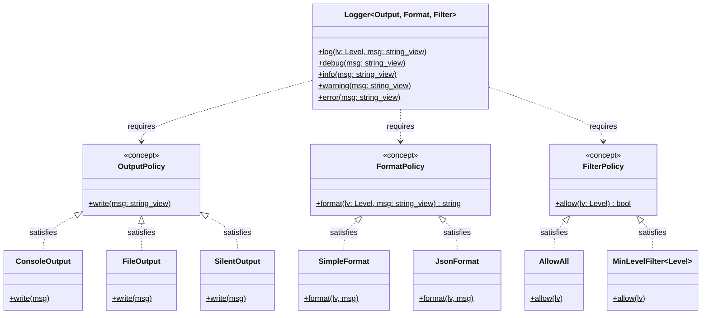
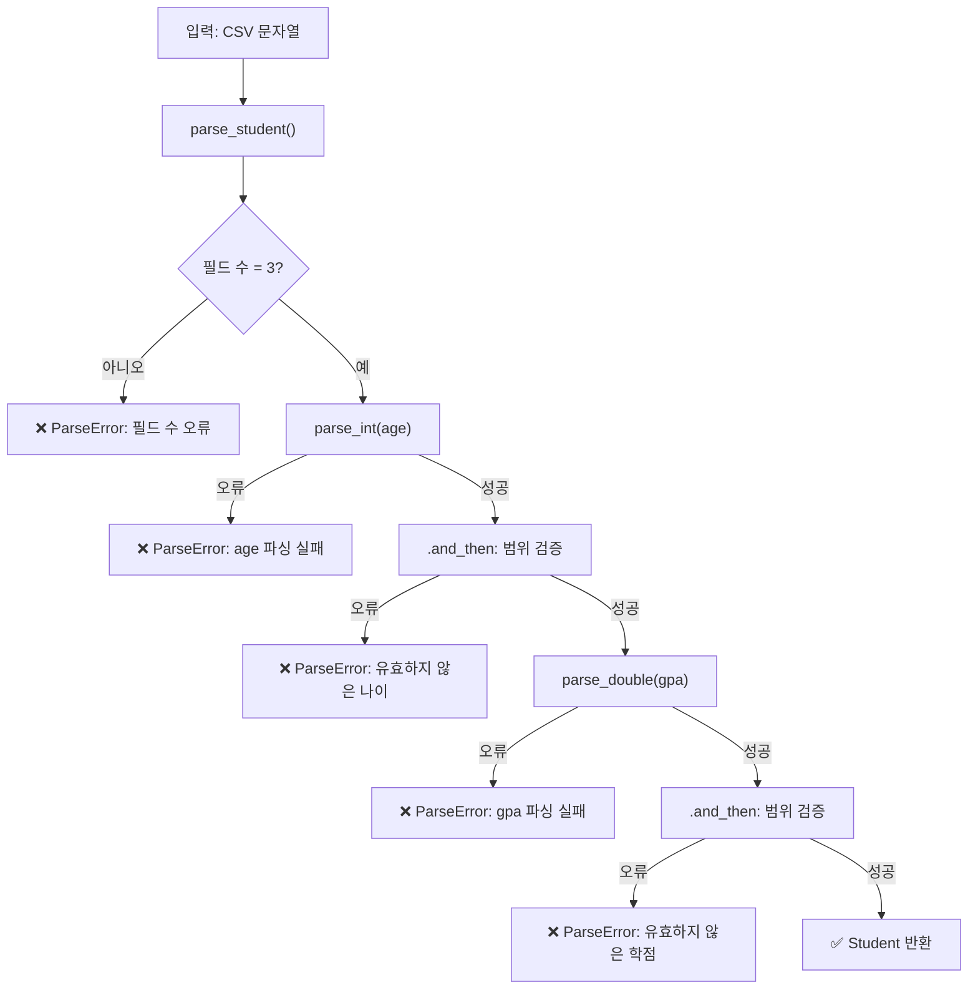
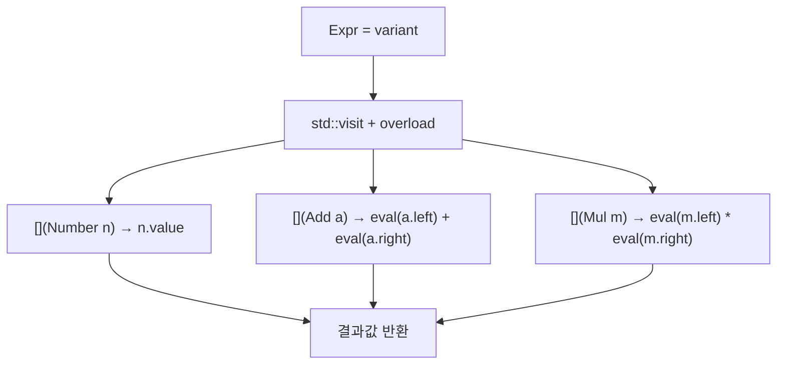

# Modern C++23 템플릿 프로그래밍  

저자: 최흥배, AI-Assisted   
    
권장 개발 환경
- **IDE**: Visual Studio 2026 (Community 이상)
- **컴파일러**: C++ 23
- **OS**: Windows 10 이상

----- 
  
# Chapter 15. 정책 기반 설계 (Policy-Based Design)

---

## **15.0 이 챕터에서 배울 것**

앞 챕터에서 우리는 **컨테이너 타입**을 파라미터로 교체하는 법을 배웠다. 이번 챕터에서는 한 발 더 나아가 **행동(behavior) 자체**를 파라미터로 교체하는 방법을 배운다.

예를 들어 로거(Logger) 클래스를 만든다고 하자. 콘솔에 출력할 수도 있고, 파일에 쓸 수도 있고, 아무것도 안 할 수도 있다. 이 "어떻게 출력할지"라는 **정책(Policy)** 을 런타임이 아닌 **컴파일 타임에 타입으로 교체**하는 것이 정책 기반 설계의 핵심이다.

```
┌─────────────────────────────────────────────────────────┐
│               정책 기반 설계의 핵심 아이디어              │
│                                                          │
│  일반적인 방법 (런타임 다형성):                           │
│  Logger → if (mode == FILE) { ... }                      │
│         → else if (mode == CONSOLE) { ... }              │
│         ← 런타임 조건 분기, 가상함수 오버헤드             │
│                                                          │
│  정책 기반 설계 (컴파일 타임 다형성):                     │
│  Logger<ConsoleOutput>  → 컴파일 타임에 결정, 오버헤드 0  │
│  Logger<FileOutput>     → 컴파일 타임에 결정, 오버헤드 0  │
│  Logger<NullOutput>     → 컴파일 타임에 결정, 오버헤드 0  │
│                                                          │
│  행동을 타입으로 표현 → 템플릿 파라미터로 교체            │
└─────────────────────────────────────────────────────────┘
```

---

## **15.1 정책(Policy)이란 무엇인가 — 행동을 타입으로 표현하기**

**정책(Policy)** 은 특정 행동을 담당하는 클래스다. 정책 클래스는 해당 행동을 수행하는 멤버 함수를 제공하고, 메인 클래스는 그 정책을 템플릿 파라미터로 받아 사용한다.

가장 간단한 예부터 시작하자. "숫자를 어떻게 출력할지"를 정책으로 분리해보겠다.

```cpp
#include <iostream>
#include <format>

// ─── 정책 클래스들 ────────────────────────────────────────
// 정책 1: 십진수로 출력
struct DecimalPolicy {
    static void print(int val) {
        std::cout << std::format("{}", val);
    }
};

// 정책 2: 16진수로 출력
struct HexPolicy {
    static void print(int val) {
        std::cout << std::format("0x{:X}", val);
    }
};

// 정책 3: 이진수로 출력
struct BinaryPolicy {
    static void print(int val) {
        std::cout << std::format("0b{:b}", val);
    }
};

// ─── 정책을 사용하는 메인 클래스 ─────────────────────────
template<typename PrintPolicy>
class NumberPrinter {
public:
    void print(int val) {
        PrintPolicy::print(val);  // 정책에게 행동을 위임
        std::cout << '\n';
    }
};

int main() {
    NumberPrinter<DecimalPolicy> dec;
    NumberPrinter<HexPolicy>     hex;
    NumberPrinter<BinaryPolicy>  bin;

    dec.print(42);  // 42
    hex.print(42);  // 0x2A
    bin.print(42);  // 0b101010
}
```

이것이 정책 기반 설계의 본질이다. `NumberPrinter`는 "어떻게 출력할지"를 알 필요가 없다. 그 **책임을 정책 클래스에게 완전히 위임**한다.

**가상 함수 방식과 비교해보면:**

```
┌──────────────────────────────────────────────────────────────┐
│           가상 함수(Virtual) vs. 정책(Policy) 비교            │
├──────────────────────────────────────────────────────────────┤
│                                                              │
│  가상 함수 방식:                                             │
│  struct IPrinter { virtual void print(int) = 0; };           │
│  struct Hex : IPrinter { void print(int v) override {...} }; │
│                                                              │
│  ✗ 런타임 vtable 조회 (간접 호출)                            │
│  ✗ 힙 할당 + 포인터 관리 필요                                │
│  ✗ 인라인 최적화 어려움                                      │
│  ✓ 런타임에 동적으로 교체 가능                               │
│                                                              │
│  정책 기반 설계:                                             │
│  template<typename P> class Printer { P::print(v); };        │
│                                                              │
│  ✓ 컴파일 타임에 결정 → 직접 호출                            │
│  ✓ 인라인 완전 최적화 가능                                   │
│  ✓ 오버헤드 제로                                             │
│  ✗ 런타임 교체 불가 (컴파일 타임에 고정)                     │
│                                                              │
└──────────────────────────────────────────────────────────────┘
```

---

## **15.2 Andrei Alexandrescu의 아이디어와 현대적 재해석**

정책 기반 설계는 2001년 Andrei Alexandrescu가 저서 *Modern C++ Design*에서 체계화한 개념이다. 당시에는 C++98 환경이었기에 매우 복잡한 템플릿 코드가 필요했다. 그러나 C++20/23의 **Concepts**와 **`if constexpr`** 덕분에 같은 아이디어를 훨씬 깔끔하게 표현할 수 있다.

**Alexandrescu의 핵심 통찰은 이것이다:**

> 클래스의 동작을 여러 독립적인 "차원(dimension)"으로 분리하고, 각 차원을 별도의 정책 파라미터로 만들어라.

```
┌─────────────────────────────────────────────────────────────┐
│              다차원 정책 분해의 예                           │
│                                                              │
│  SmartPtr<T, OwnershipPolicy, CheckingPolicy, StoragePolicy> │
│              ─────────────── ─────────────── ──────────────  │
│              소유권 정책      검사 정책        저장 정책      │
│              ┌───────────┐   ┌───────────┐   ┌───────────┐  │
│              │DeepCopy   │   │NoCheck    │   │HeapStorage│  │
│              │RefCounting│   │AssertCheck│   │StackStorage│ │
│              │NoCopy     │   │ThrowCheck │   │ ...       │  │
│              └───────────┘   └───────────┘   └───────────┘  │
│                                                              │
│  각 차원을 독립적으로 교체 → 조합의 폭발적 증가를 타입으로!  │
└─────────────────────────────────────────────────────────────┘
```

현대 C++에서는 이 아이디어를 더 간결하게 표현한다. 복잡한 `enable_if` 없이 Concepts로 정책 인터페이스를 명확히 선언할 수 있다.

**C++98 스타일 (구식):**
```cpp
// 복잡하고 에러 메시지도 끔찍하다
template<typename T,
         template<class> class CheckingPolicy,
         template<class> class StoragePolicy>
class SmartPtr : public CheckingPolicy<T>,
                 public StoragePolicy<T> { ... };
```

**C++20/23 스타일 (현대적):**
```cpp
// Concept으로 정책 인터페이스를 명확히 선언
template<typename T, CheckingPolicy C, StoragePolicy S>
class SmartPtr { ... };
```

---

## **15.3 정렬 정책, 로깅 정책, 메모리 정책 예제**

이제 세 가지 실용적인 정책 예제를 살펴보자.

---

**예제 1 — 정렬 정책 (Sorting Policy)**

컬렉션이 원소를 추가할 때 "어떤 순서로 유지할지"를 정책으로 분리한다.

```cpp
#include <vector>
#include <algorithm>
#include <iostream>

// ─── 정렬 정책들 ──────────────────────────────────────────
struct AscendingSort {
    template<typename Container>
    static void sort(Container& c) {
        std::ranges::sort(c);
    }
};

struct DescendingSort {
    template<typename Container>
    static void sort(Container& c) {
        std::ranges::sort(c, std::greater{});
    }
};

struct NoSort {
    template<typename Container>
    static void sort(Container&) {} // 아무것도 안 함
};

// ─── 정렬 정책을 사용하는 컬렉션 ─────────────────────────
template<typename T, typename SortPolicy = NoSort>
class SortedCollection {
    std::vector<T> data_;
public:
    void add(T val) {
        data_.push_back(std::move(val));
        SortPolicy::sort(data_); // 추가할 때마다 정책 적용
    }

    void print() const {
        for (const auto& v : data_)
            std::cout << v << ' ';
        std::cout << '\n';
    }
};

int main() {
    SortedCollection<int, AscendingSort>  asc;
    SortedCollection<int, DescendingSort> desc;
    SortedCollection<int>                 none; // NoSort 기본값

    for (int v : {5, 2, 8, 1, 9}) {
        asc.add(v); desc.add(v); none.add(v);
    }

    asc.print();  // 1 2 5 8 9
    desc.print(); // 9 8 5 2 1
    none.print(); // 5 2 8 1 9
}
```

---

**예제 2 — 로깅 정책 (Logging Policy)**

어떤 클래스의 연산을 기록할 때 "어디에 기록할지"를 정책으로 분리한다.

```cpp
#include <iostream>
#include <fstream>
#include <string>
#include <format>

// ─── 로깅 정책들 ──────────────────────────────────────────
struct ConsoleLog {
    static void log(std::string_view msg) {
        std::cout << "[LOG] " << msg << '\n';
    }
};

struct SilentLog {
    static void log(std::string_view) {} // 아무것도 안 함
};

struct PrefixLog {
    static void log(std::string_view msg) {
        std::cout << std::format("[{:%H:%M:%S}] {}\n",
            std::chrono::system_clock::now(), msg);
    }
};

// ─── 정책을 사용하는 계산기 ───────────────────────────────
template<typename LogPolicy = SilentLog>
class Calculator {
public:
    int add(int a, int b) {
        int result = a + b;
        LogPolicy::log(std::format("{} + {} = {}", a, b, result));
        return result;
    }

    int mul(int a, int b) {
        int result = a * b;
        LogPolicy::log(std::format("{} * {} = {}", a, b, result));
        return result;
    }
};

int main() {
    Calculator<ConsoleLog> verbose_calc;
    Calculator<SilentLog>  silent_calc;   // 또는 Calculator<> 로도 OK

    verbose_calc.add(3, 4); // [LOG] 3 + 4 = 7
    verbose_calc.mul(5, 6); // [LOG] 5 * 6 = 30

    silent_calc.add(3, 4);  // 출력 없음 (프로덕션 모드)
}
```

---

**예제 3 — 에러 처리 정책 (Error Handling Policy)**

경계 검사 실패 시 "어떻게 처리할지"를 정책으로 분리한다.

```cpp
#include <stdexcept>
#include <cassert>
#include <iostream>

// ─── 에러 처리 정책들 ─────────────────────────────────────
struct ThrowPolicy {
    static void handle(std::string_view msg) {
        throw std::out_of_range(std::string(msg));
    }
};

struct AssertPolicy {
    static void handle(std::string_view msg) {
        assert(false && "Boundary check failed");
    }
};

struct IgnorePolicy {
    static void handle(std::string_view) {} // 릴리즈 모드용
};

// ─── 정책을 사용하는 배열 래퍼 ───────────────────────────
template<typename T, std::size_t N,
         typename ErrorPolicy = ThrowPolicy>
class SafeArray {
    T data_[N]{};
public:
    T& at(std::size_t i) {
        if (i >= N)
            ErrorPolicy::handle(
                std::format("Index {} out of range [0, {})", i, N));
        return data_[i];
    }
    T& operator[](std::size_t i) { return data_[i]; }
};

int main() {
    SafeArray<int, 5, ThrowPolicy> arr;
    arr.at(2) = 42;

    try {
        arr.at(10); // 예외 발생
    } catch (const std::out_of_range& e) {
        std::cout << "예외: " << e.what() << '\n';
        // 예외: Index 10 out of range [0, 5)
    }
}
```

---

## **15.4 Concept으로 정책 인터페이스 제약하기**

정책 기반 설계의 큰 문제점 중 하나는 **정책이 어떤 인터페이스를 제공해야 하는지 코드만 봐서는 알 수 없다는 것**이다. 잘못된 정책을 넣으면 컴파일 에러가 나지만, 그 에러 메시지가 매우 길고 이해하기 어렵다.

C++20 Concepts가 이 문제를 해결한다. **정책이 반드시 갖춰야 할 인터페이스를 Concept으로 선언**하면 된다.

```cpp
#include <concepts>
#include <string_view>
#include <iostream>

// ─── 정책 인터페이스를 Concept으로 선언 ──────────────────

// 로깅 정책: log(string_view) 정적 함수가 있어야 한다
template<typename P>
concept LoggingPolicy = requires(std::string_view msg) {
    { P::log(msg) } -> std::same_as<void>;
};

// 에러 처리 정책: handle(string_view) 정적 함수가 있어야 한다
template<typename P>
concept ErrorPolicy = requires(std::string_view msg) {
    { P::handle(msg) } -> std::same_as<void>;
};

// 정렬 정책: sort(vector<int>&)를 호출할 수 있어야 한다
template<typename P>
concept SortingPolicy = requires(std::vector<int>& v) {
    P::sort(v);
};
```

이제 이 Concept들을 템플릿 파라미터 제약에 사용한다.

```cpp
// ─── Concept으로 제약된 정책 파라미터 ────────────────────
template<typename T, LoggingPolicy Log, ErrorPolicy Err>
class RobustContainer {
    std::vector<T> data_;
public:
    void add(T val) {
        Log::log(std::format("Adding: {}", val));
        data_.push_back(std::move(val));
    }

    T& at(std::size_t i) {
        if (i >= data_.size())
            Err::handle(std::format("Index {} out of range", i));
        return data_[i];
    }
};

// ─── 정책 구현체들 ────────────────────────────────────────
struct ConsoleLog {
    static void log(std::string_view msg) {
        std::cout << "[INFO] " << msg << '\n';
    }
};

struct ThrowErr {
    static void handle(std::string_view msg) {
        throw std::out_of_range(std::string(msg));
    }
};

// ─── 잘못된 정책 (컴파일 에러가 명확하게 나온다) ─────────
struct BrokenPolicy {
    // log()가 없음 → LoggingPolicy를 만족하지 않음
};

int main() {
    RobustContainer<int, ConsoleLog, ThrowErr> c;
    c.add(42);  // [INFO] Adding: 42
    c.add(99);  // [INFO] Adding: 99

    // RobustContainer<int, BrokenPolicy, ThrowErr> bad; // ❌ 컴파일 에러:
    // 'BrokenPolicy' does not satisfy constraint 'LoggingPolicy'
}
```

**Concept 없이 vs. Concept 있을 때 에러 메시지 비교:**

```
Concept 없이:
error C2039: 'log': is not a member of 'BrokenPolicy'
... (수십 줄의 템플릿 인스턴스화 스택)

Concept 있을 때 (Visual Studio 2026):
error C7602: 'RobustContainer': 'BrokenPolicy' does not satisfy
             constraint 'LoggingPolicy'
note: the expression 'P::log(msg)' is invalid
```

Concept은 단순히 제약을 거는 것을 넘어 **정책의 문서화** 역할도 한다. Concept 정의를 보면 그 정책이 무엇을 제공해야 하는지 즉시 알 수 있다.

---

**여러 정책을 조합하는 패턴:**

정책은 독립적으로 교체되어야 한다. 각 정책은 서로 다른 "차원"의 행동을 담당하므로, 어떤 조합이든 컴파일이 되어야 한다.

```cpp
// 4가지 정책 × 각각 2~3가지 구현 = 수십 가지 조합을 코드 한 벌로!
template<
    typename T,
    LoggingPolicy  Log  = SilentLog,
    ErrorPolicy    Err  = ThrowErr,
    SortingPolicy  Sort = NoSort
>
class FlexContainer {
    std::vector<T> data_;
public:
    void add(T val) {
        data_.push_back(std::move(val));
        Sort::sort(data_);
        Log::log(std::format("Added, size={}", data_.size()));
    }
    T& at(std::size_t i) {
        if (i >= data_.size()) Err::handle("out of range");
        return data_[i];
    }
};

// 조합 예시
FlexContainer<int>                                      prod; // 기본값
FlexContainer<int, ConsoleLog>                          debug;
FlexContainer<int, ConsoleLog, ThrowErr, AscendingSort> full;
```

---

## **🛠 실습: 로깅 전략을 교체할 수 있는 `Logger<Policy>` 만들기**

이번 실습에서는 정책 기반 설계를 총동원하여 실무에서 바로 쓸 수 있는 수준의 `Logger`를 만든다.

**요구사항:**
- **출력 정책(Output Policy):** 콘솔, 파일, 침묵 중 선택 가능
- **포맷 정책(Format Policy):** 심플 텍스트, JSON 형식 중 선택 가능
- **필터 정책(Filter Policy):** 로그 레벨(DEBUG/INFO/ERROR)로 필터링 가능
- 모든 정책은 Concept으로 인터페이스가 명확히 선언된다
- 정책들은 독립적으로 교체 가능하다

```cpp
#include <iostream>
#include <fstream>
#include <string>
#include <string_view>
#include <format>
#include <chrono>
#include <concepts>

// ════════════════════════════════════════════════════════════
//  로그 레벨 정의
// ════════════════════════════════════════════════════════════
enum class Level { DEBUG, INFO, WARNING, ERROR };

constexpr std::string_view level_to_str(Level lv) {
    switch (lv) {
        case Level::DEBUG:   return "DEBUG";
        case Level::INFO:    return "INFO ";
        case Level::WARNING: return "WARN ";
        case Level::ERROR:   return "ERROR";
    }
    return "?????";
}

// ════════════════════════════════════════════════════════════
//  Concept 선언 — 정책 인터페이스 계약
// ════════════════════════════════════════════════════════════

// 출력 정책: write(string_view) 정적 함수 필요
template<typename P>
concept OutputPolicy = requires(std::string_view msg) {
    { P::write(msg) } -> std::same_as<void>;
};

// 포맷 정책: format(Level, string_view) → string 정적 함수 필요
template<typename P>
concept FormatPolicy = requires(Level lv, std::string_view msg) {
    { P::format(lv, msg) } -> std::convertible_to<std::string>;
};

// 필터 정책: allow(Level) → bool 정적 함수 필요
template<typename P>
concept FilterPolicy = requires(Level lv) {
    { P::allow(lv) } -> std::convertible_to<bool>;
};

// ════════════════════════════════════════════════════════════
//  출력 정책 구현체
// ════════════════════════════════════════════════════════════
struct ConsoleOutput {
    static void write(std::string_view msg) {
        std::cout << msg << '\n';
    }
};

struct SilentOutput {
    static void write(std::string_view) {}
};

// 파일 출력: 정적 멤버로 파일 스트림 관리
struct FileOutput {
    static void write(std::string_view msg) {
        // 실제 구현에서는 파일 경로를 설정할 수 있어야 하지만,
        // 여기서는 간단히 "log.txt"에 고정
        static std::ofstream file("log.txt", std::ios::app);
        file << msg << '\n';
    }
};

// ════════════════════════════════════════════════════════════
//  포맷 정책 구현체
// ════════════════════════════════════════════════════════════
struct SimpleFormat {
    static std::string format(Level lv, std::string_view msg) {
        return std::format("[{}] {}", level_to_str(lv), msg);
    }
};

struct JsonFormat {
    static std::string format(Level lv, std::string_view msg) {
        // 현재 시간 (간단히 epoch ms로)
        auto now = std::chrono::system_clock::now()
                       .time_since_epoch().count();
        return std::format(
            R"({{"level":"{}","msg":"{}","ts":{}}})",
            level_to_str(lv), msg, now
        );
    }
};

// ════════════════════════════════════════════════════════════
//  필터 정책 구현체
// ════════════════════════════════════════════════════════════
struct AllowAll {
    static bool allow(Level) { return true; }
};

// 지정 레벨 이상만 허용하는 필터 (NTTP 활용!)
template<Level MinLevel>
struct MinLevelFilter {
    static bool allow(Level lv) {
        return static_cast<int>(lv) >= static_cast<int>(MinLevel);
    }
};

// ════════════════════════════════════════════════════════════
//  Logger 클래스 — 세 정책을 조합
// ════════════════════════════════════════════════════════════
template<
    OutputPolicy Output = ConsoleOutput,
    FormatPolicy Format = SimpleFormat,
    FilterPolicy Filter = AllowAll
>
class Logger {
public:
    static void log(Level lv, std::string_view msg) {
        if (!Filter::allow(lv)) return;          // 필터 정책 적용
        std::string formatted = Format::format(lv, msg); // 포맷 정책 적용
        Output::write(formatted);                // 출력 정책 적용
    }

    // 편의 함수들
    static void debug  (std::string_view msg) { log(Level::DEBUG,   msg); }
    static void info   (std::string_view msg) { log(Level::INFO,    msg); }
    static void warning(std::string_view msg) { log(Level::WARNING, msg); }
    static void error  (std::string_view msg) { log(Level::ERROR,   msg); }
};

// ════════════════════════════════════════════════════════════
//  자주 쓰는 조합에 별칭 만들기
// ════════════════════════════════════════════════════════════
using DevLogger  = Logger<ConsoleOutput, SimpleFormat, AllowAll>;
using ProdLogger = Logger<FileOutput,    SimpleFormat,
                          MinLevelFilter<Level::WARNING>>;
using JsonLogger = Logger<ConsoleOutput, JsonFormat, AllowAll>;
using NullLogger = Logger<SilentOutput, SimpleFormat, AllowAll>;

// ════════════════════════════════════════════════════════════
//  main — 다양한 조합 테스트
// ════════════════════════════════════════════════════════════
int main() {
    std::cout << "=== DevLogger (모든 레벨, 심플 포맷) ===\n";
    DevLogger::debug("서버 시작 중...");
    DevLogger::info("포트 8080 바인딩 완료");
    DevLogger::warning("메모리 사용률 80% 초과");
    DevLogger::error("데이터베이스 연결 실패");

    std::cout << "\n=== JsonLogger (모든 레벨, JSON 포맷) ===\n";
    JsonLogger::info("요청 수신");
    JsonLogger::error("처리 실패");

    std::cout << "\n=== ProdLogger (WARNING 이상, 파일 출력) ===\n";
    ProdLogger::info("이건 파일에 안 쓰인다");    // 필터됨
    ProdLogger::warning("이건 파일에 쓰인다");    // log.txt에 저장
    ProdLogger::error("이것도 파일에 쓰인다");    // log.txt에 저장
    std::cout << "(WARNING/ERROR 내용은 log.txt 파일 확인)\n";

    std::cout << "\n=== NullLogger (아무것도 안 함) ===\n";
    NullLogger::error("이 메시지는 어디에도 출력되지 않는다");
    std::cout << "(NullLogger는 출력 없음)\n";
}
```

**예상 출력:**

```
=== DevLogger (모든 레벨, 심플 포맷) ===
[DEBUG] 서버 시작 중...
[INFO ] 포트 8080 바인딩 완료
[WARN ] 메모리 사용률 80% 초과
[ERROR] 데이터베이스 연결 실패

=== JsonLogger (모든 레벨, JSON 포맷) ===
{"level":"INFO ","msg":"요청 수신","ts":1718321234000000000}
{"level":"ERROR","msg":"처리 실패","ts":1718321234000001000}

=== ProdLogger (WARNING 이상, 파일 출력) ===
(WARNING/ERROR 내용은 log.txt 파일 확인)

=== NullLogger (아무것도 안 함) ===
(NullLogger는 출력 없음)
```

**전체 설계 구조:**



---

**새로운 정책을 추가하는 것이 얼마나 간단한지 보자:**

```cpp
// 기존 코드를 단 한 줄도 수정하지 않고 새 정책 추가 가능
struct ColorConsoleOutput {
    static void write(std::string_view msg) {
        // ANSI 색상 코드로 출력 (Windows Terminal 지원)
        if (msg.contains("ERROR"))
            std::cout << "\033[31m" << msg << "\033[0m\n"; // 빨간색
        else if (msg.contains("WARN"))
            std::cout << "\033[33m" << msg << "\033[0m\n"; // 노란색
        else
            std::cout << msg << '\n';
    }
};

// 기존 Logger에 그냥 끼워 넣으면 된다
using ColorLogger = Logger<ColorConsoleOutput, SimpleFormat, AllowAll>;

ColorLogger::warning("메모리 부족 경고!");  // 노란색 출력
ColorLogger::error("치명적 오류 발생!");    // 빨간색 출력
```

이것이 정책 기반 설계의 강력함이다. **개방-폐쇄 원칙(Open-Closed Principle)** 이 자연스럽게 지켜진다. 기존 코드를 수정하지 않고 새 정책 클래스를 추가하기만 하면 된다.

---

## **📌 핵심 정리**

**정책 기반 설계의 세 가지 핵심 규칙:**

첫째, **행동을 차원별로 분리하라.** 하나의 정책이 하나의 관심사(concern)만 담당해야 한다. 출력 방식, 포맷 방식, 필터 방식은 각각 독립적인 차원이므로 별도 정책으로 분리한다.

둘째, **Concept으로 정책 인터페이스를 선언하라.** 이것이 정책의 "계약서"다. Concept 없이는 잘못된 정책을 넣었을 때 에러 메시지가 폭탄처럼 쏟아진다. Concept이 있으면 즉각적이고 명확한 에러를 볼 수 있다.

셋째, **기본값을 신중하게 선택하라.** 가장 일반적인 사용 시나리오에 맞는 정책을 기본값으로 설정하면, 대부분의 경우 `Logger<>`처럼 파라미터 없이 사용할 수 있어 편의성이 높아진다.

**정책 기반 설계 요약표:**

| 항목 | 내용 |
|------|------|
| 핵심 아이디어 | 행동(behavior)을 타입(Policy Class)으로 표현 |
| 교체 시점 | 컴파일 타임 |
| 런타임 오버헤드 | 제로 (인라인 최적화) |
| 인터페이스 선언 | C++20 Concepts |
| 기본값 지정 | 템플릿 파라미터 기본값 |
| 조합 방식 | 다중 템플릿 파라미터 |
| 확장 방법 | 새 정책 클래스 추가 (기존 코드 수정 불필요) |

다음 챕터(Chapter 16)에서는 `std::tuple`과 타입 리스트를 다루며, 여러 타입을 컴파일 타임에 묶고 순회하는 방법을 배운다. 정책 기반 설계에서 "여러 정책을 하나의 번들로 묶는" 고급 기법과도 연결된다.  
  


# Chapter 16. 타입 리스트와 `std::tuple` 활용

---

## 들어가며

`std::tuple`은 C++ 표준 라이브러리에서 가장 강력하면서도 가장 오해받는 도구 중 하나입니다. 단순히 "여러 타입을 한 번에 묶는 그릇" 정도로만 알고 있다면, 이 챕터를 읽고 나서 생각이 완전히 바뀔 것입니다. `std::tuple`은 **컴파일 타임에 타입 목록을 조작하는 엔진**이며, 이를 이해하면 메타프로그래밍의 문이 활짝 열립니다.

이 챕터에서는 `std::tuple`의 내부 동작 원리부터 시작해서, 실전에서 바로 쓸 수 있는 순회 기법, 타입 리스트 조작, 그리고 C++23에서 새롭게 추가된 기능들까지 단계적으로 살펴봅니다.

---

## 16.1 `std::tuple` 내부 구조 엿보기

`std::tuple`이 어떻게 동작하는지 이해하려면, 먼저 "서로 다른 타입의 값을 여러 개 저장한다"는 것이 컴파일러 입장에서 얼마나 어려운 문제인지를 느껴봐야 합니다.

**왜 단순한 멤버 변수 목록으로 구현할 수 없는가**

직관적으로는 이렇게 만들고 싶을 것입니다.

```cpp
// ❌ 이런 문법은 C++에 존재하지 않는다
template <typename... Types>
struct Tuple {
    Types... values;  // 파라미터 팩을 직접 멤버로 선언할 수 없음
};
```

C++는 파라미터 팩을 직접 멤버 변수로 선언하는 문법을 지원하지 않습니다. 그래서 표준 라이브러리는 **재귀적 상속(recursive inheritance)** 기법을 사용합니다.

**재귀 상속 방식의 내부 구조**

`std::tuple<int, double, std::string>`은 개념적으로 다음과 같이 구성됩니다.

```
TupleImpl<0, int, double, string>
    ┌─────────────────────────────────┐
    │  head: int (index 0)            │
    │  ┌──────────────────────────┐   │
    │  │ TupleImpl<1, double, string> │
    │  │  head: double (index 1)  │   │
    │  │  ┌───────────────────┐   │   │
    │  │  │ TupleImpl<2, string>  │   │
    │  │  │  head: string (idx 2)│   │
    │  │  │  (base: empty)    │   │   │
    │  │  └───────────────────┘   │   │
    │  └──────────────────────────┘   │
    └─────────────────────────────────┘
```

실제 구현을 단순화하면 이렇게 됩니다.

```cpp
// std::tuple의 간소화된 구현 원리
// (교육 목적 — 실제 표준 라이브러리는 훨씬 복잡합니다)

// 종료 케이스: 빈 튜플
template <std::size_t Idx, typename... Types>
struct TupleImpl {};

// 재귀 케이스: 하나씩 "벗겨내기"
template <std::size_t Idx, typename Head, typename... Tail>
struct TupleImpl<Idx, Head, Tail...> : TupleImpl<Idx + 1, Tail...> {
    Head value;
    TupleImpl(Head h, Tail... t)
        : TupleImpl<Idx + 1, Tail...>(t...), value(h) {}
};

// std::get<N> 의 원리
template <std::size_t N, std::size_t Idx, typename Head, typename... Tail>
auto& getHelper(TupleImpl<Idx, Head, Tail...>& t) {
    if constexpr (N == Idx)
        return t.value;
    else
        return getHelper<N>(static_cast<TupleImpl<Idx+1, Tail...>&>(t));
}
```

**`std::tuple_size`와 `std::tuple_element` — 컴파일 타임 메타 정보**

표준 라이브러리는 `std::tuple`의 메타 정보를 두 가지 타입 트레이트로 제공합니다.

```cpp
#include <tuple>
#include <type_traits>
#include <iostream>

int main() {
    using MyTuple = std::tuple<int, double, std::string>;

    // 튜플의 원소 개수 (컴파일 타임 상수)
    constexpr std::size_t size = std::tuple_size_v<MyTuple>;
    std::cout << "size: " << size << "\n";  // 3

    // N번째 원소의 타입
    using FirstType  = std::tuple_element_t<0, MyTuple>; // int
    using SecondType = std::tuple_element_t<1, MyTuple>; // double

    static_assert(std::is_same_v<FirstType, int>);
    static_assert(std::is_same_v<SecondType, double>);
}
```

`std::tuple_size_v<T>`와 `std::tuple_element_t<N, T>`는 단순히 `std::tuple`만을 위한 것이 아닙니다. C++23에서 공식화된 **tuple-like** 개념과 연결되며, `std::array`, `std::pair`, `std::ranges::subrange` 등도 이 프로토콜을 따릅니다(자세한 내용은 16.5절에서 다룹니다).

---

## 16.2 `std::get<N>`, `std::get<T>`, `std::apply`

**`std::get` — 인덱스와 타입으로 접근하기**

`std::tuple`의 원소에 접근하는 기본 방법은 `std::get`입니다. 인덱스 기반과 타입 기반 두 가지가 있습니다.

```cpp
#include <tuple>
#include <iostream>
#include <string>

int main() {
    auto t = std::make_tuple(42, 3.14, std::string{"hello"});

    // ① 인덱스로 접근 (컴파일 타임 상수여야 함)
    std::cout << std::get<0>(t) << "\n";   // 42
    std::cout << std::get<1>(t) << "\n";   // 3.14
    std::cout << std::get<2>(t) << "\n";   // hello

    // ② 타입으로 접근 (같은 타입이 두 개 이상이면 컴파일 오류)
    std::cout << std::get<int>(t) << "\n";         // 42
    std::cout << std::get<std::string>(t) << "\n"; // hello

    // ③ 수정도 가능
    std::get<0>(t) = 100;
    std::cout << std::get<0>(t) << "\n";   // 100

    // ④ C++17 구조적 바인딩(structured bindings)으로도 접근 가능
    auto& [n, d, s] = t;
    std::cout << n << ", " << d << ", " << s << "\n";
}
```

> 💡 **주의**: `std::get<N>`에서 `N`은 런타임 변수가 될 수 없습니다. `int i = 0; std::get<i>(t);` 같은 코드는 컴파일 오류입니다. 이것이 바로 튜플 순회가 일반 배열 순회와 다른 핵심 이유이며, 16.3절의 주제입니다.

**`std::apply` — 튜플을 함수 인자로 "펼치기"**

`std::apply`는 C++17에서 추가된 함수로, 튜플의 모든 원소를 자동으로 풀어서 callable에 인자로 전달합니다.

```
std::apply(f, tuple{a, b, c})
    │
    └─► f(a, b, c)   // 내부에서 index_sequence를 써서 자동 확장
```

```cpp
#include <tuple>
#include <iostream>

int sum(int a, int b, int c) {
    return a + b + c;
}

int main() {
    auto args = std::make_tuple(10, 20, 30);

    // 함수에 튜플 원소를 풀어서 전달
    int result = std::apply(sum, args);
    std::cout << result << "\n";  // 60

    // 람다와 함께 사용 — 가장 흔한 패턴
    std::apply([](auto&&... elems) {
        ((std::cout << elems << " "), ...);
        std::cout << "\n";
    }, args);
    // 출력: 10 20 30
}
```

`std::apply`의 구현 원리는 `std::index_sequence`를 이용해 자동으로 `std::get<0>`, `std::get<1>`, ...을 확장하는 것입니다.

```cpp
// std::apply의 구현 원리 (표준 명세 기반 단순화 버전)
namespace detail {
    template <typename F, typename Tuple, std::size_t... Is>
    constexpr decltype(auto) apply_impl(F&& f, Tuple&& t,
                                        std::index_sequence<Is...>) {
        return std::invoke(std::forward<F>(f),
                           std::get<Is>(std::forward<Tuple>(t))...);
    }
}

template <typename F, typename Tuple>
constexpr decltype(auto) my_apply(F&& f, Tuple&& t) {
    constexpr auto size = std::tuple_size_v<std::remove_cvref_t<Tuple>>;
    return detail::apply_impl(std::forward<F>(f),
                              std::forward<Tuple>(t),
                              std::make_index_sequence<size>{});
}
```

`std::make_from_tuple`도 비슷한 원리로, 튜플을 생성자 인자로 사용합니다.

```cpp
struct Point { int x, y; };

auto coords = std::make_tuple(3, 7);
auto p = std::make_from_tuple<Point>(coords);  // Point{3, 7}
std::cout << p.x << ", " << p.y << "\n";       // 3, 7
```

---

## 16.3 `std::index_sequence`를 이용한 튜플 순회

이 절은 이 챕터의 핵심입니다. 튜플을 "순회"한다는 것이 왜 특별한 기법을 필요로 하는지, 그리고 어떻게 해결하는지를 단계별로 이해해 봅니다.

**왜 일반 루프가 안 되는가**

```cpp
std::tuple tp{1, 3.14, "hello"};

// ❌ 불가능 — N이 컴파일 타임 상수여야 하므로 변수로 사용 불가
for (int i = 0; i < 3; ++i) {
    std::cout << std::get<i>(tp);  // 컴파일 오류!
}
```

`std::get<N>`의 `N`은 **컴파일 타임 상수**여야 합니다. 런타임 변수인 `i`를 쓸 수 없습니다. 이 문제를 해결하려면 컴파일러가 **0, 1, 2를 템플릿 파라미터 팩으로 "전개"** 하도록 유도해야 합니다.

**`std::index_sequence` 이해하기**

`std::index_sequence`는 `0, 1, 2, ..., N-1`의 정수 목록을 **타입**으로 표현하는 도구입니다.

```cpp
// index_sequence의 정체
// std::index_sequence<0, 1, 2>  ←  std::integer_sequence<size_t, 0, 1, 2>

// 직접 만들기
std::index_sequence<0, 1, 2> seq{};  // 0, 1, 2를 담은 "타입"

// 자동 생성: 0부터 N-1까지
std::make_index_sequence<3>{};  // index_sequence<0, 1, 2>
std::make_index_sequence<5>{};  // index_sequence<0, 1, 2, 3, 4>
```

```
make_index_sequence<N>
        │
        ▼
index_sequence<0, 1, 2, ..., N-1>
        │
        ▼  함수 파라미터로 받으면
template <size_t... Is>        ← Is = {0, 1, 2, ..., N-1}
void foo(index_sequence<Is...>)
        │
        ▼  폴드 표현식으로 전개
std::get<0>(tp), std::get<1>(tp), ..., std::get<N-1>(tp)
```

**단계별로 구현하는 `for_each_tuple`**

```cpp
#include <tuple>
#include <iostream>

// 1단계: index_sequence를 받아 폴드 표현식으로 순회
template <typename Tuple, typename Fn, std::size_t... Is>
void for_each_impl(Tuple&& tp, Fn&& fn, std::index_sequence<Is...>) {
    // 폴드 표현식으로 fn(get<0>), fn(get<1>), ... 을 순서대로 호출
    (fn(std::get<Is>(std::forward<Tuple>(tp))), ...);
}

// 2단계: 사용자 인터페이스 — index_sequence 자동 생성
template <typename Tuple, typename Fn>
void for_each_tuple(Tuple&& tp, Fn&& fn) {
    constexpr auto size = std::tuple_size_v<std::remove_cvref_t<Tuple>>;
    for_each_impl(std::forward<Tuple>(tp),
                  std::forward<Fn>(fn),
                  std::make_index_sequence<size>{});
}

int main() {
    auto t = std::make_tuple(1, 2.5, std::string{"hi"});

    for_each_tuple(t, [](const auto& elem) {
        std::cout << elem << "\n";
    });
    // 출력:
    // 1
    // 2.5
    // hi
}
```

**`std::apply`를 이용한 더 간결한 방법**

앞에서 배운 `std::apply`를 이용하면 `index_sequence`를 직접 다루지 않고도 같은 효과를 낼 수 있습니다.

```cpp
template <typename Tuple, typename Fn>
void for_each_tuple_apply(Tuple&& tp, Fn&& fn) {
    std::apply(
        // C++20 템플릿 람다로 완벽 전달 보장
        [&fn]<typename... Ts>(Ts&&... args) {
            (fn(std::forward<Ts>(args)), ...);
        },
        std::forward<Tuple>(tp)
    );
}
```

> 💡 `remove_cvref_t`는 C++20에서 추가된 트레이트로, 레퍼런스와 `const`/`volatile`을 한 번에 제거합니다. 이전에는 `std::decay_t`나 `std::remove_reference_t`를 사용했습니다. 보편 참조(`T&&`)로 받은 튜플 타입에서 `tuple_size`를 가져올 때 반드시 필요합니다.

---

## 16.4 컴파일 타임 타입 리스트 조작

이 절에서는 `std::tuple`을 순수하게 **타입 목록을 다루는 도구**로 활용하는 메타프로그래밍 기법을 배웁니다. 값을 저장하는 것이 목적이 아니라, **타입 자체를 조작하는 것**이 목적입니다.

**타입 리스트로서의 `std::tuple`**

`std::tuple<int, double, std::string>`을 "int, double, string이라는 타입 세 개의 목록"으로 볼 수 있습니다. 이 시각에서는 실제 값을 전혀 저장하지 않고, 타입 목록 자체를 컴파일 타임에 계산합니다.

```
TypeList = std::tuple<int, double, string>
                │
     ┌──────────┼──────────┐
     ↓          ↓          ↓
    int       double     string
  (index 0)  (index 1)  (index 2)
```

**`std::tuple_cat` — 타입 리스트 합치기**

```cpp
#include <tuple>
#include <type_traits>

// 두 타입 리스트를 합치는 메타함수
template <typename T1, typename T2>
using type_list_cat = decltype(
    std::tuple_cat(std::declval<T1>(), std::declval<T2>())
);

using ListA = std::tuple<int, float>;
using ListB = std::tuple<double, char>;
using Combined = type_list_cat<ListA, ListB>;
// Combined = std::tuple<int, float, double, char>

static_assert(std::is_same_v<Combined,
              std::tuple<int, float, double, char>>);
```

**타입 리스트에서 N번째 타입 꺼내기**

```cpp
// 타입 리스트의 N번째 타입
template <std::size_t N, typename TypeList>
using type_at = std::tuple_element_t<N, TypeList>;

using MyList = std::tuple<int, double, std::string, char>;

type_at<0, MyList>; // int
type_at<2, MyList>; // std::string
```

**타입 리스트 앞에 타입 추가하기 (push_front)**

```cpp
template <typename T, typename TypeList>
struct push_front;

template <typename T, typename... Ts>
struct push_front<T, std::tuple<Ts...>> {
    using type = std::tuple<T, Ts...>;
};

template <typename T, typename TypeList>
using push_front_t = typename push_front<T, TypeList>::type;

// 사용 예
using Original = std::tuple<double, std::string>;
using Extended = push_front_t<int, Original>;
// Extended = std::tuple<int, double, std::string>

static_assert(std::is_same_v<Extended,
              std::tuple<int, double, std::string>>);
```

**타입 리스트 변환 — `transform`**

각 타입에 변환을 적용해 새 타입 리스트를 만드는 메타함수입니다.

```cpp
// TypeList의 모든 타입에 Trait을 적용한 새 타입 리스트 생성
template <template <typename> class Trait, typename TypeList>
struct transform_types;

template <template <typename> class Trait, typename... Ts>
struct transform_types<Trait, std::tuple<Ts...>> {
    using type = std::tuple<typename Trait<Ts>::type...>;
};

template <template <typename> class Trait, typename TypeList>
using transform_types_t = typename transform_types<Trait, TypeList>::type;

// 사용 예: 모든 타입에 const 추가
using RawList   = std::tuple<int, double, char>;
using ConstList = transform_types_t<std::add_const, RawList>;
// ConstList = std::tuple<const int, const double, const char>

static_assert(std::is_same_v<ConstList,
              std::tuple<const int, const double, const char>>);
```

**타입 존재 여부 검사 — `contains_type`**

```cpp
template <typename T, typename TypeList>
struct contains_type;

template <typename T, typename... Ts>
struct contains_type<T, std::tuple<Ts...>>
    : std::bool_constant<(std::is_same_v<T, Ts> || ...)> {};

template <typename T, typename TypeList>
inline constexpr bool contains_type_v = contains_type<T, TypeList>::value;

// 사용 예
using List = std::tuple<int, double, std::string>;

static_assert( contains_type_v<int,        List>);  // ✅
static_assert( contains_type_v<double,     List>);  // ✅
static_assert(!contains_type_v<float,      List>);  // ✅
```

**타입 인덱스 찾기 — `index_of`**

```cpp
// 타입 리스트에서 타입 T의 인덱스를 반환
template <typename T, typename TypeList, std::size_t Idx = 0>
struct index_of;

template <typename T, typename Head, typename... Tail, std::size_t Idx>
struct index_of<T, std::tuple<Head, Tail...>, Idx>
    : std::conditional_t<
        std::is_same_v<T, Head>,
        std::integral_constant<std::size_t, Idx>,
        index_of<T, std::tuple<Tail...>, Idx + 1>
      > {};

template <typename T, typename TypeList>
inline constexpr std::size_t index_of_v = index_of<T, TypeList>::value;

// 사용 예
using List = std::tuple<int, double, std::string>;
static_assert(index_of_v<int,         List> == 0);
static_assert(index_of_v<double,      List> == 1);
static_assert(index_of_v<std::string, List> == 2);
```

**종합 예제: 타입 디스패처 만들기**

타입 리스트와 인덱스 조회를 활용해서, 런타임에 주어진 인덱스에 맞는 처리를 수행하는 디스패처입니다.

```cpp
#include <tuple>
#include <iostream>
#include <variant>

// 각 타입에 대응하는 핸들러를 등록하고 인덱스로 호출
template <typename TypeList>
struct TypeDispatcher;

template <typename... Ts>
struct TypeDispatcher<std::tuple<Ts...>> {
    template <typename Fn>
    static void dispatch(std::size_t idx, Fn&& fn) {
        std::size_t i = 0;
        ([&] {
            if (i++ == idx) fn(std::type_identity<Ts>{});
        }(), ...);
    }
};

int main() {
    using MyTypes = std::tuple<int, double, std::string>;
    TypeDispatcher<MyTypes>::dispatch(1, [](auto type_tag) {
        using T = typename decltype(type_tag)::type;
        std::cout << "선택된 타입: " << typeid(T).name() << "\n";
    });
    // 출력 (컴파일러마다 다름): "선택된 타입: double"
}
```

---

## 16.5 C++23 `std::tuple` 개선 사항

C++23은 `std::tuple`과 관련해 몇 가지 중요한 개선을 가져왔습니다. 그 중 가장 주목할 만한 것은 **tuple-like 컨셉의 공식화**와 **tuple-like 타입 간의 상호 운용성 강화**입니다.

**tuple-like 컨셉 공식화**

C++23은 "튜플처럼 동작하는 타입"을 `tuple-like`라는 공식 컨셉으로 정의했습니다. 이 컨셉을 만족하는 타입은 `std::get`, `std::tuple_element`, `std::tuple_size`를 지원합니다.

```
C++23 tuple-like 타입 목록:
┌─────────────────────────────┐
│  std::tuple<Ts...>          │
│  std::pair<T, U>            │
│  std::array<T, N>           │
│  std::ranges::subrange<I,S> │
└─────────────────────────────┘
  모두 std::get, tuple_size,
  tuple_element 지원 → 구조적 바인딩 가능
```

```cpp
#include <tuple>
#include <array>
#include <utility>
#include <iostream>

// C++23: std::array와 std::tuple 간의 상호 변환이 더 자연스러워짐
std::array<int, 3> arr{1, 2, 3};

// std::array도 tuple-like이므로 std::apply 사용 가능
auto result = std::apply([](int a, int b, int c) {
    return a + b + c;
}, arr);
std::cout << result << "\n";  // 6

// std::array도 구조적 바인딩 가능 (C++17부터)
auto [x, y, z] = arr;
std::cout << x << " " << y << " " << z << "\n";  // 1 2 3
```

**tuple-like 타입으로 tuple 생성**

C++23부터는 `std::array`를 `std::tuple`의 생성자에 직접 전달할 수 있습니다.

```cpp
#include <tuple>
#include <array>
#include <iostream>

int main() {
    std::array<int, 3> arr = {10, 20, 30};

    // C++23: array → tuple 직접 변환
    std::tuple<int, int, int> t(arr);

    std::cout << std::get<0>(t) << "\n";  // 10
    std::cout << std::get<1>(t) << "\n";  // 20
    std::cout << std::get<2>(t) << "\n";  // 30
}
```

**`std::common_type` 개선**

C++23은 `std::tuple`과 다른 tuple-like 타입 간의 `std::common_type`도 지원합니다.

```cpp
#include <tuple>
#include <type_traits>

// pair와 tuple 간의 공통 타입 추론
using T1 = std::tuple<int,    double>;
using T2 = std::tuple<double, float>;

using Common = std::common_type_t<T1, T2>;
// Common = std::tuple<double, double>

static_assert(std::is_same_v<Common, std::tuple<double, double>>);
```

**커스텀 타입을 tuple-like로 만들기**

여러분의 타입도 `std::tuple_size`, `std::tuple_element`, `std::get`을 특수화하면 tuple-like가 됩니다.

```cpp
#include <tuple>
#include <iostream>

struct RGB {
    uint8_t r, g, b;
};

// ① tuple_size 특수화
template <>
struct std::tuple_size<RGB>
    : std::integral_constant<std::size_t, 3> {};

// ② tuple_element 특수화
template <std::size_t I>
struct std::tuple_element<I, RGB> {
    using type = uint8_t;
};

// ③ get 함수 오버로드
template <std::size_t I>
uint8_t& get(RGB& c) {
    if constexpr (I == 0) return c.r;
    else if constexpr (I == 1) return c.g;
    else                       return c.b;
}

template <std::size_t I>
uint8_t get(const RGB& c) {
    if constexpr (I == 0) return c.r;
    else if constexpr (I == 1) return c.g;
    else                       return c.b;
}

int main() {
    RGB color{255, 128, 0};

    // 구조적 바인딩 사용 가능!
    auto [r, g, b] = color;
    std::cout << "R:" << (int)r << " G:" << (int)g << " B:" << (int)b << "\n";
    // R:255 G:128 B:0

    // std::apply도 사용 가능!
    std::apply([](auto r, auto g, auto b) {
        std::cout << "sum = " << (int)r + g + b << "\n";
    }, color);
    // sum = 383
}
```

---

## 🛠 실습: 튜플의 모든 원소를 출력하는 `print_tuple` 만들기

이 실습에서는 지금까지 배운 내용을 종합하여 완성도 높은 `print_tuple` 함수를 단계별로 구현합니다. Visual Studio 2026에서 바로 실행해보며 각 단계를 확인해 보세요.

---

**Step 1 — 가장 단순한 버전: 수동으로 인덱스 전달**

먼저 `index_sequence`의 원리를 명확히 이해하기 위해, 가장 기초적인 버전부터 시작합니다.

```cpp
// step1_print_tuple.cpp
#include <tuple>
#include <iostream>

template <typename T>
void print_elem(const T& x) {
    std::cout << x;
}

// index_sequence로 튜플 원소를 폴드 표현식으로 출력
template <typename Tuple, std::size_t... Is>
void print_tuple_impl(const Tuple& tp, std::index_sequence<Is...>) {
    std::cout << "(";
    std::size_t idx = 0;
    auto with_sep = [&idx](const auto& x) {
        if (idx++ > 0) std::cout << ", ";
        std::cout << x;
    };
    (with_sep(std::get<Is>(tp)), ...);
    std::cout << ")";
}

template <typename Tuple>
void print_tuple(const Tuple& tp) {
    constexpr auto size = std::tuple_size_v<Tuple>;
    print_tuple_impl(tp, std::make_index_sequence<size>{});
}

int main() {
    auto t1 = std::make_tuple(1, 2.5, "hello");
    print_tuple(t1);  // (1, 2.5, hello)
    std::cout << "\n";

    auto t2 = std::make_tuple(42);
    print_tuple(t2);  // (42)
    std::cout << "\n";

    auto t3 = std::tuple<>{};
    print_tuple(t3);  // ()
    std::cout << "\n";
}
```

---

**Step 2 — `std::apply` 버전: 더 간결하게**

```cpp
// step2_apply_version.cpp
#include <tuple>
#include <iostream>

template <typename Tuple>
void print_tuple(const Tuple& tp) {
    std::cout << "(";
    std::apply(
        [](const auto& first, const auto&... rest) {
            std::cout << first;
            ((std::cout << ", " << rest), ...);
        },
        tp
    );
    std::cout << ")";
}

int main() {
    auto t = std::make_tuple(10, 3.14, std::string{"world"}, 'A');
    print_tuple(t);
    // (10, 3.14, world, A)
    std::cout << "\n";
}
```

> ⚠️ 이 버전은 튜플이 비어있으면 컴파일 오류가 납니다. `first`와 `rest...` 패턴은 원소가 최소 1개 이상일 때만 작동하기 때문입니다. Step 3에서 이를 해결합니다.

---

**Step 3 — 완성 버전: 빈 튜플 처리 + `ostream` 지원 + Concept 제약**

```cpp
// step3_final_print_tuple.cpp
#include <tuple>
#include <iostream>
#include <sstream>
#include <string>
#include <concepts>

// ─── Concept: tuple-like인지 확인 ───────────────────────────────────
template <typename T>
concept TupleLike = requires {
    typename std::tuple_size<std::remove_cvref_t<T>>::type;
};

// ─── 내부 구현 ────────────────────────────────────────────────────────
template <TupleLike Tuple, std::size_t... Is>
std::ostream& print_tuple_impl(std::ostream& os,
                               const Tuple& tp,
                               std::index_sequence<Is...>) {
    os << "(";
    // 폴드 표현식으로 각 원소 출력 (인덱스 Is를 직접 활용)
    ((os << (Is == 0 ? "" : ", ") << std::get<Is>(tp)), ...);
    os << ")";
    return os;
}

// ─── 공개 인터페이스 ──────────────────────────────────────────────────
template <TupleLike Tuple>
std::ostream& print_tuple(std::ostream& os, const Tuple& tp) {
    constexpr auto size = std::tuple_size_v<std::remove_cvref_t<Tuple>>;
    if constexpr (size == 0) {
        return os << "()";  // 빈 튜플 처리
    } else {
        return print_tuple_impl(os, tp, std::make_index_sequence<size>{});
    }
}

// 편의 오버로드: std::cout에 직접 출력
template <TupleLike Tuple>
void print_tuple(const Tuple& tp) {
    print_tuple(std::cout, tp);
    std::cout << "\n";
}

// ─── 테스트 ───────────────────────────────────────────────────────────
int main() {
    // 기본 튜플
    auto t1 = std::make_tuple(1, 2.5, std::string{"hello"}, 'Z');
    print_tuple(t1);
    // (1, 2.5, hello, Z)

    // 빈 튜플
    auto t2 = std::tuple<>{};
    print_tuple(t2);
    // ()

    // std::pair도 tuple-like
    auto p = std::pair{42, 3.14};
    print_tuple(p);
    // (42, 3.14)

    // std::array도 tuple-like
    auto arr = std::array{10, 20, 30};
    print_tuple(arr);
    // (10, 20, 30)

    // stringstream으로 출력
    std::ostringstream oss;
    print_tuple(oss, t1);
    std::cout << "captured: " << oss.str() << "\n";
    // captured: (1, 2.5, hello, Z)
}
```

---

**Step 4 — 보너스: `transform_tuple`로 값 변환**

```cpp
// step4_transform_tuple.cpp
#include <tuple>
#include <iostream>
#include <string>

// 각 원소에 fn을 적용한 새 튜플 반환
template <typename Tuple, typename Fn>
[[nodiscard]] auto transform_tuple(Tuple&& tp, Fn&& fn) {
    return std::apply(
        [&fn]<typename... Ts>(Ts&&... args) {
            return std::make_tuple(fn(std::forward<Ts>(args))...);
        },
        std::forward<Tuple>(tp)
    );
}

int main() {
    auto numbers = std::make_tuple(1, 2, 3);

    // 모든 원소를 두 배로
    auto doubled = transform_tuple(numbers, [](auto x) { return x * 2; });
    // doubled = (2, 4, 6)

    std::apply([](auto... xs) {
        ((std::cout << xs << " "), ...);
    }, doubled);
    std::cout << "\n";
    // 출력: 2 4 6

    // 모든 원소를 문자열로 변환
    auto strs = transform_tuple(numbers,
        [](auto x) { return std::to_string(x); });

    std::apply([](const auto&... xs) {
        ((std::cout << xs << " "), ...);
    }, strs);
    std::cout << "\n";
    // 출력: 1 2 3
}
```

---

**실습 요약 — 구현 흐름 정리**

```
                  std::tuple<int, double, string>
                           │
              ┌────────────┴────────────┐
              │  tuple_size_v = 3       │
              └────────────┬────────────┘
                           │
              make_index_sequence<3>{}
                           │
                           ▼
              index_sequence<0, 1, 2>
                           │
         ┌─────────────────┼──────────────────┐
         ▼                 ▼                  ▼
    get<0>(tp)        get<1>(tp)         get<2>(tp)
      (int)            (double)          (string)
         │                 │                  │
         └─────────────────┴──────────────────┘
                           │
                    폴드 표현식으로
                    순서대로 출력
                           │
                           ▼
                    "(1, 2.5, hello)"
```

---

## 📌 이 챕터에서 배운 것

이 챕터에서 다룬 핵심 개념들을 정리합니다.

`std::tuple`의 내부 구조에 대해서는, 재귀적 상속으로 서로 다른 타입의 값을 저장하며 `std::tuple_size`와 `std::tuple_element`가 컴파일 타임 메타 정보를 제공한다는 것을 배웠습니다.

접근 방법으로는 인덱스 기반 `std::get<N>`, 타입 기반 `std::get<T>`, 그리고 함수 호출 형태로 튜플을 "풀어주는" `std::apply`를 다루었습니다.

`std::index_sequence`를 이용한 튜플 순회에서는 `make_index_sequence<N>`으로 `0, 1, ..., N-1` 인덱스 팩을 생성하고, 이를 폴드 표현식과 결합하여 컴파일 타임 "루프"를 구현하는 핵심 패턴을 익혔습니다.

컴파일 타임 타입 리스트 조작에서는 `std::tuple`을 값이 없는 순수한 타입 목록으로 활용하여 `push_front`, `transform_types`, `contains_type`, `index_of` 같은 메타 함수를 구현했습니다.

C++23 개선 사항으로는 tuple-like 컨셉의 공식화로 `std::array`, `std::pair`, `std::ranges::subrange`도 동일한 프로토콜을 따르게 되었고, 커스텀 타입에 `tuple_size`, `tuple_element`, `get`을 특수화하면 구조적 바인딩과 `std::apply`를 바로 활용할 수 있다는 것을 배웠습니다.

---

## 🔍 더 알아보기

다음 챕터에서 다룰 표현식 템플릿(Chapter 17)은 이 챕터에서 배운 "타입으로 연산을 표현하는" 아이디어를 더욱 발전시킨 것입니다. 또한 Chapter 19에서는 람다와 `std::variant`를 `std::apply`와 결합하는 고급 패턴을 다룰 예정입니다.

`std::tuple`과 타입 리스트는 C++ 메타프로그래밍의 근간입니다. 이 챕터에서 익힌 `index_sequence` 패턴은 표준 라이브러리 내부 곳곳에서 사용되며, 앞으로 어떤 라이브러리 코드를 읽을 때도 반복해서 마주치게 될 것입니다.


# Chapter 17. 표현식 템플릿 (Expression Templates) 맛보기

---

## 들어가며

표현식 템플릿은 C++ 템플릿 프로그래밍에서 가장 "마법 같은" 기법 중 하나입니다. 수식을 값이 아닌 **타입**으로 표현하고, 실제 계산을 필요한 순간까지 미루는 이 아이디어는 Eigen, Blaze 같은 고성능 선형대수 라이브러리의 핵심 원리이기도 합니다.

이 챕터에서는 "왜 이런 기법이 필요한가"라는 문제에서 출발해서, 아이디어의 핵심을 이해하는 것을 목표로 합니다. 그리고 마지막에는 표현식 템플릿과 똑같은 목표를 달성하는 현대적인 대안인 Ranges와 Views도 함께 살펴봅니다. 이 챕터는 "깊이 이해하기"보다는 개념을 맛보고 현대 C++에서의 위치를 파악하는 데 집중합니다.

---

## 17.1 `+` 연산자가 임시 객체를 만드는 문제

먼저 문제를 제대로 이해하는 것이 중요합니다. 왜 단순한 `+` 연산이 문제가 될까요?

**벡터 덧셈의 단순한 구현**

다음처럼 `MyVec` 클래스에 `+` 연산자를 정의했다고 합시다.

```cpp
#include <vector>
#include <iostream>

template <typename T>
class MyVec {
    std::vector<T> data_;
public:
    explicit MyVec(std::size_t n, T val = T{}) : data_(n, val) {}

    T  operator[](std::size_t i) const { return data_[i]; }
    T& operator[](std::size_t i)       { return data_[i]; }

    std::size_t size() const { return data_.size(); }
};

// + 연산자: 원소별 덧셈
template <typename T>
MyVec<T> operator+(const MyVec<T>& a, const MyVec<T>& b) {
    MyVec<T> result(a.size());
    for (std::size_t i = 0; i < a.size(); ++i)
        result[i] = a[i] + b[i];
    return result;  // ← 임시 객체 생성!
}
```

이제 이렇게 사용한다고 가정합니다.

```cpp
MyVec<double> x(1000, 1.0);
MyVec<double> y(1000, 2.0);
MyVec<double> z(1000, 3.0);

MyVec<double> result = x + y + z;  // 문제가 생긴다!
```

이 한 줄에서 무슨 일이 일어나는지 단계별로 추적해 봅시다.

```
result = x + y + z

          ┌─ 단계 ①: x + y ─────────────────────────┐
          │  새 벡터 temp1(1000개 원소) 생성           │
          │  for i: temp1[i] = x[i] + y[i]           │
          └────────────────────────────────────────────┘
                            │
                            ▼ temp1 (임시 객체)
          ┌─ 단계 ②: temp1 + z ──────────────────────┐
          │  새 벡터 temp2(1000개 원소) 생성           │
          │  for i: temp2[i] = temp1[i] + z[i]       │
          └────────────────────────────────────────────┘
                            │
                            ▼ temp2 (임시 객체)
          ┌─ 단계 ③: result = temp2 ─────────────────┐
          │  복사 또는 이동 대입                       │
          └────────────────────────────────────────────┘

총 비용:
  - 임시 벡터 2개 생성 (메모리 할당 2회)
  - 루프 3번 (이상적으로는 1번이면 충분)
  - 실제 계산: result[i] = x[i] + y[i] + z[i]  ← 이것만 필요!
```

**이상적인 동작은 단 한 번의 루프입니다.**

```cpp
// 우리가 원하는 것
for (std::size_t i = 0; i < result.size(); ++i)
    result[i] = x[i] + y[i] + z[i];  // 임시 객체 없음, 루프 1번
```

원소 수가 1,000개가 아닌 1,000,000개이고, 벡터 수식이 훨씬 복잡하다면 이 차이는 매우 중요해집니다. 표현식 템플릿은 이 문제를 해결하기 위해 탄생했습니다.

---

## 17.2 표현식 자체를 타입으로 표현하는 아이디어

표현식 템플릿의 핵심 아이디어는 놀랍도록 단순합니다.

> **"계산 결과를 즉시 만들지 말고, 계산 방법을 담은 타입을 만들어라."**

`x + y`를 평가할 때 실제 덧셈을 수행하는 대신, **"x와 y를 더한다"는 사실 자체를 타입으로 기록**합니다. 그리고 최종 대입(`=`)이 일어나는 순간에야 비로소 계산을 수행합니다.

**표현식을 타입으로 표현하기**

```
표현식:  result = x + y + z
                  ─────────

이를 타입 트리로 표현:

       Add<Add<MyVec, MyVec>, MyVec>
              │
       ┌──────┴──────┐
  Add<MyVec, MyVec>   z(참조)
       │
  ┌────┴────┐
 x(참조)  y(참조)
```

이 "타입 트리"는 실제 값을 계산하지 않습니다. 다만 **"어떻게 계산해야 하는가"라는 설명서(recipe)**를 컴파일 타임에 타입으로 기록합니다.

**가장 단순한 표현식 노드 만들기**

핵심 구성 요소는 좌변(Left)과 우변(Right)을 담고, 인덱스로 접근하면 그 자리에서 계산을 수행하는 **프록시(Proxy) 클래스**입니다.

```cpp
// 덧셈을 나타내는 표현식 노드 — 실제 값은 저장하지 않는다
template <typename Left, typename Right>
class AddExpr {
    const Left&  left_;   // 참조만 보관 (복사 없음!)
    const Right& right_;
public:
    AddExpr(const Left& l, const Right& r) : left_(l), right_(r) {}

    // 인덱스 i에서 "그때그때" 계산 — 임시 객체 없음
    auto operator[](std::size_t i) const {
        return left_[i] + right_[i];  // 재귀적으로 좌우를 평가
    }

    std::size_t size() const { return left_.size(); }
};
```

`AddExpr`는 값을 저장하지 않습니다. `left_`와 `right_`는 참조이며, `operator[]`가 호출될 때 비로소 해당 인덱스의 값을 계산합니다.

**`operator+`를 임시 객체 대신 `AddExpr`를 반환하도록 수정**

```cpp
// 이제 + 는 계산하지 않고 "계산 설명서"를 반환한다
template <typename Left, typename Right>
AddExpr<Left, Right> operator+(const Left& a, const Right& b) {
    return AddExpr<Left, Right>(a, b);  // 즉시 계산하지 않음!
}
```

이제 `x + y`는 `MyVec<double>`이 아니라 `AddExpr<MyVec<double>, MyVec<double>>`을 반환합니다. 그리고 `(x + y) + z`는 `AddExpr<AddExpr<MyVec<double>, MyVec<double>>, MyVec<double>>`이 됩니다.

```
표현식: x + y + z
반환 타입: AddExpr<AddExpr<MyVec<double>, MyVec<double>>, MyVec<double>>
              │
              └─ 아직 아무 계산도 하지 않음!
                 단지 "x, y, z를 더해야 한다"는 타입만 존재
```

**대입 연산자에서 단 한 번의 루프로 모두 계산**

```cpp
template <typename T>
class MyVec {
    std::vector<T> data_;
public:
    explicit MyVec(std::size_t n, T val = T{}) : data_(n, val) {}

    T  operator[](std::size_t i) const { return data_[i]; }
    T& operator[](std::size_t i)       { return data_[i]; }
    std::size_t size() const { return data_.size(); }

    // 표현식 타입을 받는 대입 연산자
    template <typename Expr>
    MyVec& operator=(const Expr& expr) {
        for (std::size_t i = 0; i < data_.size(); ++i)
            data_[i] = expr[i];  // 이 순간 재귀적으로 계산됨
        return *this;
    }
};
```

이제 `result = x + y + z`는 다음과 같이 동작합니다.

```
result = x + y + z
           ↑
   AddExpr<AddExpr<MyVec, MyVec>, MyVec>  타입의 객체

대입 연산자에서:
  for i in 0..size:
      result[i] = expr[i]
               ↓ (expr = AddExpr 의 operator[])
      result[i] = (x + y)[i] + z[i]
               ↓ (x + y = 또 다른 AddExpr)
      result[i] = x[i] + y[i] + z[i]  ← 단 한 번의 계산!
```

임시 객체가 없고, 루프도 단 한 번입니다!

---

## 17.3 간단한 벡터 연산에서의 지연 평가 (Lazy Evaluation)

앞에서 나온 조각들을 합쳐 실제로 동작하는 최소한의 표현식 템플릿을 만들어 봅니다. 핵심 구조를 이해하는 것에 집중하고, 코드는 최대한 간결하게 유지합니다.

**완성된 최소 예제**

```cpp
// expression_template_minimal.cpp
#include <vector>
#include <iostream>
#include <cassert>

// ─── 덧셈 표현식 노드 ─────────────────────────────────────────────────
template <typename Left, typename Right>
class AddExpr {
    const Left&  left_;
    const Right& right_;
public:
    AddExpr(const Left& l, const Right& r) : left_(l), right_(r) {}

    auto operator[](std::size_t i) const { return left_[i] + right_[i]; }
    std::size_t size() const             { return left_.size(); }
};

// ─── 벡터 클래스 ──────────────────────────────────────────────────────
template <typename T>
class Vec {
    std::vector<T> data_;
public:
    explicit Vec(std::size_t n, T val = T{}) : data_(n, val) {}

    T  operator[](std::size_t i) const { return data_[i]; }
    T& operator[](std::size_t i)       { return data_[i]; }
    std::size_t size() const           { return data_.size(); }

    // ① 일반 대입
    Vec& operator=(const Vec& other) = default;

    // ② 표현식 대입 — 여기서 한 번에 계산
    template <typename Expr>
    Vec& operator=(const Expr& expr) {
        assert(data_.size() == expr.size());
        for (std::size_t i = 0; i < data_.size(); ++i)
            data_[i] = static_cast<T>(expr[i]);
        return *this;
    }
};

// ─── + 연산자: 즉시 계산하지 않고 AddExpr 반환 ───────────────────────
template <typename L, typename R>
AddExpr<L, R> operator+(const L& a, const R& b) {
    return {a, b};
}

// ─── 출력 헬퍼 ────────────────────────────────────────────────────────
template <typename T>
void print(const Vec<T>& v) {
    std::cout << "[";
    for (std::size_t i = 0; i < v.size(); ++i) {
        if (i > 0) std::cout << ", ";
        std::cout << v[i];
    }
    std::cout << "]\n";
}

int main() {
    Vec<double> x(4, 1.0);  // [1, 1, 1, 1]
    Vec<double> y(4, 2.0);  // [2, 2, 2, 2]
    Vec<double> z(4, 3.0);  // [3, 3, 3, 3]

    Vec<double> result(4);

    // 표현식 템플릿: 임시 객체 없이 단 한 번의 루프로 계산
    result = x + y + z;
    print(result);  // [6, 6, 6, 6]

    // 더 복잡한 표현식도 동일한 방식으로 동작
    result = x + y + y + z;
    print(result);  // [8, 8, 8, 8]
}
```

**각 단계에서의 타입 확인**

```cpp
// 표현식의 타입이 어떻게 구성되는지 직접 확인
auto expr1 = x + y;
// 타입: AddExpr<Vec<double>, Vec<double>>

auto expr2 = x + y + z;
// 타입: AddExpr<AddExpr<Vec<double>, Vec<double>>, Vec<double>>

// expr2[0] 호출 흐름:
//   AddExpr<AddExpr<Vec,Vec>, Vec>::operator[](0)
//     → (x + y)[0] + z[0]
//     → AddExpr<Vec,Vec>::operator[](0) + z[0]
//     → x[0] + y[0] + z[0]
//     → 1.0 + 2.0 + 3.0 = 6.0
```

**참조 위험성 주의 — 표현식 템플릿의 함정**

표현식 노드가 참조를 저장하기 때문에, **임시 객체를 참조하면 댕글링 참조**가 됩니다.

```cpp
// ⚠️ 위험한 코드 — 실제로는 이렇게 사용하면 안 됨
auto expr = x + Vec<double>(4, 99.0);  // 임시 객체 참조!
// 임시 Vec이 이 줄에서 소멸됨
result = expr;  // 댕글링 참조: 미정의 동작(UB)!
```

```cpp
// ✅ 안전한 사용: 대입을 즉시 수행
result = x + Vec<double>(4, 99.0);  // 같은 줄에서 바로 평가됨
```

이 문제는 표현식 템플릿의 고전적인 함정입니다. 표현식을 변수에 저장했다가 나중에 평가하면 임시 객체의 수명 문제가 생길 수 있습니다.

---

## 17.4 현대 C++에서의 대안: Ranges와 Views

C++20에서 Ranges 라이브러리가 표준화되면서 표현식 템플릿이 해결하려던 문제의 상당 부분을 더 안전하고 우아하게 처리할 수 있게 되었습니다.

**지연 평가(Lazy Evaluation)의 핵심은 View**

`std::views`(또는 `std::ranges::views`)는 **데이터를 복사하지 않고 변환 방법만 기술**하는 경량 객체입니다. 이것이 바로 표현식 템플릿이 추구하던 지연 평가와 같은 아이디어입니다.

```cpp
#include <vector>
#include <ranges>
#include <iostream>

int main() {
    std::vector<int> v = {1, 2, 3, 4, 5};

    // ① 즉시 평가 (eager): 임시 벡터 생성
    std::vector<int> doubled;
    for (auto x : v) doubled.push_back(x * 2);

    // ② 지연 평가 (lazy): 뷰는 계산 "설명서"만 저장
    auto view = v | std::views::transform([](int x) { return x * 2; });
    //  view는 벡터가 아님 — 접근할 때마다 계산

    for (int x : view)
        std::cout << x << " ";  // 2 4 6 8 10
    std::cout << "\n";
}
```

**파이프라인 — 여러 변환을 지연 합성**

```cpp
#include <vector>
#include <ranges>
#include <iostream>

int main() {
    std::vector<int> data = {1, 2, 3, 4, 5, 6, 7, 8, 9, 10};

    // 파이프라인: 짝수만 걸러서, 제곱하고, 앞 3개만
    // 어떤 단계에서도 임시 컨테이너를 만들지 않음!
    auto result = data
        | std::views::filter([](int x) { return x % 2 == 0; })
        | std::views::transform([](int x) { return x * x; })
        | std::views::take(3);

    for (int x : result)
        std::cout << x << " ";  // 4 16 36
    std::cout << "\n";
}
```

이 파이프라인에서 `filter`, `transform`, `take`는 각각 새로운 컨테이너를 만들지 않습니다. 요소를 실제로 접근할 때, 즉 `for` 루프가 돌 때 비로소 각 요소에 대해 필터 → 변환 → 개수 확인을 수행합니다.

**C++23 `std::views::zip` — 벡터 원소별 연산**

표현식 템플릿이 가장 많이 쓰이던 "원소별(element-wise) 벡터 연산"을 C++23에서는 `std::views::zip`과 `std::views::transform`으로 깔끔하게 표현할 수 있습니다.

```cpp
#include <vector>
#include <ranges>
#include <iostream>
#include <algorithm>

int main() {
    std::vector<double> x = {1.0, 2.0, 3.0, 4.0};
    std::vector<double> y = {10.0, 20.0, 30.0, 40.0};
    std::vector<double> z = {100.0, 200.0, 300.0, 400.0};

    // x + y + z 원소별 덧셈 — 임시 벡터 없음!
    // C++23: std::views::zip
    auto sum_view = std::views::zip(x, y, z)
        | std::views::transform([](auto tup) {
            auto [a, b, c] = tup;
            return a + b + c;
        });

    // 결과를 벡터로 수집 (ranges::to — C++23)
    std::vector<double> result;
    std::ranges::copy(sum_view, std::back_inserter(result));

    for (double v : result)
        std::cout << v << " ";  // 111 222 333 444
    std::cout << "\n";
}
```

**표현식 템플릿 vs Ranges 비교**

```
┌──────────────────┬────────────────────────────┬────────────────────────────┐
│ 특성             │ 표현식 템플릿               │ Ranges / Views             │
├──────────────────┼────────────────────────────┼────────────────────────────┤
│ 지연 평가        │ ✅ 지원                     │ ✅ 지원                    │
│ 임시 객체        │ ✅ 없음                     │ ✅ 없음                    │
│ 구현 난이도      │ ❌ 매우 높음                │ ✅ 표준 라이브러리 활용     │
│ 안정성           │ ⚠️ 댕글링 참조 위험          │ ✅ 상대적으로 안전          │
│ 표준화           │ ❌ 없음 (직접 구현)          │ ✅ C++20/23 표준            │
│ 임의 접근 필요   │ ✅ operator[] 필요           │ ✅ 필요 없음 (반복자 기반)   │
│ 선형대수 특화    │ ✅ (Eigen 등)               │ ⚠️ 행렬 연산엔 한계         │
│ 오류 메시지      │ ❌ 극단적으로 복잡           │ ✅ 비교적 명확 (Concept)    │
└──────────────────┴────────────────────────────┴────────────────────────────┘
```

**언제 아직도 표현식 템플릿이 필요한가?**

Ranges가 표현식 템플릿의 많은 부분을 대체했지만, 여전히 표현식 템플릿이 유효한 영역이 있습니다. 행렬 곱셈처럼 임의 접근 패턴이 필요한 복잡한 선형대수 최적화나, Eigen처럼 하드웨어(SIMD)에 특화된 코드 생성, 또는 자동 미분(Automatic Differentiation)과 기호 연산(Symbolic Computation)처럼 수식 자체를 데이터로 다뤄야 하는 경우가 이에 해당합니다.

---

## 🛠 실습: 간단한 지연 평가 덧셈 표현식 템플릿 구현

이 실습에서는 앞에서 배운 내용을 바탕으로, 덧셈과 스칼라 곱셈을 지원하는 최소한의 표현식 템플릿 라이브러리를 단계별로 만들어 봅니다.

---

**Step 1 — 스칼라 곱셈 표현식 노드 추가**

덧셈에 이어 "스칼라 × 벡터" 연산을 위한 표현식 노드를 추가합니다.

```cpp
// scale_expr.cpp
#include <vector>
#include <iostream>

// ─── 덧셈 표현식 ─────────────────────────────────────────────────────
template <typename L, typename R>
struct AddExpr {
    const L& left;
    const R& right;

    auto operator[](std::size_t i) const { return left[i] + right[i]; }
    std::size_t size() const             { return left.size(); }
};

// ─── 스칼라 곱셈 표현식 ──────────────────────────────────────────────
template <typename E>
struct ScaleExpr {
    double      scalar;
    const E&    expr;

    auto operator[](std::size_t i) const { return scalar * expr[i]; }
    std::size_t size() const             { return expr.size(); }
};

// ─── 벡터 클래스 ──────────────────────────────────────────────────────
class Vec {
    std::vector<double> data_;
public:
    explicit Vec(std::size_t n, double val = 0.0) : data_(n, val) {}

    double  operator[](std::size_t i) const { return data_[i]; }
    double& operator[](std::size_t i)       { return data_[i]; }
    std::size_t size() const                { return data_.size(); }

    // 표현식 대입 — 한 번의 루프에서 모두 계산
    template <typename Expr>
    Vec& operator=(const Expr& expr) {
        for (std::size_t i = 0; i < data_.size(); ++i)
            data_[i] = expr[i];
        return *this;
    }

    void print(const char* name = "") const {
        std::cout << name << "[";
        for (std::size_t i = 0; i < data_.size(); ++i) {
            if (i > 0) std::cout << ", ";
            std::cout << data_[i];
        }
        std::cout << "]\n";
    }
};

// ─── 연산자 오버로딩 ──────────────────────────────────────────────────
// 벡터 + 벡터 (또는 표현식 + 표현식)
template <typename L, typename R>
AddExpr<L, R> operator+(const L& a, const R& b) {
    return {a, b};
}

// 스칼라 * 벡터 (또는 스칼라 * 표현식)
template <typename E>
ScaleExpr<E> operator*(double s, const E& expr) {
    return {s, expr};
}

int main() {
    Vec x(4, 1.0);   // [1, 1, 1, 1]
    Vec y(4, 2.0);   // [2, 2, 2, 2]
    Vec z(4, 3.0);   // [3, 3, 3, 3]
    Vec result(4);

    // 기본 덧셈: 임시 객체 없음
    result = x + y + z;
    result.print("x+y+z = ");
    // [6, 6, 6, 6]

    // 스칼라 곱과 덧셈 혼합
    result = x + 2.0 * y + 3.0 * z;
    result.print("x + 2y + 3z = ");
    // [1+4+9, ...] = [14, 14, 14, 14]
}
```

---

**Step 2 — Concept으로 표현식 타입 제약하기**

어떤 타입이 "표현식 노드"로 사용될 수 있는지 Concept으로 명확히 정의합니다.

```cpp
// concept_expr.cpp — Concept으로 표현식 타입 제약
#include <concepts>
#include <cstddef>

// 표현식 노드가 갖춰야 할 인터페이스 정의
template <typename E>
concept VecExpr = requires(const E& e, std::size_t i) {
    { e[i]     } -> std::convertible_to<double>;
    { e.size() } -> std::convertible_to<std::size_t>;
};

// Concept을 활용한 + 연산자 — 두 피연산자 모두 VecExpr이어야 함
template <VecExpr L, VecExpr R>
AddExpr<L, R> operator+(const L& a, const R& b) {
    return {a, b};
}

// Concept을 활용한 * 연산자
template <VecExpr E>
ScaleExpr<E> operator*(double s, const E& expr) {
    return {s, expr};
}

// 잘못된 타입으로 + 를 쓰면 즉시 컴파일 오류 (명확한 메시지)
// int x = 5;
// auto bad = x + Vec(4, 1.0);  // ❌ int는 VecExpr가 아님!
```

---

**Step 3 — Ranges 버전과 비교**

동일한 계산을 C++23 Ranges로 구현하여 표현식 템플릿 버전과 비교합니다.

```cpp
// ranges_version.cpp
#include <vector>
#include <ranges>
#include <iostream>
#include <algorithm>

int main() {
    std::vector<double> x = {1.0, 1.0, 1.0, 1.0};
    std::vector<double> y = {2.0, 2.0, 2.0, 2.0};
    std::vector<double> z = {3.0, 3.0, 3.0, 3.0};

    // x + 2*y + 3*z 를 Ranges로 표현
    // C++23: std::views::zip으로 세 벡터를 묶음
    auto lazy_result = std::views::zip(x, y, z)
        | std::views::transform([](auto tup) {
            auto [a, b, c] = tup;
            return a + 2.0 * b + 3.0 * c;
        });

    // 결과 출력 (임시 벡터 없이 직접 소비)
    std::cout << "Ranges: ";
    for (double v : lazy_result)
        std::cout << v << " ";  // 14 14 14 14
    std::cout << "\n";

    // 결과를 벡터로 수집
    std::vector<double> result;
    std::ranges::copy(lazy_result, std::back_inserter(result));
    // result = [14, 14, 14, 14]
}
```

---

**Step 4 — 완성: 두 방식의 최종 비교 예제**

```cpp
// final_comparison.cpp
// 표현식 템플릿과 Ranges를 나란히 비교하는 예제

#include <vector>
#include <ranges>
#include <iostream>
#include <algorithm>

// === 표현식 템플릿 방식 =============================================

template <typename L, typename R>
struct AddET {
    const L& l; const R& r;
    auto operator[](std::size_t i) const { return l[i] + r[i]; }
    std::size_t size() const { return l.size(); }
};

template <typename E>
struct ScaleET {
    double s; const E& e;
    auto operator[](std::size_t i) const { return s * e[i]; }
    std::size_t size() const { return e.size(); }
};

class Vec {
    std::vector<double> d_;
public:
    Vec(std::size_t n, double v = 0) : d_(n, v) {}
    double  operator[](std::size_t i) const { return d_[i]; }
    double& operator[](std::size_t i)       { return d_[i]; }
    std::size_t size() const { return d_.size(); }
    template <typename E>
    Vec& operator=(const E& e) {
        for (std::size_t i = 0; i < d_.size(); ++i) d_[i] = e[i];
        return *this;
    }
};

template <typename L, typename R>
AddET<L,R> operator+(const L& a, const R& b) { return {a, b}; }

template <typename E>
ScaleET<E> operator*(double s, const E& e) { return {s, e}; }

// === 비교 main ==============================================

int main() {
    // 공통 데이터
    Vec  a(5, 1.0), b(5, 2.0), c(5, 3.0);
    std::vector<double> av{1,1,1,1,1}, bv{2,2,2,2,2}, cv{3,3,3,3,3};

    // --- 방식 ①: 표현식 템플릿 ---
    Vec result(5);
    result = a + 2.0 * b + 3.0 * c;  // 임시 객체 없이 단 한 번의 루프
    std::cout << "ET:     ";
    for (std::size_t i = 0; i < result.size(); ++i)
        std::cout << result[i] << " ";  // 14 14 14 14 14
    std::cout << "\n";

    // --- 방식 ②: C++23 Ranges ---
    auto rv = std::views::zip(av, bv, cv)
        | std::views::transform([](auto t) {
            auto [x, y, z] = t;
            return x + 2.0*y + 3.0*z;
        });

    std::cout << "Ranges: ";
    for (double v : rv)
        std::cout << v << " ";  // 14 14 14 14 14
    std::cout << "\n";
}
```

---

**실습 요약: 표현식 템플릿의 작동 흐름**

```
코드:  result = a + 2.0 * b + 3.0 * c

컴파일 타임에 구성되는 타입 트리:
         AddET
        /      \
    AddET      ScaleET(3.0)
   /     \          \
  Vec(a) ScaleET(2.0) Vec(c)
              \
             Vec(b)

런타임 (result = expr 에서):
  for i in 0..4:
      result[i] = AddET::operator[](i)
               → AddET::operator[](i) + ScaleET(3.0)::operator[](i)
               → (Vec(a)[i] + ScaleET(2.0)::operator[](i)) + 3.0*c[i]
               → a[i] + 2.0*b[i] + 3.0*c[i]
               → 1 + 4 + 9 = 14  ✅ (단 한 번의 루프, 임시 객체 없음)
```

---

## 📌 이 챕터에서 배운 것

이 챕터에서 다룬 핵심 개념들을 정리합니다.

임시 객체 문제에 대해서는, `a + b + c` 같은 벡터 연산에서 각 `+`마다 임시 벡터가 생성되어 메모리 할당과 불필요한 루프가 발생하며, 이상적으로는 단 한 번의 루프만으로 계산이 가능해야 한다는 것을 이해했습니다.

표현식 템플릿의 핵심 아이디어로는 `operator+`가 결과값 대신 "계산 방법을 담은 프록시 타입"(`AddExpr`)을 반환하고, 대입 연산자(`operator=`)에서 비로소 단 한 번의 루프로 실제 계산을 수행하는 패턴을 익혔습니다.

표현식 노드의 구조에 대해서는, 각 노드가 참조를 저장하고 `operator[]`에서 재귀적으로 좌우 피연산자를 평가하며, 이렇게 타입 트리가 컴파일 타임에 구성되고 런타임에 한 번에 평가된다는 것을 배웠습니다.

참조의 위험성으로는, 표현식 노드가 참조를 저장하므로 임시 객체를 담은 표현식을 변수에 저장했다가 나중에 평가하면 댕글링 참조가 발생할 수 있다는 점을 주의해야 합니다.

현대 C++의 대안으로는, C++20/23의 `std::views::transform`, `std::views::filter`, `std::views::zip` 등이 표현식 템플릿과 같은 지연 평가를 더 안전하고 표준화된 방식으로 제공하며, 범용적인 용도에서는 Ranges가 표현식 템플릿을 대체하는 추세라는 것을 살펴봤습니다.

---

## 🔍 더 알아보기

표현식 템플릿을 실제로 대규모로 활용하는 라이브러리로는 고성능 선형대수 라이브러리인 **Eigen**과 **Blaze**가 있으며, 이들의 소스코드를 살펴보면 이 챕터에서 배운 개념이 어떻게 복잡한 현실 문제에 적용되는지 확인할 수 있습니다. 다음 챕터(Chapter 18)에서는 C++23 표준 라이브러리에 새로 추가된 `std::expected`, `std::mdspan`, `std::generator` 같은 강력한 템플릿 도구들을 살펴봅니다.


# Chapter 18. C++23 표준 라이브러리 템플릿 활용

---

> **이 챕터에서 배울 것:**
> C++23이 표준 라이브러리에 추가한 강력한 템플릿 기반 도구들을 직접 활용해본다. 오류 처리, 다차원 배열, 코루틴 시퀀스, 범위(Ranges) 파이프라인, 포매팅까지 — 현대 C++ 코드를 한층 우아하게 만드는 다섯 가지 핵심 도구를 단계적으로 익힌다.

---

> **🛠 개발 환경 설정 (Visual Studio 2026)**
>
> Visual Studio 2026(v18.0)은 MSVC Build Tools v14.50을 탑재하며, C++23 표준 라이브러리를 거의 완전하게 지원한다. 이 챕터의 모든 예제를 컴파일하려면 프로젝트 속성에서 C++ 언어 표준을 `/std:c++latest` (또는 `/std:c++23preview`)로 설정해야 한다.
>
> **Project Properties → Configuration Properties → General → C++ Language Standard → `ISO C++23 Standard (/std:c++latest)`**

---

## **18.1 `std::expected<T, E>` — 오류 처리의 새로운 방식**

**왜 새로운 오류 처리가 필요한가?**

C++에서 함수가 실패할 수 있다는 사실을 호출자에게 알리는 방법은 오랫동안 여러 관용구가 혼재해왔다. 예외(exception)를 던지는 방식은 예외 비활성화 환경(임베디드, 게임 엔진 등)에서 쓸 수 없고, `bool` 반환과 출력 매개변수 조합은 코드를 지저분하게 만들며, `std::optional`은 "값이 있느냐 없느냐"만 표현할 뿐 *왜* 없는지는 알려주지 못한다. `std::expected<T, E>`는 이 간극을 메운다. "나는 `T` 타입의 값을 기대(expect)하지만, 실패하면 `E` 타입의 오류를 반환한다"는 의미를 타입 시스템 수준에서 명시적으로 표현하는 것이다.

```
                  std::expected<T, E>
                  ┌─────────────────────────┐
    성공 경로 ──▶ │  value:  T              │
                  │                         │
    오류 경로 ──▶ │  error:  E (unexpected) │
                  └─────────────────────────┘
    
    bool()로 변환 시: 값이 있으면 true, 오류면 false
```

**기본 사용법**

`std::expected`를 반환하는 함수는 정상 값을 그대로 반환하거나, 실패 시 `std::unexpected(오류값)`을 반환한다.

```cpp
#include <expected>
#include <string>
#include <charconv>
#include <print>

// 문자열을 정수로 변환 — 실패하면 오류 메시지 반환
std::expected<int, std::string> parse_int(std::string_view sv) {
    int value{};
    auto [ptr, ec] = std::from_chars(sv.data(), sv.data() + sv.size(), value);

    if (ec == std::errc{})
        return value;                               // 성공: 값 반환
    if (ec == std::errc::invalid_argument)
        return std::unexpected("잘못된 형식");      // 실패: 오류 반환
    return std::unexpected("범위 초과");
}

int main() {
    auto r1 = parse_int("42");
    auto r2 = parse_int("abc");

    // operator bool 또는 has_value()로 확인
    if (r1)
        std::println("성공: {}", *r1);          // 성공: 42
    
    if (!r2)
        std::println("오류: {}", r2.error());   // 오류: 잘못된 형식
    
    // value_or(): 오류 시 기본값
    std::println("결과: {}", r1.value_or(0));   // 결과: 42
    std::println("결과: {}", r2.value_or(-1));  // 결과: -1
}
```

**값 접근 방법 한눈에 보기**

| 멤버 | 동작 | 실패 시 |
|---|---|---|
| `operator*` | 값 반환 (역참조) | UB (체크 안 함) |
| `value()` | 값 반환 | `std::bad_expected_access` 예외 |
| `value_or(d)` | 값 또는 기본값 `d` | 기본값 반환 |
| `error()` | 오류 반환 | UB (값이 있을 때) |
| `has_value()` / `operator bool` | 값 존재 여부 확인 | — |

**모나딕 연산 — 체이닝으로 오류 전파 자동화**

`std::expected`의 진짜 강점은 모나딕(monadic) 연산이다. 여러 단계의 처리를 이어 붙일 때, 중간에 오류가 발생하면 이후 단계는 자동으로 건너뛰어 최종 오류를 전파한다. 마치 파이프라인의 한 단계가 막히면 이후 단계는 실행되지 않는 구조다.

```
  시작값
    │
    ▼ and_then(f)   ← f는 expected<U,E>를 반환 (연산 자체가 실패 가능)
    │
    ▼ transform(g)  ← g는 순수 변환 값 반환 (실패 없음)
    │
    ▼ or_else(h)    ← 오류가 있을 때만 h 실행 (복구/로깅)
    │
    ▼ transform_error(e) ← 오류 타입 변환
```

```cpp
#include <expected>
#include <string>
#include <print>

std::expected<int, std::string> parse_int(std::string_view sv) {
    // (이전과 동일)
    int v{};
    auto [ptr, ec] = std::from_chars(sv.data(), sv.data() + sv.size(), v);
    if (ec == std::errc{}) return v;
    return std::unexpected("파싱 실패");
}

std::expected<int, std::string> validate_positive(int n) {
    if (n > 0) return n;
    return std::unexpected("양수여야 합니다");
}

int main() {
    // 파이프라인: 파싱 → 검증 → 2배 변환
    auto result = parse_int("21")
        .and_then(validate_positive)           // 실패 가능한 다음 단계
        .transform([](int n) { return n * 2; }); // 순수 변환

    if (result)
        std::println("최종 결과: {}", *result);  // 최종 결과: 42

    // 오류 케이스
    auto err = parse_int("-5")
        .and_then(validate_positive)
        .transform([](int n) { return n * 2; })
        .transform_error([](const std::string& e) {
            return "[오류] " + e;              // 오류 메시지 가공
        });

    std::println("{}", err.error());           // [오류] 양수여야 합니다
}
```

네 가지 모나딕 연산의 역할을 정리하면 다음과 같다. `and_then`은 값이 있을 때 다음 단계(자체가 실패 가능한)로 연결하고, `transform`은 값이 있을 때 순수 변환을 적용하며, `or_else`는 오류가 있을 때만 호출되어 오류를 처리하거나 복구하고, `transform_error`는 오류 타입을 다른 오류 타입으로 변환한다.

**`void`를 성공 타입으로 사용하기**

부작용만 있고 반환 값이 없는 연산에서는 `std::expected<void, E>`를 사용할 수 있다.

```cpp
std::expected<void, std::string> write_file(std::string_view path) {
    // 파일 쓰기 성공
    if (/* 성공 조건 */ true)
        return {};                              // void 성공은 {}로 반환
    return std::unexpected("파일 쓰기 실패");
}
```

> **📌 `std::optional` vs `std::expected` 선택 기준**
>
> "값이 없을 수도 있다" → `std::optional<T>` (실패 이유가 중요하지 않을 때)
>
> "실패 이유까지 전달해야 한다" → `std::expected<T, E>` (오류 정보가 필요할 때)

---

## **18.2 `std::mdspan` — 다차원 배열을 제네릭하게 다루기**

**문제: C++에서 다차원 배열은 왜 불편했나?**

C++ 코드에서 행렬이나 3D 텐서 같은 다차원 데이터를 다루는 것은 오랫동안 고통스러운 일이었다. 2차원 배열을 함수에 넘기려면 열 크기를 컴파일 타임에 알아야 했고(`void f(int arr[][4])`), 동적 크기 행렬은 `std::vector<std::vector<int>>`처럼 비연속 메모리 구조를 쓰거나, 직접 1D 배열을 2D처럼 인덱싱하는 계산을 일일이 작성해야 했다. `std::mdspan`은 이 문제를 해결하는 *비소유 다차원 뷰*다. 기존 1D 데이터(배열, 벡터, 포인터)를 소유권 없이 다차원 배열인 것처럼 바라본다.

```
  연속된 1D 메모리:
  [0][1][2][3][4][5][6][7][8]

  mdspan으로 2×3 행렬로 보면 (layout_right, 행 우선):
  ┌───┬───┬───┐
  │ 0 │ 1 │ 2 │  ← row 0
  ├───┼───┼───┤
  │ 3 │ 4 │ 5 │  ← row 1
  └───┴───┴───┘
  접근: ms[i, j] = 데이터[i*3 + j]
```

**`std::mdspan` 타입 선언 구조**

```cpp
template<
    class T,                                    // 원소 타입
    class Extents,                              // 각 차원의 크기
    class LayoutPolicy = std::layout_right,     // 메모리 배치 방식
    class AccessorPolicy = std::default_accessor<T>
> class mdspan;
```

**정적 크기 vs 동적 크기**

```cpp
#include <mdspan>
#include <vector>
#include <print>

int main() {
    std::vector<int> data = {1,2,3, 4,5,6, 7,8,9};

    // 정적 크기: 컴파일 타임에 3×3 확정 (sizeof 더 작음)
    std::mdspan<int, std::extents<std::size_t, 3, 3>> mat_static{data.data()};

    // 동적 크기: 런타임에 크기 결정
    std::mdspan<int, std::dextents<std::size_t, 2>> mat{data.data(), 3, 3};

    // C++23의 다차원 첨자 연산자: mat[i, j]
    for (std::size_t i = 0; i < mat.extent(0); ++i) {
        for (std::size_t j = 0; j < mat.extent(1); ++j)
            std::print("{} ", mat[i, j]);  // 콤마로 구분하는 다차원 인덱스
        std::println("");
    }
    // 1 2 3
    // 4 5 6
    // 7 8 9
    
    std::println("rank: {}, rows: {}, cols: {}",
        mat.rank(), mat.extent(0), mat.extent(1));
    // rank: 2, rows: 3, cols: 3
}
```

> **📌 `mat[i][j]` vs `mat[i, j]`**
>
> C++23부터 다차원 첨자 연산자 `operator[](i, j, k, ...)`가 지원된다. `mat[i, j]`는 "콤마로 구분된 단일 괄호" 표현이며, 기존의 `mat[i][j]`(연쇄 접근)와 다르다. `mdspan`은 이 새 문법을 활용해 자연스러운 다차원 인덱싱을 제공한다.

**레이아웃 정책 — 행 우선 vs 열 우선**

레이아웃 정책은 다차원 인덱스를 1D 메모리 오프셋으로 변환하는 규칙이다. 같은 데이터라도 레이아웃에 따라 원소의 순서가 달라진다.

```cpp
#include <mdspan>
#include <vector>
#include <print>

template <typename Layout>
void print_matrix(std::mdspan<int, std::dextents<std::size_t, 2>, Layout> m) {
    for (std::size_t i = 0; i < m.extent(0); ++i) {
        for (std::size_t j = 0; j < m.extent(1); ++j)
            std::print("{} ", m[i, j]);
        std::println("");
    }
}

int main() {
    std::vector<int> v = {0,1,2, 3,4,5};  // 메모리 순서

    // layout_right: C/C++ 기본 (행 우선, row-major)
    std::mdspan<int, std::dextents<std::size_t, 2>, std::layout_right>
        row_major{v.data(), 2, 3};
    std::println("layout_right (행 우선):");
    print_matrix(row_major);
    // 0 1 2
    // 3 4 5

    // layout_left: Fortran/MATLAB 방식 (열 우선, column-major)
    std::mdspan<int, std::dextents<std::size_t, 2>, std::layout_left>
        col_major{v.data(), 2, 3};
    std::println("layout_left (열 우선):");
    print_matrix(col_major);
    // 0 2 4
    // 1 3 5
}
```

```
layout_right (행 우선):        layout_left (열 우선):
메모리: [0,1,2,3,4,5]          메모리: [0,1,2,3,4,5]
┌───┬───┬───┐                  ┌───┬───┬───┐
│ 0 │ 1 │ 2 │                  │ 0 │ 2 │ 4 │
├───┼───┼───┤                  ├───┼───┼───┤
│ 3 │ 4 │ 5 │                  │ 1 │ 3 │ 5 │
└───┴───┴───┘                  └───┴───┴───┘
```

**왜 `mdspan`이 좋은가?** — 핵심은 *데이터를 복사하지 않고* 다양한 레이아웃 해석을 제공한다는 점이다. 같은 `float*` 배열을 GPU 라이브러리에는 열 우선으로, CPU 코드에는 행 우선으로 뷰를 씌울 수 있다. 또한 함수 시그니처가 `void process(std::mdspan<float, std::dextents<size_t, 2>> m)` 처럼 간결해져서 차원 수와 크기를 별도로 넘길 필요가 없어진다.

---

## **18.3 `std::generator<T>` — 코루틴과 템플릿의 만남**

**시퀀스를 생성하는 함수의 딜레마**

어떤 시퀀스의 원소를 하나씩 생성해서 돌려주고 싶을 때, 전통적인 방법은 두 가지였다. 첫째로 모든 원소를 미리 계산해서 `std::vector`로 반환하는 방법이 있는데, 이는 무한 시퀀스를 표현할 수 없고 메모리를 낭비한다. 둘째로 커스텀 이터레이터 클래스를 만드는 방법이 있는데, 코드가 방대하고 복잡하다. C++23의 `std::generator<T>`는 코루틴의 `co_yield` 키워드를 통해 *값을 하나씩 양보(yield)하는 함수*를 간단하게 작성할 수 있게 해준다.

```
  일반 함수:             코루틴 (generator):
  ┌──────────────┐       ┌──────────────┐
  │ 호출          │       │ 호출          │
  │ 실행          │       │ 실행...       │
  │ 반환 (끝)    │  vs.  │ co_yield v1  │ ← 여기서 일시 정지, v1 전달
  └──────────────┘       │ 재개...       │
                         │ co_yield v2  │ ← 다시 정지, v2 전달
                         │ ...          │
                         └──────────────┘
```

**피보나치 수열 — 무한 시퀀스를 간결하게**

```cpp
#include <generator>    // C++23
#include <ranges>
#include <print>

// std::generator를 반환하는 함수 = 코루틴
std::generator<int> fibonacci() {
    int a = 0, b = 1;
    while (true) {               // 무한 루프! 하지만 지연 평가이므로 OK
        co_yield a;              // a를 호출자에게 양보하고 일시 정지
        auto next = a + b;
        a = b;
        b = next;
    }
}

int main() {
    // generator는 range이므로 views와 바로 조합 가능
    auto first_10 = fibonacci()
        | std::views::take(10);

    for (int n : first_10)
        std::print("{} ", n);
    // 0 1 1 2 3 5 8 13 21 34
    std::println("");

    // fold_left로 합계
    auto sum = std::ranges::fold_left(
        fibonacci() | std::views::take(10), 0, std::plus{});
    std::println("합: {}", sum);  // 합: 78
}
```

**트리 순회 — 재귀 generator**

`std::generator`의 강점 중 하나는 `std::ranges::elements_of`를 통한 재귀 yield다. 서브 generator의 원소를 하나씩 직접 yield하지 않고 통째로 위임할 수 있어 성능과 가독성이 모두 좋아진다.

```cpp
#include <generator>
#include <print>

struct Node {
    int value;
    Node* left  = nullptr;
    Node* right = nullptr;
};

// 중위 순회 generator
std::generator<int> inorder(const Node* node) {
    if (!node) co_return;  // 빈 노드면 종료

    // 왼쪽 서브트리의 모든 원소를 통째로 위임 (재귀 yield)
    co_yield std::ranges::elements_of(inorder(node->left));
    co_yield node->value;
    co_yield std::ranges::elements_of(inorder(node->right));
}

int main() {
    //       4
    //      / \
    //     2   6
    //    / \ / \
    //   1  3 5  7
    Node n1{1}, n3{3}, n5{5}, n7{7};
    Node n2{2, &n1, &n3};
    Node n6{6, &n5, &n7};
    Node root{4, &n2, &n6};

    for (int v : inorder(&root))
        std::print("{} ", v);
    // 1 2 3 4 5 6 7
}
```

**`std::generator<T>` 설계 특성 요약**

`std::generator`는 이동 전용(move-only)이다. 코루틴 상태는 유일한 자원이어서 복사가 불가능하다. 또한 입력 범위(input_range)만 모델링하므로 단일 패스(single-pass) 순회만 지원하며, `std::ranges::max_element` 같은 포워드 범위 요구 알고리즘은 사용할 수 없다. 마지막으로 동기(synchronous) 방식으로 동작하기 때문에 내부에서 `co_await`를 사용할 수 없다.

---

## **18.4 Ranges 라이브러리와 커스텀 View 만들기**

**C++23이 Ranges에 추가한 것들**

C++20에서 Ranges 라이브러리가 도입되었지만, 실무에서 자주 필요한 여러 뷰들이 빠져 있었다. C++23은 그 빈칸을 채웠다. 주요 추가 뷰들을 살펴보자.

```cpp
#include <ranges>
#include <vector>
#include <string>
#include <string_view>
#include <print>

int main() {
    std::vector<int> v = {1, 2, 3, 4, 5, 6, 7};

    // ── views::enumerate: 인덱스 + 값 쌍 (Python의 enumerate) ──
    std::println("=== enumerate ===");
    for (auto [idx, val] : v | std::views::enumerate)
        std::print("[{}]={} ", idx, val);
    std::println("");
    // [0]=1 [1]=2 [2]=3 ...

    // ── views::chunk(n): n개씩 묶음 ──
    std::println("=== chunk(3) ===");
    for (auto group : v | std::views::chunk(3)) {
        std::print("[ ");
        for (int x : group) std::print("{} ", x);
        std::print("] ");
    }
    std::println("");
    // [ 1 2 3 ] [ 4 5 6 ] [ 7 ]

    // ── views::slide(n): 슬라이딩 윈도우 ──
    std::println("=== slide(3) ===");
    for (auto win : v | std::views::slide(3)) {
        std::print("[ ");
        for (int x : win) std::print("{} ", x);
        std::print("] ");
    }
    std::println("");
    // [ 1 2 3 ] [ 2 3 4 ] [ 3 4 5 ] [ 4 5 6 ] [ 5 6 7 ]

    // ── views::stride(n): n칸씩 건너뜀 ──
    std::println("=== stride(2) ===");
    for (int x : v | std::views::stride(2))
        std::print("{} ", x);
    std::println("");
    // 1 3 5 7
}
```

```cpp
#include <ranges>
#include <vector>
#include <string>
#include <print>

int main() {
    // ── views::zip: 두 범위를 묶어 tuple 생성 ──
    std::vector<std::string> names  = {"Alice", "Bob", "Charlie"};
    std::vector<int>         scores = {95, 87, 72};

    std::println("=== zip ===");
    for (auto [name, score] : std::views::zip(names, scores))
        std::println("{}: {}", name, score);

    // ── ranges::to<Container>: 뷰를 컨테이너로 구체화 ──
    auto evens = std::vector{1,2,3,4,5,6,7,8}
        | std::views::filter([](int n){ return n % 2 == 0; })
        | std::ranges::to<std::vector>();
    // evens = {2, 4, 6, 8}

    // ── views::join_with: 범위들을 구분자와 합침 ──
    std::vector<std::string> words = {"Hello", "C++23", "World"};
    auto joined = words
        | std::views::join_with(std::string_view{" | "})
        | std::ranges::to<std::string>();
    std::println("{}", joined);
    // Hello | C++23 | World
}
```

**커스텀 View 만들기 — `std::ranges::elements_of` 패턴**

실무에서는 표준 뷰들을 조합하는 것만으로도 대부분의 필요를 충족할 수 있다. 하지만 특수한 변환이 필요할 때는 커스텀 뷰를 만들 수 있다. 가장 간단한 방법은 `std::generator`를 활용하는 것이고, 더 정교한 방법은 `std::ranges::view_interface`를 상속하는 것이다.

아래는 `std::generator`를 활용해 짝수 인덱스 원소만 반환하는 뷰를 구현하는 예제다.

```cpp
#include <generator>
#include <ranges>
#include <vector>
#include <print>

// generator로 커스텀 범위 만들기 — 가장 간단한 방법
template <std::ranges::input_range R>
std::generator<std::ranges::range_value_t<R>>
every_other(R&& range) {
    bool take = true;
    for (auto&& elem : range) {
        if (take) co_yield elem;
        take = !take;
    }
}

int main() {
    std::vector<int> v = {10, 20, 30, 40, 50, 60};

    for (int x : every_other(v))
        std::print("{} ", x);
    // 10 30 50

    std::println("");

    // 표준 뷰와 조합: every_other 후 transform
    for (int x : every_other(v)
                 | std::views::transform([](int n){ return n * 2; }))
        std::print("{} ", x);
    // 20 60 100
}
```

**파이프라인 합성 — 실용 예제**

```cpp
#include <ranges>
#include <vector>
#include <string>
#include <algorithm>
#include <print>

struct Student { std::string name; int score; };

int main() {
    std::vector<Student> students = {
        {"Alice", 92}, {"Bob", 55}, {"Charlie", 88},
        {"Dave", 43},  {"Eve", 76}
    };

    // 합격자(60점 이상)를 점수 내림차순으로 정렬 후 이름만 추출
    auto passed_names = students
        | std::views::filter([](const Student& s){ return s.score >= 60; })
        | std::views::transform([](const Student& s){ return s; })
        | std::ranges::to<std::vector>()   // 정렬 위해 구체화 필요
        ;

    std::ranges::sort(passed_names,
        [](const Student& a, const Student& b){ return a.score > b.score; });

    auto names = passed_names
        | std::views::transform([](const Student& s){ return s.name; })
        | std::ranges::to<std::vector<std::string>>();

    for (auto [rank, name] : names | std::views::enumerate)
        std::println("{}위: {}", rank + 1, name);
    // 1위: Alice
    // 2위: Charlie
    // 3위: Eve
}
```

---

## **18.5 `std::format`과 커스텀 포매터 템플릿 만들기**

**`std::format`이란?**

C++20에서 도입되어 C++23에서 더욱 완성된 `std::format`은 Python의 `str.format()`에서 영감을 받은 타입 안전 문자열 포매팅 라이브러리다. `printf`의 성능과 `std::cout`의 타입 안전성을 모두 갖추면서, 위치 지정자(`{}`), 폭/정렬/채움 등 풍부한 서식 지정을 지원한다. C++23에서 추가된 `std::print`와 `std::println`은 `std::format` 위에 바로 출력까지 해주는 편의 함수다.

```cpp
#include <format>
#include <print>

int main() {
    // 기본 사용
    auto s = std::format("이름: {}, 나이: {}", "홍길동", 30);
    std::println("{}", s);

    // 서식 지정: 폭, 정렬, 채움 문자
    std::println("{:*^20}", "hello");   // *******hello********
    std::println("{:>10.2f}", 3.14159); //       3.14
    std::println("{:#010x}", 255);      // 0x000000ff

    // 위치 인수 재사용
    std::println("{0}은 {0}입니다", "홍길동");
}
```

**커스텀 포매터 만들기 — `std::formatter` 특수화**

사용자 정의 타입을 `std::format`으로 출력하려면 `std::formatter<MyType>` 특수화를 작성해야 한다. 인터페이스는 `parse()`와 `format()` 두 함수로 이루어진다.

```
  std::format("좌표: {}", point)
         │
         ▼
  std::formatter<Point>::parse()   ← 서식 문자열 파싱 및 저장
         │
         ▼
  std::formatter<Point>::format()  ← 값을 출력 버퍼에 기록
```

**예제 1: 가장 단순한 포매터 — 기존 포매터 재사용**

단일 값을 가진 타입이라면 기존 포매터를 상속해서 `format()`만 오버라이드하면 된다.

```cpp
#include <format>
#include <print>

struct Celsius { double value; };

// double 포매터를 재사용해서 Celsius 포매터 만들기
template <>
struct std::formatter<Celsius> : std::formatter<double> {
    auto format(const Celsius& c, std::format_context& ctx) const {
        // 부모 formatter에게 실제 값 포매팅 위임
        std::formatter<double>::format(c.value, ctx);
        return std::format_to(ctx.out(), "°C");
    }
};

int main() {
    Celsius temp{36.5};
    std::println("체온: {}", temp);         // 체온: 36.5°C
    std::println("체온: {:.1f}", temp);     // 체온: 36.5°C (double 서식 적용됨)
}
```

**예제 2: 여러 값을 가진 타입의 포매터**

```cpp
#include <format>
#include <print>

struct Color { uint8_t r, g, b; };

template <>
struct std::formatter<Color> : std::formatter<std::string_view> {
    auto format(const Color& c, std::format_context& ctx) const {
        // 임시 문자열에 포매팅 후, string_view 포매터로 위임
        auto str = std::format("rgb({}, {}, {})", c.r, c.g, c.b);
        return std::formatter<std::string_view>::format(str, ctx);
    }
};

int main() {
    Color red{255, 0, 0};
    std::println("색상: {}", red);          // 색상: rgb(255, 0, 0)
    std::println("색상: {:>20}", red);      // 색상:     rgb(255, 0, 0)
}
```

**예제 3: 커스텀 서식 지정자 파싱**

`parse()` 함수를 직접 구현하면 사용자 정의 서식 지정자를 만들 수 있다. 예를 들어 `{:h}`로 16진수 색상 코드 출력, `{}`로 RGB 출력을 구분하는 포매터를 만들어보자.

```cpp
#include <format>
#include <print>

struct Color { uint8_t r, g, b; };

template <>
struct std::formatter<Color> {
    bool hex_mode = false;  // 파싱 결과를 멤버에 저장

    constexpr auto parse(std::format_parse_context& ctx) {
        auto it = ctx.begin();
        // 서식 지정자 파싱: 'h'면 hex 모드
        if (it != ctx.end() && *it == 'h') {
            hex_mode = true;
            ++it;
        }
        // '}' 위치까지 이터레이터 반환 (필수)
        return it;
    }

    auto format(const Color& c, std::format_context& ctx) const {
        if (hex_mode) {
            uint32_t val = (c.r << 16) | (c.g << 8) | c.b;
            return std::format_to(ctx.out(), "#{:06X}", val);
        }
        return std::format_to(ctx.out(), "rgb({}, {}, {})", c.r, c.g, c.b);
    }
};

int main() {
    Color sky{135, 206, 235};
    std::println("{}", sky);     // rgb(135, 206, 235)
    std::println("{:h}", sky);   // #87CEEB
}
```

**포매터 요구사항 요약**

```
template <>
struct std::formatter<MyType> {

    // [필수] 서식 문자열 파싱
    // - ctx.begin()부터 ctx.end()까지에서 '}'가 나오기 전까지 읽는다
    // - 파싱 결과를 *this 멤버에 저장
    // - '}'를 가리키는 이터레이터 반환
    constexpr auto parse(std::format_parse_context& ctx);

    // [필수] 값을 출력 버퍼에 쓰기
    // - const 멤버 함수여야 함 (C++23 LWG 3636 수정 후 명확화)
    // - std::format_to(ctx.out(), ...) 로 출력
    // - ctx.out()를 가리키는 이터레이터 반환
    auto format(const MyType& val, std::format_context& ctx) const;
};
```

> **📌 `std::formatter` 상속 vs 직접 구현**
>
> 단순한 경우라면 `std::formatter<std::string_view>`나 `std::formatter<double>`같은 기존 포매터를 상속해서 `format()`만 오버라이드하면 `parse()`를 직접 작성하지 않아도 된다. 커스텀 서식 지정자가 필요할 때만 `parse()`를 직접 구현하자.

---

## **🛠 실습: `std::expected`를 활용한 타입 안전 파서 만들기**

지금까지 배운 `std::expected`, Ranges, 그리고 `std::format`을 모두 활용해서 간단한 타입 안전 CSV 파서를 만들어보자. 각 파싱 단계가 실패할 수 있으며, 모나딕 연산으로 오류를 우아하게 처리한다.

**목표:** `"Alice,30,92.5"` 형태의 문자열을 파싱해서 `Student` 구조체를 만들되, 각 필드 파싱 실패 시 구체적인 오류 메시지를 반환한다.

```cpp
#include <expected>
#include <string>
#include <string_view>
#include <charconv>
#include <vector>
#include <ranges>
#include <format>
#include <print>

// ─── 도메인 타입 ───────────────────────────────────────────
struct Student {
    std::string name;
    int         age;
    double      gpa;
};

// 커스텀 오류 타입
struct ParseError {
    std::string field;
    std::string message;
};

// std::format 지원을 위한 포매터
template <>
struct std::formatter<ParseError> : std::formatter<std::string_view> {
    auto format(const ParseError& e, std::format_context& ctx) const {
        auto str = std::format("[{}] {}", e.field, e.message);
        return std::formatter<std::string_view>::format(str, ctx);
    }
};

// ─── 파싱 헬퍼 함수들 ──────────────────────────────────────

// 문자열을 int로 변환
std::expected<int, ParseError>
parse_int(std::string_view sv, std::string_view field_name) {
    int value{};
    auto [ptr, ec] = std::from_chars(sv.data(), sv.data() + sv.size(), value);
    if (ec == std::errc{}) return value;
    return std::unexpected(ParseError{std::string(field_name), "정수 변환 실패"});
}

// 문자열을 double로 변환
std::expected<double, ParseError>
parse_double(std::string_view sv, std::string_view field_name) {
    double value{};
    auto [ptr, ec] = std::from_chars(sv.data(), sv.data() + sv.size(), value);
    if (ec == std::errc{}) return value;
    return std::unexpected(ParseError{std::string(field_name), "실수 변환 실패"});
}

// CSV 한 줄을 Student로 파싱
std::expected<Student, ParseError>
parse_student(std::string_view line) {
    // split_view로 CSV 분리 (C++20 Ranges)
    auto fields = line
        | std::views::split(',')
        | std::ranges::to<std::vector<std::string>>();

    if (fields.size() != 3)
        return std::unexpected(ParseError{"line", "필드 수가 3개가 아닙니다"});

    // 이름 검증
    if (fields[0].empty())
        return std::unexpected(ParseError{"name", "이름이 비어있습니다"});

    // age 파싱 — expected 모나딕 체이닝
    auto age_result = parse_int(fields[1], "age")
        .and_then([](int age) -> std::expected<int, ParseError> {
            if (age < 0 || age > 150)
                return std::unexpected(ParseError{"age", "유효하지 않은 나이"});
            return age;
        });

    if (!age_result) return std::unexpected(age_result.error());

    // gpa 파싱
    auto gpa_result = parse_double(fields[2], "gpa")
        .and_then([](double gpa) -> std::expected<double, ParseError> {
            if (gpa < 0.0 || gpa > 4.5)
                return std::unexpected(ParseError{"gpa", "유효하지 않은 학점"});
            return gpa;
        });

    if (!gpa_result) return std::unexpected(gpa_result.error());

    return Student{fields[0], *age_result, *gpa_result};
}

// ─── Student 포매터 ────────────────────────────────────────
template <>
struct std::formatter<Student> : std::formatter<std::string_view> {
    auto format(const Student& s, std::format_context& ctx) const {
        auto str = std::format("Student{{name='{}', age={}, gpa={:.2f}}}",
                               s.name, s.age, s.gpa);
        return std::formatter<std::string_view>::format(str, ctx);
    }
};

// ─── main ──────────────────────────────────────────────────
int main() {
    std::vector<std::string_view> csv_lines = {
        "Alice,20,3.85",     // 정상
        "Bob,25,4.50",       // 정상
        ",19,3.00",          // 오류: 이름 없음
        "Charlie,abc,3.50",  // 오류: age 파싱 실패
        "Dave,22,5.00",      // 오류: GPA 범위 초과
    };

    for (auto line : csv_lines) {
        auto result = parse_student(line);
        if (result)
            std::println("✅ {}", *result);
        else
            std::println("❌ 파싱 실패: {} (입력: '{}')",
                         result.error(), line);
    }
}
```

**예상 출력:**

```
✅ Student{name='Alice', age=20, gpa=3.85}
✅ Student{name='Bob', age=25, gpa=4.50}
❌ 파싱 실패: [name] 이름이 비어있습니다 (입력: ',19,3.00')
❌ 파싱 실패: [age] 정수 변환 실패 (입력: 'Charlie,abc,3.50')
❌ 파싱 실패: [gpa] 유효하지 않은 학점 (입력: 'Dave,22,5.00')
```

**실습 코드 구조 다이어그램**



---

## **챕터 정리**

이 챕터에서는 C++23 표준 라이브러리가 템플릿을 활용해 제공하는 다섯 가지 강력한 도구를 살펴보았다.

`std::expected<T, E>`는 예외 없이도 오류 정보를 함수 반환값에 담을 수 있게 해주며, `and_then`·`transform`·`or_else`·`transform_error` 등의 모나딕 연산으로 여러 단계의 처리를 오류 전파 걱정 없이 체이닝할 수 있다.

`std::mdspan`은 기존 1D 연속 메모리를 소유권 변경 없이 다차원 배열로 바라보는 비소유 뷰로, `layout_right`(행 우선)과 `layout_left`(열 우선) 등 다양한 레이아웃 정책을 템플릿 파라미터로 교체할 수 있다.

`std::generator<T>`는 `co_yield`를 이용해 값을 하나씩 생성하는 코루틴을 간결하게 작성하게 해주며, 표준 Ranges 뷰와 자연스럽게 조합된다.

C++23 Ranges 라이브러리는 `views::enumerate`·`views::chunk`·`views::slide`·`views::stride`·`views::zip`·`ranges::to` 등을 추가해 반복문 대신 선언적 파이프라인으로 데이터를 처리할 수 있게 완성도를 높였다.

마지막으로 `std::formatter` 특수화를 통해 사용자 정의 타입을 `std::format` 에코시스템에 통합하는 방법을 배웠다. 간단할 때는 기존 포매터를 상속하고, 커스텀 서식 지정자가 필요할 때는 `parse()`를 직접 구현하면 된다.

| 도구 | 헤더 | 핵심 개념 |
|---|---|---|
| `std::expected<T,E>` | `<expected>` | 타입 안전 오류 반환, 모나딕 체이닝 |
| `std::mdspan` | `<mdspan>` | 비소유 다차원 뷰, 레이아웃 정책 |
| `std::generator<T>` | `<generator>` | 코루틴 기반 지연 시퀀스 생성 |
| C++23 Ranges 뷰 | `<ranges>` | 선언적 데이터 파이프라인 |
| `std::formatter` | `<format>` | 커스텀 타입 포매팅 통합 |

> **다음 챕터 예고:** Chapter 19에서는 람다와 템플릿을 결합하는 기법 — 제네릭 람다, 명시적 템플릿 파라미터 람다, 람다 오버로드 세트, 그리고 `deducing this`와 람다를 결합한 재귀 람다까지 살펴본다.


# Chapter 19. 람다와 템플릿의 결합

---

> **이 챕터에서 배울 것:**
> 람다는 C++11에서 등장한 이후 C++14, C++20, C++23을 거치며 템플릿 수준의 표현력을 갖추게 되었다. 이 챕터는 람다가 어떻게 템플릿이 되는지, 그리고 람다와 템플릿이 결합했을 때 어떤 강력한 패턴이 가능한지를 단계적으로 살펴본다. 마지막 실습에서는 람다 오버로드 세트를 이용해 `std::variant` 방문자를 우아하게 구현해본다.

---

> **🛠 개발 환경 설정 (Visual Studio 2026)**
>
> 이 챕터의 모든 예제는 C++20 이상의 기능을 사용한다. Visual Studio 2026에서 프로젝트 속성을 다음과 같이 설정하자.
>
> **Project Properties → Configuration Properties → General → C++ Language Standard → `ISO C++23 Standard (/std:c++latest)`**

---

## **19.1 제네릭 람다(Generic Lambda): `[](auto x)`**

**람다는 사실 클래스다**

컴파일러는 람다 표현식을 만나면 내부적으로 고유한 이름의 클래스(클로저 타입)를 생성하고, 람다 본체를 그 클래스의 `operator()`로 변환한다. 이 사실을 이해하면 제네릭 람다가 왜 템플릿인지 자연스럽게 이해된다.

```
// 개발자가 쓰는 코드
auto add = [](auto a, auto b) { return a + b; };

// 컴파일러가 내부적으로 생성하는 코드 (개념적)
struct __lambda_add {
    template <typename T, typename U>
    auto operator()(T a, U b) const { return a + b; }
};
auto add = __lambda_add{};
```

`auto` 파라미터 하나가 `template <typename T>` 하나로 변환된다. 따라서 제네릭 람다는 곧 **`operator()`가 함수 템플릿인 클래스**다.

**C++11 → C++14 → C++20 람다의 진화**

```
// C++11: 타입 고정 람다
auto sum_int = [](int a, int b) { return a + b; };

// C++14: 제네릭 람다 — auto 파라미터
auto sum_gen = [](auto a, auto b) { return a + b; };

// C++14: decltype으로 두 번째 파라미터를 첫 번째와 같은 타입으로 제약
auto sum_dec = [](auto a, decltype(a) b) { return a + b; };

// C++20: 명시적 템플릿 파라미터 람다 (뒤 절에서 상세히)
auto sum_tem = []<typename T>(T a, T b) { return a + b; };
```

```
              파라미터 제약 비교
┌────────────┬─────────────────────────────────────────┐
│ sum_int    │ int 타입만 허용                          │
├────────────┼─────────────────────────────────────────┤
│ sum_gen    │ 아무 타입 두 개 (T, U 독립)             │
├────────────┼─────────────────────────────────────────┤
│ sum_dec    │ 두 번째가 첫 번째 타입으로 변환 가능    │
├────────────┼─────────────────────────────────────────┤
│ sum_tem    │ 두 파라미터가 정확히 같은 타입 T        │
└────────────┴─────────────────────────────────────────┘
```

**제네릭 람다의 실용 예제**

```cpp
#include <vector>
#include <algorithm>
#include <print>

int main() {
    // 제네릭 람다: 어떤 타입의 컨테이너든 크기 반환
    auto size_of = [](const auto& container) {
        return container.size();
    };

    std::vector<int>    vi = {1, 2, 3};
    std::vector<double> vd = {1.1, 2.2};
    std::string         s  = "hello";

    std::println("{} {} {}", size_of(vi), size_of(vd), size_of(s));
    // 3 2 5

    // 제네릭 람다를 알고리즘에 전달
    std::vector<int> nums = {5, 2, 8, 1, 9, 3};
    std::sort(nums.begin(), nums.end(),
        [](auto a, auto b) { return a < b; });   // 제네릭 비교자

    for (auto n : nums) std::print("{} ", n);
    // 1 2 3 5 8 9
}
```

**제네릭 람다로 `std::vector<T>` 타입만 받기**

C++14 제네릭 람다로는 `auto`가 어떤 타입이든 받기 때문에, `std::vector`만 받고 싶어도 컴파일 에러가 실행 전에 나지 않는다. C++20 명시적 템플릿 파라미터 람다에서 이 문제가 해결된다.

---

## **19.2 명시적 템플릿 파라미터 람다 (C++20): `[]<typename T>(T x)`**

**왜 필요한가? — `auto`만으로 부족한 순간**

제네릭 람다의 `auto` 파라미터는 편리하지만, 두 파라미터 간의 타입 관계를 표현하거나 템플릿 인수를 명시적으로 전달하거나 파라미터 팩을 다루는 상황에서는 한계가 있다. C++20의 명시적 템플릿 파라미터 람다는 이 문제를 해결한다. 문법은 `[]<typename T>(T param)`처럼 `[]`와 `()` 사이에 템플릿 파라미터 목록을 추가한다.

```cpp
#include <vector>
#include <string>
#include <print>

int main() {
    // ① 두 파라미터가 정확히 같은 타입이어야 할 때
    auto same_type_add = []<typename T>(T a, T b) { return a + b; };

    std::println("{}", same_type_add(1, 2));        // 3
    std::println("{}", same_type_add(1.5, 2.5));    // 4.0
    // same_type_add(1, 2.5);  // 컴파일 에러: T를 int로도, double로도 추론 불가

    // ② std::vector<T>처럼 특정 템플릿 인스턴스만 받기
    auto vec_size = []<typename T>(const std::vector<T>& v) {
        return v.size();
    };

    std::vector<int>    vi = {1, 2, 3};
    std::vector<double> vd = {1.1, 2.2, 3.3, 4.4};
    std::println("{} {}", vec_size(vi), vec_size(vd));  // 3 4
    // vec_size(std::string{"hi"});  // 컴파일 에러: std::string은 vector 아님

    // ③ Concept으로 타입 제약
    auto integral_only = []<std::integral T>(T n) {
        return n * 2;
    };
    std::println("{}", integral_only(21));   // 42
    // integral_only(3.14);  // 컴파일 에러: double은 std::integral 아님
}
```

**명시적 템플릿 인수 전달**

명시적 템플릿 파라미터 람다의 또 다른 강점은 호출 시 타입을 명시적으로 지정할 수 있다는 점이다. `auto` 파라미터 람다에서는 이것이 불가능하다.

```cpp
#include <print>

int main() {
    // 명시적 템플릿 람다: 호출 시 타입 명시 가능
    auto cast_to = []<typename T>(auto value) -> T {
        return static_cast<T>(value);
    };

    auto r1 = cast_to.operator()<int>(3.7);     // int(3.7) = 3
    auto r2 = cast_to.operator()<double>(42);   // double(42) = 42.0

    std::println("{} {}", r1, r2);  // 3 42

    // 더 자연스러운 방법: 타입 태그 활용
    auto make = []<typename T>() { return T{}; };
    auto v = make.operator()<std::string>();   // std::string{}
    std::println("{}", v.empty());  // true
}
```

**파라미터 팩과 결합**

```cpp
#include <print>
#include <tuple>

int main() {
    // 가변 인자 템플릿 람다: 파라미터 팩
    auto print_all = []<typename... Ts>(Ts&&... args) {
        ((std::print("{} ", args)), ...);   // 폴드 표현식
        std::println("");
    };

    print_all(1, "hello", 3.14, true);
    // 1 hello 3.14 true

    // 모든 인수가 같은 타입이어야 하는 가변 인자
    auto sum_same = []<typename T>(T first, std::same_as<T> auto... rest) {
        return (first + ... + rest);
    };

    std::println("{}", sum_same(1, 2, 3, 4));       // 10
    std::println("{}", sum_same(1.0, 2.0, 3.0));    // 6.0
}
```

---

## **19.3 람다로 만드는 오버로드 세트 (Overload Set)**

**동기: `std::variant`의 방문자 문제**

`std::variant`는 여러 타입 중 하나를 저장할 수 있는 타입 안전 공용체다. 현재 저장된 타입에 따라 다른 처리를 하려면 `std::visit`과 방문자(visitor) 객체를 사용한다. 전통적인 방법은 각 타입마다 `operator()`를 오버로드한 구조체를 만드는 것인데, 이는 코드가 장황해진다.

```cpp
// 전통적인 방법: 별도 구조체 필요
struct MyVisitor {
    void operator()(int i)         { std::println("int: {}", i);   }
    void operator()(double d)      { std::println("double: {}", d); }
    void operator()(std::string s) { std::println("str: {}", s);   }
};
std::visit(MyVisitor{}, my_variant);
```

오버로드 패턴은 람다를 사용해서 이 보일러플레이트를 제거한다.

**오버로드 패턴의 구현 원리**

```
여러 람다를 상속한 구조체 → 모든 operator()를 한 스코프로 노출

  overload { lambda1, lambda2, lambda3 }
       │          │          │
       ▼          ▼          ▼
  [](int)   [](double)  [](string)
  operator() operator()  operator()
       └──────────┴──────────┘
            단일 오버로드 세트
            → std::visit이 올바른 것을 선택
```

C++17/20/23에 걸쳐 점점 단순해지는 구현을 살펴보자.

```cpp
// C++17 버전: 추론 가이드 필요
template <class... Ts>
struct overload : Ts... {
    using Ts::operator()...;  // 모든 기반 클래스의 operator()를 스코프로
};
// C++17용 추론 가이드
template <class... Ts> overload(Ts...) -> overload<Ts...>;

// C++20 버전: CTAD 개선으로 추론 가이드 불필요!
template <class... Ts>
struct overload : Ts... {
    using Ts::operator()...;
};
// C++20에서는 집합체(aggregate)에 대해 CTAD가 자동 지원됨
```

이 두 줄(C++20 기준 한 구조체)이 어떻게 동작하는지 이해하는 것이 핵심이다. 여기에는 C++17의 세 가지 기능이 결합되어 있다. 첫째로 `using Ts::operator()...`은 가변 인자 `using` 선언으로 모든 기반 클래스의 `operator()`를 파생 클래스 스코프로 가져온다. 둘째로 집합체 초기화 확장 덕분에 람다들을 직접 기반 클래스 초기화자로 전달할 수 있다. 셋째로 CTAD(클래스 템플릿 인수 추론)가 람다 타입들을 자동으로 추론한다.

**기본 사용 예제**

```cpp
#include <variant>
#include <string>
#include <print>

// C++20 오버로드 패턴 (추론 가이드 불필요)
template <class... Ts>
struct overload : Ts... { using Ts::operator()...; };

int main() {
    using Var = std::variant<int, double, std::string>;

    Var v1 = 42;
    Var v2 = 3.14;
    Var v3 = std::string{"hello"};

    auto visitor = overload{
        [](int i)              { std::println("int: {}", i);    },
        [](double d)           { std::println("double: {}", d); },
        [](const std::string& s){ std::println("str: {}", s);  }
    };

    std::visit(visitor, v1);  // int: 42
    std::visit(visitor, v2);  // double: 3.14
    std::visit(visitor, v3);  // str: hello

    // 인라인으로 직접 사용
    std::visit(overload{
        [](int i)              { std::println("정수: {}", i);   },
        [](double d)           { std::println("실수: {}", d);   },
        [](const std::string& s){ std::println("문자열: {}", s); }
    }, v3);
    // 문자열: hello
}
```

**C++23 강화 버전: 컴파일 타임 누락 처리 감지**

C++23에서는 `static_assert(false)`가 템플릿 인스턴스화 시점에만 평가된다는 규칙 변경 덕분에, 처리하지 않은 타입에 대해 컴파일 타임 오류를 발생시키는 안전한 오버로드 패턴을 만들 수 있다.

```cpp
#include <variant>
#include <string>
#include <print>

// C++23 안전한 오버로드 패턴: 누락된 타입 처리 시 컴파일 에러
template <class... Ts>
struct overload : Ts... {
    using Ts::operator()...;

    // C++23: 어떤 오버로드에도 해당하지 않는 타입은 컴파일 에러
    consteval void operator()(auto) const {
        static_assert(false, "처리되지 않은 타입입니다!");
    }
};

int main() {
    using Var = std::variant<int, double, std::string>;
    Var v = 42;

    std::visit(overload{
        [](int i)   { std::println("int: {}", i); },
        [](double d){ std::println("double: {}", d); }
        // std::string 처리 누락!
        // → 컴파일 에러: "처리되지 않은 타입입니다!"
    }, v);
}
```

---

## **19.4 즉시 호출 람다(IIFE)와 `consteval` 람다**

**IIFE란 무엇인가?**

IIFE(Immediately Invoked Function Expression)는 람다를 정의하자마자 즉시 호출하는 패턴이다. JavaScript에서 유래했으나 C++에서도 매우 유용하다. 기본 형태는 `[캡처](파라미터){ 본체 }(인수)` — 즉, 람다 뒤에 `()` 호출 연산자를 바로 붙이는 것이다.

```
  람다 정의         즉시 호출
  ┌──────────────┐  ┌─┐
  [&]{ ... }    ()
  └──────────────┘  └─┘
        전체가 하나의 "식(expression)"
```

**`const` 변수의 복잡한 초기화**

IIFE의 가장 일반적인 사용처는 `const` 변수를 복잡한 로직으로 초기화할 때다. C++ Core Guidelines(ES.28)도 이 용법을 권장한다.

```cpp
#include <vector>
#include <algorithm>
#include <print>

int main() {
    // 문제: if-else로 const 변수 초기화가 불가능
    // const int result;  // 초기화 없이 선언 불가
    // if (condition) result = 1; else result = 2;  // 에러

    // 해결 1: 삼항 연산자 (단순한 경우만 가능)
    const bool debug = true;
    const std::string mode = debug ? "debug" : "release";

    // 해결 2: IIFE (복잡한 초기화에 적합)
    const int fibonacci_10 = []{
        int a = 0, b = 1;
        for (int i = 0; i < 9; ++i) {
            auto next = a + b;
            a = b;
            b = next;
        }
        return b;
    }();  // 즉시 호출!

    std::println("F(10) = {}", fibonacci_10);  // F(10) = 55

    // 해결 3: 캡처를 통한 외부 변수 사용
    std::vector<int> data = {5, 3, 1, 4, 2};
    const int median = [&data]{
        auto sorted = data;             // 복사 후 정렬 (원본 유지)
        std::sort(sorted.begin(), sorted.end());
        return sorted[sorted.size() / 2];
    }();

    std::println("중앙값: {}", median);  // 중앙값: 3
}
```

**멤버 초기화에서의 IIFE**

멤버 이니셜라이저 리스트에서도 IIFE가 유용하다.

```cpp
#include <vector>
#include <numeric>
#include <print>

struct Stats {
    const std::vector<int> data;
    const double average;
    const int    max_val;

    explicit Stats(std::vector<int> d)
        : data{std::move(d)}
        , average{[this]{
            // this->data를 참조
            double sum = std::accumulate(data.begin(), data.end(), 0.0);
            return data.empty() ? 0.0 : sum / data.size();
          }()}
        , max_val{*std::max_element(data.begin(), data.end())}
    {}
};

int main() {
    Stats s{{1, 2, 3, 4, 5}};
    std::println("평균: {:.1f}, 최대: {}", s.average, s.max_val);
    // 평균: 3.0, 최대: 5
}
```

**`consteval` 람다 — 컴파일 타임 즉시 실행**

C++20의 `consteval` 키워드를 람다에도 적용할 수 있다. `consteval` 람다는 반드시 컴파일 타임에 평가되어야 하므로, 컴파일 타임 계산의 결과를 즉시 사용하는 패턴에 활용된다.

```cpp
#include <array>
#include <print>

int main() {
    // consteval 람다: 반드시 컴파일 타임에 평가
    constexpr auto factorial = [](int n) consteval {
        int result = 1;
        for (int i = 2; i <= n; ++i) result *= i;
        return result;
    };

    // 컴파일 타임 상수로 사용
    constexpr int f5 = factorial(5);    // 120 — 컴파일 타임
    std::println("5! = {}", f5);

    // IIFE + consteval: 컴파일 타임 룩업 테이블 생성
    constexpr auto lookup = []() consteval {
        std::array<int, 10> table{};
        for (int i = 0; i < 10; ++i)
            table[i] = i * i;           // 제곱수 테이블
        return table;
    }();  // 즉시 호출 → 컴파일 타임에 table 완성

    // lookup은 컴파일 타임 상수 배열
    static_assert(lookup[3] == 9);
    static_assert(lookup[7] == 49);

    for (int i = 0; i < 10; ++i)
        std::print("{} ", lookup[i]);
    // 0 1 4 9 16 25 36 49 64 81
}
```

**`if consteval` (C++23)과의 결합**

C++23의 `if consteval` 구문을 람다 내부에서 사용하면, 컴파일 타임/런타임에 따라 다른 구현을 선택할 수 있다.

```cpp
#include <cmath>
#include <print>

// 컴파일 타임이면 직접 계산, 런타임이면 std::sqrt 사용
constexpr double my_sqrt(double x) {
    if consteval {
        // 컴파일 타임 경로: 뉴턴-랩슨
        double r = x;
        for (int i = 0; i < 20; ++i)
            r = (r + x / r) / 2.0;
        return r;
    } else {
        return std::sqrt(x);    // 런타임 경로: 표준 함수
    }
}

int main() {
    constexpr double compile_time = my_sqrt(2.0);  // 컴파일 타임
    double runtime = my_sqrt(2.0);                  // 런타임

    std::println("{:.6f}", compile_time);  // 1.414214
    std::println("{:.6f}", runtime);       // 1.414214
}
```

---

## **19.5 `deducing this` + 람다 = 재귀 람다**

**재귀 람다의 전통적인 문제**

람다가 자기 자신을 호출하는 재귀를 작성하려 할 때 문제가 생긴다. 람다는 자신의 타입을 알 수 없기 때문에 — 타입이 컴파일러가 결정하는 익명 타입이기 때문에 — 람다 내부에서 `auto`로 선언된 자기 자신을 직접 참조할 수 없다.

```
// 이것은 동작하지 않는다!
auto fact = [](int n) {
    return n <= 1 ? 1 : n * fact(n - 1);  // 오류: fact는 아직 완성되지 않음
};
```

**C++23 이전: 자기 자신을 파라미터로 받기**

C++23 이전의 관용적인 해결책은 람다가 자기 자신의 참조를 파라미터로 받도록 만드는 것이다.

```cpp
#include <print>

int main() {
    // C++14 방식: 자신을 파라미터로 전달
    auto factorial = [](auto self, int n) -> int {
        return n <= 1 ? 1 : n * self(self, n - 1);  // self(self, ...)
    };

    // 호출 시 자신을 첫 번째 인수로 전달해야 함 — 어색함
    std::println("{}", factorial(factorial, 5));  // 120
}
```

이 방식은 동작하지만 두 가지 문제가 있다. 첫째로 호출 시 `factorial(factorial, 5)`처럼 자신을 첫 번째 인수로 넘겨야 한다는 점이 어색하고, 둘째로 람다를 변수에 저장해서 `std::function`과 함께 쓰거나 다른 곳에 전달하면 복잡해진다.

**C++23: `deducing this`로 우아하게 해결**

C++23의 명시적 객체 파라미터(`this` 키워드가 붙은 첫 번째 파라미터)는 람다에도 적용된다. `this auto self`는 람다 자신의 타입을 추론하여 `self`에 바인딩한다. 이를 통해 `self(args...)`로 자연스럽게 재귀 호출이 가능해진다.

```
  C++23 재귀 람다 구조:
  
  auto lambda = [captures](this auto self, params...) {
                           ───────────── ────────────
                           명시적 this   실제 파라미터
                           파라미터
                           self = 람다 자신의 참조
                           self(args...)로 재귀 호출 가능
  };
```

```cpp
#include <print>

int main() {
    // C++23: deducing this를 이용한 재귀 람다
    auto factorial = [](this auto self, int n) -> int {
        return n <= 1 ? 1 : n * self(n - 1);  // self(n-1) — 깔끔!
    };

    // 호출도 자연스럽다
    std::println("{}", factorial(5));   // 120
    std::println("{}", factorial(10));  // 3628800
}
```

**피보나치와 GCD**

```cpp
#include <print>

int main() {
    // 피보나치 수열
    auto fib = [](this auto self, int n) -> int {
        if (n <= 1) return n;
        return self(n - 1) + self(n - 2);
    };

    for (int i = 0; i < 10; ++i)
        std::print("{} ", fib(i));
    // 0 1 1 2 3 5 8 13 21 34
    std::println("");

    // 최대공약수 (GCD)
    auto gcd = [](this auto self, int a, int b) -> int {
        return b == 0 ? a : self(b, a % b);
    };

    std::println("gcd(48, 18) = {}", gcd(48, 18));  // 6
}
```

**트리 탐색 — 재귀 람다의 실용 예제**

캡처와 재귀를 결합한 실용적인 예를 살펴보자. 중첩된 데이터 구조를 탐색하는 DFS를 재귀 람다로 구현한다.

```cpp
#include <vector>
#include <string>
#include <print>

struct TreeNode {
    int               value;
    std::vector<TreeNode> children;
};

int main() {
    TreeNode root{
        1, {
            {2, {{4, {}}, {5, {}}}},
            {3, {{6, {}}, {7, {}}}}
        }
    };

    // 재귀 람다: 트리 깊이 우선 탐색 (DFS)
    int depth = 0;
    auto dfs = [&depth](this auto self, const TreeNode& node) -> void {
        // depth를 캡처하고, 재귀도 가능
        std::string indent(depth * 2, ' ');
        std::println("{}[{}]", indent, node.value);
        ++depth;
        for (const auto& child : node.children)
            self(child);    // 재귀 호출
        --depth;
    };

    dfs(root);
    // [1]
    //   [2]
    //     [4]
    //     [5]
    //   [3]
    //     [6]
    //     [7]
}
```

**재귀 람다 진화 비교표**

```
버전      │ 코드                                   │ 호출 방법
──────────┼────────────────────────────────────────┼─────────────────────
C++14     │ [](auto self, int n) { self(self, n) } │ f(f, 5)   ← 어색
C++23     │ [](this auto self, int n) { self(n) }  │ f(5)      ← 자연스럽
```

---

## **🛠 실습: `std::variant` 방문자를 람다 오버로드로 구현하기**

이번 실습에서는 지금까지 배운 모든 기법을 종합한다. 간단한 수식 계산기를 `std::variant`와 람다 오버로드 패턴으로 구현한다. 수식 트리의 노드는 숫자 리터럴, 덧셈, 곱셈 중 하나이며, `std::variant`로 표현된다. 방문자는 람다 오버로드 세트로 만들고, 재귀 평가는 C++23 재귀 람다를 사용한다.



```cpp
#include <variant>
#include <memory>
#include <print>

// ─── C++20 오버로드 패턴 ──────────────────────────────────
template <class... Ts>
struct overload : Ts... { using Ts::operator()...; };

// ─── 수식 트리 노드 타입들 ───────────────────────────────

// 전방 선언: Expr은 재귀 타입이라 unique_ptr 필요
struct Expr;
using ExprPtr = std::unique_ptr<Expr>;

struct Number { double value; };

struct Add {
    ExprPtr left;
    ExprPtr right;
};

struct Mul {
    ExprPtr left;
    ExprPtr right;
};

// Expr은 세 타입 중 하나
struct Expr : std::variant<Number, Add, Mul> {
    using variant::variant;  // 기반 클래스 생성자 상속
};

// ─── 헬퍼: Expr 생성 편의 함수 ──────────────────────────

ExprPtr num(double v) {
    return std::make_unique<Expr>(Number{v});
}

ExprPtr add(ExprPtr l, ExprPtr r) {
    return std::make_unique<Expr>(Add{std::move(l), std::move(r)});
}

ExprPtr mul(ExprPtr l, ExprPtr r) {
    return std::make_unique<Expr>(Mul{std::move(l), std::move(r)});
}

// ─── 평가기: C++23 재귀 람다 + 오버로드 패턴 ─────────────

double eval(const Expr& expr) {
    // 재귀 람다: self를 통해 자기 자신 호출
    auto evaluator = [](this auto self, const Expr& e) -> double {
        return std::visit(overload{
            // Number: 값 그대로 반환
            [](const Number& n) {
                return n.value;
            },
            // Add: 두 자식 평가 후 합산
            [&self](const Add& a) {
                return self(*a.left) + self(*a.right);
            },
            // Mul: 두 자식 평가 후 곱셈
            [&self](const Mul& m) {
                return self(*m.left) * self(*m.right);
            }
        }, e);
    };

    return evaluator(expr);
}

// ─── 출력기: 수식을 문자열로 ─────────────────────────────

std::string to_string(const Expr& expr) {
    auto printer = [](this auto self, const Expr& e) -> std::string {
        return std::visit(overload{
            [](const Number& n) {
                return std::format("{}", n.value);
            },
            [&self](const Add& a) {
                return std::format("({} + {})",
                                   self(*a.left), self(*a.right));
            },
            [&self](const Mul& m) {
                return std::format("({} * {})",
                                   self(*m.left), self(*m.right));
            }
        }, e);
    };

    return printer(expr);
}

// ─── main ────────────────────────────────────────────────

int main() {
    // (2 + 3) * (4 + 1)
    auto expr1 = mul(
        add(num(2), num(3)),
        add(num(4), num(1))
    );

    std::println("식:  {}", to_string(*expr1));
    std::println("결과: {}", eval(*expr1));
    // 식:  ((2 + 3) * (4 + 1))
    // 결과: 25

    // 3 * 4 + 2
    auto expr2 = add(
        mul(num(3), num(4)),
        num(2)
    );

    std::println("식:  {}", to_string(*expr2));
    std::println("결과: {}", eval(*expr2));
    // 식:  ((3 * 4) + 2)
    // 결과: 14

    // (1 + 2) * (3 + 4) * 5  — 연쇄
    auto expr3 = mul(
        mul(
            add(num(1), num(2)),
            add(num(3), num(4))
        ),
        num(5)
    );

    std::println("식:  {}", to_string(*expr3));
    std::println("결과: {}", eval(*expr3));
    // 식:  (((1 + 2) * (3 + 4)) * 5)
    // 결과: 105
}
```

**예상 출력:**

```
식:  ((2 + 3) * (4 + 1))
결과: 25
식:  ((3 * 4) + 2)
결과: 14
식:  (((1 + 2) * (3 + 4)) * 5)
결과: 105
```

**이 실습에서 사용한 기법 정리**

```
기법                      │ 사용 위치
──────────────────────────┼──────────────────────────────────────
std::variant              │ Expr 노드 타입 (Number / Add / Mul)
oVerload 패턴 (C++20)     │ std::visit의 방문자 객체 생성
deducing this (C++23)     │ evaluator, printer 재귀 람다
std::visit                │ 현재 저장된 타입에 맞는 람다 선택
캡처 + 재귀               │ [&self](const Add& a) { self(*a.left) }
```

---

## **챕터 정리**

이 챕터에서는 람다와 템플릿이 결합하는 다섯 가지 핵심 방식을 살펴보았다.

제네릭 람다(`[](auto x)`)는 C++14부터 제공되며, 컴파일러가 내부적으로 `operator()`를 템플릿 함수로 변환한다. 타입에 무관하게 동일한 로직을 적용할 때 편리하다.

명시적 템플릿 파라미터 람다(`[]<typename T>(T x)`)는 C++20에서 도입되어, 두 파라미터 간의 타입 관계 표현, 특정 템플릿 인스턴스 타입 제약, Concept을 통한 타입 제한, 파라미터 팩 활용 등 제네릭 람다가 표현하지 못하는 정밀한 제약을 가능하게 한다.

오버로드 패턴은 여러 람다를 상속한 구조체를 만들어 단일 오버로드 세트를 형성하는 기법이다. `std::variant`의 `std::visit`과 결합하면 타입별로 다른 처리를 인라인으로 간결하게 작성할 수 있다. C++23에서는 처리 누락 타입을 컴파일 타임에 감지하는 안전한 버전도 가능하다.

즉시 호출 람다(IIFE)는 복잡한 초기화 로직이 필요한 `const` 변수, 멤버 이니셜라이저, 컴파일 타임 룩업 테이블 생성에 유용하다. `consteval` 람다와 결합하면 컴파일 타임 계산을 즉시 실행하여 결과를 상수로 확정할 수 있다.

마지막으로 C++23의 `deducing this`를 람다에 적용하면(`[](this auto self, ...)`) 재귀 람다를 자연스럽게 작성할 수 있다. 과거의 `self(self, args...)` 방식과 달리, 호출자는 `f(args...)`처럼 보통 함수를 부르듯 사용하면 된다.

| 기법 | 표준 | 핵심 문법 | 주요 용도 |
|---|---|---|---|
| 제네릭 람다 | C++14 | `[](auto x)` | 타입 무관 범용 콜백 |
| 명시적 템플릿 람다 | C++20 | `[]<typename T>(T x)` | 타입 관계 표현, Concept 제약 |
| 오버로드 패턴 | C++17/20 | `overload{...}` | variant 방문자 |
| IIFE | C++11+ | `[]{ ... }()` | const 복잡 초기화 |
| 재귀 람다 | C++23 | `[](this auto self, ...)` | 자기 참조 재귀 |

> **다음 챕터 예고:** Part 5 마스터 프로젝트에서는 지금까지 배운 모든 기법을 결합해서 실전 미니 라이브러리를 구현한다. Chapter 20에서는 타입 안전 유닛 시스템을, Chapter 21에서는 함수형 파이프라인을 만들어본다.    