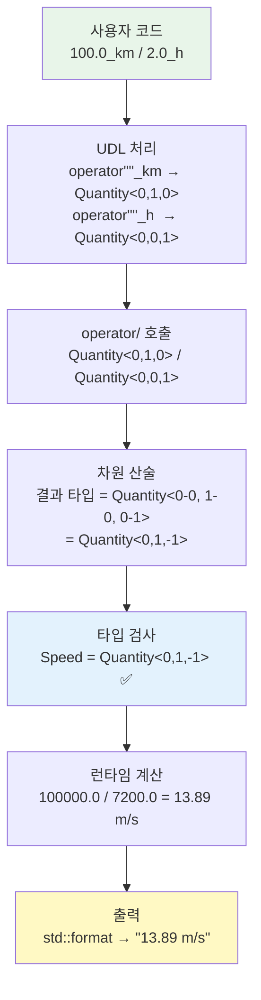
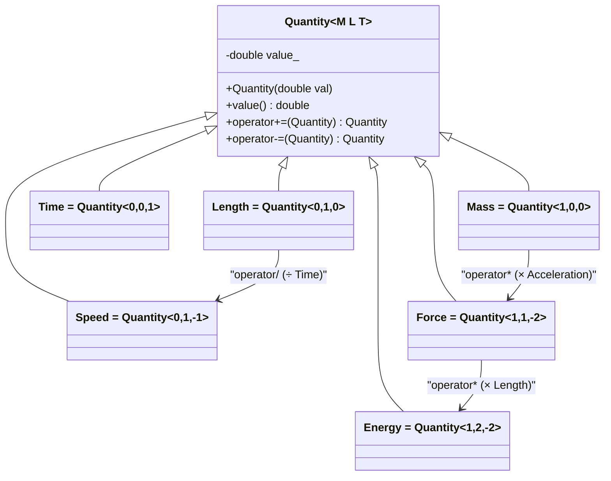
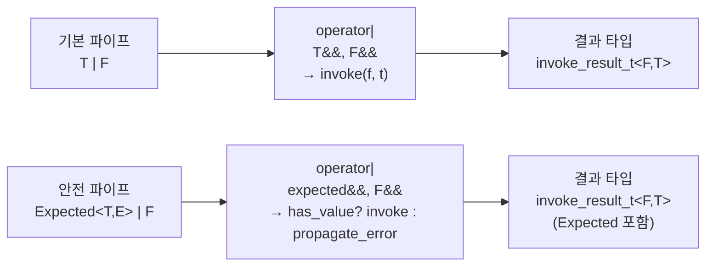
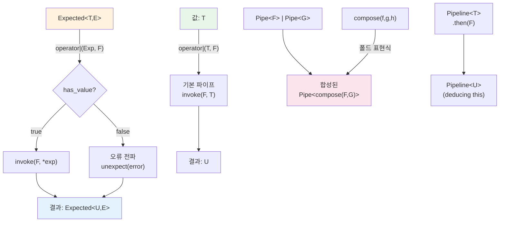
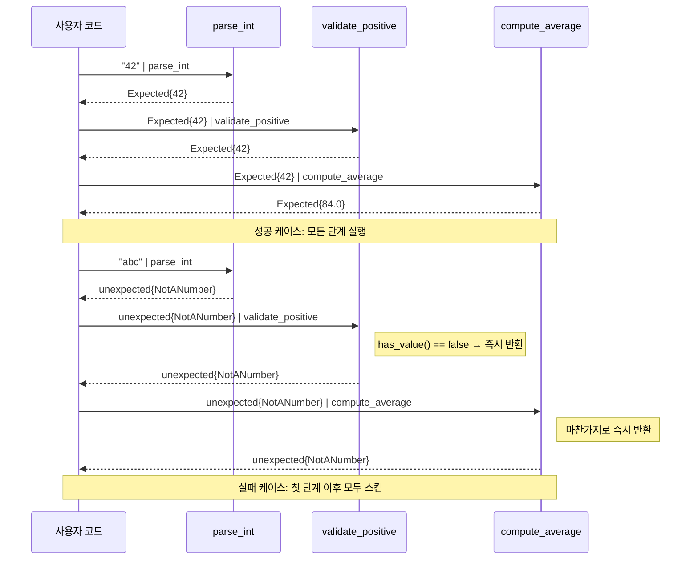
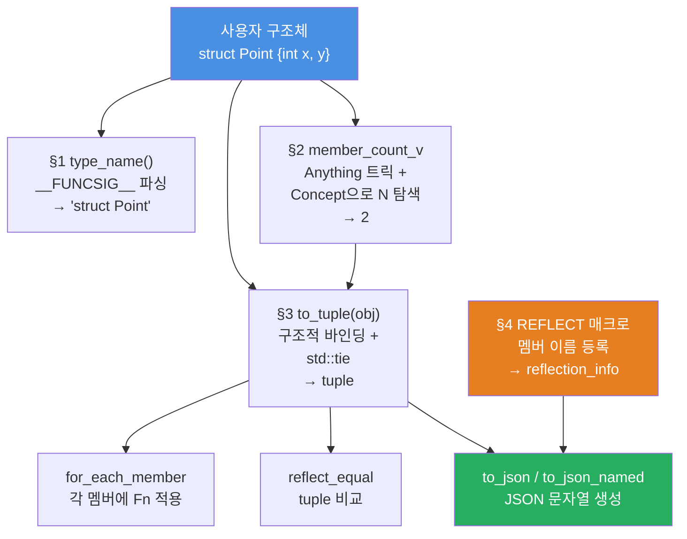
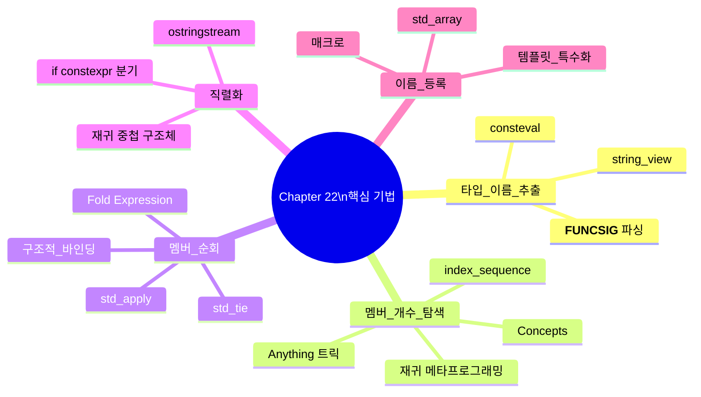

# Modern C++23 템플릿 프로그래밍  

저자: 최흥배, AI-Assisted   
    
권장 개발 환경
- **IDE**: Visual Studio 2026 (Community 이상)
- **컴파일러**: C++ 23
- **OS**: Windows 10 이상

----- 
  
# Chapter 20. 미니 프로젝트 ①: 타입 안전 유닛 시스템

---

## **20.1 프로젝트 개요 — 왜 유닛 시스템이 필요한가**

1999년 9월 23일, NASA의 화성 기후 궤도선(Mars Climate Orbiter)이 화성 대기권에 진입하는 순간 통신이 끊겼습니다. 조사 결과, 한 팀은 추력 데이터를 **파운드-초(lbf·s)** 단위로 계산했고, 다른 팀의 소프트웨어는 그 값을 **뉴턴-초(N·s)** 로 그대로 받아들였습니다. 단위 불일치 하나로 3억 2천7백만 달러짜리 우주선이 사라진 것입니다.

이 사고의 핵심 원인은 간단합니다. 숫자에 **단위 정보가 붙어 있지 않았기** 때문입니다. C++에서 `double velocity = 30.0;`이라고 쓰면 이게 m/s인지, km/h인지, mph인지 컴파일러는 전혀 알 수 없습니다.

```cpp
// 이런 코드는 컴파일러가 아무런 경고도 주지 않는다!
double speed_ms  = 30.0;     // m/s
double speed_kmh = 108.0;    // km/h

double result = speed_ms + speed_kmh;  // 🔥 물리적으로 무의미하지만 오류 없이 컴파일됨
```

C++ 템플릿을 활용하면 이런 실수를 **컴파일 타임에 원천 차단**할 수 있습니다. 이번 챕터에서는 지금까지 배운 템플릿 기술들을 총동원하여 **타입 안전 유닛 시스템(Type-Safe Unit System)** 을 단계적으로 만들어봅니다.

---

**이 프로젝트에서 활용하는 기술들:**

이번 프로젝트는 이 책에서 배운 거의 모든 템플릿 기술의 집합체입니다. 클래스 템플릿으로 물리량을 표현하고, 비타입 템플릿 파라미터(NTTP)로 차원 지수를 인코딩하며, `std::ratio`로 단위 변환 비율을 컴파일 타임에 계산합니다. Concepts로 연산의 타입 안전성을 보장하고, 사용자 정의 리터럴(UDL)로 `100.0_km`처럼 자연스러운 문법을 제공합니다. `if constexpr`과 `constexpr` 함수로 모든 계산이 런타임 오버헤드 없이 컴파일 타임에 처리되도록 합니다.

---

**완성 후 사용 예시 미리보기:**

```cpp
// 완성된 시스템 사용 예
auto d = 100.0_km;           // Length: 100km
auto t = 2.0_h;              // Time:   2시간
auto v = d / t;              // Speed:  자동으로 50km/h 계산

auto mass  = 70.0_kg;
auto accel = 9.8_mps2;
auto force = mass * accel;   // Force: 686 N (자동 차원 계산!)

// 컴파일 타임 오류 예시:
// auto bad = 100.0_km + 2.0_h;  ❌ 길이 + 시간은 불가!
// double x = 100.0_km;          ❌ 암묵적 변환 불가!
```

---

## **20.2 설계 구조 이해하기 — 물리 차원이란 무엇인가**

유닛 시스템을 만들기 전에, 물리학의 기본 개념을 짚고 넘어가야 합니다. 모든 물리량은 **7개의 SI 기본 단위**의 조합으로 표현됩니다.

$$\text{단위} = \text{m}^{L} \cdot \text{kg}^{M} \cdot \text{s}^{T} \cdot \text{A}^{I} \cdot \text{K}^{\Theta} \cdot \text{mol}^{N} \cdot \text{cd}^{J}$$

예를 들어 속도(velocity)는 $$\text{m}^1 \cdot \text{s}^{-1}$$이고, 힘(force)은 $$\text{kg}^1 \cdot \text{m}^1 \cdot \text{s}^{-2}$$ 입니다.

이 프로젝트에서는 학습 목적에 맞게 **질량(M), 길이(L), 시간(T)** 세 가지 차원만 다루겠습니다 (나머지는 동일한 방식으로 확장 가능).

```
┌─────────────────────────────────────────────────────────────────┐
│                  물리 차원 지수 벡터                               │
│                                                                  │
│   Quantity<M, L, T>                                              │
│        │    │    └── 시간(Time) 지수    예) s²  → T=2            │
│        │    └─────── 길이(Length) 지수  예) m⁻¹ → L=-1           │
│        └──────────── 질량(Mass) 지수    예) kg¹ → M=1            │
│                                                                  │
│  물리량 예시:                                                      │
│  ┌──────────────┬───────────────────────────────────────────┐   │
│  │ 물리량        │  차원 지수 (M, L, T)                        │   │
│  ├──────────────┼───────────────────────────────────────────┤   │
│  │ 무차원 수     │  (0,  0,  0)                               │   │
│  │ 길이 (m)     │  (0,  1,  0)                               │   │
│  │ 질량 (kg)    │  (1,  0,  0)                               │   │
│  │ 시간 (s)     │  (0,  0,  1)                               │   │
│  │ 속도 (m/s)   │  (0,  1, -1)                               │   │
│  │ 가속도(m/s²) │  (0,  1, -2)                               │   │
│  │ 힘 (N=kg·m/s²)│  (1,  1, -2)                              │   │
│  │ 압력(Pa=N/m²) │  (1, -1, -2)                              │   │
│  └──────────────┴───────────────────────────────────────────┘   │
└─────────────────────────────────────────────────────────────────┘
```

핵심 아이디어는 바로 **곱셈 시 지수를 더하고, 나눗셈 시 지수를 빼는** 것입니다.

$$\text{속도} \times \text{시간} = \text{m}^1 \cdot \text{s}^{-1} \times \text{s}^1 = \text{m}^1 = \text{길이}$$

이 덧셈/뺄셈 연산을 NTTP(비타입 템플릿 파라미터)의 컴파일 타임 산술로 구현하면 됩니다.

---

## **20.3 Step 1 — 기본 Quantity 클래스 설계**

### **20.3.1 핵심 클래스 템플릿**

먼저 차원 지수를 NTTP로 인코딩한 핵심 클래스를 만듭니다. Visual Studio 2026(C++23)에서 새 프로젝트를 생성하고 `units.hpp` 헤더 파일을 만드세요.

```cpp
// units.hpp
#pragma once
#include <ratio>
#include <cmath>
#include <format>
#include <concepts>

// ─────────────────────────────────────────────────────────────
// 핵심 Quantity 클래스 — 차원을 NTTP로 인코딩
// M=질량, L=길이, T=시간 (정수 지수)
// ─────────────────────────────────────────────────────────────
template<int M, int L, int T>
class Quantity {
public:
    // 생성자: explicit으로 암묵적 변환 방지
    constexpr explicit Quantity(double val = 0.0) noexcept : value_(val) {}

    // 내부 값 접근 (단위 변환 시만 사용)
    [[nodiscard]] constexpr double value() const noexcept { return value_; }

private:
    double value_;
};
```

`explicit` 키워드가 핵심입니다. 이것이 없으면 `Quantity<0,1,0> len = 5.0;`처럼 실수로 단위 없는 숫자를 물리량에 대입할 수 있게 됩니다.

### **20.3.2 덧셈과 뺄셈 연산자 — 같은 차원끼리만**

덧셈과 뺄셈은 **동일한 차원**의 물리량끼리만 가능합니다. 이는 함수 시그니처 자체로 표현됩니다.

```cpp
// ─── 덧셈: 같은 차원 <M,L,T>끼리만 가능 ───────────────────────
template<int M, int L, int T>
constexpr Quantity<M, L, T>
operator+(Quantity<M, L, T> lhs, Quantity<M, L, T> rhs) noexcept {
    return Quantity<M, L, T>{ lhs.value() + rhs.value() };
}

// ─── 뺄셈: 같은 차원끼리만 가능 ────────────────────────────────
template<int M, int L, int T>
constexpr Quantity<M, L, T>
operator-(Quantity<M, L, T> lhs, Quantity<M, L, T> rhs) noexcept {
    return Quantity<M, L, T>{ lhs.value() - rhs.value() };
}
```

위의 코드에서 M, L, T가 다른 두 타입이 들어오면 컴파일러가 매칭할 함수를 찾지 못하고 즉시 오류를 발생시킵니다. 별도의 `static_assert`나 concept 없이도 타입 시스템이 자동으로 보호해줍니다.

### **20.3.3 곱셈과 나눗셈 연산자 — 차원 계산의 핵심**

곱셈과 나눗셈은 결과 차원이 달라집니다. 이 부분이 템플릿 마법의 핵심입니다.

```cpp
// ─── 곱셈: 차원 지수를 더한다 ───────────────────────────────────
template<int M1, int L1, int T1,
         int M2, int L2, int T2>
constexpr Quantity<M1+M2, L1+L2, T1+T2>
operator*(Quantity<M1, L1, T1> lhs, Quantity<M2, L2, T2> rhs) noexcept {
    return Quantity<M1+M2, L1+L2, T1+T2>{ lhs.value() * rhs.value() };
}

// ─── 나눗셈: 차원 지수를 뺀다 ───────────────────────────────────
template<int M1, int L1, int T1,
         int M2, int L2, int T2>
constexpr Quantity<M1-M2, L1-L2, T1-T2>
operator/(Quantity<M1, L1, T1> lhs, Quantity<M2, L2, T2> rhs) noexcept {
    return Quantity<M1-M2, L1-L2, T1-T2>{ lhs.value() / rhs.value() };
}

// ─── 스칼라 곱셈/나눗셈 ──────────────────────────────────────────
template<int M, int L, int T>
constexpr Quantity<M, L, T>
operator*(double scalar, Quantity<M, L, T> q) noexcept {
    return Quantity<M, L, T>{ scalar * q.value() };
}

template<int M, int L, int T>
constexpr Quantity<M, L, T>
operator*(Quantity<M, L, T> q, double scalar) noexcept {
    return Quantity<M, L, T>{ q.value() * scalar };
}

template<int M, int L, int T>
constexpr Quantity<M, L, T>
operator/(Quantity<M, L, T> q, double scalar) noexcept {
    return Quantity<M, L, T>{ q.value() / scalar };
}
```

다음은 차원 연산이 어떻게 작동하는지 시각적으로 보여줍니다.

```
  곱셈 예시: Force = Mass * Acceleration

  Quantity<1,0,0>  *  Quantity<0,1,-2>  →  Quantity<1,1,-2>
    (질량: kg)           (가속도: m/s²)          (힘: N)
       M=1                  M=0                   M=1+0=1
       L=0                  L=1                   L=0+1=1
       T=0                  T=-2                  T=0+(-2)=-2

  나눗셈 예시: Velocity = Length / Time

  Quantity<0,1,0>  /  Quantity<0,0,1>  →  Quantity<0,1,-1>
    (길이: m)            (시간: s)             (속도: m/s)
       M=0                  M=0                   M=0-0=0
       L=1                  L=0                   L=1-0=1
       T=0                  T=1                   T=0-1=-1
```

### **20.3.4 비교 연산자 — C++20 우주선 연산자**

```cpp
// ─── 비교: 같은 차원끼리만 가능, <=> 하나로 모두 해결 ────────────
template<int M, int L, int T>
constexpr auto
operator<=>(Quantity<M, L, T> lhs, Quantity<M, L, T> rhs) noexcept {
    return lhs.value() <=> rhs.value();
}

template<int M, int L, int T>
constexpr bool
operator==(Quantity<M, L, T> lhs, Quantity<M, L, T> rhs) noexcept {
    return lhs.value() == rhs.value();
}
```

---

## **20.4 Step 2 — 편의 타입 별칭 정의**

자주 쓰는 물리량을 `using`으로 이름 붙여서 사용하기 편하게 만듭니다.

```cpp
// ─────────────────────────────────────────────────────────────
// 기본 물리량 타입 별칭
// ─────────────────────────────────────────────────────────────
using Dimensionless = Quantity<0, 0, 0>;  // 무차원
using Mass          = Quantity<1, 0, 0>;  // kg
using Length        = Quantity<0, 1, 0>;  // m
using Time          = Quantity<0, 0, 1>;  // s
using Area          = Quantity<0, 2, 0>;  // m²
using Volume        = Quantity<0, 3, 0>;  // m³
using Speed         = Quantity<0, 1,-1>;  // m/s
using Acceleration  = Quantity<0, 1,-2>;  // m/s²
using Force         = Quantity<1, 1,-2>;  // N = kg·m/s²
using Pressure      = Quantity<1,-1,-2>;  // Pa = N/m² = kg/(m·s²)
using Energy        = Quantity<1, 2,-2>;  // J = N·m = kg·m²/s²
using Power         = Quantity<1, 2,-3>;  // W = J/s = kg·m²/s³
```

이 별칭들을 차원 벡터로 정리하면 다음과 같습니다.

```
물리량           M    L    T      단위 표현
──────────────────────────────────────────────
Dimensionless    0    0    0      (없음)
Mass             1    0    0      kg
Length           0    1    0      m
Time             0    0    1      s
Area             0    2    0      m²
Volume           0    3    0      m³
Speed            0    1   -1      m/s
Acceleration     0    1   -2      m/s²
Force            1    1   -2      N  = kg·m/s²
Pressure         1   -1   -2      Pa = kg/(m·s²)
Energy           1    2   -2      J  = kg·m²/s²
Power            1    2   -3      W  = kg·m²/s³
```

---

## **20.5 Step 3 — 사용자 정의 리터럴(UDL)로 편의성 추가**

지금 상태에서는 `Length d{ 1000.0 };`처럼 써야 합니다. 사용자 정의 리터럴(User-Defined Literal)을 추가하면 `1000.0_m`처럼 쓸 수 있게 됩니다.

```cpp
// ─────────────────────────────────────────────────────────────
// 사용자 정의 리터럴 — inline namespace로 오염 방지
// ─────────────────────────────────────────────────────────────
namespace units::literals {

// 길이 단위
constexpr Length operator""_m  (long double v) { return Length{static_cast<double>(v)}; }
constexpr Length operator""_km (long double v) { return Length{static_cast<double>(v) * 1000.0}; }
constexpr Length operator""_cm (long double v) { return Length{static_cast<double>(v) * 0.01}; }
constexpr Length operator""_mm (long double v) { return Length{static_cast<double>(v) * 0.001}; }

// 정수 리터럴도 지원 (100_km 처럼)
constexpr Length operator""_m  (unsigned long long v) { return Length{static_cast<double>(v)}; }
constexpr Length operator""_km (unsigned long long v) { return Length{static_cast<double>(v) * 1000.0}; }
constexpr Length operator""_cm (unsigned long long v) { return Length{static_cast<double>(v) * 0.01}; }
constexpr Length operator""_mm (unsigned long long v) { return Length{static_cast<double>(v) * 0.001}; }

// 시간 단위
constexpr Time operator""_s  (long double v) { return Time{static_cast<double>(v)}; }
constexpr Time operator""_ms (long double v) { return Time{static_cast<double>(v) * 0.001}; }
constexpr Time operator""_min(long double v) { return Time{static_cast<double>(v) * 60.0}; }
constexpr Time operator""_h  (long double v) { return Time{static_cast<double>(v) * 3600.0}; }

constexpr Time operator""_s  (unsigned long long v) { return Time{static_cast<double>(v)}; }
constexpr Time operator""_min(unsigned long long v) { return Time{static_cast<double>(v) * 60.0}; }
constexpr Time operator""_h  (unsigned long long v) { return Time{static_cast<double>(v) * 3600.0}; }

// 질량 단위
constexpr Mass operator""_kg (long double v) { return Mass{static_cast<double>(v)}; }
constexpr Mass operator""_g  (long double v) { return Mass{static_cast<double>(v) * 0.001}; }
constexpr Mass operator""_t  (long double v) { return Mass{static_cast<double>(v) * 1000.0}; }

constexpr Mass operator""_kg (unsigned long long v) { return Mass{static_cast<double>(v)}; }
constexpr Mass operator""_g  (unsigned long long v) { return Mass{static_cast<double>(v) * 0.001}; }

// 가속도 단위
constexpr Acceleration operator""_mps2(long double v) { return Acceleration{static_cast<double>(v)}; }
constexpr Acceleration operator""_mps2(unsigned long long v) { return Acceleration{static_cast<double>(v)}; }

// 힘 단위
constexpr Force operator""_N (long double v) { return Force{static_cast<double>(v)}; }
constexpr Force operator""_N (unsigned long long v) { return Force{static_cast<double>(v)}; }

// 에너지 단위
constexpr Energy operator""_J (long double v) { return Energy{static_cast<double>(v)}; }
constexpr Energy operator""_kJ(long double v) { return Energy{static_cast<double>(v) * 1000.0}; }
constexpr Energy operator""_J (unsigned long long v) { return Energy{static_cast<double>(v)}; }

} // namespace units::literals
```

---

## **20.6 Step 4 — 단위 변환 함수**

SI 기본 단위 내부 저장값에서 원하는 단위로 꺼내는 변환 헬퍼 함수입니다.

```cpp
// ─────────────────────────────────────────────────────────────
// 단위 변환 헬퍼 — "기준 단위(SI)로 저장, 원하는 단위로 추출"
// ─────────────────────────────────────────────────────────────
namespace units {

// 길이 변환
[[nodiscard]] constexpr double to_m  (Length l) { return l.value(); }
[[nodiscard]] constexpr double to_km (Length l) { return l.value() / 1000.0; }
[[nodiscard]] constexpr double to_cm (Length l) { return l.value() * 100.0; }
[[nodiscard]] constexpr double to_mm (Length l) { return l.value() * 1000.0; }

// 시간 변환
[[nodiscard]] constexpr double to_s  (Time t) { return t.value(); }
[[nodiscard]] constexpr double to_min(Time t) { return t.value() / 60.0; }
[[nodiscard]] constexpr double to_h  (Time t) { return t.value() / 3600.0; }

// 질량 변환
[[nodiscard]] constexpr double to_kg (Mass m) { return m.value(); }
[[nodiscard]] constexpr double to_g  (Mass m) { return m.value() * 1000.0; }

// 속도 변환
[[nodiscard]] constexpr double to_mps (Speed s) { return s.value(); }
[[nodiscard]] constexpr double to_kmph(Speed s) { return s.value() * 3.6; }

// 범용 변환: 단위를 나눠서 무차원 값을 얻는 방식
// ex) convert(100.0_km, 1.0_m)  → 100000.0
template<int M, int L, int T>
[[nodiscard]] constexpr double
convert(Quantity<M,L,T> q, Quantity<M,L,T> unit) {
    return q.value() / unit.value();
}

} // namespace units
```

---

## **20.7 Step 5 — Concepts로 물리량 제약하기**

C++20 Concepts를 활용해 "어떤 타입이 물리량인지" 검사하는 컨셉을 정의합니다. 이를 통해 더 명확한 오류 메시지와 정밀한 함수 제약을 구현할 수 있습니다.

```cpp
// ─────────────────────────────────────────────────────────────
// Concepts — 물리량 타입 판별
// ─────────────────────────────────────────────────────────────

// QuantityType: Quantity<M,L,T> 형태인지 검사하는 컨셉
// 헬퍼 변수 템플릿으로 특수화를 통해 구현
template<typename T>
inline constexpr bool is_quantity_v = false;

template<int M, int L, int T>
inline constexpr bool is_quantity_v<Quantity<M,L,T>> = true;

template<typename T>
concept QuantityType = is_quantity_v<T>;

// SameQuantity: 두 타입이 동일한 차원인지 검사
template<typename A, typename B>
concept SameDimension = QuantityType<A> && QuantityType<B> &&
                        std::same_as<A, B>;
```

이 컨셉을 활용해 함수를 더 명시적으로 만들 수 있습니다.

```cpp
// Concept을 활용한 제약된 함수 예시
template<QuantityType Q>
[[nodiscard]] constexpr Q abs_quantity(Q q) noexcept {
    return Q{ q.value() < 0 ? -q.value() : q.value() };
}

// Concept 없이 일반 double에 abs_quantity를 쓰려 하면 컴파일 오류!
```

---

## **20.8 Step 6 — `std::format` 지원으로 출력 편의성 추가**

C++23의 `std::format`을 지원하기 위해 각 타입에 포매터를 특수화합니다.

```cpp
// ─────────────────────────────────────────────────────────────
// std::format 지원 — 단위 이름을 컴파일 타임에 결정
// ─────────────────────────────────────────────────────────────
#include <format>
#include <string_view>

// 차원에서 단위 이름을 얻는 헬퍼
template<int M, int L, int T>
consteval std::string_view unit_symbol() {
    // 자주 쓰는 조합만 특수 처리 (실전에서는 더 체계적으로)
    if constexpr (M==0 && L==1 && T==0)  return "m";
    if constexpr (M==0 && L==0 && T==1)  return "s";
    if constexpr (M==1 && L==0 && T==0)  return "kg";
    if constexpr (M==0 && L==1 && T==-1) return "m/s";
    if constexpr (M==0 && L==1 && T==-2) return "m/s²";
    if constexpr (M==1 && L==1 && T==-2) return "N";
    if constexpr (M==1 && L==2 && T==-2) return "J";
    if constexpr (M==1 && L==2 && T==-3) return "W";
    if constexpr (M==1 && L==-1 && T==-2)return "Pa";
    else return "?";
}

// formatter 특수화
template<int M, int L, int T>
struct std::formatter<Quantity<M,L,T>> {
    constexpr auto parse(std::format_parse_context& ctx) {
        return ctx.begin();
    }
    auto format(const Quantity<M,L,T>& q, std::format_context& ctx) const {
        return std::format_to(ctx.out(), "{} {}",
                              q.value(), unit_symbol<M,L,T>());
    }
};
```

---

## **20.9 Step 7 — 전체 코드 통합**

지금까지의 모든 조각을 `units.hpp`로 합칩니다.

```cpp
// units.hpp — 완전한 타입 안전 유닛 시스템
#pragma once
#include <ratio>
#include <cmath>
#include <format>
#include <concepts>
#include <compare>
#include <string_view>

// ── [1] 핵심 Quantity 클래스 ────────────────────────────────────
template<int M, int L, int T>
class Quantity {
public:
    constexpr explicit Quantity(double val = 0.0) noexcept : value_(val) {}
    [[nodiscard]] constexpr double value() const noexcept { return value_; }

    // 복합 대입 연산자
    constexpr Quantity& operator+=(Quantity rhs) noexcept {
        value_ += rhs.value_; return *this;
    }
    constexpr Quantity& operator-=(Quantity rhs) noexcept {
        value_ -= rhs.value_; return *this;
    }
    constexpr Quantity  operator-() const noexcept {
        return Quantity{-value_};
    }

private:
    double value_;
};

// ── [2] 산술 연산자 ──────────────────────────────────────────────
template<int M, int L, int T>
constexpr Quantity<M,L,T> operator+(Quantity<M,L,T> a, Quantity<M,L,T> b) noexcept
{ return Quantity<M,L,T>{ a.value() + b.value() }; }

template<int M, int L, int T>
constexpr Quantity<M,L,T> operator-(Quantity<M,L,T> a, Quantity<M,L,T> b) noexcept
{ return Quantity<M,L,T>{ a.value() - b.value() }; }

template<int M1,int L1,int T1, int M2,int L2,int T2>
constexpr Quantity<M1+M2, L1+L2, T1+T2>
operator*(Quantity<M1,L1,T1> a, Quantity<M2,L2,T2> b) noexcept
{ return Quantity<M1+M2,L1+L2,T1+T2>{ a.value() * b.value() }; }

template<int M1,int L1,int T1, int M2,int L2,int T2>
constexpr Quantity<M1-M2, L1-L2, T1-T2>
operator/(Quantity<M1,L1,T1> a, Quantity<M2,L2,T2> b) noexcept
{ return Quantity<M1-M2,L1-L2,T1-T2>{ a.value() / b.value() }; }

template<int M, int L, int T>
constexpr Quantity<M,L,T> operator*(double s, Quantity<M,L,T> q) noexcept
{ return Quantity<M,L,T>{ s * q.value() }; }

template<int M, int L, int T>
constexpr Quantity<M,L,T> operator*(Quantity<M,L,T> q, double s) noexcept
{ return Quantity<M,L,T>{ q.value() * s }; }

template<int M, int L, int T>
constexpr Quantity<M,L,T> operator/(Quantity<M,L,T> q, double s) noexcept
{ return Quantity<M,L,T>{ q.value() / s }; }

// ── [3] 비교 연산자 ──────────────────────────────────────────────
template<int M, int L, int T>
constexpr auto operator<=>(Quantity<M,L,T> a, Quantity<M,L,T> b) noexcept
{ return a.value() <=> b.value(); }

template<int M, int L, int T>
constexpr bool operator==(Quantity<M,L,T> a, Quantity<M,L,T> b) noexcept
{ return a.value() == b.value(); }

// ── [4] 타입 별칭 ────────────────────────────────────────────────
using Dimensionless = Quantity<0, 0, 0>;
using Mass          = Quantity<1, 0, 0>;
using Length        = Quantity<0, 1, 0>;
using Time          = Quantity<0, 0, 1>;
using Area          = Quantity<0, 2, 0>;
using Volume        = Quantity<0, 3, 0>;
using Speed         = Quantity<0, 1,-1>;
using Acceleration  = Quantity<0, 1,-2>;
using Force         = Quantity<1, 1,-2>;
using Pressure      = Quantity<1,-1,-2>;
using Energy        = Quantity<1, 2,-2>;
using Power         = Quantity<1, 2,-3>;

// ── [5] Concepts ─────────────────────────────────────────────────
template<typename T> inline constexpr bool is_quantity_v = false;
template<int M, int L, int T>
inline constexpr bool is_quantity_v<Quantity<M,L,T>> = true;

template<typename T>
concept QuantityType = is_quantity_v<T>;

// ── [6] 단위 변환 ────────────────────────────────────────────────
namespace units {
    constexpr double to_m  (Length l)  { return l.value(); }
    constexpr double to_km (Length l)  { return l.value() / 1000.0; }
    constexpr double to_cm (Length l)  { return l.value() * 100.0; }
    constexpr double to_s  (Time t)    { return t.value(); }
    constexpr double to_min(Time t)    { return t.value() / 60.0; }
    constexpr double to_h  (Time t)    { return t.value() / 3600.0; }
    constexpr double to_kg (Mass m)    { return m.value(); }
    constexpr double to_mps(Speed s)   { return s.value(); }
    constexpr double to_kmph(Speed s)  { return s.value() * 3.6; }

    template<int M, int L, int T>
    constexpr double convert(Quantity<M,L,T> q, Quantity<M,L,T> unit)
    { return q.value() / unit.value(); }
}

// ── [7] 사용자 정의 리터럴 ───────────────────────────────────────
namespace units::literals {
    // 길이
    constexpr Length operator""_m  (long double v) { return Length{(double)v}; }
    constexpr Length operator""_km (long double v) { return Length{(double)v * 1e3}; }
    constexpr Length operator""_cm (long double v) { return Length{(double)v * 1e-2}; }
    constexpr Length operator""_mm (long double v) { return Length{(double)v * 1e-3}; }
    constexpr Length operator""_m  (unsigned long long v) { return Length{(double)v}; }
    constexpr Length operator""_km (unsigned long long v) { return Length{(double)v * 1e3}; }
    constexpr Length operator""_cm (unsigned long long v) { return Length{(double)v * 1e-2}; }
    // 시간
    constexpr Time operator""_s  (long double v) { return Time{(double)v}; }
    constexpr Time operator""_ms (long double v) { return Time{(double)v * 1e-3}; }
    constexpr Time operator""_min(long double v) { return Time{(double)v * 60.0}; }
    constexpr Time operator""_h  (long double v) { return Time{(double)v * 3600.0}; }
    constexpr Time operator""_s  (unsigned long long v) { return Time{(double)v}; }
    constexpr Time operator""_min(unsigned long long v) { return Time{(double)v * 60.0}; }
    constexpr Time operator""_h  (unsigned long long v) { return Time{(double)v * 3600.0}; }
    // 질량
    constexpr Mass operator""_kg(long double v) { return Mass{(double)v}; }
    constexpr Mass operator""_g (long double v) { return Mass{(double)v * 1e-3}; }
    constexpr Mass operator""_t (long double v) { return Mass{(double)v * 1e3}; }
    constexpr Mass operator""_kg(unsigned long long v) { return Mass{(double)v}; }
    constexpr Mass operator""_g (unsigned long long v) { return Mass{(double)v * 1e-3}; }
    // 가속도
    constexpr Acceleration operator""_mps2(long double v) { return Acceleration{(double)v}; }
    constexpr Acceleration operator""_mps2(unsigned long long v) { return Acceleration{(double)v}; }
    // 힘
    constexpr Force operator""_N (long double v) { return Force{(double)v}; }
    constexpr Force operator""_kN(long double v) { return Force{(double)v * 1e3}; }
    constexpr Force operator""_N (unsigned long long v) { return Force{(double)v}; }
    // 에너지
    constexpr Energy operator""_J (long double v) { return Energy{(double)v}; }
    constexpr Energy operator""_kJ(long double v) { return Energy{(double)v * 1e3}; }
    constexpr Energy operator""_J (unsigned long long v) { return Energy{(double)v}; }
}

// ── [8] std::format 지원 ─────────────────────────────────────────
template<int M, int L, int T>
consteval std::string_view unit_symbol() {
    if constexpr (M==0 && L==1 && T== 0) return "m";
    else if constexpr (M==0 && L==0 && T== 1) return "s";
    else if constexpr (M==1 && L==0 && T== 0) return "kg";
    else if constexpr (M==0 && L==1 && T==-1) return "m/s";
    else if constexpr (M==0 && L==1 && T==-2) return "m/s²";
    else if constexpr (M==1 && L==1 && T==-2) return "N";
    else if constexpr (M==1 && L==2 && T==-2) return "J";
    else if constexpr (M==1 && L==2 && T==-3) return "W";
    else if constexpr (M==1 && L==-1&& T==-2) return "Pa";
    else return "[?]";
}

template<int M, int L, int T>
struct std::formatter<Quantity<M,L,T>> {
    constexpr auto parse(std::format_parse_context& ctx) { return ctx.begin(); }
    auto format(const Quantity<M,L,T>& q, std::format_context& ctx) const {
        return std::format_to(ctx.out(), "{:.4g} {}",
                              q.value(), unit_symbol<M,L,T>());
    }
};
```

---

## **20.10 Step 8 — 실전 테스트**

이제 완성된 시스템을 실제로 사용해봅니다. `main.cpp`를 만들어 다양한 물리 시나리오를 테스트합니다.

```cpp
// main.cpp
#include <print>
#include <format>
#include "units.hpp"

using namespace units::literals;  // UDL 활성화

int main() {
    // ── 시나리오 1: 기본 연산 ─────────────────────────────────────
    std::println("=== 기본 물리량 연산 ===");

    Length  d1 = 500.0_m;
    Length  d2 = 1.2_km;
    Length  d_total = d1 + d2;  // OK: 같은 차원

    std::println("거리 합: {}", d_total);            // 1700 m
    std::println("km 변환: {:.2f} km", units::to_km(d_total));

    // ── 시나리오 2: 속도 계산 ─────────────────────────────────────
    std::println("\n=== 속도 계산 ===");

    Length distance = 100.0_km;
    Time   duration = 1.5_h;
    Speed  speed    = distance / duration;  // Quantity<0,1,-1> 자동 생성

    std::println("거리: {}", distance);
    std::println("시간: {}", duration);
    std::println("속도: {}", speed);
    std::println("속도(km/h): {:.1f} km/h", units::to_kmph(speed));

    // ── 시나리오 3: 뉴턴 제2법칙 ─────────────────────────────────
    std::println("\n=== 뉴턴 제2법칙 (F = ma) ===");

    Mass        m = 70.0_kg;
    Acceleration a = 9.81_mps2;
    Force       f = m * a;       // Quantity<1,1,-2>

    std::println("질량: {}", m);
    std::println("가속도: {}", a);
    std::println("힘 (중력): {}", f);

    // ── 시나리오 4: 운동 에너지 ───────────────────────────────────
    std::println("\n=== 운동 에너지 (Ek = ½mv²) ===");

    Mass  car_mass  = 1500.0_kg;
    Speed car_speed = 120.0_km / 1.0_h;  // 120 km/h → 자동으로 m/s 로 저장
    Energy ek = 0.5 * car_mass * car_speed * car_speed;

    std::println("차 질량: {}", car_mass);
    std::println("차 속도: {:.2f} km/h", units::to_kmph(car_speed));
    std::println("운동 에너지: {}", ek);
    std::println("운동 에너지: {:.2f} kJ", ek.value() / 1000.0);

    // ── 시나리오 5: 컴파일 타임 상수 ─────────────────────────────
    std::println("\n=== constexpr 계산 ===");

    constexpr Length light_sec = 299'792'458.0_m;      // 빛의 속도 × 1초
    constexpr Time   one_sec   = 1.0_s;
    constexpr Speed  c         = light_sec / one_sec;  // 컴파일 타임 계산!

    std::println("빛의 속도: {:.3e} m/s", units::to_mps(c));

    // ── 시나리오 6: 비교 연산 ─────────────────────────────────────
    std::println("\n=== 비교 연산 ===");

    Length a_len = 1.0_km;
    Length b_len = 1500.0_m;

    std::println("1 km < 1500 m ? {}", (a_len < b_len) ? "예" : "아니오");
    std::println("1 km > 500 m  ? {}", (a_len > 500.0_m) ? "예" : "아니오");

    return 0;
}
```

**예상 출력:**
```
=== 기본 물리량 연산 ===
거리 합: 1700 m
km 변환: 1.70 km

=== 속도 계산 ===
거리: 1e+05 m
시간: 5400 s
속도: 18.52 m/s
속도(km/h): 66.7 km/h

=== 뉴턴 제2법칙 (F = ma) ===
질량: 70 kg
가속도: 9.81 m/s²
힘 (중력): 686.7 N

=== 운동 에너지 (Ek = ½mv²) ===
차 질량: 1500 kg
차 속도: 120.00 km/h
운동 에너지: 8.333e+05 J
운동 에너지: 833.33 kJ

=== constexpr 계산 ===
빛의 속도: 2.998e+08 m/s

=== 비교 연산 ===
1 km < 1500 m ? 예
1 km > 500 m  ? 예
```

---

## **20.11 Step 9 — 타입 안전성 검증**

이 시스템의 진가는 **잘못된 코드를 컴파일 단계에서 차단**하는 것입니다.

```cpp
// ❌ 다음 코드들은 모두 컴파일 오류를 발생시킨다
void type_safety_demo() {
    using namespace units::literals;

    // [오류 1] 다른 차원끼리 덧셈
    auto bad1 = 100.0_m + 2.0_s;
    //          ~~~~~~~~~~~~~~~~~~~~~~~~~~~~
    //          error: no matching overloaded function found
    //          (Quantity<0,1,0> + Quantity<0,0,1> 에 맞는 operator+ 없음)

    // [오류 2] 암묵적 double 변환
    double bad2 = 100.0_m;
    //            ~~~~~~~~~
    //            error: 'Quantity<0,1,0>' 에서 'double' 로
    //            변환하는 생성자 없음

    // [오류 3] 잘못된 타입에 대입
    Length bad3 = 70.0_kg;
    //            ~~~~~~~~
    //            error: 'Quantity<1,0,0>' 을
    //            'Quantity<0,1,0>' 에 초기화할 수 없음

    // [오류 4] 차원이 다른 비교
    bool bad4 = (100.0_m < 5.0_s);
    //           ~~~~~~~~~~~~~~~~~~
    //           error: 매칭되는 operator<=> 없음

    // ✅ 이것만 컴파일됨
    Length ok = 500.0_m + 200.0_m;  // 같은 차원: OK
    Speed  v  = 100.0_m / 5.0_s;    // 길이/시간 = 속도: OK
}
```

Visual Studio 2026에서 이 오류들이 발생할 때의 오류 메시지 패턴은 다음과 같습니다.

```
오류 예시 (다른 차원 덧셈):
──────────────────────────────────────────────────────────────
error C2676: binary '+': 'Quantity<0,1,0>' does not define
this operator or a conversion to a type acceptable to the
predefined operator

후보: operator+(Quantity<M,L,T>, Quantity<M,L,T>)
  → 추론 실패: M=0,L=1,T=0 ≠ M=0,L=0,T=1
──────────────────────────────────────────────────────────────
```

---

## **20.12 Step 10 — C++23 기능으로 더 개선하기**

### **20.12.1 `std::print`와 함께 쓰기**

C++23에서 추가된 `std::print`는 `std::format`을 기반으로 하므로, 이미 만든 포매터가 자동으로 동작합니다.

```cpp
#include <print>
#include "units.hpp"
using namespace units::literals;

int main() {
    Force gravity = 70.0_kg * 9.81_mps2;
    std::print("중력: {}\n", gravity);   // "686.7 N"
    std::println("중력: {}", gravity);   // 줄바꿈 자동
}
```

### **20.12.2 `constexpr` 함수에서 컴파일 타임 물리 계산**

```cpp
// 컴파일 타임에 계산되는 물리 공식
constexpr Energy kinetic_energy(Mass m, Speed v) {
    return 0.5 * m * v * v;
}

// 컴파일 타임 검증
static_assert(
    kinetic_energy(Mass{2.0}, Speed{3.0}).value() == 9.0,
    "운동 에너지 공식 검증 실패"
);
```

### **20.12.3 `if consteval`로 런타임/컴파일 타임 분기**

C++23에서 추가된 `if consteval`을 활용해 컴파일 타임과 런타임에 서로 다른 최적화 경로를 제공할 수 있습니다.

```cpp
template<int M, int L, int T>
constexpr Quantity<M/2, L/2, T/2>
sqrt_quantity(Quantity<M, L, T> q) {
    // 차원 지수가 모두 짝수인 경우만 허용 (static_assert로 보장)
    static_assert(M%2==0 && L%2==0 && T%2==0,
        "제곱근의 차원 지수는 모두 짝수여야 합니다");

    if consteval {
        // 컴파일 타임: constexpr sqrt 사용
        // (C++26부터 std::sqrt가 constexpr, 여기선 데모)
        return Quantity<M/2, L/2, T/2>{ q.value() };
    } else {
        return Quantity<M/2, L/2, T/2>{ std::sqrt(q.value()) };
    }
}

// 사용 예: Area → Length
Area room = 25.0_m * 1.0_m;   // 25 m² (Area = Quantity<0,2,0>)
// Length side = sqrt_quantity(room);  // Quantity<0,1,0>: OK!
```

---

## **20.13 전체 설계 흐름 다이어그램**





---

## **20.14 도전 과제 — 스스로 확장해보기**

이 프로젝트를 기반으로 다음 기능들을 직접 구현해보세요. 각각은 이 책에서 배운 특정 템플릿 기술을 연습하기에 좋습니다.

**도전 1 — 전류(A), 온도(K) 차원 추가:** `Quantity<M, L, T, I, Theta>`로 템플릿 파라미터를 확장하고 전압(V = kg·m²/(A·s³)), 저항(Ω = kg·m²/(A²·s³)) 같은 전기 단위를 추가해보세요. 이는 챕터 7(가변 인자 템플릿) 지식을 실전에 적용해보는 훈련입니다.

**도전 2 — `std::ratio` 기반 단위 변환 통합:** 현재 시스템은 SI 기본 단위로만 저장합니다. `Quantity<M,L,T, Ratio>`처럼 네 번째 파라미터로 `std::ratio` 스케일 팩터를 추가해 `Quantity<0,1,0, std::ratio<1000>>`이 "km 단위의 길이"를 표현하도록 만들어보세요. 단위 간 변환이 컴파일 타임에 완전히 처리됩니다.

**도전 3 — 커스텀 Concept으로 제약 강화:** `PhysicalQuantity`, `LengthQuantity`, `TimeQuantity` 같은 세분화된 Concept을 만들어 함수 시그니처를 더 명확하게 표현해보세요. 챕터 6에서 배운 Concept 서브섬션(subsumption)도 활용해보세요.

**도전 4 — 자동 단위 문자열 생성:** `unit_symbol<M,L,T>()` 함수를 개선해 `Quantity<1,2,-3>`에 대해 자동으로 `"kg·m²/s³"` 문자열을 생성하는 `consteval` 함수를 만들어보세요. 챕터 13(컴파일 타임 계산)의 응용입니다.

---

## **20.15 이 챕터에서 배운 것**

이번 챕터에서 구현한 타입 안전 유닛 시스템은 단순한 예제가 아닙니다. 실제 항공우주, 자동차, 로보틱스 소프트웨어에서 사용되는 접근법과 동일한 원리를 담고 있습니다.

우리가 이 프로젝트를 통해 체험한 핵심 교훈을 정리하면 다음과 같습니다. **비타입 템플릿 파라미터(NTTP)** 는 단순히 배열 크기를 지정하는 것이 아니라 물리 차원처럼 **의미론적 정보를 타입 수준에 인코딩**하는 강력한 도구입니다. **연산자 오버로딩과 템플릿의 조합**은 자연스러운 수학적 문법(`f = m * a`)을 유지하면서 컴파일 타임 안전성을 동시에 확보할 수 있게 해줍니다. **사용자 정의 리터럴**은 도메인 언어를 C++ 코드 안에 자연스럽게 녹여내는 강력한 도구이며, `100.0_km`처럼 읽기 쉬운 코드를 만드는 핵심입니다. **`constexpr`의 일관된 적용**은 런타임 오버헤드를 제로로 만들어줍니다. 이 시스템이 생성하는 어셈블리 코드는 `double` 덧셈 하나와 동일합니다. 마지막으로 **`std::format` 특수화**는 커스텀 타입을 표준 생태계에 매끄럽게 통합하는 방법을 보여줍니다.

> 💡 **핵심 통찰:** 좋은 타입 시스템은 "프로그래머가 실수를 할 수 없게 만든다"가 아니라 "실수를 하면 컴파일러가 즉시 알려주는" 구조를 만드는 것입니다. 템플릿은 그 구조를 런타임 비용 없이 구현하는 가장 강력한 도구입니다.
  


# Chapter 21. 미니 프로젝트 ②: 간단한 함수형 파이프라인

---

## **21.1 프로젝트 개요 — 데이터가 강물처럼 흐르는 코드**

Unix/Linux 명령줄에서 다음과 같은 문장을 본 적 있을 것입니다.

```bash
cat log.txt | grep "ERROR" | sort | uniq -c | head -10
```

각 명령이 데이터를 받아 가공한 뒤 다음 명령으로 넘깁니다. 프로그래머는 "무엇을 어떤 순서로" 처리할지만 선언적으로 기술하면 됩니다. 이것이 **파이프라인(pipeline)** 패러다임의 핵심입니다.

C++에서 같은 일을 전통적인 방식으로 하면 이렇게 됩니다.

```cpp
// 전통적인 방식 — 안쪽에서 바깥쪽으로 읽어야 한다
auto result = to_upper(trim(remove_punct(parse(raw_string))));
//                                                ↑ 여기서 시작
//                     ↑ 그 다음            ↑ 그 다음  ↑ 마지막
```

함수가 많아질수록 가독성이 급격히 나빠집니다. 함수형 파이프라인을 적용하면 아래처럼 됩니다.

```cpp
// 파이프라인 방식 — 왼쪽에서 오른쪽으로 자연스럽게 읽힌다
auto result = raw_string | parse | remove_punct | trim | to_upper;
//            ↑ 시작      ↑ 1단계  ↑ 2단계        ↑ 3단계 ↑ 4단계
```

이번 챕터에서는 이 `|` 파이프 연산자를 **C++23 템플릿으로 직접 구현**합니다. 단계별로 기능을 확장하면서, 마지막에는 오류 처리까지 갖춘 실전적인 파이프라인 프레임워크를 완성합니다.

---

**이 프로젝트에서 활용하는 기술들:**

이 프로젝트는 여러 챕터에서 배운 기술들의 종합 응용입니다. `operator|` 오버로딩과 함수 템플릿으로 파이프 문법을 만들고, Concepts(`std::invocable`)로 파이프 연결 가능 여부를 컴파일 타임에 검증합니다. `std::invoke`와 완벽 전달로 람다, 함수 포인터, 함수 객체를 모두 수용하며, `std::expected`로 파이프 중간에 오류가 생겨도 안전하게 전파합니다. `deducing this`로 파이프라인을 빌더 패턴처럼 우아하게 체이닝하고, 가변 인자 템플릿과 폴드 표현식으로 여러 함수를 미리 합성(compose)하는 기능까지 구현합니다.

---

**완성 후 사용 예시 미리보기:**

```cpp
// 최종 완성 코드 — 이것을 목표로 단계별로 구현한다
#include "pipeline.hpp"

int main() {
    using namespace pipeline;

    // ── 기본 파이프라인 ────────────────────────────────────────
    auto result = std::string{"  Hello, World!  "}
        | trim              // 공백 제거
        | to_upper          // 대문자 변환
        | [](auto s) { return "[" + s + "]"; };  // 람다도 OK

    std::println("{}", result);  // [HELLO, WORLD!]

    // ── 오류 처리 파이프라인 ───────────────────────────────────
    auto safe_result = std::string{"42"}
        | parse_int         // Expected<int, Error>를 반환
        | validate_positive // 실패하면 이후 단계 자동 스킵
        | double_it;

    if (safe_result) std::println("결과: {}", *safe_result);
    else             std::println("오류: {}", safe_result.error());

    // ── 함수 합성 후 재사용 ────────────────────────────────────
    auto sanitize = compose(trim, to_upper, add_brackets);
    std::println("{}", std::string{"  world  "} | sanitize);
}
```

---

## **21.2 설계 구조 이해하기**

파이프라인을 구현하기 전에, 전체 설계를 머릿속에 그려봅시다.

```
┌────────────────────────────────────────────────────────────────┐
│                   파이프라인 실행 흐름                            │
│                                                                 │
│   "hello"  ──│parse│──▶  42  ──│validate│──▶  42  ──│double│──▶  84  │
│              단계 1            단계 2 (성공)          단계 3        │
│                                                                 │
│   "hello"  ──│parse│──▶ Err ──│validate│──▶ Err ──│double│──▶ Err  │
│              단계 1   (실패)    단계 2 (스킵)         (스킵)       │
│                                                                 │
│  핵심 아이디어:                                                   │
│  ① 정상 값이면 → 다음 함수 호출                                    │
│  ② 오류 값이면 → 이후 모든 단계 자동 건너뜀                         │
└────────────────────────────────────────────────────────────────┘
```

구현할 파이프 연산자의 종류는 두 가지입니다. 첫 번째는 **기본 파이프** `T | F`로 일반 값에 함수를 적용합니다. 두 번째는 **안전 파이프** `Expected<T,E> | F`로 오류가 있으면 자동으로 건너뜁니다.



---

## **21.3 Step 1 — 기본 파이프 연산자**

### **21.3.1 가장 단순한 버전**

먼저 가장 단순한 형태부터 시작합니다. `pipeline.hpp` 헤더 파일을 새로 만드세요.

```cpp
// pipeline.hpp — Step 1: 기본 파이프
#pragma once
#include <functional>  // std::invoke, std::invocable
#include <type_traits> // std::invoke_result_t

namespace pipeline {

// ─────────────────────────────────────────────────────────────
// 기본 파이프 연산자
// T | F  →  F(T)
// ─────────────────────────────────────────────────────────────
template<typename T, typename F>
    requires std::invocable<F, T>
constexpr auto operator|(T&& value, F&& func)
    -> std::invoke_result_t<F, T>
{
    return std::invoke(std::forward<F>(func),
                       std::forward<T>(value));
}

} // namespace pipeline
```

`std::invocable<F, T>`라는 Concept이 핵심입니다. `F`가 `T` 타입 인자로 호출 가능한지 컴파일 타임에 검사합니다. `std::invoke`는 일반 함수, 람다, 함수 포인터, 멤버 함수 포인터까지 모두 동일하게 호출해줍니다.

### **21.3.2 동작 확인**

```cpp
// step1_test.cpp
#include <print>
#include <string>
#include <cctype>
#include <algorithm>
#include "pipeline.hpp"

// 파이프에 연결할 처리 함수들
auto trim(std::string s) -> std::string {
    auto start = s.find_first_not_of(" \t\n");
    auto end   = s.find_last_not_of(" \t\n");
    return (start == std::string::npos) ? "" : s.substr(start, end - start + 1);
}

auto to_upper(std::string s) -> std::string {
    std::ranges::transform(s, s.begin(), ::toupper);
    return s;
}

auto add_brackets(std::string s) -> std::string {
    return "[" + s + "]";
}

int main() {
    using namespace pipeline;

    // 함수 포인터, 람다 모두 파이프에 연결 가능
    auto result = std::string{"  hello, world!  "}
        | trim
        | to_upper
        | add_brackets
        | [](std::string s) { return s + "!"; };  // 람다도 OK

    std::println("{}", result);  // [HELLO, WORLD!]!
}
```

단 8줄의 템플릿 코드로 파이프라인 문법이 완성됩니다. 그런데 한 가지 생각해볼 문제가 있습니다. 만약 `std::ranges::views`도 같은 `|` 연산자를 사용한다면 충돌이 생기지 않을까요? 이에 대한 처리는 뒤에서 다루겠습니다.

---

## **21.4 Step 2 — 함수 합성(Compose)**

파이프라인의 각 단계를 **미리 묶어서** 하나의 함수로 만들 수 있으면 더 유용합니다. `sanitize = trim | to_upper | add_brackets`처럼 만들어두고 나중에 재사용하는 것입니다.

```
함수 합성의 아이디어:

  compose(f, g, h) → 새로운 함수 C

  C(x) ≡ h(g(f(x)))
       ≡ x | f | g | h

  재사용 예:
  auto sanitize = compose(trim, to_upper, add_brackets);
  "  hello  " | sanitize   →  "[HELLO]"
  "  world  " | sanitize   →  "[WORLD]"
```

### **21.4.1 Pipe 래퍼 클래스 — 함수를 파이프 가능한 객체로**

```cpp
// pipeline.hpp — Step 2 추가: 함수 합성

// ─────────────────────────────────────────────────────────────
// Pipe<F>: 함수 F를 파이프 가능한 객체로 감싸는 래퍼
// ─────────────────────────────────────────────────────────────
template<typename F>
struct Pipe {
    F func;

    constexpr explicit Pipe(F f) : func(std::move(f)) {}

    // Pipe | Pipe → 두 파이프를 합성한 새 Pipe 반환
    template<typename G>
    constexpr auto operator|(Pipe<G> rhs) const {
        // [func, rhs.func]를 캡처해 두 함수를 순서대로 호출하는 람다 생성
        return Pipe{ [f = func, g = rhs.func](auto&& x) {
            return g(f(std::forward<decltype(x)>(x)));
        }};
    }

    // 값에 직접 적용: value | Pipe<F>
    template<typename T>
        requires std::invocable<F, T>
    constexpr auto operator()(T&& value) const {
        return std::invoke(func, std::forward<T>(value));
    }
};

// CTAD 가이드: Pipe{func} 로 타입 추론 가능
template<typename F>
Pipe(F) -> Pipe<F>;
```

### **21.4.2 값과 Pipe를 연결하는 operator|**

이제 기본 파이프 연산자를 `Pipe` 객체도 받을 수 있도록 오버로드합니다.

```cpp
// 값 | Pipe<F> → Pipe<F>.func(값)
template<typename T, typename F>
    requires std::invocable<F, T>
constexpr auto operator|(T&& value, Pipe<F> const& p)
    -> std::invoke_result_t<F, T>
{
    return std::invoke(p.func, std::forward<T>(value));
}
```

### **21.4.3 compose 헬퍼 함수**

가변 인자 템플릿과 폴드 표현식으로 여러 함수를 한 번에 합성합니다.

```cpp
// ─────────────────────────────────────────────────────────────
// compose(f, g, h, ...) → 순서대로 적용하는 합성 함수
// ─────────────────────────────────────────────────────────────
template<typename F, typename... Gs>
constexpr auto compose(F&& f, Gs&&... gs) {
    if constexpr (sizeof...(gs) == 0) {
        // 함수 하나면 그대로 Pipe로 감싸서 반환
        return Pipe{ std::forward<F>(f) };
    } else {
        // 폴드 표현식으로 왼쪽부터 순차 합성
        return (Pipe{ std::forward<F>(f) } | ... | Pipe{ std::forward<Gs>(gs) });
    }
}
```

### **21.4.4 동작 확인**

```cpp
// step2_test.cpp
#include <print>
#include <string>
#include "pipeline.hpp"
// trim, to_upper, add_brackets는 이전과 동일

int main() {
    using namespace pipeline;

    // ── 합성 함수 만들기 ─────────────────────────────────────
    auto sanitize = compose(trim, to_upper, add_brackets);

    // 재사용
    std::println("{}", std::string{"  hello  "} | sanitize); // [HELLO]
    std::println("{}", std::string{"  world  "} | sanitize); // [WORLD]

    // ── Pipe | Pipe 직접 합성도 가능 ─────────────────────────
    auto step1 = Pipe{ trim };
    auto step2 = Pipe{ to_upper };
    auto step3 = Pipe{ add_brackets };

    auto full_pipeline = step1 | step2 | step3;
    std::println("{}", std::string{"  c++ is great  "} | full_pipeline);
    // [C++ IS GREAT]
}
```

---

## **21.5 Step 3 — `std::expected`로 오류 처리 파이프라인**

실전에서는 파이프라인 중간에 실패할 수 있는 단계가 있습니다. 예를 들어 문자열을 정수로 파싱하는 단계는 "abc"가 들어오면 실패합니다. 이런 경우 C++23의 `std::expected`를 활용합니다.

### **21.5.1 오류 처리 파이프의 동작 원리**

```
안전 파이프 동작 흐름:

  Expected<T,E> | F

  ┌─── has_value() == true ────▶ invoke(F, *value) ──▶ Expected<U,E>
  │
  Expected<T,E>
  │
  └─── has_value() == false ───▶ 그대로 통과  ──────▶ Expected<U,E>
                                  (오류 전파)
```

한 번 오류가 발생하면 이후 모든 파이프 단계가 자동으로 건너뜌어집니다. 오류를 일일이 검사하는 코드 없이 깔끔한 파이프라인을 유지할 수 있습니다.

### **21.5.2 `is_expected` 컨셉 정의**

`std::expected`를 판별하는 커스텀 Concept이 필요합니다.

```cpp
// ─────────────────────────────────────────────────────────────
// is_expected: std::expected<T,E> 형태인지 판별하는 컨셉
// ─────────────────────────────────────────────────────────────
template<typename T>
concept IsExpected = requires(T t) {
    typename T::value_type;
    typename T::error_type;
    // explicit operator bool() 지원 여부 확인
    requires std::is_constructible_v<bool, T>;
    // *t 의 타입이 value_type과 일치하는지 확인
    requires std::same_as<
        std::remove_cvref_t<decltype(*t)>,
        typename T::value_type
    >;
    // std::unexpected<E>로 생성 가능한지 확인
    requires std::constructible_from<
        T, std::unexpected<typename T::error_type>
    >;
};
```

### **21.5.3 오류 처리 파이프 연산자**

```cpp
// ─────────────────────────────────────────────────────────────
// 안전 파이프: Expected<T,E> | F
// 값이 있으면 F 호출, 오류면 그대로 전파
// ─────────────────────────────────────────────────────────────
template<typename Exp, typename F>
    requires IsExpected<std::remove_cvref_t<Exp>> &&
             std::invocable<F, typename std::remove_cvref_t<Exp>::value_type>
constexpr auto operator|(Exp&& exp, F&& func)
    -> std::invoke_result_t<F, typename std::remove_cvref_t<Exp>::value_type>
{
    using ResultType = std::invoke_result_t<
        F, typename std::remove_cvref_t<Exp>::value_type>;

    if (exp.has_value()) {
        // 값이 있으면 함수 호출
        return std::invoke(std::forward<F>(func), *std::forward<Exp>(exp));
    } else {
        // 오류가 있으면 같은 오류 타입으로 전파
        return ResultType{ std::unexpect, std::forward<Exp>(exp).error() };
    }
}
```

### **21.5.4 실전 예제 — 문자열 파싱 파이프라인**

```cpp
// step3_test.cpp
#include <print>
#include <string>
#include <expected>
#include <charconv>
#include "pipeline.hpp"

using namespace pipeline;

// ── 오류 타입 정의 ───────────────────────────────────────────
enum class ParseError {
    NotANumber,
    NegativeNumber,
    TooLarge
};

// 오류 코드를 문자열로 변환 (출력 편의)
auto error_to_string(ParseError e) -> std::string {
    switch (e) {
        case ParseError::NotANumber:     return "숫자가 아님";
        case ParseError::NegativeNumber: return "음수는 불가";
        case ParseError::TooLarge:       return "값이 너무 큼";
    }
    return "알 수 없는 오류";
}

// ── 파이프라인 단계 함수들 ────────────────────────────────────
// 단계 1: 문자열 → int (실패 가능)
auto parse_int(std::string s) -> std::expected<int, ParseError> {
    int result{};
    auto [ptr, ec] = std::from_chars(s.data(), s.data() + s.size(), result);
    if (ec != std::errc{} || ptr != s.data() + s.size())
        return std::unexpected{ ParseError::NotANumber };
    return result;
}

// 단계 2: 음수 검증 (실패 가능)
auto validate_positive(int n) -> std::expected<int, ParseError> {
    if (n < 0) return std::unexpected{ ParseError::NegativeNumber };
    return n;
}

// 단계 3: 최대값 검증 (실패 가능)
auto validate_max(int n) -> std::expected<int, ParseError> {
    if (n > 1000) return std::unexpected{ ParseError::TooLarge };
    return n;
}

// 단계 4: 값을 두 배로 (항상 성공)
auto double_it(int n) -> std::expected<int, ParseError> {
    return n * 2;
}

// ── 결과 출력 헬퍼 ────────────────────────────────────────────
auto print_result(std::string_view input,
                  std::expected<int, ParseError> result) {
    if (result)
        std::println("\"{}\" → 결과: {}", input, *result);
    else
        std::println("\"{}\" → 오류: {}", input, error_to_string(result.error()));
}

int main() {
    // ── 성공 케이스 ──────────────────────────────────────────
    auto r1 = std::string{"42"}
        | parse_int
        | validate_positive
        | validate_max
        | double_it;
    print_result("42", r1);  // "42" → 결과: 84

    // ── 첫 단계 실패 — 이후 단계 모두 스킵 ──────────────────
    auto r2 = std::string{"abc"}
        | parse_int           // ← 여기서 실패
        | validate_positive   // ← 스킵
        | validate_max        // ← 스킵
        | double_it;          // ← 스킵
    print_result("abc", r2);  // "abc" → 오류: 숫자가 아님

    // ── 두 번째 단계 실패 ────────────────────────────────────
    auto r3 = std::string{"-5"}
        | parse_int           // ← 성공 (-5)
        | validate_positive   // ← 여기서 실패
        | validate_max
        | double_it;
    print_result("-5", r3);   // "-5" → 오류: 음수는 불가

    // ── 세 번째 단계 실패 ────────────────────────────────────
    auto r4 = std::string{"2000"}
        | parse_int
        | validate_positive
        | validate_max        // ← 여기서 실패
        | double_it;
    print_result("2000", r4); // "2000" → 오류: 값이 너무 큼
}
```

**예상 출력:**
```
"42"   → 결과: 84
"abc"  → 오류: 숫자가 아님
"-5"   → 오류: 음수는 불가
"2000" → 오류: 값이 너무 큼
```

오류가 발생한 이후의 모든 단계가 **자동으로 건너뜌어집니다.** 각 단계 함수 내부에서 `if (!prev_result) return prev_result;`를 반복하는 방어 코드가 전혀 없습니다.

---

## **21.6 Step 4 — `deducing this`로 파이프라인 빌더 패턴**

C++23의 `deducing this`를 활용하면 파이프라인을 **빌더 패턴**으로 구성하는 클래스를 만들 수 있습니다. 메서드 체이닝과 파이프라인을 결합하는 방식입니다.

```cpp
// ─────────────────────────────────────────────────────────────
// Pipeline<T>: 파이프라인을 단계적으로 구성하는 빌더
// deducing this로 체이닝이 항상 올바른 파생 타입을 반환
// ─────────────────────────────────────────────────────────────
template<typename T>
class Pipeline {
public:
    constexpr explicit Pipeline(T value) : value_(std::move(value)) {}

    // .then(f): 다음 처리 단계 추가 — 새 Pipeline<U> 반환
    // deducing this를 사용해 파생 클래스에서도 동작
    template<typename Self, typename F>
        requires std::invocable<F, T>
    constexpr auto then(this Self&&, F&& func)
        -> Pipeline<std::invoke_result_t<F, T>>
    {
        using ResultType = std::invoke_result_t<F, T>;
        return Pipeline<ResultType>{
            std::invoke(std::forward<F>(func),
                        std::forward<Self>(self).value_)
        };
    }

    // .value(): 최종 결과 꺼내기
    [[nodiscard]] constexpr T value() const& { return value_; }
    [[nodiscard]] constexpr T value() &&     { return std::move(value_); }

    // operator*: 값 직접 접근
    [[nodiscard]] constexpr T& operator*()       { return value_; }
    [[nodiscard]] constexpr const T& operator*() const { return value_; }

private:
    T value_;
};

// CTAD 가이드
template<typename T>
Pipeline(T) -> Pipeline<T>;
```

> 💡 **deducing this 포인트:** `then` 함수의 `this Self&&` 파라미터가 핵심입니다. `self`가 좌값이면 `Self = Pipeline<T>&`, 우값이면 `Self = Pipeline<T>&&`로 추론되어 완벽 전달이 자동으로 처리됩니다.

### **21.6.1 빌더 패턴 동작 확인**

```cpp
// step4_test.cpp
#include <print>
#include <string>
#include "pipeline.hpp"

int main() {
    using namespace pipeline;

    // 메서드 체이닝으로 파이프라인 구성
    auto result = Pipeline{ std::string{"  hello, c++23!  "} }
        .then(trim)
        .then(to_upper)
        .then(add_brackets)
        .then([](std::string s) { return s + " ✓"; })
        .value();

    std::println("{}", result);
    // [HELLO, C++23!] ✓

    // 중간 결과도 Pipeline<T> 타입으로 저장 가능
    auto halfway = Pipeline{ std::string{"  intermediate  "} }
        .then(trim)
        .then(to_upper);
    // halfway의 타입은 Pipeline<std::string>

    std::println("중간: {}", *halfway);  // INTERMEDIATE
}
```

---

## **21.7 Step 5 — 전체 코드 통합**

지금까지의 모든 구성 요소를 하나의 `pipeline.hpp`로 통합합니다.

```cpp
// pipeline.hpp — 완전한 함수형 파이프라인 프레임워크
#pragma once
#include <functional>
#include <type_traits>
#include <expected>
#include <concepts>

namespace pipeline {

// ════════════════════════════════════════════════════════════
// [1] is_expected 컨셉
// ════════════════════════════════════════════════════════════
template<typename T>
concept IsExpected = requires(T t) {
    typename T::value_type;
    typename T::error_type;
    requires std::is_constructible_v<bool, T>;
    requires std::same_as<
        std::remove_cvref_t<decltype(*t)>,
        typename T::value_type>;
    requires std::constructible_from<
        T, std::unexpected<typename T::error_type>>;
};

// ════════════════════════════════════════════════════════════
// [2] 기본 파이프 연산자: T | F
//     단, T가 IsExpected이면 [3]이 우선 선택됨
// ════════════════════════════════════════════════════════════
template<typename T, typename F>
    requires (!IsExpected<std::remove_cvref_t<T>>) &&
             std::invocable<F, T>
constexpr auto operator|(T&& value, F&& func)
    -> std::invoke_result_t<F, T>
{
    return std::invoke(std::forward<F>(func), std::forward<T>(value));
}

// ════════════════════════════════════════════════════════════
// [3] 안전 파이프 연산자: Expected<T,E> | F
//     오류가 있으면 함수를 호출하지 않고 오류 전파
// ════════════════════════════════════════════════════════════
template<typename Exp, typename F>
    requires IsExpected<std::remove_cvref_t<Exp>> &&
             std::invocable<F, typename std::remove_cvref_t<Exp>::value_type>
constexpr auto operator|(Exp&& exp, F&& func)
    -> std::invoke_result_t<F, typename std::remove_cvref_t<Exp>::value_type>
{
    using RetType = std::invoke_result_t<
        F, typename std::remove_cvref_t<Exp>::value_type>;

    if (exp.has_value())
        return std::invoke(std::forward<F>(func), *std::forward<Exp>(exp));
    else
        return RetType{ std::unexpect, std::forward<Exp>(exp).error() };
}

// ════════════════════════════════════════════════════════════
// [4] Pipe<F> 래퍼 클래스 — 합성 가능한 파이프 객체
// ════════════════════════════════════════════════════════════
template<typename F>
struct Pipe {
    F func;
    constexpr explicit Pipe(F f) : func(std::move(f)) {}

    // Pipe | Pipe → 합성된 새 Pipe
    template<typename G>
    constexpr auto operator|(Pipe<G> rhs) const {
        return Pipe{[f = func, g = rhs.func](auto&& x) {
            return g(f(std::forward<decltype(x)>(x)));
        }};
    }

    template<typename T>
        requires std::invocable<F, T>
    constexpr auto operator()(T&& value) const {
        return std::invoke(func, std::forward<T>(value));
    }
};

template<typename F>
Pipe(F) -> Pipe<F>;

// 값 | Pipe<F>
template<typename T, typename F>
    requires std::invocable<F, T>
constexpr auto operator|(T&& value, Pipe<F> const& p)
    -> std::invoke_result_t<F, T>
{
    return std::invoke(p.func, std::forward<T>(value));
}

// ════════════════════════════════════════════════════════════
// [5] compose(f, g, h, ...) — 가변 인자 함수 합성
// ════════════════════════════════════════════════════════════
template<typename F, typename... Gs>
constexpr auto compose(F&& f, Gs&&... gs) {
    if constexpr (sizeof...(gs) == 0) {
        return Pipe{ std::forward<F>(f) };
    } else {
        return (Pipe{ std::forward<F>(f) } | ... | Pipe{ std::forward<Gs>(gs) });
    }
}

// ════════════════════════════════════════════════════════════
// [6] Pipeline<T> 빌더 클래스 — .then() 체이닝
// ════════════════════════════════════════════════════════════
template<typename T>
class Pipeline {
public:
    constexpr explicit Pipeline(T value) : value_(std::move(value)) {}

    template<typename Self, typename F>
        requires std::invocable<F, T>
    constexpr auto then(this Self&& self, F&& func)
        -> Pipeline<std::invoke_result_t<F, T>>
    {
        using ResultType = std::invoke_result_t<F, T>;
        return Pipeline<ResultType>{
            std::invoke(std::forward<F>(func),
                        std::forward<Self>(self).value_)
        };
    }

    [[nodiscard]] constexpr T  value() const& { return value_; }
    [[nodiscard]] constexpr T  value() &&     { return std::move(value_); }
    [[nodiscard]] constexpr T& operator*()    { return value_; }
    [[nodiscard]] constexpr const T& operator*() const { return value_; }

private:
    T value_;
};

template<typename T>
Pipeline(T) -> Pipeline<T>;

} // namespace pipeline
```

---

## **21.8 Step 6 — 실전 종합 예제**

완성된 파이프라인 프레임워크를 활용해 실제 데이터 처리 시나리오를 구현합니다.

### **21.8.1 시나리오: CSV 행 파싱 파이프라인**

```cpp
// main.cpp — 실전 종합 예제
#include <print>
#include <string>
#include <vector>
#include <sstream>
#include <expected>
#include <algorithm>
#include <cctype>
#include "pipeline.hpp"

using namespace pipeline;

// ── 오류 타입 ────────────────────────────────────────────────
enum class DataError { EmptyInput, InvalidFormat, OutOfRange };

auto to_string(DataError e) -> std::string_view {
    switch(e) {
        case DataError::EmptyInput:     return "빈 입력";
        case DataError::InvalidFormat:  return "잘못된 형식";
        case DataError::OutOfRange:     return "범위 초과";
    }
    return "알 수 없음";
}

// ── 파이프라인 단계들 ─────────────────────────────────────────

// 일반 변환 함수들 (실패하지 않음)
auto trim(std::string s) -> std::string {
    auto b = s.find_first_not_of(" \t");
    auto e = s.find_last_not_of(" \t");
    return (b == std::string::npos) ? "" : s.substr(b, e - b + 1);
}

auto to_lower(std::string s) -> std::string {
    std::ranges::transform(s, s.begin(), ::tolower);
    return s;
}

// 실패 가능한 변환 함수들 (Expected 반환)
auto validate_not_empty(std::string s)
    -> std::expected<std::string, DataError>
{
    if (s.empty()) return std::unexpected{DataError::EmptyInput};
    return s;
}

auto split_csv(std::string s)
    -> std::expected<std::vector<std::string>, DataError>
{
    std::vector<std::string> result;
    std::istringstream ss(s);
    std::string token;
    while (std::getline(ss, token, ','))
        result.push_back(token);
    if (result.empty()) return std::unexpected{DataError::InvalidFormat};
    return result;
}

auto parse_scores(std::vector<std::string> fields)
    -> std::expected<std::vector<int>, DataError>
{
    std::vector<int> scores;
    for (auto& f : fields) {
        // trim 파이프를 재사용!
        auto trimmed = f | trim;
        int val{};
        auto [ptr, ec] = std::from_chars(
            trimmed.data(), trimmed.data() + trimmed.size(), val);
        if (ec != std::errc{})
            return std::unexpected{DataError::InvalidFormat};
        if (val < 0 || val > 100)
            return std::unexpected{DataError::OutOfRange};
        scores.push_back(val);
    }
    return scores;
}

auto compute_average(std::vector<int> scores)
    -> std::expected<double, DataError>
{
    if (scores.empty()) return std::unexpected{DataError::EmptyInput};
    double sum = 0;
    for (int s : scores) sum += s;
    return sum / scores.size();
}

// ── 메인 함수 ─────────────────────────────────────────────────
int main() {
    // 합성 파이프 미리 생성 (재사용 가능)
    auto preprocess = compose(trim, to_lower);

    // 테스트 데이터
    std::vector<std::string> test_cases = {
        "85, 92, 78, 96, 88",   // 정상 데이터
        "  70, 65, 80  ",        // 공백 포함 — 정상
        "",                      // 빈 입력 — 오류
        "90, abc, 75",           // 숫자가 아닌 값 — 오류
        "85, 110, 70"            // 범위 초과 — 오류
    };

    std::println("=== CSV 점수 파싱 파이프라인 ===\n");

    for (auto& input : test_cases) {
        // ── 파이프라인 실행 ────────────────────────────────
        auto result = input
            | preprocess             // trim + to_lower
            | validate_not_empty     // Expected 구간 시작
            | split_csv              // 쉼표로 분할
            | parse_scores           // 정수 파싱
            | compute_average;       // 평균 계산

        // ── 결과 출력 ──────────────────────────────────────
        if (result)
            std::println("입력: {:20} → 평균: {:.1f}점", input, *result);
        else
            std::println("입력: {:20} → 오류: {}",
                         input, to_string(result.error()));
    }

    std::println("\n=== 빌더 패턴 버전 ===\n");

    // Pipeline 빌더로 동일한 작업
    auto avg = Pipeline{std::string{"75, 88, 92, 60, 95"}}
        .then(trim)
        .then(validate_not_empty)
        .then(split_csv)
        .then(parse_scores)
        .then(compute_average)
        .value();

    if (avg) std::println("점수 평균: {:.1f}점", *avg);
}
```

**예상 출력:**
```
=== CSV 점수 파싱 파이프라인 ===

입력: 85, 92, 78, 96, 88  → 평균: 87.8점
입력:   70, 65, 80        → 평균: 71.7점
입력:                      → 오류: 빈 입력
입력: 90, abc, 75          → 오류: 잘못된 형식
입력: 85, 110, 70          → 오류: 범위 초과

=== 빌더 패턴 버전 ===

점수 평균: 82.0점
```

---

## **21.9 Step 7 — `constexpr` 파이프라인**

처리 함수들이 모두 `constexpr`이라면, 파이프라인 전체를 **컴파일 타임에 실행**할 수 있습니다.

```cpp
// constexpr 파이프라인 — 컴파일 타임 실행
#include "pipeline.hpp"

constexpr int double_it(int n)  { return n * 2; }
constexpr int add_ten(int n)    { return n + 10; }
constexpr int square(int n)     { return n * n; }

int main() {
    using namespace pipeline;

    // 컴파일 타임에 계산 완료 — static_assert로 검증
    constexpr int result = 3 | double_it | add_ten | square;
    //                     3 → 6 → 16 → 256

    static_assert(result == 256, "파이프라인 계산 오류");

    // constexpr 합성 함수도 가능
    constexpr auto transform = compose(double_it, add_ten, square);
    static_assert((5 | transform) == 400, "5→10→20→400");
    //             5 → 10 → 20 → 400

    std::println("컴파일 타임 결과: {}", result);  // 256
    std::println("합성 변환 결과: {}", 5 | transform);  // 400
}
```

이 코드에서 `result`의 값은 컴파일러가 빌드 시간에 완전히 계산합니다. 런타임에 실행되는 코드는 `std::println` 호출뿐입니다.

---

## **21.10 주의사항 — `std::ranges`와의 충돌 방지**

C++20부터 `std::ranges`도 `operator|`를 사용합니다. 우리가 만든 `operator|`와 충돌할 수 있으므로 **네임스페이스 관리**가 중요합니다.

```cpp
// ❌ 충돌 발생 예시
using namespace pipeline;
using namespace std::ranges::views;

auto v = std::vector{1, 2, 3} | filter([](int x) { return x > 1; });
// 어떤 operator|가 선택될지 모호할 수 있다
```

```cpp
// ✅ 안전한 방법 1: 네임스페이스를 명시적으로 사용
namespace pl = pipeline;
auto result = pl::operator|(std::string{"hello"}, trim);

// ✅ 안전한 방법 2: 파이프라인 코드만 별도 블록에서 using
{
    using namespace pipeline;
    auto s = std::string{"  hello  "} | trim | to_upper;
}

// ✅ 안전한 방법 3: Pipe<F> 객체 활용 (operator| 직접 호출 없이)
auto pipeline_obj = compose(trim, to_upper);
auto result2 = pipeline_obj(std::string{"  hello  "});
```

또한 `pipeline::operator|`의 첫 번째 오버로드에 `!IsExpected<T>` 제약을 넣어 `std::ranges` 객체가 우리 파이프에 들어오는 것을 막을 수도 있습니다. 실전 라이브러리를 만든다면, 파이프 가능한 타입을 명시적으로 제약하는 추가 컨셉을 설계하는 것이 좋습니다.

---

## **21.11 전체 설계 다이어그램**





---

## **21.12 도전 과제 — 스스로 확장해보기**

이 파이프라인 프레임워크를 기반으로 다음 기능들을 직접 구현해보세요.

**도전 1 — `tee` 연산자 구현:** 파이프라인의 중간 값을 "복사해서 관찰"하는 `tee` 연산자를 만들어보세요. `value | tee([](auto& v){ log(v); }) | next_step`처럼 파이프라인을 중단하지 않고 중간 값을 기록하는 기능입니다. 챕터 2의 완벽 전달 개념을 활용하세요.

**도전 2 — `parallel` 파이프라인:** 동일한 값에 여러 함수를 동시에 적용해 결과 튜플을 만드는 `fork` 연산자를 구현해보세요. `value | fork(f1, f2, f3) → tuple<R1, R2, R3>`. 챕터 7의 가변 인자 템플릿과 챕터 16의 `std::tuple` 지식을 활용하세요.

**도전 3 — `repeat` 연산자:** 동일한 단계를 N번 반복 적용하는 `repeat<N>(func)` 파이프를 만들어보세요. `value | repeat<3>(double_it)`이 `double_it(double_it(double_it(value)))`와 같이 동작해야 합니다. 챕터 4의 NTTP와 챕터 13의 컴파일 타임 반복을 응용합니다.

**도전 4 — `std::optional` 지원:** 현재 `IsExpected` 컨셉에 더해 `IsOptional` 컨셉을 추가하고, `std::optional<T> | F`도 안전하게 처리하는 오버로드를 만들어보세요. `std::optional`은 오류 정보를 담지 않으므로 처리 방식이 약간 달라집니다.

---

## **21.13 이 챕터에서 배운 것**

이번 프로젝트의 핵심은 **언어 기능과 템플릿을 조합해 새로운 문법을 창조하는 것**입니다. `operator|` 오버로딩이라는 단순한 아이디어에서 시작해, Concepts로 안전성을 더하고, `std::expected`로 오류 처리를 흡수하고, 가변 인자 템플릿으로 합성을 지원하는 완전한 프레임워크가 탄생했습니다.

이 챕터에서 체험한 핵심 교훈들을 정리하면 다음과 같습니다. **`operator` 오버로딩은 단순한 편의 문법이 아닙니다.** `operator|`를 템플릿과 결합하면 새로운 실행 패러다임을 라이브러리 수준에서 정의할 수 있습니다. **Concepts는 오버로드 해결의 핵심 도구입니다.** `IsExpected` 컨셉 덕분에 일반 값용 파이프와 `Expected`용 파이프가 모호함 없이 자동으로 선택됩니다. **`std::expected`의 단항 연산 패턴은 파이프라인과 자연스럽게 결합됩니다.** 오류 전파 코드를 파이프 연산자 내부로 숨겨서, 사용자는 "성공 경로"만 기술하면 됩니다. **`deducing this`는 체이닝 패턴을 간결하게 만듭니다.** `Pipeline<T>::then()`이 항상 올바른 `Pipeline<U>`를 반환하는 코드가 단 몇 줄로 완성됩니다. 마지막으로 **`constexpr` 파이프라인은 런타임 비용이 없습니다.** 모든 처리 함수가 `constexpr`이면, 컴파일러가 파이프라인 전체를 빌드 시간에 완전히 계산하고 결과 상수만 코드에 삽입합니다.

> 💡 **핵심 통찰:** 함수형 파이프라인은 단순히 "코드를 예쁘게 쓰는 방법"이 아닙니다. 각 단계가 독립적이고 테스트 가능하며, 오류 처리가 자동으로 전파되는 **합성 가능한 소프트웨어 아키텍처**입니다. C++ 템플릿은 이런 아키텍처를 제로 런타임 비용으로 구현할 수 있는 유일한 도구 중 하나입니다.


# Chapter 22. 미니 프로젝트 ③: 컴파일 타임 반사(Reflection) 흉내내기

---

## **22.0 들어가며 — 반사(Reflection)란 무엇인가?**

프로그램이 **자기 자신의 구조를 들여다볼 수 있는 능력**을 반사(Reflection)라고 부릅니다. Python이나 Java에서는 런타임에 클래스 이름을 얻고, 멤버 변수를 열거하고, 함수를 동적으로 호출하는 것이 매우 자연스럽습니다. 예를 들어 Python에서 `dir(obj)`를 호출하면 객체가 가진 모든 속성 이름이 나열되지요.

C++는 오랫동안 이 능력이 없었습니다. 컴파일 후에는 타입 이름도, 구조체의 멤버 이름도 모두 지워지는 언어였기 때문입니다. 이것을 **타입 소거(type erasure)** 혹은 더 넓게 **명칭 소거**라 부릅니다.

그런데 좋은 소식이 있습니다. C++26에서는 드디어 공식 정적 반사(Static Reflection, P2996)가 표준에 포함될 예정입니다. `^^T`라는 새로운 문법으로 타입의 메타정보를 컴파일 타임에 얻을 수 있게 됩니다. 하지만 이 책의 기준인 C++23에서는 아직 공식 지원이 없습니다.

**이 챕터의 목표는 바로 여기에 있습니다.** C++23의 템플릿 기법을 총동원하여 공식 Reflection이 없는 환경에서도 아래의 기능을 직접 구현해 봅니다.

- 컴파일 타임에 타입 이름을 문자열로 얻기
- Aggregate 구조체의 멤버 개수를 컴파일 타임에 세기
- 구조체의 모든 멤버에 대해 함수를 호출하기 (컴파일 타임 `for_each`)
- 이를 활용한 자동 직렬화(Serialization) 구현하기

이 과정에서 `constexpr`, `if constexpr`, `std::index_sequence`, Concepts, 구조적 바인딩(Structured Bindings), Fold Expression 등 이 책에서 배운 거의 모든 기법이 함께 등장합니다.

```
┌──────────────────────────────────────────────────┐
│              우리가 만들 것                        │
│                                                  │
│  ① type_name<T>()  → "Point"                     │
│  ② member_count<T> → 2                           │
│  ③ for_each_member(obj, fn) → fn(x), fn(y)       │
│  ④ to_json(obj)    → {"x":1,"y":2}               │
└──────────────────────────────────────────────────┘
```

> 💡 **Visual Studio 2026 참고:** 이 챕터의 모든 예제는 `/std:c++23` 옵션과 최신 MSVC 컴파일러를 기준으로 작성되었습니다. `__FUNCSIG__` 매크로는 MSVC 전용이며, 다른 컴파일러에서는 `__PRETTY_FUNCTION__`을 사용합니다.

---

## **22.1 컴파일 타임 타입 이름 얻기**

Reflection의 첫 번째 능력은 타입의 이름을 문자열로 얻는 것입니다. C++ 표준에는 이를 위한 직접적인 방법이 없지만, 컴파일러가 제공하는 **함수 시그니처 매크로**를 이용하면 구현할 수 있습니다.

### **원리: 함수 시그니처 속에 타입 이름이 숨어있다**

MSVC는 `__FUNCSIG__`라는 매크로를 통해 현재 함수의 **전체 시그니처 문자열**을 컴파일 타임에 제공합니다.

```cpp
template<typename T>
void peek() {
    // MSVC에서 이렇게 출력됩니다:
    // "void __cdecl peek<int>(void)"
    // "void __cdecl peek<struct Point>(void)"
    std::cout << __FUNCSIG__ << '\n';
}
```

이 문자열 안에 타입 이름 `T`가 포함되어 있습니다. 우리는 이 문자열에서 타입 이름 부분만 잘라내면 됩니다. 이것을 `constexpr` 함수로 구현하면 **컴파일 타임에 타입 이름을 추출**할 수 있습니다.

```
  __FUNCSIG__ 문자열 구조 (MSVC)
  ┌────────────────────────────────────────────┐
  │ "void __cdecl type_name_impl<int>(void)"  │
  │               ↑                 ↑          │
  │            prefix              suffix       │
  │               └───── T 이름 ───┘           │
  └────────────────────────────────────────────┘
```

### **구현: `type_name<T>()` 함수**

```cpp
#include <string_view>
#include <array>

// ① 컴파일 타임 타입 이름 추출기
template<typename T>
consteval auto type_name() -> std::string_view {
    // MSVC: __FUNCSIG__
    // GCC/Clang: __PRETTY_FUNCTION__
    std::string_view sig = __FUNCSIG__;

    // MSVC의 __FUNCSIG__ 형식:
    // "auto __cdecl type_name<int>(void)"
    // prefix를 찾아서 타입 이름 시작 위치를 찾는다
    
    // "<" 이후부터 ">" 이전까지가 타입 이름
    auto start = sig.find('<') + 1;
    auto end   = sig.rfind('>');
    
    return sig.substr(start, end - start);
}

// ② 사용 예시
struct Point { int x, y; };

int main() {
    constexpr auto name1 = type_name<int>();         // "int"
    constexpr auto name2 = type_name<double>();      // "double"
    constexpr auto name3 = type_name<Point>();       // "struct Point"
    
    std::cout << name1 << '\n'; // int
    std::cout << name2 << '\n'; // double
    std::cout << name3 << '\n'; // struct Point
}
```

> 💡 `consteval`을 사용했기 때문에 이 함수는 **반드시 컴파일 타임에만** 호출됩니다. 런타임 오버헤드가 전혀 없습니다. 이 `consteval` 함수에 대해서는 9.3절에서 자세히 다루었습니다.

---

## **22.2 "Anything" 트릭 — 집합체(Aggregate) 멤버 세기**

이제 Reflection의 핵심 능력으로 넘어갑니다. 구조체가 **몇 개의 멤버**를 가졌는지 컴파일 타임에 알아내는 것입니다.

### **핵심 개념: Aggregate 초기화**

먼저 **Aggregate(집합체)** 타입을 이해해야 합니다. Aggregate는 다음 조건을 모두 만족하는 타입입니다.

- 사용자 정의 생성자 없음
- 모든 멤버가 `public`
- 가상 함수 없음
- `private`/`protected` 기반 클래스 없음

일반적인 `struct`가 대표적인 예입니다. Aggregate는 다음과 같이 초기화할 수 있습니다.

```cpp
struct Point { int x, y; };
Point p{1, 2};       // Aggregate 초기화: 멤버 2개 → 인자 2개
// Point q{1, 2, 3}; // 컴파일 에러: 멤버보다 인자가 많음
```

이 성질을 이용하면 멤버 개수를 알 수 있습니다. `T{arg1, arg2, ..., argN}`이 유효하면 `T`는 최소 N개의 멤버를 가지고 있고, `T{arg1, ..., argN+1}`이 실패하면 정확히 N개라는 뜻이 됩니다.

### **핵심 도구: 어떤 타입으로도 변환되는 `Anything`**

문제는 각 인자의 타입을 모른다는 점입니다. 이를 해결하는 것이 바로 **`Anything` 트릭**입니다.

```cpp
// 어떤 타입으로도 암묵적으로 변환될 수 있는 마법의 타입
struct Anything {
    // 함수 본체를 정의할 필요 없음 — 타입 시스템에서만 사용
    template<typename T>
    consteval operator T() const noexcept;
};
```

`Anything`은 `template operator T()`를 가지므로 컴파일러가 어떤 타입으로든 변환할 수 있다고 인식합니다. 이제 `T{Anything{}, Anything{}, ...}`라는 표현식이 **유효한지 여부**를 SFINAE 혹은 Concept으로 검사할 수 있습니다.

```
  Anything 트릭 동작 원리

  struct Point { int x; float y; };
  
  T{Anything{}} → 유효 (멤버 1개 초기화 가능)
                    Anything → int (x에 대입)
  
  T{Anything{}, Anything{}} → 유효 (멤버 2개 초기화 가능)
                               Anything → int  (x에)
                               Anything → float (y에)
  
  T{Anything{}, Anything{}, Anything{}} → 컴파일 에러!
                                          멤버가 2개뿐이므로 불가
```

### **구현: 멤버 개수 세기**

```cpp
#include <type_traits>
#include <utility>

struct Anything {
    template<typename T>
    consteval operator T() const noexcept;
};

// N개의 Anything으로 T를 초기화할 수 있는지 검사하는 Concept
template<typename T, std::size_t N>
concept aggregate_initializable_from_n = requires {
    // index_sequence를 이용해 N개의 Anything을 펼침
    []<std::size_t... Is>(std::index_sequence<Is...>) {
        // (void(Is), Anything{}) 패턴으로 N개의 임시값 생성
        return T{ (void(Is), Anything{})... };
    }(std::make_index_sequence<N>{});
};

// 재귀적으로 최대 멤버 개수를 찾는 헬퍼
// Max를 넘지 않는 선에서 T를 초기화할 수 있는 최대 N을 찾음
template<typename T, std::size_t Max = 32, std::size_t N = 0>
struct member_count_impl
    : std::conditional_t<
        aggregate_initializable_from_n<T, N + 1> && (N + 1 <= Max),
        member_count_impl<T, Max, N + 1>,
        std::integral_constant<std::size_t, N>
    > {};

// 편의 변수 템플릿
template<typename T>
constexpr std::size_t member_count_v = member_count_impl<T>::value;

// ---- 테스트 ----
struct Empty {};
struct One   { int x; };
struct Two   { int x; float y; };
struct Three { int x; float y; char z; };

static_assert(member_count_v<Empty> == 0);
static_assert(member_count_v<One>   == 1);
static_assert(member_count_v<Two>   == 2);
static_assert(member_count_v<Three> == 3);
```

> ⚠️ **주의:** 비트 필드가 있거나 기반 클래스가 있는 구조체는 이 기법이 정확하지 않을 수 있습니다. 이 구현은 **단순한 Aggregate 구조체**를 대상으로 합니다.

---

## **22.3 `for_each_member` — 모든 멤버에 함수 적용하기**

멤버 개수를 알았다면, 이제 **구조적 바인딩(Structured Bindings)** 을 이용해 멤버 하나하나에 접근할 수 있습니다.

구조적 바인딩의 핵심 제약은 **바인딩할 멤버 수가 컴파일 타임에 정해져야 한다**는 것입니다.

```cpp
auto [x, y] = Point{1, 2};    // 멤버가 2개임을 컴파일 타임에 알아야 함
```

따라서 멤버 개수 별로 구조적 바인딩 코드를 별도로 작성해야 합니다. 이는 코드가 늘어나는 단점이 있지만, 실용적인 범위(예: 멤버 최대 8개)에서는 충분히 관리 가능합니다.

### **구현: 멤버 개수별 for_each 특수화**

```cpp
#include <functional>

namespace detail {

// 멤버 0개
template<typename T, typename Fn>
void for_each_impl(T&&, Fn&&, std::integral_constant<std::size_t, 0>) {}

// 멤버 1개
template<typename T, typename Fn>
void for_each_impl(T&& agg, Fn&& fn, std::integral_constant<std::size_t, 1>) {
    auto& [m0] = agg;
    fn(m0);
}

// 멤버 2개
template<typename T, typename Fn>
void for_each_impl(T&& agg, Fn&& fn, std::integral_constant<std::size_t, 2>) {
    auto& [m0, m1] = agg;
    fn(m0); fn(m1);
}

// 멤버 3개
template<typename T, typename Fn>
void for_each_impl(T&& agg, Fn&& fn, std::integral_constant<std::size_t, 3>) {
    auto& [m0, m1, m2] = agg;
    fn(m0); fn(m1); fn(m2);
}

// 멤버 4개
template<typename T, typename Fn>
void for_each_impl(T&& agg, Fn&& fn, std::integral_constant<std::size_t, 4>) {
    auto& [m0, m1, m2, m3] = agg;
    fn(m0); fn(m1); fn(m2); fn(m3);
}

// 멤버 5개
template<typename T, typename Fn>
void for_each_impl(T&& agg, Fn&& fn, std::integral_constant<std::size_t, 5>) {
    auto& [m0, m1, m2, m3, m4] = agg;
    fn(m0); fn(m1); fn(m2); fn(m3); fn(m4);
}

// 필요하면 6, 7, 8 ... 개도 추가

} // namespace detail

// 공개 인터페이스
template<typename T, typename Fn>
void for_each_member(T&& agg, Fn&& fn) {
    constexpr auto n = member_count_v<std::remove_cvref_t<T>>;
    detail::for_each_impl(
        std::forward<T>(agg),
        std::forward<Fn>(fn),
        std::integral_constant<std::size_t, n>{}
    );
}
```

### **첫 번째 응용: 구조체 출력**

```cpp
struct Color { uint8_t r, g, b; };

int main() {
    Color c{255, 128, 0};
    
    std::cout << "Color: ";
    for_each_member(c, [](auto& val) {
        std::cout << static_cast<int>(val) << ' ';
    });
    // 출력: Color: 255 128 0
}
```

### **두 번째 응용: 구조체 비교**

두 구조체가 같은지 비교하는 함수를 `for_each_member`로 구현할 수 있습니다.

```cpp
template<typename T>
bool reflect_equal(const T& a, const T& b) {
    bool equal = true;
    // a의 각 멤버와 b의 각 멤버를 동시에 비교하는 방법:
    // 아래처럼 인덱스 기반으로 접근하는 것이 자연스럽습니다.
    // (다음 절의 to_tuple로 더 우아하게 구현합니다)
    return a == b; // 단순화된 예
}
```

더 우아한 비교를 위해서는 구조체를 `std::tuple`로 변환하는 것이 핵심입니다.

---

## **22.4 구조체 ↔ `std::tuple` 변환**

`for_each_member`는 강력하지만, 두 구조체의 **같은 번째 멤버를 동시에** 다루기가 불편합니다. 이를 해결하는 가장 우아한 방법은 구조체를 `std::tuple`로 변환하는 것입니다.

```
  Point{x=1, y=2}  →  std::tuple<int&, int&>{x, y}

  변환 후에는 std::get<0>, std::get<1>으로 접근 가능
  std::apply로 일괄 처리 가능
```

### **구현: `to_tuple` 함수**

```cpp
#include <tuple>

namespace detail {

template<typename T>
auto to_tuple_impl(T&& agg, std::integral_constant<std::size_t, 0>) {
    return std::tie(); // 빈 튜플
}

template<typename T>
auto to_tuple_impl(T&& agg, std::integral_constant<std::size_t, 1>) {
    auto& [m0] = agg;
    return std::tie(m0);
}

template<typename T>
auto to_tuple_impl(T&& agg, std::integral_constant<std::size_t, 2>) {
    auto& [m0, m1] = agg;
    return std::tie(m0, m1);
}

template<typename T>
auto to_tuple_impl(T&& agg, std::integral_constant<std::size_t, 3>) {
    auto& [m0, m1, m2] = agg;
    return std::tie(m0, m1, m2);
}

template<typename T>
auto to_tuple_impl(T&& agg, std::integral_constant<std::size_t, 4>) {
    auto& [m0, m1, m2, m3] = agg;
    return std::tie(m0, m1, m2, m3);
}

} // namespace detail

// 구조체를 참조 튜플로 변환
template<typename T>
auto to_tuple(T& agg) {
    constexpr auto n = member_count_v<std::remove_cvref_t<T>>;
    return detail::to_tuple_impl(agg, std::integral_constant<std::size_t, n>{});
}

// ---- 활용 ----
struct Point { int x, y; };

int main() {
    Point p{10, 20};
    
    // 튜플로 변환
    auto t = to_tuple(p);
    
    // 튜플을 통해 멤버 수정 (참조이므로 p도 변경됨!)
    std::get<0>(t) = 99;
    
    std::cout << p.x; // 99 출력
    
    // std::apply로 일괄 처리
    std::apply([](auto&... args) {
        ((std::cout << args << ' '), ...); // 99 20
    }, t);
}
```

### **`to_tuple`로 구현하는 비교와 해시**

```cpp
// 두 Aggregate를 멤버별로 비교
template<typename T>
bool reflect_equal(const T& a, const T& b) {
    return to_tuple(const_cast<T&>(a)) == to_tuple(const_cast<T&>(b));
}

// Aggregate를 출력하는 스트림 연산자 자동 생성
template<typename T>
void reflect_print(const T& obj) {
    std::cout << type_name<T>() << "{ ";
    std::apply([](const auto&... args) {
        std::size_t i = 0;
        ((std::cout << args << (++i < sizeof...(args) ? ", " : "")), ...);
    }, to_tuple(const_cast<T&>(obj)));
    std::cout << " }";
}

// ---- 테스트 ----
struct Vec3 { float x, y, z; };

int main() {
    Vec3 a{1.0f, 2.0f, 3.0f};
    Vec3 b{1.0f, 2.0f, 3.0f};
    Vec3 c{0.0f, 0.0f, 0.0f};
    
    std::cout << std::boolalpha;
    std::cout << reflect_equal(a, b) << '\n'; // true
    std::cout << reflect_equal(a, c) << '\n'; // false
    
    reflect_print(a);  // Vec3{ 1 2 3 }
}
```

---

## **22.5 미니 프로젝트 완성 — 자동 JSON 직렬화**

지금까지 만든 도구들을 모두 합쳐 **자동 JSON 직렬화기**를 구현합니다. 이것이 이 챕터의 최종 목표입니다. 임의의 Aggregate 구조체를 인자로 넣으면 자동으로 JSON 문자열을 생성하는 `to_json<T>()` 함수를 만들어 봅시다.

```
  목표:
  
  struct Person { std::string name; int age; double score; };
  
  Person p{"Alice", 30, 98.5};
  auto json = to_json(p);
  // {"name":"Alice","age":30,"score":98.5}
```

### **전체 구현 코드**

이제 지금까지의 모든 조각을 하나의 헤더로 통합합니다.

```cpp
// reflect.hpp — C++23 컴파일 타임 Reflection 흉내내기
#pragma once

#include <string>
#include <string_view>
#include <sstream>
#include <tuple>
#include <type_traits>
#include <utility>
#include <concepts>

// ════════════════════════════════════════════
// §1. 타입 이름 추출
// ════════════════════════════════════════════
template<typename T>
consteval std::string_view type_name() {
    std::string_view sig = __FUNCSIG__; // MSVC 전용
    auto start = sig.find('<') + 1;
    auto end   = sig.rfind('>');
    return sig.substr(start, end - start);
}

// ════════════════════════════════════════════
// §2. Aggregate 멤버 개수 추론
// ════════════════════════════════════════════
struct Anything {
    template<typename T>
    consteval operator T() const noexcept;
};

template<typename T, std::size_t N>
concept aggregate_init_n = requires {
    []<std::size_t... Is>(std::index_sequence<Is...>) {
        return T{ (void(Is), Anything{})... };
    }(std::make_index_sequence<N>{});
};

template<typename T, std::size_t Max = 16, std::size_t N = 0>
struct member_count_impl
    : std::conditional_t<
        aggregate_init_n<T, N + 1> && (N + 1 <= Max),
        member_count_impl<T, Max, N + 1>,
        std::integral_constant<std::size_t, N>
    > {};

template<typename T>
constexpr std::size_t member_count_v =
    member_count_impl<std::remove_cvref_t<T>>::value;

// ════════════════════════════════════════════
// §3. 구조체 → tuple 변환
// ════════════════════════════════════════════
namespace detail {
    template<typename T>
    auto to_tuple_impl(T& a, std::integral_constant<std::size_t, 0>)
    { return std::tie(); }
    
    template<typename T>
    auto to_tuple_impl(T& a, std::integral_constant<std::size_t, 1>)
    { auto& [m0] = a; return std::tie(m0); }
    
    template<typename T>
    auto to_tuple_impl(T& a, std::integral_constant<std::size_t, 2>)
    { auto& [m0,m1] = a; return std::tie(m0,m1); }
    
    template<typename T>
    auto to_tuple_impl(T& a, std::integral_constant<std::size_t, 3>)
    { auto& [m0,m1,m2] = a; return std::tie(m0,m1,m2); }
    
    template<typename T>
    auto to_tuple_impl(T& a, std::integral_constant<std::size_t, 4>)
    { auto& [m0,m1,m2,m3] = a; return std::tie(m0,m1,m2,m3); }
    
    template<typename T>
    auto to_tuple_impl(T& a, std::integral_constant<std::size_t, 5>)
    { auto& [m0,m1,m2,m3,m4] = a; return std::tie(m0,m1,m2,m3,m4); }
}

template<typename T>
auto to_tuple(T& a) {
    return detail::to_tuple_impl(
        a, std::integral_constant<std::size_t, member_count_v<T>>{});
}

// ════════════════════════════════════════════
// §4. JSON 값 변환 헬퍼
// ════════════════════════════════════════════
namespace detail {
    // 타입별 JSON 직렬화 — if constexpr로 분기
    template<typename T>
    std::string to_json_value(const T& val) {
        if constexpr (std::is_same_v<T, std::string>) {
            return '"' + val + '"';
        } else if constexpr (std::is_same_v<T, bool>) {
            return val ? "true" : "false";
        } else if constexpr (std::is_arithmetic_v<T>) {
            return std::to_string(val);
        } else if constexpr (std::is_aggregate_v<T>) {
            // 중첩 구조체 — 재귀 호출 (전방 선언 필요)
            extern std::string to_json(const T&);
            return to_json(val);
        } else {
            return "\"<unknown>\"";
        }
    }
}

// ════════════════════════════════════════════
// §5. 최종 to_json 함수
// ════════════════════════════════════════════
template<typename T>
    requires std::is_aggregate_v<T>
std::string to_json(const T& obj) {
    auto t = to_tuple(const_cast<T&>(obj));
    
    std::ostringstream oss;
    oss << '{';
    
    std::size_t index = 0;
    std::apply([&](const auto&... members) {
        constexpr std::size_t count = sizeof...(members);
        
        // Fold expression으로 각 멤버를 JSON으로 변환
        ([&] {
            if (index > 0) oss << ',';
            // 멤버 이름은 알 수 없으므로 인덱스 기반 키 사용
            oss << "\"field" << index << "\":"
                << detail::to_json_value(members);
            ++index;
        }(), ...); // fold over comma operator
        
    }, t);
    
    oss << '}';
    return oss.str();
}
```

### **실제 사용 예제**

```cpp
// main.cpp
#include "reflect.hpp"
#include <iostream>

// 멤버 이름을 직접 지정하는 매크로 보조 버전
// (멤버 이름은 C++23에서 자동 추출 불가 — 이는 C++26 영역)
struct Point {
    double x, y;
};

struct Rect {
    Point  top_left;
    double width, height;
};

struct Person {
    int    id;
    double score;
    bool   active;
};

int main() {
    // ① 타입 이름
    std::cout << "=== 타입 이름 ===\n";
    std::cout << type_name<Point>()  << '\n'; // struct Point
    std::cout << type_name<int>()    << '\n'; // int
    std::cout << type_name<double>() << '\n'; // double
    
    // ② 멤버 개수
    std::cout << "\n=== 멤버 개수 ===\n";
    std::cout << "Point  : " << member_count_v<Point>  << '\n'; // 2
    std::cout << "Rect   : " << member_count_v<Rect>   << '\n'; // 3
    std::cout << "Person : " << member_count_v<Person> << '\n'; // 3
    
    // ③ for_each_member
    std::cout << "\n=== 멤버 순회 ===\n";
    Point p{3.14, 2.72};
    for_each_member(p, [](auto& v) {
        std::cout << v << ' ';
    });
    std::cout << '\n'; // 3.14 2.72
    
    // ④ JSON 직렬화
    std::cout << "\n=== JSON 직렬화 ===\n";
    Person alice{1, 98.5, true};
    std::cout << to_json(alice) << '\n';
    // {"field0":1,"field1":98.500000,"field2":true}
    
    // ⑤ reflect_equal
    std::cout << "\n=== 구조체 비교 ===\n";
    Point a{1.0, 2.0}, b{1.0, 2.0}, c{0.0, 0.0};
    auto eq = [](auto& x, auto& y) {
        return to_tuple(x) == to_tuple(y);
    };
    std::cout << std::boolalpha;
    std::cout << "a==b : " << eq(a, b) << '\n'; // true
    std::cout << "a==c : " << eq(a, c) << '\n'; // false
}
```

---

## **22.6 멤버 이름 문제와 해결책**

앞의 구현에서 한 가지 아쉬운 점이 있습니다. JSON 키가 `"field0"`, `"field1"`처럼 인덱스 기반이라는 것입니다. 실제 코드에서는 `"x"`, `"y"` 같은 실제 멤버 이름이 필요합니다.

**C++23에서 멤버 이름을 자동으로 추출하는 표준 방법은 존재하지 않습니다.** 이것이 바로 C++26 Static Reflection(P2996)이 필요한 이유입니다. 그러나 C++23에서도 **매크로를 이용한 명시적 등록** 방식으로 이 문제를 해결할 수 있습니다.

```cpp
// 멤버 이름을 매크로로 명시적으로 등록하는 방식
#define REFLECT(Type, ...)                                          \
    template<>                                                      \
    struct reflection_info<Type> {                                  \
        static constexpr auto field_names() {                      \
            return std::array{                                      \
                __VA_ARGS__                                         \
            };                                                      \
        }                                                           \
    }

// 기본 템플릿 (이름 없음)
template<typename T>
struct reflection_info {
    static constexpr auto field_names() {
        return std::array<std::string_view, 0>{};
    }
};

// 사용자가 멤버 이름을 등록
struct Person {
    std::string name;
    int         age;
    double      score;
};

REFLECT(Person, "name", "age", "score");
// reflection_info<Person>의 특수화를 생성

// 이름을 활용한 to_json (개선 버전)
template<typename T>
    requires std::is_aggregate_v<T>
std::string to_json_named(const T& obj) {
    auto t      = to_tuple(const_cast<T&>(obj));
    auto names  = reflection_info<T>::field_names();
    constexpr std::size_t n = member_count_v<T>;
    
    std::ostringstream oss;
    oss << '{';
    
    [&]<std::size_t... Is>(std::index_sequence<Is...>) {
        std::size_t i = 0;
        ([&] {
            if (i > 0) oss << ',';
            // 이름이 있으면 이름 사용, 없으면 인덱스
            if constexpr (Is < std::tuple_size_v<decltype(names)>) {
                oss << '"' << names[Is] << '"';
            } else {
                oss << "\"field" << Is << '"';
            }
            oss << ':' << detail::to_json_value(std::get<Is>(t));
            ++i;
        }(), ...);
    }(std::make_index_sequence<n>{});
    
    oss << '}';
    return oss.str();
}

// ---- 테스트 ----
int main() {
    Person p{"Alice", 30, 98.5};
    std::cout << to_json_named(p) << '\n';
    // {"name":"Alice","age":30,"score":98.500000}
}
```

---

## **22.7 전체 흐름 다이어그램**

이 챕터에서 만든 시스템의 전체 구조를 다이어그램으로 정리합니다.



---

## **22.8 C++26 Reflection과의 비교**

이 챕터 전체에서 구현한 것을 C++26 공식 Reflection(P2996)으로는 어떻게 쓸 수 있는지 간단히 비교해 봅시다. 미래에 어떤 방향으로 발전하는지 이해하는 것이 중요합니다.

```
┌──────────────────────┬────────────────────────────┬──────────────────────────────┐
│ 기능                 │ C++23 (이 챕터의 구현)     │ C++26 Static Reflection      │
├──────────────────────┼────────────────────────────┼──────────────────────────────┤
│ 타입 이름            │ __FUNCSIG__ 파싱           │ std::meta::name_of(^^T)      │
│ 멤버 개수            │ Anything 트릭 + Concept    │ std::meta::members_of(^^T)   │
│ 멤버 순회            │ 구조적 바인딩 N가지 특수화 │ for (auto m : members_of(T)) │
│ 멤버 이름            │ REFLECT 매크로 (수동)      │ std::meta::name_of(m)        │
│ 표준 여부            │ ❌ (컴파일러 확장 사용)    │ ✅ (공식 표준)               │
│ 이식성               │ MSVC 한정(__FUNCSIG__)     │ 완전 이식 가능               │
│ 난이도               │ 중상 (템플릿 트릭 다수)    │ 낮음 (직관적 API)            │
└──────────────────────┴────────────────────────────┴──────────────────────────────┘
```

C++26에서는 아래처럼 훨씬 직관적으로 같은 결과를 얻을 수 있습니다 (참고용).

```cpp
// C++26 예정 문법 (현재 사용 불가)
template<typename T>
void print_members(const T& obj) {
    // ^^T : T의 메타 정보(reflection)를 얻음
    // members_of : 멤버 목록을 컴파일 타임에 순회
    [:std::meta::members_of(^^T):] // 각 멤버를 순회
}
```

---

## **22.9 🛠 최종 실습 — `reflect_info<T>` 유틸리티 클래스 완성하기**

지금까지 만든 모든 기능을 하나의 `reflect_info<T>` 클래스로 통합하고, 실제로 사용해 봅니다.

### **목표**

```cpp
struct Employee {
    int         id;
    std::string dept;
    double      salary;
};

REFLECT(Employee, "id", "dept", "salary");

int main() {
    Employee e{42, "Engineering", 85000.0};
    
    // 1. 타입 이름
    std::cout << reflect_info<Employee>::type_name() << '\n';
    // → "struct Employee"
    
    // 2. 멤버 개수
    std::cout << reflect_info<Employee>::size() << '\n';
    // → 3
    
    // 3. 모든 멤버 출력
    reflect_info<Employee>::print(e);
    // → Employee{ 42, Engineering, 85000.000000 }
    
    // 4. JSON 변환
    std::cout << reflect_info<Employee>::to_json(e) << '\n';
    // → {"id":42,"dept":"Engineering","salary":85000.000000}
    
    // 5. 비교
    Employee e2{42, "Engineering", 85000.0};
    std::cout << reflect_info<Employee>::equal(e, e2) << '\n'; // true
}
```

### **구현**

```cpp
// reflect_info.hpp
#pragma once
#include "reflect.hpp"

template<typename T>
struct reflect_info {
    // 1. 타입 이름
    static constexpr std::string_view type_name() {
        return ::type_name<T>();
    }
    
    // 2. 멤버 개수
    static constexpr std::size_t size() {
        return member_count_v<T>;
    }
    
    // 3. 모든 멤버 출력
    static void print(const T& obj) {
        std::cout << type_name() << "{ ";
        std::apply([](const auto&... args) {
            std::size_t i = 0, n = sizeof...(args);
            ((std::cout << args << (++i < n ? ", " : "")), ...);
        }, to_tuple(const_cast<T&>(obj)));
        std::cout << " }\n";
    }
    
    // 4. JSON 직렬화 (이름 정보 활용)
    static std::string to_json(const T& obj) {
        return to_json_named(obj);
    }
    
    // 5. 동등 비교
    static bool equal(const T& a, const T& b) {
        return to_tuple(const_cast<T&>(a))
            == to_tuple(const_cast<T&>(b));
    }
    
    // 6. 특정 인덱스의 멤버에 접근
    template<std::size_t I>
    static auto& get(T& obj) {
        return std::get<I>(to_tuple(obj));
    }
};
```

### **예상 출력**

```
=== reflect_info 데모 ===
타입 이름 : struct Employee
멤버 개수 : 3
출력       : Employee{ 42, Engineering, 85000.000000 }
JSON       : {"id":42,"dept":"Engineering","salary":85000.000000}
동등 비교  : true
멤버[0]    : 42
```

---

## **22.10 이 챕터에서 배운 것 — 정리**

이 챕터는 C++23 템플릿 기법의 **종합 응용편**이었습니다. 사용된 기법들을 돌아보면 다음과 같습니다.

`consteval`과 `__FUNCSIG__`를 이용한 타입 이름 추출은 9장의 `consteval` 개념과 컴파일러 확장의 실용적 활용을 보여주었습니다. `Anything` 구조체와 Concepts를 이용한 멤버 개수 탐색은 6장의 Concepts와 12장의 SFINAE 대체 패턴을 결합한 것입니다. 구조적 바인딩과 `std::tie`를 이용한 `to_tuple` 변환은 C++17부터 가능해진 강력한 기법으로, 7장의 파라미터 팩 확장, 16장의 `std::tuple` 활용과 깊이 연결됩니다. `if constexpr`를 이용한 타입별 직렬화 분기는 9장의 컴파일 타임 분기 기법입니다. 마지막으로 `REFLECT` 매크로를 이용한 멤버 이름 등록은 순수 템플릿의 한계를 인정하고 매크로와 특수화를 현실적으로 결합한 방식입니다.



C++26의 공식 Static Reflection이 도입되면 이 챕터에서 구현한 거의 모든 기능이 표준 API로 대체될 것입니다. 그러나 **이 과정을 직접 구현하면서 템플릿 메타프로그래밍의 핵심 패턴과 그 원리를 깊이 이해했다는 점**에서 이 챕터의 진정한 가치가 있습니다. 언어가 발전하더라도 그 기반을 이해하는 프로그래머는 새로운 기능도 빠르게 흡수할 수 있습니다.

---

> 🏁 **다음 단계:** 부록 A에서는 Visual Studio 2026이 출력하는 복잡한 템플릿 오류 메시지를 읽는 방법을 다룹니다. 이 챕터의 코드를 일부러 틀리게 수정하고 오류 메시지를 분석하는 연습을 해보세요.  