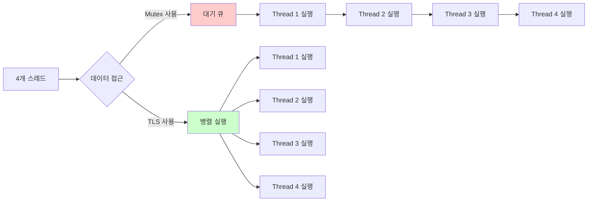

# 실전 Thread-Local Storage: 락(Lock) 없는 고성능 멀티스레딩과 C++ 최적화 기법

저자: 최흥배, AI-Assisted   
    
권장 개발 환경
- **IDE**: Visual Studio 2022 (Community 이상)
- **컴파일러**: MSVC v143 (C++20 지원)
- **OS**: Windows 10 이상

-----  

# 1. 기본 개념과 이론

## 1.1 Thread-Local Storage란?
Thread-Local Storage (TLS)는 각 스레드가 독립적으로 소유하는 저장 공간입니다. 전역 변수나 정적 변수와 달리, TLS로 선언된 변수는 각 스레드마다 별도의 복사본을 가지게 됩니다.

### 메모리 구조 비교

```
일반 전역 변수의 메모리 구조:
┌─────────────────────────────────┐
│      프로세스 메모리 공간        │
│                                 │
│  ┌─────────────────┐           │
│  │  전역 변수 g_data│  ←───────┼─── 모든 스레드가 같은 메모리 공유
│  └─────────────────┘           │
│         ↑   ↑   ↑              │
│         │   │   │              │
│    Thread1 Thread2 Thread3     │
└─────────────────────────────────┘


Thread-Local 변수의 메모리 구조:
┌─────────────────────────────────┐
│      프로세스 메모리 공간        │
│                                 │
│  ┌──────────┐  ┌──────────┐    │
│  │tls_data  │  │tls_data  │    │
│  │Thread1용 │  │Thread2용 │    │
│  └──────────┘  └──────────┘    │
│       ↑             ↑           │
│       │             │           │
│   Thread1       Thread2         │
│                                 │
│  ┌──────────┐                   │
│  │tls_data  │                   │
│  │Thread3용 │                   │
│  └──────────┘                   │
│       ↑                         │
│       │                         │
│   Thread3                       │
└─────────────────────────────────┘
```

### 핵심 특징

1. **독립성**: 각 스레드는 자신만의 변수 복사본을 가집니다.
2. **격리성**: 한 스레드의 변경이 다른 스레드에 영향을 주지 않습니다.
3. **자동 관리**: 스레드 생성/종료 시 자동으로 할당/해제됩니다.

```cpp
// 간단한 예제
int g_normal = 0;              // 모든 스레드가 공유
thread_local int tls_data = 0; // 각 스레드마다 별도 복사본

void ThreadFunction() {
    g_normal++;    // 경쟁 조건 발생 가능!
    tls_data++;    // 안전함, 각 스레드의 독립적인 값
}
```
  

## 1.2 왜 필요한가? (동기화 vs TLS)
멀티스레드 프로그래밍에서 공유 데이터 접근은 두 가지 방식으로 해결할 수 있습니다.

### 방법 1: 동기화 (Mutex, Critical Section 등)

```cpp
#include <mutex>

std::mutex g_mutex;
int g_counter = 0;

void IncrementWithMutex() {
    std::lock_guard<std::mutex> lock(g_mutex);
    g_counter++;  // 동기화로 보호
}
```

**문제점:**
- 락 경합(Lock Contention)으로 성능 저하
- 데드락 위험
- 컨텍스트 스위칭 오버헤드
- 캐시 무효화

### 방법 2: Thread-Local Storage

```cpp
thread_local int tls_counter = 0;

void IncrementWithTLS() {
    tls_counter++;  // 락 불필요!
}
```

**장점:**
- 락 오버헤드 없음
- 경쟁 조건 없음
- 캐시 친화적
- 높은 성능

### 성능 비교 다이어그램



### 실제 성능 차이 예제

```cpp
#include <iostream>
#include <thread>
#include <mutex>
#include <chrono>
#include <vector>

// 방법 1: Mutex 사용
std::mutex g_mutex;
int g_shared_counter = 0;

void CountWithMutex(int iterations) {
    for (int i = 0; i < iterations; ++i) {
        std::lock_guard<std::mutex> lock(g_mutex);
        g_shared_counter++;
    }
}

// 방법 2: TLS 사용
thread_local int tls_counter = 0;

void CountWithTLS(int iterations) {
    for (int i = 0; i < iterations; ++i) {
        tls_counter++;
    }
}

// 성능 측정 함수
template<typename Func>
long long MeasureTime(Func func, int thread_count, int iterations) {
    auto start = std::chrono::high_resolution_clock::now();
    
    std::vector<std::thread> threads;
    for (int i = 0; i < thread_count; ++i) {
        threads.emplace_back(func, iterations);
    }
    
    for (auto& t : threads) {
        t.join();
    }
    
    auto end = std::chrono::high_resolution_clock::now();
    return std::chrono::duration_cast<std::chrono::milliseconds>(end - start).count();
}

int main() {
    const int THREAD_COUNT = 4;
    const int ITERATIONS = 1000000;
    
    long long mutex_time = MeasureTime(CountWithMutex, THREAD_COUNT, ITERATIONS);
    long long tls_time = MeasureTime(CountWithTLS, THREAD_COUNT, ITERATIONS);
    
    std::cout << "Mutex 방식: " << mutex_time << "ms\n";
    std::cout << "TLS 방식: " << tls_time << "ms\n";
    std::cout << "성능 향상: " << (mutex_time / (double)tls_time) << "배\n";
    
    return 0;
}
```

**예상 출력 (시스템에 따라 다름):**
```
Mutex 방식: 450ms
TLS 방식: 25ms
성능 향상: 18배
```

### TLS가 적합한 경우

```
✓ 스레드별로 독립적인 상태를 유지해야 할 때
  예: 난수 생성기, 메모리 할당자, 에러 코드

✓ 빈번한 읽기/쓰기가 발생하는 경우
  예: 성능 카운터, 통계 정보

✓ 스레드 간 데이터 공유가 필요 없는 경우
  예: 임시 버퍼, 캐시

✓ 락 경합을 피하고 싶은 경우
  예: 핫 패스(hot path) 최적화
```

### Mutex가 필요한 경우

```
✓ 스레드 간 데이터를 실제로 공유해야 할 때
  예: 공유 자원, 글로벌 상태

✓ 순서 보장이 필요한 경우
  예: 이벤트 순서, 트랜잭션

✓ 데이터 일관성이 중요한 경우
  예: 데이터베이스 업데이트
```
  

## 1.3 Win32 API의 TLS vs C++11 thread_local 비교
Windows에서 TLS를 사용하는 방법은 크게 두 가지가 있습니다.

### 비교 표

| 특징 | Win32 API TLS | C++11 thread_local |
|------|---------------|-------------------|
| **표준 여부** | Windows 전용 | C++11 표준 (크로스 플랫폼) |
| **사용 난이도** | 복잡 (수동 관리) | 간단 (자동 관리) |
| **타입 안전성** | 없음 (void* 사용) | 있음 (타입 체크) |
| **초기화** | 수동 | 자동 |
| **소멸자 호출** | 수동 구현 필요 | 자동 |
| **최대 슬롯** | 제한적 (1088개) | 제한 없음 |
| **성능** | 약간 느림 | 최적화됨 |
| **컴파일러 지원** | MSVC, MinGW | MSVC 2015+, GCC, Clang |

### Win32 API TLS 예제

```cpp
#include <windows.h>
#include <iostream>

DWORD g_tlsIndex;  // TLS 슬롯 인덱스

// 스레드 함수
DWORD WINAPI ThreadProc(LPVOID lpParam) {
    // TLS에 데이터 저장
    int* pData = new int(42);
    TlsSetValue(g_tlsIndex, pData);
    
    // TLS에서 데이터 읽기
    int* pRetrieved = (int*)TlsGetValue(g_tlsIndex);
    std::cout << "Thread " << GetCurrentThreadId() 
              << ": " << *pRetrieved << "\n";
    
    // 수동으로 메모리 해제
    delete pRetrieved;
    return 0;
}

int main() {
    // TLS 슬롯 할당
    g_tlsIndex = TlsAlloc();
    if (g_tlsIndex == TLS_OUT_OF_INDEXES) {
        std::cerr << "TlsAlloc failed\n";
        return 1;
    }
    
    // 스레드 생성
    HANDLE threads[3];
    for (int i = 0; i < 3; ++i) {
        threads[i] = CreateThread(NULL, 0, ThreadProc, NULL, 0, NULL);
    }
    
    // 스레드 대기
    WaitForMultipleObjects(3, threads, TRUE, INFINITE);
    
    // 핸들 정리
    for (int i = 0; i < 3; ++i) {
        CloseHandle(threads[i]);
    }
    
    // TLS 슬롯 해제
    TlsFree(g_tlsIndex);
    
    return 0;
}
```

**Win32 TLS의 단점:**
1. 수동 메모리 관리 (new/delete)
2. 타입 안전성 없음 (void* 캐스팅)
3. 에러 처리 복잡
4. 소멸자 자동 호출 안 됨

### C++11 thread_local 예제

```cpp
#include <iostream>
#include <thread>
#include <vector>

// 자동으로 각 스레드마다 별도 인스턴스 생성
thread_local int tls_data = 42;

// 복잡한 객체도 가능
class ThreadContext {
public:
    ThreadContext() {
        std::cout << "ThreadContext created in thread " 
                  << std::this_thread::get_id() << "\n";
    }
    ~ThreadContext() {
        std::cout << "ThreadContext destroyed in thread " 
                  << std::this_thread::get_id() << "\n";
    }
    
    int value = 0;
};

thread_local ThreadContext tls_context;

void ThreadFunction(int id) {
    tls_data = id * 10;
    tls_context.value = id * 100;
    
    std::cout << "Thread " << id 
              << ": tls_data=" << tls_data
              << ", context.value=" << tls_context.value << "\n";
}

int main() {
    std::vector<std::thread> threads;
    
    for (int i = 1; i <= 3; ++i) {
        threads.emplace_back(ThreadFunction, i);
    }
    
    for (auto& t : threads) {
        t.join();
    }
    
    // 소멸자가 자동으로 호출됨
    return 0;
}
```

**출력 예시:**
```
ThreadContext created in thread 140123456
ThreadContext created in thread 140123457
ThreadContext created in thread 140123458
Thread 1: tls_data=10, context.value=100
Thread 2: tls_data=20, context.value=200
Thread 3: tls_data=30, context.value=300
ThreadContext destroyed in thread 140123458
ThreadContext destroyed in thread 140123457
ThreadContext destroyed in thread 140123456
```

### 내부 동작 방식 비교


### 성능 차이

```cpp
#include <windows.h>
#include <iostream>
#include <chrono>

// Win32 TLS
DWORD g_tlsIndex;

void BenchmarkWin32TLS(int iterations) {
    int* pData = new int(0);
    TlsSetValue(g_tlsIndex, pData);
    
    for (int i = 0; i < iterations; ++i) {
        int* p = (int*)TlsGetValue(g_tlsIndex);
        (*p)++;
    }
    
    delete pData;
}

// C++ thread_local
thread_local int tls_value = 0;

void BenchmarkCppTLS(int iterations) {
    for (int i = 0; i < iterations; ++i) {
        tls_value++;
    }
}

int main() {
    const int ITERATIONS = 10000000;
    
    // Win32 TLS 벤치마크
    g_tlsIndex = TlsAlloc();
    auto start1 = std::chrono::high_resolution_clock::now();
    BenchmarkWin32TLS(ITERATIONS);
    auto end1 = std::chrono::high_resolution_clock::now();
    TlsFree(g_tlsIndex);
    
    // C++ thread_local 벤치마크
    auto start2 = std::chrono::high_resolution_clock::now();
    BenchmarkCppTLS(ITERATIONS);
    auto end2 = std::chrono::high_resolution_clock::now();
    
    auto time1 = std::chrono::duration_cast<std::chrono::milliseconds>(end1 - start1).count();
    auto time2 = std::chrono::duration_cast<std::chrono::milliseconds>(end2 - start2).count();
    
    std::cout << "Win32 TLS: " << time1 << "ms\n";
    std::cout << "C++ thread_local: " << time2 << "ms\n";
    std::cout << "속도 차이: " << (time1 / (double)time2) << "배\n";
    
    return 0;
}
```

### 권장 사항

```
┌─────────────────────────────────────┐
│  C++11 thread_local 사용 권장       │
├─────────────────────────────────────┤
│ ✓ 타입 안전                         │
│ ✓ 자동 메모리 관리                  │
│ ✓ 크로스 플랫폼                     │
│ ✓ 더 나은 성능                      │
│ ✓ 간결한 코드                       │
└─────────────────────────────────────┘

┌─────────────────────────────────────┐
│  Win32 TLS가 필요한 경우            │
├─────────────────────────────────────┤
│ • C 코드 작업 시                    │
│ • 레거시 코드 유지보수              │
│ • DLL 동적 로딩 시 특수한 경우      │
└─────────────────────────────────────┘
```  