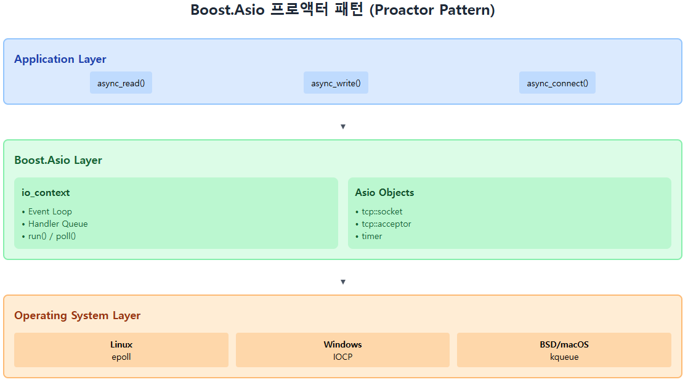
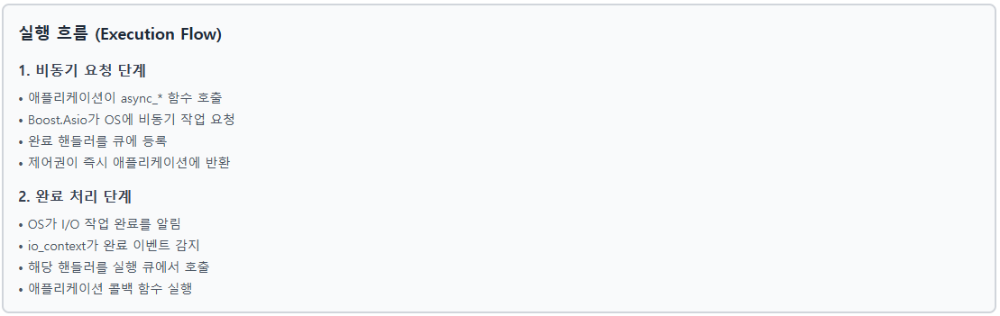

# C++ Boost.Asio로 만드는 온라인 게임 서버
저자: 최흥배, Claude AI   
    
권장 개발 환경
- **IDE**: Visual Studio 2022 (Community 이상)
- **컴파일러**: MSVC v143 (C++20 지원)
- **OS**: Windows 10 이상

-----   

# Chapter 2. Boost.Asio 개요
이 장에서는 Boost.Asio 라이브러리의 핵심 개념과 특징을 살펴보겠다. 게임 서버 개발에서 왜 Boost.Asio가 최선의 선택인지, 그리고 어떤 장점들이 있는지 구체적으로 알아보겠다.

## 2.1 Boost.Asio란 무엇인가?

### 2.1.1 Boost.Asio의 정의와 역할
Boost.Asio(Asynchronous Input/Output)는 C++용 크로스 플랫폼 네트워킹 및 저수준 I/O 라이브러리이다. "Asio"라는 이름은 "Asynchronous Input/Output"의 줄임말로, 비동기 입출력 처리를 핵심으로 하는 라이브러리임을 나타낸다.  

**주요 특징:**
- **비동기 I/O**: 논블로킹 방식의 효율적인 I/O 처리
- **네트워킹**: TCP, UDP, Unix 도메인 소켓 지원
- **타이머**: 고정밀 타이머와 스케줄링 기능
- **시리얼 포트**: 하드웨어 통신 지원
- **파일 I/O**: 비동기 파일 읽기/쓰기

```cpp
#include <boost/asio.hpp>
#include <iostream>

// Boost.Asio의 기본 구조
int main() 
{
    // I/O 실행 컨텍스트
    boost::asio::io_context io_context;
    
    // 비동기 타이머 예제
    boost::asio::steady_timer timer(io_context, std::chrono::seconds(1));
    
    timer.async_wait([](boost::system::error_code ec) {
        if (!ec) {
            std::cout << "Timer expired!" << std::endl;
        }
    });
    
    // 이벤트 루프 실행
    io_context.run();
    
    return 0;
}
```

### 2.1.2 게임 서버에서 Boost.Asio가 중요한 이유
게임 서버는 다음과 같은 특수한 요구사항을 가지고 있다:

**1. 높은 동시 접속자 처리**
- 수천 명의 플레이어가 동시에 접속
- 각 플레이어마다 독립적인 네트워크 연결 관리
- 메모리와 CPU 자원의 효율적 사용

**2. 실시간 응답성**
- 게임 액션에 대한 즉각적인 반응 (레이턴시 최소화)
- 일정한 프레임 레이트 유지 (틱 레이트)
- 지연 없는 데이터 전송

**3. 복잡한 이벤트 처리**
- 플레이어 액션, 타이머 이벤트, 시스템 이벤트 동시 처리
- 이벤트 간의 우선순위 관리
- 데드락과 레이스 컨디션 방지
  
```cpp
// 게임 서버의 전형적인 구조
class GameServer 
{
private:
    boost::asio::io_context io_context_;
    boost::asio::ip::tcp::acceptor acceptor_;
    boost::asio::steady_timer game_tick_timer_;
    
    std::vector<std::shared_ptr<PlayerSession>> players_;
    
public:
    GameServer(unsigned short port) 
        : acceptor_(io_context_, boost::asio::ip::tcp::endpoint(
              boost::asio::ip::tcp::v4(), port))
        , game_tick_timer_(io_context_) 
        {
        
        start_accept();
        start_game_loop();
    }
    
    void run() 
    {
        // 단일 스레드에서 모든 I/O 이벤트 처리
        io_context_.run();
    }
    
private:
    void start_game_loop() 
    {
        game_tick_timer_.expires_after(std::chrono::milliseconds(16)); // 60 FPS
        game_tick_timer_.async_wait([this](boost::system::error_code ec) {
            if (!ec) {
                update_game_state();
                start_game_loop(); // 다음 틱 스케줄링
            }
        });
    }
    
    void start_accept() 
    {
        auto new_session = std::make_shared<PlayerSession>(io_context_);
        acceptor_.async_accept(new_session->socket(),
            [this, new_session](boost::system::error_code ec) {
                if (!ec) {
                    players_.push_back(new_session);
                    new_session->start();
                }
                start_accept();
            });
    }
    
    void update_game_state() {
        // 게임 로직 업데이트
        for (auto& player : players_) {
            player->update();
        }
    }
};
```

### 2.1.3 Boost.Asio의 핵심 개념  
**1. io_context (이벤트 루프의 핵심)**

`io_context`는 Boost.Asio의 중심이 되는 클래스로, 모든 비동기 작업을 조율한다.

```cpp
boost::asio::io_context io_context;

// 작업 스케줄링
boost::asio::post(io_context, []() {
    std::cout << "비동기 작업 실행" << std::endl;
});

// 이벤트 루프 실행
io_context.run(); // 모든 작업이 완료될 때까지 블로킹
```

**2. 비동기 작업과 완료 핸들러**

모든 I/O 작업은 비동기적으로 수행되며, 완료 시 콜백 함수가 호출된다.

```cpp
// 비동기 읽기 예제
boost::asio::ip::tcp::socket socket(io_context);
std::array<char, 1024> buffer;

socket.async_read_some(boost::asio::buffer(buffer),
    [&](boost::system::error_code ec, std::size_t bytes_transferred) {
        if (!ec) {
            std::cout << "받은 데이터: " << bytes_transferred << " bytes" << std::endl;
            // 데이터 처리...
        } else {
            std::cout << "에러 발생: " << ec.message() << std::endl;
        }
    });
```

**3. 프로액터 패턴 (Proactor Pattern)**

Boost.Asio는 프로액터 패턴을 구현하여 확장성 있는 I/O 처리를 제공한다.  
  
  
  
```cpp
// 프로액터 패턴의 구조
class AsyncTCPServer 
{
    boost::asio::io_context& io_context_;
    boost::asio::ip::tcp::acceptor acceptor_;
    
public:
    AsyncTCPServer(boost::asio::io_context& io_context, short port)
        : io_context_(io_context)
        , acceptor_(io_context, boost::asio::ip::tcp::endpoint(
              boost::asio::ip::tcp::v4(), port)) {
        start_accept();
    }
    
private:
    void start_accept() {
        auto new_session = std::make_shared<Session>(io_context_);
        
        // 1. 비동기 작업 시작 (I/O 요청)
        acceptor_.async_accept(new_session->socket(),
            // 2. 완료 핸들러 등록
            [this, new_session](boost::system::error_code ec) {
                // 3. 작업 완료 시 호출됨
                if (!ec) {
                    new_session->start();
                }
                start_accept(); // 4. 다음 작업 스케줄링
            });
    }
};
```

### 2.1.4 기존 네트워킹 방식과의 비교

**전통적인 멀티스레드 방식:**

```cpp
// 문제가 있는 전통적인 방식
void handle_client(int socket_fd) 
{
    char buffer[1024];
    while (true) 
    {
        // 블로킹 호출 - 스레드가 대기
        int bytes = recv(socket_fd, buffer, sizeof(buffer), 0);
        if (bytes <= 0) break;
        
        // 데이터 처리
        process_data(buffer, bytes);
        
        // 응답 전송 - 또 다른 블로킹 호출
        send(socket_fd, response_data, response_size, 0);
    }
}

// 메인 서버 루프
void server_main() 
{
    int server_socket = create_server_socket(8080);
    
    while (true) 
    {
        int client_socket = accept(server_socket, nullptr, nullptr);
        
        // 클라이언트마다 새로운 스레드 생성
        std::thread client_thread(handle_client, client_socket);
        client_thread.detach();
    }
}
```

**문제점:**
- 클라이언트 수 = 스레드 수 (스레드 폭증)
- 컨텍스트 스위칭 오버헤드
- 메모리 사용량 급증 (스레드당 스택 메모리)
- 동기화 복잡성

**Boost.Asio 방식:**

```cpp
// 효율적인 비동기 방식
class Session : public std::enable_shared_from_this<Session> 
{
    boost::asio::ip::tcp::socket socket_;
    std::array<char, 1024> buffer_;
    
public:
    void start() 
    {
        do_read();
    }
    
private:
    void do_read() 
    {
        auto self(shared_from_this());
        socket_.async_read_some(boost::asio::buffer(buffer_),
            [this, self](boost::system::error_code ec, std::size_t length) {
                if (!ec) {
                    // 논블로킹으로 데이터 처리
                    process_data(buffer_.data(), length);
                    do_write();
                } else {
                    // 연결 종료 처리
                    handle_disconnect();
                }
            });
    }
    
    void do_write() 
    {
        auto self(shared_from_this());
        boost::asio::async_write(socket_, boost::asio::buffer(response_data_),
            [this, self](boost::system::error_code ec, std::size_t length) {
                if (!ec) {
                    do_read(); // 다음 읽기 요청
                }
            });
    }
};
```

**장점:**
- 단일 스레드로 수천 개의 연결 처리 가능
- 메모리 효율성 (세션 객체만 필요)
- 컨텍스트 스위칭 최소화
- 동기화 문제 해결
   

## 2.2 멀티플랫폼 지원과 성능

### 2.2.1 플랫폼별 최적화 구현
Boost.Asio는 각 운영체제의 고성능 I/O 메커니즘을 내부적으로 활용한다.

**플랫폼별 I/O 메커니즘:**

| 플랫폼 | I/O 메커니즘 | 특징 |
|--------|-------------|------|
| Windows | IOCP (I/O Completion Port) | 완료 기반 I/O, 스레드 풀 최적화 |
| Linux (2.6+) | epoll | 엣지 트리거/레벨 트리거 지원 |
| Linux (2.4) | select | 호환성 지원 (성능 제한) |
| FreeBSD/macOS | kqueue | 고성능 이벤트 알림 |
| Solaris | /dev/poll | 대용량 연결 최적화 |

```cpp
// 플랫폼 독립적인 코드
class CrossPlatformServer 
{
    boost::asio::io_context io_context_;
    boost::asio::ip::tcp::acceptor acceptor_;
    
public:
    CrossPlatformServer(unsigned short port) 
        : acceptor_(io_context_, 
                    boost::asio::ip::tcp::endpoint(
                        boost::asio::ip::tcp::v4(), port)) 
    {
        
        #ifdef _WIN32
            std::cout << "Windows IOCP 사용" << std::endl;
        #elif defined(__linux__)
            std::cout << "Linux epoll 사용" << std::endl;
        #elif defined(__APPLE__)
            std::cout << "macOS kqueue 사용" << std::endl;
        #endif
        
        start_accept();
    }
    
    void run(int thread_count = 1) 
    {
        std::vector<std::thread> threads;
        
        // 멀티스레드 I/O 처리
        for (int i = 0; i < thread_count; ++i) 
        {
            threads.emplace_back([this]() {
                io_context_.run();
            });
        }
        
        for (auto& t : threads) 
        {
            t.join();
        }
    }
};
```
  
#### io_uring 사용하기  
Boost.Asio가 io_uring을 지원하는 기능은 최근 버전에서 실험적으로 포함되어 있으며, 사용하는 데는 몇 가지 조건과 설정이 필요하다. 

##### io_uring을 지원하는 리눅스 커널 버전
* io_uring은 Linux 커널 5.1에서 처음 도입되었다. 
* 다만, Boost.Asio 내부에서 io_uring을 제대로 활용하려면 더 안정적인 API 지원이 있는 커널 버전이 요구된다.
* Boost 문서에서 “If BOOST_ASIO_HAS_IO_URING is defined …” 부분을 보면 **Linux 커널 5.10 이상**을 기준으로 io_uring 기반 비동기 파일 I/O가 가능하다는 언급이 있다. 
* 또한 Boost의 변경 이력에도 “Buffer registration supports the io_uring backend …”라는 기능이 포함되었다는 항목이 있다.  
* 따라서 실질적으로는 **Linux 5.10 이상**에서 Boost.Asio + io_uring 조합을 사용하는 것이 무난하다.
  
요약하면, 커널 5.1부터 io_uring이 도입되었고, Boost.Asio 쪽 지원은 커널 5.10 이상을 기대하는 쪽이 현실적이다.
    
Boost.Asio 내부에 io_uring 백엔드를 켜려면 다음 조건과 설정이 필요하다.
  
##### 조건
1. Boost 버전이 충분히 최신이어야 한다. (예: Boost 1.78 이상 등) 
2. 리눅스 커널이 io_uring 기능을 지원해야 한다 (보통 5.10 이상 권장).
3. 컴파일 시에 매크로 정의를 넣어야 한다:
   * `BOOST_ASIO_HAS_IO_URING` = 1
   * (선택적으로) `BOOST_ASIO_DISABLE_EPOLL` = 1 을 같이 정의해서 epoll 대신 io_uring만 사용하게 할 수 있다. 
4. `liburing` 라이브러리가 필요할 수 있다 (io_uring 사용자 공간 라이브러리) — 컴파일에 링크해야 할 수 있다.  
 

##### 예시: CMake 설정

```cmake
target_compile_definitions(my_target
    PRIVATE
      BOOST_ASIO_HAS_IO_URING=1
      BOOST_ASIO_DISABLE_EPOLL=1
)

# 또한 liburing 라이브러리를 찾아서 링크
find_library(LIBURING_LIBRARY NAMES uring liburing)
target_link_libraries(my_target PRIVATE ${LIBURING_LIBRARY})
```
  
##### 코드 수준 사용
* Boost.Asio 쪽에서는 `io_uring_service` 또는 관련 내부 서비스가 있다. 예를 들어 `boost::asio::detail::io_uring_service` 등이 정의되어 있다. 
* `async_read`, `async_write` 등의 I/O 함수가 내부적으로 io_uring 백엔드를 사용할 수 있다.   
* 다만 소켓 기반 네트워크 I/O는 기존의 epoll/reactor 기반을 일부 혼합해서 쓸 수 있다. Asio 문서에 “uses io_uring for file-related asynchronous operations, uses epoll for demultiplexing other event sources”라는 설명이 있다.   
* 만약 `BOOST_ASIO_DISABLE_EPOLL`도 정의하면 epoll을 사용하지 않고 가능한 경우 io_uring으로만 처리하려 시도한다.   
  
##### 주의사항 및 제한점
* Asio가 제공하지 않는 일부 시스템 호출(mkdir, rename, setxattr 등)은 io_uring 백엔드로 대체되지 않을 수 있다.   
* Asio 내부에서 사용하는 이벤트 디멀티플렉싱과 io_uring의 관계(예: epoll 혼합, 큐 설정 등)를 잘 이해해야 한다.  
* io_uring의 기능은 커널 버전마다 차이가 있으므로, 지원 opcodes(probe)를 확인해야 할 수 있다.   
  
##### link  
- ["An Introduction to the io_uring Asynchronous I/O Framework"](https://blogs.oracle.com/linux/post/an-introduction-to-the-io-uring-asynchronous-io-framework)
- ["Platform-Specific Implementation Notes - Boost C++ Libraries"](https://www.boost.org/doc/libs/1_81_0/doc/html/boost_asio/overview/implementation.html ) 
- ["[boost-asio] Add package option to enable io_uring support"](https://github.com/microsoft/vcpkg/issues/22064 )
- [Boost C++ Libraries - io_uring_service.hpp](https://www.boost.org/doc/libs/1_84_0/boost/asio/detail/io_uring_service.hpp ) 
- ["How to expand io_uring functionality with Asio on Linux?"](https://stackoverflow.com/questions/79114458/how-to-expand-io-uring-functionality-with-asio-on-linux )
- ["How to tell if a Linux machine supports io_uring?"](https://unix.stackexchange.com/questions/596276/how-to-tell-if-a-linux-machine-supports-io-uring  )


### 2.2.2 성능 벤치마크와 비교

**동시 연결 수 테스트:**

```cpp
// 성능 측정 예제
class PerformanceTestServer 
{
    boost::asio::io_context io_context_;
    boost::asio::ip::tcp::acceptor acceptor_;
    std::atomic<int> connection_count_{0};
    std::atomic<int> message_count_{0};
    
public:
    void start_performance_test() 
    {
        // 성능 모니터링 타이머
        auto timer = std::make_shared<boost::asio::steady_timer>(io_context_);
        schedule_stats_print(timer);
        
        start_accept();
        
        // 멀티스레드로 실행 (CPU 코어 수만큼)
        auto thread_count = std::thread::hardware_concurrency();
        std::vector<std::thread> threads;
        
        for (unsigned i = 0; i < thread_count; ++i) {
            threads.emplace_back([this]() {
                io_context_.run();
            });
        }
        
        for (auto& thread : threads) {
            thread.join();
        }
    }
    
private:
    void schedule_stats_print(std::shared_ptr<boost::asio::steady_timer> timer) 
    {
        timer->expires_after(std::chrono::seconds(1));
        timer->async_wait([this, timer](boost::system::error_code ec) {
            if (!ec) {
                print_statistics();
                schedule_stats_print(timer);
            }
        });
    }
    
    void print_statistics() 
    {
        std::cout << std::format(
            "활성 연결: {}, 초당 메시지: {}\n", 
            connection_count_.load(), 
            message_count_.exchange(0)
        );
    }
};
```

**실제 성능 지표 (참고 값):**

```cpp
// 일반적인 게임 서버 성능 지표
class GameServerMetrics 
{
public:
    struct PerformanceData 
    {
        int max_concurrent_connections;
        int messages_per_second;
        double average_latency_ms;
        double cpu_usage_percent;
        size_t memory_usage_mb;
    };
    
    // 하드웨어별 예상 성능
    static PerformanceData get_expected_performance(const std::string& hardware_type) 
    {
        if (hardware_type == "entry_level") {
            return {1000, 10000, 5.0, 50.0, 512};
        } else if (hardware_type == "mid_range") {
            return {5000, 50000, 2.0, 30.0, 1024};
        } else if (hardware_type == "high_end") {
            return {20000, 200000, 1.0, 20.0, 2048};
        }
        return {};
    }
};
```

### 2.2.3 IPv6 지원과 네트워크 프로토콜
Boost.Asio는 IPv4와 IPv6을 모두 지원하며, 미래 지향적인 네트워크 설계를 가능하게 한다.

```cpp
// IPv4/IPv6 듀얼 스택 서버
class DualStackServer 
{
    boost::asio::io_context io_context_;
    boost::asio::ip::tcp::acceptor acceptor_v4_;
    boost::asio::ip::tcp::acceptor acceptor_v6_;
    
public:
    DualStackServer(unsigned short port) 
        : acceptor_v4_(io_context_, 
                       boost::asio::ip::tcp::endpoint(
                           boost::asio::ip::tcp::v4(), port))
        , acceptor_v6_(io_context_, 
                       boost::asio::ip::tcp::endpoint(
                           boost::asio::ip::tcp::v6(), port)) 
    {
        
        start_accept_v4();
        start_accept_v6();
    }
    
private:
    void start_accept_v4() 
    {
        auto session = std::make_shared<Session>(io_context_);
        acceptor_v4_.async_accept(session->socket(),
            [this, session](boost::system::error_code ec) {
                if (!ec) {
                    std::cout << "IPv4 클라이언트 연결됨" << std::endl;
                    session->start();
                }
                start_accept_v4();
            });
    }
    
    void start_accept_v6() 
    {
        auto session = std::make_shared<Session>(io_context_);
        acceptor_v6_.async_accept(session->socket(),
            [this, session](boost::system::error_code ec) {
                if (!ec) {
                    std::cout << "IPv6 클라이언트 연결됨" << std::endl;
                    session->start();
                }
                start_accept_v6();
            });
    }
};

// 주소 타입 감지 유틸리티
class NetworkUtils 
{
public:
    static bool is_ipv6_address(const std::string& ip_string) 
    {
        return ip_string.find(':') != std::string::npos;
    }
    
    static boost::asio::ip::tcp::endpoint create_endpoint(
        const std::string& address, unsigned short port) 
    {
        
        if (is_ipv6_address(address)) {
            auto addr = boost::asio::ip::make_address_v6(address);
            return boost::asio::ip::tcp::endpoint(addr, port);
        } else {
            auto addr = boost::asio::ip::make_address_v4(address);
            return boost::asio::ip::tcp::endpoint(addr, port);
        }
    }
};
```
  

## 2.3 안정성 보장 패턴

```cpp
// 안전한 세션 관리
class SafeSession : public std::enable_shared_from_this<SafeSession> 
{
    boost::asio::ip::tcp::socket socket_;
    boost::asio::steady_timer timeout_timer_;
    std::array<char, 4096> buffer_;
    std::atomic<bool> is_active_{true};
    
    static constexpr std::chrono::seconds SESSION_TIMEOUT{30};
    
public:
    SafeSession(boost::asio::io_context& io_context) 
        : socket_(io_context)
        , timeout_timer_(io_context) {}
    
    void start() 
    {
        reset_timeout();
        do_read();
    }
    
    void stop() 
    {
        if (is_active_.exchange(false)) 
        {
            boost::system::error_code ec;
            socket_.close(ec);
            timeout_timer_.cancel(ec);
        }
    }
    
private:
    void do_read() 
    {
        if (!is_active_) return;
        
        auto self(shared_from_this());
        socket_.async_read_some(boost::asio::buffer(buffer_),
            [this, self](boost::system::error_code ec, std::size_t length) {
                if (is_active_ && !ec) {
                    reset_timeout();
                    process_data(buffer_.data(), length);
                    do_read();
                } else if (ec) {
                    ErrorHandler::handle_session_error(ec, get_session_id());
                    stop();
                }
            });
    }
    
    void reset_timeout() 
    {
        timeout_timer_.expires_after(SESSION_TIMEOUT);
        timeout_timer_.async_wait([this, self = shared_from_this()]
                                (boost::system::error_code ec) {
            if (!ec && is_active_) {
                std::cout << "세션 타임아웃, 연결 종료\n";
                stop();
            }
        });
    }
    
    std::string get_session_id() const 
    {
        try 
        {
            auto endpoint = socket_.remote_endpoint();
            return std::format("{}:{}", 
                             endpoint.address().to_string(), 
                             endpoint.port());
        } 
        catch (...) {
            return "unknown";
        }
    }
    
    void process_data(const char* data, std::size_t length) 
    {
        // 데이터 처리 로직
        // 예외 안전성 보장
        try {
            // 실제 게임 로직 처리
            handle_game_packet(data, length);
        } catch (const std::exception& e) {
            std::cerr << "패킷 처리 중 예외 발생: " << e.what() << std::endl;
            // 세션 종료하지 않고 로그만 남김 (서비스 연속성)
        }
    }
    
    void handle_game_packet(const char* data, std::size_t length) {
        // 게임별 패킷 처리 구현
    }
};
```
    
`SafeSession` 클래스는 네트워크 세션을 관리하는 객체로, **비동기 입출력(Asynchronous I/O)** 환경에서 발생할 수 있는 **경쟁 상태, 세션 누수, 예외 전파** 등의 문제를 안전하게 처리하도록 설계되어 있다.
  
핵심 개념은 다음 세 가지다:   
1. **객체 수명 보장 (`std::enable_shared_from_this`)**
2. **명시적 종료 제어 (`std::atomic<bool>`)**
3. **타임아웃 기반 안정성 확보 (`steady_timer`)**

 
### 객체 수명 안전성 (Lifetime Safety)

```cpp
class SafeSession : public std::enable_shared_from_this<SafeSession>
```

* `std::enable_shared_from_this`를 상속받음으로써,
  비동기 콜백 내부에서 `shared_from_this()`를 통해 자기 자신을 `std::shared_ptr` 형태로 안전하게 참조할 수 있다.
* 이를 통해 비동기 작업이 진행 중일 때, 세션 객체가 소멸되는 문제를 방지한다.

즉, **비동기 I/O가 완료될 때까지 객체의 생존을 보장**한다는 점이 이 패턴의 핵심이다.


### 세션 활성 상태 제어 (`std::atomic<bool>`)

```cpp
std::atomic<bool> is_active_{true};
```

* `is_active_`는 세션이 유효한지(활성 상태인지)를 나타내는 원자 변수다.
* `stop()` 함수에서 `exchange(false)`로 상태를 변경하며, 이 동작은 **한 번만 수행되도록 보장**한다.
* 이로써 다중 스레드 또는 중복 콜백 환경에서 **중복 종료나 예외적 상태 변경을 방지**한다.

```cpp
void stop() {
    if (is_active_.exchange(false)) {
        boost::system::error_code ec;
        socket_.close(ec);
        timeout_timer_.cancel(ec);
    }
}
```

  
### 타임아웃 기반 세션 종료

```cpp
timeout_timer_.expires_after(SESSION_TIMEOUT);
timeout_timer_.async_wait([this, self = shared_from_this()](boost::system::error_code ec) {
    if (!ec && is_active_) {
        std::cout << "세션 타임아웃, 연결 종료\n";
        stop();
    }
});
```

* 세션이 일정 시간(`SESSION_TIMEOUT = 30초`) 동안 데이터 수신이 없을 경우 자동으로 종료된다.
* 비정상 연결(예: 클라이언트 비활성화, 연결 끊김)로 인한 **자원 누수 방지**에 효과적이다.
* 타임아웃 콜백 역시 `shared_from_this()`를 통해 객체 생존을 보장한다.

  
### 비동기 읽기 (Asynchronous Read)

```cpp
socket_.async_read_some(boost::asio::buffer(buffer_),
    [this, self](boost::system::error_code ec, std::size_t length) {
        if (is_active_ && !ec) {
            reset_timeout();
            process_data(buffer_.data(), length);
            do_read();
        } else if (ec) {
            ErrorHandler::handle_session_error(ec, get_session_id());
            stop();
        }
    });
```

* `async_read_some`은 **논블로킹 I/O**를 수행한다.
* 정상적으로 데이터가 수신되면:

  1. 타임아웃을 리셋한다.
  2. 데이터를 처리한다.
  3. 다음 읽기를 예약한다 (재귀적 read-loop).
* 오류 발생 시, `ErrorHandler`를 통해 로깅 및 분석 후 `stop()`으로 안전하게 종료한다.

이 루프 구조를 통해 **지속적인 데이터 스트림 처리와 오류 복구가 가능한 세션 구조**를 만든다.

  
### 예외 안전성 (Exception Safety)

```cpp
void process_data(const char* data, std::size_t length) {
    try {
        handle_game_packet(data, length);
    } catch (const std::exception& e) {
        std::cerr << "패킷 처리 중 예외 발생: " << e.what() << std::endl;
        // 세션을 종료하지 않고 서비스 지속
    }
}
```

* 패킷 처리 중 예외가 발생하더라도 **세션 전체가 종료되지 않도록** 설계되어 있다.
* 이는 “**서비스 연속성(Service Continuity)**”을 보장하는 중요한 포인트다.
* 예외는 로깅 후 무시하고, 세션은 유지된다.

이 구조는 실시간 게임 서버나 대규모 연결 환경에서 **일시적 오류로 전체 세션이 끊기는 문제를 방지**한다.

  
### 세션 식별자 제공

```cpp
std::string get_session_id() const {
    auto endpoint = socket_.remote_endpoint();
    return std::format("{}:{}", endpoint.address().to_string(), endpoint.port());
}
```

* `remote_endpoint()` 정보를 기반으로 세션별 고유 ID를 생성한다.
* 로그, 모니터링, 에러 리포트에서 **문제 세션을 추적하기 위한 식별자**로 활용된다.

  
### 요약

| 항목           | 설계 목적          | 구현 방법                      |
| ------------ | -------------- | -------------------------- |
| **객체 수명 보장** | 비동기 콜백 중 소멸 방지 | `shared_from_this()` 사용    |
| **중복 종료 방지** | 안전한 자원 해제      | `std::atomic<bool>` 상태 플래그 |
| **타임아웃 처리**  | 유휴 세션 자동 종료    | `steady_timer` 활용          |
| **예외 안전성**   | 예외 발생 시 세션 유지  | try-catch 로깅 처리            |
| **로깅 및 추적성** | 문제 세션 식별       | `remote_endpoint()` 기반 ID  |

  
`SafeSession`은 **비동기 I/O 환경에서의 안정성과 예외 복원력을 극대화한 세션 관리 패턴**이다.
이는 특히 **온라인 게임 서버나 고성능 네트워크 서버**에서 다음과 같은 이점을 제공한다:

* 예기치 못한 예외로 인한 전체 세션 종료 방지
* 유휴 클라이언트 세션의 자동 정리
* 안전한 비동기 수명 관리
* 로그 기반의 세션 추적 및 디버깅 용이성

결과적으로, `SafeSession`은 Boost.Asio를 활용한 **고신뢰 네트워크 서비스의 기본 뼈대**로 활용할 수 있는 패턴이라 할 수 있다.
  

## 2.4 비동기 I/O의 개념과 장점

### 2.4.1 동기 vs 비동기 I/O 비교

**동기 I/O (Blocking I/O):**

```cpp
// 문제가 있는 동기 방식
void synchronous_server_example() 
{
    int server_socket = socket(AF_INET, SOCK_STREAM, 0);
    // ... 소켓 설정 ...
    
    while (true) {
        // 1. 클라이언트 연결 대기 (블로킹)
        int client_socket = accept(server_socket, nullptr, nullptr);
        
        char buffer[1024];
        
        // 2. 데이터 읽기 (블로킹)
        int bytes_read = recv(client_socket, buffer, sizeof(buffer), 0);
        
        if (bytes_read > 0) {
            // 3. 데이터 처리 (블로킹)
            std::string response = process_request(buffer, bytes_read);
            
            // 4. 응답 전송 (블로킹)
            send(client_socket, response.c_str(), response.length(), 0);
        }
        
        close(client_socket);
    }
}
```

**문제점:**
- 한 번에 하나의 클라이언트만 처리
- I/O 대기 시간 동안 CPU 낭비
- 확장성 부족

**비동기 I/O (Non-blocking I/O):**

```cpp
// 효율적인 비동기 방식
class AsyncServer 
{
    boost::asio::io_context io_context_;
    boost::asio::ip::tcp::acceptor acceptor_;
    
public:
    AsyncServer(unsigned short port) 
        : acceptor_(io_context_, 
                    boost::asio::ip::tcp::endpoint(
                        boost::asio::ip::tcp::v4(), port)) 
    {
        start_accept();
    }
    
    void run() 
    {
        io_context_.run(); // 이벤트 루프 실행
    }
    
private:
    void start_accept() 
    {
        auto session = std::make_shared<AsyncSession>(io_context_);
        
        // 비동기 accept - 즉시 반환
        acceptor_.async_accept(session->socket(),
            [this, session](boost::system::error_code ec) {
                if (!ec) {
                    session->start(); // 새 세션 시작
                }
                start_accept(); // 다음 연결 대기
            });
    }
};

class AsyncSession : public std::enable_shared_from_this<AsyncSession> 
{
    boost::asio::ip::tcp::socket socket_;
    std::array<char, 1024> buffer_;
    
public:
    void start() 
    {
        do_read();
    }
    
private:
    void do_read() 
    {
        auto self(shared_from_this());
        
        // 비동기 읽기 - 즉시 반환
        socket_.async_read_some(boost::asio::buffer(buffer_),
            [this, self](boost::system::error_code ec, std::size_t length) {
                if (!ec) {
                    // 데이터 처리 (논블로킹)
                    auto response = process_request(buffer_.data(), length);
                    do_write(response);
                } else {
                    // 연결 종료 처리
                }
            });
    }
    
    void do_write(const std::string& response) 
    {
        auto self(shared_from_this());
        
        // 비동기 쓰기 - 즉시 반환
        boost::asio::async_write(socket_, boost::asio::buffer(response),
            [this, self](boost::system::error_code ec, std::size_t length) {
                if (!ec) {
                    do_read(); // 다음 요청 대기
                }
            });
    }
};
```

**장점:**
- 동시에 수천 개의 연결 처리
- CPU 효율적 사용
- 메모리 효율성
- 확장성 우수
  

### 2.4.2 이벤트 기반 프로그래밍 모델  
`EventDrivenGameServer` 클래스는 **이벤트 루프(Event Loop)** 와 **핸들러 기반 이벤트 처리 구조**를 통해 게임 서버의 주요 흐름을 관리한다.
이는 전통적인 **루프 기반 폴링(polling)** 구조 대신, **이벤트 발생 → 핸들러 실행**으로 동작하는 구조를 사용하여 효율성과 확장성을 높이는 방식이다.
  
Boost.Asio의 `io_context`를 이용해 비동기 이벤트 큐를 구성하고, 게임 틱, 플레이어 입장/퇴장, 채팅 메시지 등 다양한 이벤트를 비동기적으로 처리한다.


#### 핵심 구성 필드

```cpp
boost::asio::io_context io_context_;
boost::asio::steady_timer game_timer_;
```

* `io_context_`: Asio의 이벤트 루프 핵심 객체로, 비동기 이벤트를 큐잉하고 실행한다.
* `game_timer_`: 주기적인 게임 틱(tick)을 생성하기 위한 타이머.

  * 16ms 주기로 호출되어 초당 약 60번의 업데이트(60 FPS)를 수행한다.

이 두 객체는 서버 전체의 **비동기 이벤트 스케줄링의 중심 축**을 담당한다.

  
#### 이벤트 핸들러 정의

```cpp
std::function<void()> on_game_tick_;
std::function<void(int player_id)> on_player_join_;
std::function<void(int player_id)> on_player_leave_;
std::function<void(int player_id, const std::string& message)> on_chat_message_;
```

* 각 이벤트에 대해 콜백 함수를 정의하여, 서버 동작의 논리적 “훅(hook)”을 제공한다.
* 이 방식은 **Observer / Publisher-Subscriber 패턴**과 유사하다.
* 이벤트 발생 시점에 대응하는 동작을 독립적으로 정의할 수 있어,
  코드의 **결합도를 낮추고 유지보수성을 향상**시킨다.


#### 이벤트 핸들러 설정 (setup_event_handlers)

```cpp
void setup_event_handlers() {
    on_game_tick_ = [this]() {
        update_game_world();
        send_world_updates();
    };

    on_player_join_ = [this](int player_id) {
        std::cout << std::format("플레이어 {} 입장\n", player_id);
        broadcast_player_joined(player_id);
    };

    on_player_leave_ = [this](int player_id) {
        std::cout << std::format("플레이어 {} 퇴장\n", player_id);
        cleanup_player_data(player_id);
        broadcast_player_left(player_id);
    };

    on_chat_message_ = [this](int player_id, const std::string& message) {
        std::cout << std::format("플레이어 {}: {}\n", player_id, message);
        broadcast_chat_message(player_id, message);
    };
}
```

* 서버가 시작될 때 각 이벤트의 기본 동작을 람다 함수로 정의한다.
* 람다 캡처(`[this]`)를 통해 클래스 멤버 접근이 가능하다.
* 이 구조는 “**이벤트 정의와 처리 로직의 분리**”를 가능하게 하며,
  필요 시 런타임에 핸들러를 교체할 수도 있다.

  
#### 게임 루프 구현 (start_game_loop)

```cpp
game_timer_.expires_after(std::chrono::milliseconds(16));
game_timer_.async_wait([this](boost::system::error_code ec) {
    if (!ec) {
        on_game_tick_(); // 게임 틱 이벤트
        start_game_loop(); // 반복 호출
    }
});
```

* 16ms 주기로 `on_game_tick_()` 이벤트를 호출하여 게임 상태를 주기적으로 업데이트한다.
* `async_wait()`을 통해 타이머 완료 이벤트를 비동기적으로 대기하므로,
  블로킹 없이 다른 이벤트(예: 네트워크 메시지, 채팅 등)와 병행 처리할 수 있다.
* 반복 호출 구조를 통해 **지속적인 게임 루프**를 구현한다.

이는 **이벤트 루프 기반의 게임 틱 구현 패턴**으로,
CPU 효율을 높이면서도 일정한 프레임 타이밍을 유지할 수 있다.

  
#### 비동기 이벤트 큐잉 (post_event)

```cpp
void post_event(std::function<void()> event) {
    boost::asio::post(io_context_, std::move(event));
}
```

* 외부에서 발생한 이벤트(예: 네트워크 스레드에서 수신된 요청)를
  **스레드 안전하게 메인 이벤트 루프(io_context)** 로 전달한다.
* `boost::asio::post`는 비동기적으로 큐에 이벤트를 추가하므로,
  **경쟁 상태(Race Condition)** 없이 안전하게 이벤트를 처리할 수 있다.

즉, `post_event`는 **스레드 간 비동기 메시지 전달의 안전한 인터페이스**다.

  
#### 외부 이벤트 트리거

```cpp
void trigger_player_join(int player_id) {
    post_event([this, player_id]() {
        on_player_join_(player_id);
    });
}

void trigger_chat_message(int player_id, const std::string& message) {
    post_event([this, player_id, message]() {
        on_chat_message_(player_id, message);
    });
}
```

* 외부 시스템(예: 네트워크 수신 스레드, 로비 서버 등)이 플레이어 이벤트를 발생시킬 때 호출한다.
* 이벤트를 즉시 처리하지 않고 `post_event`를 통해 큐에 넣기 때문에,
  **스레드 간 안전성(Thread Safety)** 과 **비동기 흐름 유지**가 가능하다.
* 결국 모든 이벤트 처리는 `io_context_` 내에서 직렬화되어 실행되므로,
  복잡한 락(lock) 없이도 안전한 서버 동작이 가능하다.


#### 전체 동작 흐름 요약

```
[외부 이벤트 발생]
      │
      ▼
post_event(...)  -->  io_context_.queue()
      │
      ▼
io_context_.run() 루프에서 순차 실행
      │
      ├── on_game_tick_()
      ├── on_player_join_(id)
      ├── on_player_leave_(id)
      └── on_chat_message_(id, msg)
```

* 모든 이벤트는 `io_context_`에 큐잉되고,
  메인 스레드(또는 지정된 워커 스레드)에서 순서대로 실행된다.
* 이로써 “비동기이지만 동시성 충돌이 없는” 이벤트 기반 게임 서버 모델이 완성된다.


#### 장점 요약

| 항목             | 설명                             |
| -------------- | ------------------------------ |
| **비동기 이벤트 중심** | 모든 로직을 콜백 기반으로 처리하여 높은 반응성 확보  |
| **스레드 안전성**    | 이벤트 큐 단일 실행 컨텍스트로 데이터 경쟁 방지    |
| **확장성**        | 새로운 이벤트 추가 및 핸들러 교체 용이         |
| **CPU 효율성**    | 타이머와 I/O가 논블로킹으로 동작, 유휴 자원 최소화 |
| **모듈화 용이성**    | 이벤트 단위로 로직이 분리되어 테스트 및 유지보수 용이 |


</br>  
  
`EventDrivenGameServer`는 **Boost.Asio의 io_context를 중심으로 구성된 이벤트 기반 아키텍처의 정석적인 예시**다.
이 구조는 특히 **대규모 실시간 게임 서버, MMO, 실시간 전투 서버** 등에 적합하며,
다음과 같은 특징을 가진다.

* 이벤트 중심의 논블로킹 구조
* 스레드 안전한 메시지 처리
* 확장 가능한 이벤트 핸들링
* 고성능 타이머 기반 게임 루프

즉, 이 모델은 **“비동기 이벤트 큐를 통한 고성능 게임 서버의 기반 구조”**를 제시한다고 할 수 있다.


EventDrivenGameServer 코드: 
```cpp
// 이벤트 기반 게임 서버 아키텍처
class EventDrivenGameServer 
{
    boost::asio::io_context io_context_;
    boost::asio::steady_timer game_timer_;
    
    // 이벤트 핸들러들
    std::function<void()> on_game_tick_;
    std::function<void(int player_id)> on_player_join_;
    std::function<void(int player_id)> on_player_leave_;
    std::function<void(int player_id, const std::string& message)> on_chat_message_;
    
public:
    EventDrivenGameServer() : game_timer_(io_context_) 
    {
        setup_event_handlers();
        start_game_loop();
    }
    
    void run() 
    {
        std::cout << "이벤트 기반 게임 서버 시작\n";
        io_context_.run();
    }
    
private:
    void setup_event_handlers() 
    {
        // 게임 틱 이벤트
        on_game_tick_ = [this]() {
            update_game_world();
            send_world_updates();
        };
        
        // 플레이어 입장 이벤트
        on_player_join_ = [this](int player_id) {
            std::cout << std::format("플레이어 {} 입장\n", player_id);
            broadcast_player_joined(player_id);
        };
        
        // 플레이어 퇴장 이벤트
        on_player_leave_ = [this](int player_id) {
            std::cout << std::format("플레이어 {} 퇴장\n", player_id);
            cleanup_player_data(player_id);
            broadcast_player_left(player_id);
        };
        
        // 채팅 메시지 이벤트
        on_chat_message_ = [this](int player_id, const std::string& message) {
            std::cout << std::format("플레이어 {}: {}\n", player_id, message);
            broadcast_chat_message(player_id, message);
        };
    }
    
    void start_game_loop() 
    {
        game_timer_.expires_after(std::chrono::milliseconds(16)); // 60 FPS
        game_timer_.async_wait([this](boost::system::error_code ec) {
            if (!ec) {
                on_game_tick_(); // 게임 틱 이벤트 발생
                start_game_loop();
            }
        });
    }
    
    // 비동기 이벤트 큐잉
    void post_event(std::function<void()> event) 
    {
        boost::asio::post(io_context_, std::move(event));
    }
    
    // 외부에서 이벤트 발생시키기
    void trigger_player_join(int player_id) 
    {
        post_event([this, player_id]() {
            on_player_join_(player_id);
        });
    }
    
    void trigger_chat_message(int player_id, const std::string& message) 
    {
        post_event([this, player_id, message]() {
            on_chat_message_(player_id, message);
        });
    }
};
```
   
  
### 2.4.3 비동기 I/O의 성능 이점

**성능 비교 예제:**

```cpp
// 성능 측정 클래스
class PerformanceComparison 
{
    using Clock = std::chrono::high_resolution_clock;
    using TimePoint = Clock::time_point;
    
public:
    // 동기 방식 성능 테스트
    static void test_synchronous_performance() 
    {
        std::cout << "=== 동기 I/O 성능 테스트 ===\n";
        
        auto start = Clock::now();
        
        // 1000개의 동기 작업 시뮬레이션
        for (int i = 0; i < 1000; ++i) 
        {
            // 각 작업마다 5ms 지연 (I/O 대기 시뮬레이션)
            std::this_thread::sleep_for(std::chrono::milliseconds(5));
            
            // 실제 작업 (1ms)
            std::this_thread::sleep_for(std::chrono::milliseconds(1));
        }
        
        auto end = Clock::now();
        auto duration = std::chrono::duration_cast<std::chrono::milliseconds>(end - start);
        
        std::cout << std::format("동기 방식 총 시간: {}ms\n", duration.count());
        std::cout << std::format("평균 처리 시간: {}ms\n", duration.count() / 1000.0);
    }
    
    // 비동기 방식 성능 테스트
    static void test_asynchronous_performance() 
    {
        std::cout << "=== 비동기 I/O 성능 테스트 ===\n";
        
        boost::asio::io_context io_context;
        std::atomic<int> completed_count{0};
        
        auto start = Clock::now();
        
        // 1000개의 비동기 작업 동시 시작
        for (int i = 0; i < 1000; ++i) 
        {
            auto timer = std::make_shared<boost::asio::steady_timer>(io_context);
            
            // 5ms 후 작업 완료 시뮬레이션
            timer->expires_after(std::chrono::milliseconds(5));
            timer->async_wait([timer, &completed_count, start](boost::system::error_code ec) {
                if (!ec) {
                    // 실제 작업 (1ms) - 하지만 논블로킹으로 처리됨
                    std::this_thread::sleep_for(std::chrono::milliseconds(1));
                    
                    auto current_count = ++completed_count;
                    if (current_count == 1000) {
                        auto end = Clock::now();
                        auto duration = std::chrono::duration_cast<std::chrono::milliseconds>(end - start);
                        
                        std::cout << std::format("비동기 방식 총 시간: {}ms\n", duration.count());
                        std::cout << std::format("평균 처리 시간: {}ms\n", duration.count() / 1000.0);
                    }
                }
            });
        }
        
        io_context.run();
    }
    
    // 메모리 사용량 비교
    static void compare_memory_usage() 
    {
        std::cout << "=== 메모리 사용량 비교 ===\n";
        
        // 동기 방식: 스레드 기반
        size_t sync_memory = 1000 * 8 * 1024 * 1024; // 1000개 스레드 × 8MB 스택
        
        // 비동기 방식: 세션 객체 기반
        size_t async_memory = 1000 * sizeof(Session); // 1000개 세션 객체
        
        std::cout << std::format("동기 방식 예상 메모리: {}MB\n", sync_memory / (1024 * 1024));
        std::cout << std::format("비동기 방식 예상 메모리: {}MB\n", async_memory / (1024 * 1024));
        std::cout << std::format("메모리 절약: {}배\n", 
                                static_cast<double>(sync_memory) / async_memory);
    }
};

// 실제 게임 서버에서의 이점
class GameServerBenefits 
{
public:
    // 확장성 이점
    static void demonstrate_scalability() 
    {
        std::cout << "=== 확장성 비교 ===\n";
        
        struct ServerCapacity 
        {
            int max_players;
            int cpu_cores_used;
            int memory_gb_used;
            double latency_ms;
        };
        
        ServerCapacity sync_server = {500, 8, 4, 15.0};
        ServerCapacity async_server = {10000, 4, 2, 5.0};
        
        std::cout << std::format("동기 서버: 최대 {}명, CPU {}코어, 메모리 {}GB, 지연시간 {}ms\n",
                                sync_server.max_players, sync_server.cpu_cores_used,
                                sync_server.memory_gb_used, sync_server.latency_ms);
        
        std::cout << std::format("비동기 서버: 최대 {}명, CPU {}코어, 메모리 {}GB, 지연시간 {}ms\n",
                                async_server.max_players, async_server.cpu_cores_used,
                                async_server.memory_gb_used, async_server.latency_ms);
    }
};
```


</br>  
</br>  
  
이제 Boost.Asio의 핵심 개념과 장점을 이해했다. 다음 장에서는 실제로 동기 방식의 네트워크 프로그래밍을 구현해보면서 기본기를 다지겠다.
 
  
  