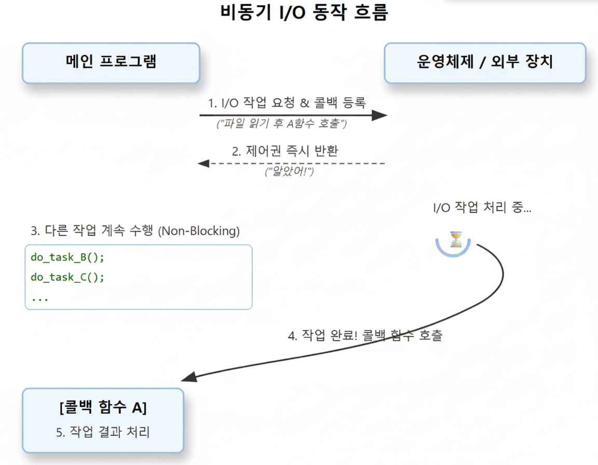

# C++ Boost.Asio로 만드는 온라인 게임 서버
저자: 최흥배, Claude AI   
    
권장 개발 환경
- **IDE**: Visual Studio 2022 (Community 이상)
- **컴파일러**: MSVC v143 (C++20 지원)
- **OS**: Windows 10 이상
- **도구**: Windows Performance Toolkit, Intel VTune (선택사항)

-----   

# Chapter 4. 비동기 I/O 모델 이해

## 4.1 비동기 I/O의 기본 개념
비동기 I/O는 I/O 작업을 시작한 후 즉시 제어권을 반환하고, 작업이 완료되면 미리 등록된 콜백 함수를 호출하는 방식이다.   
   
    
### 기본 비동기 패턴
비동기 작업은 다음 순서로 수행됩니다:
1. 비동기 작업 시작 (즉시 반환)
2. 다른 작업 계속 수행
3. 작업 완료 시 콜백 함수 호출

### 동기 vs 비동기 비교

**동기 방식 (Synchronous):**
```
socket.connect(endpoint);        // 블로킹
write(socket, buffer);           // 블로킹  
read(socket, response);          // 블로킹
process_response(response);
```

**비동기 방식 (Asynchronous):**
```
socket.async_connect(endpoint, [callback] {
    async_write(socket, buffer, [callback] {
        async_read(socket, response, [callback] {
            process_response(response);
        });
    });
});
```

### 프로액터 패턴 (Proactor Pattern)

**구조:**
```
┌─────────────┐    ┌──────────────┐    ┌─────────────┐
│   Client    │──▶│  Proactor    │───▶│  Handler    │
│             │    │ (io_context) │    │ (Callback)  │
└─────────────┘    └──────────────┘    └─────────────┘
       │                   │                   │
  1. async 요청      2. I/O 완료      3. 콜백 호출
```

**장점:**
- ✓ 높은 확장성 (수천 개의 동시 연결)
- ✓ 효율적인 자원 사용
- ✓ 단일 스레드에서 멀티플렉싱
- ✓ 논블로킹 I/O

  
```cpp
class AsyncIOConcepts {
public:
    void demonstrate_async_concept() {
        std::cout << "=== 비동기 I/O 개념 ===\n" << std::endl;
        basic_async_pattern();
        sync_vs_async_comparison();
    }
    
private:
    void basic_async_pattern() {
        std::cout << "1. 기본 비동기 패턴\n" << std::endl;
        
        boost::asio::io_context io_context;
        boost::asio::steady_timer timer(io_context, std::chrono::seconds(1));
        
        std::cout << "비동기 타이머 시작..." << std::endl;
        
        timer.async_wait([](boost::system::error_code ec) {
            if (!ec) {
                std::cout << "  → 타이머 완료! (콜백 함수 실행)" << std::endl;
            }
        });
        
        std::cout << "타이머 시작 후 즉시 실행되는 코드" << std::endl;
        io_context.run();
        std::cout << "모든 비동기 작업 완료\n" << std::endl;
    }
    
    void sync_vs_async_comparison() {
        std::cout << "2. 동기 vs 비동기 비교\n" << std::endl;
        simulate_execution_flow();
    }
    
    void simulate_execution_flow() {
        std::cout << "실행 흐름 시뮬레이션:" << std::endl;
        
        boost::asio::io_context io_context;
        
        for (int i = 1; i <= 3; ++i) {
            auto timer = std::make_shared<boost::asio::steady_timer>(
                io_context, std::chrono::milliseconds(i * 100));
            
            timer->async_wait([i, timer](boost::system::error_code ec) {
                if (!ec) {
                    std::cout << std::format("  작업 {} 완료 ({}ms 후)\n", 
                                           i, i * 100);
                }
            });
        }
        
        std::cout << "  모든 작업 시작됨 - 이벤트 루프 실행\n" << std::endl;
        io_context.run();
    }
        
};
```
   
코드 설명: 
* 이 클래스는 **비동기 프로그래밍의 핵심 개념**을 Boost.Asio를 통해 직관적으로 보여주는 학습용 코드다.
* 주요 포인트는 다음과 같다:
  * **비동기 작업은 즉시 반환되며** 콜백으로 완료를 처리한다.
  * **이벤트 루프(io_context.run)** 가 핵심이며, 등록된 작업의 실행 시점을 관리한다.
  * **동기 vs 비동기** 실행 흐름 차이를 명확히 시각화한다.
  * **Proactor 패턴**은 비동기 I/O의 설계 패턴으로, 이 코드가 그 기본적인 구조를 보여준다.
  
#### `demonstrate_async_concept()`
* 세 가지 주요 내용을 호출한다.

  1. `basic_async_pattern()` → 기본적인 비동기 타이머 사용법
  2. `sync_vs_async_comparison()` → 동기와 비동기의 실행 흐름 비교
    
즉, 비동기 프로그래밍의 여러 개념을 순차적으로 시연한다.
  
#### `basic_async_pattern()`
* 비동기 I/O의 가장 단순한 예제인 **비동기 타이머**를 보여준다.
* `boost::asio::steady_timer`를 이용하여 1초 후 실행되는 타이머를 설정한다.
* `timer.async_wait(...)`를 통해 콜백(callback) 함수를 등록한다.
* 콜백은 타이머가 만료되었을 때 실행된다.

**흐름 설명**:  
1. "비동기 타이머 시작..." 출력
2. `async_wait` 호출 시 **즉시 반환** → 메인 스레드가 블로킹되지 않음
3. "타이머 시작 후 즉시 실행되는 코드" 출력
4. `io_context.run()` 실행 → 이벤트 루프가 돌면서 등록된 비동기 이벤트를 처리
5. 1초 뒤 콜백 실행 → "타이머 완료!" 출력
6. 모든 이벤트가 처리된 후 → "모든 비동기 작업 완료" 출력

👉 동기식이라면 `sleep(1)`로 1초를 기다려야 하지만, 비동기식에서는 기다리는 동안 다른 작업을 수행할 수 있다는 차이를 보여준다.
  
#### `sync_vs_async_comparison()`
* 동기식(synchronous)과 비동기식(asynchronous)의 차이를 비교하기 위해 `simulate_execution_flow()`를 호출한다.
  
#### `simulate_execution_flow()`
* 3개의 비동기 타이머를 순차적으로 설정한다.
* 각각 100ms, 200ms, 300ms 후에 만료되도록 설정된다.
* `async_wait`를 통해 콜백 등록 → 타이머 만료 시점에 맞춰 "작업 N 완료" 메시지 출력
* `std::format`을 사용해 출력 메시지를 포맷팅한다.
  
**실행 흐름**:  
1. "모든 작업 시작됨 - 이벤트 루프 실행" 출력
2. 이벤트 루프 시작 (`io_context.run()`)
3. 100ms 후 작업 1 완료 출력
4. 200ms 후 작업 2 완료 출력
5. 300ms 후 작업 3 완료 출력
  
👉 동기식이라면 100ms + 200ms + 300ms = 600ms 순차 실행이지만, 비동기식에서는 **동시에 시작**되어 각자 완료되는 시점에 맞춰 콜백이 실행된다.
    
   
## 4.2 이벤트 기반 프로그래밍
비동기 I/O는 이벤트 기반 프로그래밍 모델을 사용한다.   

### 1. 이벤트 루프 (Event Loop) 개념
**이벤트 루프란?**
이벤트 루프는 비동기 프로그래밍의 핵심 메커니즘으로, 발생한 이벤트들을 지속적으로 감지하고 처리하는 무한 루프이다. 게임 서버, 웹 서버, GUI 애플리케이션 등에서 필수적으로 사용된다.  

**동작 원리:**
```
while (true) {
    // 1. 완료된 I/O 작업 확인
    auto completed_ops = check_completed_operations();
    
    // 2. 완료된 작업의 콜백 실행
    for (auto& op : completed_ops) {
        op.callback();
    }
    
    // 3. 새로운 I/O 작업 시작
    start_pending_operations();
    
    // 4. 대기 중인 작업이 없으면 종료
    if (no_more_work()) break;
}
```

**이벤트 루프의 장점:**
- **단일 스레드 멀티플렉싱**: 하나의 스레드로 여러 작업을 동시에 처리
- **자원 효율성**: 스레드 생성/전환 비용 감소
- **예측 가능한 실행 흐름**: 콜백이 순차적으로 실행됨
- **데드락 없음**: 단일 스레드이므로 락 경쟁 최소화

**주의사항:**
- 콜백 함수는 빠르게 실행되어야 함 (블로킹 금지)
- 긴 작업은 별도 스레드나 작업 큐로 분리 필요
- 콜백 내에서 예외 발생 시 이벤트 루프가 중단될 수 있음

  
### 2. 이벤트 큐와 처리 우선순위
**이벤트 큐의 역할:**
이벤트 큐는 발생한 이벤트들을 저장하고 순서대로 처리하는 FIFO(First In First Out) 구조이다. Boost.Asio에서는 `io_context`가 내부적으로 이벤트 큐를 관리한다.
 
**우선순위 체계:**
1. **완료된 I/O 작업 (최고 우선순위)**
   - 네트워크 소켓 읽기/쓰기 완료
   - 파일 I/O 완료
   - 실시간성이 중요한 작업

2. **타이머 만료 이벤트 (중간 우선순위)**
   - `async_wait()`로 등록된 타이머
   - 게임 틱, 주기적 작업
   - 지연된 작업 실행

3. **Post된 작업 (낮은 우선순위)**
   - `boost::asio::post()`로 등록된 작업
   - 일반적인 게임 로직
   - 백그라운드 작업
  
**처리 순서 예시:**
```
[이벤트 큐 상태]
Queue: [Post작업A] → [타이머B] → [I/O완료C] → [Post작업D]

[실행 순서]
1. I/O완료C (최고 우선순위)
2. 타이머B (중간 우선순위)
3. Post작업A (낮은 우선순위)
4. Post작업D (낮은 우선순위)
```
  
**우선순위가 중요한 이유:**
- **응답성**: I/O 완료를 먼저 처리하여 네트워크 지연 최소화
- **공정성**: 타이머 정확도 보장
- **안정성**: 중요한 작업이 밀리지 않도록 보장
  
  
### 3. 게임 서버 이벤트 모델

**게임 서버의 주요 이벤트 타입:**

**① 네트워크 이벤트**
- **연결 관리**: 클라이언트 접속/해제
- **메시지 수신**: 플레이어 입력, 채팅, 명령어
- **메시지 송신**: 게임 상태 동기화, 브로드캐스트
- **특징**: 높은 우선순위, 실시간 처리 필요

**② 타이머 이벤트**
- **게임 틱**: 월드 업데이트 (보통 20~60Hz)
  ```
  틱마다 수행:
  - 플레이어 위치 업데이트
  - AI 처리
  - 충돌 검사
  - 물리 시뮬레이션
  ```
- **스케줄링**: 버프/디버프 만료, 스폰 타이머
- **주기 작업**: DB 저장, 통계 수집

**③ 게임 로직 이벤트**
- **플레이어 액션**: 이동, 공격, 아이템 사용
- **NPC/몬스터 AI**: 경로 탐색, 상태 변경
- **게임 규칙**: 승리 조건 체크, 점수 계산
- **월드 이벤트**: 날씨 변화, 이벤트 발생

**④ 시스템 이벤트**
- **로깅**: 에러, 디버그 정보
- **모니터링**: 성능 메트릭, 서버 상태
- **관리**: 서버 재시작, 설정 리로드

**게임 서버 아키텍처 예시:**
```
┌─────────────────────────────────────────┐
│         이벤트 루프 (io_context)          │
│                                         │
│  ┌─────────────┐  ┌─────────────┐       │
│  │  네트워크    │  │   타이머     │       │
│  │   이벤트     │  │   이벤트     │       │
│  └──────┬──────┘  └──────┬──────┘       │
│         │                 │             │
│         ▼                 ▼             │
│  ┌─────────────────────────────┐        │
│  │     이벤트 핸들러 레이어       │        │
│  └──────────┬──────────────────┘        │
│             │                           │
│             ▼                           │
│  ┌─────────────────────────────┐        │
│  │      게임 로직 레이어         │        │
│  │  (월드, 플레이어, NPC 등)     │        │
│  └─────────────────────────────┘        │
└─────────────────────────────────────────┘
```

**게임 틱 처리 흐름:**
```
프레임 시작 (16ms @ 60FPS)
    ↓
1. 네트워크 입력 처리 (2ms)
   - 패킷 수신 및 파싱
   - 플레이어 입력 큐에 추가
    ↓
2. 게임 로직 업데이트 (10ms)
   - 입력 처리
   - 물리 시뮬레이션
   - AI 업데이트
   - 충돌 검사
    ↓
3. 네트워크 출력 처리 (3ms)
   - 상태 변경 수집
   - 패킷 생성 및 전송
    ↓
4. 대기 (1ms)
   - 다음 틱까지 유휴
    ↓
다음 프레임 시작
```

**이벤트 처리 최적화 팁:**
- **배치 처리**: 같은 타입의 이벤트를 모아서 처리
- **우선순위 조정**: 중요한 플레이어에게 우선 처리
- **이벤트 필터링**: 불필요한 이벤트 사전 제거
- **지연 처리**: 급하지 않은 작업은 다음 틱으로 연기

  
아래 코드는 `EventDrivenProgramming::demonstrate_event_model()``이 세 가지 데모를 순서대로 호출한다  
- 이벤트 루프 개념
- 이벤트 큐와 처리(우선순위/실행 순서 관점)
- 게임 서버 이벤트 모델
  
모든 예제는 단일 boost::asio::io_context를 사용하고, 비동기 작업을 등록한 뒤 io_context.run()으로 이벤트 루프를 돌려 핸들러들을 실행한다.      
```cpp
class EventDrivenProgramming {
public:
    void demonstrate_event_model() {
        std::cout << "=== 이벤트 기반 프로그래밍 ===\n" << std::endl;
        event_loop_concept();
        event_queue_processing();
        game_server_event_model();
    }
    
private:
    void event_loop_concept() {
        std::cout << "1. 이벤트 루프 개념\n" << std::endl;
        simulate_event_loop();
    }
    
    void simulate_event_loop() {
        std::cout << "이벤트 루프 시뮬레이션:" << std::endl;
        
        boost::asio::io_context io_context;
        
        register_network_event(io_context);
        register_timer_event(io_context);
        register_post_event(io_context);
        
        std::cout << "\n이벤트 루프 시작...\n" << std::endl;
        io_context.run();
        std::cout << "이벤트 루프 종료\n" << std::endl;
    }
    
    void register_network_event(boost::asio::io_context& io_context) {
        boost::asio::post(io_context, []() {
            std::cout << "  [네트워크] 클라이언트 연결 이벤트 처리" << std::endl;
        });
    }
    
    void register_timer_event(boost::asio::io_context& io_context) {
        auto timer = std::make_shared<boost::asio::steady_timer>(
            io_context, std::chrono::milliseconds(50));
        
        timer->async_wait([timer](boost::system::error_code ec) {
            if (!ec) {
                std::cout << "  [타이머] 게임 틱 이벤트 처리" << std::endl;
            }
        });
    }
    
    void register_post_event(boost::asio::io_context& io_context) {
        boost::asio::post(io_context, []() {
            std::cout << "  [Post] 게임 로직 이벤트 처리" << std::endl;
        });
    }
    
    void event_queue_processing() {
        std::cout << "2. 이벤트 큐와 처리\n" << std::endl;
        demonstrate_event_priority();
    }
    
    void demonstrate_event_priority() {
        std::cout << "이벤트 우선순위 데모:" << std::endl;
        
        boost::asio::io_context io_context;
        
        boost::asio::post(io_context, []() {
            std::cout << "  3) Post 작업 실행" << std::endl;
        });
        
        boost::asio::steady_timer timer(io_context, std::chrono::milliseconds(1));
        timer.async_wait([](boost::system::error_code ec) {
            if (!ec) {
                std::cout << "  2) 타이머 작업 실행" << std::endl;
            }
        });
        
        boost::asio::post(io_context, []() {
            std::cout << "  1) 즉시 완료 작업 실행" << std::endl;
        });
        
        io_context.run();
    }
    
    void game_server_event_model() {
        std::cout << "3. 게임 서버 이벤트 모델\n" << std::endl;
        
        GameServerEventHandler handler;
        handler.demonstrate();
    }
    
    class GameServerEventHandler {
    public:
        void demonstrate() {
            std::cout << "게임 서버 이벤트 처리 예제:" << std::endl;
            
            boost::asio::io_context io_context;
            
            schedule_game_tick(io_context);
            simulate_player_action(io_context);
            simulate_network_event(io_context);
            
            auto timer = std::make_shared<boost::asio::steady_timer>(
                io_context, std::chrono::milliseconds(200));
            
            timer->async_wait([&io_context, timer](boost::system::error_code ec) {
                io_context.stop();
            });
            
            io_context.run();
            std::cout << "게임 서버 이벤트 데모 완료\n" << std::endl;
        }
        
    private:
        void schedule_game_tick(boost::asio::io_context& io_context) {
            auto timer = std::make_shared<boost::asio::steady_timer>(
                io_context, std::chrono::milliseconds(16));
            
            timer->async_wait([this, &io_context, timer](boost::system::error_code ec) {
                if (!ec) {
                    std::cout << "  [게임틱] 월드 업데이트 실행" << std::endl;
                    schedule_game_tick(io_context);
                }
            });
        }
        
        void simulate_player_action(boost::asio::io_context& io_context) {
            boost::asio::post(io_context, []() {
                std::cout << "  [플레이어] 이동 액션 처리" << std::endl;
            });
        }
        
        void simulate_network_event(boost::asio::io_context& io_context) {
            boost::asio::post(io_context, []() {
                std::cout << "  [네트워크] 패킷 수신 처리" << std::endl;
            });
        }
    };
};
```
  
#### 이벤트 루프 개념: `event_loop_concept()` → `simulate_event_loop()`

```cpp
boost::asio::io_context io_context;

register_network_event(io_context); // post
register_timer_event(io_context);   // 50ms timer
register_post_event(io_context);    // post

io_context.run();
```

핵심 포인트:    
* `post`로 등록된 작업은 즉시 완료 상태로 **준비(ready)** 큐에 들어간다.
* `steady_timer::async_wait`는 지정 시간이 지난 후에 핸들러가 준비 큐에 들어간다.
* `io_context.run()`은 준비된 핸들러를 하나씩 꺼내 실행하고, 더 이상 처리할 핸들러가 없으면 반환한다.

  
각 등록 함수의 의미:  
* `register_network_event`
  * `boost::asio::post(io_context, ...)`로 “클라이언트 연결 이벤트 처리”를 큐에 넣는다.
  * 진짜 네트워크 I/O는 아니며, **네트워크 이벤트가 올라온 상황을 시뮬레이션**한다.
* `register_timer_event`
  * 50ms 타이머를 생성하고 `async_wait` 핸들러에서 “[타이머] 게임 틱 이벤트 처리”를 출력한다.
  * **`shared_ptr<steady_timer>`를 캡처**해 타이머 객체의 수명을 콜백까지 보장한다. 이 패턴이 없으면 타이머가 소멸되어 핸들러가 호출되지 않거나 취소될 수 있다.
* `register_post_event`
  * 또 하나의 `post` 작업을 추가한다.
  
실제 실행 순서(단일 스레드, 동일 executor 기준):  
1. `post`로 넣은 “[네트워크] …”가 먼저 실행된다
2. 그 다음 `post`로 넣은 “[Post] …”가 실행된다
3. 50ms 경과 후 타이머 핸들러 “[타이머] …”가 실행된다  
   동일 executor(여기서는 `io_context`)에서 **`post`된 작업들은 FIFO로 실행**되는 것이 보장된다. 타이머는 만료 시점에 큐에 들어가므로 그보다 먼저 큐에 있던 `post` 작업들이 선행 실행되는 것이 자연스럽다.
  

#### 이벤트 큐와 처리: `event_queue_processing()` → `demonstrate_event_priority()`

```cpp
boost::asio::post(io_context, []{ std::cout << "  3) Post 작업 실행\n"; });

boost::asio::steady_timer timer(io_context, 1ms);
timer.async_wait([]{ std::cout << "  2) 타이머 작업 실행\n"; });

boost::asio::post(io_context, []{ std::cout << "  1) 즉시 완료 작업 실행\n"; });

io_context.run();
```
  
의도:  
* “우선순위”라는 말을 쓰지만, Boost.Asio는 **우선순위 스케줄러가 아니다**.
* 동일 executor에서 **준비된 핸들러는 FIFO**로 실행되며, 타이머 핸들러는 만료 후 큐에 들어가므로 보통 `post`된 작업들보다 **나중**에 실행된다.
  

기대 가능한 출력 순서:  
* 대개 다음 순서가 된다:
  `3) Post 작업 실행` → `1) 즉시 완료 작업 실행` → (1ms 뒤) `2) 타이머 작업 실행`
* 여기서 “1) 즉시 완료”라는 문구는 **메시지에 붙인 이름일 뿐**, 실제로 **나중에 `post`된 작업이 앞선 `post`보다 먼저 실행되지는 않는다**. 두 `post`는 FIFO로 3) 다음 1) 순서로 실행되는 것이 정상이다.
  
실무 팁:  
* 다중 스레드에서 하나의 `io_context`를 여러 스레드로 `run()`하면, **동시성**으로 인해 작업 간 상호배제가 필요하다. 이때 **`strand`(executor)**를 사용해 특정 작업 집합의 **직렬화**를 보장하는 것이 일반적이다.
* 동일 strand에 제출된 핸들러들은 스레드가 여러 개여도 **항상 순서대로** 실행된다.

  
#### 게임 서버 이벤트 모델: `game_server_event_model()`
내부 클래스 `GameServerEventHandler`가 실제 게임 서버 루프 축소판을 흉내 낸다.

`demonstrate()`  
```cpp
schedule_game_tick(io_context);
simulate_player_action(io_context); // post: 플레이어 입력 처리
simulate_network_event(io_context); // post: 패킷 수신 처리

// 200ms 뒤 이벤트 루프 종료
auto timer = std::make_shared<steady_timer>(io_context, 200ms);
timer->async_wait([&io_context, timer](...) { io_context.stop(); });

io_context.run();
```

* **게임 틱**을 스케줄링하고, 플레이어 액션과 네트워크 이벤트를 `post`로 넣는다.
* 200ms 타이머가 만료되면 `io_context.stop()`을 호출해 데모를 종료한다.

> 참고: `io_context.stop()`은 **비동기 연산을 취소하지는 않지만** 더 이상 핸들러를 디스패치하지 않도록 루프를 중단시키는 신호를 준다. 보통 종료 절차에서 `stop()` → 필요한 자원 정리 → `restart()`(필요 시) 순으로 사용한다.


`schedule_game_tick(io_context)`

```cpp
auto timer = std::make_shared<steady_timer>(io_context, 16ms); // 약 60 FPS
timer->async_wait([this, &io_context, timer](...) {
  if (!ec) {
    std::cout << "  [게임틱] 월드 업데이트 실행\n";
    schedule_game_tick(io_context); // 재귀 재스케줄
  }
});
```

* **16ms 주기**로 게임 틱을 반복 등록해 60FPS에 가까운 **월드 업데이트 루프**를 만든다.
* 타이머를 `shared_ptr`로 캡처해 수명을 보장한다.
* 이 패턴은 간단하고 안전하지만, **드리프트**가 누적될 수 있다. 핸들러 실행 시간이 16ms를 넘거나 지연되면 점점 틱 타이밍이 밀릴 수 있다. 드리프트를 줄이려면 다음처럼 **다음 만료 시각을 누적해서 예약**하는 것이 좋다.

  * 예: `next += 16ms; timer->expires_at(next); timer->async_wait(...);`

`simulate_player_action` / `simulate_network_event`  
* 둘 다 `post`를 사용해 “[플레이어] 이동 액션 처리”, “[네트워크] 패킷 수신 처리”를 큐에 넣는다.
* 실제 서버에서는 소켓의 `async_read_some`/`async_accept` 등 **진짜 비동기 I/O** 핸들러가 이 역할을 담당한다.


#### 메모리·수명·예외에 대한 주의점
* **타이머 수명**: 예제처럼 타이머를 `std::shared_ptr`로 소유하고, 핸들러에서 그 포인터를 캡처해야 콜백 시점까지 살아있다. 지역 변수 타이머는 범위를 벗어나면 취소될 수 있다.
* **`this` 캡처**: `schedule_game_tick`은 `[this, &io_context, timer]`를 캡처한다. 해당 객체가 루프보다 먼저 소멸되면 **use-after-free** 위험이 있다. 본 예제는 `demonstrate()` 스코프가 끝나기 전에 200ms에 `stop()`하므로 안전하지만, 실제 코드에서는 객체 수명을 명시적으로 보장해야 한다.
* **예외 처리**: 핸들러 내부에서 예외가 던져지면 `run()`이 예외로 빠져나올 수 있다. 서버에서는 핸들러 최상단에서 **예외를 반드시 잡고 로깅** 후 복구해야 한다.

   
#### `post`/`dispatch`/`defer` 차이 요약
* **`post`**: 항상 비동기적으로 큐에 넣는다. 현재 스레드에서 **즉시 실행하지 않는다**.
* **`dispatch`**: 같은 executor의 실행 컨텍스트 안이라면 **즉시** 실행될 수 있고, 아니면 큐에 넣는다.
* **`defer`**: 비동기 실행을 요청하지만, 이미 준비된 다른 핸들러들이 먼저 실행될 기회를 주는 힌트를 제공한다. 미세한 스케줄링 튜닝에 쓰인다.

 
#### 멀티스레드 확장과 `strand`
* `io_context`를 여러 스레드에서 `run()`하면 핸들러들이 병렬로 실행될 수 있다.
* **공유 게임 상태**(월드, 세션 컨테이너 등)를 안전하게 다루려면 `boost::asio::strand<executor_type>`로 **핸들러 직렬화**를 보장하거나, 명확한 락 전략을 사용해야 한다.
  
  
#### 운영 팁
* **루프 유지를 위한 work guard**: 이벤트가 일시적으로 하나도 없을 때 `run()`이 곧바로 반환되는 것을 막으려면 `auto guard = boost::asio::make_work_guard(io_context);`를 사용한다. 필요 없을 때 `guard.reset()`로 해제한다.
* **부하 분리**: 무거운 연산(경로 탐색, 대용량 직렬화 등)은 핸들러에서 직접 수행하지 말고, 전용 스레드 풀로 넘기거나 비동기 작업으로 쪼개 **틱 지터**를 줄인다.
* **타이머 취소/종료**: 종료 시에는 `io_context.stop()` 외에도 각 타이머/소켓을 명시적으로 `cancel()`하거나, 재스케줄을 중단하는 플래그를 두는 방식이 안전하다.


## 4.3 비동기 작업의 생명주기
Boost.Asio의 **비동기 작업이 생성되고 완료되기까지의 생명주기(lifecycle)**를 단계별로 살펴본다.
  
### 1. 작업 요청 (Initiation)
비동기 작업은 **요청 단계**에서 시작된다.
예를 들어 다음과 같이 타이머 이벤트를 등록한다고 하자:

```cpp
boost::asio::steady_timer timer(io_context, std::chrono::seconds(1));
timer.async_wait([](const boost::system::error_code& ec) {
    if (!ec) {
        std::cout << "타이머 완료!" << std::endl;
    }
});
```

* `async_wait` 호출 시 **즉시 반환**한다.
* 반환 시점에는 작업이 완료되지 않았으며, 단지 **작업이 이벤트 큐에 등록**되었을 뿐이다.
* 이때 콜백 핸들러(람다 함수)는 “작업 완료 시 실행해야 할 동작”으로 예약된다.

👉 생명주기의 첫 단계는 “비동기 연산 요청 + 콜백 등록”이다.

  
### 2. 대기 상태 (Pending State)
* 등록된 비동기 작업은 **OS 커널** 또는 **Boost.Asio 내부 스케줄러**가 관리한다.
* 예를 들어 소켓 읽기라면 커널 레벨에서 데이터 도착을 기다리고, 타이머라면 지정 시간이 경과할 때까지 대기한다.
* 이 단계에서 **사용자 코드 실행은 즉시 이어서 진행**될 수 있으며, 작업은 백그라운드에서 준비된다.

👉 동기식 코드와 달리, 애플리케이션은 블로킹 없이 다른 일을 수행할 수 있다.


### 3. 준비 완료 (Ready State)
* 요청된 조건이 충족되면, 즉 **데이터가 도착하거나, 타이머가 만료되거나, I/O가 끝나면** 작업이 준비 완료 상태가 된다.
* 준비 완료된 작업은 `io_context`의 이벤트 큐에 핸들러를 넣는다.
* 아직 실행된 것은 아니며, **큐에 들어간 상태**다.


### 4. 실행 (Dispatch & Run)
* `io_context.run()`이 호출되면 이벤트 루프가 돌면서 큐에 있는 핸들러를 꺼내 실행한다.
* 준비된 순서대로 실행되며, 실행 시 등록했던 콜백 함수가 호출된다.

예시 흐름:

```cpp
io_context.run();
// → 타이머 만료 → 큐에 콜백 등록 → 이벤트 루프가 콜백 실행
```

👉 이 단계에서 비동기 작업은 **비로소 완료된 결과를 애플리케이션 코드로 전달**한다.


### 5. 완료와 정리 (Completion & Cleanup)
* 핸들러가 실행된 후 작업은 생명주기를 마친다.
* 만약 작업을 취소(`cancel()`)하거나 `io_context.stop()`을 호출하면 아직 완료되지 않은 작업들도 정리된다.
* 작업 객체(`steady_timer`, `socket` 등)의 수명이 짧으면 콜백이 호출되기 전에 파기될 수 있으므로, **수명 관리(shared_ptr 캡처)**가 중요하다.

  
### 6. 반복 / 재스케줄 (Rescheduling)
게임 서버나 지속적인 서비스에서는 단발성 이벤트로 끝나지 않는다.

* 주기적 타이머 → 매 틱마다 `async_wait` 재호출
* 지속적인 소켓 통신 → `async_read_some` 완료 후 다시 `async_read_some` 등록

즉, **비동기 작업의 생명주기**는 단일 이벤트에서 끝나기도 하지만, 보통은 **다음 이벤트 등록 → 대기 → 실행** 과정을 반복한다.
  

### 7. 정리
Boost.Asio의 비동기 작업은 다음과 같은 생명주기를 가진다:

1. **작업 요청**: `async_*` 계열 함수 호출, 콜백 등록
2. **대기 상태**: OS/스케줄러에서 완료를 기다림
3. **준비 완료**: 완료 조건 충족 → 이벤트 큐에 콜백 등록
4. **실행**: `io_context.run()`에서 큐의 콜백 실행
5. **완료/정리**: 작업 종료, 필요 시 자원 해제
6. **재스케줄**: 지속적인 서비스라면 새로운 작업 재등록

이 생명주기를 이해하면, 이벤트 기반 서버 설계 시 **작업의 흐름을 예측하고 안정적으로 동작하게 만들 수 있다**. 특히 게임 서버나 네트워크 서버에서는 “작업의 등록과 완료”의 구분, “수명 관리(shared_ptr, strand)”의 중요성을 반드시 고려해야 한다.

  
  
  

  
