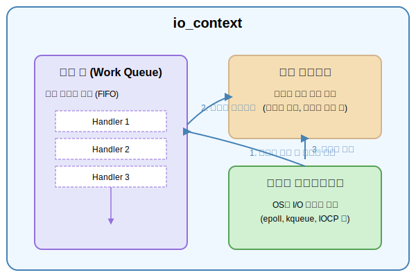

# C++ Boost.Asio로 만드는 온라인 게임 서버
저자: 최흥배, Claude AI   
    
권장 개발 환경
- **IDE**: Visual Studio 2022 (Community 이상)
- **컴파일러**: MSVC v143 (C++20 지원)
- **OS**: Windows 10 이상
- **도구**: Windows Performance Toolkit, Intel VTune (선택사항)

-----   

# Chapter 5. io_context와 이벤트 루프

## 5.1 io_context의 역할과 구조
`io_context`는 Boost.Asio 라이브러리의 핵심 구성 요소로, 비동기 I/O 작업의 중앙 조정자 역할을 수행한다. 모든 비동기 작업은 `io_context`를 통해 등록되고 실행되며, 이벤트 루프를 통해 완료된 작업의 핸들러를 호출한다.
  
`io_context`는 운영체제의 I/O 멀티플렉싱 메커니즘(Linux의 epoll, Windows의 IOCP 등)을 추상화하여 플랫폼 독립적인 인터페이스를 제공한다. 개발자는 운영체제별 차이를 신경 쓰지 않고 동일한 코드로 다양한 플랫폼에서 비동기 프로그래밍을 구현할 수 있다.
  
### io_context의 내부 구조
`io_context`는 크게 세 가지 주요 구성 요소로 이루어져 있다.

**작업 큐(Work Queue)** 는 실행 대기 중인 핸들러들을 저장한다. 비동기 작업이 완료되면 해당 작업의 완료 핸들러가 이 큐에 추가된다. 큐는 FIFO 방식으로 동작하지만, 우선순위나 스트랜드에 따라 순서가 조정될 수 있다.
  
**이벤트 디멀티플렉서(Event Demultiplexer)** 는 운영체제의 I/O 이벤트 알림 메커니즘과 상호작용한다. 파일 디스크립터나 소켓에서 읽기/쓰기가 가능해지거나, 타이머가 만료되는 등의 이벤트를 감지하여 `io_context`에 알린다.

**실행 컨텍스트(Execution Context)** 는 핸들러 실행에 필요한 환경을 제공한다. 메모리 할당, 예외 처리, 스레드 컨텍스트 등을 관리하며, 핸들러가 안전하게 실행될 수 있도록 보장한다.
  
  
① 이벤트 디멀티플렉서 (Event Demultiplexer): 운영체제(OS)로부터 비동기 I/O 작업(예: 소켓 데이터 수신)의 완료와 같은 이벤트를 감지한다.

② 작업 큐 (Work Queue): 이벤트가 발생하면, 해당 이벤트 처리를 위해 예약된 **완료 핸들러(completion handler)**가 작업 큐에 들어간다. 이 큐는 일반적으로 FIFO(선입선출) 방식으로 동작한다.

③ 실행 컨텍스트 (Execution Context): io_context::run()과 같은 함수를 호출한 스레드는 실행 컨텍스트의 일부가 된다. 이 스레드는 작업 큐를 감시하다가 실행할 핸들러가 있으면 큐에서 꺼내어 실행한다.

간단히 말해, 이벤트 디멀티플렉서가 OS로부터 "일 끝났어!"라는 신호를 받으면, 관련된 핸들러를 작업 큐에 넣는다. 그러면 실행 컨텍스트에서 대기하던 스레드가 그 핸들러를 가져와 실행하는 흐름이다.
  
    
### io_context의 생명주기
`io_context`의 생명주기는 생성, 작업 등록, 실행, 종료의 네 단계로 구분된다.

생성 단계에서는 `io_context` 객체를 인스턴스화한다. 이때 운영체제별 I/O 멀티플렉싱 메커니즘이 초기화되고, 내부 자료구조가 준비된다. 생성자에 정수를 전달하여 동시성 힌트를 제공할 수 있지만, 대부분의 경우 기본 생성자를 사용한다.  
  
작업 등록 단계에서는 비동기 작업들을 `io_context`에 등록한다. `async_read`, `async_write`, `async_wait` 등의 함수를 호출하면 내부적으로 작업이 등록되고, 운영체제에 I/O 이벤트 모니터링을 요청한다. 이 시점에서는 아직 어떤 작업도 실행되지 않는다.

실행 단계에서는 `run()`, `poll()`, `run_one()` 등의 멤버 함수를 호출하여 이벤트 루프를 시작한다. 이벤트 루프는 I/O 이벤트를 기다리고, 완료된 작업의 핸들러를 작업 큐에서 꺼내어 실행한다. 이 과정은 더 이상 처리할 작업이 없거나 명시적으로 중단될 때까지 반복된다.

종료 단계에서는 `stop()` 함수를 호출하거나 모든 작업이 완료되면 이벤트 루프가 종료된다. `io_context` 객체가 소멸되면 내부 리소스가 정리되고, 운영체제에 할당받은 자원이 반환된다.
  

### run() 계열 함수의 동작 방식
`io_context`는 여러 가지 방식으로 이벤트 루프를 실행할 수 있는 함수들을 제공한다.

`run()` 함수는 가장 기본적인 실행 방식이다. 작업 큐에 처리할 핸들러가 있거나 미완료된 비동기 작업이 있는 동안 블로킹 상태로 대기하며 핸들러를 실행한다. 모든 작업이 완료되면 자동으로 반환된다. 이 함수는 처리된 핸들러의 개수를 반환한다.

`run_one()` 함수는 작업 큐에서 핸들러를 하나만 실행하고 반환된다. 실행할 핸들러가 없으면 핸들러가 큐에 추가될 때까지 블로킹된다. 이 함수는 정확히 하나의 핸들러를 실행할 때 유용하다.

`poll()` 함수는 논블로킹 방식으로 동작한다. 현재 준비된 모든 핸들러를 실행하고 즉시 반환된다. 실행할 핸들러가 없어도 블로킹되지 않으므로, 다른 작업과 병행하여 주기적으로 이벤트를 처리할 때 사용한다.

`poll_one()` 함수는 논블로킹 방식으로 핸들러를 하나만 실행한다. 실행할 핸들러가 없으면 블로킹하지 않고 즉시 0을 반환한다.

`run_for(duration)` 함수는 지정된 시간 동안만 이벤트 루프를 실행한다. 시간이 초과되거나 모든 작업이 완료되면 반환된다.

`run_until(time_point)` 함수는 특정 시점까지만 이벤트 루프를 실행한다.
  

### 작업 큐와 핸들러 실행 순서
`io_context`의 작업 큐는 기본적으로 FIFO 순서로 핸들러를 실행하지만, 몇 가지 예외 상황이 있다.

같은 비동기 작업 체인에서 연속적으로 등록된 핸들러들은 순서가 보장된다. 예를 들어 `async_read` 완료 핸들러 내부에서 다시 `async_write`를 호출하면, 쓰기 작업의 핸들러는 읽기 핸들러 이후에 실행된다.

그러나 독립적으로 등록된 여러 비동기 작업들의 핸들러 실행 순서는 보장되지 않는다. 두 개의 타이머를 동시에 시작하면, 먼저 만료되는 타이머의 핸들러가 먼저 실행되지만, 거의 동시에 만료되는 경우 실행 순서는 운영체제에 따라 달라질 수 있다.

스트랜드를 사용하면 핸들러 실행 순서를 제어할 수 있다. 같은 스트랜드에 등록된 핸들러들은 절대로 동시에 실행되지 않으며, 등록된 순서대로 순차적으로 실행된다.

### 멀티스레드 환경에서의 io_context
하나의 `io_context`를 여러 스레드에서 동시에 실행할 수 있다. 각 스레드에서 `run()`을 호출하면 작업 큐의 핸들러들이 여러 스레드에 분산되어 실행된다. 이를 통해 멀티코어 시스템에서 처리량을 향상시킬 수 있다.

```cpp
boost::asio::io_context io_context;

// 여러 스레드에서 io_context 실행
std::vector<std::thread> threads;
for (int i = 0; i < 4; ++i) {
    threads.emplace_back([&io_context]() {
        io_context.run();
    });
}

for (auto& thread : threads) {
    thread.join();
}
```

그러나 멀티스레드 환경에서는 데이터 경쟁 문제에 주의해야 한다. 여러 핸들러가 동시에 실행될 수 있으므로, 공유 데이터에 접근할 때는 뮤텍스나 스트랜드를 사용하여 동기화해야 한다.
  
### work 가드와 io_context의 수명 관리
`io_context::run()`은 더 이상 처리할 작업이 없으면 자동으로 반환된다. 그러나 비동기 작업이 등록되기 전에 `run()`이 반환되는 것을 방지하려면 work 가드를 사용해야 한다.

```cpp
boost::asio::io_context io_context;

// work 가드 생성 - io_context가 종료되지 않도록 보호
auto work_guard = boost::asio::make_work_guard(io_context);

std::thread thread([&io_context]() {
    io_context.run(); // work 가드가 있는 동안 블로킹됨
});

// 나중에 비동기 작업 등록
boost::asio::steady_timer timer(io_context, std::chrono::seconds(1));
timer.async_wait([](boost::system::error_code) {
    std::cout << "타이머 완료" << std::endl;
});

// work 가드 해제
work_guard.reset();

thread.join();
```

work 가드는 `io_context`에 미완료 작업이 있는 것처럼 취급되게 만든다. `reset()`을 호출하여 가드를 해제하면, 실제 작업이 모두 완료될 때 `run()`이 반환된다.

### restart와 stopped 상태
`io_context`는 `run()`이 반환된 후 stopped 상태가 된다. stopped 상태에서는 `run()`을 다시 호출해도 즉시 반환된다. `io_context`를 재사용하려면 **`restart()`** 함수를 호출하여 stopped 상태를 해제해야 한다.

```cpp
boost::asio::io_context io_context;

// 첫 번째 실행
boost::asio::steady_timer timer1(io_context, std::chrono::seconds(1));
timer1.async_wait([](boost::system::error_code) {});
io_context.run(); // 타이머 완료 후 반환됨

// io_context는 stopped 상태

// 재시작
io_context.restart();

// 두 번째 실행
boost::asio::steady_timer timer2(io_context, std::chrono::seconds(1));
timer2.async_wait([](boost::system::error_code) {});
io_context.run(); // 정상적으로 실행됨
```

`stopped()` 함수를 호출하면 현재 `io_context`가 stopped 상태인지 확인할 수 있다. 이는 이벤트 루프의 상태를 점검하는 데 유용하다.
    

### executor와 io_context
C++11 이후 Boost.Asio는 executor 개념을 도입했다. `io_context`는 executor를 제공하는 실행 컨텍스트로 동작한다. `get_executor()` 함수를 통해 executor를 얻을 수 있으며, 이를 사용하여 핸들러를 실행 컨텍스트에 게시할 수 있다.

```cpp
boost::asio::io_context io_context;
auto executor = io_context.get_executor();

// executor를 사용하여 핸들러 게시
boost::asio::post(executor, []() {
    std::cout << "핸들러 실행" << std::endl;
});

io_context.run();
```

executor 추상화는 코드의 재사용성을 높이고, 다양한 실행 정책을 유연하게 적용할 수 있게 한다. 비동기 작업을 특정 `io_context`에 종속시키지 않고, executor를 통해 실행 컨텍스트를 주입할 수 있다.

### io_context와 성능 최적화
`io_context`를 효율적으로 사용하면 애플리케이션의 성능을 크게 향상시킬 수 있다.

CPU 바운드 작업과 I/O 바운드 작업을 분리하는 것이 중요하다. 하나의 `io_context`에서 무거운 연산을 수행하면 다른 I/O 작업의 응답성이 떨어진다. 별도의 스레드 풀이나 `io_context`를 사용하여 CPU 집약적 작업을 처리하는 것이 좋다.

적절한 스레드 수를 선택해야 한다. 너무 많은 스레드는 컨텍스트 스위칭 오버헤드를 증가시키고, 너무 적은 스레드는 멀티코어를 충분히 활용하지 못한다. 일반적으로 CPU 코어 수만큼의 스레드를 사용하는 것이 권장된다.

핸들러 내부에서 블로킹 작업을 피해야 한다. 핸들러가 블로킹되면 해당 스레드가 다른 핸들러를 실행하지 못하므로, 전체 시스템의 처리량이 감소한다. 블로킹이 필요한 작업은 별도의 스레드 풀로 오프로드해야 한다.

핸들러의 실행 시간을 짧게 유지해야 한다. 하나의 핸들러가 오래 실행되면 작업 큐에 쌓인 다른 핸들러들의 대기 시간이 늘어난다. 복잡한 처리는 여러 단계로 나누어 비동기적으로 수행하는 것이 좋다.

### 정리
**`io_context`는 Boost.Asio 비동기 프로그래밍의 중심축**이다. 운영체제의 I/O 멀티플렉싱을 추상화하고, 작업 큐를 관리하며, 핸들러 실행 환경을 제공한다. `run()` 계열 함수를 통해 이벤트 루프를 실행하고, 멀티스레드 환경에서 확장 가능한 서버를 구축할 수 있다. work 가드, restart, executor 등의 고급 기능을 활용하면 더욱 정교한 비동기 시스템을 설계할 수 있다. `io_context`의 내부 동작을 이해하고 적절히 활용하는 것이 효율적인 비동기 애플리케이션 개발의 핵심이다.
  
  

## 5.2 멀티스레드와 io_context

### io_context의 스레드 안전성
Boost.Asio의 `io_context`는 멀티스레드 환경에서 안전하게 사용할 수 있도록 설계되었다. 여러 스레드가 동시에 `io_context::run()`을 호출하여 비동기 작업을 처리할 수 있으며, 이를 통해 CPU 코어를 효율적으로 활용할 수 있다.

### 멀티스레드 실행 모델
가장 일반적인 멀티스레드 패턴은 여러 스레드가 하나의 `io_context` 인스턴스에서 `run()`을 호출하는 것이다. 이 경우 각 스레드는 대기 중인 비동기 작업의 완료 핸들러를 경쟁적으로 가져와 실행한다.

```cpp
boost::asio::io_context io_context;

// 여러 스레드에서 동시에 run() 호출
std::vector<std::thread> threads;
for (int i = 0; i < 4; ++i) {
    threads.emplace_back([&io_context]() {
        io_context.run();
    });
}

// 모든 스레드 종료 대기
for (auto& thread : threads) {
    thread.join();
}
```

이 방식의 장점은 작업 부하가 자동으로 여러 스레드에 분산된다는 점이다. 한 스레드가 블로킹되거나 긴 작업을 수행하더라도 다른 스레드가 계속해서 작업을 처리할 수 있다.

### 핸들러 동시 실행과 동기화
멀티스레드 환경에서는 여러 핸들러가 동시에 실행될 수 있다. 따라서 공유 데이터에 접근하는 핸들러는 적절한 동기화가 필요하다.

```cpp
class Session {
    std::mutex mutex_;
    std::string data_;
    
public:
    void handle_read(const boost::system::error_code& error, size_t bytes) {
        std::lock_guard<std::mutex> lock(mutex_);
        // data_에 안전하게 접근
        data_.append(buffer_, bytes);
    }
};
```

그러나 매번 뮤텍스를 사용하는 것은 성능 저하를 초래할 수 있다. Boost.Asio는 이를 해결하기 위해 `strand`를 제공한다.

### strand를 통한 직렬화
`strand`는 핸들러의 실행을 직렬화하는 메커니즘이다. 동일한 `strand`에 포스팅된 핸들러들은 절대 동시에 실행되지 않으며, 포스팅된 순서대로 실행된다.

```cpp
boost::asio::io_context io_context;
boost::asio::io_context::strand strand(io_context);

void handler1() {
    std::cout << "Handler 1" << std::endl;
}

void handler2() {
    std::cout << "Handler 2" << std::endl;
}

// strand를 통해 핸들러 포스팅
boost::asio::post(strand, handler1);
boost::asio::post(strand, handler2);
```

`strand`를 사용하면 명시적인 락 없이도 스레드 안전성을 보장할 수 있다. 특히 소켓이나 타이머 같은 객체별로 `strand`를 할당하면, 해당 객체의 모든 핸들러가 직렬화되어 실행된다.

```cpp
class Connection {
    boost::asio::io_context::strand strand_;
    boost::asio::ip::tcp::socket socket_;
    
public:
    Connection(boost::asio::io_context& io_context)
        : strand_(io_context)
        , socket_(io_context) {}
    
    void async_read_some() {
        socket_.async_read_some(
            buffer_,
            boost::asio::bind_executor(
                strand_,
                [this](auto error, auto bytes) {
                    // 이 핸들러는 strand_를 통해 직렬화됨
                    handle_read(error, bytes);
                }
            )
        );
    }
};
```
  

### 멀티 io_context 패턴
또 다른 접근 방식은 여러 개의 `io_context` 인스턴스를 사용하는 것이다. 각 스레드가 자신만의 `io_context`를 가지며, 소켓이나 타이머 같은 I/O 객체를 특정 `io_context`에 할당한다.

```cpp
std::vector<boost::asio::io_context> io_contexts(4);
std::vector<std::thread> threads;

for (auto& io_context : io_contexts) {
    threads.emplace_back([&io_context]() {
        io_context.run();
    });
}
```

이 패턴은 각 `io_context`가 독립적으로 동작하므로 락 경합이 줄어들지만, 작업 부하를 수동으로 분산해야 하는 단점이 있다.
  

### 성능 고려사항
멀티스레드를 사용할 때는 다음 사항들을 고려해야 한다:

- **스레드 개수**: 일반적으로 CPU 코어 수만큼의 스레드를 사용하는 것이 적절하다. 너무 많은 스레드는 컨텍스트 스위칭 오버헤드를 증가시킨다.

- **작업 특성**: CPU 집약적 작업이 많다면 멀티스레드가 효과적이지만, I/O 대기 시간이 대부분이라면 단일 스레드로도 충분할 수 있다.

- **동기화 비용**: `strand`를 사용하면 동기화 오버헤드가 발생한다. 공유 상태가 없는 경우에는 `strand` 없이 사용하는 것이 더 효율적이다.

- **False sharing**: 여러 스레드가 같은 캐시 라인에 있는 다른 데이터를 수정하면 성능이 저하될 수 있다. 객체를 적절히 패딩하여 이를 방지할 수 있다.

멀티스레드 환경에서 Boost.Asio를 효과적으로 사용하려면 애플리케이션의 특성과 요구사항을 정확히 파악하고, 적절한 동기화 전략을 선택해야 한다.
  

</br>   
</br>   
</br>   
    

# 추가: Socket 객체의 close 함수의 스레드 세이프 
  
## 1. Boost.Asio의 스레드 세이프 규칙
Boost.Asio 문서에 따르면:

* **동일한 I/O 객체(socket, timer 등)에 대해 동시에 여러 스레드가 접근하는 것은 원칙적으로 안전하지 않다.**
* 단, 아래와 같은 경우는 허용된다:

  * 서로 다른 객체에 대한 동시 호출
  * 같은 객체라도 `const` 멤버 함수 호출
* 즉, 소켓과 같은 **mutable한 작업**(`async_read`, `async_write`, `close`)을 여러 스레드에서 동시에 호출하는 것은 안전하지 않다.


## 2. `close()` 함수의 특성
* `close()`는 내부적으로 소켓 핸들을 종료하고, 대기 중인 비동기 작업들을 모두 취소한다.
* 이 과정에서 커널 리소스 해제, 큐에 등록된 핸들러의 취소, 에러 코드 전달 등이 일어난다.
* 따라서 `close()` 자체는 **mutable state**를 변경하는 연산이다.


## 3. 스레드 세이프 보장 여부
* Boost.Asio 공식 문서에서도 **`close()`는 스레드 세이프하지 않다**고 명시한다.
* 같은 소켓 객체에 대해 **동시에 `close()`를 여러 스레드에서 호출하면 race condition**이 발생할 수 있다.

  * 예: 두 스레드가 동시에 `close()` → 하나는 핸들을 닫고, 다른 하나는 이미 닫힌 핸들을 다시 닫으려고 시도
  * 이는 OS 레벨 소켓 API에서도 undefined behavior일 수 있다.


## 4. 안전한 사용 방법
1. **단일 스레드에서 소켓 종료 담당**

   * 소켓을 관리하는 스레드를 정하고, `close()`는 반드시 그 스레드에서만 호출하도록 한다.
   * 예: I/O 스레드(이벤트 루프를 돌리는 스레드)에서만 close 실행

2. **strand 사용**

   * `boost::asio::strand`를 사용해 소켓에 대한 연산(읽기/쓰기/close)을 직렬화한다.
   * 이를 통해 동시 접근을 방지한다.

3. **`cancel()`과 `close()` 분리 고려**

   * 여러 스레드에서 안전하게 소켓 연산을 중단하려면 `cancel()`을 활용하고, 실제 `close()`는 관리 스레드에서 실행하도록 패턴을 짜는 것이 일반적이다.


## 5. 요약
* `socket.close()`는 **스레드 세이프하지 않다**.
* 하나의 소켓 객체에 대해 여러 스레드가 동시에 `close()`를 호출하면 동시성 문제가 발생할 수 있다.
* 안전하게 사용하려면 **strand를 통해 직렬화하거나, 특정 I/O 스레드에서만 close를 호출하는 구조**를 가져가야 한다.

 

# 추가: 멀티스레드 환경에서 안전한 소켓 종료 패턴

## 1. 기본 원칙
* **동일 소켓 객체에 대해 동시에 `close()`를 호출하는 것은 금지**해야 한다. (`close()`는 스레드 세이프하지 않다)
* 소켓 종료는 **I/O 스레드(이벤트 루프가 돌아가는 곳)** 에서 처리하도록 패턴을 잡는 것이 안정적이다.
* 다른 스레드에서 소켓을 종료하고 싶다면 직접 `close()`를 호출하지 말고, `post` 또는 `dispatch`를 통해 **이벤트 루프에 종료 요청**을 넣어야 한다.


## 2. 안전한 종료 패턴

### (1) strand 직렬화 방식

```cpp
boost::asio::io_context io_context;
boost::asio::ip::tcp::socket socket(io_context);
boost::asio::strand<boost::asio::io_context::executor_type> strand(io_context.get_executor());

// 안전한 close 함수
void safe_close() {
    boost::asio::post(strand, [&]() {
        if (socket.is_open()) {
            boost::system::error_code ec;
            socket.close(ec);
            std::cout << "소켓 안전하게 종료됨\n";
        }
    });
}
```

* 모든 소켓 관련 작업(읽기, 쓰기, 종료)을 `strand`를 통해 직렬화한다.
* 여러 스레드에서 동시에 `safe_close()`를 호출하더라도, strand가 보장하므로 **동시에 close가 실행되지 않는다**.


### (2) post 방식 (단일 I/O 스레드에 close 위임)

```cpp
boost::asio::io_context io_context;
boost::asio::ip::tcp::socket socket(io_context);

// 외부 스레드에서 호출하는 함수
void request_close() {
    boost::asio::post(io_context, [&]() {
        if (socket.is_open()) {
            boost::system::error_code ec;
            socket.close(ec);
            std::cout << "소켓 안전하게 종료됨\n";
        }
    });
}
```

* 외부 스레드가 직접 `close()`를 호출하지 않고, `post`를 이용해 `io_context` 루프 안에서 실행되도록 한다.
* 이렇게 하면 모든 소켓 종료 동작은 I/O 스레드 하나에서만 실행된다.


### (3) cancel과 close 분리
* 일부 상황에서는 **`cancel()`로 먼저 모든 비동기 작업을 깨우고**,
  I/O 스레드에서 **`close()`로 실제 자원을 정리**하는 구조가 더 안전하다.

```cpp
void shutdown_socket() {
    boost::system::error_code ec;
    socket.cancel(ec);  // 대기 중인 async_read/write 취소

    boost::asio::post(io_context, [&]() {
        if (socket.is_open()) {
            socket.close(ec);
        }
    });
}
```


## 3. 권장 패턴
1. **단일 스레드 close 책임자**

   * close는 오직 I/O 스레드에서만 실행
   * 외부 스레드는 `post`를 통해 요청만 한다

2. **strand 사용**

   * 멀티스레드 `run()` 환경이라면 strand를 사용해 소켓 연산을 직렬화

3. **cancel → close**

   * 종료 절차에서 pending된 비동기 작업을 먼저 `cancel()`하고,
   * 이어서 `close()`로 정리


## 4. 요약
* `socket.close()`는 스레드 세이프하지 않다.
* 안전하게 하려면:

  * **strand로 직렬화**
  * **I/O 스레드에 위임(post/dispatch)**
  * **cancel 후 close**
* 이 3가지 패턴을 조합하면 멀티스레드 환경에서도 안전하게 소켓을 종료할 수 있다.

 

# 추가: 게임 서버 세션에서 안전한 소켓 종료 패턴

## 1. 세션 클래스 기본 구조
일반적으로 세션(Session) 클래스는 각 클라이언트와의 연결을 담당한다.

* `socket_` : 클라이언트 소켓
* `strand_` : 소켓 연산 직렬화 보장
* `start()` : 세션 시작 → `async_read` 대기
* `do_close()` : 안전한 종료


## 2. 코드 예제

```cpp
#include <boost/asio.hpp>
#include <iostream>
#include <memory>

using boost::asio::ip::tcp;

class Session : public std::enable_shared_from_this<Session> {
public:
    Session(boost::asio::io_context& io_context)
        : socket_(io_context),
          strand_(boost::asio::make_strand(io_context)) {}

    tcp::socket& socket() { return socket_; }

    void start() {
        do_read();
    }

    // 외부에서 세션 종료 요청 시 호출
    void safe_close() {
        // 여러 스레드에서 호출해도 strand 직렬화로 안전
        boost::asio::dispatch(strand_,
            [self = shared_from_this()]() {
                self->do_close();
            }
        );
    }

private:
    void do_read() {
        auto self = shared_from_this();
        socket_.async_read_some(
            boost::asio::buffer(data_, max_length),
            boost::asio::bind_executor(strand_,
                [this, self](boost::system::error_code ec, std::size_t length) {
                    if (!ec) {
                        std::cout << "수신 데이터: " << std::string(data_, length) << std::endl;
                        do_read(); // 계속 읽기
                    } else {
                        std::cout << "읽기 에러: " << ec.message() << std::endl;
                        do_close();
                    }
                }
            )
        );
    }

    void do_close() {
        if (socket_.is_open()) {
            boost::system::error_code ec;

            // 1) 모든 pending async 작업 취소
            socket_.cancel(ec);

            // 2) 소켓 닫기
            socket_.close(ec);

            std::cout << "세션 소켓 종료됨\n";
        }
    }

private:
    tcp::socket socket_;
    boost::asio::strand<boost::asio::io_context::executor_type> strand_;
    enum { max_length = 1024 };
    char data_[max_length];
};
```


## 3. 핵심 포인트
1. **`strand_` 사용**

   * 소켓 연산(읽기, 쓰기, close)을 모두 `strand`를 통해 직렬화
   * 멀티스레드 환경에서도 race condition 방지

2. **`safe_close()` 패턴**

   * 외부 스레드(게임 로직, 타이머, 관리자 명령 등)에서 `safe_close()` 호출 → `dispatch(strand, ...)`를 통해 I/O 컨텍스트에서 close 실행
   * 따라서 여러 스레드에서 동시에 종료 요청해도 안전

3. **`cancel()` → `close()` 순서**

   * 비동기 작업을 먼저 취소하여 모든 대기 중 핸들러를 깨운 뒤 소켓을 닫음
   * 이렇게 하면 `use-after-close` 문제를 줄일 수 있음


## 정리
* **세션 객체 내부에서만 소켓 close를 담당**하게 하고,
* 외부에서는 `safe_close()`로 종료 요청만 하도록 한다.
* `strand` 직렬화 + `cancel → close` 패턴으로 race condition을 방지한다.

  