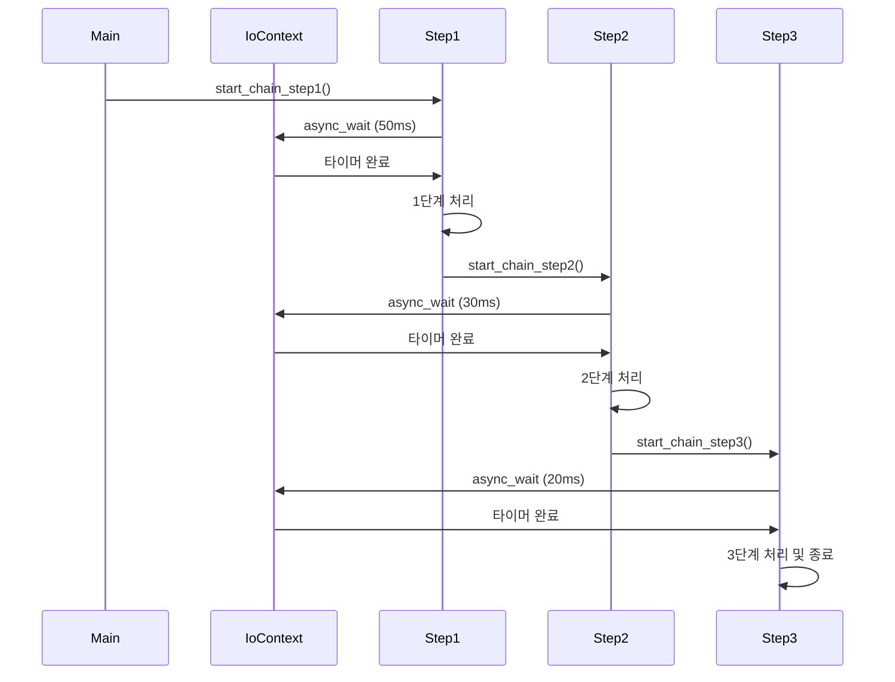
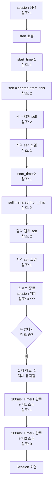

# C++ Boost.Asio로 만드는 온라인 게임 서버
저자: 최흥배, Claude AI   
    
권장 개발 환경
- **IDE**: Visual Studio 2022 (Community 이상)
- **컴파일러**: MSVC v143 (C++20 지원)
- **OS**: Windows 10 이상

-----   

# Chapter 7. 콜백 함수와 핸들러 관리
비동기 프로그래밍에서 콜백 함수는 작업 완료를 통지받고 후속 처리를 수행하는 핵심 메커니즘이다. Boost.Asio는 다양한 형태의 콜백 패턴을 지원하며, 각 패턴은 특정 상황에서 장단점을 가진다.

## 콜백 함수의 개념
콜백 함수는 비동기 작업이 완료되었을 때 호출되는 함수다. 일반적인 함수 호출과 달리, 콜백은 미래의 어느 시점에 실행된다.

```
동기 방식:
main() → function_call() → 결과 반환 → 다음 코드
         [블로킹 대기]

비동기 방식:
main() → async_call() → 즉시 반환 → 다음 코드 실행
              ↓
         [백그라운드 작업]
              ↓
         작업 완료 → callback() 호출
```

Boost.Asio의 비동기 함수들은 모두 콜백을 마지막 인자로 받는다:

```cpp
socket.async_read_some(buffer, callback);
timer.async_wait(callback);
acceptor.async_accept(socket, callback);
```
  

## 기본 콜백 패턴

### 1. 함수 포인터 콜백
가장 단순한 형태로, 전역 함수나 정적 멤버 함수를 콜백으로 사용한다.

```cpp
void global_callback(boost::system::error_code ec) {
    if (!ec) {
        std::cout << "타이머 완료" << std::endl;
    }
}

io_context io_context;
steady_timer timer(io_context, std::chrono::seconds(1));
timer.async_wait(global_callback);
```

**장점:**
- 문법이 간단하고 직관적이다
- 오버헤드가 거의 없다
- 디버깅이 쉽다

**단점:**
- 상태를 유지할 수 없다 (전역 변수를 사용해야 함)
- 재사용성이 낮다
- 여러 콜백이 같은 전역 상태를 공유하면 복잡해진다

**사용 사례:** 간단한 테스트 코드나 상태가 필요 없는 단순 작업에 적합하다.

### 2. 멤버 함수 콜백
클래스의 멤버 함수를 콜백으로 사용하려면 객체 인스턴스와 함께 바인딩해야 한다.

```cpp
class CallbackHandler {
public:
    void handle_timeout(boost::system::error_code ec) {
        if (!ec) {
            std::cout << "멤버 함수 콜백 실행" << std::endl;
        }
    }
};

auto handler = std::make_shared<CallbackHandler>();
steady_timer timer(io_context, std::chrono::seconds(1));

timer.async_wait(std::bind(&CallbackHandler::handle_timeout, 
                          handler, std::placeholders::_1));
```

**std::bind의 동작 방식:**

```
std::bind(&CallbackHandler::handle_timeout, handler, std::placeholders::_1)
         │                                   │        │
         └─ 호출할 멤버 함수                 │        │
                                             │        │
                                   객체 포인터        error_code 플레이스홀더

결과: error_code를 받아서 handler->handle_timeout(error_code) 호출
```

**바인딩 시 주의사항:**

```cpp
// 잘못된 예: 원시 포인터 사용
CallbackHandler handler;
timer.async_wait(std::bind(&CallbackHandler::handle_timeout, 
                          &handler, std::placeholders::_1));
// handler가 스코프를 벗어나면 댕글링 포인터!

// 올바른 예: shared_ptr 사용
auto handler = std::make_shared<CallbackHandler>();
timer.async_wait(std::bind(&CallbackHandler::handle_timeout, 
                          handler, std::placeholders::_1));
// shared_ptr이 복사되어 콜백이 살아있는 동안 객체 유지
```

**장점:**
- 객체의 멤버 변수를 통해 상태 관리 가능
- 객체 지향 설계와 자연스럽게 통합
- 캡슐화 유지

**단점:**
- std::bind의 문법이 복잡하다
- 생명주기 관리에 주의가 필요하다

### 3. 함수 객체 (Functor) 콜백
`operator()`를 오버로드한 클래스를 콜백으로 사용한다.

```cpp
class TimeoutHandler {
private:
    std::string name_;
    int count_;
    
public:
    TimeoutHandler(const std::string& name) 
        : name_(name), count_(0) {}
    
    void operator()(boost::system::error_code ec) {
        if (!ec) {
            count_++;
            std::cout << name_ << " 실행: " << count_ << "회" << std::endl;
        }
    }
};

steady_timer timer(io_context, std::chrono::seconds(1));
timer.async_wait(TimeoutHandler("타이머1"));
```

**함수 객체의 복사 동작:**

```cpp
TimeoutHandler handler("원본");
timer.async_wait(handler);  // handler가 복사됨!

// handler는 복사되어 타이머 내부에 저장
// 원본 handler와 복사본은 별개의 count_ 값을 가짐
```

**장점:**
- 초기화 시 상태를 설정할 수 있다
- 멤버 함수보다 간결하다
- 타입 안정성이 높다

**단점:**
- 복사 비용이 발생할 수 있다
- 복사본이 독립적인 상태를 가지므로 주의 필요

**사용 사례:** 작은 상태를 가진 일회성 콜백에 적합하다.
  

## 람다 표현식 활용
현대 C++에서 가장 선호되는 콜백 방식은 람다 표현식이다.

### 간단한 람다

```cpp
timer.async_wait([](boost::system::error_code ec) {
    if (!ec) {
        std::cout << "타이머 완료" << std::endl;
    }
});
```

**장점:**
- 콜백을 사용하는 위치에서 바로 정의
- 코드 가독성이 높다
- 별도의 함수나 클래스 정의 불필요

### 캡처를 활용한 람다
람다의 진정한 힘은 캡처 기능에 있다. 주변 스코프의 변수를 콜백 내부에서 사용할 수 있다.

```cpp
std::string message = "작업 완료";
int counter = 0;

timer.async_wait([message, &counter](boost::system::error_code ec) {
    if (!ec) {
        counter++;
        std::cout << message << " - " << counter << "회" << std::endl;
    }
});
```

**캡처 방식의 차이:**

```
[message, &counter]
    │        │
    │        └─ 참조 캡처: counter의 원본을 직접 참조
    │           (주의: counter의 생명주기가 콜백보다 길어야 함)
    │
    └─ 값 캡처: message의 복사본 생성
       (안전하지만 복사 비용 발생)
```

**캡처 방식 정리:**

```cpp
// 모든 변수를 값으로 캡처
[=](auto ec) { /* ... */ }

// 모든 변수를 참조로 캡처
[&](auto ec) { /* ... */ }

// 선택적 캡처
[x, &y](auto ec) { /* x는 값, y는 참조 */ }

// this 포인터 캡처 (멤버 함수 내부)
[this](auto ec) { /* 멤버 변수 접근 가능 */ }

// this를 값으로 캡처 (C++17)
[*this](auto ec) { /* 객체 전체 복사 */ }
```

**생명주기 문제 예시:**

```cpp
void problematic_example() {
    io_context io_context;
    steady_timer timer(io_context, std::chrono::seconds(1));
    
    std::string message = "임시 메시지";
    
    timer.async_wait([&message](auto ec) {
        std::cout << message << std::endl;  // 위험!
    });
    
    // message가 함수 종료 시 소멸
    // 콜백이 실행될 때 댕글링 참조!
    
} // ← message 소멸, 하지만 콜백은 아직 실행 안 됨
```

**안전한 버전:**

```cpp
void safe_example() {
    io_context io_context;
    auto timer = std::make_shared<steady_timer>(
        io_context, std::chrono::seconds(1));
    
    auto message = std::make_shared<std::string>("안전한 메시지");
    
    timer->async_wait([timer, message](auto ec) {
        std::cout << *message << std::endl;  // 안전!
    });
    
    // shared_ptr이 복사되어 람다에 저장됨
    // 람다가 살아있는 동안 객체들도 유지됨
}
```

### 제네릭 람다 (C++14)

```cpp
timer.async_wait([](auto ec) {
    // ec의 타입을 명시하지 않음
    // 컴파일러가 자동으로 추론
    if (!ec) {
        std::cout << "완료" << std::endl;
    }
});
```

제네릭 람다는 타입을 명시하지 않아 코드가 더 간결해진다. 컴파일러가 실제 호출 시점에 타입을 결정한다.
  

## 함수 객체와 바인딩 고급 기법

### std::function 사용
`std::function`은 타입이 지워진 함수 래퍼로, 다양한 호출 가능 객체를 저장할 수 있다.

```cpp
std::function<void(boost::system::error_code)> handler;

// 람다 저장
handler = [](auto ec) { std::cout << "람다" << std::endl; };

// 함수 포인터 저장
handler = global_callback;

// 함수 객체 저장
handler = TimeoutHandler("핸들러");

// 모두 동일한 방식으로 호출
timer.async_wait(handler);
```

**std::function의 메모리 구조:**

```
std::function<void(error_code)>
┌─────────────────────────────┐
│ 함수 포인터 (small buffer)  │  작은 객체는 내부 버퍼에 저장
├─────────────────────────────┤  
│ 또는 힙 포인터 (large obj)  │  큰 객체는 힙 할당
└─────────────────────────────┘
```

**장점:**
- 타입 유연성이 높다
- 런타임에 핸들러 변경 가능
- 콜백을 멤버 변수로 저장할 때 유용

**단점:**
- 가상 함수 호출 수준의 오버헤드
- 작은 함수 객체 최적화(SBO)를 넘어서면 힙 할당 발생

### boost::bind vs std::bind
둘 다 함수와 인자를 바인딩하지만, boost::bind가 약간 더 유연하다.

```cpp
class Handler {
public:
    void handle_event(const std::string& name, error_code ec, size_t bytes) {
        std::cout << name << ": " << bytes << " bytes" << std::endl;
    }
};

auto handler = std::make_shared<Handler>();

// boost::bind 사용
socket.async_read_some(buffer,
    boost::bind(&Handler::handle_event, handler, 
               "읽기 작업",
               boost::asio::placeholders::error,
               boost::asio::placeholders::bytes_transferred));

// std::bind 사용 (더 장황함)
socket.async_read_some(buffer,
    std::bind(&Handler::handle_event, handler, 
             "읽기 작업",
             std::placeholders::_1,
             std::placeholders::_2));
```

**플레이스홀더의 의미:**

```
boost::asio::placeholders::error
  → 콜백 호출 시 첫 번째 인자(error_code)로 대체

boost::asio::placeholders::bytes_transferred
  → 콜백 호출 시 두 번째 인자(size_t)로 대체

std::placeholders::_1, _2, ...
  → 범용 플레이스홀더 (순서대로 매핑)
```

### 커스텀 핸들러의 상태 관리
복잡한 상태를 가진 핸들러는 명시적인 클래스로 구현하는 것이 좋다.

```cpp
class StatefulHandler {
private:
    std::string context_;
    int retry_count_;
    int max_retries_;
    std::shared_ptr<tcp::socket> socket_;
    
public:
    StatefulHandler(const std::string& context, 
                   std::shared_ptr<tcp::socket> socket)
        : context_(context)
        , retry_count_(0)
        , max_retries_(3)
        , socket_(socket) {}
    
    void operator()(error_code ec, size_t bytes) {
        if (ec) {
            if (retry_count_ < max_retries_) {
                retry_count_++;
                std::cout << context_ << " 재시도 " 
                         << retry_count_ << "/" << max_retries_ << std::endl;
                
                // 재시도
                socket_->async_read_some(buffer_, *this);
            } else {
                std::cout << context_ << " 최대 재시도 초과" << std::endl;
            }
        } else {
            std::cout << context_ << " 성공: " 
                     << bytes << " bytes" << std::endl;
            retry_count_ = 0;  // 성공 시 리셋
        }
    }
    
private:
    std::array<char, 1024> buffer_;
};

// 사용
socket->async_read_some(buffer, 
    StatefulHandler("데이터 수신", socket));
```

이 패턴은 재시도 로직, 통계 수집, 복잡한 상태 머신 등에 유용하다.
  

## 콜백 체이닝
비동기 작업들을 순차적으로 연결하는 패턴이다.



### 순차적 체이닝 구현

```cpp
class AsyncChain {
    io_context& io_context_;
    
public:
    void start() {
        std::cout << "체인 시작" << std::endl;
        step1();
    }
    
private:
    void step1() {
        std::cout << "1단계: 데이터베이스 연결" << std::endl;
        
        auto timer = std::make_shared<steady_timer>(
            io_context_, std::chrono::milliseconds(100));
        
        timer->async_wait([this, timer](error_code ec) {
            if (!ec) {
                std::cout << "1단계 완료" << std::endl;
                step2();  // 다음 단계로
            }
        });
    }
    
    void step2() {
        std::cout << "2단계: 데이터 조회" << std::endl;
        
        auto timer = std::make_shared<steady_timer>(
            io_context_, std::chrono::milliseconds(200));
        
        timer->async_wait([this, timer](error_code ec) {
            if (!ec) {
                std::cout << "2단계 완료" << std::endl;
                step3();
            }
        });
    }
    
    void step3() {
        std::cout << "3단계: 결과 처리" << std::endl;
        
        auto timer = std::make_shared<steady_timer>(
            io_context_, std::chrono::milliseconds(50));
        
        timer->async_wait([timer](error_code ec) {
            if (!ec) {
                std::cout << "3단계 완료 - 모든 작업 끝" << std::endl;
            }
        });
    }
};
```

**실행 흐름:**

```
시간 0ms:    start() → step1() 호출
시간 0ms:      → async_wait(100ms) 등록
시간 0ms:      → 즉시 반환
시간 100ms:    → 1단계 콜백 실행
시간 100ms:      → step2() 호출
시간 100ms:      → async_wait(200ms) 등록
시간 300ms:    → 2단계 콜백 실행
시간 300ms:      → step3() 호출
시간 300ms:      → async_wait(50ms) 등록
시간 350ms:    → 3단계 콜백 실행
시간 350ms:    → 완료
```

### 데이터 전달이 있는 체이닝
각 단계에서 다음 단계로 데이터를 전달해야 하는 경우:

```cpp
class DataPipeline {
    struct PipelineData {
        std::string user_id;
        std::vector<std::string> items;
        double total_price;
    };
    
    io_context& io_context_;
    
public:
    void start(const std::string& user_id) {
        auto data = std::make_shared<PipelineData>();
        data->user_id = user_id;
        
        fetch_user_items(data);
    }
    
private:
    void fetch_user_items(std::shared_ptr<PipelineData> data) {
        std::cout << "사용자 " << data->user_id << "의 아이템 조회" << std::endl;
        
        // 비동기 데이터베이스 조회 시뮬레이션
        auto timer = std::make_shared<steady_timer>(
            io_context_, std::chrono::milliseconds(100));
        
        timer->async_wait([this, timer, data](error_code ec) {
            if (!ec) {
                // 조회 결과 저장
                data->items = {"item1", "item2", "item3"};
                calculate_price(data);  // 다음 단계로 데이터 전달
            }
        });
    }
    
    void calculate_price(std::shared_ptr<PipelineData> data) {
        std::cout << "가격 계산: " << data->items.size() << "개 아이템" << std::endl;
        
        auto timer = std::make_shared<steady_timer>(
            io_context_, std::chrono::milliseconds(50));
        
        timer->async_wait([this, timer, data](error_code ec) {
            if (!ec) {
                data->total_price = data->items.size() * 10.0;
                send_result(data);
            }
        });
    }
    
    void send_result(std::shared_ptr<PipelineData> data) {
        std::cout << "결과 전송: 총 " << data->total_price << "원" << std::endl;
        // 클라이언트에 응답
    }
};
```

**shared_ptr을 통한 데이터 공유:**

```
[fetch_user_items]
      ↓
[PipelineData] ← shared_ptr (참조 카운트: 1)
      ↓
람다 캡처 → 참조 카운트: 2
      ↓
[calculate_price]
      ↓
람다 캡처 → 참조 카운트: 3
      ↓
모든 콜백 완료 → 참조 카운트: 0 → 자동 소멸
```
  

## 콜백 패턴 선택 가이드
각 패턴의 적합한 사용 사례:

```
┌─────────────────────┬───────────────────┬─────────────────┐
│      패턴           │    사용 시기      │    주의사항     │
├─────────────────────┼───────────────────┼─────────────────┤
│ 함수 포인터         │ 매우 간단한 작업  │ 상태 불가       │
│ 멤버 함수 + bind    │ 클래스 기반 설계  │ 생명주기 관리   │
│ 함수 객체           │ 작은 상태 필요    │ 복사 비용       │
│ 람다 (캡처 없음)    │ 일회성 단순 작업  │ -               │
│ 람다 (값 캡처)      │ 소량 데이터 전달  │ 복사 비용       │
│ 람다 (참조 캡처)    │ 큰 데이터, 성능   │ 생명주기 위험   │
│ 람다 (shared_ptr)   │ 복잡한 상태, 안전 │ 메모리 오버헤드 │
│ std::function       │ 런타임 유연성     │ 간접 호출 비용  │
└─────────────────────┴───────────────────┴─────────────────┘
```

**권장 사항:**

1. **기본적으로 람다 사용**: 가장 간결하고 현대적이다
2. **shared_ptr로 생명주기 보장**: 참조 캡처는 위험하다
3. **복잡한 로직은 클래스로**: 가독성과 테스트 용이성
4. **체이닝은 명시적으로**: 각 단계를 명확한 함수로 분리

비동기 프로그래밍의 핵심은 콜백을 통한 제어 흐름 관리다. 적절한 콜백 패턴을 선택하면 코드의 가독성과 안정성을 모두 확보할 수 있다.

  

## 객체 생명주기 관리
비동기 프로그래밍에서 객체 생명주기 관리는 가장 어렵고 중요한 주제 중 하나다. 비동기 작업은 나중에 실행되기 때문에, 콜백이 실행될 때 참조하는 객체가 이미 소멸되었을 수 있다. 이런 댕글링 포인터(dangling pointer) 문제는 디버깅하기 어려운 크래시나 메모리 손상을 일으킨다.

### 댕글링 포인터 문제

#### 위험한 패턴
먼저 문제가 발생하는 전형적인 코드를 살펴보자.

```cpp
class DangerousHandler {
    std::string name_;
    
public:
    DangerousHandler(const std::string& name) : name_(name) {
        std::cout << "생성: " << name_ << std::endl;
    }
    
    ~DangerousHandler() {
        std::cout << "소멸: " << name_ << std::endl;
    }
    
    void start_async_operation(io_context& io_context) {
        auto timer = std::make_shared<steady_timer>(
            io_context, std::chrono::milliseconds(100));
        
        // 위험: this 포인터만 캡처
        timer->async_wait([this, timer](error_code ec) {
            if (!ec) {
                // 이 시점에 this가 유효할까?
                std::cout << "콜백 실행: " << name_ << std::endl;
            }
        });
    }
};

void dangerous_usage() {
    io_context io_context;
    
    {
        DangerousHandler handler("위험한객체");
        handler.start_async_operation(io_context);
        
        // 스코프 종료
    } // ← handler 소멸!
    
    // 하지만 비동기 작업은 아직 진행 중
    io_context.run(); // ← 콜백 실행 시 댕글링 포인터!
}
```

**문제의 시간 흐름:**

```
시간 0ms:   handler 객체 생성
            start_async_operation() 호출
            async_wait() 등록 (100ms 타이머)
            함수 즉시 반환
            
시간 1ms:   스코프 종료
            ~DangerousHandler() 호출
            name_ 등의 멤버 변수 소멸
            메모리 해제
            
            [this 포인터가 이제 무효!]
            
시간 100ms: 타이머 완료
            람다 콜백 실행
            this->name_ 접근 시도
            
            → 이미 해제된 메모리 접근!
            → Undefined Behavior (크래시, 쓰레기 값, 등)
```

**메모리 상태 다이어그램:**

```
[시간 0ms - 객체 생성]
Stack:                  Heap:
┌──────────────┐       ┌──────────────┐
│ handler      │       │ Timer        │
│ this: 0x1000 │──┐    │ (shared_ptr) │
└──────────────┘  │    └──────────────┘
                  │
0x1000:           │    Lambda:
┌──────────────┐  │    ┌──────────────┐
│ name_: "..." │◄─┘    │ this: 0x1000 │
└──────────────┘       │ timer: ...   │
                       └──────────────┘

[시간 1ms - 스코프 종료]
Stack:                  Heap:
┌──────────────┐       ┌──────────────┐
│ (비어있음)   │       │ Timer        │
└──────────────┘       └──────────────┘
                       
0x1000:                Lambda:
┌──────────────┐       ┌──────────────┐
│ FREED        │       │ this: 0x1000 │ ← 댕글링!
│ (쓰레기)     │       │ timer: ...   │
└──────────────┘       └──────────────┘

[시간 100ms - 콜백 실행]
람다가 0x1000에 접근 시도
→ 이미 해제된 메모리!
→ Crash 또는 Undefined Behavior
```

이 패턴은 다음과 같은 증상을 보인다:

- **간헐적 크래시**: 메모리가 즉시 재사용되지 않으면 "운 좋게" 동작할 수 있다
- **쓰레기 값 출력**: 해제된 메모리에 다른 데이터가 덮어씌워진 경우
- **디버깅 어려움**: 재현이 어렵고 스택 트레이스가 명확하지 않다
  

### shared_ptr을 통한 안전한 관리

#### 기본 패턴
`shared_ptr`과 `enable_shared_from_this`를 사용하면 이 문제를 해결할 수 있다.

```cpp
class SafeHandler : public std::enable_shared_from_this<SafeHandler> {
    std::string name_;
    
public:
    SafeHandler(const std::string& name) : name_(name) {
        std::cout << "생성: " << name_ << std::endl;
    }
    
    ~SafeHandler() {
        std::cout << "소멸: " << name_ << std::endl;
    }
    
    void start_async_operation(io_context& io_context) {
        auto timer = std::make_shared<steady_timer>(
            io_context, std::chrono::milliseconds(100));
        
        // 안전: shared_from_this()로 자기 참조 획득
        auto self = shared_from_this();
        
        timer->async_wait([this, self, timer](error_code ec) {
            if (!ec) {
                // 안전: self가 객체를 유지함
                std::cout << "콜백 실행: " << name_ << std::endl;
            }
        });
    }
};

void safe_usage() {
    io_context io_context;
    
    {
        auto handler = std::make_shared<SafeHandler>("안전한객체");
        handler->start_async_operation(io_context);
        
        // 스코프 종료
    } // ← handler의 shared_ptr 해제, 하지만 람다가 참조 유지!
    
    io_context.run(); // ← 안전하게 실행됨
    
    // 여기서 모든 콜백 완료 후 객체 소멸
}
```

**안전한 생명주기 흐름:**

```
시간 0ms:   shared_ptr<SafeHandler> 생성 (참조 카운트: 1)
            start_async_operation() 호출
            self = shared_from_this() (참조 카운트: 2)
            람다가 self 캡처 (참조 카운트: 2 유지)
            함수 반환, 지역 self 소멸 (참조 카운트: 1)
            
시간 1ms:   스코프 종료
            handler 해제 (참조 카운트: 0이 아님!)
            객체는 여전히 살아있음 (참조 카운트: 1)
            
            [람다가 객체를 보호 중]
            
시간 100ms: 타이머 완료
            람다 콜백 실행
            this->name_ 안전하게 접근
            콜백 완료
            람다 소멸 (참조 카운트: 0)
            
            ~SafeHandler() 호출
            객체 안전하게 소멸
```

### enable_shared_from_this의 필수성
`enable_shared_from_this`를 상속하지 않으면 어떻게 될까?

```cpp
class WrongHandler {  // enable_shared_from_this 상속 없음!
public:
    void start_async_operation(io_context& io_context) {
        auto timer = std::make_shared<steady_timer>(
            io_context, std::chrono::milliseconds(100));
        
        // 컴파일 에러 또는 런타임 예외!
        // auto self = shared_from_this();  // 없는 함수!
        
        // 이렇게 하면? (잘못된 방법)
        auto self = std::shared_ptr<WrongHandler>(this);  // 위험!
        
        timer->async_wait([this, self, timer](error_code ec) {
            // ...
        });
    }
};

void wrong_usage() {
    auto handler = std::make_shared<WrongHandler>();
    handler->start_async_operation(io_context);
    
    // 문제: handler와 self은 독립적인 참조 카운트!
    // handler 소멸 시 객체 해제되지만
    // self은 다른 참조 카운트를 가짐 → 이중 해제!
}
```

**이중 해제 문제:**

```
[shared_ptr 생성]
handler (참조 카운트 A: 1)
   ↓
[잘못된 shared_ptr 생성]
self (참조 카운트 B: 1)  ← 별개의 제어 블록!
   ↓
[handler 소멸]
참조 카운트 A: 0 → delete this
   ↓
[self 소멸]
참조 카운트 B: 0 → delete this (이미 삭제된 객체!)
   ↓
이중 해제 (Double Free) → Crash!
```

`enable_shared_from_this`는 이 문제를 방지한다:

```cpp
class SafeHandler : public std::enable_shared_from_this<SafeHandler> {
    // 내부적으로 weak_ptr을 보유
    // shared_from_this()는 이 weak_ptr에서 shared_ptr 생성
    // → 동일한 제어 블록 사용!
};
```
  

## 참조 카운트 상세 분석

### 참조 카운트의 변화 추적
복잡한 시나리오에서 참조 카운트가 어떻게 변하는지 추적해보자.

```cpp
class Session : public std::enable_shared_from_this<Session> {
    steady_timer timer1_;
    steady_timer timer2_;
    
public:
    Session(io_context& io_context) 
        : timer1_(io_context), timer2_(io_context) {}
    
    void start() {
        start_timer1();
        start_timer2();
    }
    
private:
    void start_timer1() {
        timer1_.expires_after(std::chrono::milliseconds(100));
        
        auto self = shared_from_this();
        timer1_.async_wait([this, self](error_code ec) {
            if (!ec) {
                std::cout << "Timer 1 완료" << std::endl;
            }
        });
    }
    
    void start_timer2() {
        timer2_.expires_after(std::chrono::milliseconds(200));
        
        auto self = shared_from_this();
        timer2_.async_wait([this, self](error_code ec) {
            if (!ec) {
                std::cout << "Timer 2 완료" << std::endl;
            }
        });
    }
};

void complex_usage() {
    io_context io_context;
    
    {
        auto session = std::make_shared<Session>(io_context);
        session->start();
        
    } // 스코프 종료
    
    io_context.run();
}
```

**참조 카운트 변화:**



**시간별 참조 카운트 표:**

```
시간        이벤트                          참조 카운트
────────────────────────────────────────────────────
0ms     session 생성                            1
1ms     start() 호출                            1
2ms     start_timer1() 진입                     1
3ms       self = shared_from_this()             2
4ms       람다1 생성 및 캡처                    2
5ms       지역 self 소멸                        1
6ms     start_timer2() 진입                     1
7ms       self = shared_from_this()             2
8ms       람다2 생성 및 캡처                    2
9ms       지역 self 소멸                        1
10ms    스코프 종료, session 해제               0(X)
        
        실제로는 람다1과 람다2가 참조 중!
        실제 참조 카운트: 2
        객체는 살아있음
        
100ms   Timer1 완료                             2
        람다1 실행 및 소멸                      1
        
200ms   Timer2 완료                             1
        람다2 실행 및 소멸                      0
        ~Session() 호출
```
  

## 실전 패턴: 네트워크 세션
네트워크 세션은 객체 생명주기 관리의 좋은 실전 예시다.

```cpp
class NetworkSession : public std::enable_shared_from_this<NetworkSession> {
    tcp::socket socket_;
    steady_timer heartbeat_timer_;
    std::array<char, 1024> buffer_;
    std::string session_id_;
    
public:
    NetworkSession(io_context& io_context, std::string id)
        : socket_(io_context)
        , heartbeat_timer_(io_context)
        , session_id_(std::move(id)) {
        
        std::cout << "세션 " << session_id_ << " 생성" << std::endl;
    }
    
    ~NetworkSession() {
        std::cout << "세션 " << session_id_ << " 소멸" << std::endl;
    }
    
    tcp::socket& socket() { return socket_; }
    
    void start() {
        std::cout << "세션 " << session_id_ << " 시작" << std::endl;
        do_read();
        schedule_heartbeat();
    }
    
    void stop() {
        std::cout << "세션 " << session_id_ << " 중지" << std::endl;
        
        error_code ec;
        socket_.close(ec);
        heartbeat_timer_.cancel(ec);
    }
    
private:
    void do_read() {
        auto self = shared_from_this();
        
        socket_.async_read_some(boost::asio::buffer(buffer_),
            [this, self](error_code ec, size_t bytes) {
                if (!ec) {
                    std::cout << "세션 " << session_id_ 
                             << ": " << bytes << " bytes 수신" << std::endl;
                    
                    // Echo back
                    do_write(bytes);
                } else {
                    std::cout << "세션 " << session_id_ 
                             << " 읽기 오류: " << ec.message() << std::endl;
                }
            });
    }
    
    void do_write(size_t length) {
        auto self = shared_from_this();
        
        boost::asio::async_write(socket_, 
            boost::asio::buffer(buffer_, length),
            [this, self](error_code ec, size_t bytes) {
                if (!ec) {
                    std::cout << "세션 " << session_id_ 
                             << ": " << bytes << " bytes 전송" << std::endl;
                    
                    // 다음 읽기
                    do_read();
                } else {
                    std::cout << "세션 " << session_id_ 
                             << " 쓰기 오류: " << ec.message() << std::endl;
                }
            });
    }
    
    void schedule_heartbeat() {
        heartbeat_timer_.expires_after(std::chrono::seconds(5));
        
        auto self = shared_from_this();
        
        heartbeat_timer_.async_wait([this, self](error_code ec) {
            if (!ec) {
                std::cout << "세션 " << session_id_ << " 하트비트" << std::endl;
                schedule_heartbeat();  // 다음 하트비트
            } else if (ec != boost::asio::error::operation_aborted) {
                std::cout << "세션 " << session_id_ 
                         << " 하트비트 오류: " << ec.message() << std::endl;
            }
        });
    }
};
```

**세션 생명주기:**

```
[클라이언트 연결]
    ↓
auto session = std::make_shared<NetworkSession>(...)
참조 카운트: 1
    ↓
session->start()
  ├─ do_read() → 람다 캡처 (참조: 2)
  └─ schedule_heartbeat() → 람다 캡처 (참조: 3)
    ↓
acceptor가 다음 연결 대기
지역 변수 session 소멸 (참조: 2)
    ↓
[세션이 독립적으로 동작]
- do_read() → do_write() → do_read() 루프
- schedule_heartbeat() → schedule_heartbeat() 루프
    ↓
[클라이언트 연결 종료 또는 오류]
    ↓
읽기 오류 발생 → do_read() 콜백 종료 (참조: 1)
하트비트 타이머 취소 (참조: 0)
    ↓
~NetworkSession() 자동 호출
```

이 패턴의 핵심은 **세션이 스스로의 생명주기를 관리**한다는 점이다. Acceptor나 다른 외부 컴포넌트가 세션을 추적할 필요가 없다.

### weak_ptr와 순환 참조

#### 순환 참조 문제
`shared_ptr`만으로는 해결할 수 없는 문제가 있다: 순환 참조다.

```cpp
class Parent {
public:
    std::shared_ptr<Child> child_;
    std::string name_;
    
    Parent(const std::string& name) : name_(name) {
        std::cout << "Parent " << name_ << " 생성" << std::endl;
    }
    
    ~Parent() {
        std::cout << "Parent " << name_ << " 소멸" << std::endl;
    }
};

class Child {
public:
    std::shared_ptr<Parent> parent_;  // 문제의 원인!
    std::string name_;
    
    Child(const std::string& name) : name_(name) {
        std::cout << "Child " << name_ << " 생성" << std::endl;
    }
    
    ~Child() {
        std::cout << "Child " << name_ << " 소멸" << std::endl;
    }
};

void circular_reference_problem() {
    auto parent = std::make_shared<Parent>("아빠");
    auto child = std::make_shared<Child>("아들");
    
    parent->child_ = child;
    child->parent_ = parent;  // 순환 참조!
    
    // 함수 종료
} // 소멸자가 호출되지 않음!
```

**순환 참조 다이어그램:**

```
[초기 상태]
parent (참조: 1) ───────────┐
                           │
┌──────────────────────────┘
│
├─> Parent 객체
│   └─ child_: shared_ptr (참조: 1)
│                              │
│   ┌──────────────────────────┘
│   │
│   ├─> Child 객체
│   │   └─ parent_: shared_ptr (참조: 2) ─┐
│   │                                     │
child (참조: 1) ────────────────────────┐  │
                                       │  │
[함수 종료]                             │  │
parent 지역 변수 해제 (참조: 2→1) ◄──────┘  │
child 지역 변수 해제 (참조: 2→1) ◄──────────┘

[결과]
Parent 객체 (참조: 1) ← Child가 참조 중
   ↕
Child 객체 (참조: 1) ← Parent가 참조 중

서로가 서로를 참조하여 참조 카운트가 0이 될 수 없음!
→ 메모리 누수
```

#### weak_ptr 해결책
`weak_ptr`은 참조 카운트를 증가시키지 않는 약한 참조를 제공한다.

```cpp
class SafeParent : public std::enable_shared_from_this<SafeParent> {
public:
    std::shared_ptr<SafeChild> child_;
    std::string name_;
    
    SafeParent(const std::string& name) : name_(name) {
        std::cout << "SafeParent " << name_ << " 생성" << std::endl;
    }
    
    ~SafeParent() {
        std::cout << "SafeParent " << name_ << " 소멸" << std::endl;
    }
    
    void interact_with_child(io_context& io_context) {
        auto timer = std::make_shared<steady_timer>(
            io_context, std::chrono::milliseconds(100));
        
        auto self = shared_from_this();
        
        timer->async_wait([this, self, timer](error_code ec) {
            if (!ec && child_) {
                child_->notify_from_parent();
            }
        });
    }
};

class SafeChild {
public:
    std::weak_ptr<SafeParent> parent_;  // weak_ptr 사용!
    std::string name_;
    
    SafeChild(const std::string& name) : name_(name) {
        std::cout << "SafeChild " << name_ << " 생성" << std::endl;
    }
    
    ~SafeChild() {
        std::cout << "SafeChild " << name_ << " 소멸" << std::endl;
    }
    
    void notify_from_parent() {
        // weak_ptr을 shared_ptr로 승격 시도
        if (auto parent = parent_.lock()) {
            std::cout << parent->name_ << " → " << name_ 
                     << " 알림 전달" << std::endl;
        } else {
            std::cout << name_ << ": 부모가 이미 소멸됨" << std::endl;
        }
    }
};

void safe_circular_reference() {
    auto parent = std::make_shared<SafeParent>("안전한아빠");
    auto child = std::make_shared<SafeChild>("안전한아들");
    
    parent->child_ = child;
    child->parent_ = parent;  // weak_ptr이므로 안전!
    
    // 함수 종료
} // 정상적으로 소멸자 호출됨!
```

**weak_ptr의 참조 카운트:**

```
[초기 상태]
parent (강한 참조: 1)
   ↓
Parent 객체
   └─ child_: shared_ptr (강한 참조: 1)
                ↓
             Child 객체
                └─ parent_: weak_ptr (약한 참조, 카운트 증가 안 함)

[함수 종료]
parent 해제 (강한 참조: 1→0)
   ↓
Parent 소멸자 호출
   ↓
child_ 소멸 (강한 참조: 1→0)
   ↓
Child 소멸자 호출
   ↓
parent_ weak_ptr 자동 무효화

정상적으로 모두 소멸!
```

#### weak_ptr의 안전한 사용
`weak_ptr`을 사용할 때는 반드시 `lock()`으로 유효성을 검사해야 한다.

```cpp
void use_weak_ptr(std::weak_ptr<SafeParent> weak_parent) {
    // 방법 1: if문으로 검사
    if (auto parent = weak_parent.lock()) {
        // parent가 유효한 동안 사용
        std::cout << parent->name_ << std::endl;
    } else {
        // 이미 소멸됨
        std::cout << "Parent가 이미 소멸됨" << std::endl;
    }
    
    // 방법 2: 명시적 검사
    auto parent = weak_parent.lock();
    if (parent) {
        std::cout << parent->name_ << std::endl;
    }
    
    // 잘못된 방법: expired() 후 lock() (레이스 컨디션!)
    if (!weak_parent.expired()) {
        // 여기서 다른 스레드가 마지막 shared_ptr을 해제할 수 있음!
        auto parent = weak_parent.lock();  // nullptr 반환 가능!
        // parent->name_;  // 위험!
    }
}
```

**lock()의 원자성:**

```cpp
// lock()은 원자적으로 동작함
auto parent = weak_parent.lock();

// 내부적으로:
// 1. 참조 카운트가 0인지 확인
// 2. 0이 아니면 참조 카운트 증가
// 3. shared_ptr 반환
// 위 과정이 원자적으로 수행되어 스레드 안전
```
  

### 실전 가이드라인

#### 1. 기본 규칙

```cpp
// ✓ 올바른 패턴
class MyClass : public std::enable_shared_from_this<MyClass> {
public:
    void start_async() {
        auto self = shared_from_this();
        async_operation([this, self]() {
            // 안전
        });
    }
};

// ✗ 피해야 할 패턴
class BadClass {
public:
    void start_async() {
        async_operation([this]() {
            // 위험: this만 캡처
        });
    }
};
```

#### 2. 참조 선택 가이드

```
┌─────────────────────────┬──────────────────────┐
│       관계 유형         │    사용할 포인터     │
├─────────────────────────┼──────────────────────┤
│ 소유권 (Ownership)      │ shared_ptr           │
│ 부모 → 자식             │ shared_ptr           │
│ 자식 → 부모             │ weak_ptr             │
│ 비동기 콜백 내부        │ shared_ptr (self)    │
│ 관찰자 (Observer)       │ weak_ptr             │
│ 캐시 (Cache)            │ weak_ptr             │
└─────────────────────────┴──────────────────────┘
```

#### 3. 일반적인 실수와 해결책

**실수 1: enable_shared_from_this 없이 shared_from_this() 호출**

```cpp
class Wrong {  // enable_shared_from_this 상속 안 함!
    void start() {
        auto self = shared_from_this();  // 컴파일 에러!
    }
};

// 해결책
class Right : public std::enable_shared_from_this<Right> {
    void start() {
        auto self = shared_from_this();  // OK
    }
};
```

**실수 2: 생성자에서 shared_from_this() 호출**

```cpp
class Wrong : public std::enable_shared_from_this<Wrong> {
    Wrong() {
        auto self = shared_from_this();  // 예외 발생!
        // 아직 shared_ptr이 생성되지 않음
    }
};

// 해결책: 별도의 init 함수 사용
class Right : public std::enable_shared_from_this<Right> {
    Right() { /* 초기화만 */ }
    
public:
    static std::shared_ptr<Right> create() {
        auto obj = std::make_shared<Right>();
        obj->init();  // shared_ptr 생성 후 호출
        return obj;
    }
    
private:
    void init() {
        auto self = shared_from_this();  // OK
        // 비동기 작업 시작
    }
};
```

**실수 3: 순환 참조 방치**

```cpp
// Wrong: 서로 shared_ptr로 참조
class Server {
    std::vector<std::shared_ptr<Client>> clients_;
};

class Client {
    std::shared_ptr<Server> server_;  // 순환!
};

// Right: 한쪽은 weak_ptr 사용
class Server {
    std::vector<std::shared_ptr<Client>> clients_;
};

class Client {
    std::weak_ptr<Server> server_;  // 약한 참조
};
```

비동기 프로그래밍에서 올바른 생명주기 관리는 안정성의 기초다. `shared_ptr`, `enable_shared_from_this`, `weak_ptr`을 적절히 조합하면 메모리 안전성과 명확한 소유권 의미를 동시에 얻을 수 있다.
  
  