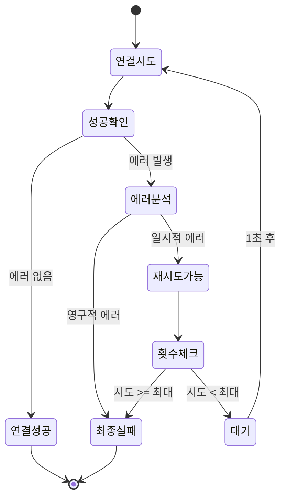

# C++ Boost.Asio로 만드는 온라인 게임 서버
저자: 최흥배, Claude AI   
    
권장 개발 환경
- **IDE**: Visual Studio 2022 (Community 이상)
- **컴파일러**: MSVC v143 (C++20 지원)
- **OS**: Windows 10 이상

-----   

# Chapter 8. 에러 처리 최적화
비동기 프로그래밍에서 에러 처리는 동기 방식보다 복잡하다. 에러가 발생한 시점과 이를 처리하는 시점이 분리되어 있고, 여러 비동기 작업이 동시에 진행되므로 에러의 전파와 복구 전략이 중요하다. 이 절에서는 Boost.Asio에서 효과적으로 에러를 처리하는 방법을 다룬다.

## 비동기 에러의 특성
동기 방식과 비동기 방식의 에러 처리 차이를 먼저 이해해야 한다.

**동기 방식:**
```cpp
try {
    auto result = socket.read(buffer);
    process(result);
} catch (const std::exception& e) {
    std::cerr << "에러: " << e.what() << std::endl;
}
```

**비동기 방식:**
```cpp
socket.async_read(buffer, [](error_code ec, size_t bytes) {
    if (ec) {
        // 에러 처리: 예외가 아닌 error_code
        std::cerr << "에러: " << ec.message() << std::endl;
        return;
    }
    process(bytes);
});
```

**핵심 차이점:**

```
동기 방식:
코드 실행 → 에러 발생 → 예외 던짐 → 즉시 catch
            [콜 스택 유지]

비동기 방식:
요청 → 반환 → [시간 경과] → 에러 발생 → 콜백 호출
                           [원래 콜 스택 없음]
                           [예외 던질 곳 없음]
```

비동기 방식에서는 에러가 발생해도 원래의 호출 스택이 이미 풀렸기 때문에 예외를 던질 수 없다. 대신 `error_code`를 통해 에러를 전달한다.
  

## error_code의 구조
Boost.Asio는 `boost::system::error_code`를 사용한다.

```cpp
void handle_completion(error_code ec, size_t bytes) {
    // 성공 여부 확인
    if (!ec) {
        std::cout << "성공: " << bytes << " bytes" << std::endl;
        return;
    }
    
    // 에러 정보 추출
    std::cout << "에러 코드: " << ec.value() << std::endl;
    std::cout << "에러 메시지: " << ec.message() << std::endl;
    std::cout << "카테고리: " << ec.category().name() << std::endl;
    
    // 특정 에러 비교
    if (ec == boost::asio::error::eof) {
        std::cout << "연결 종료" << std::endl;
    } else if (ec == boost::asio::error::operation_aborted) {
        std::cout << "작업 취소됨" << std::endl;
    }
}
```

**error_code의 내부 구조:**

```
error_code
├─ value_: int                    (예: 125)
├─ category_: error_category*     (예: system_category)
│
└─ 메서드들:
    ├─ message() → "Operation canceled"
    ├─ operator bool() → true (에러 있음)
    └─ operator==() → 비교 연산
```
  

## 기본 에러 처리 패턴

### 표준 에러 확인
가장 기본적인 패턴은 `error_code`의 불리언 변환을 사용하는 것이다.

```cpp
timer.async_wait([](error_code ec) {
    if (!ec) {
        // 성공 경로
        std::cout << "타이머 완료" << std::endl;
    } else {
        // 에러 경로
        std::cout << "에러: " << ec.message() << std::endl;
    }
});
```

**Early Return 패턴:**

```cpp
void handle_read(error_code ec, size_t bytes) {
    // 에러 먼저 처리하고 반환
    if (ec) {
        std::cerr << "읽기 실패: " << ec.message() << std::endl;
        return;
    }
    
    // 성공 경로는 인덴트 없이 진행
    std::cout << "읽기 성공: " << bytes << " bytes" << std::endl;
    process_data();
    start_next_read();
}
```

이 패턴은 중첩을 줄여 가독성을 높인다.
  

## 에러 종류별 처리
특정 에러는 정상적인 흐름의 일부일 수 있다.

```cpp
void handle_accept(error_code ec) {
    if (!ec) {
        std::cout << "클라이언트 연결됨" << std::endl;
        start_session();
        
    } else if (ec == boost::asio::error::operation_aborted) {
        // 서버 종료 시 정상적으로 발생
        std::cout << "Accept 취소됨 (서버 종료 중)" << std::endl;
        return;
        
    } else {
        // 실제 에러
        std::cerr << "Accept 실패: " << ec.message() << std::endl;
    }
    
    // 다음 연결 대기
    start_accept();
}
```

**일반적인 Asio 에러 코드:**

```
boost::asio::error::eof
  → 연결 상대방이 정상적으로 종료
  → 처리: 세션 종료, 정리 작업

boost::asio::error::operation_aborted
  → 비동기 작업이 명시적으로 취소됨
  → 처리: 조용히 무시 (의도된 취소)

boost::asio::error::connection_reset
  → 연결이 강제로 끊김
  → 처리: 세션 종료, 로깅

boost::asio::error::timed_out
  → 타임아웃 발생
  → 처리: 재시도 또는 포기

boost::asio::error::would_block
  → 논블로킹 소켓에서 데이터 없음
  → 처리: 다시 대기 (Asio가 자동 처리)
```
  

## 에러 분류 시스템
에러를 심각도에 따라 분류하면 체계적인 처리가 가능하다.

```cpp
class ErrorClassifier {
public:
    enum class Severity {
        Info,       // 정보성 (정상 동작의 일부)
        Warning,    // 경고 (재시도 가능)
        Error,      // 오류 (처리 필요)
        Critical    // 심각 (시스템 영향)
    };
    
    static Severity classify(const error_code& ec) {
        if (!ec) {
            return Severity::Info;
        }
        
        // 정상적인 종료 상황
        if (ec == boost::asio::error::eof ||
            ec == boost::asio::error::operation_aborted) {
            return Severity::Info;
        }
        
        // 일시적 문제 (재시도 가능)
        if (ec == boost::asio::error::try_again ||
            ec == boost::asio::error::would_block ||
            ec == boost::asio::error::interrupted) {
            return Severity::Warning;
        }
        
        // 시스템 리소스 문제
        if (ec == boost::asio::error::no_memory ||
            ec == boost::asio::error::no_descriptors) {
            return Severity::Critical;
        }
        
        // 기타 에러
        return Severity::Error;
    }
    
    static void handle(const error_code& ec, const std::string& context) {
        auto severity = classify(ec);
        
        switch (severity) {
        case Severity::Info:
            log_info(context, ec.message());
            break;
            
        case Severity::Warning:
            log_warning(context, ec.message());
            attempt_recovery(ec);
            break;
            
        case Severity::Error:
            log_error(context, ec.message());
            notify_admin(context, ec);
            break;
            
        case Severity::Critical:
            log_critical(context, ec.message());
            initiate_shutdown(context, ec);
            break;
        }
    }
    
private:
    static void log_info(const std::string& ctx, const std::string& msg) {
        std::cout << "[INFO] " << ctx << ": " << msg << std::endl;
    }
    
    static void log_warning(const std::string& ctx, const std::string& msg) {
        std::cout << "[WARN] " << ctx << ": " << msg << std::endl;
    }
    
    static void log_error(const std::string& ctx, const std::string& msg) {
        std::cerr << "[ERROR] " << ctx << ": " << msg << std::endl;
    }
    
    static void log_critical(const std::string& ctx, const std::string& msg) {
        std::cerr << "[CRITICAL] " << ctx << ": " << msg << std::endl;
    }
    
    static void attempt_recovery(const error_code& ec) {
        // 재시도 로직
    }
    
    static void notify_admin(const std::string& ctx, const error_code& ec) {
        // 관리자 알림 (이메일, Slack 등)
    }
    
    static void initiate_shutdown(const std::string& ctx, const error_code& ec) {
        // 안전한 종료 절차 시작
    }
};
```

**사용 예:**

```cpp
socket.async_read_some(buffer, [](error_code ec, size_t bytes) {
    ErrorClassifier::handle(ec, "데이터 수신");
    
    if (!ec) {
        process_data(bytes);
    }
});
```
  

## 재시도 메커니즘
일시적 에러는 재시도로 해결할 수 있다.

```cpp
class RetryableOperation : public std::enable_shared_from_this<RetryableOperation> {
    io_context& io_context_;
    tcp::socket socket_;
    std::string host_;
    unsigned short port_;
    
    int max_retries_;
    int current_attempt_;
    
public:
    RetryableOperation(io_context& io_context, 
                      const std::string& host, unsigned short port,
                      int max_retries = 3)
        : io_context_(io_context)
        , socket_(io_context)
        , host_(host)
        , port_(port)
        , max_retries_(max_retries)
        , current_attempt_(0) {}
    
    void start() {
        attempt_connect();
    }
    
private:
    void attempt_connect() {
        current_attempt_++;
        
        std::cout << "연결 시도 " << current_attempt_ 
                 << "/" << max_retries_ << std::endl;
        
        tcp::resolver resolver(io_context_);
        auto endpoints = resolver.resolve(host_, std::to_string(port_));
        
        auto self = shared_from_this();
        boost::asio::async_connect(socket_, endpoints,
            [this, self](error_code ec, tcp::endpoint) {
                handle_connect(ec);
            });
    }
    
    void handle_connect(error_code ec) {
        if (!ec) {
            std::cout << "연결 성공!" << std::endl;
            on_success();
            return;
        }
        
        std::cerr << "연결 실패: " << ec.message() << std::endl;
        
        // 재시도 가능 여부 판단
        if (should_retry(ec) && current_attempt_ < max_retries_) {
            std::cout << "재시도 예정..." << std::endl;
            schedule_retry();
        } else {
            std::cerr << "연결 포기 (최대 시도 횟수 초과)" << std::endl;
            on_failure(ec);
        }
    }
    
    bool should_retry(const error_code& ec) {
        // 일시적인 에러만 재시도
        return ec == boost::asio::error::connection_refused ||
               ec == boost::asio::error::host_unreachable ||
               ec == boost::asio::error::timed_out;
    }
    
    void schedule_retry() {
        // 간단한 지연 후 재시도
        auto timer = std::make_shared<steady_timer>(
            io_context_, std::chrono::seconds(1));
        
        auto self = shared_from_this();
        timer->async_wait([this, self, timer](error_code ec) {
            if (!ec) {
                attempt_connect();
            }
        });
    }
    
    void on_success() {
        // 연결 성공 후 로직
    }
    
    void on_failure(error_code ec) {
        // 최종 실패 처리
    }
};
```

**재시도 흐름:**


  

### 지수 백오프 전략
재시도 간격을 점진적으로 늘리는 지수 백오프는 서버 부하를 줄인다.

```cpp
class BackoffRetry : public std::enable_shared_from_this<BackoffRetry> {
    io_context& io_context_;
    tcp::socket socket_;
    
    std::chrono::milliseconds base_delay_;
    std::chrono::milliseconds max_delay_;
    int attempt_;
    
public:
    BackoffRetry(io_context& io_context)
        : io_context_(io_context)
        , socket_(io_context)
        , base_delay_(100)      // 기본 100ms
        , max_delay_(30000)     // 최대 30초
        , attempt_(0) {}
    
    void start_connect(const std::string& host, unsigned short port) {
        attempt_ = 0;
        attempt_with_backoff(host, port);
    }
    
private:
    void attempt_with_backoff(const std::string& host, unsigned short port) {
        attempt_++;
        
        // 지수 백오프 계산: base * 2^(attempt-1)
        auto delay = base_delay_ * (1 << (attempt_ - 1));
        if (delay > max_delay_) {
            delay = max_delay_;
        }
        
        std::cout << "시도 " << attempt_ 
                 << " (대기: " << delay.count() << "ms)" << std::endl;
        
        auto timer = std::make_shared<steady_timer>(io_context_, delay);
        auto self = shared_from_this();
        
        timer->async_wait([this, self, timer, host, port](error_code ec) {
            if (!ec) {
                perform_connect(host, port);
            }
        });
    }
    
    void perform_connect(const std::string& host, unsigned short port) {
        tcp::resolver resolver(io_context_);
        auto endpoints = resolver.resolve(host, std::to_string(port));
        
        auto self = shared_from_this();
        boost::asio::async_connect(socket_, endpoints,
            [this, self, host, port](error_code ec, tcp::endpoint) {
                if (!ec) {
                    std::cout << "연결 성공!" << std::endl;
                    on_connected();
                } else {
                    std::cerr << "연결 실패: " << ec.message() << std::endl;
                    
                    // 계속 재시도 (실제로는 최대 횟수 제한 필요)
                    attempt_with_backoff(host, port);
                }
            });
    }
    
    void on_connected() {
        attempt_ = 0;  // 성공 시 카운터 리셋
        // 이후 작업...
    }
};
```

**백오프 타이밍:**

```
시도    대기 시간    누적 시간
1       100ms       0ms
2       200ms       100ms
3       400ms       300ms
4       800ms       700ms
5       1600ms      1500ms
6       3200ms      3100ms
7       6400ms      6300ms
8       12800ms     12700ms
9       25600ms     25500ms
10      30000ms     51100ms (최대치 도달)
11      30000ms     81100ms
```

이 패턴은 다음 상황에서 유용하다:
- 일시적인 네트워크 불안정
- 서버 재시작 대기
- 트래픽 급증 시 백프레셔
  

## 에러 로깅 시스템
체계적인 로깅은 문제 진단의 핵심이다.

```cpp
class ErrorLogger {
    struct LogEntry {
        std::chrono::system_clock::time_point timestamp;
        std::string context;
        error_code error;
        std::string additional_info;
    };
    
    std::vector<LogEntry> log_;
    std::mutex mutex_;
    
public:
    void log(const std::string& context, 
            const error_code& ec,
            const std::string& info = "") {
        
        std::lock_guard<std::mutex> lock(mutex_);
        
        LogEntry entry;
        entry.timestamp = std::chrono::system_clock::now();
        entry.context = context;
        entry.error = ec;
        entry.additional_info = info;
        
        log_.push_back(entry);
        
        // 콘솔 출력
        print_log_entry(entry);
        
        // 파일에 기록
        write_to_file(entry);
        
        // 심각한 에러는 즉시 알림
        if (is_critical(ec)) {
            send_alert(entry);
        }
    }
    
    void print_summary() {
        std::lock_guard<std::mutex> lock(mutex_);
        
        std::cout << "\n=== 에러 로그 요약 ===" << std::endl;
        std::cout << "총 " << log_.size() << "건의 에러" << std::endl;
        
        // 에러 타입별 집계
        std::map<int, int> error_counts;
        for (const auto& entry : log_) {
            error_counts[entry.error.value()]++;
        }
        
        std::cout << "\n에러 타입별 발생 횟수:" << std::endl;
        for (const auto& [code, count] : error_counts) {
            std::cout << "  코드 " << code << ": " << count << "회" << std::endl;
        }
    }
    
    std::vector<LogEntry> get_recent_errors(int count) {
        std::lock_guard<std::mutex> lock(mutex_);
        
        if (log_.size() <= count) {
            return log_;
        }
        
        return std::vector<LogEntry>(
            log_.end() - count, log_.end());
    }
    
private:
    void print_log_entry(const LogEntry& entry) {
        auto time_t = std::chrono::system_clock::to_time_t(entry.timestamp);
        
        std::cout << "[" 
                 << std::put_time(std::localtime(&time_t), "%Y-%m-%d %H:%M:%S")
                 << "] "
                 << "[" << entry.context << "] "
                 << "에러 " << entry.error.value() << ": "
                 << entry.error.message();
        
        if (!entry.additional_info.empty()) {
            std::cout << " (" << entry.additional_info << ")";
        }
        
        std::cout << std::endl;
    }
    
    void write_to_file(const LogEntry& entry) {
        // 파일에 로그 기록 (실제 구현 필요)
        // std::ofstream log_file("errors.log", std::ios::app);
        // log_file << format_entry(entry) << std::endl;
    }
    
    bool is_critical(const error_code& ec) {
        return ec == boost::asio::error::no_memory ||
               ec == boost::asio::error::access_denied;
    }
    
    void send_alert(const LogEntry& entry) {
        std::cerr << "\n!!! 심각한 에러 발생 !!!" << std::endl;
        std::cerr << "컨텍스트: " << entry.context << std::endl;
        std::cerr << "에러: " << entry.error.message() << std::endl;
        
        // 실제로는 이메일, Slack, PagerDuty 등으로 알림
    }
};

// 전역 로거
ErrorLogger g_error_logger;

// 사용 예
socket.async_read_some(buffer, [](error_code ec, size_t bytes) {
    if (ec) {
        g_error_logger.log("소켓 읽기", ec, 
                          "클라이언트: 192.168.1.100");
        return;
    }
    process_data(bytes);
});
```
  

## 에러 전파 패턴
여러 비동기 작업이 연쇄될 때 에러를 효과적으로 전파해야 한다.

```cpp
class AsyncOperation : public std::enable_shared_from_this<AsyncOperation> {
    io_context& io_context_;
    tcp::socket socket_;
    std::array<char, 1024> buffer_;
    
    using ErrorHandler = std::function<void(error_code)>;
    ErrorHandler error_handler_;
    
public:
    AsyncOperation(io_context& io_context)
        : io_context_(io_context)
        , socket_(io_context) {}
    
    void set_error_handler(ErrorHandler handler) {
        error_handler_ = std::move(handler);
    }
    
    void start_chain() {
        step1_connect();
    }
    
private:
    void step1_connect() {
        std::cout << "1단계: 연결 중..." << std::endl;
        
        tcp::resolver resolver(io_context_);
        auto endpoints = resolver.resolve("example.com", "80");
        
        auto self = shared_from_this();
        boost::asio::async_connect(socket_, endpoints,
            [this, self](error_code ec, tcp::endpoint) {
                if (ec) {
                    handle_error("연결", ec);
                    return;
                }
                
                std::cout << "1단계 완료" << std::endl;
                step2_send_request();
            });
    }
    
    void step2_send_request() {
        std::cout << "2단계: 요청 전송 중..." << std::endl;
        
        std::string request = "GET / HTTP/1.1\r\n\r\n";
        
        auto self = shared_from_this();
        boost::asio::async_write(socket_, boost::asio::buffer(request),
            [this, self](error_code ec, size_t) {
                if (ec) {
                    handle_error("요청 전송", ec);
                    return;
                }
                
                std::cout << "2단계 완료" << std::endl;
                step3_receive_response();
            });
    }
    
    void step3_receive_response() {
        std::cout << "3단계: 응답 수신 중..." << std::endl;
        
        auto self = shared_from_this();
        socket_.async_read_some(boost::asio::buffer(buffer_),
            [this, self](error_code ec, size_t bytes) {
                if (ec && ec != boost::asio::error::eof) {
                    handle_error("응답 수신", ec);
                    return;
                }
                
                std::cout << "3단계 완료: " << bytes << " bytes" << std::endl;
                on_complete();
            });
    }
    
    void handle_error(const std::string& stage, error_code ec) {
        std::cerr << "에러 발생 - " << stage << ": " 
                 << ec.message() << std::endl;
        
        // 등록된 에러 핸들러 호출
        if (error_handler_) {
            error_handler_(ec);
        }
        
        // 정리 작업
        cleanup();
    }
    
    void on_complete() {
        std::cout << "모든 단계 완료!" << std::endl;
        cleanup();
    }
    
    void cleanup() {
        error_code ec;
        socket_.close(ec);
    }
};

// 사용 예
auto operation = std::make_shared<AsyncOperation>(io_context);

operation->set_error_handler([](error_code ec) {
    // 중앙집중식 에러 처리
    g_error_logger.log("AsyncOperation", ec);
    
    // 필요시 복구 작업
    if (ec == boost::asio::error::connection_refused) {
        schedule_retry();
    }
});

operation->start_chain();
```
  

## 에러 처리 모범 사례

### 1. 모든 error_code 확인

```cpp
// ✓ 올바른 패턴
socket.async_read(buffer, [](error_code ec, size_t bytes) {
    if (ec) {
        handle_error(ec);
        return;
    }
    process_data(bytes);
});

// ✗ 위험한 패턴
socket.async_read(buffer, [](error_code ec, size_t bytes) {
    // ec를 확인하지 않고 바로 처리
    process_data(bytes);  // bytes가 0일 수 있음!
});
```

### 2. 에러별 적절한 대응

```cpp
void handle_read_error(error_code ec) {
    if (ec == boost::asio::error::eof) {
        // 정상 종료 - 조용히 정리
        close_session();
        
    } else if (ec == boost::asio::error::operation_aborted) {
        // 취소됨 - 무시
        
    } else if (ec == boost::asio::error::connection_reset) {
        // 강제 종료 - 로그 남기고 정리
        log_warning("Connection reset");
        close_session();
        
    } else {
        // 예상치 못한 에러 - 상세 로그
        log_error("Unexpected error", ec);
        close_session();
    }
}
```

### 3. 리소스 정리 보장

```cpp
class SafeOperation : public std::enable_shared_from_this<SafeOperation> {
    tcp::socket socket_;
    bool closed_;
    
public:
    ~SafeOperation() {
        close();
    }
    
    void close() {
        if (closed_) return;
        closed_ = true;
        
        error_code ec;
        socket_.close(ec);  // 에러 무시
        
        // 정리 작업...
    }
    
    void handle_error(error_code ec) {
        log_error(ec);
        close();  // 반드시 정리
    }
};
```

### 4. 에러 로깅 일관성

```cpp
// 구조화된 로깅
void log_operation_error(const std::string& operation,
                        const std::string& resource,
                        error_code ec) {
    json log_entry = {
        {"timestamp", get_timestamp()},
        {"operation", operation},
        {"resource", resource},
        {"error_code", ec.value()},
        {"error_message", ec.message()},
        {"category", ec.category().name()}
    };
    
    write_log(log_entry);
}
```

비동기 에러 처리는 단순히 에러를 잡는 것을 넘어, 시스템의 안정성과 관찰 가능성을 보장하는 중요한 요소다. 체계적인 에러 분류, 적절한 재시도 전략, 상세한 로깅을 통해 신뢰할 수 있는 비동기 시스템을 구축할 수 있다.  

</br>    
</br>  
  

이제 비동기 TCP 프로그래밍의 핵심 개념들을 모두 학습했습니다. 다음 장에서는 더 고급 기법들을 다루어 실제 게임 서버에서 사용할 수 있는 수준의 코드를 작성해보겠습니다.

**학습 정리:**
- ✅ 비동기 I/O 모델 완전 이해
- ✅ io_context와 이벤트 루프 마스터
- ✅ 비동기 Echo 서버/클라이언트 구현
- ✅ 콜백 함수와 핸들러 관리 기법 습득
- ✅ 객체 생명주기 관리와 에러 처리 최적화

비동기 프로그래밍은 처음에는 복잡해 보이지만, 이벤트 기반 사고방식에 익숙해지면 동기 방식보다 훨씬 강력하고 효율적인 프로그램을 작성할 수 있습니다. 다음 장에서는 실제 게임 서버에서 필요한 고급 기법들을 학습하겠습니다.
  
 
  
    
  