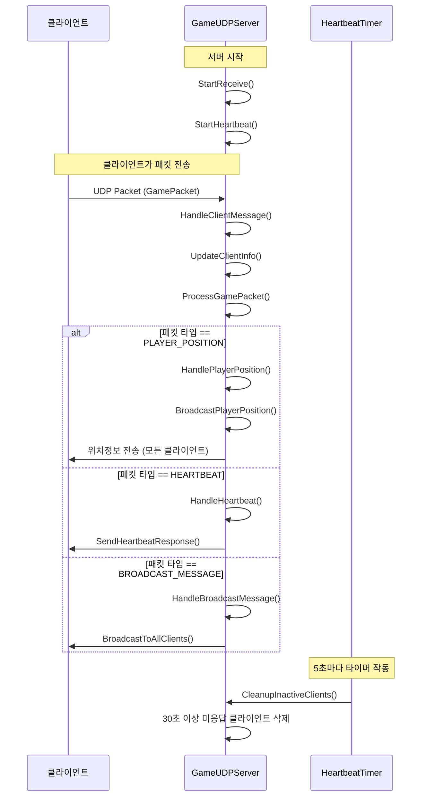
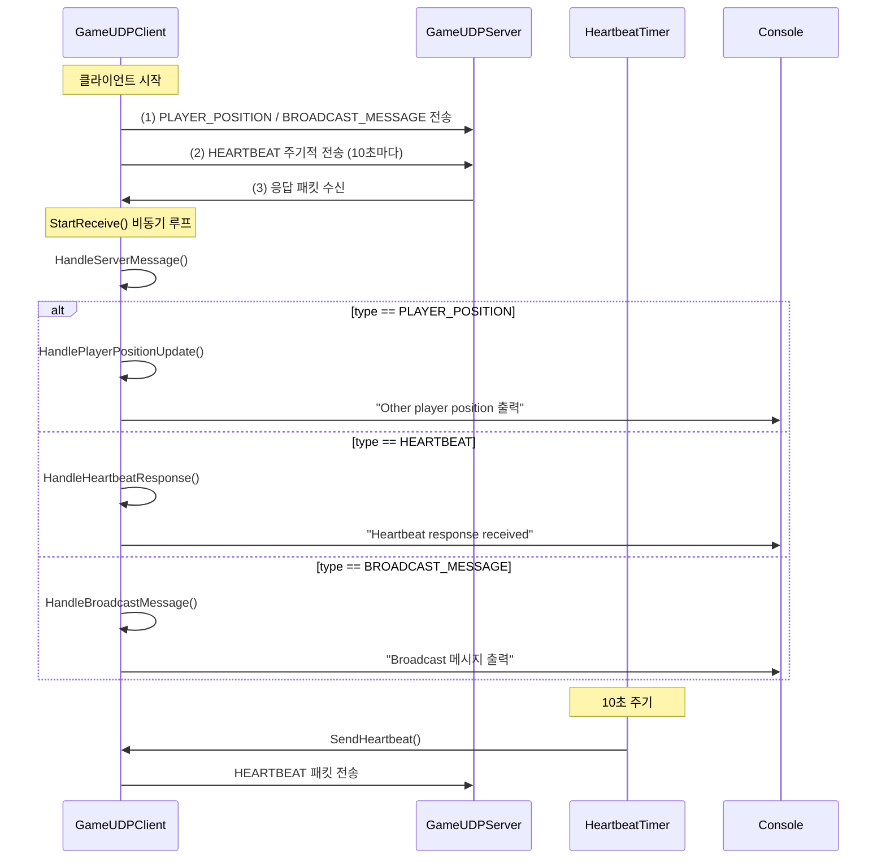
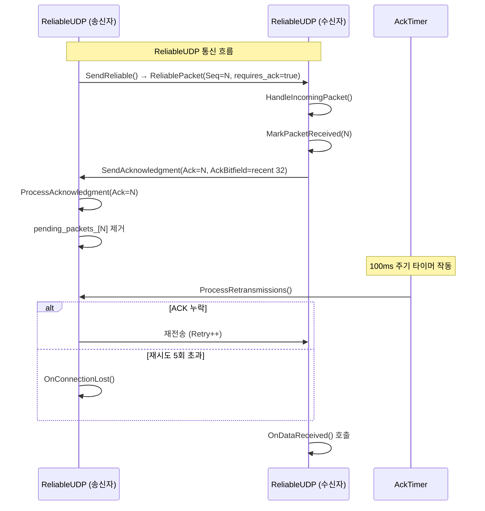

# C++ Boost.Asio로 만드는 온라인 게임 서버
저자: 최흥배, Claude AI   
    
권장 개발 환경
- **IDE**: Visual Studio 2022 (Community 이상)
- **컴파일러**: MSVC v143 (C++20 지원)
- **OS**: Windows 10 이상

-----   

# Chapter 10. UDP 프로그래밍
UDP(User Datagram Protocol)는 실시간 게임에서 빠른 응답성이 필요한 상황에 최적화된 프로토콜이다. 이번 장에서는 Boost.Asio를 활용하여 UDP 기반의 게임 서버와 클라이언트를 구현하는 방법을 학습한다.

## 10.1 UDP의 특성과 활용

### 10.1.1 UDP의 기본 특성
UDP는 TCP와 달리 연결 없는(connectionless) 프로토콜로, 다음과 같은 특성을 가진다:

```cpp
/*
UDP 특성 정리:
1. 비연결성(Connectionless): 연결 설정/해제 과정이 없음
2. 비신뢰성(Unreliable): 패킷 전달 보장 안 됨
3. 순서 보장 안 됨: 패킷 도착 순서가 다를 수 있음
4. 빠른 전송: 오버헤드가 적어 속도가 빠름
5. 브로드캐스트/멀티캐스트 지원
*/

#include <boost/asio.hpp>
#include <iostream>
#include <string>

using boost::asio::ip::udp;
```

### 10.1.2 게임에서 UDP가 유용한 경우

```cpp
// 게임에서 UDP를 사용하는 주요 사례들
enum class GameDataType
{
    PLAYER_POSITION,    // 플레이어 위치 정보
    ANIMATION_STATE,    // 애니메이션 상태
    PROJECTILE_DATA,    // 발사체 정보
    VOICE_CHAT,         // 음성 채팅
    HEARTBEAT,          // 연결 상태 확인
    BROADCAST_MESSAGE   // 브로드캐스트 메시지
};

struct PlayerPosition
{
    uint32_t player_id;
    float x, y, z;
    float rotation;
    uint32_t timestamp;
};

struct GamePacket
{
    GameDataType type;
    uint32_t sequence_number;
    uint32_t data_size;
    // 가변 길이 데이터가 뒤따름
};
```

### 10.1.3 UDP의 장단점 분석

```cpp
class UDPAnalysis
{
public:
    static void PrintAdvantages()
    {
        std::cout << "UDP 장점:\n";
        std::cout << "1. 낮은 지연시간 (Low Latency)\n";
        std::cout << "2. 적은 네트워크 오버헤드\n";
        std::cout << "3. 브로드캐스트/멀티캐스트 지원\n";
        std::cout << "4. 실시간 데이터 전송에 적합\n";
        std::cout << "5. 서버 리소스 사용량 적음\n\n";
    }
    
    static void PrintDisadvantages()
    {
        std::cout << "UDP 단점:\n";
        std::cout << "1. 패킷 손실 가능성\n";
        std::cout << "2. 순서 보장 안 됨\n";
        std::cout << "3. 중복 패킷 가능성\n";
        std::cout << "4. 흐름 제어 없음\n";
        std::cout << "5. 신뢰성 확보를 위한 추가 구현 필요\n\n";
    }
};
```
  
</br>  

## 10.2 비동기 UDP 서버/클라이언트 구현

### 10.2.1 기본 UDP 서버 구현

```cpp
#include <boost/asio.hpp>
#include <boost/bind/bind.hpp>
#include <memory>
#include <iostream>
#include <array>

using boost::asio::ip::udp;

class UDPServer
{
public:
    UDPServer(boost::asio::io_context& io_context, short port)
        : socket_(io_context, udp::endpoint(udp::v4(), port))
    {
        StartReceive();
    }

private:
    void StartReceive()
    {
        socket_.async_receive_from(
            boost::asio::buffer(recv_buffer_), remote_endpoint_,
            boost::bind(&UDPServer::HandleReceive, this,
                boost::asio::placeholders::error,
                boost::asio::placeholders::bytes_transferred));
    }

    void HandleReceive(const boost::system::error_code& error,
                      std::size_t bytes_transferred)
    {
        if (!error)
        {
            // 받은 데이터 처리
            ProcessReceivedData(bytes_transferred);
            
            // Echo 응답 전송
            std::shared_ptr<std::string> message = 
                std::make_shared<std::string>("Echo: ");
            message->append(recv_buffer_.data(), bytes_transferred);

            socket_.async_send_to(
                boost::asio::buffer(*message), remote_endpoint_,
                boost::bind(&UDPServer::HandleSend, this, message,
                    boost::asio::placeholders::error,
                    boost::asio::placeholders::bytes_transferred));
        }
        else
        {
            std::cerr << "Receive error: " << error.message() << std::endl;
        }

        StartReceive();
    }

    void HandleSend(std::shared_ptr<std::string> message,
                   const boost::system::error_code& error,
                   std::size_t bytes_transferred)
    {
        if (error)
        {
            std::cerr << "Send error: " << error.message() << std::endl;
        }
        else
        {
            std::cout << "Sent " << bytes_transferred << " bytes" << std::endl;
        }
    }

    void ProcessReceivedData(std::size_t bytes_transferred)
    {
        std::cout << "Received from " << remote_endpoint_ << ": ";
        std::cout.write(recv_buffer_.data(), bytes_transferred);
        std::cout << std::endl;
    }

    udp::socket socket_;
    udp::endpoint remote_endpoint_;
    std::array<char, 1024> recv_buffer_;
};
```   

위 코드는 Boost.Asio로 UDP 에코 서버를 비동기(Async) 방식으로 구현한 예시다. 핵심은 `async_receive_from`으로 패킷을 받아 처리하고, 같은 송신자에게 `async_send_to`로 “Echo: …” 응답을 보낸 뒤, 다시 수신을 재개하는 루프를 만드는 것이다.

#### 동작 흐름
1. **생성자**
   `udp::socket socket_(io_context, udp::endpoint(udp::v4(), port))`로 IPv4/`port`에 바인딩한 소켓을 연다. 이후 `StartReceive()`를 호출해 첫 수신을 걸어둔다.

2. **수신 시작 – `StartReceive()`**
   `socket_.async_receive_from(buffer(recv_buffer_), remote_endpoint_, HandleReceive)`를 호출한다.

   * 수신된 데이터는 `recv_buffer_`에 들어가고, 송신자의 주소는 `remote_endpoint_`로 채워진다.
   * 작업이 완료되면 `HandleReceive(error, bytes_transferred)`가 호출된다.

3. **수신 완료 처리 – `HandleReceive()`**

   * 에러가 없으면 `ProcessReceivedData(bytes_transferred)`로 데이터를 출력한다.
   * 이어서 응답 메시지 `"Echo: " + 수신데이터`를 만들어 `async_send_to(..., HandleSend)`로 보낸다.
   * 마지막에 **항상** `StartReceive()`를 다시 호출해 다음 패킷을 기다린다. 이로써 끊임없는 수신 루프가 유지된다.

4. **송신 완료 처리 – `HandleSend()`**

   * 에러가 있으면 로그만 찍고, 없으면 전송 바이트 수를 출력한다.

#### 주요 포인트
* **비동기 I/O**: 모든 네트워크 I/O가 콜백 기반으로 이루어지므로, `io_context.run()`이 돌고 있는 스레드가 콜백을 실행한다. 메인에서 `io_context.run()`을 호출해야 실제로 동작한다.
* **엔드포인트 캡처**: `async_receive_from`가 완료되면 `remote_endpoint_`에 발신자의 IP:Port가 들어가며, 이를 그대로 `async_send_to`의 대상 주소로 사용한다.
* **버퍼 관리**: `recv_buffer_`는 클래스 멤버 `std::array<char,1024>`라서 비동기 작업 동안 안전하게 살아있다. 에코 메시지 생성 시 `append(recv_buffer_.data(), bytes_transferred)`로 **실제 수신 길이만** 붙여서 쓰레기 데이터가 뒤섞이는 것을 방지한다.
* **메시지 수명 보장**: `async_send_to`가 끝날 때까지 송신 버퍼가 살아있어야 하므로 `std::shared_ptr<std::string> message`를 만들어 핸들러 인자로 넘긴다. 이렇게 하면 전송 완료 콜백까지 메시지가 유지된다.

#### 에러 처리와 경계 조건
* **수신/송신 에러**: 각각 로그만 남기고 루프는 계속 돈다. 실제 서버라면 특정 에러(예: `operation_aborted`)에 대해 재시도 중단 등의 정책을 둘 수 있다.
* **패킷 크기**: `recv_buffer_`는 1024바이트 고정이라 초과 데이터는 잘릴 수 있다. MTU/평균 패킷 크기에 맞춰 조정하거나, 필요 시 더 큰 버퍼/동적 버퍼를 고려해야 한다.
* **동시성**: 현재 구현은 한 번에 **하나의 수신**만 대기한다. `io_context`를 여러 스레드에서 돌릴 수는 있지만, 같은 소켓에 대해 동시 `async_receive_from` 호출을 늘리려면 주의가 필요하다. 다중 스레드 운용 시에는 `strand` 사용으로 핸들러 직렬화가 유용하다.
* **객체 수명**: 핸들러에서 `this`를 생 포인터로 바인딩하고 있다. 서버 객체가 외부에서 파괴되면 UAF 위험이 생긴다. 일반적으로 `std::enable_shared_from_this`를 상속하고, 핸들러에 `shared_from_this()`를 캡처하는 패턴이 안전하다.

#### 최소 구동 예시
실행을 위해서는 아래와 같이 `main`에서 `io_context.run()`을 호출해야 한다.

```cpp
int main() {
    try {
        boost::asio::io_context io;
        auto server = std::make_shared<UDPServer>(io, 9000);
        io.run();
    } catch (const std::exception& e) {
        std::cerr << "Exception: " << e.what() << std::endl;
    }
}
```
  

### 10.2.2 게임용 고급 UDP 서버

```cpp
class GameUDPServer
{
public:
    GameUDPServer(boost::asio::io_context& io_context, short port)
        : socket_(io_context, udp::endpoint(udp::v4(), port)),
          sequence_number_(0)
    {
        StartReceive();
        StartHeartbeat();
    }

    void BroadcastToAllClients(const std::string& message)
    {
        std::lock_guard<std::mutex> lock(clients_mutex_);
        for (const auto& client : active_clients_)
        {
            SendToClient(client.second, message);
        }
    }

private:
    struct ClientInfo
    {
        udp::endpoint endpoint;
        std::chrono::steady_clock::time_point last_seen;
        uint32_t last_sequence;
    };

    void StartReceive()
    {
        socket_.async_receive_from(
            boost::asio::buffer(recv_buffer_), remote_endpoint_,
            [this](const boost::system::error_code& error, std::size_t bytes)
            {
                if (!error)
                {
                    HandleClientMessage(bytes);
                }
                StartReceive();
            });
    }

    void HandleClientMessage(std::size_t bytes_transferred)
    {
        if (bytes_transferred < sizeof(GamePacket))
            return;

        auto packet = reinterpret_cast<const GamePacket*>(recv_buffer_.data());
        
        // 클라이언트 정보 업데이트
        UpdateClientInfo(remote_endpoint_, packet->sequence_number);
        
        // 패킷 타입별 처리
        ProcessGamePacket(packet, bytes_transferred);
    }

    void UpdateClientInfo(const udp::endpoint& endpoint, uint32_t sequence)
    {
        std::lock_guard<std::mutex> lock(clients_mutex_);
        
        std::string client_key = endpoint.address().to_string() + 
                                ":" + std::to_string(endpoint.port());
        
        auto& client = active_clients_[client_key];
        client.endpoint = endpoint;
        client.last_seen = std::chrono::steady_clock::now();
        client.last_sequence = sequence;
    }

    void ProcessGamePacket(const GamePacket* packet, std::size_t total_size)
    {
        const char* data = reinterpret_cast<const char*>(packet + 1);
        
        switch (packet->type)
        {
        case GameDataType::PLAYER_POSITION:
            HandlePlayerPosition(data, packet->data_size);
            break;
        case GameDataType::HEARTBEAT:
            HandleHeartbeat();
            break;
        case GameDataType::BROADCAST_MESSAGE:
            HandleBroadcastMessage(data, packet->data_size);
            break;
        default:
            std::cout << "Unknown packet type: " 
                     << static_cast<int>(packet->type) << std::endl;
            break;
        }
    }

    void HandlePlayerPosition(const char* data, uint32_t size)
    {
        if (size < sizeof(PlayerPosition))
            return;

        auto pos = reinterpret_cast<const PlayerPosition*>(data);
        std::cout << "Player " << pos->player_id 
                 << " position: (" << pos->x << ", " << pos->y << ", " << pos->z << ")"
                 << std::endl;

        // 다른 클라이언트들에게 브로드캐스트
        BroadcastPlayerPosition(*pos);
    }

    void HandleHeartbeat()
    {
        // 하트비트 응답
        SendHeartbeatResponse(remote_endpoint_);
    }

    void HandleBroadcastMessage(const char* data, uint32_t size)
    {
        std::string message(data, size);
        std::cout << "Broadcast message: " << message << std::endl;
        BroadcastToAllClients(message);
    }

    void BroadcastPlayerPosition(const PlayerPosition& pos)
    {
        GamePacket packet;
        packet.type = GameDataType::PLAYER_POSITION;
        packet.sequence_number = ++sequence_number_;
        packet.data_size = sizeof(PlayerPosition);

        std::vector<char> buffer(sizeof(GamePacket) + sizeof(PlayerPosition));
        std::memcpy(buffer.data(), &packet, sizeof(GamePacket));
        std::memcpy(buffer.data() + sizeof(GamePacket), &pos, sizeof(PlayerPosition));

        std::lock_guard<std::mutex> lock(clients_mutex_);
        for (const auto& client : active_clients_)
        {
            socket_.async_send_to(
                boost::asio::buffer(buffer), client.second.endpoint,
                [](const boost::system::error_code&, std::size_t) {});
        }
    }

    void SendToClient(const ClientInfo& client, const std::string& message)
    {
        GamePacket packet;
        packet.type = GameDataType::BROADCAST_MESSAGE;
        packet.sequence_number = ++sequence_number_;
        packet.data_size = static_cast<uint32_t>(message.size());

        std::vector<char> buffer(sizeof(GamePacket) + message.size());
        std::memcpy(buffer.data(), &packet, sizeof(GamePacket));
        std::memcpy(buffer.data() + sizeof(GamePacket), message.data(), message.size());

        auto send_buffer = std::make_shared<std::vector<char>>(std::move(buffer));
        socket_.async_send_to(
            boost::asio::buffer(*send_buffer), client.endpoint,
            [send_buffer](const boost::system::error_code&, std::size_t) {});
    }

    void SendHeartbeatResponse(const udp::endpoint& endpoint)
    {
        GamePacket packet;
        packet.type = GameDataType::HEARTBEAT;
        packet.sequence_number = ++sequence_number_;
        packet.data_size = 0;

        socket_.async_send_to(
            boost::asio::buffer(&packet, sizeof(GamePacket)), endpoint,
            [](const boost::system::error_code&, std::size_t) {});
    }

    void StartHeartbeat()
    {
        heartbeat_timer_ = std::make_unique<boost::asio::steady_timer>(
            socket_.get_executor(), std::chrono::seconds(5));
        
        heartbeat_timer_->async_wait([this](const boost::system::error_code& ec)
        {
            if (!ec)
            {
                CleanupInactiveClients();
                StartHeartbeat();
            }
        });
    }

    void CleanupInactiveClients()
    {
        std::lock_guard<std::mutex> lock(clients_mutex_);
        auto now = std::chrono::steady_clock::now();
        auto timeout = std::chrono::seconds(30);

        for (auto it = active_clients_.begin(); it != active_clients_.end();)
        {
            if (now - it->second.last_seen > timeout)
            {
                std::cout << "Client timeout: " << it->first << std::endl;
                it = active_clients_.erase(it);
            }
            else
            {
                ++it;
            }
        }
    }

    udp::socket socket_;
    udp::endpoint remote_endpoint_;
    std::array<char, 1024> recv_buffer_;
    
    std::unordered_map<std::string, ClientInfo> active_clients_;
    std::mutex clients_mutex_;
    
    std::atomic<uint32_t> sequence_number_;
    std::unique_ptr<boost::asio::steady_timer> heartbeat_timer_;
};
```
  
이 코드는 **멀티 클라이언트 지원 + 상태 관리 + 하트비트 기반 정리(clean-up)** 가 포함된 고급 UDP 서버 예제다.
단순히 패킷을 받고 돌려주는 수준이 아니라, **클라이언트 추적**, **브로드캐스트**, **데이터 타입 처리**, **비활성 클라이언트 제거** 등의 기능을 포함하고 있다.

#### 🔧 전체 구조 개요
이 서버는 `Boost.Asio` 기반 비동기 UDP 서버로서 다음의 구성 요소를 가진다.

| 구성 요소                       | 역할                                    |
| --------------------------- | ------------------------------------- |
| `GameUDPServer`             | 서버의 핵심 클래스                            |
| `ClientInfo`                | 각 클라이언트의 상태(주소, 최근 시각, 시퀀스 번호)를 저장    |
| `GamePacket`                | 공통 패킷 헤더 구조체 (타입, 시퀀스 번호, 데이터 크기 포함)  |
| `GameDataType`              | 패킷 타입 정의 (위치, 하트비트, 브로드캐스트 등)         |
| `PlayerPosition`            | 플레이어 위치 정보 구조체 (player_id, x, y, z 등) |
| `boost::asio::steady_timer` | 주기적 하트비트 체크용 타이머                      |


#### 📜 코드 흐름 요약
1. **서버 시작**

   * `GameUDPServer` 생성자에서 UDP 소켓을 지정 포트에 바인딩.
   * `StartReceive()` 호출 → 클라이언트 패킷 비동기 수신 시작.
   * `StartHeartbeat()` 호출 → 5초마다 클라이언트 타임아웃 검사.

2. **패킷 수신**

   * `StartReceive()`에서 `async_receive_from()` 호출.
   * 수신 완료 시 람다 콜백으로 `HandleClientMessage()` 호출.

3. **클라이언트 관리**

   * `UpdateClientInfo()`에서 `endpoint` 기준으로 클라이언트를 식별.
   * 마지막 수신 시각(`last_seen`)과 마지막 시퀀스 번호 갱신.

4. **패킷 처리**

   * `ProcessGamePacket()`에서 `packet->type`에 따라 분기:

     * `PLAYER_POSITION`: 좌표 출력 후 `BroadcastPlayerPosition()`으로 전파.
     * `HEARTBEAT`: `SendHeartbeatResponse()`로 응답.
     * `BROADCAST_MESSAGE`: 모든 클라이언트에 메시지 전송.

5. **브로드캐스트 전송**

   * `BroadcastToAllClients()` 또는 `BroadcastPlayerPosition()`에서
     모든 `active_clients_`에 대해 `async_send_to()` 수행.

6. **하트비트 관리**

   * `StartHeartbeat()`는 5초 후 `CleanupInactiveClients()` 호출 예약.
   * `CleanupInactiveClients()`는 30초 이상 반응 없는 클라이언트 삭제.


#### 🧩 주요 클래스/멤버 설명

`ClientInfo`

```cpp
struct ClientInfo {
    udp::endpoint endpoint;                     // 클라이언트 주소
    std::chrono::steady_clock::time_point last_seen; // 마지막 패킷 수신 시간
    uint32_t last_sequence;                     // 마지막으로 받은 시퀀스 번호
};
```

→ 클라이언트별로 상태를 저장해 재접속 및 중복 관리에 사용한다.
  

`GamePacket`

(코드에는 정의 안 되어 있지만 일반적으로 다음과 같음)

```cpp
struct GamePacket {
    GameDataType type;       // 패킷 종류 (enum)
    uint32_t sequence_number; 
    uint32_t data_size;      
};
```

→ 헤더 이후 실제 데이터(payload)가 따라온다.


#### 🧠 주요 동작 설명

1. `StartReceive()`  
비동기 수신 등록:

```cpp
socket_.async_receive_from(
    boost::asio::buffer(recv_buffer_), remote_endpoint_,
    [this](auto error, std::size_t bytes) { ... });
```

수신이 완료되면 `remote_endpoint_`에 송신자 주소가 저장되고, `HandleClientMessage()`가 호출된다.


2. `HandleClientMessage()`  

* 받은 버퍼를 `GamePacket`으로 캐스팅.
* `UpdateClientInfo()`로 클라이언트 정보 업데이트.
* `ProcessGamePacket()`으로 실제 패킷 처리 위임.


3. `ProcessGamePacket()`  
패킷 타입에 따라 분기 처리:

* `PLAYER_POSITION`: 플레이어 위치 갱신 및 브로드캐스트.
* `HEARTBEAT`: 클라이언트 생존 확인 → 응답 송신.
* `BROADCAST_MESSAGE`: 전체 클라이언트에게 메시지 전달.

  
4. `BroadcastPlayerPosition()`  

* `GamePacket + PlayerPosition` 구조로 버퍼 생성.
* `active_clients_`에 있는 모든 클라이언트에게 비동기 전송.
  

5. `StartHeartbeat()`  
 
* 5초마다 `steady_timer`가 동작해 `CleanupInactiveClients()` 실행.
* 30초 이상 응답이 없는 클라이언트 삭제.


#### 🕹 코드 흐름 다이어그램




#### 🧭 동작 요약

| 항목       | 설명                                             |
| -------- | ---------------------------------------------- |
| 네트워크 I/O | `async_receive_from` / `async_send_to`로 비동기 처리 |
| 클라이언트 관리 | IP:Port 문자열 키 기반의 `unordered_map`              |
| 스레드 안전   | `std::mutex`로 `active_clients_` 보호             |
| 생존 확인    | 하트비트 + 30초 타임아웃 기반 클라이언트 정리                    |
| 브로드캐스트   | 모든 클라이언트에게 동시 전송 가능                            |
| 시퀀스 관리   | `std::atomic<uint32_t>`로 전송 패킷 번호 증가           |


#### 💡 정리
`GameUDPServer`는 단순 에코 서버에서 한 단계 발전해, **게임 네트워크 서버의 핵심 구성 요소**를 포함한 형태다.
즉,

* 클라이언트별 세션 관리
* 실시간 좌표 브로드캐스트
* 하트비트로 생존 확인
* 비동기 이벤트 루프 기반 확장성

등을 모두 갖춘 구조로, 실제 게임 서버의 **UDP 세션 관리 모델의 축소판**이라 볼 수 있다.

    
### 10.2.3 UDP 클라이언트 구현

```cpp
class GameUDPClient
{
public:
    GameUDPClient(boost::asio::io_context& io_context, 
                  const std::string& host, const std::string& port)
        : socket_(io_context), sequence_number_(0)
    {
        udp::resolver resolver(io_context);
        server_endpoint_ = *resolver.resolve(udp::v4(), host, port).begin();
        
        socket_.open(udp::v4());
        StartReceive();
        StartHeartbeat();
    }

    void SendPlayerPosition(float x, float y, float z, float rotation)
    {
        PlayerPosition pos;
        pos.player_id = 12345; // 실제로는 클라이언트 ID
        pos.x = x;
        pos.y = y;
        pos.z = z;
        pos.rotation = rotation;
        pos.timestamp = static_cast<uint32_t>(
            std::chrono::duration_cast<std::chrono::milliseconds>(
                std::chrono::steady_clock::now().time_since_epoch()).count());

        SendGameData(GameDataType::PLAYER_POSITION, &pos, sizeof(pos));
    }

    void SendBroadcastMessage(const std::string& message)
    {
        SendGameData(GameDataType::BROADCAST_MESSAGE, message.data(), message.size());
    }

private:
    void StartReceive()
    {
        socket_.async_receive_from(
            boost::asio::buffer(recv_buffer_), sender_endpoint_,
            [this](const boost::system::error_code& error, std::size_t bytes)
            {
                if (!error)
                {
                    HandleServerMessage(bytes);
                }
                StartReceive();
            });
    }

    void HandleServerMessage(std::size_t bytes_transferred)
    {
        if (bytes_transferred < sizeof(GamePacket))
            return;

        auto packet = reinterpret_cast<const GamePacket*>(recv_buffer_.data());
        const char* data = reinterpret_cast<const char*>(packet + 1);

        switch (packet->type)
        {
        case GameDataType::PLAYER_POSITION:
            HandlePlayerPositionUpdate(data, packet->data_size);
            break;
        case GameDataType::HEARTBEAT:
            HandleHeartbeatResponse();
            break;
        case GameDataType::BROADCAST_MESSAGE:
            HandleBroadcastMessage(data, packet->data_size);
            break;
        }
    }

    void HandlePlayerPositionUpdate(const char* data, uint32_t size)
    {
        if (size < sizeof(PlayerPosition))
            return;

        auto pos = reinterpret_cast<const PlayerPosition*>(data);
        std::cout << "Other player " << pos->player_id 
                 << " at (" << pos->x << ", " << pos->y << ", " << pos->z << ")"
                 << std::endl;
    }

    void HandleHeartbeatResponse()
    {
        last_heartbeat_response_ = std::chrono::steady_clock::now();
        std::cout << "Heartbeat response received" << std::endl;
    }

    void HandleBroadcastMessage(const char* data, uint32_t size)
    {
        std::string message(data, size);
        std::cout << "Broadcast: " << message << std::endl;
    }

    void SendGameData(GameDataType type, const void* data, size_t data_size)
    {
        GamePacket packet;
        packet.type = type;
        packet.sequence_number = ++sequence_number_;
        packet.data_size = static_cast<uint32_t>(data_size);

        std::vector<char> buffer(sizeof(GamePacket) + data_size);
        std::memcpy(buffer.data(), &packet, sizeof(GamePacket));
        if (data_size > 0)
        {
            std::memcpy(buffer.data() + sizeof(GamePacket), data, data_size);
        }

        auto send_buffer = std::make_shared<std::vector<char>>(std::move(buffer));
        socket_.async_send_to(
            boost::asio::buffer(*send_buffer), server_endpoint_,
            [send_buffer](const boost::system::error_code& ec, std::size_t bytes)
            {
                if (ec)
                {
                    std::cerr << "Send error: " << ec.message() << std::endl;
                }
            });
    }

    void StartHeartbeat()
    {
        heartbeat_timer_ = std::make_unique<boost::asio::steady_timer>(
            socket_.get_executor(), std::chrono::seconds(10));
        
        heartbeat_timer_->async_wait([this](const boost::system::error_code& ec)
        {
            if (!ec)
            {
                SendHeartbeat();
                StartHeartbeat();
            }
        });
    }

    void SendHeartbeat()
    {
        SendGameData(GameDataType::HEARTBEAT, nullptr, 0);
    }

    udp::socket socket_;
    udp::endpoint server_endpoint_;
    udp::endpoint sender_endpoint_;
    std::array<char, 1024> recv_buffer_;
    
    std::atomic<uint32_t> sequence_number_;
    std::chrono::steady_clock::time_point last_heartbeat_response_;
    std::unique_ptr<boost::asio::steady_timer> heartbeat_timer_;
};
```
   
이 코드는 **`Boost.Asio` 기반의 게임용 UDP 클라이언트** 구현 예제다.
이전의 `GameUDPServer`와 짝을 이루는 코드로, **서버와의 비동기 통신**, **하트비트 전송**, **플레이어 위치 및 메시지 송수신**을 담당한다.

#### 📦 전체 개요
이 클라이언트는 다음의 특징을 가진다:

| 기능        | 설명                                                              |
| --------- | --------------------------------------------------------------- |
| 비동기 수신    | `async_receive_from()`으로 서버 메시지를 비동기적으로 수신                      |
| 하트비트 전송   | 10초마다 서버로 생존 신호(`HEARTBEAT`) 송신                                 |
| 데이터 송신    | `GamePacket` 헤더를 붙여 `PLAYER_POSITION`, `BROADCAST_MESSAGE` 등 전송 |
| 서버 응답 처리  | 서버에서 오는 좌표/메시지/하트비트 응답을 구분하여 처리                                 |
| 시퀀스 번호 관리 | 모든 송신 패킷은 `atomic<uint32_t>` 기반 순번을 증가시킴                        |


#### 🔧 주요 구성 요소

1. `GameUDPClient` 클래스  
UDP 소켓을 관리하고, 서버와의 통신 로직 전체를 담당한다.

| 멤버                               | 역할               |
| -------------------------------- | ---------------- |
| `udp::socket socket_`            | UDP 소켓 객체        |
| `udp::endpoint server_endpoint_` | 서버의 주소와 포트       |
| `recv_buffer_`                   | 수신 데이터 버퍼        |
| `sequence_number_`               | 전송 패킷의 일련번호      |
| `heartbeat_timer_`               | 주기적인 하트비트 전송 타이머 |
| `last_heartbeat_response_`       | 마지막 하트비트 응답 시간   |


#### ⚙️ 주요 함수별 상세 설명

🧩 1. 생성자  

```cpp
GameUDPClient(io_context, host, port)
```

* DNS를 통해 서버 주소(`host`, `port`)를 `resolve()`.
* UDP 소켓을 `open(udp::v4())`으로 초기화.
* `StartReceive()`로 수신 대기 시작.
* `StartHeartbeat()`로 주기적 하트비트 타이머 설정.

➡️ 클라이언트가 생성되면 바로 서버와 통신 가능한 상태가 된다.

  
🧭 2. `StartReceive()`  

```cpp
socket_.async_receive_from(
    boost::asio::buffer(recv_buffer_), sender_endpoint_,
    [this](error, bytes) { ... });
```

* 서버에서 오는 모든 UDP 패킷을 비동기 수신한다.
* 수신이 완료되면 `HandleServerMessage(bytes)` 호출.
* 그 후 **다시 `StartReceive()`를 호출**해 루프 유지.

➡️ 클라이언트는 끊임없이 서버의 응답을 수신 대기한다.

  
📬 3. `HandleServerMessage()`  

```cpp
auto packet = reinterpret_cast<const GamePacket*>(recv_buffer_.data());
switch (packet->type) { ... }
```

* 받은 버퍼를 `GamePacket` 구조로 해석한다.
* `type`에 따라 분기:

  * `PLAYER_POSITION` → `HandlePlayerPositionUpdate()`
  * `HEARTBEAT` → `HandleHeartbeatResponse()`
  * `BROADCAST_MESSAGE` → `HandleBroadcastMessage()`

➡️ 서버에서 오는 패킷의 용도(좌표, 하트비트, 채팅 메시지)를 식별해 처리한다.

 
🧍 4. `SendPlayerPosition()`  

```cpp
PlayerPosition pos;
pos.player_id = 12345;
pos.x = x; pos.y = y; pos.z = z;
pos.rotation = rotation;
pos.timestamp = 현재 시각;
SendGameData(GameDataType::PLAYER_POSITION, &pos, sizeof(pos));
```

* 현재 플레이어의 위치 정보를 `PlayerPosition` 구조체에 담아 서버로 전송.
* 서버는 이를 다른 클라이언트에게 브로드캐스트한다.

  
📢 5. `SendBroadcastMessage()`  

```cpp
SendGameData(GameDataType::BROADCAST_MESSAGE, message.data(), message.size());
```

* 채팅이나 알림 메시지를 서버로 전송.
* 서버는 이 메시지를 전체 클라이언트에 브로드캐스트한다.

  
💓 6. `StartHeartbeat()` / `SendHeartbeat()`  

* 10초마다 타이머(`steady_timer`)가 동작해 `SendHeartbeat()` 호출.
* `SendHeartbeat()`는 데이터 없이 `HEARTBEAT` 패킷 전송.
* 서버는 이에 대한 응답을 다시 `HandleHeartbeatResponse()`로 보낸다.

➡️ 네트워크 연결 유지 및 서버 연결 확인용 메커니즘이다.

  
⚒ 7. `SendGameData()`  

```cpp
GamePacket packet;
packet.type = type;
packet.sequence_number = ++sequence_number_;
packet.data_size = data_size;
```

* `GamePacket` 헤더 + 데이터(payload)를 조합해 UDP 패킷 생성.
* `async_send_to()`로 서버에 비동기 송신.
* 송신 버퍼는 `shared_ptr`로 관리해 수명 보장.

➡️ 모든 송신 함수(`SendPlayerPosition`, `SendBroadcastMessage`, `SendHeartbeat`)는 이 함수를 공통으로 사용한다.

  
#### 💡 전체 동작 흐름

1. **클라이언트 생성**

   * 서버 주소 해석 및 소켓 열기.
   * 수신 루프와 하트비트 타이머 시작.

2. **주기적 하트비트 송신**

   * 10초마다 서버로 `HEARTBEAT` 패킷 송신.
   * 서버로부터 응답을 받으면 `HandleHeartbeatResponse()` 실행.

3. **사용자 입력 (예: 이동, 채팅)**

   * `SendPlayerPosition()` 또는 `SendBroadcastMessage()` 호출.
   * `SendGameData()`를 통해 서버로 전송.

4. **서버로부터 응답 수신**

   * `StartReceive()` → `HandleServerMessage()`
   * 타입별 처리 (`PLAYER_POSITION`, `BROADCAST_MESSAGE`, `HEARTBEAT` 등).

  
#### 🧭 동작 흐름 다이어그램 (머메이드)



  
#### 🧩 정리

| 항목           | 설명                                 |
| ------------ | ---------------------------------- |
| **네트워크 모델**  | UDP 비동기 방식                         |
| **수신 루프**    | 항상 `StartReceive()`로 재등록           |
| **전송 버퍼 관리** | `shared_ptr`을 사용해 송신 완료 시점까지 수명 유지 |
| **하트비트 관리**  | 10초 주기 전송 + 서버 응답 갱신               |
| **확장성**      | 패킷 타입(enum) 기반으로 기능 확장 용이          |
| **실전 적용**    | 위치 동기화, 채팅 시스템, 연결 유지 등 기본 토대 제공   |


이 `GameUDPClient`는 **게임 클라이언트가 서버와 실시간 상태를 주고받는 기본 통신 골격**이다.
이를 기반으로 실제 게임에서는 다음을 확장할 수 있다:

* 패킷 암호화 / 압축
* 클라이언트 인증 및 식별
* 예측 보정 (client-side prediction)
* 패킷 손실 복구 (reliable UDP 구현)

즉, 이 예제는 **게임 네트워크 프로그래밍의 비동기 UDP 통신 기본 구조를 완전하게 보여주는 표준적인 코드**라 할 수 있다.
  

</br>  
  

## 10.3 게임에서의 UDP 활용 사례

### 10.4.1 실시간 위치 동기화 시스템

```cpp
class RealtimePositionSync
{
public:
    struct PositionData
    {
        uint32_t player_id;
        float x, y, z;
        float velocity_x, velocity_y, velocity_z;
        float rotation;
        uint32_t timestamp;
        uint32_t sequence;
    };

    RealtimePositionSync(boost::asio::io_context& io_context)
        : socket_(io_context), timer_(io_context), sequence_(0)
    {
        StartSyncTimer();
    }

    void UpdatePosition(uint32_t player_id, float x, float y, float z,
                       float vx, float vy, float vz, float rotation)
    {
        std::lock_guard<std::mutex> lock(position_mutex_);
        
        auto& pos = player_positions_[player_id];
        pos.player_id = player_id;
        pos.x = x; pos.y = y; pos.z = z;
        pos.velocity_x = vx; pos.velocity_y = vy; pos.velocity_z = vz;
        pos.rotation = rotation;
        pos.timestamp = GetCurrentTimestamp();
        pos.sequence = ++sequence_;
    }

    void BroadcastPositions()
    {
        std::lock_guard<std::mutex> lock(position_mutex_);
        
        for (const auto& pair : player_positions_)
        {
            const auto& pos = pair.second;
            
            // 위치 데이터를 모든 클라이언트에게 전송
            BroadcastPosition(pos);
        }
    }

private:
    void StartSyncTimer()
    {
        // 60fps로 위치 동기화
        timer_.expires_after(std::chrono::milliseconds(16));
        timer_.async_wait([this](const boost::system::error_code& ec)
        {
            if (!ec)
            {
                BroadcastPositions();
                StartSyncTimer();
            }
        });
    }

    void BroadcastPosition(const PositionData& pos)
    {
        // UDP를 통한 위치 데이터 브로드캐스트
        auto buffer = std::make_shared<std::vector<char>>(sizeof(PositionData));
        std::memcpy(buffer->data(), &pos, sizeof(PositionData));

        // 모든 활성 클라이언트에게 전송 (클라이언트 목록은 별도 관리)
        for (const auto& client : active_clients_)
        {
            socket_.async_send_to(
                boost::asio::buffer(*buffer), client,
                [buffer](const boost::system::error_code&, std::size_t) {});
        }
    }

    uint32_t GetCurrentTimestamp()
    {
        return static_cast<uint32_t>(
            std::chrono::duration_cast<std::chrono::milliseconds>(
                std::chrono::steady_clock::now().time_since_epoch()).count());
    }

    udp::socket socket_;
    boost::asio::steady_timer timer_;
    
    std::unordered_map<uint32_t, PositionData> player_positions_;
    std::mutex position_mutex_;
    
    std::vector<udp::endpoint> active_clients_;
    std::atomic<uint32_t> sequence_;
};
```

### 10.3.2 게임 이벤트 브로드캐스트 시스템

```cpp
class GameEventBroadcaster
{
public:
    enum class EventType
    {
        PLAYER_SPAWN,
        PLAYER_DEATH,
        ITEM_PICKUP,
        EXPLOSION,
        ACHIEVEMENT,
        MATCH_RESULT
    };

    struct GameEvent
    {
        EventType type;
        uint32_t source_player_id;
        uint32_t target_player_id;
        float x, y, z; // 이벤트 발생 위치
        uint32_t event_data; // 추가 이벤트 데이터
        uint32_t timestamp;
    };

    GameEventBroadcaster(boost::asio::io_context& io_context, short port)
        : socket_(io_context, udp::endpoint(udp::v4(), port))
    {
    }

    void TriggerEvent(EventType type, uint32_t source_id, uint32_t target_id,
                     float x, float y, float z, uint32_t data = 0)
    {
        GameEvent event;
        event.type = type;
        event.source_player_id = source_id;
        event.target_player_id = target_id;
        event.x = x; event.y = y; event.z = z;
        event.event_data = data;
        event.timestamp = GetCurrentTimestamp();

        BroadcastEvent(event);
        LogEvent(event);
    }

    void AddClient(const udp::endpoint& client)
    {
        std::lock_guard<std::mutex> lock(clients_mutex_);
        clients_.insert(client);
        std::cout << "Client added: " << client << std::endl;
    }

    void RemoveClient(const udp::endpoint& client)
    {
        std::lock_guard<std::mutex> lock(clients_mutex_);
        clients_.erase(client);
        std::cout << "Client removed: " << client << std::endl;
    }

private:
    void BroadcastEvent(const GameEvent& event)
    {
        auto buffer = std::make_shared<std::vector<char>>(sizeof(GameEvent));
        std::memcpy(buffer->data(), &event, sizeof(GameEvent));

        std::lock_guard<std::mutex> lock(clients_mutex_);
        for (const auto& client : clients_)
        {
            socket_.async_send_to(
                boost::asio::buffer(*buffer), client,
                [buffer](const boost::system::error_code& ec, std::size_t bytes)
                {
                    if (ec)
                    {
                        std::cerr << "Broadcast error: " << ec.message() << std::endl;
                    }
                });
        }
    }

    void LogEvent(const GameEvent& event)
    {
        std::cout << "Event: " << GetEventTypeName(event.type)
                 << " Source: " << event.source_player_id
                 << " Target: " << event.target_player_id
                 << " Position: (" << event.x << ", " << event.y << ", " << event.z << ")"
                 << std::endl;
    }

    std::string GetEventTypeName(EventType type)
    {
        switch (type)
        {
        case EventType::PLAYER_SPAWN: return "PLAYER_SPAWN";
        case EventType::PLAYER_DEATH: return "PLAYER_DEATH";
        case EventType::ITEM_PICKUP: return "ITEM_PICKUP";
        case EventType::EXPLOSION: return "EXPLOSION";
        case EventType::ACHIEVEMENT: return "ACHIEVEMENT";
        case EventType::MATCH_RESULT: return "MATCH_RESULT";
        default: return "UNKNOWN";
        }
    }

    uint32_t GetCurrentTimestamp()
    {
        return static_cast<uint32_t>(
            std::chrono::duration_cast<std::chrono::milliseconds>(
                std::chrono::steady_clock::now().time_since_epoch()).count());
    }

    udp::socket socket_;
    std::set<udp::endpoint> clients_;
    std::mutex clients_mutex_;
};
```
  
## 10.4 신뢰성 있는 UDP 구현

```cpp
class ReliableUDP
{
public:
    struct ReliablePacket
    {
        uint32_t sequence_number;
        uint32_t ack_number;
        uint32_t ack_bitfield; // 32개 이전 패킷의 수신 여부
        bool requires_ack;
        uint32_t data_size;
        // 데이터가 뒤따름
    };

    ReliableUDP(boost::asio::io_context& io_context, udp::endpoint local_endpoint)
        : socket_(io_context, local_endpoint), send_sequence_(0), recv_sequence_(0)
    {
        StartReceive();
        StartAckTimer();
    }

    void SendReliable(const std::vector<char>& data, const udp::endpoint& target)
    {
        uint32_t seq = ++send_sequence_;
        
        // 패킷 생성
        std::vector<char> packet(sizeof(ReliablePacket) + data.size());
        auto* header = reinterpret_cast<ReliablePacket*>(packet.data());
        header->sequence_number = seq;
        header->requires_ack = true;
        header->data_size = static_cast<uint32_t>(data.size());
        
        std::memcpy(packet.data() + sizeof(ReliablePacket), data.data(), data.size());

        // 전송
        SendPacket(packet, target);
        
        // 재전송을 위해 보관
        PendingPacket pending;
        pending.packet = packet;
        pending.target = target;
        pending.sequence = seq;
        pending.send_time = std::chrono::steady_clock::now();
        pending.retry_count = 0;
        
        std::lock_guard<std::mutex> lock(pending_mutex_);
        pending_packets_[seq] = pending;
    }

    void SendUnreliable(const std::vector<char>& data, const udp::endpoint& target)
    {
        uint32_t seq = ++send_sequence_;
        
        std::vector<char> packet(sizeof(ReliablePacket) + data.size());
        auto* header = reinterpret_cast<ReliablePacket*>(packet.data());
        header->sequence_number = seq;
        header->requires_ack = false;
        header->data_size = static_cast<uint32_t>(data.size());
        
        std::memcpy(packet.data() + sizeof(ReliablePacket), data.data(), data.size());
        
        SendPacket(packet, target);
    }

private:
    struct PendingPacket
    {
        std::vector<char> packet;
        udp::endpoint target;
        uint32_t sequence;
        std::chrono::steady_clock::time_point send_time;
        int retry_count;
    };

    void StartReceive()
    {
        socket_.async_receive_from(
            boost::asio::buffer(recv_buffer_), remote_endpoint_,
            [this](const boost::system::error_code& error, std::size_t bytes)
            {
                if (!error)
                {
                    HandleIncomingPacket(bytes);
                }
                StartReceive();
            });
    }

    void HandleIncomingPacket(std::size_t bytes_transferred)
    {
        if (bytes_transferred < sizeof(ReliablePacket))
            return;

        auto* header = reinterpret_cast<const ReliablePacket*>(recv_buffer_.data());
        
        // ACK 처리
        ProcessAcknowledgment(header->ack_number, header->ack_bitfield);
        
        // 패킷 순서 확인
        if (IsNewPacket(header->sequence_number))
        {
            // 새 패킷 처리
            MarkPacketReceived(header->sequence_number);
            
            if (header->data_size > 0)
            {
                std::vector<char> data(header->data_size);
                std::memcpy(data.data(), recv_buffer_.data() + sizeof(ReliablePacket), 
                           header->data_size);
                
                // 데이터 처리 (상위 레이어로 전달)
                OnDataReceived(data, remote_endpoint_);
            }
        }
        
        // ACK 응답 (필요한 경우)
        if (header->requires_ack)
        {
            SendAcknowledgment(remote_endpoint_);
        }
    }

    void ProcessAcknowledgment(uint32_t ack_number, uint32_t ack_bitfield)
    {
        std::lock_guard<std::mutex> lock(pending_mutex_);
        
        // 가장 최근 ACK 처리
        auto it = pending_packets_.find(ack_number);
        if (it != pending_packets_.end())
        {
            pending_packets_.erase(it);
        }
        
        // 비트필드로 이전 패킷들 ACK 처리
        for (int i = 0; i < 32; ++i)
        {
            if (ack_bitfield & (1u << i))
            {
                uint32_t seq = ack_number - (i + 1);
                auto bit_it = pending_packets_.find(seq);
                if (bit_it != pending_packets_.end())
                {
                    pending_packets_.erase(bit_it);
                }
            }
        }
    }

    bool IsNewPacket(uint32_t sequence)
    {
        // 시퀀스 번호 체크 (순환 시퀀스 고려)
        return sequence > recv_sequence_ || 
               (recv_sequence_ - sequence) > (UINT32_MAX / 2);
    }

    void MarkPacketReceived(uint32_t sequence)
    {
        if (sequence > recv_sequence_)
        {
            recv_sequence_ = sequence;
        }
        
        // 수신 비트필드 업데이트
        uint32_t diff = recv_sequence_ - sequence;
        if (diff < 32)
        {
            recv_bitfield_ |= (1u << diff);
        }
    }

    void SendAcknowledgment(const udp::endpoint& target)
    {
        ReliablePacket ack_packet;
        ack_packet.sequence_number = ++send_sequence_;
        ack_packet.ack_number = recv_sequence_;
        ack_packet.ack_bitfield = recv_bitfield_;
        ack_packet.requires_ack = false;
        ack_packet.data_size = 0;
        
        std::vector<char> packet(sizeof(ReliablePacket));
        std::memcpy(packet.data(), &ack_packet, sizeof(ReliablePacket));
        
        SendPacket(packet, target);
    }

    void SendPacket(const std::vector<char>& packet, const udp::endpoint& target)
    {
        auto buffer = std::make_shared<std::vector<char>>(packet);
        socket_.async_send_to(
            boost::asio::buffer(*buffer), target,
            [buffer](const boost::system::error_code&, std::size_t) {});
    }

    void StartAckTimer()
    {
        ack_timer_ = std::make_unique<boost::asio::steady_timer>(
            socket_.get_executor(), std::chrono::milliseconds(100));
        
        ack_timer_->async_wait([this](const boost::system::error_code& ec)
        {
            if (!ec)
            {
                ProcessRetransmissions();
                StartAckTimer();
            }
        });
    }

    void ProcessRetransmissions()
    {
        std::lock_guard<std::mutex> lock(pending_mutex_);
        auto now = std::chrono::steady_clock::now();
        
        for (auto& pair : pending_packets_)
        {
            auto& pending = pair.second;
            auto elapsed = std::chrono::duration_cast<std::chrono::milliseconds>(
                now - pending.send_time);
            
            if (elapsed.count() > 200 && pending.retry_count < 5) // 200ms 타임아웃
            {
                SendPacket(pending.packet, pending.target);
                pending.send_time = now;
                pending.retry_count++;
            }
            else if (pending.retry_count >= 5)
            {
                // 최대 재시도 초과 - 연결 끊김으로 처리
                OnConnectionLost(pending.target);
            }
        }
    }

    void OnDataReceived(const std::vector<char>& data, const udp::endpoint& sender)
    {
        // 상위 레이어로 데이터 전달
        std::cout << "Received " << data.size() << " bytes from " << sender << std::endl;
    }

    void OnConnectionLost(const udp::endpoint& peer)
    {
        std::cout << "Connection lost to " << peer << std::endl;
    }

    udp::socket socket_;
    udp::endpoint remote_endpoint_;
    std::array<char, 1024> recv_buffer_;
    
    std::atomic<uint32_t> send_sequence_;
    uint32_t recv_sequence_;
    uint32_t recv_bitfield_;
    
    std::unordered_map<uint32_t, PendingPacket> pending_packets_;
    std::mutex pending_mutex_;
    
    std::unique_ptr<boost::asio::steady_timer> ack_timer_;
};
```

이 코드는 **UDP 기반이지만 신뢰성(Reliability)을 보장하는 전송 계층**을 구현한 예제다.
즉, TCP의 일부 기능(재전송, ACK, 순서 관리)을 직접 UDP 위에서 구현해 **“Reliable UDP” 프로토콜**을 만든 것이다.
게임 네트워킹, 스트리밍 등에서 **낮은 지연(latency)**을 유지하면서 **일부 데이터는 반드시 도착해야 하는 상황**에 유용하다.


### 📦 전체 구조 개요

| 구성 요소                                     | 설명                                    |
| ----------------------------------------- | ------------------------------------- |
| **`ReliablePacket`**                      | 전송되는 패킷의 헤더 구조체 (시퀀스, ACK, 비트필드 등 포함) |
| **`PendingPacket`**                       | 아직 ACK를 받지 못한 송신 패킷의 정보 (재전송용)        |
| **`pending_packets_`**                    | 시퀀스 번호를 키로 `PendingPacket` 보관하는 map   |
| **`recv_sequence_`**                      | 마지막으로 받은 패킷의 시퀀스 번호                   |
| **`recv_bitfield_`**                      | 최근 32개 패킷의 수신 여부를 비트로 기록              |
| **`StartAckTimer()`**                     | 일정 주기로 재전송을 확인하는 타이머(100ms 주기)        |
| **`SendReliable()` / `SendUnreliable()`** | 신뢰성 있는 패킷 / 없는 패킷 송신                  |
| **`ProcessAcknowledgment()`**             | ACK 및 비트필드 기반으로 누락된 패킷 관리             |
| **`ProcessRetransmissions()`**            | ACK되지 않은 패킷 재전송 및 연결 해제 처리            |


### 🧩 핵심 개념 정리

#### 1️⃣ `ReliablePacket` 구조체

```cpp
struct ReliablePacket {
    uint32_t sequence_number;   // 송신자가 지정한 고유 시퀀스
    uint32_t ack_number;        // 수신자가 마지막으로 받은 시퀀스
    uint32_t ack_bitfield;      // 이전 32개의 패킷 수신 여부 (1 = 수신)
    bool requires_ack;          // true면 수신 시 ACK를 보내야 함
    uint32_t data_size;         // payload 크기
};
```

➡️ **TCP의 슬라이딩 윈도우** 개념을 간단히 구현한 것
즉, 송신자-수신자가 서로 시퀀스 상태를 교환하여 누락된 패킷을 판단할 수 있다.

#### 2️⃣ 신뢰성 전송 (`SendReliable`)
1. 패킷 헤더(`ReliablePacket`) 생성
2. `requires_ack = true`로 설정
3. 데이터(payload) 복사
4. `SendPacket()`으로 실제 송신
5. `pending_packets_`에 보관하여 ACK 대기

```cpp
pending_packets_[seq] = {packet, target, seq, now, 0};
```

➡️ ACK가 오면 해당 시퀀스를 삭제하고, 오지 않으면 재전송한다.


#### 3️⃣ 비신뢰성 전송 (`SendUnreliable`)
단순히 UDP 전송만 수행. ACK 보관하지 않는다.
→ 게임에서 “즉시성”이 중요하고, 유실돼도 괜찮은 데이터(예: 위치 업데이트)에 사용 가능.


#### 4️⃣ 수신 및 ACK 처리

`HandleIncomingPacket()` 흐름  

1. 패킷 헤더 해석
2. `ProcessAcknowledgment()`로 상대가 보낸 ACK 처리
3. `IsNewPacket()`으로 중복 체크
4. 새 패킷이면 `OnDataReceived()` 호출
5. `requires_ack`면 ACK 응답 송신

```cpp
if (header->requires_ack) {
    SendAcknowledgment(remote_endpoint_);
}
```

➡️ 이렇게 수신자가 발송자에게 “지금까지 이 패킷들을 잘 받았다”는 정보를 계속 보내준다.


#### 5️⃣ ACK 응답 패킷 전송
`SendAcknowledgment()`는 수신자의 현재 상태를 송신자에게 보고한다:

```cpp
ack_packet.ack_number = recv_sequence_;
ack_packet.ack_bitfield = recv_bitfield_;
```

➡️ `recv_bitfield_`은 **최근 32개의 패킷 수신 여부**를 나타낸다.
이로써 수신자는 **단일 ACK로 여러 패킷의 수신 상태를 표현**할 수 있다.


#### 6️⃣ 재전송 메커니즘 (`ProcessRetransmissions`)
* 100ms 주기 타이머 (`StartAckTimer`)가 실행
* `pending_packets_`을 순회하며:

  * 마지막 전송 후 200ms 이상 지남 → 재전송
  * 재시도 5회 초과 시 연결 끊김 처리 (`OnConnectionLost()`)

```cpp
if (elapsed.count() > 200 && pending.retry_count < 5)
    SendPacket(pending.packet, pending.target);
```

➡️ UDP는 기본적으로 재전송이 없기 때문에 이 타이머가 핵심이다.


### 🔁 순서 및 중복 처리

#### `IsNewPacket(sequence)`
시퀀스 번호가 이전보다 큰 경우 (또는 wrap-around 고려) 새 패킷으로 간주.
이미 받은 패킷은 무시하여 **중복 전송 문제**를 해결한다.

#### `MarkPacketReceived(sequence)`
* `recv_sequence_`를 갱신
* 수신된 시퀀스에 대해 `recv_bitfield_`의 해당 비트를 1로 설정

➡️ 이 비트필드는 나중에 `SendAcknowledgment()`에서 사용되어 상대방에게 전달된다.


### 🧠 전체 동작 요약
1. 송신자는 `SendReliable()`로 패킷을 보냄.
   → `pending_packets_`에 저장, ACK 대기.
2. 수신자는 새 패킷을 받으면 `MarkPacketReceived()` 후 ACK 전송.
3. 송신자는 `ProcessAcknowledgment()`에서 ACK 확인 후 `pending_packets_`에서 제거.
4. 타이머(`StartAckTimer`)는 100ms마다 재전송 검사.
5. 재시도 5회 초과 시 연결 해제 처리.

  
### 🕸 코드 흐름 다이어그램 (Mermaid)



### 📋 주요 동작 정리표

| 항목          | 역할                                       |
| ----------- | ---------------------------------------- |
| **ACK 시스템** | `ack_number` + `ack_bitfield`로 누락된 패킷 추적 |
| **재전송 타이머** | 100ms마다 실행, 200ms 이상 미응답 시 재전송           |
| **신뢰성 전송**  | `requires_ack=true`, pending 목록 보관       |
| **비신뢰성 전송** | `requires_ack=false`, 즉시 송신              |
| **수신 비트필드** | 최근 32개의 수신 상태 기록 및 ACK로 반영               |
| **시퀀스 비교**  | wrap-around 대응, 중복 패킷 무시                 |
| **연결 관리**   | 5회 이상 재전송 시 연결 끊김 처리                     |


### 💡 요약
`ReliableUDP`는 UDP의 장점(저지연)을 유지하면서 TCP의 일부 신뢰성 기능(ACK, 재전송, 순서 보장)을 직접 구현한 계층이다.
이 구조는 **게임 서버, 음성 채팅, IoT 전송** 등에서 흔히 사용된다.

➡️ 핵심 아이디어:

* **비트필드 기반 ACK** → 다수 패킷 상태를 효율적으로 보고
* **타이머 기반 재전송** → UDP 신뢰성 확보
* **비동기 구조 (Boost.Asio)** → 이벤트 기반 고성능 통신

즉, 이 클래스는 “**TCP의 신뢰성을 UDP의 속도로 구현한 미니 프로토콜 스택**”이라고 할 수 있다.


</br>  

## 정리

이번 장에서는 Boost.Asio를 활용한 UDP 프로그래밍에 대해 자세히 살펴보았습니다. 주요 내용을 요약하면:

1. **UDP의 특성과 활용**: 빠른 전송 속도와 낮은 지연시간을 제공하지만 신뢰성 보장이 없는 UDP의 특성을 이해했습니다.

2. **비동기 UDP 서버/클라이언트 구현**: Boost.Asio를 사용하여 게임 서버에 적합한 UDP 통신을 구현하는 방법을 학습했습니다.

3. **UDP와 TCP의 비교**: 각 프로토콜의 장단점과 게임 기능별 적절한 프로토콜 선택 기준을 살펴보았습니다.

4. **게임에서의 UDP 활용 사례**: 실시간 위치 동기화, 이벤트 브로드캐스트, 매치메이킹, 신뢰성 있는 UDP 구현 등 실제 게임 개발에서 활용할 수 있는 다양한 예제를 다뤘습니다.

UDP는 실시간 게임에서 필수적인 프로토콜이며, 적절히 활용하면 뛰어난 사용자 경험을 제공할 수 있습니다. 다음 장에서는 채팅 서버 구현을 통해 실전 게임 서버 개발 기법을 학습하겠습니다.


 
  
  