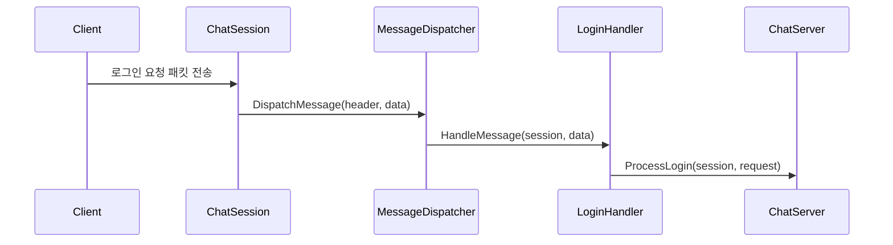
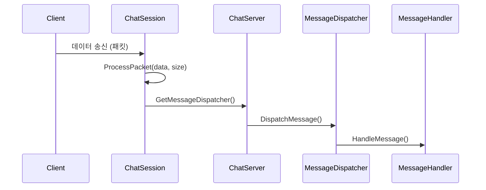

# C++ Boost.Asio로 만드는 온라인 게임 서버
저자: 최흥배, Claude AI   
    
권장 개발 환경
- **IDE**: Visual Studio 2022 (Community 이상)
- **컴파일러**: MSVC v143 (C++20 지원)
- **OS**: Windows 10 이상

-----   

# Chapter 11. 채팅 서버 구현
채팅 서버는 게임 서버의 핵심 기능 중 하나로, 멀티 클라이언트 관리, 실시간 메시지 전송, 세션 관리 등 게임 서버 개발에 필요한 대부분의 기술을 포함합니다. 이번 장에서는 Boost.Asio를 활용하여 확장 가능하고 안정적인 채팅 서버를 구현하는 방법을 학습합니다.

## 11.1 채팅 서버 설계

### 11.1.1 아키텍처 설계
채팅 서버의 전체 아키텍처를 설계해보겠다.

```cpp
#include <boost/asio.hpp>
#include <boost/bind/bind.hpp>
#include <memory>
#include <iostream>
#include <string>
#include <vector>
#include <unordered_map>
#include <unordered_set>
#include <mutex>
#include <atomic>
#include <queue>

using boost::asio::ip::tcp;

// 채팅 메시지 타입 정의
enum class MessageType : uint16_t
{
    LOGIN_REQUEST = 1001,
    LOGIN_RESPONSE = 1002,
    LOGOUT_REQUEST = 1003,
    LOGOUT_RESPONSE = 1004,
    CHAT_MESSAGE = 1005,
    JOIN_ROOM = 1006,
    LEAVE_ROOM = 1007,
    ROOM_LIST_REQUEST = 1008,
    ROOM_LIST_RESPONSE = 1009,
    USER_LIST_REQUEST = 1010,
    USER_LIST_RESPONSE = 1011,
    PRIVATE_MESSAGE = 1012,
    SERVER_NOTIFICATION = 1013
};

// 패킷 헤더 구조체
#pragma pack(push, 1)
struct PacketHeader
{
    uint16_t packet_size;     // 전체 패킷 크기
    MessageType message_type; // 메시지 타입
    uint32_t user_id;         // 발신자 ID
    uint32_t sequence_number; // 시퀀스 번호
};

struct LoginRequest
{
    PacketHeader header;
    char username[32];
    char password[64];
};

struct LoginResponse
{
    PacketHeader header;
    bool success;
    uint32_t assigned_user_id;
    char error_message[128];
};

struct ChatMessage
{
    PacketHeader header;
    uint32_t room_id;
    char message[512];
};

struct JoinRoomRequest
{
    PacketHeader header;
    uint32_t room_id;
    char room_name[64];
};
#pragma pack(pop)
```

### 11.1.2 기본 클래스 구조 설계

```cpp
// 전방 선언
class ChatServer;
class ChatRoom;
class ChatSession;

// 사용자 정보 클래스
class User
{
public:
    User(uint32_t id, const std::string& username)
        : id_(id), username_(username), is_online_(false)
    {
    }

    uint32_t GetId() const { return id_; }
    const std::string& GetUsername() const { return username_; }
    bool IsOnline() const { return is_online_; }
    void SetOnline(bool online) { is_online_ = online; }
    
    void SetSession(std::shared_ptr<ChatSession> session) { session_ = session; }
    std::weak_ptr<ChatSession> GetSession() const { return session_; }

private:
    uint32_t id_;
    std::string username_;
    bool is_online_;
    std::weak_ptr<ChatSession> session_;
};

// 채팅방 클래스
class ChatRoom
{
public:
    ChatRoom(uint32_t id, const std::string& name, uint32_t max_users = 100)
        : id_(id), name_(name), max_users_(max_users)
    {
    }

    uint32_t GetId() const { return id_; }
    const std::string& GetName() const { return name_; }
    size_t GetUserCount() const 
    { 
        std::lock_guard<std::mutex> lock(users_mutex_);
        return users_.size(); 
    }
    
    bool AddUser(std::shared_ptr<User> user);
    bool RemoveUser(uint32_t user_id);
    void BroadcastMessage(const ChatMessage& message, uint32_t sender_id = 0);
    std::vector<std::shared_ptr<User>> GetUserList() const;

private:
    uint32_t id_;
    std::string name_;
    uint32_t max_users_;
    std::unordered_map<uint32_t, std::shared_ptr<User>> users_;
    mutable std::mutex users_mutex_;
};

// 채팅 세션 클래스
class ChatSession : public std::enable_shared_from_this<ChatSession>
{
public:
    ChatSession(tcp::socket socket, ChatServer& server);
    ~ChatSession();

    void Start();
    void SendMessage(const void* data, size_t size);
    void Disconnect();
    
    uint32_t GetUserId() const { return user_id_; }
    bool IsAuthenticated() const { return is_authenticated_; }

private:
    void DoRead();
    void DoWrite();
    void ProcessPacket(const char* data, size_t size);
    void HandleLogin(const LoginRequest& request);
    void HandleChatMessage(const ChatMessage& message);
    void HandleJoinRoom(const JoinRoomRequest& request);
    void HandleLeaveRoom(uint32_t room_id);

    tcp::socket socket_;
    ChatServer& server_;
    
    std::array<char, 1024> read_buffer_;
    std::queue<std::vector<char>> write_queue_;
    std::mutex write_mutex_;
    
    uint32_t user_id_;
    bool is_authenticated_;
    std::atomic<bool> is_disconnected_;
};
```

### 11.1.3 메시지 처리 시스템 설계

```cpp
// 메시지 처리를 위한 핸들러 인터페이스
class IMessageHandler
{
public:
    virtual ~IMessageHandler() = default;
    virtual void HandleMessage(std::shared_ptr<ChatSession> session, 
                              const char* data, size_t size) = 0;
};

// 메시지 디스패처 클래스
class MessageDispatcher
{
public:
    void RegisterHandler(MessageType type, std::unique_ptr<IMessageHandler> handler)
    {
        handlers_[type] = std::move(handler);
    }

    void DispatchMessage(std::shared_ptr<ChatSession> session, 
                        const PacketHeader& header, 
                        const char* data, size_t size)
    {
        auto it = handlers_.find(header.message_type);
        if (it != handlers_.end())
        {
            it->second->HandleMessage(session, data, size);
        }
        else
        {
            std::cout << "Unknown message type: " 
                     << static_cast<uint16_t>(header.message_type) << std::endl;
        }
    }

private:
    std::unordered_map<MessageType, std::unique_ptr<IMessageHandler>> handlers_;
};

// 로그인 처리 핸들러
class LoginHandler : public IMessageHandler
{
public:
    LoginHandler(ChatServer& server) : server_(server) {}

    void HandleMessage(std::shared_ptr<ChatSession> session, 
                      const char* data, size_t size) override
    {
        if (size < sizeof(LoginRequest))
            return;

        const auto& request = *reinterpret_cast<const LoginRequest*>(data);
        server_.ProcessLogin(session, request);
    }

private:
    ChatServer& server_;
};

// 채팅 메시지 처리 핸들러
class ChatMessageHandler : public IMessageHandler
{
public:
    ChatMessageHandler(ChatServer& server) : server_(server) {}

    void HandleMessage(std::shared_ptr<ChatSession> session, 
                      const char* data, size_t size) override
    {
        if (!session->IsAuthenticated())
            return;

        if (size < sizeof(ChatMessage))
            return;

        const auto& message = *reinterpret_cast<const ChatMessage*>(data);
        server_.ProcessChatMessage(session, message);
    }

private:
    ChatServer& server_;
};
```
  
이 코드는 **온라인 채팅 서버**나 **멀티플레이어 게임 서버**에서 메시지를 구조적으로 처리하기 위한 **핸들러 기반 메시지 처리 시스템 설계 예시**다.
핵심 아이디어는 **메시지 타입별로 처리 로직을 분리하고**, 이를 **디스패처(MessageDispatcher)** 가 적절한 핸들러로 전달하는 구조를 만드는 것이다.

#### 전체 구조 개요
이 코드는 다음과 같은 계층 구조로 동작한다.

```plaintext
[네트워크 계층]  →  [MessageDispatcher]  →  [IMessageHandler 파생 클래스들]  →  [ChatServer]
```

즉, 네트워크에서 패킷을 수신하면 디스패처가 메시지 타입을 판별하고, 해당 타입을 처리할 핸들러에게 위임한다.

아래는 전체 메시지 처리 흐름을 나타낸 ASCII 다이어그램이다.

```
 ┌────────────────────┐
 │ Client (유저)       │
 │ ex) 로그인, 채팅     │
 └────────┬───────────┘
          │  (패킷 송신)
          ▼
 ┌────────────────────┐
 │ ChatSession        │
 │ (클라이언트 연결)    │
 └────────┬───────────┘
          │  (수신한 패킷)
          ▼
 ┌────────────────────────┐
 │ MessageDispatcher      │
 │  - handlers_[type]     │
 └────────┬───────────────┘
          │  (타입 기반 디스패치)
          ▼
 ┌────────────────────────────────┐
 │ IMessageHandler 파생 클래스      │
 │ ex) LoginHandler, ChatHandler  │
 └────────┬───────────────────────┘
          │ (로직 처리)
          ▼
 ┌────────────────────────┐
 │ ChatServer             │
 │ 실제 게임/채팅 로직       │
 └────────────────────────┘
```

#### IMessageHandler – 메시지 처리 인터페이스

```cpp
class IMessageHandler
{
public:
    virtual ~IMessageHandler() = default;
    virtual void HandleMessage(std::shared_ptr<ChatSession> session, 
                              const char* data, size_t size) = 0;
};
```

이 인터페이스는 **모든 메시지 핸들러의 공통 규약**을 정의한다.
핵심 메서드는 `HandleMessage()` 하나이며, 이 함수는 다음 역할을 수행한다.

* **`session`**: 어떤 클라이언트로부터 온 메시지인지 식별.
* **`data`**: 실제 메시지 데이터 (직렬화된 구조체).
* **`size`**: 데이터 크기.

이를 통해 `IMessageHandler`는 메시지 타입에 관계없이 일관된 호출 방식을 제공한다.
모든 구체적인 메시지 핸들러(로그인, 채팅 등)는 이 인터페이스를 상속받아 구현한다.


#### MessageDispatcher – 메시지 디스패처

```cpp
class MessageDispatcher
{
public:
    void RegisterHandler(MessageType type, std::unique_ptr<IMessageHandler> handler)
    {
        handlers_[type] = std::move(handler);
    }

    void DispatchMessage(std::shared_ptr<ChatSession> session, 
                        const PacketHeader& header, 
                        const char* data, size_t size)
    {
        auto it = handlers_.find(header.message_type);
        if (it != handlers_.end())
        {
            it->second->HandleMessage(session, data, size);
        }
        else
        {
            std::cout << "Unknown message type: " 
                     << static_cast<uint16_t>(header.message_type) << std::endl;
        }
    }

private:
    std::unordered_map<MessageType, std::unique_ptr<IMessageHandler>> handlers_;
};
```

#### 주요 역할

* **핸들러 등록 (`RegisterHandler`)**

  * 특정 메시지 타입(`MessageType`)에 대한 핸들러를 등록한다.
  * `unique_ptr`로 관리하므로 핸들러의 소유권은 디스패처가 갖는다.

* **메시지 분배 (`DispatchMessage`)**

  * 수신한 패킷의 `header.message_type` 값을 이용해 적절한 핸들러를 탐색한다.
  * 등록된 핸들러가 있으면 그 핸들러의 `HandleMessage()`를 호출한다.
  * 등록되지 않은 타입이면 경고를 출력한다.

#### 동작 시퀀스 다이어그램 (Mermaid)



이 시퀀스는 메시지가 수신된 후 **디스패처가 메시지 타입을 판별해 적절한 핸들러로 위임하는 과정**을 보여준다.


#### LoginHandler – 로그인 메시지 처리기

```cpp
class LoginHandler : public IMessageHandler
{
public:
    LoginHandler(ChatServer& server) : server_(server) {}

    void HandleMessage(std::shared_ptr<ChatSession> session, 
                      const char* data, size_t size) override
    {
        if (size < sizeof(LoginRequest))
            return;

        const auto& request = *reinterpret_cast<const LoginRequest*>(data);
        server_.ProcessLogin(session, request);
    }

private:
    ChatServer& server_;
};
```

* 클라이언트가 로그인 패킷을 보냈을 때 호출된다.
* 데이터 크기가 `LoginRequest` 구조체보다 작으면 잘못된 패킷으로 간주하고 무시한다.
* 정상이라면 `data`를 `LoginRequest` 구조체로 캐스팅하고 `ChatServer`에 전달한다.
* 즉, 실제 로직은 `ChatServer::ProcessLogin()`이 수행한다.


#### ChatMessageHandler – 채팅 메시지 처리기

```cpp
class ChatMessageHandler : public IMessageHandler
{
public:
    ChatMessageHandler(ChatServer& server) : server_(server) {}

    void HandleMessage(std::shared_ptr<ChatSession> session, 
                      const char* data, size_t size) override
    {
        if (!session->IsAuthenticated())
            return;

        if (size < sizeof(ChatMessage))
            return;

        const auto& message = *reinterpret_cast<const ChatMessage*>(data);
        server_.ProcessChatMessage(session, message);
    }

private:
    ChatServer& server_;
};
```

* 인증된 세션만 메시지를 전송할 수 있도록 `IsAuthenticated()` 검사 수행.
* `ChatMessage` 구조체 크기보다 작으면 무시한다.
* 유효한 메시지면 `ChatServer::ProcessChatMessage()`로 전달한다.


#### 구조적 특징 및 장점

| 항목        | 설명                                                     |
| --------- | ------------------------------------------------------ |
| **확장성**   | 새로운 메시지 타입이 생겨도 `IMessageHandler`를 상속한 새 핸들러만 추가하면 된다. |
| **유지보수성** | 메시지 처리 로직이 각각의 핸들러로 분리되어 코드 복잡도가 줄어든다.                 |
| **캡슐화**   | `MessageDispatcher`는 각 핸들러의 내부 동작을 몰라도 된다.             |
| **안정성**   | 잘못된 메시지 타입이나 잘못된 데이터 크기 등을 안전하게 검사한다.                  |


#### 실제 사용 예시

```cpp
MessageDispatcher dispatcher;

dispatcher.RegisterHandler(MessageType::Login, std::make_unique<LoginHandler>(server));
dispatcher.RegisterHandler(MessageType::Chat, std::make_unique<ChatMessageHandler>(server));

// 이후 네트워크 수신 루프 내에서
dispatcher.DispatchMessage(session, header, data, size);
```

</br>  
  

## 11.2 멀티 클라이언트 관리

### 11.2.1 세션 관리자 구현

```cpp
class SessionManager
{
public:
    void AddSession(std::shared_ptr<ChatSession> session)
    {
        std::lock_guard<std::mutex> lock(sessions_mutex_);
        sessions_.insert(session);
        std::cout << "Session added. Total sessions: " << sessions_.size() << std::endl;
    }

    void RemoveSession(std::shared_ptr<ChatSession> session)
    {
        std::lock_guard<std::mutex> lock(sessions_mutex_);
        sessions_.erase(session);
        std::cout << "Session removed. Total sessions: " << sessions_.size() << std::endl;
    }

    std::shared_ptr<ChatSession> FindSessionByUserId(uint32_t user_id)
    {
        std::lock_guard<std::mutex> lock(sessions_mutex_);
        for (auto& session : sessions_)
        {
            if (session->GetUserId() == user_id)
                return session;
        }
        return nullptr;
    }

    void BroadcastToAll(const void* data, size_t size)
    {
        std::lock_guard<std::mutex> lock(sessions_mutex_);
        for (auto& session : sessions_)
        {
            if (session->IsAuthenticated())
            {
                session->SendMessage(data, size);
            }
        }
    }

    size_t GetSessionCount() const
    {
        std::lock_guard<std::mutex> lock(sessions_mutex_);
        return sessions_.size();
    }

    void DisconnectAll()
    {
        std::lock_guard<std::mutex> lock(sessions_mutex_);
        for (auto& session : sessions_)
        {
            session->Disconnect();
        }
        sessions_.clear();
    }

private:
    std::unordered_set<std::shared_ptr<ChatSession>> sessions_;
    mutable std::mutex sessions_mutex_;
};
```

### 11.2.2 사용자 관리자 구현

```cpp
class UserManager
{
public:
    UserManager() : next_user_id_(1) {}

    std::shared_ptr<User> CreateUser(const std::string& username)
    {
        std::lock_guard<std::mutex> lock(users_mutex_);
        
        // 중복 사용자명 확인
        for (const auto& pair : users_)
        {
            if (pair.second->GetUsername() == username)
                return nullptr; // 이미 존재하는 사용자명
        }

        uint32_t user_id = next_user_id_++;
        auto user = std::make_shared<User>(user_id, username);
        users_[user_id] = user;
        
        std::cout << "User created: " << username << " (ID: " << user_id << ")" << std::endl;
        return user;
    }

    std::shared_ptr<User> GetUser(uint32_t user_id)
    {
        std::lock_guard<std::mutex> lock(users_mutex_);
        auto it = users_.find(user_id);
        return (it != users_.end()) ? it->second : nullptr;
    }

    std::shared_ptr<User> GetUserByName(const std::string& username)
    {
        std::lock_guard<std::mutex> lock(users_mutex_);
        for (const auto& pair : users_)
        {
            if (pair.second->GetUsername() == username)
                return pair.second;
        }
        return nullptr;
    }

    bool RemoveUser(uint32_t user_id)
    {
        std::lock_guard<std::mutex> lock(users_mutex_);
        auto it = users_.find(user_id);
        if (it != users_.end())
        {
            std::cout << "User removed: " << it->second->GetUsername() 
                     << " (ID: " << user_id << ")" << std::endl;
            users_.erase(it);
            return true;
        }
        return false;
    }

    std::vector<std::shared_ptr<User>> GetOnlineUsers()
    {
        std::lock_guard<std::mutex> lock(users_mutex_);
        std::vector<std::shared_ptr<User>> online_users;
        
        for (const auto& pair : users_)
        {
            if (pair.second->IsOnline())
            {
                online_users.push_back(pair.second);
            }
        }
        
        return online_users;
    }

    size_t GetUserCount() const
    {
        std::lock_guard<std::mutex> lock(users_mutex_);
        return users_.size();
    }

private:
    std::unordered_map<uint32_t, std::shared_ptr<User>> users_;
    mutable std::mutex users_mutex_;
    std::atomic<uint32_t> next_user_id_;
};
```

### 11.2.3 연결 풀링과 리소스 관리

```cpp
class ConnectionPool
{
public:
    ConnectionPool(size_t max_connections = 1000) 
        : max_connections_(max_connections), active_connections_(0)
    {
    }

    bool CanAcceptConnection()
    {
        return active_connections_.load() < max_connections_;
    }

    void OnConnectionAccepted()
    {
        active_connections_++;
        std::cout << "Connection accepted. Active: " << active_connections_.load() 
                 << "/" << max_connections_ << std::endl;
    }

    void OnConnectionClosed()
    {
        active_connections_--;
        std::cout << "Connection closed. Active: " << active_connections_.load() 
                 << "/" << max_connections_ << std::endl;
    }

    size_t GetActiveConnections() const
    {
        return active_connections_.load();
    }

    size_t GetMaxConnections() const
    {
        return max_connections_;
    }

    void SetMaxConnections(size_t max_connections)
    {
        max_connections_ = max_connections;
    }

private:
    size_t max_connections_;
    std::atomic<size_t> active_connections_;
};

// 메모리 사용량 모니터링
class MemoryMonitor
{
public:
    void UpdateMemoryUsage()
    {
        // 실제 구현에서는 시스템 메모리 사용량을 가져옴
        // Windows의 경우 GetProcessMemoryInfo 사용
        // Linux의 경우 /proc/self/status 파싱
        
        memory_usage_mb_ = GetProcessMemoryUsage();
        
        if (memory_usage_mb_ > memory_threshold_mb_)
        {
            std::cout << "Warning: High memory usage - " << memory_usage_mb_ 
                     << "MB (threshold: " << memory_threshold_mb_ << "MB)" << std::endl;
            OnHighMemoryUsage();
        }
    }

    void SetMemoryThreshold(size_t threshold_mb)
    {
        memory_threshold_mb_ = threshold_mb;
    }

    size_t GetMemoryUsage() const
    {
        return memory_usage_mb_;
    }

private:
    size_t GetProcessMemoryUsage()
    {
        // 플랫폼별 메모리 사용량 조회 구현
        // 여기서는 예시로 고정값 반환
        return 512; // 512MB
    }

    void OnHighMemoryUsage()
    {
        // 메모리 사용량이 높을 때의 처리
        // 1. 오래된 세션 정리
        // 2. 캐시 데이터 정리
        // 3. 가비지 컬렉션 트리거
        std::cout << "Triggering memory cleanup procedures..." << std::endl;
    }

    std::atomic<size_t> memory_usage_mb_{0};
    size_t memory_threshold_mb_{1024}; // 1GB 기본 임계값
};
```
  
</br>  

## 11.3 브로드캐스팅과 메시지 라우팅

### 11.3.1 채팅방 구현

```cpp
// ChatRoom 클래스의 구현
bool ChatRoom::AddUser(std::shared_ptr<User> user)
{
    std::lock_guard<std::mutex> lock(users_mutex_);
    
    if (users_.size() >= max_users_)
        return false;
    
    if (users_.find(user->GetId()) != users_.end())
        return false; // 이미 방에 있음
    
    users_[user->GetId()] = user;
    
    // 입장 알림 메시지 브로드캐스트
    std::string notification = user->GetUsername() + " joined the room.";
    BroadcastNotification(notification, user->GetId());
    
    std::cout << "User " << user->GetUsername() 
             << " joined room " << name_ 
             << " (Users: " << users_.size() << ")" << std::endl;
    
    return true;
}

bool ChatRoom::RemoveUser(uint32_t user_id)
{
    std::lock_guard<std::mutex> lock(users_mutex_);
    
    auto it = users_.find(user_id);
    if (it == users_.end())
        return false;
    
    std::string username = it->second->GetUsername();
    users_.erase(it);
    
    // 퇴장 알림 메시지 브로드캐스트
    std::string notification = username + " left the room.";
    BroadcastNotification(notification, user_id);
    
    std::cout << "User " << username 
             << " left room " << name_ 
             << " (Users: " << users_.size() << ")" << std::endl;
    
    return true;
}

void ChatRoom::BroadcastMessage(const ChatMessage& message, uint32_t sender_id)
{
    std::lock_guard<std::mutex> lock(users_mutex_);
    
    for (const auto& pair : users_)
    {
        // 발신자에게는 메시지를 보내지 않음 (선택사항)
        if (pair.first == sender_id)
            continue;
            
        auto user = pair.second;
        auto session = user->GetSession().lock();
        if (session)
        {
            session->SendMessage(&message, sizeof(ChatMessage));
        }
    }
}

void ChatRoom::BroadcastNotification(const std::string& notification, uint32_t exclude_user_id)
{
    PacketHeader header;
    header.packet_size = sizeof(PacketHeader) + static_cast<uint16_t>(notification.size());
    header.message_type = MessageType::SERVER_NOTIFICATION;
    header.user_id = 0; // 서버 메시지
    header.sequence_number = 0;

    std::vector<char> packet(header.packet_size);
    std::memcpy(packet.data(), &header, sizeof(PacketHeader));
    std::memcpy(packet.data() + sizeof(PacketHeader), 
               notification.c_str(), notification.size());

    std::lock_guard<std::mutex> lock(users_mutex_);
    for (const auto& pair : users_)
    {
        if (pair.first == exclude_user_id)
            continue;
            
        auto user = pair.second;
        auto session = user->GetSession().lock();
        if (session)
        {
            session->SendMessage(packet.data(), packet.size());
        }
    }
}

std::vector<std::shared_ptr<User>> ChatRoom::GetUserList() const
{
    std::lock_guard<std::mutex> lock(users_mutex_);
    std::vector<std::shared_ptr<User>> user_list;
    
    for (const auto& pair : users_)
    {
        user_list.push_back(pair.second);
    }
    
    return user_list;
}
```

### 11.3.2 채팅방 관리자 구현

```cpp
class RoomManager
{
public:
    RoomManager() : next_room_id_(1) {}

    std::shared_ptr<ChatRoom> CreateRoom(const std::string& name, uint32_t max_users = 100)
    {
        std::lock_guard<std::mutex> lock(rooms_mutex_);
        
        uint32_t room_id = next_room_id_++;
        auto room = std::make_shared<ChatRoom>(room_id, name, max_users);
        rooms_[room_id] = room;
        
        std::cout << "Room created: " << name << " (ID: " << room_id << ")" << std::endl;
        return room;
    }

    std::shared_ptr<ChatRoom> GetRoom(uint32_t room_id)
    {
        std::lock_guard<std::mutex> lock(rooms_mutex_);
        auto it = rooms_.find(room_id);
        return (it != rooms_.end()) ? it->second : nullptr;
    }

    std::shared_ptr<ChatRoom> GetRoomByName(const std::string& name)
    {
        std::lock_guard<std::mutex> lock(rooms_mutex_);
        for (const auto& pair : rooms_)
        {
            if (pair.second->GetName() == name)
                return pair.second;
        }
        return nullptr;
    }

    bool RemoveRoom(uint32_t room_id)
    {
        std::lock_guard<std::mutex> lock(rooms_mutex_);
        auto it = rooms_.find(room_id);
        if (it != rooms_.end())
        {
            std::cout << "Room removed: " << it->second->GetName() 
                     << " (ID: " << room_id << ")" << std::endl;
            rooms_.erase(it);
            return true;
        }
        return false;
    }

    std::vector<std::shared_ptr<ChatRoom>> GetRoomList()
    {
        std::lock_guard<std::mutex> lock(rooms_mutex_);
        std::vector<std::shared_ptr<ChatRoom>> room_list;
        
        for (const auto& pair : rooms_)
        {
            room_list.push_back(pair.second);
        }
        
        return room_list;
    }

    size_t GetRoomCount() const
    {
        std::lock_guard<std::mutex> lock(rooms_mutex_);
        return rooms_.size();
    }

    void CleanupEmptyRooms()
    {
        std::lock_guard<std::mutex> lock(rooms_mutex_);
        
        for (auto it = rooms_.begin(); it != rooms_.end();)
        {
            if (it->second->GetUserCount() == 0)
            {
                std::cout << "Removing empty room: " << it->second->GetName() << std::endl;
                it = rooms_.erase(it);
            }
            else
            {
                ++it;
            }
        }
    }

private:
    std::unordered_map<uint32_t, std::shared_ptr<ChatRoom>> rooms_;
    mutable std::mutex rooms_mutex_;
    std::atomic<uint32_t> next_room_id_;
};
```

### 11.3.3 메시지 라우팅 시스템

```cpp
class MessageRouter
{
public:
    enum class RoutingType
    {
        BROADCAST,      // 모든 사용자에게
        ROOM_BROADCAST, // 특정 방의 모든 사용자에게
        PRIVATE,        // 특정 사용자에게
        GROUP           // 특정 그룹에게
    };

    struct RoutingInfo
    {
        RoutingType type;
        uint32_t target_id;     // 방 ID 또는 사용자 ID
        uint32_t sender_id;     // 발신자 ID
        std::vector<uint32_t> group_members; // 그룹 메시지용
    };

    MessageRouter(SessionManager& session_manager, RoomManager& room_manager)
        : session_manager_(session_manager), room_manager_(room_manager)
    {
    }

    void RouteMessage(const void* data, size_t size, const RoutingInfo& routing_info)
    {
        switch (routing_info.type)
        {
        case RoutingType::BROADCAST:
            RouteBroadcast(data, size, routing_info.sender_id);
            break;
        case RoutingType::ROOM_BROADCAST:
            RouteRoomBroadcast(data, size, routing_info.target_id, routing_info.sender_id);
            break;
        case RoutingType::PRIVATE:
            RoutePrivateMessage(data, size, routing_info.target_id);
            break;
        case RoutingType::GROUP:
            RouteGroupMessage(data, size, routing_info.group_members);
            break;
        }
    }

private:
    void RouteBroadcast(const void* data, size_t size, uint32_t sender_id)
    {
        session_manager_.BroadcastToAll(data, size);
    }

    void RouteRoomBroadcast(const void* data, size_t size, uint32_t room_id, uint32_t sender_id)
    {
        auto room = room_manager_.GetRoom(room_id);
        if (room)
        {
            const auto& chat_message = *reinterpret_cast<const ChatMessage*>(data);
            room->BroadcastMessage(chat_message, sender_id);
        }
    }

    void RoutePrivateMessage(const void* data, size_t size, uint32_t target_user_id)
    {
        auto session = session_manager_.FindSessionByUserId(target_user_id);
        if (session && session->IsAuthenticated())
        {
            session->SendMessage(data, size);
        }
    }

    void RouteGroupMessage(const void* data, size_t size, const std::vector<uint32_t>& group_members)
    {
        for (uint32_t user_id : group_members)
        {
            auto session = session_manager_.FindSessionByUserId(user_id);
            if (session && session->IsAuthenticated())
            {
                session->SendMessage(data, size);
            }
        }
    }

    SessionManager& session_manager_;
    RoomManager& room_manager_;
};
```

### 11.3.4 메시지 필터링 시스템

```cpp
class MessageFilter
{
public:
    enum class FilterResult
    {
        ALLOW,
        BLOCK,
        MODIFY
    };

    struct FilteredMessage
    {
        FilterResult result;
        std::string modified_content;
        std::string block_reason;
    };

    FilteredMessage FilterMessage(const std::string& message, uint32_t sender_id)
    {
        FilteredMessage result;
        result.result = FilterResult::ALLOW;
        result.modified_content = message;

        // 1. 금지어 필터링
        if (ContainsBannedWords(message))
        {
            result.result = FilterResult::BLOCK;
            result.block_reason = "Message contains banned words";
            return result;
        }

        // 2. 스팸 필터링
        if (IsSpam(message, sender_id))
        {
            result.result = FilterResult::BLOCK;
            result.block_reason = "Spam detected";
            return result;
        }

        // 3. 길이 제한
        if (message.length() > max_message_length_)
        {
            result.result = FilterResult::MODIFY;
            result.modified_content = message.substr(0, max_message_length_);
            return result;
        }

        // 4. 욕설 필터링 (마스킹)
        result.modified_content = MaskProfanity(message);
        if (result.modified_content != message)
        {
            result.result = FilterResult::MODIFY;
        }

        return result;
    }

    void AddBannedWord(const std::string& word)
    {
        std::lock_guard<std::mutex> lock(banned_words_mutex_);
        banned_words_.insert(word);
    }

    void SetMaxMessageLength(size_t length)
    {
        max_message_length_ = length;
    }

private:
    bool ContainsBannedWords(const std::string& message)
    {
        std::lock_guard<std::mutex> lock(banned_words_mutex_);
        
        std::string lower_message = ToLowerCase(message);
        for (const auto& word : banned_words_)
        {
            if (lower_message.find(ToLowerCase(word)) != std::string::npos)
                return true;
        }
        return false;
    }

    bool IsSpam(const std::string& message, uint32_t sender_id)
    {
        auto now = std::chrono::steady_clock::now();
        
        std::lock_guard<std::mutex> lock(user_messages_mutex_);
        auto& user_messages = user_message_history_[sender_id];
        
        // 오래된 메시지 제거 (1분 이전)
        auto cutoff_time = now - std::chrono::minutes(1);
        user_messages.erase(
            std::remove_if(user_messages.begin(), user_messages.end(),
                [cutoff_time](const auto& timestamp) 
                { 
                    return timestamp < cutoff_time; 
                }),
            user_messages.end());
        
        // 메시지 추가
        user_messages.push_back(now);
        
        // 1분 내 10개 이상 메시지 시 스팸으로 판정
        return user_messages.size() > 10;
    }

    std::string MaskProfanity(const std::string& message)
    {
        std::string result = message;
        
        // 간단한 욕설 마스킹 구현
        // 실제로는 더 정교한 필터링 필요
        std::vector<std::string> profanity_words = {"badword1", "badword2"};
        
        for (const auto& word : profanity_words)
        {
            size_t pos = 0;
            while ((pos = result.find(word, pos)) != std::string::npos)
            {
                std::string mask(word.length(), '*');
                result.replace(pos, word.length(), mask);
                pos += mask.length();
            }
        }
        
        return result;
    }

    std::string ToLowerCase(const std::string& str)
    {
        std::string result = str;
        std::transform(result.begin(), result.end(), result.begin(), ::tolower);
        return result;
    }

    std::unordered_set<std::string> banned_words_;
    std::mutex banned_words_mutex_;
    
    std::unordered_map<uint32_t, std::vector<std::chrono::steady_clock::time_point>> user_message_history_;
    std::mutex user_messages_mutex_;
    
    size_t max_message_length_ = 512;
};
```
   
</br>  


## 11.4 세션 관리와 리소스 정리

### 11.4.1 세션 구현

```cpp
// ChatSession 클래스의 상세 구현
ChatSession::ChatSession(tcp::socket socket, ChatServer& server)
    : socket_(std::move(socket)), server_(server), 
      user_id_(0), is_authenticated_(false), is_disconnected_(false)
{
}

ChatSession::~ChatSession()
{
    Disconnect();
}

void ChatSession::Start()
{
    auto self = shared_from_this();
    DoRead();
}

void ChatSession::DoRead()
{
    auto self = shared_from_this();
    socket_.async_read_some(
        boost::asio::buffer(read_buffer_),
        [this, self](boost::system::error_code ec, std::size_t length)
        {
            if (!ec)
            {
                ProcessPacket(read_buffer_.data(), length);
                DoRead();
            }
            else
            {
                std::cout << "Read error: " << ec.message() << std::endl;
                Disconnect();
            }
        });
}

void ChatSession::DoWrite()
{
    auto self = shared_from_this();
    
    std::lock_guard<std::mutex> lock(write_mutex_);
    if (write_queue_.empty())
        return;

    auto& front_message = write_queue_.front();
    boost::asio::async_write(
        socket_,
        boost::asio::buffer(front_message),
        [this, self](boost::system::error_code ec, std::size_t length)
        {
            if (!ec)
            {
                std::lock_guard<std::mutex> lock(write_mutex_);
                write_queue_.pop();
                if (!write_queue_.empty())
                {
                    DoWrite();
                }
            }
            else
            {
                std::cout << "Write error: " << ec.message() << std::endl;
                Disconnect();
            }
        });
}

void ChatSession::SendMessage(const void* data, size_t size)
{
    if (is_disconnected_.load())
        return;

    std::vector<char> message(static_cast<const char*>(data), 
                             static_cast<const char*>(data) + size);

    {
        std::lock_guard<std::mutex> lock(write_mutex_);
        bool write_in_progress = !write_queue_.empty();
        write_queue_.push(std::move(message));
        
        if (!write_in_progress)
        {
            DoWrite();
        }
    }
}

void ChatSession::Disconnect()
{
    if (is_disconnected_.exchange(true))
        return; // 이미 연결 해제됨

    boost::system::error_code ec;
    socket_.close(ec);

    // 서버에 연결 해제 알림
    server_.OnSessionDisconnected(shared_from_this());
}

void ChatSession::ProcessPacket(const char* data, size_t size)
{
    if (size < sizeof(PacketHeader))
        return;

    const auto& header = *reinterpret_cast<const PacketHeader*>(data);
    
    // 패킷 크기 검증
    if (header.packet_size != size || header.packet_size > 1024)
        return;

    // 메시지 타입별 처리
    server_.GetMessageDispatcher().DispatchMessage(
        shared_from_this(), header, data, size);
}
```
  
이 코드는 **비동기 네트워크 기반 채팅 서버의 핵심 클래스인 `ChatSession` 구현부**이다.
즉, 클라이언트와의 1:1 연결을 담당하며,
**데이터 송수신(입출력), 패킷 처리, 연결 종료, 리소스 관리**를 수행하는 단위 객체다.

이 구조는 Boost.Asio의 **비동기 I/O 모델(asynchronous I/O)**을 기반으로 하고 있으며,
하나의 클라이언트 연결당 하나의 `ChatSession` 인스턴스가 생성되어 동작한다.

#### 클래스 개요
`ChatSession`은 클라이언트 소켓을 보유하고 있으며,
서버(`ChatServer`)와 통신하면서 다음 네 가지 역할을 수행한다.

1. **Start()** : 세션을 시작하고 비동기 읽기 루프를 돌린다.
2. **DoRead()** : 클라이언트로부터 수신 데이터를 비동기로 읽는다.
3. **DoWrite()** : 서버가 보낼 데이터를 비동기로 전송한다.
4. **Disconnect()** : 연결 종료 시 리소스 해제 및 서버에 알린다.

#### 생성자 및 소멸자

```cpp
ChatSession::ChatSession(tcp::socket socket, ChatServer& server)
    : socket_(std::move(socket)), server_(server), 
      user_id_(0), is_authenticated_(false), is_disconnected_(false)
{
}

ChatSession::~ChatSession()
{
    Disconnect();
}
```
  
* **`socket_`** : 클라이언트와의 TCP 연결을 담당하는 소켓.
  `std::move()`로 소유권을 이전받음으로써 RAII(자원 자동 관리)를 보장한다.
* **`server_`** : 이 세션을 관리하는 상위 서버 객체 참조.
* **`is_authenticated_`** : 로그인 여부를 나타냄.
* **`is_disconnected_`** : 세션이 이미 종료되었는지 원자적으로 판단하기 위한 플래그.
* **소멸자(`~ChatSession`)**는 세션이 해제될 때 자동으로 `Disconnect()`를 호출해 안전하게 종료한다.


#### 3. Start() – 세션 시작

```cpp
void ChatSession::Start()
{
    auto self = shared_from_this();
    DoRead();
}
```

* `shared_from_this()`는 **현재 객체를 `std::shared_ptr`로 감싸** 비동기 콜백 중 객체 생명주기가 유지되도록 한다.
* `DoRead()`를 호출하여 **읽기 루프를 시작**한다.

즉, `Start()`는 네트워크 수신 대기 상태로 전환시키는 진입점이다.


#### 4. DoRead() – 비동기 읽기 루프

```cpp
void ChatSession::DoRead()
{
    auto self = shared_from_this();
    socket_.async_read_some(
        boost::asio::buffer(read_buffer_),
        [this, self](boost::system::error_code ec, std::size_t length)
        {
            if (!ec)
            {
                ProcessPacket(read_buffer_.data(), length);
                DoRead();
            }
            else
            {
                std::cout << "Read error: " << ec.message() << std::endl;
                Disconnect();
            }
        });
}
```

동작 순서   

1. **`async_read_some()`**은 비동기 읽기 요청을 걸고 즉시 반환한다.
2. I/O 스레드에서 실제 데이터가 도착하면, **람다 콜백**이 실행된다.
3. 에러가 없으면 `ProcessPacket()`을 호출해 패킷을 처리하고,
   이어서 **재귀적으로 `DoRead()`를 다시 호출**해 다음 데이터를 계속 읽는다.
4. 에러가 발생하면 연결을 끊는다.

ASCII 다이어그램  

```
┌────────────┐
│ 클라이언트   │
└──────┬─────┘
       │
       ▼
 [DoRead()] 호출
       │
       ▼
 ┌────────────────────────┐
 │ async_read_some() 대기  │
 └─────────┬──────────────┘
           │ (데이터 수신)
           ▼
 ┌────────────────────────┐
 │ ProcessPacket() 호출    │
 │ → 메시지 디스패치        │
 └────────────────────────┘
           │
           ▼
        DoRead() 재호출
```

즉, `DoRead()`는 **비동기 루프를 유지하는 핵심 함수**다.


#### DoWrite() – 비동기 쓰기 처리

```cpp
void ChatSession::DoWrite()
{
    auto self = shared_from_this();
    
    std::lock_guard<std::mutex> lock(write_mutex_);
    if (write_queue_.empty())
        return;

    auto& front_message = write_queue_.front();
    boost::asio::async_write(
        socket_,
        boost::asio::buffer(front_message),
        [this, self](boost::system::error_code ec, std::size_t length)
        {
            if (!ec)
            {
                std::lock_guard<std::mutex> lock(write_mutex_);
                write_queue_.pop();
                if (!write_queue_.empty())
                {
                    DoWrite();
                }
            }
            else
            {
                std::cout << "Write error: " << ec.message() << std::endl;
                Disconnect();
            }
        });
}
```

핵심 개념  

* **`write_queue_`** : 전송할 메시지를 보관하는 큐.
* **`write_mutex_`** : 다중 스레드 접근을 보호하기 위한 뮤텍스.
* **`async_write()`** : 비동기 전송. 완료되면 콜백 실행.

동작 방식

1. 쓰기 큐의 맨 앞(`front_message`)을 전송한다.
2. 전송 완료 시 큐에서 제거하고, 남은 메시지가 있으면 `DoWrite()`를 재호출한다.
3. 오류 발생 시 세션을 종료한다.

이 설계는 **큐 기반 비동기 파이프라인 구조**로,
연속된 메시지 전송 시 순서를 보장하면서도 비동기 처리 효율을 유지한다.

#### SendMessage() – 송신 요청 API

```cpp
void ChatSession::SendMessage(const void* data, size_t size)
{
    if (is_disconnected_.load())
        return;

    std::vector<char> message(static_cast<const char*>(data), 
                             static_cast<const char*>(data) + size);

    {
        std::lock_guard<std::mutex> lock(write_mutex_);
        bool write_in_progress = !write_queue_.empty();
        write_queue_.push(std::move(message));
        
        if (!write_in_progress)
        {
            DoWrite();
        }
    }
}
```
  
* 서버가 클라이언트로 메시지를 보낼 때 호출된다.
* 메시지를 **`write_queue_`에 추가**하고,
  만약 현재 전송 중인 쓰기 작업이 없다면 `DoWrite()`를 시작한다.
* 이를 통해 **전송 순서 보장 + 중복 비동기 요청 방지**가 가능하다.


#### Disconnect() – 연결 종료 및 리소스 정리

```cpp
void ChatSession::Disconnect()
{
    if (is_disconnected_.exchange(true))
        return; // 이미 연결 해제됨

    boost::system::error_code ec;
    socket_.close(ec);

    // 서버에 연결 해제 알림
    server_.OnSessionDisconnected(shared_from_this());
}
```

* `is_disconnected_`를 `atomic`으로 관리해 **중복 종료를 방지**한다.
* 소켓을 닫고, 서버에게 세션 종료를 알린다.
* 서버는 내부적으로 세션 리스트에서 이 세션을 제거하고 관련 리소스를 해제한다.


#### ProcessPacket() – 패킷 처리 및 디스패치

```cpp
void ChatSession::ProcessPacket(const char* data, size_t size)
{
    if (size < sizeof(PacketHeader))
        return;

    const auto& header = *reinterpret_cast<const PacketHeader*>(data);
    
    // 패킷 크기 검증
    if (header.packet_size != size || header.packet_size > 1024)
        return;

    // 메시지 타입별 처리
    server_.GetMessageDispatcher().DispatchMessage(
        shared_from_this(), header, data, size);
}
```

동작 단계

1. 최소한 `PacketHeader` 크기는 되어야 한다.
2. 헤더를 파싱하여 `packet_size`가 실제 수신 길이와 일치하는지 확인.
3. 이상이 없으면 `MessageDispatcher`를 통해 적절한 핸들러(`LoginHandler`, `ChatMessageHandler` 등)에 위임.

시퀀스 다이어그램



#### 전체 흐름 요약

```
클라이언트 연결 생성 → ChatSession 객체 생성
    ↓
Start() 호출 → DoRead() 루프 시작
    ↓
데이터 수신 시 → ProcessPacket() 호출
    ↓
서버의 MessageDispatcher가 핸들러 호출
    ↓
응답 메시지 SendMessage() → DoWrite() 비동기 송신
    ↓
에러 발생 또는 종료 시 → Disconnect()
```

#### 구조적 장점

| 항목                | 설명                                                        |
| ----------------- | --------------------------------------------------------- |
| **비동기 I/O 기반**    | CPU와 I/O를 병렬로 처리해 높은 동시성을 확보한다.                           |
| **스레드 안전성 보장**    | `std::mutex`와 `atomic`으로 큐와 연결 상태를 보호한다.                  |
| **세션 생명주기 관리**    | `shared_from_this()`로 콜백 중 객체 소멸을 방지한다.                   |
| **효율적 송신 파이프라인**  | 메시지 큐 기반 비동기 송신으로 순서 보장 및 효율적 전송이 가능하다.                   |
| **유연한 메시지 처리 구조** | `ProcessPacket()` → `Dispatcher` → `Handler` 구조로 확장성이 높다. |

이 `ChatSession` 구현은 **고성능 네트워크 서버에서 세션 단위로 연결을 관리**하기 위한 표준적이며 견고한 설계다.
`Boost.Asio`의 비동기 콜백 모델과 C++ RAII, 스레드 안전성을 적절히 조합한 구조로,
**“안정적이고 확장 가능한 실시간 서버 프레임워크의 기반”**이라고 할 수 있다.


  
### 11.4.2 리소스 정리 시스템

```cpp
class ResourceCleaner
{
public:
    ResourceCleaner(boost::asio::io_context& io_context)
        : cleanup_timer_(io_context)
    {
        StartCleanupTimer();
    }

    void RegisterCleanupCallback(std::function<void()> callback)
    {
        std::lock_guard<std::mutex> lock(callbacks_mutex_);
        cleanup_callbacks_.push_back(callback);
    }

    void SetCleanupInterval(std::chrono::seconds interval)
    {
        cleanup_interval_ = interval;
    }

private:
    void StartCleanupTimer()
    {
        cleanup_timer_.expires_after(cleanup_interval_);
        cleanup_timer_.async_wait([this](const boost::system::error_code& ec)
        {
            if (!ec)
            {
                PerformCleanup();
                StartCleanupTimer();
            }
        });
    }

    void PerformCleanup()
    {
        std::cout << "Performing resource cleanup..." << std::endl;
        
        std::lock_guard<std::mutex> lock(callbacks_mutex_);
        for (auto& callback : cleanup_callbacks_)
        {
            try
            {
                callback();
            }
            catch (const std::exception& e)
            {
                std::cerr << "Cleanup callback error: " << e.what() << std::endl;
            }
        }
    }

    boost::asio::steady_timer cleanup_timer_;
    std::chrono::seconds cleanup_interval_{std::chrono::seconds(60)};
    std::vector<std::function<void()>> cleanup_callbacks_;
    std::mutex callbacks_mutex_;
};

// 메모리 누수 방지를 위한 약한 참조 관리자
template<typename T>
class WeakReferenceManager
{
public:
    void AddReference(std::weak_ptr<T> weak_ref)
    {
        std::lock_guard<std::mutex> lock(refs_mutex_);
        weak_refs_.push_back(weak_ref);
    }

    void CleanupExpiredReferences()
    {
        std::lock_guard<std::mutex> lock(refs_mutex_);
        
        weak_refs_.erase(
            std::remove_if(weak_refs_.begin(), weak_refs_.end(),
                [](const std::weak_ptr<T>& weak_ref) 
                { 
                    return weak_ref.expired(); 
                }),
            weak_refs_.end());
    }

    size_t GetActiveReferenceCount() const
    {
        std::lock_guard<std::mutex> lock(refs_mutex_);
        return std::count_if(weak_refs_.begin(), weak_refs_.end(),
            [](const std::weak_ptr<T>& weak_ref) 
            { 
                return !weak_ref.expired(); 
            });
    }

    std::vector<std::shared_ptr<T>> GetActiveReferences() const
    {
        std::lock_guard<std::mutex> lock(refs_mutex_);
        std::vector<std::shared_ptr<T>> active_refs;
        
        for (const auto& weak_ref : weak_refs_)
        {
            if (auto shared_ref = weak_ref.lock())
            {
                active_refs.push_back(shared_ref);
            }
        }
        
        return active_refs;
    }

private:
    std::vector<std::weak_ptr<T>> weak_refs_;
    mutable std::mutex refs_mutex_;
};
```

### 7.4.3 완전한 채팅 서버 구현

```cpp
class ChatServer
{
public:
    ChatServer(boost::asio::io_context& io_context, short port)
        : io_context_(io_context), 
          acceptor_(io_context, tcp::endpoint(tcp::v4(), port)),
          message_router_(session_manager_, room_manager_),
          resource_cleaner_(io_context)
    {
        InitializeMessageHandlers();
        SetupResourceCleanup();
        
        // 기본 채팅방 생성
        room_manager_.CreateRoom("General", 100);
        room_manager_.CreateRoom("Gaming", 50);
        
        StartAccept();
    }

    void Start()
    {
        std::cout << "Chat server started on port " 
                 << acceptor_.local_endpoint().port() << std::endl;
    }

    void Stop()
    {
        std::cout << "Stopping chat server..." << std::endl;
        
        acceptor_.close();
        session_manager_.DisconnectAll();
    }

    // 메시지 처리 메서드들
    void ProcessLogin(std::shared_ptr<ChatSession> session, const LoginRequest& request)
    {
        LoginResponse response;
        response.header.packet_size = sizeof(LoginResponse);
        response.header.message_type = MessageType::LOGIN_RESPONSE;
        response.header.user_id = 0;
        response.header.sequence_number = request.header.sequence_number;

        // 간단한 로그인 검증 (실제로는 데이터베이스 연동)
        if (strlen(request.username) > 0 && strlen(request.password) > 0)
        {
            auto user = user_manager_.CreateUser(request.username);
            if (user)
            {
                user->SetOnline(true);
                user->SetSession(session);
                
                // 세션에 사용자 정보 설정
                session->SetUserId(user->GetId());
                session->SetAuthenticated(true);
                
                response.success = true;
                response.assigned_user_id = user->GetId();
                strcpy_s(response.error_message, "Login successful");
                
                std::cout << "User logged in: " << request.username 
                         << " (ID: " << user->GetId() << ")" << std::endl;
            }
            else
            {
                response.success = false;
                response.assigned_user_id = 0;
                strcpy_s(response.error_message, "Username already exists");
            }
        }
        else
        {
            response.success = false;
            response.assigned_user_id = 0;
            strcpy_s(response.error_message, "Invalid username or password");
        }

        session->SendMessage(&response, sizeof(LoginResponse));
    }

    void ProcessChatMessage(std::shared_ptr<ChatSession> session, const ChatMessage& message)
    {
        // 메시지 필터링
        std::string msg_content(message.message, 
            strnlen(message.message, sizeof(message.message)));
        
        auto filter_result = message_filter_.FilterMessage(msg_content, session->GetUserId());
        
        if (filter_result.result == MessageFilter::FilterResult::BLOCK)
        {
            // 차단된 메시지 알림
            SendServerNotification(session, "Message blocked: " + filter_result.block_reason);
            return;
        }

        // 메시지 라우팅
        MessageRouter::RoutingInfo routing_info;
        routing_info.type = MessageRouter::RoutingType::ROOM_BROADCAST;
        routing_info.target_id = message.room_id;
        routing_info.sender_id = session->GetUserId();

        // 필터링된 메시지로 전송
        ChatMessage filtered_message = message;
        if (filter_result.result == MessageFilter::FilterResult::MODIFY)
        {
            strncpy_s(filtered_message.message, sizeof(filtered_message.message),
                     filter_result.modified_content.c_str(), 
                     filter_result.modified_content.length());
        }

        message_router_.RouteMessage(&filtered_message, sizeof(ChatMessage), routing_info);
    }

    void OnSessionDisconnected(std::shared_ptr<ChatSession> session)
    {
        if (session->IsAuthenticated())
        {
            uint32_t user_id = session->GetUserId();
            auto user = user_manager_.GetUser(user_id);
            if (user)
            {
                user->SetOnline(false);
                
                // 모든 방에서 사용자 제거
                auto rooms = room_manager_.GetRoomList();
                for (auto& room : rooms)
                {
                    room->RemoveUser(user_id);
                }
                
                std::cout << "User disconnected: " << user->GetUsername() 
                         << " (ID: " << user_id << ")" << std::endl;
            }
        }
        
        session_manager_.RemoveSession(session);
    }

    MessageDispatcher& GetMessageDispatcher() { return message_dispatcher_; }

private:
    void StartAccept()
    {
        auto new_session = std::make_shared<ChatSession>(
            tcp::socket(io_context_), *this);
        
        acceptor_.async_accept(new_session->GetSocket(),
            [this, new_session](boost::system::error_code ec)
            {
                if (!ec)
                {
                    if (connection_pool_.CanAcceptConnection())
                    {
                        connection_pool_.OnConnectionAccepted();
                        session_manager_.AddSession(new_session);
                        new_session->Start();
                    }
                    else
                    {
                        std::cout << "Connection rejected: Server full" << std::endl;
                    }
                }
                
                StartAccept();
            });
    }

    void InitializeMessageHandlers()
    {
        message_dispatcher_.RegisterHandler(MessageType::LOGIN_REQUEST,
            std::make_unique<LoginHandler>(*this));
        message_dispatcher_.RegisterHandler(MessageType::CHAT_MESSAGE,
            std::make_unique<ChatMessageHandler>(*this));
    }

    void SetupResourceCleanup()
    {
        // 빈 채팅방 정리
        resource_cleaner_.RegisterCleanupCallback([this]()
        {
            room_manager_.CleanupEmptyRooms();
        });

        // 오프라인 사용자 정리
        resource_cleaner_.RegisterCleanupCallback([this]()
        {
            // 30분 이상 오프라인인 사용자 제거
            // 실제 구현에서는 마지막 활동 시간 추적 필요
        });
    }

    void SendServerNotification(std::shared_ptr<ChatSession> session, const std::string& message)
    {
        PacketHeader header;
        header.packet_size = sizeof(PacketHeader) + static_cast<uint16_t>(message.size());
        header.message_type = MessageType::SERVER_NOTIFICATION;
        header.user_id = 0;
        header.sequence_number = 0;

        std::vector<char> packet(header.packet_size);
        std::memcpy(packet.data(), &header, sizeof(PacketHeader));
        std::memcpy(packet.data() + sizeof(PacketHeader), 
                   message.c_str(), message.size());

        session->SendMessage(packet.data(), packet.size());
    }

    boost::asio::io_context& io_context_;
    tcp::acceptor acceptor_;
    
    SessionManager session_manager_;
    UserManager user_manager_;
    RoomManager room_manager_;
    MessageDispatcher message_dispatcher_;
    MessageRouter message_router_;
    MessageFilter message_filter_;
    ConnectionPool connection_pool_;
    ResourceCleaner resource_cleaner_;
    MemoryMonitor memory_monitor_;
};

// 메인 함수
int main()
{
    try
    {
        boost::asio::io_context io_context;
        ChatServer server(io_context, 12345);
        
        server.Start();
        io_context.run();
    }
    catch (std::exception& e)
    {
        std::cerr << "Exception: " << e.what() << std::endl;
    }
    
    return 0;
}
```
  
</br>  


## 정리
이번 장에서는 Boost.Asio를 활용한 완전한 채팅 서버 구현을 살펴보았습니다. 주요 내용을 요약하면:

1. **채팅 서버 설계**: 아키텍처 설계부터 패킷 구조 정의까지 체계적인 설계 방법을 학습했습니다.

2. **멀티 클라이언트 관리**: 세션 관리자, 사용자 관리자, 연결 풀링을 통한 효율적인 클라이언트 관리 기법을 구현했습니다.

3. **브로드캐스팅과 메시지 라우팅**: 채팅방 시스템, 메시지 라우팅, 필터링 시스템을 통한 안전하고 효율적인 메시지 전달 시스템을 구현했습니다.

4. **세션 관리와 리소스 정리**: 자동 리소스 정리, 메모리 누수 방지, 성능 모니터링을 통한 안정적인 서버 운영 기법을 학습했습니다.

이 채팅 서버는 실제 게임에서 사용할 수 있는 수준의 기능을 포함하고 있으며, 향후 게임 서버 개발의 기반이 될 수 있습니다. 다음 장에서는 멀티스레드와 동시성을 활용하여 서버의 성능을 더욱 향상시키는 방법을 학습하겠습니다.


  
 
  
  