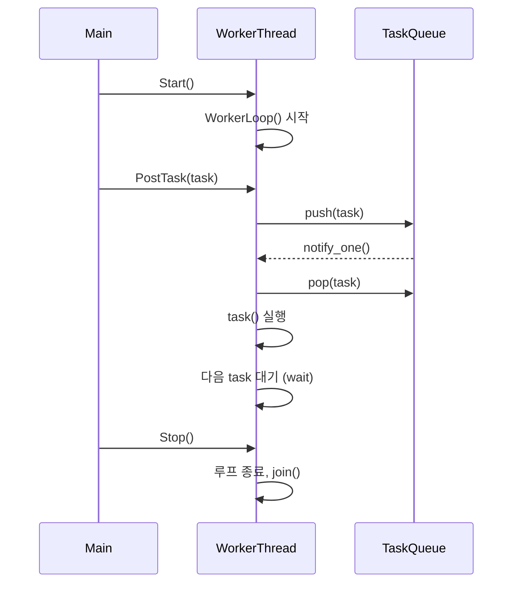
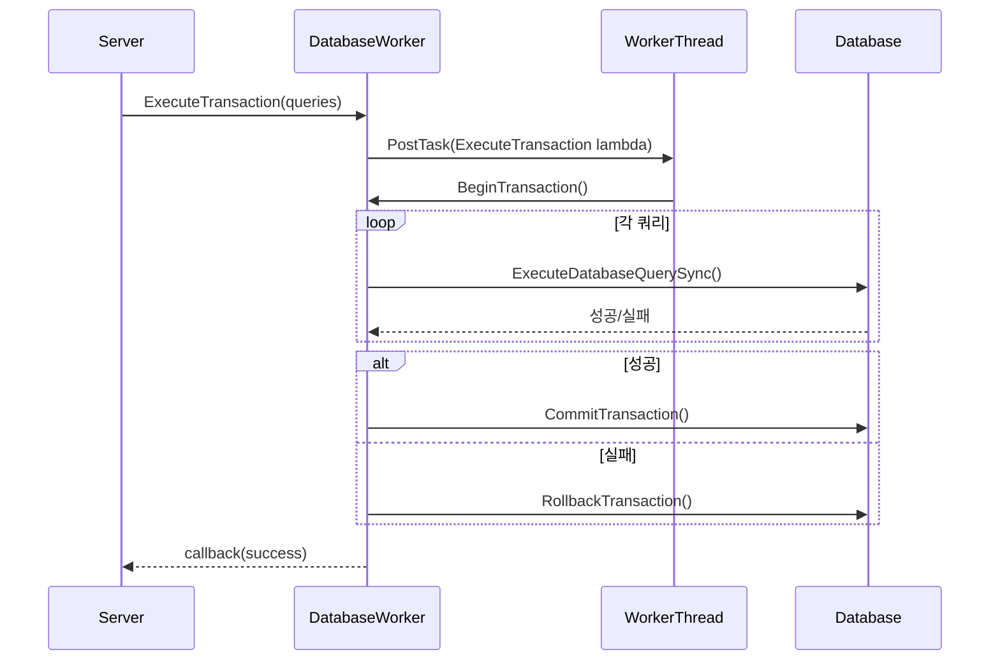
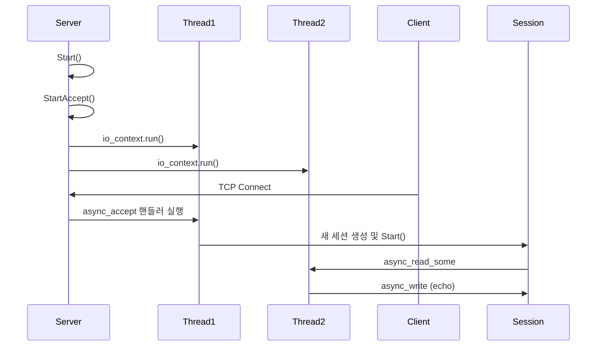
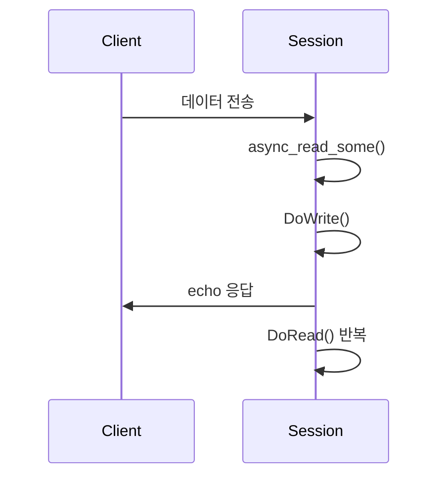
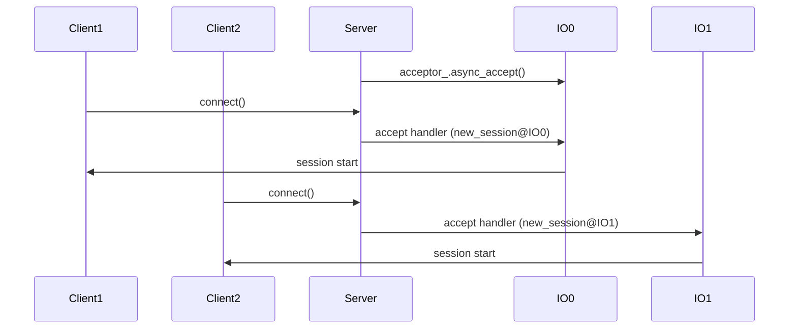
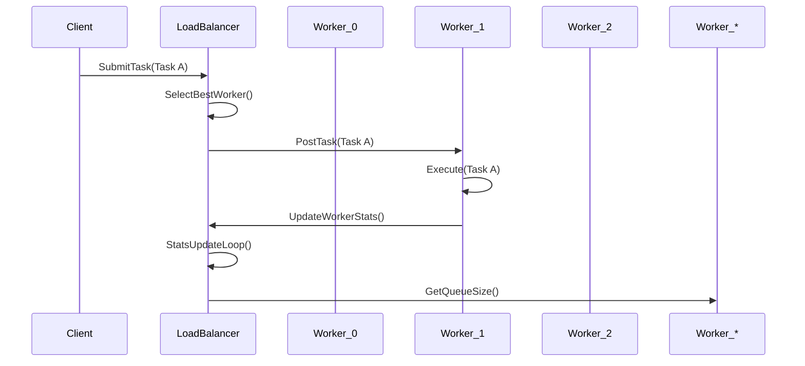

# C++ Boost.Asio로 만드는 온라인 게임 서버
저자: 최흥배, Claude AI   
    
권장 개발 환경
- **IDE**: Visual Studio 2022 (Community 이상)
- **컴파일러**: MSVC v143 (C++20 지원)
- **OS**: Windows 10 이상

-----   

# Chapter 12. 멀티스레드와 동시성
게임 서버는 수많은 동시 연결을 처리해야 하므로 멀티스레드와 동시성 처리가 필수이다. 이번 장에서는 Boost.Asio를 활용하여 안전하고 효율적인 멀티스레드 게임 서버를 구현하는 방법을 학습한다.

## 12.1 WorkerThread 패턴 구현

### 12.1.1 기본 WorkerThread 클래스
WorkerThread 패턴은 작업을 별도의 스레드에서 처리하여 메인 스레드의 부하를 줄이는 디자인 패턴이다.

```cpp
#include <boost/asio.hpp>
#include <boost/thread.hpp>
#include <boost/bind/bind.hpp>
#include <memory>
#include <functional>
#include <queue>
#include <mutex>
#include <condition_variable>
#include <atomic>

class WorkerThread
{
public:
    using Task = std::function<void()>;

    WorkerThread(const std::string& name = "WorkerThread")
        : name_(name), is_running_(false), is_stopping_(false)
    {
    }

    ~WorkerThread()
    {
        Stop();
    }

    void Start()
    {
        if (is_running_.exchange(true))
            return; // 이미 실행 중

        is_stopping_ = false;
        thread_ = std::make_unique<std::thread>([this] { WorkerLoop(); });
        
        std::cout << "WorkerThread [" << name_ << "] started" << std::endl;
    }

    void Stop()
    {
        if (!is_running_.load())
            return;

        is_stopping_ = true;
        
        {
            std::lock_guard<std::mutex> lock(queue_mutex_);
            condition_.notify_all();
        }

        if (thread_ && thread_->joinable())
        {
            thread_->join();
        }

        is_running_ = false;
        std::cout << "WorkerThread [" << name_ << "] stopped" << std::endl;
    }

    void PostTask(Task task)
    {
        if (!is_running_.load())
            return;

        {
            std::lock_guard<std::mutex> lock(queue_mutex_);
            task_queue_.push(std::move(task));
        }
        condition_.notify_one();
    }

    void PostTaskAndWait(Task task)
    {
        if (!is_running_.load())
            return;

        std::promise<void> promise;
        auto future = promise.get_future();

        PostTask([task = std::move(task), &promise]()
        {
            try
            {
                task();
                promise.set_value();
            }
            catch (...)
            {
                promise.set_exception(std::current_exception());
            }
        });

        future.wait();
    }

    size_t GetQueueSize() const
    {
        std::lock_guard<std::mutex> lock(queue_mutex_);
        return task_queue_.size();
    }

    bool IsRunning() const
    {
        return is_running_.load();
    }

private:
    void WorkerLoop()
    {
        std::cout << "WorkerThread [" << name_ << "] loop started" << std::endl;

        while (!is_stopping_)
        {
            std::unique_lock<std::mutex> lock(queue_mutex_);
            
            condition_.wait(lock, [this] 
            { 
                return !task_queue_.empty() || is_stopping_; 
            });

            while (!task_queue_.empty())
            {
                auto task = std::move(task_queue_.front());
                task_queue_.pop();
                
                lock.unlock();
                
                try
                {
                    task();
                }
                catch (const std::exception& e)
                {
                    std::cerr << "WorkerThread [" << name_ 
                             << "] task exception: " << e.what() << std::endl;
                }
                catch (...)
                {
                    std::cerr << "WorkerThread [" << name_ 
                             << "] unknown task exception" << std::endl;
                }
                
                lock.lock();
            }
        }

        std::cout << "WorkerThread [" << name_ << "] loop ended" << std::endl;
    }

    std::string name_;
    std::unique_ptr<std::thread> thread_;
    std::queue<Task> task_queue_;
    mutable std::mutex queue_mutex_;
    std::condition_variable condition_;
    std::atomic<bool> is_running_;
    std::atomic<bool> is_stopping_;
};
```
  
이 코드는 **비동기 작업 처리**를 위한 `WorkerThread` 클래스의 기본 구현이다.
이 패턴은 **메인 스레드의 부하를 줄이고**, **병렬 처리나 백그라운드 작업**을 수행할 때 자주 사용된다.

즉, `WorkerThread`는 하나의 독립적인 작업 스레드를 유지하면서,
**큐에 등록된 작업(Task)을 순차적으로 처리하는 실행 환경**을 제공한다.

#### 전체 개요
이 클래스의 핵심 아이디어는 **생산자–소비자(Producer–Consumer)** 패턴이다.

* **생산자**: `PostTask()`로 작업을 큐에 추가하는 코드
* **소비자**: 내부 `WorkerLoop()`가 큐에서 꺼내 실행하는 스레드

이를 통해 메인 스레드에서는 즉시 반환하고,
실제 계산이나 I/O 같은 무거운 처리는 백그라운드 스레드에서 처리된다.


#### 다이어그램

```
┌──────────────────────────────────┐
│          Main Thread             │
│  ┌─────────────────────────┐     │
│  │ PostTask() / PostTaskAndWait()│
│  └──────────────┬──────────┘     │
└─────────────────│────────────────┘
                  ▼
        ┌──────────────────────┐
        │   WorkerThread       │
        │ ┌──────────────────┐ │
        │ │  task_queue_     │ │
        │ └──────────────────┘ │
        │         │            │
        │         ▼            │
        │  WorkerLoop()        │
        │   → task() 실행       │
        └──────────────────────┘
```

####  클래스 멤버 구성

| 멤버             | 설명                       |
| -------------- | ------------------------ |
| `name_`        | 스레드 이름 (디버깅 및 로그용)       |
| `thread_`      | 실제 실행되는 `std::thread` 객체 |
| `task_queue_`  | 실행 대기 중인 작업들을 보관하는 큐     |
| `queue_mutex_` | 작업 큐 동기화를 위한 뮤텍스         |
| `condition_`   | 대기/알림을 위한 조건 변수          |
| `is_running_`  | 스레드 실행 여부 플래그            |
| `is_stopping_` | 루프 종료 요청 여부 플래그          |


#### Start() – 스레드 시작

```cpp
void Start()
{
    if (is_running_.exchange(true))
        return; // 이미 실행 중

    is_stopping_ = false;
    thread_ = std::make_unique<std::thread>([this] { WorkerLoop(); });
    
    std::cout << "WorkerThread [" << name_ << "] started" << std::endl;
}
```

동작 과정

1. 이미 실행 중이라면 무시 (`exchange(true)`는 원자적 확인 및 설정).
2. `is_stopping_`을 false로 초기화.
3. 새로운 스레드를 생성하고 `WorkerLoop()`를 실행한다.
4. 즉시 반환되어 비동기적 처리가 시작된다.

#### Stop() – 스레드 종료 및 정리

```cpp
void Stop()
{
    if (!is_running_.load())
        return;

    is_stopping_ = true;
    
    {
        std::lock_guard<std::mutex> lock(queue_mutex_);
        condition_.notify_all();
    }

    if (thread_ && thread_->joinable())
    {
        thread_->join();
    }

    is_running_ = false;
    std::cout << "WorkerThread [" << name_ << "] stopped" << std::endl;
}
```

동작 설명

* `is_stopping_`을 `true`로 설정해 루프 종료를 요청한다.
* 조건 변수를 `notify_all()`로 깨워 루프를 빠져나오게 한다.
* 스레드가 종료될 때까지 `join()`으로 대기한다.
* 모든 리소스를 안전하게 정리한다.


#### PostTask() – 비동기 작업 추가

```cpp
void PostTask(Task task)
{
    if (!is_running_.load())
        return;

    {
        std::lock_guard<std::mutex> lock(queue_mutex_);
        task_queue_.push(std::move(task));
    }
    condition_.notify_one();
}
```

핵심 포인트

* 외부에서 작업(`std::function<void()>`)을 전달받는다.
* `task_queue_`에 안전하게 추가하기 위해 `mutex`로 보호한다.
* 작업이 추가되면 조건 변수를 통해 대기 중인 스레드를 깨운다.
* 즉시 반환하므로 메인 스레드는 차단되지 않는다.

#### PostTaskAndWait() – 동기적 작업 실행

```cpp
void PostTaskAndWait(Task task)
{
    if (!is_running_.load())
        return;

    std::promise<void> promise;
    auto future = promise.get_future();

    PostTask([task = std::move(task), &promise]()
    {
        try
        {
            task();
            promise.set_value();
        }
        catch (...)
        {
            promise.set_exception(std::current_exception());
        }
    });

    future.wait();
}
```

동작 순서

1. `std::promise`와 `std::future`를 이용해 결과를 동기화한다.
2. 내부에서 task를 수행한 후 `promise.set_value()` 호출.
3. 호출자는 `future.wait()`로 작업 완료를 기다린다.

즉, **비동기 스레드에서 실행하지만 결과를 기다리는 동기적 인터페이스**다.

#### WorkerLoop() – 핵심 스레드 루프

```cpp
void WorkerLoop()
{
    std::cout << "WorkerThread [" << name_ << "] loop started" << std::endl;

    while (!is_stopping_)
    {
        std::unique_lock<std::mutex> lock(queue_mutex_);
        
        condition_.wait(lock, [this] 
        { 
            return !task_queue_.empty() || is_stopping_; 
        });

        while (!task_queue_.empty())
        {
            auto task = std::move(task_queue_.front());
            task_queue_.pop();
            
            lock.unlock();
            
            try
            {
                task();
            }
            catch (const std::exception& e)
            {
                std::cerr << "WorkerThread [" << name_ 
                         << "] task exception: " << e.what() << std::endl;
            }
            catch (...)
            {
                std::cerr << "WorkerThread [" << name_ 
                         << "] unknown task exception" << std::endl;
            }
            
            lock.lock();
        }
    }

    std::cout << "WorkerThread [" << name_ << "] loop ended" << std::endl;
}
```

세부 동작 단계

1. 조건 변수로 대기하다가 **작업이 추가되거나 종료 요청이 오면 깨어남**.
2. 큐에 있는 모든 작업을 순서대로 처리.
3. 각 작업 실행 중에는 **락을 해제하여 다른 스레드가 PostTask()를 수행 가능**하게 함.
4. 예외 발생 시 로그를 남기고 다음 작업으로 넘어감.
5. `is_stopping_`이 true가 되면 루프 종료.

#### 시퀀스 다이어그램



#### 스레드 동기화 메커니즘

| 구성요소                           | 역할                                 |
| ------------------------------ | ---------------------------------- |
| `std::mutex`                   | 큐 접근 동기화                           |
| `std::condition_variable`      | 큐가 비었을 때 스레드를 대기 상태로 두기            |
| `std::atomic<bool>`            | 실행/종료 상태를 원자적으로 관리                 |
| `std::promise` + `std::future` | PostTaskAndWait()에서 동기적 작업 완료를 기다림 |


#### WorkerThread 사용 예시

```cpp
WorkerThread worker("DBWorker");
worker.Start();

// 비동기 작업 등록
worker.PostTask([]() {
    std::cout << "비동기 작업 실행 중..." << std::endl;
});

// 동기 작업 등록
worker.PostTaskAndWait([]() {
    std::cout << "이 작업이 끝날 때까지 기다림" << std::endl;
});

worker.Stop();
```

출력 예시:

```
WorkerThread [DBWorker] started
WorkerThread [DBWorker] loop started
비동기 작업 실행 중...
이 작업이 끝날 때까지 기다림
WorkerThread [DBWorker] loop ended
WorkerThread [DBWorker] stopped
```

#### 설계적 장점

| 항목               | 설명                               |
| ---------------- | -------------------------------- |
| **메인 스레드 부하 감소** | 오래 걸리는 작업을 백그라운드 스레드에서 처리        |
| **안전한 종료 보장**    | `Stop()`에서 join을 통해 완전한 종료를 보장   |
| **유연한 확장성**      | 여러 `WorkerThread`를 사용하여 병렬 작업 가능 |
| **스레드 안전성 확보**   | 뮤텍스, 조건변수, 아토믹 플래그로 안정적 운영       |
| **예외 안전성**       | 작업 실행 중 예외 발생 시 로그 출력 후 계속 처리    |


#### 요약
`WorkerThread`는 게임 서버, 채팅 서버, DB 연동 등에서 매우 자주 쓰이는 패턴이다.
다음과 같은 역할을 한다.

* 하나의 스레드가 큐에 쌓인 작업을 순차 처리
* 다른 스레드(메인, 네트워크 스레드 등)가 비동기로 작업을 등록
* 안전한 종료 및 예외 처리 제공

즉, **“비동기 태스크 실행용 경량 스레드 풀의 기본 단위”**라고 할 수 있다.


### 12.1.2 게임 로직 처리용 WorkerThread

```cpp
class GameLogicWorker
{
public:
    struct PlayerAction
    {
        uint32_t player_id;
        uint32_t action_type;
        std::vector<uint8_t> action_data;
        std::chrono::steady_clock::time_point timestamp;
    };

    GameLogicWorker() : worker_("GameLogic")
    {
        worker_.Start();
    }

    ~GameLogicWorker()
    {
        worker_.Stop();
    }

    void ProcessPlayerAction(const PlayerAction& action)
    {
        worker_.PostTask([this, action]()
        {
            try
            {
                HandlePlayerAction(action);
            }
            catch (const std::exception& e)
            {
                std::cerr << "Error processing player action: " << e.what() << std::endl;
            }
        });
    }

    void ProcessBatchActions(const std::vector<PlayerAction>& actions)
    {
        worker_.PostTask([this, actions]()
        {
            for (const auto& action : actions)
            {
                HandlePlayerAction(action);
            }
        });
    }

    void SchedulePeriodicTask(std::chrono::milliseconds interval, 
                             std::function<void()> task)
    {
        worker_.PostTask([this, interval, task]()
        {
            PeriodicTaskLoop(interval, task);
        });
    }

private:
    void HandlePlayerAction(const PlayerAction& action)
    {
        // 플레이어 액션 처리 로직
        switch (action.action_type)
        {
        case 1: // 이동
            ProcessMovement(action);
            break;
        case 2: // 공격
            ProcessAttack(action);
            break;
        case 3: // 아이템 사용
            ProcessItemUse(action);
            break;
        default:
            std::cout << "Unknown action type: " << action.action_type << std::endl;
            break;
        }
    }

    void ProcessMovement(const PlayerAction& action)
    {
        std::cout << "Processing movement for player " << action.player_id << std::endl;
        // 이동 로직 구현
        std::this_thread::sleep_for(std::chrono::milliseconds(1)); // 시뮬레이션
    }

    void ProcessAttack(const PlayerAction& action)
    {
        std::cout << "Processing attack for player " << action.player_id << std::endl;
        // 공격 로직 구현
        std::this_thread::sleep_for(std::chrono::milliseconds(2)); // 시뮬레이션
    }

    void ProcessItemUse(const PlayerAction& action)
    {
        std::cout << "Processing item use for player " << action.player_id << std::endl;
        // 아이템 사용 로직 구현
        std::this_thread::sleep_for(std::chrono::milliseconds(1)); // 시뮬레이션
    }

    void PeriodicTaskLoop(std::chrono::milliseconds interval, 
                         std::function<void()> task)
    {
        while (worker_.IsRunning())
        {
            auto start = std::chrono::steady_clock::now();
            
            try
            {
                task();
            }
            catch (const std::exception& e)
            {
                std::cerr << "Periodic task error: " << e.what() << std::endl;
            }

            auto end = std::chrono::steady_clock::now();
            auto elapsed = std::chrono::duration_cast<std::chrono::milliseconds>(end - start);
            auto sleep_time = interval - elapsed;

            if (sleep_time > std::chrono::milliseconds::zero())
            {
                std::this_thread::sleep_for(sleep_time);
            }
        }
    }

    WorkerThread worker_;
};
```

### 12.1.3 데이터베이스 워커 스레드

```cpp
class DatabaseWorker
{
public:
    enum class QueryType
    {
        SELECT,
        INSERT,
        UPDATE,
        DELETE
    };

    struct DatabaseQuery
    {
        QueryType type;
        std::string sql;
        std::vector<std::string> parameters;
        std::function<void(bool, const std::string&)> callback; // success, result
    };

    DatabaseWorker() : worker_("Database")
    {
        worker_.Start();
    }

    ~DatabaseWorker()
    {
        worker_.Stop();
    }

    void ExecuteQuery(const DatabaseQuery& query)
    {
        worker_.PostTask([this, query]()
        {
            ExecuteDatabaseQuery(query);
        });
    }

    void ExecuteTransaction(const std::vector<DatabaseQuery>& queries,
                           std::function<void(bool)> callback)
    {
        worker_.PostTask([this, queries, callback]()
        {
            bool success = true;
            
            // 트랜잭션 시작
            BeginTransaction();
            
            for (const auto& query : queries)
            {
                if (!ExecuteDatabaseQuerySync(query))
                {
                    success = false;
                    break;
                }
            }
            
            if (success)
            {
                CommitTransaction();
            }
            else
            {
                RollbackTransaction();
            }
            
            if (callback)
            {
                callback(success);
            }
        });
    }

    void SavePlayerData(uint32_t player_id, const std::string& player_data,
                       std::function<void(bool)> callback = nullptr)
    {
        DatabaseQuery query;
        query.type = QueryType::UPDATE;
        query.sql = "UPDATE players SET data = ? WHERE id = ?";
        query.parameters = {player_data, std::to_string(player_id)};
        query.callback = [callback](bool success, const std::string&)
        {
            if (callback)
                callback(success);
        };

        ExecuteQuery(query);
    }

    void LoadPlayerData(uint32_t player_id, 
                       std::function<void(bool, const std::string&)> callback)
    {
        DatabaseQuery query;
        query.type = QueryType::SELECT;
        query.sql = "SELECT data FROM players WHERE id = ?";
        query.parameters = {std::to_string(player_id)};
        query.callback = callback;

        ExecuteQuery(query);
    }

private:
    void ExecuteDatabaseQuery(const DatabaseQuery& query)
    {
        bool success = ExecuteDatabaseQuerySync(query);
        
        if (query.callback)
        {
            std::string result = success ? "Query executed successfully" : "Query failed";
            query.callback(success, result);
        }
    }

    bool ExecuteDatabaseQuerySync(const DatabaseQuery& query)
    {
        // 실제 데이터베이스 연동 코드
        // 여기서는 시뮬레이션으로 처리
        std::cout << "Executing " << GetQueryTypeName(query.type) 
                 << " query: " << query.sql << std::endl;
        
        // 데이터베이스 처리 시뮬레이션
        std::this_thread::sleep_for(std::chrono::milliseconds(10));
        
        // 90% 성공률로 시뮬레이션
        return (rand() % 100) < 90;
    }

    void BeginTransaction()
    {
        std::cout << "BEGIN TRANSACTION" << std::endl;
    }

    void CommitTransaction()
    {
        std::cout << "COMMIT TRANSACTION" << std::endl;
    }

    void RollbackTransaction()
    {
        std::cout << "ROLLBACK TRANSACTION" << std::endl;
    }

    std::string GetQueryTypeName(QueryType type)
    {
        switch (type)
        {
        case QueryType::SELECT: return "SELECT";
        case QueryType::INSERT: return "INSERT";
        case QueryType::UPDATE: return "UPDATE";
        case QueryType::DELETE: return "DELETE";
        default: return "UNKNOWN";
        }
    }

    WorkerThread worker_;
};
```
  
이 코드는 **데이터베이스 전용 워커 스레드(DatabaseWorker)**를 구현한 예제다.
핵심 목적은 **게임 서버나 채팅 서버의 메인 스레드에서 직접 DB 쿼리를 실행하지 않고**,
별도의 백그라운드 스레드에서 안전하게 비동기 방식으로 처리하는 것이다.

즉, **“WorkerThread + DB 쿼리 래퍼”** 구조로, 서버의 I/O 루프를 차단하지 않으면서도
DB 연산의 신뢰성과 트랜잭션 일관성을 보장한다.

#### 클래스 구조 개요
`DatabaseWorker`는 내부에 `WorkerThread`를 포함하고 있으며,
그 위에서 다양한 데이터베이스 작업을 비동기로 처리한다.

```plaintext
┌──────────────────────────────┐
│        DatabaseWorker        │
│ ┌──────────────────────────┐ │
│ │ WorkerThread ("Database")│ │
│ └──────────────────────────┘ │
│     ▲  ↑                     │
│     │  │ ExecuteQuery()      │
│     │  └ ExecuteTransaction()│
│     └─> 실제 DB 연산 수행      │
└──────────────────────────────┘
```

즉, `DatabaseWorker`는 **DB 관련 로직만을 담당하는 전용 작업자 스레드**다.

#### 주요 구성 요소

```cpp
enum class QueryType { SELECT, INSERT, UPDATE, DELETE };

struct DatabaseQuery
{
    QueryType type;
    std::string sql;
    std::vector<std::string> parameters;
    std::function<void(bool, const std::string&)> callback;
};
```

| 항목             | 설명                           |
| -------------- | ---------------------------- |
| **QueryType**  | 쿼리의 종류(SELECT, INSERT 등)를 구분 |
| **sql**        | 실제 SQL 문                     |
| **parameters** | SQL 문에 바인딩될 인자 값             |
| **callback**   | 쿼리 수행 결과를 비동기적으로 통보하는 콜백     |

이 구조체는 하나의 DB 요청 단위를 표현한다.

#### 생성자 및 소멸자

```cpp
DatabaseWorker() : worker_("Database")
{
    worker_.Start();
}

~DatabaseWorker()
{
    worker_.Stop();
}
```

* 내부적으로 `WorkerThread` 객체를 하나 생성하고 즉시 시작한다.
* 클래스가 파괴될 때 스레드를 안전하게 정지시킨다.
* 즉, 생성 시 DB 처리 스레드가 자동으로 활성화된다.

#### ExecuteQuery() – 단일 쿼리 실행

```cpp
void ExecuteQuery(const DatabaseQuery& query)
{
    worker_.PostTask([this, query]()
    {
        ExecuteDatabaseQuery(query);
    });
}
```

* 외부에서 전달된 `DatabaseQuery`를 비동기로 `worker_`에 전달한다.
* 실제 DB 실행은 내부의 `ExecuteDatabaseQuery()`에서 처리된다.
* 이 방식으로 메인 스레드는 차단되지 않는다.


#### ExecuteTransaction() – 트랜잭션 실행

```cpp
void ExecuteTransaction(const std::vector<DatabaseQuery>& queries,
                       std::function<void(bool)> callback)
{
    worker_.PostTask([this, queries, callback]()
    {
        bool success = true;
        BeginTransaction();

        for (const auto& query : queries)
        {
            if (!ExecuteDatabaseQuerySync(query))
            {
                success = false;
                break;
            }
        }

        if (success) CommitTransaction();
        else RollbackTransaction();

        if (callback) callback(success);
    });
}
```

동작 순서

1. 워커 스레드에서 트랜잭션 시작 (`BEGIN TRANSACTION`).
2. 여러 SQL 쿼리를 순서대로 실행.
3. 중간에 하나라도 실패하면 롤백.
4. 모두 성공 시 커밋.
5. 최종적으로 콜백을 통해 성공 여부를 호출자에게 전달.

이 방식으로 **원자성(Atomicity)**이 보장된다.

#### 트랜잭션 실행 시퀀스 다이어그램



#### SavePlayerData() – 플레이어 데이터 저장

```cpp
void SavePlayerData(uint32_t player_id, const std::string& player_data,
                   std::function<void(bool)> callback = nullptr)
{
    DatabaseQuery query;
    query.type = QueryType::UPDATE;
    query.sql = "UPDATE players SET data = ? WHERE id = ?";
    query.parameters = {player_data, std::to_string(player_id)};
    query.callback = [callback](bool success, const std::string&)
    {
        if (callback) callback(success);
    };

    ExecuteQuery(query);
}
```
  
* 특정 플레이어의 데이터를 DB에 저장하는 함수.
* SQL 바인딩은 `parameters`로 처리.
* `callback`을 통해 성공 여부만 전달.
* 내부적으로 `ExecuteQuery()`를 통해 비동기 실행.

#### LoadPlayerData() – 플레이어 데이터 로드

```cpp
void LoadPlayerData(uint32_t player_id, 
                   std::function<void(bool, const std::string&)> callback)
{
    DatabaseQuery query;
    query.type = QueryType::SELECT;
    query.sql = "SELECT data FROM players WHERE id = ?";
    query.parameters = {std::to_string(player_id)};
    query.callback = callback;

    ExecuteQuery(query);
}
```

설명

* 플레이어 데이터를 DB에서 읽어오는 함수.
* `callback(success, result)` 형식으로 결과 반환.
* DB 접근이 비동기적으로 수행되어 서버의 I/O 루프에 영향이 없다.

#### ExecuteDatabaseQuery() – 비동기 쿼리 실행기

```cpp
void ExecuteDatabaseQuery(const DatabaseQuery& query)
{
    bool success = ExecuteDatabaseQuerySync(query);
    
    if (query.callback)
    {
        std::string result = success ? "Query executed successfully" : "Query failed";
        query.callback(success, result);
    }
}
```

* 내부에서 실제 쿼리를 실행(`ExecuteDatabaseQuerySync()`).
* 실행 결과에 따라 콜백을 호출.
* 쿼리 성공 여부를 클라이언트에 알리는 역할.


#### ExecuteDatabaseQuerySync() – 동기 쿼리 실행 (시뮬레이션)

```cpp
bool ExecuteDatabaseQuerySync(const DatabaseQuery& query)
{
    std::cout << "Executing " << GetQueryTypeName(query.type) 
             << " query: " << query.sql << std::endl;
    
    std::this_thread::sleep_for(std::chrono::milliseconds(10));
    
    return (rand() % 100) < 90; // 90% 확률로 성공
}
```

* 실제 DB 연동 대신 시뮬레이션으로 구현되어 있음.
* 네트워크나 DB 드라이버 호출 대신 `sleep`으로 처리 시간만 흉내.
* 실제 환경에서는 MySQL, PostgreSQL, SQLite 등 DB API 호출로 대체된다.

#### 트랜잭션 유틸리티

```cpp
void BeginTransaction() { std::cout << "BEGIN TRANSACTION" << std::endl; }
void CommitTransaction() { std::cout << "COMMIT TRANSACTION" << std::endl; }
void RollbackTransaction() { std::cout << "ROLLBACK TRANSACTION" << std::endl; }
```

* 단순 로그 출력용이지만, 실제 환경에서는 DB 세션 커넥션의 트랜잭션을 제어하는 코드가 들어간다.

#### GetQueryTypeName()

```cpp
std::string GetQueryTypeName(QueryType type)
{
    switch (type)
    {
    case QueryType::SELECT: return "SELECT";
    case QueryType::INSERT: return "INSERT";
    case QueryType::UPDATE: return "UPDATE";
    case QueryType::DELETE: return "DELETE";
    default: return "UNKNOWN";
    }
}
```

디버깅과 로깅을 위한 헬퍼 함수로, 쿼리 유형을 문자열로 변환한다.

#### 전체 동작 흐름

```
메인 스레드
  ↓
ExecuteQuery() 호출
  ↓
WorkerThread::PostTask() → 비동기 큐 등록
  ↓
WorkerLoop() 내부에서 ExecuteDatabaseQuery() 실행
  ↓
ExecuteDatabaseQuerySync() → 실제 DB 작업 수행
  ↓
callback() 호출로 결과 전달
```

#### 흐름 요약

```
┌───────────────────────────────────────┐
│               메인 스레드               │
│ ExecuteQuery() / ExecuteTransaction() │
└───────────────────┬───────────────────┘
                    │
                    ▼
        ┌──────────────────────┐
        │   WorkerThread 큐     │
        │ [ DB 쿼리 작업 등록 ]  │
        └──────────┬───────────┘
                   ▼
        ┌──────────────────────┐
        │  WorkerLoop() 실행    │
        │  ExecuteDatabaseQuery│
        └──────────┬───────────┘
                   ▼
        ┌───────────────────────┐
        │ 실제 DB 연산 처리       │
        │  (Sync / Async DB API)│
        └──────────┬────────────┘
                   ▼
          콜백(callback) 실행
```

#### 설계상의 특징 및 장점

| 항목               | 설명                                |
| ---------------- | --------------------------------- |
| **비동기 처리**       | 메인 스레드의 블로킹 없이 DB 쿼리를 병렬로 처리      |
| **단일 스레드 DB 접근** | 동시성 문제(락, 세션 충돌 등)를 원천 차단         |
| **트랜잭션 지원**      | 여러 쿼리를 하나의 원자적 단위로 처리 가능          |
| **확장성**          | WorkerThread를 여러 개 두어 DB 부하 분산 가능 |
| **에러 격리**        | 예외 발생 시 콜백 단위로 오류 처리 가능           |


#### 예시 실행 결과

```cpp
DatabaseWorker db;

db.SavePlayerData(1001, "{name:'hero', level:10}", [](bool success) {
    std::cout << "SavePlayerData: " << (success ? "OK" : "FAIL") << std::endl;
});

db.LoadPlayerData(1001, [](bool success, const std::string& data) {
    std::cout << "LoadPlayerData: " << (success ? data : "ERROR") << std::endl;
});
```

출력 예시:

```
WorkerThread [Database] started
Executing UPDATE query: UPDATE players SET data = ? WHERE id = ?
Executing SELECT query: SELECT data FROM players WHERE id = ?
Query executed successfully
Query executed successfully
```


#### 요약
`DatabaseWorker`는 **비동기 DB 작업 전담 모듈**로, 서버의 안정성과 성능을 동시에 확보하기 위한 핵심 컴포넌트다.

* **비동기 큐 기반 구조**로 DB 연산이 메인 루프를 방해하지 않는다.
* **트랜잭션 기능**으로 데이터 일관성과 무결성을 보장한다.
* **콜백 기반 결과 전달**로 완전한 논블로킹 설계를 실현한다.

결국 이 클래스는 **“실시간 서버의 DB 처리 전용 비동기 워커 패턴의 교과서적인 예시”**라고 할 수 있다.


## 12.2 io_context의 멀티스레드 활용

### 12.2.1 기본 멀티스레드 io_context 사용

```cpp
class MultiThreadedServer
{
public:
    MultiThreadedServer(short port, size_t thread_count = std::thread::hardware_concurrency())
        : acceptor_(io_context_, boost::asio::ip::tcp::endpoint(boost::asio::ip::tcp::v4(), port)),
          thread_count_(thread_count)
    {
        // 작업을 유지하기 위한 work guard
        work_guard_ = boost::asio::make_work_guard(io_context_);
    }

    void Start()
    {
        std::cout << "Starting server with " << thread_count_ << " threads" << std::endl;
        
        StartAccept();
        
        // 여러 스레드에서 io_context 실행
        for (size_t i = 0; i < thread_count_; ++i)
        {
            threads_.emplace_back([this, i]()
            {
                std::cout << "IO Thread " << i << " started" << std::endl;
                
                try
                {
                    io_context_.run();
                }
                catch (const std::exception& e)
                {
                    std::cerr << "IO Thread " << i << " exception: " << e.what() << std::endl;
                }
                
                std::cout << "IO Thread " << i << " ended" << std::endl;
            });
        }
    }

    void Stop()
    {
        std::cout << "Stopping server..." << std::endl;
        
        // 새로운 작업 중지
        work_guard_.reset();
        
        // 모든 비동기 작업 취소
        io_context_.stop();
        
        // 모든 스레드 종료 대기
        for (auto& thread : threads_)
        {
            if (thread.joinable())
            {
                thread.join();
            }
        }
        
        threads_.clear();
        std::cout << "Server stopped" << std::endl;
    }

    void WaitForShutdown()
    {
        for (auto& thread : threads_)
        {
            if (thread.joinable())
            {
                thread.join();
            }
        }
    }

private:
    void StartAccept()
    {
        auto new_session = std::make_shared<Session>(io_context_);
        
        acceptor_.async_accept(new_session->GetSocket(),
            [this, new_session](const boost::system::error_code& ec)
            {
                if (!ec)
                {
                    std::cout << "New connection accepted on thread " 
                             << std::this_thread::get_id() << std::endl;
                    new_session->Start();
                    sessions_.insert(new_session);
                }
                else
                {
                    std::cerr << "Accept error: " << ec.message() << std::endl;
                }
                
                StartAccept();
            });
    }

    boost::asio::io_context io_context_;
    boost::asio::ip::tcp::acceptor acceptor_;
    boost::asio::executor_work_guard<boost::asio::io_context::executor_type> work_guard_;
    
    std::vector<std::thread> threads_;
    size_t thread_count_;
    
    std::set<std::shared_ptr<Session>> sessions_;
};

class Session : public std::enable_shared_from_this<Session>
{
public:
    Session(boost::asio::io_context& io_context)
        : socket_(io_context)
    {
    }

    void Start()
    {
        DoRead();
    }

    boost::asio::ip::tcp::socket& GetSocket()
    {
        return socket_;
    }

private:
    void DoRead()
    {
        auto self = shared_from_this();
        socket_.async_read_some(
            boost::asio::buffer(buffer_),
            [this, self](const boost::system::error_code& ec, std::size_t length)
            {
                if (!ec)
                {
                    // 에코 응답
                    DoWrite(length);
                }
                else
                {
                    std::cout << "Read error: " << ec.message() 
                             << " on thread " << std::this_thread::get_id() << std::endl;
                }
            });
    }

    void DoWrite(std::size_t length)
    {
        auto self = shared_from_this();
        boost::asio::async_write(
            socket_,
            boost::asio::buffer(buffer_, length),
            [this, self](const boost::system::error_code& ec, std::size_t)
            {
                if (!ec)
                {
                    DoRead();
                }
                else
                {
                    std::cout << "Write error: " << ec.message() 
                             << " on thread " << std::this_thread::get_id() << std::endl;
                }
            });
    }

    boost::asio::ip::tcp::socket socket_;
    std::array<char, 1024> buffer_;
};
```
  
이 코드는 **Boost.Asio의 `io_context`를 멀티스레드 환경에서 사용하는 기본적인 서버 구현 예시**로, 각 스레드가 동시에 `io_context.run()`을 호출하면서 여러 클라이언트 연결을 병렬 처리할 수 있게 설계된 구조다.
아래에 **코드 구조**, **작동 흐름**, **스레드 처리 모델**, **세션 흐름**을 중심으로 자세히 설명하겠다.

#### 전체 구조 개요
`MultiThreadedServer` 클래스는 다음과 같은 구성 요소로 이루어져 있다:

```
MultiThreadedServer
├── io_context_ : 비동기 작업의 중심
├── acceptor_   : 클라이언트 연결 수락
├── work_guard_ : io_context의 run()이 종료되지 않게 유지
├── threads_    : io_context를 실행하는 여러 스레드
├── sessions_   : 현재 활성화된 세션 집합
└── StartAccept / Stop / WaitForShutdown / Start
```

그리고 각 클라이언트 연결은 `Session` 클래스로 관리된다:

```
Session
├── socket_ : 클라이언트 소켓
├── buffer_ : 수신/송신 버퍼
├── Start / DoRead / DoWrite
```

#### io_context와 스레드의 관계
Boost.Asio의 핵심은 `io_context` 객체다.
이 객체는 **비동기 작업 큐(event loop)** 를 관리한다.

* `io_context.run()`은 내부적으로 작업(핸들러)을 하나씩 꺼내 실행한다.
* 여러 스레드가 `run()`을 호출하면, **하나의 작업은 하나의 스레드에서만 실행된다**.
* 즉, `io_context`는 스레드 안전하게 병렬 처리를 조정한다.

이를 ASCII 다이어그램으로 표현하면 다음과 같다:

```
        +----------------+
        |  io_context_   |
        | (작업 큐)       |
        +--------+-------+
                 |
   +-------------+-------------+
   |             |             |
Thread 0     Thread 1     Thread 2
 run()         run()         run()
   |             |             |
  핸들러 실행  핸들러 실행  핸들러 실행
```

즉, 여러 스레드가 하나의 `io_context`를 공유하며, 작업들이 병렬로 소비된다.

#### work_guard의 역할
`boost::asio::make_work_guard(io_context_)`는 `io_context`가 **즉시 종료되는 것을 방지**하기 위한 객체다.

기본적으로 `io_context.run()`은 처리할 작업이 없으면 즉시 반환한다.
하지만 서버는 항상 연결을 기다려야 하므로, 이때 **work guard**를 생성해 `run()`이 블록된 상태로 유지되도록 한다.

```cpp
work_guard_ = boost::asio::make_work_guard(io_context_);
```

서버 종료 시에는 이 guard를 해제하여 `io_context`가 자연스럽게 종료되게 한다:

```cpp
work_guard_.reset();
io_context_.stop();
```

#### Start() 함수의 동작

```cpp
void Start() {
    StartAccept(); // 첫 비동기 accept 시작
    for (...) {    // 스레드 여러 개 생성
        threads_.emplace_back([this, i]() { io_context_.run(); });
    }
}
```

이 과정은 다음과 같은 순서로 진행된다:

1. `StartAccept()`로 첫 연결 대기 시작.
2. `thread_count_`만큼 스레드 생성.
3. 각 스레드는 `io_context.run()`을 호출하며 대기.
4. 클라이언트가 연결하면 accept 핸들러 실행 → 새 `Session` 생성 → 비동기 read 시작.

이 흐름을 시퀀스 다이어그램으로 보면 다음과 같다:



#### StartAccept()의 동작
`StartAccept()`는 비동기 방식으로 클라이언트 연결을 기다린다.

```cpp
acceptor_.async_accept(new_session->GetSocket(),
    [this, new_session](const boost::system::error_code& ec)
    {
        if (!ec)
        {
            new_session->Start();
            sessions_.insert(new_session);
        }
        StartAccept(); // 다음 연결 대기
    });
```

핵심은 **accept가 완료된 후 다시 자기 자신을 호출**한다는 점이다.
이렇게 하면 무한히 새로운 연결을 받을 수 있다.

#### Session 클래스의 역할
`Session`은 **각 클라이언트와의 통신 단위**를 담당한다.
핵심 흐름은 `DoRead → DoWrite → DoRead`의 루프 구조다.

```
클라이언트 → 서버 : 데이터 수신 (async_read_some)
서버 → 클라이언트 : 에코 응답 (async_write)
```

다이어그램으로 보면 다음과 같다:



코드상 흐름 요약

```cpp
void DoRead() {
    socket_.async_read_some(buffer, [this](ec, length) {
        if (!ec) DoWrite(length);
    });
}

void DoWrite(size_t length) {
    async_write(socket_, buffer, [this](ec, len) {
        if (!ec) DoRead();
    });
}
```

즉, 읽기가 완료되면 쓰기를 하고, 쓰기가 완료되면 다시 읽기를 한다.
이 방식으로 클라이언트와 지속적으로 데이터를 교환할 수 있다.

  
#### Stop()과 종료 처리
서버를 종료할 때는 다음 단계를 거친다.

1. `work_guard_.reset()` — 더 이상 새로운 작업 유지 안 함.
2. `io_context_.stop()` — 대기 중인 모든 `run()` 호출 깨움.
3. 모든 스레드 `join()` — 스레드가 모두 종료될 때까지 대기.


#### 멀티스레드 동작 예시 로그
서버가 실제로 실행되면 다음과 같은 콘솔 로그를 볼 수 있다:

```
Starting server with 4 threads
IO Thread 0 started
IO Thread 1 started
IO Thread 2 started
IO Thread 3 started
New connection accepted on thread 2
Read error: End of file on thread 2
IO Thread 2 ended
...
Server stopped
```

이 로그를 통해 각 연결 및 I/O 이벤트가 **서로 다른 스레드에서 처리됨을 확인**할 수 있다.

#### 요약

| 구성 요소         | 역할                             |
| ------------- | ------------------------------ |
| `io_context_` | 비동기 작업 실행의 중심                  |
| `acceptor_`   | 클라이언트 연결 수락                    |
| `Session`     | 각 연결을 처리 (read/write)          |
| `work_guard_` | `io_context.run()`이 종료되지 않게 유지 |
| 여러 스레드        | 병렬로 `io_context.run()`을 수행     |

---

이 예제는 Boost.Asio에서 멀티스레드 서버를 구축할 때의 핵심 개념(즉, **스레드 안전한 io_context 공유**와 **비동기 accept/read/write의 체계**)을 잘 보여주는 기본 형태다.
이 구조를 확장하면 실제 상용 서버에서의 I/O 처리, 타이머, 큐 관리, 세션 관리 등을 쉽게 구현할 수 있다.


### 12.2.2 io_context 풀 관리

```cpp
class IOContextPool
{
public:
    IOContextPool(size_t pool_size = std::thread::hardware_concurrency())
        : pool_size_(pool_size), next_io_context_(0)
    {
        for (size_t i = 0; i < pool_size_; ++i)
        {
            auto io_context = std::make_shared<boost::asio::io_context>();
            auto work_guard = boost::asio::make_work_guard(*io_context);
            
            io_contexts_.push_back(io_context);
            work_guards_.push_back(work_guard);
        }
    }

    void Start()
    {
        for (size_t i = 0; i < pool_size_; ++i)
        {
            threads_.emplace_back([this, i]()
            {
                std::cout << "IOContext pool thread " << i << " started" << std::endl;
                
                try
                {
                    io_contexts_[i]->run();
                }
                catch (const std::exception& e)
                {
                    std::cerr << "IOContext pool thread " << i 
                             << " exception: " << e.what() << std::endl;
                }
                
                std::cout << "IOContext pool thread " << i << " ended" << std::endl;
            });
        }
    }

    void Stop()
    {
        // 모든 work guard 해제
        for (auto& work_guard : work_guards_)
        {
            work_guard.reset();
        }

        // 모든 io_context 중지
        for (auto& io_context : io_contexts_)
        {
            io_context->stop();
        }

        // 모든 스레드 종료 대기
        for (auto& thread : threads_)
        {
            if (thread.joinable())
            {
                thread.join();
            }
        }
    }

    boost::asio::io_context& GetIOContext()
    {
        // 라운드 로빈 방식으로 io_context 선택
        auto& io_context = *io_contexts_[next_io_context_];
        next_io_context_ = (next_io_context_ + 1) % io_contexts_.size();
        return io_context;
    }

    boost::asio::io_context& GetIOContext(size_t index)
    {
        if (index >= io_contexts_.size())
            index = 0;
        return *io_contexts_[index];
    }

    size_t GetPoolSize() const
    {
        return pool_size_;
    }

private:
    size_t pool_size_;
    std::vector<std::shared_ptr<boost::asio::io_context>> io_contexts_;
    std::vector<boost::asio::executor_work_guard<boost::asio::io_context::executor_type>> work_guards_;
    std::vector<std::thread> threads_;
    std::atomic<size_t> next_io_context_;
};

// io_context 풀을 사용하는 서버
class PooledServer
{
public:
    PooledServer(short port, size_t pool_size = std::thread::hardware_concurrency())
        : io_context_pool_(pool_size),
          acceptor_(io_context_pool_.GetIOContext(), 
                   boost::asio::ip::tcp::endpoint(boost::asio::ip::tcp::v4(), port))
    {
    }

    void Start()
    {
        io_context_pool_.Start();
        StartAccept();
        
        std::cout << "Pooled server started with " 
                 << io_context_pool_.GetPoolSize() << " IO contexts" << std::endl;
    }

    void Stop()
    {
        acceptor_.close();
        io_context_pool_.Stop();
    }

private:
    void StartAccept()
    {
        // 새로운 연결을 위해 다음 io_context 선택
        auto new_session = std::make_shared<PooledSession>(io_context_pool_.GetIOContext());
        
        acceptor_.async_accept(new_session->GetSocket(),
            [this, new_session](const boost::system::error_code& ec)
            {
                if (!ec)
                {
                    new_session->Start();
                }
                
                StartAccept();
            });
    }

    IOContextPool io_context_pool_;
    boost::asio::ip::tcp::acceptor acceptor_;
};

class PooledSession : public std::enable_shared_from_this<PooledSession>
{
public:
    PooledSession(boost::asio::io_context& io_context)
        : socket_(io_context)
    {
    }

    void Start()
    {
        std::cout << "Session started on IO context thread " 
                 << std::this_thread::get_id() << std::endl;
        DoRead();
    }

    boost::asio::ip::tcp::socket& GetSocket()
    {
        return socket_;
    }

private:
    void DoRead()
    {
        auto self = shared_from_this();
        socket_.async_read_some(
            boost::asio::buffer(buffer_),
            [this, self](const boost::system::error_code& ec, std::size_t length)
            {
                if (!ec)
                {
                    ProcessData(length);
                    DoRead();
                }
            });
    }

    void ProcessData(std::size_t length)
    {
        // 데이터 처리 - 각 세션이 서로 다른 io_context에서 실행될 수 있음
        std::cout << "Processing " << length << " bytes on thread " 
                 << std::this_thread::get_id() << std::endl;
    }

    boost::asio::ip::tcp::socket socket_;
    std::array<char, 1024> buffer_;
};
```
    
이 코드는 **Boost.Asio에서 다중 `io_context` 풀을 구성하여 부하를 분산 처리하는 고급 서버 구조**를 보여준다.
앞의 단일 `io_context` 멀티스레드 서버보다 더 유연하고 확장성이 높은 구조다.

이제 코드를 단계별로 해부하면서 **핵심 개념**, **작동 구조**, **스레드 및 I/O 분배 모델**, **풀의 이점** 등을 자세히 설명하겠다.

#### 전체 개요
앞 절(12.2.1)에서는 하나의 `io_context`를 여러 스레드가 공유하는 구조였다.
이번 예제는 **복수의 `io_context` 객체를 풀(pool)로 관리**하여,
각 I/O 작업이 서로 다른 `io_context` (즉, 서로 다른 이벤트 루프)에서 독립적으로 수행될 수 있게 한다.

이를 통해 다음과 같은 장점이 생긴다:

* CPU 코어별로 `io_context`를 분리 → 캐시 지역성 향상
* 대규모 연결에서도 lock contention 감소
* 세션 간 간섭 최소화

#### IOContextPool의 구조
`IOContextPool` 클래스는 여러 개의 `io_context`를 생성하고 각각을 독립적인 스레드에서 실행한다.

### 클래스 구성도

```
IOContextPool
├── pool_size_           : io_context 개수 (스레드 수와 동일)
├── io_contexts_[]       : io_context 스마트 포인터 벡터
├── work_guards_[]       : io_context 유지용 work_guard 벡터
├── threads_[]           : 각 io_context를 실행하는 스레드 벡터
└── next_io_context_     : 다음 io_context를 선택하기 위한 라운드로빈 인덱스
```

개념도는 다음과 같다:

```
+--------------------------------------+
|           IOContextPool              |
+--------------------------------------+
| io_contexts_: [0] [1] [2] [3] ...    |
| threads_:     T0  T1  T2  T3         |
| work_guards_: W0  W1  W2  W3         |
+--------------------------------------+
                 ↓
        +------------------+
        | Round-robin      |
        | GetIOContext()   |
        +------------------+
```

#### 3. io_context 생성과 유지

생성자

```cpp
for (size_t i = 0; i < pool_size_; ++i)
{
    auto io_context = std::make_shared<boost::asio::io_context>();
    auto work_guard = boost::asio::make_work_guard(*io_context);
    io_contexts_.push_back(io_context);
    work_guards_.push_back(work_guard);
}
```

* 각 `io_context`는 `std::shared_ptr`로 관리된다.
* `make_work_guard()`를 통해 `io_context.run()`이 즉시 반환되지 않게 유지한다.
* 즉, 모든 `io_context`는 작업이 없어도 스레드에서 계속 대기 상태로 남는다.

#### io_context 실행 (`Start()`)

```cpp
for (size_t i = 0; i < pool_size_; ++i)
{
    threads_.emplace_back([this, i]() {
        io_contexts_[i]->run();
    });
}
```

* 각 `io_context`는 **별도의 스레드**에서 독립적으로 실행된다.
* 즉, N개의 `io_context` → N개의 스레드.
* `io_context.run()`은 자신에게 큐잉된 비동기 작업만 처리한다.

각 스레드는 자신만의 이벤트 루프를 돌며 비동기 작업을 처리한다.

#### io_context 선택 (Load Balancing)

라운드 로빈 방식

```cpp
boost::asio::io_context& GetIOContext()
{
    auto& io_context = *io_contexts_[next_io_context_];
    next_io_context_ = (next_io_context_ + 1) % io_contexts_.size();
    return io_context;
}
```

* 매번 호출 시 다음 인덱스의 `io_context`를 반환한다.
* 마지막 인덱스에 도달하면 다시 0으로 순환한다.

이 방식은 부하 분산(load balancing)의 기본적인 형태로, **모든 연결이 한 `io_context`에 집중되는 현상**을 방지한다.

다이어그램으로 보면 다음과 같다:

```
클라이언트 연결 요청 순서 → 할당되는 io_context
-----------------------------------------------
1번째 연결 → io_context[0]
2번째 연결 → io_context[1]
3번째 연결 → io_context[2]
4번째 연결 → io_context[3]
5번째 연결 → io_context[0] (반복)
```

#### PooledServer 클래스의 구조
이제 서버가 `IOContextPool`을 사용하는 부분을 보자.

```cpp
class PooledServer
{
    IOContextPool io_context_pool_;
    tcp::acceptor acceptor_;
};
```

* `acceptor_`는 하나만 존재하며, **하나의 io_context**에 연결된다.
  (즉, `GetIOContext()`로 받은 특정 하나의 io_context)
* 새 연결이 수락될 때마다, 다른 `io_context`에 속한 `Session`을 생성한다.

#### StartAccept() — 연결 수락과 분배

```cpp
auto new_session = std::make_shared<PooledSession>(io_context_pool_.GetIOContext());
acceptor_.async_accept(new_session->GetSocket(), [...]);
```

* 새 연결이 들어오면, `GetIOContext()`를 통해 **다음 io_context를 선택**한다.
* 즉, 각 클라이언트 세션은 서로 다른 io_context(스레드)에서 실행될 수 있다.

시퀀스 다이어그램으로 표현하면:



즉, **각 연결이 서로 다른 I/O 스레드에서 처리**된다.

#### PooledSession — 독립적인 I/O 처리

```cpp
class PooledSession : public std::enable_shared_from_this<PooledSession>
{
    boost::asio::ip::tcp::socket socket_;
    std::array<char, 1024> buffer_;
};
```

* 각 세션은 독립된 소켓을 갖고, 자신이 속한 `io_context`에서 비동기 작업을 수행한다.
* `DoRead()` → `ProcessData()` → `DoRead()` 순환 구조로 데이터 처리.

핵심 부분:

```cpp
std::cout << "Processing " << length << " bytes on thread "
          << std::this_thread::get_id() << std::endl;
```

이 로그를 보면 세션마다 다른 스레드에서 동작함을 확인할 수 있다.

#### Stop() — 안전한 종료
`IOContextPool::Stop()`의 과정은 다음 순서로 진행된다:

1. 모든 `work_guard` 해제 → io_context.run()이 종료될 수 있도록 허용
2. 모든 `io_context`에 `stop()` 호출 → 남은 작업 중단
3. 모든 스레드 `join()`으로 안전하게 종료

이 절차는 앞 절의 단일 `io_context` 버전과 동일하지만, **여러 개의 io_context**를 동시에 관리한다는 점만 다르다.

#### 단일 io_context 멀티스레드 vs io_context 풀 비교

| 구분           | 단일 io_context 멀티스레드 | io_context 풀 구조        |
| ------------ | ------------------- | ---------------------- |
| io_context 수 | 1개                  | N개                     |
| 스레드 수        | 여러 개                | N개 (보통 io_context당 1개) |
| 작업 큐         | 하나                  | io_context별로 분리        |
| 장점           | 단순, 동기화 쉬움          | 병렬성 높음, 간섭 최소          |
| 단점           | 락 경합 가능             | 구현 복잡도 증가              |
| 적합한 경우       | 중소규모 서버             | 대규모 고성능 서버             |

#### 정리
이 구조의 핵심은 **"하나의 io_context를 여러 스레드가 공유하는 대신, 여러 io_context를 각각의 스레드에 배정하는 것"**이다.

이를 통해 Boost.Asio의 동작 모델을 더 세밀하게 제어할 수 있으며, 다음과 같은 이점을 얻는다:

* 스레드 간 lock contention 감소
* CPU 캐시 효율 개선
* 고성능 I/O 서버에 적합한 구조

---

**요약하자면**
이 예제는 Boost.Asio를 이용해 **io_context 풀을 구성하고, 각 클라이언트 세션을 분산 실행하는 고성능 서버의 기본 패턴**을 보여주는 전형적인 코드다.
실제 상용 서버나 게임 서버의 네트워크 I/O 구조도 이 패턴을 기반으로 발전시킬 수 있다.


</br>  

## 12.3 Strand를 이용한 동기화
`boost::asio::strand`는 **비동기 작업의 실행 순서를 보장하기 위한 동기화 도구**다.
멀티스레드 환경에서 `io_context`가 여러 스레드에서 실행될 때, 특정 작업들만은 **서로 동시에 실행되지 않도록** 순서를 직렬화(serialized)하는 역할을 한다.

아래에서 핵심 개념 → 동작 원리 → 코드 예제 순으로 설명하겠다.

### 핵심 개념 요약

| 항목    | 설명                                                        |
| ----- | --------------------------------------------------------- |
| 목적    | 비동기 핸들러들의 실행 순서를 보장 (thread-safe하게)                       |
| 사용 이유 | 여러 스레드가 같은 io_context를 공유할 때, 특정 공유 자원에 동시 접근하지 않도록 하기 위해 |
| 효과    | 동일 strand에서 실행된 핸들러는 절대 동시에 실행되지 않음                       |
| 대신    | 서로 다른 strand는 병렬로 실행될 수 있음                                |

### 왜 필요한가?
`boost::asio::io_context`는 내부적으로 **멀티스레드 안전하지만, 작업 단위의 동기화는 보장하지 않는다.**

예를 들어 다음과 같은 상황을 생각해보자:

```cpp
socket_.async_write_some(..., handler1);
socket_.async_write_some(..., handler2);
```

위 두 `async_write_some` 호출의 핸들러(`handler1`, `handler2`)는 멀티스레드 환경에서 **서로 다른 스레드에서 동시에 실행될 수 있다.**
이 경우 소켓 버퍼에 동시에 접근하면 **경쟁 조건(race condition)** 이 발생한다.

이를 방지하기 위해, 두 핸들러가 반드시 순서대로 실행되도록 **strand**를 사용한다.

### 동작 원리
`strand`는 간단히 말해 **작업을 순차 실행하는 큐**다.
같은 strand를 통해 포스트(post)된 핸들러들은 **한 번에 하나씩만 실행된다.**

```
io_context (여러 스레드에서 run())
      │
      ├── strand_1 → 핸들러 A → 핸들러 B → 핸들러 C (순차 실행)
      └── strand_2 → 핸들러 D → 핸들러 E (병렬 가능)
```

흐름도:

```
Thread 1     Thread 2     Thread 3
   |            |            |
   |---- strand.post(A) ---->|
   |---- strand.post(B) ---->|
   |---- strand.post(C) ---->|
   |
   +-- 실행 순서: A → B → C  (동시 실행 없음)
```

### 기본 사용법

#### strand 생성

```cpp
boost::asio::io_context io;
boost::asio::strand<boost::asio::io_context::executor_type> strand(io.get_executor());
```

또는 Boost 1.66 이후에는 `boost::asio::make_strand()`를 추천한다:

```cpp
auto strand = boost::asio::make_strand(io);
```

#### strand를 이용한 안전한 작업 실행

```cpp
void SafeWrite(std::string msg)
{
    boost::asio::post(strand_,
        [this, msg]()
        {
            socket_.async_write_some(
                boost::asio::buffer(msg),
                [this](boost::system::error_code ec, std::size_t length)
                {
                    if (!ec)
                        std::cout << "Write complete on thread "
                                  << std::this_thread::get_id() << std::endl;
                });
        });
}
```

핵심 포인트:

* `boost::asio::post(strand_, handler)` 형태로 호출하면
  → **strand 내부 큐에 handler 등록**
* `io_context`가 여러 스레드에서 실행되더라도
  → 동일 strand에 등록된 핸들러는 **절대 동시에 실행되지 않음**


### 비동기 핸들러 내에서 strand 사용
예를 들어 `Session` 클래스 내부에서 strand를 사용하면 다음과 같다:

```cpp
class Session : public std::enable_shared_from_this<Session>
{
public:
    Session(boost::asio::io_context& io)
        : socket_(io), strand_(boost::asio::make_strand(io)) {}

    void Start()
    {
        DoRead();
    }

private:
    void DoRead()
    {
        auto self = shared_from_this();
        socket_.async_read_some(
            boost::asio::buffer(buffer_),
            boost::asio::bind_executor(strand_,
                [this, self](boost::system::error_code ec, std::size_t length)
                {
                    if (!ec)
                        DoWrite(length);
                }));
    }

    void DoWrite(std::size_t length)
    {
        auto self = shared_from_this();
        boost::asio::async_write(
            socket_,
            boost::asio::buffer(buffer_, length),
            boost::asio::bind_executor(strand_,
                [this, self](boost::system::error_code ec, std::size_t)
                {
                    if (!ec)
                        DoRead();
                }));
    }

    boost::asio::ip::tcp::socket socket_;
    boost::asio::strand<boost::asio::io_context::executor_type> strand_;
    std::array<char, 1024> buffer_;
};
```

* `bind_executor(strand_, handler)`를 사용하면 해당 핸들러는 strand에 바인딩된다.
* 따라서 `DoRead()`와 `DoWrite()`는 **항상 순서대로 실행**된다.
* 즉, 여러 스레드가 io_context.run()을 돌고 있어도 안전하다.

### strand의 사용 시점 정리

| 상황                             | strand 필요 여부 |
| ------------------------------ | ------------ |
| 각 세션이 독립된 io_context를 사용       | 필요 없음        |
| 여러 스레드가 하나의 io_context 공유      | 필요함          |
| 동일 소켓에 대해 여러 비동기 write/read 요청 | 필요함          |
| 타이머, 로그, DB 접근 등 공유 자원 접근      | 필요함          |

### 정리

* `strand`는 **비동기 핸들러 간의 실행 순서를 직렬화**한다.
* 내부적으로 **mutex 없이 동기화**를 제공한다.
* 사용법은 `boost::asio::make_strand()` + `boost::asio::bind_executor()` 조합이 표준이다.
* 하나의 `io_context`를 여러 스레드에서 돌리는 경우, **핸들러 간 경합을 막는 필수 도구**다.

---
  
> `boost::asio::strand`는 멀티스레드 환경에서 비동기 작업을 안전하게 순차 실행하기 위한 lightweight 동기화 메커니즘이다.
> “락이 없는 직렬화 큐”라고 생각하면 가장 정확하다.
  
  
### 12.3.1 기본 Strand 사용법
Strand는 여러 스레드에서 실행되는 핸들러들을 순차적으로 실행되도록 보장하는 Boost.Asio의 동기화 메커니즘입니다.

```cpp
#include <boost/asio/strand.hpp>

class StrandBasedSession : public std::enable_shared_from_this<StrandBasedSession>
{
public:
    StrandBasedSession(boost::asio::io_context& io_context)
        : socket_(io_context),
          strand_(boost::asio::make_strand(io_context))
    {
    }

    void Start()
    {
        DoRead();
    }

    void SendMessage(const std::string& message)
    {
        // strand를 통해 순차적 실행 보장
        boost::asio::post(strand_, [this, message, self = shared_from_this()]()
        {
            bool write_in_progress = !write_msgs_.empty();
            write_msgs_.push_back(message);
            
            if (!write_in_progress)
            {
                DoWrite();
            }
        });
    }

    boost::asio::ip::tcp::socket& GetSocket()
    {
        return socket_;
    }

private:
    void DoRead()
    {
        auto self = shared_from_this();
        socket_.async_read_some(
            boost::asio::buffer(read_buffer_),
            boost::asio::bind_executor(strand_,
                [this, self](const boost::system::error_code& ec, std::size_t length)
                {
                    if (!ec)
                    {
                        ProcessMessage(std::string(read_buffer_.data(), length));
                        DoRead();
                    }
                    else
                    {
                        std::cout << "Session closed: " << ec.message() << std::endl;
                    }
                }));
    }

    void DoWrite()
    {
        auto self = shared_from_this();
        boost::asio::async_write(
            socket_,
            boost::asio::buffer(write_msgs_.front()),
            boost::asio::bind_executor(strand_,
                [this, self](const boost::system::error_code& ec, std::size_t)
                {
                    if (!ec)
                    {
                        write_msgs_.pop_front();
                        if (!write_msgs_.empty())
                        {
                            DoWrite();
                        }
                    }
                    else
                    {
                        std::cout << "Write error: " << ec.message() << std::endl;
                    }
                }));
    }

    void ProcessMessage(const std::string& message)
    {
        // 이 함수는 strand에 의해 순차적으로 실행됨
        std::cout << "Processing message: " << message 
                 << " on thread " << std::this_thread::get_id() << std::endl;
        
        // 메시지 처리 로직
        UpdatePlayerState(message);
    }

    void UpdatePlayerState(const std::string& message)
    {
        // 플레이어 상태 업데이트 - 스레드 안전
        player_data_ += message;
        last_update_time_ = std::chrono::steady_clock::now();
    }

    boost::asio::ip::tcp::socket socket_;
    boost::asio::strand<boost::asio::io_context::executor_type> strand_;
    
    std::array<char, 1024> read_buffer_;
    std::deque<std::string> write_msgs_;
    
    std::string player_data_;
    std::chrono::steady_clock::time_point last_update_time_;
};
```

### 12.3.2 게임 오브젝트 동기화를 위한 Strand 활용

```cpp
class GameObject
{
public:
    GameObject(uint32_t id, boost::asio::io_context& io_context)
        : id_(id), 
          strand_(boost::asio::make_strand(io_context)),
          position_{0.0f, 0.0f, 0.0f},
          is_destroyed_(false)
    {
    }

    void Move(float x, float y, float z)
    {
        boost::asio::post(strand_, [this, x, y, z]()
        {
            if (is_destroyed_) return;
            
            position_.x = x;
            position_.y = y;
            position_.z = z;
            
            OnPositionChanged();
        });
    }

    void TakeDamage(int damage, uint32_t attacker_id)
    {
        boost::asio::post(strand_, [this, damage, attacker_id]()
        {
            if (is_destroyed_) return;
            
            health_ -= damage;
            
            std::cout << "GameObject " << id_ << " took " << damage 
                     << " damage from " << attacker_id 
                     << " (Health: " << health_ << ")" << std::endl;
            
            if (health_ <= 0)
            {
                Destroy();
            }
        });
    }

    void GetPosition(std::function<void(float, float, float)> callback)
    {
        boost::asio::post(strand_, [this, callback]()
        {
            callback(position_.x, position_.y, position_.z);
        });
    }

    void ApplyEffect(int effect_id, std::chrono::milliseconds duration)
    {
        boost::asio::post(strand_, [this, effect_id, duration]()
        {
            if (is_destroyed_) return;
            
            active_effects_[effect_id] = std::chrono::steady_clock::now() + duration;
            
            // 효과 만료 타이머 설정
            auto timer = std::make_shared<boost::asio::steady_timer>(strand_.context());
            timer->expires_after(duration);
            timer->async_wait(boost::asio::bind_executor(strand_,
                [this, effect_id, timer](const boost::system::error_code& ec)
                {
                    if (!ec && !is_destroyed_)
                    {
                        RemoveEffect(effect_id);
                    }
                }));
        });
    }

private:
    struct Position
    {
        float x, y, z;
    };

    void OnPositionChanged()
    {
        // 위치 변경 이벤트 처리
        std::cout << "GameObject " << id_ << " moved to (" 
                 << position_.x << ", " << position_.y << ", " << position_.z << ")" << std::endl;
        
        // 다른 게임 오브젝트들에게 위치 변경 알림
        NotifyPositionChange();
    }

    void Destroy()
    {
        is_destroyed_ = true;
        std::cout << "GameObject " << id_ << " destroyed" << std::endl;
        
        // 파괴 이벤트 처리
        OnDestroyed();
    }

    void RemoveEffect(int effect_id)
    {
        active_effects_.erase(effect_id);
        std::cout << "GameObject " << id_ << " effect " << effect_id << " expired" << std::endl;
    }

    void NotifyPositionChange()
    {
        // 위치 변경을 다른 시스템에 알림
    }

    void OnDestroyed()
    {
        // 파괴 이벤트 처리
    }

    uint32_t id_;
    boost::asio::strand<boost::asio::io_context::executor_type> strand_;
    
    Position position_;
    int health_ = 100;
    bool is_destroyed_;
    std::unordered_map<int, std::chrono::steady_clock::time_point> active_effects_;
};

// 게임 오브젝트 매니저
class GameObjectManager
{
public:
    GameObjectManager(boost::asio::io_context& io_context)
        : io_context_(io_context),
          strand_(boost::asio::make_strand(io_context))
    {
    }

    void CreateGameObject(uint32_t id)
    {
        boost::asio::post(strand_, [this, id]()
        {
            auto game_object = std::make_shared<GameObject>(id, io_context_);
            game_objects_[id] = game_object;
            
            std::cout << "GameObject " << id << " created" << std::endl;
        });
    }

    void DestroyGameObject(uint32_t id)
    {
        boost::asio::post(strand_, [this, id]()
        {
            auto it = game_objects_.find(id);
            if (it != game_objects_.end())
            {
                game_objects_.erase(it);
                std::cout << "GameObject " << id << " removed from manager" << std::endl;
            }
        });
    }

    void MoveGameObject(uint32_t id, float x, float y, float z)
    {
        boost::asio::post(strand_, [this, id, x, y, z]()
        {
            auto it = game_objects_.find(id);
            if (it != game_objects_.end())
            {
                it->second->Move(x, y, z);
            }
        });
    }

    void ProcessCollisions()
    {
        boost::asio::post(strand_, [this]()
        {
            // 충돌 검사 로직
            for (auto& pair1 : game_objects_)
            {
                for (auto& pair2 : game_objects_)
                {
                    if (pair1.first != pair2.first)
                    {
                        CheckCollision(pair1.second, pair2.second);
                    }
                }
            }
        });
    }

private:
    void CheckCollision(std::shared_ptr<GameObject> obj1, std::shared_ptr<GameObject> obj2)
    {
        // 충돌 검사 로직 구현
        // 이 함수는 strand에 의해 순차적으로 실행되므로 스레드 안전
    }

    boost::asio::io_context& io_context_;
    boost::asio::strand<boost::asio::io_context::executor_type> strand_;
    std::unordered_map<uint32_t, std::shared_ptr<GameObject>> game_objects_;
};
```

### 12.3.3 이벤트 시스템과 Strand 조합

```cpp
template<typename EventType>
class ThreadSafeEventSystem
{
public:
    using EventHandler = std::function<void(const EventType&)>;

    ThreadSafeEventSystem(boost::asio::io_context& io_context)
        : strand_(boost::asio::make_strand(io_context))
    {
    }

    void Subscribe(const std::string& event_name, EventHandler handler)
    {
        boost::asio::post(strand_, [this, event_name, handler]()
        {
            handlers_[event_name].push_back(handler);
        });
    }

    void Unsubscribe(const std::string& event_name)
    {
        boost::asio::post(strand_, [this, event_name]()
        {
            handlers_.erase(event_name);
        });
    }

    void PublishEvent(const std::string& event_name, const EventType& event)
    {
        boost::asio::post(strand_, [this, event_name, event]()
        {
            auto it = handlers_.find(event_name);
            if (it != handlers_.end())
            {
                for (const auto& handler : it->second)
                {
                    try
                    {
                        handler(event);
                    }
                    catch (const std::exception& e)
                    {
                        std::cerr << "Event handler exception: " << e.what() << std::endl;
                    }
                }
            }
        });
    }

    void PublishEventAsync(const std::string& event_name, const EventType& event)
    {
        // 각 핸들러를 별도의 태스크로 실행
        boost::asio::post(strand_, [this, event_name, event]()
        {
            auto it = handlers_.find(event_name);
            if (it != handlers_.end())
            {
                for (const auto& handler : it->second)
                {
                    boost::asio::post(strand_, [handler, event]()
                    {
                        try
                        {
                            handler(event);
                        }
                        catch (const std::exception& e)
                        {
                            std::cerr << "Async event handler exception: " << e.what() << std::endl;
                        }
                    });
                }
            }
        });
    }

private:
    boost::asio::strand<boost::asio::io_context::executor_type> strand_;
    std::unordered_map<std::string, std::vector<EventHandler>> handlers_;
};

// 게임 이벤트 예제
struct GameEvent
{
    enum Type
    {
        PLAYER_JOINED,
        PLAYER_LEFT,
        PLAYER_MOVED,
        PLAYER_ATTACKED,
        ITEM_PICKED_UP
    };

    Type type;
    uint32_t player_id;
    std::unordered_map<std::string, std::string> data;
};

class GameEventManager
{
public:
    GameEventManager(boost::asio::io_context& io_context)
        : event_system_(io_context)
    {
        SetupEventHandlers();
    }

    void PublishPlayerJoined(uint32_t player_id, const std::string& player_name)
    {
        GameEvent event;
        event.type = GameEvent::PLAYER_JOINED;
        event.player_id = player_id;
        event.data["player_name"] = player_name;

        event_system_.PublishEvent("player_joined", event);
    }

    void PublishPlayerMoved(uint32_t player_id, float x, float y, float z)
    {
        GameEvent event;
        event.type = GameEvent::PLAYER_MOVED;
        event.player_id = player_id;
        event.data["x"] = std::to_string(x);
        event.data["y"] = std::to_string(y);
        event.data["z"] = std::to_string(z);

        event_system_.PublishEventAsync("player_moved", event);
    }

private:
    void SetupEventHandlers()
    {
        // 플레이어 입장 이벤트 핸들러
        event_system_.Subscribe("player_joined", [](const GameEvent& event)
        {
            std::cout << "Player " << event.data.at("player_name") 
                     << " (ID: " << event.player_id << ") joined the game" << std::endl;
        });

        // 플레이어 이동 이벤트 핸들러
        event_system_.Subscribe("player_moved", [](const GameEvent& event)
        {
            std::cout << "Player " << event.player_id << " moved to (" 
                     << event.data.at("x") << ", " 
                     << event.data.at("y") << ", " 
                     << event.data.at("z") << ")" << std::endl;
        });

        // 통계 수집 핸들러
        event_system_.Subscribe("player_joined", [this](const GameEvent& event)
        {
            UpdatePlayerStatistics(event);
        });
    }

    void UpdatePlayerStatistics(const GameEvent& event)
    {
        // 플레이어 통계 업데이트
        std::cout << "Updating player statistics for player " << event.player_id << std::endl;
    }

    ThreadSafeEventSystem<GameEvent> event_system_;
};
```
  
</br>   


## 12.4 스레드 풀과 작업 분산

### 12.4.1 커스텀 스레드 풀 구현

```cpp
class CustomThreadPool
{
public:
    using Task = std::function<void()>;

    CustomThreadPool(size_t thread_count = std::thread::hardware_concurrency())
        : thread_count_(thread_count), is_running_(false), is_stopping_(false)
    {
    }

    ~CustomThreadPool()
    {
        Stop();
    }

    void Start()
    {
        if (is_running_.exchange(true))
            return;

        is_stopping_ = false;

        for (size_t i = 0; i < thread_count_; ++i)
        {
            threads_.emplace_back([this, i]()
            {
                WorkerLoop(i);
            });
        }

        std::cout << "Thread pool started with " << thread_count_ << " threads" << std::endl;
    }

    void Stop()
    {
        if (!is_running_.load())
            return;

        is_stopping_ = true;

        {
            std::lock_guard<std::mutex> lock(queue_mutex_);
            condition_.notify_all();
        }

        for (auto& thread : threads_)
        {
            if (thread.joinable())
            {
                thread.join();
            }
        }

        threads_.clear();
        is_running_ = false;

        std::cout << "Thread pool stopped" << std::endl;
    }

    void Submit(Task task)
    {
        if (!is_running_.load())
            return;

        {
            std::lock_guard<std::mutex> lock(queue_mutex_);
            task_queue_.push(std::move(task));
        }
        condition_.notify_one();
    }

    template<typename F, typename... Args>
    auto SubmitWithResult(F&& f, Args&&... args) 
        -> std::future<typename std::invoke_result<F, Args...>::type>
    {
        using return_type = typename std::invoke_result<F, Args...>::type;

        auto task = std::make_shared<std::packaged_task<return_type()>>(
            std::bind(std::forward<F>(f), std::forward<Args>(args)...)
        );

        std::future<return_type> result = task->get_future();

        Submit([task]() { (*task)(); });

        return result;
    }

    size_t GetQueueSize() const
    {
        std::lock_guard<std::mutex> lock(queue_mutex_);
        return task_queue_.size();
    }

    size_t GetThreadCount() const
    {
        return thread_count_;
    }

private:
    void WorkerLoop(size_t thread_id)
    {
        std::cout << "Worker thread " << thread_id << " started" << std::endl;

        while (!is_stopping_)
        {
            std::unique_lock<std::mutex> lock(queue_mutex_);
            condition_.wait(lock, [this] 
            { 
                return !task_queue_.empty() || is_stopping_; 
            });

            while (!task_queue_.empty())
            {
                auto task = std::move(task_queue_.front());
                task_queue_.pop();
                
                lock.unlock();

                try
                {
                    task();
                }
                catch (const std::exception& e)
                {
                    std::cerr << "Thread " << thread_id 
                             << " task exception: " << e.what() << std::endl;
                }
                catch (...)
                {
                    std::cerr << "Thread " << thread_id 
                             << " unknown task exception" << std::endl;
                }

                lock.lock();
            }
        }

        std::cout << "Worker thread " << thread_id << " ended" << std::endl;
    }

    size_t thread_count_;
    std::vector<std::thread> threads_;
    std::queue<Task> task_queue_;
    mutable std::mutex queue_mutex_;
    std::condition_variable condition_;
    std::atomic<bool> is_running_;
    std::atomic<bool> is_stopping_;
};
```

### 12.4.2 작업 부하 분산 시스템

```cpp
class LoadBalancer
{
public:
    struct WorkerStats
    {
        size_t pending_tasks;
        size_t completed_tasks;
        std::chrono::milliseconds avg_processing_time;
        double cpu_usage;
    };

    LoadBalancer(size_t worker_count)
    {
        for (size_t i = 0; i < worker_count; ++i)
        {
            auto worker = std::make_unique<WorkerThread>("LoadBalancedWorker_" + std::to_string(i));
            worker->Start();
            workers_.push_back(std::move(worker));
            worker_stats_.emplace_back();
        }

        stats_update_thread_ = std::thread([this]() { UpdateStatsLoop(); });
    }

    ~LoadBalancer()
    {
        is_running_ = false;
        if (stats_update_thread_.joinable())
        {
            stats_update_thread_.join();
        }
        
        for (auto& worker : workers_)
        {
            worker->Stop();
        }
    }

    void SubmitTask(std::function<void()> task, TaskPriority priority = TaskPriority::NORMAL)
    {
        size_t best_worker = SelectBestWorker(priority);
        
        auto start_time = std::chrono::steady_clock::now();
        workers_[best_worker]->PostTask([this, task, start_time, best_worker]()
        {
            task();
            
            auto end_time = std::chrono::steady_clock::now();
            auto duration = std::chrono::duration_cast<std::chrono::milliseconds>(
                end_time - start_time);
            
            UpdateWorkerStats(best_worker, duration);
        });
    }

    enum class TaskPriority
    {
        LOW,
        NORMAL,
        HIGH,
        CRITICAL
    };

    WorkerStats GetWorkerStats(size_t worker_index) const
    {
        if (worker_index >= worker_stats_.size())
            return {};
        
        std::lock_guard<std::mutex> lock(stats_mutex_);
        return worker_stats_[worker_index];
    }

    size_t GetWorkerCount() const
    {
        return workers_.size();
    }

private:
    size_t SelectBestWorker(TaskPriority priority)
    {
        std::lock_guard<std::mutex> lock(stats_mutex_);
        
        size_t best_worker = 0;
        size_t min_load = SIZE_MAX;
        
        for (size_t i = 0; i < workers_.size(); ++i)
        {
            size_t current_load = CalculateWorkerLoad(i, priority);
            if (current_load < min_load)
            {
                min_load = current_load;
                best_worker = i;
            }
        }
        
        return best_worker;
    }

    size_t CalculateWorkerLoad(size_t worker_index, TaskPriority priority)
    {
        const auto& stats = worker_stats_[worker_index];
        
        // 우선순위에 따른 가중치 적용
        double priority_weight = 1.0;
        switch (priority)
        {
        case TaskPriority::CRITICAL: priority_weight = 4.0; break;
        case TaskPriority::HIGH: priority_weight = 2.0; break;
        case TaskPriority::NORMAL: priority_weight = 1.0; break;
        case TaskPriority::LOW: priority_weight = 0.5; break;
        }
        
        // 대기 중인 작업 수와 평균 처리 시간을 고려한 부하 계산
        double load = stats.pending_tasks * priority_weight + 
                     (stats.avg_processing_time.count() / 1000.0) * priority_weight;
        
        return static_cast<size_t>(load);
    }

    void UpdateWorkerStats(size_t worker_index, std::chrono::milliseconds processing_time)
    {
        std::lock_guard<std::mutex> lock(stats_mutex_);
        
        auto& stats = worker_stats_[worker_index];
        stats.completed_tasks++;
        
        // 이동 평균으로 평균 처리 시간 업데이트
        const double alpha = 0.1; // 가중치
        stats.avg_processing_time = std::chrono::milliseconds(
            static_cast<long long>(
                alpha * processing_time.count() + 
                (1.0 - alpha) * stats.avg_processing_time.count()
            )
        );
    }

    void UpdateStatsLoop()
    {
        while (is_running_)
        {
            std::this_thread::sleep_for(std::chrono::seconds(1));
            
            std::lock_guard<std::mutex> lock(stats_mutex_);
            for (size_t i = 0; i < workers_.size(); ++i)
            {
                worker_stats_[i].pending_tasks = workers_[i]->GetQueueSize();
            }
        }
    }

    std::vector<std::unique_ptr<WorkerThread>> workers_;
    std::vector<WorkerStats> worker_stats_;
    mutable std::mutex stats_mutex_;
    
    std::thread stats_update_thread_;
    std::atomic<bool> is_running_{true};
};
```
  
이 코드는 **멀티스레드 환경에서 작업(task)을 여러 워커 스레드로 효율적으로 분배하는 로드 밸런싱 시스템**의 예제다.
즉, CPU 부하와 각 워커의 대기 작업 수, 작업 우선순위 등을 고려해 **“가장 한가한 스레드”에게 작업을 동적으로 배분하는 시스템**이다.

아래에서는 전체 구조와 흐름을 단계적으로 설명하겠다.

#### 전체 개요
`LoadBalancer` 클래스는 여러 개의 **WorkerThread**를 관리하며,
각 워커의 상태(대기 중 작업 수, 평균 처리 시간, CPU 사용률 등)를 모니터링하면서
들어오는 작업을 가장 적절한 워커에 분배한다.

```
+--------------------------------------------------------+
|                    LoadBalancer                        |
+--------------------------------------------------------+
| workers_[] : 여러 WorkerThread 관리                     |
| worker_stats_[] : 각 워커의 통계 정보 저장                |
| stats_update_thread_ : 주기적으로 상태 업데이트 스레드     |
+--------------------------------------------------------+
```

그리고 외부에서 `SubmitTask()`를 호출하면:

1. 부하가 가장 낮은 워커 선택 (`SelectBestWorker`)
2. 해당 워커의 작업 큐에 task post
3. 완료 후 처리 시간 통계 업데이트 (`UpdateWorkerStats`)

#### 주요 구성 요소

WorkerThread (가정)

`WorkerThread`는 내부적으로 다음과 같은 구조를 가질 것으로 가정된다:

```cpp
class WorkerThread {
public:
    WorkerThread(std::string name);
    void Start();                // 내부 스레드 시작
    void Stop();                 // 안전 종료
    void PostTask(std::function<void()> task); // 큐에 작업 추가
    size_t GetQueueSize() const; // 대기 작업 수 조회
};
```

즉, 하나의 `WorkerThread`는 독립적인 스레드로,
자신만의 작업 큐를 갖고 있다.

#### LoadBalancer의 핵심 데이터 구조

```cpp
std::vector<std::unique_ptr<WorkerThread>> workers_;
std::vector<WorkerStats> worker_stats_;
std::thread stats_update_thread_;
std::atomic<bool> is_running_{true};
std::mutex stats_mutex_;
```

| 항목                     | 설명                                   |
| ---------------------- | ------------------------------------ |
| `workers_`             | 실제 작업을 수행하는 WorkerThread 집합          |
| `worker_stats_`        | 각 워커의 상태 정보 저장 (pending/completed 등) |
| `stats_update_thread_` | 주기적으로 각 워커 상태를 갱신하는 전용 스레드           |
| `is_running_`          | 통계 업데이트 루프 제어 플래그                    |
| `stats_mutex_`         | 통계 데이터 접근 동기화용 뮤텍스                   |

#### WorkerStats 구조체

```cpp
struct WorkerStats
{
    size_t pending_tasks;                    // 현재 큐에 대기 중인 작업 수
    size_t completed_tasks;                  // 완료된 작업 수
    std::chrono::milliseconds avg_processing_time; // 평균 처리 시간
    double cpu_usage;                        // (예시용) CPU 사용률
};
```

이 구조체는 로드 밸런서가 **부하 계산의 기준**으로 사용한다.

#### 동작 흐름 요약



#### 생성자: 워커 생성 및 통계 스레드 시작

```cpp
LoadBalancer(size_t worker_count)
{
    for (size_t i = 0; i < worker_count; ++i)
    {
        auto worker = std::make_unique<WorkerThread>("LoadBalancedWorker_" + std::to_string(i));
        worker->Start();
        workers_.push_back(std::move(worker));
        worker_stats_.emplace_back();
    }

    stats_update_thread_ = std::thread([this]() { UpdateStatsLoop(); });
}
```

#### 실행 흐름

1. 지정된 개수만큼 `WorkerThread` 생성
2. 각 워커를 `Start()`로 실행
3. `worker_stats_` 초기화
4. 별도의 `stats_update_thread_`를 띄워 주기적으로 각 워커의 큐 상태를 업데이트

개념도:

```
┌────────────────────────────┐
│        LoadBalancer        │
│                            │
│ + workers_[]               │
│ + worker_stats_[]          │
│ + stats_update_thread_     │
└──────┬─────────────┬───────┘
       │             │
   Worker_0      Worker_1  ...
     │               │
   Start()         Start()
```

#### SubmitTask() — 작업 제출과 처리

```cpp
void SubmitTask(std::function<void()> task, TaskPriority priority)
{
    size_t best_worker = SelectBestWorker(priority);

    auto start_time = std::chrono::steady_clock::now();
    workers_[best_worker]->PostTask([this, task, start_time, best_worker]()
    {
        task(); // 실제 작업 수행

        auto end_time = std::chrono::steady_clock::now();
        auto duration = std::chrono::duration_cast<std::chrono::milliseconds>(
            end_time - start_time);

        UpdateWorkerStats(best_worker, duration);
    });
}
```

동작 요약

1. **SelectBestWorker()**
   → 현재 부하가 가장 적은 워커를 선택한다.
2. **PostTask()**
   → 선택된 워커의 큐에 작업을 넣는다.
3. **UpdateWorkerStats()**
   → 실행 완료 후 평균 처리 시간과 완료 카운트를 업데이트한다.

#### SelectBestWorker() — 부하 기반 선택 로직

```cpp
size_t SelectBestWorker(TaskPriority priority)
{
    size_t best_worker = 0;
    size_t min_load = SIZE_MAX;

    for (size_t i = 0; i < workers_.size(); ++i)
    {
        size_t current_load = CalculateWorkerLoad(i, priority);
        if (current_load < min_load)
        {
            min_load = current_load;
            best_worker = i;
        }
    }

    return best_worker;
}
```

* 모든 워커의 부하를 계산하고,
  가장 “가벼운” 워커를 반환한다.

#### CalculateWorkerLoad() — 부하 계산식

```cpp
double load = stats.pending_tasks * priority_weight + 
              (stats.avg_processing_time.count() / 1000.0) * priority_weight;
```

* **대기 중인 작업 수** + **평균 처리 시간**을 기준으로 계산
* 작업 우선순위(`priority_weight`)에 따라 가중치 부여

| 우선순위     | 가중치 |
| -------- | --- |
| CRITICAL | 4.0 |
| HIGH     | 2.0 |
| NORMAL   | 1.0 |
| LOW      | 0.5 |

즉, 긴급한 작업일수록 덜 바쁜 워커에게 더 빠르게 분배된다.

#### UpdateWorkerStats() — 처리 시간 갱신

```cpp
void UpdateWorkerStats(size_t worker_index, std::chrono::milliseconds processing_time)
{
    auto& stats = worker_stats_[worker_index];
    stats.completed_tasks++;

    const double alpha = 0.1; // 이동 평균 계수
    stats.avg_processing_time = std::chrono::milliseconds(
        alpha * processing_time.count() +
        (1.0 - alpha) * stats.avg_processing_time.count()
    );
}
```

* **지수 이동 평균(Exponential Moving Average)** 방식을 사용한다.
  → 최신 작업의 영향을 10% 반영, 나머지는 과거 평균 유지.
* 이렇게 하면 통계가 급격히 변하지 않고 **부드럽게 변화**한다.

---

## 11. UpdateStatsLoop() — 워커 상태 감시 루프

```cpp
void UpdateStatsLoop()
{
    while (is_running_)
    {
        std::this_thread::sleep_for(std::chrono::seconds(1));

        std::lock_guard<std::mutex> lock(stats_mutex_);
        for (size_t i = 0; i < workers_.size(); ++i)
        {
            worker_stats_[i].pending_tasks = workers_[i]->GetQueueSize();
        }
    }
}
```

* 1초마다 각 워커의 현재 대기 작업 수를 가져와 `worker_stats_`를 갱신한다.
* 부하 계산(`SelectBestWorker`) 시 항상 최신 데이터를 사용할 수 있도록 보장한다.

#### 전체 구조 다이어그램

```mermaid
graph TD
    subgraph LoadBalancer
        A[SubmitTask()] --> B[SelectBestWorker()]
        B --> C[PostTask() → WorkerThread]
        C --> D[UpdateWorkerStats()]
        E[UpdateStatsLoop()] --> F[Update pending_tasks]
    end

    subgraph WorkerThreads
        W0[Worker_0]
        W1[Worker_1]
        W2[Worker_2]
    end

    C -->|선택된 워커| W0
    C -->|또는| W1
    C -->|또는| W2
```

#### 예시 시나리오

| 시점  | 상황                            | 로드밸런서 동작        |
| --- | ----------------------------- | --------------- |
| t=0 | 3개 워커 모두 대기 상태                | Worker_0 선택     |
| t=2 | Worker_0 대기 3개, Worker_1 대기 0 | Worker_1 선택     |
| t=4 | Worker_2의 평균 처리 시간이 짧음        | Worker_2 선택     |
| t=6 | Worker_0 부하 감소                | Worker_0 다시 선택됨 |

이처럼 부하와 처리 시간, 우선순위에 따라 동적으로 워커가 선택된다.

#### 장단점 정리

| 항목     | 설명                                                                      |
| ------ | ----------------------------------------------------------------------- |
| **장점** | • 스레드 풀 간 부하 자동 분산<br>• 평균 처리 시간 기반의 지능적 선택<br>• 우선순위 반영 가능             |
| **단점** | • 부하 계산을 위한 잠금 오버헤드 존재<br>• WorkerThread 구현 필요<br>• 단순 round-robin보다 복잡 |

---

#### 요약

> 이 `LoadBalancer`는 **“스레드 기반 부하 분산기”**로,
> 각 워커의 작업 큐 상태와 평균 처리 속도를 지속적으로 추적하면서
> 들어오는 작업을 최적의 워커에 배정한다.

핵심은 다음 세 가지다:

1. **동적 선택:** SelectBestWorker()로 부하 기반 워커 선택
2. **통계 기반 적응:** 이동 평균을 통해 평균 처리 시간 반영
3. **지속 모니터링:** 별도 스레드로 주기적인 상태 업데이트

이 구조는 실제 서버, 데이터 처리 파이프라인, AI inference worker 등
**병렬 처리 작업 부하 분산 시스템의 기본 설계 패턴**으로 활용할 수 있다.


### 12.4.3 게임 서버용 통합 스레드 관리 시스템

```cpp
class GameServerThreadManager
{
public:
    GameServerThreadManager()
        : network_pool_(2),                    // 네트워크 IO용
          game_logic_pool_(1),                 // 게임 로직용
          database_pool_(2),                   // 데이터베이스용
          load_balancer_(4)                    // 범용 작업용
    {
        network_pool_.Start();
        game_logic_pool_.Start();
        database_pool_.Start();
    }

    ~GameServerThreadManager()
    {
        Shutdown();
    }

    // 네트워크 IO 처리
    boost::asio::io_context& GetNetworkIOContext()
    {
        return network_pool_.GetIOContext();
    }

    // 게임 로직 처리
    void ProcessGameLogic(std::function<void()> logic)
    {
        game_logic_pool_.GetIOContext().post(logic);
    }

    // 데이터베이스 작업
    void ProcessDatabaseOperation(std::function<void()> operation)
    {
        database_pool_.GetIOContext().post(operation);
    }

    // 범용 작업 (CPU 집약적)
    void ProcessCPUIntensiveTask(std::function<void()> task, 
                               LoadBalancer::TaskPriority priority = LoadBalancer::TaskPriority::NORMAL)
    {
        load_balancer_.SubmitTask(task, priority);
    }

    // AI 처리 (별도 스레드)
    void ProcessAI(std::function<void()> ai_logic)
    {
        if (!ai_worker_)
        {
            ai_worker_ = std::make_unique<WorkerThread>("AIWorker");
            ai_worker_->Start();
        }
        ai_worker_->PostTask(ai_logic);
    }

    // 물리 시뮬레이션 (별도 스레드)
    void ProcessPhysics(std::function<void()> physics_logic)
    {
        if (!physics_worker_)
        {
            physics_worker_ = std::make_unique<WorkerThread>("PhysicsWorker");
            physics_worker_->Start();
        }
        physics_worker_->PostTask(physics_logic);
    }

    // 서버 통계 정보
    struct ServerStats
    {
        size_t network_threads;
        size_t game_logic_threads;
        size_t database_threads;
        size_t load_balancer_threads;
        size_t pending_network_tasks;
        size_t pending_game_tasks;
        size_t pending_db_tasks;
        size_t pending_cpu_tasks;
    };

    ServerStats GetServerStats() const
    {
        ServerStats stats;
        stats.network_threads = network_pool_.GetPoolSize();
        stats.game_logic_threads = game_logic_pool_.GetPoolSize();
        stats.database_threads = database_pool_.GetPoolSize();
        stats.load_balancer_threads = load_balancer_.GetWorkerCount();
        
        // 대기 중인 작업 수는 구현에 따라 수집
        stats.pending_network_tasks = 0;   // network_pool_에서 수집
        stats.pending_game_tasks = 0;      // game_logic_pool_에서 수집
        stats.pending_db_tasks = 0;        // database_pool_에서 수집
        stats.pending_cpu_tasks = 0;       // load_balancer_에서 수집
        
        return stats;
    }

    void Shutdown()
    {
        std::cout << "Shutting down thread manager..." << std::endl;
        
        network_pool_.Stop();
        game_logic_pool_.Stop();
        database_pool_.Stop();
        
        if (ai_worker_)
        {
            ai_worker_->Stop();
        }
        
        if (physics_worker_)
        {
            physics_worker_->Stop();
        }
        
        std::cout << "Thread manager shutdown complete" << std::endl;
    }

private:
    IOContextPool network_pool_;
    IOContextPool game_logic_pool_;
    IOContextPool database_pool_;
    LoadBalancer load_balancer_;
    
    std::unique_ptr<WorkerThread> ai_worker_;
    std::unique_ptr<WorkerThread> physics_worker_;
};

// 사용 예제
class GameServer
{
public:
    GameServer(short port) 
        : acceptor_(thread_manager_.GetNetworkIOContext(),
                   boost::asio::ip::tcp::endpoint(boost::asio::ip::tcp::v4(), port))
    {
        StartAccept();
    }

    void ProcessPlayerAction(uint32_t player_id, const std::string& action)
    {
        // 게임 로직 스레드에서 처리
        thread_manager_.ProcessGameLogic([this, player_id, action]()
        {
            // 게임 로직 처리
            std::cout << "Processing action for player " << player_id 
                     << ": " << action << std::endl;
            
            // 결과를 데이터베이스에 저장
            SavePlayerAction(player_id, action);
        });
    }

    void SavePlayerAction(uint32_t player_id, const std::string& action)
    {
        // 데이터베이스 스레드에서 처리
        thread_manager_.ProcessDatabaseOperation([player_id, action]()
        {
            // 데이터베이스 저장 로직
            std::cout << "Saving to database: Player " << player_id 
                     << " action " << action << std::endl;
            std::this_thread::sleep_for(std::chrono::milliseconds(10)); // DB 작업 시뮬레이션
        });
    }

    void ProcessComplexCalculation(const std::vector<float>& data)
    {
        // CPU 집약적 작업을 부하 분산하여 처리
        thread_manager_.ProcessCPUIntensiveTask([data]()
        {
            // 복잡한 계산 로직
            float result = 0.0f;
            for (float value : data)
            {
                result += std::sin(value) * std::cos(value);
            }
            std::cout << "Complex calculation result: " << result << std::endl;
        }, LoadBalancer::TaskPriority::HIGH);
    }

private:
    void StartAccept()
    {
        // 네트워크 IO 스레드에서 처리
        // acceptor 구현...
    }

    GameServerThreadManager thread_manager_;
    boost::asio::ip::tcp::acceptor acceptor_;
};
```
  
</br>
  

## 정리
이번 장에서는 Boost.Asio를 활용한 멀티스레드와 동시성 처리에 대해 상세히 살펴보았습니다. 주요 내용을 요약하면:

1. **WorkerThread 패턴 구현**: 작업을 별도 스레드에서 처리하여 메인 스레드 부하를 줄이고, 게임 로직과 데이터베이스 작업을 효율적으로 분리하는 방법을 학습했습니다.

2. **io_context의 멀티스레드 활용**: 여러 스레드에서 io_context를 실행하여 네트워크 처리 성능을 향상시키고, io_context 풀을 통한 효율적인 리소스 관리 방법을 구현했습니다.

3. **Strand를 이용한 동기화**: 멀티스레드 환경에서 안전한 동기화를 보장하면서도 높은 성능을 유지하는 방법을 학습했습니다.

4. **스레드 풀과 작업 분산**: 커스텀 스레드 풀과 부하 분산 시스템을 구현하여 CPU 집약적 작업을 효율적으로 처리하는 방법을 다뤘습니다.

이러한 멀티스레드 기법들은 대용량 게임 서버에서 필수적이며, 적절히 활용하면 서버의 처리 능력을 크게 향상시킬 수 있습니다. 다음 장에서는 타이머와 스케줄링을 통해 게임 서버의 시간 기반 로직을 구현하는 방법을 학습하겠습니다.


  
  