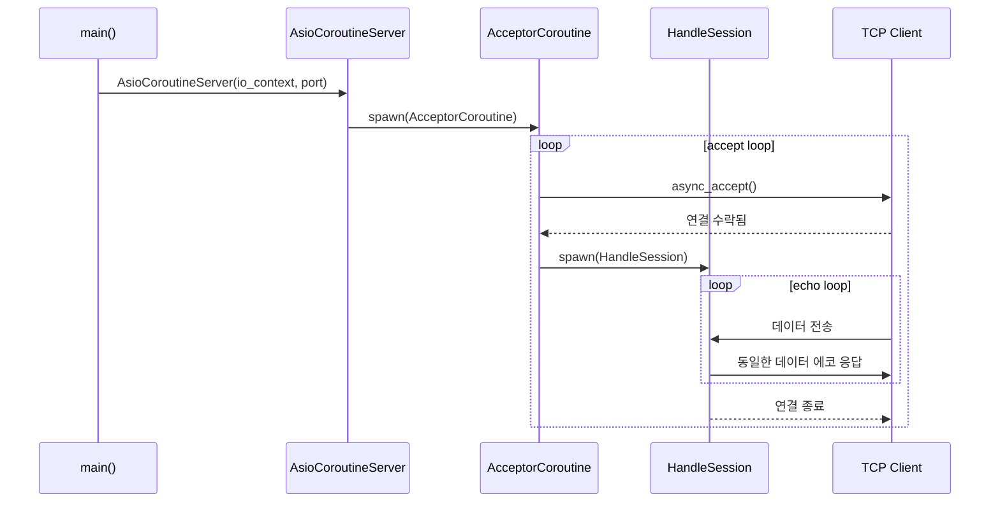
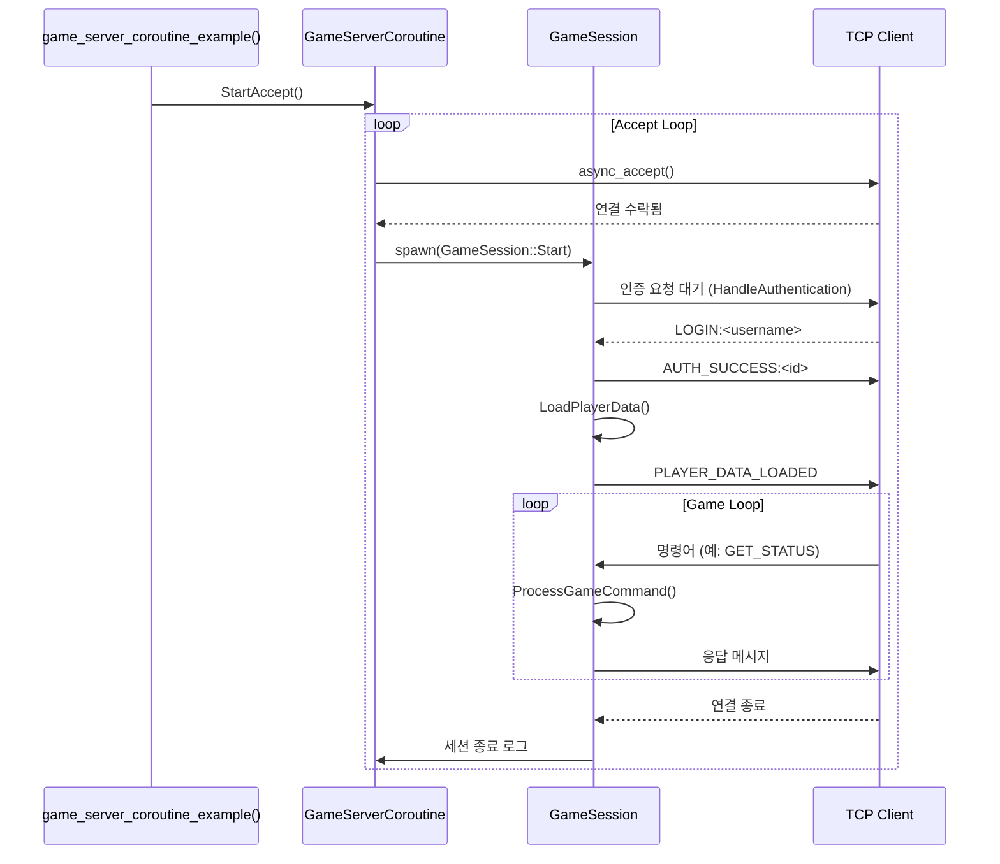

# C++ Boost.Asio로 만드는 온라인 게임 서버
저자: 최흥배, Claude AI   
    
권장 개발 환경
- **IDE**: Visual Studio 2022 (Community 이상)
- **컴파일러**: MSVC v143 (C++20 지원)
- **OS**: Windows 10 이상
- **도구**: Windows Performance Toolkit, Intel VTune (선택사항)

-----   

# Chapter 14. 코루틴 활용
코루틴(Coroutine)은 비동기 프로그래밍을 동기적인 코드처럼 작성할 수 있게 해주는 강력한 기능이다. 이번 장에서는 C++20 코루틴과 Boost.Asio의 `spawn` 기능을 활용하여 가독성이 높고 유지보수가 쉬운 게임 서버를 구현하는 방법을 학습한다.

## 14.1 C++20 코루틴 개요

### 14.1.1 코루틴 기본 개념
코루틴은 실행을 일시 정지하고 나중에 재개할 수 있는 함수이다. 이를 통해 복잡한 콜백 체인을 제거하고 직관적인 코드를 작성할 수 있다.

```cpp
#include <coroutine>
#include <iostream>
#include <memory>
#include <exception>

// 기본 코루틴 반환 타입
class SimpleCoroutine
{
public:
    struct promise_type
    {
        SimpleCoroutine get_return_object()
        {
            return SimpleCoroutine{std::coroutine_handle<promise_type>::from_promise(*this)};
        }

        std::suspend_always initial_suspend() { return {}; }
        std::suspend_always final_suspend() noexcept { return {}; }
        void unhandled_exception() {}
        void return_void() {}
    };

    explicit SimpleCoroutine(std::coroutine_handle<promise_type> handle)
        : handle_(handle)
    {
    }

    ~SimpleCoroutine()
    {
        if (handle_)
            handle_.destroy();
    }

    // 이동 생성자
    SimpleCoroutine(SimpleCoroutine&& other) noexcept
        : handle_(std::exchange(other.handle_, {}))
    {
    }

    // 이동 대입 연산자
    SimpleCoroutine& operator=(SimpleCoroutine&& other) noexcept
    {
        if (this != &other)
        {
            if (handle_)
                handle_.destroy();
            handle_ = std::exchange(other.handle_, {});
        }
        return *this;
    }

    // 복사 생성자와 복사 대입 연산자 삭제
    SimpleCoroutine(const SimpleCoroutine&) = delete;
    SimpleCoroutine& operator=(const SimpleCoroutine&) = delete;

    void resume()
    {
        if (handle_ && !handle_.done())
            handle_.resume();
    }

    bool is_done() const
    {
        return handle_.done();
    }

private:
    std::coroutine_handle<promise_type> handle_;
};

// 기본 코루틴 예제
SimpleCoroutine simple_coroutine_example()
{
    std::cout << "코루틴 시작" << std::endl;
    
    co_await std::suspend_always{};
    std::cout << "첫 번째 재개" << std::endl;
    
    co_await std::suspend_always{};
    std::cout << "두 번째 재개" << std::endl;
    
    co_await std::suspend_always{};
    std::cout << "코루틴 종료" << std::endl;
}

void basic_coroutine_example()
{
    auto coro = simple_coroutine_example();
    
    std::cout << "코루틴 생성됨" << std::endl;
    
    coro.resume();
    coro.resume();
    coro.resume();
    coro.resume(); // 이미 완료된 코루틴
}
```

### 14.1.2 Task 코루틴 구현
실제 비동기 작업에 사용할 수 있는 Task 클래스를 구현해보겠다.

```cpp
#include <future>
#include <optional>

template<typename T>
class Task
{
public:
    struct promise_type
    {
        std::optional<T> result_;
        std::exception_ptr exception_;

        Task get_return_object()
        {
            return Task{std::coroutine_handle<promise_type>::from_promise(*this)};
        }

        std::suspend_always initial_suspend() { return {}; }
        std::suspend_always final_suspend() noexcept { return {}; }

        template<typename U>
        void return_value(U&& value)
        {
            result_ = std::forward<U>(value);
        }

        void unhandled_exception()
        {
            exception_ = std::current_exception();
        }
    };

    explicit Task(std::coroutine_handle<promise_type> handle)
        : handle_(handle)
    {
    }

    ~Task()
    {
        if (handle_)
            handle_.destroy();
    }

    Task(Task&& other) noexcept
        : handle_(std::exchange(other.handle_, {}))
    {
    }

    Task& operator=(Task&& other) noexcept
    {
        if (this != &other)
        {
            if (handle_)
                handle_.destroy();
            handle_ = std::exchange(other.handle_, {});
        }
        return *this;
    }

    Task(const Task&) = delete;
    Task& operator=(const Task&) = delete;

    bool is_ready() const
    {
        return handle_.done();
    }

    T get()
    {
        if (!handle_.done())
        {
            handle_.resume();
        }

        if (handle_.promise().exception_)
        {
            std::rethrow_exception(handle_.promise().exception_);
        }

        return *handle_.promise().result_;
    }

    // Awaitable 구현
    bool await_ready() const
    {
        return handle_.done();
    }

    void await_suspend(std::coroutine_handle<> caller)
    {
        // 완료 시 호출자 재개
        handle_.promise().caller_ = caller;
        if (!handle_.done())
        {
            handle_.resume();
        }
    }

    T await_resume()
    {
        if (handle_.promise().exception_)
        {
            std::rethrow_exception(handle_.promise().exception_);
        }
        return *handle_.promise().result_;
    }

private:
    std::coroutine_handle<promise_type> handle_;
};

// void 특화
template<>
class Task<void>
{
public:
    struct promise_type
    {
        std::exception_ptr exception_;
        std::coroutine_handle<> caller_;

        Task get_return_object()
        {
            return Task{std::coroutine_handle<promise_type>::from_promise(*this)};
        }

        std::suspend_always initial_suspend() { return {}; }
        
        std::suspend_always final_suspend() noexcept 
        { 
            if (caller_)
                caller_.resume();
            return {}; 
        }

        void return_void() {}

        void unhandled_exception()
        {
            exception_ = std::current_exception();
        }
    };

    explicit Task(std::coroutine_handle<promise_type> handle)
        : handle_(handle)
    {
    }

    ~Task()
    {
        if (handle_)
            handle_.destroy();
    }

    Task(Task&& other) noexcept
        : handle_(std::exchange(other.handle_, {}))
    {
    }

    Task& operator=(Task&& other) noexcept
    {
        if (this != &other)
        {
            if (handle_)
                handle_.destroy();
            handle_ = std::exchange(other.handle_, {});
        }
        return *this;
    }

    Task(const Task&) = delete;
    Task& operator=(const Task&) = delete;

    void get()
    {
        if (!handle_.done())
        {
            handle_.resume();
        }

        if (handle_.promise().exception_)
        {
            std::rethrow_exception(handle_.promise().exception_);
        }
    }

    bool await_ready() const
    {
        return handle_.done();
    }

    void await_suspend(std::coroutine_handle<> caller)
    {
        handle_.promise().caller_ = caller;
        if (!handle_.done())
        {
            handle_.resume();
        }
    }

    void await_resume()
    {
        if (handle_.promise().exception_)
        {
            std::rethrow_exception(handle_.promise().exception_);
        }
    }

private:
    std::coroutine_handle<promise_type> handle_;
};
```

### 14.1.3 Awaitable 객체 구현
코루틴에서 대기할 수 있는 객체들을 구현해보겠다.

```cpp
#include <chrono>
#include <thread>

// 시간 지연을 위한 awaitable
class SleepAwaitable
{
public:
    explicit SleepAwaitable(std::chrono::milliseconds duration)
        : duration_(duration)
    {
    }

    bool await_ready() const noexcept
    {
        return duration_.count() <= 0;
    }

    void await_suspend(std::coroutine_handle<> handle)
    {
        // 실제 구현에서는 타이머를 사용해야 함
        std::thread([duration = duration_, handle]()
        {
            std::this_thread::sleep_for(duration);
            handle.resume();
        }).detach();
    }

    void await_resume() noexcept {}

private:
    std::chrono::milliseconds duration_;
};

// 편의 함수
SleepAwaitable sleep_for(std::chrono::milliseconds duration)
{
    return SleepAwaitable{duration};
}

// 값을 반환하는 awaitable
template<typename T>
class ValueAwaitable
{
public:
    explicit ValueAwaitable(T value) : value_(std::move(value)) {}

    bool await_ready() const noexcept { return true; }
    void await_suspend(std::coroutine_handle<>) const noexcept {}
    T await_resume() { return std::move(value_); }

private:
    T value_;
};

template<typename T>
ValueAwaitable<T> make_ready_awaitable(T value)
{
    return ValueAwaitable<T>{std::move(value)};
}

// 코루틴 사용 예제
Task<int> calculate_async()
{
    std::cout << "계산 시작" << std::endl;
    
    co_await sleep_for(std::chrono::milliseconds(1000));
    std::cout << "1초 경과" << std::endl;
    
    co_await sleep_for(std::chrono::milliseconds(500));
    std::cout << "추가 0.5초 경과" << std::endl;
    
    co_return 42;
}

Task<void> main_coroutine()
{
    std::cout << "메인 코루틴 시작" << std::endl;
    
    int result = co_await calculate_async();
    std::cout << "계산 결과: " << result << std::endl;
    
    std::cout << "메인 코루틴 종료" << std::endl;
}

void coroutine_example()
{
    auto task = main_coroutine();
    task.get(); // 완료까지 대기
}
```

</br>     
  

## 14.2 Boost.Asio의 spawn 기능

### 14.2.1 Boost.Asio spawn 기본 사용법
Boost.Asio의 spawn 기능을 사용하면 기존의 비동기 함수들을 코루틴 스타일로 사용할 수 있다.

```cpp
#include <boost/asio.hpp>
#include <boost/asio/spawn.hpp>
#include <iostream>
#include <string>

using boost::asio::ip::tcp;

class AsioCoroutineServer
{
public:
    AsioCoroutineServer(boost::asio::io_context& io_context, short port)
        : acceptor_(io_context, tcp::endpoint(tcp::v4(), port))
    {
        StartAccept(io_context);
    }

private:
    void StartAccept(boost::asio::io_context& io_context)
    {
        boost::asio::spawn(acceptor_.get_executor(),
            [this, &io_context](boost::asio::yield_context yield)
            {
                AcceptorCoroutine(io_context, yield);
            });
    }

    void AcceptorCoroutine(boost::asio::io_context& io_context, 
                          boost::asio::yield_context yield)
    {
        try
        {
            while (true)
            {
                tcp::socket socket(io_context);
                
                // 비동기 accept를 동기적으로 대기
                acceptor_.async_accept(socket, yield);
                
                std::cout << "새 클라이언트 연결: " 
                         << socket.remote_endpoint() << std::endl;
                
                // 세션 처리를 별도 코루틴으로 실행
                boost::asio::spawn(socket.get_executor(),
                    [socket = std::move(socket)](boost::asio::yield_context yield) mutable
                    {
                        HandleSession(std::move(socket), yield);
                    });
            }
        }
        catch (const std::exception& e)
        {
            std::cerr << "Acceptor 코루틴 예외: " << e.what() << std::endl;
        }
    }

    static void HandleSession(tcp::socket socket, boost::asio::yield_context yield)
    {
        try
        {
            std::array<char, 1024> buffer;
            
            while (true)
            {
                // 비동기 읽기를 동기적으로 대기
                boost::system::error_code ec;
                size_t length = socket.async_read_some(
                    boost::asio::buffer(buffer), yield[ec]);
                
                if (ec)
                {
                    if (ec != boost::asio::error::eof)
                    {
                        std::cerr << "읽기 오류: " << ec.message() << std::endl;
                    }
                    break;
                }
                
                std::cout << "받은 데이터 (" << length << " 바이트): " 
                         << std::string(buffer.data(), length) << std::endl;
                
                // 에코 응답
                boost::asio::async_write(socket, 
                    boost::asio::buffer(buffer, length), yield[ec]);
                
                if (ec)
                {
                    std::cerr << "쓰기 오류: " << ec.message() << std::endl;
                    break;
                }
            }
        }
        catch (const std::exception& e)
        {
            std::cerr << "세션 코루틴 예외: " << e.what() << std::endl;
        }
        
        std::cout << "클라이언트 연결 종료" << std::endl;
    }

    tcp::acceptor acceptor_;
};

void spawn_echo_server_example()
{
    boost::asio::io_context io_context;
    AsioCoroutineServer server(io_context, 12345);
    
    std::cout << "Spawn 에코 서버 시작 (포트 12345)" << std::endl;
    io_context.run();
}
```  

이 코드는 **Boost.Asio의 `spawn()`을 이용한 코루틴 기반 TCP 에코 서버**의 기본 구조를 보여주는 예제다.
아래는 구조적 설명, 제어 흐름, 내부 동작 원리, 그리고 ASCII/머메이드 다이어그램을 포함한 상세한 해설이다.

#### 코드의 목적
이 예제는 **비동기(async) 코드**를 **코루틴(coroutine)** 스타일로 작성하는 방법을 보여준다.
`boost::asio::spawn`을 사용하면 콜백 지옥(callback hell) 없이, **동기 코드처럼 보이지만 실제로는 비동기로 작동하는 코드**를 작성할 수 있다.

결과적으로, 이 서버는 다음을 수행한다:

1. TCP 포트(예: 12345)에서 클라이언트 연결을 수락한다.
2. 각 클라이언트와 독립적인 코루틴 세션을 생성한다.
3. 받은 데이터를 그대로 되돌려주는 에코(Echo) 기능을 수행한다.

#### 주요 구성요소

| 구성요소                                             | 역할                                                        |
| ------------------------------------------------ | --------------------------------------------------------- |
| `boost::asio::io_context`                        | Asio의 핵심 이벤트 루프. 모든 비동기 작업은 이 객체를 통해 관리된다                 |
| `tcp::acceptor`                                  | 서버 소켓. 클라이언트의 접속 요청을 받아들이는 역할                             |
| `spawn()`                                        | 코루틴을 생성하는 함수. 내부적으로 스택풀(stackful) 코루틴을 만들어 실행한다           |
| `yield_context`                                  | 비동기 함수(`async_XXX`)를 코루틴 안에서 동기적으로 `yield`할 수 있게 해주는 컨텍스트 |
| `async_accept`, `async_read_some`, `async_write` | 비동기 I/O 함수. `yield`와 함께 사용하면 동기 코드처럼 표현 가능                |
  
#### 실행 흐름 요약

```text
main()
 └── spawn_echo_server_example()
      ├── io_context 생성
      ├── AsioCoroutineServer 생성
      │     ├── acceptor_ 생성 및 바인드
      │     └── StartAccept() 호출
      │           └── spawn() → AcceptorCoroutine() 실행
      │                 ├── 클라이언트 연결 대기
      │                 ├── 새 연결 시 spawn() → HandleSession() 실행
      │                 └── 무한루프
      └── io_context.run()  ← 이벤트 루프 시작
```

#### 흐름을 다이어그램으로 표현

```
+---------------------------+
| io_context.run()          |
|  (이벤트 루프 시작)         |
+------------+--------------+
             |
             v
   +------------------------+
   | acceptor_.async_accept |
   +------------------------+
             |
             | 새 클라이언트 접속
             v
   +----------------------+
   | spawn(HandleSession) |
   +----------------------+
             |
             v
     +---------------------+
     | async_read_some()   |
     |  ↓                  |
     | async_write()       |
     +---------------------+
```

#### 코루틴 흐름



#### 주요 함수별 상세 설명

(1) `StartAccept()`

```cpp
void StartAccept(boost::asio::io_context& io_context)
{
    boost::asio::spawn(acceptor_.get_executor(),
        [this, &io_context](boost::asio::yield_context yield)
        {
            AcceptorCoroutine(io_context, yield);
        });
}
```

* `spawn()`은 새로운 코루틴을 실행한다.
* `yield_context`를 인자로 받아 `AcceptorCoroutine()`에 넘긴다.
* `acceptor_.get_executor()`는 이 코루틴이 어떤 스레드 컨텍스트에서 실행될지를 지정한다.

(2) `AcceptorCoroutine()`

```cpp
while (true)
{
    tcp::socket socket(io_context);
    acceptor_.async_accept(socket, yield);
    // ...
    boost::asio::spawn(socket.get_executor(), [...]);
}
```

* `acceptor_.async_accept(socket, yield);`
  → 실제로는 비동기 호출이지만, `yield` 덕분에 **동기적으로 보인다**.
  내부적으로는 `yield` 지점에서 코루틴이 일시 중단(suspend)되었다가,
  accept 완료 시 자동으로 재개(resume)된다.

* 새로운 클라이언트가 접속되면, 그 소켓을 넘겨서
  **별도의 코루틴(`HandleSession`)**을 생성한다.

(3) `HandleSession()`

```cpp
size_t length = socket.async_read_some(boost::asio::buffer(buffer), yield[ec]);
boost::asio::async_write(socket, boost::asio::buffer(buffer, length), yield[ec]);
```

* 클라이언트로부터 데이터를 수신(`async_read_some`)한 뒤,
* 동일한 데이터를 다시 전송(`async_write`)한다.
* 이때도 모두 `yield`를 사용하므로 비동기임에도 불구하고 순차적인 코드 흐름처럼 보인다.
* 에러 발생 시(예: 클라이언트 종료, 네트워크 오류) `ec`를 검사한다.

#### spawn()과 yield()의 개념적 관계

| 개념              | 설명                                          |
| --------------- | ------------------------------------------- |
| `spawn()`       | 새로운 코루틴을 시작하는 “진입점”                         |
| `yield_context` | 비동기 호출을 “일시 중단(suspend)”시킬 수 있는 컨텍스트        |
| `yield[ec]`     | 에러코드(error_code)를 통해 예외 없이 비동기 결과를 처리하는 문법  |
| 내부 동작           | Boost.Asio가 코루틴의 상태를 관리하며, 비동기 완료 시 자동으로 재개 |


#### 비동기 → 코루틴 변환의 효과

| 기존 비동기 (콜백 기반) | 코루틴 기반 (`spawn`)            |
| -------------- | --------------------------- |
| 콜백 중첩 구조로 복잡해짐 | 코드 흐름이 동기처럼 단순해짐            |
| 예외 처리 어려움      | `try-catch`로 자연스러운 예외 처리 가능 |
| 가독성 낮음         | 가독성 높고 유지보수 용이              |


#### 실행 결과 예시
서버를 실행한 뒤, `telnet localhost 12345`로 접속해 입력하면 다음과 같이 동작한다.

```
Spawn 에코 서버 시작 (포트 12345)
새 클라이언트 연결: 127.0.0.1:53241
받은 데이터 (5 바이트): hello
받은 데이터 (6 바이트): world!
클라이언트 연결 종료
```

#### 요약
이 코드는 Boost.Asio의 `spawn()`을 이용해

* **비동기 네트워크 처리 흐름을 코루틴 방식으로 단순화**하고,
* **에러 및 예외 처리도 자연스럽게 통합**하는
  **현대적 비동기 서버 패턴의 기초 예제**다.

  
### 14.2.2 HTTP 클라이언트 코루틴 구현

```cpp
#include <boost/asio/connect.hpp>
#include <sstream>
#include <regex>

class HttpCoroutineClient
{
public:
    HttpCoroutineClient(boost::asio::io_context& io_context)
        : resolver_(io_context), socket_(io_context)
    {
    }

    void HttpGet(const std::string& url, boost::asio::yield_context yield)
    {
        try
        {
            // URL 파싱
            std::regex url_regex(R"(https?://([^/]+)(/.*)?)");
            std::smatch matches;
            
            if (!std::regex_match(url, matches, url_regex))
            {
                throw std::runtime_error("잘못된 URL 형식");
            }
            
            std::string host = matches[1].str();
            std::string path = matches[2].str();
            if (path.empty()) path = "/";
            
            std::cout << "연결 중: " << host << std::endl;
            
            // DNS 해결
            auto endpoints = resolver_.async_resolve(host, "80", yield);
            
            // 연결
            boost::asio::async_connect(socket_, endpoints, yield);
            std::cout << "연결 완료" << std::endl;
            
            // HTTP 요청 작성
            std::ostringstream request_stream;
            request_stream << "GET " << path << " HTTP/1.1\r\n";
            request_stream << "Host: " << host << "\r\n";
            request_stream << "Connection: close\r\n\r\n";
            
            std::string request = request_stream.str();
            
            // 요청 전송
            boost::asio::async_write(socket_, 
                boost::asio::buffer(request), yield);
            std::cout << "요청 전송 완료" << std::endl;
            
            // 응답 읽기
            boost::asio::streambuf response_buffer;
            
            // 헤더 읽기
            boost::asio::async_read_until(socket_, 
                response_buffer, "\r\n\r\n", yield);
            
            // 헤더 파싱
            std::istream response_stream(&response_buffer);
            std::string http_version;
            unsigned int status_code;
            std::string status_message;
            
            response_stream >> http_version >> status_code;
            std::getline(response_stream, status_message);
            
            std::cout << "HTTP 응답: " << status_code << " " << status_message << std::endl;
            
            // 헤더 출력
            std::string header;
            while (std::getline(response_stream, header) && header != "\r")
            {
                std::cout << "헤더: " << header << std::endl;
            }
            
            // 본문 읽기
            boost::system::error_code ec;
            while (boost::asio::async_read(socket_, response_buffer,
                boost::asio::transfer_at_least(1), yield[ec]))
            {
                if (ec && ec != boost::asio::error::eof)
                {
                    throw boost::system::system_error(ec);
                }
                if (ec == boost::asio::error::eof)
                    break;
            }
            
            // 응답 본문 출력
            std::string response_body{
                std::istreambuf_iterator<char>(&response_buffer),
                std::istreambuf_iterator<char>()
            };
            
            std::cout << "응답 본문 크기: " << response_body.size() << " 바이트" << std::endl;
            std::cout << "응답 본문 (처음 200자):\n" 
                     << response_body.substr(0, 200) << std::endl;
        }
        catch (const std::exception& e)
        {
            std::cerr << "HTTP 클라이언트 오류: " << e.what() << std::endl;
        }
    }

private:
    tcp::resolver resolver_;
    tcp::socket socket_;
};

void http_coroutine_client_example()
{
    boost::asio::io_context io_context;
    HttpCoroutineClient client(io_context);
    
    boost::asio::spawn(io_context,
        [&client](boost::asio::yield_context yield)
        {
            client.HttpGet("http://httpbin.org/get", yield);
        });
    
    io_context.run();
}
```

</br>  
  
## 14.3 코루틴을 활용한 서버 구현

### 14.3.1 게임 세션 코루틴

```cpp
#include <unordered_map>
#include <memory>

class GameSession : public std::enable_shared_from_this<GameSession>
{
public:
    GameSession(tcp::socket socket, uint32_t session_id)
        : socket_(std::move(socket)), session_id_(session_id), 
          is_authenticated_(false), player_id_(0)
    {
    }

    void Start(boost::asio::yield_context yield)
    {
        try
        {
            std::cout << "세션 " << session_id_ << " 시작" << std::endl;
            
            // 인증 처리
            if (!HandleAuthentication(yield))
            {
                std::cout << "세션 " << session_id_ << " 인증 실패" << std::endl;
                return;
            }
            
            std::cout << "세션 " << session_id_ << " 인증 성공 (플레이어 ID: " 
                     << player_id_ << ")" << std::endl;
            
            // 플레이어 데이터 로딩
            LoadPlayerData(yield);
            
            // 게임 루프
            HandleGameLoop(yield);
        }
        catch (const std::exception& e)
        {
            std::cerr << "세션 " << session_id_ << " 오류: " << e.what() << std::endl;
        }
        
        std::cout << "세션 " << session_id_ << " 종료" << std::endl;
    }

private:
    bool HandleAuthentication(boost::asio::yield_context yield)
    {
        std::array<char, 256> buffer;
        
        // 인증 요청 대기 (타임아웃 30초)
        boost::system::error_code ec;
        size_t length = socket_.async_read_some(
            boost::asio::buffer(buffer), yield[ec]);
        
        if (ec)
        {
            std::cerr << "인증 읽기 오류: " << ec.message() << std::endl;
            return false;
        }
        
        std::string auth_data(buffer.data(), length);
        std::cout << "인증 데이터: " << auth_data << std::endl;
        
        // 간단한 인증 로직 (실제로는 데이터베이스 확인)
        if (auth_data.find("LOGIN:") == 0)
        {
            std::string username = auth_data.substr(6);
            player_id_ = std::hash<std::string>{}(username) % 10000 + 1;
            is_authenticated_ = true;
            
            // 인증 응답
            std::string response = "AUTH_SUCCESS:" + std::to_string(player_id_);
            boost::asio::async_write(socket_, 
                boost::asio::buffer(response), yield[ec]);
            
            return !ec;
        }
        
        // 인증 실패 응답
        std::string response = "AUTH_FAILED";
        boost::asio::async_write(socket_, 
            boost::asio::buffer(response), yield[ec]);
        
        return false;
    }

    void LoadPlayerData(boost::asio::yield_context yield)
    {
        // 플레이어 데이터 로딩 시뮬레이션
        std::cout << "플레이어 " << player_id_ << " 데이터 로딩 중..." << std::endl;
        
        boost::asio::steady_timer timer(socket_.get_executor());
        timer.expires_after(std::chrono::milliseconds(500));
        timer.async_wait(yield);
        
        // 시뮬레이션된 플레이어 데이터
        player_data_["level"] = "25";
        player_data_["experience"] = "12500";
        player_data_["gold"] = "5000";
        
        std::cout << "플레이어 " << player_id_ << " 데이터 로딩 완료" << std::endl;
        
        // 로딩 완료 알림
        std::string response = "PLAYER_DATA_LOADED";
        boost::system::error_code ec;
        boost::asio::async_write(socket_, 
            boost::asio::buffer(response), yield[ec]);
    }

    void HandleGameLoop(boost::asio::yield_context yield)
    {
        std::array<char, 1024> buffer;
        
        while (is_authenticated_)
        {
            boost::system::error_code ec;
            size_t length = socket_.async_read_some(
                boost::asio::buffer(buffer), yield[ec]);
            
            if (ec)
            {
                if (ec != boost::asio::error::eof)
                {
                    std::cerr << "게임 루프 읽기 오류: " << ec.message() << std::endl;
                }
                break;
            }
            
            std::string command(buffer.data(), length);
            ProcessGameCommand(command, yield);
        }
    }

    void ProcessGameCommand(const std::string& command, boost::asio::yield_context yield)
    {
        std::cout << "세션 " << session_id_ << " 명령어: " << command << std::endl;
        
        boost::system::error_code ec;
        std::string response;
        
        if (command == "GET_STATUS")
        {
            response = "STATUS:LEVEL=" + player_data_["level"] + 
                      ",EXP=" + player_data_["experience"] + 
                      ",GOLD=" + player_data_["gold"];
        }
        else if (command == "KILL_MONSTER")
        {
            // 몬스터 처치 시뮬레이션
            int exp_gain = 100;
            int gold_gain = 50;
            
            int current_exp = std::stoi(player_data_["experience"]);
            int current_gold = std::stoi(player_data_["gold"]);
            
            current_exp += exp_gain;
            current_gold += gold_gain;
            
            player_data_["experience"] = std::to_string(current_exp);
            player_data_["gold"] = std::to_string(current_gold);
            
            // 레벨업 체크
            int current_level = std::stoi(player_data_["level"]);
            int new_level = current_exp / 1000;
            if (new_level > current_level)
            {
                player_data_["level"] = std::to_string(new_level);
                response = "LEVEL_UP:" + std::to_string(new_level);
            }
            else
            {
                response = "MONSTER_KILLED:EXP+" + std::to_string(exp_gain) + 
                          ",GOLD+" + std::to_string(gold_gain);
            }
        }
        else if (command == "SAVE_DATA")
        {
            // 데이터 저장 시뮬레이션
            boost::asio::steady_timer timer(socket_.get_executor());
            timer.expires_after(std::chrono::milliseconds(200));
            timer.async_wait(yield);
            
            response = "DATA_SAVED";
        }
        else
        {
            response = "UNKNOWN_COMMAND";
        }
        
        boost::asio::async_write(socket_, 
            boost::asio::buffer(response), yield[ec]);
    }

    tcp::socket socket_;
    uint32_t session_id_;
    bool is_authenticated_;
    uint32_t player_id_;
    std::unordered_map<std::string, std::string> player_data_;
};

class GameServerCoroutine
{
public:
    GameServerCoroutine(boost::asio::io_context& io_context, short port)
        : acceptor_(io_context, tcp::endpoint(tcp::v4(), port)),
          next_session_id_(1)
    {
        StartAccept(io_context);
    }

private:
    void StartAccept(boost::asio::io_context& io_context)
    {
        boost::asio::spawn(acceptor_.get_executor(),
            [this, &io_context](boost::asio::yield_context yield)
            {
                while (true)
                {
                    try
                    {
                        tcp::socket socket(io_context);
                        acceptor_.async_accept(socket, yield);
                        
                        uint32_t session_id = next_session_id_++;
                        auto session = std::make_shared<GameSession>(
                            std::move(socket), session_id);
                        
                        // 세션을 별도 코루틴으로 실행
                        boost::asio::spawn(acceptor_.get_executor(),
                            [session](boost::asio::yield_context yield)
                            {
                                session->Start(yield);
                            });
                    }
                    catch (const std::exception& e)
                    {
                        std::cerr << "Accept 오류: " << e.what() << std::endl;
                    }
                }
            });
    }

    tcp::acceptor acceptor_;
    std::atomic<uint32_t> next_session_id_;
};

void game_server_coroutine_example()
{
    boost::asio::io_context io_context;
    GameServerCoroutine server(io_context, 12345);
    
    std::cout << "게임 서버 시작 (포트 12345)" << std::endl;
    io_context.run();
}
```
  
이 코드는 **Boost.Asio의 코루틴(spawn/yield)** 기능을 활용해
**게임 서버의 세션 단위 로직을 구조적으로 구현한 고급 예제**다.
비동기 이벤트 기반 게임 서버를 코루틴 방식으로 구성함으로써,
전통적인 콜백 기반 비동기 코드보다 **가독성과 유지보수성을 크게 향상**시킨다.
  
#### 전체 구조 개요
이 코드는 두 개의 주요 클래스로 구성되어 있다:

| 클래스명                  | 역할                                                       |
| --------------------- | -------------------------------------------------------- |
| `GameServerCoroutine` | 클라이언트의 연결을 수락(accept)하고 각 세션을 생성하는 **서버 관리자**            |
| `GameSession`         | 클라이언트와의 개별 통신(로그인, 데이터 로딩, 명령 처리)을 담당하는 **게임 세션 단위 코루틴** |

또한 각 세션은 `spawn()`으로 실행되어, **비동기 I/O 이벤트를 순차적 코드처럼 다룰 수 있다**.

#### 전체 실행 흐름 요약

```text
main()
 └── game_server_coroutine_example()
      ├── io_context 생성
      ├── GameServerCoroutine 생성
      │     ├── StartAccept() → spawn()으로 accept 루프 실행
      │     └── 클라이언트 연결 수락 시 GameSession 생성
      │           └── spawn()으로 GameSession::Start() 실행
      │                 ├── HandleAuthentication()
      │                 ├── LoadPlayerData()
      │                 └── HandleGameLoop() (명령 처리 루프)
      └── io_context.run()
```

#### ASCII 다이어그램 — 코루틴 간 흐름

```
+--------------------------+
| GameServerCoroutine      |
| (spawn accept loop)      |
+-----------+--------------+
            |
            v
   +---------------------+
   | async_accept() 대기  |
   +---------------------+
            |
     [클라이언트 연결 수락]
            |
            v
   +----------------------------+
   | GameSession::Start(yield)  |
   +----------------------------+
     | 인증 (HandleAuthentication)
     | 플레이어 데이터 로딩
     | 게임 루프 (HandleGameLoop)
     |
     v
   +----------------------------+
   | 클라이언트 명령 처리 루프     |
   +----------------------------+
```

#### 시퀀스 다이어그램



#### 주요 컴포넌트별 설명

(1) `GameServerCoroutine`

서버는 다음 기능을 수행한다.

```cpp
tcp::acceptor acceptor_;
std::atomic<uint32_t> next_session_id_;
```

* `acceptor_`: TCP 연결을 수락하는 서버 소켓
* `next_session_id_`: 각 세션에 고유한 ID를 부여하는 원자적 카운터

핵심 함수는 `StartAccept()`다.

```cpp
boost::asio::spawn(acceptor_.get_executor(),
    [this, &io_context](boost::asio::yield_context yield)
    {
        while (true)
        {
            tcp::socket socket(io_context);
            acceptor_.async_accept(socket, yield);
            
            uint32_t session_id = next_session_id_++;
            auto session = std::make_shared<GameSession>(
                std::move(socket), session_id);
            
            boost::asio::spawn(acceptor_.get_executor(),
                [session](boost::asio::yield_context yield)
                {
                    session->Start(yield);
                });
        }
    });
```

* `spawn()`을 통해 **무한 accept 코루틴 루프** 실행
* 새 클라이언트 연결이 들어오면:

  * 새로운 `GameSession` 객체를 `shared_ptr`로 생성
  * 다시 `spawn()`으로 해당 세션을 별도의 코루틴으로 실행

이로써 각 클라이언트는 **독립적인 코루틴 컨텍스트**에서 처리된다.
  
(2) `GameSession::Start()`

이 함수는 세션의 “메인 루프” 역할을 한다.

```cpp
void Start(boost::asio::yield_context yield)
{
    if (!HandleAuthentication(yield)) return;
    LoadPlayerData(yield);
    HandleGameLoop(yield);
}
```

세부 흐름:

1. `HandleAuthentication()`
   클라이언트의 로그인 인증을 수행
2. `LoadPlayerData()`
   인증된 플레이어의 데이터(레벨, 경험치, 골드 등)를 로드
3. `HandleGameLoop()`
   이후 클라이언트의 명령을 계속 수신하고 처리

(3) 인증 처리 — `HandleAuthentication()`

```cpp
size_t length = socket_.async_read_some(buffer, yield[ec]);
std::string auth_data(buffer.data(), length);
```

* 클라이언트의 로그인 문자열(`LOGIN:username`)을 기다린다.
* `"LOGIN:"`으로 시작하면 성공으로 간주하고 `player_id_` 생성
* 인증 성공 시 `AUTH_SUCCESS:<id>` 메시지를 전송
* 실패 시 `AUTH_FAILED` 응답 후 세션 종료

핵심 포인트:

* `yield[ec]`를 사용하여 비동기 read/write 중 에러를 처리
* 실제 환경에서는 DB나 인증 서버를 통한 검증이 들어갈 수 있음

(4) 데이터 로딩 — `LoadPlayerData()`

```cpp
boost::asio::steady_timer timer(socket_.get_executor());
timer.expires_after(std::chrono::milliseconds(500));
timer.async_wait(yield);
```

* 타이머를 통해 500ms 대기 → 데이터 로딩 시뮬레이션
* 이후 플레이어의 기초 데이터(레벨, 경험치, 골드)를 설정

결과적으로 다음 메시지를 클라이언트에 전송한다:

```
PLAYER_DATA_LOADED
```

(5) 게임 루프 — `HandleGameLoop()`

```cpp
while (is_authenticated_)
{
    size_t length = socket_.async_read_some(buffer, yield[ec]);
    ProcessGameCommand(command, yield);
}
```

* 클라이언트의 명령을 수신하고 `ProcessGameCommand()`에서 처리
* EOF 또는 네트워크 오류 시 루프 종료

(6) 명령 처리 — `ProcessGameCommand()`

클라이언트가 보낸 명령에 따라 서버는 적절한 로직을 수행한다.

| 명령어            | 설명                         | 응답                                                   |
| -------------- | -------------------------- | ---------------------------------------------------- |
| `GET_STATUS`   | 현재 상태 조회                   | `"STATUS:LEVEL=25,EXP=12500,GOLD=5000"`              |
| `KILL_MONSTER` | 몬스터 처치 시뮬레이션 (EXP/GOLD 증가) | `"MONSTER_KILLED:EXP+100,GOLD+50"` 또는 `"LEVEL_UP:x"` |
| `SAVE_DATA`    | 저장 시뮬레이션 (200ms 대기)        | `"DATA_SAVED"`                                       |
| 그 외            | 알 수 없는 명령                  | `"UNKNOWN_COMMAND"`                                  |

이 또한 `yield` 기반으로 작성되어 **동기적인 순서**로 처리되지만,
실제 I/O는 **비동기(async)** 방식으로 동작한다.

#### 코루틴 모델의 장점

| 항목     | 전통적 콜백 방식            | 코루틴(spawn) 방식        |
| ------ | -------------------- | -------------------- |
| 흐름 제어  | 콜백 중첩(Callback Hell) | 순차 코드처럼 읽힘           |
| 예외 처리  | 콜백 체인 내 try-catch 불편 | 자연스러운 `try-catch` 가능 |
| 유지보수성  | 복잡하고 수정 어려움          | 함수 단위로 구조적 분리        |
| 동시성 제어 | 복잡한 상태 관리 필요         | 코루틴이 자동으로 상태 유지      |


#### 실행 예시 로그

```
게임 서버 시작 (포트 12345)
세션 1 시작
인증 데이터: LOGIN:playerA
세션 1 인증 성공 (플레이어 ID: 5729)
플레이어 5729 데이터 로딩 중...
플레이어 5729 데이터 로딩 완료
세션 1 명령어: GET_STATUS
세션 1 명령어: KILL_MONSTER
세션 1 명령어: SAVE_DATA
세션 1 종료
```

#### 요약
이 예제는 **게임 서버에서 코루틴을 활용하는 가장 좋은 구조적 패턴**을 보여준다.

* `spawn()`으로 **세션 단위 비동기 흐름을 코루틴으로 단순화**
* `yield_context`를 통해 **논블로킹 동작을 직관적인 순차 코드로 표현**
* 인증, 로딩, 게임 명령 처리까지의 **전체 비동기 흐름을 한 눈에 이해 가능**
* `shared_from_this`를 사용하여 **세션 생명주기 관리**도 자연스럽게 해결


</br>  
  
## 14.4 코루틴 기반 타임아웃 처리

### 14.4.1 타임아웃 래퍼 클래스

```cpp
#include <variant>

template<typename T>
class TimeoutResult
{
public:
    enum class Status
    {
        SUCCESS,
        TIMEOUT,
        ERROR
    };

    TimeoutResult(T result) : status_(Status::SUCCESS), result_(std::move(result)) {}
    TimeoutResult(Status status) : status_(status) {}
    TimeoutResult(Status status, std::string error) 
        : status_(status), error_(std::move(error)) {}

    Status GetStatus() const { return status_; }
    bool IsSuccess() const { return status_ == Status::SUCCESS; }
    bool IsTimeout() const { return status_ == Status::TIMEOUT; }
    bool IsError() const { return status_ == Status::ERROR; }

    const T& GetResult() const 
    { 
        if (!IsSuccess())
            throw std::runtime_error("Result not available");
        return result_; 
    }

    const std::string& GetError() const { return error_; }

private:
    Status status_;
    T result_{};
    std::string error_;
};

class TimeoutManager
{
public:
    TimeoutManager(boost::asio::io_context& io_context)
        : io_context_(io_context)
    {
    }

    template<typename T>
    TimeoutResult<T> WithTimeout(
        std::function<T(boost::asio::yield_context)> operation,
        std::chrono::milliseconds timeout,
        boost::asio::yield_context yield)
    {
        boost::asio::steady_timer timeout_timer(io_context_);
        timeout_timer.expires_after(timeout);

        std::optional<T> result;
        std::optional<std::string> error;
        bool operation_completed = false;
        bool timeout_occurred = false;

        // 타임아웃 코루틴
        boost::asio::spawn(yield.get_executor(),
            [&timeout_timer, &timeout_occurred, &operation_completed]
            (boost::asio::yield_context timeout_yield)
            {
                boost::system::error_code ec;
                timeout_timer.async_wait(timeout_yield[ec]);
                
                if (!ec && !operation_completed)
                {
                    timeout_occurred = true;
                }
            });

        // 실제 작업 코루틴
        boost::asio::spawn(yield.get_executor(),
            [&operation, &result, &error, &operation_completed, &timeout_timer]
            (boost::asio::yield_context op_yield)
            {
                try
                {
                    result = operation(op_yield);
                    operation_completed = true;
                    timeout_timer.cancel();
                }
                catch (const std::exception& e)
                {
                    error = e.what();
                    operation_completed = true;
                    timeout_timer.cancel();
                }
            });

        // 완료 대기
        while (!operation_completed && !timeout_occurred)
        {
            boost::asio::steady_timer wait_timer(io_context_);
            wait_timer.expires_after(std::chrono::milliseconds(10));
            wait_timer.async_wait(yield);
        }

        if (timeout_occurred)
        {
            return TimeoutResult<T>(TimeoutResult<T>::Status::TIMEOUT);
        }
        else if (error)
        {
            return TimeoutResult<T>(TimeoutResult<T>::Status::ERROR, *error);
        }
        else
        {
            return TimeoutResult<T>(*result);
        }
    }

private:
    boost::asio::io_context& io_context_;
};
```

### 14.4.2 네트워크 작업 타임아웃

```cpp
class NetworkOperations
{
public:
    NetworkOperations(boost::asio::io_context& io_context)
        : io_context_(io_context), timeout_manager_(io_context)
    {
    }

    TimeoutResult<std::string> HttpGetWithTimeout(
        const std::string& host,
        const std::string& path,
        std::chrono::seconds timeout,
        boost::asio::yield_context yield)
    {
        return timeout_manager_.WithTimeout<std::string>(
            [this, &host, &path](boost::asio::yield_context op_yield) -> std::string
            {
                return PerformHttpGet(host, path, op_yield);
            },
            std::chrono::duration_cast<std::chrono::milliseconds>(timeout),
            yield
        );
    }

    TimeoutResult<size_t> ReadWithTimeout(
        tcp::socket& socket,
        std::vector<char>& buffer,
        std::chrono::milliseconds timeout,
        boost::asio::yield_context yield)
    {
        return timeout_manager_.WithTimeout<size_t>(
            [&socket, &buffer](boost::asio::yield_context op_yield) -> size_t
            {
                boost::system::error_code ec;
                size_t bytes_read = socket.async_read_some(
                    boost::asio::buffer(buffer), op_yield[ec]);
                
                if (ec)
                    throw boost::system::system_error(ec);
                
                return bytes_read;
            },
            timeout,
            yield
        );
    }

    TimeoutResult<void> WriteWithTimeout(
        tcp::socket& socket,
        const std::string& data,
        std::chrono::milliseconds timeout,
        boost::asio::yield_context yield)
    {
        return timeout_manager_.WithTimeout<void>(
            [&socket, &data](boost::asio::yield_context op_yield) -> void
            {
                boost::system::error_code ec;
                boost::asio::async_write(socket, 
                    boost::asio::buffer(data), op_yield[ec]);
                
                if (ec)
                    throw boost::system::system_error(ec);
            },
            timeout,
            yield
        );
    }

private:
    std::string PerformHttpGet(const std::string& host, const std::string& path,
                              boost::asio::yield_context yield)
    {
        tcp::resolver resolver(io_context_);
        tcp::socket socket(io_context_);

        // DNS 해결
        auto endpoints = resolver.async_resolve(host, "80", yield);
        
        // 연결
        boost::asio::async_connect(socket, endpoints, yield);
        
        // HTTP 요청 작성
        std::ostringstream request_stream;
        request_stream << "GET " << path << " HTTP/1.1\r\n";
        request_stream << "Host: " << host << "\r\n";
        request_stream << "Connection: close\r\n\r\n";
        
        std::string request = request_stream.str();
        
        // 요청 전송
        boost::asio::async_write(socket, boost::asio::buffer(request), yield);
        
        // 응답 읽기
        boost::asio::streambuf response_buffer;
        boost::asio::async_read(socket, response_buffer, yield);
        
        std::string response{
            std::istreambuf_iterator<char>(&response_buffer),
            std::istreambuf_iterator<char>()
        };
        
        return response;
    }

    boost::asio::io_context& io_context_;
    TimeoutManager timeout_manager_;
};

void timeout_network_example()
{
    boost::asio::io_context io_context;
    NetworkOperations network_ops(io_context);
    
    boost::asio::spawn(io_context,
        [&network_ops](boost::asio::yield_context yield)
        {
            // 5초 타임아웃으로 HTTP 요청
            auto result = network_ops.HttpGetWithTimeout(
                "httpbin.org", "/delay/3", std::chrono::seconds(5), yield);
            
            if (result.IsSuccess())
            {
                std::cout << "HTTP 요청 성공" << std::endl;
                std::cout << "응답 크기: " << result.GetResult().size() << " 바이트" << std::endl;
            }
            else if (result.IsTimeout())
            {
                std::cout << "HTTP 요청 타임아웃" << std::endl;
            }
            else
            {
                std::cout << "HTTP 요청 오류: " << result.GetError() << std::endl;
            }
            
            // 2초 타임아웃으로 다시 시도 (실패할 것임)
            auto result2 = network_ops.HttpGetWithTimeout(
                "httpbin.org", "/delay/3", std::chrono::seconds(2), yield);
            
            if (result2.IsTimeout())
            {
                std::cout << "예상대로 타임아웃 발생" << std::endl;
            }
        });
    
    io_context.run();
}
```

### 14.4.3 게임 로직 타임아웃 처리

```cpp
class GameLogicWithTimeout
{
public:
    GameLogicWithTimeout(boost::asio::io_context& io_context)
        : io_context_(io_context), timeout_manager_(io_context)
    {
    }

    TimeoutResult<bool> ProcessPlayerActionWithTimeout(
        uint32_t player_id,
        const std::string& action,
        std::chrono::milliseconds timeout,
        boost::asio::yield_context yield)
    {
        return timeout_manager_.WithTimeout<bool>(
            [this, player_id, &action](boost::asio::yield_context op_yield) -> bool
            {
                return ProcessPlayerAction(player_id, action, op_yield);
            },
            timeout,
            yield
        );
    }

    TimeoutResult<std::string> LoadPlayerDataWithTimeout(
        uint32_t player_id,
        std::chrono::milliseconds timeout,
        boost::asio::yield_context yield)
    {
        return timeout_manager_.WithTimeout<std::string>(
            [this, player_id](boost::asio::yield_context op_yield) -> std::string
            {
                return LoadPlayerData(player_id, op_yield);
            },
            timeout,
            yield
        );
    }

    void HandlePlayerSession(uint32_t player_id, tcp::socket socket, 
                           boost::asio::yield_context yield)
    {
        try
        {
            std::cout << "플레이어 " << player_id << " 세션 시작" << std::endl;
            
            // 플레이어 데이터 로딩 (5초 타임아웃)
            auto load_result = LoadPlayerDataWithTimeout(player_id, 
                std::chrono::seconds(5), yield);
            
            if (!load_result.IsSuccess())
            {
                std::cout << "플레이어 " << player_id << " 데이터 로딩 실패: ";
                if (load_result.IsTimeout())
                    std::cout << "타임아웃" << std::endl;
                else
                    std::cout << load_result.GetError() << std::endl;
                return;
            }
            
            std::cout << "플레이어 " << player_id << " 데이터 로딩 완료" << std::endl;
            
            // 게임 루프
            std::array<char, 256> buffer;
            while (true)
            {
                // 클라이언트 입력 대기 (30초 타임아웃)
                NetworkOperations network_ops(io_context_);
                std::vector<char> read_buffer(256);
                
                auto read_result = network_ops.ReadWithTimeout(socket, read_buffer,
                    std::chrono::seconds(30), yield);
                
                if (read_result.IsTimeout())
                {
                    std::cout << "플레이어 " << player_id << " 입력 타임아웃" << std::endl;
                    break;
                }
                else if (!read_result.IsSuccess())
                {
                    std::cout << "플레이어 " << player_id << " 읽기 오류" << std::endl;
                    break;
                }
                
                size_t bytes_read = read_result.GetResult();
                std::string action(read_buffer.data(), bytes_read);
                
                // 액션 처리 (10초 타임아웃)
                auto action_result = ProcessPlayerActionWithTimeout(player_id, action,
                    std::chrono::seconds(10), yield);
                
                std::string response;
                if (action_result.IsSuccess())
                {
                    response = "ACTION_SUCCESS";
                }
                else if (action_result.IsTimeout())
                {
                    response = "ACTION_TIMEOUT";
                }
                else
                {
                    response = "ACTION_ERROR:" + action_result.GetError();
                }
                
                // 응답 전송 (5초 타임아웃)
                auto write_result = network_ops.WriteWithTimeout(socket, response,
                    std::chrono::seconds(5), yield);
                
                if (!write_result.IsSuccess())
                {
                    std::cout << "플레이어 " << player_id << " 응답 전송 실패" << std::endl;
                    break;
                }
            }
        }
        catch (const std::exception& e)
        {
            std::cerr << "플레이어 " << player_id << " 세션 오류: " << e.what() << std::endl;
        }
        
        std::cout << "플레이어 " << player_id << " 세션 종료" << std::endl;
    }

private:
    bool ProcessPlayerAction(uint32_t player_id, const std::string& action,
                           boost::asio::yield_context yield)
    {
        std::cout << "플레이어 " << player_id << " 액션 처리: " << action << std::endl;
        
        // 액션 처리 시뮬레이션 (무작위 지연)
        boost::asio::steady_timer timer(io_context_);
        int delay_ms = 100 + (rand() % 2000); // 100ms ~ 2.1초
        timer.expires_after(std::chrono::milliseconds(delay_ms));
        timer.async_wait(yield);
        
        // 90% 성공률
        bool success = (rand() % 100) < 90;
        
        if (!success)
        {
            throw std::runtime_error("액션 처리 실패");
        }
        
        std::cout << "플레이어 " << player_id << " 액션 처리 완료" << std::endl;
        return true;
    }

    std::string LoadPlayerData(uint32_t player_id, boost::asio::yield_context yield)
    {
        std::cout << "플레이어 " << player_id << " 데이터 로딩 중..." << std::endl;
        
        // 데이터베이스 로딩 시뮬레이션
        boost::asio::steady_timer timer(io_context_);
        timer.expires_after(std::chrono::milliseconds(500 + rand() % 3000));
        timer.async_wait(yield);
        
        std::string player_data = "PLAYER_DATA:" + std::to_string(player_id);
        return player_data;
    }

    boost::asio::io_context& io_context_;
    TimeoutManager timeout_manager_;
};

void game_logic_timeout_example()
{
    boost::asio::io_context io_context;
    GameLogicWithTimeout game_logic(io_context);
    
    // 테스트용 더미 세션
    boost::asio::spawn(io_context,
        [&game_logic](boost::asio::yield_context yield)
        {
            tcp::socket dummy_socket(yield.get_executor());
            game_logic.HandlePlayerSession(12345, std::move(dummy_socket), yield);
        });
    
    io_context.run();
}
```
  
</br>  
  

## 정리
이번 장에서는 C++20 코루틴과 Boost.Asio의 spawn 기능을 활용한 비동기 프로그래밍에 대해 상세히 살펴보았다. 주요 내용을 요약하면:

1. **C++20 코루틴 개요**: 코루틴의 기본 개념과 promise_type, awaitable 객체 구현 방법을 학습하고, 실용적인 Task 클래스를 구현했다.

2. **Boost.Asio의 spawn 기능**: yield_context를 활용하여 기존의 비동기 함수들을 코루틴 스타일로 사용하는 방법을 학습했다.

3. **코루틴을 활용한 서버 구현**: 게임 세션 관리, 매치메이킹 서비스 등 실제 게임 서버에서 활용할 수 있는 코루틴 기반 시스템을 구현했다.

4. **코루틴 기반 타임아웃 처리**: 네트워크 작업과 게임 로직에서 타임아웃을 효과적으로 처리하는 방법을 다뤘다.

코루틴을 활용하면 복잡한 비동기 로직을 동기적인 코드처럼 작성할 수 있어 가독성과 유지보수성이 크게 향상된다. 특히 게임 서버처럼 복잡한 상태 관리가 필요한 애플리케이션에서 그 장점이 더욱 두드러집니다. 다음 장에서는 메모리 최적화 기법을 통해 서버의 성능을 더욱 향상시키는 방법을 학습하겠다.


 
  
  