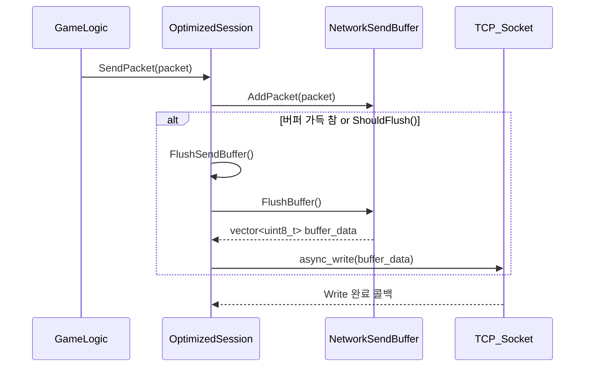

# workingBooks  

저자: 최흥배, Claude AI   
    
권장 개발 환경
- **IDE**: Visual Studio 2022 (Community 이상)
- **컴파일러**: MSVC v143 (C++20 지원)
- **OS**: Windows 10 이상

-----  
# Chapter 16. 고성능 서버 기법
고성능 게임 서버를 구축하기 위해서는 효율적인 패킷 처리, 최적화된 연결 관리, 논블로킹 I/O 활용, 그리고 지속적인 성능 모니터링이 필요하다. 이번 장에서는 Boost.Asio를 활용하여 대규모 동시 접속을 처리할 수 있는 고성능 서버 기법들을 학습한다.

## 16.1 패킷 버퍼링과 배치 처리

### 16.1.1 패킷 버퍼링 시스템
여러 패킷을 모아서 한 번에 처리하면 시스템 콜 오버헤드를 줄이고 성능을 향상시킬 수 있다.

```cpp
#include <boost/asio.hpp>
#include <queue>
#include <vector>
#include <mutex>
#include <atomic>
#include <chrono>

// 패킷 구조
#pragma pack(push, 1)
struct GamePacketHeader
{
    uint16_t packet_size;
    uint16_t packet_type;
    uint32_t sequence_number;
    uint32_t player_id;
};

struct GamePacket
{
    GamePacketHeader header;
    std::vector<uint8_t> data;
    
    GamePacket() = default;
    GamePacket(uint16_t type, uint32_t player_id, const std::vector<uint8_t>& payload)
    {
        header.packet_size = sizeof(GamePacketHeader) + static_cast<uint16_t>(payload.size());
        header.packet_type = type;
        header.player_id = player_id;
        header.sequence_number = 0; // 나중에 할당
        data = payload;
    }
};
#pragma pack(pop)

class PacketBuffer
{
public:
    explicit PacketBuffer(size_t initial_capacity = 8192)
        : buffer_(initial_capacity), write_pos_(0), read_pos_(0)
    {
    }

    bool WritePacket(const GamePacket& packet)
    {
        size_t total_size = sizeof(GamePacketHeader) + packet.data.size();
        
        std::lock_guard<std::mutex> lock(mutex_);
        
        // 버퍼 공간 확인 및 확장
        EnsureCapacity(total_size);
        
        // 헤더 쓰기
        std::memcpy(buffer_.data() + write_pos_, &packet.header, sizeof(GamePacketHeader));
        write_pos_ += sizeof(GamePacketHeader);
        
        // 데이터 쓰기
        if (!packet.data.empty())
        {
            std::memcpy(buffer_.data() + write_pos_, packet.data.data(), packet.data.size());
            write_pos_ += packet.data.size();
        }
        
        ++packet_count_;
        return true;
    }

    std::vector<GamePacket> ReadAllPackets()
    {
        std::lock_guard<std::mutex> lock(mutex_);
        
        std::vector<GamePacket> packets;
        packets.reserve(packet_count_);
        
        while (read_pos_ < write_pos_)
        {
            if (write_pos_ - read_pos_ < sizeof(GamePacketHeader))
                break;
            
            GamePacketHeader header;
            std::memcpy(&header, buffer_.data() + read_pos_, sizeof(GamePacketHeader));
            
            if (write_pos_ - read_pos_ < header.packet_size)
                break;
            
            GamePacket packet;
            packet.header = header;
            
            size_t data_size = header.packet_size - sizeof(GamePacketHeader);
            if (data_size > 0)
            {
                packet.data.resize(data_size);
                std::memcpy(packet.data.data(), 
                           buffer_.data() + read_pos_ + sizeof(GamePacketHeader), 
                           data_size);
            }
            
            packets.push_back(std::move(packet));
            read_pos_ += header.packet_size;
        }
        
        // 버퍼 리셋
        if (read_pos_ == write_pos_)
        {
            read_pos_ = write_pos_ = 0;
            packet_count_ = 0;
        }
        
        return packets;
    }

    size_t GetPacketCount() const
    {
        std::lock_guard<std::mutex> lock(mutex_);
        return packet_count_;
    }

    size_t GetBufferUsage() const
    {
        std::lock_guard<std::mutex> lock(mutex_);
        return write_pos_ - read_pos_;
    }

    void Clear()
    {
        std::lock_guard<std::mutex> lock(mutex_);
        read_pos_ = write_pos_ = 0;
        packet_count_ = 0;
    }

private:
    void EnsureCapacity(size_t additional_size)
    {
        size_t required_size = write_pos_ + additional_size;
        
        if (required_size > buffer_.size())
        {
            // 버퍼 크기를 2배로 확장
            size_t new_size = std::max(required_size, buffer_.size() * 2);
            buffer_.resize(new_size);
        }
    }

    std::vector<uint8_t> buffer_;
    size_t write_pos_;
    size_t read_pos_;
    size_t packet_count_ = 0;
    mutable std::mutex mutex_;
};

// 배치 처리 시스템
class PacketBatchProcessor
{
public:
    PacketBatchProcessor(boost::asio::io_context& io_context, 
                        size_t max_batch_size = 100,
                        std::chrono::milliseconds flush_interval = std::chrono::milliseconds(10))
        : io_context_(io_context), max_batch_size_(max_batch_size), 
          flush_interval_(flush_interval), flush_timer_(io_context)
    {
        StartFlushTimer();
    }

    void QueuePacket(const GamePacket& packet)
    {
        bool should_flush = false;
        
        {
            std::lock_guard<std::mutex> lock(queue_mutex_);
            packet_buffer_.WritePacket(packet);
            
            if (packet_buffer_.GetPacketCount() >= max_batch_size_)
            {
                should_flush = true;
            }
        }
        
        if (should_flush)
        {
            FlushPackets();
        }
    }

    void FlushPackets()
    {
        std::vector<GamePacket> packets;
        
        {
            std::lock_guard<std::mutex> lock(queue_mutex_);
            packets = packet_buffer_.ReadAllPackets();
        }
        
        if (!packets.empty())
        {
            ProcessBatch(packets);
            
            ++batch_count_;
            total_packets_processed_ += packets.size();
            
            if (batch_count_ % 100 == 0)
            {
                std::cout << "Processed " << batch_count_ << " batches, "
                         << total_packets_processed_ << " total packets" << std::endl;
            }
        }
    }

    void PrintStatistics() const
    {
        std::cout << "Batch Processor Statistics:" << std::endl;
        std::cout << "- Total batches: " << batch_count_ << std::endl;
        std::cout << "- Total packets: " << total_packets_processed_ << std::endl;
        std::cout << "- Average batch size: " 
                 << (batch_count_ > 0 ? static_cast<double>(total_packets_processed_) / batch_count_ : 0.0) 
                 << std::endl;
        std::cout << "- Queued packets: " << packet_buffer_.GetPacketCount() << std::endl;
    }

private:
    void StartFlushTimer()
    {
        flush_timer_.expires_after(flush_interval_);
        flush_timer_.async_wait([this](const boost::system::error_code& ec)
        {
            if (!ec)
            {
                FlushPackets();
                StartFlushTimer();
            }
        });
    }

    void ProcessBatch(const std::vector<GamePacket>& packets)
    {
        // 패킷 타입별로 분류하여 처리
        std::unordered_map<uint16_t, std::vector<const GamePacket*>> type_batches;
        
        for (const auto& packet : packets)
        {
            type_batches[packet.header.packet_type].push_back(&packet);
        }
        
        // 타입별 배치 처리
        for (const auto& batch : type_batches)
        {
            ProcessPacketType(batch.first, batch.second);
        }
    }

    void ProcessPacketType(uint16_t packet_type, const std::vector<const GamePacket*>& packets)
    {
        switch (packet_type)
        {
        case 1: // 이동 패킷
            ProcessMovementBatch(packets);
            break;
        case 2: // 채팅 패킷
            ProcessChatBatch(packets);
            break;
        case 3: // 공격 패킷
            ProcessAttackBatch(packets);
            break;
        default:
            std::cout << "Unknown packet type: " << packet_type 
                     << " (batch size: " << packets.size() << ")" << std::endl;
            break;
        }
    }

    void ProcessMovementBatch(const std::vector<const GamePacket*>& packets)
    {
        std::cout << "Processing movement batch: " << packets.size() << " packets" << std::endl;
        // 실제 이동 처리 로직
    }

    void ProcessChatBatch(const std::vector<const GamePacket*>& packets)
    {
        std::cout << "Processing chat batch: " << packets.size() << " packets" << std::endl;
        // 실제 채팅 처리 로직
    }

    void ProcessAttackBatch(const std::vector<const GamePacket*>& packets)
    {
        std::cout << "Processing attack batch: " << packets.size() << " packets" << std::endl;
        // 실제 공격 처리 로직
    }

    boost::asio::io_context& io_context_;
    size_t max_batch_size_;
    std::chrono::milliseconds flush_interval_;
    boost::asio::steady_timer flush_timer_;
    
    PacketBuffer packet_buffer_;
    std::mutex queue_mutex_;
    
    std::atomic<size_t> batch_count_{0};
    std::atomic<size_t> total_packets_processed_{0};
};
```

### 16.1.2 네트워크 송신 최적화
여러 패킷을 모아서 한 번에 전송하여 네트워크 효율성을 높인다.

```cpp
class NetworkSendBuffer
{
public:
    explicit NetworkSendBuffer(size_t max_buffer_size = 65536)
        : max_buffer_size_(max_buffer_size)
    {
        send_buffer_.reserve(max_buffer_size_);
    }

    bool AddPacket(const GamePacket& packet)
    {
        size_t packet_size = sizeof(GamePacketHeader) + packet.data.size();
        
        std::lock_guard<std::mutex> lock(mutex_);
        
        if (send_buffer_.size() + packet_size > max_buffer_size_)
        {
            return false; // 버퍼 가득 참
        }
        
        // 헤더 추가
        const uint8_t* header_ptr = reinterpret_cast<const uint8_t*>(&packet.header);
        send_buffer_.insert(send_buffer_.end(), header_ptr, header_ptr + sizeof(GamePacketHeader));
        
        // 데이터 추가
        if (!packet.data.empty())
        {
            send_buffer_.insert(send_buffer_.end(), packet.data.begin(), packet.data.end());
        }
        
        ++packet_count_;
        return true;
    }

    std::vector<uint8_t> FlushBuffer()
    {
        std::lock_guard<std::mutex> lock(mutex_);
        
        std::vector<uint8_t> result;
        result.swap(send_buffer_);
        packet_count_ = 0;
        
        return result;
    }

    size_t GetPacketCount() const
    {
        std::lock_guard<std::mutex> lock(mutex_);
        return packet_count_;
    }

    size_t GetBufferSize() const
    {
        std::lock_guard<std::mutex> lock(mutex_);
        return send_buffer_.size();
    }

    bool ShouldFlush(size_t min_packets = 10, double fill_ratio = 0.8) const
    {
        std::lock_guard<std::mutex> lock(mutex_);
        return packet_count_ >= min_packets || 
               send_buffer_.size() >= static_cast<size_t>(max_buffer_size_ * fill_ratio);
    }

private:
    std::vector<uint8_t> send_buffer_;
    size_t max_buffer_size_;
    size_t packet_count_ = 0;
    mutable std::mutex mutex_;
};

class OptimizedSession : public std::enable_shared_from_this<OptimizedSession>
{
public:
    OptimizedSession(boost::asio::ip::tcp::socket socket)
        : socket_(std::move(socket)), send_buffer_(32768), // 32KB 송신 버퍼
          flush_timer_(socket_.get_executor())
    {
        StartFlushTimer();
    }

    void Start()
    {
        DoRead();
    }

    void SendPacket(const GamePacket& packet)
    {
        bool should_flush = false;
        
        if (send_buffer_.AddPacket(packet))
        {
            should_flush = send_buffer_.ShouldFlush();
        }
        else
        {
            // 버퍼가 가득 찬 경우 즉시 플러시
            should_flush = true;
        }
        
        if (should_flush)
        {
            FlushSendBuffer();
        }
    }

    void SendPackets(const std::vector<GamePacket>& packets)
    {
        for (const auto& packet : packets)
        {
            if (!send_buffer_.AddPacket(packet))
            {
                FlushSendBuffer();
                send_buffer_.AddPacket(packet);
            }
        }
        
        if (send_buffer_.ShouldFlush(1, 0.1)) // 즉시 플러시
        {
            FlushSendBuffer();
        }
    }

    void FlushSendBuffer()
    {
        auto buffer_data = send_buffer_.FlushBuffer();
        
        if (!buffer_data.empty())
        {
            DoWrite(std::move(buffer_data));
        }
    }

private:
    void DoRead()
    {
        auto self = shared_from_this();
        socket_.async_read_some(
            boost::asio::buffer(read_buffer_),
            [this, self](const boost::system::error_code& ec, std::size_t length)
            {
                if (!ec)
                {
                    ProcessIncomingData(length);
                    DoRead();
                }
                else
                {
                    std::cout << "Read error: " << ec.message() << std::endl;
                }
            });
    }

    void ProcessIncomingData(std::size_t length)
    {
        // 받은 데이터 처리
        std::cout << "Received " << length << " bytes" << std::endl;
        
        // 에코 응답 (테스트용)
        GamePacket echo_packet(1, 12345, std::vector<uint8_t>(read_buffer_.begin(), 
                                                               read_buffer_.begin() + length));
        SendPacket(echo_packet);
    }

    void DoWrite(std::vector<uint8_t> data)
    {
        auto self = shared_from_this();
        auto buffer = std::make_shared<std::vector<uint8_t>>(std::move(data));
        
        boost::asio::async_write(
            socket_,
            boost::asio::buffer(*buffer),
            [this, self, buffer](const boost::system::error_code& ec, std::size_t length)
            {
                if (ec)
                {
                    std::cout << "Write error: " << ec.message() << std::endl;
                }
                else
                {
                    bytes_sent_ += length;
                    ++packets_sent_;
                }
            });
    }

    void StartFlushTimer()
    {
        flush_timer_.expires_after(std::chrono::milliseconds(10));
        flush_timer_.async_wait([this, self = shared_from_this()](const boost::system::error_code& ec)
        {
            if (!ec)
            {
                if (send_buffer_.GetPacketCount() > 0)
                {
                    FlushSendBuffer();
                }
                StartFlushTimer();
            }
        });
    }

    boost::asio::ip::tcp::socket socket_;
    std::array<uint8_t, 4096> read_buffer_;
    NetworkSendBuffer send_buffer_;
    boost::asio::steady_timer flush_timer_;
    
    std::atomic<size_t> bytes_sent_{0};
    std::atomic<size_t> packets_sent_{0};
};
```
  
#### 전체 개요
이 코드는 **네트워크 송신 효율을 높이기 위한 패킷 버퍼링 시스템**을 구현한다.
핵심 아이디어는 다음과 같다.

> 여러 개의 작은 패킷을 각각 전송하지 않고, 일정량을 모아서 한 번에 전송함으로써 시스템 콜 오버헤드와 네트워크 패킷 헤더 비용을 줄인다.

이러한 기법은 흔히 **Batching**, **Nagle’s algorithm의 수동 구현**, 혹은 **Send coalescing**이라 부른다.

#### `NetworkSendBuffer` 클래스 구조
`NetworkSendBuffer`는 실제로 전송될 패킷 데이터를 메모리에 모으는 클래스다.

주요 멤버

| 멤버                                  | 설명                |
| ----------------------------------- | ----------------- |
| `std::vector<uint8_t> send_buffer_` | 전송할 데이터가 모이는 버퍼   |
| `size_t max_buffer_size_`           | 버퍼 최대 크기          |
| `size_t packet_count_`              | 현재 버퍼에 들어 있는 패킷 수 |
| `mutable std::mutex mutex_`         | 멀티스레드 환경 보호용 락    |

AddPacket() 동작 과정

1. 들어온 `GamePacket`의 헤더(`GamePacketHeader`)와 데이터(`packet.data`) 크기를 계산한다.
2. 현재 버퍼 크기와 합쳐서 `max_buffer_size_`를 초과하면 `false` 반환.
3. 초과하지 않으면:

   * 헤더를 버퍼에 삽입
   * 데이터 삽입
   * `packet_count_` 증가

FlushBuffer() 동작 과정

버퍼 내용을 외부로 넘기고 비운다.

1. `send_buffer_`의 내용을 `result`로 옮김 (swap으로 복사 오버헤드 최소화)
2. 내부 버퍼 초기화 및 카운트 리셋
3. 반환된 `result`를 `OptimizedSession`이 전송한다

ShouldFlush() 조건

송신 조건을 판단한다.

* **패킷 수 기반**: `packet_count_ >= min_packets`
* **버퍼 점유율 기반**: `send_buffer_.size() >= max_buffer_size_ * fill_ratio`

예를 들어 `min_packets=10`, `fill_ratio=0.8`이면
패킷이 10개 이상이거나, 버퍼가 80% 이상 차면 전송한다.

버퍼 구조 ASCII 그림

```
+-----------------------------------------------------------+
| [Header1][Data1][Header2][Data2][Header3][Data3] ...      |
+-----------------------------------------------------------+
         ^                                 ^
         |                                 |
     send_buffer_.begin()           send_buffer_.end()
```

패킷 단위가 아니라 **바이트 단위로 이어붙인 연속 메모리** 구조다.


#### `OptimizedSession` 클래스 구조
이 클래스는 **실제 TCP 세션을 관리하면서 송신 버퍼를 활용**한다.
`boost::asio` 기반의 비동기 입출력을 사용한다.

### 주요 멤버

| 멤버                                       | 설명            |
| ---------------------------------------- | ------------- |
| `boost::asio::ip::tcp::socket socket_`   | 클라이언트와 연결된 소켓 |
| `NetworkSendBuffer send_buffer_`         | 송신 패킷 버퍼      |
| `boost::asio::steady_timer flush_timer_` | 주기적 플러시 타이머   |
| `std::atomic<size_t> bytes_sent_`        | 총 송신 바이트 수    |
| `std::atomic<size_t> packets_sent_`      | 송신된 패킷 수      |

송신 흐름 시퀀스 (Mermaid)



#### 주기적 Flush 메커니즘 (`StartFlushTimer`)
`StartFlushTimer()`는 10ms마다 주기적으로 동작한다.

* 타이머 만료 시, `send_buffer_`에 데이터가 남아 있으면 `FlushSendBuffer()` 실행
* 타이머를 다시 10ms 후로 재등록 (루프 구조)

즉, 데이터가 적더라도 **최대 10ms 내에는 송신이 보장**된다.
이는 “지연 최소화”와 “효율성” 사이의 균형을 맞추는 부분이다.

⏱️ 주기적 플러시 ASCII 시각화

```
Time (ms): 0   10   20   30   40   50 ...
             |----|----|----|----|----|
             ↑    ↑    ↑    ↑
             FlushTimer tick마다 버퍼 확인 및 전송
```

#### 수신 및 에코 테스트 동작
* `DoRead()`에서 비동기로 수신
* 수신 완료 시 `ProcessIncomingData()` 호출

  * 수신 바이트 로그 출력
  * 동일 데이터를 `SendPacket()`으로 에코 응답

이 부분은 단순한 테스트 용도로, 실제 게임 서버에서는 **프로토콜 파싱 및 처리 로직**으로 대체된다.

#### 성능상의 장점

| 항목                 | 설명                                   |
| ------------------ | ------------------------------------ |
| **시스템 콜 감소**       | 여러 패킷을 한 번에 `send()`함으로써 커널 호출 횟수 감소 |
| **TCP 헤더 오버헤드 감소** | 여러 논리적 패킷이 하나의 TCP 세그먼트에 포함됨         |
| **캐시 친화적**         | 연속된 메모리 구조로 송신                       |
| **멀티스레드 안전**       | `std::mutex`로 보호                     |
| **지연 제어**          | 타이머 기반 플러시로 latency control          |


#### 개선 여지
* 현재는 단일 스레드 세션 단위 버퍼. 서버 전체에서 **버퍼 풀(Buffer Pool)**을 사용하면 메모리 할당 비용을 더 줄일 수 있다.
* 타이머 주기가 고정(10ms)이므로, 패킷 트래픽 패턴에 따라 **적응형 주기(adaptive flush interval)**로 최적화할 수 있다.
* 비동기 write가 완료되기 전에도 새 데이터가 쌓일 수 있으므로, 이중 버퍼링(double buffering) 구조를 추가하면 lock 경합이 줄어든다.

#### 요약

| 항목          | 설명                                                    |
| ----------- | ----------------------------------------------------- |
| **핵심 목적**   | 여러 패킷을 모아서 한 번에 전송 (네트워크 효율 최적화)                      |
| **구조 구성요소** | `NetworkSendBuffer`, `OptimizedSession`, `FlushTimer` |
| **동작 방식**   | 패킷 누적 → 조건 충족 시 플러시 → async_write()                   |
| **효과**      | 송신 효율 향상, CPU 오버헤드 감소, 지연 최소화                         |


### 16.1.3 패킷 압축 및 집약
패킷 크기를 줄이고 대역폭을 절약하는 기법을 구현합니다.

```cpp
#include <zlib.h>

class PacketCompressor
{
public:
    static std::vector<uint8_t> Compress(const std::vector<uint8_t>& data, int level = Z_DEFAULT_COMPRESSION)
    {
        if (data.empty())
            return {};

        z_stream zs;
        memset(&zs, 0, sizeof(zs));

        if (deflateInit(&zs, level) != Z_OK)
            throw std::runtime_error("deflateInit failed");

        zs.next_in = const_cast<Bytef*>(data.data());
        zs.avail_in = static_cast<uInt>(data.size());

        int ret;
        std::vector<uint8_t> outbuffer(32768);
        std::vector<uint8_t> result;

        do {
            zs.next_out = outbuffer.data();
            zs.avail_out = static_cast<uInt>(outbuffer.size());

            ret = deflate(&zs, Z_FINISH);

            if (result.size() < zs.total_out) {
                result.insert(result.end(), outbuffer.begin(), 
                             outbuffer.begin() + zs.total_out - result.size());
            }
        } while (ret == Z_OK);

        deflateEnd(&zs);

        if (ret != Z_STREAM_END)
            throw std::runtime_error("Exception during zlib compression");

        return result;
    }

    static std::vector<uint8_t> Decompress(const std::vector<uint8_t>& data)
    {
        if (data.empty())
            return {};

        z_stream zs;
        memset(&zs, 0, sizeof(zs));

        if (inflateInit(&zs) != Z_OK)
            throw std::runtime_error("inflateInit failed");

        zs.next_in = const_cast<Bytef*>(data.data());
        zs.avail_in = static_cast<uInt>(data.size());

        int ret;
        std::vector<uint8_t> outbuffer(32768);
        std::vector<uint8_t> result;

        do {
            zs.next_out = outbuffer.data();
            zs.avail_out = static_cast<uInt>(outbuffer.size());

            ret = inflate(&zs, 0);

            if (result.size() < zs.total_out) {
                result.insert(result.end(), outbuffer.begin(),
                             outbuffer.begin() + zs.total_out - result.size());
            }
        } while (ret == Z_OK);

        inflateEnd(&zs);

        if (ret != Z_STREAM_END)
            throw std::runtime_error("Exception during zlib decompression");

        return result;
    }
};

// 패킷 집약 시스템
class PacketAggregator
{
public:
    struct AggregatedPacket
    {
        uint16_t packet_count;
        bool is_compressed;
        uint32_t original_size;
        std::vector<uint8_t> data;
    };

    explicit PacketAggregator(size_t compression_threshold = 1024)
        : compression_threshold_(compression_threshold)
    {
    }

    AggregatedPacket AggregatePackets(const std::vector<GamePacket>& packets)
    {
        AggregatedPacket result;
        result.packet_count = static_cast<uint16_t>(packets.size());
        
        // 모든 패킷을 하나의 버퍼로 결합
        std::vector<uint8_t> combined_data;
        
        for (const auto& packet : packets)
        {
            // 각 패킷의 크기 정보 추가
            uint16_t packet_size = sizeof(GamePacketHeader) + static_cast<uint16_t>(packet.data.size());
            combined_data.insert(combined_data.end(), 
                                reinterpret_cast<const uint8_t*>(&packet_size),
                                reinterpret_cast<const uint8_t*>(&packet_size) + sizeof(uint16_t));
            
            // 헤더 추가
            combined_data.insert(combined_data.end(),
                                reinterpret_cast<const uint8_t*>(&packet.header),
                                reinterpret_cast<const uint8_t*>(&packet.header) + sizeof(GamePacketHeader));
            
            // 데이터 추가
            if (!packet.data.empty())
            {
                combined_data.insert(combined_data.end(), packet.data.begin(), packet.data.end());
            }
        }
        
        result.original_size = static_cast<uint32_t>(combined_data.size());
        
        // 압축 여부 결정
        if (combined_data.size() >= compression_threshold_)
        {
            try
            {
                auto compressed_data = PacketCompressor::Compress(combined_data);
                
                // 압축률이 좋으면 압축된 데이터 사용
                if (compressed_data.size() < combined_data.size() * 0.9)
                {
                    result.is_compressed = true;
                    result.data = std::move(compressed_data);
                    
                    compression_savings_ += (combined_data.size() - result.data.size());
                    ++compressed_packets_;
                }
                else
                {
                    result.is_compressed = false;
                    result.data = std::move(combined_data);
                    ++uncompressed_packets_;
                }
            }
            catch (const std::exception& e)
            {
                std::cerr << "Compression failed: " << e.what() << std::endl;
                result.is_compressed = false;
                result.data = std::move(combined_data);
                ++uncompressed_packets_;
            }
        }
        else
        {
            result.is_compressed = false;
            result.data = std::move(combined_data);
            ++uncompressed_packets_;
        }
        
        return result;
    }

    std::vector<GamePacket> ExtractPackets(const AggregatedPacket& aggregated)
    {
        std::vector<uint8_t> data = aggregated.data;
        
        // 압축 해제
        if (aggregated.is_compressed)
        {
            try
            {
                data = PacketCompressor::Decompress(aggregated.data);
            }
            catch (const std::exception& e)
            {
                std::cerr << "Decompression failed: " << e.what() << std::endl;
                return {};
            }
        }
        
        // 개별 패킷 추출
        std::vector<GamePacket> packets;
        packets.reserve(aggregated.packet_count);
        
        size_t offset = 0;
        for (uint16_t i = 0; i < aggregated.packet_count; ++i)
        {
            if (offset + sizeof(uint16_t) > data.size())
                break;
            
            // 패킷 크기 읽기
            uint16_t packet_size;
            std::memcpy(&packet_size, data.data() + offset, sizeof(uint16_t));
            offset += sizeof(uint16_t);
            
            if (offset + packet_size > data.size())
                break;
            
            // 헤더 읽기
            GamePacket packet;
            std::memcpy(&packet.header, data.data() + offset, sizeof(GamePacketHeader));
            offset += sizeof(GamePacketHeader);
            
            // 데이터 읽기
            size_t data_size = packet_size - sizeof(GamePacketHeader);
            if (data_size > 0)
            {
                packet.data.resize(data_size);
                std::memcpy(packet.data.data(), data.data() + offset, data_size);
                offset += data_size;
            }
            
            packets.push_back(std::move(packet));
        }
        
        return packets;
    }

    void PrintCompressionStatistics() const
    {
        std::cout << "Compression Statistics:" << std::endl;
        std::cout << "- Compressed packets: " << compressed_packets_ << std::endl;
        std::cout << "- Uncompressed packets: " << uncompressed_packets_ << std::endl;
        std::cout << "- Total savings: " << compression_savings_ << " bytes" << std::endl;
        
        if (compressed_packets_ > 0)
        {
            std::cout << "- Compression ratio: " 
                     << (static_cast<double>(compressed_packets_) / 
                         (compressed_packets_ + uncompressed_packets_) * 100.0) << "%" << std::endl;
        }
    }

private:
    size_t compression_threshold_;
    std::atomic<size_t> compressed_packets_{0};
    std::atomic<size_t> uncompressed_packets_{0};
    std::atomic<size_t> compression_savings_{0};
};

void packet_optimization_example()
{
    std::cout << "Packet optimization test..." << std::endl;
    
    PacketBatchProcessor batch_processor(boost::asio::io_context{});
    PacketAggregator aggregator;
    
    // 테스트 패킷 생성
    std::vector<GamePacket> test_packets;
    for (int i = 0; i < 50; ++i)
    {
        std::vector<uint8_t> data(100 + i * 10, static_cast<uint8_t>(i % 256));
        test_packets.emplace_back(1, 1000 + i, data);
    }
    
    // 패킷 집약 및 압축 테스트
    auto aggregated = aggregator.AggregatePackets(test_packets);
    std::cout << "Original size: " << aggregated.original_size << " bytes" << std::endl;
    std::cout << "Aggregated size: " << aggregated.data.size() << " bytes" << std::endl;
    std::cout << "Compressed: " << (aggregated.is_compressed ? "Yes" : "No") << std::endl;
    
    // 패킷 추출 테스트
    auto extracted_packets = aggregator.ExtractPackets(aggregated);
    std::cout << "Extracted " << extracted_packets.size() << " packets" << std::endl;
    
    aggregator.PrintCompressionStatistics();
}
```
  
</br>


## 16.2 연결 풀링과 재사용

### 16.2.1 연결 풀 관리자
데이터베이스나 외부 서비스 연결을 효율적으로 관리하는 연결 풀을 구현한다.

```cpp
#include <condition_variable>
#include <chrono>

template<typename Connection>
class ConnectionPool
{
public:
    using ConnectionPtr = std::shared_ptr<Connection>;
    using ConnectionFactory = std::function<ConnectionPtr()>;

    ConnectionPool(ConnectionFactory factory, 
                  size_t min_connections = 5,
                  size_t max_connections = 20,
                  std::chrono::seconds connection_timeout = std::chrono::seconds(30))
        : factory_(factory), min_connections_(min_connections), 
          max_connections_(max_connections), connection_timeout_(connection_timeout),
          is_shutdown_(false)
    {
        // 최소 연결 수만큼 미리 생성
        for (size_t i = 0; i < min_connections_; ++i)
        {
            try
            {
                auto conn = factory_();
                if (conn)
                {
                    available_connections_.push(std::make_pair(conn, std::chrono::steady_clock::now()));
                }
            }
            catch (const std::exception& e)
            {
                std::cerr << "Failed to create initial connection: " << e.what() << std::endl;
            }
        }
        
        // 정리 스레드 시작
        cleanup_thread_ = std::thread([this] { CleanupLoop(); });
    }

    ~ConnectionPool()
    {
        Shutdown();
    }

    class ConnectionGuard
    {
    public:
        ConnectionGuard(ConnectionPtr connection, ConnectionPool& pool)
            : connection_(connection), pool_(&pool)
        {
        }

        ~ConnectionGuard()
        {
            if (connection_ && pool_)
            {
                pool_->ReturnConnection(connection_);
            }
        }

        // 이동 생성자
        ConnectionGuard(ConnectionGuard&& other) noexcept
            : connection_(std::move(other.connection_)), pool_(other.pool_)
        {
            other.pool_ = nullptr;
        }

        // 이동 대입 연산자
        ConnectionGuard& operator=(ConnectionGuard&& other) noexcept
        {
            if (this != &other)
            {
                if (connection_ && pool_)
                {
                    pool_->ReturnConnection(connection_);
                }
                connection_ = std::move(other.connection_);
                pool_ = other.pool_;
                other.pool_ = nullptr;
            }
            return *this;
        }

        // 복사 금지
        ConnectionGuard(const ConnectionGuard&) = delete;
        ConnectionGuard& operator=(const ConnectionGuard&) = delete;

        Connection* Get() const { return connection_.get(); }
        Connection* operator->() const { return connection_.get(); }
        Connection& operator*() const { return *connection_; }
        bool IsValid() const { return connection_ != nullptr; }

        // 연결 해제 (풀에 반환하지 않음)
        void Release() { pool_ = nullptr; }

    private:
        ConnectionPtr connection_;
        ConnectionPool* pool_;
    };

    ConnectionGuard AcquireConnection(std::chrono::milliseconds timeout = std::chrono::milliseconds(5000))
    {
        std::unique_lock<std::mutex> lock(mutex_);
        
        auto deadline = std::chrono::steady_clock::now() + timeout;
        
        while (!is_shutdown_)
        {
            // 사용 가능한 연결 확인
            if (!available_connections_.empty())
            {
                auto [connection, timestamp] = available_connections_.front();
                available_connections_.pop();
                
                // 연결 유효성 검사
                if (IsConnectionValid(connection))
                {
                    ++active_connections_;
                    return ConnectionGuard(connection, *this);
                }
            }
            
            // 새 연결 생성 시도
            if (GetTotalConnections() < max_connections_)
            {
                lock.unlock();
                try
                {
                    auto new_connection = factory_();
                    if (new_connection && IsConnectionValid(new_connection))
                    {
                        ++active_connections_;
                        ++total_created_;
                        return ConnectionGuard(new_connection, *this);
                    }
                }
                catch (const std::exception& e)
                {
                    std::cerr << "Failed to create new connection: " << e.what() << std::endl;
                }
                lock.lock();
            }
            
            // 타임아웃 확인
            if (std::chrono::steady_clock::now() >= deadline)
            {
                throw std::runtime_error("Connection acquisition timeout");
            }
            
            // 대기
            condition_.wait_until(lock, deadline);
        }
        
        throw std::runtime_error("Connection pool is shutdown");
    }

    void ReturnConnection(ConnectionPtr connection)
    {
        if (!connection)
            return;

        std::lock_guard<std::mutex> lock(mutex_);
        
        if (!is_shutdown_ && IsConnectionValid(connection))
        {
            available_connections_.push(std::make_pair(connection, std::chrono::steady_clock::now()));
        }
        
        --active_connections_;
        condition_.notify_one();
    }

    void Shutdown()
    {
        {
            std::lock_guard<std::mutex> lock(mutex_);
            is_shutdown_ = true;
        }
        condition_.notify_all();
        
        if (cleanup_thread_.joinable())
        {
            cleanup_thread_.join();
        }
        
        // 모든 연결 정리
        std::lock_guard<std::mutex> lock(mutex_);
        while (!available_connections_.empty())
        {
            available_connections_.pop();
        }
    }

    void PrintStatistics() const
    {
        std::lock_guard<std::mutex> lock(mutex_);
        std::cout << "Connection Pool Statistics:" << std::endl;
        std::cout << "- Active connections: " << active_connections_ << std::endl;
        std::cout << "- Available connections: " << available_connections_.size() << std::endl;
        std::cout << "- Total connections: " << GetTotalConnections() << std::endl;
        std::cout << "- Max connections: " << max_connections_ << std::endl;
        std::cout << "- Total created: " << total_created_ << std::endl;
        std::cout << "- Total expired: " << total_expired_ << std::endl;
    }

private:
    size_t GetTotalConnections() const
    {
        return active_connections_ + available_connections_.size();
    }

    bool IsConnectionValid(ConnectionPtr connection)
    {
        // 실제 구현에서는 연결 상태 확인
        // 예: ping, select 1, 등
        return connection != nullptr;
    }

    void CleanupLoop()
    {
        while (!is_shutdown_)
        {
            std::this_thread::sleep_for(std::chrono::seconds(10));
            CleanupExpiredConnections();
        }
    }

    void CleanupExpiredConnections()
    {
        std::lock_guard<std::mutex> lock(mutex_);
        
        auto now = std::chrono::steady_clock::now();
        std::queue<std::pair<ConnectionPtr, std::chrono::steady_clock::time_point>> valid_connections;
        
        while (!available_connections_.empty())
        {
            auto [connection, timestamp] = available_connections_.front();
            available_connections_.pop();
            
            if (now - timestamp < connection_timeout_ && IsConnectionValid(connection))
            {
                valid_connections.push(std::make_pair(connection, timestamp));
            }
            else
            {
                ++total_expired_;
            }
        }
        
        available_connections_ = std::move(valid_connections);
        
        // 최소 연결 수 유지
        while (GetTotalConnections() < min_connections_)
        {
            try
            {
                auto conn = factory_();
                if (conn && IsConnectionValid(conn))
                {
                    available_connections_.push(std::make_pair(conn, now));
                    ++total_created_;
                }
                else
                {
                    break;
                }
            }
            catch (const std::exception& e)
            {
                std::cerr << "Failed to create replacement connection: " << e.what() << std::endl;
                break;
            }
        }
    }

    ConnectionFactory factory_;
    size_t min_connections_;
    size_t max_connections_;
    std::chrono::seconds connection_timeout_;
    
    std::queue<std::pair<ConnectionPtr, std::chrono::steady_clock::time_point>> available_connections_;
    std::atomic<size_t> active_connections_{0};
    std::atomic<size_t> total_created_{0};
    std::atomic<size_t> total_expired_{0};
    
    bool is_shutdown_;
    mutable std::mutex mutex_;
    std::condition_variable condition_;
    std::thread cleanup_thread_;
};

// 데이터베이스 연결 예제
class DatabaseConnection
{
public:
    DatabaseConnection(const std::string& connection_string)
        : connection_string_(connection_string), is_connected_(false)
    {
        Connect();
    }

    ~DatabaseConnection()
    {
        Disconnect();
    }

    bool Execute(const std::string& query)
    {
        if (!is_connected_)
            return false;

        std::cout << "Executing query: " << query << std::endl;
        std::this_thread::sleep_for(std::chrono::milliseconds(10)); // 시뮬레이션
        return true;
    }

    bool IsConnected() const
    {
        return is_connected_;
    }

private:
    void Connect()
    {
        std::cout << "Connecting to database: " << connection_string_ << std::endl;
        std::this_thread::sleep_for(std::chrono::milliseconds(100)); // 연결 시뮬레이션
        is_connected_ = true;
    }

    void Disconnect()
    {
        if (is_connected_)
        {
            std::cout << "Disconnecting from database" << std::endl;
            is_connected_ = false;
        }
    }

    std::string connection_string_;
    bool is_connected_;
};

void connection_pooling_example()
{
    std::cout << "Connection pooling test..." << std::endl;
    
    // 연결 팩토리
    auto factory = []() -> std::shared_ptr<DatabaseConnection>
    {
        return std::make_shared<DatabaseConnection>("host=localhost;db=gamedb");
    };
    
    ConnectionPool<DatabaseConnection> pool(factory, 3, 10);
    
    // 동시 연결 사용 테스트
    std::vector<std::thread> threads;
    
    for (int i = 0; i < 20; ++i)
    {
        threads.emplace_back([&pool, i]()
        {
            try
            {
                auto conn_guard = pool.AcquireConnection();
                
                std::string query = "SELECT * FROM players WHERE id = " + std::to_string(i);
                conn_guard->Execute(query);
                
                std::this_thread::sleep_for(std::chrono::milliseconds(50));
            }
            catch (const std::exception& e)
            {
                std::cerr << "Thread " << i << " error: " << e.what() << std::endl;
            }
        });
    }
    
    // 모든 스레드 완료 대기
    for (auto& thread : threads)
    {
        thread.join();
    }
    
    pool.PrintStatistics();
}
```

### 16.2.2 세션 재사용 풀
네트워크 세션을 재사용하여 객체 생성 오버헤드를 줄인다.

```cpp
class ReusableSession
{
public:
    enum class State
    {
        IDLE,
        ACTIVE,
        DISCONNECTING
    };

    explicit ReusableSession(boost::asio::io_context& io_context)
        : socket_(io_context), state_(State::IDLE)
    {
    }

    void Initialize(boost::asio::ip::tcp::socket socket)
    {
        socket_ = std::move(socket);
        state_ = State::ACTIVE;
        player_id_ = 0;
        bytes_received_ = 0;
        bytes_sent_ = 0;
        packets_processed_ = 0;
        start_time_ = std::chrono::steady_clock::now();
        
        read_buffer_.fill(0);
    }

    void Reset()
    {
        if (socket_.is_open())
        {
            boost::system::error_code ec;
            socket_.close(ec);
        }
        
        state_ = State::IDLE;
        player_id_ = 0;
        bytes_received_ = 0;
        bytes_sent_ = 0;
        packets_processed_ = 0;
    }

    void Start()
    {
        if (state_ == State::ACTIVE)
        {
            DoRead();
        }
    }

    void SendData(const std::vector<uint8_t>& data)
    {
        if (state_ != State::ACTIVE)
            return;

        auto buffer = std::make_shared<std::vector<uint8_t>>(data);
        boost::asio::async_write(
            socket_,
            boost::asio::buffer(*buffer),
            [this, buffer](const boost::system::error_code& ec, std::size_t length)
            {
                if (!ec)
                {
                    bytes_sent_ += length;
                }
                else
                {
                    HandleError(ec);
                }
            });
    }

    State GetState() const { return state_; }
    uint32_t GetPlayerId() const { return player_id_; }
    void SetPlayerId(uint32_t id) { player_id_ = id; }

    void PrintSessionInfo() const
    {
        auto duration = std::chrono::steady_clock::now() - start_time_;
        auto seconds = std::chrono::duration_cast<std::chrono::seconds>(duration).count();
        
        std::cout << "Session Info:" << std::endl;
        std::cout << "- Player ID: " << player_id_ << std::endl;
        std::cout << "- State: " << static_cast<int>(state_) << std::endl;
        std::cout << "- Duration: " << seconds << " seconds" << std::endl;
        std::cout << "- Bytes received: " << bytes_received_ << std::endl;
        std::cout << "- Bytes sent: " << bytes_sent_ << std::endl;
        std::cout << "- Packets processed: " << packets_processed_ << std::endl;
    }

private:
    void DoRead()
    {
        socket_.async_read_some(
            boost::asio::buffer(read_buffer_),
            [this](const boost::system::error_code& ec, std::size_t length)
            {
                if (!ec)
                {
                    bytes_received_ += length;
                    ++packets_processed_;
                    
                    ProcessData(length);
                    DoRead();
                }
                else
                {
                    HandleError(ec);
                }
            });
    }

    void ProcessData(std::size_t length)
    {
        // 데이터 처리 로직
        std::cout << "Session " << this << " processed " << length << " bytes" << std::endl;
    }

    void HandleError(const boost::system::error_code& ec)
    {
        if (ec != boost::asio::error::eof && ec != boost::asio::error::operation_aborted)
        {
            std::cout << "Session error: " << ec.message() << std::endl;
        }
        
        state_ = State::DISCONNECTING;
    }

    boost::asio::ip::tcp::socket socket_;
    State state_;
    uint32_t player_id_;
    
    std::array<uint8_t, 4096> read_buffer_;
    std::atomic<size_t> bytes_received_{0};
    std::atomic<size_t> bytes_sent_{0};
    std::atomic<size_t> packets_processed_{0};
    std::chrono::steady_clock::time_point start_time_;
};

class SessionPool
{
public:
    explicit SessionPool(boost::asio::io_context& io_context, size_t pool_size = 1000)
        : io_context_(io_context)
    {
        // 세션 풀 미리 생성
        for (size_t i = 0; i < pool_size; ++i)
        {
            auto session = std::make_unique<ReusableSession>(io_context_);
            available_sessions_.push(std::move(session));
        }
        
        std::cout << "Session pool created with " << pool_size << " sessions" << std::endl;
    }

    std::unique_ptr<ReusableSession> AcquireSession()
    {
        std::lock_guard<std::mutex> lock(mutex_);
        
        if (!available_sessions_.empty())
        {
            auto session = std::move(available_sessions_.top());
            available_sessions_.pop();
            ++active_sessions_;
            return session;
        }
        
        // 풀이 비어있으면 새로 생성
        ++total_created_;
        ++active_sessions_;
        return std::make_unique<ReusableSession>(io_context_);
    }

    void ReturnSession(std::unique_ptr<ReusableSession> session)
    {
        if (!session)
            return;

        session->Reset();
        
        std::lock_guard<std::mutex> lock(mutex_);
        
        // 풀 크기 제한
        if (available_sessions_.size() < max_pool_size_)
        {
            available_sessions_.push(std::move(session));
        }
        
        --active_sessions_;
    }

    void PrintStatistics() const
    {
        std::lock_guard<std::mutex> lock(mutex_);
        std::cout << "Session Pool Statistics:" << std::endl;
        std::cout << "- Available sessions: " << available_sessions_.size() << std::endl;
        std::cout << "- Active sessions: " << active_sessions_ << std::endl;
        std::cout << "- Total created: " << total_created_ << std::endl;
        std::cout << "- Max pool size: " << max_pool_size_ << std::endl;
    }

private:
    boost::asio::io_context& io_context_;
    std::stack<std::unique_ptr<ReusableSession>> available_sessions_;
    std::atomic<size_t> active_sessions_{0};
    std::atomic<size_t> total_created_{0};
    const size_t max_pool_size_ = 1000;
    mutable std::mutex mutex_;
};

class HighPerformanceServer
{
public:
    HighPerformanceServer(boost::asio::io_context& io_context, short port)
        : acceptor_(io_context, boost::asio::ip::tcp::endpoint(boost::asio::ip::tcp::v4(), port)),
          session_pool_(io_context, 500)
    {
        StartAccept();
    }

    void PrintStatistics() const
    {
        session_pool_.PrintStatistics();
        std::cout << "- Total connections: " << total_connections_ << std::endl;
    }

private:
    void StartAccept()
    {
        acceptor_.async_accept(
            [this](const boost::system::error_code& ec, boost::asio::ip::tcp::socket socket)
            {
                if (!ec)
                {
                    auto session = session_pool_.AcquireSession();
                    session->Initialize(std::move(socket));
                    session->Start();
                    
                    // 세션을 별도로 관리 (실제로는 더 복잡한 생명주기 관리 필요)
                    ManageSession(std::move(session));
                    
                    ++total_connections_;
                }
                
                StartAccept();
            });
    }

    void ManageSession(std::unique_ptr<ReusableSession> session)
    {
        // 실제 구현에서는 세션 생명주기를 관리하고
        // 연결이 끊어지면 풀에 반환
        
        // 간단한 예제를 위해 5초 후 세션 반환
        auto timer = std::make_shared<boost::asio::steady_timer>(acceptor_.get_executor());
        timer->expires_after(std::chrono::seconds(5));
        timer->async_wait([this, session = std::move(session), timer](const boost::system::error_code&) mutable
        {
            session_pool_.ReturnSession(std::move(session));
        });
    }

    boost::asio::ip::tcp::acceptor acceptor_;
    SessionPool session_pool_;
    std::atomic<size_t> total_connections_{0};
};
```
  
</br>  
  

## 16.3 논블로킹 I/O 최적화

### 16.3.1 이벤트 기반 I/O 처리

```cpp
class EventDrivenIOProcessor
{
public:
    struct IOEvent
    {
        enum Type { READ, WRITE, TIMEOUT, ERROR };
        
        Type type;
        void* user_data;
        size_t bytes_transferred;
        boost::system::error_code error;
        std::chrono::steady_clock::time_point timestamp;
    };

    using EventHandler = std::function<void(const IOEvent&)>;

    explicit EventDrivenIOProcessor(boost::asio::io_context& io_context)
        : io_context_(io_context), event_queue_size_(0)
    {
        StartEventProcessor();
    }

    void ScheduleRead(boost::asio::ip::tcp::socket& socket, 
                     std::vector<uint8_t>& buffer,
                     void* user_data,
                     EventHandler handler)
    {
        socket.async_read_some(
            boost::asio::buffer(buffer),
            [this, user_data, handler](const boost::system::error_code& ec, std::size_t length)
            {
                IOEvent event;
                event.type = ec ? IOEvent::ERROR : IOEvent::READ;
                event.user_data = user_data;
                event.bytes_transferred = length;
                event.error = ec;
                event.timestamp = std::chrono::steady_clock::now();
                
                QueueEvent(event, handler);
            });
    }

    void ScheduleWrite(boost::asio::ip::tcp::socket& socket,
                      const std::vector<uint8_t>& buffer,
                      void* user_data,
                      EventHandler handler)
    {
        auto shared_buffer = std::make_shared<std::vector<uint8_t>>(buffer);
        
        boost::asio::async_write(
            socket,
            boost::asio::buffer(*shared_buffer),
            [this, user_data, handler, shared_buffer](const boost::system::error_code& ec, std::size_t length)
            {
                IOEvent event;
                event.type = ec ? IOEvent::ERROR : IOEvent::WRITE;
                event.user_data = user_data;
                event.bytes_transferred = length;
                event.error = ec;
                event.timestamp = std::chrono::steady_clock::now();
                
                QueueEvent(event, handler);
            });
    }

    void ScheduleTimeout(std::chrono::milliseconds duration,
                        void* user_data,
                        EventHandler handler)
    {
        auto timer = std::make_shared<boost::asio::steady_timer>(io_context_);
        timer->expires_after(duration);
        
        timer->async_wait([this, user_data, handler, timer](const boost::system::error_code& ec)
        {
            IOEvent event;
            event.type = ec ? IOEvent::ERROR : IOEvent::TIMEOUT;
            event.user_data = user_data;
            event.bytes_transferred = 0;
            event.error = ec;
            event.timestamp = std::chrono::steady_clock::now();
            
            QueueEvent(event, handler);
        });
    }

    void PrintStatistics() const
    {
        std::cout << "Event-driven I/O Statistics:" << std::endl;
        std::cout << "- Events processed: " << events_processed_ << std::endl;
        std::cout << "- Current queue size: " << event_queue_size_ << std::endl;
        std::cout << "- Max queue size: " << max_queue_size_ << std::endl;
        std::cout << "- Read events: " << read_events_ << std::endl;
        std::cout << "- Write events: " << write_events_ << std::endl;
        std::cout << "- Timeout events: " << timeout_events_ << std::endl;
        std::cout << "- Error events: " << error_events_ << std::endl;
    }

private:
    struct QueuedEvent
    {
        IOEvent event;
        EventHandler handler;
    };

    void QueueEvent(const IOEvent& event, EventHandler handler)
    {
        {
            std::lock_guard<std::mutex> lock(queue_mutex_);
            event_queue_.push({event, handler});
            ++event_queue_size_;
            
            if (event_queue_size_ > max_queue_size_)
            {
                max_queue_size_ = event_queue_size_;
            }
        }
        queue_condition_.notify_one();
    }

    void StartEventProcessor()
    {
        processor_thread_ = std::thread([this]()
        {
            ProcessEventLoop();
        });
    }

    void ProcessEventLoop()
    {
        while (!shutdown_)
        {
            std::unique_lock<std::mutex> lock(queue_mutex_);
            queue_condition_.wait(lock, [this] { return !event_queue_.empty() || shutdown_; });
            
            std::queue<QueuedEvent> local_queue;
            local_queue.swap(event_queue_);
            event_queue_size_ = 0;
            
            lock.unlock();
            
            while (!local_queue.empty())
            {
                auto queued_event = local_queue.front();
                local_queue.pop();
                
                try
                {
                    queued_event.handler(queued_event.event);
                    
                    // 통계 업데이트
                    ++events_processed_;
                    switch (queued_event.event.type)
                    {
                    case IOEvent::READ: ++read_events_; break;
                    case IOEvent::WRITE: ++write_events_; break;
                    case IOEvent::TIMEOUT: ++timeout_events_; break;
                    case IOEvent::ERROR: ++error_events_; break;
                    }
                }
                catch (const std::exception& e)
                {
                    std::cerr << "Event handler exception: " << e.what() << std::endl;
                }
            }
        }
    }

    boost::asio::io_context& io_context_;
    std::queue<QueuedEvent> event_queue_;
    std::atomic<size_t> event_queue_size_;
    std::mutex queue_mutex_;
    std::condition_variable queue_condition_;
    std::thread processor_thread_;
    
    std::atomic<bool> shutdown_{false};
    std::atomic<size_t> events_processed_{0};
    std::atomic<size_t> max_queue_size_{0};
    std::atomic<size_t> read_events_{0};
    std::atomic<size_t> write_events_{0};
    std::atomic<size_t> timeout_events_{0};
    std::atomic<size_t> error_events_{0};
};
```
  
</br>    
  

## 16.4 성능 모니터링과 프로파일링

### 16.4.1 성능 메트릭 수집

```cpp
#include <unordered_map>
#include <map>

class PerformanceMetrics
{
public:
    struct MetricData
    {
        std::atomic<uint64_t> count{0};
        std::atomic<uint64_t> total_value{0};
        std::atomic<uint64_t> min_value{UINT64_MAX};
        std::atomic<uint64_t> max_value{0};
        std::mutex values_mutex;
        std::vector<uint64_t> recent_values;
        static const size_t MAX_RECENT_VALUES = 1000;
    };

    void RecordMetric(const std::string& name, uint64_t value)
    {
        auto& metric = metrics_[name];
        
        metric.count++;
        metric.total_value += value;
        
        // 최소값 업데이트
        uint64_t current_min = metric.min_value.load();
        while (value < current_min && 
               !metric.min_value.compare_exchange_weak(current_min, value)) {}
        
        // 최대값 업데이트
        uint64_t current_max = metric.max_value.load();
        while (value > current_max && 
               !metric.max_value.compare_exchange_weak(current_max, value)) {}
        
        // 최근 값들 저장 (통계 계산용)
        {
            std::lock_guard<std::mutex> lock(metric.values_mutex);
            metric.recent_values.push_back(value);
            if (metric.recent_values.size() > MetricData::MAX_RECENT_VALUES)
            {
                metric.recent_values.erase(metric.recent_values.begin());
            }
        }
    }

    void IncrementCounter(const std::string& name, uint64_t increment = 1)
    {
        RecordMetric(name, increment);
    }

    struct MetricSummary
    {
        uint64_t count;
        double average;
        uint64_t min_value;
        uint64_t max_value;
        double percentile_95;
        double percentile_99;
        double standard_deviation;
    };

    MetricSummary GetMetricSummary(const std::string& name) const
    {
        auto it = metrics_.find(name);
        if (it == metrics_.end())
        {
            return {};
        }
        
        const auto& metric = it->second;
        MetricSummary summary;
        
        summary.count = metric.count.load();
        summary.min_value = metric.min_value.load();
        summary.max_value = metric.max_value.load();
        
        if (summary.count > 0)
        {
            summary.average = static_cast<double>(metric.total_value.load()) / summary.count;
        }
        else
        {
            summary.average = 0.0;
        }
        
        // 백분위수와 표준편차 계산
        {
            std::lock_guard<std::mutex> lock(metric.values_mutex);
            if (!metric.recent_values.empty())
            {
                auto sorted_values = metric.recent_values;
                std::sort(sorted_values.begin(), sorted_values.end());
                
                // 95th percentile
                size_t p95_index = static_cast<size_t>(sorted_values.size() * 0.95);
                summary.percentile_95 = sorted_values[std::min(p95_index, sorted_values.size() - 1)];
                
                // 99th percentile
                size_t p99_index = static_cast<size_t>(sorted_values.size() * 0.99);
                summary.percentile_99 = sorted_values[std::min(p99_index, sorted_values.size() - 1)];
                
                // 표준편차
                double variance = 0.0;
                for (uint64_t value : sorted_values)
                {
                    double diff = value - summary.average;
                    variance += diff * diff;
                }
                variance /= sorted_values.size();
                summary.standard_deviation = std::sqrt(variance);
            }
        }
        
        return summary;
    }

    void PrintAllMetrics() const
    {
        std::cout << "\n=== Performance Metrics ===" << std::endl;
        
        for (const auto& pair : metrics_)
        {
            const std::string& name = pair.first;
            auto summary = GetMetricSummary(name);
            
            std::cout << "Metric: " << name << std::endl;
            std::cout << "  Count: " << summary.count << std::endl;
            std::cout << "  Average: " << std::fixed << std::setprecision(2) << summary.average << std::endl;
            std::cout << "  Min: " << summary.min_value << std::endl;
            std::cout << "  Max: " << summary.max_value << std::endl;
            std::cout << "  95th percentile: " << std::fixed << std::setprecision(2) << summary.percentile_95 << std::endl;
            std::cout << "  99th percentile: " << std::fixed << std::setprecision(2) << summary.percentile_99 << std::endl;
            std::cout << "  Std deviation: " << std::fixed << std::setprecision(2) << summary.standard_deviation << std::endl;
            std::cout << std::endl;
        }
    }

    void Reset()
    {
        for (auto& pair : metrics_)
        {
            auto& metric = pair.second;
            metric.count = 0;
            metric.total_value = 0;
            metric.min_value = UINT64_MAX;
            metric.max_value = 0;
            
            std::lock_guard<std::mutex> lock(metric.values_mutex);
            metric.recent_values.clear();
        }
    }

private:
    std::unordered_map<std::string, MetricData> metrics_;
};

// 성능 타이머
class PerformanceTimer
{
public:
    explicit PerformanceTimer(PerformanceMetrics& metrics, const std::string& metric_name)
        : metrics_(metrics), metric_name_(metric_name), 
          start_time_(std::chrono::high_resolution_clock::now())
    {
    }

    ~PerformanceTimer()
    {
        auto end_time = std::chrono::high_resolution_clock::now();
        auto duration = std::chrono::duration_cast<std::chrono::microseconds>(end_time - start_time_);
        metrics_.RecordMetric(metric_name_, duration.count());
    }

private:
    PerformanceMetrics& metrics_;
    std::string metric_name_;
    std::chrono::high_resolution_clock::time_point start_time_;
};

#define PERF_TIMER(metrics, name) PerformanceTimer timer(metrics, name)
```

### 16.4.2 시스템 리소스 모니터링

```cpp
class SystemMonitor
{
public:
    struct SystemStats
    {
        double cpu_usage_percent;
        size_t memory_usage_mb;
        size_t memory_available_mb;
        size_t network_bytes_sent;
        size_t network_bytes_received;
        size_t active_connections;
        double disk_usage_percent;
        std::chrono::steady_clock::time_point timestamp;
    };

    explicit SystemMonitor(boost::asio::io_context& io_context)
        : monitor_timer_(io_context)
    {
        StartMonitoring();
    }

    void StartMonitoring(std::chrono::seconds interval = std::chrono::seconds(5))
    {
        monitor_timer_.expires_after(interval);
        monitor_timer_.async_wait([this, interval](const boost::system::error_code& ec)
        {
            if (!ec)
            {
                CollectSystemStats();
                StartMonitoring(interval);
            }
        });
    }

    SystemStats GetCurrentStats() const
    {
        std::lock_guard<std::mutex> lock(stats_mutex_);
        return current_stats_;
    }

    std::vector<SystemStats> GetHistoricalStats() const
    {
        std::lock_guard<std::mutex> lock(stats_mutex_);
        return stats_history_;
    }

    void PrintCurrentStats() const
    {
        auto stats = GetCurrentStats();
        
        std::cout << "=== System Statistics ===" << std::endl;
        std::cout << "CPU Usage: " << std::fixed << std::setprecision(1) << stats.cpu_usage_percent << "%" << std::endl;
        std::cout << "Memory Usage: " << stats.memory_usage_mb << " MB" << std::endl;
        std::cout << "Memory Available: " << stats.memory_available_mb << " MB" << std::endl;
        std::cout << "Network Sent: " << FormatBytes(stats.network_bytes_sent) << std::endl;
        std::cout << "Network Received: " << FormatBytes(stats.network_bytes_received) << std::endl;
        std::cout << "Active Connections: " << stats.active_connections << std::endl;
        std::cout << "Disk Usage: " << std::fixed << std::setprecision(1) << stats.disk_usage_percent << "%" << std::endl;
        std::cout << "==========================" << std::endl;
    }

    void SetActiveConnections(size_t count)
    {
        std::lock_guard<std::mutex> lock(stats_mutex_);
        current_stats_.active_connections = count;
    }

    void AddNetworkTraffic(size_t bytes_sent, size_t bytes_received)
    {
        std::lock_guard<std::mutex> lock(stats_mutex_);
        current_stats_.network_bytes_sent += bytes_sent;
        current_stats_.network_bytes_received += bytes_received;
    }

private:
    void CollectSystemStats()
    {
        SystemStats stats;
        stats.timestamp = std::chrono::steady_clock::now();
        
        // CPU 사용률 수집 (플랫폼별 구현 필요)
        stats.cpu_usage_percent = GetCPUUsage();
        
        // 메모리 사용률 수집
        GetMemoryUsage(stats.memory_usage_mb, stats.memory_available_mb);
        
        // 디스크 사용률 수집
        stats.disk_usage_percent = GetDiskUsage();
        
        {
            std::lock_guard<std::mutex> lock(stats_mutex_);
            
            // 네트워크 통계는 현재 값 유지
            stats.network_bytes_sent = current_stats_.network_bytes_sent;
            stats.network_bytes_received = current_stats_.network_bytes_received;
            stats.active_connections = current_stats_.active_connections;
            
            current_stats_ = stats;
            
            // 히스토리 관리 (최대 100개)
            stats_history_.push_back(stats);
            if (stats_history_.size() > 100)
            {
                stats_history_.erase(stats_history_.begin());
            }
        }
    }

    double GetCPUUsage()
    {
        // 플랫폼별 CPU 사용률 수집
        // Windows: GetSystemTimes, GetProcessTimes
        // Linux: /proc/stat, /proc/[pid]/stat
        
        // 시뮬레이션된 값
        static std::random_device rd;
        static std::mt19937 gen(rd());
        static std::uniform_real_distribution<> dis(5.0, 95.0);
        
        return dis(gen);
    }

    void GetMemoryUsage(size_t& used_mb, size_t& available_mb)
    {
        // 플랫폼별 메모리 사용률 수집
        // Windows: GlobalMemoryStatusEx
        // Linux: /proc/meminfo
        
        // 시뮬레이션된 값
        used_mb = 1024 + (rand() % 2048);     // 1-3GB 사용
        available_mb = 8192 - used_mb;        // 8GB 총 메모리
    }

    double GetDiskUsage()
    {
        // 플랫폼별 디스크 사용률 수집
        // Windows: GetDiskFreeSpaceEx
        // Linux: statvfs
        
        // 시뮬레이션된 값
        return 45.0 + (rand() % 20); // 45-65% 사용률
    }

    std::string FormatBytes(size_t bytes) const
    {
        const char* units[] = {"B", "KB", "MB", "GB", "TB"};
        int unit_index = 0;
        double size = static_cast<double>(bytes);
        
        while (size >= 1024.0 && unit_index < 4)
        {
            size /= 1024.0;
            unit_index++;
        }
        
        std::ostringstream oss;
        oss << std::fixed << std::setprecision(2) << size << " " << units[unit_index];
        return oss.str();
    }

    boost::asio::steady_timer monitor_timer_;
    SystemStats current_stats_;
    std::vector<SystemStats> stats_history_;
    mutable std::mutex stats_mutex_;
};
```

### 16.4.3 통합 성능 모니터링 시스템

```cpp
class PerformanceMonitoringSystem
{
public:
    explicit PerformanceMonitoringSystem(boost::asio::io_context& io_context)
        : io_context_(io_context), system_monitor_(io_context), 
          report_timer_(io_context)
    {
        StartPeriodicReporting();
    }

    PerformanceMetrics& GetMetrics() { return metrics_; }
    SystemMonitor& GetSystemMonitor() { return system_monitor_; }

    void RecordPacketProcessing(std::chrono::microseconds duration)
    {
        metrics_.RecordMetric("packet_processing_time_us", duration.count());
    }

    void RecordDatabaseQuery(std::chrono::milliseconds duration)
    {
        metrics_.RecordMetric("database_query_time_ms", duration.count());
    }

    void RecordMemoryAllocation(size_t bytes)
    {
        metrics_.RecordMetric("memory_allocation_bytes", bytes);
    }

    void IncrementPacketsProcessed()
    {
        metrics_.IncrementCounter("packets_processed");
    }

    void IncrementConnectionsAccepted()
    {
        metrics_.IncrementCounter("connections_accepted");
    }

    void IncrementErrors()
    {
        metrics_.IncrementCounter("errors");
    }

    void GeneratePerformanceReport()
    {
        std::cout << "\n" << std::string(60, '=') << std::endl;
        std::cout << "PERFORMANCE REPORT - " 
                 << std::chrono::duration_cast<std::chrono::seconds>(
                     std::chrono::steady_clock::now().time_since_epoch()).count() 
                 << std::endl;
        std::cout << std::string(60, '=') << std::endl;
        
        // 시스템 통계
        system_monitor_.PrintCurrentStats();
        
        // 성능 메트릭
        metrics_.PrintAllMetrics();
        
        // 서버 특화 메트릭
        PrintServerMetrics();
        
        std::cout << std::string(60, '=') << std::endl;
    }

    void StartPeriodicReporting(std::chrono::seconds interval = std::chrono::seconds(60))
    {
        report_timer_.expires_after(interval);
        report_timer_.async_wait([this, interval](const boost::system::error_code& ec)
        {
            if (!ec)
            {
                GeneratePerformanceReport();
                StartPeriodicReporting(interval);
            }
        });
    }

    // 성능 병목 감지
    struct BottleneckAlert
    {
        std::string component;
        std::string description;
        double severity; // 0.0 - 1.0
        std::chrono::steady_clock::time_point timestamp;
    };

    std::vector<BottleneckAlert> DetectBottlenecks()
    {
        std::vector<BottleneckAlert> alerts;
        
        // CPU 사용률 체크
        auto system_stats = system_monitor_.GetCurrentStats();
        if (system_stats.cpu_usage_percent > 90.0)
        {
            BottleneckAlert alert;
            alert.component = "CPU";
            alert.description = "High CPU usage: " + std::to_string(system_stats.cpu_usage_percent) + "%";
            alert.severity = std::min(1.0, system_stats.cpu_usage_percent / 100.0);
            alert.timestamp = std::chrono::steady_clock::now();
            alerts.push_back(alert);
        }
        
        // 메모리 사용률 체크
        double memory_usage_percent = static_cast<double>(system_stats.memory_usage_mb) / 
                                     (system_stats.memory_usage_mb + system_stats.memory_available_mb) * 100.0;
        if (memory_usage_percent > 85.0)
        {
            BottleneckAlert alert;
            alert.component = "Memory";
            alert.description = "High memory usage: " + std::to_string(memory_usage_percent) + "%";
            alert.severity = memory_usage_percent / 100.0;
            alert.timestamp = std::chrono::steady_clock::now();
            alerts.push_back(alert);
        }
        
        // 패킷 처리 시간 체크
        auto packet_processing_summary = metrics_.GetMetricSummary("packet_processing_time_us");
        if (packet_processing_summary.percentile_95 > 10000) // 10ms 이상
        {
            BottleneckAlert alert;
            alert.component = "Packet Processing";
            alert.description = "Slow packet processing: " + 
                               std::to_string(packet_processing_summary.percentile_95 / 1000.0) + "ms (95th percentile)";
            alert.severity = std::min(1.0, packet_processing_summary.percentile_95 / 50000.0);
            alert.timestamp = std::chrono::steady_clock::now();
            alerts.push_back(alert);
        }
        
        return alerts;
    }

    void CheckAndReportBottlenecks()
    {
        auto bottlenecks = DetectBottlenecks();
        
        if (!bottlenecks.empty())
        {
            std::cout << "\n*** PERFORMANCE ALERTS ***" << std::endl;
            for (const auto& alert : bottlenecks)
            {
                std::cout << "[" << alert.component << "] " 
                         << alert.description 
                         << " (Severity: " << std::fixed << std::setprecision(1) 
                         << alert.severity * 100.0 << "%)" << std::endl;
            }
            std::cout << "**************************" << std::endl;
        }
    }

private:
    void PrintServerMetrics()
    {
        std::cout << "\n=== Server-Specific Metrics ===" << std::endl;
        
        auto packets_summary = metrics_.GetMetricSummary("packets_processed");
        auto connections_summary = metrics_.GetMetricSummary("connections_accepted");
        auto errors_summary = metrics_.GetMetricSummary("errors");
        
        std::cout << "Packets Processed: " << packets_summary.count << std::endl;
        std::cout << "Connections Accepted: " << connections_summary.count << std::endl;
        std::cout << "Errors: " << errors_summary.count << std::endl;
        
        if (packets_summary.count > 0 && errors_summary.count > 0)
        {
            double error_rate = static_cast<double>(errors_summary.count) / packets_summary.count * 100.0;
            std::cout << "Error Rate: " << std::fixed << std::setprecision(2) << error_rate << "%" << std::endl;
        }
        
        // 처리량 계산 (최근 1분간)
        auto now = std::chrono::steady_clock::now();
        auto one_minute_ago = now - std::chrono::minutes(1);
        
        // 실제로는 시간별 데이터를 추적해야 함
        std::cout << "Current TPS (estimated): " 
                 << (packets_summary.count / 60) << " packets/second" << std::endl;
    }

    boost::asio::io_context& io_context_;
    PerformanceMetrics metrics_;
    SystemMonitor system_monitor_;
    boost::asio::steady_timer report_timer_;
};

void performance_monitoring_example()
{
    boost::asio::io_context io_context;
    PerformanceMonitoringSystem perf_system(io_context);
    
    // 성능 테스트 시뮬레이션
    std::thread test_thread([&perf_system]()
    {
        std::random_device rd;
        std::mt19937 gen(rd());
        std::uniform_int_distribution<> packet_time_dis(100, 5000); // 0.1ms - 5ms
        std::uniform_int_distribution<> db_time_dis(1, 100);        // 1ms - 100ms
        
        for (int i = 0; i < 1000; ++i)
        {
            // 패킷 처리 시뮬레이션
            {
                PERF_TIMER(perf_system.GetMetrics(), "packet_processing_time_us");
                std::this_thread::sleep_for(std::chrono::microseconds(packet_time_dis(gen)));
            }
            
            perf_system.IncrementPacketsProcessed();
            
            // 데이터베이스 쿼리 시뮬레이션 (10% 확률)
            if (i % 10 == 0)
            {
                auto start = std::chrono::steady_clock::now();
                std::this_thread::sleep_for(std::chrono::milliseconds(db_time_dis(gen)));
                auto end = std::chrono::steady_clock::now();
                
                auto duration = std::chrono::duration_cast<std::chrono::milliseconds>(end - start);
                perf_system.RecordDatabaseQuery(duration);
            }
            
            // 에러 시뮬레이션 (1% 확률)
            if (i % 100 == 0)
            {
                perf_system.IncrementErrors();
            }
            
            std::this_thread::sleep_for(std::chrono::milliseconds(10));
        }
    });
    
    // 5초 후 병목 체크
    boost::asio::steady_timer bottleneck_timer(io_context);
    bottleneck_timer.expires_after(std::chrono::seconds(5));
    bottleneck_timer.async_wait([&perf_system](const boost::system::error_code&)
    {
        perf_system.CheckAndReportBottlenecks();
    });
    
    // 10초 후 종료
    boost::asio::steady_timer shutdown_timer(io_context);
    shutdown_timer.expires_after(std::chrono::seconds(10));
    shutdown_timer.async_wait([&io_context](const boost::system::error_code&)
    {
        io_context.stop();
    });
    
    io_context.run();
    test_thread.join();
    
    perf_system.GeneratePerformanceReport();
}
```
   
</br>  


## 정리
이번 장에서는 고성능 게임 서버 구축을 위한 핵심 기법들을 상세히 살펴보았다. 주요 내용을 요약하면:

1. **패킷 버퍼링과 배치 처리**: 패킷을 모아서 처리하여 시스템 콜 오버헤드를 줄이고, 압축과 집약을 통해 네트워크 효율성을 높였다.

2. **연결 풀링과 재사용**: 데이터베이스 연결과 네트워크 세션을 재사용하여 리소스 사용을 최적화하고 응답성을 향상시켰다.

3. **논블로킹 I/O 최적화**: 이벤트 기반 I/O 처리를 통해 동시 처리 능력을 극대화했다.

4. **성능 모니터링과 프로파일링**: 실시간 성능 메트릭 수집, 시스템 리소스 모니터링, 병목 지점 자동 감지를 통해 서버 성능을 지속적으로 관리할 수 있는 시스템을 구축했다.

이러한 고성능 서버 기법들을 적절히 조합하면 대규모 동시 접속자를 안정적으로 처리할 수 있는 게임 서버를 구축할 수 있다. 다음 장에서는 이러한 기법들을 실제 게임 서버 아키텍처에 적용하는 방법을 학습하겠다.

   
