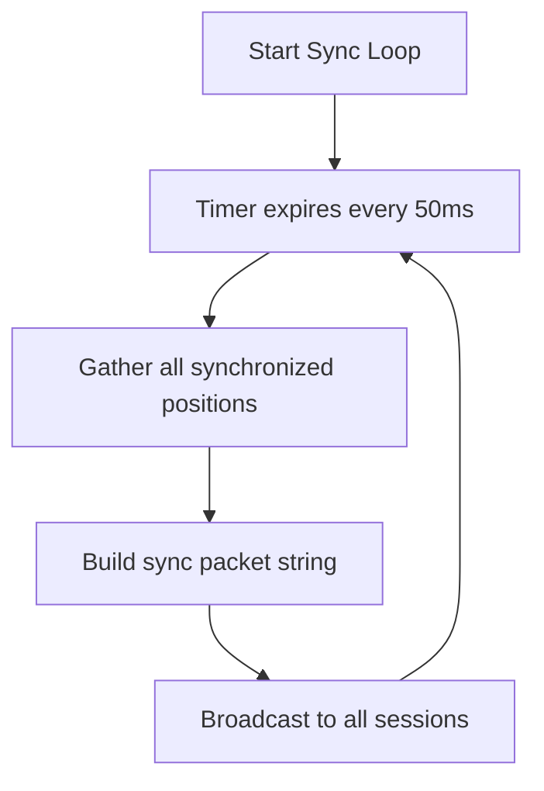
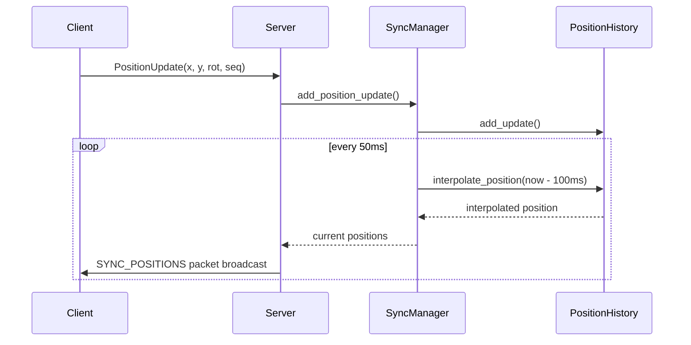

# workingBooks  

저자: 최흥배, Claude AI   
    
권장 개발 환경
- **IDE**: Visual Studio 2022 (Community 이상)
- **컴파일러**: MSVC v143 (C++20 지원)
- **OS**: Windows 10 이상

-----  
   
# Chapter 20. MMO 게임 서버 구현
MMO(Massively Multiplayer Online) 게임은 수천 명의 플레이어가 동시에 접속하여 하나의 가상 세계에서 상호작용하는 복잡한 시스템이다. 이번 장에서는 지금까지 학습한 Boost.Asio의 모든 기술을 종합하여 실제 MMO 게임 서버를 구현해보겠다. 확장 가능한 아키텍처 설계부터 실시간 동기화까지 MMO 게임 서버의 핵심 요소들을 다루어보겠다.

## 20.1 MMO 서버 아키텍처 설계

### 20.1.1 분산 서버 아키텍처
MMO 게임 서버는 단일 서버로는 수천 명의 동시 접속자를 처리하기 어렵다. 따라서 여러 서버로 역할을 분담하는 분산 아키텍처를 설계해야 한다.

```cpp
#include <boost/asio.hpp>
#include <boost/beast.hpp>
#include <boost/json.hpp>
#include <unordered_map>
#include <memory>
#include <vector>
#include <atomic>
#include <thread>

// 서버 타입 정의
enum class ServerType {
    LOGIN_SERVER,       // 로그인 처리
    WORLD_SERVER,       // 월드 관리
    ZONE_SERVER,        // 존별 게임 로직
    CHAT_SERVER,        // 채팅 시스템
    DATABASE_SERVER,    // 데이터베이스 프록시
    MASTER_SERVER       // 서버 관리
};

// 서버 정보 구조체
struct ServerInfo {
    uint32_t server_id;
    ServerType type;
    std::string host;
    uint16_t port;
    uint32_t current_load;
    uint32_t max_capacity;
    bool is_active;
    std::chrono::steady_clock::time_point last_heartbeat;
    
    ServerInfo() : server_id(0), type(ServerType::WORLD_SERVER), 
                   port(0), current_load(0), max_capacity(1000), 
                   is_active(false) {}
    
    ServerInfo(uint32_t id, ServerType t, const std::string& h, uint16_t p, uint32_t cap)
        : server_id(id), type(t), host(h), port(p), 
          current_load(0), max_capacity(cap), is_active(true),
          last_heartbeat(std::chrono::steady_clock::now()) {}
    
    double load_percentage() const {
        return max_capacity > 0 ? static_cast<double>(current_load) / max_capacity * 100.0 : 0.0;
    }
    
    bool is_available() const {
        return is_active && current_load < max_capacity;
    }
};

// 마스터 서버 - 전체 서버 관리
class MasterServer {
private:
    boost::asio::io_context io_context_;
    boost::asio::ip::tcp::acceptor acceptor_;
    boost::asio::steady_timer heartbeat_timer_;
    
    std::unordered_map<uint32_t, ServerInfo> servers_;
    std::mutex servers_mutex_;
    std::atomic<uint32_t> next_server_id_;
    
    std::chrono::seconds heartbeat_timeout_{30};
    
public:
    MasterServer(uint16_t port) 
        : acceptor_(io_context_, boost::asio::ip::tcp::endpoint(
              boost::asio::ip::tcp::v4(), port)),
          heartbeat_timer_(io_context_),
          next_server_id_(1) {
        
        start_accept();
        start_heartbeat_check();
    }
    
    void run() {
        // 여러 스레드에서 IO 처리
        std::vector<std::thread> threads;
        for (int i = 0; i < std::thread::hardware_concurrency(); ++i) {
            threads.emplace_back([this]() {
                io_context_.run();
            });
        }
        
        for (auto& t : threads) {
            t.join();
        }
    }
    
    uint32_t register_server(ServerType type, const std::string& host, 
                            uint16_t port, uint32_t capacity) {
        std::lock_guard<std::mutex> lock(servers_mutex_);
        
        uint32_t server_id = next_server_id_++;
        servers_[server_id] = ServerInfo(server_id, type, host, port, capacity);
        
        std::cout << "Server registered: ID=" << server_id 
                  << ", Type=" << static_cast<int>(type)
                  << ", Host=" << host << ":" << port << std::endl;
        
        return server_id;
    }
    
    std::vector<ServerInfo> get_servers_by_type(ServerType type) {
        std::lock_guard<std::mutex> lock(servers_mutex_);
        
        std::vector<ServerInfo> result;
        for (const auto& pair : servers_) {
            if (pair.second.type == type && pair.second.is_available()) {
                result.push_back(pair.second);
            }
        }
        
        // 부하가 낮은 순으로 정렬
        std::sort(result.begin(), result.end(), 
                  [](const ServerInfo& a, const ServerInfo& b) {
                      return a.load_percentage() < b.load_percentage();
                  });
        
        return result;
    }
    
    void update_server_load(uint32_t server_id, uint32_t current_load) {
        std::lock_guard<std::mutex> lock(servers_mutex_);
        
        auto it = servers_.find(server_id);
        if (it != servers_.end()) {
            it->second.current_load = current_load;
            it->second.last_heartbeat = std::chrono::steady_clock::now();
        }
    }
    
private:
    void start_accept() {
        auto socket = std::make_shared<boost::asio::ip::tcp::socket>(io_context_);
        
        acceptor_.async_accept(*socket,
            [this, socket](boost::system::error_code ec) {
                if (!ec) {
                    auto session = std::make_shared<MasterServerSession>(
                        std::move(*socket), *this);
                    session->start();
                }
                start_accept();
            });
    }
    
    void start_heartbeat_check() {
        heartbeat_timer_.expires_after(heartbeat_timeout_);
        heartbeat_timer_.async_wait([this](boost::system::error_code ec) {
            if (!ec) {
                check_server_health();
                start_heartbeat_check();
            }
        });
    }
    
    void check_server_health() {
        std::lock_guard<std::mutex> lock(servers_mutex_);
        auto now = std::chrono::steady_clock::now();
        
        for (auto it = servers_.begin(); it != servers_.end();) {
            if (now - it->second.last_heartbeat > heartbeat_timeout_) {
                std::cout << "Server timeout: ID=" << it->second.server_id << std::endl;
                it->second.is_active = false;
                ++it;
            } else {
                ++it;
            }
        }
    }
};

// 마스터 서버와의 통신 세션
class MasterServerSession : public std::enable_shared_from_this<MasterServerSession> {
private:
    boost::asio::ip::tcp::socket socket_;
    MasterServer& master_server_;
    boost::beast::flat_buffer buffer_;
    
public:
    MasterServerSession(boost::asio::ip::tcp::socket socket, MasterServer& master)
        : socket_(std::move(socket)), master_server_(master) {}
    
    void start() {
        do_read();
    }
    
private:
    void do_read() {
        boost::beast::http::async_read(socket_, buffer_, request_,
            [self = shared_from_this()](boost::beast::error_code ec, std::size_t) {
                if (!ec) {
                    self->handle_request();
                }
            });
    }
    
    boost::beast::http::request<boost::beast::http::string_body> request_;
    boost::beast::http::response<boost::beast::http::string_body> response_;
    
    void handle_request() {
        response_.version(request_.version());
        response_.keep_alive(false);
        
        if (request_.method() == boost::beast::http::verb::post) {
            if (request_.target() == "/register") {
                handle_server_registration();
            } else if (request_.target() == "/heartbeat") {
                handle_heartbeat();
            } else if (request_.target() == "/query") {
                handle_server_query();
            }
        }
        
        send_response();
    }
    
    void handle_server_registration() {
        try {
            auto json_data = boost::json::parse(request_.body());
            
            ServerType type = static_cast<ServerType>(json_data.at("type").as_int64());
            std::string host = json_data.at("host").as_string().c_str();
            uint16_t port = static_cast<uint16_t>(json_data.at("port").as_int64());
            uint32_t capacity = static_cast<uint32_t>(json_data.at("capacity").as_int64());
            
            uint32_t server_id = master_server_.register_server(type, host, port, capacity);
            
            boost::json::object result;
            result["server_id"] = server_id;
            result["status"] = "success";
            
            response_.result(boost::beast::http::status::ok);
            response_.body() = boost::json::serialize(result);
            
        } catch (const std::exception& e) {
            boost::json::object error;
            error["status"] = "error";
            error["message"] = e.what();
            
            response_.result(boost::beast::http::status::bad_request);
            response_.body() = boost::json::serialize(error);
        }
    }
    
    void handle_heartbeat() {
        try {
            auto json_data = boost::json::parse(request_.body());
            
            uint32_t server_id = static_cast<uint32_t>(json_data.at("server_id").as_int64());
            uint32_t current_load = static_cast<uint32_t>(json_data.at("current_load").as_int64());
            
            master_server_.update_server_load(server_id, current_load);
            
            boost::json::object result;
            result["status"] = "ok";
            
            response_.result(boost::beast::http::status::ok);
            response_.body() = boost::json::serialize(result);
            
        } catch (const std::exception& e) {
            response_.result(boost::beast::http::status::bad_request);
        }
    }
    
    void handle_server_query() {
        try {
            auto json_data = boost::json::parse(request_.body());
            ServerType type = static_cast<ServerType>(json_data.at("type").as_int64());
            
            auto servers = master_server_.get_servers_by_type(type);
            
            boost::json::array server_list;
            for (const auto& server : servers) {
                boost::json::object server_obj;
                server_obj["server_id"] = server.server_id;
                server_obj["host"] = server.host;
                server_obj["port"] = server.port;
                server_obj["load"] = server.load_percentage();
                server_list.push_back(server_obj);
            }
            
            boost::json::object result;
            result["servers"] = server_list;
            
            response_.result(boost::beast::http::status::ok);
            response_.body() = boost::json::serialize(result);
            
        } catch (const std::exception& e) {
            response_.result(boost::beast::http::status::bad_request);
        }
    }
    
    void send_response() {
        response_.set(boost::beast::http::field::content_type, "application/json");
        response_.content_length(response_.body().size());
        
        boost::beast::http::async_write(socket_, response_,
            [self = shared_from_this()](boost::beast::error_code ec, std::size_t) {
                self->socket_.shutdown(boost::asio::ip::tcp::socket::shutdown_send, ec);
            });
    }
};
```

### 20.1.2 로드 밸런싱과 서버 선택
클라이언트가 접속할 최적의 서버를 선택하는 로드 밸런싱 시스템을 구현해보겠다.

```cpp
#include <algorithm>
#include <random>

// 로드 밸런싱 전략
enum class LoadBalancingStrategy {
    ROUND_ROBIN,        // 순환 선택
    LEAST_CONNECTIONS,  // 최소 연결
    WEIGHTED_ROUND_ROBIN, // 가중 순환
    RANDOM,            // 랜덤 선택
    GEOGRAPHIC         // 지리적 위치 기반
};

class LoadBalancer {
private:
    LoadBalancingStrategy strategy_;
    std::atomic<size_t> round_robin_index_;
    std::mt19937 random_generator_;
    
public:
    LoadBalancer(LoadBalancingStrategy strategy = LoadBalancingStrategy::LEAST_CONNECTIONS)
        : strategy_(strategy), round_robin_index_(0), random_generator_(std::random_device{}()) {}
    
    ServerInfo select_server(const std::vector<ServerInfo>& servers, 
                            const std::string& client_region = "") {
        if (servers.empty()) {
            throw std::runtime_error("No available servers");
        }
        
        switch (strategy_) {
            case LoadBalancingStrategy::ROUND_ROBIN:
                return select_round_robin(servers);
            case LoadBalancingStrategy::LEAST_CONNECTIONS:
                return select_least_connections(servers);
            case LoadBalancingStrategy::WEIGHTED_ROUND_ROBIN:
                return select_weighted_round_robin(servers);
            case LoadBalancingStrategy::RANDOM:
                return select_random(servers);
            case LoadBalancingStrategy::GEOGRAPHIC:
                return select_geographic(servers, client_region);
            default:
                return select_least_connections(servers);
        }
    }
    
private:
    ServerInfo select_round_robin(const std::vector<ServerInfo>& servers) {
        size_t index = round_robin_index_.fetch_add(1) % servers.size();
        return servers[index];
    }
    
    ServerInfo select_least_connections(const std::vector<ServerInfo>& servers) {
        auto min_load_server = std::min_element(servers.begin(), servers.end(),
            [](const ServerInfo& a, const ServerInfo& b) {
                return a.current_load < b.current_load;
            });
        return *min_load_server;
    }
    
    ServerInfo select_weighted_round_robin(const std::vector<ServerInfo>& servers) {
        // 서버 용량에 따른 가중치 계산
        std::vector<double> weights;
        double total_weight = 0.0;
        
        for (const auto& server : servers) {
            double weight = static_cast<double>(server.max_capacity - server.current_load) / 
                           server.max_capacity;
            weights.push_back(weight);
            total_weight += weight;
        }
        
        if (total_weight <= 0.0) {
            return select_round_robin(servers);
        }
        
        std::uniform_real_distribution<double> dist(0.0, total_weight);
        double random_value = dist(random_generator_);
        
        double accumulated_weight = 0.0;
        for (size_t i = 0; i < servers.size(); ++i) {
            accumulated_weight += weights[i];
            if (random_value <= accumulated_weight) {
                return servers[i];
            }
        }
        
        return servers.back();
    }
    
    ServerInfo select_random(const std::vector<ServerInfo>& servers) {
        std::uniform_int_distribution<size_t> dist(0, servers.size() - 1);
        return servers[dist(random_generator_)];
    }
    
    ServerInfo select_geographic(const std::vector<ServerInfo>& servers, 
                                const std::string& client_region) {
        // 지리적 위치 기반 선택 (간단화된 구현)
        if (client_region.empty()) {
            return select_least_connections(servers);
        }
        
        // 같은 지역의 서버 우선 선택
        for (const auto& server : servers) {
            if (server.host.find(client_region) != std::string::npos) {
                return server;
            }
        }
        
        // 같은 지역 서버가 없으면 최소 부하 서버 선택
        return select_least_connections(servers);
    }
};

// 게이트웨이 서버 - 클라이언트 연결을 적절한 서버로 라우팅
class GatewayServer {
private:
    boost::asio::io_context io_context_;
    boost::asio::ip::tcp::acceptor acceptor_;
    MasterServer& master_server_;
    LoadBalancer load_balancer_;
    
public:
    GatewayServer(uint16_t port, MasterServer& master)
        : acceptor_(io_context_, boost::asio::ip::tcp::endpoint(
              boost::asio::ip::tcp::v4(), port)),
          master_server_(master) {
        start_accept();
    }
    
    void run() {
        io_context_.run();
    }
    
private:
    void start_accept() {
        auto socket = std::make_shared<boost::asio::ip::tcp::socket>(io_context_);
        
        acceptor_.async_accept(*socket,
            [this, socket](boost::system::error_code ec) {
                if (!ec) {
                    handle_client_connection(socket);
                }
                start_accept();
            });
    }
    
    void handle_client_connection(std::shared_ptr<boost::asio::ip::tcp::socket> client_socket) {
        // 클라이언트의 요청 타입에 따라 적절한 서버 선택
        auto buffer = std::make_shared<boost::asio::streambuf>();
        
        boost::asio::async_read_until(*client_socket, *buffer, '\n',
            [this, client_socket, buffer](boost::system::error_code ec, std::size_t) {
                if (!ec) {
                    std::istream stream(buffer.get());
                    std::string request_line;
                    std::getline(stream, request_line);
                    
                    this->route_client(client_socket, request_line);
                }
            });
    }
    
    void route_client(std::shared_ptr<boost::asio::ip::tcp::socket> client_socket,
                     const std::string& request) {
        try {
            ServerType target_type = determine_server_type(request);
            auto servers = master_server_.get_servers_by_type(target_type);
            
            if (servers.empty()) {
                send_error_response(client_socket, "No available servers");
                return;
            }
            
            ServerInfo selected_server = load_balancer_.select_server(servers);
            
            // 클라이언트에게 선택된 서버 정보 전송
            std::string response = "REDIRECT " + selected_server.host + " " + 
                                 std::to_string(selected_server.port) + "\n";
            
            boost::asio::async_write(*client_socket, boost::asio::buffer(response),
                [client_socket](boost::system::error_code ec, std::size_t) {
                    if (!ec) {
                        client_socket->close();
                    }
                });
                
        } catch (const std::exception& e) {
            send_error_response(client_socket, e.what());
        }
    }
    
    ServerType determine_server_type(const std::string& request) {
        if (request.find("LOGIN") != std::string::npos) {
            return ServerType::LOGIN_SERVER;
        } else if (request.find("WORLD") != std::string::npos) {
            return ServerType::WORLD_SERVER;
        } else if (request.find("ZONE") != std::string::npos) {
            return ServerType::ZONE_SERVER;
        } else if (request.find("CHAT") != std::string::npos) {
            return ServerType::CHAT_SERVER;
        }
        
        return ServerType::WORLD_SERVER;  // 기본값
    }
    
    void send_error_response(std::shared_ptr<boost::asio::ip::tcp::socket> client_socket,
                           const std::string& error_message) {
        std::string response = "ERROR " + error_message + "\n";
        boost::asio::async_write(*client_socket, boost::asio::buffer(response),
            [client_socket](boost::system::error_code ec, std::size_t) {
                client_socket->close();
            });
    }
};
```

## 20.2 존 시스템과 플레이어 관리

### 20.2.1 월드 분할과 존 관리
대규모 게임 월드를 효율적으로 관리하기 위해 존(Zone) 시스템을 구현해보겠다.

```cpp
#include <boost/asio.hpp>
#include <boost/geometry.hpp>
#include <boost/geometry/geometries/point.hpp>
#include <boost/geometry/geometries/box.hpp>
#include <unordered_map>
#include <unordered_set>
#include <memory>
#include <mutex>

namespace bg = boost::geometry;
using Point = bg::model::point<float, 2, bg::cs::cartesian>;
using Box = bg::model::box<Point>;

// 게임 오브젝트 기본 클래스
class GameObject {
protected:
    uint64_t object_id_;
    Point position_;
    float rotation_;
    std::chrono::steady_clock::time_point last_update_;
    
public:
    GameObject(uint64_t id, float x, float y) 
        : object_id_(id), position_(x, y), rotation_(0.0f),
          last_update_(std::chrono::steady_clock::now()) {}
    
    virtual ~GameObject() = default;
    
    uint64_t get_id() const { return object_id_; }
    const Point& get_position() const { return position_; }
    float get_x() const { return bg::get<0>(position_); }
    float get_y() const { return bg::get<1>(position_); }
    float get_rotation() const { return rotation_; }
    
    virtual void set_position(float x, float y) {
        bg::set<0>(position_, x);
        bg::set<1>(position_, y);
        last_update_ = std::chrono::steady_clock::now();
    }
    
    void set_rotation(float rotation) { 
        rotation_ = rotation; 
        last_update_ = std::chrono::steady_clock::now();
    }
    
    virtual std::string serialize() const = 0;
    virtual void update(float delta_time) {}
    
    std::chrono::steady_clock::time_point get_last_update() const { 
        return last_update_; 
    }
};

// 플레이어 클래스
class Player : public GameObject {
private:
    std::string username_;
    uint32_t level_;
    uint32_t health_;
    uint32_t max_health_;
    uint32_t mana_;
    uint32_t max_mana_;
    float move_speed_;
    uint32_t zone_id_;
    
    // 플레이어 상태
    bool is_online_;
    bool is_moving_;
    Point target_position_;
    std::chrono::steady_clock::time_point move_start_time_;
    
public:
    Player(uint64_t id, const std::string& username, float x, float y)
        : GameObject(id, x, y), username_(username), level_(1), 
          health_(100), max_health_(100), mana_(50), max_mana_(50),
          move_speed_(5.0f), zone_id_(0), is_online_(true), is_moving_(false) {}
    
    // Getter/Setter 메서드들
    const std::string& get_username() const { return username_; }
    uint32_t get_level() const { return level_; }
    uint32_t get_health() const { return health_; }
    uint32_t get_max_health() const { return max_health_; }
    uint32_t get_zone_id() const { return zone_id_; }
    void set_zone_id(uint32_t zone_id) { zone_id_ = zone_id; }
    
    bool is_online() const { return is_online_; }
    void set_online(bool online) { is_online_ = online; }
    
    // 이동 관련 메서드
    void start_move_to(float target_x, float target_y) {
        bg::set<0>(target_position_, target_x);
        bg::set<1>(target_position_, target_y);
        is_moving_ = true;
        move_start_time_ = std::chrono::steady_clock::now();
    }
    
    void stop_move() {
        is_moving_ = false;
    }
    
    void update(float delta_time) override {
        if (is_moving_) {
            update_movement(delta_time);
        }
    }
    
    std::string serialize() const override {
        std::ostringstream oss;
        oss << "PLAYER:" << object_id_ << ":" << username_ << ":"
            << get_x() << ":" << get_y() << ":" << rotation_ << ":"
            << level_ << ":" << health_ << ":" << max_health_ << ":"
            << zone_id_ << ":" << (is_online_ ? 1 : 0);
        return oss.str();
    }
    
private:
    void update_movement(float delta_time) {
        float dx = bg::get<0>(target_position_) - get_x();
        float dy = bg::get<1>(target_position_) - get_y();
        float distance = std::sqrt(dx * dx + dy * dy);
        
        if (distance < 0.1f) {
            // 목표 지점 도달
            set_position(bg::get<0>(target_position_), bg::get<1>(target_position_));
            is_moving_ = false;
            return;
        }
        
        // 정규화된 방향 벡터
        float norm_x = dx / distance;
        float norm_y = dy / distance;
        
        // 이동 거리 계산
        float move_distance = move_speed_ * delta_time;
        if (move_distance > distance) {
            move_distance = distance;
        }
        
        // 새로운 위치 설정
        float new_x = get_x() + norm_x * move_distance;
        float new_y = get_y() + norm_y * move_distance;
        set_position(new_x, new_y);
        
        // 회전 각도 업데이트
        set_rotation(std::atan2(dy, dx));
    }
};

// NPC 클래스
class NPC : public GameObject {
private:
    std::string npc_type_;
    uint32_t level_;
    uint32_t health_;
    std::vector<Point> patrol_points_;
    size_t current_patrol_index_;
    bool is_patrolling_;
    
public:
    NPC(uint64_t id, const std::string& type, float x, float y)
        : GameObject(id, x, y), npc_type_(type), level_(1), health_(100),
          current_patrol_index_(0), is_patrolling_(false) {}
    
    void add_patrol_point(float x, float y) {
        patrol_points_.emplace_back(x, y);
    }
    
    void start_patrol() {
        if (!patrol_points_.empty()) {
            is_patrolling_ = true;
            current_patrol_index_ = 0;
        }
    }
    
    void stop_patrol() {
        is_patrolling_ = false;
    }
    
    void update(float delta_time) override {
        if (is_patrolling_ && !patrol_points_.empty()) {
            update_patrol(delta_time);
        }
    }
    
    std::string serialize() const override {
        std::ostringstream oss;
        oss << "NPC:" << object_id_ << ":" << npc_type_ << ":"
            << get_x() << ":" << get_y() << ":" << rotation_ << ":"
            << level_ << ":" << health_;
        return oss.str();
    }
    
private:
    void update_patrol(float delta_time) {
        const Point& target = patrol_points_[current_patrol_index_];
        float dx = bg::get<0>(target) - get_x();
        float dy = bg::get<1>(target) - get_y();
        float distance = std::sqrt(dx * dx + dy * dy);
        
        if (distance < 1.0f) {
            // 다음 패트롤 지점으로 이동
            current_patrol_index_ = (current_patrol_index_ + 1) % patrol_points_.size();
            return;
        }
        
        // NPC 이동 (플레이어보다 느림)
        float move_speed = 2.0f;
        float norm_x = dx / distance;
        float norm_y = dy / distance;
        float move_distance = move_speed * delta_time;
        
        if (move_distance > distance) {
            move_distance = distance;
        }
        
        float new_x = get_x() + norm_x * move_distance;
        float new_y = get_y() + norm_y * move_distance;
        set_position(new_x, new_y);
        set_rotation(std::atan2(dy, dx));
    }
};

// 존 클래스
class Zone {
private:
    uint32_t zone_id_;
    std::string zone_name_;
    Box zone_bounds_;
    
    std::unordered_map<uint64_t, std::shared_ptr<Player>> players_;
    std::unordered_map<uint64_t, std::shared_ptr<NPC>> npcs_;
    std::unordered_map<uint64_t, std::shared_ptr<GameObject>> objects_;
    
    mutable std::shared_mutex zone_mutex_;
    
    // 존 업데이트 관련
    boost::asio::io_context* io_context_;
    boost::asio::steady_timer update_timer_;
    std::chrono::milliseconds update_interval_{50};  // 20 FPS
    
public:
    Zone(uint32_t id, const std::string& name, const Box& bounds, 
         boost::asio::io_context* io_context)
        : zone_id_(id), zone_name_(name), zone_bounds_(bounds),
          io_context_(io_context), update_timer_(*io_context) {
        start_update_loop();
    }
    
    uint32_t get_id() const { return zone_id_; }
    const std::string& get_name() const { return zone_name_; }
    const Box& get_bounds() const { return zone_bounds_; }
    
    bool contains_point(const Point& point) const {
        return bg::within(point, zone_bounds_);
    }
    
    // 플레이어 관리
    bool add_player(std::shared_ptr<Player> player) {
        if (!contains_point(player->get_position())) {
            return false;
        }
        
        std::unique_lock<std::shared_mutex> lock(zone_mutex_);
        players_[player->get_id()] = player;
        player->set_zone_id(zone_id_);
        
        std::cout << "Player " << player->get_username() 
                  << " entered zone " << zone_name_ << std::endl;
        return true;
    }
    
    void remove_player(uint64_t player_id) {
        std::unique_lock<std::shared_mutex> lock(zone_mutex_);
        auto it = players_.find(player_id);
        if (it != players_.end()) {
            std::cout << "Player " << it->second->get_username() 
                      << " left zone " << zone_name_ << std::endl;
            players_.erase(it);
        }
    }
    
    std::shared_ptr<Player> get_player(uint64_t player_id) const {
        std::shared_lock<std::shared_mutex> lock(zone_mutex_);
        auto it = players_.find(player_id);
        return (it != players_.end()) ? it->second : nullptr;
    }
    
    std::vector<std::shared_ptr<Player>> get_players_in_range(
        const Point& center, float range) const {
        
        std::shared_lock<std::shared_mutex> lock(zone_mutex_);
        std::vector<std::shared_ptr<Player>> result;
        
        for (const auto& pair : players_) {
            float distance = bg::distance(center, pair.second->get_position());
            if (distance <= range) {
                result.push_back(pair.second);
            }
        }
        
        return result;
    }
    
    // NPC 관리
    void add_npc(std::shared_ptr<NPC> npc) {
        std::unique_lock<std::shared_mutex> lock(zone_mutex_);
        npcs_[npc->get_id()] = npc;
    }
    
    void remove_npc(uint64_t npc_id) {
        std::unique_lock<std::shared_mutex> lock(zone_mutex_);
        npcs_.erase(npc_id);
    }
    
    std::vector<std::shared_ptr<NPC>> get_npcs_in_range(
        const Point& center, float range) const {
        
        std::shared_lock<std::shared_mutex> lock(zone_mutex_);
        std::vector<std::shared_ptr<NPC>> result;
        
        for (const auto& pair : npcs_) {
            float distance = bg::distance(center, pair.second->get_position());
            if (distance <= range) {
                result.push_back(pair.second);
            }
        }
        
        return result;
    }
    
    // 존 정보 조회
    size_t get_player_count() const {
        std::shared_lock<std::shared_mutex> lock(zone_mutex_);
        return players_.size();
    }
    
    size_t get_npc_count() const {
        std::shared_lock<std::shared_mutex> lock(zone_mutex_);
        return npcs_.size();
    }
    
    std::vector<std::string> get_zone_snapshot() const {
        std::shared_lock<std::shared_mutex> lock(zone_mutex_);
        std::vector<std::string> snapshot;
        
        for (const auto& pair : players_) {
            snapshot.push_back(pair.second->serialize());
        }
        
        for (const auto& pair : npcs_) {
            snapshot.push_back(pair.second->serialize());
        }
        
        for (const auto& pair : objects_) {
            snapshot.push_back(pair.second->serialize());
        }
        
        return snapshot;
    }
    
private:
    void start_update_loop() {
        update_timer_.expires_after(update_interval_);
        update_timer_.async_wait([this](boost::system::error_code ec) {
            if (!ec) {
                update_zone();
                start_update_loop();
            }
        });
    }
    
    void update_zone() {
        auto now = std::chrono::steady_clock::now();
        static auto last_update = now;
        
        float delta_time = std::chrono::duration<float>(now - last_update).count();
        last_update = now;
        
        std::shared_lock<std::shared_mutex> lock(zone_mutex_);
        
        // 플레이어 업데이트
        for (auto& pair : players_) {
            pair.second->update(delta_time);
            
            // 존 경계를 벗어났는지 확인
            if (!contains_point(pair.second->get_position())) {
                // 다른 존으로 이동 처리 필요
                std::cout << "Player " << pair.second->get_username() 
                          << " moved out of zone " << zone_name_ << std::endl;
            }
        }
        
        // NPC 업데이트
        for (auto& pair : npcs_) {
            pair.second->update(delta_time);
        }
        
        // 게임 오브젝트 업데이트
        for (auto& pair : objects_) {
            pair.second->update(delta_time);
        }
    }
};
```

### 20.2.2 플레이어 세션 관리
플레이어의 연결 상태와 게임 세션을 관리하는 시스템을 구현해보겠다.

```cpp
#include <boost/asio.hpp>
#include <boost/uuid/uuid.hpp>
#include <boost/uuid/uuid_generators.hpp>
#include <boost/uuid/uuid_io.hpp>

// 플레이어 세션 클래스
class PlayerSession : public std::enable_shared_from_this<PlayerSession> {
private:
    boost::asio::ip::tcp::socket socket_;
    std::shared_ptr<Player> player_;
    std::shared_ptr<Zone> current_zone_;
    
    std::array<char, 1024> recv_buffer_;
    std::queue<std::string> send_queue_;
    std::mutex send_mutex_;
    bool is_sending_;
    
    // 세션 관리
    std::string session_id_;
    std::chrono::steady_clock::time_point last_activity_;
    std::chrono::seconds timeout_duration_{300};  // 5분
    
    // 패킷 처리
    std::string packet_buffer_;
    
public:
    PlayerSession(boost::asio::ip::tcp::socket socket, 
                 std::shared_ptr<Player> player)
        : socket_(std::move(socket)), player_(player), is_sending_(false) {
        
        // 세션 ID 생성
        boost::uuids::random_generator gen;
        session_id_ = boost::uuids::to_string(gen());
        last_activity_ = std::chrono::steady_clock::now();
        
        std::cout << "Player session created: " << player_->get_username() 
                  << " (ID: " << session_id_ << ")" << std::endl;
    }
    
    ~PlayerSession() {
        std::cout << "Player session destroyed: " << player_->get_username() << std::endl;
    }
    
    void start() {
        // 플레이어를 온라인 상태로 설정
        player_->set_online(true);
        
        // 환영 메시지 전송
        send_packet("WELCOME " + session_id_);
        
        // 현재 존 정보 전송
        if (current_zone_) {
            send_zone_info();
        }
        
        // 수신 대기 시작
        do_read();
    }
    
    void set_zone(std::shared_ptr<Zone> zone) {
        if (current_zone_) {
            current_zone_->remove_player(player_->get_id());
        }
        
        current_zone_ = zone;
        if (current_zone_) {
            current_zone_->add_player(player_);
            send_zone_info();
        }
    }
    
    void send_packet(const std::string& packet) {
        std::lock_guard<std::mutex> lock(send_mutex_);
        send_queue_.push(packet + "\n");
        
        if (!is_sending_) {
            do_send();
        }
    }
    
    void disconnect() {
        if (socket_.is_open()) {
            // 플레이어를 오프라인 상태로 설정
            player_->set_online(false);
            
            // 존에서 제거
            if (current_zone_) {
                current_zone_->remove_player(player_->get_id());
            }
            
            boost::system::error_code ec;
            socket_.shutdown(boost::asio::ip::tcp::socket::shutdown_both, ec);
            socket_.close();
        }
    }
    
    bool is_timed_out() const {
        auto now = std::chrono::steady_clock::now();
        return now - last_activity_ > timeout_duration_;
    }
    
    const std::string& get_session_id() const { return session_id_; }
    std::shared_ptr<Player> get_player() const { return player_; }
    std::shared_ptr<Zone> get_zone() const { return current_zone_; }
    
private:
    void do_read() {
        socket_.async_read_some(boost::asio::buffer(recv_buffer_),
            [self = shared_from_this()](boost::system::error_code ec, std::size_t length) {
                if (!ec) {
                    self->handle_receive(self->recv_buffer_.data(), length);
                    self->do_read();
                } else {
                    self->disconnect();
                }
            });
    }
    
    void handle_receive(const char* data, std::size_t length) {
        last_activity_ = std::chrono::steady_clock::now();
        
        // 패킷 버퍼에 데이터 추가
        packet_buffer_.append(data, length);
        
        // 완성된 패킷 처리 (개행 문자로 구분)
        size_t pos;
        while ((pos = packet_buffer_.find('\n')) != std::string::npos) {
            std::string packet = packet_buffer_.substr(0, pos);
            packet_buffer_.erase(0, pos + 1);
            
            if (!packet.empty()) {
                process_packet(packet);
            }
        }
    }
    
    void process_packet(const std::string& packet) {
        std::istringstream iss(packet);
        std::string command;
        iss >> command;
        
        try {
            if (command == "MOVE") {
                handle_move_command(iss);
            } else if (command == "CHAT") {
                handle_chat_command(iss);
            } else if (command == "ATTACK") {
                handle_attack_command(iss);
            } else if (command == "USE_ITEM") {
                handle_use_item_command(iss);
            } else if (command == "PING") {
                send_packet("PONG");
            } else {
                std::cout << "Unknown command: " << command << std::endl;
            }
        } catch (const std::exception& e) {
            std::cout << "Error processing packet: " << e.what() << std::endl;
            send_packet("ERROR " + std::string(e.what()));
        }
    }
    
    void handle_move_command(std::istringstream& iss) {
        float target_x, target_y;
        if (!(iss >> target_x >> target_y)) {
            throw std::invalid_argument("Invalid move command format");
        }
        
        // 이동 유효성 검증
        if (current_zone_) {
            Point target_point(target_x, target_y);
            if (!current_zone_->contains_point(target_point)) {
                throw std::invalid_argument("Target position out of zone bounds");
            }
        }
        
        // 플레이어 이동 시작
        player_->start_move_to(target_x, target_y);
        
        // 주변 플레이어들에게 이동 정보 브로드캐스트
        broadcast_to_nearby_players("PLAYER_MOVE " + std::to_string(player_->get_id()) + 
                                   " " + std::to_string(target_x) + " " + std::to_string(target_y));
        
        std::cout << "Player " << player_->get_username() 
                  << " moving to (" << target_x << ", " << target_y << ")" << std::endl;
    }
    
    void handle_chat_command(std::istringstream& iss) {
        std::string message;
        std::getline(iss, message);
        
        if (message.empty()) {
            throw std::invalid_argument("Empty chat message");
        }
        
        // 메시지 길이 제한
        if (message.length() > 256) {
            message = message.substr(0, 256);
        }
        
        // 주변 플레이어들에게 채팅 메시지 브로드캐스트
        std::string chat_packet = "CHAT " + player_->get_username() + " " + message;
        broadcast_to_nearby_players(chat_packet);
        
        std::cout << "Chat from " << player_->get_username() << ": " << message << std::endl;
    }
    
    void handle_attack_command(std::istringstream& iss) {
        uint64_t target_id;
        if (!(iss >> target_id)) {
            throw std::invalid_argument("Invalid attack command format");
        }
        
        // 타겟 유효성 검증 및 공격 처리
        if (current_zone_) {
            auto target_player = current_zone_->get_player(target_id);
            if (target_player) {
                // PvP 공격 처리
                process_player_attack(target_player);
            } else {
                // NPC 공격 처리 (간단화)
                std::cout << "Player " << player_->get_username() 
                          << " attacks NPC " << target_id << std::endl;
            }
        }
    }
    
    void handle_use_item_command(std::istringstream& iss) {
        uint32_t item_id;
        if (!(iss >> item_id)) {
            throw std::invalid_argument("Invalid use item command format");
        }
        
        // 아이템 사용 처리 (간단화)
        std::cout << "Player " << player_->get_username() 
                  << " uses item " << item_id << std::endl;
        
        send_packet("ITEM_USED " + std::to_string(item_id));
    }
    
    void process_player_attack(std::shared_ptr<Player> target) {
        // 거리 검증
        float distance = bg::distance(player_->get_position(), target->get_position());
        if (distance > 10.0f) {  // 최대 공격 거리
            send_packet("ERROR Target too far");
            return;
        }
        
        // 공격 데미지 계산 (간단화)
        uint32_t damage = 10 + (player_->get_level() * 2);
        
        std::cout << "Player " << player_->get_username() 
                  << " attacks " << target->get_username() 
                  << " for " << damage << " damage" << std::endl;
        
        // 공격 효과 브로드캐스트
        broadcast_to_nearby_players("ATTACK " + std::to_string(player_->get_id()) + 
                                   " " + std::to_string(target->get_id()) + 
                                   " " + std::to_string(damage));
    }
    
    void broadcast_to_nearby_players(const std::string& message) {
        if (!current_zone_) return;
        
        // 주변 플레이어 검색 (50 단위 반경)
        auto nearby_players = current_zone_->get_players_in_range(
            player_->get_position(), 50.0f);
        
        for (auto& nearby_player : nearby_players) {
            if (nearby_player->get_id() != player_->get_id()) {
                // 해당 플레이어의 세션에 메시지 전송
                // (실제로는 세션 매니저를 통해 전송)
                std::cout << "Broadcasting to " << nearby_player->get_username() 
                          << ": " << message << std::endl;
            }
        }
    }
    
    void send_zone_info() {
        if (!current_zone_) return;
        
        // 존 정보 전송
        send_packet("ZONE_ENTER " + std::to_string(current_zone_->get_id()) + 
                   " " + current_zone_->get_name());
        
        // 존 내 다른 플레이어 정보 전송
        auto players = current_zone_->get_players_in_range(
            player_->get_position(), 100.0f);
        
        for (auto& other_player : players) {
            if (other_player->get_id() != player_->get_id()) {
                send_packet("PLAYER_INFO " + other_player->serialize());
            }
        }
        
        // 존 내 NPC 정보 전송
        auto npcs = current_zone_->get_npcs_in_range(
            player_->get_position(), 100.0f);
        
        for (auto& npc : npcs) {
            send_packet("NPC_INFO " + npc->serialize());
        }
    }
    
    void do_send() {
        if (send_queue_.empty()) {
            is_sending_ = false;
            return;
        }
        
        is_sending_ = true;
        std::string packet = send_queue_.front();
        send_queue_.pop();
        
        auto buffer = std::make_shared<std::string>(std::move(packet));
        
        boost::asio::async_write(socket_, boost::asio::buffer(*buffer),
            [self = shared_from_this(), buffer](boost::system::error_code ec, std::size_t) {
                std::lock_guard<std::mutex> lock(self->send_mutex_);
                if (!ec) {
                    self->do_send();
                } else {
                    self->is_sending_ = false;
                    self->disconnect();
                }
            });
    }
};

// 세션 매니저
class SessionManager {
private:
    std::unordered_map<std::string, std::shared_ptr<PlayerSession>> sessions_;
    std::unordered_map<uint64_t, std::shared_ptr<PlayerSession>> player_sessions_;
    std::shared_mutex sessions_mutex_;
    
    boost::asio::steady_timer cleanup_timer_;
    
public:
    SessionManager(boost::asio::io_context& io_context) 
        : cleanup_timer_(io_context) {
        start_cleanup_timer();
    }
    
    void add_session(std::shared_ptr<PlayerSession> session) {
        std::unique_lock<std::shared_mutex> lock(sessions_mutex_);
        
        const std::string& session_id = session->get_session_id();
        uint64_t player_id = session->get_player()->get_id();
        
        sessions_[session_id] = session;
        player_sessions_[player_id] = session;
        
        std::cout << "Session added: " << session_id 
                  << " (Total: " << sessions_.size() << ")" << std::endl;
    }
    
    void remove_session(const std::string& session_id) {
        std::unique_lock<std::shared_mutex> lock(sessions_mutex_);
        
        auto it = sessions_.find(session_id);
        if (it != sessions_.end()) {
            uint64_t player_id = it->second->get_player()->get_id();
            player_sessions_.erase(player_id);
            sessions_.erase(it);
            
            std::cout << "Session removed: " << session_id 
                      << " (Total: " << sessions_.size() << ")" << std::endl;
        }
    }
    
    std::shared_ptr<PlayerSession> get_session(const std::string& session_id) {
        std::shared_lock<std::shared_mutex> lock(sessions_mutex_);
        auto it = sessions_.find(session_id);
        return (it != sessions_.end()) ? it->second : nullptr;
    }
    
    std::shared_ptr<PlayerSession> get_player_session(uint64_t player_id) {
        std::shared_lock<std::shared_mutex> lock(sessions_mutex_);
        auto it = player_sessions_.find(player_id);
        return (it != player_sessions_.end()) ? it->second : nullptr;
    }
    
    void broadcast_to_all(const std::string& message) {
        std::shared_lock<std::shared_mutex> lock(sessions_mutex_);
        
        for (const auto& pair : sessions_) {
            pair.second->send_packet(message);
        }
    }
    
    size_t get_session_count() const {
        std::shared_lock<std::shared_mutex> lock(sessions_mutex_);
        return sessions_.size();
    }
    
private:
    void start_cleanup_timer() {
        cleanup_timer_.expires_after(std::chrono::minutes(1));
        cleanup_timer_.async_wait([this](boost::system::error_code ec) {
            if (!ec) {
                cleanup_expired_sessions();
                start_cleanup_timer();
            }
        });
    }
    
    void cleanup_expired_sessions() {
        std::unique_lock<std::shared_mutex> lock(sessions_mutex_);
        
        for (auto it = sessions_.begin(); it != sessions_.end();) {
            if (it->second->is_timed_out()) {
                std::cout << "Session timed out: " << it->first << std::endl;
                
                uint64_t player_id = it->second->get_player()->get_id();
                player_sessions_.erase(player_id);
                
                it->second->disconnect();
                it = sessions_.erase(it);
            } else {
                ++it;
            }
        }
    }
};
```

## 20.3 실시간 동기화 구현 - 위치 동기화 시스템
MMO 게임에서 가장 중요한 것 중 하나는 플레이어들의 위치를 실시간으로 동기화하는 것이다.

```cpp
#include <boost/asio.hpp>
#include <chrono>
#include <queue>
#include <algorithm>

// 위치 업데이트 정보
struct PositionUpdate {
    uint64_t object_id;
    float x, y;
    float rotation;
    std::chrono::steady_clock::time_point timestamp;
    uint32_t sequence_number;
    
    PositionUpdate(uint64_t id, float pos_x, float pos_y, float rot, uint32_t seq)
        : object_id(id), x(pos_x), y(pos_y), rotation(rot), 
          timestamp(std::chrono::steady_clock::now()), sequence_number(seq) {}
};

// 예측 및 보간을 위한 위치 히스토리
class PositionHistory {
private:
    std::deque<PositionUpdate> history_;
    static constexpr size_t MAX_HISTORY_SIZE = 10;
    static constexpr std::chrono::milliseconds MAX_HISTORY_TIME{1000};
    
public:
    void add_update(const PositionUpdate& update) {
        // 시퀀스 번호 순서 확인
        if (!history_.empty() && update.sequence_number <= history_.back().sequence_number) {
            // 늦게 도착한 패킷 - 적절한 위치에 삽입
            auto insert_pos = std::upper_bound(history_.begin(), history_.end(), update,
                [](const PositionUpdate& a, const PositionUpdate& b) {
                    return a.sequence_number < b.sequence_number;
                });
            history_.insert(insert_pos, update);
        } else {
            history_.push_back(update);
        }
        
        // 오래된 히스토리 제거
        cleanup_old_history();
        
        // 크기 제한
        if (history_.size() > MAX_HISTORY_SIZE) {
            history_.pop_front();
        }
    }
    
    PositionUpdate interpolate_position(std::chrono::steady_clock::time_point target_time) const {
        if (history_.empty()) {
            throw std::runtime_error("No position history available");
        }
        
        if (history_.size() == 1) {
            return history_.front();
        }
        
        // 타겟 시간에 가장 가까운 두 위치 찾기
        auto it = std::lower_bound(history_.begin(), history_.end(), target_time,
            [](const PositionUpdate& update, std::chrono::steady_clock::time_point time) {
                return update.timestamp < time;
            });
        
        if (it == history_.begin()) {
            return *it;
        }
        
        if (it == history_.end()) {
            return history_.back();
        }
        
        // 선형 보간
        auto prev = it - 1;
        auto next = it;
        
        auto total_time = std::chrono::duration<float>(next->timestamp - prev->timestamp).count();
        auto elapsed_time = std::chrono::duration<float>(target_time - prev->timestamp).count();
        
        if (total_time <= 0.0f) {
            return *prev;
        }
        
        float t = elapsed_time / total_time;
        t = std::clamp(t, 0.0f, 1.0f);
        
        PositionUpdate interpolated = *prev;
        interpolated.x = prev->x + (next->x - prev->x) * t;
        interpolated.y = prev->y + (next->y - prev->y) * t;
        interpolated.rotation = interpolate_angle(prev->rotation, next->rotation, t);
        interpolated.timestamp = target_time;
        
        return interpolated;
    }
    
    PositionUpdate extrapolate_position(std::chrono::steady_clock::time_point target_time) const {
        if (history_.size() < 2) {
            return history_.empty() ? PositionUpdate(0, 0, 0, 0, 0) : history_.back();
        }
        
        const auto& latest = history_.back();
        const auto& previous = history_[history_.size() - 2];
        
        auto time_diff = std::chrono::duration<float>(latest.timestamp - previous.timestamp).count();
        auto extrapolation_time = std::chrono::duration<float>(target_time - latest.timestamp).count();
        
        if (time_diff <= 0.0f) {
            return latest;
        }
        
        // 속도 계산
        float velocity_x = (latest.x - previous.x) / time_diff;
        float velocity_y = (latest.y - previous.y) / time_diff;
        
        // 예측 위치 계산
        PositionUpdate extrapolated = latest;
        extrapolated.x = latest.x + velocity_x * extrapolation_time;
        extrapolated.y = latest.y + velocity_y * extrapolation_time;
        extrapolated.timestamp = target_time;
        
        return extrapolated;
    }
    
private:
    void cleanup_old_history() {
        auto cutoff_time = std::chrono::steady_clock::now() - MAX_HISTORY_TIME;
        
        while (!history_.empty() && history_.front().timestamp < cutoff_time) {
            history_.pop_front();
        }
    }
    
    float interpolate_angle(float from, float to, float t) const {
        // 각도 보간 (최단 경로)
        float diff = to - from;
        if (diff > 180.0f) {
            diff -= 360.0f;
        } else if (diff < -180.0f) {
            diff += 360.0f;
        }
        
        float result = from + diff * t;
        if (result > 360.0f) {
            result -= 360.0f;
        } else if (result < 0.0f) {
            result += 360.0f;
        }
        
        return result;
    }
};

// 동기화 매니저
class SynchronizationManager {
private:
    std::unordered_map<uint64_t, PositionHistory> position_histories_;
    std::unordered_map<uint64_t, uint32_t> last_sequence_numbers_;
    mutable std::shared_mutex sync_mutex_;
    
    // 동기화 설정
    std::chrono::milliseconds interpolation_delay_{100};  // 100ms 지연
    std::chrono::milliseconds extrapolation_limit_{200};  // 200ms까지 예측
    
public:
    void add_position_update(uint64_t object_id, float x, float y, float rotation, uint32_t sequence) {
        std::unique_lock<std::shared_mutex> lock(sync_mutex_);
        
        // 중복 패킷 확인
        auto& last_seq = last_sequence_numbers_[object_id];
        if (sequence <= last_seq) {
            // 이미 처리된 패킷이거나 순서가 잘못된 패킷
            return;
        }
        
        PositionUpdate update(object_id, x, y, rotation, sequence);
        position_histories_[object_id].add_update(update);
        last_sequence_numbers_[object_id] = sequence;
    }
    
    PositionUpdate get_synchronized_position(uint64_t object_id) const {
        std::shared_lock<std::shared_mutex> lock(sync_mutex_);
        
        auto it = position_histories_.find(object_id);
        if (it == position_histories_.end()) {
            throw std::runtime_error("No position history for object");
        }
        
        auto now = std::chrono::steady_clock::now();
        auto target_time = now - interpolation_delay_;
        
        try {
            return it->second.interpolate_position(target_time);
        } catch (const std::exception&) {
            // 보간 실패시 예측 시도
            auto extrapolation_time = now + extrapolation_limit_;
            return it->second.extrapolate_position(extrapolation_time);
        }
    }
    
    std::vector<PositionUpdate> get_all_synchronized_positions() const {
        std::shared_lock<std::shared_mutex> lock(sync_mutex_);
        std::vector<PositionUpdate> result;
        
        for (const auto& pair : position_histories_) {
            try {
                auto position = get_synchronized_position(pair.first);
                result.push_back(position);
            } catch (const std::exception&) {
                // 동기화 실패한 오브젝트는 무시
                continue;
            }
        }
        
        return result;
    }
    
    void cleanup_inactive_objects(std::chrono::milliseconds timeout) {
        std::unique_lock<std::shared_mutex> lock(sync_mutex_);
        auto cutoff_time = std::chrono::steady_clock::now() - timeout;
        
        for (auto it = position_histories_.begin(); it != position_histories_.end();) {
            // 마지막 업데이트 시간 확인 (구현 간소화)
            ++it;  // 실제로는 마지막 업데이트 시간을 확인하여 제거
        }
    }
};

// 실시간 동기화 서비스
class RealtimeSyncService {
private:
    boost::asio::io_context& io_context_;
    SynchronizationManager sync_manager_;
    SessionManager& session_manager_;
    
    boost::asio::steady_timer sync_timer_;
    std::chrono::milliseconds sync_interval_{50};  // 20 FPS
    
public:
    RealtimeSyncService(boost::asio::io_context& io_context, SessionManager& session_mgr)
        : io_context_(io_context), session_manager_(session_mgr), sync_timer_(io_context) {
        start_sync_loop();
    }
    
    void handle_position_update(uint64_t player_id, float x, float y, float rotation, uint32_t sequence) {
        sync_manager_.add_position_update(player_id, x, y, rotation, sequence);
    }
    
private:
    void start_sync_loop() {
        sync_timer_.expires_after(sync_interval_);
        sync_timer_.async_wait([this](boost::system::error_code ec) {
            if (!ec) {
                broadcast_synchronized_positions();
                start_sync_loop();
            }
        });
    }
    
    void broadcast_synchronized_positions() {
        try {
            auto positions = sync_manager_.get_all_synchronized_positions();
            
            // 위치 정보를 패킷으로 만들어 브로드캐스트
            std::ostringstream oss;
            oss << "SYNC_POSITIONS " << positions.size();
            
            for (const auto& pos : positions) {
                oss << " " << pos.object_id << " " << pos.x << " " << pos.y << " " << pos.rotation;
            }
            
            std::string sync_packet = oss.str();
            
            // 모든 활성 세션에 브로드캐스트
            session_manager_.broadcast_to_all(sync_packet);
            
        } catch (const std::exception& e) {
            std::cerr << "Error broadcasting positions: " << e.what() << std::endl;
        }
    }
};
```
   
이 코드는 **MMORPG나 대규모 멀티플레이어 게임에서의 “위치 동기화 시스템(Position Synchronization System)” 구현 예시**다.
서버는 플레이어(또는 객체)의 위치를 실시간으로 관리하고, 네트워크 지연과 패킷 손실에도 부드럽게 보이도록 **보간(interpolation)** 과 **예측(extrapolation)** 을 수행한다.

### 🧩 전체 구조 개요
이 코드는 크게 다음 세 개의 계층으로 구성되어 있다:

```
┌──────────────────────────────────────────────────────────┐
│                    RealtimeSyncService                   │
│  └─ 클라이언트 세션과 통신, 주기적 위치 브로드캐스트 수행        │
├──────────────────────────────────────────────────────────┤
│                 SynchronizationManager                   │
│  └─ 오브젝트별 위치 히스토리 관리 및 보간/예측 수행             │
├──────────────────────────────────────────────────────────┤
│                     PositionHistory                      │
│  └─ 타임스탬프 기반 보간/예측 알고리즘 구현                    │
└──────────────────────────────────────────────────────────┘
```

### 1️⃣ `PositionUpdate` — 위치 업데이트 단위 구조체

```cpp
struct PositionUpdate {
    uint64_t object_id;
    float x, y;
    float rotation;
    std::chrono::steady_clock::time_point timestamp;
    uint32_t sequence_number;
};
```

* **object_id**: 오브젝트(플레이어, NPC 등)의 고유 식별자
* **x, y**: 2D 공간상의 위치 좌표
* **rotation**: 방향 (0~360도)
* **timestamp**: 수신 시각 (steady_clock은 시스템 시간 변경 영향을 받지 않음)
* **sequence_number**: 순서 보장을 위한 패킷 번호

패킷이 네트워크를 통해 **순서가 뒤집혀 도착할 수 있기 때문에** `sequence_number`로 정렬 및 중복 검사를 수행한다.


### 2️⃣ `PositionHistory` — 보간 및 예측을 위한 히스토리 관리

#### 주요 역할

* 과거 `PositionUpdate`를 시간순으로 저장
* 오래된 데이터를 정리
* **보간(interpolation)** 과 **예측(extrapolation)** 으로 부드러운 움직임을 계산

#### 🧱 2.1 업데이트 추가 (`add_update`)

```cpp
void add_update(const PositionUpdate& update)
```

* 시퀀스 번호를 기준으로 순서 삽입
* 늦게 도착한 패킷은 올바른 위치에 삽입 (`std::upper_bound` 사용)
* 오래된 데이터 및 크기 초과 데이터 제거

흐름도로 보면 다음과 같다.

```
[수신된 패킷]
      ↓
[시퀀스 번호 검사]
      ↓
 ┌───────────────┐
 │ 기존 히스토리에 │
 │  올바른 순서로  │
 │   삽입한다     │
 └───────────────┘
      ↓
[오래된 히스토리 제거]
      ↓
[최신 상태 유지]
```

#### 🌈 2.2 위치 보간 (`interpolate_position`)

* 특정 시각(`target_time`)에 해당하는 위치를 **선형 보간(linear interpolation)** 으로 계산한다.

보간 알고리즘 개요  
 
    ```cpp
    auto prev = it - 1;
    auto next = it;
    float t = elapsed_time / total_time;
    interpolated.x = prev->x + (next->x - prev->x) * t;
    ```  
  
이 식은 기본적인 **선형 보간 공식**이다.
즉, 이전 위치와 다음 위치 사이를 시간 비율 `t`에 따라 선형으로 이동시킨다.

회전 보간 (`interpolate_angle`)

* 0도와 360도 사이의 **각도 wrap-around 문제**를 해결하기 위해 최단 회전 방향을 계산한다.
* 예: `350° → 10°` 는 +20° 회전이 아니라 -340°가 아니라 **+20°의 짧은 회전**으로 처리.

    ```
    diff = to - from
    if diff > 180 → diff -= 360
    if diff < -180 → diff += 360
    ```

#### 🚀 2.3 위치 예측 (`extrapolate_position`)

서버로부터 최신 패킷이 일정 시간 동안 오지 않을 경우,
마지막 두 점을 기반으로 **속도 벡터를 추정**해 미래 위치를 예측한다.

```cpp
velocity_x = (latest.x - previous.x) / Δt
velocity_y = (latest.y - previous.y) / Δt

extrapolated.x = latest.x + velocity_x * Δt_extrapolation
```

개념 다이어그램

```
시간축 →
prev ●───────● latest ────▶ (예측된 위치)
       Δt          Δt_extrapolation
```

### 3️⃣ `SynchronizationManager` — 객체 단위 동기화 관리

```cpp
std::unordered_map<uint64_t, PositionHistory> position_histories_;
std::unordered_map<uint64_t, uint32_t> last_sequence_numbers_;
```

* 각 오브젝트 ID별로 **PositionHistory**를 관리
* 중복 패킷(낮은 sequence_number)을 무시
* `interpolation_delay_` (100ms 지연)을 두고 안정된 시점의 위치를 반환

#### ⚙️ 주요 메서드

`add_position_update`

* 새로운 위치 업데이트를 수신하여 히스토리에 추가
* 시퀀스 번호를 통해 **중복 및 역전 패킷 필터링**

`get_synchronized_position`

* 현재 시각보다 약간 이전(`100ms`)의 시각을 기준으로 보간
* 보간 실패 시 예측(extrapolation)으로 대체

`get_all_synchronized_positions`

* 모든 오브젝트의 현재 보간된 위치를 반환


### 4️⃣ `RealtimeSyncService` — 실시간 동기화 서비스 루프

#### 구조

* `boost::asio::steady_timer`로 50ms 간격(20 FPS)으로 위치 동기화 루프 수행
* 모든 오브젝트 위치를 수집 후 `session_manager_`를 통해 **브로드캐스트**

#### 루프 동작 다이어그램



### 🔄 데이터 흐름 요약



### 📘 정리

| 요소                       | 역할            | 주요 포인트              |
| ------------------------ | ------------- | ------------------- |
| `PositionUpdate`         | 위치 데이터 단위     | 타임스탬프 + 시퀀스 번호 포함   |
| `PositionHistory`        | 시간 기반 보간 및 예측 | 선형 보간, 각도 보간, 예측    |
| `SynchronizationManager` | 오브젝트별 위치 관리   | 지연된 보간으로 부드러운 동기화   |
| `RealtimeSyncService`    | 주기적 패킷 브로드캐스트 | 50ms 간격으로 모든 세션에 전송 |

### 💡 핵심 개념 요약

* **보간 (Interpolation)**: 과거 두 점 사이에서 현재 위치를 계산 → 부드러운 이동 구현
* **예측 (Extrapolation)**: 최신 점 이후의 위치를 예상 → 패킷 유실 보완
* **지연 기반 렌더링**: 네트워크 지연을 흡수하기 위해 약간의 렌더링 지연(100ms)을 둔다
* **타임라인 기반 설계**: `steady_clock`으로 일정하고 정확한 시간 관리

---

이 시스템은 실제 MMO 서버에서 **부드럽고 일관된 움직임 동기화**를 구현하기 위한 전형적인 구조이며,
Boost.Asio의 비동기 타이머를 사용하여 **네트워크 이벤트 루프와 자연스럽게 통합**할 수 있도록 설계되어 있다.
  
  
  
## 20.4 실시간 동기화 구현 -  이벤트 동기화
게임 내 이벤트들을 실시간으로 동기화하는 시스템을 구현해보겠다.

```cpp
#include <boost/asio.hpp>
#include <boost/json.hpp>
#include <queue>
#include <functional>

// 게임 이벤트 타입
enum class GameEventType {
    PLAYER_ATTACK,
    PLAYER_DAMAGE,
    PLAYER_DEATH,
    ITEM_PICKUP,
    SKILL_USE,
    CHAT_MESSAGE,
    ZONE_CHANGE,
    QUEST_COMPLETE
};

// 게임 이벤트 기본 클래스
class GameEvent {
protected:
    GameEventType type_;
    uint64_t source_id_;
    std::chrono::steady_clock::time_point timestamp_;
    uint32_t event_id_;
    static std::atomic<uint32_t> next_event_id_;
    
public:
    GameEvent(GameEventType type, uint64_t source_id)
        : type_(type), source_id_(source_id), 
          timestamp_(std::chrono::steady_clock::now()),
          event_id_(next_event_id_++) {}
    
    virtual ~GameEvent() = default;
    
    GameEventType get_type() const { return type_; }
    uint64_t get_source_id() const { return source_id_; }
    uint32_t get_event_id() const { return event_id_; }
    std::chrono::steady_clock::time_point get_timestamp() const { return timestamp_; }
    
    virtual boost::json::object to_json() const = 0;
    virtual std::string serialize() const = 0;
};

std::atomic<uint32_t> GameEvent::next_event_id_{1};

// 공격 이벤트
class AttackEvent : public GameEvent {
private:
    uint64_t target_id_;
    uint32_t damage_;
    float x_, y_;  // 공격 발생 위치
    
public:
    AttackEvent(uint64_t attacker_id, uint64_t target_id, uint32_t damage, float x, float y)
        : GameEvent(GameEventType::PLAYER_ATTACK, attacker_id),
          target_id_(target_id), damage_(damage), x_(x), y_(y) {}
    
    uint64_t get_target_id() const { return target_id_; }
    uint32_t get_damage() const { return damage_; }
    float get_x() const { return x_; }
    float get_y() const { return y_; }
    
    boost::json::object to_json() const override {
        boost::json::object obj;
        obj["type"] = "attack";
        obj["event_id"] = event_id_;
        obj["attacker_id"] = source_id_;
        obj["target_id"] = target_id_;
        obj["damage"] = damage_;
        obj["x"] = x_;
        obj["y"] = y_;
        obj["timestamp"] = std::chrono::duration_cast<std::chrono::milliseconds>(
            timestamp_.time_since_epoch()).count();
        return obj;
    }
    
    std::string serialize() const override {
        std::ostringstream oss;
        oss << "EVENT_ATTACK " << event_id_ << " " << source_id_ << " " 
            << target_id_ << " " << damage_ << " " << x_ << " " << y_;
        return oss.str();
    }
};

// 데미지 이벤트
class DamageEvent : public GameEvent {
private:
    uint64_t attacker_id_;
    uint32_t damage_;
    uint32_t remaining_health_;
    
public:
    DamageEvent(uint64_t victim_id, uint64_t attacker_id, uint32_t damage, uint32_t remaining_health)
        : GameEvent(GameEventType::PLAYER_DAMAGE, victim_id),
          attacker_id_(attacker_id), damage_(damage), remaining_health_(remaining_health) {}
    
    boost::json::object to_json() const override {
        boost::json::object obj;
        obj["type"] = "damage";
        obj["event_id"] = event_id_;
        obj["victim_id"] = source_id_;
        obj["attacker_id"] = attacker_id_;
        obj["damage"] = damage_;
        obj["remaining_health"] = remaining_health_;
        return obj;
    }
    
    std::string serialize() const override {
        std::ostringstream oss;
        oss << "EVENT_DAMAGE " << event_id_ << " " << source_id_ << " " 
            << attacker_id_ << " " << damage_ << " " << remaining_health_;
        return oss.str();
    }
};

// 아이템 획득 이벤트
class ItemPickupEvent : public GameEvent {
private:
    uint32_t item_id_;
    uint32_t quantity_;
    float x_, y_;  // 아이템 위치
    
public:
    ItemPickupEvent(uint64_t player_id, uint32_t item_id, uint32_t quantity, float x, float y)
        : GameEvent(GameEventType::ITEM_PICKUP, player_id),
          item_id_(item_id), quantity_(quantity), x_(x), y_(y) {}
    
    boost::json::object to_json() const override {
        boost::json::object obj;
        obj["type"] = "item_pickup";
        obj["event_id"] = event_id_;
        obj["player_id"] = source_id_;
        obj["item_id"] = item_id_;
        obj["quantity"] = quantity_;
        obj["x"] = x_;
        obj["y"] = y_;
        return obj;
    }
    
    std::string serialize() const override {
        std::ostringstream oss;
        oss << "EVENT_ITEM_PICKUP " << event_id_ << " " << source_id_ << " " 
            << item_id_ << " " << quantity_ << " " << x_ << " " << y_;
        return oss.str();
    }
};

// 이벤트 브로드캐스터
class EventBroadcaster {
private:
    SessionManager& session_manager_;
    std::shared_ptr<Zone> zone_;
    
public:
    EventBroadcaster(SessionManager& session_mgr, std::shared_ptr<Zone> zone)
        : session_manager_(session_mgr), zone_(zone) {}
    
    void broadcast_event(std::shared_ptr<GameEvent> event, float range = -1.0f) {
        if (range > 0.0f) {
            broadcast_to_range(event, range);
        } else {
            broadcast_to_zone(event);
        }
    }
    
private:
    void broadcast_to_range(std::shared_ptr<GameEvent> event, float range) {
        if (!zone_) return;
        
        // 이벤트 발생 위치 주변의 플레이어들에게만 브로드캐스트
        auto source_session = session_manager_.get_player_session(event->get_source_id());
        if (!source_session) return;
        
        auto source_player = source_session->get_player();
        auto nearby_players = zone_->get_players_in_range(source_player->get_position(), range);
        
        std::string event_packet = event->serialize();
        
        for (const auto& player : nearby_players) {
            auto session = session_manager_.get_player_session(player->get_id());
            if (session) {
                session->send_packet(event_packet);
            }
        }
    }
    
    void broadcast_to_zone(std::shared_ptr<GameEvent> event) {
        if (!zone_) return;
        
        std::string event_packet = event->serialize();
        
        // 존 내 모든 플레이어에게 브로드캐스트
        for (uint64_t player_id = 1; player_id <= 10000; ++player_id) {  // 임시 구현
            auto player = zone_->get_player(player_id);
            if (player) {
                auto session = session_manager_.get_player_session(player_id);
                if (session) {
                    session->send_packet(event_packet);
                }
            }
        }
    }
};

// 이벤트 매니저
class EventManager {
private:
    boost::asio::io_context& io_context_;
    SessionManager& session_manager_;
    std::unordered_map<uint32_t, std::shared_ptr<Zone>> zones_;
    
    // 이벤트 큐와 처리
    std::queue<std::shared_ptr<GameEvent>> event_queue_;
    std::mutex event_queue_mutex_;
    boost::asio::steady_timer event_timer_;
    
    // 이벤트 핸들러
    std::unordered_map<GameEventType, std::function<void(std::shared_ptr<GameEvent>)>> event_handlers_;
    
public:
    EventManager(boost::asio::io_context& io_context, SessionManager& session_mgr)
        : io_context_(io_context), session_manager_(session_mgr), event_timer_(io_context) {
        
        setup_event_handlers();
        start_event_processing();
    }
    
    void add_zone(std::shared_ptr<Zone> zone) {
        zones_[zone->get_id()] = zone;
    }
    
    void queue_event(std::shared_ptr<GameEvent> event) {
        std::lock_guard<std::mutex> lock(event_queue_mutex_);
        event_queue_.push(event);
    }
    
    // 공격 이벤트 생성 및 큐잉
    void create_attack_event(uint64_t attacker_id, uint64_t target_id, uint32_t damage, 
                           float x, float y) {
        auto event = std::make_shared<AttackEvent>(attacker_id, target_id, damage, x, y);
        queue_event(event);
    }
    
    // 데미지 이벤트 생성 및 큐잉
    void create_damage_event(uint64_t victim_id, uint64_t attacker_id, uint32_t damage, 
                           uint32_t remaining_health) {
        auto event = std::make_shared<DamageEvent>(victim_id, attacker_id, damage, remaining_health);
        queue_event(event);
    }
    
    // 아이템 획득 이벤트 생성 및 큐잉
    void create_item_pickup_event(uint64_t player_id, uint32_t item_id, uint32_t quantity, 
                                float x, float y) {
        auto event = std::make_shared<ItemPickupEvent>(player_id, item_id, quantity, x, y);
        queue_event(event);
    }
    
private:
    void setup_event_handlers() {
        event_handlers_[GameEventType::PLAYER_ATTACK] = [this](std::shared_ptr<GameEvent> event) {
            handle_attack_event(std::static_pointer_cast<AttackEvent>(event));
        };
        
        event_handlers_[GameEventType::PLAYER_DAMAGE] = [this](std::shared_ptr<GameEvent> event) {
            handle_damage_event(std::static_pointer_cast<DamageEvent>(event));
        };
        
        event_handlers_[GameEventType::ITEM_PICKUP] = [this](std::shared_ptr<GameEvent> event) {
            handle_item_pickup_event(std::static_pointer_cast<ItemPickupEvent>(event));
        };
    }
    
    void start_event_processing() {
        event_timer_.expires_after(std::chrono::milliseconds(10));  // 100 FPS
        event_timer_.async_wait([this](boost::system::error_code ec) {
            if (!ec) {
                process_events();
                start_event_processing();
            }
        });
    }
    
    void process_events() {
        std::queue<std::shared_ptr<GameEvent>> events_to_process;
        
        {
            std::lock_guard<std::mutex> lock(event_queue_mutex_);
            events_to_process.swap(event_queue_);
        }
        
        while (!events_to_process.empty()) {
            auto event = events_to_process.front();
            events_to_process.pop();
            
            auto handler_it = event_handlers_.find(event->get_type());
            if (handler_it != event_handlers_.end()) {
                try {
                    handler_it->second(event);
                } catch (const std::exception& e) {
                    std::cerr << "Error processing event: " << e.what() << std::endl;
                }
            }
        }
    }
    
    void handle_attack_event(std::shared_ptr<AttackEvent> event) {
        // 공격 이벤트 검증 및 처리
        auto attacker_session = session_manager_.get_player_session(event->get_source_id());
        auto target_session = session_manager_.get_player_session(event->get_target_id());
        
        if (!attacker_session || !target_session) {
            return;  // 유효하지 않은 플레이어
        }
        
        auto attacker = attacker_session->get_player();
        auto target = target_session->get_player();
        
        // 거리 검증
        float distance = bg::distance(attacker->get_position(), target->get_position());
        if (distance > 10.0f) {
            return;  // 공격 거리 초과
        }
        
        // 같은 존에 있는지 확인
        if (attacker->get_zone_id() != target->get_zone_id()) {
            return;  // 다른 존
        }
        
        auto zone_it = zones_.find(attacker->get_zone_id());
        if (zone_it != zones_.end()) {
            EventBroadcaster broadcaster(session_manager_, zone_it->second);
            broadcaster.broadcast_event(event, 50.0f);  // 50 단위 반경 내 브로드캐스트
        }
        
        // 데미지 이벤트 생성
        uint32_t remaining_health = std::max(0, static_cast<int>(target->get_health()) - 
                                           static_cast<int>(event->get_damage()));
        create_damage_event(event->get_target_id(), event->get_source_id(), 
                           event->get_damage(), remaining_health);
    }
    
    void handle_damage_event(std::shared_ptr<DamageEvent> event) {
        auto victim_session = session_manager_.get_player_session(event->get_source_id());
        if (!victim_session) return;
        
        auto victim = victim_session->get_player();
        auto zone_it = zones_.find(victim->get_zone_id());
        
        if (zone_it != zones_.end()) {
            EventBroadcaster broadcaster(session_manager_, zone_it->second);
            broadcaster.broadcast_event(event, 30.0f);  // 데미지 표시 범위
        }
    }
    
    void handle_item_pickup_event(std::shared_ptr<ItemPickupEvent> event) {
        auto player_session = session_manager_.get_player_session(event->get_source_id());
        if (!player_session) return;
        
        auto player = player_session->get_player();
        auto zone_it = zones_.find(player->get_zone_id());
        
        if (zone_it != zones_.end()) {
            EventBroadcaster broadcaster(session_manager_, zone_it->second);
            broadcaster.broadcast_event(event, 20.0f);  // 아이템 획득 범위
        }
    }
};
```

## 20.5 서버 간 메시징 시스템
여러 게임 서버 간의 통신을 위한 메시징 시스템을 구현해보겠다.

```cpp
#include <boost/asio.hpp>
#include <boost/beast.hpp>
#include <boost/json.hpp>
#include <unordered_map>
#include <queue>
#include <memory>

// 서버 간 메시지 타입
enum class InterServerMessageType {
    PLAYER_TRANSFER,        // 플레이어 서버 이동
    ZONE_CHANGE,           // 존 변경
    CHAT_BROADCAST,        // 채팅 브로드캐스트
    GUILD_MESSAGE,         // 길드 메시지
    GLOBAL_EVENT,          // 글로벌 이벤트
    SERVER_STATUS,         // 서버 상태
    LOAD_BALANCE          // 부하 분산
};

// 서버 간 메시지 기본 클래스
class InterServerMessage {
protected:
    InterServerMessageType type_;
    uint32_t source_server_id_;
    uint32_t target_server_id_;
    std::chrono::steady_clock::time_point timestamp_;
    std::string message_id_;
    
public:
    InterServerMessage(InterServerMessageType type, uint32_t source_id, uint32_t target_id)
        : type_(type), source_server_id_(source_id), target_server_id_(target_id),
          timestamp_(std::chrono::steady_clock::now()) {
        
        // 메시지 ID 생성
        static std::atomic<uint64_t> counter{1};
        message_id_ = std::to_string(source_id) + "_" + std::to_string(counter++);
    }
    
    virtual ~InterServerMessage() = default;
    
    InterServerMessageType get_type() const { return type_; }
    uint32_t get_source_server_id() const { return source_server_id_; }
    uint32_t get_target_server_id() const { return target_server_id_; }
    const std::string& get_message_id() const { return message_id_; }
    
    virtual boost::json::object to_json() const = 0;
    virtual void from_json(const boost::json::object& obj) = 0;
    
    std::string serialize() const {
        auto json_obj = to_json();
        json_obj["message_type"] = static_cast<int>(type_);
        json_obj["source_server"] = source_server_id_;
        json_obj["target_server"] = target_server_id_;
        json_obj["message_id"] = message_id_;
        json_obj["timestamp"] = std::chrono::duration_cast<std::chrono::milliseconds>(
            timestamp_.time_since_epoch()).count();
        
        return boost::json::serialize(json_obj);
    }
    
    static std::shared_ptr<InterServerMessage> deserialize(const std::string& data);
};

// 플레이어 이동 메시지
class PlayerTransferMessage : public InterServerMessage {
private:
    uint64_t player_id_;
    std::string player_data_;  // 직렬화된 플레이어 데이터
    uint32_t from_zone_id_;
    uint32_t to_zone_id_;
    
public:
    PlayerTransferMessage(uint32_t source_id, uint32_t target_id, 
                         uint64_t player_id, const std::string& player_data,
                         uint32_t from_zone, uint32_t to_zone)
        : InterServerMessage(InterServerMessageType::PLAYER_TRANSFER, source_id, target_id),
          player_id_(player_id), player_data_(player_data), 
          from_zone_id_(from_zone), to_zone_id_(to_zone) {}
    
    uint64_t get_player_id() const { return player_id_; }
    const std::string& get_player_data() const { return player_data_; }
    uint32_t get_from_zone_id() const { return from_zone_id_; }
    uint32_t get_to_zone_id() const { return to_zone_id_; }
    
    boost::json::object to_json() const override {
        boost::json::object obj;
        obj["player_id"] = player_id_;
        obj["player_data"] = player_data_;
        obj["from_zone_id"] = from_zone_id_;
        obj["to_zone_id"] = to_zone_id_;
        return obj;
    }
    
    void from_json(const boost::json::object& obj) override {
        player_id_ = obj.at("player_id").as_int64();
        player_data_ = obj.at("player_data").as_string().c_str();
        from_zone_id_ = obj.at("from_zone_id").as_int64();
        to_zone_id_ = obj.at("to_zone_id").as_int64();
    }
};

// 글로벌 채팅 메시지
class GlobalChatMessage : public InterServerMessage {
private:
    uint64_t player_id_;
    std::string player_name_;
    std::string message_;
    std::string channel_;
    
public:
    GlobalChatMessage(uint32_t source_id, uint32_t target_id,
                     uint64_t player_id, const std::string& player_name,
                     const std::string& message, const std::string& channel)
        : InterServerMessage(InterServerMessageType::CHAT_BROADCAST, source_id, target_id),
          player_id_(player_id), player_name_(player_name), 
          message_(message), channel_(channel) {}
    
    boost::json::object to_json() const override {
        boost::json::object obj;
        obj["player_id"] = player_id_;
        obj["player_name"] = player_name_;
        obj["message"] = message_;
        obj["channel"] = channel_;
        return obj;
    }
    
    void from_json(const boost::json::object& obj) override {
        player_id_ = obj.at("player_id").as_int64();
        player_name_ = obj.at("player_name").as_string().c_str();
        message_ = obj.at("message").as_string().c_str();
        channel_ = obj.at("channel").as_string().c_str();
    }
    
    uint64_t get_player_id() const { return player_id_; }
    const std::string& get_player_name() const { return player_name_; }
    const std::string& get_message() const { return message_; }
    const std::string& get_channel() const { return channel_; }
};

// 서버 상태 메시지
class ServerStatusMessage : public InterServerMessage {
private:
    uint32_t current_players_;
    uint32_t max_players_;
    float cpu_usage_;
    float memory_usage_;
    std::vector<uint32_t> active_zones_;
    
public:
    ServerStatusMessage(uint32_t source_id, uint32_t target_id,
                       uint32_t current_players, uint32_t max_players,
                       float cpu_usage, float memory_usage)
        : InterServerMessage(InterServerMessageType::SERVER_STATUS, source_id, target_id),
          current_players_(current_players), max_players_(max_players),
          cpu_usage_(cpu_usage), memory_usage_(memory_usage) {}
    
    boost::json::object to_json() const override {
        boost::json::object obj;
        obj["current_players"] = current_players_;
        obj["max_players"] = max_players_;
        obj["cpu_usage"] = cpu_usage_;
        obj["memory_usage"] = memory_usage_;
        
        boost::json::array zones_array;
        for (uint32_t zone_id : active_zones_) {
            zones_array.push_back(zone_id);
        }
        obj["active_zones"] = zones_array;
        
        return obj;
    }
    
    void from_json(const boost::json::object& obj) override {
        current_players_ = obj.at("current_players").as_int64();
        max_players_ = obj.at("max_players").as_int64();
        cpu_usage_ = static_cast<float>(obj.at("cpu_usage").as_double());
        memory_usage_ = static_cast<float>(obj.at("memory_usage").as_double());
        
        active_zones_.clear();
        if (obj.contains("active_zones")) {
            for (auto& zone : obj.at("active_zones").as_array()) {
                active_zones_.push_back(zone.as_int64());
            }
        }
    }
    
    uint32_t get_current_players() const { return current_players_; }
    uint32_t get_max_players() const { return max_players_; }
    float get_cpu_usage() const { return cpu_usage_; }
    float get_memory_usage() const { return memory_usage_; }
    const std::vector<uint32_t>& get_active_zones() const { return active_zones_; }
    
    void add_active_zone(uint32_t zone_id) { active_zones_.push_back(zone_id); }
};

// 서버 간 통신 연결
class InterServerConnection : public std::enable_shared_from_this<InterServerConnection> {
private:
    boost::asio::ip::tcp::socket socket_;
    uint32_t remote_server_id_;
    
    std::array<char, 4096> recv_buffer_;
    std::string packet_buffer_;
    
    std::queue<std::string> send_queue_;
    std::mutex send_mutex_;
    bool is_sending_;
    
    std::function<void(std::shared_ptr<InterServerMessage>)> message_handler_;
    
public:
    InterServerConnection(boost::asio::ip::tcp::socket socket, uint32_t remote_server_id)
        : socket_(std::move(socket)), remote_server_id_(remote_server_id), is_sending_(false) {}
    
    void set_message_handler(std::function<void(std::shared_ptr<InterServerMessage>)> handler) {
        message_handler_ = handler;
    }
    
    void start() {
        do_read();
    }
    
    void send_message(std::shared_ptr<InterServerMessage> message) {
        std::string serialized = message->serialize() + "\n";
        
        std::lock_guard<std::mutex> lock(send_mutex_);
        send_queue_.push(serialized);
        
        if (!is_sending_) {
            do_send();
        }
    }
    
    uint32_t get_remote_server_id() const { return remote_server_id_; }
    
    void disconnect() {
        if (socket_.is_open()) {
            boost::system::error_code ec;
            socket_.shutdown(boost::asio::ip::tcp::socket::shutdown_both, ec);
            socket_.close();
        }
    }
    
private:
    void do_read() {
        socket_.async_read_some(boost::asio::buffer(recv_buffer_),
            [self = shared_from_this()](boost::system::error_code ec, std::size_t length) {
                if (!ec) {
                    self->handle_receive(self->recv_buffer_.data(), length);
                    self->do_read();
                } else {
                    std::cout << "InterServer connection error: " << ec.message() << std::endl;
                    self->disconnect();
                }
            });
    }
    
    void handle_receive(const char* data, std::size_t length) {
        packet_buffer_.append(data, length);
        
        size_t pos;
        while ((pos = packet_buffer_.find('\n')) != std::string::npos) {
            std::string packet = packet_buffer_.substr(0, pos);
            packet_buffer_.erase(0, pos + 1);
            
            if (!packet.empty()) {
                process_message(packet);
            }
        }
    }
    
    void process_message(const std::string& packet) {
        try {
            auto message = InterServerMessage::deserialize(packet);
            if (message && message_handler_) {
                message_handler_(message);
            }
        } catch (const std::exception& e) {
            std::cerr << "Error processing inter-server message: " << e.what() << std::endl;
        }
    }
    
    void do_send() {
        if (send_queue_.empty()) {
            is_sending_ = false;
            return;
        }
        
        is_sending_ = true;
        std::string packet = send_queue_.front();
        send_queue_.pop();
        
        auto buffer = std::make_shared<std::string>(std::move(packet));
        
        boost::asio::async_write(socket_, boost::asio::buffer(*buffer),
            [self = shared_from_this(), buffer](boost::system::error_code ec, std::size_t) {
                std::lock_guard<std::mutex> lock(self->send_mutex_);
                if (!ec) {
                    self->do_send();
                } else {
                    self->is_sending_ = false;
                    self->disconnect();
                }
            });
    }
};

// 서버 간 통신 매니저
class InterServerManager {
private:
    boost::asio::io_context& io_context_;
    uint32_t server_id_;
    
    std::unordered_map<uint32_t, std::shared_ptr<InterServerConnection>> connections_;
    std::mutex connections_mutex_;
    
    // 메시지 핸들러
    std::unordered_map<InterServerMessageType, 
                      std::function<void(std::shared_ptr<InterServerMessage>)>> handlers_;
    
    // 서버 디스커버리
    boost::asio::ip::tcp::acceptor acceptor_;
    
public:
    InterServerManager(boost::asio::io_context& io_context, uint32_t server_id, uint16_t port)
        : io_context_(io_context), server_id_(server_id),
          acceptor_(io_context, boost::asio::ip::tcp::endpoint(
              boost::asio::ip::tcp::v4(), port)) {
        
        setup_message_handlers();
        start_accept();
    }
    
    void connect_to_server(uint32_t target_server_id, const std::string& host, uint16_t port) {
        auto socket = std::make_shared<boost::asio::ip::tcp::socket>(io_context_);
        
        boost::asio::ip::tcp::endpoint endpoint(
            boost::asio::ip::address::from_string(host), port);
        
        socket->async_connect(endpoint,
            [this, target_server_id, socket](boost::system::error_code ec) {
                if (!ec) {
                    auto connection = std::make_shared<InterServerConnection>(
                        std::move(*socket), target_server_id);
                    
                    connection->set_message_handler([this](std::shared_ptr<InterServerMessage> msg) {
                        this->handle_message(msg);
                    });
                    
                    {
                        std::lock_guard<std::mutex> lock(connections_mutex_);
                        connections_[target_server_id] = connection;
                    }
                    
                    connection->start();
                    
                    std::cout << "Connected to server " << target_server_id << std::endl;
                } else {
                    std::cerr << "Failed to connect to server " << target_server_id 
                              << ": " << ec.message() << std::endl;
                }
            });
    }
    
    void send_message(std::shared_ptr<InterServerMessage> message) {
        uint32_t target_id = message->get_target_server_id();
        
        std::lock_guard<std::mutex> lock(connections_mutex_);
        auto it = connections_.find(target_id);
        
        if (it != connections_.end()) {
            it->second->send_message(message);
        } else {
            std::cerr << "No connection to server " << target_id << std::endl;
        }
    }
    
    void broadcast_message(std::shared_ptr<InterServerMessage> message) {
        std::lock_guard<std::mutex> lock(connections_mutex_);
        
        for (const auto& pair : connections_) {
            // 타겟 서버 ID를 현재 연결의 서버 ID로 변경
            message->target_server_id_ = pair.first;  // friend 접근 필요
            pair.second->send_message(message);
        }
    }
    
    void set_message_handler(InterServerMessageType type, 
                           std::function<void(std::shared_ptr<InterServerMessage>)> handler) {
        handlers_[type] = handler;
    }
    
private:
    void start_accept() {
        auto socket = std::make_shared<boost::asio::ip::tcp::socket>(io_context_);
        
        acceptor_.async_accept(*socket,
            [this, socket](boost::system::error_code ec) {
                if (!ec) {
                    // 새로운 서버 연결 - 서버 ID는 핸드셰이크를 통해 확인
                    auto connection = std::make_shared<InterServerConnection>(
                        std::move(*socket), 0);  // 임시 ID
                    
                    connection->set_message_handler([this](std::shared_ptr<InterServerMessage> msg) {
                        this->handle_message(msg);
                    });
                    
                    connection->start();
                    
                    std::cout << "New inter-server connection accepted" << std::endl;
                }
                start_accept();
            });
    }
    
    void setup_message_handlers() {
        handlers_[InterServerMessageType::PLAYER_TRANSFER] = 
            [this](std::shared_ptr<InterServerMessage> msg) {
                this->handle_player_transfer(std::static_pointer_cast<PlayerTransferMessage>(msg));
            };
        
        handlers_[InterServerMessageType::CHAT_BROADCAST] = 
            [this](std::shared_ptr<InterServerMessage> msg) {
                this->handle_global_chat(std::static_pointer_cast<GlobalChatMessage>(msg));
            };
        
        handlers_[InterServerMessageType::SERVER_STATUS] = 
            [this](std::shared_ptr<InterServerMessage> msg) {
                this->handle_server_status(std::static_pointer_cast<ServerStatusMessage>(msg));
            };
    }
    
    void handle_message(std::shared_ptr<InterServerMessage> message) {
        auto handler_it = handlers_.find(message->get_type());
        if (handler_it != handlers_.end()) {
            try {
                handler_it->second(message);
            } catch (const std::exception& e) {
                std::cerr << "Error handling inter-server message: " << e.what() << std::endl;
            }
        } else {
            std::cout << "No handler for message type: " 
                      << static_cast<int>(message->get_type()) << std::endl;
        }
    }
    
    void handle_player_transfer(std::shared_ptr<PlayerTransferMessage> message) {
        std::cout << "Receiving player transfer: Player " << message->get_player_id() 
                  << " from zone " << message->get_from_zone_id() 
                  << " to zone " << message->get_to_zone_id() << std::endl;
        
        // 플레이어 데이터를 역직렬화하고 현재 서버에 추가하는 로직
        // 실제 구현에서는 플레이어 팩토리나 매니저를 통해 처리
    }
    
    void handle_global_chat(std::shared_ptr<GlobalChatMessage> message) {
        std::cout << "Global chat from " << message->get_player_name() 
                  << " (" << message->get_channel() << "): " 
                  << message->get_message() << std::endl;
        
        // 현재 서버의 모든 플레이어에게 글로벌 채팅 메시지 브로드캐스트
    }
    
    void handle_server_status(std::shared_ptr<ServerStatusMessage> message) {
        std::cout << "Server " << message->get_source_server_id() << " status: "
                  << message->get_current_players() << "/" << message->get_max_players() 
                  << " players, CPU: " << message->get_cpu_usage() << "%" << std::endl;
        
        // 서버 상태 정보를 기반으로 로드 밸런싱 결정
    }
};
```

## 20.6 분산 데이터베이스 연동
여러 서버가 공유하는 데이터베이스 시스템을 구현해보겠다.

```cpp
#include <boost/asio.hpp>
#include <boost/json.hpp>
#include <mysql/mysql.h>
#include <memory>
#include <queue>
#include <future>

// 데이터베이스 연결 풀
class DatabaseConnectionPool {
private:
    struct Connection {
        MYSQL* mysql;
        bool in_use;
        std::chrono::steady_clock::time_point last_used;
        
        Connection() : mysql(nullptr), in_use(false) {}
        ~Connection() {
            if (mysql) {
                mysql_close(mysql);
            }
        }
    };
    
    std::vector<std::unique_ptr<Connection>> connections_;
    std::mutex pool_mutex_;
    std::condition_variable pool_condition_;
    
    std::string host_;
    std::string username_;
    std::string password_;
    std::string database_;
    uint16_t port_;
    size_t max_connections_;
    
public:
    DatabaseConnectionPool(const std::string& host, const std::string& username,
                          const std::string& password, const std::string& database,
                          uint16_t port = 3306, size_t max_connections = 10)
        : host_(host), username_(username), password_(password), 
          database_(database), port_(port), max_connections_(max_connections) {
        
        initialize_pool();
    }
    
    class ConnectionHandle {
    private:
        DatabaseConnectionPool& pool_;
        Connection* connection_;
        
    public:
        ConnectionHandle(DatabaseConnectionPool& pool, Connection* conn)
            : pool_(pool), connection_(conn) {}
        
        ~ConnectionHandle() {
            if (connection_) {
                pool_.return_connection(connection_);
            }
        }
        
        ConnectionHandle(const ConnectionHandle&) = delete;
        ConnectionHandle& operator=(const ConnectionHandle&) = delete;
        
        ConnectionHandle(ConnectionHandle&& other) noexcept 
            : pool_(other.pool_), connection_(other.connection_) {
            other.connection_ = nullptr;
        }
        
        MYSQL* get() const { return connection_ ? connection_->mysql : nullptr; }
        bool is_valid() const { return connection_ && connection_->mysql; }
    };
    
    ConnectionHandle acquire_connection() {
        std::unique_lock<std::mutex> lock(pool_mutex_);
        
        // 사용 가능한 연결 찾기
        pool_condition_.wait(lock, [this] {
            return std::any_of(connections_.begin(), connections_.end(),
                [](const std::unique_ptr<Connection>& conn) {
                    return !conn->in_use;
                });
        });
        
        for (auto& conn : connections_) {
            if (!conn->in_use) {
                conn->in_use = true;
                conn->last_used = std::chrono::steady_clock::now();
                
                // 연결 상태 확인
                if (mysql_ping(conn->mysql) != 0) {
                    // 연결이 끊어진 경우 재연결
                    reconnect_mysql(conn.get());
                }
                
                return ConnectionHandle(*this, conn.get());
            }
        }
        
        throw std::runtime_error("No available database connections");
    }
    
private:
    void initialize_pool() {
        connections_.reserve(max_connections_);
        
        for (size_t i = 0; i < max_connections_; ++i) {
            auto conn = std::make_unique<Connection>();
            conn->mysql = mysql_init(nullptr);
            
            if (!conn->mysql) {
                throw std::runtime_error("Failed to initialize MySQL connection");
            }
            
            if (!mysql_real_connect(conn->mysql, host_.c_str(), username_.c_str(),
                                   password_.c_str(), database_.c_str(), port_, nullptr, 0)) {
                throw std::runtime_error("Failed to connect to MySQL: " + 
                    std::string(mysql_error(conn->mysql)));
            }
            
            connections_.push_back(std::move(conn));
        }
    }
    
    void reconnect_mysql(Connection* conn) {
        mysql_close(conn->mysql);
        conn->mysql = mysql_init(nullptr);
        
        if (!mysql_real_connect(conn->mysql, host_.c_str(), username_.c_str(),
                               password_.c_str(), database_.c_str(), port_, nullptr, 0)) {
            throw std::runtime_error("Failed to reconnect to MySQL: " + 
                std::string(mysql_error(conn->mysql)));
        }
    }
    
    void return_connection(Connection* conn) {
        std::lock_guard<std::mutex> lock(pool_mutex_);
        conn->in_use = false;
        pool_condition_.notify_one();
    }
};

// 비동기 데이터베이스 매니저
class AsyncDatabaseManager {
private:
    boost::asio::io_context db_io_context_;
    std::vector<std::thread> db_threads_;
    DatabaseConnectionPool connection_pool_;
    
public:
    AsyncDatabaseManager(const std::string& host, const std::string& username,
                        const std::string& password, const std::string& database,
                        size_t thread_count = 4)
        : connection_pool_(host, username, password, database) {
        
        // 데이터베이스 전용 스레드 풀 시작
        for (size_t i = 0; i < thread_count; ++i) {
            db_threads_.emplace_back([this] {
                db_io_context_.run();
            });
        }
    }
    
    ~AsyncDatabaseManager() {
        db_io_context_.stop();
        for (auto& thread : db_threads_) {
            if (thread.joinable()) {
                thread.join();
            }
        }
    }
    
    // 플레이어 데이터 로드
    std::future<boost::json::object> load_player_async(uint64_t player_id) {
        auto promise = std::make_shared<std::promise<boost::json::object>>();
        auto future = promise->get_future();
        
        boost::asio::post(db_io_context_, [this, player_id, promise] {
            try {
                auto result = load_player_sync(player_id);
                promise->set_value(result);
            } catch (const std::exception& e) {
                promise->set_exception(std::current_exception());
            }
        });
        
        return future;
    }
    
    // 플레이어 데이터 저장
    std::future<bool> save_player_async(uint64_t player_id, const boost::json::object& player_data) {
        auto promise = std::make_shared<std::promise<bool>>();
        auto future = promise->get_future();
        
        boost::asio::post(db_io_context_, [this, player_id, player_data, promise] {
            try {
                bool result = save_player_sync(player_id, player_data);
                promise->set_value(result);
            } catch (const std::exception& e) {
                promise->set_exception(std::current_exception());
            }
        });
        
        return future;
    }
    
    // 길드 정보 조회
    std::future<boost::json::object> load_guild_async(uint32_t guild_id) {
        auto promise = std::make_shared<std::promise<boost::json::object>>();
        auto future = promise->get_future();
        
        boost::asio::post(db_io_context_, [this, guild_id, promise] {
            try {
                auto result = load_guild_sync(guild_id);
                promise->set_value(result);
            } catch (const std::exception& e) {
                promise->set_exception(std::current_exception());
            }
        });
        
        return future;
    }
    
    // 게임 통계 업데이트
    std::future<void> update_statistics_async(const std::string& stat_name, int64_t value) {
        auto promise = std::make_shared<std::promise<void>>();
        auto future = promise->get_future();
        
        boost::asio::post(db_io_context_, [this, stat_name, value, promise] {
            try {
                update_statistics_sync(stat_name, value);
                promise->set_value();
            } catch (const std::exception& e) {
                promise->set_exception(std::current_exception());
            }
        });
        
        return future;
    }
    
private:
    boost::json::object load_player_sync(uint64_t player_id) {
        auto conn = connection_pool_.acquire_connection();
        
        std::string query = "SELECT * FROM players WHERE player_id = " + std::to_string(player_id);
        
        if (mysql_query(conn.get(), query.c_str()) != 0) {
            throw std::runtime_error("Query failed: " + std::string(mysql_error(conn.get())));
        }
        
        MYSQL_RES* result = mysql_store_result(conn.get());
        if (!result) {
            throw std::runtime_error("No result: " + std::string(mysql_error(conn.get())));
        }
        
        boost::json::object player_data;
        
        MYSQL_ROW row = mysql_fetch_row(result);
        if (row) {
            MYSQL_FIELD* fields = mysql_fetch_fields(result);
            int num_fields = mysql_num_fields(result);
            
            for (int i = 0; i < num_fields; ++i) {
                if (row[i]) {
                    std::string field_name = fields[i].name;
                    
                    // 필드 타입에 따라 적절한 JSON 타입으로 변환
                    switch (fields[i].type) {
                        case MYSQL_TYPE_TINY:
                        case MYSQL_TYPE_SHORT:
                        case MYSQL_TYPE_LONG:
                        case MYSQL_TYPE_LONGLONG:
                            player_data[field_name] = std::stoll(row[i]);
                            break;
                        case MYSQL_TYPE_FLOAT:
                        case MYSQL_TYPE_DOUBLE:
                            player_data[field_name] = std::stod(row[i]);
                            break;
                        default:
                            player_data[field_name] = std::string(row[i]);
                            break;
                    }
                }
            }
        }
        
        mysql_free_result(result);
        return player_data;
    }
    
    bool save_player_sync(uint64_t player_id, const boost::json::object& player_data) {
        auto conn = connection_pool_.acquire_connection();
        
        // UPDATE 쿼리 생성
        std::ostringstream query;
        query << "UPDATE players SET ";
        
        bool first = true;
        for (const auto& pair : player_data) {
            if (!first) query << ", ";
            first = false;
            
            query << pair.key() << " = ";
            
            if (pair.value().is_string()) {
                query << "'" << pair.value().as_string() << "'";
            } else if (pair.value().is_int64()) {
                query << pair.value().as_int64();
            } else if (pair.value().is_double()) {
                query << pair.value().as_double();
            }
        }
        
        query << " WHERE player_id = " << player_id;
        
        if (mysql_query(conn.get(), query.str().c_str()) != 0) {
            std::cerr << "Update failed: " << mysql_error(conn.get()) << std::endl;
            return false;
        }
        
        return true;
    }
    
    boost::json::object load_guild_sync(uint32_t guild_id) {
        auto conn = connection_pool_.acquire_connection();
        
        std::string query = "SELECT * FROM guilds WHERE guild_id = " + std::to_string(guild_id);
        
        if (mysql_query(conn.get(), query.c_str()) != 0) {
            throw std::runtime_error("Query failed: " + std::string(mysql_error(conn.get())));
        }
        
        MYSQL_RES* result = mysql_store_result(conn.get());
        if (!result) {
            throw std::runtime_error("No result: " + std::string(mysql_error(conn.get())));
        }
        
        boost::json::object guild_data;
        
        MYSQL_ROW row = mysql_fetch_row(result);
        if (row) {
            // 길드 정보 파싱 (간단화)
            guild_data["guild_id"] = guild_id;
            guild_data["name"] = row[1] ? std::string(row[1]) : "";
            guild_data["level"] = row[2] ? std::stoi(row[2]) : 1;
            guild_data["member_count"] = row[3] ? std::stoi(row[3]) : 0;
        }
        
        mysql_free_result(result);
        return guild_data;
    }
    
    void update_statistics_sync(const std::string& stat_name, int64_t value) {
        auto conn = connection_pool_.acquire_connection();
        
        std::string query = "INSERT INTO game_statistics (stat_name, stat_value, updated_at) "
                           "VALUES ('" + stat_name + "', " + std::to_string(value) + ", NOW()) "
                           "ON DUPLICATE KEY UPDATE stat_value = " + std::to_string(value) + 
                           ", updated_at = NOW()";
        
        if (mysql_query(conn.get(), query.c_str()) != 0) {
            throw std::runtime_error("Statistics update failed: " + 
                std::string(mysql_error(conn.get())));
        }
    }
};
```

이번 장에서는 MMO 게임 서버의 전체적인 아키텍처와 핵심 구성 요소들을 구현해보았다. 분산 서버 시스템, 존 관리, 플레이어 세션 관리, 실시간 동기화, 그리고 서버 간 통신까지 MMO 게임 서버의 모든 주요 기능을 다루었다. 

실제 상용 MMO 게임 서버는 더 복잡한 요구사항과 최적화가 필요하지만, 이번 장에서 구현한 기본 구조를 바탕으로 점진적으로 발전시켜 나갈 수 있다. 다음 장에서는 모바일 게임에 특화된 서버 구현에 대해 알아보겠다.


   