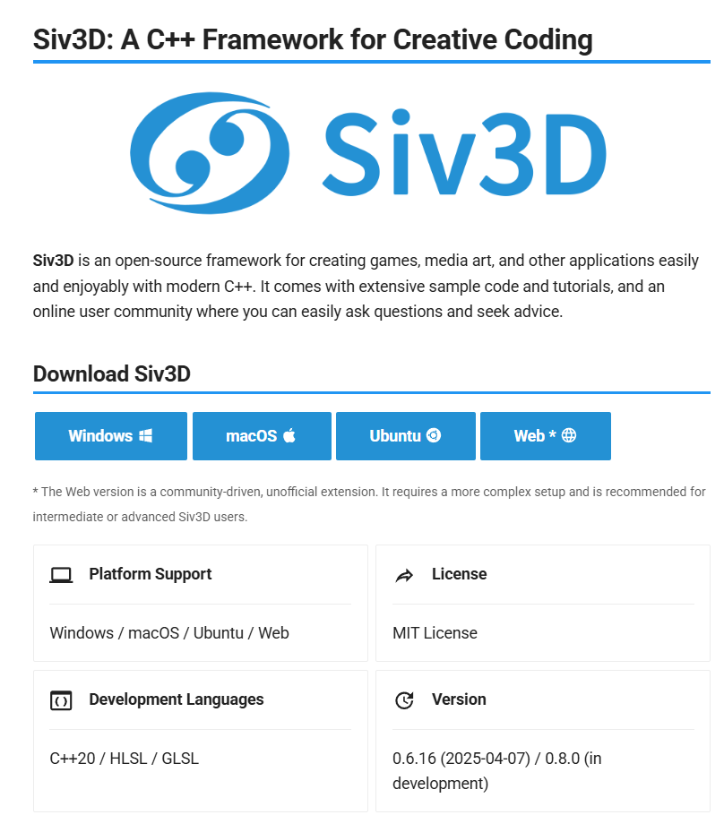
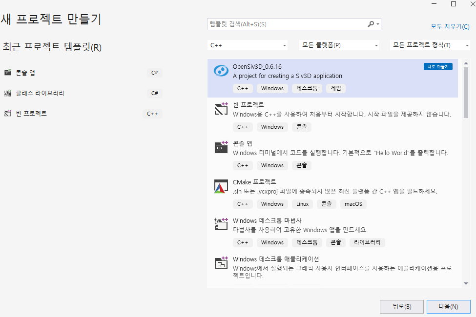
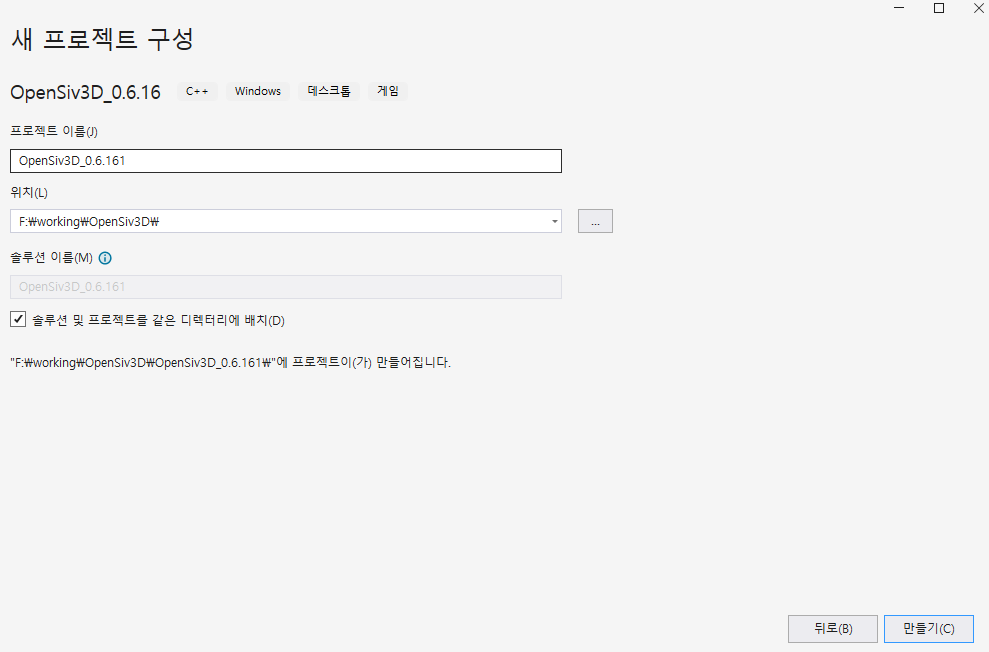
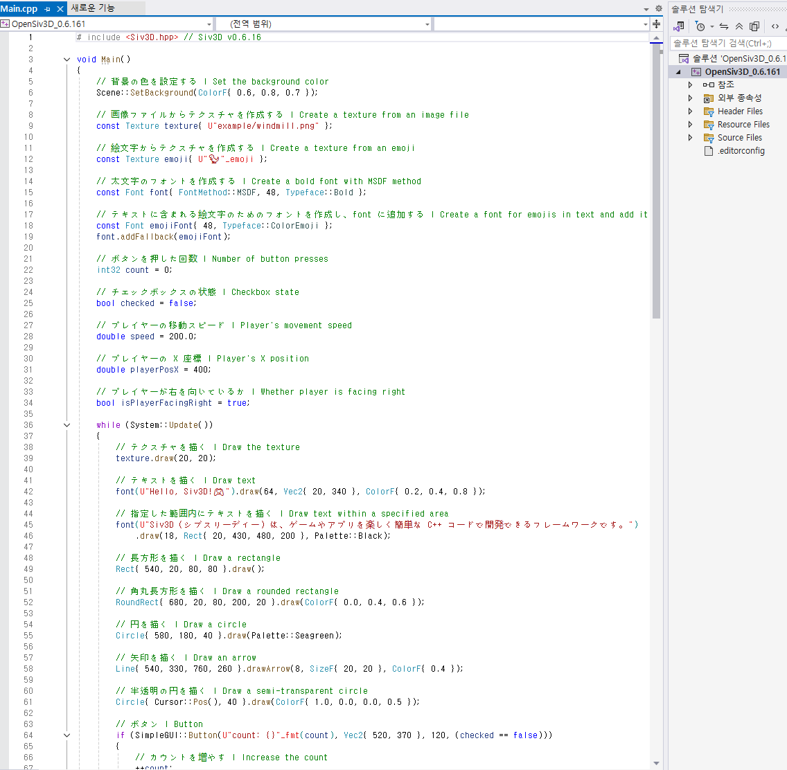
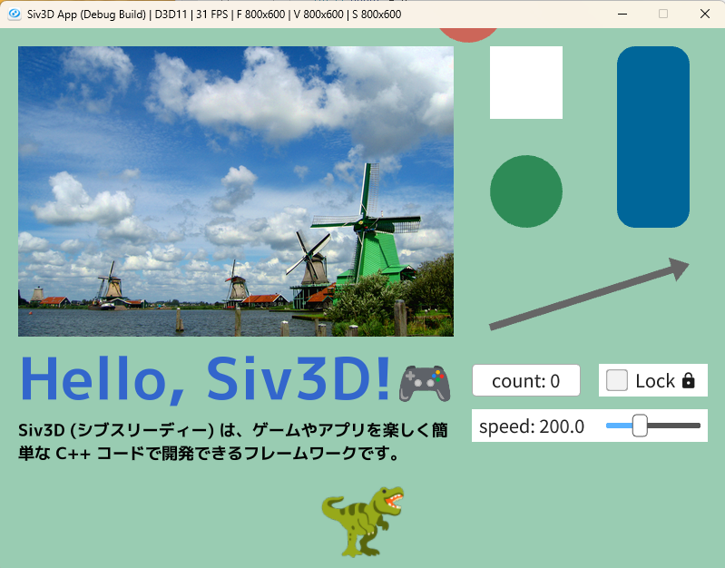
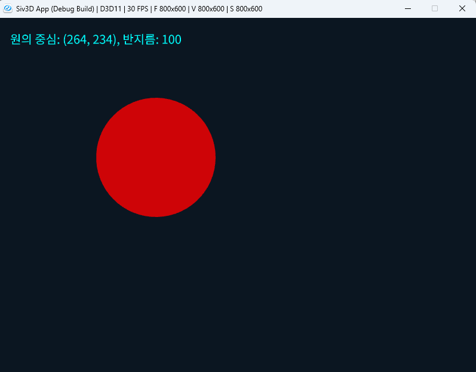
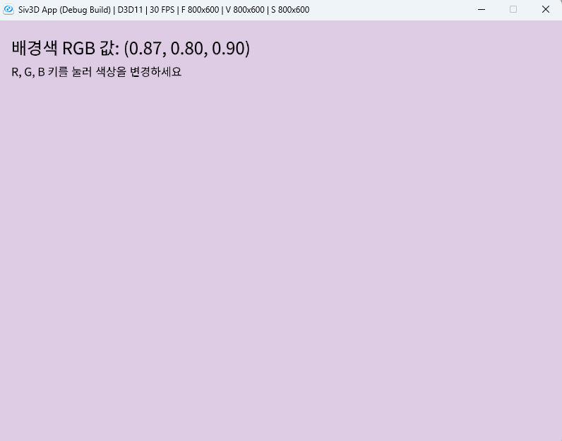
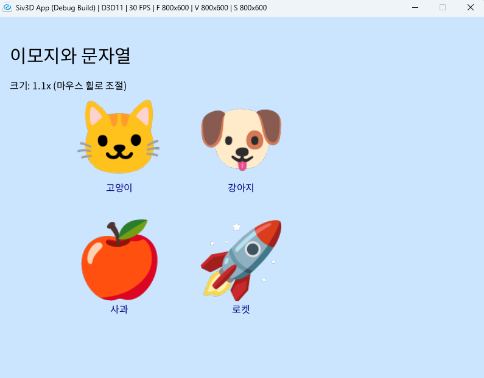

# OpenSiv3D를 이용한 C++ 프로그래밍 학습
  
저자: 최흥배, Claude AI  
  
C++ 프로그래밍 언어를 배우는 것에 중점을 두되, Siv3D 프레임워크를 활용하여 시각적으로 흥미로운 예제를 통해 학습 효과를 높이도록 설계 되었다. 단순한 콘솔 프로그램 대신 그래픽, 소리, 상호작용을 포함한 프로그램을 만들며 C++의 개념을 익힐 수 있다.  
  
필요 소프트웨어:  
- Windows 10 이상
- Visual Studio 2022 이상   
  
-----    
    
# Chapter.01: C++ 기초와 첫 번째 시각적 프로그램
    
## 1.1 C++ 기본 구문과 프로그램 구조
  
### 1.1.1 C++의 main()  
대부분의 C++ 교재는 이런 코드로 시작한다:

```cpp
#include <iostream>
using namespace std;

int main() 
{
    cout << "Hello, World!" << endl;
    return 0;
}
```

물론 이 코드가 틀린 건 아니다. 하지만 솔직히 말해서 재미있지 않다. 검은 콘솔 화면에 글자만 나오는 걸 보고 "와! 프로그래밍 재미있다!"라고 생각할 사람이 몇 명이나 될까?
    
   
### 1.1. 2 OpenSiv3D로 만나는 새로운 시작
OpenSiv3D를 사용하면 첫 프로그램부터 눈을 즐겁게 만들 수 있다:

```cpp
#include <Siv3D.hpp>

void Main() 
{
    while (System::Update()) {
        Circle(Scene::Center(), 100).draw(Palette::Skyblue);
        Print << U"Hello, OpenSiv3D!";
    }
}
```

이 코드를 실행하면 화면 중앙에 하늘색 원이 나타나고, 왼쪽 위에는 "Hello, OpenSiv3D!" 메시지가 출력된다. 벌써 뭔가 만든 것 같은 기분이 들지 않나요?

### 1.1.3 두 가지 Main의 차이점 이해하기

#### 전통적인 C++ main() 함수
```cpp
int main() {
    // 프로그램 시작
    // 순차적으로 코드 실행
    // return 0으로 프로그램 종료
}
```

- **특징**: 위에서 아래로 한 번 실행되고 끝납니다
- **용도**: 간단한 계산, 파일 처리, 알고리즘 구현에 적합합니다
- **한계**: 실시간 상호작용이나 애니메이션을 만들기 어렵습니다

#### OpenSiv3D의 Main() 함수
```cpp
void Main() {
    // 초기화 코드
    
    while (System::Update()) {
        // 매 프레임마다 반복되는 코드
        // 화면 그리기, 입력 처리, 게임 로직 등
    }
    
    // 프로그램 종료 시 정리 코드
}
```  
  
**주요 설명:**
- `#include <Siv3D.hpp>`: 필요한 헤더 파일을 포함합니다.
- `void Main()`: Siv3D에서 사용하는 메인 함수입니다. 일반적인 C++ 프로그램에서는 `int main()`을 사용합니다.
- `while (System::Update())`: 프로그램이 실행되는 동안 계속 반복되는 메인 루프입니다.
  

- **특징**: `while (System::Update())` 루프가 매초 60번 실행된다
- **용도**: 게임, 시각적 애플리케이션, 인터랙티브 프로그램에 적합하다
- **장점**: 사용자 입력에 반응하고 애니메이션을 자연스럽게 만들 수 있다
  

### 1.1.4 왜 OpenSive3D로 하는 것이 더 좋을까?
  
#### 즉시 보이는 결과
전통적인 "Hello World"는 결과를 보기 위해 콘솔을 확인해야 한다. 하지만 OpenSiv3D는 코드를 수정하는 즉시 화면에서 변화를 확인할 수 있다.

#### 자연스러운 프로그래밍 개념 학습
- **변수**: 원의 위치, 크기, 색상으로 표현
- **함수**: 다양한 도형 그리기 함수로 체험
- **조건문**: 마우스 클릭, 키보드 입력에 반응
- **반복문**: 패턴 생성, 애니메이션 구현

#### 창의성과 실험 정신 자극
"이 값을 바꾸면 어떻게 될까?" 하는 궁금증이 자연스럽게 생긴다. 그리고 그 결과를 바로 눈으로 확인할 수 있어서 학습 동기가 계속 유지된다.
  

### 1.1.5 OpenSiv3D
[GitHub](https://github.com/Siv3D/OpenSiv3D)  
  
OpenSiv3D는 일본에서 개발된 오픈소스 C++ 프레임워크이다. 주로 2D/3D 게임 개발, 시각적 프로그래밍, 인터랙티브 아트 제작을 위해 설계되었다.  

**주요 특징:**
- **간편한 문법**: 복잡한 그래픽 프로그래밍을 매우 직관적인 코드로 작성할 수 있습니다
- **크로스 플랫폼**: Windows, macOS, Linux, iOS, Android, Web 등을 지원합니다
- **풍부한 기능**: 2D/3D 그래픽, 오디오, 네트워킹, 물리 엔진, GUI 등이 내장되어 있습니다
- **빠른 프로토타이핑**: 게임 아이디어를 빠르게 구현하고 테스트할 수 있습니다
     
설치는 아래 사이트를 통해서 입수 후 설치한다.  
[Getting Started with Siv3D Programming on Windows](https://siv3d.github.io/en-us/download/windows/ )      

#### OpenSiv3D 프로젝트 생성

1. 위에 링크를 통해서 OpenSiv3D를 설치한다.    
    

2. Visual Studio에서 새 프로젝트 만들기를 윟낟. `C++`을 선택하고 템플릿 중엣허 `OpenSiv3D`를 선택한다.  
   
  
3. 프로젝트 이름과 생성될 위치를 지정한다.    
   
  
4. 새로 생성된 프로젝트에는 기본 코드가 이미 만들어져 있다. 일본에서 만든 라이브러리라서 주석이 일본어로 되어 있다.    
     
  
5. 빌드 후 실행하면 아래와 같은 프로그램이 실행된다.    
       
아마 보통을 C++ 프로그램이라면 이 정도의 UI를 가진 것을 만드려면 많은 코드를 필요로 할 것이다. 그러나 OpenSiv3D를 사용하면 아주 적은 코드로 만들 수 있다.    
  

## 1.2 변수와 데이터 타입
C++에서는 다양한 데이터 타입을 사용할 수 있다. C++23에서는 더 많은 기능이 추가되었지만, 먼저 기본적인 데이터 타입부터 살펴보겠다.

### 기본 데이터 타입

```cpp
int number = 10;            // 정수형 (예: -1, 0, 42)
double decimal = 3.14;      // 부동 소수점 (예: 3.14, -0.01)
float smallDecimal = 2.5f;  // 작은 부동 소수점 (f 접미사 사용)
char letter = 'A';          // 문자 (작은 따옴표 사용)
bool isTrue = true;         // 논리값 (true 또는 false)

// C++11에서 추가된 간결한 초기화 구문
auto autoNumber = 42;       // 타입 추론 (int로 추론됨)
```

### Siv3D에서의 특별한 데이터 타입

```cpp
// 색상 표현
ColorF skyBlue(0.6, 0.8, 1.0);  // RGB 값으로 색상 정의 (각 0.0~1.0)
Color navy(0, 0, 128);          // RGB 값으로 색상 정의 (각 0~255)

// 2D 좌표
Point position(100, 200);       // 정수 좌표 (x, y)
Vec2 smoothPosition(120.5, 230.8); // 부동 소수점 좌표
```
  

## 1.3 연산자
C++은 다양한 연산자를 제공한다.

#### 산술 연산자

```cpp
int a = 10;
int b = 3;

int sum = a + b;        // 덧셈: 13
int difference = a - b; // 뺄셈: 7
int product = a * b;    // 곱셈: 30
int quotient = a / b;   // 나눗셈: 3 (정수 나눗셈은 소수점 버림)
int remainder = a % b;  // 나머지: 1

// 증감 연산자
a++;                    // a를 1 증가: 11
b--;                    // b를 1 감소: 2
```

### 비교 연산자와 논리 연산자

```cpp
bool isEqual = (a == b);     // 같음: false
bool isNotEqual = (a != b);  // 다름: true
bool isGreater = (a > b);    // 크다: true
bool isLess = (a < b);       // 작다: false

bool andResult = (a > 5 && b < 5);  // 논리 AND: true
bool orResult = (a > 20 || b < 5);  // 논리 OR: true
bool notResult = !(a == b);         // 논리 NOT: true
```
  

## 1.4 입출력 기초
Siv3D에서는 시각적 출력이 주요 소통 방식이지만, 기본적인 C++ 입출력도 알아보겠다.

### 표준 C++ 입출력

```cpp
#include <iostream>

// 출력
std::cout << "안녕하세요!" << std::endl;

// 입력
int userInput;
std::cout << "숫자를 입력하세요: ";
std::cin >> userInput;
```

이 코드를 실행하면 콘솔 화면에서 숫자를 입력한다

### Siv3D에서의 입출력

```cpp
// 화면에 텍스트 출력
Font font(30);  // 30 픽셀 크기의 폰트
font.draw("안녕하세요, Siv3D!", 20, 40, Palette::Black);

// 키보드 입력 감지
if (KeyA.down())  // A 키가 눌렸을 때
{
    // 동작 수행
}

// 마우스 입력 감지
if (MouseL.down())  // 왼쪽 마우스 버튼이 눌렸을 때
{
    Vec2 clickPos = Cursor::Pos();  // 마우스 위치 가져오기
}
```
  

## 1.5 Siv3D 활용 예제
아래 예제에서는 변수와 연산자 활용에 대한 부분을 주의 깊게 보기 바란다.
아래 코드를 직접 실행하고 싶다면 OpenSiv3D 프로젝트를 생성한 후 `void Main()` 부분을 아래 코드로 바꾼 후 실행한다.  
  
#### 예제 1: 간단한 원 그리기 프로그램 (기본 변수와 연산자 활용)

```cpp
# include <Siv3D.hpp> // Siv3D v0.6.16

void Main()
{
	// 변수 선언
	int circleX = 400;    // 원의 X 좌표
	int circleY = 300;    // 원의 Y 좌표
	int radius = 100;     // 원의 반지름

	// 색상 정의
	ColorF circleColor(1.0, 0.0, 0.0, 0.8);  // 빨간색 (R, G, B, 투명도)

	const Font font{ FontMethod::SDF, 48, Typeface::CJK_Regular_KR };
	

	while (System::Update())
	{
		// 원 그리기
		Circle(circleX, circleY, radius).draw(circleColor);

		// 텍스트 표시 (좌표와 반지름 정보)
		
		font(U"원의 중심: ({}, {}), 반지름: {}"_fmt(circleX, circleY, radius)).draw(20, 20, 20, Palette::Aqua);

		// 키보드로 원 크기 조절
		if (KeyUp.pressed())   // 위쪽 화살표 키
			radius += 1;       // 반지름 증가

		if (KeyDown.pressed()) // 아래쪽 화살표 키
			radius = Max(10, radius - 1);  // 반지름 감소 (최소값 10으로 제한)

		// 마우스 위치로 원 이동
		if (MouseL.pressed())  // 왼쪽 마우스 버튼이 눌린 상태
		{
			circleX = Cursor::Pos().x;  // 마우스 X 좌표
			circleY = Cursor::Pos().y;  // 마우스 Y 좌표
		}
	}  
}
```  
  
실행 화면  
     
    
이 코드는 **사용자가 키보드와 마우스로 제어할 수 있는 원을 화면에 그리는** 간단한 애플리케이션이다.

#### 1. 초기 설정 및 변수 선언
프로그램의 핵심 로직이 시작되기 전에, 필요한 변수들을 미리 준비하는 부분이다.

```cpp
// 변수 선언
int circleX = 400;      // 원의 X 좌표
int circleY = 300;      // 원의 Y 좌표
int radius = 100;       // 원의 반지름

// 색상 정의
ColorF circleColor(1.0, 0.0, 0.0, 0.8);  // 빨간색 (R, G, B, 투명도)

// 폰트 생성
const Font font{ FontMethod::SDF, 48, Typeface::CJK_Regular_KR };
```

  - **`circleX`, `circleY`, `radius`**: 원의 **위치**와 **크기**를 저장하는 정수(`int`) 변수이다. 이 값들이 바뀌면 화면에 그려지는 원의 모습도 바뀐다.
  - **`circleColor`**: `ColorF`는 0.0부터 1.0 사이의 실수로 색상을 표현하는 자료형이다. `ColorF(1.0, 0.0, 0.0, 0.8)`은 **빨강(R) 100%, 초록(G) 0%, 파랑(B) 0%** 에 **투명도(Alpha) 80%** 를 의미하는 반투명한 빨간색을 만든다.
  - **`font`**: 화면에 글자를 표시하기 위한 `Font` 객체를 생성한다.
      - `const`: 폰트는 한 번만 만들고 바꾸지 않을 것이므로 `const`로 선언하여 최적화한다.
      - `FontMethod::SDF`: 텍스트를 확대해도 깨지지 않고 선명하게 보여주는 고품질 렌더링 방식(Signed Distance Field)을 사용한다.
      - `48`: 폰트의 기본 크기를 48픽셀로 지정한다.
      - `Typeface::CJK_Regular_KR`: 한글을 포함한 CJK(중국, 일본, 한국) 문자를 제대로 표시하기 위해 내장된 한국어 기본 글꼴을 사용하도록 지정한다.

#### 2. 메인 루프: `while (System::Update())`
Siv3D 애플리케이션의 심장과 같은 부분이다. 이 `while` 루프는 사용자가 창을 닫기 전까지 **1초에 60번(기본값) 반복 실행**된다. 매 프레임마다 화면을 새로 그리고, 사용자 입력을 확인하는 모든 작업이 이 안에서 이루어진다.

```cpp
while (System::Update())
{
    // (루프 안의 모든 코드는 매 프레임마다 실행됩니다)
}
```

#### 3. 화면 그리기 (렌더링)
매 프레임마다 현재 변수 값을 바탕으로 원과 텍스트를 화면에 그린다.

```cpp
// 원 그리기
Circle(circleX, circleY, radius).draw(circleColor);

// 텍스트 표시 (좌표와 반지름 정보)
font(U"원의 중심: ({}, {}), 반지름: {}"_fmt(circleX, circleY, radius)).draw(20, 20, Palette::Aqua);
```

  - **`Circle(circleX, circleY, radius)`**: 현재 `circleX`, `circleY` 위치에 `radius` 크기를 가진 `Circle` 객체를 **임시로 생성**한다.
  - **.draw(circleColor)**: 위에서 생성한 `Circle` 객체를 `circleColor` (반투명 빨강)로 화면에 그리라는 명령어이다.
  - **`font(...)`**: 미리 만들어 둔 `font` 객체를 사용하여 텍스트를 준비한다.
      - `U"..."`: 문자열 앞에 `U`를 붙여 한글과 같은 유니코드 문자를 처리하도록 한다.
      - `_fmt(circleX, circleY, radius)`: 문자열 안의 `{}` 부분에 `circleX`, `circleY`, `radius` 변수의 현재 값을 순서대로 채워 넣어 최종 문자열을 만든다. 매우 편리한 Siv3D의 서식 기능이다.
      - **.draw(20, 20, Palette::Aqua)**: 완성된 텍스트를 화면의 **x=20, y=20** 위치에 `Palette::Aqua`(아쿠아색)으로 그린다.

#### 4. 사용자 입력 처리
키보드와 마우스 입력에 따라 변수 값을 변경하여 원의 상태를 업데이트한다.

##### **키보드 입력 (크기 조절)**

```cpp
// 키보드로 원 크기 조절
if (KeyUp.pressed())   // 위쪽 화살표 키
    radius += 1;       // 반지름 증가

if (KeyDown.pressed()) // 아래쪽 화살표 키
    radius = Max(10, radius - 1);  // 반지름 감소 (최소값 10으로 제한)
```

  - **`KeyUp.pressed()`**: 위쪽 화살표 키가 **눌리고 있는 동안** 계속 `true`를 반환합니다. 키가 눌리면 `radius` 변수 값이 1씩 증가하여 원이 커진다.
  - **`KeyDown.pressed()`**: 아래쪽 화살표 키가 눌리고 있는 동안 `radius`를 1씩 감소시킨다.
  - **`Max(10, radius - 1)`**: `radius`가 무한정 작아지는 것을 막는 안전장치이다. `radius - 1`의 결과가 10보다 작아지면, 대신 10을 선택하여 **반지름의 최솟값을 10으로 유지**한다.

##### **마우스 입력 (위치 이동)**

```cpp
// 마우스 위치로 원 이동
if (MouseL.pressed())  // 왼쪽 마우스 버튼이 눌린 상태
{
    circleX = Cursor::Pos().x;  // 마우스 X 좌표
    circleY = Cursor::Pos().y;  // 마우스 Y 좌표
}
```

  - **`MouseL.pressed()`**: 마우스 왼쪽 버튼이 **눌리고 있는 동안** `true`를 반환한다.
  - **`Cursor::Pos()`**: 현재 마우스 커서의 화면상 위치를 `Point` 형식(x, y 좌표를 가짐)으로 가져온다.
  - `circleX = Cursor::Pos().x;`: 왼쪽 버튼이 눌려 있는 동안, 원의 중심 X좌표(`circleX`)를 현재 마우스의 X좌표로 계속 업데이트한다. Y좌표도 마찬가지이다. 이 때문에 사용자는 원을 클릭하고 드래그하는 것처럼 보이게 된다. 🖱️  
  

### 예제 2: 배경색 변경하기 (변수와 RGB 값 이해)

```cpp
#include <Siv3D.hpp>

void Main()
{
	// RGB 색상 변수 (각 0.0~1.0 범위)
	double r = 0.7;  // 빨간색 성분
	double g = 0.8;  // 초록색 성분
	double b = 0.9;  // 파란색 성분

	const Font font{ FontMethod::SDF, 24, Typeface::CJK_Regular_KR };

	while (System::Update())
	{
		// 현재 RGB 값으로 배경색 설정
		Scene::SetBackground(ColorF(r, g, b));

		// 현재 RGB 값 표시
		font(U"배경색 RGB 값: ({:.2f}, {:.2f}, {:.2f})"_fmt(r, g, b)).draw(24, 20, 20, Palette::Black);

		// 설명 텍스트
		font(U"R, G, B 키를 눌러 색상을 변경하세요").draw(16, 20, 60, Palette::Black);

		// 키보드로 RGB 값 조절
		if (KeyR.pressed())  // R 키
			r = Min(1.0, r + 0.01);  // 빨간색 증가 (최대 1.0)

		if (KeyShift.pressed() && KeyR.pressed())  // Shift + R 키
			r = Max(0.0, r - 0.01);  // 빨간색 감소 (최소 0.0)

		if (KeyG.pressed())  // G 키
			g = Min(1.0, g + 0.01);  // 초록색 증가

		if (KeyShift.pressed() && KeyG.pressed())  // Shift + G 키
			g = Max(0.0, g - 0.01);  // 초록색 감소

		if (KeyB.pressed())  // B 키
			b = Min(1.0, b + 0.01);  // 파란색 증가

		if (KeyShift.pressed() && KeyB.pressed())  // Shift + B 키
			b = Max(0.0, b - 0.01);  // 파란색 감소

		// 스페이스바를 누르면 랜덤 색상으로 변경
		if (KeySpace.down())
		{
			r = Random(0.0, 1.0);  // 랜덤 빨간색 성분
			g = Random(0.0, 1.0);  // 랜덤 초록색 성분
			b = Random(0.0, 1.0);  // 랜덤 파란색 성분
		}
	}
}
```
  
실행 화면  
     
   
이 코드는 사용자가 키보드로 R, G, B 값을 직접 조작하여 창의 배경색을 실시간으로 변경하는 프로그램이다.   

#### 1. 초기 설정 및 변수 선언
`Main` 함수가 시작될 때, 프로그램에 필요한 기본 변수들을 설정하는 부분이다.

```cpp
// RGB 색상 변수 (각 0.0~1.0 범위)
double r = 0.7;  // 빨간색 성분
double g = 0.8;  // 초록색 성분
double b = 0.9;  // 파란색 성분

const Font font{ FontMethod::SDF, 24, Typeface::CJK_Regular_KR };
```

  - **`double r, g, b`**: 배경색을 구성하는 **빨강(Red), 초록(Green), 파랑(Blue)** 값을 저장할 변수이다. Siv3D의 `ColorF`에서는 각 색상 값을 `0.0` (전혀 없음)부터 `1.0` (가득 참) 사이의 실수(`double`)로 표현한다. 코드는 연한 회색에 가까운 색으로 시작한다.
  - **`const Font font{...}`**: 화면에 현재 색상 값과 안내 문구를 표시하기 위한 `Font` 객체를 생성한다. 이 객체는 한 번만 생성되어 프로그램 내내 재사용된다.

#### 2. 메인 루프: `while (System::Update())`
애플리케이션의 핵심 부분으로, 창이 닫히기 전까지 매 프레임(보통 1초에 60번) 반복 실행된다. 모든 실시간 변경 사항은 이 루프 안에서 처리된다.

#### 3. 화면 업데이트
매 프레임마다 현재 `r, g, b` 변수 값을 이용해 배경색을 다시 칠하고, 화면에 정보를 출력한다.

```cpp
// 현재 RGB 값으로 배경색 설정
Scene::SetBackground(ColorF(r, g, b));

// 현재 RGB 값 표시
font(U"배경색 RGB 값: ({:.2f}, {:.2f}, {:.2f})"_fmt(r, g, b))
    .draw(24, 20, 20, Palette::Black);

// 설명 텍스트
font(U"R, G, B 키를 눌러 색상을 변경하세요")
    .draw(16, 20, 60, Palette::Black);
```

  - **`Scene::SetBackground(...)`**: 현재 프레임의 배경색을 `ColorF(r, g, b)`로 설정합니다. `r, g, b` 값이 계속 바뀌므로 배경색이 실시간으로 변하게 된다. 🎨
  - **`font(...).draw(...)`**: 텍스트를 그리는 부분이다.
      - 첫 번째 `draw`는 현재 `r, g, b` 값을 소수점 둘째 자리까지(`{:.2f}`) 형식에 맞춰 화면에 출력한다. 이때 기본 폰트 크기인 `24`를 사용한다.
      - 두 번째 `draw`는 사용자에게 조작법을 안내하는 텍스트를 그린다. 이 텍스트는 조금 더 작은 크기인 `16`으로 그려진다. 이처럼 `draw` 함수에 크기를 지정하면 `Font` 객체 생성 시 지정했던 기본 크기를 일시적으로 무시하고 다른 크기로 텍스트를 그릴 수 있다.
  
#### 4. 키보드 입력 처리 ⌨️
사용자의 키보드 입력에 따라 `r, g, b` 변수 값을 조작한다.

```cpp
// 'R' 키와 'Shift + R' 키 처리
if (KeyR.pressed())
    r = Min(1.0, r + 0.01);  // 빨간색 증가 (최대 1.0)

if (KeyShift.pressed() && KeyR.pressed())
    r = Max(0.0, r - 0.01);  // 빨간색 감소 (최소 0.0)

// (G, B 키도 동일한 방식으로 처리)
```

  - **`.pressed()`**: 키가 **눌리고 있는 동안** 계속 `true`를 반환한다. 키를 누르고 있으면 해당 색상 값이 매 프레임마다 계속해서 증가하거나 감소한다.
  - **`Min(1.0, r + 0.01)`**: `r` 값을 `0.01` 만큼 증가시키되, 그 결과가 `1.0`을 넘으면 `1.0`을 선택한다. 즉, 색상 값의 **최댓값을 1.0으로 제한**하는 역할을 한다.
  - **`Max(0.0, r - 0.01)`**: `r` 값을 `0.01` 만큼 감소시키되, 그 결과가 `0.0`보다 작아지면 `0.0`을 선택한다. **최솟값을 0.0으로 제한**하는 역할이다.
  - **`KeyShift.pressed() && Key...`**: `&&` (AND) 연산자는 두 조건이 **모두 참일 때만** 전체를 참으로 만든다. 따라서 `Shift` 키와 다른 키(`R`, `G`, `B`)를 **동시에 누르고 있을 때**만 색상 값이 감소한다.  
  
#### 5. 랜덤 색상 변경
스페이스바를 눌렀을 때 배경색을 무작위로 변경하는 기능이다.   

```cpp
// 스페이스바를 누르면 랜덤 색상으로 변경
if (KeySpace.down())
{
    r = Random(0.0, 1.0);  // 랜덤 빨간색 성분
    g = Random(0.0, 1.0);  // 랜덤 초록색 성분
    b = Random(0.0, 1.0);  // 랜덤 파란색 성분
}
```
  
  - **`.down()`**: `.pressed()`와 달리, 키가 **처음 눌리는 단 한 프레임에만** `true`를 반환한다. 이 때문에 스페이스바를 길게 눌러도 색상이 한 번만 바뀐다.
  - **`Random(0.0, 1.0)`**: `0.0`과 `1.0` 사이의 무작위 실수를 생성하는 Siv3D의 편리한 함수이다. 스페이스바를 누를 때마다 `r, g, b` 변수에 각각 새로운 난수가 할당되어 완전히 다른 색상이 만들어진다.    
  
      
### 예제 3: 이모지 표시하기 (문자와 문자열 이해)

```cpp
#include <Siv3D.hpp>

void Main()
{
	// 기본 배경색 설정
	Scene::SetBackground(ColorF(0.8, 0.9, 1.0));

	// 폰트 객체를 미리 생성 (가장 중요한 수정 사항)
	const Font font30{ 30, Typeface::CJK_Regular_KR };
	const Font font16{ 16, Typeface::CJK_Regular_KR };

	// 이모지 텍스처 생성
	const Texture emoji1{ U"🐱"_emoji };    // 고양이 이모지
	const Texture emoji2{ U"🐶"_emoji };    // 강아지 이모지
	const Texture emoji3{ U"🍎"_emoji };    // 사과 이모지
	const Texture emoji4{ U"🚀"_emoji };    // 로켓 이모지

	// 이모지 위치 변수
	Point pos1(200, 200);
	Point pos2(400, 200);
	Point pos3(200, 400);
	Point pos4(400, 400);

	// 이모지 크기
	double scale = 1.0;

	while (System::Update())
	{
		// 제목 표시 (미리 생성한 font30 객체 사용)
		font30(U"이모지와 문자열").draw(20, 40, Palette::Black);

		// 이모지 그리기 (위치와 크기 적용)
		emoji1.scaled(scale).drawAt(pos1);
		emoji2.scaled(scale).drawAt(pos2);
		emoji3.scaled(scale).drawAt(pos3);
		emoji4.scaled(scale).drawAt(pos4);

		// 이모지 아래에 설명 텍스트 표시 (미리 생성한 font16 객체 사용 및 drawAt으로 중앙 정렬)
		font16(U"고양이").drawAt(pos1.x, pos1.y + 80, Palette::Navy);
		font16(U"강아지").drawAt(pos2.x, pos2.y + 80, Palette::Navy);
		font16(U"사과").drawAt(pos3.x, pos3.y + 80, Palette::Navy);
		font16(U"로켓").drawAt(pos4.x, pos4.y + 80, Palette::Navy);

		// 마우스 휠로 이모지 크기 조절
		scale += Mouse::Wheel() * 0.1;
		scale = Clamp(scale, 0.5, 3.0);    // 크기 범위 제한 (0.5 ~ 3.0)

		// 현재 크기 정보 표시 (미리 생성한 font16 객체 사용)
		font16(U"크기: {:.1f}x (마우스 휠로 조절)"_fmt(scale)).draw(20, 100, Palette::Black);

		// 마우스로 이모지와 상호작용
		if (emoji1.scaled(scale).regionAt(pos1).mouseOver())
		{
			Cursor::RequestStyle(CursorStyle::Hand);
		}

		if (emoji1.scaled(scale).regionAt(pos1).leftClicked())
		{
			pos1 = Cursor::Pos();    // 클릭하면 이모지 위치 이동
		}

		// 다른 이모지들에 대해서도 같은 방식으로 상호작용 가능
		// (예제에서는 첫 번째 이모지만 이동 가능하도록 구현)
	}
}
```

실행 화면  
     
    
이 코드는 **화면에 여러 개의 이모지를 보여주고, 사용자가 마우스로 크기를 조절하거나 위치를 옮길 수 있는** 간단한 인터랙티브 프로그램이다.


#### 1. 재료 준비 (프로그램 시작 시 한 번만 실행)
요리를 시작하기 전에 재료를 다듬고 도구를 꺼내놓는 것처럼, 이 프로그램도 반복 작업을 시작하기 전에 필요한 모든 것을 미리 준비한다. 이 코드는 `Main` 함수가 시작되고 `while` 문을 만나기 전까지의 부분이다.

```cpp
// 기본 배경색 설정
Scene::SetBackground(ColorF(0.8, 0.9, 1.0));

// 폰트 객체를 미리 생성
const Font font30{ 30, Typeface::CJK_Regular_KR };
const Font font16{ 16, Typeface::CJK_Regular_KR };

// 이모지 텍스처 생성
const Texture emoji1{ U"🐱"_emoji };    // 고양이 이모지
const Texture emoji2{ U"🐶"_emoji };    // 강아지 이모지

// 이모지 위치 변수
Point pos1(200, 200);
Point pos2(400, 200);
// ...

// 이모지 크기
double scale = 1.0;
```

  - **`Scene::SetBackground(...)`**: 그림을 그릴 도화지의 배경색을 연한 하늘색으로 칠한다. `ColorF`는 빛의 삼원색(빨강, 초록, 파랑)을 섞어서 색을 만든다.
  - **`const Font font...`**: 화면에 글씨를 쓰기 위한 '글씨체 붓'을 미리 준비하는 과정이다. 🎨
      - `30`, `16`은 붓의 크기(글자 크기)를 의미한다.
      - `Typeface::CJK_Regular_KR`은 **한글이 깨지지 않도록** 한국어 글씨체를 사용하라고 알려주는 부분이다.
      - **가장 중요한 점\!** 붓을 매번 새로 만들지 않고 처음에 두 개(`font30`, `font16`)를 만들어두고 계속 재사용할 것이다. 이게 훨씬 효율적이다.
  - **`const Texture emoji...`**: 화면에 그릴 '이모지 그림'들을 준비한다. `U"🐱"_emoji`처럼 코드에 직접 이모지를 넣으면 Siv3D가 알아서 그림으로 바꿔주는 편리한 기능이다.
  - **`Point pos...`**: 각 이모지가 화면 어디에 위치할지 X, Y 좌표를 저장하는 '위치 기억상자'이다. 예를 들어 `pos1(200, 200)`은 화면 왼쪽에서 200px, 위쪽에서 200px 떨어진 곳을 의미한다.
  - **`double scale = 1.0;`**: 이모지의 크기를 조절하기 위한 '배율' 변수이다. `1.0`은 100% 크기, 즉 원래 크기를 의미한다.
  
#### 2. 계속 반복하기 (메인 루프)
이제 모든 재료 준비가 끝났으니, 프로그램이 꺼지기 전까지 `while (System::Update())` 안의 코드를 1초에 60번씩 계속해서 반복 실행한다. 매번 새로운 그림을 그린다고 생각하면 쉽다.

##### **2-1. 화면에 그리기**
매 반복마다 현재 상태에 맞게 제목, 이모지, 설명 글을 도화지에 그려 넣는다.

```cpp
// 제목 표시
font30(U"이모지와 문자열").draw(20, 40, Palette::Black);

// 이모지 그리기
emoji1.scaled(scale).drawAt(pos1);
// ...

// 이모지 아래에 설명 텍스트 표시
font16(U"고양이").drawAt(pos1.x, pos1.y + 80, Palette::Navy);
// ...
```

  - **`font30(...).draw(...)`**: 아까 만들어 둔 `font30` (큰 붓)으로 제목을 화면 (20, 40) 위치에 검은색으로 그린다.
  - **`emoji1.scaled(scale).drawAt(pos1)`**: 이 한 줄은 세 가지 동작을 순서대로 한다.
    1.  `emoji1`: 고양이 그림을 선택하고,
    2.  `.scaled(scale)`: 현재 `scale` 변수 값에 맞춰 크기를 조절한 **복사본**을 만들고,
    3.  `.drawAt(pos1)`: 그 복사본을 `pos1` 위치의 중앙에 맞춰 그린다.
  - **`font16(...).drawAt(...)`**: `font16` (작은 붓)으로 이모지 아래에 설명 글을 그린다. `pos1.y + 80`은 이모지 중심보다 80px 아래에 그리라는 뜻이다.
  
##### **2-2. 사용자 입력 확인하고 값 바꾸기**
사용자가 마우스를 어떻게 움직이는지 확인하고, 그에 따라 `scale`이나 `pos1` 같은 변수 값을 변경한다.

```cpp
// 마우스 휠로 이모지 크기 조절
scale += Mouse::Wheel() * 0.1;
scale = Clamp(scale, 0.5, 3.0);

// 현재 크기 정보 표시
font16(U"크기: {:.1f}x (마우스 휠로 조절)"_fmt(scale)).draw(20, 100, Palette::Black);

// 마우스로 이모지와 상호작용
if (emoji1.scaled(scale).regionAt(pos1).mouseOver())
{
    Cursor::RequestStyle(CursorStyle::Hand);
}

if (emoji1.scaled(scale).regionAt(pos1).leftClicked())
{
    pos1 = Cursor::Pos();    // 클릭하면 이모지 위치 이동
}
```

  - **`Mouse::Wheel()`**: 마우스 휠을 위로 굴리면 양수(+), 아래로 굴리면 음수(-) 값을 돌려준다. 아무것도 안 하면 0 이다. 여기에 `0.1`을 곱해서 `scale` 값을 조금씩 바꾸어 크기를 부드럽게 조절한다.
  - **`Clamp(scale, 0.5, 3.0)`**: `scale` 값이 너무 작아지거나(0.5배 미만) 너무 커지는(3배 초과) 것을 막는 **안전장치**이다.
  - **`_fmt(scale)`**: 글자 중간에 `{:.1f}` 부분을 현재 `scale` 변수의 값(소수점 첫째 자리까지)으로 바꿔치기해서 보여주는 기능이다.
  - **`.mouseOver()`**: 마우스 커서가 현재 고양이 이모지 그림 영역 위에 올라와 있는지 검사한다.
  - **`Cursor::RequestStyle(...)`**: 만약 마우스가 이모지 위에 있다면, 마우스 커서 모양을 화살표(←)에서 손가락 모양(👆)으로 바꿔서 "이건 클릭할 수 있어요\!"라고 알려준다.
  - **`.leftClicked()`**: 사용자가 이모지 위에서 마우스 왼쪽 버튼을 **클릭하는 순간**을 감지한다.
  - **`pos1 = Cursor::Pos()`**: 클릭했다면, 고양이의 위치(`pos1`)를 현재 마우스 커서의 위치(`Cursor::Pos()`)로 순간 이동시킨다. (만약 `.pressed()`를 사용하면 누르고 있는 동안 계속 따라다니게 만들 수도 있다!)  
  

---    

## 1.6 학습 과제
1. **원 이동 애니메이션 만들기**: 키보드 방향키로 원을 매끄럽게 움직이는 프로그램을 작성해보세요.
2. **그라데이션 배경 만들기**: 시간에 따라 자동으로 배경색이 변하는 프로그램을 작성해보세요.
3. **이모지 게임 만들기**: 랜덤하게 등장하는 이모지를 클릭하는 간단한 게임을 만들어보세요.
  

## 1.7 C++ 기초 이론 정리
- **변수(Variable)**: 데이터를 저장하는 메모리 공간. 데이터 타입에 따라 저장할 수 있는 값이 달라집니다.
- **식별자(Identifier)**: 변수, 함수, 클래스 등의 이름. C++에서는 알파벳, 숫자, 언더스코어(_)로 구성되며 첫 글자는 숫자가 될 수 없습니다.
- **연산자(Operator)**: 특정 연산을 수행하는 기호. 산술 연산자(+, -, *, /, %), 비교 연산자(==, !=, >, <, >=, <=), 논리 연산자(&&, ||, !) 등이 있습니다.
- **표현식(Expression)**: 값으로 평가될 수 있는 코드 조각. 예: `a + b * 2`
- **문장(Statement)**: 프로그램의 기본 실행 단위. 세미콜론(;)으로 끝납니다.
- **주석(Comment)**: 코드에 설명을 추가하는 방법. `//` 또는 `/* */`를 사용합니다.

이 단계를 마치면 C++의 기초 문법과 Siv3D를 이용한 시각적 프로그래밍의 기초를 배우게 됩니다. 다음 단계에서는 조건문, 반복문, 함수를 배우면서 더 복잡한 프로그램을 만들어 볼 것입니다.  

